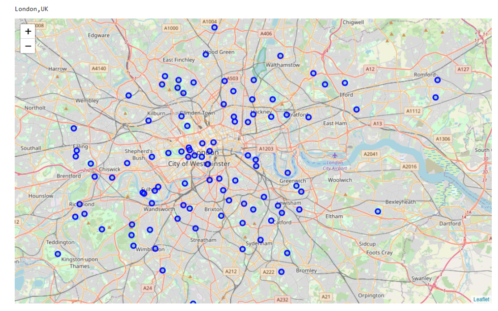
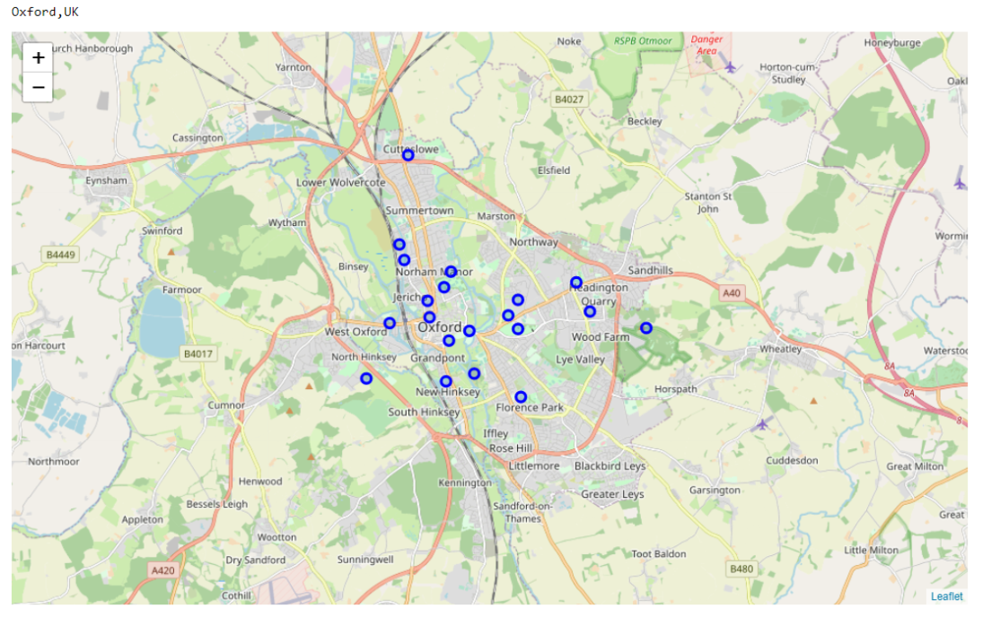
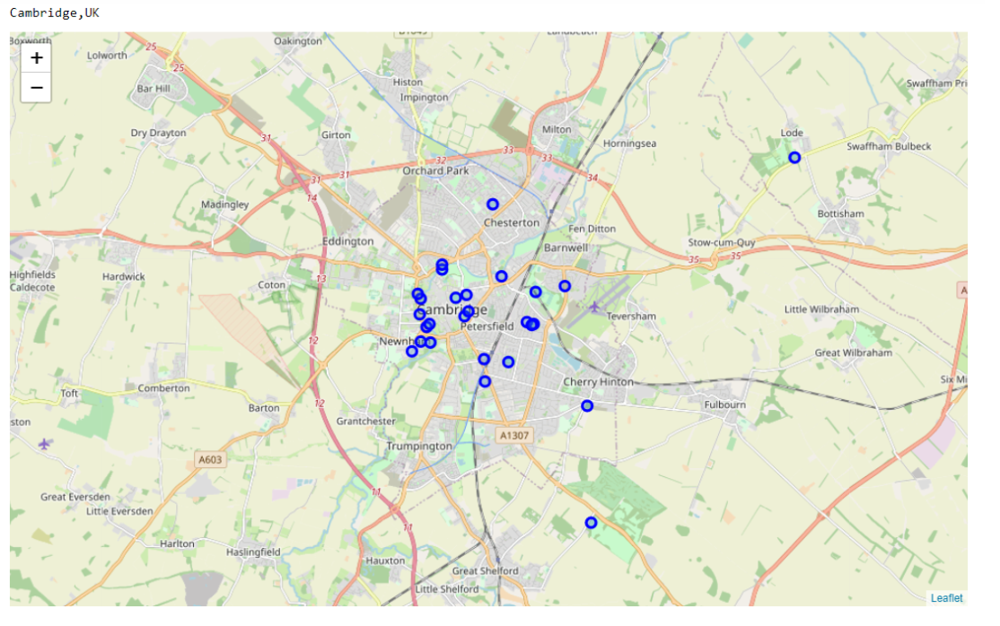
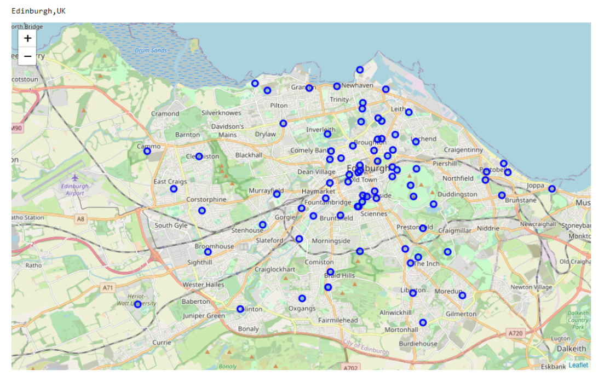
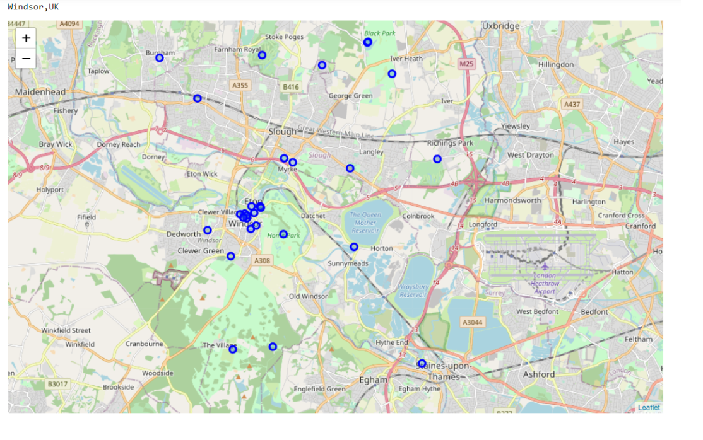
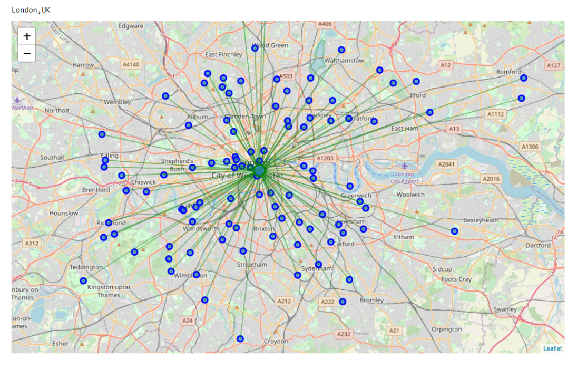
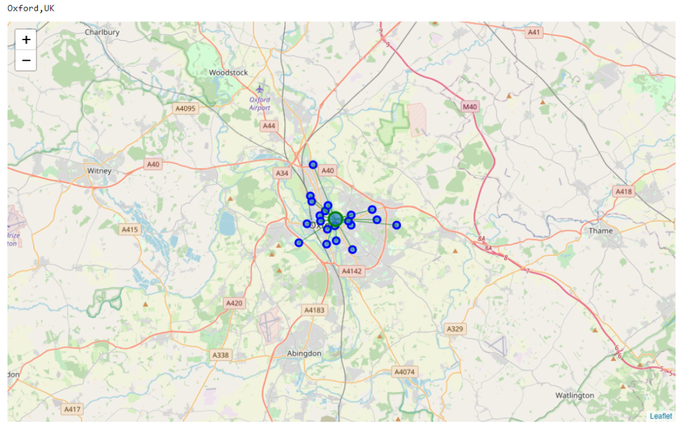
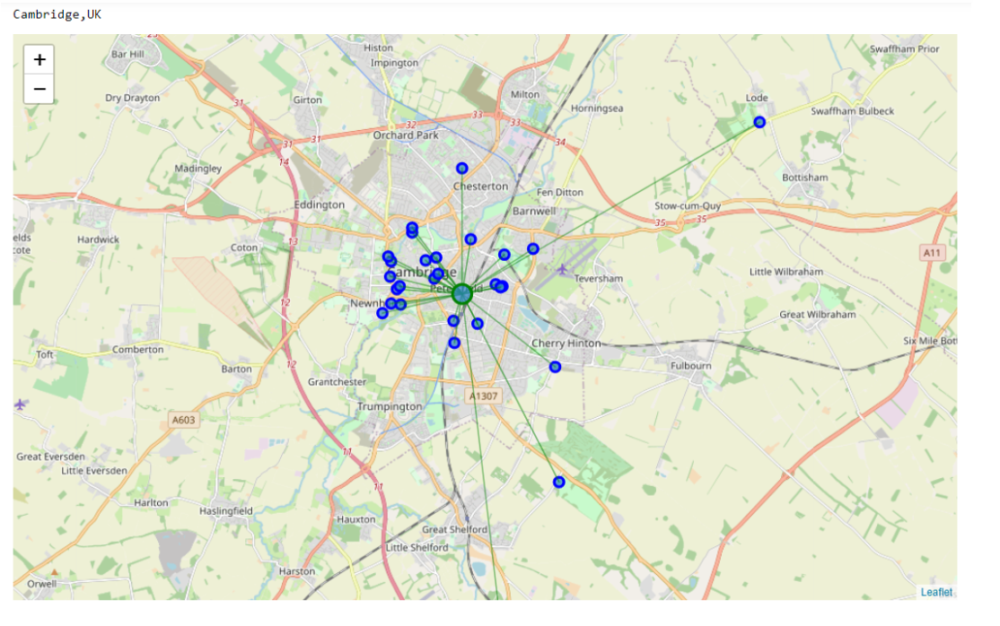
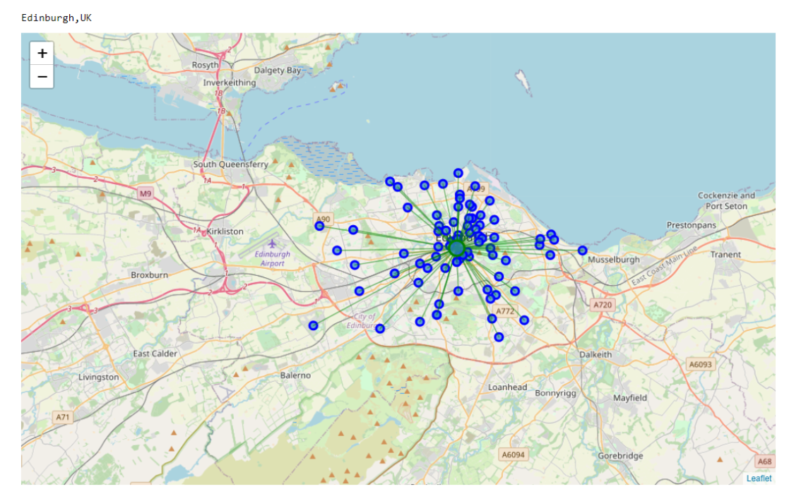
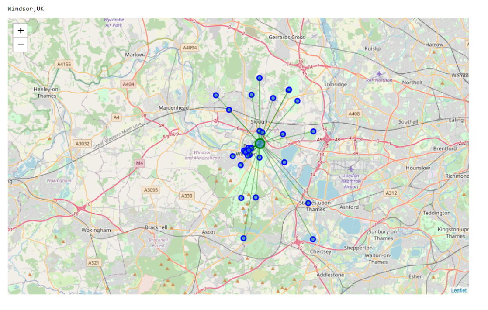

# WEEK-5 - CODE FINAL CAPSTONE - The-Battle-of-Neighborhoods

# PROJECT NAME - RUNNERS PARADISE

### UNITED KINGDOM HAS ONE OF THE SCENIC PARKS. THIS PROJECT TRIES TO IDENTIFY THE CLOSEST RUNNING PARKS FOR A MARATHON RUNNER TO PRATICE IN 5 CITIES(LONDON , OXFORD, CAMBRIDGE, EDINBURGH AND WINDSOR) IN UK

## IMPORT THE REQUIRED LIBRARIES


```python
import numpy as np 
import pandas as pd 
pd.set_option('display.max_columns', 100)
pd.set_option('display.max_rows', 100)
import requests 
from pandas.io.json import json_normalize
import folium 

```

## ENTER THE CREDENTIALS FOR FOURSQUARE API


```python
CLIENT_ID = '' #-> CLIENT ID IS MENTIONED HERE
CLIENT_SECRET = '' #-> CLIENT SECRET IS MENTIONED HERE
VERSION = '20180605' # Foursquare API version

print('Your credentails:')
print('CLIENT_ID: ' + CLIENT_ID)
```

    Your credentails:
    CLIENT_ID: L5MDTW1EULZMSGWLTACFLB0TPRVMCQNJVTKEVEUTGCUB5YNL
    

## FETCH THE RESPECTIVE PARK VALUES FOR LONDON , OXFORD, CAMBRIDGE, EDINBURGH AND WINDSOR


```python
# type your answer here
LIMIT = 300
cities = ["London,UK", 'Oxford,UK', 'Cambridge,UK', 'Edinburgh,UK', 'Windsor,UK']

results = {}
for city in cities:
    url = 'https://api.foursquare.com/v2/venues/explore?&client_id={}&client_secret={}&v={}&near={}&limit={}&categoryId={}'.format(
        CLIENT_ID, 
        CLIENT_SECRET, 
        VERSION, 
        city,
        LIMIT,
        "4bf58dd8d48988d163941735") # CATEGORIES CAN BE FOUND IN FOURSQUAR WEBPAGE https://developer.foursquare.com/docs/build-with-foursquare/categories/
    results[city] = requests.get(url).json()
    
```

## Normalize semi-structured JSON data into a flat table.


```python
appended_data = []
df_venues={}
for city in cities:
    venues= pd.json_normalize(results[city]['response']['groups'][0]['items'])
    #venues = json_normalize(results[city]['response']['groups'][0]['items'])
    df_venues[city] = venues[['venue.name', 'venue.location.address', 'venue.location.lat', 'venue.location.lng']]
    df_venues[city].columns = ['Name', 'Address', 'Lat', 'Lng']
#df_venues[city].head(100)
    appended_data = pd.concat(df_venues)
appended_data
appended_data.to_csv('Runners_Paradise.csv')
```


```python
maps = {}
for city in cities:
    city_lat = np.mean([results[city]['response']['geocode']['geometry']['bounds']['ne']['lat'],
                        results[city]['response']['geocode']['geometry']['bounds']['sw']['lat']])
    city_lng = np.mean([results[city]['response']['geocode']['geometry']['bounds']['ne']['lng'],
                        results[city]['response']['geocode']['geometry']['bounds']['sw']['lng']])
    maps[city] = folium.Map(location=[city_lat, city_lng], zoom_start=9)

    # add markers to map
    for lat, lng, label in zip(df_venues[city]['Lat'], df_venues[city]['Lng'], df_venues[city]['Name']):
        label = folium.Popup(label, parse_html=True)
        folium.CircleMarker(
            [lat, lng],
            radius=5,
            popup=label,
            color='blue',
            fill=True,
            fill_color='#3186cc',
            fill_opacity=0.3,
            parse_html=False).add_to(maps[city])
    
    print(f"Parks in  {city} = ", results[city]['response']['totalResults'])
    
```

    Parks in  London,UK =  319
    Parks in  Oxford,UK =  31
    Parks in  Cambridge,UK =  46
    Parks in  Edinburgh,UK =  92
    Parks in  Windsor,UK =  33
    


```python
print(cities[0])
maps[cities[0]]

```

    London,UK
    


<div style="width:100%;"><div style="position:relative;width:100%;height:0;padding-bottom:60%;"><iframe src="about:blank" style="position:absolute;width:100%;height:100%;left:0;top:0;border:none !important;" data-html=PCFET0NUWVBFIGh0bWw+CjxoZWFkPiAgICAKICAgIDxtZXRhIGh0dHAtZXF1aXY9ImNvbnRlbnQtdHlwZSIgY29udGVudD0idGV4dC9odG1sOyBjaGFyc2V0PVVURi04IiAvPgogICAgPHNjcmlwdD5MX1BSRUZFUl9DQU5WQVMgPSBmYWxzZTsgTF9OT19UT1VDSCA9IGZhbHNlOyBMX0RJU0FCTEVfM0QgPSBmYWxzZTs8L3NjcmlwdD4KICAgIDxzY3JpcHQgc3JjPSJodHRwczovL2Nkbi5qc2RlbGl2ci5uZXQvbnBtL2xlYWZsZXRAMS4yLjAvZGlzdC9sZWFmbGV0LmpzIj48L3NjcmlwdD4KICAgIDxzY3JpcHQgc3JjPSJodHRwczovL2FqYXguZ29vZ2xlYXBpcy5jb20vYWpheC9saWJzL2pxdWVyeS8xLjExLjEvanF1ZXJ5Lm1pbi5qcyI+PC9zY3JpcHQ+CiAgICA8c2NyaXB0IHNyYz0iaHR0cHM6Ly9tYXhjZG4uYm9vdHN0cmFwY2RuLmNvbS9ib290c3RyYXAvMy4yLjAvanMvYm9vdHN0cmFwLm1pbi5qcyI+PC9zY3JpcHQ+CiAgICA8c2NyaXB0IHNyYz0iaHR0cHM6Ly9jZG5qcy5jbG91ZGZsYXJlLmNvbS9hamF4L2xpYnMvTGVhZmxldC5hd2Vzb21lLW1hcmtlcnMvMi4wLjIvbGVhZmxldC5hd2Vzb21lLW1hcmtlcnMuanMiPjwvc2NyaXB0PgogICAgPGxpbmsgcmVsPSJzdHlsZXNoZWV0IiBocmVmPSJodHRwczovL2Nkbi5qc2RlbGl2ci5uZXQvbnBtL2xlYWZsZXRAMS4yLjAvZGlzdC9sZWFmbGV0LmNzcyIvPgogICAgPGxpbmsgcmVsPSJzdHlsZXNoZWV0IiBocmVmPSJodHRwczovL21heGNkbi5ib290c3RyYXBjZG4uY29tL2Jvb3RzdHJhcC8zLjIuMC9jc3MvYm9vdHN0cmFwLm1pbi5jc3MiLz4KICAgIDxsaW5rIHJlbD0ic3R5bGVzaGVldCIgaHJlZj0iaHR0cHM6Ly9tYXhjZG4uYm9vdHN0cmFwY2RuLmNvbS9ib290c3RyYXAvMy4yLjAvY3NzL2Jvb3RzdHJhcC10aGVtZS5taW4uY3NzIi8+CiAgICA8bGluayByZWw9InN0eWxlc2hlZXQiIGhyZWY9Imh0dHBzOi8vbWF4Y2RuLmJvb3RzdHJhcGNkbi5jb20vZm9udC1hd2Vzb21lLzQuNi4zL2Nzcy9mb250LWF3ZXNvbWUubWluLmNzcyIvPgogICAgPGxpbmsgcmVsPSJzdHlsZXNoZWV0IiBocmVmPSJodHRwczovL2NkbmpzLmNsb3VkZmxhcmUuY29tL2FqYXgvbGlicy9MZWFmbGV0LmF3ZXNvbWUtbWFya2Vycy8yLjAuMi9sZWFmbGV0LmF3ZXNvbWUtbWFya2Vycy5jc3MiLz4KICAgIDxsaW5rIHJlbD0ic3R5bGVzaGVldCIgaHJlZj0iaHR0cHM6Ly9yYXdnaXQuY29tL3B5dGhvbi12aXN1YWxpemF0aW9uL2ZvbGl1bS9tYXN0ZXIvZm9saXVtL3RlbXBsYXRlcy9sZWFmbGV0LmF3ZXNvbWUucm90YXRlLmNzcyIvPgogICAgPHN0eWxlPmh0bWwsIGJvZHkge3dpZHRoOiAxMDAlO2hlaWdodDogMTAwJTttYXJnaW46IDA7cGFkZGluZzogMDt9PC9zdHlsZT4KICAgIDxzdHlsZT4jbWFwIHtwb3NpdGlvbjphYnNvbHV0ZTt0b3A6MDtib3R0b206MDtyaWdodDowO2xlZnQ6MDt9PC9zdHlsZT4KICAgIAogICAgICAgICAgICA8c3R5bGU+ICNtYXBfOWU2YTEzZDkwMWU2NDNmMGIzMzQ1NTY4NTJkOGM5YjUgewogICAgICAgICAgICAgICAgcG9zaXRpb24gOiByZWxhdGl2ZTsKICAgICAgICAgICAgICAgIHdpZHRoIDogMTAwLjAlOwogICAgICAgICAgICAgICAgaGVpZ2h0OiAxMDAuMCU7CiAgICAgICAgICAgICAgICBsZWZ0OiAwLjAlOwogICAgICAgICAgICAgICAgdG9wOiAwLjAlOwogICAgICAgICAgICAgICAgfQogICAgICAgICAgICA8L3N0eWxlPgogICAgICAgIAo8L2hlYWQ+Cjxib2R5PiAgICAKICAgIAogICAgICAgICAgICA8ZGl2IGNsYXNzPSJmb2xpdW0tbWFwIiBpZD0ibWFwXzllNmExM2Q5MDFlNjQzZjBiMzM0NTU2ODUyZDhjOWI1IiA+PC9kaXY+CiAgICAgICAgCjwvYm9keT4KPHNjcmlwdD4gICAgCiAgICAKCiAgICAgICAgICAgIAogICAgICAgICAgICAgICAgdmFyIGJvdW5kcyA9IG51bGw7CiAgICAgICAgICAgIAoKICAgICAgICAgICAgdmFyIG1hcF85ZTZhMTNkOTAxZTY0M2YwYjMzNDU1Njg1MmQ4YzliNSA9IEwubWFwKAogICAgICAgICAgICAgICAgICAgICAgICAgICAgICAgICAgJ21hcF85ZTZhMTNkOTAxZTY0M2YwYjMzNDU1Njg1MmQ4YzliNScsCiAgICAgICAgICAgICAgICAgICAgICAgICAgICAgICAgICB7Y2VudGVyOiBbNTEuNDg4MTU5MDIxOTEzMjIsLTAuMDg3MTgzOTY1NDQyNDU0NzRdLAogICAgICAgICAgICAgICAgICAgICAgICAgICAgICAgICAgem9vbTogOSwKICAgICAgICAgICAgICAgICAgICAgICAgICAgICAgICAgIG1heEJvdW5kczogYm91bmRzLAogICAgICAgICAgICAgICAgICAgICAgICAgICAgICAgICAgbGF5ZXJzOiBbXSwKICAgICAgICAgICAgICAgICAgICAgICAgICAgICAgICAgIHdvcmxkQ29weUp1bXA6IGZhbHNlLAogICAgICAgICAgICAgICAgICAgICAgICAgICAgICAgICAgY3JzOiBMLkNSUy5FUFNHMzg1NwogICAgICAgICAgICAgICAgICAgICAgICAgICAgICAgICB9KTsKICAgICAgICAgICAgCiAgICAgICAgCiAgICAKICAgICAgICAgICAgdmFyIHRpbGVfbGF5ZXJfYTEwZTU4OGU2MDc3NDI5YjhiMTQ5NjdlMGIzN2VmNjkgPSBMLnRpbGVMYXllcigKICAgICAgICAgICAgICAgICdodHRwczovL3tzfS50aWxlLm9wZW5zdHJlZXRtYXAub3JnL3t6fS97eH0ve3l9LnBuZycsCiAgICAgICAgICAgICAgICB7CiAgImF0dHJpYnV0aW9uIjogbnVsbCwKICAiZGV0ZWN0UmV0aW5hIjogZmFsc2UsCiAgIm1heFpvb20iOiAxOCwKICAibWluWm9vbSI6IDEsCiAgIm5vV3JhcCI6IGZhbHNlLAogICJzdWJkb21haW5zIjogImFiYyIKfQogICAgICAgICAgICAgICAgKS5hZGRUbyhtYXBfOWU2YTEzZDkwMWU2NDNmMGIzMzQ1NTY4NTJkOGM5YjUpOwogICAgICAgIAogICAgCiAgICAgICAgICAgIHZhciBjaXJjbGVfbWFya2VyXzQzNTIxOTQ0YTE1ZjQwMGJiOWQxMGRmM2Y4MWQwYTBiID0gTC5jaXJjbGVNYXJrZXIoCiAgICAgICAgICAgICAgICBbNTEuNTA3NzgwODc3Njc5MTMsLTAuMTYyMzkxNjYyNTk3NjU2MjVdLAogICAgICAgICAgICAgICAgewogICJidWJibGluZ01vdXNlRXZlbnRzIjogdHJ1ZSwKICAiY29sb3IiOiAiYmx1ZSIsCiAgImRhc2hBcnJheSI6IG51bGwsCiAgImRhc2hPZmZzZXQiOiBudWxsLAogICJmaWxsIjogdHJ1ZSwKICAiZmlsbENvbG9yIjogIiMzMTg2Y2MiLAogICJmaWxsT3BhY2l0eSI6IDAuMywKICAiZmlsbFJ1bGUiOiAiZXZlbm9kZCIsCiAgImxpbmVDYXAiOiAicm91bmQiLAogICJsaW5lSm9pbiI6ICJyb3VuZCIsCiAgIm9wYWNpdHkiOiAxLjAsCiAgInJhZGl1cyI6IDUsCiAgInN0cm9rZSI6IHRydWUsCiAgIndlaWdodCI6IDMKfQogICAgICAgICAgICAgICAgKS5hZGRUbyhtYXBfOWU2YTEzZDkwMWU2NDNmMGIzMzQ1NTY4NTJkOGM5YjUpOwogICAgICAgICAgICAKICAgIAogICAgICAgICAgICB2YXIgcG9wdXBfZDEzZGIxOWJkNzk0NDQwNmFlNGY2ZWY2YjFkZTFhMDMgPSBMLnBvcHVwKHttYXhXaWR0aDogJzMwMCd9KTsKCiAgICAgICAgICAgIAogICAgICAgICAgICAgICAgdmFyIGh0bWxfY2M5MTk2ZDhlMmY5NDA0MDlhOTIyNGZiOTA2MGZkODkgPSAkKCc8ZGl2IGlkPSJodG1sX2NjOTE5NmQ4ZTJmOTQwNDA5YTkyMjRmYjkwNjBmZDg5IiBzdHlsZT0id2lkdGg6IDEwMC4wJTsgaGVpZ2h0OiAxMDAuMCU7Ij5IeWRlIFBhcms8L2Rpdj4nKVswXTsKICAgICAgICAgICAgICAgIHBvcHVwX2QxM2RiMTliZDc5NDQ0MDZhZTRmNmVmNmIxZGUxYTAzLnNldENvbnRlbnQoaHRtbF9jYzkxOTZkOGUyZjk0MDQwOWE5MjI0ZmI5MDYwZmQ4OSk7CiAgICAgICAgICAgIAoKICAgICAgICAgICAgY2lyY2xlX21hcmtlcl80MzUyMTk0NGExNWY0MDBiYjlkMTBkZjNmODFkMGEwYi5iaW5kUG9wdXAocG9wdXBfZDEzZGIxOWJkNzk0NDQwNmFlNGY2ZWY2YjFkZTFhMDMpOwoKICAgICAgICAgICAgCiAgICAgICAgCiAgICAKICAgICAgICAgICAgdmFyIGNpcmNsZV9tYXJrZXJfOGM1NjkxYzBjOWU0NDQzMjllODgwZGI1NmY1ZDI2NTkgPSBMLmNpcmNsZU1hcmtlcigKICAgICAgICAgICAgICAgIFs1MS41MzA0Nzk0NTk0OTQwMywtMC4xNTM3NjU2Nzg0MDU3NjE3Ml0sCiAgICAgICAgICAgICAgICB7CiAgImJ1YmJsaW5nTW91c2VFdmVudHMiOiB0cnVlLAogICJjb2xvciI6ICJibHVlIiwKICAiZGFzaEFycmF5IjogbnVsbCwKICAiZGFzaE9mZnNldCI6IG51bGwsCiAgImZpbGwiOiB0cnVlLAogICJmaWxsQ29sb3IiOiAiIzMxODZjYyIsCiAgImZpbGxPcGFjaXR5IjogMC4zLAogICJmaWxsUnVsZSI6ICJldmVub2RkIiwKICAibGluZUNhcCI6ICJyb3VuZCIsCiAgImxpbmVKb2luIjogInJvdW5kIiwKICAib3BhY2l0eSI6IDEuMCwKICAicmFkaXVzIjogNSwKICAic3Ryb2tlIjogdHJ1ZSwKICAid2VpZ2h0IjogMwp9CiAgICAgICAgICAgICAgICApLmFkZFRvKG1hcF85ZTZhMTNkOTAxZTY0M2YwYjMzNDU1Njg1MmQ4YzliNSk7CiAgICAgICAgICAgIAogICAgCiAgICAgICAgICAgIHZhciBwb3B1cF8yNzdlYmFjNGZkNDc0NTIyOTM4ZTdiYjBhNTVlYTc2ZCA9IEwucG9wdXAoe21heFdpZHRoOiAnMzAwJ30pOwoKICAgICAgICAgICAgCiAgICAgICAgICAgICAgICB2YXIgaHRtbF9mOWU5NGY3YzNiMTE0ZWQwYTczMDhlYTE3Y2JhMmNjMSA9ICQoJzxkaXYgaWQ9Imh0bWxfZjllOTRmN2MzYjExNGVkMGE3MzA4ZWExN2NiYTJjYzEiIHN0eWxlPSJ3aWR0aDogMTAwLjAlOyBoZWlnaHQ6IDEwMC4wJTsiPlJlZ2VudCYjMzk7cyBQYXJrPC9kaXY+JylbMF07CiAgICAgICAgICAgICAgICBwb3B1cF8yNzdlYmFjNGZkNDc0NTIyOTM4ZTdiYjBhNTVlYTc2ZC5zZXRDb250ZW50KGh0bWxfZjllOTRmN2MzYjExNGVkMGE3MzA4ZWExN2NiYTJjYzEpOwogICAgICAgICAgICAKCiAgICAgICAgICAgIGNpcmNsZV9tYXJrZXJfOGM1NjkxYzBjOWU0NDQzMjllODgwZGI1NmY1ZDI2NTkuYmluZFBvcHVwKHBvcHVwXzI3N2ViYWM0ZmQ0NzQ1MjI5MzhlN2JiMGE1NWVhNzZkKTsKCiAgICAgICAgICAgIAogICAgICAgIAogICAgCiAgICAgICAgICAgIHZhciBjaXJjbGVfbWFya2VyXzkwZmRiNWY3NTY1ZTRhZjU4M2Y3MzE2Yjc2MTY3MTYwID0gTC5jaXJjbGVNYXJrZXIoCiAgICAgICAgICAgICAgICBbNTEuNTAzMjUzMTYwNDk0MjksLTAuMTMyOTk0NjUxNzk0NDMzNl0sCiAgICAgICAgICAgICAgICB7CiAgImJ1YmJsaW5nTW91c2VFdmVudHMiOiB0cnVlLAogICJjb2xvciI6ICJibHVlIiwKICAiZGFzaEFycmF5IjogbnVsbCwKICAiZGFzaE9mZnNldCI6IG51bGwsCiAgImZpbGwiOiB0cnVlLAogICJmaWxsQ29sb3IiOiAiIzMxODZjYyIsCiAgImZpbGxPcGFjaXR5IjogMC4zLAogICJmaWxsUnVsZSI6ICJldmVub2RkIiwKICAibGluZUNhcCI6ICJyb3VuZCIsCiAgImxpbmVKb2luIjogInJvdW5kIiwKICAib3BhY2l0eSI6IDEuMCwKICAicmFkaXVzIjogNSwKICAic3Ryb2tlIjogdHJ1ZSwKICAid2VpZ2h0IjogMwp9CiAgICAgICAgICAgICAgICApLmFkZFRvKG1hcF85ZTZhMTNkOTAxZTY0M2YwYjMzNDU1Njg1MmQ4YzliNSk7CiAgICAgICAgICAgIAogICAgCiAgICAgICAgICAgIHZhciBwb3B1cF9hZDZjMDVjMGFjOWI0ZTdiOGNjYTkzNDZjNTE3MGIxOSA9IEwucG9wdXAoe21heFdpZHRoOiAnMzAwJ30pOwoKICAgICAgICAgICAgCiAgICAgICAgICAgICAgICB2YXIgaHRtbF8yOTkyZWNkODBkZTU0ZDUyYmI1MDQ4NmVhNWJmMDgwOCA9ICQoJzxkaXYgaWQ9Imh0bWxfMjk5MmVjZDgwZGU1NGQ1MmJiNTA0ODZlYTViZjA4MDgiIHN0eWxlPSJ3aWR0aDogMTAwLjAlOyBoZWlnaHQ6IDEwMC4wJTsiPlN0IEphbWVzJiMzOTtzIFBhcms8L2Rpdj4nKVswXTsKICAgICAgICAgICAgICAgIHBvcHVwX2FkNmMwNWMwYWM5YjRlN2I4Y2NhOTM0NmM1MTcwYjE5LnNldENvbnRlbnQoaHRtbF8yOTkyZWNkODBkZTU0ZDUyYmI1MDQ4NmVhNWJmMDgwOCk7CiAgICAgICAgICAgIAoKICAgICAgICAgICAgY2lyY2xlX21hcmtlcl85MGZkYjVmNzU2NWU0YWY1ODNmNzMxNmI3NjE2NzE2MC5iaW5kUG9wdXAocG9wdXBfYWQ2YzA1YzBhYzliNGU3YjhjY2E5MzQ2YzUxNzBiMTkpOwoKICAgICAgICAgICAgCiAgICAgICAgCiAgICAKICAgICAgICAgICAgdmFyIGNpcmNsZV9tYXJrZXJfOWMwMzY3NjBmNWNiNGQyNmFmNmIzM2RhY2JiODhjYjEgPSBMLmNpcmNsZU1hcmtlcigKICAgICAgICAgICAgICAgIFs1MS41MDMxNDc3NzUzMjg4MDYsLTAuMjA0MTUzMDE1MjIwMDcyMTJdLAogICAgICAgICAgICAgICAgewogICJidWJibGluZ01vdXNlRXZlbnRzIjogdHJ1ZSwKICAiY29sb3IiOiAiYmx1ZSIsCiAgImRhc2hBcnJheSI6IG51bGwsCiAgImRhc2hPZmZzZXQiOiBudWxsLAogICJmaWxsIjogdHJ1ZSwKICAiZmlsbENvbG9yIjogIiMzMTg2Y2MiLAogICJmaWxsT3BhY2l0eSI6IDAuMywKICAiZmlsbFJ1bGUiOiAiZXZlbm9kZCIsCiAgImxpbmVDYXAiOiAicm91bmQiLAogICJsaW5lSm9pbiI6ICJyb3VuZCIsCiAgIm9wYWNpdHkiOiAxLjAsCiAgInJhZGl1cyI6IDUsCiAgInN0cm9rZSI6IHRydWUsCiAgIndlaWdodCI6IDMKfQogICAgICAgICAgICAgICAgKS5hZGRUbyhtYXBfOWU2YTEzZDkwMWU2NDNmMGIzMzQ1NTY4NTJkOGM5YjUpOwogICAgICAgICAgICAKICAgIAogICAgICAgICAgICB2YXIgcG9wdXBfYmVmNTVmZmJjM2Q2NDZmMGE2ODY5OTk4NjhhNTBhYTggPSBMLnBvcHVwKHttYXhXaWR0aDogJzMwMCd9KTsKCiAgICAgICAgICAgIAogICAgICAgICAgICAgICAgdmFyIGh0bWxfN2QwMDRmZmRmNzQ2NDI1YmE5NjQwNDU3YWFkNzk4MDYgPSAkKCc8ZGl2IGlkPSJodG1sXzdkMDA0ZmZkZjc0NjQyNWJhOTY0MDQ1N2FhZDc5ODA2IiBzdHlsZT0id2lkdGg6IDEwMC4wJTsgaGVpZ2h0OiAxMDAuMCU7Ij5Ib2xsYW5kIFBhcms8L2Rpdj4nKVswXTsKICAgICAgICAgICAgICAgIHBvcHVwX2JlZjU1ZmZiYzNkNjQ2ZjBhNjg2OTk5ODY4YTUwYWE4LnNldENvbnRlbnQoaHRtbF83ZDAwNGZmZGY3NDY0MjViYTk2NDA0NTdhYWQ3OTgwNik7CiAgICAgICAgICAgIAoKICAgICAgICAgICAgY2lyY2xlX21hcmtlcl85YzAzNjc2MGY1Y2I0ZDI2YWY2YjMzZGFjYmI4OGNiMS5iaW5kUG9wdXAocG9wdXBfYmVmNTVmZmJjM2Q2NDZmMGE2ODY5OTk4NjhhNTBhYTgpOwoKICAgICAgICAgICAgCiAgICAgICAgCiAgICAKICAgICAgICAgICAgdmFyIGNpcmNsZV9tYXJrZXJfY2JjOTEzNjFhODkxNDVlOGEwNjNkZGM0ZDQ4NTA4NGEgPSBMLmNpcmNsZU1hcmtlcigKICAgICAgICAgICAgICAgIFs1MS40Nzc1MjA3NzYyMjM0NywwLjAwMDg1ODMwNjg4NDc2NTYyNV0sCiAgICAgICAgICAgICAgICB7CiAgImJ1YmJsaW5nTW91c2VFdmVudHMiOiB0cnVlLAogICJjb2xvciI6ICJibHVlIiwKICAiZGFzaEFycmF5IjogbnVsbCwKICAiZGFzaE9mZnNldCI6IG51bGwsCiAgImZpbGwiOiB0cnVlLAogICJmaWxsQ29sb3IiOiAiIzMxODZjYyIsCiAgImZpbGxPcGFjaXR5IjogMC4zLAogICJmaWxsUnVsZSI6ICJldmVub2RkIiwKICAibGluZUNhcCI6ICJyb3VuZCIsCiAgImxpbmVKb2luIjogInJvdW5kIiwKICAib3BhY2l0eSI6IDEuMCwKICAicmFkaXVzIjogNSwKICAic3Ryb2tlIjogdHJ1ZSwKICAid2VpZ2h0IjogMwp9CiAgICAgICAgICAgICAgICApLmFkZFRvKG1hcF85ZTZhMTNkOTAxZTY0M2YwYjMzNDU1Njg1MmQ4YzliNSk7CiAgICAgICAgICAgIAogICAgCiAgICAgICAgICAgIHZhciBwb3B1cF9iZTQ4MWFjN2EyNGQ0ZjExOGUyZDIyOTgxZThhYmRhZSA9IEwucG9wdXAoe21heFdpZHRoOiAnMzAwJ30pOwoKICAgICAgICAgICAgCiAgICAgICAgICAgICAgICB2YXIgaHRtbF9lODA5NTEzYWE5NTE0ZDUzOTQ0NTZlNmZjMmEzZTVhMiA9ICQoJzxkaXYgaWQ9Imh0bWxfZTgwOTUxM2FhOTUxNGQ1Mzk0NDU2ZTZmYzJhM2U1YTIiIHN0eWxlPSJ3aWR0aDogMTAwLjAlOyBoZWlnaHQ6IDEwMC4wJTsiPkdyZWVud2ljaCBQYXJrPC9kaXY+JylbMF07CiAgICAgICAgICAgICAgICBwb3B1cF9iZTQ4MWFjN2EyNGQ0ZjExOGUyZDIyOTgxZThhYmRhZS5zZXRDb250ZW50KGh0bWxfZTgwOTUxM2FhOTUxNGQ1Mzk0NDU2ZTZmYzJhM2U1YTIpOwogICAgICAgICAgICAKCiAgICAgICAgICAgIGNpcmNsZV9tYXJrZXJfY2JjOTEzNjFhODkxNDVlOGEwNjNkZGM0ZDQ4NTA4NGEuYmluZFBvcHVwKHBvcHVwX2JlNDgxYWM3YTI0ZDRmMTE4ZTJkMjI5ODFlOGFiZGFlKTsKCiAgICAgICAgICAgIAogICAgICAgIAogICAgCiAgICAgICAgICAgIHZhciBjaXJjbGVfbWFya2VyXzRjMjU5MTk1ZjlkMDRlODk4YjQ2YWNiMjkwNjU1ZGE1ID0gTC5jaXJjbGVNYXJrZXIoCiAgICAgICAgICAgICAgICBbNTEuNTM4NDk5MTAwMjAwMDYsLTAuMDM1Mjg5OTMxNDAyMDc2MDM2XSwKICAgICAgICAgICAgICAgIHsKICAiYnViYmxpbmdNb3VzZUV2ZW50cyI6IHRydWUsCiAgImNvbG9yIjogImJsdWUiLAogICJkYXNoQXJyYXkiOiBudWxsLAogICJkYXNoT2Zmc2V0IjogbnVsbCwKICAiZmlsbCI6IHRydWUsCiAgImZpbGxDb2xvciI6ICIjMzE4NmNjIiwKICAiZmlsbE9wYWNpdHkiOiAwLjMsCiAgImZpbGxSdWxlIjogImV2ZW5vZGQiLAogICJsaW5lQ2FwIjogInJvdW5kIiwKICAibGluZUpvaW4iOiAicm91bmQiLAogICJvcGFjaXR5IjogMS4wLAogICJyYWRpdXMiOiA1LAogICJzdHJva2UiOiB0cnVlLAogICJ3ZWlnaHQiOiAzCn0KICAgICAgICAgICAgICAgICkuYWRkVG8obWFwXzllNmExM2Q5MDFlNjQzZjBiMzM0NTU2ODUyZDhjOWI1KTsKICAgICAgICAgICAgCiAgICAKICAgICAgICAgICAgdmFyIHBvcHVwXzgwYWIyZGY4NzI5MjRhYzc5N2IyYjA4NzExNjg5MDQ3ID0gTC5wb3B1cCh7bWF4V2lkdGg6ICczMDAnfSk7CgogICAgICAgICAgICAKICAgICAgICAgICAgICAgIHZhciBodG1sXzVlNTI1ZWJhOTkwNjRmYTk4MjUzZDkyMDIxMThmNzQxID0gJCgnPGRpdiBpZD0iaHRtbF81ZTUyNWViYTk5MDY0ZmE5ODI1M2Q5MjAyMTE4Zjc0MSIgc3R5bGU9IndpZHRoOiAxMDAuMCU7IGhlaWdodDogMTAwLjAlOyI+VmljdG9yaWEgUGFyazwvZGl2PicpWzBdOwogICAgICAgICAgICAgICAgcG9wdXBfODBhYjJkZjg3MjkyNGFjNzk3YjJiMDg3MTE2ODkwNDcuc2V0Q29udGVudChodG1sXzVlNTI1ZWJhOTkwNjRmYTk4MjUzZDkyMDIxMThmNzQxKTsKICAgICAgICAgICAgCgogICAgICAgICAgICBjaXJjbGVfbWFya2VyXzRjMjU5MTk1ZjlkMDRlODk4YjQ2YWNiMjkwNjU1ZGE1LmJpbmRQb3B1cChwb3B1cF84MGFiMmRmODcyOTI0YWM3OTdiMmIwODcxMTY4OTA0Nyk7CgogICAgICAgICAgICAKICAgICAgICAKICAgIAogICAgICAgICAgICB2YXIgY2lyY2xlX21hcmtlcl8yY2ZmZGI3ZTE2ZTU0MzAxYmE0MGQ5OGNmNTQyMzVkYyA9IEwuY2lyY2xlTWFya2VyKAogICAgICAgICAgICAgICAgWzUxLjQ3OTUxMjAxMzgxNzU1NSwtMC4xNTY5ODQzMjkyMjM2MzI4XSwKICAgICAgICAgICAgICAgIHsKICAiYnViYmxpbmdNb3VzZUV2ZW50cyI6IHRydWUsCiAgImNvbG9yIjogImJsdWUiLAogICJkYXNoQXJyYXkiOiBudWxsLAogICJkYXNoT2Zmc2V0IjogbnVsbCwKICAiZmlsbCI6IHRydWUsCiAgImZpbGxDb2xvciI6ICIjMzE4NmNjIiwKICAiZmlsbE9wYWNpdHkiOiAwLjMsCiAgImZpbGxSdWxlIjogImV2ZW5vZGQiLAogICJsaW5lQ2FwIjogInJvdW5kIiwKICAibGluZUpvaW4iOiAicm91bmQiLAogICJvcGFjaXR5IjogMS4wLAogICJyYWRpdXMiOiA1LAogICJzdHJva2UiOiB0cnVlLAogICJ3ZWlnaHQiOiAzCn0KICAgICAgICAgICAgICAgICkuYWRkVG8obWFwXzllNmExM2Q5MDFlNjQzZjBiMzM0NTU2ODUyZDhjOWI1KTsKICAgICAgICAgICAgCiAgICAKICAgICAgICAgICAgdmFyIHBvcHVwXzkwNmZmY2M0NjA0YzQ1NGRhMmZjOTQ0NzM1ZGQ0MmNjID0gTC5wb3B1cCh7bWF4V2lkdGg6ICczMDAnfSk7CgogICAgICAgICAgICAKICAgICAgICAgICAgICAgIHZhciBodG1sX2FmM2Q5ZDc1NTZmNTQ2OGRiNmIxY2I1MjczN2M4NmYwID0gJCgnPGRpdiBpZD0iaHRtbF9hZjNkOWQ3NTU2ZjU0NjhkYjZiMWNiNTI3MzdjODZmMCIgc3R5bGU9IndpZHRoOiAxMDAuMCU7IGhlaWdodDogMTAwLjAlOyI+QmF0dGVyc2VhIFBhcms8L2Rpdj4nKVswXTsKICAgICAgICAgICAgICAgIHBvcHVwXzkwNmZmY2M0NjA0YzQ1NGRhMmZjOTQ0NzM1ZGQ0MmNjLnNldENvbnRlbnQoaHRtbF9hZjNkOWQ3NTU2ZjU0NjhkYjZiMWNiNTI3MzdjODZmMCk7CiAgICAgICAgICAgIAoKICAgICAgICAgICAgY2lyY2xlX21hcmtlcl8yY2ZmZGI3ZTE2ZTU0MzAxYmE0MGQ5OGNmNTQyMzVkYy5iaW5kUG9wdXAocG9wdXBfOTA2ZmZjYzQ2MDRjNDU0ZGEyZmM5NDQ3MzVkZDQyY2MpOwoKICAgICAgICAgICAgCiAgICAgICAgCiAgICAKICAgICAgICAgICAgdmFyIGNpcmNsZV9tYXJrZXJfYjNjNzg2ZTEwOTczNGRlNmIyZDQxNjFjYjMyMWNlNzIgPSBMLmNpcmNsZU1hcmtlcigKICAgICAgICAgICAgICAgIFs1MS41NjQ0MzYwOTQ2OTcxMSwtMC4xNjczNjI1NDc2NTQxOTI5XSwKICAgICAgICAgICAgICAgIHsKICAiYnViYmxpbmdNb3VzZUV2ZW50cyI6IHRydWUsCiAgImNvbG9yIjogImJsdWUiLAogICJkYXNoQXJyYXkiOiBudWxsLAogICJkYXNoT2Zmc2V0IjogbnVsbCwKICAiZmlsbCI6IHRydWUsCiAgImZpbGxDb2xvciI6ICIjMzE4NmNjIiwKICAiZmlsbE9wYWNpdHkiOiAwLjMsCiAgImZpbGxSdWxlIjogImV2ZW5vZGQiLAogICJsaW5lQ2FwIjogInJvdW5kIiwKICAibGluZUpvaW4iOiAicm91bmQiLAogICJvcGFjaXR5IjogMS4wLAogICJyYWRpdXMiOiA1LAogICJzdHJva2UiOiB0cnVlLAogICJ3ZWlnaHQiOiAzCn0KICAgICAgICAgICAgICAgICkuYWRkVG8obWFwXzllNmExM2Q5MDFlNjQzZjBiMzM0NTU2ODUyZDhjOWI1KTsKICAgICAgICAgICAgCiAgICAKICAgICAgICAgICAgdmFyIHBvcHVwX2M2ZDdiNGZkMTNkMjRkMmRiZTQxOWQ1YzYzM2ZiY2RmID0gTC5wb3B1cCh7bWF4V2lkdGg6ICczMDAnfSk7CgogICAgICAgICAgICAKICAgICAgICAgICAgICAgIHZhciBodG1sXzc5MTI1MDBkYjE5NzRjZDJiNWZmYThjYzRmZTM2MGUxID0gJCgnPGRpdiBpZD0iaHRtbF83OTEyNTAwZGIxOTc0Y2QyYjVmZmE4Y2M0ZmUzNjBlMSIgc3R5bGU9IndpZHRoOiAxMDAuMCU7IGhlaWdodDogMTAwLjAlOyI+SGFtcHN0ZWFkIEhlYXRoPC9kaXY+JylbMF07CiAgICAgICAgICAgICAgICBwb3B1cF9jNmQ3YjRmZDEzZDI0ZDJkYmU0MTlkNWM2MzNmYmNkZi5zZXRDb250ZW50KGh0bWxfNzkxMjUwMGRiMTk3NGNkMmI1ZmZhOGNjNGZlMzYwZTEpOwogICAgICAgICAgICAKCiAgICAgICAgICAgIGNpcmNsZV9tYXJrZXJfYjNjNzg2ZTEwOTczNGRlNmIyZDQxNjFjYjMyMWNlNzIuYmluZFBvcHVwKHBvcHVwX2M2ZDdiNGZkMTNkMjRkMmRiZTQxOWQ1YzYzM2ZiY2RmKTsKCiAgICAgICAgICAgIAogICAgICAgIAogICAgCiAgICAgICAgICAgIHZhciBjaXJjbGVfbWFya2VyXzI5ZDJkMzE3NzdkMjRlY2U4N2NmMjBjNjcyYjI4ZDAyID0gTC5jaXJjbGVNYXJrZXIoCiAgICAgICAgICAgICAgICBbNTEuNTA0NjU1NTk4ODY3MDMsLTAuMTQzNzg3ODYwODcwMzYxMzNdLAogICAgICAgICAgICAgICAgewogICJidWJibGluZ01vdXNlRXZlbnRzIjogdHJ1ZSwKICAiY29sb3IiOiAiYmx1ZSIsCiAgImRhc2hBcnJheSI6IG51bGwsCiAgImRhc2hPZmZzZXQiOiBudWxsLAogICJmaWxsIjogdHJ1ZSwKICAiZmlsbENvbG9yIjogIiMzMTg2Y2MiLAogICJmaWxsT3BhY2l0eSI6IDAuMywKICAiZmlsbFJ1bGUiOiAiZXZlbm9kZCIsCiAgImxpbmVDYXAiOiAicm91bmQiLAogICJsaW5lSm9pbiI6ICJyb3VuZCIsCiAgIm9wYWNpdHkiOiAxLjAsCiAgInJhZGl1cyI6IDUsCiAgInN0cm9rZSI6IHRydWUsCiAgIndlaWdodCI6IDMKfQogICAgICAgICAgICAgICAgKS5hZGRUbyhtYXBfOWU2YTEzZDkwMWU2NDNmMGIzMzQ1NTY4NTJkOGM5YjUpOwogICAgICAgICAgICAKICAgIAogICAgICAgICAgICB2YXIgcG9wdXBfYTM2NTdlZmFiMWQzNDMyYTkwNzhiODgwNjU0NDE1ODQgPSBMLnBvcHVwKHttYXhXaWR0aDogJzMwMCd9KTsKCiAgICAgICAgICAgIAogICAgICAgICAgICAgICAgdmFyIGh0bWxfNzhlZGE3ZTJiZjRhNGNkYTgzNWI5YmRmNWMxNTgxOGYgPSAkKCc8ZGl2IGlkPSJodG1sXzc4ZWRhN2UyYmY0YTRjZGE4MzViOWJkZjVjMTU4MThmIiBzdHlsZT0id2lkdGg6IDEwMC4wJTsgaGVpZ2h0OiAxMDAuMCU7Ij5HcmVlbiBQYXJrPC9kaXY+JylbMF07CiAgICAgICAgICAgICAgICBwb3B1cF9hMzY1N2VmYWIxZDM0MzJhOTA3OGI4ODA2NTQ0MTU4NC5zZXRDb250ZW50KGh0bWxfNzhlZGE3ZTJiZjRhNGNkYTgzNWI5YmRmNWMxNTgxOGYpOwogICAgICAgICAgICAKCiAgICAgICAgICAgIGNpcmNsZV9tYXJrZXJfMjlkMmQzMTc3N2QyNGVjZTg3Y2YyMGM2NzJiMjhkMDIuYmluZFBvcHVwKHBvcHVwX2EzNjU3ZWZhYjFkMzQzMmE5MDc4Yjg4MDY1NDQxNTg0KTsKCiAgICAgICAgICAgIAogICAgICAgIAogICAgCiAgICAgICAgICAgIHZhciBjaXJjbGVfbWFya2VyXzBmZmI5OGI4NjI4ZTRiZGI4Mzg4MjYyNzBmY2FjNWQyID0gTC5jaXJjbGVNYXJrZXIoCiAgICAgICAgICAgICAgICBbNTEuNTA2NzY1ODUzMzY0NTA2LC0wLjE4MDM3MzE5MTgzMzQ5NjA3XSwKICAgICAgICAgICAgICAgIHsKICAiYnViYmxpbmdNb3VzZUV2ZW50cyI6IHRydWUsCiAgImNvbG9yIjogImJsdWUiLAogICJkYXNoQXJyYXkiOiBudWxsLAogICJkYXNoT2Zmc2V0IjogbnVsbCwKICAiZmlsbCI6IHRydWUsCiAgImZpbGxDb2xvciI6ICIjMzE4NmNjIiwKICAiZmlsbE9wYWNpdHkiOiAwLjMsCiAgImZpbGxSdWxlIjogImV2ZW5vZGQiLAogICJsaW5lQ2FwIjogInJvdW5kIiwKICAibGluZUpvaW4iOiAicm91bmQiLAogICJvcGFjaXR5IjogMS4wLAogICJyYWRpdXMiOiA1LAogICJzdHJva2UiOiB0cnVlLAogICJ3ZWlnaHQiOiAzCn0KICAgICAgICAgICAgICAgICkuYWRkVG8obWFwXzllNmExM2Q5MDFlNjQzZjBiMzM0NTU2ODUyZDhjOWI1KTsKICAgICAgICAgICAgCiAgICAKICAgICAgICAgICAgdmFyIHBvcHVwX2M1N2UzNDA4MDFlMTRkYTRiMDRkMjQ1YTFhYTMwMWE0ID0gTC5wb3B1cCh7bWF4V2lkdGg6ICczMDAnfSk7CgogICAgICAgICAgICAKICAgICAgICAgICAgICAgIHZhciBodG1sXzBkZjFkYjE5YTkxOTQwMjFiNDMzZjdkM2I4MmUxYWVlID0gJCgnPGRpdiBpZD0iaHRtbF8wZGYxZGIxOWE5MTk0MDIxYjQzM2Y3ZDNiODJlMWFlZSIgc3R5bGU9IndpZHRoOiAxMDAuMCU7IGhlaWdodDogMTAwLjAlOyI+S2Vuc2luZ3RvbiBHYXJkZW5zPC9kaXY+JylbMF07CiAgICAgICAgICAgICAgICBwb3B1cF9jNTdlMzQwODAxZTE0ZGE0YjA0ZDI0NWExYWEzMDFhNC5zZXRDb250ZW50KGh0bWxfMGRmMWRiMTlhOTE5NDAyMWI0MzNmN2QzYjgyZTFhZWUpOwogICAgICAgICAgICAKCiAgICAgICAgICAgIGNpcmNsZV9tYXJrZXJfMGZmYjk4Yjg2MjhlNGJkYjgzODgyNjI3MGZjYWM1ZDIuYmluZFBvcHVwKHBvcHVwX2M1N2UzNDA4MDFlMTRkYTRiMDRkMjQ1YTFhYTMwMWE0KTsKCiAgICAgICAgICAgIAogICAgICAgIAogICAgCiAgICAgICAgICAgIHZhciBjaXJjbGVfbWFya2VyXzQ2YzE3NWY4NWJiOTRiOGRhMWE1ZDgxYWNmNzE3NDhiID0gTC5jaXJjbGVNYXJrZXIoCiAgICAgICAgICAgICAgICBbNTEuNTM5MjYyMTA5MjgxMTk2LC0wLjE2MTk0MTA1MTQ4MzE1NDNdLAogICAgICAgICAgICAgICAgewogICJidWJibGluZ01vdXNlRXZlbnRzIjogdHJ1ZSwKICAiY29sb3IiOiAiYmx1ZSIsCiAgImRhc2hBcnJheSI6IG51bGwsCiAgImRhc2hPZmZzZXQiOiBudWxsLAogICJmaWxsIjogdHJ1ZSwKICAiZmlsbENvbG9yIjogIiMzMTg2Y2MiLAogICJmaWxsT3BhY2l0eSI6IDAuMywKICAiZmlsbFJ1bGUiOiAiZXZlbm9kZCIsCiAgImxpbmVDYXAiOiAicm91bmQiLAogICJsaW5lSm9pbiI6ICJyb3VuZCIsCiAgIm9wYWNpdHkiOiAxLjAsCiAgInJhZGl1cyI6IDUsCiAgInN0cm9rZSI6IHRydWUsCiAgIndlaWdodCI6IDMKfQogICAgICAgICAgICAgICAgKS5hZGRUbyhtYXBfOWU2YTEzZDkwMWU2NDNmMGIzMzQ1NTY4NTJkOGM5YjUpOwogICAgICAgICAgICAKICAgIAogICAgICAgICAgICB2YXIgcG9wdXBfMDU5YjAwZTg0YTQ1NDY0NWJlOGEzZWJkNmY3NmQ3YTYgPSBMLnBvcHVwKHttYXhXaWR0aDogJzMwMCd9KTsKCiAgICAgICAgICAgIAogICAgICAgICAgICAgICAgdmFyIGh0bWxfMjAzYWRmYjIwODRmNDI3YWE1ZWMyMmI1ZmJmZDVkN2IgPSAkKCc8ZGl2IGlkPSJodG1sXzIwM2FkZmIyMDg0ZjQyN2FhNWVjMjJiNWZiZmQ1ZDdiIiBzdHlsZT0id2lkdGg6IDEwMC4wJTsgaGVpZ2h0OiAxMDAuMCU7Ij5Qcmltcm9zZSBIaWxsPC9kaXY+JylbMF07CiAgICAgICAgICAgICAgICBwb3B1cF8wNTliMDBlODRhNDU0NjQ1YmU4YTNlYmQ2Zjc2ZDdhNi5zZXRDb250ZW50KGh0bWxfMjAzYWRmYjIwODRmNDI3YWE1ZWMyMmI1ZmJmZDVkN2IpOwogICAgICAgICAgICAKCiAgICAgICAgICAgIGNpcmNsZV9tYXJrZXJfNDZjMTc1Zjg1YmI5NGI4ZGExYTVkODFhY2Y3MTc0OGIuYmluZFBvcHVwKHBvcHVwXzA1OWIwMGU4NGE0NTQ2NDViZThhM2ViZDZmNzZkN2E2KTsKCiAgICAgICAgICAgIAogICAgICAgIAogICAgCiAgICAgICAgICAgIHZhciBjaXJjbGVfbWFya2VyXzQ3ZjY2ZmJiYThlODRiMTBhN2JkZDk4ZWEyZGE0ODBmID0gTC5jaXJjbGVNYXJrZXIoCiAgICAgICAgICAgICAgICBbNTEuNDUwOTMxNDMyNTY2NDUsLTAuMTA2MDY1MjczMjg0OTEyMTFdLAogICAgICAgICAgICAgICAgewogICJidWJibGluZ01vdXNlRXZlbnRzIjogdHJ1ZSwKICAiY29sb3IiOiAiYmx1ZSIsCiAgImRhc2hBcnJheSI6IG51bGwsCiAgImRhc2hPZmZzZXQiOiBudWxsLAogICJmaWxsIjogdHJ1ZSwKICAiZmlsbENvbG9yIjogIiMzMTg2Y2MiLAogICJmaWxsT3BhY2l0eSI6IDAuMywKICAiZmlsbFJ1bGUiOiAiZXZlbm9kZCIsCiAgImxpbmVDYXAiOiAicm91bmQiLAogICJsaW5lSm9pbiI6ICJyb3VuZCIsCiAgIm9wYWNpdHkiOiAxLjAsCiAgInJhZGl1cyI6IDUsCiAgInN0cm9rZSI6IHRydWUsCiAgIndlaWdodCI6IDMKfQogICAgICAgICAgICAgICAgKS5hZGRUbyhtYXBfOWU2YTEzZDkwMWU2NDNmMGIzMzQ1NTY4NTJkOGM5YjUpOwogICAgICAgICAgICAKICAgIAogICAgICAgICAgICB2YXIgcG9wdXBfMjI2YjAwNWUyZDAxNGYwNDg1ODY0OGM3OTAzZTgzNzggPSBMLnBvcHVwKHttYXhXaWR0aDogJzMwMCd9KTsKCiAgICAgICAgICAgIAogICAgICAgICAgICAgICAgdmFyIGh0bWxfNDE1ZmFkMzgzMGQwNDJiNGI3NmRkMTdjMzE3OGM0NTkgPSAkKCc8ZGl2IGlkPSJodG1sXzQxNWZhZDM4MzBkMDQyYjRiNzZkZDE3YzMxNzhjNDU5IiBzdHlsZT0id2lkdGg6IDEwMC4wJTsgaGVpZ2h0OiAxMDAuMCU7Ij5Ccm9ja3dlbGwgUGFyazwvZGl2PicpWzBdOwogICAgICAgICAgICAgICAgcG9wdXBfMjI2YjAwNWUyZDAxNGYwNDg1ODY0OGM3OTAzZTgzNzguc2V0Q29udGVudChodG1sXzQxNWZhZDM4MzBkMDQyYjRiNzZkZDE3YzMxNzhjNDU5KTsKICAgICAgICAgICAgCgogICAgICAgICAgICBjaXJjbGVfbWFya2VyXzQ3ZjY2ZmJiYThlODRiMTBhN2JkZDk4ZWEyZGE0ODBmLmJpbmRQb3B1cChwb3B1cF8yMjZiMDA1ZTJkMDE0ZjA0ODU4NjQ4Yzc5MDNlODM3OCk7CgogICAgICAgICAgICAKICAgICAgICAKICAgIAogICAgICAgICAgICB2YXIgY2lyY2xlX21hcmtlcl80MzVlMzZkNDNlNzQ0OWRjYjM1NmZkZGRiNDBhNDlmMCA9IEwuY2lyY2xlTWFya2VyKAogICAgICAgICAgICAgICAgWzUxLjU2NzEwMDMxMjU3NzExLC0wLjE4OTI2MTM4ODE1MDA0Mzc5XSwKICAgICAgICAgICAgICAgIHsKICAiYnViYmxpbmdNb3VzZUV2ZW50cyI6IHRydWUsCiAgImNvbG9yIjogImJsdWUiLAogICJkYXNoQXJyYXkiOiBudWxsLAogICJkYXNoT2Zmc2V0IjogbnVsbCwKICAiZmlsbCI6IHRydWUsCiAgImZpbGxDb2xvciI6ICIjMzE4NmNjIiwKICAiZmlsbE9wYWNpdHkiOiAwLjMsCiAgImZpbGxSdWxlIjogImV2ZW5vZGQiLAogICJsaW5lQ2FwIjogInJvdW5kIiwKICAibGluZUpvaW4iOiAicm91bmQiLAogICJvcGFjaXR5IjogMS4wLAogICJyYWRpdXMiOiA1LAogICJzdHJva2UiOiB0cnVlLAogICJ3ZWlnaHQiOiAzCn0KICAgICAgICAgICAgICAgICkuYWRkVG8obWFwXzllNmExM2Q5MDFlNjQzZjBiMzM0NTU2ODUyZDhjOWI1KTsKICAgICAgICAgICAgCiAgICAKICAgICAgICAgICAgdmFyIHBvcHVwXzRhZmIyMjUyMTNhNDQ2ZWNiNDNlMmYyZjgzODI1MmVmID0gTC5wb3B1cCh7bWF4V2lkdGg6ICczMDAnfSk7CgogICAgICAgICAgICAKICAgICAgICAgICAgICAgIHZhciBodG1sXzBjMjUwODI2NzgzMjQ1OWM5Mzk2MzE5MjRhMmYzZTQ5ID0gJCgnPGRpdiBpZD0iaHRtbF8wYzI1MDgyNjc4MzI0NTljOTM5NjMxOTI0YTJmM2U0OSIgc3R5bGU9IndpZHRoOiAxMDAuMCU7IGhlaWdodDogMTAwLjAlOyI+R29sZGVycyBIaWxsIFBhcms8L2Rpdj4nKVswXTsKICAgICAgICAgICAgICAgIHBvcHVwXzRhZmIyMjUyMTNhNDQ2ZWNiNDNlMmYyZjgzODI1MmVmLnNldENvbnRlbnQoaHRtbF8wYzI1MDgyNjc4MzI0NTljOTM5NjMxOTI0YTJmM2U0OSk7CiAgICAgICAgICAgIAoKICAgICAgICAgICAgY2lyY2xlX21hcmtlcl80MzVlMzZkNDNlNzQ0OWRjYjM1NmZkZGRiNDBhNDlmMC5iaW5kUG9wdXAocG9wdXBfNGFmYjIyNTIxM2E0NDZlY2I0M2UyZjJmODM4MjUyZWYpOwoKICAgICAgICAgICAgCiAgICAgICAgCiAgICAKICAgICAgICAgICAgdmFyIGNpcmNsZV9tYXJrZXJfYThmMWEyNDUyNGVlNDYwOTg2YzUzZmY2MDVhYmFkOGMgPSBMLmNpcmNsZU1hcmtlcigKICAgICAgICAgICAgICAgIFs1MS41MzUxMjg0NDU3OTEyNiwtMC4yMDg5MzA4MzgzNDU4NDI4Nl0sCiAgICAgICAgICAgICAgICB7CiAgImJ1YmJsaW5nTW91c2VFdmVudHMiOiB0cnVlLAogICJjb2xvciI6ICJibHVlIiwKICAiZGFzaEFycmF5IjogbnVsbCwKICAiZGFzaE9mZnNldCI6IG51bGwsCiAgImZpbGwiOiB0cnVlLAogICJmaWxsQ29sb3IiOiAiIzMxODZjYyIsCiAgImZpbGxPcGFjaXR5IjogMC4zLAogICJmaWxsUnVsZSI6ICJldmVub2RkIiwKICAibGluZUNhcCI6ICJyb3VuZCIsCiAgImxpbmVKb2luIjogInJvdW5kIiwKICAib3BhY2l0eSI6IDEuMCwKICAicmFkaXVzIjogNSwKICAic3Ryb2tlIjogdHJ1ZSwKICAid2VpZ2h0IjogMwp9CiAgICAgICAgICAgICAgICApLmFkZFRvKG1hcF85ZTZhMTNkOTAxZTY0M2YwYjMzNDU1Njg1MmQ4YzliNSk7CiAgICAgICAgICAgIAogICAgCiAgICAgICAgICAgIHZhciBwb3B1cF80YmQyZjA1NzcxNzY0Mjg5ODFiYmQ3MTUzY2NlNWY0NCA9IEwucG9wdXAoe21heFdpZHRoOiAnMzAwJ30pOwoKICAgICAgICAgICAgCiAgICAgICAgICAgICAgICB2YXIgaHRtbF8wMGUyMDlkY2EzZDc0MWNlODBjOWEwMGFmNGZkYjI3MiA9ICQoJzxkaXYgaWQ9Imh0bWxfMDBlMjA5ZGNhM2Q3NDFjZTgwYzlhMDBhZjRmZGIyNzIiIHN0eWxlPSJ3aWR0aDogMTAwLjAlOyBoZWlnaHQ6IDEwMC4wJTsiPlF1ZWVuJiMzOTtzIFBhcms8L2Rpdj4nKVswXTsKICAgICAgICAgICAgICAgIHBvcHVwXzRiZDJmMDU3NzE3NjQyODk4MWJiZDcxNTNjY2U1ZjQ0LnNldENvbnRlbnQoaHRtbF8wMGUyMDlkY2EzZDc0MWNlODBjOWEwMGFmNGZkYjI3Mik7CiAgICAgICAgICAgIAoKICAgICAgICAgICAgY2lyY2xlX21hcmtlcl9hOGYxYTI0NTI0ZWU0NjA5ODZjNTNmZjYwNWFiYWQ4Yy5iaW5kUG9wdXAocG9wdXBfNGJkMmYwNTc3MTc2NDI4OTgxYmJkNzE1M2NjZTVmNDQpOwoKICAgICAgICAgICAgCiAgICAgICAgCiAgICAKICAgICAgICAgICAgdmFyIGNpcmNsZV9tYXJrZXJfNGVmNWM0YjQ2MzVmNGNhYzllNmRmYWI3OTJjZjJmNGYgPSBMLmNpcmNsZU1hcmtlcigKICAgICAgICAgICAgICAgIFs1MS41NDAyOTU2ODgyMDQ5MiwtMC4wMTI5Mzc1NTY4NjcxNDA3NjVdLAogICAgICAgICAgICAgICAgewogICJidWJibGluZ01vdXNlRXZlbnRzIjogdHJ1ZSwKICAiY29sb3IiOiAiYmx1ZSIsCiAgImRhc2hBcnJheSI6IG51bGwsCiAgImRhc2hPZmZzZXQiOiBudWxsLAogICJmaWxsIjogdHJ1ZSwKICAiZmlsbENvbG9yIjogIiMzMTg2Y2MiLAogICJmaWxsT3BhY2l0eSI6IDAuMywKICAiZmlsbFJ1bGUiOiAiZXZlbm9kZCIsCiAgImxpbmVDYXAiOiAicm91bmQiLAogICJsaW5lSm9pbiI6ICJyb3VuZCIsCiAgIm9wYWNpdHkiOiAxLjAsCiAgInJhZGl1cyI6IDUsCiAgInN0cm9rZSI6IHRydWUsCiAgIndlaWdodCI6IDMKfQogICAgICAgICAgICAgICAgKS5hZGRUbyhtYXBfOWU2YTEzZDkwMWU2NDNmMGIzMzQ1NTY4NTJkOGM5YjUpOwogICAgICAgICAgICAKICAgIAogICAgICAgICAgICB2YXIgcG9wdXBfNTVjZjQxMjkyMGQxNGUxMWE2ZmExODhlYTM1MjI4MjggPSBMLnBvcHVwKHttYXhXaWR0aDogJzMwMCd9KTsKCiAgICAgICAgICAgIAogICAgICAgICAgICAgICAgdmFyIGh0bWxfODU5MDVjZGNmMThlNGVjNDhkODBiNjVlMmYwZWYyNWMgPSAkKCc8ZGl2IGlkPSJodG1sXzg1OTA1Y2RjZjE4ZTRlYzQ4ZDgwYjY1ZTJmMGVmMjVjIiBzdHlsZT0id2lkdGg6IDEwMC4wJTsgaGVpZ2h0OiAxMDAuMCU7Ij5RdWVlbiBFbGl6YWJldGggT2x5bXBpYyBQYXJrPC9kaXY+JylbMF07CiAgICAgICAgICAgICAgICBwb3B1cF81NWNmNDEyOTIwZDE0ZTExYTZmYTE4OGVhMzUyMjgyOC5zZXRDb250ZW50KGh0bWxfODU5MDVjZGNmMThlNGVjNDhkODBiNjVlMmYwZWYyNWMpOwogICAgICAgICAgICAKCiAgICAgICAgICAgIGNpcmNsZV9tYXJrZXJfNGVmNWM0YjQ2MzVmNGNhYzllNmRmYWI3OTJjZjJmNGYuYmluZFBvcHVwKHBvcHVwXzU1Y2Y0MTI5MjBkMTRlMTFhNmZhMTg4ZWEzNTIyODI4KTsKCiAgICAgICAgICAgIAogICAgICAgIAogICAgCiAgICAgICAgICAgIHZhciBjaXJjbGVfbWFya2VyXzk3YzkyN2IyZWRhMTQyNDA4MTMxYzgwNDk2NjVlMzBlID0gTC5jaXJjbGVNYXJrZXIoCiAgICAgICAgICAgICAgICBbNTEuNDQ0Njk5NjEyNTgxOTE0LC0wLjA3NTUzMTAwNTg1OTM3NDk5XSwKICAgICAgICAgICAgICAgIHsKICAiYnViYmxpbmdNb3VzZUV2ZW50cyI6IHRydWUsCiAgImNvbG9yIjogImJsdWUiLAogICJkYXNoQXJyYXkiOiBudWxsLAogICJkYXNoT2Zmc2V0IjogbnVsbCwKICAiZmlsbCI6IHRydWUsCiAgImZpbGxDb2xvciI6ICIjMzE4NmNjIiwKICAiZmlsbE9wYWNpdHkiOiAwLjMsCiAgImZpbGxSdWxlIjogImV2ZW5vZGQiLAogICJsaW5lQ2FwIjogInJvdW5kIiwKICAibGluZUpvaW4iOiAicm91bmQiLAogICJvcGFjaXR5IjogMS4wLAogICJyYWRpdXMiOiA1LAogICJzdHJva2UiOiB0cnVlLAogICJ3ZWlnaHQiOiAzCn0KICAgICAgICAgICAgICAgICkuYWRkVG8obWFwXzllNmExM2Q5MDFlNjQzZjBiMzM0NTU2ODUyZDhjOWI1KTsKICAgICAgICAgICAgCiAgICAKICAgICAgICAgICAgdmFyIHBvcHVwXzhlNWFkZGQzMmRlYjRiZjRiZTk0MjU0MWIwOGE1MzliID0gTC5wb3B1cCh7bWF4V2lkdGg6ICczMDAnfSk7CgogICAgICAgICAgICAKICAgICAgICAgICAgICAgIHZhciBodG1sX2FiMTg5Nzk0M2U2NTRmNGViZjQwNjg3YjdhM2FmOTRkID0gJCgnPGRpdiBpZD0iaHRtbF9hYjE4OTc5NDNlNjU0ZjRlYmY0MDY4N2I3YTNhZjk0ZCIgc3R5bGU9IndpZHRoOiAxMDAuMCU7IGhlaWdodDogMTAwLjAlOyI+RHVsd2ljaCBQYXJrPC9kaXY+JylbMF07CiAgICAgICAgICAgICAgICBwb3B1cF84ZTVhZGRkMzJkZWI0YmY0YmU5NDI1NDFiMDhhNTM5Yi5zZXRDb250ZW50KGh0bWxfYWIxODk3OTQzZTY1NGY0ZWJmNDA2ODdiN2EzYWY5NGQpOwogICAgICAgICAgICAKCiAgICAgICAgICAgIGNpcmNsZV9tYXJrZXJfOTdjOTI3YjJlZGExNDI0MDgxMzFjODA0OTY2NWUzMGUuYmluZFBvcHVwKHBvcHVwXzhlNWFkZGQzMmRlYjRiZjRiZTk0MjU0MWIwOGE1MzliKTsKCiAgICAgICAgICAgIAogICAgICAgIAogICAgCiAgICAgICAgICAgIHZhciBjaXJjbGVfbWFya2VyXzhmMzkyZWVhYzI5ZjQ1NGI4ZmM0MjY1YjJlN2ExYjM4ID0gTC5jaXJjbGVNYXJrZXIoCiAgICAgICAgICAgICAgICBbNTEuNDYyMzIzMDMzMTg3ODQsLTAuMjA0MDYyNDYxODUzMDI3MzRdLAogICAgICAgICAgICAgICAgewogICJidWJibGluZ01vdXNlRXZlbnRzIjogdHJ1ZSwKICAiY29sb3IiOiAiYmx1ZSIsCiAgImRhc2hBcnJheSI6IG51bGwsCiAgImRhc2hPZmZzZXQiOiBudWxsLAogICJmaWxsIjogdHJ1ZSwKICAiZmlsbENvbG9yIjogIiMzMTg2Y2MiLAogICJmaWxsT3BhY2l0eSI6IDAuMywKICAiZmlsbFJ1bGUiOiAiZXZlbm9kZCIsCiAgImxpbmVDYXAiOiAicm91bmQiLAogICJsaW5lSm9pbiI6ICJyb3VuZCIsCiAgIm9wYWNpdHkiOiAxLjAsCiAgInJhZGl1cyI6IDUsCiAgInN0cm9rZSI6IHRydWUsCiAgIndlaWdodCI6IDMKfQogICAgICAgICAgICAgICAgKS5hZGRUbyhtYXBfOWU2YTEzZDkwMWU2NDNmMGIzMzQ1NTY4NTJkOGM5YjUpOwogICAgICAgICAgICAKICAgIAogICAgICAgICAgICB2YXIgcG9wdXBfMzI1YWQ2MWU0NWYzNDZmY2JhM2RiNmI5MGUwMTQ1Y2IgPSBMLnBvcHVwKHttYXhXaWR0aDogJzMwMCd9KTsKCiAgICAgICAgICAgIAogICAgICAgICAgICAgICAgdmFyIGh0bWxfY2YyN2IyZDc1YTFjNDJlYzljMjVkNGU3NDdiOWUzNzAgPSAkKCc8ZGl2IGlkPSJodG1sX2NmMjdiMmQ3NWExYzQyZWM5YzI1ZDRlNzQ3YjllMzcwIiBzdHlsZT0id2lkdGg6IDEwMC4wJTsgaGVpZ2h0OiAxMDAuMCU7Ij5XYW5kc3dvcnRoIFBhcms8L2Rpdj4nKVswXTsKICAgICAgICAgICAgICAgIHBvcHVwXzMyNWFkNjFlNDVmMzQ2ZmNiYTNkYjZiOTBlMDE0NWNiLnNldENvbnRlbnQoaHRtbF9jZjI3YjJkNzVhMWM0MmVjOWMyNWQ0ZTc0N2I5ZTM3MCk7CiAgICAgICAgICAgIAoKICAgICAgICAgICAgY2lyY2xlX21hcmtlcl84ZjM5MmVlYWMyOWY0NTRiOGZjNDI2NWIyZTdhMWIzOC5iaW5kUG9wdXAocG9wdXBfMzI1YWQ2MWU0NWYzNDZmY2JhM2RiNmI5MGUwMTQ1Y2IpOwoKICAgICAgICAgICAgCiAgICAgICAgCiAgICAKICAgICAgICAgICAgdmFyIGNpcmNsZV9tYXJrZXJfMDBmZjgzNzcxOTU5NDViN2I0ODI4NGNhOWQzMGIxN2EgPSBMLmNpcmNsZU1hcmtlcigKICAgICAgICAgICAgICAgIFs1MS40OTc0NjE0MzQxMjUyNCwtMC4yMzg5OTI1NDc2NzQ1NzAyM10sCiAgICAgICAgICAgICAgICB7CiAgImJ1YmJsaW5nTW91c2VFdmVudHMiOiB0cnVlLAogICJjb2xvciI6ICJibHVlIiwKICAiZGFzaEFycmF5IjogbnVsbCwKICAiZGFzaE9mZnNldCI6IG51bGwsCiAgImZpbGwiOiB0cnVlLAogICJmaWxsQ29sb3IiOiAiIzMxODZjYyIsCiAgImZpbGxPcGFjaXR5IjogMC4zLAogICJmaWxsUnVsZSI6ICJldmVub2RkIiwKICAibGluZUNhcCI6ICJyb3VuZCIsCiAgImxpbmVKb2luIjogInJvdW5kIiwKICAib3BhY2l0eSI6IDEuMCwKICAicmFkaXVzIjogNSwKICAic3Ryb2tlIjogdHJ1ZSwKICAid2VpZ2h0IjogMwp9CiAgICAgICAgICAgICAgICApLmFkZFRvKG1hcF85ZTZhMTNkOTAxZTY0M2YwYjMzNDU1Njg1MmQ4YzliNSk7CiAgICAgICAgICAgIAogICAgCiAgICAgICAgICAgIHZhciBwb3B1cF8wNDNjZWQyZDc0Mjk0N2FmODU4ODdlNThjOTQ4MDBhMyA9IEwucG9wdXAoe21heFdpZHRoOiAnMzAwJ30pOwoKICAgICAgICAgICAgCiAgICAgICAgICAgICAgICB2YXIgaHRtbF8yOTc3ZmVmNDQ1MTM0YzRmYjZmODUyZTMxMmJiZTRiNSA9ICQoJzxkaXYgaWQ9Imh0bWxfMjk3N2ZlZjQ0NTEzNGM0ZmI2Zjg1MmUzMTJiYmU0YjUiIHN0eWxlPSJ3aWR0aDogMTAwLjAlOyBoZWlnaHQ6IDEwMC4wJTsiPlJhdmVuc2NvdXJ0IFBhcms8L2Rpdj4nKVswXTsKICAgICAgICAgICAgICAgIHBvcHVwXzA0M2NlZDJkNzQyOTQ3YWY4NTg4N2U1OGM5NDgwMGEzLnNldENvbnRlbnQoaHRtbF8yOTc3ZmVmNDQ1MTM0YzRmYjZmODUyZTMxMmJiZTRiNSk7CiAgICAgICAgICAgIAoKICAgICAgICAgICAgY2lyY2xlX21hcmtlcl8wMGZmODM3NzE5NTk0NWI3YjQ4Mjg0Y2E5ZDMwYjE3YS5iaW5kUG9wdXAocG9wdXBfMDQzY2VkMmQ3NDI5NDdhZjg1ODg3ZTU4Yzk0ODAwYTMpOwoKICAgICAgICAgICAgCiAgICAgICAgCiAgICAKICAgICAgICAgICAgdmFyIGNpcmNsZV9tYXJrZXJfYzk3NmRhZTZlZjk5NDJkOWE0ZDAyNmE1M2VmZGNkYzUgPSBMLmNpcmNsZU1hcmtlcigKICAgICAgICAgICAgICAgIFs1MS41NzAzMjE0Njg0NDcwNSwtMC4xMDA5MzY4ODk2NDg0Mzc0OV0sCiAgICAgICAgICAgICAgICB7CiAgImJ1YmJsaW5nTW91c2VFdmVudHMiOiB0cnVlLAogICJjb2xvciI6ICJibHVlIiwKICAiZGFzaEFycmF5IjogbnVsbCwKICAiZGFzaE9mZnNldCI6IG51bGwsCiAgImZpbGwiOiB0cnVlLAogICJmaWxsQ29sb3IiOiAiIzMxODZjYyIsCiAgImZpbGxPcGFjaXR5IjogMC4zLAogICJmaWxsUnVsZSI6ICJldmVub2RkIiwKICAibGluZUNhcCI6ICJyb3VuZCIsCiAgImxpbmVKb2luIjogInJvdW5kIiwKICAib3BhY2l0eSI6IDEuMCwKICAicmFkaXVzIjogNSwKICAic3Ryb2tlIjogdHJ1ZSwKICAid2VpZ2h0IjogMwp9CiAgICAgICAgICAgICAgICApLmFkZFRvKG1hcF85ZTZhMTNkOTAxZTY0M2YwYjMzNDU1Njg1MmQ4YzliNSk7CiAgICAgICAgICAgIAogICAgCiAgICAgICAgICAgIHZhciBwb3B1cF8zYjg1ZWM0N2IxMGU0ZDljODIyMWZmMWE5MjU4NzYzMCA9IEwucG9wdXAoe21heFdpZHRoOiAnMzAwJ30pOwoKICAgICAgICAgICAgCiAgICAgICAgICAgICAgICB2YXIgaHRtbF8zMDczODY0ZmJhZGU0MzY4YTJjN2NhZDIyNWE1YWNjNCA9ICQoJzxkaXYgaWQ9Imh0bWxfMzA3Mzg2NGZiYWRlNDM2OGEyYzdjYWQyMjVhNWFjYzQiIHN0eWxlPSJ3aWR0aDogMTAwLjAlOyBoZWlnaHQ6IDEwMC4wJTsiPkZpbnNidXJ5IFBhcms8L2Rpdj4nKVswXTsKICAgICAgICAgICAgICAgIHBvcHVwXzNiODVlYzQ3YjEwZTRkOWM4MjIxZmYxYTkyNTg3NjMwLnNldENvbnRlbnQoaHRtbF8zMDczODY0ZmJhZGU0MzY4YTJjN2NhZDIyNWE1YWNjNCk7CiAgICAgICAgICAgIAoKICAgICAgICAgICAgY2lyY2xlX21hcmtlcl9jOTc2ZGFlNmVmOTk0MmQ5YTRkMDI2YTUzZWZkY2RjNS5iaW5kUG9wdXAocG9wdXBfM2I4NWVjNDdiMTBlNGQ5YzgyMjFmZjFhOTI1ODc2MzApOwoKICAgICAgICAgICAgCiAgICAgICAgCiAgICAKICAgICAgICAgICAgdmFyIGNpcmNsZV9tYXJrZXJfYjk1YTIxZTAyMWIwNGE2NzljNDJlNzQwMDRhN2JjNmUgPSBMLmNpcmNsZU1hcmtlcigKICAgICAgICAgICAgICAgIFs1MS40ODI3MzI1NTYzNzg3NywtMC4xMjIxNzk5ODUwNDYzODY3Ml0sCiAgICAgICAgICAgICAgICB7CiAgImJ1YmJsaW5nTW91c2VFdmVudHMiOiB0cnVlLAogICJjb2xvciI6ICJibHVlIiwKICAiZGFzaEFycmF5IjogbnVsbCwKICAiZGFzaE9mZnNldCI6IG51bGwsCiAgImZpbGwiOiB0cnVlLAogICJmaWxsQ29sb3IiOiAiIzMxODZjYyIsCiAgImZpbGxPcGFjaXR5IjogMC4zLAogICJmaWxsUnVsZSI6ICJldmVub2RkIiwKICAibGluZUNhcCI6ICJyb3VuZCIsCiAgImxpbmVKb2luIjogInJvdW5kIiwKICAib3BhY2l0eSI6IDEuMCwKICAicmFkaXVzIjogNSwKICAic3Ryb2tlIjogdHJ1ZSwKICAid2VpZ2h0IjogMwp9CiAgICAgICAgICAgICAgICApLmFkZFRvKG1hcF85ZTZhMTNkOTAxZTY0M2YwYjMzNDU1Njg1MmQ4YzliNSk7CiAgICAgICAgICAgIAogICAgCiAgICAgICAgICAgIHZhciBwb3B1cF8xNjIyOThkZTllOGE0NzBlYjFlN2U4YTkwYjIxM2NmNSA9IEwucG9wdXAoe21heFdpZHRoOiAnMzAwJ30pOwoKICAgICAgICAgICAgCiAgICAgICAgICAgICAgICB2YXIgaHRtbF8yMDY1MDFiMTBlYTE0Y2M5YjZhYzk5NWQ5MGUxZWQyMiA9ICQoJzxkaXYgaWQ9Imh0bWxfMjA2NTAxYjEwZWExNGNjOWI2YWM5OTVkOTBlMWVkMjIiIHN0eWxlPSJ3aWR0aDogMTAwLjAlOyBoZWlnaHQ6IDEwMC4wJTsiPlZhdXhoYWxsIFBhcms8L2Rpdj4nKVswXTsKICAgICAgICAgICAgICAgIHBvcHVwXzE2MjI5OGRlOWU4YTQ3MGViMWU3ZThhOTBiMjEzY2Y1LnNldENvbnRlbnQoaHRtbF8yMDY1MDFiMTBlYTE0Y2M5YjZhYzk5NWQ5MGUxZWQyMik7CiAgICAgICAgICAgIAoKICAgICAgICAgICAgY2lyY2xlX21hcmtlcl9iOTVhMjFlMDIxYjA0YTY3OWM0MmU3NDAwNGE3YmM2ZS5iaW5kUG9wdXAocG9wdXBfMTYyMjk4ZGU5ZThhNDcwZWIxZTdlOGE5MGIyMTNjZjUpOwoKICAgICAgICAgICAgCiAgICAgICAgCiAgICAKICAgICAgICAgICAgdmFyIGNpcmNsZV9tYXJrZXJfYmU2NDI0NTRiNzY2NGUzMDk3ZGU2NzljYzBmNWQyZjggPSBMLmNpcmNsZU1hcmtlcigKICAgICAgICAgICAgICAgIFs1MS40NjAwMTAxNzk5ODUyNywtMC4wMjU1OTkwMDI4MzgxMzQ3NjZdLAogICAgICAgICAgICAgICAgewogICJidWJibGluZ01vdXNlRXZlbnRzIjogdHJ1ZSwKICAiY29sb3IiOiAiYmx1ZSIsCiAgImRhc2hBcnJheSI6IG51bGwsCiAgImRhc2hPZmZzZXQiOiBudWxsLAogICJmaWxsIjogdHJ1ZSwKICAiZmlsbENvbG9yIjogIiMzMTg2Y2MiLAogICJmaWxsT3BhY2l0eSI6IDAuMywKICAiZmlsbFJ1bGUiOiAiZXZlbm9kZCIsCiAgImxpbmVDYXAiOiAicm91bmQiLAogICJsaW5lSm9pbiI6ICJyb3VuZCIsCiAgIm9wYWNpdHkiOiAxLjAsCiAgInJhZGl1cyI6IDUsCiAgInN0cm9rZSI6IHRydWUsCiAgIndlaWdodCI6IDMKfQogICAgICAgICAgICAgICAgKS5hZGRUbyhtYXBfOWU2YTEzZDkwMWU2NDNmMGIzMzQ1NTY4NTJkOGM5YjUpOwogICAgICAgICAgICAKICAgIAogICAgICAgICAgICB2YXIgcG9wdXBfMDA5ZGE0ODg1NWI5NDAzMzljOGE0NDQ0NmFmYTlkZjEgPSBMLnBvcHVwKHttYXhXaWR0aDogJzMwMCd9KTsKCiAgICAgICAgICAgIAogICAgICAgICAgICAgICAgdmFyIGh0bWxfOTRiZTcyOWY4OTAwNGQ4OTlkZmQ4MzE0NTdkM2QzNDMgPSAkKCc8ZGl2IGlkPSJodG1sXzk0YmU3MjlmODkwMDRkODk5ZGZkODMxNDU3ZDNkMzQzIiBzdHlsZT0id2lkdGg6IDEwMC4wJTsgaGVpZ2h0OiAxMDAuMCU7Ij5IaWxseSBGaWVsZHM8L2Rpdj4nKVswXTsKICAgICAgICAgICAgICAgIHBvcHVwXzAwOWRhNDg4NTViOTQwMzM5YzhhNDQ0NDZhZmE5ZGYxLnNldENvbnRlbnQoaHRtbF85NGJlNzI5Zjg5MDA0ZDg5OWRmZDgzMTQ1N2QzZDM0Myk7CiAgICAgICAgICAgIAoKICAgICAgICAgICAgY2lyY2xlX21hcmtlcl9iZTY0MjQ1NGI3NjY0ZTMwOTdkZTY3OWNjMGY1ZDJmOC5iaW5kUG9wdXAocG9wdXBfMDA5ZGE0ODg1NWI5NDAzMzljOGE0NDQ0NmFmYTlkZjEpOwoKICAgICAgICAgICAgCiAgICAgICAgCiAgICAKICAgICAgICAgICAgdmFyIGNpcmNsZV9tYXJrZXJfYmM3ZTBkOTI0NThmNDQ2OWI3YjExZjQxYmZiZTEzNjUgPSBMLmNpcmNsZU1hcmtlcigKICAgICAgICAgICAgICAgIFs1MS41NzA5MjE2MzM3MjU2MjUsLTAuMDU5NTQ1MDQwMTMwNjE1MjM0XSwKICAgICAgICAgICAgICAgIHsKICAiYnViYmxpbmdNb3VzZUV2ZW50cyI6IHRydWUsCiAgImNvbG9yIjogImJsdWUiLAogICJkYXNoQXJyYXkiOiBudWxsLAogICJkYXNoT2Zmc2V0IjogbnVsbCwKICAiZmlsbCI6IHRydWUsCiAgImZpbGxDb2xvciI6ICIjMzE4NmNjIiwKICAiZmlsbE9wYWNpdHkiOiAwLjMsCiAgImZpbGxSdWxlIjogImV2ZW5vZGQiLAogICJsaW5lQ2FwIjogInJvdW5kIiwKICAibGluZUpvaW4iOiAicm91bmQiLAogICJvcGFjaXR5IjogMS4wLAogICJyYWRpdXMiOiA1LAogICJzdHJva2UiOiB0cnVlLAogICJ3ZWlnaHQiOiAzCn0KICAgICAgICAgICAgICAgICkuYWRkVG8obWFwXzllNmExM2Q5MDFlNjQzZjBiMzM0NTU2ODUyZDhjOWI1KTsKICAgICAgICAgICAgCiAgICAKICAgICAgICAgICAgdmFyIHBvcHVwXzYxN2FmYTRkYzExMDRiZWQ5OWZmMzk3NzJhZDU1ZGIyID0gTC5wb3B1cCh7bWF4V2lkdGg6ICczMDAnfSk7CgogICAgICAgICAgICAKICAgICAgICAgICAgICAgIHZhciBodG1sX2ZkMjY0YmE4MWEyODRmMzY4Y2IwNTZkMjA3MTBkNTFjID0gJCgnPGRpdiBpZD0iaHRtbF9mZDI2NGJhODFhMjg0ZjM2OGNiMDU2ZDIwNzEwZDUxYyIgc3R5bGU9IndpZHRoOiAxMDAuMCU7IGhlaWdodDogMTAwLjAlOyI+U3ByaW5nZmllbGQgUGFyazwvZGl2PicpWzBdOwogICAgICAgICAgICAgICAgcG9wdXBfNjE3YWZhNGRjMTEwNGJlZDk5ZmYzOTc3MmFkNTVkYjIuc2V0Q29udGVudChodG1sX2ZkMjY0YmE4MWEyODRmMzY4Y2IwNTZkMjA3MTBkNTFjKTsKICAgICAgICAgICAgCgogICAgICAgICAgICBjaXJjbGVfbWFya2VyX2JjN2UwZDkyNDU4ZjQ0NjliN2IxMWY0MWJmYmUxMzY1LmJpbmRQb3B1cChwb3B1cF82MTdhZmE0ZGMxMTA0YmVkOTlmZjM5NzcyYWQ1NWRiMik7CgogICAgICAgICAgICAKICAgICAgICAKICAgIAogICAgICAgICAgICB2YXIgY2lyY2xlX21hcmtlcl83Mzg1MDM4NjkwZTA0Y2QyODBlNWU4NjYwNWEyMzQ4NSA9IEwuY2lyY2xlTWFya2VyKAogICAgICAgICAgICAgICAgWzUxLjUxNjExMzkwNjU1MDQ3LC0wLjExNjU1ODA3NDk1MTE3MTg4XSwKICAgICAgICAgICAgICAgIHsKICAiYnViYmxpbmdNb3VzZUV2ZW50cyI6IHRydWUsCiAgImNvbG9yIjogImJsdWUiLAogICJkYXNoQXJyYXkiOiBudWxsLAogICJkYXNoT2Zmc2V0IjogbnVsbCwKICAiZmlsbCI6IHRydWUsCiAgImZpbGxDb2xvciI6ICIjMzE4NmNjIiwKICAiZmlsbE9wYWNpdHkiOiAwLjMsCiAgImZpbGxSdWxlIjogImV2ZW5vZGQiLAogICJsaW5lQ2FwIjogInJvdW5kIiwKICAibGluZUpvaW4iOiAicm91bmQiLAogICJvcGFjaXR5IjogMS4wLAogICJyYWRpdXMiOiA1LAogICJzdHJva2UiOiB0cnVlLAogICJ3ZWlnaHQiOiAzCn0KICAgICAgICAgICAgICAgICkuYWRkVG8obWFwXzllNmExM2Q5MDFlNjQzZjBiMzM0NTU2ODUyZDhjOWI1KTsKICAgICAgICAgICAgCiAgICAKICAgICAgICAgICAgdmFyIHBvcHVwX2NkODliYTEwMjJmOTQ2MDViYTQ4YzM0ZGY4OTlmMTYzID0gTC5wb3B1cCh7bWF4V2lkdGg6ICczMDAnfSk7CgogICAgICAgICAgICAKICAgICAgICAgICAgICAgIHZhciBodG1sXzYyZDQzMzRmMjIyZTQ3MWVhZTdhZWNmNWNmNWM0MzczID0gJCgnPGRpdiBpZD0iaHRtbF82MmQ0MzM0ZjIyMmU0NzFlYWU3YWVjZjVjZjVjNDM3MyIgc3R5bGU9IndpZHRoOiAxMDAuMCU7IGhlaWdodDogMTAwLjAlOyI+TGluY29sbiYjMzk7cyBJbm4gRmllbGRzPC9kaXY+JylbMF07CiAgICAgICAgICAgICAgICBwb3B1cF9jZDg5YmExMDIyZjk0NjA1YmE0OGMzNGRmODk5ZjE2My5zZXRDb250ZW50KGh0bWxfNjJkNDMzNGYyMjJlNDcxZWFlN2FlY2Y1Y2Y1YzQzNzMpOwogICAgICAgICAgICAKCiAgICAgICAgICAgIGNpcmNsZV9tYXJrZXJfNzM4NTAzODY5MGUwNGNkMjgwZTVlODY2MDVhMjM0ODUuYmluZFBvcHVwKHBvcHVwX2NkODliYTEwMjJmOTQ2MDViYTQ4YzM0ZGY4OTlmMTYzKTsKCiAgICAgICAgICAgIAogICAgICAgIAogICAgCiAgICAgICAgICAgIHZhciBjaXJjbGVfbWFya2VyXzE1MTU3MzViYjcyMjQ2MWE5ZmQxN2NiNmRlZTdhNDFjID0gTC5jaXJjbGVNYXJrZXIoCiAgICAgICAgICAgICAgICBbNTEuNDU3NDQ2MTE4MjMyNzUsLTAuMTUwNTg2OTQxMTYzMDU1Nl0sCiAgICAgICAgICAgICAgICB7CiAgImJ1YmJsaW5nTW91c2VFdmVudHMiOiB0cnVlLAogICJjb2xvciI6ICJibHVlIiwKICAiZGFzaEFycmF5IjogbnVsbCwKICAiZGFzaE9mZnNldCI6IG51bGwsCiAgImZpbGwiOiB0cnVlLAogICJmaWxsQ29sb3IiOiAiIzMxODZjYyIsCiAgImZpbGxPcGFjaXR5IjogMC4zLAogICJmaWxsUnVsZSI6ICJldmVub2RkIiwKICAibGluZUNhcCI6ICJyb3VuZCIsCiAgImxpbmVKb2luIjogInJvdW5kIiwKICAib3BhY2l0eSI6IDEuMCwKICAicmFkaXVzIjogNSwKICAic3Ryb2tlIjogdHJ1ZSwKICAid2VpZ2h0IjogMwp9CiAgICAgICAgICAgICAgICApLmFkZFRvKG1hcF85ZTZhMTNkOTAxZTY0M2YwYjMzNDU1Njg1MmQ4YzliNSk7CiAgICAgICAgICAgIAogICAgCiAgICAgICAgICAgIHZhciBwb3B1cF8yMTViNDFkNmE5M2I0N2U1YTBkZDUwZjg3OWQyMzZhMyA9IEwucG9wdXAoe21heFdpZHRoOiAnMzAwJ30pOwoKICAgICAgICAgICAgCiAgICAgICAgICAgICAgICB2YXIgaHRtbF9jMzMzZTc2MmZkNzY0MTEzYTAwZGUyNDYzNzZiNTYzYyA9ICQoJzxkaXYgaWQ9Imh0bWxfYzMzM2U3NjJmZDc2NDExM2EwMGRlMjQ2Mzc2YjU2M2MiIHN0eWxlPSJ3aWR0aDogMTAwLjAlOyBoZWlnaHQ6IDEwMC4wJTsiPkNsYXBoYW0gQ29tbW9uPC9kaXY+JylbMF07CiAgICAgICAgICAgICAgICBwb3B1cF8yMTViNDFkNmE5M2I0N2U1YTBkZDUwZjg3OWQyMzZhMy5zZXRDb250ZW50KGh0bWxfYzMzM2U3NjJmZDc2NDExM2EwMGRlMjQ2Mzc2YjU2M2MpOwogICAgICAgICAgICAKCiAgICAgICAgICAgIGNpcmNsZV9tYXJrZXJfMTUxNTczNWJiNzIyNDYxYTlmZDE3Y2I2ZGVlN2E0MWMuYmluZFBvcHVwKHBvcHVwXzIxNWI0MWQ2YTkzYjQ3ZTVhMGRkNTBmODc5ZDIzNmEzKTsKCiAgICAgICAgICAgIAogICAgICAgIAogICAgCiAgICAgICAgICAgIHZhciBjaXJjbGVfbWFya2VyX2U4NTE2YzQyODI1NDRiZGFhODk2OGZhYTVkM2IzNDYxID0gTC5jaXJjbGVNYXJrZXIoCiAgICAgICAgICAgICAgICBbNTEuNDQ4MzUwNTQ1OTI3NDI2LC0wLjE2Nzg0MTkxMTMxNTkxNzk0XSwKICAgICAgICAgICAgICAgIHsKICAiYnViYmxpbmdNb3VzZUV2ZW50cyI6IHRydWUsCiAgImNvbG9yIjogImJsdWUiLAogICJkYXNoQXJyYXkiOiBudWxsLAogICJkYXNoT2Zmc2V0IjogbnVsbCwKICAiZmlsbCI6IHRydWUsCiAgImZpbGxDb2xvciI6ICIjMzE4NmNjIiwKICAiZmlsbE9wYWNpdHkiOiAwLjMsCiAgImZpbGxSdWxlIjogImV2ZW5vZGQiLAogICJsaW5lQ2FwIjogInJvdW5kIiwKICAibGluZUpvaW4iOiAicm91bmQiLAogICJvcGFjaXR5IjogMS4wLAogICJyYWRpdXMiOiA1LAogICJzdHJva2UiOiB0cnVlLAogICJ3ZWlnaHQiOiAzCn0KICAgICAgICAgICAgICAgICkuYWRkVG8obWFwXzllNmExM2Q5MDFlNjQzZjBiMzM0NTU2ODUyZDhjOWI1KTsKICAgICAgICAgICAgCiAgICAKICAgICAgICAgICAgdmFyIHBvcHVwX2Y3NTA2OTFlMGZiNDRiNzVhYmY0YWI2YTJiODE5NGNlID0gTC5wb3B1cCh7bWF4V2lkdGg6ICczMDAnfSk7CgogICAgICAgICAgICAKICAgICAgICAgICAgICAgIHZhciBodG1sXzE2N2U0ZjQyNjQ3ZDQ3OGY4MDViMjJkZmY3MWFmMzZkID0gJCgnPGRpdiBpZD0iaHRtbF8xNjdlNGY0MjY0N2Q0NzhmODA1YjIyZGZmNzFhZjM2ZCIgc3R5bGU9IndpZHRoOiAxMDAuMCU7IGhlaWdodDogMTAwLjAlOyI+V2FuZHN3b3J0aCBDb21tb248L2Rpdj4nKVswXTsKICAgICAgICAgICAgICAgIHBvcHVwX2Y3NTA2OTFlMGZiNDRiNzVhYmY0YWI2YTJiODE5NGNlLnNldENvbnRlbnQoaHRtbF8xNjdlNGY0MjY0N2Q0NzhmODA1YjIyZGZmNzFhZjM2ZCk7CiAgICAgICAgICAgIAoKICAgICAgICAgICAgY2lyY2xlX21hcmtlcl9lODUxNmM0MjgyNTQ0YmRhYTg5NjhmYWE1ZDNiMzQ2MS5iaW5kUG9wdXAocG9wdXBfZjc1MDY5MWUwZmI0NGI3NWFiZjRhYjZhMmI4MTk0Y2UpOwoKICAgICAgICAgICAgCiAgICAgICAgCiAgICAKICAgICAgICAgICAgdmFyIGNpcmNsZV9tYXJrZXJfY2JhYzg0MGJkNWZhNDU1ZTg3MTIyYjkwYzZmYjZhNDIgPSBMLmNpcmNsZU1hcmtlcigKICAgICAgICAgICAgICAgIFs1MS40MzM5OTkyMjU2OTM4OCwtMC4yMzI2MDExNjU3NzE0ODQzOF0sCiAgICAgICAgICAgICAgICB7CiAgImJ1YmJsaW5nTW91c2VFdmVudHMiOiB0cnVlLAogICJjb2xvciI6ICJibHVlIiwKICAiZGFzaEFycmF5IjogbnVsbCwKICAiZGFzaE9mZnNldCI6IG51bGwsCiAgImZpbGwiOiB0cnVlLAogICJmaWxsQ29sb3IiOiAiIzMxODZjYyIsCiAgImZpbGxPcGFjaXR5IjogMC4zLAogICJmaWxsUnVsZSI6ICJldmVub2RkIiwKICAibGluZUNhcCI6ICJyb3VuZCIsCiAgImxpbmVKb2luIjogInJvdW5kIiwKICAib3BhY2l0eSI6IDEuMCwKICAicmFkaXVzIjogNSwKICAic3Ryb2tlIjogdHJ1ZSwKICAid2VpZ2h0IjogMwp9CiAgICAgICAgICAgICAgICApLmFkZFRvKG1hcF85ZTZhMTNkOTAxZTY0M2YwYjMzNDU1Njg1MmQ4YzliNSk7CiAgICAgICAgICAgIAogICAgCiAgICAgICAgICAgIHZhciBwb3B1cF9iZTg5NDU3NDVkNTM0MzgxOWQ2ODQxNGE2OTRlNmEzNSA9IEwucG9wdXAoe21heFdpZHRoOiAnMzAwJ30pOwoKICAgICAgICAgICAgCiAgICAgICAgICAgICAgICB2YXIgaHRtbF9hYWI0YzNkZDNmYzE0ODI0YTdkNTZmYzY4ZmUyMmI5YSA9ICQoJzxkaXYgaWQ9Imh0bWxfYWFiNGMzZGQzZmMxNDgyNGE3ZDU2ZmM2OGZlMjJiOWEiIHN0eWxlPSJ3aWR0aDogMTAwLjAlOyBoZWlnaHQ6IDEwMC4wJTsiPldpbWJsZWRvbiBDb21tb248L2Rpdj4nKVswXTsKICAgICAgICAgICAgICAgIHBvcHVwX2JlODk0NTc0NWQ1MzQzODE5ZDY4NDE0YTY5NGU2YTM1LnNldENvbnRlbnQoaHRtbF9hYWI0YzNkZDNmYzE0ODI0YTdkNTZmYzY4ZmUyMmI5YSk7CiAgICAgICAgICAgIAoKICAgICAgICAgICAgY2lyY2xlX21hcmtlcl9jYmFjODQwYmQ1ZmE0NTVlODcxMjJiOTBjNmZiNmE0Mi5iaW5kUG9wdXAocG9wdXBfYmU4OTQ1NzQ1ZDUzNDM4MTlkNjg0MTRhNjk0ZTZhMzUpOwoKICAgICAgICAgICAgCiAgICAgICAgCiAgICAKICAgICAgICAgICAgdmFyIGNpcmNsZV9tYXJrZXJfMDVjZGEyNjRhZGIzNDVkZjk5ZjIxMjY3ZGM0ODMzMWYgPSBMLmNpcmNsZU1hcmtlcigKICAgICAgICAgICAgICAgIFs1MS41NDk3NDk2ODI2MTk4OCwtMC4xMDI0Mzg0OTcxMjQyMzk4XSwKICAgICAgICAgICAgICAgIHsKICAiYnViYmxpbmdNb3VzZUV2ZW50cyI6IHRydWUsCiAgImNvbG9yIjogImJsdWUiLAogICJkYXNoQXJyYXkiOiBudWxsLAogICJkYXNoT2Zmc2V0IjogbnVsbCwKICAiZmlsbCI6IHRydWUsCiAgImZpbGxDb2xvciI6ICIjMzE4NmNjIiwKICAiZmlsbE9wYWNpdHkiOiAwLjMsCiAgImZpbGxSdWxlIjogImV2ZW5vZGQiLAogICJsaW5lQ2FwIjogInJvdW5kIiwKICAibGluZUpvaW4iOiAicm91bmQiLAogICJvcGFjaXR5IjogMS4wLAogICJyYWRpdXMiOiA1LAogICJzdHJva2UiOiB0cnVlLAogICJ3ZWlnaHQiOiAzCn0KICAgICAgICAgICAgICAgICkuYWRkVG8obWFwXzllNmExM2Q5MDFlNjQzZjBiMzM0NTU2ODUyZDhjOWI1KTsKICAgICAgICAgICAgCiAgICAKICAgICAgICAgICAgdmFyIHBvcHVwX2FmZDNiOTAyOTgyYTRiNDFhM2VmNjJmNTY3OWM0NTBjID0gTC5wb3B1cCh7bWF4V2lkdGg6ICczMDAnfSk7CgogICAgICAgICAgICAKICAgICAgICAgICAgICAgIHZhciBodG1sX2ZjMDI4NDcwZmZkNjQ2ZWU5YTIzNzRmNGJjNjIxMDQ5ID0gJCgnPGRpdiBpZD0iaHRtbF9mYzAyODQ3MGZmZDY0NmVlOWEyMzc0ZjRiYzYyMTA0OSIgc3R5bGU9IndpZHRoOiAxMDAuMCU7IGhlaWdodDogMTAwLjAlOyI+SGlnaGJ1cnkgRmllbGRzPC9kaXY+JylbMF07CiAgICAgICAgICAgICAgICBwb3B1cF9hZmQzYjkwMjk4MmE0YjQxYTNlZjYyZjU2NzljNDUwYy5zZXRDb250ZW50KGh0bWxfZmMwMjg0NzBmZmQ2NDZlZTlhMjM3NGY0YmM2MjEwNDkpOwogICAgICAgICAgICAKCiAgICAgICAgICAgIGNpcmNsZV9tYXJrZXJfMDVjZGEyNjRhZGIzNDVkZjk5ZjIxMjY3ZGM0ODMzMWYuYmluZFBvcHVwKHBvcHVwX2FmZDNiOTAyOTgyYTRiNDFhM2VmNjJmNTY3OWM0NTBjKTsKCiAgICAgICAgICAgIAogICAgICAgIAogICAgCiAgICAgICAgICAgIHZhciBjaXJjbGVfbWFya2VyX2M2YmMyOTMyM2JlODRiYTA4ZmY3OTQ4Y2U3Y2JjNWZjID0gTC5jaXJjbGVNYXJrZXIoCiAgICAgICAgICAgICAgICBbNTEuNTExNDY2ODI4NDQ3MjksLTAuMTUxNDQ4MjQ5ODE2ODk0NTNdLAogICAgICAgICAgICAgICAgewogICJidWJibGluZ01vdXNlRXZlbnRzIjogdHJ1ZSwKICAiY29sb3IiOiAiYmx1ZSIsCiAgImRhc2hBcnJheSI6IG51bGwsCiAgImRhc2hPZmZzZXQiOiBudWxsLAogICJmaWxsIjogdHJ1ZSwKICAiZmlsbENvbG9yIjogIiMzMTg2Y2MiLAogICJmaWxsT3BhY2l0eSI6IDAuMywKICAiZmlsbFJ1bGUiOiAiZXZlbm9kZCIsCiAgImxpbmVDYXAiOiAicm91bmQiLAogICJsaW5lSm9pbiI6ICJyb3VuZCIsCiAgIm9wYWNpdHkiOiAxLjAsCiAgInJhZGl1cyI6IDUsCiAgInN0cm9rZSI6IHRydWUsCiAgIndlaWdodCI6IDMKfQogICAgICAgICAgICAgICAgKS5hZGRUbyhtYXBfOWU2YTEzZDkwMWU2NDNmMGIzMzQ1NTY4NTJkOGM5YjUpOwogICAgICAgICAgICAKICAgIAogICAgICAgICAgICB2YXIgcG9wdXBfYWVhNjg0ZDk3ZDNiNGYyN2FkZGEyZTQ2NjY5ZmM4NzMgPSBMLnBvcHVwKHttYXhXaWR0aDogJzMwMCd9KTsKCiAgICAgICAgICAgIAogICAgICAgICAgICAgICAgdmFyIGh0bWxfMjdlMDNjOTEzMmNhNDg4Y2IyYWJhYThhYjQxOWQwMWEgPSAkKCc8ZGl2IGlkPSJodG1sXzI3ZTAzYzkxMzJjYTQ4OGNiMmFiYWE4YWI0MTlkMDFhIiBzdHlsZT0id2lkdGg6IDEwMC4wJTsgaGVpZ2h0OiAxMDAuMCU7Ij5Hcm9zdmVub3IgU3F1YXJlPC9kaXY+JylbMF07CiAgICAgICAgICAgICAgICBwb3B1cF9hZWE2ODRkOTdkM2I0ZjI3YWRkYTJlNDY2NjlmYzg3My5zZXRDb250ZW50KGh0bWxfMjdlMDNjOTEzMmNhNDg4Y2IyYWJhYThhYjQxOWQwMWEpOwogICAgICAgICAgICAKCiAgICAgICAgICAgIGNpcmNsZV9tYXJrZXJfYzZiYzI5MzIzYmU4NGJhMDhmZjc5NDhjZTdjYmM1ZmMuYmluZFBvcHVwKHBvcHVwX2FlYTY4NGQ5N2QzYjRmMjdhZGRhMmU0NjY2OWZjODczKTsKCiAgICAgICAgICAgIAogICAgICAgIAogICAgCiAgICAgICAgICAgIHZhciBjaXJjbGVfbWFya2VyXzQ4YTU4ZTQyMDcwYjQ2NjlhMzY4Yzg4NGE0MDA2Y2RhID0gTC5jaXJjbGVNYXJrZXIoCiAgICAgICAgICAgICAgICBbNTEuNTA4MTM1MjIzMzU2MjM0LC0wLjEyMjA3ODg5NDUwMTU4MDM0XSwKICAgICAgICAgICAgICAgIHsKICAiYnViYmxpbmdNb3VzZUV2ZW50cyI6IHRydWUsCiAgImNvbG9yIjogImJsdWUiLAogICJkYXNoQXJyYXkiOiBudWxsLAogICJkYXNoT2Zmc2V0IjogbnVsbCwKICAiZmlsbCI6IHRydWUsCiAgImZpbGxDb2xvciI6ICIjMzE4NmNjIiwKICAiZmlsbE9wYWNpdHkiOiAwLjMsCiAgImZpbGxSdWxlIjogImV2ZW5vZGQiLAogICJsaW5lQ2FwIjogInJvdW5kIiwKICAibGluZUpvaW4iOiAicm91bmQiLAogICJvcGFjaXR5IjogMS4wLAogICJyYWRpdXMiOiA1LAogICJzdHJva2UiOiB0cnVlLAogICJ3ZWlnaHQiOiAzCn0KICAgICAgICAgICAgICAgICkuYWRkVG8obWFwXzllNmExM2Q5MDFlNjQzZjBiMzM0NTU2ODUyZDhjOWI1KTsKICAgICAgICAgICAgCiAgICAKICAgICAgICAgICAgdmFyIHBvcHVwXzg2YzQ2NmQ3OTEyYTQ5MTI4MjE1OWU0NWQ3NmZmMDc2ID0gTC5wb3B1cCh7bWF4V2lkdGg6ICczMDAnfSk7CgogICAgICAgICAgICAKICAgICAgICAgICAgICAgIHZhciBodG1sXzNiNDVmM2ExN2E5MDQ3MGZiZjJlMGMyMTc1MzJhNjlkID0gJCgnPGRpdiBpZD0iaHRtbF8zYjQ1ZjNhMTdhOTA0NzBmYmYyZTBjMjE3NTMyYTY5ZCIgc3R5bGU9IndpZHRoOiAxMDAuMCU7IGhlaWdodDogMTAwLjAlOyI+VmljdG9yaWEgRW1iYW5rbWVudCBHYXJkZW5zPC9kaXY+JylbMF07CiAgICAgICAgICAgICAgICBwb3B1cF84NmM0NjZkNzkxMmE0OTEyODIxNTllNDVkNzZmZjA3Ni5zZXRDb250ZW50KGh0bWxfM2I0NWYzYTE3YTkwNDcwZmJmMmUwYzIxNzUzMmE2OWQpOwogICAgICAgICAgICAKCiAgICAgICAgICAgIGNpcmNsZV9tYXJrZXJfNDhhNThlNDIwNzBiNDY2OWEzNjhjODg0YTQwMDZjZGEuYmluZFBvcHVwKHBvcHVwXzg2YzQ2NmQ3OTEyYTQ5MTI4MjE1OWU0NWQ3NmZmMDc2KTsKCiAgICAgICAgICAgIAogICAgICAgIAogICAgCiAgICAgICAgICAgIHZhciBjaXJjbGVfbWFya2VyX2I2MjUyNDdkMjQyMjRiZWM5ZDljNjE2M2I4ZTYzYmE2ID0gTC5jaXJjbGVNYXJrZXIoCiAgICAgICAgICAgICAgICBbNTEuNDgzNzU4MTM1NzQ3MjE2LC0wLjEwODQ5OTYyODgzOTI4ODEzXSwKICAgICAgICAgICAgICAgIHsKICAiYnViYmxpbmdNb3VzZUV2ZW50cyI6IHRydWUsCiAgImNvbG9yIjogImJsdWUiLAogICJkYXNoQXJyYXkiOiBudWxsLAogICJkYXNoT2Zmc2V0IjogbnVsbCwKICAiZmlsbCI6IHRydWUsCiAgImZpbGxDb2xvciI6ICIjMzE4NmNjIiwKICAiZmlsbE9wYWNpdHkiOiAwLjMsCiAgImZpbGxSdWxlIjogImV2ZW5vZGQiLAogICJsaW5lQ2FwIjogInJvdW5kIiwKICAibGluZUpvaW4iOiAicm91bmQiLAogICJvcGFjaXR5IjogMS4wLAogICJyYWRpdXMiOiA1LAogICJzdHJva2UiOiB0cnVlLAogICJ3ZWlnaHQiOiAzCn0KICAgICAgICAgICAgICAgICkuYWRkVG8obWFwXzllNmExM2Q5MDFlNjQzZjBiMzM0NTU2ODUyZDhjOWI1KTsKICAgICAgICAgICAgCiAgICAKICAgICAgICAgICAgdmFyIHBvcHVwXzYzYzZhYjg1MzM4MzRmNWQ4NmIyY2Q0NmQ2YjA0ZDcwID0gTC5wb3B1cCh7bWF4V2lkdGg6ICczMDAnfSk7CgogICAgICAgICAgICAKICAgICAgICAgICAgICAgIHZhciBodG1sX2IwODcwZTZlNGQxMTRiYWFiZDIyZGJhODY2YzYxZTdmID0gJCgnPGRpdiBpZD0iaHRtbF9iMDg3MGU2ZTRkMTE0YmFhYmQyMmRiYTg2NmM2MWU3ZiIgc3R5bGU9IndpZHRoOiAxMDAuMCU7IGhlaWdodDogMTAwLjAlOyI+S2VubmluZ3RvbiBQYXJrPC9kaXY+JylbMF07CiAgICAgICAgICAgICAgICBwb3B1cF82M2M2YWI4NTMzODM0ZjVkODZiMmNkNDZkNmIwNGQ3MC5zZXRDb250ZW50KGh0bWxfYjA4NzBlNmU0ZDExNGJhYWJkMjJkYmE4NjZjNjFlN2YpOwogICAgICAgICAgICAKCiAgICAgICAgICAgIGNpcmNsZV9tYXJrZXJfYjYyNTI0N2QyNDIyNGJlYzlkOWM2MTYzYjhlNjNiYTYuYmluZFBvcHVwKHBvcHVwXzYzYzZhYjg1MzM4MzRmNWQ4NmIyY2Q0NmQ2YjA0ZDcwKTsKCiAgICAgICAgICAgIAogICAgICAgIAogICAgCiAgICAgICAgICAgIHZhciBjaXJjbGVfbWFya2VyXzE2Y2NkYzZmY2FlYTRlNDM5ZjIzZjM2YjIzMDNmMzA0ID0gTC5jaXJjbGVNYXJrZXIoCiAgICAgICAgICAgICAgICBbNTEuNTM0NTUwNjU1Mjc1MDc2LC0wLjA4NjQ4NTE0NzQ3NjE5NjI5XSwKICAgICAgICAgICAgICAgIHsKICAiYnViYmxpbmdNb3VzZUV2ZW50cyI6IHRydWUsCiAgImNvbG9yIjogImJsdWUiLAogICJkYXNoQXJyYXkiOiBudWxsLAogICJkYXNoT2Zmc2V0IjogbnVsbCwKICAiZmlsbCI6IHRydWUsCiAgImZpbGxDb2xvciI6ICIjMzE4NmNjIiwKICAiZmlsbE9wYWNpdHkiOiAwLjMsCiAgImZpbGxSdWxlIjogImV2ZW5vZGQiLAogICJsaW5lQ2FwIjogInJvdW5kIiwKICAibGluZUpvaW4iOiAicm91bmQiLAogICJvcGFjaXR5IjogMS4wLAogICJyYWRpdXMiOiA1LAogICJzdHJva2UiOiB0cnVlLAogICJ3ZWlnaHQiOiAzCn0KICAgICAgICAgICAgICAgICkuYWRkVG8obWFwXzllNmExM2Q5MDFlNjQzZjBiMzM0NTU2ODUyZDhjOWI1KTsKICAgICAgICAgICAgCiAgICAKICAgICAgICAgICAgdmFyIHBvcHVwXzRkZDg1MjU4Zjg2ODRkMTVhNDg4YjlhMWFjNDNkNDk3ID0gTC5wb3B1cCh7bWF4V2lkdGg6ICczMDAnfSk7CgogICAgICAgICAgICAKICAgICAgICAgICAgICAgIHZhciBodG1sXzkwMTU3NTQ4OTYyZDQ2MDNhYTBiODA0ZGJjYTNhZDZiID0gJCgnPGRpdiBpZD0iaHRtbF85MDE1NzU0ODk2MmQ0NjAzYWEwYjgwNGRiY2EzYWQ2YiIgc3R5bGU9IndpZHRoOiAxMDAuMCU7IGhlaWdodDogMTAwLjAlOyI+U2hvcmVkaXRjaCBQYXJrPC9kaXY+JylbMF07CiAgICAgICAgICAgICAgICBwb3B1cF80ZGQ4NTI1OGY4Njg0ZDE1YTQ4OGI5YTFhYzQzZDQ5Ny5zZXRDb250ZW50KGh0bWxfOTAxNTc1NDg5NjJkNDYwM2FhMGI4MDRkYmNhM2FkNmIpOwogICAgICAgICAgICAKCiAgICAgICAgICAgIGNpcmNsZV9tYXJrZXJfMTZjY2RjNmZjYWVhNGU0MzlmMjNmMzZiMjMwM2YzMDQuYmluZFBvcHVwKHBvcHVwXzRkZDg1MjU4Zjg2ODRkMTVhNDg4YjlhMWFjNDNkNDk3KTsKCiAgICAgICAgICAgIAogICAgICAgIAogICAgCiAgICAgICAgICAgIHZhciBjaXJjbGVfbWFya2VyXzM0MDBjZDE3YjIyYzQ5OTY4N2ZkNzE2MzkyNDBkM2I2ID0gTC5jaXJjbGVNYXJrZXIoCiAgICAgICAgICAgICAgICBbNTEuNTE1Mjg2MDEzNTQ5MiwtMC4xMzIyMDg3NjQ1NTMwNzAwN10sCiAgICAgICAgICAgICAgICB7CiAgImJ1YmJsaW5nTW91c2VFdmVudHMiOiB0cnVlLAogICJjb2xvciI6ICJibHVlIiwKICAiZGFzaEFycmF5IjogbnVsbCwKICAiZGFzaE9mZnNldCI6IG51bGwsCiAgImZpbGwiOiB0cnVlLAogICJmaWxsQ29sb3IiOiAiIzMxODZjYyIsCiAgImZpbGxPcGFjaXR5IjogMC4zLAogICJmaWxsUnVsZSI6ICJldmVub2RkIiwKICAibGluZUNhcCI6ICJyb3VuZCIsCiAgImxpbmVKb2luIjogInJvdW5kIiwKICAib3BhY2l0eSI6IDEuMCwKICAicmFkaXVzIjogNSwKICAic3Ryb2tlIjogdHJ1ZSwKICAid2VpZ2h0IjogMwp9CiAgICAgICAgICAgICAgICApLmFkZFRvKG1hcF85ZTZhMTNkOTAxZTY0M2YwYjMzNDU1Njg1MmQ4YzliNSk7CiAgICAgICAgICAgIAogICAgCiAgICAgICAgICAgIHZhciBwb3B1cF81Y2QxYjJmZGU4MDA0MTc2OTIyMmMxMzEwN2Q2MDI4YyA9IEwucG9wdXAoe21heFdpZHRoOiAnMzAwJ30pOwoKICAgICAgICAgICAgCiAgICAgICAgICAgICAgICB2YXIgaHRtbF9iNGIxY2Q2ZjBkZGQ0MTEwYWZhM2ZjMDg1NWQyMGQ5NiA9ICQoJzxkaXYgaWQ9Imh0bWxfYjRiMWNkNmYwZGRkNDExMGFmYTNmYzA4NTVkMjBkOTYiIHN0eWxlPSJ3aWR0aDogMTAwLjAlOyBoZWlnaHQ6IDEwMC4wJTsiPlNvaG8gU3F1YXJlPC9kaXY+JylbMF07CiAgICAgICAgICAgICAgICBwb3B1cF81Y2QxYjJmZGU4MDA0MTc2OTIyMmMxMzEwN2Q2MDI4Yy5zZXRDb250ZW50KGh0bWxfYjRiMWNkNmYwZGRkNDExMGFmYTNmYzA4NTVkMjBkOTYpOwogICAgICAgICAgICAKCiAgICAgICAgICAgIGNpcmNsZV9tYXJrZXJfMzQwMGNkMTdiMjJjNDk5Njg3ZmQ3MTYzOTI0MGQzYjYuYmluZFBvcHVwKHBvcHVwXzVjZDFiMmZkZTgwMDQxNzY5MjIyYzEzMTA3ZDYwMjhjKTsKCiAgICAgICAgICAgIAogICAgICAgIAogICAgCiAgICAgICAgICAgIHZhciBjaXJjbGVfbWFya2VyXzU0ZjA3Y2M1OTI2NjRmZjFhNDhjYTFiNDI0ZDE4ZDFmID0gTC5jaXJjbGVNYXJrZXIoCiAgICAgICAgICAgICAgICBbNTEuNTYxNDM4MDk1ODkzOTQsLTAuMDg4NDU2ODkzMjgxNTQ1NDldLAogICAgICAgICAgICAgICAgewogICJidWJibGluZ01vdXNlRXZlbnRzIjogdHJ1ZSwKICAiY29sb3IiOiAiYmx1ZSIsCiAgImRhc2hBcnJheSI6IG51bGwsCiAgImRhc2hPZmZzZXQiOiBudWxsLAogICJmaWxsIjogdHJ1ZSwKICAiZmlsbENvbG9yIjogIiMzMTg2Y2MiLAogICJmaWxsT3BhY2l0eSI6IDAuMywKICAiZmlsbFJ1bGUiOiAiZXZlbm9kZCIsCiAgImxpbmVDYXAiOiAicm91bmQiLAogICJsaW5lSm9pbiI6ICJyb3VuZCIsCiAgIm9wYWNpdHkiOiAxLjAsCiAgInJhZGl1cyI6IDUsCiAgInN0cm9rZSI6IHRydWUsCiAgIndlaWdodCI6IDMKfQogICAgICAgICAgICAgICAgKS5hZGRUbyhtYXBfOWU2YTEzZDkwMWU2NDNmMGIzMzQ1NTY4NTJkOGM5YjUpOwogICAgICAgICAgICAKICAgIAogICAgICAgICAgICB2YXIgcG9wdXBfNmVmNmIwYjNhMjg3NDc4YzhlOTRmY2UzYjE2OTc4NmMgPSBMLnBvcHVwKHttYXhXaWR0aDogJzMwMCd9KTsKCiAgICAgICAgICAgIAogICAgICAgICAgICAgICAgdmFyIGh0bWxfODRiYjJkNTJiYzQyNGMyMDgwYjNjZWNhOTFhYzdjYTkgPSAkKCc8ZGl2IGlkPSJodG1sXzg0YmIyZDUyYmM0MjRjMjA4MGIzY2VjYTkxYWM3Y2E5IiBzdHlsZT0id2lkdGg6IDEwMC4wJTsgaGVpZ2h0OiAxMDAuMCU7Ij5DbGlzc29sZCBQYXJrPC9kaXY+JylbMF07CiAgICAgICAgICAgICAgICBwb3B1cF82ZWY2YjBiM2EyODc0NzhjOGU5NGZjZTNiMTY5Nzg2Yy5zZXRDb250ZW50KGh0bWxfODRiYjJkNTJiYzQyNGMyMDgwYjNjZWNhOTFhYzdjYTkpOwogICAgICAgICAgICAKCiAgICAgICAgICAgIGNpcmNsZV9tYXJrZXJfNTRmMDdjYzU5MjY2NGZmMWE0OGNhMWI0MjRkMThkMWYuYmluZFBvcHVwKHBvcHVwXzZlZjZiMGIzYTI4NzQ3OGM4ZTk0ZmNlM2IxNjk3ODZjKTsKCiAgICAgICAgICAgIAogICAgICAgIAogICAgCiAgICAgICAgICAgIHZhciBjaXJjbGVfbWFya2VyXzBhZjQzN2NlOGVmZTRiNzc5NzZlNzdiYjVhZmUxZjdhID0gTC5jaXJjbGVNYXJrZXIoCiAgICAgICAgICAgICAgICBbNTEuNDM4OTA0OTk1NDk4ODMsLTAuMjc0NzI3OTQwNTU5Mzg3Ml0sCiAgICAgICAgICAgICAgICB7CiAgImJ1YmJsaW5nTW91c2VFdmVudHMiOiB0cnVlLAogICJjb2xvciI6ICJibHVlIiwKICAiZGFzaEFycmF5IjogbnVsbCwKICAiZGFzaE9mZnNldCI6IG51bGwsCiAgImZpbGwiOiB0cnVlLAogICJmaWxsQ29sb3IiOiAiIzMxODZjYyIsCiAgImZpbGxPcGFjaXR5IjogMC4zLAogICJmaWxsUnVsZSI6ICJldmVub2RkIiwKICAibGluZUNhcCI6ICJyb3VuZCIsCiAgImxpbmVKb2luIjogInJvdW5kIiwKICAib3BhY2l0eSI6IDEuMCwKICAicmFkaXVzIjogNSwKICAic3Ryb2tlIjogdHJ1ZSwKICAid2VpZ2h0IjogMwp9CiAgICAgICAgICAgICAgICApLmFkZFRvKG1hcF85ZTZhMTNkOTAxZTY0M2YwYjMzNDU1Njg1MmQ4YzliNSk7CiAgICAgICAgICAgIAogICAgCiAgICAgICAgICAgIHZhciBwb3B1cF8wYmVjNDRkYzcyMmU0ODdjOGEzNDRjZmIzOGUwNWUwNiA9IEwucG9wdXAoe21heFdpZHRoOiAnMzAwJ30pOwoKICAgICAgICAgICAgCiAgICAgICAgICAgICAgICB2YXIgaHRtbF82NGFlYzI1N2UwMmM0NjIwYjhlMTVkYTcwNzIyMjVkOSA9ICQoJzxkaXYgaWQ9Imh0bWxfNjRhZWMyNTdlMDJjNDYyMGI4ZTE1ZGE3MDcyMjI1ZDkiIHN0eWxlPSJ3aWR0aDogMTAwLjAlOyBoZWlnaHQ6IDEwMC4wJTsiPlJpY2htb25kIFBhcms8L2Rpdj4nKVswXTsKICAgICAgICAgICAgICAgIHBvcHVwXzBiZWM0NGRjNzIyZTQ4N2M4YTM0NGNmYjM4ZTA1ZTA2LnNldENvbnRlbnQoaHRtbF82NGFlYzI1N2UwMmM0NjIwYjhlMTVkYTcwNzIyMjVkOSk7CiAgICAgICAgICAgIAoKICAgICAgICAgICAgY2lyY2xlX21hcmtlcl8wYWY0MzdjZThlZmU0Yjc3OTc2ZTc3YmI1YWZlMWY3YS5iaW5kUG9wdXAocG9wdXBfMGJlYzQ0ZGM3MjJlNDg3YzhhMzQ0Y2ZiMzhlMDVlMDYpOwoKICAgICAgICAgICAgCiAgICAgICAgCiAgICAKICAgICAgICAgICAgdmFyIGNpcmNsZV9tYXJrZXJfNzVkYTdhYWNhOWU2NDhiZWE4ZGFlYmU3NGM1NWFmNjEgPSBMLmNpcmNsZU1hcmtlcigKICAgICAgICAgICAgICAgIFs1MS40NTAwMjIxMjEyNzcwOSwtMC4zMTI3NDU1NzExMzY0NzQ2XSwKICAgICAgICAgICAgICAgIHsKICAiYnViYmxpbmdNb3VzZUV2ZW50cyI6IHRydWUsCiAgImNvbG9yIjogImJsdWUiLAogICJkYXNoQXJyYXkiOiBudWxsLAogICJkYXNoT2Zmc2V0IjogbnVsbCwKICAiZmlsbCI6IHRydWUsCiAgImZpbGxDb2xvciI6ICIjMzE4NmNjIiwKICAiZmlsbE9wYWNpdHkiOiAwLjMsCiAgImZpbGxSdWxlIjogImV2ZW5vZGQiLAogICJsaW5lQ2FwIjogInJvdW5kIiwKICAibGluZUpvaW4iOiAicm91bmQiLAogICJvcGFjaXR5IjogMS4wLAogICJyYWRpdXMiOiA1LAogICJzdHJva2UiOiB0cnVlLAogICJ3ZWlnaHQiOiAzCn0KICAgICAgICAgICAgICAgICkuYWRkVG8obWFwXzllNmExM2Q5MDFlNjQzZjBiMzM0NTU2ODUyZDhjOWI1KTsKICAgICAgICAgICAgCiAgICAKICAgICAgICAgICAgdmFyIHBvcHVwX2QxYTJmZGVhOWMzMzQ3MzU5NmRkOTcyYmU2YThjNjEzID0gTC5wb3B1cCh7bWF4V2lkdGg6ICczMDAnfSk7CgogICAgICAgICAgICAKICAgICAgICAgICAgICAgIHZhciBodG1sX2QyN2QzNGFlYWJiZjQ2YmJiODQ3ZGY2ODY1NTllOGZhID0gJCgnPGRpdiBpZD0iaHRtbF9kMjdkMzRhZWFiYmY0NmJiYjg0N2RmNjg2NTU5ZThmYSIgc3R5bGU9IndpZHRoOiAxMDAuMCU7IGhlaWdodDogMTAwLjAlOyI+TWFyYmxlIEhpbGwgUGFyazwvZGl2PicpWzBdOwogICAgICAgICAgICAgICAgcG9wdXBfZDFhMmZkZWE5YzMzNDczNTk2ZGQ5NzJiZTZhOGM2MTMuc2V0Q29udGVudChodG1sX2QyN2QzNGFlYWJiZjQ2YmJiODQ3ZGY2ODY1NTllOGZhKTsKICAgICAgICAgICAgCgogICAgICAgICAgICBjaXJjbGVfbWFya2VyXzc1ZGE3YWFjYTllNjQ4YmVhOGRhZWJlNzRjNTVhZjYxLmJpbmRQb3B1cChwb3B1cF9kMWEyZmRlYTljMzM0NzM1OTZkZDk3MmJlNmE4YzYxMyk7CgogICAgICAgICAgICAKICAgICAgICAKICAgIAogICAgICAgICAgICB2YXIgY2lyY2xlX21hcmtlcl82MmE5NGJjMWQ4MTc0NzkxYjIxNWNiYTc5ODA0ZDExMCA9IEwuY2lyY2xlTWFya2VyKAogICAgICAgICAgICAgICAgWzUxLjU2OTAxNjQzNDQ0NzE1LC0wLjE0NTA0MDYzNzI2NzkyMTg1XSwKICAgICAgICAgICAgICAgIHsKICAiYnViYmxpbmdNb3VzZUV2ZW50cyI6IHRydWUsCiAgImNvbG9yIjogImJsdWUiLAogICJkYXNoQXJyYXkiOiBudWxsLAogICJkYXNoT2Zmc2V0IjogbnVsbCwKICAiZmlsbCI6IHRydWUsCiAgImZpbGxDb2xvciI6ICIjMzE4NmNjIiwKICAiZmlsbE9wYWNpdHkiOiAwLjMsCiAgImZpbGxSdWxlIjogImV2ZW5vZGQiLAogICJsaW5lQ2FwIjogInJvdW5kIiwKICAibGluZUpvaW4iOiAicm91bmQiLAogICJvcGFjaXR5IjogMS4wLAogICJyYWRpdXMiOiA1LAogICJzdHJva2UiOiB0cnVlLAogICJ3ZWlnaHQiOiAzCn0KICAgICAgICAgICAgICAgICkuYWRkVG8obWFwXzllNmExM2Q5MDFlNjQzZjBiMzM0NTU2ODUyZDhjOWI1KTsKICAgICAgICAgICAgCiAgICAKICAgICAgICAgICAgdmFyIHBvcHVwXzVmNjhjZmJkZTRlYzRjOGJhZjA4NzMwZmI5MzFjMjU2ID0gTC5wb3B1cCh7bWF4V2lkdGg6ICczMDAnfSk7CgogICAgICAgICAgICAKICAgICAgICAgICAgICAgIHZhciBodG1sXzhjMThiYzYyMjQ4NTRjMTI4NGQ4MDM1NzEyODk3ODRhID0gJCgnPGRpdiBpZD0iaHRtbF84YzE4YmM2MjI0ODU0YzEyODRkODAzNTcxMjg5Nzg0YSIgc3R5bGU9IndpZHRoOiAxMDAuMCU7IGhlaWdodDogMTAwLjAlOyI+V2F0ZXJsb3cgUGFyazwvZGl2PicpWzBdOwogICAgICAgICAgICAgICAgcG9wdXBfNWY2OGNmYmRlNGVjNGM4YmFmMDg3MzBmYjkzMWMyNTYuc2V0Q29udGVudChodG1sXzhjMThiYzYyMjQ4NTRjMTI4NGQ4MDM1NzEyODk3ODRhKTsKICAgICAgICAgICAgCgogICAgICAgICAgICBjaXJjbGVfbWFya2VyXzYyYTk0YmMxZDgxNzQ3OTFiMjE1Y2JhNzk4MDRkMTEwLmJpbmRQb3B1cChwb3B1cF81ZjY4Y2ZiZGU0ZWM0YzhiYWYwODczMGZiOTMxYzI1Nik7CgogICAgICAgICAgICAKICAgICAgICAKICAgIAogICAgICAgICAgICB2YXIgY2lyY2xlX21hcmtlcl9kNGZkYjczNTRjZjk0MTdlYWVlNTFiZTI3NjcyN2Y3ZCA9IEwuY2lyY2xlTWFya2VyKAogICAgICAgICAgICAgICAgWzUxLjUwOTE0Mjg4Mzc1NTY3LC0wLjE1MDIwMzQ1MDMwOTMyMDcyXSwKICAgICAgICAgICAgICAgIHsKICAiYnViYmxpbmdNb3VzZUV2ZW50cyI6IHRydWUsCiAgImNvbG9yIjogImJsdWUiLAogICJkYXNoQXJyYXkiOiBudWxsLAogICJkYXNoT2Zmc2V0IjogbnVsbCwKICAiZmlsbCI6IHRydWUsCiAgImZpbGxDb2xvciI6ICIjMzE4NmNjIiwKICAiZmlsbE9wYWNpdHkiOiAwLjMsCiAgImZpbGxSdWxlIjogImV2ZW5vZGQiLAogICJsaW5lQ2FwIjogInJvdW5kIiwKICAibGluZUpvaW4iOiAicm91bmQiLAogICJvcGFjaXR5IjogMS4wLAogICJyYWRpdXMiOiA1LAogICJzdHJva2UiOiB0cnVlLAogICJ3ZWlnaHQiOiAzCn0KICAgICAgICAgICAgICAgICkuYWRkVG8obWFwXzllNmExM2Q5MDFlNjQzZjBiMzM0NTU2ODUyZDhjOWI1KTsKICAgICAgICAgICAgCiAgICAKICAgICAgICAgICAgdmFyIHBvcHVwX2QwMjYzZDRjYmQ1YTRiNjk5NmE5YTA5YTRkYWQ5Zjk3ID0gTC5wb3B1cCh7bWF4V2lkdGg6ICczMDAnfSk7CgogICAgICAgICAgICAKICAgICAgICAgICAgICAgIHZhciBodG1sXzAzMWMxNjIyODZiODQ1MWU5NjNhYzA2NjYyZDBiMmJmID0gJCgnPGRpdiBpZD0iaHRtbF8wMzFjMTYyMjg2Yjg0NTFlOTYzYWMwNjY2MmQwYjJiZiIgc3R5bGU9IndpZHRoOiAxMDAuMCU7IGhlaWdodDogMTAwLjAlOyI+TW91bnQgU3RyZWV0IEdhcmRlbnM8L2Rpdj4nKVswXTsKICAgICAgICAgICAgICAgIHBvcHVwX2QwMjYzZDRjYmQ1YTRiNjk5NmE5YTA5YTRkYWQ5Zjk3LnNldENvbnRlbnQoaHRtbF8wMzFjMTYyMjg2Yjg0NTFlOTYzYWMwNjY2MmQwYjJiZik7CiAgICAgICAgICAgIAoKICAgICAgICAgICAgY2lyY2xlX21hcmtlcl9kNGZkYjczNTRjZjk0MTdlYWVlNTFiZTI3NjcyN2Y3ZC5iaW5kUG9wdXAocG9wdXBfZDAyNjNkNGNiZDVhNGI2OTk2YTlhMDlhNGRhZDlmOTcpOwoKICAgICAgICAgICAgCiAgICAgICAgCiAgICAKICAgICAgICAgICAgdmFyIGNpcmNsZV9tYXJrZXJfODU5ZmU0NDRlYjMwNGFmNzliYTUxYzUzZmU2ZGI4MTUgPSBMLmNpcmNsZU1hcmtlcigKICAgICAgICAgICAgICAgIFs1MS41OTM2NTY3MjUxMzY2MiwtMC4xMjc2NTc0ODU0MjczMzQ5XSwKICAgICAgICAgICAgICAgIHsKICAiYnViYmxpbmdNb3VzZUV2ZW50cyI6IHRydWUsCiAgImNvbG9yIjogImJsdWUiLAogICJkYXNoQXJyYXkiOiBudWxsLAogICJkYXNoT2Zmc2V0IjogbnVsbCwKICAiZmlsbCI6IHRydWUsCiAgImZpbGxDb2xvciI6ICIjMzE4NmNjIiwKICAiZmlsbE9wYWNpdHkiOiAwLjMsCiAgImZpbGxSdWxlIjogImV2ZW5vZGQiLAogICJsaW5lQ2FwIjogInJvdW5kIiwKICAibGluZUpvaW4iOiAicm91bmQiLAogICJvcGFjaXR5IjogMS4wLAogICJyYWRpdXMiOiA1LAogICJzdHJva2UiOiB0cnVlLAogICJ3ZWlnaHQiOiAzCn0KICAgICAgICAgICAgICAgICkuYWRkVG8obWFwXzllNmExM2Q5MDFlNjQzZjBiMzM0NTU2ODUyZDhjOWI1KTsKICAgICAgICAgICAgCiAgICAKICAgICAgICAgICAgdmFyIHBvcHVwXzdjZmUzNDlkOTUyMjQ5NTk4ZWFlYjhjYjQ4NzU5MWEzID0gTC5wb3B1cCh7bWF4V2lkdGg6ICczMDAnfSk7CgogICAgICAgICAgICAKICAgICAgICAgICAgICAgIHZhciBodG1sXzFjNjQ5Yjc1YmJmMjRjMzk5MTRlOTdlMmY1NjhhOTFjID0gJCgnPGRpdiBpZD0iaHRtbF8xYzY0OWI3NWJiZjI0YzM5OTE0ZTk3ZTJmNTY4YTkxYyIgc3R5bGU9IndpZHRoOiAxMDAuMCU7IGhlaWdodDogMTAwLjAlOyI+QWxleGFuZHJhIFBhcms8L2Rpdj4nKVswXTsKICAgICAgICAgICAgICAgIHBvcHVwXzdjZmUzNDlkOTUyMjQ5NTk4ZWFlYjhjYjQ4NzU5MWEzLnNldENvbnRlbnQoaHRtbF8xYzY0OWI3NWJiZjI0YzM5OTE0ZTk3ZTJmNTY4YTkxYyk7CiAgICAgICAgICAgIAoKICAgICAgICAgICAgY2lyY2xlX21hcmtlcl84NTlmZTQ0NGViMzA0YWY3OWJhNTFjNTNmZTZkYjgxNS5iaW5kUG9wdXAocG9wdXBfN2NmZTM0OWQ5NTIyNDk1OThlYWViOGNiNDg3NTkxYTMpOwoKICAgICAgICAgICAgCiAgICAgICAgCiAgICAKICAgICAgICAgICAgdmFyIGNpcmNsZV9tYXJrZXJfYTFlZDEzZTkyODU0NGNiMWE3NzNjNWExNmU1NzYxZjIgPSBMLmNpcmNsZU1hcmtlcigKICAgICAgICAgICAgICAgIFs1MS40NzE0NDMsLTAuMjE3MDQxXSwKICAgICAgICAgICAgICAgIHsKICAiYnViYmxpbmdNb3VzZUV2ZW50cyI6IHRydWUsCiAgImNvbG9yIjogImJsdWUiLAogICJkYXNoQXJyYXkiOiBudWxsLAogICJkYXNoT2Zmc2V0IjogbnVsbCwKICAiZmlsbCI6IHRydWUsCiAgImZpbGxDb2xvciI6ICIjMzE4NmNjIiwKICAiZmlsbE9wYWNpdHkiOiAwLjMsCiAgImZpbGxSdWxlIjogImV2ZW5vZGQiLAogICJsaW5lQ2FwIjogInJvdW5kIiwKICAibGluZUpvaW4iOiAicm91bmQiLAogICJvcGFjaXR5IjogMS4wLAogICJyYWRpdXMiOiA1LAogICJzdHJva2UiOiB0cnVlLAogICJ3ZWlnaHQiOiAzCn0KICAgICAgICAgICAgICAgICkuYWRkVG8obWFwXzllNmExM2Q5MDFlNjQzZjBiMzM0NTU2ODUyZDhjOWI1KTsKICAgICAgICAgICAgCiAgICAKICAgICAgICAgICAgdmFyIHBvcHVwXzM3NzgzOTA0NjBlYjQxMTZhY2Q3MTE3NTZhYzgyYjcxID0gTC5wb3B1cCh7bWF4V2lkdGg6ICczMDAnfSk7CgogICAgICAgICAgICAKICAgICAgICAgICAgICAgIHZhciBodG1sXzE5N2Y5MDg0MzVkMDQ3YzVhNjA3MDNhYWI4OTNjZDdlID0gJCgnPGRpdiBpZD0iaHRtbF8xOTdmOTA4NDM1ZDA0N2M1YTYwNzAzYWFiODkzY2Q3ZSIgc3R5bGU9IndpZHRoOiAxMDAuMCU7IGhlaWdodDogMTAwLjAlOyI+QmlzaG9wJiMzOTtzIFBhcms8L2Rpdj4nKVswXTsKICAgICAgICAgICAgICAgIHBvcHVwXzM3NzgzOTA0NjBlYjQxMTZhY2Q3MTE3NTZhYzgyYjcxLnNldENvbnRlbnQoaHRtbF8xOTdmOTA4NDM1ZDA0N2M1YTYwNzAzYWFiODkzY2Q3ZSk7CiAgICAgICAgICAgIAoKICAgICAgICAgICAgY2lyY2xlX21hcmtlcl9hMWVkMTNlOTI4NTQ0Y2IxYTc3M2M1YTE2ZTU3NjFmMi5iaW5kUG9wdXAocG9wdXBfMzc3ODM5MDQ2MGViNDExNmFjZDcxMTc1NmFjODJiNzEpOwoKICAgICAgICAgICAgCiAgICAgICAgCiAgICAKICAgICAgICAgICAgdmFyIGNpcmNsZV9tYXJrZXJfNmUzYTc2NjUxM2M4NDI3ZDlmNzU4MGY3OWZlODM1MmIgPSBMLmNpcmNsZU1hcmtlcigKICAgICAgICAgICAgICAgIFs1MS40MTcyMzIyOTc3ODQxNDYsLTAuMzM3Mjc0Njk3Mzc2NDE1MTNdLAogICAgICAgICAgICAgICAgewogICJidWJibGluZ01vdXNlRXZlbnRzIjogdHJ1ZSwKICAiY29sb3IiOiAiYmx1ZSIsCiAgImRhc2hBcnJheSI6IG51bGwsCiAgImRhc2hPZmZzZXQiOiBudWxsLAogICJmaWxsIjogdHJ1ZSwKICAiZmlsbENvbG9yIjogIiMzMTg2Y2MiLAogICJmaWxsT3BhY2l0eSI6IDAuMywKICAiZmlsbFJ1bGUiOiAiZXZlbm9kZCIsCiAgImxpbmVDYXAiOiAicm91bmQiLAogICJsaW5lSm9pbiI6ICJyb3VuZCIsCiAgIm9wYWNpdHkiOiAxLjAsCiAgInJhZGl1cyI6IDUsCiAgInN0cm9rZSI6IHRydWUsCiAgIndlaWdodCI6IDMKfQogICAgICAgICAgICAgICAgKS5hZGRUbyhtYXBfOWU2YTEzZDkwMWU2NDNmMGIzMzQ1NTY4NTJkOGM5YjUpOwogICAgICAgICAgICAKICAgIAogICAgICAgICAgICB2YXIgcG9wdXBfNTIzNzNkMDk2YmNjNGUwM2E1NzNhZGZmMGI4Y2IzMWQgPSBMLnBvcHVwKHttYXhXaWR0aDogJzMwMCd9KTsKCiAgICAgICAgICAgIAogICAgICAgICAgICAgICAgdmFyIGh0bWxfOWNkNDI4NzU1MjliNDYxYWI3M2NiNTczYTUzNzJlYmIgPSAkKCc8ZGl2IGlkPSJodG1sXzljZDQyODc1NTI5YjQ2MWFiNzNjYjU3M2E1MzcyZWJiIiBzdHlsZT0id2lkdGg6IDEwMC4wJTsgaGVpZ2h0OiAxMDAuMCU7Ij5CdXNoeSBQYXJrPC9kaXY+JylbMF07CiAgICAgICAgICAgICAgICBwb3B1cF81MjM3M2QwOTZiY2M0ZTAzYTU3M2FkZmYwYjhjYjMxZC5zZXRDb250ZW50KGh0bWxfOWNkNDI4NzU1MjliNDYxYWI3M2NiNTczYTUzNzJlYmIpOwogICAgICAgICAgICAKCiAgICAgICAgICAgIGNpcmNsZV9tYXJrZXJfNmUzYTc2NjUxM2M4NDI3ZDlmNzU4MGY3OWZlODM1MmIuYmluZFBvcHVwKHBvcHVwXzUyMzczZDA5NmJjYzRlMDNhNTczYWRmZjBiOGNiMzFkKTsKCiAgICAgICAgICAgIAogICAgICAgIAogICAgCiAgICAgICAgICAgIHZhciBjaXJjbGVfbWFya2VyX2U0ZWYzNWEwN2NmNTQwNDJhZmZjNWIwZjVjMmRhMDY0ID0gTC5jaXJjbGVNYXJrZXIoCiAgICAgICAgICAgICAgICBbNTEuNDU2NjY3Njk5NDk2MTk0LC0wLjA2MDE2NzMxMjYyMjA3MDMyXSwKICAgICAgICAgICAgICAgIHsKICAiYnViYmxpbmdNb3VzZUV2ZW50cyI6IHRydWUsCiAgImNvbG9yIjogImJsdWUiLAogICJkYXNoQXJyYXkiOiBudWxsLAogICJkYXNoT2Zmc2V0IjogbnVsbCwKICAiZmlsbCI6IHRydWUsCiAgImZpbGxDb2xvciI6ICIjMzE4NmNjIiwKICAiZmlsbE9wYWNpdHkiOiAwLjMsCiAgImZpbGxSdWxlIjogImV2ZW5vZGQiLAogICJsaW5lQ2FwIjogInJvdW5kIiwKICAibGluZUpvaW4iOiAicm91bmQiLAogICJvcGFjaXR5IjogMS4wLAogICJyYWRpdXMiOiA1LAogICJzdHJva2UiOiB0cnVlLAogICJ3ZWlnaHQiOiAzCn0KICAgICAgICAgICAgICAgICkuYWRkVG8obWFwXzllNmExM2Q5MDFlNjQzZjBiMzM0NTU2ODUyZDhjOWI1KTsKICAgICAgICAgICAgCiAgICAKICAgICAgICAgICAgdmFyIHBvcHVwX2MzMTBlZDg0ZDQ3NjQyMjNiNDA1ZTMzMTczYjEwZTE0ID0gTC5wb3B1cCh7bWF4V2lkdGg6ICczMDAnfSk7CgogICAgICAgICAgICAKICAgICAgICAgICAgICAgIHZhciBodG1sXzE5ZWQ2OGZkYjI1MDRiYTk5OTU4YThjY2U4NWI0NGU4ID0gJCgnPGRpdiBpZD0iaHRtbF8xOWVkNjhmZGIyNTA0YmE5OTk1OGE4Y2NlODViNDRlOCIgc3R5bGU9IndpZHRoOiAxMDAuMCU7IGhlaWdodDogMTAwLjAlOyI+UGVja2hhbSBSeWUgUGFyazwvZGl2PicpWzBdOwogICAgICAgICAgICAgICAgcG9wdXBfYzMxMGVkODRkNDc2NDIyM2I0MDVlMzMxNzNiMTBlMTQuc2V0Q29udGVudChodG1sXzE5ZWQ2OGZkYjI1MDRiYTk5OTU4YThjY2U4NWI0NGU4KTsKICAgICAgICAgICAgCgogICAgICAgICAgICBjaXJjbGVfbWFya2VyX2U0ZWYzNWEwN2NmNTQwNDJhZmZjNWIwZjVjMmRhMDY0LmJpbmRQb3B1cChwb3B1cF9jMzEwZWQ4NGQ0NzY0MjIzYjQwNWUzMzE3M2IxMGUxNCk7CgogICAgICAgICAgICAKICAgICAgICAKICAgIAogICAgICAgICAgICB2YXIgY2lyY2xlX21hcmtlcl80MDM0YzgwMDRiNzU0MjI0OTAxMTlmMjYwNjgwMTZlMCA9IEwuY2lyY2xlTWFya2VyKAogICAgICAgICAgICAgICAgWzUxLjQ2MTI1MDM1MTc1NTAzNCwtMC4zMDU5MTgzMjk1NTI4OTM0NF0sCiAgICAgICAgICAgICAgICB7CiAgImJ1YmJsaW5nTW91c2VFdmVudHMiOiB0cnVlLAogICJjb2xvciI6ICJibHVlIiwKICAiZGFzaEFycmF5IjogbnVsbCwKICAiZGFzaE9mZnNldCI6IG51bGwsCiAgImZpbGwiOiB0cnVlLAogICJmaWxsQ29sb3IiOiAiIzMxODZjYyIsCiAgImZpbGxPcGFjaXR5IjogMC4zLAogICJmaWxsUnVsZSI6ICJldmVub2RkIiwKICAibGluZUNhcCI6ICJyb3VuZCIsCiAgImxpbmVKb2luIjogInJvdW5kIiwKICAib3BhY2l0eSI6IDEuMCwKICAicmFkaXVzIjogNSwKICAic3Ryb2tlIjogdHJ1ZSwKICAid2VpZ2h0IjogMwp9CiAgICAgICAgICAgICAgICApLmFkZFRvKG1hcF85ZTZhMTNkOTAxZTY0M2YwYjMzNDU1Njg1MmQ4YzliNSk7CiAgICAgICAgICAgIAogICAgCiAgICAgICAgICAgIHZhciBwb3B1cF81ODAxMzM2NGIzYWE0ZWIxYjMzYTQwYzNjYTUyODNlZSA9IEwucG9wdXAoe21heFdpZHRoOiAnMzAwJ30pOwoKICAgICAgICAgICAgCiAgICAgICAgICAgICAgICB2YXIgaHRtbF9hNWEyZDVhYWU0ZjU0YTc1YTlkYjhmNWU5Y2NjOWZjOCA9ICQoJzxkaXYgaWQ9Imh0bWxfYTVhMmQ1YWFlNGY1NGE3NWE5ZGI4ZjVlOWNjYzlmYzgiIHN0eWxlPSJ3aWR0aDogMTAwLjAlOyBoZWlnaHQ6IDEwMC4wJTsiPlJpY2htb25kIEdyZWVuPC9kaXY+JylbMF07CiAgICAgICAgICAgICAgICBwb3B1cF81ODAxMzM2NGIzYWE0ZWIxYjMzYTQwYzNjYTUyODNlZS5zZXRDb250ZW50KGh0bWxfYTVhMmQ1YWFlNGY1NGE3NWE5ZGI4ZjVlOWNjYzlmYzgpOwogICAgICAgICAgICAKCiAgICAgICAgICAgIGNpcmNsZV9tYXJrZXJfNDAzNGM4MDA0Yjc1NDIyNDkwMTE5ZjI2MDY4MDE2ZTAuYmluZFBvcHVwKHBvcHVwXzU4MDEzMzY0YjNhYTRlYjFiMzNhNDBjM2NhNTI4M2VlKTsKCiAgICAgICAgICAgIAogICAgICAgIAogICAgCiAgICAgICAgICAgIHZhciBjaXJjbGVfbWFya2VyXzdjZDgyOWUyNjEwMzRiNmJhMDMzOWU5MTMzNzA3MDA5ID0gTC5jaXJjbGVNYXJrZXIoCiAgICAgICAgICAgICAgICBbNTEuNTA4OTU2MTQwNzQxNiwtMC4zMTAyMzUwMjM0OTg1MzUxNl0sCiAgICAgICAgICAgICAgICB7CiAgImJ1YmJsaW5nTW91c2VFdmVudHMiOiB0cnVlLAogICJjb2xvciI6ICJibHVlIiwKICAiZGFzaEFycmF5IjogbnVsbCwKICAiZGFzaE9mZnNldCI6IG51bGwsCiAgImZpbGwiOiB0cnVlLAogICJmaWxsQ29sb3IiOiAiIzMxODZjYyIsCiAgImZpbGxPcGFjaXR5IjogMC4zLAogICJmaWxsUnVsZSI6ICJldmVub2RkIiwKICAibGluZUNhcCI6ICJyb3VuZCIsCiAgImxpbmVKb2luIjogInJvdW5kIiwKICAib3BhY2l0eSI6IDEuMCwKICAicmFkaXVzIjogNSwKICAic3Ryb2tlIjogdHJ1ZSwKICAid2VpZ2h0IjogMwp9CiAgICAgICAgICAgICAgICApLmFkZFRvKG1hcF85ZTZhMTNkOTAxZTY0M2YwYjMzNDU1Njg1MmQ4YzliNSk7CiAgICAgICAgICAgIAogICAgCiAgICAgICAgICAgIHZhciBwb3B1cF9kMTlhYzJhMTYyZjM0NDIzODIwYWM2N2MyZWQwY2MzZiA9IEwucG9wdXAoe21heFdpZHRoOiAnMzAwJ30pOwoKICAgICAgICAgICAgCiAgICAgICAgICAgICAgICB2YXIgaHRtbF83NDdkYTgyNTMyNjA0MDkyOTgwY2JlYmI1MzUyMDkxZiA9ICQoJzxkaXYgaWQ9Imh0bWxfNzQ3ZGE4MjUzMjYwNDA5Mjk4MGNiZWJiNTM1MjA5MWYiIHN0eWxlPSJ3aWR0aDogMTAwLjAlOyBoZWlnaHQ6IDEwMC4wJTsiPldhbHBvbGUgUGFyazwvZGl2PicpWzBdOwogICAgICAgICAgICAgICAgcG9wdXBfZDE5YWMyYTE2MmYzNDQyMzgyMGFjNjdjMmVkMGNjM2Yuc2V0Q29udGVudChodG1sXzc0N2RhODI1MzI2MDQwOTI5ODBjYmViYjUzNTIwOTFmKTsKICAgICAgICAgICAgCgogICAgICAgICAgICBjaXJjbGVfbWFya2VyXzdjZDgyOWUyNjEwMzRiNmJhMDMzOWU5MTMzNzA3MDA5LmJpbmRQb3B1cChwb3B1cF9kMTlhYzJhMTYyZjM0NDIzODIwYWM2N2MyZWQwY2MzZik7CgogICAgICAgICAgICAKICAgICAgICAKICAgIAogICAgICAgICAgICB2YXIgY2lyY2xlX21hcmtlcl81MWM4YmExY2NiNjI0OGYxOTllYWE2N2NlNDQ5YWU0ZSA9IEwuY2lyY2xlTWFya2VyKAogICAgICAgICAgICAgICAgWzUxLjU0MDY3Njc4NDk2MDY3LC0wLjA2MDMzODk3Mzk5OTAyMzQ0XSwKICAgICAgICAgICAgICAgIHsKICAiYnViYmxpbmdNb3VzZUV2ZW50cyI6IHRydWUsCiAgImNvbG9yIjogImJsdWUiLAogICJkYXNoQXJyYXkiOiBudWxsLAogICJkYXNoT2Zmc2V0IjogbnVsbCwKICAiZmlsbCI6IHRydWUsCiAgImZpbGxDb2xvciI6ICIjMzE4NmNjIiwKICAiZmlsbE9wYWNpdHkiOiAwLjMsCiAgImZpbGxSdWxlIjogImV2ZW5vZGQiLAogICJsaW5lQ2FwIjogInJvdW5kIiwKICAibGluZUpvaW4iOiAicm91bmQiLAogICJvcGFjaXR5IjogMS4wLAogICJyYWRpdXMiOiA1LAogICJzdHJva2UiOiB0cnVlLAogICJ3ZWlnaHQiOiAzCn0KICAgICAgICAgICAgICAgICkuYWRkVG8obWFwXzllNmExM2Q5MDFlNjQzZjBiMzM0NTU2ODUyZDhjOWI1KTsKICAgICAgICAgICAgCiAgICAKICAgICAgICAgICAgdmFyIHBvcHVwXzUxNjM5NWVlZWRlYzRhNjA5MjI5MmU3MzgwMmI3MzgzID0gTC5wb3B1cCh7bWF4V2lkdGg6ICczMDAnfSk7CgogICAgICAgICAgICAKICAgICAgICAgICAgICAgIHZhciBodG1sX2U5ZmMyNWY4ZmExZTRmZGI5NDI0Y2ZjYThhNDc1YzZiID0gJCgnPGRpdiBpZD0iaHRtbF9lOWZjMjVmOGZhMWU0ZmRiOTQyNGNmY2E4YTQ3NWM2YiIgc3R5bGU9IndpZHRoOiAxMDAuMCU7IGhlaWdodDogMTAwLjAlOyI+TG9uZG9uIEZpZWxkczwvZGl2PicpWzBdOwogICAgICAgICAgICAgICAgcG9wdXBfNTE2Mzk1ZWVlZGVjNGE2MDkyMjkyZTczODAyYjczODMuc2V0Q29udGVudChodG1sX2U5ZmMyNWY4ZmExZTRmZGI5NDI0Y2ZjYThhNDc1YzZiKTsKICAgICAgICAgICAgCgogICAgICAgICAgICBjaXJjbGVfbWFya2VyXzUxYzhiYTFjY2I2MjQ4ZjE5OWVhYTY3Y2U0NDlhZTRlLmJpbmRQb3B1cChwb3B1cF81MTYzOTVlZWVkZWM0YTYwOTIyOTJlNzM4MDJiNzM4Myk7CgogICAgICAgICAgICAKICAgICAgICAKICAgIAogICAgICAgICAgICB2YXIgY2lyY2xlX21hcmtlcl9lM2Y3MGExYjhhN2Q0YzQ4OWFlMzY1N2VmMmJkNDI2NSA9IEwuY2lyY2xlTWFya2VyKAogICAgICAgICAgICAgICAgWzUxLjQzOTk5MTc1MTE5NDEzNSwtMC4xNDIzMDcyODE0OTQxNDA2Ml0sCiAgICAgICAgICAgICAgICB7CiAgImJ1YmJsaW5nTW91c2VFdmVudHMiOiB0cnVlLAogICJjb2xvciI6ICJibHVlIiwKICAiZGFzaEFycmF5IjogbnVsbCwKICAiZGFzaE9mZnNldCI6IG51bGwsCiAgImZpbGwiOiB0cnVlLAogICJmaWxsQ29sb3IiOiAiIzMxODZjYyIsCiAgImZpbGxPcGFjaXR5IjogMC4zLAogICJmaWxsUnVsZSI6ICJldmVub2RkIiwKICAibGluZUNhcCI6ICJyb3VuZCIsCiAgImxpbmVKb2luIjogInJvdW5kIiwKICAib3BhY2l0eSI6IDEuMCwKICAicmFkaXVzIjogNSwKICAic3Ryb2tlIjogdHJ1ZSwKICAid2VpZ2h0IjogMwp9CiAgICAgICAgICAgICAgICApLmFkZFRvKG1hcF85ZTZhMTNkOTAxZTY0M2YwYjMzNDU1Njg1MmQ4YzliNSk7CiAgICAgICAgICAgIAogICAgCiAgICAgICAgICAgIHZhciBwb3B1cF8wZmFiMTJlOTM2YmU0YzVmYWE4MGVmYmE2MDA5ZDdhZiA9IEwucG9wdXAoe21heFdpZHRoOiAnMzAwJ30pOwoKICAgICAgICAgICAgCiAgICAgICAgICAgICAgICB2YXIgaHRtbF8zOWQxZjkxNGNlMWU0ZGYxYTcxMzZlYjIxNDg4ODAyMCA9ICQoJzxkaXYgaWQ9Imh0bWxfMzlkMWY5MTRjZTFlNGRmMWE3MTM2ZWIyMTQ4ODgwMjAiIHN0eWxlPSJ3aWR0aDogMTAwLjAlOyBoZWlnaHQ6IDEwMC4wJTsiPlRvb3RpbmcgQmVjIENvbW1vbjwvZGl2PicpWzBdOwogICAgICAgICAgICAgICAgcG9wdXBfMGZhYjEyZTkzNmJlNGM1ZmFhODBlZmJhNjAwOWQ3YWYuc2V0Q29udGVudChodG1sXzM5ZDFmOTE0Y2UxZTRkZjFhNzEzNmViMjE0ODg4MDIwKTsKICAgICAgICAgICAgCgogICAgICAgICAgICBjaXJjbGVfbWFya2VyX2UzZjcwYTFiOGE3ZDRjNDg5YWUzNjU3ZWYyYmQ0MjY1LmJpbmRQb3B1cChwb3B1cF8wZmFiMTJlOTM2YmU0YzVmYWE4MGVmYmE2MDA5ZDdhZik7CgogICAgICAgICAgICAKICAgICAgICAKICAgIAogICAgICAgICAgICB2YXIgY2lyY2xlX21hcmtlcl8wYmZmNTExNzA3NDA0ZWE4YTllODY1ODA4OGY0ZTBhMyA9IEwuY2lyY2xlTWFya2VyKAogICAgICAgICAgICAgICAgWzUxLjQzODQxMzQzOTA0NTIzNSwtMC4yMDY1MTgyOTEzNzkzMjUxXSwKICAgICAgICAgICAgICAgIHsKICAiYnViYmxpbmdNb3VzZUV2ZW50cyI6IHRydWUsCiAgImNvbG9yIjogImJsdWUiLAogICJkYXNoQXJyYXkiOiBudWxsLAogICJkYXNoT2Zmc2V0IjogbnVsbCwKICAiZmlsbCI6IHRydWUsCiAgImZpbGxDb2xvciI6ICIjMzE4NmNjIiwKICAiZmlsbE9wYWNpdHkiOiAwLjMsCiAgImZpbGxSdWxlIjogImV2ZW5vZGQiLAogICJsaW5lQ2FwIjogInJvdW5kIiwKICAibGluZUpvaW4iOiAicm91bmQiLAogICJvcGFjaXR5IjogMS4wLAogICJyYWRpdXMiOiA1LAogICJzdHJva2UiOiB0cnVlLAogICJ3ZWlnaHQiOiAzCn0KICAgICAgICAgICAgICAgICkuYWRkVG8obWFwXzllNmExM2Q5MDFlNjQzZjBiMzM0NTU2ODUyZDhjOWI1KTsKICAgICAgICAgICAgCiAgICAKICAgICAgICAgICAgdmFyIHBvcHVwX2FmN2JmMmNlODBhODRlNDdiMzM0ZGY2NzExYWJjYzk5ID0gTC5wb3B1cCh7bWF4V2lkdGg6ICczMDAnfSk7CgogICAgICAgICAgICAKICAgICAgICAgICAgICAgIHZhciBodG1sX2ZhY2VjZWQ4ODUxZTRkZGJiMDNlMDc0ZDQ5Mzc1M2U4ID0gJCgnPGRpdiBpZD0iaHRtbF9mYWNlY2VkODg1MWU0ZGRiYjAzZTA3NGQ0OTM3NTNlOCIgc3R5bGU9IndpZHRoOiAxMDAuMCU7IGhlaWdodDogMTAwLjAlOyI+V2ltYmxlZG9uIFBhcms8L2Rpdj4nKVswXTsKICAgICAgICAgICAgICAgIHBvcHVwX2FmN2JmMmNlODBhODRlNDdiMzM0ZGY2NzExYWJjYzk5LnNldENvbnRlbnQoaHRtbF9mYWNlY2VkODg1MWU0ZGRiYjAzZTA3NGQ0OTM3NTNlOCk7CiAgICAgICAgICAgIAoKICAgICAgICAgICAgY2lyY2xlX21hcmtlcl8wYmZmNTExNzA3NDA0ZWE4YTllODY1ODA4OGY0ZTBhMy5iaW5kUG9wdXAocG9wdXBfYWY3YmYyY2U4MGE4NGU0N2IzMzRkZjY3MTFhYmNjOTkpOwoKICAgICAgICAgICAgCiAgICAgICAgCiAgICAKICAgICAgICAgICAgdmFyIGNpcmNsZV9tYXJrZXJfMTQzMjhhMzdiYjk3NDQwM2I3ZTcxMmY3YTE4YWVlZmYgPSBMLmNpcmNsZU1hcmtlcigKICAgICAgICAgICAgICAgIFs1MS41NjczMDA4ODkxNDk4MzQsMC4wNDEyMDIwNDk4NDU3MTQ4M10sCiAgICAgICAgICAgICAgICB7CiAgImJ1YmJsaW5nTW91c2VFdmVudHMiOiB0cnVlLAogICJjb2xvciI6ICJibHVlIiwKICAiZGFzaEFycmF5IjogbnVsbCwKICAiZGFzaE9mZnNldCI6IG51bGwsCiAgImZpbGwiOiB0cnVlLAogICJmaWxsQ29sb3IiOiAiIzMxODZjYyIsCiAgImZpbGxPcGFjaXR5IjogMC4zLAogICJmaWxsUnVsZSI6ICJldmVub2RkIiwKICAibGluZUNhcCI6ICJyb3VuZCIsCiAgImxpbmVKb2luIjogInJvdW5kIiwKICAib3BhY2l0eSI6IDEuMCwKICAicmFkaXVzIjogNSwKICAic3Ryb2tlIjogdHJ1ZSwKICAid2VpZ2h0IjogMwp9CiAgICAgICAgICAgICAgICApLmFkZFRvKG1hcF85ZTZhMTNkOTAxZTY0M2YwYjMzNDU1Njg1MmQ4YzliNSk7CiAgICAgICAgICAgIAogICAgCiAgICAgICAgICAgIHZhciBwb3B1cF84NDIxMWRmMmFmNTQ0ZjZmYTZlZDlhYzJhNjQ1ZGUxMiA9IEwucG9wdXAoe21heFdpZHRoOiAnMzAwJ30pOwoKICAgICAgICAgICAgCiAgICAgICAgICAgICAgICB2YXIgaHRtbF83MGRmMmJhYjMwY2Q0ODhkOWVjMTRlN2NmM2EwNmE0MCA9ICQoJzxkaXYgaWQ9Imh0bWxfNzBkZjJiYWIzMGNkNDg4ZDllYzE0ZTdjZjNhMDZhNDAiIHN0eWxlPSJ3aWR0aDogMTAwLjAlOyBoZWlnaHQ6IDEwMC4wJTsiPldhbnN0ZWFkIFBhcms8L2Rpdj4nKVswXTsKICAgICAgICAgICAgICAgIHBvcHVwXzg0MjExZGYyYWY1NDRmNmZhNmVkOWFjMmE2NDVkZTEyLnNldENvbnRlbnQoaHRtbF83MGRmMmJhYjMwY2Q0ODhkOWVjMTRlN2NmM2EwNmE0MCk7CiAgICAgICAgICAgIAoKICAgICAgICAgICAgY2lyY2xlX21hcmtlcl8xNDMyOGEzN2JiOTc0NDAzYjdlNzEyZjdhMThhZWVmZi5iaW5kUG9wdXAocG9wdXBfODQyMTFkZjJhZjU0NGY2ZmE2ZWQ5YWMyYTY0NWRlMTIpOwoKICAgICAgICAgICAgCiAgICAgICAgCiAgICAKICAgICAgICAgICAgdmFyIGNpcmNsZV9tYXJrZXJfMzkwYTY1ZjU4OTgwNDZlNWJmY2MwZTBjMjdiYmEzZTEgPSBMLmNpcmNsZU1hcmtlcigKICAgICAgICAgICAgICAgIFs1MS42NTczNDMwNzczOTY0NCwtMC4xNDkwNzYxMzYzMTk5MTMxXSwKICAgICAgICAgICAgICAgIHsKICAiYnViYmxpbmdNb3VzZUV2ZW50cyI6IHRydWUsCiAgImNvbG9yIjogImJsdWUiLAogICJkYXNoQXJyYXkiOiBudWxsLAogICJkYXNoT2Zmc2V0IjogbnVsbCwKICAiZmlsbCI6IHRydWUsCiAgImZpbGxDb2xvciI6ICIjMzE4NmNjIiwKICAiZmlsbE9wYWNpdHkiOiAwLjMsCiAgImZpbGxSdWxlIjogImV2ZW5vZGQiLAogICJsaW5lQ2FwIjogInJvdW5kIiwKICAibGluZUpvaW4iOiAicm91bmQiLAogICJvcGFjaXR5IjogMS4wLAogICJyYWRpdXMiOiA1LAogICJzdHJva2UiOiB0cnVlLAogICJ3ZWlnaHQiOiAzCn0KICAgICAgICAgICAgICAgICkuYWRkVG8obWFwXzllNmExM2Q5MDFlNjQzZjBiMzM0NTU2ODUyZDhjOWI1KTsKICAgICAgICAgICAgCiAgICAKICAgICAgICAgICAgdmFyIHBvcHVwXzYyZDkyNDdjYTY1MzQ0MjRiODgwYTc1MDdkZDM5ZjVlID0gTC5wb3B1cCh7bWF4V2lkdGg6ICczMDAnfSk7CgogICAgICAgICAgICAKICAgICAgICAgICAgICAgIHZhciBodG1sXzg1YWRlYWVjZTQzMDQ1NGViOWZiZjAzZWEyNjYyNTQ0ID0gJCgnPGRpdiBpZD0iaHRtbF84NWFkZWFlY2U0MzA0NTRlYjlmYmYwM2VhMjY2MjU0NCIgc3R5bGU9IndpZHRoOiAxMDAuMCU7IGhlaWdodDogMTAwLjAlOyI+VHJlbnQgUGFyazwvZGl2PicpWzBdOwogICAgICAgICAgICAgICAgcG9wdXBfNjJkOTI0N2NhNjUzNDQyNGI4ODBhNzUwN2RkMzlmNWUuc2V0Q29udGVudChodG1sXzg1YWRlYWVjZTQzMDQ1NGViOWZiZjAzZWEyNjYyNTQ0KTsKICAgICAgICAgICAgCgogICAgICAgICAgICBjaXJjbGVfbWFya2VyXzM5MGE2NWY1ODk4MDQ2ZTViZmNjMGUwYzI3YmJhM2UxLmJpbmRQb3B1cChwb3B1cF82MmQ5MjQ3Y2E2NTM0NDI0Yjg4MGE3NTA3ZGQzOWY1ZSk7CgogICAgICAgICAgICAKICAgICAgICAKICAgIAogICAgICAgICAgICB2YXIgY2lyY2xlX21hcmtlcl81ZmY1MGVmYjhkOTE0NmYyYmZlOTJmYzAzODhmNDYwYSA9IEwuY2lyY2xlTWFya2VyKAogICAgICAgICAgICAgICAgWzUxLjQyNDMxOTI0NzI2MTU2NSwtMC4yMjk3OTY5OTk0NDkyOTk4OF0sCiAgICAgICAgICAgICAgICB7CiAgImJ1YmJsaW5nTW91c2VFdmVudHMiOiB0cnVlLAogICJjb2xvciI6ICJibHVlIiwKICAiZGFzaEFycmF5IjogbnVsbCwKICAiZGFzaE9mZnNldCI6IG51bGwsCiAgImZpbGwiOiB0cnVlLAogICJmaWxsQ29sb3IiOiAiIzMxODZjYyIsCiAgImZpbGxPcGFjaXR5IjogMC4zLAogICJmaWxsUnVsZSI6ICJldmVub2RkIiwKICAibGluZUNhcCI6ICJyb3VuZCIsCiAgImxpbmVKb2luIjogInJvdW5kIiwKICAib3BhY2l0eSI6IDEuMCwKICAicmFkaXVzIjogNSwKICAic3Ryb2tlIjogdHJ1ZSwKICAid2VpZ2h0IjogMwp9CiAgICAgICAgICAgICAgICApLmFkZFRvKG1hcF85ZTZhMTNkOTAxZTY0M2YwYjMzNDU1Njg1MmQ4YzliNSk7CiAgICAgICAgICAgIAogICAgCiAgICAgICAgICAgIHZhciBwb3B1cF80ZGVmNmM1OGZhN2U0YjI2YjM0YWE0NjJjMGM0NDNjNCA9IEwucG9wdXAoe21heFdpZHRoOiAnMzAwJ30pOwoKICAgICAgICAgICAgCiAgICAgICAgICAgICAgICB2YXIgaHRtbF8zMzk2NzVhYzE1NTg0ZTE4YTgzZmRiNzJkMzBmMDMyOCA9ICQoJzxkaXYgaWQ9Imh0bWxfMzM5Njc1YWMxNTU4NGUxOGE4M2ZkYjcyZDMwZjAzMjgiIHN0eWxlPSJ3aWR0aDogMTAwLjAlOyBoZWlnaHQ6IDEwMC4wJTsiPkNhbm5pemFybyBQYXJrPC9kaXY+JylbMF07CiAgICAgICAgICAgICAgICBwb3B1cF80ZGVmNmM1OGZhN2U0YjI2YjM0YWE0NjJjMGM0NDNjNC5zZXRDb250ZW50KGh0bWxfMzM5Njc1YWMxNTU4NGUxOGE4M2ZkYjcyZDMwZjAzMjgpOwogICAgICAgICAgICAKCiAgICAgICAgICAgIGNpcmNsZV9tYXJrZXJfNWZmNTBlZmI4ZDkxNDZmMmJmZTkyZmMwMzg4ZjQ2MGEuYmluZFBvcHVwKHBvcHVwXzRkZWY2YzU4ZmE3ZTRiMjZiMzRhYTQ2MmMwYzQ0M2M0KTsKCiAgICAgICAgICAgIAogICAgICAgIAogICAgCiAgICAgICAgICAgIHZhciBjaXJjbGVfbWFya2VyX2YyN2JjNWUwZjEwYzRiMTE4M2YwYjA5ZTU1MjFjMGJhID0gTC5jaXJjbGVNYXJrZXIoCiAgICAgICAgICAgICAgICBbNTEuNDU2Njg2MzA4MDgxNjUsMC4wMDQ2ODQ0MzAwNjI2MzEyMDRdLAogICAgICAgICAgICAgICAgewogICJidWJibGluZ01vdXNlRXZlbnRzIjogdHJ1ZSwKICAiY29sb3IiOiAiYmx1ZSIsCiAgImRhc2hBcnJheSI6IG51bGwsCiAgImRhc2hPZmZzZXQiOiBudWxsLAogICJmaWxsIjogdHJ1ZSwKICAiZmlsbENvbG9yIjogIiMzMTg2Y2MiLAogICJmaWxsT3BhY2l0eSI6IDAuMywKICAiZmlsbFJ1bGUiOiAiZXZlbm9kZCIsCiAgImxpbmVDYXAiOiAicm91bmQiLAogICJsaW5lSm9pbiI6ICJyb3VuZCIsCiAgIm9wYWNpdHkiOiAxLjAsCiAgInJhZGl1cyI6IDUsCiAgInN0cm9rZSI6IHRydWUsCiAgIndlaWdodCI6IDMKfQogICAgICAgICAgICAgICAgKS5hZGRUbyhtYXBfOWU2YTEzZDkwMWU2NDNmMGIzMzQ1NTY4NTJkOGM5YjUpOwogICAgICAgICAgICAKICAgIAogICAgICAgICAgICB2YXIgcG9wdXBfNzI1MmNiZTY3ODExNGE3N2IwNzVmODI4YmY3N2U0NzkgPSBMLnBvcHVwKHttYXhXaWR0aDogJzMwMCd9KTsKCiAgICAgICAgICAgIAogICAgICAgICAgICAgICAgdmFyIGh0bWxfZTcyNWVhOGFmYjI1NDM1Nzg5ZjUzNjFlNzJkZjIzYTYgPSAkKCc8ZGl2IGlkPSJodG1sX2U3MjVlYThhZmIyNTQzNTc4OWY1MzYxZTcyZGYyM2E2IiBzdHlsZT0id2lkdGg6IDEwMC4wJTsgaGVpZ2h0OiAxMDAuMCU7Ij5NYW5vciBIb3VzZSBHYXJkZW5zPC9kaXY+JylbMF07CiAgICAgICAgICAgICAgICBwb3B1cF83MjUyY2JlNjc4MTE0YTc3YjA3NWY4MjhiZjc3ZTQ3OS5zZXRDb250ZW50KGh0bWxfZTcyNWVhOGFmYjI1NDM1Nzg5ZjUzNjFlNzJkZjIzYTYpOwogICAgICAgICAgICAKCiAgICAgICAgICAgIGNpcmNsZV9tYXJrZXJfZjI3YmM1ZTBmMTBjNGIxMTgzZjBiMDllNTUyMWMwYmEuYmluZFBvcHVwKHBvcHVwXzcyNTJjYmU2NzgxMTRhNzdiMDc1ZjgyOGJmNzdlNDc5KTsKCiAgICAgICAgICAgIAogICAgICAgIAogICAgCiAgICAgICAgICAgIHZhciBjaXJjbGVfbWFya2VyXzFkM2U4MDgwMzNkZjQwOWNiZmRkMWRhMjlhODViODM0ID0gTC5jaXJjbGVNYXJrZXIoCiAgICAgICAgICAgICAgICBbNTEuNDAxMTQzMjgxMjk2NTA1LC0wLjAyMDg0NDkyMjM5NzgxNjc1NF0sCiAgICAgICAgICAgICAgICB7CiAgImJ1YmJsaW5nTW91c2VFdmVudHMiOiB0cnVlLAogICJjb2xvciI6ICJibHVlIiwKICAiZGFzaEFycmF5IjogbnVsbCwKICAiZGFzaE9mZnNldCI6IG51bGwsCiAgImZpbGwiOiB0cnVlLAogICJmaWxsQ29sb3IiOiAiIzMxODZjYyIsCiAgImZpbGxPcGFjaXR5IjogMC4zLAogICJmaWxsUnVsZSI6ICJldmVub2RkIiwKICAibGluZUNhcCI6ICJyb3VuZCIsCiAgImxpbmVKb2luIjogInJvdW5kIiwKICAib3BhY2l0eSI6IDEuMCwKICAicmFkaXVzIjogNSwKICAic3Ryb2tlIjogdHJ1ZSwKICAid2VpZ2h0IjogMwp9CiAgICAgICAgICAgICAgICApLmFkZFRvKG1hcF85ZTZhMTNkOTAxZTY0M2YwYjMzNDU1Njg1MmQ4YzliNSk7CiAgICAgICAgICAgIAogICAgCiAgICAgICAgICAgIHZhciBwb3B1cF9jZDBmN2Y5NjYyNzA0YTUxOTdiNTliMGI0OGUzNjBhNiA9IEwucG9wdXAoe21heFdpZHRoOiAnMzAwJ30pOwoKICAgICAgICAgICAgCiAgICAgICAgICAgICAgICB2YXIgaHRtbF84MjdjNjMxYTIzYzQ0ZjExYmZmOGNiMDZhZmVlZjI4NSA9ICQoJzxkaXYgaWQ9Imh0bWxfODI3YzYzMWEyM2M0NGYxMWJmZjhjYjA2YWZlZWYyODUiIHN0eWxlPSJ3aWR0aDogMTAwLjAlOyBoZWlnaHQ6IDEwMC4wJTsiPktlbHNleSBQYXJrPC9kaXY+JylbMF07CiAgICAgICAgICAgICAgICBwb3B1cF9jZDBmN2Y5NjYyNzA0YTUxOTdiNTliMGI0OGUzNjBhNi5zZXRDb250ZW50KGh0bWxfODI3YzYzMWEyM2M0NGYxMWJmZjhjYjA2YWZlZWYyODUpOwogICAgICAgICAgICAKCiAgICAgICAgICAgIGNpcmNsZV9tYXJrZXJfMWQzZTgwODAzM2RmNDA5Y2JmZGQxZGEyOWE4NWI4MzQuYmluZFBvcHVwKHBvcHVwX2NkMGY3Zjk2NjI3MDRhNTE5N2I1OWIwYjQ4ZTM2MGE2KTsKCiAgICAgICAgICAgIAogICAgICAgIAogICAgCiAgICAgICAgICAgIHZhciBjaXJjbGVfbWFya2VyXzBhMTIwYTQwOTYwNjRiNWQ4YzJlNDNhMTA0YTUyMzc4ID0gTC5jaXJjbGVNYXJrZXIoCiAgICAgICAgICAgICAgICBbNTEuNDY3NjgzNTg5MDQwNzksLTAuMDQ1NTMzMTgwMjM2ODE2NDA2XSwKICAgICAgICAgICAgICAgIHsKICAiYnViYmxpbmdNb3VzZUV2ZW50cyI6IHRydWUsCiAgImNvbG9yIjogImJsdWUiLAogICJkYXNoQXJyYXkiOiBudWxsLAogICJkYXNoT2Zmc2V0IjogbnVsbCwKICAiZmlsbCI6IHRydWUsCiAgImZpbGxDb2xvciI6ICIjMzE4NmNjIiwKICAiZmlsbE9wYWNpdHkiOiAwLjMsCiAgImZpbGxSdWxlIjogImV2ZW5vZGQiLAogICJsaW5lQ2FwIjogInJvdW5kIiwKICAibGluZUpvaW4iOiAicm91bmQiLAogICJvcGFjaXR5IjogMS4wLAogICJyYWRpdXMiOiA1LAogICJzdHJva2UiOiB0cnVlLAogICJ3ZWlnaHQiOiAzCn0KICAgICAgICAgICAgICAgICkuYWRkVG8obWFwXzllNmExM2Q5MDFlNjQzZjBiMzM0NTU2ODUyZDhjOWI1KTsKICAgICAgICAgICAgCiAgICAKICAgICAgICAgICAgdmFyIHBvcHVwXzYyYTEyNzZhMmJhZDQzN2ViYTM2YThmNjNkMjQ1NGU5ID0gTC5wb3B1cCh7bWF4V2lkdGg6ICczMDAnfSk7CgogICAgICAgICAgICAKICAgICAgICAgICAgICAgIHZhciBodG1sX2FlOTIyODQzYjUxNDRmMDJhNGIwOTZkNmZhOGM1ODQwID0gJCgnPGRpdiBpZD0iaHRtbF9hZTkyMjg0M2I1MTQ0ZjAyYTRiMDk2ZDZmYThjNTg0MCIgc3R5bGU9IndpZHRoOiAxMDAuMCU7IGhlaWdodDogMTAwLjAlOyI+VGVsZWdyYXBoIEhpbGwgUGFyazwvZGl2PicpWzBdOwogICAgICAgICAgICAgICAgcG9wdXBfNjJhMTI3NmEyYmFkNDM3ZWJhMzZhOGY2M2QyNDU0ZTkuc2V0Q29udGVudChodG1sX2FlOTIyODQzYjUxNDRmMDJhNGIwOTZkNmZhOGM1ODQwKTsKICAgICAgICAgICAgCgogICAgICAgICAgICBjaXJjbGVfbWFya2VyXzBhMTIwYTQwOTYwNjRiNWQ4YzJlNDNhMTA0YTUyMzc4LmJpbmRQb3B1cChwb3B1cF82MmExMjc2YTJiYWQ0MzdlYmEzNmE4ZjYzZDI0NTRlOSk7CgogICAgICAgICAgICAKICAgICAgICAKICAgIAogICAgICAgICAgICB2YXIgY2lyY2xlX21hcmtlcl9mZjQ3NzJmYTU4ZTY0OGU0OTlkOWU3NTUwNTI3M2ZhZCA9IEwuY2lyY2xlTWFya2VyKAogICAgICAgICAgICAgICAgWzUxLjQwMjc0ODQwNzM2Nzg4LC0wLjE4ODk2NDQwMzM5NzQ1MTk2XSwKICAgICAgICAgICAgICAgIHsKICAiYnViYmxpbmdNb3VzZUV2ZW50cyI6IHRydWUsCiAgImNvbG9yIjogImJsdWUiLAogICJkYXNoQXJyYXkiOiBudWxsLAogICJkYXNoT2Zmc2V0IjogbnVsbCwKICAiZmlsbCI6IHRydWUsCiAgImZpbGxDb2xvciI6ICIjMzE4NmNjIiwKICAiZmlsbE9wYWNpdHkiOiAwLjMsCiAgImZpbGxSdWxlIjogImV2ZW5vZGQiLAogICJsaW5lQ2FwIjogInJvdW5kIiwKICAibGluZUpvaW4iOiAicm91bmQiLAogICJvcGFjaXR5IjogMS4wLAogICJyYWRpdXMiOiA1LAogICJzdHJva2UiOiB0cnVlLAogICJ3ZWlnaHQiOiAzCn0KICAgICAgICAgICAgICAgICkuYWRkVG8obWFwXzllNmExM2Q5MDFlNjQzZjBiMzM0NTU2ODUyZDhjOWI1KTsKICAgICAgICAgICAgCiAgICAKICAgICAgICAgICAgdmFyIHBvcHVwXzMzZmNmZjE4ZTM3ZjQ0Njc4ZWM5Zjc4NDNkODgzY2NhID0gTC5wb3B1cCh7bWF4V2lkdGg6ICczMDAnfSk7CgogICAgICAgICAgICAKICAgICAgICAgICAgICAgIHZhciBodG1sXzY5MmU3MjcxMjVmYzRkODhiYzU0YTY1MDFlZmViNTJiID0gJCgnPGRpdiBpZD0iaHRtbF82OTJlNzI3MTI1ZmM0ZDg4YmM1NGE2NTAxZWZlYjUyYiIgc3R5bGU9IndpZHRoOiAxMDAuMCU7IGhlaWdodDogMTAwLjAlOyI+TW9yZGVuIEhhbGwgUGFyazwvZGl2PicpWzBdOwogICAgICAgICAgICAgICAgcG9wdXBfMzNmY2ZmMThlMzdmNDQ2NzhlYzlmNzg0M2Q4ODNjY2Euc2V0Q29udGVudChodG1sXzY5MmU3MjcxMjVmYzRkODhiYzU0YTY1MDFlZmViNTJiKTsKICAgICAgICAgICAgCgogICAgICAgICAgICBjaXJjbGVfbWFya2VyX2ZmNDc3MmZhNThlNjQ4ZTQ5OWQ5ZTc1NTA1MjczZmFkLmJpbmRQb3B1cChwb3B1cF8zM2ZjZmYxOGUzN2Y0NDY3OGVjOWY3ODQzZDg4M2NjYSk7CgogICAgICAgICAgICAKICAgICAgICAKICAgIAogICAgICAgICAgICB2YXIgY2lyY2xlX21hcmtlcl83OGM3NTQ5MGVjNjU0MjRhODllMzMwYjZiMWY5MzJiYiA9IEwuY2lyY2xlTWFya2VyKAogICAgICAgICAgICAgICAgWzUxLjQyMjExMjI0ODk4NjEsLTAuMTk5MDk5NjMxMzA2NDU0NThdLAogICAgICAgICAgICAgICAgewogICJidWJibGluZ01vdXNlRXZlbnRzIjogdHJ1ZSwKICAiY29sb3IiOiAiYmx1ZSIsCiAgImRhc2hBcnJheSI6IG51bGwsCiAgImRhc2hPZmZzZXQiOiBudWxsLAogICJmaWxsIjogdHJ1ZSwKICAiZmlsbENvbG9yIjogIiMzMTg2Y2MiLAogICJmaWxsT3BhY2l0eSI6IDAuMywKICAiZmlsbFJ1bGUiOiAiZXZlbm9kZCIsCiAgImxpbmVDYXAiOiAicm91bmQiLAogICJsaW5lSm9pbiI6ICJyb3VuZCIsCiAgIm9wYWNpdHkiOiAxLjAsCiAgInJhZGl1cyI6IDUsCiAgInN0cm9rZSI6IHRydWUsCiAgIndlaWdodCI6IDMKfQogICAgICAgICAgICAgICAgKS5hZGRUbyhtYXBfOWU2YTEzZDkwMWU2NDNmMGIzMzQ1NTY4NTJkOGM5YjUpOwogICAgICAgICAgICAKICAgIAogICAgICAgICAgICB2YXIgcG9wdXBfYmVkOGFkMTRhZDY4NDVlMGI4YmE0NTYyOGMxNzE1NjggPSBMLnBvcHVwKHttYXhXaWR0aDogJzMwMCd9KTsKCiAgICAgICAgICAgIAogICAgICAgICAgICAgICAgdmFyIGh0bWxfMmI5MDlkNjAxOWU0NDQyNTkzMjRlMDhkYWZkNmZiYzggPSAkKCc8ZGl2IGlkPSJodG1sXzJiOTA5ZDYwMTllNDQ0MjU5MzI0ZTA4ZGFmZDZmYmM4IiBzdHlsZT0id2lkdGg6IDEwMC4wJTsgaGVpZ2h0OiAxMDAuMCU7Ij5Tb3V0aCBQYXJrIEdhcmRlbnM8L2Rpdj4nKVswXTsKICAgICAgICAgICAgICAgIHBvcHVwX2JlZDhhZDE0YWQ2ODQ1ZTBiOGJhNDU2MjhjMTcxNTY4LnNldENvbnRlbnQoaHRtbF8yYjkwOWQ2MDE5ZTQ0NDI1OTMyNGUwOGRhZmQ2ZmJjOCk7CiAgICAgICAgICAgIAoKICAgICAgICAgICAgY2lyY2xlX21hcmtlcl83OGM3NTQ5MGVjNjU0MjRhODllMzMwYjZiMWY5MzJiYi5iaW5kUG9wdXAocG9wdXBfYmVkOGFkMTRhZDY4NDVlMGI4YmE0NTYyOGMxNzE1NjgpOwoKICAgICAgICAgICAgCiAgICAgICAgCiAgICAKICAgICAgICAgICAgdmFyIGNpcmNsZV9tYXJrZXJfMTlhZmU4NTBiYjUzNDQ0Nzg0ZGFlMTFmZGQ2YWZiMDUgPSBMLmNpcmNsZU1hcmtlcigKICAgICAgICAgICAgICAgIFs1MS41NTQyMDc0MDM1ODA1MywtMC4wNjE3NTUxODAzNTg4ODY3Ml0sCiAgICAgICAgICAgICAgICB7CiAgImJ1YmJsaW5nTW91c2VFdmVudHMiOiB0cnVlLAogICJjb2xvciI6ICJibHVlIiwKICAiZGFzaEFycmF5IjogbnVsbCwKICAiZGFzaE9mZnNldCI6IG51bGwsCiAgImZpbGwiOiB0cnVlLAogICJmaWxsQ29sb3IiOiAiIzMxODZjYyIsCiAgImZpbGxPcGFjaXR5IjogMC4zLAogICJmaWxsUnVsZSI6ICJldmVub2RkIiwKICAibGluZUNhcCI6ICJyb3VuZCIsCiAgImxpbmVKb2luIjogInJvdW5kIiwKICAib3BhY2l0eSI6IDEuMCwKICAicmFkaXVzIjogNSwKICAic3Ryb2tlIjogdHJ1ZSwKICAid2VpZ2h0IjogMwp9CiAgICAgICAgICAgICAgICApLmFkZFRvKG1hcF85ZTZhMTNkOTAxZTY0M2YwYjMzNDU1Njg1MmQ4YzliNSk7CiAgICAgICAgICAgIAogICAgCiAgICAgICAgICAgIHZhciBwb3B1cF8wNjI1MDE4MmQ1NmQ0Mjg1YmUwZjczZjY5MjEzZTE5YyA9IEwucG9wdXAoe21heFdpZHRoOiAnMzAwJ30pOwoKICAgICAgICAgICAgCiAgICAgICAgICAgICAgICB2YXIgaHRtbF9iMWU1MDdjZDNlMjA0YmE4YTdiMWVlMzdhYjA3MDliZiA9ICQoJzxkaXYgaWQ9Imh0bWxfYjFlNTA3Y2QzZTIwNGJhOGE3YjFlZTM3YWIwNzA5YmYiIHN0eWxlPSJ3aWR0aDogMTAwLjAlOyBoZWlnaHQ6IDEwMC4wJTsiPkhhY2tuZXkgRG93bnM8L2Rpdj4nKVswXTsKICAgICAgICAgICAgICAgIHBvcHVwXzA2MjUwMTgyZDU2ZDQyODViZTBmNzNmNjkyMTNlMTljLnNldENvbnRlbnQoaHRtbF9iMWU1MDdjZDNlMjA0YmE4YTdiMWVlMzdhYjA3MDliZik7CiAgICAgICAgICAgIAoKICAgICAgICAgICAgY2lyY2xlX21hcmtlcl8xOWFmZTg1MGJiNTM0NDQ3ODRkYWUxMWZkZDZhZmIwNS5iaW5kUG9wdXAocG9wdXBfMDYyNTAxODJkNTZkNDI4NWJlMGY3M2Y2OTIxM2UxOWMpOwoKICAgICAgICAgICAgCiAgICAgICAgCiAgICAKICAgICAgICAgICAgdmFyIGNpcmNsZV9tYXJrZXJfYWVkYmIzMTYwMzhkNDhhMjljMzUxZjFkZDNlNjkwY2YgPSBMLmNpcmNsZU1hcmtlcigKICAgICAgICAgICAgICAgIFs1MS42MzIyNDY3ODk3NjEzMjUsLTAuMTE5MDg4MjY3MTkzNDQ1NTRdLAogICAgICAgICAgICAgICAgewogICJidWJibGluZ01vdXNlRXZlbnRzIjogdHJ1ZSwKICAiY29sb3IiOiAiYmx1ZSIsCiAgImRhc2hBcnJheSI6IG51bGwsCiAgImRhc2hPZmZzZXQiOiBudWxsLAogICJmaWxsIjogdHJ1ZSwKICAiZmlsbENvbG9yIjogIiMzMTg2Y2MiLAogICJmaWxsT3BhY2l0eSI6IDAuMywKICAiZmlsbFJ1bGUiOiAiZXZlbm9kZCIsCiAgImxpbmVDYXAiOiAicm91bmQiLAogICJsaW5lSm9pbiI6ICJyb3VuZCIsCiAgIm9wYWNpdHkiOiAxLjAsCiAgInJhZGl1cyI6IDUsCiAgInN0cm9rZSI6IHRydWUsCiAgIndlaWdodCI6IDMKfQogICAgICAgICAgICAgICAgKS5hZGRUbyhtYXBfOWU2YTEzZDkwMWU2NDNmMGIzMzQ1NTY4NTJkOGM5YjUpOwogICAgICAgICAgICAKICAgIAogICAgICAgICAgICB2YXIgcG9wdXBfYmEwNTFiNDJhY2UwNGY3OWI1OTRiODVhNzJlOWM1MTIgPSBMLnBvcHVwKHttYXhXaWR0aDogJzMwMCd9KTsKCiAgICAgICAgICAgIAogICAgICAgICAgICAgICAgdmFyIGh0bWxfNTRmZDI4NGU0NjI5NGJiZmEyMjM5YjQ4NGIxOGNmMjEgPSAkKCc8ZGl2IGlkPSJodG1sXzU0ZmQyODRlNDYyOTRiYmZhMjIzOWI0ODRiMThjZjIxIiBzdHlsZT0id2lkdGg6IDEwMC4wJTsgaGVpZ2h0OiAxMDAuMCU7Ij5Hcm92ZWxhbmRzIFBhcms8L2Rpdj4nKVswXTsKICAgICAgICAgICAgICAgIHBvcHVwX2JhMDUxYjQyYWNlMDRmNzliNTk0Yjg1YTcyZTljNTEyLnNldENvbnRlbnQoaHRtbF81NGZkMjg0ZTQ2Mjk0YmJmYTIyMzliNDg0YjE4Y2YyMSk7CiAgICAgICAgICAgIAoKICAgICAgICAgICAgY2lyY2xlX21hcmtlcl9hZWRiYjMxNjAzOGQ0OGEyOWMzNTFmMWRkM2U2OTBjZi5iaW5kUG9wdXAocG9wdXBfYmEwNTFiNDJhY2UwNGY3OWI1OTRiODVhNzJlOWM1MTIpOwoKICAgICAgICAgICAgCiAgICAgICAgCiAgICAKICAgICAgICAgICAgdmFyIGNpcmNsZV9tYXJrZXJfNmFhZmE5MmRkYjE1NDBlNmEwNGMyOTNiOGI3Zjg3MWMgPSBMLmNpcmNsZU1hcmtlcigKICAgICAgICAgICAgICAgIFs1MS40MjE2NzI4ODUwMzU4MywtMC4wNzUzMjEzNjM5ODM2NzU4NF0sCiAgICAgICAgICAgICAgICB7CiAgImJ1YmJsaW5nTW91c2VFdmVudHMiOiB0cnVlLAogICJjb2xvciI6ICJibHVlIiwKICAiZGFzaEFycmF5IjogbnVsbCwKICAiZGFzaE9mZnNldCI6IG51bGwsCiAgImZpbGwiOiB0cnVlLAogICJmaWxsQ29sb3IiOiAiIzMxODZjYyIsCiAgImZpbGxPcGFjaXR5IjogMC4zLAogICJmaWxsUnVsZSI6ICJldmVub2RkIiwKICAibGluZUNhcCI6ICJyb3VuZCIsCiAgImxpbmVKb2luIjogInJvdW5kIiwKICAib3BhY2l0eSI6IDEuMCwKICAicmFkaXVzIjogNSwKICAic3Ryb2tlIjogdHJ1ZSwKICAid2VpZ2h0IjogMwp9CiAgICAgICAgICAgICAgICApLmFkZFRvKG1hcF85ZTZhMTNkOTAxZTY0M2YwYjMzNDU1Njg1MmQ4YzliNSk7CiAgICAgICAgICAgIAogICAgCiAgICAgICAgICAgIHZhciBwb3B1cF85NmRkOGZkMDlhY2M0YzE1OWJiZGMwNzM3YTgwZTk1NCA9IEwucG9wdXAoe21heFdpZHRoOiAnMzAwJ30pOwoKICAgICAgICAgICAgCiAgICAgICAgICAgICAgICB2YXIgaHRtbF81ZmU4MWY0M2Q3NmY0ZjI3YmZjMzM3OTI2NWFiNzUzYSA9ICQoJzxkaXYgaWQ9Imh0bWxfNWZlODFmNDNkNzZmNGYyN2JmYzMzNzkyNjVhYjc1M2EiIHN0eWxlPSJ3aWR0aDogMTAwLjAlOyBoZWlnaHQ6IDEwMC4wJTsiPkNyeXN0YWwgUGFsYWNlIFBhcms8L2Rpdj4nKVswXTsKICAgICAgICAgICAgICAgIHBvcHVwXzk2ZGQ4ZmQwOWFjYzRjMTU5YmJkYzA3MzdhODBlOTU0LnNldENvbnRlbnQoaHRtbF81ZmU4MWY0M2Q3NmY0ZjI3YmZjMzM3OTI2NWFiNzUzYSk7CiAgICAgICAgICAgIAoKICAgICAgICAgICAgY2lyY2xlX21hcmtlcl82YWFmYTkyZGRiMTU0MGU2YTA0YzI5M2I4YjdmODcxYy5iaW5kUG9wdXAocG9wdXBfOTZkZDhmZDA5YWNjNGMxNTliYmRjMDczN2E4MGU5NTQpOwoKICAgICAgICAgICAgCiAgICAgICAgCiAgICAKICAgICAgICAgICAgdmFyIGNpcmNsZV9tYXJrZXJfN2U1NTc2MmYyODRlNDZkMWEzYzE5MDBmNzI2YjNhODEgPSBMLmNpcmNsZU1hcmtlcigKICAgICAgICAgICAgICAgIFs1MS40NzMzNTUsLTAuMTk5NzkyXSwKICAgICAgICAgICAgICAgIHsKICAiYnViYmxpbmdNb3VzZUV2ZW50cyI6IHRydWUsCiAgImNvbG9yIjogImJsdWUiLAogICJkYXNoQXJyYXkiOiBudWxsLAogICJkYXNoT2Zmc2V0IjogbnVsbCwKICAiZmlsbCI6IHRydWUsCiAgImZpbGxDb2xvciI6ICIjMzE4NmNjIiwKICAiZmlsbE9wYWNpdHkiOiAwLjMsCiAgImZpbGxSdWxlIjogImV2ZW5vZGQiLAogICJsaW5lQ2FwIjogInJvdW5kIiwKICAibGluZUpvaW4iOiAicm91bmQiLAogICJvcGFjaXR5IjogMS4wLAogICJyYWRpdXMiOiA1LAogICJzdHJva2UiOiB0cnVlLAogICJ3ZWlnaHQiOiAzCn0KICAgICAgICAgICAgICAgICkuYWRkVG8obWFwXzllNmExM2Q5MDFlNjQzZjBiMzM0NTU2ODUyZDhjOWI1KTsKICAgICAgICAgICAgCiAgICAKICAgICAgICAgICAgdmFyIHBvcHVwXzE1YjUxN2IyZWU3MTRkNjk4N2M2M2U4N2ViM2FlYjNhID0gTC5wb3B1cCh7bWF4V2lkdGg6ICczMDAnfSk7CgogICAgICAgICAgICAKICAgICAgICAgICAgICAgIHZhciBodG1sX2I4ZWQwMzk2OTYzZTRmZTk5NWQzZjA3MTg2ODQ1NDE2ID0gJCgnPGRpdiBpZD0iaHRtbF9iOGVkMDM5Njk2M2U0ZmU5OTVkM2YwNzE4Njg0NTQxNiIgc3R5bGU9IndpZHRoOiAxMDAuMCU7IGhlaWdodDogMTAwLjAlOyI+UGFyc29ucyBHcmVlbjwvZGl2PicpWzBdOwogICAgICAgICAgICAgICAgcG9wdXBfMTViNTE3YjJlZTcxNGQ2OTg3YzYzZTg3ZWIzYWViM2Euc2V0Q29udGVudChodG1sX2I4ZWQwMzk2OTYzZTRmZTk5NWQzZjA3MTg2ODQ1NDE2KTsKICAgICAgICAgICAgCgogICAgICAgICAgICBjaXJjbGVfbWFya2VyXzdlNTU3NjJmMjg0ZTQ2ZDFhM2MxOTAwZjcyNmIzYTgxLmJpbmRQb3B1cChwb3B1cF8xNWI1MTdiMmVlNzE0ZDY5ODdjNjNlODdlYjNhZWIzYSk7CgogICAgICAgICAgICAKICAgICAgICAKICAgIAogICAgICAgICAgICB2YXIgY2lyY2xlX21hcmtlcl8zOTVmMDQ0NzhiMWE0NzQ1YWUwZTA4NmE3ODNjYWZlZiA9IEwuY2lyY2xlTWFya2VyKAogICAgICAgICAgICAgICAgWzUxLjUwMDQwODk1NTg4MDgyLC0wLjA1NzIwMTc1Mzk0NjgyODc4XSwKICAgICAgICAgICAgICAgIHsKICAiYnViYmxpbmdNb3VzZUV2ZW50cyI6IHRydWUsCiAgImNvbG9yIjogImJsdWUiLAogICJkYXNoQXJyYXkiOiBudWxsLAogICJkYXNoT2Zmc2V0IjogbnVsbCwKICAiZmlsbCI6IHRydWUsCiAgImZpbGxDb2xvciI6ICIjMzE4NmNjIiwKICAiZmlsbE9wYWNpdHkiOiAwLjMsCiAgImZpbGxSdWxlIjogImV2ZW5vZGQiLAogICJsaW5lQ2FwIjogInJvdW5kIiwKICAibGluZUpvaW4iOiAicm91bmQiLAogICJvcGFjaXR5IjogMS4wLAogICJyYWRpdXMiOiA1LAogICJzdHJva2UiOiB0cnVlLAogICJ3ZWlnaHQiOiAzCn0KICAgICAgICAgICAgICAgICkuYWRkVG8obWFwXzllNmExM2Q5MDFlNjQzZjBiMzM0NTU2ODUyZDhjOWI1KTsKICAgICAgICAgICAgCiAgICAKICAgICAgICAgICAgdmFyIHBvcHVwXzRiOTU5OWRhODdhNjRjZTI4NTc1MGUwMjU1MWQ1YzkyID0gTC5wb3B1cCh7bWF4V2lkdGg6ICczMDAnfSk7CgogICAgICAgICAgICAKICAgICAgICAgICAgICAgIHZhciBodG1sX2E5NTk1OWI1YTNkZDQzMzVhM2JhODhmYTU4ZTBjNDRlID0gJCgnPGRpdiBpZD0iaHRtbF9hOTU5NTliNWEzZGQ0MzM1YTNiYTg4ZmE1OGUwYzQ0ZSIgc3R5bGU9IndpZHRoOiAxMDAuMCU7IGhlaWdodDogMTAwLjAlOyI+S2luZyYjMzk7cyBTdGFpcnMgR2FyZGVuczwvZGl2PicpWzBdOwogICAgICAgICAgICAgICAgcG9wdXBfNGI5NTk5ZGE4N2E2NGNlMjg1NzUwZTAyNTUxZDVjOTIuc2V0Q29udGVudChodG1sX2E5NTk1OWI1YTNkZDQzMzVhM2JhODhmYTU4ZTBjNDRlKTsKICAgICAgICAgICAgCgogICAgICAgICAgICBjaXJjbGVfbWFya2VyXzM5NWYwNDQ3OGIxYTQ3NDVhZTBlMDg2YTc4M2NhZmVmLmJpbmRQb3B1cChwb3B1cF80Yjk1OTlkYTg3YTY0Y2UyODU3NTBlMDI1NTFkNWM5Mik7CgogICAgICAgICAgICAKICAgICAgICAKICAgIAogICAgICAgICAgICB2YXIgY2lyY2xlX21hcmtlcl8xYTNmMDc3ZjdlYzQ0OWM5OWRmZDYwNzMwZTMyNTVhNCA9IEwuY2lyY2xlTWFya2VyKAogICAgICAgICAgICAgICAgWzUxLjQxODA0NCwtMC4wMTI0ODldLAogICAgICAgICAgICAgICAgewogICJidWJibGluZ01vdXNlRXZlbnRzIjogdHJ1ZSwKICAiY29sb3IiOiAiYmx1ZSIsCiAgImRhc2hBcnJheSI6IG51bGwsCiAgImRhc2hPZmZzZXQiOiBudWxsLAogICJmaWxsIjogdHJ1ZSwKICAiZmlsbENvbG9yIjogIiMzMTg2Y2MiLAogICJmaWxsT3BhY2l0eSI6IDAuMywKICAiZmlsbFJ1bGUiOiAiZXZlbm9kZCIsCiAgImxpbmVDYXAiOiAicm91bmQiLAogICJsaW5lSm9pbiI6ICJyb3VuZCIsCiAgIm9wYWNpdHkiOiAxLjAsCiAgInJhZGl1cyI6IDUsCiAgInN0cm9rZSI6IHRydWUsCiAgIndlaWdodCI6IDMKfQogICAgICAgICAgICAgICAgKS5hZGRUbyhtYXBfOWU2YTEzZDkwMWU2NDNmMGIzMzQ1NTY4NTJkOGM5YjUpOwogICAgICAgICAgICAKICAgIAogICAgICAgICAgICB2YXIgcG9wdXBfM2Y5MTY5ZDc2NmUyNGJjMjlkZjA0NjgzZWYzYmFhMGYgPSBMLnBvcHVwKHttYXhXaWR0aDogJzMwMCd9KTsKCiAgICAgICAgICAgIAogICAgICAgICAgICAgICAgdmFyIGh0bWxfOGVkZDUzODIwOTRkNDg0NjliY2ZiYTlkOGE0MjVjOTkgPSAkKCc8ZGl2IGlkPSJodG1sXzhlZGQ1MzgyMDk0ZDQ4NDY5YmNmYmE5ZDhhNDI1Yzk5IiBzdHlsZT0id2lkdGg6IDEwMC4wJTsgaGVpZ2h0OiAxMDAuMCU7Ij5CZWNrZW5oYW0gUGxhY2UgUGFyazwvZGl2PicpWzBdOwogICAgICAgICAgICAgICAgcG9wdXBfM2Y5MTY5ZDc2NmUyNGJjMjlkZjA0NjgzZWYzYmFhMGYuc2V0Q29udGVudChodG1sXzhlZGQ1MzgyMDk0ZDQ4NDY5YmNmYmE5ZDhhNDI1Yzk5KTsKICAgICAgICAgICAgCgogICAgICAgICAgICBjaXJjbGVfbWFya2VyXzFhM2YwNzdmN2VjNDQ5Yzk5ZGZkNjA3MzBlMzI1NWE0LmJpbmRQb3B1cChwb3B1cF8zZjkxNjlkNzY2ZTI0YmMyOWRmMDQ2ODNlZjNiYWEwZik7CgogICAgICAgICAgICAKICAgICAgICAKICAgIAogICAgICAgICAgICB2YXIgY2lyY2xlX21hcmtlcl9lYzg2NzI0NGEwZDE0ZGQ5ODVhOTQ4NDkwMDA5NzZlMSA9IEwuY2lyY2xlTWFya2VyKAogICAgICAgICAgICAgICAgWzUxLjU5MjUxNDU0NjgzMzQsLTAuMDIxNzQ3NTc3MzMwMjUwOTNdLAogICAgICAgICAgICAgICAgewogICJidWJibGluZ01vdXNlRXZlbnRzIjogdHJ1ZSwKICAiY29sb3IiOiAiYmx1ZSIsCiAgImRhc2hBcnJheSI6IG51bGwsCiAgImRhc2hPZmZzZXQiOiBudWxsLAogICJmaWxsIjogdHJ1ZSwKICAiZmlsbENvbG9yIjogIiMzMTg2Y2MiLAogICJmaWxsT3BhY2l0eSI6IDAuMywKICAiZmlsbFJ1bGUiOiAiZXZlbm9kZCIsCiAgImxpbmVDYXAiOiAicm91bmQiLAogICJsaW5lSm9pbiI6ICJyb3VuZCIsCiAgIm9wYWNpdHkiOiAxLjAsCiAgInJhZGl1cyI6IDUsCiAgInN0cm9rZSI6IHRydWUsCiAgIndlaWdodCI6IDMKfQogICAgICAgICAgICAgICAgKS5hZGRUbyhtYXBfOWU2YTEzZDkwMWU2NDNmMGIzMzQ1NTY4NTJkOGM5YjUpOwogICAgICAgICAgICAKICAgIAogICAgICAgICAgICB2YXIgcG9wdXBfYTY5MDgwY2ZlOTJhNGE3NDk4YTQxMDljM2I0Y2IwODUgPSBMLnBvcHVwKHttYXhXaWR0aDogJzMwMCd9KTsKCiAgICAgICAgICAgIAogICAgICAgICAgICAgICAgdmFyIGh0bWxfNjhkOWMzMjY0NDg3NGMzMjhhYWRlYWUwMzQ0YmM5YzEgPSAkKCc8ZGl2IGlkPSJodG1sXzY4ZDljMzI2NDQ4NzRjMzI4YWFkZWFlMDM0NGJjOWMxIiBzdHlsZT0id2lkdGg6IDEwMC4wJTsgaGVpZ2h0OiAxMDAuMCU7Ij5MbG95ZCBQYXJrPC9kaXY+JylbMF07CiAgICAgICAgICAgICAgICBwb3B1cF9hNjkwODBjZmU5MmE0YTc0OThhNDEwOWMzYjRjYjA4NS5zZXRDb250ZW50KGh0bWxfNjhkOWMzMjY0NDg3NGMzMjhhYWRlYWUwMzQ0YmM5YzEpOwogICAgICAgICAgICAKCiAgICAgICAgICAgIGNpcmNsZV9tYXJrZXJfZWM4NjcyNDRhMGQxNGRkOTg1YTk0ODQ5MDAwOTc2ZTEuYmluZFBvcHVwKHBvcHVwX2E2OTA4MGNmZTkyYTRhNzQ5OGE0MTA5YzNiNGNiMDg1KTsKCiAgICAgICAgICAgIAogICAgICAgIAogICAgCiAgICAgICAgICAgIHZhciBjaXJjbGVfbWFya2VyXzQ2YmFjOGU0NmVlYjRiMjFiMDNkZTIwNzM5ZTk1NGM1ID0gTC5jaXJjbGVNYXJrZXIoCiAgICAgICAgICAgICAgICBbNTEuNDU0NzgyNDMyNTQzMTA1LDAuMTE2MTI4OTIxNTA4Nzg5MDZdLAogICAgICAgICAgICAgICAgewogICJidWJibGluZ01vdXNlRXZlbnRzIjogdHJ1ZSwKICAiY29sb3IiOiAiYmx1ZSIsCiAgImRhc2hBcnJheSI6IG51bGwsCiAgImRhc2hPZmZzZXQiOiBudWxsLAogICJmaWxsIjogdHJ1ZSwKICAiZmlsbENvbG9yIjogIiMzMTg2Y2MiLAogICJmaWxsT3BhY2l0eSI6IDAuMywKICAiZmlsbFJ1bGUiOiAiZXZlbm9kZCIsCiAgImxpbmVDYXAiOiAicm91bmQiLAogICJsaW5lSm9pbiI6ICJyb3VuZCIsCiAgIm9wYWNpdHkiOiAxLjAsCiAgInJhZGl1cyI6IDUsCiAgInN0cm9rZSI6IHRydWUsCiAgIndlaWdodCI6IDMKfQogICAgICAgICAgICAgICAgKS5hZGRUbyhtYXBfOWU2YTEzZDkwMWU2NDNmMGIzMzQ1NTY4NTJkOGM5YjUpOwogICAgICAgICAgICAKICAgIAogICAgICAgICAgICB2YXIgcG9wdXBfZTU1YzczNzgzNDMzNGYxODgyNjkzNTFkZTY1ZDJhNzUgPSBMLnBvcHVwKHttYXhXaWR0aDogJzMwMCd9KTsKCiAgICAgICAgICAgIAogICAgICAgICAgICAgICAgdmFyIGh0bWxfZWQ4YzdhYjQ2ZmVjNGQzY2E5YzFkNDhjM2VlNDFmMDggPSAkKCc8ZGl2IGlkPSJodG1sX2VkOGM3YWI0NmZlYzRkM2NhOWMxZDQ4YzNlZTQxZjA4IiBzdHlsZT0id2lkdGg6IDEwMC4wJTsgaGVpZ2h0OiAxMDAuMCU7Ij5EYW5zb24gUGFyazwvZGl2PicpWzBdOwogICAgICAgICAgICAgICAgcG9wdXBfZTU1YzczNzgzNDMzNGYxODgyNjkzNTFkZTY1ZDJhNzUuc2V0Q29udGVudChodG1sX2VkOGM3YWI0NmZlYzRkM2NhOWMxZDQ4YzNlZTQxZjA4KTsKICAgICAgICAgICAgCgogICAgICAgICAgICBjaXJjbGVfbWFya2VyXzQ2YmFjOGU0NmVlYjRiMjFiMDNkZTIwNzM5ZTk1NGM1LmJpbmRQb3B1cChwb3B1cF9lNTVjNzM3ODM0MzM0ZjE4ODI2OTM1MWRlNjVkMmE3NSk7CgogICAgICAgICAgICAKICAgICAgICAKICAgIAogICAgICAgICAgICB2YXIgY2lyY2xlX21hcmtlcl85NWEyMjIxMDI5NGI0N2VmOGRlNzk0NDgxZmNiMzRmZCA9IEwuY2lyY2xlTWFya2VyKAogICAgICAgICAgICAgICAgWzUxLjQ3MjMyMTc2NjMxMDEyLDAuMDA3MzgxNDM5MjA4OTg0Mzc1XSwKICAgICAgICAgICAgICAgIHsKICAiYnViYmxpbmdNb3VzZUV2ZW50cyI6IHRydWUsCiAgImNvbG9yIjogImJsdWUiLAogICJkYXNoQXJyYXkiOiBudWxsLAogICJkYXNoT2Zmc2V0IjogbnVsbCwKICAiZmlsbCI6IHRydWUsCiAgImZpbGxDb2xvciI6ICIjMzE4NmNjIiwKICAiZmlsbE9wYWNpdHkiOiAwLjMsCiAgImZpbGxSdWxlIjogImV2ZW5vZGQiLAogICJsaW5lQ2FwIjogInJvdW5kIiwKICAibGluZUpvaW4iOiAicm91bmQiLAogICJvcGFjaXR5IjogMS4wLAogICJyYWRpdXMiOiA1LAogICJzdHJva2UiOiB0cnVlLAogICJ3ZWlnaHQiOiAzCn0KICAgICAgICAgICAgICAgICkuYWRkVG8obWFwXzllNmExM2Q5MDFlNjQzZjBiMzM0NTU2ODUyZDhjOWI1KTsKICAgICAgICAgICAgCiAgICAKICAgICAgICAgICAgdmFyIHBvcHVwXzQwM2E3YzVlMzRmYzQ1OWY5OTRkYjBmMmI5ODFhN2I2ID0gTC5wb3B1cCh7bWF4V2lkdGg6ICczMDAnfSk7CgogICAgICAgICAgICAKICAgICAgICAgICAgICAgIHZhciBodG1sXzVkMDdlNTRiYWNkNzQ1ODc5NmNhNDQ2YjEzOGViM2E5ID0gJCgnPGRpdiBpZD0iaHRtbF81ZDA3ZTU0YmFjZDc0NTg3OTZjYTQ0NmIxMzhlYjNhOSIgc3R5bGU9IndpZHRoOiAxMDAuMCU7IGhlaWdodDogMTAwLjAlOyI+QmxhY2toZWF0aCBDb21tb248L2Rpdj4nKVswXTsKICAgICAgICAgICAgICAgIHBvcHVwXzQwM2E3YzVlMzRmYzQ1OWY5OTRkYjBmMmI5ODFhN2I2LnNldENvbnRlbnQoaHRtbF81ZDA3ZTU0YmFjZDc0NTg3OTZjYTQ0NmIxMzhlYjNhOSk7CiAgICAgICAgICAgIAoKICAgICAgICAgICAgY2lyY2xlX21hcmtlcl85NWEyMjIxMDI5NGI0N2VmOGRlNzk0NDgxZmNiMzRmZC5iaW5kUG9wdXAocG9wdXBfNDAzYTdjNWUzNGZjNDU5Zjk5NGRiMGYyYjk4MWE3YjYpOwoKICAgICAgICAgICAgCiAgICAgICAgCiAgICAKICAgICAgICAgICAgdmFyIGNpcmNsZV9tYXJrZXJfZDljMTk4ZDQ4M2E5NGY2NDgwNjc3ZWMzYzQ4MWNkNGIgPSBMLmNpcmNsZU1hcmtlcigKICAgICAgICAgICAgICAgIFs1MS40NjQ1Njg5Mjg3NDU2NTYsLTAuMDk0NTg1NDE4NzAxMTcxODhdLAogICAgICAgICAgICAgICAgewogICJidWJibGluZ01vdXNlRXZlbnRzIjogdHJ1ZSwKICAiY29sb3IiOiAiYmx1ZSIsCiAgImRhc2hBcnJheSI6IG51bGwsCiAgImRhc2hPZmZzZXQiOiBudWxsLAogICJmaWxsIjogdHJ1ZSwKICAiZmlsbENvbG9yIjogIiMzMTg2Y2MiLAogICJmaWxsT3BhY2l0eSI6IDAuMywKICAiZmlsbFJ1bGUiOiAiZXZlbm9kZCIsCiAgImxpbmVDYXAiOiAicm91bmQiLAogICJsaW5lSm9pbiI6ICJyb3VuZCIsCiAgIm9wYWNpdHkiOiAxLjAsCiAgInJhZGl1cyI6IDUsCiAgInN0cm9rZSI6IHRydWUsCiAgIndlaWdodCI6IDMKfQogICAgICAgICAgICAgICAgKS5hZGRUbyhtYXBfOWU2YTEzZDkwMWU2NDNmMGIzMzQ1NTY4NTJkOGM5YjUpOwogICAgICAgICAgICAKICAgIAogICAgICAgICAgICB2YXIgcG9wdXBfOGUxNzZjNTFjYmExNDdjYTlkZmJkMTEzZjFmNmZlMzYgPSBMLnBvcHVwKHttYXhXaWR0aDogJzMwMCd9KTsKCiAgICAgICAgICAgIAogICAgICAgICAgICAgICAgdmFyIGh0bWxfYmRmMzhhMTE1NGY3NDRlMjlkOGVlZDAwNWU5NGNhYjQgPSAkKCc8ZGl2IGlkPSJodG1sX2JkZjM4YTExNTRmNzQ0ZTI5ZDhlZWQwMDVlOTRjYWI0IiBzdHlsZT0id2lkdGg6IDEwMC4wJTsgaGVpZ2h0OiAxMDAuMCU7Ij5SdXNraW4gUGFyazwvZGl2PicpWzBdOwogICAgICAgICAgICAgICAgcG9wdXBfOGUxNzZjNTFjYmExNDdjYTlkZmJkMTEzZjFmNmZlMzYuc2V0Q29udGVudChodG1sX2JkZjM4YTExNTRmNzQ0ZTI5ZDhlZWQwMDVlOTRjYWI0KTsKICAgICAgICAgICAgCgogICAgICAgICAgICBjaXJjbGVfbWFya2VyX2Q5YzE5OGQ0ODNhOTRmNjQ4MDY3N2VjM2M0ODFjZDRiLmJpbmRQb3B1cChwb3B1cF84ZTE3NmM1MWNiYTE0N2NhOWRmYmQxMTNmMWY2ZmUzNik7CgogICAgICAgICAgICAKICAgICAgICAKICAgIAogICAgICAgICAgICB2YXIgY2lyY2xlX21hcmtlcl9lNDM2ZDc4YWEwYWU0MjI4ODdlOGYyZjdiMmRiNjVhMyA9IEwuY2lyY2xlTWFya2VyKAogICAgICAgICAgICAgICAgWzUxLjQyOTQ4ODUxMjU4OTk2LC0wLjA1MDI2NjU2Mzk5MzY4ODg5XSwKICAgICAgICAgICAgICAgIHsKICAiYnViYmxpbmdNb3VzZUV2ZW50cyI6IHRydWUsCiAgImNvbG9yIjogImJsdWUiLAogICJkYXNoQXJyYXkiOiBudWxsLAogICJkYXNoT2Zmc2V0IjogbnVsbCwKICAiZmlsbCI6IHRydWUsCiAgImZpbGxDb2xvciI6ICIjMzE4NmNjIiwKICAiZmlsbE9wYWNpdHkiOiAwLjMsCiAgImZpbGxSdWxlIjogImV2ZW5vZGQiLAogICJsaW5lQ2FwIjogInJvdW5kIiwKICAibGluZUpvaW4iOiAicm91bmQiLAogICJvcGFjaXR5IjogMS4wLAogICJyYWRpdXMiOiA1LAogICJzdHJva2UiOiB0cnVlLAogICJ3ZWlnaHQiOiAzCn0KICAgICAgICAgICAgICAgICkuYWRkVG8obWFwXzllNmExM2Q5MDFlNjQzZjBiMzM0NTU2ODUyZDhjOWI1KTsKICAgICAgICAgICAgCiAgICAKICAgICAgICAgICAgdmFyIHBvcHVwXzg5MDQ1NWE0NDBhODRkYzJiMjM2MjNhYTg2YTE5NzAxID0gTC5wb3B1cCh7bWF4V2lkdGg6ICczMDAnfSk7CgogICAgICAgICAgICAKICAgICAgICAgICAgICAgIHZhciBodG1sX2ZiYjA3OWRmM2UyZDQ5NmZiMWFiMWFhZWE5YTYzYTIxID0gJCgnPGRpdiBpZD0iaHRtbF9mYmIwNzlkZjNlMmQ0OTZmYjFhYjFhYWVhOWE2M2EyMSIgc3R5bGU9IndpZHRoOiAxMDAuMCU7IGhlaWdodDogMTAwLjAlOyI+TWF5b3cgUGFyazwvZGl2PicpWzBdOwogICAgICAgICAgICAgICAgcG9wdXBfODkwNDU1YTQ0MGE4NGRjMmIyMzYyM2FhODZhMTk3MDEuc2V0Q29udGVudChodG1sX2ZiYjA3OWRmM2UyZDQ5NmZiMWFiMWFhZWE5YTYzYTIxKTsKICAgICAgICAgICAgCgogICAgICAgICAgICBjaXJjbGVfbWFya2VyX2U0MzZkNzhhYTBhZTQyMjg4N2U4ZjJmN2IyZGI2NWEzLmJpbmRQb3B1cChwb3B1cF84OTA0NTVhNDQwYTg0ZGMyYjIzNjIzYWE4NmExOTcwMSk7CgogICAgICAgICAgICAKICAgICAgICAKICAgIAogICAgICAgICAgICB2YXIgY2lyY2xlX21hcmtlcl8xODk0YWM5ODY4MTA0MDE0ODEwYmUxZDMzMmIxNDA2NiA9IEwuY2lyY2xlTWFya2VyKAogICAgICAgICAgICAgICAgWzUxLjU1NDExNzkyNjE4NDMyLC0wLjAzMjg0MTk3OTU4ODE4OTg1XSwKICAgICAgICAgICAgICAgIHsKICAiYnViYmxpbmdNb3VzZUV2ZW50cyI6IHRydWUsCiAgImNvbG9yIjogImJsdWUiLAogICJkYXNoQXJyYXkiOiBudWxsLAogICJkYXNoT2Zmc2V0IjogbnVsbCwKICAiZmlsbCI6IHRydWUsCiAgImZpbGxDb2xvciI6ICIjMzE4NmNjIiwKICAiZmlsbE9wYWNpdHkiOiAwLjMsCiAgImZpbGxSdWxlIjogImV2ZW5vZGQiLAogICJsaW5lQ2FwIjogInJvdW5kIiwKICAibGluZUpvaW4iOiAicm91bmQiLAogICJvcGFjaXR5IjogMS4wLAogICJyYWRpdXMiOiA1LAogICJzdHJva2UiOiB0cnVlLAogICJ3ZWlnaHQiOiAzCn0KICAgICAgICAgICAgICAgICkuYWRkVG8obWFwXzllNmExM2Q5MDFlNjQzZjBiMzM0NTU2ODUyZDhjOWI1KTsKICAgICAgICAgICAgCiAgICAKICAgICAgICAgICAgdmFyIHBvcHVwXzc5ZGE3OTY3MmQ2NzQyMmY5NDZlOWVkODlkYTBmZGM5ID0gTC5wb3B1cCh7bWF4V2lkdGg6ICczMDAnfSk7CgogICAgICAgICAgICAKICAgICAgICAgICAgICAgIHZhciBodG1sX2EyNjM3ZWE1ZDFjZjQ3YWRhMTM4ZmNlNDhkNjRmNzA4ID0gJCgnPGRpdiBpZD0iaHRtbF9hMjYzN2VhNWQxY2Y0N2FkYTEzOGZjZTQ4ZDY0ZjcwOCIgc3R5bGU9IndpZHRoOiAxMDAuMCU7IGhlaWdodDogMTAwLjAlOyI+SGFja25leSBNYXJzaGVzPC9kaXY+JylbMF07CiAgICAgICAgICAgICAgICBwb3B1cF83OWRhNzk2NzJkNjc0MjJmOTQ2ZTllZDg5ZGEwZmRjOS5zZXRDb250ZW50KGh0bWxfYTI2MzdlYTVkMWNmNDdhZGExMzhmY2U0OGQ2NGY3MDgpOwogICAgICAgICAgICAKCiAgICAgICAgICAgIGNpcmNsZV9tYXJrZXJfMTg5NGFjOTg2ODEwNDAxNDgxMGJlMWQzMzJiMTQwNjYuYmluZFBvcHVwKHBvcHVwXzc5ZGE3OTY3MmQ2NzQyMmY5NDZlOWVkODlkYTBmZGM5KTsKCiAgICAgICAgICAgIAogICAgICAgIAogICAgCiAgICAgICAgICAgIHZhciBjaXJjbGVfbWFya2VyXzZlMGRhMTNmMjNjMjQyYzQ4YjEwZGI4YjA3OGUwNWRjID0gTC5jaXJjbGVNYXJrZXIoCiAgICAgICAgICAgICAgICBbNTEuNjE3NjE2MjcwOTY2OSwtMC4xMTU2NDM1MzY4ODY0NzY2Nl0sCiAgICAgICAgICAgICAgICB7CiAgImJ1YmJsaW5nTW91c2VFdmVudHMiOiB0cnVlLAogICJjb2xvciI6ICJibHVlIiwKICAiZGFzaEFycmF5IjogbnVsbCwKICAiZGFzaE9mZnNldCI6IG51bGwsCiAgImZpbGwiOiB0cnVlLAogICJmaWxsQ29sb3IiOiAiIzMxODZjYyIsCiAgImZpbGxPcGFjaXR5IjogMC4zLAogICJmaWxsUnVsZSI6ICJldmVub2RkIiwKICAibGluZUNhcCI6ICJyb3VuZCIsCiAgImxpbmVKb2luIjogInJvdW5kIiwKICAib3BhY2l0eSI6IDEuMCwKICAicmFkaXVzIjogNSwKICAic3Ryb2tlIjogdHJ1ZSwKICAid2VpZ2h0IjogMwp9CiAgICAgICAgICAgICAgICApLmFkZFRvKG1hcF85ZTZhMTNkOTAxZTY0M2YwYjMzNDU1Njg1MmQ4YzliNSk7CiAgICAgICAgICAgIAogICAgCiAgICAgICAgICAgIHZhciBwb3B1cF9mMzFmMmQ2OTUwOWE0ZWUyOTkwYTY0OGE5Mjk1YzNmNCA9IEwucG9wdXAoe21heFdpZHRoOiAnMzAwJ30pOwoKICAgICAgICAgICAgCiAgICAgICAgICAgICAgICB2YXIgaHRtbF8yMzI2ZTEyOTc3MGI0MzM0YTBlNWJmOGU4ODgzNDk2MSA9ICQoJzxkaXYgaWQ9Imh0bWxfMjMyNmUxMjk3NzBiNDMzNGEwZTViZjhlODg4MzQ5NjEiIHN0eWxlPSJ3aWR0aDogMTAwLjAlOyBoZWlnaHQ6IDEwMC4wJTsiPkJyb29tZmllbGQgUGFyazwvZGl2PicpWzBdOwogICAgICAgICAgICAgICAgcG9wdXBfZjMxZjJkNjk1MDlhNGVlMjk5MGE2NDhhOTI5NWMzZjQuc2V0Q29udGVudChodG1sXzIzMjZlMTI5NzcwYjQzMzRhMGU1YmY4ZTg4ODM0OTYxKTsKICAgICAgICAgICAgCgogICAgICAgICAgICBjaXJjbGVfbWFya2VyXzZlMGRhMTNmMjNjMjQyYzQ4YjEwZGI4YjA3OGUwNWRjLmJpbmRQb3B1cChwb3B1cF9mMzFmMmQ2OTUwOWE0ZWUyOTkwYTY0OGE5Mjk1YzNmNCk7CgogICAgICAgICAgICAKICAgICAgICAKICAgIAogICAgICAgICAgICB2YXIgY2lyY2xlX21hcmtlcl8wM2Y5ZjcxZDg1ZDU0ZjYxYjExOTQ1YWNkYzE5MmMwZiA9IEwuY2lyY2xlTWFya2VyKAogICAgICAgICAgICAgICAgWzUxLjU3NDY4MTU1NTY2NDU5LC0wLjE4NTU1MTM1NjExNjc3NTQyXSwKICAgICAgICAgICAgICAgIHsKICAiYnViYmxpbmdNb3VzZUV2ZW50cyI6IHRydWUsCiAgImNvbG9yIjogImJsdWUiLAogICJkYXNoQXJyYXkiOiBudWxsLAogICJkYXNoT2Zmc2V0IjogbnVsbCwKICAiZmlsbCI6IHRydWUsCiAgImZpbGxDb2xvciI6ICIjMzE4NmNjIiwKICAiZmlsbE9wYWNpdHkiOiAwLjMsCiAgImZpbGxSdWxlIjogImV2ZW5vZGQiLAogICJsaW5lQ2FwIjogInJvdW5kIiwKICAibGluZUpvaW4iOiAicm91bmQiLAogICJvcGFjaXR5IjogMS4wLAogICJyYWRpdXMiOiA1LAogICJzdHJva2UiOiB0cnVlLAogICJ3ZWlnaHQiOiAzCn0KICAgICAgICAgICAgICAgICkuYWRkVG8obWFwXzllNmExM2Q5MDFlNjQzZjBiMzM0NTU2ODUyZDhjOWI1KTsKICAgICAgICAgICAgCiAgICAKICAgICAgICAgICAgdmFyIHBvcHVwXzM1MzEyZjg2M2ZhMjQzMjQ5ZTE2MjMyNmZjNDgwNTgwID0gTC5wb3B1cCh7bWF4V2lkdGg6ICczMDAnfSk7CgogICAgICAgICAgICAKICAgICAgICAgICAgICAgIHZhciBodG1sXzU1ZWM4MDRlN2YyNTRiYjFhZmRhMDJjM2IwMTg2Nzg0ID0gJCgnPGRpdiBpZD0iaHRtbF81NWVjODA0ZTdmMjU0YmIxYWZkYTAyYzNiMDE4Njc4NCIgc3R5bGU9IndpZHRoOiAxMDAuMCU7IGhlaWdodDogMTAwLjAlOyI+SGFtcHN0ZWFkIEhlYXRoIEV4dGVuc2lvbjwvZGl2PicpWzBdOwogICAgICAgICAgICAgICAgcG9wdXBfMzUzMTJmODYzZmEyNDMyNDllMTYyMzI2ZmM0ODA1ODAuc2V0Q29udGVudChodG1sXzU1ZWM4MDRlN2YyNTRiYjFhZmRhMDJjM2IwMTg2Nzg0KTsKICAgICAgICAgICAgCgogICAgICAgICAgICBjaXJjbGVfbWFya2VyXzAzZjlmNzFkODVkNTRmNjFiMTE5NDVhY2RjMTkyYzBmLmJpbmRQb3B1cChwb3B1cF8zNTMxMmY4NjNmYTI0MzI0OWUxNjIzMjZmYzQ4MDU4MCk7CgogICAgICAgICAgICAKICAgICAgICAKICAgIAogICAgICAgICAgICB2YXIgY2lyY2xlX21hcmtlcl81M2Q1MDg2YTg2YmI0N2JiYjBlMzAzNzMyMjZjNGFjOCA9IEwuY2lyY2xlTWFya2VyKAogICAgICAgICAgICAgICAgWzUxLjQ2MTU0NzYzODgxNjQ4NCwtMC4wNzM0MjgxNTM5OTE2OTkyMl0sCiAgICAgICAgICAgICAgICB7CiAgImJ1YmJsaW5nTW91c2VFdmVudHMiOiB0cnVlLAogICJjb2xvciI6ICJibHVlIiwKICAiZGFzaEFycmF5IjogbnVsbCwKICAiZGFzaE9mZnNldCI6IG51bGwsCiAgImZpbGwiOiB0cnVlLAogICJmaWxsQ29sb3IiOiAiIzMxODZjYyIsCiAgImZpbGxPcGFjaXR5IjogMC4zLAogICJmaWxsUnVsZSI6ICJldmVub2RkIiwKICAibGluZUNhcCI6ICJyb3VuZCIsCiAgImxpbmVKb2luIjogInJvdW5kIiwKICAib3BhY2l0eSI6IDEuMCwKICAicmFkaXVzIjogNSwKICAic3Ryb2tlIjogdHJ1ZSwKICAid2VpZ2h0IjogMwp9CiAgICAgICAgICAgICAgICApLmFkZFRvKG1hcF85ZTZhMTNkOTAxZTY0M2YwYjMzNDU1Njg1MmQ4YzliNSk7CiAgICAgICAgICAgIAogICAgCiAgICAgICAgICAgIHZhciBwb3B1cF8wMzIzYTdhODhjZjc0Y2FmYTIyOTFmZWYyYzc3YmY5ZiA9IEwucG9wdXAoe21heFdpZHRoOiAnMzAwJ30pOwoKICAgICAgICAgICAgCiAgICAgICAgICAgICAgICB2YXIgaHRtbF8zMzQ1YjQ0MGQxNzM0ZWJlYmFhNGExMTZmMjk4NDEyZCA9ICQoJzxkaXYgaWQ9Imh0bWxfMzM0NWI0NDBkMTczNGViZWJhYTRhMTE2ZjI5ODQxMmQiIHN0eWxlPSJ3aWR0aDogMTAwLjAlOyBoZWlnaHQ6IDEwMC4wJTsiPkdvb3NlIEdyZWVuPC9kaXY+JylbMF07CiAgICAgICAgICAgICAgICBwb3B1cF8wMzIzYTdhODhjZjc0Y2FmYTIyOTFmZWYyYzc3YmY5Zi5zZXRDb250ZW50KGh0bWxfMzM0NWI0NDBkMTczNGViZWJhYTRhMTE2ZjI5ODQxMmQpOwogICAgICAgICAgICAKCiAgICAgICAgICAgIGNpcmNsZV9tYXJrZXJfNTNkNTA4NmE4NmJiNDdiYmIwZTMwMzczMjI2YzRhYzguYmluZFBvcHVwKHBvcHVwXzAzMjNhN2E4OGNmNzRjYWZhMjI5MWZlZjJjNzdiZjlmKTsKCiAgICAgICAgICAgIAogICAgICAgIAogICAgCiAgICAgICAgICAgIHZhciBjaXJjbGVfbWFya2VyXzJiYmUzMDE1MWIxOTRkNjliZDMwNDllODY2MGI5OWI3ID0gTC5jaXJjbGVNYXJrZXIoCiAgICAgICAgICAgICAgICBbNTEuNTA0NTcyMzkyNTE5MjksLTAuMDY3NjkzNzI3MTI2Njc0MTddLAogICAgICAgICAgICAgICAgewogICJidWJibGluZ01vdXNlRXZlbnRzIjogdHJ1ZSwKICAiY29sb3IiOiAiYmx1ZSIsCiAgImRhc2hBcnJheSI6IG51bGwsCiAgImRhc2hPZmZzZXQiOiBudWxsLAogICJmaWxsIjogdHJ1ZSwKICAiZmlsbENvbG9yIjogIiMzMTg2Y2MiLAogICJmaWxsT3BhY2l0eSI6IDAuMywKICAiZmlsbFJ1bGUiOiAiZXZlbm9kZCIsCiAgImxpbmVDYXAiOiAicm91bmQiLAogICJsaW5lSm9pbiI6ICJyb3VuZCIsCiAgIm9wYWNpdHkiOiAxLjAsCiAgInJhZGl1cyI6IDUsCiAgInN0cm9rZSI6IHRydWUsCiAgIndlaWdodCI6IDMKfQogICAgICAgICAgICAgICAgKS5hZGRUbyhtYXBfOWU2YTEzZDkwMWU2NDNmMGIzMzQ1NTY4NTJkOGM5YjUpOwogICAgICAgICAgICAKICAgIAogICAgICAgICAgICB2YXIgcG9wdXBfODFiNzJiZDA1ZTZlNGExZWI0NjA2YjY4MmUyMjFiNWUgPSBMLnBvcHVwKHttYXhXaWR0aDogJzMwMCd9KTsKCiAgICAgICAgICAgIAogICAgICAgICAgICAgICAgdmFyIGh0bWxfYjMxMmU1YzhiMjk4NGQ2ZGFjNTBhMTBiNTc0N2NlYjIgPSAkKCc8ZGl2IGlkPSJodG1sX2IzMTJlNWM4YjI5ODRkNmRhYzUwYTEwYjU3NDdjZWIyIiBzdHlsZT0id2lkdGg6IDEwMC4wJTsgaGVpZ2h0OiAxMDAuMCU7Ij5IZXJtaXRhZ2UgUml2ZXJzaWRlIE1lbW9yaWFsIEdhcmRlbjwvZGl2PicpWzBdOwogICAgICAgICAgICAgICAgcG9wdXBfODFiNzJiZDA1ZTZlNGExZWI0NjA2YjY4MmUyMjFiNWUuc2V0Q29udGVudChodG1sX2IzMTJlNWM4YjI5ODRkNmRhYzUwYTEwYjU3NDdjZWIyKTsKICAgICAgICAgICAgCgogICAgICAgICAgICBjaXJjbGVfbWFya2VyXzJiYmUzMDE1MWIxOTRkNjliZDMwNDllODY2MGI5OWI3LmJpbmRQb3B1cChwb3B1cF84MWI3MmJkMDVlNmU0YTFlYjQ2MDZiNjgyZTIyMWI1ZSk7CgogICAgICAgICAgICAKICAgICAgICAKICAgIAogICAgICAgICAgICB2YXIgY2lyY2xlX21hcmtlcl8zMTIwYjM5NmNlN2U0MWY3ODEzOTZiZTEwMzZiZjY5MiA9IEwuY2lyY2xlTWFya2VyKAogICAgICAgICAgICAgICAgWzUxLjQ2MDUzMzE1MTIxNzUzLC0wLjE1OTE3MTM5ODk5MjQ4ODIyXSwKICAgICAgICAgICAgICAgIHsKICAiYnViYmxpbmdNb3VzZUV2ZW50cyI6IHRydWUsCiAgImNvbG9yIjogImJsdWUiLAogICJkYXNoQXJyYXkiOiBudWxsLAogICJkYXNoT2Zmc2V0IjogbnVsbCwKICAiZmlsbCI6IHRydWUsCiAgImZpbGxDb2xvciI6ICIjMzE4NmNjIiwKICAiZmlsbE9wYWNpdHkiOiAwLjMsCiAgImZpbGxSdWxlIjogImV2ZW5vZGQiLAogICJsaW5lQ2FwIjogInJvdW5kIiwKICAibGluZUpvaW4iOiAicm91bmQiLAogICJvcGFjaXR5IjogMS4wLAogICJyYWRpdXMiOiA1LAogICJzdHJva2UiOiB0cnVlLAogICJ3ZWlnaHQiOiAzCn0KICAgICAgICAgICAgICAgICkuYWRkVG8obWFwXzllNmExM2Q5MDFlNjQzZjBiMzM0NTU2ODUyZDhjOWI1KTsKICAgICAgICAgICAgCiAgICAKICAgICAgICAgICAgdmFyIHBvcHVwX2I4MDFkNWY5NWRkMTRhMTJiNzk5MzE5ZjIzYTIzYjE4ID0gTC5wb3B1cCh7bWF4V2lkdGg6ICczMDAnfSk7CgogICAgICAgICAgICAKICAgICAgICAgICAgICAgIHZhciBodG1sXzA0YzRmMTYwODlhYTQzZDQ5NjMxYTZhZWUxMjFjNzgxID0gJCgnPGRpdiBpZD0iaHRtbF8wNGM0ZjE2MDg5YWE0M2Q0OTYzMWE2YWVlMTIxYzc4MSIgc3R5bGU9IndpZHRoOiAxMDAuMCU7IGhlaWdodDogMTAwLjAlOyI+Q2xhcGhhbSBDb21tb24gV2VzdCBTaWRlPC9kaXY+JylbMF07CiAgICAgICAgICAgICAgICBwb3B1cF9iODAxZDVmOTVkZDE0YTEyYjc5OTMxOWYyM2EyM2IxOC5zZXRDb250ZW50KGh0bWxfMDRjNGYxNjA4OWFhNDNkNDk2MzFhNmFlZTEyMWM3ODEpOwogICAgICAgICAgICAKCiAgICAgICAgICAgIGNpcmNsZV9tYXJrZXJfMzEyMGIzOTZjZTdlNDFmNzgxMzk2YmUxMDM2YmY2OTIuYmluZFBvcHVwKHBvcHVwX2I4MDFkNWY5NWRkMTRhMTJiNzk5MzE5ZjIzYTIzYjE4KTsKCiAgICAgICAgICAgIAogICAgICAgIAogICAgCiAgICAgICAgICAgIHZhciBjaXJjbGVfbWFya2VyXzYwY2E2MTJjYTc5ODRjMWNiOGFhZGRhOWMwOTExZGMzID0gTC5jaXJjbGVNYXJrZXIoCiAgICAgICAgICAgICAgICBbNTEuNTM4MTc4NTQ2NjYxMjgsMC4wMTc1NzM5OTk4MDc2NjY3NTZdLAogICAgICAgICAgICAgICAgewogICJidWJibGluZ01vdXNlRXZlbnRzIjogdHJ1ZSwKICAiY29sb3IiOiAiYmx1ZSIsCiAgImRhc2hBcnJheSI6IG51bGwsCiAgImRhc2hPZmZzZXQiOiBudWxsLAogICJmaWxsIjogdHJ1ZSwKICAiZmlsbENvbG9yIjogIiMzMTg2Y2MiLAogICJmaWxsT3BhY2l0eSI6IDAuMywKICAiZmlsbFJ1bGUiOiAiZXZlbm9kZCIsCiAgImxpbmVDYXAiOiAicm91bmQiLAogICJsaW5lSm9pbiI6ICJyb3VuZCIsCiAgIm9wYWNpdHkiOiAxLjAsCiAgInJhZGl1cyI6IDUsCiAgInN0cm9rZSI6IHRydWUsCiAgIndlaWdodCI6IDMKfQogICAgICAgICAgICAgICAgKS5hZGRUbyhtYXBfOWU2YTEzZDkwMWU2NDNmMGIzMzQ1NTY4NTJkOGM5YjUpOwogICAgICAgICAgICAKICAgIAogICAgICAgICAgICB2YXIgcG9wdXBfMmY0NjRiOWNjZGI4NGU4MTgyNDcxZWIxZTg4ZTg4MTQgPSBMLnBvcHVwKHttYXhXaWR0aDogJzMwMCd9KTsKCiAgICAgICAgICAgIAogICAgICAgICAgICAgICAgdmFyIGh0bWxfNTVkMDExODg4YWIyNDdjOTliODBhMjhlZGE0ZDBhZWQgPSAkKCc8ZGl2IGlkPSJodG1sXzU1ZDAxMTg4OGFiMjQ3Yzk5YjgwYTI4ZWRhNGQwYWVkIiBzdHlsZT0id2lkdGg6IDEwMC4wJTsgaGVpZ2h0OiAxMDAuMCU7Ij5XZXN0IEhhbSBQYXJrPC9kaXY+JylbMF07CiAgICAgICAgICAgICAgICBwb3B1cF8yZjQ2NGI5Y2NkYjg0ZTgxODI0NzFlYjFlODhlODgxNC5zZXRDb250ZW50KGh0bWxfNTVkMDExODg4YWIyNDdjOTliODBhMjhlZGE0ZDBhZWQpOwogICAgICAgICAgICAKCiAgICAgICAgICAgIGNpcmNsZV9tYXJrZXJfNjBjYTYxMmNhNzk4NGMxY2I4YWFkZGE5YzA5MTFkYzMuYmluZFBvcHVwKHBvcHVwXzJmNDY0YjljY2RiODRlODE4MjQ3MWViMWU4OGU4ODE0KTsKCiAgICAgICAgICAgIAogICAgICAgIAogICAgCiAgICAgICAgICAgIHZhciBjaXJjbGVfbWFya2VyX2NjMjY3NjFiY2M5MjQwODFhY2VhNTI0MTUwNDYyYzZiID0gTC5jaXJjbGVNYXJrZXIoCiAgICAgICAgICAgICAgICBbNTEuNTAzNDQwMTU0NzcxMTMsLTAuMzExOTczMDk0OTQwMTg1NTVdLAogICAgICAgICAgICAgICAgewogICJidWJibGluZ01vdXNlRXZlbnRzIjogdHJ1ZSwKICAiY29sb3IiOiAiYmx1ZSIsCiAgImRhc2hBcnJheSI6IG51bGwsCiAgImRhc2hPZmZzZXQiOiBudWxsLAogICJmaWxsIjogdHJ1ZSwKICAiZmlsbENvbG9yIjogIiMzMTg2Y2MiLAogICJmaWxsT3BhY2l0eSI6IDAuMywKICAiZmlsbFJ1bGUiOiAiZXZlbm9kZCIsCiAgImxpbmVDYXAiOiAicm91bmQiLAogICJsaW5lSm9pbiI6ICJyb3VuZCIsCiAgIm9wYWNpdHkiOiAxLjAsCiAgInJhZGl1cyI6IDUsCiAgInN0cm9rZSI6IHRydWUsCiAgIndlaWdodCI6IDMKfQogICAgICAgICAgICAgICAgKS5hZGRUbyhtYXBfOWU2YTEzZDkwMWU2NDNmMGIzMzQ1NTY4NTJkOGM5YjUpOwogICAgICAgICAgICAKICAgIAogICAgICAgICAgICB2YXIgcG9wdXBfODFkNjU5MDcwNTc3NGE5ZTg4MzhlN2Q3Nzg1ZDExYzMgPSBMLnBvcHVwKHttYXhXaWR0aDogJzMwMCd9KTsKCiAgICAgICAgICAgIAogICAgICAgICAgICAgICAgdmFyIGh0bWxfNzAyZTBjYmM4MDc5NDU5Njg0MTE1ODdkNTJmZTQ1OTYgPSAkKCc8ZGl2IGlkPSJodG1sXzcwMmUwY2JjODA3OTQ1OTY4NDExNTg3ZDUyZmU0NTk2IiBzdHlsZT0id2lkdGg6IDEwMC4wJTsgaGVpZ2h0OiAxMDAuMCU7Ij5MYW1tYXMgUGFyazwvZGl2PicpWzBdOwogICAgICAgICAgICAgICAgcG9wdXBfODFkNjU5MDcwNTc3NGE5ZTg4MzhlN2Q3Nzg1ZDExYzMuc2V0Q29udGVudChodG1sXzcwMmUwY2JjODA3OTQ1OTY4NDExNTg3ZDUyZmU0NTk2KTsKICAgICAgICAgICAgCgogICAgICAgICAgICBjaXJjbGVfbWFya2VyX2NjMjY3NjFiY2M5MjQwODFhY2VhNTI0MTUwNDYyYzZiLmJpbmRQb3B1cChwb3B1cF84MWQ2NTkwNzA1Nzc0YTllODgzOGU3ZDc3ODVkMTFjMyk7CgogICAgICAgICAgICAKICAgICAgICAKICAgIAogICAgICAgICAgICB2YXIgY2lyY2xlX21hcmtlcl9hMTllMGM5MWUyNzU0MTExYjQ3YmJmYWY2ODI5YTBiYyA9IEwuY2lyY2xlTWFya2VyKAogICAgICAgICAgICAgICAgWzUxLjQ0NjgxOTUwOTE4NDc4LC0wLjAzNTAyNzMzNjk3NDU0MTk5XSwKICAgICAgICAgICAgICAgIHsKICAiYnViYmxpbmdNb3VzZUV2ZW50cyI6IHRydWUsCiAgImNvbG9yIjogImJsdWUiLAogICJkYXNoQXJyYXkiOiBudWxsLAogICJkYXNoT2Zmc2V0IjogbnVsbCwKICAiZmlsbCI6IHRydWUsCiAgImZpbGxDb2xvciI6ICIjMzE4NmNjIiwKICAiZmlsbE9wYWNpdHkiOiAwLjMsCiAgImZpbGxSdWxlIjogImV2ZW5vZGQiLAogICJsaW5lQ2FwIjogInJvdW5kIiwKICAibGluZUpvaW4iOiAicm91bmQiLAogICJvcGFjaXR5IjogMS4wLAogICJyYWRpdXMiOiA1LAogICJzdHJva2UiOiB0cnVlLAogICJ3ZWlnaHQiOiAzCn0KICAgICAgICAgICAgICAgICkuYWRkVG8obWFwXzllNmExM2Q5MDFlNjQzZjBiMzM0NTU2ODUyZDhjOWI1KTsKICAgICAgICAgICAgCiAgICAKICAgICAgICAgICAgdmFyIHBvcHVwX2E2MjQ1ZjhjM2UyOTQ0Y2ZiYmJiNzFmMDBjODBjZWJiID0gTC5wb3B1cCh7bWF4V2lkdGg6ICczMDAnfSk7CgogICAgICAgICAgICAKICAgICAgICAgICAgICAgIHZhciBodG1sX2M4NDI0ZmM0NWE5NDRhZGQ4ZGI1MDZhOTNmYzliY2M5ID0gJCgnPGRpdiBpZD0iaHRtbF9jODQyNGZjNDVhOTQ0YWRkOGRiNTA2YTkzZmM5YmNjOSIgc3R5bGU9IndpZHRoOiAxMDAuMCU7IGhlaWdodDogMTAwLjAlOyI+Qmx5dGhlIEhpbGwgRmllbGRzPC9kaXY+JylbMF07CiAgICAgICAgICAgICAgICBwb3B1cF9hNjI0NWY4YzNlMjk0NGNmYmJiYjcxZjAwYzgwY2ViYi5zZXRDb250ZW50KGh0bWxfYzg0MjRmYzQ1YTk0NGFkZDhkYjUwNmE5M2ZjOWJjYzkpOwogICAgICAgICAgICAKCiAgICAgICAgICAgIGNpcmNsZV9tYXJrZXJfYTE5ZTBjOTFlMjc1NDExMWI0N2JiZmFmNjgyOWEwYmMuYmluZFBvcHVwKHBvcHVwX2E2MjQ1ZjhjM2UyOTQ0Y2ZiYmJiNzFmMDBjODBjZWJiKTsKCiAgICAgICAgICAgIAogICAgICAgIAogICAgCiAgICAgICAgICAgIHZhciBjaXJjbGVfbWFya2VyXzUwZDI2OTZkMzk1YzQ5MmM4MDE4ZTMzZDExNzc1MTBkID0gTC5jaXJjbGVNYXJrZXIoCiAgICAgICAgICAgICAgICBbNTEuNTU3NTQyNzM2NTk0MjgsLTAuMjM2NjM1MjA4MTI5ODgyOF0sCiAgICAgICAgICAgICAgICB7CiAgImJ1YmJsaW5nTW91c2VFdmVudHMiOiB0cnVlLAogICJjb2xvciI6ICJibHVlIiwKICAiZGFzaEFycmF5IjogbnVsbCwKICAiZGFzaE9mZnNldCI6IG51bGwsCiAgImZpbGwiOiB0cnVlLAogICJmaWxsQ29sb3IiOiAiIzMxODZjYyIsCiAgImZpbGxPcGFjaXR5IjogMC4zLAogICJmaWxsUnVsZSI6ICJldmVub2RkIiwKICAibGluZUNhcCI6ICJyb3VuZCIsCiAgImxpbmVKb2luIjogInJvdW5kIiwKICAib3BhY2l0eSI6IDEuMCwKICAicmFkaXVzIjogNSwKICAic3Ryb2tlIjogdHJ1ZSwKICAid2VpZ2h0IjogMwp9CiAgICAgICAgICAgICAgICApLmFkZFRvKG1hcF85ZTZhMTNkOTAxZTY0M2YwYjMzNDU1Njg1MmQ4YzliNSk7CiAgICAgICAgICAgIAogICAgCiAgICAgICAgICAgIHZhciBwb3B1cF82ZWExNWE2YTFmMjM0MTc0YWFkNGRjZGFhN2QyZGM5YSA9IEwucG9wdXAoe21heFdpZHRoOiAnMzAwJ30pOwoKICAgICAgICAgICAgCiAgICAgICAgICAgICAgICB2YXIgaHRtbF8zMDc4YTg5NGU4Mjg0MjhlOWM0ODAwMWFhOThkYTBlMSA9ICQoJzxkaXYgaWQ9Imh0bWxfMzA3OGE4OTRlODI4NDI4ZTljNDgwMDFhYTk4ZGEwZTEiIHN0eWxlPSJ3aWR0aDogMTAwLjAlOyBoZWlnaHQ6IDEwMC4wJTsiPkdsYWRzdG9uZSBQYXJrPC9kaXY+JylbMF07CiAgICAgICAgICAgICAgICBwb3B1cF82ZWExNWE2YTFmMjM0MTc0YWFkNGRjZGFhN2QyZGM5YS5zZXRDb250ZW50KGh0bWxfMzA3OGE4OTRlODI4NDI4ZTljNDgwMDFhYTk4ZGEwZTEpOwogICAgICAgICAgICAKCiAgICAgICAgICAgIGNpcmNsZV9tYXJrZXJfNTBkMjY5NmQzOTVjNDkyYzgwMThlMzNkMTE3NzUxMGQuYmluZFBvcHVwKHBvcHVwXzZlYTE1YTZhMWYyMzQxNzRhYWQ0ZGNkYWE3ZDJkYzlhKTsKCiAgICAgICAgICAgIAogICAgICAgIAogICAgCiAgICAgICAgICAgIHZhciBjaXJjbGVfbWFya2VyX2M2OTUyYzBmNzIwODRjNWJiODQ5ZTM0OGU0NjVkYjY0ID0gTC5jaXJjbGVNYXJrZXIoCiAgICAgICAgICAgICAgICBbNTEuNDgyNDI1MjExNTEwOTgsLTAuMDg1Nzg3NzczMTMyMzI0MjJdLAogICAgICAgICAgICAgICAgewogICJidWJibGluZ01vdXNlRXZlbnRzIjogdHJ1ZSwKICAiY29sb3IiOiAiYmx1ZSIsCiAgImRhc2hBcnJheSI6IG51bGwsCiAgImRhc2hPZmZzZXQiOiBudWxsLAogICJmaWxsIjogdHJ1ZSwKICAiZmlsbENvbG9yIjogIiMzMTg2Y2MiLAogICJmaWxsT3BhY2l0eSI6IDAuMywKICAiZmlsbFJ1bGUiOiAiZXZlbm9kZCIsCiAgImxpbmVDYXAiOiAicm91bmQiLAogICJsaW5lSm9pbiI6ICJyb3VuZCIsCiAgIm9wYWNpdHkiOiAxLjAsCiAgInJhZGl1cyI6IDUsCiAgInN0cm9rZSI6IHRydWUsCiAgIndlaWdodCI6IDMKfQogICAgICAgICAgICAgICAgKS5hZGRUbyhtYXBfOWU2YTEzZDkwMWU2NDNmMGIzMzQ1NTY4NTJkOGM5YjUpOwogICAgICAgICAgICAKICAgIAogICAgICAgICAgICB2YXIgcG9wdXBfYzFmOGY1ZWZkNzNlNDRkMGFhN2ZiNWI5ZGZhODNjN2UgPSBMLnBvcHVwKHttYXhXaWR0aDogJzMwMCd9KTsKCiAgICAgICAgICAgIAogICAgICAgICAgICAgICAgdmFyIGh0bWxfMDllZmE3YmU1ZDNmNDk5M2E0YjdmODIxNThlN2I1ZjcgPSAkKCc8ZGl2IGlkPSJodG1sXzA5ZWZhN2JlNWQzZjQ5OTNhNGI3ZjgyMTU4ZTdiNWY3IiBzdHlsZT0id2lkdGg6IDEwMC4wJTsgaGVpZ2h0OiAxMDAuMCU7Ij5CdXJnZXNzIFBhcms8L2Rpdj4nKVswXTsKICAgICAgICAgICAgICAgIHBvcHVwX2MxZjhmNWVmZDczZTQ0ZDBhYTdmYjViOWRmYTgzYzdlLnNldENvbnRlbnQoaHRtbF8wOWVmYTdiZTVkM2Y0OTkzYTRiN2Y4MjE1OGU3YjVmNyk7CiAgICAgICAgICAgIAoKICAgICAgICAgICAgY2lyY2xlX21hcmtlcl9jNjk1MmMwZjcyMDg0YzViYjg0OWUzNDhlNDY1ZGI2NC5iaW5kUG9wdXAocG9wdXBfYzFmOGY1ZWZkNzNlNDRkMGFhN2ZiNWI5ZGZhODNjN2UpOwoKICAgICAgICAgICAgCiAgICAgICAgCiAgICAKICAgICAgICAgICAgdmFyIGNpcmNsZV9tYXJrZXJfNjc4MTJhNTMxOWU0NDIzNWJhNzdkZDEwNzc0NzkyMmQgPSBMLmNpcmNsZU1hcmtlcigKICAgICAgICAgICAgICAgIFs1MS41NTU2NDgyOTc0NDk0OSwwLjE5NzkyNTU2NzYyNjk1MzEyXSwKICAgICAgICAgICAgICAgIHsKICAiYnViYmxpbmdNb3VzZUV2ZW50cyI6IHRydWUsCiAgImNvbG9yIjogImJsdWUiLAogICJkYXNoQXJyYXkiOiBudWxsLAogICJkYXNoT2Zmc2V0IjogbnVsbCwKICAiZmlsbCI6IHRydWUsCiAgImZpbGxDb2xvciI6ICIjMzE4NmNjIiwKICAiZmlsbE9wYWNpdHkiOiAwLjMsCiAgImZpbGxSdWxlIjogImV2ZW5vZGQiLAogICJsaW5lQ2FwIjogInJvdW5kIiwKICAibGluZUpvaW4iOiAicm91bmQiLAogICJvcGFjaXR5IjogMS4wLAogICJyYWRpdXMiOiA1LAogICJzdHJva2UiOiB0cnVlLAogICJ3ZWlnaHQiOiAzCn0KICAgICAgICAgICAgICAgICkuYWRkVG8obWFwXzllNmExM2Q5MDFlNjQzZjBiMzM0NTU2ODUyZDhjOWI1KTsKICAgICAgICAgICAgCiAgICAKICAgICAgICAgICAgdmFyIHBvcHVwXzZiMGQ2YmU1OWQyODQyNzFhOGM5Y2ZiMzg5OGU3YjBlID0gTC5wb3B1cCh7bWF4V2lkdGg6ICczMDAnfSk7CgogICAgICAgICAgICAKICAgICAgICAgICAgICAgIHZhciBodG1sX2NmZWYyYmY2OGIzNzRjZDBhZjc5OTlmMDk0NzkwNGFhID0gJCgnPGRpdiBpZD0iaHRtbF9jZmVmMmJmNjhiMzc0Y2QwYWY3OTk5ZjA5NDc5MDRhYSIgc3R5bGU9IndpZHRoOiAxMDAuMCU7IGhlaWdodDogMTAwLjAlOyI+SGFycm93IExvZGdlIFBhcms8L2Rpdj4nKVswXTsKICAgICAgICAgICAgICAgIHBvcHVwXzZiMGQ2YmU1OWQyODQyNzFhOGM5Y2ZiMzg5OGU3YjBlLnNldENvbnRlbnQoaHRtbF9jZmVmMmJmNjhiMzc0Y2QwYWY3OTk5ZjA5NDc5MDRhYSk7CiAgICAgICAgICAgIAoKICAgICAgICAgICAgY2lyY2xlX21hcmtlcl82NzgxMmE1MzE5ZTQ0MjM1YmE3N2RkMTA3NzQ3OTIyZC5iaW5kUG9wdXAocG9wdXBfNmIwZDZiZTU5ZDI4NDI3MWE4YzljZmIzODk4ZTdiMGUpOwoKICAgICAgICAgICAgCiAgICAgICAgCiAgICAKICAgICAgICAgICAgdmFyIGNpcmNsZV9tYXJrZXJfZDlkMGUxZGZhMjIwNGYzZDk3OWU3NTU2YjUwMWYzMjggPSBMLmNpcmNsZU1hcmtlcigKICAgICAgICAgICAgICAgIFs1MS41Mzg1NDE0MDg1MzY4OSwtMC4wODc2MzMxMzI5MzQ1NzAzMV0sCiAgICAgICAgICAgICAgICB7CiAgImJ1YmJsaW5nTW91c2VFdmVudHMiOiB0cnVlLAogICJjb2xvciI6ICJibHVlIiwKICAiZGFzaEFycmF5IjogbnVsbCwKICAiZGFzaE9mZnNldCI6IG51bGwsCiAgImZpbGwiOiB0cnVlLAogICJmaWxsQ29sb3IiOiAiIzMxODZjYyIsCiAgImZpbGxPcGFjaXR5IjogMC4zLAogICJmaWxsUnVsZSI6ICJldmVub2RkIiwKICAibGluZUNhcCI6ICJyb3VuZCIsCiAgImxpbmVKb2luIjogInJvdW5kIiwKICAib3BhY2l0eSI6IDEuMCwKICAicmFkaXVzIjogNSwKICAic3Ryb2tlIjogdHJ1ZSwKICAid2VpZ2h0IjogMwp9CiAgICAgICAgICAgICAgICApLmFkZFRvKG1hcF85ZTZhMTNkOTAxZTY0M2YwYjMzNDU1Njg1MmQ4YzliNSk7CiAgICAgICAgICAgIAogICAgCiAgICAgICAgICAgIHZhciBwb3B1cF8xOWEyN2U2NmZhOGU0ODVmOTQzOWFkOTZkMDVhMTFjYyA9IEwucG9wdXAoe21heFdpZHRoOiAnMzAwJ30pOwoKICAgICAgICAgICAgCiAgICAgICAgICAgICAgICB2YXIgaHRtbF80YWU4ZTg2N2RiNTE0ZThkODBjNWU2MDAxYzEzYzNmMiA9ICQoJzxkaXYgaWQ9Imh0bWxfNGFlOGU4NjdkYjUxNGU4ZDgwYzVlNjAwMWMxM2MzZjIiIHN0eWxlPSJ3aWR0aDogMTAwLjAlOyBoZWlnaHQ6IDEwMC4wJTsiPlJvc2VtYXJ5IEdhcmRlbnM8L2Rpdj4nKVswXTsKICAgICAgICAgICAgICAgIHBvcHVwXzE5YTI3ZTY2ZmE4ZTQ4NWY5NDM5YWQ5NmQwNWExMWNjLnNldENvbnRlbnQoaHRtbF80YWU4ZTg2N2RiNTE0ZThkODBjNWU2MDAxYzEzYzNmMik7CiAgICAgICAgICAgIAoKICAgICAgICAgICAgY2lyY2xlX21hcmtlcl9kOWQwZTFkZmEyMjA0ZjNkOTc5ZTc1NTZiNTAxZjMyOC5iaW5kUG9wdXAocG9wdXBfMTlhMjdlNjZmYThlNDg1Zjk0MzlhZDk2ZDA1YTExY2MpOwoKICAgICAgICAgICAgCiAgICAgICAgCiAgICAKICAgICAgICAgICAgdmFyIGNpcmNsZV9tYXJrZXJfODkxMDIzMDYyYzk1NDUyODg2MWM0MmFhY2VmZjY4ZmMgPSBMLmNpcmNsZU1hcmtlcigKICAgICAgICAgICAgICAgIFs1MS40OTY3MjkyMzkzNDQ3OCwtMC4xMjUwMTU3NjM1MzE3MjM3Ml0sCiAgICAgICAgICAgICAgICB7CiAgImJ1YmJsaW5nTW91c2VFdmVudHMiOiB0cnVlLAogICJjb2xvciI6ICJibHVlIiwKICAiZGFzaEFycmF5IjogbnVsbCwKICAiZGFzaE9mZnNldCI6IG51bGwsCiAgImZpbGwiOiB0cnVlLAogICJmaWxsQ29sb3IiOiAiIzMxODZjYyIsCiAgImZpbGxPcGFjaXR5IjogMC4zLAogICJmaWxsUnVsZSI6ICJldmVub2RkIiwKICAibGluZUNhcCI6ICJyb3VuZCIsCiAgImxpbmVKb2luIjogInJvdW5kIiwKICAib3BhY2l0eSI6IDEuMCwKICAicmFkaXVzIjogNSwKICAic3Ryb2tlIjogdHJ1ZSwKICAid2VpZ2h0IjogMwp9CiAgICAgICAgICAgICAgICApLmFkZFRvKG1hcF85ZTZhMTNkOTAxZTY0M2YwYjMzNDU1Njg1MmQ4YzliNSk7CiAgICAgICAgICAgIAogICAgCiAgICAgICAgICAgIHZhciBwb3B1cF8yNjMxN2Y4ODJlZjQ0ZGY5OTY4MTM1MjRhNDgzMDc5OCA9IEwucG9wdXAoe21heFdpZHRoOiAnMzAwJ30pOwoKICAgICAgICAgICAgCiAgICAgICAgICAgICAgICB2YXIgaHRtbF84NGJhMzE5N2JlMTA0N2IzOGUwOTc1YmI4NjFjOTFiNCA9ICQoJzxkaXYgaWQ9Imh0bWxfODRiYTMxOTdiZTEwNDdiMzhlMDk3NWJiODYxYzkxYjQiIHN0eWxlPSJ3aWR0aDogMTAwLjAlOyBoZWlnaHQ6IDEwMC4wJTsiPlZpY3RvcmlhIFRvd2VyIEdhcmRlbnM8L2Rpdj4nKVswXTsKICAgICAgICAgICAgICAgIHBvcHVwXzI2MzE3Zjg4MmVmNDRkZjk5NjgxMzUyNGE0ODMwNzk4LnNldENvbnRlbnQoaHRtbF84NGJhMzE5N2JlMTA0N2IzOGUwOTc1YmI4NjFjOTFiNCk7CiAgICAgICAgICAgIAoKICAgICAgICAgICAgY2lyY2xlX21hcmtlcl84OTEwMjMwNjJjOTU0NTI4ODYxYzQyYWFjZWZmNjhmYy5iaW5kUG9wdXAocG9wdXBfMjYzMTdmODgyZWY0NGRmOTk2ODEzNTI0YTQ4MzA3OTgpOwoKICAgICAgICAgICAgCiAgICAgICAgCiAgICAKICAgICAgICAgICAgdmFyIGNpcmNsZV9tYXJrZXJfNjQ2YzUxOTU4ZmE1NDEyZjlmYjYzMGM2MTI0ZDliZjkgPSBMLmNpcmNsZU1hcmtlcigKICAgICAgICAgICAgICAgIFs1MS41NzExNTcxMzExNDYzLC0wLjE2NTg2NjU4NTUwMjYzMDkyXSwKICAgICAgICAgICAgICAgIHsKICAiYnViYmxpbmdNb3VzZUV2ZW50cyI6IHRydWUsCiAgImNvbG9yIjogImJsdWUiLAogICJkYXNoQXJyYXkiOiBudWxsLAogICJkYXNoT2Zmc2V0IjogbnVsbCwKICAiZmlsbCI6IHRydWUsCiAgImZpbGxDb2xvciI6ICIjMzE4NmNjIiwKICAiZmlsbE9wYWNpdHkiOiAwLjMsCiAgImZpbGxSdWxlIjogImV2ZW5vZGQiLAogICJsaW5lQ2FwIjogInJvdW5kIiwKICAibGluZUpvaW4iOiAicm91bmQiLAogICJvcGFjaXR5IjogMS4wLAogICJyYWRpdXMiOiA1LAogICJzdHJva2UiOiB0cnVlLAogICJ3ZWlnaHQiOiAzCn0KICAgICAgICAgICAgICAgICkuYWRkVG8obWFwXzllNmExM2Q5MDFlNjQzZjBiMzM0NTU2ODUyZDhjOWI1KTsKICAgICAgICAgICAgCiAgICAKICAgICAgICAgICAgdmFyIHBvcHVwX2U3MWZjM2QwZDE4MDQxMTg4ZGRlMTBmNzgwMDRiOTRkID0gTC5wb3B1cCh7bWF4V2lkdGg6ICczMDAnfSk7CgogICAgICAgICAgICAKICAgICAgICAgICAgICAgIHZhciBodG1sX2Q0ZjRjZTZmYTk5NjQ0MDJhOGZhYmIyOTg2MDgwMmVlID0gJCgnPGRpdiBpZD0iaHRtbF9kNGY0Y2U2ZmE5OTY0NDAyYThmYWJiMjk4NjA4MDJlZSIgc3R5bGU9IndpZHRoOiAxMDAuMCU7IGhlaWdodDogMTAwLjAlOyI+S2Vud29vZCBFc3RhdGU8L2Rpdj4nKVswXTsKICAgICAgICAgICAgICAgIHBvcHVwX2U3MWZjM2QwZDE4MDQxMTg4ZGRlMTBmNzgwMDRiOTRkLnNldENvbnRlbnQoaHRtbF9kNGY0Y2U2ZmE5OTY0NDAyYThmYWJiMjk4NjA4MDJlZSk7CiAgICAgICAgICAgIAoKICAgICAgICAgICAgY2lyY2xlX21hcmtlcl82NDZjNTE5NThmYTU0MTJmOWZiNjMwYzYxMjRkOWJmOS5iaW5kUG9wdXAocG9wdXBfZTcxZmMzZDBkMTgwNDExODhkZGUxMGY3ODAwNGI5NGQpOwoKICAgICAgICAgICAgCiAgICAgICAgCiAgICAKICAgICAgICAgICAgdmFyIGNpcmNsZV9tYXJrZXJfYTY1Y2FjOTBmMjk4NDdiYzkyNGY4OTJmZjM2NTEzZGQgPSBMLmNpcmNsZU1hcmtlcigKICAgICAgICAgICAgICAgIFs1MS40OTQ5ODk3NTM1MjY3NywtMC4wNTY1MzgyNzA4OTgzNzY1XSwKICAgICAgICAgICAgICAgIHsKICAiYnViYmxpbmdNb3VzZUV2ZW50cyI6IHRydWUsCiAgImNvbG9yIjogImJsdWUiLAogICJkYXNoQXJyYXkiOiBudWxsLAogICJkYXNoT2Zmc2V0IjogbnVsbCwKICAiZmlsbCI6IHRydWUsCiAgImZpbGxDb2xvciI6ICIjMzE4NmNjIiwKICAiZmlsbE9wYWNpdHkiOiAwLjMsCiAgImZpbGxSdWxlIjogImV2ZW5vZGQiLAogICJsaW5lQ2FwIjogInJvdW5kIiwKICAibGluZUpvaW4iOiAicm91bmQiLAogICJvcGFjaXR5IjogMS4wLAogICJyYWRpdXMiOiA1LAogICJzdHJva2UiOiB0cnVlLAogICJ3ZWlnaHQiOiAzCn0KICAgICAgICAgICAgICAgICkuYWRkVG8obWFwXzllNmExM2Q5MDFlNjQzZjBiMzM0NTU2ODUyZDhjOWI1KTsKICAgICAgICAgICAgCiAgICAKICAgICAgICAgICAgdmFyIHBvcHVwX2NkMjllZjI0MWIxZTQ3ZjFiN2FjOTU4YmI5NTdmZjI4ID0gTC5wb3B1cCh7bWF4V2lkdGg6ICczMDAnfSk7CgogICAgICAgICAgICAKICAgICAgICAgICAgICAgIHZhciBodG1sX2JjYjFhZjdlOWRmYTQyN2ZhNTIwYTcyZjE3MWZkNDUyID0gJCgnPGRpdiBpZD0iaHRtbF9iY2IxYWY3ZTlkZmE0MjdmYTUyMGE3MmYxNzFmZDQ1MiIgc3R5bGU9IndpZHRoOiAxMDAuMCU7IGhlaWdodDogMTAwLjAlOyI+U291dGh3YXJrIFBhcms8L2Rpdj4nKVswXTsKICAgICAgICAgICAgICAgIHBvcHVwX2NkMjllZjI0MWIxZTQ3ZjFiN2FjOTU4YmI5NTdmZjI4LnNldENvbnRlbnQoaHRtbF9iY2IxYWY3ZTlkZmE0MjdmYTUyMGE3MmYxNzFmZDQ1Mik7CiAgICAgICAgICAgIAoKICAgICAgICAgICAgY2lyY2xlX21hcmtlcl9hNjVjYWM5MGYyOTg0N2JjOTI0Zjg5MmZmMzY1MTNkZC5iaW5kUG9wdXAocG9wdXBfY2QyOWVmMjQxYjFlNDdmMWI3YWM5NThiYjk1N2ZmMjgpOwoKICAgICAgICAgICAgCiAgICAgICAgCiAgICAKICAgICAgICAgICAgdmFyIGNpcmNsZV9tYXJrZXJfZmU0NmNhZmYxMTYwNDJmZGFmMDE5MTI3MWZlZGE1NTYgPSBMLmNpcmNsZU1hcmtlcigKICAgICAgICAgICAgICAgIFs1MS40NDMyMTc0OTE3ODMzNSwtMC4yMzIyMTQ5Mjc2NzMzMzk4NF0sCiAgICAgICAgICAgICAgICB7CiAgImJ1YmJsaW5nTW91c2VFdmVudHMiOiB0cnVlLAogICJjb2xvciI6ICJibHVlIiwKICAiZGFzaEFycmF5IjogbnVsbCwKICAiZGFzaE9mZnNldCI6IG51bGwsCiAgImZpbGwiOiB0cnVlLAogICJmaWxsQ29sb3IiOiAiIzMxODZjYyIsCiAgImZpbGxPcGFjaXR5IjogMC4zLAogICJmaWxsUnVsZSI6ICJldmVub2RkIiwKICAibGluZUNhcCI6ICJyb3VuZCIsCiAgImxpbmVKb2luIjogInJvdW5kIiwKICAib3BhY2l0eSI6IDEuMCwKICAicmFkaXVzIjogNSwKICAic3Ryb2tlIjogdHJ1ZSwKICAid2VpZ2h0IjogMwp9CiAgICAgICAgICAgICAgICApLmFkZFRvKG1hcF85ZTZhMTNkOTAxZTY0M2YwYjMzNDU1Njg1MmQ4YzliNSk7CiAgICAgICAgICAgIAogICAgCiAgICAgICAgICAgIHZhciBwb3B1cF83ODc2MTZmZmQ2NTM0MTMzYTBmYjM3MTNmODk4Mjc1NyA9IEwucG9wdXAoe21heFdpZHRoOiAnMzAwJ30pOwoKICAgICAgICAgICAgCiAgICAgICAgICAgICAgICB2YXIgaHRtbF83YzQ3MzVkNDI3ZjE0MWYzYTk3NjQ5NjI2MzBiMzYzNiA9ICQoJzxkaXYgaWQ9Imh0bWxfN2M0NzM1ZDQyN2YxNDFmM2E5NzY0OTYyNjMwYjM2MzYiIHN0eWxlPSJ3aWR0aDogMTAwLjAlOyBoZWlnaHQ6IDEwMC4wJTsiPlB1dG5leSBIZWF0aDwvZGl2PicpWzBdOwogICAgICAgICAgICAgICAgcG9wdXBfNzg3NjE2ZmZkNjUzNDEzM2EwZmIzNzEzZjg5ODI3NTcuc2V0Q29udGVudChodG1sXzdjNDczNWQ0MjdmMTQxZjNhOTc2NDk2MjYzMGIzNjM2KTsKICAgICAgICAgICAgCgogICAgICAgICAgICBjaXJjbGVfbWFya2VyX2ZlNDZjYWZmMTE2MDQyZmRhZjAxOTEyNzFmZWRhNTU2LmJpbmRQb3B1cChwb3B1cF83ODc2MTZmZmQ2NTM0MTMzYTBmYjM3MTNmODk4Mjc1Nyk7CgogICAgICAgICAgICAKICAgICAgICAKICAgIAogICAgICAgICAgICB2YXIgY2lyY2xlX21hcmtlcl9iNzZiYmY2M2QwYjE0MDU4YjU4OTY1MTA3ZjBiMjljMSA9IEwuY2lyY2xlTWFya2VyKAogICAgICAgICAgICAgICAgWzUxLjUzMzc0OTc5MzA2OTY3NCwtMC4wNjgyOTk3NzAzNTUyMjQ2MV0sCiAgICAgICAgICAgICAgICB7CiAgImJ1YmJsaW5nTW91c2VFdmVudHMiOiB0cnVlLAogICJjb2xvciI6ICJibHVlIiwKICAiZGFzaEFycmF5IjogbnVsbCwKICAiZGFzaE9mZnNldCI6IG51bGwsCiAgImZpbGwiOiB0cnVlLAogICJmaWxsQ29sb3IiOiAiIzMxODZjYyIsCiAgImZpbGxPcGFjaXR5IjogMC4zLAogICJmaWxsUnVsZSI6ICJldmVub2RkIiwKICAibGluZUNhcCI6ICJyb3VuZCIsCiAgImxpbmVKb2luIjogInJvdW5kIiwKICAib3BhY2l0eSI6IDEuMCwKICAicmFkaXVzIjogNSwKICAic3Ryb2tlIjogdHJ1ZSwKICAid2VpZ2h0IjogMwp9CiAgICAgICAgICAgICAgICApLmFkZFRvKG1hcF85ZTZhMTNkOTAxZTY0M2YwYjMzNDU1Njg1MmQ4YzliNSk7CiAgICAgICAgICAgIAogICAgCiAgICAgICAgICAgIHZhciBwb3B1cF83MTNkNTRlMTliZWY0MDk2ODI5OWJlZThmNzYwMDI2OSA9IEwucG9wdXAoe21heFdpZHRoOiAnMzAwJ30pOwoKICAgICAgICAgICAgCiAgICAgICAgICAgICAgICB2YXIgaHRtbF9iNTdjOTFkMTQ0ZTE0ZDg3YTkxZDVhMjFjZDdiYWY0MyA9ICQoJzxkaXYgaWQ9Imh0bWxfYjU3YzkxZDE0NGUxNGQ4N2E5MWQ1YTIxY2Q3YmFmNDMiIHN0eWxlPSJ3aWR0aDogMTAwLjAlOyBoZWlnaHQ6IDEwMC4wJTsiPkhhZ2dlcnN0b24gUGFyazwvZGl2PicpWzBdOwogICAgICAgICAgICAgICAgcG9wdXBfNzEzZDU0ZTE5YmVmNDA5NjgyOTliZWU4Zjc2MDAyNjkuc2V0Q29udGVudChodG1sX2I1N2M5MWQxNDRlMTRkODdhOTFkNWEyMWNkN2JhZjQzKTsKICAgICAgICAgICAgCgogICAgICAgICAgICBjaXJjbGVfbWFya2VyX2I3NmJiZjYzZDBiMTQwNThiNTg5NjUxMDdmMGIyOWMxLmJpbmRQb3B1cChwb3B1cF83MTNkNTRlMTliZWY0MDk2ODI5OWJlZThmNzYwMDI2OSk7CgogICAgICAgICAgICAKICAgICAgICAKICAgIAogICAgICAgICAgICB2YXIgY2lyY2xlX21hcmtlcl8yMWUwYjViZjVjMjU0N2NkYTk5OWE4YTA1MDZlNTA4MCA9IEwuY2lyY2xlTWFya2VyKAogICAgICAgICAgICAgICAgWzUxLjM3MzE0NjY3MjIyMDA5LC0wLjE0NTU2ODg0NzY1NjI1XSwKICAgICAgICAgICAgICAgIHsKICAiYnViYmxpbmdNb3VzZUV2ZW50cyI6IHRydWUsCiAgImNvbG9yIjogImJsdWUiLAogICJkYXNoQXJyYXkiOiBudWxsLAogICJkYXNoT2Zmc2V0IjogbnVsbCwKICAiZmlsbCI6IHRydWUsCiAgImZpbGxDb2xvciI6ICIjMzE4NmNjIiwKICAiZmlsbE9wYWNpdHkiOiAwLjMsCiAgImZpbGxSdWxlIjogImV2ZW5vZGQiLAogICJsaW5lQ2FwIjogInJvdW5kIiwKICAibGluZUpvaW4iOiAicm91bmQiLAogICJvcGFjaXR5IjogMS4wLAogICJyYWRpdXMiOiA1LAogICJzdHJva2UiOiB0cnVlLAogICJ3ZWlnaHQiOiAzCn0KICAgICAgICAgICAgICAgICkuYWRkVG8obWFwXzllNmExM2Q5MDFlNjQzZjBiMzM0NTU2ODUyZDhjOWI1KTsKICAgICAgICAgICAgCiAgICAKICAgICAgICAgICAgdmFyIHBvcHVwXzI4ZWE1MWZiNGJiMzQ0MWI5M2U1NzAzMzU4MDAxYzIzID0gTC5wb3B1cCh7bWF4V2lkdGg6ICczMDAnfSk7CgogICAgICAgICAgICAKICAgICAgICAgICAgICAgIHZhciBodG1sXzhhNDhkYzEzMmFiOTQ1MTg5N2FiYjYwYjk4YjY1NmFhID0gJCgnPGRpdiBpZD0iaHRtbF84YTQ4ZGMxMzJhYjk0NTE4OTdhYmI2MGI5OGI2NTZhYSIgc3R5bGU9IndpZHRoOiAxMDAuMCU7IGhlaWdodDogMTAwLjAlOyI+QmVkZGluZ3RvbiBQYXJrPC9kaXY+JylbMF07CiAgICAgICAgICAgICAgICBwb3B1cF8yOGVhNTFmYjRiYjM0NDFiOTNlNTcwMzM1ODAwMWMyMy5zZXRDb250ZW50KGh0bWxfOGE0OGRjMTMyYWI5NDUxODk3YWJiNjBiOThiNjU2YWEpOwogICAgICAgICAgICAKCiAgICAgICAgICAgIGNpcmNsZV9tYXJrZXJfMjFlMGI1YmY1YzI1NDdjZGE5OTlhOGEwNTA2ZTUwODAuYmluZFBvcHVwKHBvcHVwXzI4ZWE1MWZiNGJiMzQ0MWI5M2U1NzAzMzU4MDAxYzIzKTsKCiAgICAgICAgICAgIAogICAgICAgIAogICAgCiAgICAgICAgICAgIHZhciBjaXJjbGVfbWFya2VyXzk3OWZkZmMzOTMzZjRiNzZhYWI2OTUzYTFjNzZjZjY4ID0gTC5jaXJjbGVNYXJrZXIoCiAgICAgICAgICAgICAgICBbNTEuNDcwNTE2NDQ0MDc3NTYsLTAuMjE0ODk4ODAzMDIzOTI0NTNdLAogICAgICAgICAgICAgICAgewogICJidWJibGluZ01vdXNlRXZlbnRzIjogdHJ1ZSwKICAiY29sb3IiOiAiYmx1ZSIsCiAgImRhc2hBcnJheSI6IG51bGwsCiAgImRhc2hPZmZzZXQiOiBudWxsLAogICJmaWxsIjogdHJ1ZSwKICAiZmlsbENvbG9yIjogIiMzMTg2Y2MiLAogICJmaWxsT3BhY2l0eSI6IDAuMywKICAiZmlsbFJ1bGUiOiAiZXZlbm9kZCIsCiAgImxpbmVDYXAiOiAicm91bmQiLAogICJsaW5lSm9pbiI6ICJyb3VuZCIsCiAgIm9wYWNpdHkiOiAxLjAsCiAgInJhZGl1cyI6IDUsCiAgInN0cm9rZSI6IHRydWUsCiAgIndlaWdodCI6IDMKfQogICAgICAgICAgICAgICAgKS5hZGRUbyhtYXBfOWU2YTEzZDkwMWU2NDNmMGIzMzQ1NTY4NTJkOGM5YjUpOwogICAgICAgICAgICAKICAgIAogICAgICAgICAgICB2YXIgcG9wdXBfNTFhZjBkM2NhZTQwNGFiNTgwZDIxNDU2N2E4MjBiYjIgPSBMLnBvcHVwKHttYXhXaWR0aDogJzMwMCd9KTsKCiAgICAgICAgICAgIAogICAgICAgICAgICAgICAgdmFyIGh0bWxfZWZmNjlhZDA2NWY3NDViNjliNzc1NWNhYjNiN2M0YzkgPSAkKCc8ZGl2IGlkPSJodG1sX2VmZjY5YWQwNjVmNzQ1YjY5Yjc3NTVjYWIzYjdjNGM5IiBzdHlsZT0id2lkdGg6IDEwMC4wJTsgaGVpZ2h0OiAxMDAuMCU7Ij5GdWxoYW0gUGFsYWNlIEdhcmRlbnM8L2Rpdj4nKVswXTsKICAgICAgICAgICAgICAgIHBvcHVwXzUxYWYwZDNjYWU0MDRhYjU4MGQyMTQ1NjdhODIwYmIyLnNldENvbnRlbnQoaHRtbF9lZmY2OWFkMDY1Zjc0NWI2OWI3NzU1Y2FiM2I3YzRjOSk7CiAgICAgICAgICAgIAoKICAgICAgICAgICAgY2lyY2xlX21hcmtlcl85NzlmZGZjMzkzM2Y0Yjc2YWFiNjk1M2ExYzc2Y2Y2OC5iaW5kUG9wdXAocG9wdXBfNTFhZjBkM2NhZTQwNGFiNTgwZDIxNDU2N2E4MjBiYjIpOwoKICAgICAgICAgICAgCiAgICAgICAgCiAgICAKICAgICAgICAgICAgdmFyIGNpcmNsZV9tYXJrZXJfN2MzZTdkZmY5MGQyNDAyMWE0ZGY2ZTY0NDhjOGFjYmIgPSBMLmNpcmNsZU1hcmtlcigKICAgICAgICAgICAgICAgIFs1MS41MjgzMjM1ODA1MTU0MSwtMC4zMTQzMjI3MTAwMzcyMzE0NV0sCiAgICAgICAgICAgICAgICB7CiAgImJ1YmJsaW5nTW91c2VFdmVudHMiOiB0cnVlLAogICJjb2xvciI6ICJibHVlIiwKICAiZGFzaEFycmF5IjogbnVsbCwKICAiZGFzaE9mZnNldCI6IG51bGwsCiAgImZpbGwiOiB0cnVlLAogICJmaWxsQ29sb3IiOiAiIzMxODZjYyIsCiAgImZpbGxPcGFjaXR5IjogMC4zLAogICJmaWxsUnVsZSI6ICJldmVub2RkIiwKICAibGluZUNhcCI6ICJyb3VuZCIsCiAgImxpbmVKb2luIjogInJvdW5kIiwKICAib3BhY2l0eSI6IDEuMCwKICAicmFkaXVzIjogNSwKICAic3Ryb2tlIjogdHJ1ZSwKICAid2VpZ2h0IjogMwp9CiAgICAgICAgICAgICAgICApLmFkZFRvKG1hcF85ZTZhMTNkOTAxZTY0M2YwYjMzNDU1Njg1MmQ4YzliNSk7CiAgICAgICAgICAgIAogICAgCiAgICAgICAgICAgIHZhciBwb3B1cF8zOThiZDNjNmMzNmE0ODM1YmEwZjg5NjViNmI5OGExYyA9IEwucG9wdXAoe21heFdpZHRoOiAnMzAwJ30pOwoKICAgICAgICAgICAgCiAgICAgICAgICAgICAgICB2YXIgaHRtbF8yMjc0ODc1ZDMzNzQ0ZWIzYmFiNjVjZTc4YTdhZjQzNSA9ICQoJzxkaXYgaWQ9Imh0bWxfMjI3NDg3NWQzMzc0NGViM2JhYjY1Y2U3OGE3YWY0MzUiIHN0eWxlPSJ3aWR0aDogMTAwLjAlOyBoZWlnaHQ6IDEwMC4wJTsiPlBpdHNoYW5nZXIgUGFyazwvZGl2PicpWzBdOwogICAgICAgICAgICAgICAgcG9wdXBfMzk4YmQzYzZjMzZhNDgzNWJhMGY4OTY1YjZiOThhMWMuc2V0Q29udGVudChodG1sXzIyNzQ4NzVkMzM3NDRlYjNiYWI2NWNlNzhhN2FmNDM1KTsKICAgICAgICAgICAgCgogICAgICAgICAgICBjaXJjbGVfbWFya2VyXzdjM2U3ZGZmOTBkMjQwMjFhNGRmNmU2NDQ4YzhhY2JiLmJpbmRQb3B1cChwb3B1cF8zOThiZDNjNmMzNmE0ODM1YmEwZjg5NjViNmI5OGExYyk7CgogICAgICAgICAgICAKICAgICAgICAKICAgIAogICAgICAgICAgICB2YXIgY2lyY2xlX21hcmtlcl8zZTkwZWNlYjg5ZGY0YjNhOTA2YmY2ZmY3MjdjNmQzNyA9IEwuY2lyY2xlTWFya2VyKAogICAgICAgICAgICAgICAgWzUxLjQ4NTg0MDAyMDU1OTEyLC0wLjI4NDg5MjcwNDgwOTM5ODA1XSwKICAgICAgICAgICAgICAgIHsKICAiYnViYmxpbmdNb3VzZUV2ZW50cyI6IHRydWUsCiAgImNvbG9yIjogImJsdWUiLAogICJkYXNoQXJyYXkiOiBudWxsLAogICJkYXNoT2Zmc2V0IjogbnVsbCwKICAiZmlsbCI6IHRydWUsCiAgImZpbGxDb2xvciI6ICIjMzE4NmNjIiwKICAiZmlsbE9wYWNpdHkiOiAwLjMsCiAgImZpbGxSdWxlIjogImV2ZW5vZGQiLAogICJsaW5lQ2FwIjogInJvdW5kIiwKICAibGluZUpvaW4iOiAicm91bmQiLAogICJvcGFjaXR5IjogMS4wLAogICJyYWRpdXMiOiA1LAogICJzdHJva2UiOiB0cnVlLAogICJ3ZWlnaHQiOiAzCn0KICAgICAgICAgICAgICAgICkuYWRkVG8obWFwXzllNmExM2Q5MDFlNjQzZjBiMzM0NTU2ODUyZDhjOWI1KTsKICAgICAgICAgICAgCiAgICAKICAgICAgICAgICAgdmFyIHBvcHVwXzFjNGU2MmE2YWEyMTRhZjBiMDUyMDZmOTQ4ODhjMDlmID0gTC5wb3B1cCh7bWF4V2lkdGg6ICczMDAnfSk7CgogICAgICAgICAgICAKICAgICAgICAgICAgICAgIHZhciBodG1sX2EyYzMzNzk0NTM0NjQzM2Y5YjU1NzI0NTU2OGMwYzQ4ID0gJCgnPGRpdiBpZD0iaHRtbF9hMmMzMzc5NDUzNDY0MzNmOWI1NTcyNDU1NjhjMGM0OCIgc3R5bGU9IndpZHRoOiAxMDAuMCU7IGhlaWdodDogMTAwLjAlOyI+S2V3IEdyZWVuPC9kaXY+JylbMF07CiAgICAgICAgICAgICAgICBwb3B1cF8xYzRlNjJhNmFhMjE0YWYwYjA1MjA2Zjk0ODg4YzA5Zi5zZXRDb250ZW50KGh0bWxfYTJjMzM3OTQ1MzQ2NDMzZjliNTU3MjQ1NTY4YzBjNDgpOwogICAgICAgICAgICAKCiAgICAgICAgICAgIGNpcmNsZV9tYXJrZXJfM2U5MGVjZWI4OWRmNGIzYTkwNmJmNmZmNzI3YzZkMzcuYmluZFBvcHVwKHBvcHVwXzFjNGU2MmE2YWEyMTRhZjBiMDUyMDZmOTQ4ODhjMDlmKTsKCiAgICAgICAgICAgIAogICAgICAgIAogICAgCiAgICAgICAgICAgIHZhciBjaXJjbGVfbWFya2VyX2I0NmFjNzZjYzM1ZjQxOGVhMWY2Y2VhNDI3YjUzNDU3ID0gTC5jaXJjbGVNYXJrZXIoCiAgICAgICAgICAgICAgICBbNTEuNDczODg4MDU3MTMzMjUsLTAuMTAzMDMzNzE4MDA3ODQ4MDFdLAogICAgICAgICAgICAgICAgewogICJidWJibGluZ01vdXNlRXZlbnRzIjogdHJ1ZSwKICAiY29sb3IiOiAiYmx1ZSIsCiAgImRhc2hBcnJheSI6IG51bGwsCiAgImRhc2hPZmZzZXQiOiBudWxsLAogICJmaWxsIjogdHJ1ZSwKICAiZmlsbENvbG9yIjogIiMzMTg2Y2MiLAogICJmaWxsT3BhY2l0eSI6IDAuMywKICAiZmlsbFJ1bGUiOiAiZXZlbm9kZCIsCiAgImxpbmVDYXAiOiAicm91bmQiLAogICJsaW5lSm9pbiI6ICJyb3VuZCIsCiAgIm9wYWNpdHkiOiAxLjAsCiAgInJhZGl1cyI6IDUsCiAgInN0cm9rZSI6IHRydWUsCiAgIndlaWdodCI6IDMKfQogICAgICAgICAgICAgICAgKS5hZGRUbyhtYXBfOWU2YTEzZDkwMWU2NDNmMGIzMzQ1NTY4NTJkOGM5YjUpOwogICAgICAgICAgICAKICAgIAogICAgICAgICAgICB2YXIgcG9wdXBfZDZhNWI3NjFiN2JjNDVjNWFmOTFiNWEzMGU5ZDc0ZDcgPSBMLnBvcHVwKHttYXhXaWR0aDogJzMwMCd9KTsKCiAgICAgICAgICAgIAogICAgICAgICAgICAgICAgdmFyIGh0bWxfMTRmZjkxOWExYWU0NDFkY2E2NWIxZTY5ZWU2ZDBhZjcgPSAkKCc8ZGl2IGlkPSJodG1sXzE0ZmY5MTlhMWFlNDQxZGNhNjViMWU2OWVlNmQwYWY3IiBzdHlsZT0id2lkdGg6IDEwMC4wJTsgaGVpZ2h0OiAxMDAuMCU7Ij5NeWF0dCYjMzk7cyBGaWVsZHMgUGFyazwvZGl2PicpWzBdOwogICAgICAgICAgICAgICAgcG9wdXBfZDZhNWI3NjFiN2JjNDVjNWFmOTFiNWEzMGU5ZDc0ZDcuc2V0Q29udGVudChodG1sXzE0ZmY5MTlhMWFlNDQxZGNhNjViMWU2OWVlNmQwYWY3KTsKICAgICAgICAgICAgCgogICAgICAgICAgICBjaXJjbGVfbWFya2VyX2I0NmFjNzZjYzM1ZjQxOGVhMWY2Y2VhNDI3YjUzNDU3LmJpbmRQb3B1cChwb3B1cF9kNmE1Yjc2MWI3YmM0NWM1YWY5MWI1YTMwZTlkNzRkNyk7CgogICAgICAgICAgICAKICAgICAgICAKICAgIAogICAgICAgICAgICB2YXIgY2lyY2xlX21hcmtlcl9kNGQxYWZjOWFkM2I0MGM5YjE0Njc3NDg1Zjg4Mjg4YiA9IEwuY2lyY2xlTWFya2VyKAogICAgICAgICAgICAgICAgWzUxLjQ1MzU3OTAyOTk0NjU2LC0wLjAyMDA4NDM4MTEwMzUxNTYyNV0sCiAgICAgICAgICAgICAgICB7CiAgImJ1YmJsaW5nTW91c2VFdmVudHMiOiB0cnVlLAogICJjb2xvciI6ICJibHVlIiwKICAiZGFzaEFycmF5IjogbnVsbCwKICAiZGFzaE9mZnNldCI6IG51bGwsCiAgImZpbGwiOiB0cnVlLAogICJmaWxsQ29sb3IiOiAiIzMxODZjYyIsCiAgImZpbGxPcGFjaXR5IjogMC4zLAogICJmaWxsUnVsZSI6ICJldmVub2RkIiwKICAibGluZUNhcCI6ICJyb3VuZCIsCiAgImxpbmVKb2luIjogInJvdW5kIiwKICAib3BhY2l0eSI6IDEuMCwKICAicmFkaXVzIjogNSwKICAic3Ryb2tlIjogdHJ1ZSwKICAid2VpZ2h0IjogMwp9CiAgICAgICAgICAgICAgICApLmFkZFRvKG1hcF85ZTZhMTNkOTAxZTY0M2YwYjMzNDU1Njg1MmQ4YzliNSk7CiAgICAgICAgICAgIAogICAgCiAgICAgICAgICAgIHZhciBwb3B1cF9jYzc0MTg2YWVlYzc0MTllYjllNGRjMmIwNmMzNWVhNyA9IEwucG9wdXAoe21heFdpZHRoOiAnMzAwJ30pOwoKICAgICAgICAgICAgCiAgICAgICAgICAgICAgICB2YXIgaHRtbF82NjVmZGVkMGJiNzE0YjgzOGQzNjcyMzM3NWY0MzE1YiA9ICQoJzxkaXYgaWQ9Imh0bWxfNjY1ZmRlZDBiYjcxNGI4MzhkMzY3MjMzNzVmNDMxNWIiIHN0eWxlPSJ3aWR0aDogMTAwLjAlOyBoZWlnaHQ6IDEwMC4wJTsiPkxhZHl3ZWxsIEZpZWxkczwvZGl2PicpWzBdOwogICAgICAgICAgICAgICAgcG9wdXBfY2M3NDE4NmFlZWM3NDE5ZWI5ZTRkYzJiMDZjMzVlYTcuc2V0Q29udGVudChodG1sXzY2NWZkZWQwYmI3MTRiODM4ZDM2NzIzMzc1ZjQzMTViKTsKICAgICAgICAgICAgCgogICAgICAgICAgICBjaXJjbGVfbWFya2VyX2Q0ZDFhZmM5YWQzYjQwYzliMTQ2Nzc0ODVmODgyODhiLmJpbmRQb3B1cChwb3B1cF9jYzc0MTg2YWVlYzc0MTllYjllNGRjMmIwNmMzNWVhNyk7CgogICAgICAgICAgICAKICAgICAgICAKICAgIAogICAgICAgICAgICB2YXIgY2lyY2xlX21hcmtlcl9hZTg2YzY4YmEwNjQ0NWI3OTk1ZGE0NmVhYWVhZmQ2MCA9IEwuY2lyY2xlTWFya2VyKAogICAgICAgICAgICAgICAgWzUxLjU2ODUxNzYxMjM5NzQxNCwwLjA2OTI4OTU2MjYzNzM5NjI5XSwKICAgICAgICAgICAgICAgIHsKICAiYnViYmxpbmdNb3VzZUV2ZW50cyI6IHRydWUsCiAgImNvbG9yIjogImJsdWUiLAogICJkYXNoQXJyYXkiOiBudWxsLAogICJkYXNoT2Zmc2V0IjogbnVsbCwKICAiZmlsbCI6IHRydWUsCiAgImZpbGxDb2xvciI6ICIjMzE4NmNjIiwKICAiZmlsbE9wYWNpdHkiOiAwLjMsCiAgImZpbGxSdWxlIjogImV2ZW5vZGQiLAogICJsaW5lQ2FwIjogInJvdW5kIiwKICAibGluZUpvaW4iOiAicm91bmQiLAogICJvcGFjaXR5IjogMS4wLAogICJyYWRpdXMiOiA1LAogICJzdHJva2UiOiB0cnVlLAogICJ3ZWlnaHQiOiAzCn0KICAgICAgICAgICAgICAgICkuYWRkVG8obWFwXzllNmExM2Q5MDFlNjQzZjBiMzM0NTU2ODUyZDhjOWI1KTsKICAgICAgICAgICAgCiAgICAKICAgICAgICAgICAgdmFyIHBvcHVwX2M5ZmM3MmYwMDQzNTRiYmRiMjIxZjVjMTVlYmJhOGVjID0gTC5wb3B1cCh7bWF4V2lkdGg6ICczMDAnfSk7CgogICAgICAgICAgICAKICAgICAgICAgICAgICAgIHZhciBodG1sX2E4Y2MzMzhmMWI5YjQ2NjRhZDc2ZmY1NWZhYWUzNTNlID0gJCgnPGRpdiBpZD0iaHRtbF9hOGNjMzM4ZjFiOWI0NjY0YWQ3NmZmNTVmYWFlMzUzZSIgc3R5bGU9IndpZHRoOiAxMDAuMCU7IGhlaWdodDogMTAwLjAlOyI+VmFsZW50aW5lJiMzOTtzIFBhcms8L2Rpdj4nKVswXTsKICAgICAgICAgICAgICAgIHBvcHVwX2M5ZmM3MmYwMDQzNTRiYmRiMjIxZjVjMTVlYmJhOGVjLnNldENvbnRlbnQoaHRtbF9hOGNjMzM4ZjFiOWI0NjY0YWQ3NmZmNTVmYWFlMzUzZSk7CiAgICAgICAgICAgIAoKICAgICAgICAgICAgY2lyY2xlX21hcmtlcl9hZTg2YzY4YmEwNjQ0NWI3OTk1ZGE0NmVhYWVhZmQ2MC5iaW5kUG9wdXAocG9wdXBfYzlmYzcyZjAwNDM1NGJiZGIyMjFmNWMxNWViYmE4ZWMpOwoKICAgICAgICAgICAgCiAgICAgICAgCiAgICAKICAgICAgICAgICAgdmFyIGNpcmNsZV9tYXJrZXJfMDA5MThjZGM3NTVhNGZmOGI4OTFkOGRkYmQ4MjViZTggPSBMLmNpcmNsZU1hcmtlcigKICAgICAgICAgICAgICAgIFs1MS41MDMwMzk0NTE4MDk3MzQsLTAuMTUyNzU3MTY3ODE2MTYyMV0sCiAgICAgICAgICAgICAgICB7CiAgImJ1YmJsaW5nTW91c2VFdmVudHMiOiB0cnVlLAogICJjb2xvciI6ICJibHVlIiwKICAiZGFzaEFycmF5IjogbnVsbCwKICAiZGFzaE9mZnNldCI6IG51bGwsCiAgImZpbGwiOiB0cnVlLAogICJmaWxsQ29sb3IiOiAiIzMxODZjYyIsCiAgImZpbGxPcGFjaXR5IjogMC4zLAogICJmaWxsUnVsZSI6ICJldmVub2RkIiwKICAibGluZUNhcCI6ICJyb3VuZCIsCiAgImxpbmVKb2luIjogInJvdW5kIiwKICAib3BhY2l0eSI6IDEuMCwKICAicmFkaXVzIjogNSwKICAic3Ryb2tlIjogdHJ1ZSwKICAid2VpZ2h0IjogMwp9CiAgICAgICAgICAgICAgICApLmFkZFRvKG1hcF85ZTZhMTNkOTAxZTY0M2YwYjMzNDU1Njg1MmQ4YzliNSk7CiAgICAgICAgICAgIAogICAgCiAgICAgICAgICAgIHZhciBwb3B1cF8wYjlkOTAwOGQ1M2Q0ZjlmYTMzNjg0ZjAxNzc1NGUzOSA9IEwucG9wdXAoe21heFdpZHRoOiAnMzAwJ30pOwoKICAgICAgICAgICAgCiAgICAgICAgICAgICAgICB2YXIgaHRtbF8wOWYxZjY1ZTFlZGQ0OGY5YmNkM2Q2YzMwZmFlODRiNiA9ICQoJzxkaXYgaWQ9Imh0bWxfMDlmMWY2NWUxZWRkNDhmOWJjZDNkNmMzMGZhZTg0YjYiIHN0eWxlPSJ3aWR0aDogMTAwLjAlOyBoZWlnaHQ6IDEwMC4wJTsiPkh5ZGUgUGFyayBDb3JuZXI8L2Rpdj4nKVswXTsKICAgICAgICAgICAgICAgIHBvcHVwXzBiOWQ5MDA4ZDUzZDRmOWZhMzM2ODRmMDE3NzU0ZTM5LnNldENvbnRlbnQoaHRtbF8wOWYxZjY1ZTFlZGQ0OGY5YmNkM2Q2YzMwZmFlODRiNik7CiAgICAgICAgICAgIAoKICAgICAgICAgICAgY2lyY2xlX21hcmtlcl8wMDkxOGNkYzc1NWE0ZmY4Yjg5MWQ4ZGRiZDgyNWJlOC5iaW5kUG9wdXAocG9wdXBfMGI5ZDkwMDhkNTNkNGY5ZmEzMzY4NGYwMTc3NTRlMzkpOwoKICAgICAgICAgICAgCiAgICAgICAgCiAgICAKICAgICAgICAgICAgdmFyIGNpcmNsZV9tYXJrZXJfYjFiNWQyMmMzNTQ1NDIwNTg0ZDk3MTE4ZWQ1OWIzOGQgPSBMLmNpcmNsZU1hcmtlcigKICAgICAgICAgICAgICAgIFs1MS40NzY1NTg1MzYyOTk1NCwtMC4xOTQ5MTY3NzA4NTE3MDUyMl0sCiAgICAgICAgICAgICAgICB7CiAgImJ1YmJsaW5nTW91c2VFdmVudHMiOiB0cnVlLAogICJjb2xvciI6ICJibHVlIiwKICAiZGFzaEFycmF5IjogbnVsbCwKICAiZGFzaE9mZnNldCI6IG51bGwsCiAgImZpbGwiOiB0cnVlLAogICJmaWxsQ29sb3IiOiAiIzMxODZjYyIsCiAgImZpbGxPcGFjaXR5IjogMC4zLAogICJmaWxsUnVsZSI6ICJldmVub2RkIiwKICAibGluZUNhcCI6ICJyb3VuZCIsCiAgImxpbmVKb2luIjogInJvdW5kIiwKICAib3BhY2l0eSI6IDEuMCwKICAicmFkaXVzIjogNSwKICAic3Ryb2tlIjogdHJ1ZSwKICAid2VpZ2h0IjogMwp9CiAgICAgICAgICAgICAgICApLmFkZFRvKG1hcF85ZTZhMTNkOTAxZTY0M2YwYjMzNDU1Njg1MmQ4YzliNSk7CiAgICAgICAgICAgIAogICAgCiAgICAgICAgICAgIHZhciBwb3B1cF85MjM5ODRlOTg4NjI0Y2UzOGVhOWYwODljMTU4ODI3OCA9IEwucG9wdXAoe21heFdpZHRoOiAnMzAwJ30pOwoKICAgICAgICAgICAgCiAgICAgICAgICAgICAgICB2YXIgaHRtbF84NTU3OGYzYWY2YWQ0ZTAzODlhMGFiYTVjYjkzMjJkZCA9ICQoJzxkaXYgaWQ9Imh0bWxfODU1NzhmM2FmNmFkNGUwMzg5YTBhYmE1Y2I5MzIyZGQiIHN0eWxlPSJ3aWR0aDogMTAwLjAlOyBoZWlnaHQ6IDEwMC4wJTsiPkVlbCBCcm9vayBDb21tb248L2Rpdj4nKVswXTsKICAgICAgICAgICAgICAgIHBvcHVwXzkyMzk4NGU5ODg2MjRjZTM4ZWE5ZjA4OWMxNTg4Mjc4LnNldENvbnRlbnQoaHRtbF84NTU3OGYzYWY2YWQ0ZTAzODlhMGFiYTVjYjkzMjJkZCk7CiAgICAgICAgICAgIAoKICAgICAgICAgICAgY2lyY2xlX21hcmtlcl9iMWI1ZDIyYzM1NDU0MjA1ODRkOTcxMThlZDU5YjM4ZC5iaW5kUG9wdXAocG9wdXBfOTIzOTg0ZTk4ODYyNGNlMzhlYTlmMDg5YzE1ODgyNzgpOwoKICAgICAgICAgICAgCiAgICAgICAgCiAgICAKICAgICAgICAgICAgdmFyIGNpcmNsZV9tYXJrZXJfZDRlNTE0MzgyMmVhNDY0NGEyYzM2MmE5YmMzNjdhN2YgPSBMLmNpcmNsZU1hcmtlcigKICAgICAgICAgICAgICAgIFs1MS40OTcyMDIxNDU4NTM3ODQsLTAuMjkwNDUxMDQ5ODA0Njg3NV0sCiAgICAgICAgICAgICAgICB7CiAgImJ1YmJsaW5nTW91c2VFdmVudHMiOiB0cnVlLAogICJjb2xvciI6ICJibHVlIiwKICAiZGFzaEFycmF5IjogbnVsbCwKICAiZGFzaE9mZnNldCI6IG51bGwsCiAgImZpbGwiOiB0cnVlLAogICJmaWxsQ29sb3IiOiAiIzMxODZjYyIsCiAgImZpbGxPcGFjaXR5IjogMC4zLAogICJmaWxsUnVsZSI6ICJldmVub2RkIiwKICAibGluZUNhcCI6ICJyb3VuZCIsCiAgImxpbmVKb2luIjogInJvdW5kIiwKICAib3BhY2l0eSI6IDEuMCwKICAicmFkaXVzIjogNSwKICAic3Ryb2tlIjogdHJ1ZSwKICAid2VpZ2h0IjogMwp9CiAgICAgICAgICAgICAgICApLmFkZFRvKG1hcF85ZTZhMTNkOTAxZTY0M2YwYjMzNDU1Njg1MmQ4YzliNSk7CiAgICAgICAgICAgIAogICAgCiAgICAgICAgICAgIHZhciBwb3B1cF9jMDRkNGRmNzU1ZTY0NGYzODc1OTVmNWM2OWRlNzIzYSA9IEwucG9wdXAoe21heFdpZHRoOiAnMzAwJ30pOwoKICAgICAgICAgICAgCiAgICAgICAgICAgICAgICB2YXIgaHRtbF83ZTAzYTdiODA0ZjI0NjU1OWE0YzE5OWRkZTI2NWNlNCA9ICQoJzxkaXYgaWQ9Imh0bWxfN2UwM2E3YjgwNGYyNDY1NTlhNGMxOTlkZGUyNjVjZTQiIHN0eWxlPSJ3aWR0aDogMTAwLjAlOyBoZWlnaHQ6IDEwMC4wJTsiPkd1bm5lcnNidXJ5IFBhcms8L2Rpdj4nKVswXTsKICAgICAgICAgICAgICAgIHBvcHVwX2MwNGQ0ZGY3NTVlNjQ0ZjM4NzU5NWY1YzY5ZGU3MjNhLnNldENvbnRlbnQoaHRtbF83ZTAzYTdiODA0ZjI0NjU1OWE0YzE5OWRkZTI2NWNlNCk7CiAgICAgICAgICAgIAoKICAgICAgICAgICAgY2lyY2xlX21hcmtlcl9kNGU1MTQzODIyZWE0NjQ0YTJjMzYyYTliYzM2N2E3Zi5iaW5kUG9wdXAocG9wdXBfYzA0ZDRkZjc1NWU2NDRmMzg3NTk1ZjVjNjlkZTcyM2EpOwoKICAgICAgICAgICAgCiAgICAgICAgCiAgICAKICAgICAgICAgICAgdmFyIGNpcmNsZV9tYXJrZXJfNmI1MmIxMjM2ZGYwNDQ5M2IzYmU2NTBhZjFmMjc4MjYgPSBMLmNpcmNsZU1hcmtlcigKICAgICAgICAgICAgICAgIFs1MS40ODg5MzI2MDQ1MDMxOCwtMC4wMTE3MTE4OTIxMTQyNDA0NjJdLAogICAgICAgICAgICAgICAgewogICJidWJibGluZ01vdXNlRXZlbnRzIjogdHJ1ZSwKICAiY29sb3IiOiAiYmx1ZSIsCiAgImRhc2hBcnJheSI6IG51bGwsCiAgImRhc2hPZmZzZXQiOiBudWxsLAogICJmaWxsIjogdHJ1ZSwKICAiZmlsbENvbG9yIjogIiMzMTg2Y2MiLAogICJmaWxsT3BhY2l0eSI6IDAuMywKICAiZmlsbFJ1bGUiOiAiZXZlbm9kZCIsCiAgImxpbmVDYXAiOiAicm91bmQiLAogICJsaW5lSm9pbiI6ICJyb3VuZCIsCiAgIm9wYWNpdHkiOiAxLjAsCiAgInJhZGl1cyI6IDUsCiAgInN0cm9rZSI6IHRydWUsCiAgIndlaWdodCI6IDMKfQogICAgICAgICAgICAgICAgKS5hZGRUbyhtYXBfOWU2YTEzZDkwMWU2NDNmMGIzMzQ1NTY4NTJkOGM5YjUpOwogICAgICAgICAgICAKICAgIAogICAgICAgICAgICB2YXIgcG9wdXBfZGZlMDE4YTVjYzAzNDZiZWE1NGExMGU4NWVhZmQwMmUgPSBMLnBvcHVwKHttYXhXaWR0aDogJzMwMCd9KTsKCiAgICAgICAgICAgIAogICAgICAgICAgICAgICAgdmFyIGh0bWxfZDc2NTdkNDE1YjE0NDMxZmJlODNjZGViOTQwMzMwNjcgPSAkKCc8ZGl2IGlkPSJodG1sX2Q3NjU3ZDQxNWIxNDQzMWZiZTgzY2RlYjk0MDMzMDY3IiBzdHlsZT0id2lkdGg6IDEwMC4wJTsgaGVpZ2h0OiAxMDAuMCU7Ij5NaWxsd2FsbCBQYXJrPC9kaXY+JylbMF07CiAgICAgICAgICAgICAgICBwb3B1cF9kZmUwMThhNWNjMDM0NmJlYTU0YTEwZTg1ZWFmZDAyZS5zZXRDb250ZW50KGh0bWxfZDc2NTdkNDE1YjE0NDMxZmJlODNjZGViOTQwMzMwNjcpOwogICAgICAgICAgICAKCiAgICAgICAgICAgIGNpcmNsZV9tYXJrZXJfNmI1MmIxMjM2ZGYwNDQ5M2IzYmU2NTBhZjFmMjc4MjYuYmluZFBvcHVwKHBvcHVwX2RmZTAxOGE1Y2MwMzQ2YmVhNTRhMTBlODVlYWZkMDJlKTsKCiAgICAgICAgICAgIAogICAgICAgIAogICAgCiAgICAgICAgICAgIHZhciBjaXJjbGVfbWFya2VyX2E5M2EzZGRlNDA5NzQ1MzdhMjEwMWRhMjk1NTdjMDZlID0gTC5jaXJjbGVNYXJrZXIoCiAgICAgICAgICAgICAgICBbNTEuNTc3MTU0MDk1MjA0OSwwLjAyNDg1MjMyODUyODU1NzQxM10sCiAgICAgICAgICAgICAgICB7CiAgImJ1YmJsaW5nTW91c2VFdmVudHMiOiB0cnVlLAogICJjb2xvciI6ICJibHVlIiwKICAiZGFzaEFycmF5IjogbnVsbCwKICAiZGFzaE9mZnNldCI6IG51bGwsCiAgImZpbGwiOiB0cnVlLAogICJmaWxsQ29sb3IiOiAiIzMxODZjYyIsCiAgImZpbGxPcGFjaXR5IjogMC4zLAogICJmaWxsUnVsZSI6ICJldmVub2RkIiwKICAibGluZUNhcCI6ICJyb3VuZCIsCiAgImxpbmVKb2luIjogInJvdW5kIiwKICAib3BhY2l0eSI6IDEuMCwKICAicmFkaXVzIjogNSwKICAic3Ryb2tlIjogdHJ1ZSwKICAid2VpZ2h0IjogMwp9CiAgICAgICAgICAgICAgICApLmFkZFRvKG1hcF85ZTZhMTNkOTAxZTY0M2YwYjMzNDU1Njg1MmQ4YzliNSk7CiAgICAgICAgICAgIAogICAgCiAgICAgICAgICAgIHZhciBwb3B1cF80YWZhN2ZhZWQ5Mzg0MzlkYjU3ZjZmYjg5NjY4ZGY2NSA9IEwucG9wdXAoe21heFdpZHRoOiAnMzAwJ30pOwoKICAgICAgICAgICAgCiAgICAgICAgICAgICAgICB2YXIgaHRtbF9lN2Q1MDQyNDg1ODY0YTdhODI5ZDAxYWYzZDM2YTkyNyA9ICQoJzxkaXYgaWQ9Imh0bWxfZTdkNTA0MjQ4NTg2NGE3YTgyOWQwMWFmM2QzNmE5MjciIHN0eWxlPSJ3aWR0aDogMTAwLjAlOyBoZWlnaHQ6IDEwMC4wJTsiPkNocmlzdGNodXJjaCBHcmVlbjwvZGl2PicpWzBdOwogICAgICAgICAgICAgICAgcG9wdXBfNGFmYTdmYWVkOTM4NDM5ZGI1N2Y2ZmI4OTY2OGRmNjUuc2V0Q29udGVudChodG1sX2U3ZDUwNDI0ODU4NjRhN2E4MjlkMDFhZjNkMzZhOTI3KTsKICAgICAgICAgICAgCgogICAgICAgICAgICBjaXJjbGVfbWFya2VyX2E5M2EzZGRlNDA5NzQ1MzdhMjEwMWRhMjk1NTdjMDZlLmJpbmRQb3B1cChwb3B1cF80YWZhN2ZhZWQ5Mzg0MzlkYjU3ZjZmYjg5NjY4ZGY2NSk7CgogICAgICAgICAgICAKICAgICAgICAKICAgIAogICAgICAgICAgICB2YXIgY2lyY2xlX21hcmtlcl9mZGNjOGNiNmE2YTM0M2Y0OGY5NGI5Yzg3MGVhZmI0YyA9IEwuY2lyY2xlTWFya2VyKAogICAgICAgICAgICAgICAgWzUxLjQ4NDk3NDUwNzQ4ODIxLC0wLjI1OTk4NTQ0ODUwMTUzODVdLAogICAgICAgICAgICAgICAgewogICJidWJibGluZ01vdXNlRXZlbnRzIjogdHJ1ZSwKICAiY29sb3IiOiAiYmx1ZSIsCiAgImRhc2hBcnJheSI6IG51bGwsCiAgImRhc2hPZmZzZXQiOiBudWxsLAogICJmaWxsIjogdHJ1ZSwKICAiZmlsbENvbG9yIjogIiMzMTg2Y2MiLAogICJmaWxsT3BhY2l0eSI6IDAuMywKICAiZmlsbFJ1bGUiOiAiZXZlbm9kZCIsCiAgImxpbmVDYXAiOiAicm91bmQiLAogICJsaW5lSm9pbiI6ICJyb3VuZCIsCiAgIm9wYWNpdHkiOiAxLjAsCiAgInJhZGl1cyI6IDUsCiAgInN0cm9rZSI6IHRydWUsCiAgIndlaWdodCI6IDMKfQogICAgICAgICAgICAgICAgKS5hZGRUbyhtYXBfOWU2YTEzZDkwMWU2NDNmMGIzMzQ1NTY4NTJkOGM5YjUpOwogICAgICAgICAgICAKICAgIAogICAgICAgICAgICB2YXIgcG9wdXBfODMxNmFhY2NhMjgwNGMyOGJiODVhOTFlNzlmZjVlODAgPSBMLnBvcHVwKHttYXhXaWR0aDogJzMwMCd9KTsKCiAgICAgICAgICAgIAogICAgICAgICAgICAgICAgdmFyIGh0bWxfMWFmZDgxYTkwMzhhNDVhMDhlM2E0NTQ0NGIzN2IzY2UgPSAkKCc8ZGl2IGlkPSJodG1sXzFhZmQ4MWE5MDM4YTQ1YTA4ZTNhNDU0NDRiMzdiM2NlIiBzdHlsZT0id2lkdGg6IDEwMC4wJTsgaGVpZ2h0OiAxMDAuMCU7Ij5DaGlzd2ljayBIb3VzZSAmYW1wOyBHYXJkZW5zPC9kaXY+JylbMF07CiAgICAgICAgICAgICAgICBwb3B1cF84MzE2YWFjY2EyODA0YzI4YmI4NWE5MWU3OWZmNWU4MC5zZXRDb250ZW50KGh0bWxfMWFmZDgxYTkwMzhhNDVhMDhlM2E0NTQ0NGIzN2IzY2UpOwogICAgICAgICAgICAKCiAgICAgICAgICAgIGNpcmNsZV9tYXJrZXJfZmRjYzhjYjZhNmEzNDNmNDhmOTRiOWM4NzBlYWZiNGMuYmluZFBvcHVwKHBvcHVwXzgzMTZhYWNjYTI4MDRjMjhiYjg1YTkxZTc5ZmY1ZTgwKTsKCiAgICAgICAgICAgIAogICAgICAgIAogICAgCiAgICAgICAgICAgIHZhciBjaXJjbGVfbWFya2VyXzBiNmI1NDI1YmJiMjQ0MmVhZWZiNTVhY2RkMzc3ZjNkID0gTC5jaXJjbGVNYXJrZXIoCiAgICAgICAgICAgICAgICBbNTEuNTcwOTQ4MzA3NTU0MTI2LDAuMjAwMzUwMjg0NTc2NDE2MDJdLAogICAgICAgICAgICAgICAgewogICJidWJibGluZ01vdXNlRXZlbnRzIjogdHJ1ZSwKICAiY29sb3IiOiAiYmx1ZSIsCiAgImRhc2hBcnJheSI6IG51bGwsCiAgImRhc2hPZmZzZXQiOiBudWxsLAogICJmaWxsIjogdHJ1ZSwKICAiZmlsbENvbG9yIjogIiMzMTg2Y2MiLAogICJmaWxsT3BhY2l0eSI6IDAuMywKICAiZmlsbFJ1bGUiOiAiZXZlbm9kZCIsCiAgImxpbmVDYXAiOiAicm91bmQiLAogICJsaW5lSm9pbiI6ICJyb3VuZCIsCiAgIm9wYWNpdHkiOiAxLjAsCiAgInJhZGl1cyI6IDUsCiAgInN0cm9rZSI6IHRydWUsCiAgIndlaWdodCI6IDMKfQogICAgICAgICAgICAgICAgKS5hZGRUbyhtYXBfOWU2YTEzZDkwMWU2NDNmMGIzMzQ1NTY4NTJkOGM5YjUpOwogICAgICAgICAgICAKICAgIAogICAgICAgICAgICB2YXIgcG9wdXBfMGYzMzQ5NTM5MDExNDU2ZWI2YzY0YjEzZjc1MmFjNTUgPSBMLnBvcHVwKHttYXhXaWR0aDogJzMwMCd9KTsKCiAgICAgICAgICAgIAogICAgICAgICAgICAgICAgdmFyIGh0bWxfZGFiNjE4ZTA3MTQyNDAxOTlkMjk5NmVhMTY4M2M0YTcgPSAkKCc8ZGl2IGlkPSJodG1sX2RhYjYxOGUwNzE0MjQwMTk5ZDI5OTZlYTE2ODNjNGE3IiBzdHlsZT0id2lkdGg6IDEwMC4wJTsgaGVpZ2h0OiAxMDAuMCU7Ij5IeWxhbmRzIFBhcms8L2Rpdj4nKVswXTsKICAgICAgICAgICAgICAgIHBvcHVwXzBmMzM0OTUzOTAxMTQ1NmViNmM2NGIxM2Y3NTJhYzU1LnNldENvbnRlbnQoaHRtbF9kYWI2MThlMDcxNDI0MDE5OWQyOTk2ZWExNjgzYzRhNyk7CiAgICAgICAgICAgIAoKICAgICAgICAgICAgY2lyY2xlX21hcmtlcl8wYjZiNTQyNWJiYjI0NDJlYWVmYjU1YWNkZDM3N2YzZC5iaW5kUG9wdXAocG9wdXBfMGYzMzQ5NTM5MDExNDU2ZWI2YzY0YjEzZjc1MmFjNTUpOwoKICAgICAgICAgICAgCiAgICAgICAgCiAgICAKICAgICAgICAgICAgdmFyIGNpcmNsZV9tYXJrZXJfZDA5NWY1MDA5Y2ZiNDEwMThkMWJkODE0N2E2ZDIxZDQgPSBMLmNpcmNsZU1hcmtlcigKICAgICAgICAgICAgICAgIFs1MS40NTI4ODM3MTYyMDg4NiwtMC4yOTkyNDg2OTUzNzM1MzUxNl0sCiAgICAgICAgICAgICAgICB7CiAgImJ1YmJsaW5nTW91c2VFdmVudHMiOiB0cnVlLAogICJjb2xvciI6ICJibHVlIiwKICAiZGFzaEFycmF5IjogbnVsbCwKICAiZGFzaE9mZnNldCI6IG51bGwsCiAgImZpbGwiOiB0cnVlLAogICJmaWxsQ29sb3IiOiAiIzMxODZjYyIsCiAgImZpbGxPcGFjaXR5IjogMC4zLAogICJmaWxsUnVsZSI6ICJldmVub2RkIiwKICAibGluZUNhcCI6ICJyb3VuZCIsCiAgImxpbmVKb2luIjogInJvdW5kIiwKICAib3BhY2l0eSI6IDEuMCwKICAicmFkaXVzIjogNSwKICAic3Ryb2tlIjogdHJ1ZSwKICAid2VpZ2h0IjogMwp9CiAgICAgICAgICAgICAgICApLmFkZFRvKG1hcF85ZTZhMTNkOTAxZTY0M2YwYjMzNDU1Njg1MmQ4YzliNSk7CiAgICAgICAgICAgIAogICAgCiAgICAgICAgICAgIHZhciBwb3B1cF85YjBjMDE0YmE2NGQ0MTEyODEyNTQ1MzIwYTkyN2JhZSA9IEwucG9wdXAoe21heFdpZHRoOiAnMzAwJ30pOwoKICAgICAgICAgICAgCiAgICAgICAgICAgICAgICB2YXIgaHRtbF83MzRiNDQ3YmNmODc0MDQ2YTRiZTI4MzAxM2UzYTlmNyA9ICQoJzxkaXYgaWQ9Imh0bWxfNzM0YjQ0N2JjZjg3NDA0NmE0YmUyODMwMTNlM2E5ZjciIHN0eWxlPSJ3aWR0aDogMTAwLjAlOyBoZWlnaHQ6IDEwMC4wJTsiPlJpY2htb25kIEhpbGw8L2Rpdj4nKVswXTsKICAgICAgICAgICAgICAgIHBvcHVwXzliMGMwMTRiYTY0ZDQxMTI4MTI1NDUzMjBhOTI3YmFlLnNldENvbnRlbnQoaHRtbF83MzRiNDQ3YmNmODc0MDQ2YTRiZTI4MzAxM2UzYTlmNyk7CiAgICAgICAgICAgIAoKICAgICAgICAgICAgY2lyY2xlX21hcmtlcl9kMDk1ZjUwMDljZmI0MTAxOGQxYmQ4MTQ3YTZkMjFkNC5iaW5kUG9wdXAocG9wdXBfOWIwYzAxNGJhNjRkNDExMjgxMjU0NTMyMGE5MjdiYWUpOwoKICAgICAgICAgICAgCiAgICAgICAgCiAgICAKICAgICAgICAgICAgdmFyIGNpcmNsZV9tYXJrZXJfY2VlMGI1NzBiYWJlNDZhNzgwOGQxY2RjNzZiODA2YWEgPSBMLmNpcmNsZU1hcmtlcigKICAgICAgICAgICAgICAgIFs1MS41NDUyMTY2ODU1MzUxNCwwLjA4NjEzMzU1MzI1NjAzOTg2XSwKICAgICAgICAgICAgICAgIHsKICAiYnViYmxpbmdNb3VzZUV2ZW50cyI6IHRydWUsCiAgImNvbG9yIjogImJsdWUiLAogICJkYXNoQXJyYXkiOiBudWxsLAogICJkYXNoT2Zmc2V0IjogbnVsbCwKICAiZmlsbCI6IHRydWUsCiAgImZpbGxDb2xvciI6ICIjMzE4NmNjIiwKICAiZmlsbE9wYWNpdHkiOiAwLjMsCiAgImZpbGxSdWxlIjogImV2ZW5vZGQiLAogICJsaW5lQ2FwIjogInJvdW5kIiwKICAibGluZUpvaW4iOiAicm91bmQiLAogICJvcGFjaXR5IjogMS4wLAogICJyYWRpdXMiOiA1LAogICJzdHJva2UiOiB0cnVlLAogICJ3ZWlnaHQiOiAzCn0KICAgICAgICAgICAgICAgICkuYWRkVG8obWFwXzllNmExM2Q5MDFlNjQzZjBiMzM0NTU2ODUyZDhjOWI1KTsKICAgICAgICAgICAgCiAgICAKICAgICAgICAgICAgdmFyIHBvcHVwXzk0ODQ0OWM4OTk3OTRlYzU4OTRlZTM0YmI0Y2IxZGVkID0gTC5wb3B1cCh7bWF4V2lkdGg6ICczMDAnfSk7CgogICAgICAgICAgICAKICAgICAgICAgICAgICAgIHZhciBodG1sXzI2ZTQ0MzczM2E1NTRhYmE5YzUwZThmYTc4ZmE1NjZkID0gJCgnPGRpdiBpZD0iaHRtbF8yNmU0NDM3MzNhNTU0YWJhOWM1MGU4ZmE3OGZhNTY2ZCIgc3R5bGU9IndpZHRoOiAxMDAuMCU7IGhlaWdodDogMTAwLjAlOyI+QmFya2luZyBQYXJrPC9kaXY+JylbMF07CiAgICAgICAgICAgICAgICBwb3B1cF85NDg0NDljODk5Nzk0ZWM1ODk0ZWUzNGJiNGNiMWRlZC5zZXRDb250ZW50KGh0bWxfMjZlNDQzNzMzYTU1NGFiYTljNTBlOGZhNzhmYTU2NmQpOwogICAgICAgICAgICAKCiAgICAgICAgICAgIGNpcmNsZV9tYXJrZXJfY2VlMGI1NzBiYWJlNDZhNzgwOGQxY2RjNzZiODA2YWEuYmluZFBvcHVwKHBvcHVwXzk0ODQ0OWM4OTk3OTRlYzU4OTRlZTM0YmI0Y2IxZGVkKTsKCiAgICAgICAgICAgIAogICAgICAgIAogICAgCiAgICAgICAgICAgIHZhciBjaXJjbGVfbWFya2VyXzc3YTMxN2NmOWNmZDQ0MGVhMzZkZjM5OTdmMjFhMmU0ID0gTC5jaXJjbGVNYXJrZXIoCiAgICAgICAgICAgICAgICBbNTEuNTU5NjYxNDQ3MDY5OTM1LC0wLjE1OTYzOTA1NzAzNjQ3MDU1XSwKICAgICAgICAgICAgICAgIHsKICAiYnViYmxpbmdNb3VzZUV2ZW50cyI6IHRydWUsCiAgImNvbG9yIjogImJsdWUiLAogICJkYXNoQXJyYXkiOiBudWxsLAogICJkYXNoT2Zmc2V0IjogbnVsbCwKICAiZmlsbCI6IHRydWUsCiAgImZpbGxDb2xvciI6ICIjMzE4NmNjIiwKICAiZmlsbE9wYWNpdHkiOiAwLjMsCiAgImZpbGxSdWxlIjogImV2ZW5vZGQiLAogICJsaW5lQ2FwIjogInJvdW5kIiwKICAibGluZUpvaW4iOiAicm91bmQiLAogICJvcGFjaXR5IjogMS4wLAogICJyYWRpdXMiOiA1LAogICJzdHJva2UiOiB0cnVlLAogICJ3ZWlnaHQiOiAzCn0KICAgICAgICAgICAgICAgICkuYWRkVG8obWFwXzllNmExM2Q5MDFlNjQzZjBiMzM0NTU2ODUyZDhjOWI1KTsKICAgICAgICAgICAgCiAgICAKICAgICAgICAgICAgdmFyIHBvcHVwX2FjZDcxMDI3YjliZTQzYmE5YWU1ZmRkZDdjZDYwMWY1ID0gTC5wb3B1cCh7bWF4V2lkdGg6ICczMDAnfSk7CgogICAgICAgICAgICAKICAgICAgICAgICAgICAgIHZhciBodG1sXzM5MTM3MWJhNjcyNTQ1YmI4NDUwYzk4YmZjM2E5NzcyID0gJCgnPGRpdiBpZD0iaHRtbF8zOTEzNzFiYTY3MjU0NWJiODQ1MGM5OGJmYzNhOTc3MiIgc3R5bGU9IndpZHRoOiAxMDAuMCU7IGhlaWdodDogMTAwLjAlOyI+UGFybGlhbWVudCBIaWxsPC9kaXY+JylbMF07CiAgICAgICAgICAgICAgICBwb3B1cF9hY2Q3MTAyN2I5YmU0M2JhOWFlNWZkZGQ3Y2Q2MDFmNS5zZXRDb250ZW50KGh0bWxfMzkxMzcxYmE2NzI1NDViYjg0NTBjOThiZmMzYTk3NzIpOwogICAgICAgICAgICAKCiAgICAgICAgICAgIGNpcmNsZV9tYXJrZXJfNzdhMzE3Y2Y5Y2ZkNDQwZWEzNmRmMzk5N2YyMWEyZTQuYmluZFBvcHVwKHBvcHVwX2FjZDcxMDI3YjliZTQzYmE5YWU1ZmRkZDdjZDYwMWY1KTsKCiAgICAgICAgICAgIAogICAgICAgIAo8L3NjcmlwdD4= onload="this.contentDocument.open();this.contentDocument.write(atob(this.getAttribute('data-html')));this.contentDocument.close();" allowfullscreen webkitallowfullscreen mozallowfullscreen></iframe></div></div>


```python


```


```python
print(cities[1])
maps[cities[1]]
```

    Oxford,UK
    


<div style="width:100%;"><div style="position:relative;width:100%;height:0;padding-bottom:60%;"><iframe src="about:blank" style="position:absolute;width:100%;height:100%;left:0;top:0;border:none !important;" data-html=PCFET0NUWVBFIGh0bWw+CjxoZWFkPiAgICAKICAgIDxtZXRhIGh0dHAtZXF1aXY9ImNvbnRlbnQtdHlwZSIgY29udGVudD0idGV4dC9odG1sOyBjaGFyc2V0PVVURi04IiAvPgogICAgPHNjcmlwdD5MX1BSRUZFUl9DQU5WQVMgPSBmYWxzZTsgTF9OT19UT1VDSCA9IGZhbHNlOyBMX0RJU0FCTEVfM0QgPSBmYWxzZTs8L3NjcmlwdD4KICAgIDxzY3JpcHQgc3JjPSJodHRwczovL2Nkbi5qc2RlbGl2ci5uZXQvbnBtL2xlYWZsZXRAMS4yLjAvZGlzdC9sZWFmbGV0LmpzIj48L3NjcmlwdD4KICAgIDxzY3JpcHQgc3JjPSJodHRwczovL2FqYXguZ29vZ2xlYXBpcy5jb20vYWpheC9saWJzL2pxdWVyeS8xLjExLjEvanF1ZXJ5Lm1pbi5qcyI+PC9zY3JpcHQ+CiAgICA8c2NyaXB0IHNyYz0iaHR0cHM6Ly9tYXhjZG4uYm9vdHN0cmFwY2RuLmNvbS9ib290c3RyYXAvMy4yLjAvanMvYm9vdHN0cmFwLm1pbi5qcyI+PC9zY3JpcHQ+CiAgICA8c2NyaXB0IHNyYz0iaHR0cHM6Ly9jZG5qcy5jbG91ZGZsYXJlLmNvbS9hamF4L2xpYnMvTGVhZmxldC5hd2Vzb21lLW1hcmtlcnMvMi4wLjIvbGVhZmxldC5hd2Vzb21lLW1hcmtlcnMuanMiPjwvc2NyaXB0PgogICAgPGxpbmsgcmVsPSJzdHlsZXNoZWV0IiBocmVmPSJodHRwczovL2Nkbi5qc2RlbGl2ci5uZXQvbnBtL2xlYWZsZXRAMS4yLjAvZGlzdC9sZWFmbGV0LmNzcyIvPgogICAgPGxpbmsgcmVsPSJzdHlsZXNoZWV0IiBocmVmPSJodHRwczovL21heGNkbi5ib290c3RyYXBjZG4uY29tL2Jvb3RzdHJhcC8zLjIuMC9jc3MvYm9vdHN0cmFwLm1pbi5jc3MiLz4KICAgIDxsaW5rIHJlbD0ic3R5bGVzaGVldCIgaHJlZj0iaHR0cHM6Ly9tYXhjZG4uYm9vdHN0cmFwY2RuLmNvbS9ib290c3RyYXAvMy4yLjAvY3NzL2Jvb3RzdHJhcC10aGVtZS5taW4uY3NzIi8+CiAgICA8bGluayByZWw9InN0eWxlc2hlZXQiIGhyZWY9Imh0dHBzOi8vbWF4Y2RuLmJvb3RzdHJhcGNkbi5jb20vZm9udC1hd2Vzb21lLzQuNi4zL2Nzcy9mb250LWF3ZXNvbWUubWluLmNzcyIvPgogICAgPGxpbmsgcmVsPSJzdHlsZXNoZWV0IiBocmVmPSJodHRwczovL2NkbmpzLmNsb3VkZmxhcmUuY29tL2FqYXgvbGlicy9MZWFmbGV0LmF3ZXNvbWUtbWFya2Vycy8yLjAuMi9sZWFmbGV0LmF3ZXNvbWUtbWFya2Vycy5jc3MiLz4KICAgIDxsaW5rIHJlbD0ic3R5bGVzaGVldCIgaHJlZj0iaHR0cHM6Ly9yYXdnaXQuY29tL3B5dGhvbi12aXN1YWxpemF0aW9uL2ZvbGl1bS9tYXN0ZXIvZm9saXVtL3RlbXBsYXRlcy9sZWFmbGV0LmF3ZXNvbWUucm90YXRlLmNzcyIvPgogICAgPHN0eWxlPmh0bWwsIGJvZHkge3dpZHRoOiAxMDAlO2hlaWdodDogMTAwJTttYXJnaW46IDA7cGFkZGluZzogMDt9PC9zdHlsZT4KICAgIDxzdHlsZT4jbWFwIHtwb3NpdGlvbjphYnNvbHV0ZTt0b3A6MDtib3R0b206MDtyaWdodDowO2xlZnQ6MDt9PC9zdHlsZT4KICAgIAogICAgICAgICAgICA8c3R5bGU+ICNtYXBfZTY5NzE5ZmY4ZTc0NGZhMWJhZTIyNDhhMmQwMDNjNDQgewogICAgICAgICAgICAgICAgcG9zaXRpb24gOiByZWxhdGl2ZTsKICAgICAgICAgICAgICAgIHdpZHRoIDogMTAwLjAlOwogICAgICAgICAgICAgICAgaGVpZ2h0OiAxMDAuMCU7CiAgICAgICAgICAgICAgICBsZWZ0OiAwLjAlOwogICAgICAgICAgICAgICAgdG9wOiAwLjAlOwogICAgICAgICAgICAgICAgfQogICAgICAgICAgICA8L3N0eWxlPgogICAgICAgIAo8L2hlYWQ+Cjxib2R5PiAgICAKICAgIAogICAgICAgICAgICA8ZGl2IGNsYXNzPSJmb2xpdW0tbWFwIiBpZD0ibWFwX2U2OTcxOWZmOGU3NDRmYTFiYWUyMjQ4YTJkMDAzYzQ0IiA+PC9kaXY+CiAgICAgICAgCjwvYm9keT4KPHNjcmlwdD4gICAgCiAgICAKCiAgICAgICAgICAgIAogICAgICAgICAgICAgICAgdmFyIGJvdW5kcyA9IG51bGw7CiAgICAgICAgICAgIAoKICAgICAgICAgICAgdmFyIG1hcF9lNjk3MTlmZjhlNzQ0ZmExYmFlMjI0OGEyZDAwM2M0NCA9IEwubWFwKAogICAgICAgICAgICAgICAgICAgICAgICAgICAgICAgICAgJ21hcF9lNjk3MTlmZjhlNzQ0ZmExYmFlMjI0OGEyZDAwM2M0NCcsCiAgICAgICAgICAgICAgICAgICAgICAgICAgICAgICAgICB7Y2VudGVyOiBbNTEuNzUzNzU4MDI5NTk1NDMsLTEuMjQwMTIzMDMwNjc5NTk2N10sCiAgICAgICAgICAgICAgICAgICAgICAgICAgICAgICAgICB6b29tOiA5LAogICAgICAgICAgICAgICAgICAgICAgICAgICAgICAgICAgbWF4Qm91bmRzOiBib3VuZHMsCiAgICAgICAgICAgICAgICAgICAgICAgICAgICAgICAgICBsYXllcnM6IFtdLAogICAgICAgICAgICAgICAgICAgICAgICAgICAgICAgICAgd29ybGRDb3B5SnVtcDogZmFsc2UsCiAgICAgICAgICAgICAgICAgICAgICAgICAgICAgICAgICBjcnM6IEwuQ1JTLkVQU0czODU3CiAgICAgICAgICAgICAgICAgICAgICAgICAgICAgICAgIH0pOwogICAgICAgICAgICAKICAgICAgICAKICAgIAogICAgICAgICAgICB2YXIgdGlsZV9sYXllcl83ODA2ZTQ1NTI5Yzg0NGRjYWQ3MDdkYmYxN2ZlMmMwNSA9IEwudGlsZUxheWVyKAogICAgICAgICAgICAgICAgJ2h0dHBzOi8ve3N9LnRpbGUub3BlbnN0cmVldG1hcC5vcmcve3p9L3t4fS97eX0ucG5nJywKICAgICAgICAgICAgICAgIHsKICAiYXR0cmlidXRpb24iOiBudWxsLAogICJkZXRlY3RSZXRpbmEiOiBmYWxzZSwKICAibWF4Wm9vbSI6IDE4LAogICJtaW5ab29tIjogMSwKICAibm9XcmFwIjogZmFsc2UsCiAgInN1YmRvbWFpbnMiOiAiYWJjIgp9CiAgICAgICAgICAgICAgICApLmFkZFRvKG1hcF9lNjk3MTlmZjhlNzQ0ZmExYmFlMjI0OGEyZDAwM2M0NCk7CiAgICAgICAgCiAgICAKICAgICAgICAgICAgdmFyIGNpcmNsZV9tYXJrZXJfYTFlYzg2YWZhN2I0NGQyNDhmOTVjYTEwYzllNWFmZDkgPSBMLmNpcmNsZU1hcmtlcigKICAgICAgICAgICAgICAgIFs1MS43NjA2MzI1ODMwNzEzNTYsLTEuMjU2MjgwNTQ3MzE5MTc1Nl0sCiAgICAgICAgICAgICAgICB7CiAgImJ1YmJsaW5nTW91c2VFdmVudHMiOiB0cnVlLAogICJjb2xvciI6ICJibHVlIiwKICAiZGFzaEFycmF5IjogbnVsbCwKICAiZGFzaE9mZnNldCI6IG51bGwsCiAgImZpbGwiOiB0cnVlLAogICJmaWxsQ29sb3IiOiAiIzMxODZjYyIsCiAgImZpbGxPcGFjaXR5IjogMC4zLAogICJmaWxsUnVsZSI6ICJldmVub2RkIiwKICAibGluZUNhcCI6ICJyb3VuZCIsCiAgImxpbmVKb2luIjogInJvdW5kIiwKICAib3BhY2l0eSI6IDEuMCwKICAicmFkaXVzIjogNSwKICAic3Ryb2tlIjogdHJ1ZSwKICAid2VpZ2h0IjogMwp9CiAgICAgICAgICAgICAgICApLmFkZFRvKG1hcF9lNjk3MTlmZjhlNzQ0ZmExYmFlMjI0OGEyZDAwM2M0NCk7CiAgICAgICAgICAgIAogICAgCiAgICAgICAgICAgIHZhciBwb3B1cF82ZjIxMWJiYTljYzI0M2RjOTc2NDQ4NzczYmVhODc5ZiA9IEwucG9wdXAoe21heFdpZHRoOiAnMzAwJ30pOwoKICAgICAgICAgICAgCiAgICAgICAgICAgICAgICB2YXIgaHRtbF82NTJhZjViZjAwYTQ0NmQ1ODNkZmI0NzgxNDQ4MGI5OCA9ICQoJzxkaXYgaWQ9Imh0bWxfNjUyYWY1YmYwMGE0NDZkNTgzZGZiNDc4MTQ0ODBiOTgiIHN0eWxlPSJ3aWR0aDogMTAwLjAlOyBoZWlnaHQ6IDEwMC4wJTsiPlRoZSBVbml2ZXJzaXR5IFBhcmtzPC9kaXY+JylbMF07CiAgICAgICAgICAgICAgICBwb3B1cF82ZjIxMWJiYTljYzI0M2RjOTc2NDQ4NzczYmVhODc5Zi5zZXRDb250ZW50KGh0bWxfNjUyYWY1YmYwMGE0NDZkNTgzZGZiNDc4MTQ0ODBiOTgpOwogICAgICAgICAgICAKCiAgICAgICAgICAgIGNpcmNsZV9tYXJrZXJfYTFlYzg2YWZhN2I0NGQyNDhmOTVjYTEwYzllNWFmZDkuYmluZFBvcHVwKHBvcHVwXzZmMjExYmJhOWNjMjQzZGM5NzY0NDg3NzNiZWE4NzlmKTsKCiAgICAgICAgICAgIAogICAgICAgIAogICAgCiAgICAgICAgICAgIHZhciBjaXJjbGVfbWFya2VyXzU2M2UzODlmNDIxYzRlM2JiODVkODdkMDBhY2ViNjgyID0gTC5jaXJjbGVNYXJrZXIoCiAgICAgICAgICAgICAgICBbNTEuNzg5NDAxNjk1NTkxNDEsLTEuMjY5MDQwMTY3MzU2ODc3Nl0sCiAgICAgICAgICAgICAgICB7CiAgImJ1YmJsaW5nTW91c2VFdmVudHMiOiB0cnVlLAogICJjb2xvciI6ICJibHVlIiwKICAiZGFzaEFycmF5IjogbnVsbCwKICAiZGFzaE9mZnNldCI6IG51bGwsCiAgImZpbGwiOiB0cnVlLAogICJmaWxsQ29sb3IiOiAiIzMxODZjYyIsCiAgImZpbGxPcGFjaXR5IjogMC4zLAogICJmaWxsUnVsZSI6ICJldmVub2RkIiwKICAibGluZUNhcCI6ICJyb3VuZCIsCiAgImxpbmVKb2luIjogInJvdW5kIiwKICAib3BhY2l0eSI6IDEuMCwKICAicmFkaXVzIjogNSwKICAic3Ryb2tlIjogdHJ1ZSwKICAid2VpZ2h0IjogMwp9CiAgICAgICAgICAgICAgICApLmFkZFRvKG1hcF9lNjk3MTlmZjhlNzQ0ZmExYmFlMjI0OGEyZDAwM2M0NCk7CiAgICAgICAgICAgIAogICAgCiAgICAgICAgICAgIHZhciBwb3B1cF8xNTBhMjRhZWQ1OGU0ZjRmODkxMGUwZDYxODA1ZDYxMiA9IEwucG9wdXAoe21heFdpZHRoOiAnMzAwJ30pOwoKICAgICAgICAgICAgCiAgICAgICAgICAgICAgICB2YXIgaHRtbF9kZjM1ZjIyMzk5Mzc0NWYwOWI4ZmVmMTBlMmIwZjhmNyA9ICQoJzxkaXYgaWQ9Imh0bWxfZGYzNWYyMjM5OTM3NDVmMDliOGZlZjEwZTJiMGY4ZjciIHN0eWxlPSJ3aWR0aDogMTAwLjAlOyBoZWlnaHQ6IDEwMC4wJTsiPkN1dHRlc2xvd2UgJmFtcDsgU3VubnltZWFkIFBhcms8L2Rpdj4nKVswXTsKICAgICAgICAgICAgICAgIHBvcHVwXzE1MGEyNGFlZDU4ZTRmNGY4OTEwZTBkNjE4MDVkNjEyLnNldENvbnRlbnQoaHRtbF9kZjM1ZjIyMzk5Mzc0NWYwOWI4ZmVmMTBlMmIwZjhmNyk7CiAgICAgICAgICAgIAoKICAgICAgICAgICAgY2lyY2xlX21hcmtlcl81NjNlMzg5ZjQyMWM0ZTNiYjg1ZDg3ZDAwYWNlYjY4Mi5iaW5kUG9wdXAocG9wdXBfMTUwYTI0YWVkNThlNGY0Zjg5MTBlMGQ2MTgwNWQ2MTIpOwoKICAgICAgICAgICAgCiAgICAgICAgCiAgICAKICAgICAgICAgICAgdmFyIGNpcmNsZV9tYXJrZXJfZjc0ODI1YjE5OTFhNDk4OTk1ZGVjY2U3MzQ4MjhmZGYgPSBMLmNpcmNsZU1hcmtlcigKICAgICAgICAgICAgICAgIFs1MS43NTE1NDM1MzA3NDkyNDUsLTEuMjMwMjk3MDg4NjIzMDQ2N10sCiAgICAgICAgICAgICAgICB7CiAgImJ1YmJsaW5nTW91c2VFdmVudHMiOiB0cnVlLAogICJjb2xvciI6ICJibHVlIiwKICAiZGFzaEFycmF5IjogbnVsbCwKICAiZGFzaE9mZnNldCI6IG51bGwsCiAgImZpbGwiOiB0cnVlLAogICJmaWxsQ29sb3IiOiAiIzMxODZjYyIsCiAgImZpbGxPcGFjaXR5IjogMC4zLAogICJmaWxsUnVsZSI6ICJldmVub2RkIiwKICAibGluZUNhcCI6ICJyb3VuZCIsCiAgImxpbmVKb2luIjogInJvdW5kIiwKICAib3BhY2l0eSI6IDEuMCwKICAicmFkaXVzIjogNSwKICAic3Ryb2tlIjogdHJ1ZSwKICAid2VpZ2h0IjogMwp9CiAgICAgICAgICAgICAgICApLmFkZFRvKG1hcF9lNjk3MTlmZjhlNzQ0ZmExYmFlMjI0OGEyZDAwM2M0NCk7CiAgICAgICAgICAgIAogICAgCiAgICAgICAgICAgIHZhciBwb3B1cF8wM2VkNGEzNjcyODY0NDcyYjE3YzAyMTIwOGVmOWZkYSA9IEwucG9wdXAoe21heFdpZHRoOiAnMzAwJ30pOwoKICAgICAgICAgICAgCiAgICAgICAgICAgICAgICB2YXIgaHRtbF84YzY0MWVjNGVmY2Y0NWZkYTA0Mjk4NTc5NTI4MDk1YyA9ICQoJzxkaXYgaWQ9Imh0bWxfOGM2NDFlYzRlZmNmNDVmZGEwNDI5ODU3OTUyODA5NWMiIHN0eWxlPSJ3aWR0aDogMTAwLjAlOyBoZWlnaHQ6IDEwMC4wJTsiPlNvdXRoIFBhcms8L2Rpdj4nKVswXTsKICAgICAgICAgICAgICAgIHBvcHVwXzAzZWQ0YTM2NzI4NjQ0NzJiMTdjMDIxMjA4ZWY5ZmRhLnNldENvbnRlbnQoaHRtbF84YzY0MWVjNGVmY2Y0NWZkYTA0Mjk4NTc5NTI4MDk1Yyk7CiAgICAgICAgICAgIAoKICAgICAgICAgICAgY2lyY2xlX21hcmtlcl9mNzQ4MjViMTk5MWE0OTg5OTVkZWNjZTczNDgyOGZkZi5iaW5kUG9wdXAocG9wdXBfMDNlZDRhMzY3Mjg2NDQ3MmIxN2MwMjEyMDhlZjlmZGEpOwoKICAgICAgICAgICAgCiAgICAgICAgCiAgICAKICAgICAgICAgICAgdmFyIGNpcmNsZV9tYXJrZXJfYjQ2YzA3OGU1MmNjNGNmMzhiYzZmMDE3NzI4ZDIyMmMgPSBMLmNpcmNsZU1hcmtlcigKICAgICAgICAgICAgICAgIFs1MS43NjE2MDc1Mzk5MTAyLC0xLjIwOTM4NDc5MTc2OTQ0OV0sCiAgICAgICAgICAgICAgICB7CiAgImJ1YmJsaW5nTW91c2VFdmVudHMiOiB0cnVlLAogICJjb2xvciI6ICJibHVlIiwKICAiZGFzaEFycmF5IjogbnVsbCwKICAiZGFzaE9mZnNldCI6IG51bGwsCiAgImZpbGwiOiB0cnVlLAogICJmaWxsQ29sb3IiOiAiIzMxODZjYyIsCiAgImZpbGxPcGFjaXR5IjogMC4zLAogICJmaWxsUnVsZSI6ICJldmVub2RkIiwKICAibGluZUNhcCI6ICJyb3VuZCIsCiAgImxpbmVKb2luIjogInJvdW5kIiwKICAib3BhY2l0eSI6IDEuMCwKICAicmFkaXVzIjogNSwKICAic3Ryb2tlIjogdHJ1ZSwKICAid2VpZ2h0IjogMwp9CiAgICAgICAgICAgICAgICApLmFkZFRvKG1hcF9lNjk3MTlmZjhlNzQ0ZmExYmFlMjI0OGEyZDAwM2M0NCk7CiAgICAgICAgICAgIAogICAgCiAgICAgICAgICAgIHZhciBwb3B1cF9iNjgxYjhkZjY4ZGQ0ZjczOTE4YWRhZjZhNjBlODMwMCA9IEwucG9wdXAoe21heFdpZHRoOiAnMzAwJ30pOwoKICAgICAgICAgICAgCiAgICAgICAgICAgICAgICB2YXIgaHRtbF83NjdkY2M3MTY3ZDU0ZmFiYmRkYzMwNzliNjNhOTQwOCA9ICQoJzxkaXYgaWQ9Imh0bWxfNzY3ZGNjNzE2N2Q1NGZhYmJkZGMzMDc5YjYzYTk0MDgiIHN0eWxlPSJ3aWR0aDogMTAwLjAlOyBoZWlnaHQ6IDEwMC4wJTsiPkJ1cnkgS25vd2xlIFBhcms8L2Rpdj4nKVswXTsKICAgICAgICAgICAgICAgIHBvcHVwX2I2ODFiOGRmNjhkZDRmNzM5MThhZGFmNmE2MGU4MzAwLnNldENvbnRlbnQoaHRtbF83NjdkY2M3MTY3ZDU0ZmFiYmRkYzMwNzliNjNhOTQwOCk7CiAgICAgICAgICAgIAoKICAgICAgICAgICAgY2lyY2xlX21hcmtlcl9iNDZjMDc4ZTUyY2M0Y2YzOGJjNmYwMTc3MjhkMjIyYy5iaW5kUG9wdXAocG9wdXBfYjY4MWI4ZGY2OGRkNGY3MzkxOGFkYWY2YTYwZTgzMDApOwoKICAgICAgICAgICAgCiAgICAgICAgCiAgICAKICAgICAgICAgICAgdmFyIGNpcmNsZV9tYXJrZXJfYjE3NTA5NGRlMjczNGM3M2E4MjJhMzIxMjllYzgyZTAgPSBMLmNpcmNsZU1hcmtlcigKICAgICAgICAgICAgICAgIFs1MS43MzY0OTYxNjM4MzgwMSwtMS4yMjkwMDE1MjE0OTIxNjA0XSwKICAgICAgICAgICAgICAgIHsKICAiYnViYmxpbmdNb3VzZUV2ZW50cyI6IHRydWUsCiAgImNvbG9yIjogImJsdWUiLAogICJkYXNoQXJyYXkiOiBudWxsLAogICJkYXNoT2Zmc2V0IjogbnVsbCwKICAiZmlsbCI6IHRydWUsCiAgImZpbGxDb2xvciI6ICIjMzE4NmNjIiwKICAiZmlsbE9wYWNpdHkiOiAwLjMsCiAgImZpbGxSdWxlIjogImV2ZW5vZGQiLAogICJsaW5lQ2FwIjogInJvdW5kIiwKICAibGluZUpvaW4iOiAicm91bmQiLAogICJvcGFjaXR5IjogMS4wLAogICJyYWRpdXMiOiA1LAogICJzdHJva2UiOiB0cnVlLAogICJ3ZWlnaHQiOiAzCn0KICAgICAgICAgICAgICAgICkuYWRkVG8obWFwX2U2OTcxOWZmOGU3NDRmYTFiYWUyMjQ4YTJkMDAzYzQ0KTsKICAgICAgICAgICAgCiAgICAKICAgICAgICAgICAgdmFyIHBvcHVwXzUwYjhiMTkyZjE0ZDQ5OTlhMzM5ZDc3YWY4ZGRlM2IzID0gTC5wb3B1cCh7bWF4V2lkdGg6ICczMDAnfSk7CgogICAgICAgICAgICAKICAgICAgICAgICAgICAgIHZhciBodG1sXzg5NzIzMjlhMzFhYzQ0ZmY4ZmIwODkzMzExMmFkOTExID0gJCgnPGRpdiBpZD0iaHRtbF84OTcyMzI5YTMxYWM0NGZmOGZiMDg5MzMxMTJhZDkxMSIgc3R5bGU9IndpZHRoOiAxMDAuMCU7IGhlaWdodDogMTAwLjAlOyI+RmxvcmVuY2UgUGFyazwvZGl2PicpWzBdOwogICAgICAgICAgICAgICAgcG9wdXBfNTBiOGIxOTJmMTRkNDk5OWEzMzlkNzdhZjhkZGUzYjMuc2V0Q29udGVudChodG1sXzg5NzIzMjlhMzFhYzQ0ZmY4ZmIwODkzMzExMmFkOTExKTsKICAgICAgICAgICAgCgogICAgICAgICAgICBjaXJjbGVfbWFya2VyX2IxNzUwOTRkZTI3MzRjNzNhODIyYTMyMTI5ZWM4MmUwLmJpbmRQb3B1cChwb3B1cF81MGI4YjE5MmYxNGQ0OTk5YTMzOWQ3N2FmOGRkZTNiMyk7CgogICAgICAgICAgICAKICAgICAgICAKICAgIAogICAgICAgICAgICB2YXIgY2lyY2xlX21hcmtlcl85YTVlYTIzOTk1ZTk0MWQ1YjIwYTU4ZDgyZmMwM2U2OCA9IEwuY2lyY2xlTWFya2VyKAogICAgICAgICAgICAgICAgWzUxLjc1MTYwOTY1Njg5NjQ1NiwtMS4xODQ3MTY3MTExMTI5MDMzXSwKICAgICAgICAgICAgICAgIHsKICAiYnViYmxpbmdNb3VzZUV2ZW50cyI6IHRydWUsCiAgImNvbG9yIjogImJsdWUiLAogICJkYXNoQXJyYXkiOiBudWxsLAogICJkYXNoT2Zmc2V0IjogbnVsbCwKICAiZmlsbCI6IHRydWUsCiAgImZpbGxDb2xvciI6ICIjMzE4NmNjIiwKICAiZmlsbE9wYWNpdHkiOiAwLjMsCiAgImZpbGxSdWxlIjogImV2ZW5vZGQiLAogICJsaW5lQ2FwIjogInJvdW5kIiwKICAibGluZUpvaW4iOiAicm91bmQiLAogICJvcGFjaXR5IjogMS4wLAogICJyYWRpdXMiOiA1LAogICJzdHJva2UiOiB0cnVlLAogICJ3ZWlnaHQiOiAzCn0KICAgICAgICAgICAgICAgICkuYWRkVG8obWFwX2U2OTcxOWZmOGU3NDRmYTFiYWUyMjQ4YTJkMDAzYzQ0KTsKICAgICAgICAgICAgCiAgICAKICAgICAgICAgICAgdmFyIHBvcHVwXzRjZmQ4ODBmMjlmOTQxODc5MWE0YTI5ZGFlNmEwZjkzID0gTC5wb3B1cCh7bWF4V2lkdGg6ICczMDAnfSk7CgogICAgICAgICAgICAKICAgICAgICAgICAgICAgIHZhciBodG1sXzhlM2IzZDA2YWUyMDRkN2Q4YjQ0YjNkMjIwZDE5M2VmID0gJCgnPGRpdiBpZD0iaHRtbF84ZTNiM2QwNmFlMjA0ZDdkOGI0NGIzZDIyMGQxOTNlZiIgc3R5bGU9IndpZHRoOiAxMDAuMCU7IGhlaWdodDogMTAwLjAlOyI+U2hvdG92ZXIgQ291bnRyeSBQYXJrPC9kaXY+JylbMF07CiAgICAgICAgICAgICAgICBwb3B1cF80Y2ZkODgwZjI5Zjk0MTg3OTFhNGEyOWRhZTZhMGY5My5zZXRDb250ZW50KGh0bWxfOGUzYjNkMDZhZTIwNGQ3ZDhiNDRiM2QyMjBkMTkzZWYpOwogICAgICAgICAgICAKCiAgICAgICAgICAgIGNpcmNsZV9tYXJrZXJfOWE1ZWEyMzk5NWU5NDFkNWIyMGE1OGQ4MmZjMDNlNjguYmluZFBvcHVwKHBvcHVwXzRjZmQ4ODBmMjlmOTQxODc5MWE0YTI5ZGFlNmEwZjkzKTsKCiAgICAgICAgICAgIAogICAgICAgIAogICAgCiAgICAgICAgICAgIHZhciBjaXJjbGVfbWFya2VyXzVmMjg5MWYyMGI3NTRlYzY5MjliMjc1M2VlYThjYzA0ID0gTC5jaXJjbGVNYXJrZXIoCiAgICAgICAgICAgICAgICBbNTEuNzQ4OTI2NTM0MzE3NjU0LC0xLjI1NDY3MzAwNDE1MDM5MDZdLAogICAgICAgICAgICAgICAgewogICJidWJibGluZ01vdXNlRXZlbnRzIjogdHJ1ZSwKICAiY29sb3IiOiAiYmx1ZSIsCiAgImRhc2hBcnJheSI6IG51bGwsCiAgImRhc2hPZmZzZXQiOiBudWxsLAogICJmaWxsIjogdHJ1ZSwKICAiZmlsbENvbG9yIjogIiMzMTg2Y2MiLAogICJmaWxsT3BhY2l0eSI6IDAuMywKICAiZmlsbFJ1bGUiOiAiZXZlbm9kZCIsCiAgImxpbmVDYXAiOiAicm91bmQiLAogICJsaW5lSm9pbiI6ICJyb3VuZCIsCiAgIm9wYWNpdHkiOiAxLjAsCiAgInJhZGl1cyI6IDUsCiAgInN0cm9rZSI6IHRydWUsCiAgIndlaWdodCI6IDMKfQogICAgICAgICAgICAgICAgKS5hZGRUbyhtYXBfZTY5NzE5ZmY4ZTc0NGZhMWJhZTIyNDhhMmQwMDNjNDQpOwogICAgICAgICAgICAKICAgIAogICAgICAgICAgICB2YXIgcG9wdXBfN2JiY2QyZDU4YzljNDQ0Y2I2NmU0ODlkYWMwMmRiMmEgPSBMLnBvcHVwKHttYXhXaWR0aDogJzMwMCd9KTsKCiAgICAgICAgICAgIAogICAgICAgICAgICAgICAgdmFyIGh0bWxfMGI5ODcxOTM0NmNkNGI0MjhkNWE2ODQ5Nzg3M2U3NTggPSAkKCc8ZGl2IGlkPSJodG1sXzBiOTg3MTkzNDZjZDRiNDI4ZDVhNjg0OTc4NzNlNzU4IiBzdHlsZT0id2lkdGg6IDEwMC4wJTsgaGVpZ2h0OiAxMDAuMCU7Ij5DaHJpc3QgQ2h1cmNoIE1lYWRvdzwvZGl2PicpWzBdOwogICAgICAgICAgICAgICAgcG9wdXBfN2JiY2QyZDU4YzljNDQ0Y2I2NmU0ODlkYWMwMmRiMmEuc2V0Q29udGVudChodG1sXzBiOTg3MTkzNDZjZDRiNDI4ZDVhNjg0OTc4NzNlNzU4KTsKICAgICAgICAgICAgCgogICAgICAgICAgICBjaXJjbGVfbWFya2VyXzVmMjg5MWYyMGI3NTRlYzY5MjliMjc1M2VlYThjYzA0LmJpbmRQb3B1cChwb3B1cF83YmJjZDJkNThjOWM0NDRjYjY2ZTQ4OWRhYzAyZGIyYSk7CgogICAgICAgICAgICAKICAgICAgICAKICAgIAogICAgICAgICAgICB2YXIgY2lyY2xlX21hcmtlcl83OGJhZTk4ZjE2NDQ0NTk0OTk3NDhlOWVjMzMyMDYyMyA9IEwuY2lyY2xlTWFya2VyKAogICAgICAgICAgICAgICAgWzUxLjc1MTEzOTA1Mjk1OTUsLTEuMjQ3MjI3OTQ4MjA0NTE1XSwKICAgICAgICAgICAgICAgIHsKICAiYnViYmxpbmdNb3VzZUV2ZW50cyI6IHRydWUsCiAgImNvbG9yIjogImJsdWUiLAogICJkYXNoQXJyYXkiOiBudWxsLAogICJkYXNoT2Zmc2V0IjogbnVsbCwKICAiZmlsbCI6IHRydWUsCiAgImZpbGxDb2xvciI6ICIjMzE4NmNjIiwKICAiZmlsbE9wYWNpdHkiOiAwLjMsCiAgImZpbGxSdWxlIjogImV2ZW5vZGQiLAogICJsaW5lQ2FwIjogInJvdW5kIiwKICAibGluZUpvaW4iOiAicm91bmQiLAogICJvcGFjaXR5IjogMS4wLAogICJyYWRpdXMiOiA1LAogICJzdHJva2UiOiB0cnVlLAogICJ3ZWlnaHQiOiAzCn0KICAgICAgICAgICAgICAgICkuYWRkVG8obWFwX2U2OTcxOWZmOGU3NDRmYTFiYWUyMjQ4YTJkMDAzYzQ0KTsKICAgICAgICAgICAgCiAgICAKICAgICAgICAgICAgdmFyIHBvcHVwXzA1NmM2Y2Q5YWYwNzQ2YmQ5YzQxYzExN2RiNGU2MDNkID0gTC5wb3B1cCh7bWF4V2lkdGg6ICczMDAnfSk7CgogICAgICAgICAgICAKICAgICAgICAgICAgICAgIHZhciBodG1sX2NkNTBmOTJmODE0NTRlNjU4N2E5OWYyNDRmZGUyNjE5ID0gJCgnPGRpdiBpZD0iaHRtbF9jZDUwZjkyZjgxNDU0ZTY1ODdhOTlmMjQ0ZmRlMjYxOSIgc3R5bGU9IndpZHRoOiAxMDAuMCU7IGhlaWdodDogMTAwLjAlOyI+VW5pdmVyc2l0eSBvZiBPeGZvcmQgQm90YW5pYyBHYXJkZW48L2Rpdj4nKVswXTsKICAgICAgICAgICAgICAgIHBvcHVwXzA1NmM2Y2Q5YWYwNzQ2YmQ5YzQxYzExN2RiNGU2MDNkLnNldENvbnRlbnQoaHRtbF9jZDUwZjkyZjgxNDU0ZTY1ODdhOTlmMjQ0ZmRlMjYxOSk7CiAgICAgICAgICAgIAoKICAgICAgICAgICAgY2lyY2xlX21hcmtlcl83OGJhZTk4ZjE2NDQ0NTk0OTk3NDhlOWVjMzMyMDYyMy5iaW5kUG9wdXAocG9wdXBfMDU2YzZjZDlhZjA3NDZiZDljNDFjMTE3ZGI0ZTYwM2QpOwoKICAgICAgICAgICAgCiAgICAgICAgCiAgICAKICAgICAgICAgICAgdmFyIGNpcmNsZV9tYXJrZXJfOWEyMTgzYTY4YWZlNGYwMDk2NmFlNmQ1OTcyYWJkNmIgPSBMLmNpcmNsZU1hcmtlcigKICAgICAgICAgICAgICAgIFs1MS43NjQxMTU4NDk0MjQ4OCwtMS4yNTM2Nzk3MDY1MDUzMDNdLAogICAgICAgICAgICAgICAgewogICJidWJibGluZ01vdXNlRXZlbnRzIjogdHJ1ZSwKICAiY29sb3IiOiAiYmx1ZSIsCiAgImRhc2hBcnJheSI6IG51bGwsCiAgImRhc2hPZmZzZXQiOiBudWxsLAogICJmaWxsIjogdHJ1ZSwKICAiZmlsbENvbG9yIjogIiMzMTg2Y2MiLAogICJmaWxsT3BhY2l0eSI6IDAuMywKICAiZmlsbFJ1bGUiOiAiZXZlbm9kZCIsCiAgImxpbmVDYXAiOiAicm91bmQiLAogICJsaW5lSm9pbiI6ICJyb3VuZCIsCiAgIm9wYWNpdHkiOiAxLjAsCiAgInJhZGl1cyI6IDUsCiAgInN0cm9rZSI6IHRydWUsCiAgIndlaWdodCI6IDMKfQogICAgICAgICAgICAgICAgKS5hZGRUbyhtYXBfZTY5NzE5ZmY4ZTc0NGZhMWJhZTIyNDhhMmQwMDNjNDQpOwogICAgICAgICAgICAKICAgIAogICAgICAgICAgICB2YXIgcG9wdXBfOWQ3NTY4M2M4MGJjNGY4MjljMmU3ZjkyNjk2YWNhMzIgPSBMLnBvcHVwKHttYXhXaWR0aDogJzMwMCd9KTsKCiAgICAgICAgICAgIAogICAgICAgICAgICAgICAgdmFyIGh0bWxfMDY5YzBlMTgyM2RhNDQ1Yzg3Njc2OTFjMDQyYTYzNDggPSAkKCc8ZGl2IGlkPSJodG1sXzA2OWMwZTE4MjNkYTQ0NWM4NzY3NjkxYzA0MmE2MzQ4IiBzdHlsZT0id2lkdGg6IDEwMC4wJTsgaGVpZ2h0OiAxMDAuMCU7Ij5PeGZvcmQgUGFyayBMYWtlPC9kaXY+JylbMF07CiAgICAgICAgICAgICAgICBwb3B1cF85ZDc1NjgzYzgwYmM0ZjgyOWMyZTdmOTI2OTZhY2EzMi5zZXRDb250ZW50KGh0bWxfMDY5YzBlMTgyM2RhNDQ1Yzg3Njc2OTFjMDQyYTYzNDgpOwogICAgICAgICAgICAKCiAgICAgICAgICAgIGNpcmNsZV9tYXJrZXJfOWEyMTgzYTY4YWZlNGYwMDk2NmFlNmQ1OTcyYWJkNmIuYmluZFBvcHVwKHBvcHVwXzlkNzU2ODNjODBiYzRmODI5YzJlN2Y5MjY5NmFjYTMyKTsKCiAgICAgICAgICAgIAogICAgICAgIAogICAgCiAgICAgICAgICAgIHZhciBjaXJjbGVfbWFya2VyX2NlNzRkY2JmMTNlMDQxNzY4YTg1MGM2NmE0OGYyNDYyID0gTC5jaXJjbGVNYXJrZXIoCiAgICAgICAgICAgICAgICBbNTEuNzUyNzEzNDk4ODMxOTcsLTEuMjc1NDEwOTAwMTcxMjAwNl0sCiAgICAgICAgICAgICAgICB7CiAgImJ1YmJsaW5nTW91c2VFdmVudHMiOiB0cnVlLAogICJjb2xvciI6ICJibHVlIiwKICAiZGFzaEFycmF5IjogbnVsbCwKICAiZGFzaE9mZnNldCI6IG51bGwsCiAgImZpbGwiOiB0cnVlLAogICJmaWxsQ29sb3IiOiAiIzMxODZjYyIsCiAgImZpbGxPcGFjaXR5IjogMC4zLAogICJmaWxsUnVsZSI6ICJldmVub2RkIiwKICAibGluZUNhcCI6ICJyb3VuZCIsCiAgImxpbmVKb2luIjogInJvdW5kIiwKICAib3BhY2l0eSI6IDEuMCwKICAicmFkaXVzIjogNSwKICAic3Ryb2tlIjogdHJ1ZSwKICAid2VpZ2h0IjogMwp9CiAgICAgICAgICAgICAgICApLmFkZFRvKG1hcF9lNjk3MTlmZjhlNzQ0ZmExYmFlMjI0OGEyZDAwM2M0NCk7CiAgICAgICAgICAgIAogICAgCiAgICAgICAgICAgIHZhciBwb3B1cF85NTk3N2FkZDA4MmE0Nzc2OGRiOTcwNjE3NzcwNzlkYiA9IEwucG9wdXAoe21heFdpZHRoOiAnMzAwJ30pOwoKICAgICAgICAgICAgCiAgICAgICAgICAgICAgICB2YXIgaHRtbF8wNzZkOTEzOTcxNDY0MjM2OTZhNGJjZjgyN2NkNjE4YSA9ICQoJzxkaXYgaWQ9Imh0bWxfMDc2ZDkxMzk3MTQ2NDIzNjk2YTRiY2Y4MjdjZDYxOGEiIHN0eWxlPSJ3aWR0aDogMTAwLjAlOyBoZWlnaHQ6IDEwMC4wJTsiPkJvdGxleSBQYXJrPC9kaXY+JylbMF07CiAgICAgICAgICAgICAgICBwb3B1cF85NTk3N2FkZDA4MmE0Nzc2OGRiOTcwNjE3NzcwNzlkYi5zZXRDb250ZW50KGh0bWxfMDc2ZDkxMzk3MTQ2NDIzNjk2YTRiY2Y4MjdjZDYxOGEpOwogICAgICAgICAgICAKCiAgICAgICAgICAgIGNpcmNsZV9tYXJrZXJfY2U3NGRjYmYxM2UwNDE3NjhhODUwYzY2YTQ4ZjI0NjIuYmluZFBvcHVwKHBvcHVwXzk1OTc3YWRkMDgyYTQ3NzY4ZGI5NzA2MTc3NzA3OWRiKTsKCiAgICAgICAgICAgIAogICAgICAgIAogICAgCiAgICAgICAgICAgIHZhciBjaXJjbGVfbWFya2VyX2M3NTVlM2JmMDczYzQzYzA5YzU1ZDQ0MzE1MTBhM2ZkID0gTC5jaXJjbGVNYXJrZXIoCiAgICAgICAgICAgICAgICBbNTEuNzcwMDU3NDM3MTIyMDA2LC0xLjI3MTkwMzUxNDg2MjA2MDVdLAogICAgICAgICAgICAgICAgewogICJidWJibGluZ01vdXNlRXZlbnRzIjogdHJ1ZSwKICAiY29sb3IiOiAiYmx1ZSIsCiAgImRhc2hBcnJheSI6IG51bGwsCiAgImRhc2hPZmZzZXQiOiBudWxsLAogICJmaWxsIjogdHJ1ZSwKICAiZmlsbENvbG9yIjogIiMzMTg2Y2MiLAogICJmaWxsT3BhY2l0eSI6IDAuMywKICAiZmlsbFJ1bGUiOiAiZXZlbm9kZCIsCiAgImxpbmVDYXAiOiAicm91bmQiLAogICJsaW5lSm9pbiI6ICJyb3VuZCIsCiAgIm9wYWNpdHkiOiAxLjAsCiAgInJhZGl1cyI6IDUsCiAgInN0cm9rZSI6IHRydWUsCiAgIndlaWdodCI6IDMKfQogICAgICAgICAgICAgICAgKS5hZGRUbyhtYXBfZTY5NzE5ZmY4ZTc0NGZhMWJhZTIyNDhhMmQwMDNjNDQpOwogICAgICAgICAgICAKICAgIAogICAgICAgICAgICB2YXIgcG9wdXBfMTlhZDBhNWU2ZGNjNDczZjhhZDJlNDg5NDdmNGExYzUgPSBMLnBvcHVwKHttYXhXaWR0aDogJzMwMCd9KTsKCiAgICAgICAgICAgIAogICAgICAgICAgICAgICAgdmFyIGh0bWxfNDhhMDZjMWEwYmJjNGE5NWE2MWJhMDVkYzE3YmQ1YWYgPSAkKCc8ZGl2IGlkPSJodG1sXzQ4YTA2YzFhMGJiYzRhOTVhNjFiYTA1ZGMxN2JkNWFmIiBzdHlsZT0id2lkdGg6IDEwMC4wJTsgaGVpZ2h0OiAxMDAuMCU7Ij5UcmFwIEdyb3VuZHM8L2Rpdj4nKVswXTsKICAgICAgICAgICAgICAgIHBvcHVwXzE5YWQwYTVlNmRjYzQ3M2Y4YWQyZTQ4OTQ3ZjRhMWM1LnNldENvbnRlbnQoaHRtbF80OGEwNmMxYTBiYmM0YTk1YTYxYmEwNWRjMTdiZDVhZik7CiAgICAgICAgICAgIAoKICAgICAgICAgICAgY2lyY2xlX21hcmtlcl9jNzU1ZTNiZjA3M2M0M2MwOWM1NWQ0NDMxNTEwYTNmZC5iaW5kUG9wdXAocG9wdXBfMTlhZDBhNWU2ZGNjNDczZjhhZDJlNDg5NDdmNGExYzUpOwoKICAgICAgICAgICAgCiAgICAgICAgCiAgICAKICAgICAgICAgICAgdmFyIGNpcmNsZV9tYXJrZXJfNTY1NzI0MGIyNWQzNDFiMTg2ZmIwMzVlOGYzMTY1MmYgPSBMLmNpcmNsZU1hcmtlcigKICAgICAgICAgICAgICAgIFs1MS43Mzk5MzIsLTEuMjU1NDU2MjA5MTgyNzM5M10sCiAgICAgICAgICAgICAgICB7CiAgImJ1YmJsaW5nTW91c2VFdmVudHMiOiB0cnVlLAogICJjb2xvciI6ICJibHVlIiwKICAiZGFzaEFycmF5IjogbnVsbCwKICAiZGFzaE9mZnNldCI6IG51bGwsCiAgImZpbGwiOiB0cnVlLAogICJmaWxsQ29sb3IiOiAiIzMxODZjYyIsCiAgImZpbGxPcGFjaXR5IjogMC4zLAogICJmaWxsUnVsZSI6ICJldmVub2RkIiwKICAibGluZUNhcCI6ICJyb3VuZCIsCiAgImxpbmVKb2luIjogInJvdW5kIiwKICAib3BhY2l0eSI6IDEuMCwKICAicmFkaXVzIjogNSwKICAic3Ryb2tlIjogdHJ1ZSwKICAid2VpZ2h0IjogMwp9CiAgICAgICAgICAgICAgICApLmFkZFRvKG1hcF9lNjk3MTlmZjhlNzQ0ZmExYmFlMjI0OGEyZDAwM2M0NCk7CiAgICAgICAgICAgIAogICAgCiAgICAgICAgICAgIHZhciBwb3B1cF9iMTE5Nzc4ZGY0MWY0Y2I3YTAwYTc0YTE4NDQzMjg2MyA9IEwucG9wdXAoe21heFdpZHRoOiAnMzAwJ30pOwoKICAgICAgICAgICAgCiAgICAgICAgICAgICAgICB2YXIgaHRtbF9mNDAwYjdjZmEyOTk0MmU4ODNkOWQ2YWQzOWU2NmVhNSA9ICQoJzxkaXYgaWQ9Imh0bWxfZjQwMGI3Y2ZhMjk5NDJlODgzZDlkNmFkMzllNjZlYTUiIHN0eWxlPSJ3aWR0aDogMTAwLjAlOyBoZWlnaHQ6IDEwMC4wJTsiPkhpbmtzZXkgUGFyazwvZGl2PicpWzBdOwogICAgICAgICAgICAgICAgcG9wdXBfYjExOTc3OGRmNDFmNGNiN2EwMGE3NGExODQ0MzI4NjMuc2V0Q29udGVudChodG1sX2Y0MDBiN2NmYTI5OTQyZTg4M2Q5ZDZhZDM5ZTY2ZWE1KTsKICAgICAgICAgICAgCgogICAgICAgICAgICBjaXJjbGVfbWFya2VyXzU2NTcyNDBiMjVkMzQxYjE4NmZiMDM1ZThmMzE2NTJmLmJpbmRQb3B1cChwb3B1cF9iMTE5Nzc4ZGY0MWY0Y2I3YTAwYTc0YTE4NDQzMjg2Myk7CgogICAgICAgICAgICAKICAgICAgICAKICAgIAogICAgICAgICAgICB2YXIgY2lyY2xlX21hcmtlcl8yZTc3YjJhMDgyNDU0YmQ5YWUxOGI2YTM1ZDhjZDhhYiA9IEwuY2lyY2xlTWFya2VyKAogICAgICAgICAgICAgICAgWzUxLjc1Nzg4OTcxODU5NzczLC0xLjIzMDI4MzQ5MTA0ODc0NjNdLAogICAgICAgICAgICAgICAgewogICJidWJibGluZ01vdXNlRXZlbnRzIjogdHJ1ZSwKICAiY29sb3IiOiAiYmx1ZSIsCiAgImRhc2hBcnJheSI6IG51bGwsCiAgImRhc2hPZmZzZXQiOiBudWxsLAogICJmaWxsIjogdHJ1ZSwKICAiZmlsbENvbG9yIjogIiMzMTg2Y2MiLAogICJmaWxsT3BhY2l0eSI6IDAuMywKICAiZmlsbFJ1bGUiOiAiZXZlbm9kZCIsCiAgImxpbmVDYXAiOiAicm91bmQiLAogICJsaW5lSm9pbiI6ICJyb3VuZCIsCiAgIm9wYWNpdHkiOiAxLjAsCiAgInJhZGl1cyI6IDUsCiAgInN0cm9rZSI6IHRydWUsCiAgIndlaWdodCI6IDMKfQogICAgICAgICAgICAgICAgKS5hZGRUbyhtYXBfZTY5NzE5ZmY4ZTc0NGZhMWJhZTIyNDhhMmQwMDNjNDQpOwogICAgICAgICAgICAKICAgIAogICAgICAgICAgICB2YXIgcG9wdXBfNTVmZmU1ZjUxNDdmNDY0M2E5YjhmYTA0MzNjZTM4ZDMgPSBMLnBvcHVwKHttYXhXaWR0aDogJzMwMCd9KTsKCiAgICAgICAgICAgIAogICAgICAgICAgICAgICAgdmFyIGh0bWxfZDBiODVlNjk5MTUzNGJiN2E3MGFkOGYyMTg4ZDkxNTMgPSAkKCc8ZGl2IGlkPSJodG1sX2QwYjg1ZTY5OTE1MzRiYjdhNzBhZDhmMjE4OGQ5MTUzIiBzdHlsZT0id2lkdGg6IDEwMC4wJTsgaGVpZ2h0OiAxMDAuMCU7Ij5NYWdkYWxlbiBDb2xsZWdlIEZlbGxvdyYjMzk7cyBQYXJrPC9kaXY+JylbMF07CiAgICAgICAgICAgICAgICBwb3B1cF81NWZmZTVmNTE0N2Y0NjQzYTliOGZhMDQzM2NlMzhkMy5zZXRDb250ZW50KGh0bWxfZDBiODVlNjk5MTUzNGJiN2E3MGFkOGYyMTg4ZDkxNTMpOwogICAgICAgICAgICAKCiAgICAgICAgICAgIGNpcmNsZV9tYXJrZXJfMmU3N2IyYTA4MjQ1NGJkOWFlMThiNmEzNWQ4Y2Q4YWIuYmluZFBvcHVwKHBvcHVwXzU1ZmZlNWY1MTQ3ZjQ2NDNhOWI4ZmEwNDMzY2UzOGQzKTsKCiAgICAgICAgICAgIAogICAgICAgIAogICAgCiAgICAgICAgICAgIHZhciBjaXJjbGVfbWFya2VyXzBhYzQ3ODFjMDc5ZjQ2MWZiZWEyMzg4YmVhYTI2YjBlID0gTC5jaXJjbGVNYXJrZXIoCiAgICAgICAgICAgICAgICBbNTEuNzQxNzI1NjkwNjAwMDYsLTEuMjQ1NTc0OTUxMTcxODc1XSwKICAgICAgICAgICAgICAgIHsKICAiYnViYmxpbmdNb3VzZUV2ZW50cyI6IHRydWUsCiAgImNvbG9yIjogImJsdWUiLAogICJkYXNoQXJyYXkiOiBudWxsLAogICJkYXNoT2Zmc2V0IjogbnVsbCwKICAiZmlsbCI6IHRydWUsCiAgImZpbGxDb2xvciI6ICIjMzE4NmNjIiwKICAiZmlsbE9wYWNpdHkiOiAwLjMsCiAgImZpbGxSdWxlIjogImV2ZW5vZGQiLAogICJsaW5lQ2FwIjogInJvdW5kIiwKICAibGluZUpvaW4iOiAicm91bmQiLAogICJvcGFjaXR5IjogMS4wLAogICJyYWRpdXMiOiA1LAogICJzdHJva2UiOiB0cnVlLAogICJ3ZWlnaHQiOiAzCn0KICAgICAgICAgICAgICAgICkuYWRkVG8obWFwX2U2OTcxOWZmOGU3NDRmYTFiYWUyMjQ4YTJkMDAzYzQ0KTsKICAgICAgICAgICAgCiAgICAKICAgICAgICAgICAgdmFyIHBvcHVwXzFjY2RmYTI1YjkxOTQ4Mjc5ZjU1YzViZGM2NmFkNjkxID0gTC5wb3B1cCh7bWF4V2lkdGg6ICczMDAnfSk7CgogICAgICAgICAgICAKICAgICAgICAgICAgICAgIHZhciBodG1sXzhjOTIxOWI2NDAyNzQ1OWFhN2Q4NDM2ZjVlZGZkZGQxID0gJCgnPGRpdiBpZD0iaHRtbF84YzkyMTliNjQwMjc0NTlhYTdkODQzNmY1ZWRmZGRkMSIgc3R5bGU9IndpZHRoOiAxMDAuMCU7IGhlaWdodDogMTAwLjAlOyI+QXN0b24mIzM5O3MgRXlvdDwvZGl2PicpWzBdOwogICAgICAgICAgICAgICAgcG9wdXBfMWNjZGZhMjViOTE5NDgyNzlmNTVjNWJkYzY2YWQ2OTEuc2V0Q29udGVudChodG1sXzhjOTIxOWI2NDAyNzQ1OWFhN2Q4NDM2ZjVlZGZkZGQxKTsKICAgICAgICAgICAgCgogICAgICAgICAgICBjaXJjbGVfbWFya2VyXzBhYzQ3ODFjMDc5ZjQ2MWZiZWEyMzg4YmVhYTI2YjBlLmJpbmRQb3B1cChwb3B1cF8xY2NkZmEyNWI5MTk0ODI3OWY1NWM1YmRjNjZhZDY5MSk7CgogICAgICAgICAgICAKICAgICAgICAKICAgIAogICAgICAgICAgICB2YXIgY2lyY2xlX21hcmtlcl8zMGRiYjBlZTU5ZmU0YWY0OGNlOTgzNzk4NWVmYTdjMCA9IEwuY2lyY2xlTWFya2VyKAogICAgICAgICAgICAgICAgWzUxLjc2NjQ5MzQwNDk5ODI2LC0xLjI3MDIxNDEwMTkwMzM3MDZdLAogICAgICAgICAgICAgICAgewogICJidWJibGluZ01vdXNlRXZlbnRzIjogdHJ1ZSwKICAiY29sb3IiOiAiYmx1ZSIsCiAgImRhc2hBcnJheSI6IG51bGwsCiAgImRhc2hPZmZzZXQiOiBudWxsLAogICJmaWxsIjogdHJ1ZSwKICAiZmlsbENvbG9yIjogIiMzMTg2Y2MiLAogICJmaWxsT3BhY2l0eSI6IDAuMywKICAiZmlsbFJ1bGUiOiAiZXZlbm9kZCIsCiAgImxpbmVDYXAiOiAicm91bmQiLAogICJsaW5lSm9pbiI6ICJyb3VuZCIsCiAgIm9wYWNpdHkiOiAxLjAsCiAgInJhZGl1cyI6IDUsCiAgInN0cm9rZSI6IHRydWUsCiAgIndlaWdodCI6IDMKfQogICAgICAgICAgICAgICAgKS5hZGRUbyhtYXBfZTY5NzE5ZmY4ZTc0NGZhMWJhZTIyNDhhMmQwMDNjNDQpOwogICAgICAgICAgICAKICAgIAogICAgICAgICAgICB2YXIgcG9wdXBfNzE5Yjg1NjNiNmNjNDI1OWI4ZjkwYjZlMDI3N2NjYmIgPSBMLnBvcHVwKHttYXhXaWR0aDogJzMwMCd9KTsKCiAgICAgICAgICAgIAogICAgICAgICAgICAgICAgdmFyIGh0bWxfYzU0OTFhYTJlNTU1NGNiYWJlNjMyNDIwZjI1MjBhMWEgPSAkKCc8ZGl2IGlkPSJodG1sX2M1NDkxYWEyZTU1NTRjYmFiZTYzMjQyMGYyNTIwYTFhIiBzdHlsZT0id2lkdGg6IDEwMC4wJTsgaGVpZ2h0OiAxMDAuMCU7Ij5BcmlzdG90bGUgTGFuZSBQbGF5Z3JvdW5kPC9kaXY+JylbMF07CiAgICAgICAgICAgICAgICBwb3B1cF83MTliODU2M2I2Y2M0MjU5YjhmOTBiNmUwMjc3Y2NiYi5zZXRDb250ZW50KGh0bWxfYzU0OTFhYTJlNTU1NGNiYWJlNjMyNDIwZjI1MjBhMWEpOwogICAgICAgICAgICAKCiAgICAgICAgICAgIGNpcmNsZV9tYXJrZXJfMzBkYmIwZWU1OWZlNGFmNDhjZTk4Mzc5ODVlZmE3YzAuYmluZFBvcHVwKHBvcHVwXzcxOWI4NTYzYjZjYzQyNTliOGY5MGI2ZTAyNzdjY2JiKTsKCiAgICAgICAgICAgIAogICAgICAgIAogICAgCiAgICAgICAgICAgIHZhciBjaXJjbGVfbWFya2VyXzMxOTU3YWY3NjQ4ZjQ1MmM4NGQ4NThkMWM0MzVjZTcyID0gTC5jaXJjbGVNYXJrZXIoCiAgICAgICAgICAgICAgICBbNTEuNzU0Mzk5NDcwNTY3MDksLTEuMjMzNDA4NDUxMDgwMzIyM10sCiAgICAgICAgICAgICAgICB7CiAgImJ1YmJsaW5nTW91c2VFdmVudHMiOiB0cnVlLAogICJjb2xvciI6ICJibHVlIiwKICAiZGFzaEFycmF5IjogbnVsbCwKICAiZGFzaE9mZnNldCI6IG51bGwsCiAgImZpbGwiOiB0cnVlLAogICJmaWxsQ29sb3IiOiAiIzMxODZjYyIsCiAgImZpbGxPcGFjaXR5IjogMC4zLAogICJmaWxsUnVsZSI6ICJldmVub2RkIiwKICAibGluZUNhcCI6ICJyb3VuZCIsCiAgImxpbmVKb2luIjogInJvdW5kIiwKICAib3BhY2l0eSI6IDEuMCwKICAicmFkaXVzIjogNSwKICAic3Ryb2tlIjogdHJ1ZSwKICAid2VpZ2h0IjogMwp9CiAgICAgICAgICAgICAgICApLmFkZFRvKG1hcF9lNjk3MTlmZjhlNzQ0ZmExYmFlMjI0OGEyZDAwM2M0NCk7CiAgICAgICAgICAgIAogICAgCiAgICAgICAgICAgIHZhciBwb3B1cF9hZGMzYWVjNjA2ODQ0OTk2YTlmYjM0NjYwNzJmNTliZiA9IEwucG9wdXAoe21heFdpZHRoOiAnMzAwJ30pOwoKICAgICAgICAgICAgCiAgICAgICAgICAgICAgICB2YXIgaHRtbF9kODhlNDMyZTJjMmQ0ZjlkYjAyNzM3ZDk1YTk5YTA0NyA9ICQoJzxkaXYgaWQ9Imh0bWxfZDg4ZTQzMmUyYzJkNGY5ZGIwMjczN2Q5NWE5OWEwNDciIHN0eWxlPSJ3aWR0aDogMTAwLjAlOyBoZWlnaHQ6IDEwMC4wJTsiPkhlYWRpbmd0b24gSGlsbCBQYXJrPC9kaXY+JylbMF07CiAgICAgICAgICAgICAgICBwb3B1cF9hZGMzYWVjNjA2ODQ0OTk2YTlmYjM0NjYwNzJmNTliZi5zZXRDb250ZW50KGh0bWxfZDg4ZTQzMmUyYzJkNGY5ZGIwMjczN2Q5NWE5OWEwNDcpOwogICAgICAgICAgICAKCiAgICAgICAgICAgIGNpcmNsZV9tYXJrZXJfMzE5NTdhZjc2NDhmNDUyYzg0ZDg1OGQxYzQzNWNlNzIuYmluZFBvcHVwKHBvcHVwX2FkYzNhZWM2MDY4NDQ5OTZhOWZiMzQ2NjA3MmY1OWJmKTsKCiAgICAgICAgICAgIAogICAgICAgIAogICAgCiAgICAgICAgICAgIHZhciBjaXJjbGVfbWFya2VyXzA3YTQ4MTlhMTU3ZjRhYjdiZDExM2UwZDlmY2U1MGE2ID0gTC5jaXJjbGVNYXJrZXIoCiAgICAgICAgICAgICAgICBbNTEuNzU1MjgyMjU4MzEzMSwtMS4yMDQ2NjkzNjg4OTk2NjhdLAogICAgICAgICAgICAgICAgewogICJidWJibGluZ01vdXNlRXZlbnRzIjogdHJ1ZSwKICAiY29sb3IiOiAiYmx1ZSIsCiAgImRhc2hBcnJheSI6IG51bGwsCiAgImRhc2hPZmZzZXQiOiBudWxsLAogICJmaWxsIjogdHJ1ZSwKICAiZmlsbENvbG9yIjogIiMzMTg2Y2MiLAogICJmaWxsT3BhY2l0eSI6IDAuMywKICAiZmlsbFJ1bGUiOiAiZXZlbm9kZCIsCiAgImxpbmVDYXAiOiAicm91bmQiLAogICJsaW5lSm9pbiI6ICJyb3VuZCIsCiAgIm9wYWNpdHkiOiAxLjAsCiAgInJhZGl1cyI6IDUsCiAgInN0cm9rZSI6IHRydWUsCiAgIndlaWdodCI6IDMKfQogICAgICAgICAgICAgICAgKS5hZGRUbyhtYXBfZTY5NzE5ZmY4ZTc0NGZhMWJhZTIyNDhhMmQwMDNjNDQpOwogICAgICAgICAgICAKICAgIAogICAgICAgICAgICB2YXIgcG9wdXBfYTZmNzEzYjFhMjc2NDI2NTgwNDUyY2Y2MmZiMGU3NGYgPSBMLnBvcHVwKHttYXhXaWR0aDogJzMwMCd9KTsKCiAgICAgICAgICAgIAogICAgICAgICAgICAgICAgdmFyIGh0bWxfZTc1Y2JjNzVlZjYzNDYzMWE5NmQ3MmE4NTk5ZGE0YjcgPSAkKCc8ZGl2IGlkPSJodG1sX2U3NWNiYzc1ZWY2MzQ2MzFhOTZkNzJhODU5OWRhNGI3IiBzdHlsZT0id2lkdGg6IDEwMC4wJTsgaGVpZ2h0OiAxMDAuMCU7Ij5Sb2NrIEVkZ2U8L2Rpdj4nKVswXTsKICAgICAgICAgICAgICAgIHBvcHVwX2E2ZjcxM2IxYTI3NjQyNjU4MDQ1MmNmNjJmYjBlNzRmLnNldENvbnRlbnQoaHRtbF9lNzVjYmM3NWVmNjM0NjMxYTk2ZDcyYTg1OTlkYTRiNyk7CiAgICAgICAgICAgIAoKICAgICAgICAgICAgY2lyY2xlX21hcmtlcl8wN2E0ODE5YTE1N2Y0YWI3YmQxMTNlMGQ5ZmNlNTBhNi5iaW5kUG9wdXAocG9wdXBfYTZmNzEzYjFhMjc2NDI2NTgwNDUyY2Y2MmZiMGU3NGYpOwoKICAgICAgICAgICAgCiAgICAgICAgCiAgICAKICAgICAgICAgICAgdmFyIGNpcmNsZV9tYXJrZXJfMTAwNmZhMWVkMWZhNDUwOWJmNzZhZmE0YjE4M2RkOWYgPSBMLmNpcmNsZU1hcmtlcigKICAgICAgICAgICAgICAgIFs1MS43NTc2MTIzNzM5MTc3MywtMS4yNjIxMTE1NDg4MzI3NDU1XSwKICAgICAgICAgICAgICAgIHsKICAiYnViYmxpbmdNb3VzZUV2ZW50cyI6IHRydWUsCiAgImNvbG9yIjogImJsdWUiLAogICJkYXNoQXJyYXkiOiBudWxsLAogICJkYXNoT2Zmc2V0IjogbnVsbCwKICAiZmlsbCI6IHRydWUsCiAgImZpbGxDb2xvciI6ICIjMzE4NmNjIiwKICAiZmlsbE9wYWNpdHkiOiAwLjMsCiAgImZpbGxSdWxlIjogImV2ZW5vZGQiLAogICJsaW5lQ2FwIjogInJvdW5kIiwKICAibGluZUpvaW4iOiAicm91bmQiLAogICJvcGFjaXR5IjogMS4wLAogICJyYWRpdXMiOiA1LAogICJzdHJva2UiOiB0cnVlLAogICJ3ZWlnaHQiOiAzCn0KICAgICAgICAgICAgICAgICkuYWRkVG8obWFwX2U2OTcxOWZmOGU3NDRmYTFiYWUyMjQ4YTJkMDAzYzQ0KTsKICAgICAgICAgICAgCiAgICAKICAgICAgICAgICAgdmFyIHBvcHVwX2IyZjU5ZGUzY2ViODQwOGNiMWE3MDczOTVhYjk4MTdhID0gTC5wb3B1cCh7bWF4V2lkdGg6ICczMDAnfSk7CgogICAgICAgICAgICAKICAgICAgICAgICAgICAgIHZhciBodG1sXzJmMzUxMGQ0NjliMTQ2YmQ4ZmNlMDY0ZDEyYjA3NDEzID0gJCgnPGRpdiBpZD0iaHRtbF8yZjM1MTBkNDY5YjE0NmJkOGZjZTA2NGQxMmIwNzQxMyIgc3R5bGU9IndpZHRoOiAxMDAuMCU7IGhlaWdodDogMTAwLjAlOyI+V2VsbGluZ3RvbiBTcXVhcmU8L2Rpdj4nKVswXTsKICAgICAgICAgICAgICAgIHBvcHVwX2IyZjU5ZGUzY2ViODQwOGNiMWE3MDczOTVhYjk4MTdhLnNldENvbnRlbnQoaHRtbF8yZjM1MTBkNDY5YjE0NmJkOGZjZTA2NGQxMmIwNzQxMyk7CiAgICAgICAgICAgIAoKICAgICAgICAgICAgY2lyY2xlX21hcmtlcl8xMDA2ZmExZWQxZmE0NTA5YmY3NmFmYTRiMTgzZGQ5Zi5iaW5kUG9wdXAocG9wdXBfYjJmNTlkZTNjZWI4NDA4Y2IxYTcwNzM5NWFiOTgxN2EpOwoKICAgICAgICAgICAgCiAgICAgICAgCiAgICAKICAgICAgICAgICAgdmFyIGNpcmNsZV9tYXJrZXJfNTgxMDQyOTU0ZDk4NDZmZjhmM2ExNjI4ZWJjODIxNjUgPSBMLmNpcmNsZU1hcmtlcigKICAgICAgICAgICAgICAgIFs1MS43NTQwNzM1MTIwODMxNiwtMS4yNjEzNjkyMTg2MjQ0OTk4XSwKICAgICAgICAgICAgICAgIHsKICAiYnViYmxpbmdNb3VzZUV2ZW50cyI6IHRydWUsCiAgImNvbG9yIjogImJsdWUiLAogICJkYXNoQXJyYXkiOiBudWxsLAogICJkYXNoT2Zmc2V0IjogbnVsbCwKICAiZmlsbCI6IHRydWUsCiAgImZpbGxDb2xvciI6ICIjMzE4NmNjIiwKICAiZmlsbE9wYWNpdHkiOiAwLjMsCiAgImZpbGxSdWxlIjogImV2ZW5vZGQiLAogICJsaW5lQ2FwIjogInJvdW5kIiwKICAibGluZUpvaW4iOiAicm91bmQiLAogICJvcGFjaXR5IjogMS4wLAogICJyYWRpdXMiOiA1LAogICJzdHJva2UiOiB0cnVlLAogICJ3ZWlnaHQiOiAzCn0KICAgICAgICAgICAgICAgICkuYWRkVG8obWFwX2U2OTcxOWZmOGU3NDRmYTFiYWUyMjQ4YTJkMDAzYzQ0KTsKICAgICAgICAgICAgCiAgICAKICAgICAgICAgICAgdmFyIHBvcHVwX2IwNTg2ZWMzZjhmMDQzYzBhNWEwNzExZGE0N2ZlNTA1ID0gTC5wb3B1cCh7bWF4V2lkdGg6ICczMDAnfSk7CgogICAgICAgICAgICAKICAgICAgICAgICAgICAgIHZhciBodG1sX2FiZjRmZjg3MjhkYTRhMzU4ZTA5MzRmNGRhYzIwYjM1ID0gJCgnPGRpdiBpZD0iaHRtbF9hYmY0ZmY4NzI4ZGE0YTM1OGUwOTM0ZjRkYWMyMGIzNSIgc3R5bGU9IndpZHRoOiAxMDAuMCU7IGhlaWdodDogMTAwLjAlOyI+R2xvdWNlc3RlciBHcmVlbiBDYXIgUGFyazwvZGl2PicpWzBdOwogICAgICAgICAgICAgICAgcG9wdXBfYjA1ODZlYzNmOGYwNDNjMGE1YTA3MTFkYTQ3ZmU1MDUuc2V0Q29udGVudChodG1sX2FiZjRmZjg3MjhkYTRhMzU4ZTA5MzRmNGRhYzIwYjM1KTsKICAgICAgICAgICAgCgogICAgICAgICAgICBjaXJjbGVfbWFya2VyXzU4MTA0Mjk1NGQ5ODQ2ZmY4ZjNhMTYyOGViYzgyMTY1LmJpbmRQb3B1cChwb3B1cF9iMDU4NmVjM2Y4ZjA0M2MwYTVhMDcxMWRhNDdmZTUwNSk7CgogICAgICAgICAgICAKICAgICAgICAKICAgIAogICAgICAgICAgICB2YXIgY2lyY2xlX21hcmtlcl8xNWFiMmUxNTdhOTU0NjI1OTdjMjdhMzdhOWU0ODE0NCA9IEwuY2lyY2xlTWFya2VyKAogICAgICAgICAgICAgICAgWzUxLjc0MDY2MjczODIyNzQxNCwtMS4yODM2NDA4NjE1MTEyMzA1XSwKICAgICAgICAgICAgICAgIHsKICAiYnViYmxpbmdNb3VzZUV2ZW50cyI6IHRydWUsCiAgImNvbG9yIjogImJsdWUiLAogICJkYXNoQXJyYXkiOiBudWxsLAogICJkYXNoT2Zmc2V0IjogbnVsbCwKICAiZmlsbCI6IHRydWUsCiAgImZpbGxDb2xvciI6ICIjMzE4NmNjIiwKICAiZmlsbE9wYWNpdHkiOiAwLjMsCiAgImZpbGxSdWxlIjogImV2ZW5vZGQiLAogICJsaW5lQ2FwIjogInJvdW5kIiwKICAibGluZUpvaW4iOiAicm91bmQiLAogICJvcGFjaXR5IjogMS4wLAogICJyYWRpdXMiOiA1LAogICJzdHJva2UiOiB0cnVlLAogICJ3ZWlnaHQiOiAzCn0KICAgICAgICAgICAgICAgICkuYWRkVG8obWFwX2U2OTcxOWZmOGU3NDRmYTFiYWUyMjQ4YTJkMDAzYzQ0KTsKICAgICAgICAgICAgCiAgICAKICAgICAgICAgICAgdmFyIHBvcHVwXzA1MDYwNzBjNTFiNjQ2NTViZmFmNTA2MzVkNGMzODExID0gTC5wb3B1cCh7bWF4V2lkdGg6ICczMDAnfSk7CgogICAgICAgICAgICAKICAgICAgICAgICAgICAgIHZhciBodG1sX2Q0MzUzMWVlODAzMzRkYTc5ZGRjN2RkZGQwMWI2NmQzID0gJCgnPGRpdiBpZD0iaHRtbF9kNDM1MzFlZTgwMzM0ZGE3OWRkYzdkZGRkMDFiNjZkMyIgc3R5bGU9IndpZHRoOiAxMDAuMCU7IGhlaWdodDogMTAwLjAlOyI+Tm9ydGggSGlua3NleSBDb25kdWl0IEhvdXNlPC9kaXY+JylbMF07CiAgICAgICAgICAgICAgICBwb3B1cF8wNTA2MDcwYzUxYjY0NjU1YmZhZjUwNjM1ZDRjMzgxMS5zZXRDb250ZW50KGh0bWxfZDQzNTMxZWU4MDMzNGRhNzlkZGM3ZGRkZDAxYjY2ZDMpOwogICAgICAgICAgICAKCiAgICAgICAgICAgIGNpcmNsZV9tYXJrZXJfMTVhYjJlMTU3YTk1NDYyNTk3YzI3YTM3YTllNDgxNDQuYmluZFBvcHVwKHBvcHVwXzA1MDYwNzBjNTFiNjQ2NTViZmFmNTA2MzVkNGMzODExKTsKCiAgICAgICAgICAgIAogICAgICAgIAo8L3NjcmlwdD4= onload="this.contentDocument.open();this.contentDocument.write(atob(this.getAttribute('data-html')));this.contentDocument.close();" allowfullscreen webkitallowfullscreen mozallowfullscreen></iframe></div></div>


```python

```


```python
print(cities[2])
maps[cities[2]]
```

    Cambridge,UK
    


<div style="width:100%;"><div style="position:relative;width:100%;height:0;padding-bottom:60%;"><iframe src="about:blank" style="position:absolute;width:100%;height:100%;left:0;top:0;border:none !important;" data-html=PCFET0NUWVBFIGh0bWw+CjxoZWFkPiAgICAKICAgIDxtZXRhIGh0dHAtZXF1aXY9ImNvbnRlbnQtdHlwZSIgY29udGVudD0idGV4dC9odG1sOyBjaGFyc2V0PVVURi04IiAvPgogICAgPHNjcmlwdD5MX1BSRUZFUl9DQU5WQVMgPSBmYWxzZTsgTF9OT19UT1VDSCA9IGZhbHNlOyBMX0RJU0FCTEVfM0QgPSBmYWxzZTs8L3NjcmlwdD4KICAgIDxzY3JpcHQgc3JjPSJodHRwczovL2Nkbi5qc2RlbGl2ci5uZXQvbnBtL2xlYWZsZXRAMS4yLjAvZGlzdC9sZWFmbGV0LmpzIj48L3NjcmlwdD4KICAgIDxzY3JpcHQgc3JjPSJodHRwczovL2FqYXguZ29vZ2xlYXBpcy5jb20vYWpheC9saWJzL2pxdWVyeS8xLjExLjEvanF1ZXJ5Lm1pbi5qcyI+PC9zY3JpcHQ+CiAgICA8c2NyaXB0IHNyYz0iaHR0cHM6Ly9tYXhjZG4uYm9vdHN0cmFwY2RuLmNvbS9ib290c3RyYXAvMy4yLjAvanMvYm9vdHN0cmFwLm1pbi5qcyI+PC9zY3JpcHQ+CiAgICA8c2NyaXB0IHNyYz0iaHR0cHM6Ly9jZG5qcy5jbG91ZGZsYXJlLmNvbS9hamF4L2xpYnMvTGVhZmxldC5hd2Vzb21lLW1hcmtlcnMvMi4wLjIvbGVhZmxldC5hd2Vzb21lLW1hcmtlcnMuanMiPjwvc2NyaXB0PgogICAgPGxpbmsgcmVsPSJzdHlsZXNoZWV0IiBocmVmPSJodHRwczovL2Nkbi5qc2RlbGl2ci5uZXQvbnBtL2xlYWZsZXRAMS4yLjAvZGlzdC9sZWFmbGV0LmNzcyIvPgogICAgPGxpbmsgcmVsPSJzdHlsZXNoZWV0IiBocmVmPSJodHRwczovL21heGNkbi5ib290c3RyYXBjZG4uY29tL2Jvb3RzdHJhcC8zLjIuMC9jc3MvYm9vdHN0cmFwLm1pbi5jc3MiLz4KICAgIDxsaW5rIHJlbD0ic3R5bGVzaGVldCIgaHJlZj0iaHR0cHM6Ly9tYXhjZG4uYm9vdHN0cmFwY2RuLmNvbS9ib290c3RyYXAvMy4yLjAvY3NzL2Jvb3RzdHJhcC10aGVtZS5taW4uY3NzIi8+CiAgICA8bGluayByZWw9InN0eWxlc2hlZXQiIGhyZWY9Imh0dHBzOi8vbWF4Y2RuLmJvb3RzdHJhcGNkbi5jb20vZm9udC1hd2Vzb21lLzQuNi4zL2Nzcy9mb250LWF3ZXNvbWUubWluLmNzcyIvPgogICAgPGxpbmsgcmVsPSJzdHlsZXNoZWV0IiBocmVmPSJodHRwczovL2NkbmpzLmNsb3VkZmxhcmUuY29tL2FqYXgvbGlicy9MZWFmbGV0LmF3ZXNvbWUtbWFya2Vycy8yLjAuMi9sZWFmbGV0LmF3ZXNvbWUtbWFya2Vycy5jc3MiLz4KICAgIDxsaW5rIHJlbD0ic3R5bGVzaGVldCIgaHJlZj0iaHR0cHM6Ly9yYXdnaXQuY29tL3B5dGhvbi12aXN1YWxpemF0aW9uL2ZvbGl1bS9tYXN0ZXIvZm9saXVtL3RlbXBsYXRlcy9sZWFmbGV0LmF3ZXNvbWUucm90YXRlLmNzcyIvPgogICAgPHN0eWxlPmh0bWwsIGJvZHkge3dpZHRoOiAxMDAlO2hlaWdodDogMTAwJTttYXJnaW46IDA7cGFkZGluZzogMDt9PC9zdHlsZT4KICAgIDxzdHlsZT4jbWFwIHtwb3NpdGlvbjphYnNvbHV0ZTt0b3A6MDtib3R0b206MDtyaWdodDowO2xlZnQ6MDt9PC9zdHlsZT4KICAgIAogICAgICAgICAgICA8c3R5bGU+ICNtYXBfNmMwYjQwYjYyZTQ0NGZlNTk0MTM5N2Q4YmQ4ZTVjMjQgewogICAgICAgICAgICAgICAgcG9zaXRpb24gOiByZWxhdGl2ZTsKICAgICAgICAgICAgICAgIHdpZHRoIDogMTAwLjAlOwogICAgICAgICAgICAgICAgaGVpZ2h0OiAxMDAuMCU7CiAgICAgICAgICAgICAgICBsZWZ0OiAwLjAlOwogICAgICAgICAgICAgICAgdG9wOiAwLjAlOwogICAgICAgICAgICAgICAgfQogICAgICAgICAgICA8L3N0eWxlPgogICAgICAgIAo8L2hlYWQ+Cjxib2R5PiAgICAKICAgIAogICAgICAgICAgICA8ZGl2IGNsYXNzPSJmb2xpdW0tbWFwIiBpZD0ibWFwXzZjMGI0MGI2MmU0NDRmZTU5NDEzOTdkOGJkOGU1YzI0IiA+PC9kaXY+CiAgICAgICAgCjwvYm9keT4KPHNjcmlwdD4gICAgCiAgICAKCiAgICAgICAgICAgIAogICAgICAgICAgICAgICAgdmFyIGJvdW5kcyA9IG51bGw7CiAgICAgICAgICAgIAoKICAgICAgICAgICAgdmFyIG1hcF82YzBiNDBiNjJlNDQ0ZmU1OTQxMzk3ZDhiZDhlNWMyNCA9IEwubWFwKAogICAgICAgICAgICAgICAgICAgICAgICAgICAgICAgICAgJ21hcF82YzBiNDBiNjJlNDQ0ZmU1OTQxMzk3ZDhiZDhlNWMyNCcsCiAgICAgICAgICAgICAgICAgICAgICAgICAgICAgICAgICB7Y2VudGVyOiBbNTIuMjAxMjgyNDk5OTk5OTA1LDAuMTM2NzE2NzQ5OTk5ODYyOTRdLAogICAgICAgICAgICAgICAgICAgICAgICAgICAgICAgICAgem9vbTogOSwKICAgICAgICAgICAgICAgICAgICAgICAgICAgICAgICAgIG1heEJvdW5kczogYm91bmRzLAogICAgICAgICAgICAgICAgICAgICAgICAgICAgICAgICAgbGF5ZXJzOiBbXSwKICAgICAgICAgICAgICAgICAgICAgICAgICAgICAgICAgIHdvcmxkQ29weUp1bXA6IGZhbHNlLAogICAgICAgICAgICAgICAgICAgICAgICAgICAgICAgICAgY3JzOiBMLkNSUy5FUFNHMzg1NwogICAgICAgICAgICAgICAgICAgICAgICAgICAgICAgICB9KTsKICAgICAgICAgICAgCiAgICAgICAgCiAgICAKICAgICAgICAgICAgdmFyIHRpbGVfbGF5ZXJfZmNhYThjZjIyNTlkNDUyOThjZjRhYmI5ODU3NTBlZDQgPSBMLnRpbGVMYXllcigKICAgICAgICAgICAgICAgICdodHRwczovL3tzfS50aWxlLm9wZW5zdHJlZXRtYXAub3JnL3t6fS97eH0ve3l9LnBuZycsCiAgICAgICAgICAgICAgICB7CiAgImF0dHJpYnV0aW9uIjogbnVsbCwKICAiZGV0ZWN0UmV0aW5hIjogZmFsc2UsCiAgIm1heFpvb20iOiAxOCwKICAibWluWm9vbSI6IDEsCiAgIm5vV3JhcCI6IGZhbHNlLAogICJzdWJkb21haW5zIjogImFiYyIKfQogICAgICAgICAgICAgICAgKS5hZGRUbyhtYXBfNmMwYjQwYjYyZTQ0NGZlNTk0MTM5N2Q4YmQ4ZTVjMjQpOwogICAgICAgIAogICAgCiAgICAgICAgICAgIHZhciBjaXJjbGVfbWFya2VyXzU2Yzk4ODExYWM4OTQ5MWRiYzJlZjY0MTcwMjE3ZDkxID0gTC5jaXJjbGVNYXJrZXIoCiAgICAgICAgICAgICAgICBbNTIuMjExOTYyMDIyNDc4MTMsMC4xMjAyODM4NDY0ODQ2NDcxNF0sCiAgICAgICAgICAgICAgICB7CiAgImJ1YmJsaW5nTW91c2VFdmVudHMiOiB0cnVlLAogICJjb2xvciI6ICJibHVlIiwKICAiZGFzaEFycmF5IjogbnVsbCwKICAiZGFzaE9mZnNldCI6IG51bGwsCiAgImZpbGwiOiB0cnVlLAogICJmaWxsQ29sb3IiOiAiIzMxODZjYyIsCiAgImZpbGxPcGFjaXR5IjogMC4zLAogICJmaWxsUnVsZSI6ICJldmVub2RkIiwKICAibGluZUNhcCI6ICJyb3VuZCIsCiAgImxpbmVKb2luIjogInJvdW5kIiwKICAib3BhY2l0eSI6IDEuMCwKICAicmFkaXVzIjogNSwKICAic3Ryb2tlIjogdHJ1ZSwKICAid2VpZ2h0IjogMwp9CiAgICAgICAgICAgICAgICApLmFkZFRvKG1hcF82YzBiNDBiNjJlNDQ0ZmU1OTQxMzk3ZDhiZDhlNWMyNCk7CiAgICAgICAgICAgIAogICAgCiAgICAgICAgICAgIHZhciBwb3B1cF85MWIxMTY2N2JkMjc0YmQ0YmIxMDc0NzNiNGYxNTNmYSA9IEwucG9wdXAoe21heFdpZHRoOiAnMzAwJ30pOwoKICAgICAgICAgICAgCiAgICAgICAgICAgICAgICB2YXIgaHRtbF9iNDkzMWNhYjg1MjY0ZTExYjVjOWVjY2M2YTgyMTI2MyA9ICQoJzxkaXYgaWQ9Imh0bWxfYjQ5MzFjYWI4NTI2NGUxMWI1YzllY2NjNmE4MjEyNjMiIHN0eWxlPSJ3aWR0aDogMTAwLjAlOyBoZWlnaHQ6IDEwMC4wJTsiPkplc3VzIEdyZWVuPC9kaXY+JylbMF07CiAgICAgICAgICAgICAgICBwb3B1cF85MWIxMTY2N2JkMjc0YmQ0YmIxMDc0NzNiNGYxNTNmYS5zZXRDb250ZW50KGh0bWxfYjQ5MzFjYWI4NTI2NGUxMWI1YzllY2NjNmE4MjEyNjMpOwogICAgICAgICAgICAKCiAgICAgICAgICAgIGNpcmNsZV9tYXJrZXJfNTZjOTg4MTFhYzg5NDkxZGJjMmVmNjQxNzAyMTdkOTEuYmluZFBvcHVwKHBvcHVwXzkxYjExNjY3YmQyNzRiZDRiYjEwNzQ3M2I0ZjE1M2ZhKTsKCiAgICAgICAgICAgIAogICAgICAgIAogICAgCiAgICAgICAgICAgIHZhciBjaXJjbGVfbWFya2VyXzk4MTVkOGQ2YTk2MTRjZDE4NzZkYzc4MTc3NWNiNjZiID0gTC5jaXJjbGVNYXJrZXIoCiAgICAgICAgICAgICAgICBbNTIuMjAxODI1MDMyMDQzNzUsMC4xMjc5NTY5Nzk4MTU4MDk2XSwKICAgICAgICAgICAgICAgIHsKICAiYnViYmxpbmdNb3VzZUV2ZW50cyI6IHRydWUsCiAgImNvbG9yIjogImJsdWUiLAogICJkYXNoQXJyYXkiOiBudWxsLAogICJkYXNoT2Zmc2V0IjogbnVsbCwKICAiZmlsbCI6IHRydWUsCiAgImZpbGxDb2xvciI6ICIjMzE4NmNjIiwKICAiZmlsbE9wYWNpdHkiOiAwLjMsCiAgImZpbGxSdWxlIjogImV2ZW5vZGQiLAogICJsaW5lQ2FwIjogInJvdW5kIiwKICAibGluZUpvaW4iOiAicm91bmQiLAogICJvcGFjaXR5IjogMS4wLAogICJyYWRpdXMiOiA1LAogICJzdHJva2UiOiB0cnVlLAogICJ3ZWlnaHQiOiAzCn0KICAgICAgICAgICAgICAgICkuYWRkVG8obWFwXzZjMGI0MGI2MmU0NDRmZTU5NDEzOTdkOGJkOGU1YzI0KTsKICAgICAgICAgICAgCiAgICAKICAgICAgICAgICAgdmFyIHBvcHVwXzlmYmQ5MTA0OWJkMTQwMzNiZjc2ZmU5OWE5NTUzM2FjID0gTC5wb3B1cCh7bWF4V2lkdGg6ICczMDAnfSk7CgogICAgICAgICAgICAKICAgICAgICAgICAgICAgIHZhciBodG1sXzQ0YzUzNmUzYTg3YjRlZmFhZGE3M2Y4M2UzMjcxNjIxID0gJCgnPGRpdiBpZD0iaHRtbF80NGM1MzZlM2E4N2I0ZWZhYWRhNzNmODNlMzI3MTYyMSIgc3R5bGU9IndpZHRoOiAxMDAuMCU7IGhlaWdodDogMTAwLjAlOyI+UGFya2VyJiMzOTtzIFBpZWNlPC9kaXY+JylbMF07CiAgICAgICAgICAgICAgICBwb3B1cF85ZmJkOTEwNDliZDE0MDMzYmY3NmZlOTlhOTU1MzNhYy5zZXRDb250ZW50KGh0bWxfNDRjNTM2ZTNhODdiNGVmYWFkYTczZjgzZTMyNzE2MjEpOwogICAgICAgICAgICAKCiAgICAgICAgICAgIGNpcmNsZV9tYXJrZXJfOTgxNWQ4ZDZhOTYxNGNkMTg3NmRjNzgxNzc1Y2I2NmIuYmluZFBvcHVwKHBvcHVwXzlmYmQ5MTA0OWJkMTQwMzNiZjc2ZmU5OWE5NTUzM2FjKTsKCiAgICAgICAgICAgIAogICAgICAgIAogICAgCiAgICAgICAgICAgIHZhciBjaXJjbGVfbWFya2VyXzMxOTlmODBiNzFiODQ0MTY4NDBmMDVhMzcxOWMwOWQ0ID0gTC5jaXJjbGVNYXJrZXIoCiAgICAgICAgICAgICAgICBbNTIuMjA2MDA5MDc5NDk5NzY1LDAuMTI1MTMyMDYzMTcxMTkyNF0sCiAgICAgICAgICAgICAgICB7CiAgImJ1YmJsaW5nTW91c2VFdmVudHMiOiB0cnVlLAogICJjb2xvciI6ICJibHVlIiwKICAiZGFzaEFycmF5IjogbnVsbCwKICAiZGFzaE9mZnNldCI6IG51bGwsCiAgImZpbGwiOiB0cnVlLAogICJmaWxsQ29sb3IiOiAiIzMxODZjYyIsCiAgImZpbGxPcGFjaXR5IjogMC4zLAogICJmaWxsUnVsZSI6ICJldmVub2RkIiwKICAibGluZUNhcCI6ICJyb3VuZCIsCiAgImxpbmVKb2luIjogInJvdW5kIiwKICAib3BhY2l0eSI6IDEuMCwKICAicmFkaXVzIjogNSwKICAic3Ryb2tlIjogdHJ1ZSwKICAid2VpZ2h0IjogMwp9CiAgICAgICAgICAgICAgICApLmFkZFRvKG1hcF82YzBiNDBiNjJlNDQ0ZmU1OTQxMzk3ZDhiZDhlNWMyNCk7CiAgICAgICAgICAgIAogICAgCiAgICAgICAgICAgIHZhciBwb3B1cF9kNjcxMTRiZmNlNmI0ODc4ODIzYzRmNTYzM2M5YWMxOCA9IEwucG9wdXAoe21heFdpZHRoOiAnMzAwJ30pOwoKICAgICAgICAgICAgCiAgICAgICAgICAgICAgICB2YXIgaHRtbF80MThiNjNlNzI5NDA0MjE0YmFlMmNkZmUzYTk2YzJkOCA9ICQoJzxkaXYgaWQ9Imh0bWxfNDE4YjYzZTcyOTQwNDIxNGJhZTJjZGZlM2E5NmMyZDgiIHN0eWxlPSJ3aWR0aDogMTAwLjAlOyBoZWlnaHQ6IDEwMC4wJTsiPkNocmlzdCYjMzk7cyBQaWVjZXM8L2Rpdj4nKVswXTsKICAgICAgICAgICAgICAgIHBvcHVwX2Q2NzExNGJmY2U2YjQ4Nzg4MjNjNGY1NjMzYzlhYzE4LnNldENvbnRlbnQoaHRtbF80MThiNjNlNzI5NDA0MjE0YmFlMmNkZmUzYTk2YzJkOCk7CiAgICAgICAgICAgIAoKICAgICAgICAgICAgY2lyY2xlX21hcmtlcl8zMTk5ZjgwYjcxYjg0NDE2ODQwZjA1YTM3MTljMDlkNC5iaW5kUG9wdXAocG9wdXBfZDY3MTE0YmZjZTZiNDg3ODgyM2M0ZjU2MzNjOWFjMTgpOwoKICAgICAgICAgICAgCiAgICAgICAgCiAgICAKICAgICAgICAgICAgdmFyIGNpcmNsZV9tYXJrZXJfYzdlMDZkNDQ5ZWQzNGQyNzg2ODM0ZTFiMzVjMDdhNzkgPSBMLmNpcmNsZU1hcmtlcigKICAgICAgICAgICAgICAgIFs1Mi4xOTYyNjUzMTY1MjQzMywwLjExNjA2NDAzNTA0Mjc2Nzg4XSwKICAgICAgICAgICAgICAgIHsKICAiYnViYmxpbmdNb3VzZUV2ZW50cyI6IHRydWUsCiAgImNvbG9yIjogImJsdWUiLAogICJkYXNoQXJyYXkiOiBudWxsLAogICJkYXNoT2Zmc2V0IjogbnVsbCwKICAiZmlsbCI6IHRydWUsCiAgImZpbGxDb2xvciI6ICIjMzE4NmNjIiwKICAiZmlsbE9wYWNpdHkiOiAwLjMsCiAgImZpbGxSdWxlIjogImV2ZW5vZGQiLAogICJsaW5lQ2FwIjogInJvdW5kIiwKICAibGluZUpvaW4iOiAicm91bmQiLAogICJvcGFjaXR5IjogMS4wLAogICJyYWRpdXMiOiA1LAogICJzdHJva2UiOiB0cnVlLAogICJ3ZWlnaHQiOiAzCn0KICAgICAgICAgICAgICAgICkuYWRkVG8obWFwXzZjMGI0MGI2MmU0NDRmZTU5NDEzOTdkOGJkOGU1YzI0KTsKICAgICAgICAgICAgCiAgICAKICAgICAgICAgICAgdmFyIHBvcHVwXzk1MjFlNGM3ZjdkYzRiMGM4ODJjNTViZWEzZjVmZmVmID0gTC5wb3B1cCh7bWF4V2lkdGg6ICczMDAnfSk7CgogICAgICAgICAgICAKICAgICAgICAgICAgICAgIHZhciBodG1sX2FiYTM1OGY5NmViYzRiZmY4NDYwYmVmN2FhOTZkYWVhID0gJCgnPGRpdiBpZD0iaHRtbF9hYmEzNThmOTZlYmM0YmZmODQ2MGJlZjdhYTk2ZGFlYSIgc3R5bGU9IndpZHRoOiAxMDAuMCU7IGhlaWdodDogMTAwLjAlOyI+U2hlZXAmIzM5O3MgR3JlZW4gLyBMYW1tYXMgTGFuZDwvZGl2PicpWzBdOwogICAgICAgICAgICAgICAgcG9wdXBfOTUyMWU0YzdmN2RjNGIwYzg4MmM1NWJlYTNmNWZmZWYuc2V0Q29udGVudChodG1sX2FiYTM1OGY5NmViYzRiZmY4NDYwYmVmN2FhOTZkYWVhKTsKICAgICAgICAgICAgCgogICAgICAgICAgICBjaXJjbGVfbWFya2VyX2M3ZTA2ZDQ0OWVkMzRkMjc4NjgzNGUxYjM1YzA3YTc5LmJpbmRQb3B1cChwb3B1cF85NTIxZTRjN2Y3ZGM0YjBjODgyYzU1YmVhM2Y1ZmZlZik7CgogICAgICAgICAgICAKICAgICAgICAKICAgIAogICAgICAgICAgICB2YXIgY2lyY2xlX21hcmtlcl81ZTU0NzcwMDViNDA0MGMyYTJhNjNjN2NmMTk3YmI4YyA9IEwuY2lyY2xlTWFya2VyKAogICAgICAgICAgICAgICAgWzUyLjIwNTc3MjMwMjU5MDI1LDAuMTEyNjE3NjAxODIzOTkyMDFdLAogICAgICAgICAgICAgICAgewogICJidWJibGluZ01vdXNlRXZlbnRzIjogdHJ1ZSwKICAiY29sb3IiOiAiYmx1ZSIsCiAgImRhc2hBcnJheSI6IG51bGwsCiAgImRhc2hPZmZzZXQiOiBudWxsLAogICJmaWxsIjogdHJ1ZSwKICAiZmlsbENvbG9yIjogIiMzMTg2Y2MiLAogICJmaWxsT3BhY2l0eSI6IDAuMywKICAiZmlsbFJ1bGUiOiAiZXZlbm9kZCIsCiAgImxpbmVDYXAiOiAicm91bmQiLAogICJsaW5lSm9pbiI6ICJyb3VuZCIsCiAgIm9wYWNpdHkiOiAxLjAsCiAgInJhZGl1cyI6IDUsCiAgInN0cm9rZSI6IHRydWUsCiAgIndlaWdodCI6IDMKfQogICAgICAgICAgICAgICAgKS5hZGRUbyhtYXBfNmMwYjQwYjYyZTQ0NGZlNTk0MTM5N2Q4YmQ4ZTVjMjQpOwogICAgICAgICAgICAKICAgIAogICAgICAgICAgICB2YXIgcG9wdXBfYWJhMzJlNGZjNjhmNDdlOWFjMTU5OTdlYzRhZjAyNTEgPSBMLnBvcHVwKHttYXhXaWR0aDogJzMwMCd9KTsKCiAgICAgICAgICAgIAogICAgICAgICAgICAgICAgdmFyIGh0bWxfMmQwNjIyMzA2ZDg5NDRhMzlmYzhkMTc1ZTI2ZDhlZDQgPSAkKCc8ZGl2IGlkPSJodG1sXzJkMDYyMjMwNmQ4OTQ0YTM5ZmM4ZDE3NWUyNmQ4ZWQ0IiBzdHlsZT0id2lkdGg6IDEwMC4wJTsgaGVpZ2h0OiAxMDAuMCU7Ij5UaGUgQmFja3M8L2Rpdj4nKVswXTsKICAgICAgICAgICAgICAgIHBvcHVwX2FiYTMyZTRmYzY4ZjQ3ZTlhYzE1OTk3ZWM0YWYwMjUxLnNldENvbnRlbnQoaHRtbF8yZDA2MjIzMDZkODk0NGEzOWZjOGQxNzVlMjZkOGVkNCk7CiAgICAgICAgICAgIAoKICAgICAgICAgICAgY2lyY2xlX21hcmtlcl81ZTU0NzcwMDViNDA0MGMyYTJhNjNjN2NmMTk3YmI4Yy5iaW5kUG9wdXAocG9wdXBfYWJhMzJlNGZjNjhmNDdlOWFjMTU5OTdlYzRhZjAyNTEpOwoKICAgICAgICAgICAgCiAgICAgICAgCiAgICAKICAgICAgICAgICAgdmFyIGNpcmNsZV9tYXJrZXJfOTAwOTVhYTczMWMwNDk4ZmExMmQ0MzE3YWUxNzdkMmEgPSBMLmNpcmNsZU1hcmtlcigKICAgICAgICAgICAgICAgIFs1Mi4yMDY3MTQ2MjEzNzcyMiwwLjExMTcwMzk1MTAyMjI0MjgzXSwKICAgICAgICAgICAgICAgIHsKICAiYnViYmxpbmdNb3VzZUV2ZW50cyI6IHRydWUsCiAgImNvbG9yIjogImJsdWUiLAogICJkYXNoQXJyYXkiOiBudWxsLAogICJkYXNoT2Zmc2V0IjogbnVsbCwKICAiZmlsbCI6IHRydWUsCiAgImZpbGxDb2xvciI6ICIjMzE4NmNjIiwKICAiZmlsbE9wYWNpdHkiOiAwLjMsCiAgImZpbGxSdWxlIjogImV2ZW5vZGQiLAogICJsaW5lQ2FwIjogInJvdW5kIiwKICAibGluZUpvaW4iOiAicm91bmQiLAogICJvcGFjaXR5IjogMS4wLAogICJyYWRpdXMiOiA1LAogICJzdHJva2UiOiB0cnVlLAogICJ3ZWlnaHQiOiAzCn0KICAgICAgICAgICAgICAgICkuYWRkVG8obWFwXzZjMGI0MGI2MmU0NDRmZTU5NDEzOTdkOGJkOGU1YzI0KTsKICAgICAgICAgICAgCiAgICAKICAgICAgICAgICAgdmFyIHBvcHVwXzIwMzUxY2I4NDBkZDQ2MDhhMGI3ODlmMmY5ZDE3ZWNmID0gTC5wb3B1cCh7bWF4V2lkdGg6ICczMDAnfSk7CgogICAgICAgICAgICAKICAgICAgICAgICAgICAgIHZhciBodG1sX2Q4YjNhMTY4OTU4YjQ5Y2FiNDU4OTkxNTY1Mjk2MTMzID0gJCgnPGRpdiBpZD0iaHRtbF9kOGIzYTE2ODk1OGI0OWNhYjQ1ODk5MTU2NTI5NjEzMyIgc3R5bGU9IndpZHRoOiAxMDAuMCU7IGhlaWdodDogMTAwLjAlOyI+VHJpbml0eSBDb2xsZWdlIEZlbGxvd3MmIzM5OyBHYXJkZW5zPC9kaXY+JylbMF07CiAgICAgICAgICAgICAgICBwb3B1cF8yMDM1MWNiODQwZGQ0NjA4YTBiNzg5ZjJmOWQxN2VjZi5zZXRDb250ZW50KGh0bWxfZDhiM2ExNjg5NThiNDljYWI0NTg5OTE1NjUyOTYxMzMpOwogICAgICAgICAgICAKCiAgICAgICAgICAgIGNpcmNsZV9tYXJrZXJfOTAwOTVhYTczMWMwNDk4ZmExMmQ0MzE3YWUxNzdkMmEuYmluZFBvcHVwKHBvcHVwXzIwMzUxY2I4NDBkZDQ2MDhhMGI3ODlmMmY5ZDE3ZWNmKTsKCiAgICAgICAgICAgIAogICAgICAgIAogICAgCiAgICAgICAgICAgIHZhciBjaXJjbGVfbWFya2VyX2VkYzJlNDBlMDBkYTRjYTJiZTZlZTAyMTc3MWQ1OGY4ID0gTC5jaXJjbGVNYXJrZXIoCiAgICAgICAgICAgICAgICBbNTIuMTk2NTAyODIzMDMyNSwwLjExMjcxNTY2MzQ0NTA5MDYxXSwKICAgICAgICAgICAgICAgIHsKICAiYnViYmxpbmdNb3VzZUV2ZW50cyI6IHRydWUsCiAgImNvbG9yIjogImJsdWUiLAogICJkYXNoQXJyYXkiOiBudWxsLAogICJkYXNoT2Zmc2V0IjogbnVsbCwKICAiZmlsbCI6IHRydWUsCiAgImZpbGxDb2xvciI6ICIjMzE4NmNjIiwKICAiZmlsbE9wYWNpdHkiOiAwLjMsCiAgImZpbGxSdWxlIjogImV2ZW5vZGQiLAogICJsaW5lQ2FwIjogInJvdW5kIiwKICAibGluZUpvaW4iOiAicm91bmQiLAogICJvcGFjaXR5IjogMS4wLAogICJyYWRpdXMiOiA1LAogICJzdHJva2UiOiB0cnVlLAogICJ3ZWlnaHQiOiAzCn0KICAgICAgICAgICAgICAgICkuYWRkVG8obWFwXzZjMGI0MGI2MmU0NDRmZTU5NDEzOTdkOGJkOGU1YzI0KTsKICAgICAgICAgICAgCiAgICAKICAgICAgICAgICAgdmFyIHBvcHVwX2U5ODVkMmNiMTQ1YTQ1Y2NiYmY2NDQyMmMxYTcwZDI5ID0gTC5wb3B1cCh7bWF4V2lkdGg6ICczMDAnfSk7CgogICAgICAgICAgICAKICAgICAgICAgICAgICAgIHZhciBodG1sX2U1OGI2Zjg4MTMxMDRhNGNhYmJjMGFlN2VhYWI1NTQzID0gJCgnPGRpdiBpZD0iaHRtbF9lNThiNmY4ODEzMTA0YTRjYWJiYzBhZTdlYWFiNTU0MyIgc3R5bGU9IndpZHRoOiAxMDAuMCU7IGhlaWdodDogMTAwLjAlOyI+TmV3bmhhbSBDb21tb248L2Rpdj4nKVswXTsKICAgICAgICAgICAgICAgIHBvcHVwX2U5ODVkMmNiMTQ1YTQ1Y2NiYmY2NDQyMmMxYTcwZDI5LnNldENvbnRlbnQoaHRtbF9lNThiNmY4ODEzMTA0YTRjYWJiYzBhZTdlYWFiNTU0Myk7CiAgICAgICAgICAgIAoKICAgICAgICAgICAgY2lyY2xlX21hcmtlcl9lZGMyZTQwZTAwZGE0Y2EyYmU2ZWUwMjE3NzFkNThmOC5iaW5kUG9wdXAocG9wdXBfZTk4NWQyY2IxNDVhNDVjY2JiZjY0NDIyYzFhNzBkMjkpOwoKICAgICAgICAgICAgCiAgICAgICAgCiAgICAKICAgICAgICAgICAgdmFyIGNpcmNsZV9tYXJrZXJfNzA1MjJkODUxMDg3NGIzZDgxY2Y1NTNmY2RkMWJkYjkgPSBMLmNpcmNsZU1hcmtlcigKICAgICAgICAgICAgICAgIFs1Mi4yMDY0NzM0NTEyMzM4NywwLjEyODYyNDk4Mjk4OTA5NTddLAogICAgICAgICAgICAgICAgewogICJidWJibGluZ01vdXNlRXZlbnRzIjogdHJ1ZSwKICAiY29sb3IiOiAiYmx1ZSIsCiAgImRhc2hBcnJheSI6IG51bGwsCiAgImRhc2hPZmZzZXQiOiBudWxsLAogICJmaWxsIjogdHJ1ZSwKICAiZmlsbENvbG9yIjogIiMzMTg2Y2MiLAogICJmaWxsT3BhY2l0eSI6IDAuMywKICAiZmlsbFJ1bGUiOiAiZXZlbm9kZCIsCiAgImxpbmVDYXAiOiAicm91bmQiLAogICJsaW5lSm9pbiI6ICJyb3VuZCIsCiAgIm9wYWNpdHkiOiAxLjAsCiAgInJhZGl1cyI6IDUsCiAgInN0cm9rZSI6IHRydWUsCiAgIndlaWdodCI6IDMKfQogICAgICAgICAgICAgICAgKS5hZGRUbyhtYXBfNmMwYjQwYjYyZTQ0NGZlNTk0MTM5N2Q4YmQ4ZTVjMjQpOwogICAgICAgICAgICAKICAgIAogICAgICAgICAgICB2YXIgcG9wdXBfZWEwZTI5NWQ2NzEyNGM1ZGJiOTgwYTE1OTJkZDU2NmMgPSBMLnBvcHVwKHttYXhXaWR0aDogJzMwMCd9KTsKCiAgICAgICAgICAgIAogICAgICAgICAgICAgICAgdmFyIGh0bWxfOThhY2I4NGVlMWE1NDYzZTk2ZmQ5MDJlYjIwNjBkNzYgPSAkKCc8ZGl2IGlkPSJodG1sXzk4YWNiODRlZTFhNTQ2M2U5NmZkOTAyZWIyMDYwZDc2IiBzdHlsZT0id2lkdGg6IDEwMC4wJTsgaGVpZ2h0OiAxMDAuMCU7Ij5OZXcgU3F1YXJlIFBhcms8L2Rpdj4nKVswXTsKICAgICAgICAgICAgICAgIHBvcHVwX2VhMGUyOTVkNjcxMjRjNWRiYjk4MGExNTkyZGQ1NjZjLnNldENvbnRlbnQoaHRtbF85OGFjYjg0ZWUxYTU0NjNlOTZmZDkwMmViMjA2MGQ3Nik7CiAgICAgICAgICAgIAoKICAgICAgICAgICAgY2lyY2xlX21hcmtlcl83MDUyMmQ4NTEwODc0YjNkODFjZjU1M2ZjZGQxYmRiOS5iaW5kUG9wdXAocG9wdXBfZWEwZTI5NWQ2NzEyNGM1ZGJiOTgwYTE1OTJkZDU2NmMpOwoKICAgICAgICAgICAgCiAgICAgICAgCiAgICAKICAgICAgICAgICAgdmFyIGNpcmNsZV9tYXJrZXJfY2YxMjY3ZTFmZGM0NDRhNmIyMDE3YThjNTg3NGJhMzkgPSBMLmNpcmNsZU1hcmtlcigKICAgICAgICAgICAgICAgIFs1Mi4yMzYxNjA1Mzg3MjMyMjYsMC4yNDQyNzUzODAwNjg2ODc5Nl0sCiAgICAgICAgICAgICAgICB7CiAgImJ1YmJsaW5nTW91c2VFdmVudHMiOiB0cnVlLAogICJjb2xvciI6ICJibHVlIiwKICAiZGFzaEFycmF5IjogbnVsbCwKICAiZGFzaE9mZnNldCI6IG51bGwsCiAgImZpbGwiOiB0cnVlLAogICJmaWxsQ29sb3IiOiAiIzMxODZjYyIsCiAgImZpbGxPcGFjaXR5IjogMC4zLAogICJmaWxsUnVsZSI6ICJldmVub2RkIiwKICAibGluZUNhcCI6ICJyb3VuZCIsCiAgImxpbmVKb2luIjogInJvdW5kIiwKICAib3BhY2l0eSI6IDEuMCwKICAicmFkaXVzIjogNSwKICAic3Ryb2tlIjogdHJ1ZSwKICAid2VpZ2h0IjogMwp9CiAgICAgICAgICAgICAgICApLmFkZFRvKG1hcF82YzBiNDBiNjJlNDQ0ZmU1OTQxMzk3ZDhiZDhlNWMyNCk7CiAgICAgICAgICAgIAogICAgCiAgICAgICAgICAgIHZhciBwb3B1cF80M2VhMDA1ODQ3ZWE0ZjEzYWUwYjk1ZDBjMmFlNGMxMSA9IEwucG9wdXAoe21heFdpZHRoOiAnMzAwJ30pOwoKICAgICAgICAgICAgCiAgICAgICAgICAgICAgICB2YXIgaHRtbF85ZDEzNmY0YzQ2OGE0MzJjOGZlMDMzYmU3YWEwZmEwNiA9ICQoJzxkaXYgaWQ9Imh0bWxfOWQxMzZmNGM0NjhhNDMyYzhmZTAzM2JlN2FhMGZhMDYiIHN0eWxlPSJ3aWR0aDogMTAwLjAlOyBoZWlnaHQ6IDEwMC4wJTsiPkFuZ2xlc2V5IEFiYmV5PC9kaXY+JylbMF07CiAgICAgICAgICAgICAgICBwb3B1cF80M2VhMDA1ODQ3ZWE0ZjEzYWUwYjk1ZDBjMmFlNGMxMS5zZXRDb250ZW50KGh0bWxfOWQxMzZmNGM0NjhhNDMyYzhmZTAzM2JlN2FhMGZhMDYpOwogICAgICAgICAgICAKCiAgICAgICAgICAgIGNpcmNsZV9tYXJrZXJfY2YxMjY3ZTFmZGM0NDRhNmIyMDE3YThjNTg3NGJhMzkuYmluZFBvcHVwKHBvcHVwXzQzZWEwMDU4NDdlYTRmMTNhZTBiOTVkMGMyYWU0YzExKTsKCiAgICAgICAgICAgIAogICAgICAgIAogICAgCiAgICAgICAgICAgIHZhciBjaXJjbGVfbWFya2VyX2U2YjAzOGUyZDA0MTRiYzZhOWM1MjcxNjQ5MzM3ZGI0ID0gTC5jaXJjbGVNYXJrZXIoCiAgICAgICAgICAgICAgICBbNTIuMjAwNTkwODMwNjYyNzIsMC4xNTAxNzM2MDk4Njk4OTkzNl0sCiAgICAgICAgICAgICAgICB7CiAgImJ1YmJsaW5nTW91c2VFdmVudHMiOiB0cnVlLAogICJjb2xvciI6ICJibHVlIiwKICAiZGFzaEFycmF5IjogbnVsbCwKICAiZGFzaE9mZnNldCI6IG51bGwsCiAgImZpbGwiOiB0cnVlLAogICJmaWxsQ29sb3IiOiAiIzMxODZjYyIsCiAgImZpbGxPcGFjaXR5IjogMC4zLAogICJmaWxsUnVsZSI6ICJldmVub2RkIiwKICAibGluZUNhcCI6ICJyb3VuZCIsCiAgImxpbmVKb2luIjogInJvdW5kIiwKICAib3BhY2l0eSI6IDEuMCwKICAicmFkaXVzIjogNSwKICAic3Ryb2tlIjogdHJ1ZSwKICAid2VpZ2h0IjogMwp9CiAgICAgICAgICAgICAgICApLmFkZFRvKG1hcF82YzBiNDBiNjJlNDQ0ZmU1OTQxMzk3ZDhiZDhlNWMyNCk7CiAgICAgICAgICAgIAogICAgCiAgICAgICAgICAgIHZhciBwb3B1cF82NmIzYTMzM2RjNDc0YzYzOWIzZGY5NWE3ZWE2NjQ3YiA9IEwucG9wdXAoe21heFdpZHRoOiAnMzAwJ30pOwoKICAgICAgICAgICAgCiAgICAgICAgICAgICAgICB2YXIgaHRtbF81ODM4NTMzZjE4Mzc0OGUzOTdjYWViZmFkY2FhMGI2NSA9ICQoJzxkaXYgaWQ9Imh0bWxfNTgzODUzM2YxODM3NDhlMzk3Y2FlYmZhZGNhYTBiNjUiIHN0eWxlPSJ3aWR0aDogMTAwLjAlOyBoZWlnaHQ6IDEwMC4wJTsiPlJvc3MgU3RyZWV0IFBhcms8L2Rpdj4nKVswXTsKICAgICAgICAgICAgICAgIHBvcHVwXzY2YjNhMzMzZGM0NzRjNjM5YjNkZjk1YTdlYTY2NDdiLnNldENvbnRlbnQoaHRtbF81ODM4NTMzZjE4Mzc0OGUzOTdjYWViZmFkY2FhMGI2NSk7CiAgICAgICAgICAgIAoKICAgICAgICAgICAgY2lyY2xlX21hcmtlcl9lNmIwMzhlMmQwNDE0YmM2YTljNTI3MTY0OTMzN2RiNC5iaW5kUG9wdXAocG9wdXBfNjZiM2EzMzNkYzQ3NGM2MzliM2RmOTVhN2VhNjY0N2IpOwoKICAgICAgICAgICAgCiAgICAgICAgCiAgICAKICAgICAgICAgICAgdmFyIGNpcmNsZV9tYXJrZXJfODRkNTdlZjMxMjJhNDkxM2JiYzUyNjBkMGFiNTYzNDYgPSBMLmNpcmNsZU1hcmtlcigKICAgICAgICAgICAgICAgIFs1Mi4xOTI2MTMyMDAwNzcyNCwwLjEzNDkxMzE5NDY2NzU4OTVdLAogICAgICAgICAgICAgICAgewogICJidWJibGluZ01vdXNlRXZlbnRzIjogdHJ1ZSwKICAiY29sb3IiOiAiYmx1ZSIsCiAgImRhc2hBcnJheSI6IG51bGwsCiAgImRhc2hPZmZzZXQiOiBudWxsLAogICJmaWxsIjogdHJ1ZSwKICAiZmlsbENvbG9yIjogIiMzMTg2Y2MiLAogICJmaWxsT3BhY2l0eSI6IDAuMywKICAiZmlsbFJ1bGUiOiAiZXZlbm9kZCIsCiAgImxpbmVDYXAiOiAicm91bmQiLAogICJsaW5lSm9pbiI6ICJyb3VuZCIsCiAgIm9wYWNpdHkiOiAxLjAsCiAgInJhZGl1cyI6IDUsCiAgInN0cm9rZSI6IHRydWUsCiAgIndlaWdodCI6IDMKfQogICAgICAgICAgICAgICAgKS5hZGRUbyhtYXBfNmMwYjQwYjYyZTQ0NGZlNTk0MTM5N2Q4YmQ4ZTVjMjQpOwogICAgICAgICAgICAKICAgIAogICAgICAgICAgICB2YXIgcG9wdXBfNjI3MWQ4Y2I1MTlmNDljNmJjNDJjZTdlNjNkZTkwMTcgPSBMLnBvcHVwKHttYXhXaWR0aDogJzMwMCd9KTsKCiAgICAgICAgICAgIAogICAgICAgICAgICAgICAgdmFyIGh0bWxfZWE4ZjgxZjkzYzVjNGFiMDkyOTc3MTdkNzcwMjNhZWMgPSAkKCc8ZGl2IGlkPSJodG1sX2VhOGY4MWY5M2M1YzRhYjA5Mjk3NzE3ZDc3MDIzYWVjIiBzdHlsZT0id2lkdGg6IDEwMC4wJTsgaGVpZ2h0OiAxMDAuMCU7Ij5NaWxsIFBhcms8L2Rpdj4nKVswXTsKICAgICAgICAgICAgICAgIHBvcHVwXzYyNzFkOGNiNTE5ZjQ5YzZiYzQyY2U3ZTYzZGU5MDE3LnNldENvbnRlbnQoaHRtbF9lYThmODFmOTNjNWM0YWIwOTI5NzcxN2Q3NzAyM2FlYyk7CiAgICAgICAgICAgIAoKICAgICAgICAgICAgY2lyY2xlX21hcmtlcl84NGQ1N2VmMzEyMmE0OTEzYmJjNTI2MGQwYWI1NjM0Ni5iaW5kUG9wdXAocG9wdXBfNjI3MWQ4Y2I1MTlmNDljNmJjNDJjZTdlNjNkZTkwMTcpOwoKICAgICAgICAgICAgCiAgICAgICAgCiAgICAKICAgICAgICAgICAgdmFyIGNpcmNsZV9tYXJrZXJfZTczNzg5NTdmMmIzNGVhYTkxN2U5NTIxYjBjYzAwYzIgPSBMLmNpcmNsZU1hcmtlcigKICAgICAgICAgICAgICAgIFs1Mi4xODc3NTEsMC4xMzUyNDhdLAogICAgICAgICAgICAgICAgewogICJidWJibGluZ01vdXNlRXZlbnRzIjogdHJ1ZSwKICAiY29sb3IiOiAiYmx1ZSIsCiAgImRhc2hBcnJheSI6IG51bGwsCiAgImRhc2hPZmZzZXQiOiBudWxsLAogICJmaWxsIjogdHJ1ZSwKICAiZmlsbENvbG9yIjogIiMzMTg2Y2MiLAogICJmaWxsT3BhY2l0eSI6IDAuMywKICAiZmlsbFJ1bGUiOiAiZXZlbm9kZCIsCiAgImxpbmVDYXAiOiAicm91bmQiLAogICJsaW5lSm9pbiI6ICJyb3VuZCIsCiAgIm9wYWNpdHkiOiAxLjAsCiAgInJhZGl1cyI6IDUsCiAgInN0cm9rZSI6IHRydWUsCiAgIndlaWdodCI6IDMKfQogICAgICAgICAgICAgICAgKS5hZGRUbyhtYXBfNmMwYjQwYjYyZTQ0NGZlNTk0MTM5N2Q4YmQ4ZTVjMjQpOwogICAgICAgICAgICAKICAgIAogICAgICAgICAgICB2YXIgcG9wdXBfNjBkZGRmNmExOWQ3NDg5MWI4MGZhYzFmOGE4MDMwMGQgPSBMLnBvcHVwKHttYXhXaWR0aDogJzMwMCd9KTsKCiAgICAgICAgICAgIAogICAgICAgICAgICAgICAgdmFyIGh0bWxfNTQyNjNjZjI5MzgzNGRmZWFmNGFkMmYxZjE5NTY5NGIgPSAkKCc8ZGl2IGlkPSJodG1sXzU0MjYzY2YyOTM4MzRkZmVhZjRhZDJmMWYxOTU2OTRiIiBzdHlsZT0id2lkdGg6IDEwMC4wJTsgaGVpZ2h0OiAxMDAuMCU7Ij5Nw7xwdGV6ZWxsZXIgUGFya8SxPC9kaXY+JylbMF07CiAgICAgICAgICAgICAgICBwb3B1cF82MGRkZGY2YTE5ZDc0ODkxYjgwZmFjMWY4YTgwMzAwZC5zZXRDb250ZW50KGh0bWxfNTQyNjNjZjI5MzgzNGRmZWFmNGFkMmYxZjE5NTY5NGIpOwogICAgICAgICAgICAKCiAgICAgICAgICAgIGNpcmNsZV9tYXJrZXJfZTczNzg5NTdmMmIzNGVhYTkxN2U5NTIxYjBjYzAwYzIuYmluZFBvcHVwKHBvcHVwXzYwZGRkZjZhMTlkNzQ4OTFiODBmYWMxZjhhODAzMDBkKTsKCiAgICAgICAgICAgIAogICAgICAgIAogICAgCiAgICAgICAgICAgIHZhciBjaXJjbGVfbWFya2VyXzBlZDZmMDllMDdlMTRmOTJiZDM5NDY2OWFmMjJlMGI5ID0gTC5jaXJjbGVNYXJrZXIoCiAgICAgICAgICAgICAgICBbNTIuMTkyLDAuMTQzNjEzXSwKICAgICAgICAgICAgICAgIHsKICAiYnViYmxpbmdNb3VzZUV2ZW50cyI6IHRydWUsCiAgImNvbG9yIjogImJsdWUiLAogICJkYXNoQXJyYXkiOiBudWxsLAogICJkYXNoT2Zmc2V0IjogbnVsbCwKICAiZmlsbCI6IHRydWUsCiAgImZpbGxDb2xvciI6ICIjMzE4NmNjIiwKICAiZmlsbE9wYWNpdHkiOiAwLjMsCiAgImZpbGxSdWxlIjogImV2ZW5vZGQiLAogICJsaW5lQ2FwIjogInJvdW5kIiwKICAibGluZUpvaW4iOiAicm91bmQiLAogICJvcGFjaXR5IjogMS4wLAogICJyYWRpdXMiOiA1LAogICJzdHJva2UiOiB0cnVlLAogICJ3ZWlnaHQiOiAzCn0KICAgICAgICAgICAgICAgICkuYWRkVG8obWFwXzZjMGI0MGI2MmU0NDRmZTU5NDEzOTdkOGJkOGU1YzI0KTsKICAgICAgICAgICAgCiAgICAKICAgICAgICAgICAgdmFyIHBvcHVwXzNmMTZjZGVmMjJmZTRiNTFiM2Q4MDc5YTUxMTYzM2ZjID0gTC5wb3B1cCh7bWF4V2lkdGg6ICczMDAnfSk7CgogICAgICAgICAgICAKICAgICAgICAgICAgICAgIHZhciBodG1sXzMyZWQ3YWE0OGY5MzQyNGM4ODEzNDIwYzE1ZDA4MDYwID0gJCgnPGRpdiBpZD0iaHRtbF8zMmVkN2FhNDhmOTM0MjRjODgxMzQyMGMxNWQwODA2MCIgc3R5bGU9IndpZHRoOiAxMDAuMCU7IGhlaWdodDogMTAwLjAlOyI+Q29sZXJpZGdlIFJlY3JlYXRpb24gR3JvdW5kPC9kaXY+JylbMF07CiAgICAgICAgICAgICAgICBwb3B1cF8zZjE2Y2RlZjIyZmU0YjUxYjNkODA3OWE1MTE2MzNmYy5zZXRDb250ZW50KGh0bWxfMzJlZDdhYTQ4ZjkzNDI0Yzg4MTM0MjBjMTVkMDgwNjApOwogICAgICAgICAgICAKCiAgICAgICAgICAgIGNpcmNsZV9tYXJrZXJfMGVkNmYwOWUwN2UxNGY5MmJkMzk0NjY5YWYyMmUwYjkuYmluZFBvcHVwKHBvcHVwXzNmMTZjZGVmMjJmZTRiNTFiM2Q4MDc5YTUxMTYzM2ZjKTsKCiAgICAgICAgICAgIAogICAgICAgIAogICAgCiAgICAgICAgICAgIHZhciBjaXJjbGVfbWFya2VyX2MyNWVjY2Y4MTQ4MjQ1OWVhOTk4YjRmOGE1ZDljZDRkID0gTC5jaXJjbGVNYXJrZXIoCiAgICAgICAgICAgICAgICBbNTIuMTk0NDMwNjAxMjQwMTYsMC4xMDk0NjA0MDA3NzIzMzczOV0sCiAgICAgICAgICAgICAgICB7CiAgImJ1YmJsaW5nTW91c2VFdmVudHMiOiB0cnVlLAogICJjb2xvciI6ICJibHVlIiwKICAiZGFzaEFycmF5IjogbnVsbCwKICAiZGFzaE9mZnNldCI6IG51bGwsCiAgImZpbGwiOiB0cnVlLAogICJmaWxsQ29sb3IiOiAiIzMxODZjYyIsCiAgImZpbGxPcGFjaXR5IjogMC4zLAogICJmaWxsUnVsZSI6ICJldmVub2RkIiwKICAibGluZUNhcCI6ICJyb3VuZCIsCiAgImxpbmVKb2luIjogInJvdW5kIiwKICAib3BhY2l0eSI6IDEuMCwKICAicmFkaXVzIjogNSwKICAic3Ryb2tlIjogdHJ1ZSwKICAid2VpZ2h0IjogMwp9CiAgICAgICAgICAgICAgICApLmFkZFRvKG1hcF82YzBiNDBiNjJlNDQ0ZmU1OTQxMzk3ZDhiZDhlNWMyNCk7CiAgICAgICAgICAgIAogICAgCiAgICAgICAgICAgIHZhciBwb3B1cF9kMDUyMmM3MGFhNGI0YmQxYWQ5MThkNDdmODViNmM3NiA9IEwucG9wdXAoe21heFdpZHRoOiAnMzAwJ30pOwoKICAgICAgICAgICAgCiAgICAgICAgICAgICAgICB2YXIgaHRtbF84N2E1M2E5N2QxNjA0NzI0YWNiOGU5NTJkNWI4ZGQxZSA9ICQoJzxkaXYgaWQ9Imh0bWxfODdhNTNhOTdkMTYwNDcyNGFjYjhlOTUyZDViOGRkMWUiIHN0eWxlPSJ3aWR0aDogMTAwLjAlOyBoZWlnaHQ6IDEwMC4wJTsiPkxhbW1hcyBMYW5kPC9kaXY+JylbMF07CiAgICAgICAgICAgICAgICBwb3B1cF9kMDUyMmM3MGFhNGI0YmQxYWQ5MThkNDdmODViNmM3Ni5zZXRDb250ZW50KGh0bWxfODdhNTNhOTdkMTYwNDcyNGFjYjhlOTUyZDViOGRkMWUpOwogICAgICAgICAgICAKCiAgICAgICAgICAgIGNpcmNsZV9tYXJrZXJfYzI1ZWNjZjgxNDgyNDU5ZWE5OThiNGY4YTVkOWNkNGQuYmluZFBvcHVwKHBvcHVwX2QwNTIyYzcwYWE0YjRiZDFhZDkxOGQ0N2Y4NWI2Yzc2KTsKCiAgICAgICAgICAgIAogICAgICAgIAogICAgCiAgICAgICAgICAgIHZhciBjaXJjbGVfbWFya2VyXzVjNzA0NTRjMzFmZDRiMjZiNjY2NTU3ZDRlYTY0MDA4ID0gTC5jaXJjbGVNYXJrZXIoCiAgICAgICAgICAgICAgICBbNTIuMjAyODkwNzMyNzQxNzY0LDAuMTI5NDY3MzA3NDE2ODc0NzZdLAogICAgICAgICAgICAgICAgewogICJidWJibGluZ01vdXNlRXZlbnRzIjogdHJ1ZSwKICAiY29sb3IiOiAiYmx1ZSIsCiAgImRhc2hBcnJheSI6IG51bGwsCiAgImRhc2hPZmZzZXQiOiBudWxsLAogICJmaWxsIjogdHJ1ZSwKICAiZmlsbENvbG9yIjogIiMzMTg2Y2MiLAogICJmaWxsT3BhY2l0eSI6IDAuMywKICAiZmlsbFJ1bGUiOiAiZXZlbm9kZCIsCiAgImxpbmVDYXAiOiAicm91bmQiLAogICJsaW5lSm9pbiI6ICJyb3VuZCIsCiAgIm9wYWNpdHkiOiAxLjAsCiAgInJhZGl1cyI6IDUsCiAgInN0cm9rZSI6IHRydWUsCiAgIndlaWdodCI6IDMKfQogICAgICAgICAgICAgICAgKS5hZGRUbyhtYXBfNmMwYjQwYjYyZTQ0NGZlNTk0MTM5N2Q4YmQ4ZTVjMjQpOwogICAgICAgICAgICAKICAgIAogICAgICAgICAgICB2YXIgcG9wdXBfNWRiZjg0YmM0NzYyNGU2M2JiZWZhNzQ1OTljM2FiOTAgPSBMLnBvcHVwKHttYXhXaWR0aDogJzMwMCd9KTsKCiAgICAgICAgICAgIAogICAgICAgICAgICAgICAgdmFyIGh0bWxfNDU0OTRhOTk0YWM4NDFhNDg2NzUxZWQ5YWI1YTlkZjcgPSAkKCc8ZGl2IGlkPSJodG1sXzQ1NDk0YTk5NGFjODQxYTQ4Njc1MWVkOWFiNWE5ZGY3IiBzdHlsZT0id2lkdGg6IDEwMC4wJTsgaGVpZ2h0OiAxMDAuMCU7Ij5QYXJrc2lkZTwvZGl2PicpWzBdOwogICAgICAgICAgICAgICAgcG9wdXBfNWRiZjg0YmM0NzYyNGU2M2JiZWZhNzQ1OTljM2FiOTAuc2V0Q29udGVudChodG1sXzQ1NDk0YTk5NGFjODQxYTQ4Njc1MWVkOWFiNWE5ZGY3KTsKICAgICAgICAgICAgCgogICAgICAgICAgICBjaXJjbGVfbWFya2VyXzVjNzA0NTRjMzFmZDRiMjZiNjY2NTU3ZDRlYTY0MDA4LmJpbmRQb3B1cChwb3B1cF81ZGJmODRiYzQ3NjI0ZTYzYmJlZmE3NDU5OWMzYWI5MCk7CgogICAgICAgICAgICAKICAgICAgICAKICAgIAogICAgICAgICAgICB2YXIgY2lyY2xlX21hcmtlcl8xNjhkNTg2Zjc2YmQ0OGUzYWVmMTAzZTllY2Y5ZWJhMSA9IEwuY2lyY2xlTWFya2VyKAogICAgICAgICAgICAgICAgWzUyLjIxMzA4NzA3NTkyMjE5NiwwLjEyMDEyOTU0Njc2NTU1NzFdLAogICAgICAgICAgICAgICAgewogICJidWJibGluZ01vdXNlRXZlbnRzIjogdHJ1ZSwKICAiY29sb3IiOiAiYmx1ZSIsCiAgImRhc2hBcnJheSI6IG51bGwsCiAgImRhc2hPZmZzZXQiOiBudWxsLAogICJmaWxsIjogdHJ1ZSwKICAiZmlsbENvbG9yIjogIiMzMTg2Y2MiLAogICJmaWxsT3BhY2l0eSI6IDAuMywKICAiZmlsbFJ1bGUiOiAiZXZlbm9kZCIsCiAgImxpbmVDYXAiOiAicm91bmQiLAogICJsaW5lSm9pbiI6ICJyb3VuZCIsCiAgIm9wYWNpdHkiOiAxLjAsCiAgInJhZGl1cyI6IDUsCiAgInN0cm9rZSI6IHRydWUsCiAgIndlaWdodCI6IDMKfQogICAgICAgICAgICAgICAgKS5hZGRUbyhtYXBfNmMwYjQwYjYyZTQ0NGZlNTk0MTM5N2Q4YmQ4ZTVjMjQpOwogICAgICAgICAgICAKICAgIAogICAgICAgICAgICB2YXIgcG9wdXBfYzMyNWYxN2VkNjhlNDQ2ODhmNGM1MzNiM2NmM2Y2NjQgPSBMLnBvcHVwKHttYXhXaWR0aDogJzMwMCd9KTsKCiAgICAgICAgICAgIAogICAgICAgICAgICAgICAgdmFyIGh0bWxfM2IzZThjMWEyMGRiNDIzMDg3OTQwODExZWY0YWI4ZjkgPSAkKCc8ZGl2IGlkPSJodG1sXzNiM2U4YzFhMjBkYjQyMzA4Nzk0MDgxMWVmNGFiOGY5IiBzdHlsZT0id2lkdGg6IDEwMC4wJTsgaGVpZ2h0OiAxMDAuMCU7Ij5BbGV4YW5kcmEgR2FyZGVuczwvZGl2PicpWzBdOwogICAgICAgICAgICAgICAgcG9wdXBfYzMyNWYxN2VkNjhlNDQ2ODhmNGM1MzNiM2NmM2Y2NjQuc2V0Q29udGVudChodG1sXzNiM2U4YzFhMjBkYjQyMzA4Nzk0MDgxMWVmNGFiOGY5KTsKICAgICAgICAgICAgCgogICAgICAgICAgICBjaXJjbGVfbWFya2VyXzE2OGQ1ODZmNzZiZDQ4ZTNhZWYxMDNlOWVjZjllYmExLmJpbmRQb3B1cChwb3B1cF9jMzI1ZjE3ZWQ2OGU0NDY4OGY0YzUzM2IzY2YzZjY2NCk7CgogICAgICAgICAgICAKICAgICAgICAKICAgIAogICAgICAgICAgICB2YXIgY2lyY2xlX21hcmtlcl9hZWE2NjlhMmI2YTk0MDE2OWFjMzAxZDdlOWM2OTQwMCA9IEwuY2lyY2xlTWFya2VyKAogICAgICAgICAgICAgICAgWzUyLjE5OTU4MywwLjExNDUwM10sCiAgICAgICAgICAgICAgICB7CiAgImJ1YmJsaW5nTW91c2VFdmVudHMiOiB0cnVlLAogICJjb2xvciI6ICJibHVlIiwKICAiZGFzaEFycmF5IjogbnVsbCwKICAiZGFzaE9mZnNldCI6IG51bGwsCiAgImZpbGwiOiB0cnVlLAogICJmaWxsQ29sb3IiOiAiIzMxODZjYyIsCiAgImZpbGxPcGFjaXR5IjogMC4zLAogICJmaWxsUnVsZSI6ICJldmVub2RkIiwKICAibGluZUNhcCI6ICJyb3VuZCIsCiAgImxpbmVKb2luIjogInJvdW5kIiwKICAib3BhY2l0eSI6IDEuMCwKICAicmFkaXVzIjogNSwKICAic3Ryb2tlIjogdHJ1ZSwKICAid2VpZ2h0IjogMwp9CiAgICAgICAgICAgICAgICApLmFkZFRvKG1hcF82YzBiNDBiNjJlNDQ0ZmU1OTQxMzk3ZDhiZDhlNWMyNCk7CiAgICAgICAgICAgIAogICAgCiAgICAgICAgICAgIHZhciBwb3B1cF8zMzVjNzEwMGFjMWU0NDU2OTQzOGNlMGM3YTlmYjZmYiA9IEwucG9wdXAoe21heFdpZHRoOiAnMzAwJ30pOwoKICAgICAgICAgICAgCiAgICAgICAgICAgICAgICB2YXIgaHRtbF9mNzk4NWE3ZjBmYTc0ZjU2YTkwMGY0M2NmZDFiMTdiMSA9ICQoJzxkaXYgaWQ9Imh0bWxfZjc5ODVhN2YwZmE3NGY1NmE5MDBmNDNjZmQxYjE3YjEiIHN0eWxlPSJ3aWR0aDogMTAwLjAlOyBoZWlnaHQ6IDEwMC4wJTsiPlF1ZWVuJiMzOTtzIEdyZWVuPC9kaXY+JylbMF07CiAgICAgICAgICAgICAgICBwb3B1cF8zMzVjNzEwMGFjMWU0NDU2OTQzOGNlMGM3YTlmYjZmYi5zZXRDb250ZW50KGh0bWxfZjc5ODVhN2YwZmE3NGY1NmE5MDBmNDNjZmQxYjE3YjEpOwogICAgICAgICAgICAKCiAgICAgICAgICAgIGNpcmNsZV9tYXJrZXJfYWVhNjY5YTJiNmE5NDAxNjlhYzMwMWQ3ZTljNjk0MDAuYmluZFBvcHVwKHBvcHVwXzMzNWM3MTAwYWMxZTQ0NTY5NDM4Y2UwYzdhOWZiNmZiKTsKCiAgICAgICAgICAgIAogICAgICAgIAogICAgCiAgICAgICAgICAgIHZhciBjaXJjbGVfbWFya2VyX2M0ODA4M2VhMWUwNzQ1NWRiM2I0ZDUzYjBjMzFlMTUyID0gTC5jaXJjbGVNYXJrZXIoCiAgICAgICAgICAgICAgICBbNTIuMjA3MTU5NTk0MTYwMDc1LDAuMTUzMDM2MTE3NTUzNzEwOTRdLAogICAgICAgICAgICAgICAgewogICJidWJibGluZ01vdXNlRXZlbnRzIjogdHJ1ZSwKICAiY29sb3IiOiAiYmx1ZSIsCiAgImRhc2hBcnJheSI6IG51bGwsCiAgImRhc2hPZmZzZXQiOiBudWxsLAogICJmaWxsIjogdHJ1ZSwKICAiZmlsbENvbG9yIjogIiMzMTg2Y2MiLAogICJmaWxsT3BhY2l0eSI6IDAuMywKICAiZmlsbFJ1bGUiOiAiZXZlbm9kZCIsCiAgImxpbmVDYXAiOiAicm91bmQiLAogICJsaW5lSm9pbiI6ICJyb3VuZCIsCiAgIm9wYWNpdHkiOiAxLjAsCiAgInJhZGl1cyI6IDUsCiAgInN0cm9rZSI6IHRydWUsCiAgIndlaWdodCI6IDMKfQogICAgICAgICAgICAgICAgKS5hZGRUbyhtYXBfNmMwYjQwYjYyZTQ0NGZlNTk0MTM5N2Q4YmQ4ZTVjMjQpOwogICAgICAgICAgICAKICAgIAogICAgICAgICAgICB2YXIgcG9wdXBfOTBmNDgyOGI4OGRiNDIyZGE2ZTEzODJkOWU0ZWRhNjQgPSBMLnBvcHVwKHttYXhXaWR0aDogJzMwMCd9KTsKCiAgICAgICAgICAgIAogICAgICAgICAgICAgICAgdmFyIGh0bWxfMmQ5YzIyZmQ5ZDY4NDFhNWE2ZjQwOTZmNDk1NTFjNGQgPSAkKCc8ZGl2IGlkPSJodG1sXzJkOWMyMmZkOWQ2ODQxYTVhNmY0MDk2ZjQ5NTUxYzRkIiBzdHlsZT0id2lkdGg6IDEwMC4wJTsgaGVpZ2h0OiAxMDAuMCU7Ij5Db2xkaGFtcyBDb21tb248L2Rpdj4nKVswXTsKICAgICAgICAgICAgICAgIHBvcHVwXzkwZjQ4MjhiODhkYjQyMmRhNmUxMzgyZDllNGVkYTY0LnNldENvbnRlbnQoaHRtbF8yZDljMjJmZDlkNjg0MWE1YTZmNDA5NmY0OTU1MWM0ZCk7CiAgICAgICAgICAgIAoKICAgICAgICAgICAgY2lyY2xlX21hcmtlcl9jNDgwODNlYTFlMDc0NTVkYjNiNGQ1M2IwYzMxZTE1Mi5iaW5kUG9wdXAocG9wdXBfOTBmNDgyOGI4OGRiNDIyZGE2ZTEzODJkOWU0ZWRhNjQpOwoKICAgICAgICAgICAgCiAgICAgICAgCiAgICAKICAgICAgICAgICAgdmFyIGNpcmNsZV9tYXJrZXJfZTc3Mjg3YWFjNGQxNDA5MGIwNTIzY2M4MzQ5ZDU5ODcgPSBMLmNpcmNsZU1hcmtlcigKICAgICAgICAgICAgICAgIFs1Mi4yMDAzMzI0Mjc5NjA1MDQsMC4xNTIzODU3MTg2MDUzNzY3XSwKICAgICAgICAgICAgICAgIHsKICAiYnViYmxpbmdNb3VzZUV2ZW50cyI6IHRydWUsCiAgImNvbG9yIjogImJsdWUiLAogICJkYXNoQXJyYXkiOiBudWxsLAogICJkYXNoT2Zmc2V0IjogbnVsbCwKICAiZmlsbCI6IHRydWUsCiAgImZpbGxDb2xvciI6ICIjMzE4NmNjIiwKICAiZmlsbE9wYWNpdHkiOiAwLjMsCiAgImZpbGxSdWxlIjogImV2ZW5vZGQiLAogICJsaW5lQ2FwIjogInJvdW5kIiwKICAibGluZUpvaW4iOiAicm91bmQiLAogICJvcGFjaXR5IjogMS4wLAogICJyYWRpdXMiOiA1LAogICJzdHJva2UiOiB0cnVlLAogICJ3ZWlnaHQiOiAzCn0KICAgICAgICAgICAgICAgICkuYWRkVG8obWFwXzZjMGI0MGI2MmU0NDRmZTU5NDEzOTdkOGJkOGU1YzI0KTsKICAgICAgICAgICAgCiAgICAKICAgICAgICAgICAgdmFyIHBvcHVwXzRhMzUyOTFmNmM5OTQzY2RiNDU1Y2U4ZmExYjlkZDQwID0gTC5wb3B1cCh7bWF4V2lkdGg6ICczMDAnfSk7CgogICAgICAgICAgICAKICAgICAgICAgICAgICAgIHZhciBodG1sXzE4N2YzMzA0NjhiZDQyOWQ5ODVlNmNjMDdiYWQwNjE3ID0gJCgnPGRpdiBpZD0iaHRtbF8xODdmMzMwNDY4YmQ0MjlkOTg1ZTZjYzA3YmFkMDYxNyIgc3R5bGU9IndpZHRoOiAxMDAuMCU7IGhlaWdodDogMTAwLjAlOyI+Um9tc2V5IFJlY3JlYXRpb24gR3JvdW5kPC9kaXY+JylbMF07CiAgICAgICAgICAgICAgICBwb3B1cF80YTM1MjkxZjZjOTk0M2NkYjQ1NWNlOGZhMWI5ZGQ0MC5zZXRDb250ZW50KGh0bWxfMTg3ZjMzMDQ2OGJkNDI5ZDk4NWU2Y2MwN2JhZDA2MTcpOwogICAgICAgICAgICAKCiAgICAgICAgICAgIGNpcmNsZV9tYXJrZXJfZTc3Mjg3YWFjNGQxNDA5MGIwNTIzY2M4MzQ5ZDU5ODcuYmluZFBvcHVwKHBvcHVwXzRhMzUyOTFmNmM5OTQzY2RiNDU1Y2U4ZmExYjlkZDQwKTsKCiAgICAgICAgICAgIAogICAgICAgIAogICAgCiAgICAgICAgICAgIHZhciBjaXJjbGVfbWFya2VyXzBhYjYxYzlmZWE5ZjRmYTdiYzMzNGQ0YTBiNTE0ZWUyID0gTC5jaXJjbGVNYXJrZXIoCiAgICAgICAgICAgICAgICBbNTIuMjEwNjU2MDUxMjMzMzUsMC4xNDEyNzExNTQ0MjQyODI5OF0sCiAgICAgICAgICAgICAgICB7CiAgImJ1YmJsaW5nTW91c2VFdmVudHMiOiB0cnVlLAogICJjb2xvciI6ICJibHVlIiwKICAiZGFzaEFycmF5IjogbnVsbCwKICAiZGFzaE9mZnNldCI6IG51bGwsCiAgImZpbGwiOiB0cnVlLAogICJmaWxsQ29sb3IiOiAiIzMxODZjYyIsCiAgImZpbGxPcGFjaXR5IjogMC4zLAogICJmaWxsUnVsZSI6ICJldmVub2RkIiwKICAibGluZUNhcCI6ICJyb3VuZCIsCiAgImxpbmVKb2luIjogInJvdW5kIiwKICAib3BhY2l0eSI6IDEuMCwKICAicmFkaXVzIjogNSwKICAic3Ryb2tlIjogdHJ1ZSwKICAid2VpZ2h0IjogMwp9CiAgICAgICAgICAgICAgICApLmFkZFRvKG1hcF82YzBiNDBiNjJlNDQ0ZmU1OTQxMzk3ZDhiZDhlNWMyNCk7CiAgICAgICAgICAgIAogICAgCiAgICAgICAgICAgIHZhciBwb3B1cF84YzA3MWJiYjc5YzQ0Mzc2OTIyYzA5NjJmOWQ5ZjIzYiA9IEwucG9wdXAoe21heFdpZHRoOiAnMzAwJ30pOwoKICAgICAgICAgICAgCiAgICAgICAgICAgICAgICB2YXIgaHRtbF81ODg3MjEwNmE3MDQ0MjIyOGQxMzIzZDVkMjAwMDgzOCA9ICQoJzxkaXYgaWQ9Imh0bWxfNTg4NzIxMDZhNzA0NDIyMjhkMTMyM2Q1ZDIwMDA4MzgiIHN0eWxlPSJ3aWR0aDogMTAwLjAlOyBoZWlnaHQ6IDEwMC4wJTsiPkxvZ2FuJiMzOTtzIE1lYWRvdzwvZGl2PicpWzBdOwogICAgICAgICAgICAgICAgcG9wdXBfOGMwNzFiYmI3OWM0NDM3NjkyMmMwOTYyZjlkOWYyM2Iuc2V0Q29udGVudChodG1sXzU4ODcyMTA2YTcwNDQyMjI4ZDEzMjNkNWQyMDAwODM4KTsKICAgICAgICAgICAgCgogICAgICAgICAgICBjaXJjbGVfbWFya2VyXzBhYjYxYzlmZWE5ZjRmYTdiYzMzNGQ0YTBiNTE0ZWUyLmJpbmRQb3B1cChwb3B1cF84YzA3MWJiYjc5YzQ0Mzc2OTIyYzA5NjJmOWQ5ZjIzYik7CgogICAgICAgICAgICAKICAgICAgICAKICAgIAogICAgICAgICAgICB2YXIgY2lyY2xlX21hcmtlcl9kNzljMmVlYjBhZTc0Y2YwYjg5OGUxY2FiMjc4NDIyOSA9IEwuY2lyY2xlTWFya2VyKAogICAgICAgICAgICAgICAgWzUyLjIwMDE4ODU5MjMwMzI4LDAuMTE1NzQzMDE1NzI4NzUyOF0sCiAgICAgICAgICAgICAgICB7CiAgImJ1YmJsaW5nTW91c2VFdmVudHMiOiB0cnVlLAogICJjb2xvciI6ICJibHVlIiwKICAiZGFzaEFycmF5IjogbnVsbCwKICAiZGFzaE9mZnNldCI6IG51bGwsCiAgImZpbGwiOiB0cnVlLAogICJmaWxsQ29sb3IiOiAiIzMxODZjYyIsCiAgImZpbGxPcGFjaXR5IjogMC4zLAogICJmaWxsUnVsZSI6ICJldmVub2RkIiwKICAibGluZUNhcCI6ICJyb3VuZCIsCiAgImxpbmVKb2luIjogInJvdW5kIiwKICAib3BhY2l0eSI6IDEuMCwKICAicmFkaXVzIjogNSwKICAic3Ryb2tlIjogdHJ1ZSwKICAid2VpZ2h0IjogMwp9CiAgICAgICAgICAgICAgICApLmFkZFRvKG1hcF82YzBiNDBiNjJlNDQ0ZmU1OTQxMzk3ZDhiZDhlNWMyNCk7CiAgICAgICAgICAgIAogICAgCiAgICAgICAgICAgIHZhciBwb3B1cF82YWJiMTQyMGYzYzE0ZGJhOWM0ZTFjOTRiNGJlNDViMSA9IEwucG9wdXAoe21heFdpZHRoOiAnMzAwJ30pOwoKICAgICAgICAgICAgCiAgICAgICAgICAgICAgICB2YXIgaHRtbF9mMjY2YzJkNDBlNmY0N2VkYTE3OGU5MjY0ZGFlNWM1ZCA9ICQoJzxkaXYgaWQ9Imh0bWxfZjI2NmMyZDQwZTZmNDdlZGExNzhlOTI2NGRhZTVjNWQiIHN0eWxlPSJ3aWR0aDogMTAwLjAlOyBoZWlnaHQ6IDEwMC4wJTsiPkNvZSBGZW4gKExhdW5kcmVzcyBHcmVlbik8L2Rpdj4nKVswXTsKICAgICAgICAgICAgICAgIHBvcHVwXzZhYmIxNDIwZjNjMTRkYmE5YzRlMWM5NGI0YmU0NWIxLnNldENvbnRlbnQoaHRtbF9mMjY2YzJkNDBlNmY0N2VkYTE3OGU5MjY0ZGFlNWM1ZCk7CiAgICAgICAgICAgIAoKICAgICAgICAgICAgY2lyY2xlX21hcmtlcl9kNzljMmVlYjBhZTc0Y2YwYjg5OGUxY2FiMjc4NDIyOS5iaW5kUG9wdXAocG9wdXBfNmFiYjE0MjBmM2MxNGRiYTljNGUxYzk0YjRiZTQ1YjEpOwoKICAgICAgICAgICAgCiAgICAgICAgCiAgICAKICAgICAgICAgICAgdmFyIGNpcmNsZV9tYXJrZXJfZjdmNWUyMmVkYzhiNDkxZGFjYzYwY2E0NmNhYWQzM2QgPSBMLmNpcmNsZU1hcmtlcigKICAgICAgICAgICAgICAgIFs1Mi4yMDIzMDIzMjgzNTE3ODQsMC4xMTI0MzAyODQzODgzODg1NV0sCiAgICAgICAgICAgICAgICB7CiAgImJ1YmJsaW5nTW91c2VFdmVudHMiOiB0cnVlLAogICJjb2xvciI6ICJibHVlIiwKICAiZGFzaEFycmF5IjogbnVsbCwKICAiZGFzaE9mZnNldCI6IG51bGwsCiAgImZpbGwiOiB0cnVlLAogICJmaWxsQ29sb3IiOiAiIzMxODZjYyIsCiAgImZpbGxPcGFjaXR5IjogMC4zLAogICJmaWxsUnVsZSI6ICJldmVub2RkIiwKICAibGluZUNhcCI6ICJyb3VuZCIsCiAgImxpbmVKb2luIjogInJvdW5kIiwKICAib3BhY2l0eSI6IDEuMCwKICAicmFkaXVzIjogNSwKICAic3Ryb2tlIjogdHJ1ZSwKICAid2VpZ2h0IjogMwp9CiAgICAgICAgICAgICAgICApLmFkZFRvKG1hcF82YzBiNDBiNjJlNDQ0ZmU1OTQxMzk3ZDhiZDhlNWMyNCk7CiAgICAgICAgICAgIAogICAgCiAgICAgICAgICAgIHZhciBwb3B1cF8zZGRlY2Y1MjY0MWI0MGIwOWZjMDJiZTY0YzQwYjBkOCA9IEwucG9wdXAoe21heFdpZHRoOiAnMzAwJ30pOwoKICAgICAgICAgICAgCiAgICAgICAgICAgICAgICB2YXIgaHRtbF8xZWE0OWRhOTI0Njc0MDMxOTNkY2I3N2I2ZTA0YjQyYSA9ICQoJzxkaXYgaWQ9Imh0bWxfMWVhNDlkYTkyNDY3NDAzMTkzZGNiNzdiNmUwNGI0MmEiIHN0eWxlPSJ3aWR0aDogMTAwLjAlOyBoZWlnaHQ6IDEwMC4wJTsiPlF1ZWVucyYjMzk7IEdyZWVuPC9kaXY+JylbMF07CiAgICAgICAgICAgICAgICBwb3B1cF8zZGRlY2Y1MjY0MWI0MGIwOWZjMDJiZTY0YzQwYjBkOC5zZXRDb250ZW50KGh0bWxfMWVhNDlkYTkyNDY3NDAzMTkzZGNiNzdiNmUwNGI0MmEpOwogICAgICAgICAgICAKCiAgICAgICAgICAgIGNpcmNsZV9tYXJrZXJfZjdmNWUyMmVkYzhiNDkxZGFjYzYwY2E0NmNhYWQzM2QuYmluZFBvcHVwKHBvcHVwXzNkZGVjZjUyNjQxYjQwYjA5ZmMwMmJlNjRjNDBiMGQ4KTsKCiAgICAgICAgICAgIAogICAgICAgIAogICAgCiAgICAgICAgICAgIHZhciBjaXJjbGVfbWFya2VyXzNkNDYxZDBlMWM3MDQyMGFiMmMyY2ViZTk5MGIzNWZhID0gTC5jaXJjbGVNYXJrZXIoCiAgICAgICAgICAgICAgICBbNTIuMTk5OTU0Nzk1OTEzNTEsMC4xNTE2OTM3Njg1NjY1OTI2XSwKICAgICAgICAgICAgICAgIHsKICAiYnViYmxpbmdNb3VzZUV2ZW50cyI6IHRydWUsCiAgImNvbG9yIjogImJsdWUiLAogICJkYXNoQXJyYXkiOiBudWxsLAogICJkYXNoT2Zmc2V0IjogbnVsbCwKICAiZmlsbCI6IHRydWUsCiAgImZpbGxDb2xvciI6ICIjMzE4NmNjIiwKICAiZmlsbE9wYWNpdHkiOiAwLjMsCiAgImZpbGxSdWxlIjogImV2ZW5vZGQiLAogICJsaW5lQ2FwIjogInJvdW5kIiwKICAibGluZUpvaW4iOiAicm91bmQiLAogICJvcGFjaXR5IjogMS4wLAogICJyYWRpdXMiOiA1LAogICJzdHJva2UiOiB0cnVlLAogICJ3ZWlnaHQiOiAzCn0KICAgICAgICAgICAgICAgICkuYWRkVG8obWFwXzZjMGI0MGI2MmU0NDRmZTU5NDEzOTdkOGJkOGU1YzI0KTsKICAgICAgICAgICAgCiAgICAKICAgICAgICAgICAgdmFyIHBvcHVwX2E0ZDBlMDg3ZDQwMzRlYzVhYjQ4MzJjMmM2MDNhMjUzID0gTC5wb3B1cCh7bWF4V2lkdGg6ICczMDAnfSk7CgogICAgICAgICAgICAKICAgICAgICAgICAgICAgIHZhciBodG1sX2M0MGU5MDYwNWEzNjRjNTBiNDcxMmI3MmZkMGExODBmID0gJCgnPGRpdiBpZD0iaHRtbF9jNDBlOTA2MDVhMzY0YzUwYjQ3MTJiNzJmZDBhMTgwZiIgc3R5bGU9IndpZHRoOiAxMDAuMCU7IGhlaWdodDogMTAwLjAlOyI+VmluZXJ5IFJvYWQgUGFyayBQbGF5IEFyZWE8L2Rpdj4nKVswXTsKICAgICAgICAgICAgICAgIHBvcHVwX2E0ZDBlMDg3ZDQwMzRlYzVhYjQ4MzJjMmM2MDNhMjUzLnNldENvbnRlbnQoaHRtbF9jNDBlOTA2MDVhMzY0YzUwYjQ3MTJiNzJmZDBhMTgwZik7CiAgICAgICAgICAgIAoKICAgICAgICAgICAgY2lyY2xlX21hcmtlcl8zZDQ2MWQwZTFjNzA0MjBhYjJjMmNlYmU5OTBiMzVmYS5iaW5kUG9wdXAocG9wdXBfYTRkMGUwODdkNDAzNGVjNWFiNDgzMmMyYzYwM2EyNTMpOwoKICAgICAgICAgICAgCiAgICAgICAgCiAgICAKICAgICAgICAgICAgdmFyIGNpcmNsZV9tYXJrZXJfZjkzNjgxM2QzZjRjNGI2OWJkYWNhYzYyNmFiN2Q3ODMgPSBMLmNpcmNsZU1hcmtlcigKICAgICAgICAgICAgICAgIFs1Mi4yMjYxMzMsMC4xMzgwMjVdLAogICAgICAgICAgICAgICAgewogICJidWJibGluZ01vdXNlRXZlbnRzIjogdHJ1ZSwKICAiY29sb3IiOiAiYmx1ZSIsCiAgImRhc2hBcnJheSI6IG51bGwsCiAgImRhc2hPZmZzZXQiOiBudWxsLAogICJmaWxsIjogdHJ1ZSwKICAiZmlsbENvbG9yIjogIiMzMTg2Y2MiLAogICJmaWxsT3BhY2l0eSI6IDAuMywKICAiZmlsbFJ1bGUiOiAiZXZlbm9kZCIsCiAgImxpbmVDYXAiOiAicm91bmQiLAogICJsaW5lSm9pbiI6ICJyb3VuZCIsCiAgIm9wYWNpdHkiOiAxLjAsCiAgInJhZGl1cyI6IDUsCiAgInN0cm9rZSI6IHRydWUsCiAgIndlaWdodCI6IDMKfQogICAgICAgICAgICAgICAgKS5hZGRUbyhtYXBfNmMwYjQwYjYyZTQ0NGZlNTk0MTM5N2Q4YmQ4ZTVjMjQpOwogICAgICAgICAgICAKICAgIAogICAgICAgICAgICB2YXIgcG9wdXBfN2I2MTM0MTEyZGUwNDYzMTg5ZmYwMzk3NmJkODJlODkgPSBMLnBvcHVwKHttYXhXaWR0aDogJzMwMCd9KTsKCiAgICAgICAgICAgIAogICAgICAgICAgICAgICAgdmFyIGh0bWxfMzQ4MmViNjVjNzUzNDYxZTljNDRlZTNhNWZkMDdmYWIgPSAkKCc8ZGl2IGlkPSJodG1sXzM0ODJlYjY1Yzc1MzQ2MWU5YzQ0ZWUzYTVmZDA3ZmFiIiBzdHlsZT0id2lkdGg6IDEwMC4wJTsgaGVpZ2h0OiAxMDAuMCU7Ij5Xb29kaGVhZCBEcml2ZSBQYXJrPC9kaXY+JylbMF07CiAgICAgICAgICAgICAgICBwb3B1cF83YjYxMzQxMTJkZTA0NjMxODlmZjAzOTc2YmQ4MmU4OS5zZXRDb250ZW50KGh0bWxfMzQ4MmViNjVjNzUzNDYxZTljNDRlZTNhNWZkMDdmYWIpOwogICAgICAgICAgICAKCiAgICAgICAgICAgIGNpcmNsZV9tYXJrZXJfZjkzNjgxM2QzZjRjNGI2OWJkYWNhYzYyNmFiN2Q3ODMuYmluZFBvcHVwKHBvcHVwXzdiNjEzNDExMmRlMDQ2MzE4OWZmMDM5NzZiZDgyZTg5KTsKCiAgICAgICAgICAgIAogICAgICAgIAogICAgCiAgICAgICAgICAgIHZhciBjaXJjbGVfbWFya2VyXzIwNDc2MGU2NjNiNzQ0MjFhZDVmOTgwOGI5OTM5M2UzID0gTC5jaXJjbGVNYXJrZXIoCiAgICAgICAgICAgICAgICBbNTIuMjA4NDgxNTQ1ODE1NzEsMC4xNjM0NzYyMjU4MzEzNDg0XSwKICAgICAgICAgICAgICAgIHsKICAiYnViYmxpbmdNb3VzZUV2ZW50cyI6IHRydWUsCiAgImNvbG9yIjogImJsdWUiLAogICJkYXNoQXJyYXkiOiBudWxsLAogICJkYXNoT2Zmc2V0IjogbnVsbCwKICAiZmlsbCI6IHRydWUsCiAgImZpbGxDb2xvciI6ICIjMzE4NmNjIiwKICAiZmlsbE9wYWNpdHkiOiAwLjMsCiAgImZpbGxSdWxlIjogImV2ZW5vZGQiLAogICJsaW5lQ2FwIjogInJvdW5kIiwKICAibGluZUpvaW4iOiAicm91bmQiLAogICJvcGFjaXR5IjogMS4wLAogICJyYWRpdXMiOiA1LAogICJzdHJva2UiOiB0cnVlLAogICJ3ZWlnaHQiOiAzCn0KICAgICAgICAgICAgICAgICkuYWRkVG8obWFwXzZjMGI0MGI2MmU0NDRmZTU5NDEzOTdkOGJkOGU1YzI0KTsKICAgICAgICAgICAgCiAgICAKICAgICAgICAgICAgdmFyIHBvcHVwXzBkNDRkZjk5ZjgxMzRmN2M5MWQ1ZjY1N2UzNjk4Yjk0ID0gTC5wb3B1cCh7bWF4V2lkdGg6ICczMDAnfSk7CgogICAgICAgICAgICAKICAgICAgICAgICAgICAgIHZhciBodG1sX2NmNTM5MTY2NWVlNTRhZDE4ZmVhMjUyZTA3YmQyMzgyID0gJCgnPGRpdiBpZD0iaHRtbF9jZjUzOTE2NjVlZTU0YWQxOGZlYTI1MmUwN2JkMjM4MiIgc3R5bGU9IndpZHRoOiAxMDAuMCU7IGhlaWdodDogMTAwLjAlOyI+QnJhbmRvbiBjb3VudHJ5IHBhcms8L2Rpdj4nKVswXTsKICAgICAgICAgICAgICAgIHBvcHVwXzBkNDRkZjk5ZjgxMzRmN2M5MWQ1ZjY1N2UzNjk4Yjk0LnNldENvbnRlbnQoaHRtbF9jZjUzOTE2NjVlZTU0YWQxOGZlYTI1MmUwN2JkMjM4Mik7CiAgICAgICAgICAgIAoKICAgICAgICAgICAgY2lyY2xlX21hcmtlcl8yMDQ3NjBlNjYzYjc0NDIxYWQ1Zjk4MDhiOTkzOTNlMy5iaW5kUG9wdXAocG9wdXBfMGQ0NGRmOTlmODEzNGY3YzkxZDVmNjU3ZTM2OThiOTQpOwoKICAgICAgICAgICAgCiAgICAgICAgCiAgICAKICAgICAgICAgICAgdmFyIGNpcmNsZV9tYXJrZXJfNzVlMTE4NDEzOTA1NDU2YWIzODg1ZTJiOGUwNjFiMDggPSBMLmNpcmNsZU1hcmtlcigKICAgICAgICAgICAgICAgIFs1Mi4xODI1MzcwMjM1NTY1MywwLjE3MTQ0NjgwMDIzMTkzMzZdLAogICAgICAgICAgICAgICAgewogICJidWJibGluZ01vdXNlRXZlbnRzIjogdHJ1ZSwKICAiY29sb3IiOiAiYmx1ZSIsCiAgImRhc2hBcnJheSI6IG51bGwsCiAgImRhc2hPZmZzZXQiOiBudWxsLAogICJmaWxsIjogdHJ1ZSwKICAiZmlsbENvbG9yIjogIiMzMTg2Y2MiLAogICJmaWxsT3BhY2l0eSI6IDAuMywKICAiZmlsbFJ1bGUiOiAiZXZlbm9kZCIsCiAgImxpbmVDYXAiOiAicm91bmQiLAogICJsaW5lSm9pbiI6ICJyb3VuZCIsCiAgIm9wYWNpdHkiOiAxLjAsCiAgInJhZGl1cyI6IDUsCiAgInN0cm9rZSI6IHRydWUsCiAgIndlaWdodCI6IDMKfQogICAgICAgICAgICAgICAgKS5hZGRUbyhtYXBfNmMwYjQwYjYyZTQ0NGZlNTk0MTM5N2Q4YmQ4ZTVjMjQpOwogICAgICAgICAgICAKICAgIAogICAgICAgICAgICB2YXIgcG9wdXBfODUwZDgxNDkxNDM2NDUzOWI5MDE2ZDM4MTljMDNhOTcgPSBMLnBvcHVwKHttYXhXaWR0aDogJzMwMCd9KTsKCiAgICAgICAgICAgIAogICAgICAgICAgICAgICAgdmFyIGh0bWxfMDhiYmUyNzhlMmFlNDQzNzlmNWVmZTBhMWZkMzc0ZDggPSAkKCc8ZGl2IGlkPSJodG1sXzA4YmJlMjc4ZTJhZTQ0Mzc5ZjVlZmUwYTFmZDM3NGQ4IiBzdHlsZT0id2lkdGg6IDEwMC4wJTsgaGVpZ2h0OiAxMDAuMCU7Ij5DaGVycnkgSGludG9uIENoYWxrIFBpdHM8L2Rpdj4nKVswXTsKICAgICAgICAgICAgICAgIHBvcHVwXzg1MGQ4MTQ5MTQzNjQ1MzliOTAxNmQzODE5YzAzYTk3LnNldENvbnRlbnQoaHRtbF8wOGJiZTI3OGUyYWU0NDM3OWY1ZWZlMGExZmQzNzRkOCk7CiAgICAgICAgICAgIAoKICAgICAgICAgICAgY2lyY2xlX21hcmtlcl83NWUxMTg0MTM5MDU0NTZhYjM4ODVlMmI4ZTA2MWIwOC5iaW5kUG9wdXAocG9wdXBfODUwZDgxNDkxNDM2NDUzOWI5MDE2ZDM4MTljMDNhOTcpOwoKICAgICAgICAgICAgCiAgICAgICAgCiAgICAKICAgICAgICAgICAgdmFyIGNpcmNsZV9tYXJrZXJfYWEwNzAyMDZiMDBmNDNiMDkwOTg4MWYzNzdhOTNjODQgPSBMLmNpcmNsZU1hcmtlcigKICAgICAgICAgICAgICAgIFs1Mi4xNTczNjYwMTg2Nzg0OTUsMC4xNzI2MDE2MjEzMTc0NTg2OF0sCiAgICAgICAgICAgICAgICB7CiAgImJ1YmJsaW5nTW91c2VFdmVudHMiOiB0cnVlLAogICJjb2xvciI6ICJibHVlIiwKICAiZGFzaEFycmF5IjogbnVsbCwKICAiZGFzaE9mZnNldCI6IG51bGwsCiAgImZpbGwiOiB0cnVlLAogICJmaWxsQ29sb3IiOiAiIzMxODZjYyIsCiAgImZpbGxPcGFjaXR5IjogMC4zLAogICJmaWxsUnVsZSI6ICJldmVub2RkIiwKICAibGluZUNhcCI6ICJyb3VuZCIsCiAgImxpbmVKb2luIjogInJvdW5kIiwKICAib3BhY2l0eSI6IDEuMCwKICAicmFkaXVzIjogNSwKICAic3Ryb2tlIjogdHJ1ZSwKICAid2VpZ2h0IjogMwp9CiAgICAgICAgICAgICAgICApLmFkZFRvKG1hcF82YzBiNDBiNjJlNDQ0ZmU1OTQxMzk3ZDhiZDhlNWMyNCk7CiAgICAgICAgICAgIAogICAgCiAgICAgICAgICAgIHZhciBwb3B1cF8xMTdmN2I4Y2YwMTU0YjdkYjAyYzY5ZDJlMDg1MDczMiA9IEwucG9wdXAoe21heFdpZHRoOiAnMzAwJ30pOwoKICAgICAgICAgICAgCiAgICAgICAgICAgICAgICB2YXIgaHRtbF8yMTc5MTU5MTk3MmY0Mzg2OTRjZTdjNTc4MzI4OGU1MSA9ICQoJzxkaXYgaWQ9Imh0bWxfMjE3OTE1OTE5NzJmNDM4Njk0Y2U3YzU3ODMyODhlNTEiIHN0eWxlPSJ3aWR0aDogMTAwLjAlOyBoZWlnaHQ6IDEwMC4wJTsiPk1hZ29nIERvd248L2Rpdj4nKVswXTsKICAgICAgICAgICAgICAgIHBvcHVwXzExN2Y3YjhjZjAxNTRiN2RiMDJjNjlkMmUwODUwNzMyLnNldENvbnRlbnQoaHRtbF8yMTc5MTU5MTk3MmY0Mzg2OTRjZTdjNTc4MzI4OGU1MSk7CiAgICAgICAgICAgIAoKICAgICAgICAgICAgY2lyY2xlX21hcmtlcl9hYTA3MDIwNmIwMGY0M2IwOTA5ODgxZjM3N2E5M2M4NC5iaW5kUG9wdXAocG9wdXBfMTE3ZjdiOGNmMDE1NGI3ZGIwMmM2OWQyZTA4NTA3MzIpOwoKICAgICAgICAgICAgCiAgICAgICAgCiAgICAKICAgICAgICAgICAgdmFyIGNpcmNsZV9tYXJrZXJfNjY5MzMwOWEyZDNjNDNjYzlmZjY0NzMxMTU0MmYxODYgPSBMLmNpcmNsZU1hcmtlcigKICAgICAgICAgICAgICAgIFs1Mi4xMTMwMDM4OTkxNDgyMjUsMC4xNTQxNzY1NjczODA0Mjc3Nl0sCiAgICAgICAgICAgICAgICB7CiAgImJ1YmJsaW5nTW91c2VFdmVudHMiOiB0cnVlLAogICJjb2xvciI6ICJibHVlIiwKICAiZGFzaEFycmF5IjogbnVsbCwKICAiZGFzaE9mZnNldCI6IG51bGwsCiAgImZpbGwiOiB0cnVlLAogICJmaWxsQ29sb3IiOiAiIzMxODZjYyIsCiAgImZpbGxPcGFjaXR5IjogMC4zLAogICJmaWxsUnVsZSI6ICJldmVub2RkIiwKICAibGluZUNhcCI6ICJyb3VuZCIsCiAgImxpbmVKb2luIjogInJvdW5kIiwKICAib3BhY2l0eSI6IDEuMCwKICAicmFkaXVzIjogNSwKICAic3Ryb2tlIjogdHJ1ZSwKICAid2VpZ2h0IjogMwp9CiAgICAgICAgICAgICAgICApLmFkZFRvKG1hcF82YzBiNDBiNjJlNDQ0ZmU1OTQxMzk3ZDhiZDhlNWMyNCk7CiAgICAgICAgICAgIAogICAgCiAgICAgICAgICAgIHZhciBwb3B1cF9kOWIwYWY0NmQ5OGU0MDA1YmI3OTk0N2Q3M2RjZTNlYSA9IEwucG9wdXAoe21heFdpZHRoOiAnMzAwJ30pOwoKICAgICAgICAgICAgCiAgICAgICAgICAgICAgICB2YXIgaHRtbF9kMjE0ODYwMDQzMTY0N2E5YjgyMWQwNjgwMDhjN2ExMCA9ICQoJzxkaXYgaWQ9Imh0bWxfZDIxNDg2MDA0MzE2NDdhOWI4MjFkMDY4MDA4YzdhMTAiIHN0eWxlPSJ3aWR0aDogMTAwLjAlOyBoZWlnaHQ6IDEwMC4wJTsiPlRoZSBMYXduPC9kaXY+JylbMF07CiAgICAgICAgICAgICAgICBwb3B1cF9kOWIwYWY0NmQ5OGU0MDA1YmI3OTk0N2Q3M2RjZTNlYS5zZXRDb250ZW50KGh0bWxfZDIxNDg2MDA0MzE2NDdhOWI4MjFkMDY4MDA4YzdhMTApOwogICAgICAgICAgICAKCiAgICAgICAgICAgIGNpcmNsZV9tYXJrZXJfNjY5MzMwOWEyZDNjNDNjYzlmZjY0NzMxMTU0MmYxODYuYmluZFBvcHVwKHBvcHVwX2Q5YjBhZjQ2ZDk4ZTQwMDViYjc5OTQ3ZDczZGNlM2VhKTsKCiAgICAgICAgICAgIAogICAgICAgIAo8L3NjcmlwdD4= onload="this.contentDocument.open();this.contentDocument.write(atob(this.getAttribute('data-html')));this.contentDocument.close();" allowfullscreen webkitallowfullscreen mozallowfullscreen></iframe></div></div>


```python

```


```python
print(cities[3])
maps[cities[3]]
```

    Edinburgh,UK
    


<div style="width:100%;"><div style="position:relative;width:100%;height:0;padding-bottom:60%;"><iframe src="about:blank" style="position:absolute;width:100%;height:100%;left:0;top:0;border:none !important;" data-html=PCFET0NUWVBFIGh0bWw+CjxoZWFkPiAgICAKICAgIDxtZXRhIGh0dHAtZXF1aXY9ImNvbnRlbnQtdHlwZSIgY29udGVudD0idGV4dC9odG1sOyBjaGFyc2V0PVVURi04IiAvPgogICAgPHNjcmlwdD5MX1BSRUZFUl9DQU5WQVMgPSBmYWxzZTsgTF9OT19UT1VDSCA9IGZhbHNlOyBMX0RJU0FCTEVfM0QgPSBmYWxzZTs8L3NjcmlwdD4KICAgIDxzY3JpcHQgc3JjPSJodHRwczovL2Nkbi5qc2RlbGl2ci5uZXQvbnBtL2xlYWZsZXRAMS4yLjAvZGlzdC9sZWFmbGV0LmpzIj48L3NjcmlwdD4KICAgIDxzY3JpcHQgc3JjPSJodHRwczovL2FqYXguZ29vZ2xlYXBpcy5jb20vYWpheC9saWJzL2pxdWVyeS8xLjExLjEvanF1ZXJ5Lm1pbi5qcyI+PC9zY3JpcHQ+CiAgICA8c2NyaXB0IHNyYz0iaHR0cHM6Ly9tYXhjZG4uYm9vdHN0cmFwY2RuLmNvbS9ib290c3RyYXAvMy4yLjAvanMvYm9vdHN0cmFwLm1pbi5qcyI+PC9zY3JpcHQ+CiAgICA8c2NyaXB0IHNyYz0iaHR0cHM6Ly9jZG5qcy5jbG91ZGZsYXJlLmNvbS9hamF4L2xpYnMvTGVhZmxldC5hd2Vzb21lLW1hcmtlcnMvMi4wLjIvbGVhZmxldC5hd2Vzb21lLW1hcmtlcnMuanMiPjwvc2NyaXB0PgogICAgPGxpbmsgcmVsPSJzdHlsZXNoZWV0IiBocmVmPSJodHRwczovL2Nkbi5qc2RlbGl2ci5uZXQvbnBtL2xlYWZsZXRAMS4yLjAvZGlzdC9sZWFmbGV0LmNzcyIvPgogICAgPGxpbmsgcmVsPSJzdHlsZXNoZWV0IiBocmVmPSJodHRwczovL21heGNkbi5ib290c3RyYXBjZG4uY29tL2Jvb3RzdHJhcC8zLjIuMC9jc3MvYm9vdHN0cmFwLm1pbi5jc3MiLz4KICAgIDxsaW5rIHJlbD0ic3R5bGVzaGVldCIgaHJlZj0iaHR0cHM6Ly9tYXhjZG4uYm9vdHN0cmFwY2RuLmNvbS9ib290c3RyYXAvMy4yLjAvY3NzL2Jvb3RzdHJhcC10aGVtZS5taW4uY3NzIi8+CiAgICA8bGluayByZWw9InN0eWxlc2hlZXQiIGhyZWY9Imh0dHBzOi8vbWF4Y2RuLmJvb3RzdHJhcGNkbi5jb20vZm9udC1hd2Vzb21lLzQuNi4zL2Nzcy9mb250LWF3ZXNvbWUubWluLmNzcyIvPgogICAgPGxpbmsgcmVsPSJzdHlsZXNoZWV0IiBocmVmPSJodHRwczovL2NkbmpzLmNsb3VkZmxhcmUuY29tL2FqYXgvbGlicy9MZWFmbGV0LmF3ZXNvbWUtbWFya2Vycy8yLjAuMi9sZWFmbGV0LmF3ZXNvbWUtbWFya2Vycy5jc3MiLz4KICAgIDxsaW5rIHJlbD0ic3R5bGVzaGVldCIgaHJlZj0iaHR0cHM6Ly9yYXdnaXQuY29tL3B5dGhvbi12aXN1YWxpemF0aW9uL2ZvbGl1bS9tYXN0ZXIvZm9saXVtL3RlbXBsYXRlcy9sZWFmbGV0LmF3ZXNvbWUucm90YXRlLmNzcyIvPgogICAgPHN0eWxlPmh0bWwsIGJvZHkge3dpZHRoOiAxMDAlO2hlaWdodDogMTAwJTttYXJnaW46IDA7cGFkZGluZzogMDt9PC9zdHlsZT4KICAgIDxzdHlsZT4jbWFwIHtwb3NpdGlvbjphYnNvbHV0ZTt0b3A6MDtib3R0b206MDtyaWdodDowO2xlZnQ6MDt9PC9zdHlsZT4KICAgIAogICAgICAgICAgICA8c3R5bGU+ICNtYXBfY2EzNWNhZDAzN2RjNDU3NzhhYWI4ODUyZmRjZDY4Y2IgewogICAgICAgICAgICAgICAgcG9zaXRpb24gOiByZWxhdGl2ZTsKICAgICAgICAgICAgICAgIHdpZHRoIDogMTAwLjAlOwogICAgICAgICAgICAgICAgaGVpZ2h0OiAxMDAuMCU7CiAgICAgICAgICAgICAgICBsZWZ0OiAwLjAlOwogICAgICAgICAgICAgICAgdG9wOiAwLjAlOwogICAgICAgICAgICAgICAgfQogICAgICAgICAgICA8L3N0eWxlPgogICAgICAgIAo8L2hlYWQ+Cjxib2R5PiAgICAKICAgIAogICAgICAgICAgICA8ZGl2IGNsYXNzPSJmb2xpdW0tbWFwIiBpZD0ibWFwX2NhMzVjYWQwMzdkYzQ1Nzc4YWFiODg1MmZkY2Q2OGNiIiA+PC9kaXY+CiAgICAgICAgCjwvYm9keT4KPHNjcmlwdD4gICAgCiAgICAKCiAgICAgICAgICAgIAogICAgICAgICAgICAgICAgdmFyIGJvdW5kcyA9IG51bGw7CiAgICAgICAgICAgIAoKICAgICAgICAgICAgdmFyIG1hcF9jYTM1Y2FkMDM3ZGM0NTc3OGFhYjg4NTJmZGNkNjhjYiA9IEwubWFwKAogICAgICAgICAgICAgICAgICAgICAgICAgICAgICAgICAgJ21hcF9jYTM1Y2FkMDM3ZGM0NTc3OGFhYjg4NTJmZGNkNjhjYicsCiAgICAgICAgICAgICAgICAgICAgICAgICAgICAgICAgICB7Y2VudGVyOiBbNTUuOTQyNDY0MDUyMTUzODY2LC0zLjI0NjQzNjUwNTg4NTQ4MTZdLAogICAgICAgICAgICAgICAgICAgICAgICAgICAgICAgICAgem9vbTogOSwKICAgICAgICAgICAgICAgICAgICAgICAgICAgICAgICAgIG1heEJvdW5kczogYm91bmRzLAogICAgICAgICAgICAgICAgICAgICAgICAgICAgICAgICAgbGF5ZXJzOiBbXSwKICAgICAgICAgICAgICAgICAgICAgICAgICAgICAgICAgIHdvcmxkQ29weUp1bXA6IGZhbHNlLAogICAgICAgICAgICAgICAgICAgICAgICAgICAgICAgICAgY3JzOiBMLkNSUy5FUFNHMzg1NwogICAgICAgICAgICAgICAgICAgICAgICAgICAgICAgICB9KTsKICAgICAgICAgICAgCiAgICAgICAgCiAgICAKICAgICAgICAgICAgdmFyIHRpbGVfbGF5ZXJfMTEzYTM0ZGRjZjkyNDY4ZWE1MDcyY2Y3MTViZWU0YmUgPSBMLnRpbGVMYXllcigKICAgICAgICAgICAgICAgICdodHRwczovL3tzfS50aWxlLm9wZW5zdHJlZXRtYXAub3JnL3t6fS97eH0ve3l9LnBuZycsCiAgICAgICAgICAgICAgICB7CiAgImF0dHJpYnV0aW9uIjogbnVsbCwKICAiZGV0ZWN0UmV0aW5hIjogZmFsc2UsCiAgIm1heFpvb20iOiAxOCwKICAibWluWm9vbSI6IDEsCiAgIm5vV3JhcCI6IGZhbHNlLAogICJzdWJkb21haW5zIjogImFiYyIKfQogICAgICAgICAgICAgICAgKS5hZGRUbyhtYXBfY2EzNWNhZDAzN2RjNDU3NzhhYWI4ODUyZmRjZDY4Y2IpOwogICAgICAgIAogICAgCiAgICAgICAgICAgIHZhciBjaXJjbGVfbWFya2VyXzYyMmMwNGU4ODE3YjQxNjZiODAzNTE1NjRjZjZmOGQ2ID0gTC5jaXJjbGVNYXJrZXIoCiAgICAgICAgICAgICAgICBbNTUuOTQ3NTg5MzM3OTg0NDUsLTMuMTYzODg2NzgyNTkxNTg5NV0sCiAgICAgICAgICAgICAgICB7CiAgImJ1YmJsaW5nTW91c2VFdmVudHMiOiB0cnVlLAogICJjb2xvciI6ICJibHVlIiwKICAiZGFzaEFycmF5IjogbnVsbCwKICAiZGFzaE9mZnNldCI6IG51bGwsCiAgImZpbGwiOiB0cnVlLAogICJmaWxsQ29sb3IiOiAiIzMxODZjYyIsCiAgImZpbGxPcGFjaXR5IjogMC4zLAogICJmaWxsUnVsZSI6ICJldmVub2RkIiwKICAibGluZUNhcCI6ICJyb3VuZCIsCiAgImxpbmVKb2luIjogInJvdW5kIiwKICAib3BhY2l0eSI6IDEuMCwKICAicmFkaXVzIjogNSwKICAic3Ryb2tlIjogdHJ1ZSwKICAid2VpZ2h0IjogMwp9CiAgICAgICAgICAgICAgICApLmFkZFRvKG1hcF9jYTM1Y2FkMDM3ZGM0NTc3OGFhYjg4NTJmZGNkNjhjYik7CiAgICAgICAgICAgIAogICAgCiAgICAgICAgICAgIHZhciBwb3B1cF82ZmNhYjE0OWExNjY0NDQyYTBjNGEwMzA1NTVmMDc1NiA9IEwucG9wdXAoe21heFdpZHRoOiAnMzAwJ30pOwoKICAgICAgICAgICAgCiAgICAgICAgICAgICAgICB2YXIgaHRtbF8zODQ0ZjYxYmQyYmY0Yjg2YTkwNGRkMjA5ZTY2MWQ3YSA9ICQoJzxkaXYgaWQ9Imh0bWxfMzg0NGY2MWJkMmJmNGI4NmE5MDRkZDIwOWU2NjFkN2EiIHN0eWxlPSJ3aWR0aDogMTAwLjAlOyBoZWlnaHQ6IDEwMC4wJTsiPkhvbHlyb29kIFBhcms8L2Rpdj4nKVswXTsKICAgICAgICAgICAgICAgIHBvcHVwXzZmY2FiMTQ5YTE2NjQ0NDJhMGM0YTAzMDU1NWYwNzU2LnNldENvbnRlbnQoaHRtbF8zODQ0ZjYxYmQyYmY0Yjg2YTkwNGRkMjA5ZTY2MWQ3YSk7CiAgICAgICAgICAgIAoKICAgICAgICAgICAgY2lyY2xlX21hcmtlcl82MjJjMDRlODgxN2I0MTY2YjgwMzUxNTY0Y2Y2ZjhkNi5iaW5kUG9wdXAocG9wdXBfNmZjYWIxNDlhMTY2NDQ0MmEwYzRhMDMwNTU1ZjA3NTYpOwoKICAgICAgICAgICAgCiAgICAgICAgCiAgICAKICAgICAgICAgICAgdmFyIGNpcmNsZV9tYXJrZXJfNjAyN2JkNWM1YjEwNGFjMmIyNjIxZTJjNDNkYjhkMDQgPSBMLmNpcmNsZU1hcmtlcigKICAgICAgICAgICAgICAgIFs1NS45NDA2OTI0NDg5ODA0MywtMy4xOTQwMzg4Njc5NTA0Mzk1XSwKICAgICAgICAgICAgICAgIHsKICAiYnViYmxpbmdNb3VzZUV2ZW50cyI6IHRydWUsCiAgImNvbG9yIjogImJsdWUiLAogICJkYXNoQXJyYXkiOiBudWxsLAogICJkYXNoT2Zmc2V0IjogbnVsbCwKICAiZmlsbCI6IHRydWUsCiAgImZpbGxDb2xvciI6ICIjMzE4NmNjIiwKICAiZmlsbE9wYWNpdHkiOiAwLjMsCiAgImZpbGxSdWxlIjogImV2ZW5vZGQiLAogICJsaW5lQ2FwIjogInJvdW5kIiwKICAibGluZUpvaW4iOiAicm91bmQiLAogICJvcGFjaXR5IjogMS4wLAogICJyYWRpdXMiOiA1LAogICJzdHJva2UiOiB0cnVlLAogICJ3ZWlnaHQiOiAzCn0KICAgICAgICAgICAgICAgICkuYWRkVG8obWFwX2NhMzVjYWQwMzdkYzQ1Nzc4YWFiODg1MmZkY2Q2OGNiKTsKICAgICAgICAgICAgCiAgICAKICAgICAgICAgICAgdmFyIHBvcHVwXzNkYzAxYTQ2MWI1YTRlNWM5YmVjMjhjYjM1MDhkZmUxID0gTC5wb3B1cCh7bWF4V2lkdGg6ICczMDAnfSk7CgogICAgICAgICAgICAKICAgICAgICAgICAgICAgIHZhciBodG1sXzBmMGRhZDRjY2Q2ZDRmYzJiZTc4N2QzMmFhZmQ5NGJmID0gJCgnPGRpdiBpZD0iaHRtbF8wZjBkYWQ0Y2NkNmQ0ZmMyYmU3ODdkMzJhYWZkOTRiZiIgc3R5bGU9IndpZHRoOiAxMDAuMCU7IGhlaWdodDogMTAwLjAlOyI+VGhlIE1lYWRvd3M8L2Rpdj4nKVswXTsKICAgICAgICAgICAgICAgIHBvcHVwXzNkYzAxYTQ2MWI1YTRlNWM5YmVjMjhjYjM1MDhkZmUxLnNldENvbnRlbnQoaHRtbF8wZjBkYWQ0Y2NkNmQ0ZmMyYmU3ODdkMzJhYWZkOTRiZik7CiAgICAgICAgICAgIAoKICAgICAgICAgICAgY2lyY2xlX21hcmtlcl82MDI3YmQ1YzViMTA0YWMyYjI2MjFlMmM0M2RiOGQwNC5iaW5kUG9wdXAocG9wdXBfM2RjMDFhNDYxYjVhNGU1YzliZWMyOGNiMzUwOGRmZTEpOwoKICAgICAgICAgICAgCiAgICAgICAgCiAgICAKICAgICAgICAgICAgdmFyIGNpcmNsZV9tYXJrZXJfOGMyYjJhOTFmODk3NDY4ZDkyODkzNGQ0NzFkZDgxNzEgPSBMLmNpcmNsZU1hcmtlcigKICAgICAgICAgICAgICAgIFs1NS45NTEwNDIyNzcwMzczLC0zLjE5OTM5MjgzNjU2NjU5N10sCiAgICAgICAgICAgICAgICB7CiAgImJ1YmJsaW5nTW91c2VFdmVudHMiOiB0cnVlLAogICJjb2xvciI6ICJibHVlIiwKICAiZGFzaEFycmF5IjogbnVsbCwKICAiZGFzaE9mZnNldCI6IG51bGwsCiAgImZpbGwiOiB0cnVlLAogICJmaWxsQ29sb3IiOiAiIzMxODZjYyIsCiAgImZpbGxPcGFjaXR5IjogMC4zLAogICJmaWxsUnVsZSI6ICJldmVub2RkIiwKICAibGluZUNhcCI6ICJyb3VuZCIsCiAgImxpbmVKb2luIjogInJvdW5kIiwKICAib3BhY2l0eSI6IDEuMCwKICAicmFkaXVzIjogNSwKICAic3Ryb2tlIjogdHJ1ZSwKICAid2VpZ2h0IjogMwp9CiAgICAgICAgICAgICAgICApLmFkZFRvKG1hcF9jYTM1Y2FkMDM3ZGM0NTc3OGFhYjg4NTJmZGNkNjhjYik7CiAgICAgICAgICAgIAogICAgCiAgICAgICAgICAgIHZhciBwb3B1cF9kNTU0MjBkYmI2Mzg0MDVjYmVkODJjNjJjZWQzYjdmYSA9IEwucG9wdXAoe21heFdpZHRoOiAnMzAwJ30pOwoKICAgICAgICAgICAgCiAgICAgICAgICAgICAgICB2YXIgaHRtbF9iYjYwZjhiNmQyZjc0NDk2YTE0MmUyMDNhMGUxYmIxYiA9ICQoJzxkaXYgaWQ9Imh0bWxfYmI2MGY4YjZkMmY3NDQ5NmExNDJlMjAzYTBlMWJiMWIiIHN0eWxlPSJ3aWR0aDogMTAwLjAlOyBoZWlnaHQ6IDEwMC4wJTsiPldlc3QgUHJpbmNlcyBTdHJlZXQgR2FyZGVuczwvZGl2PicpWzBdOwogICAgICAgICAgICAgICAgcG9wdXBfZDU1NDIwZGJiNjM4NDA1Y2JlZDgyYzYyY2VkM2I3ZmEuc2V0Q29udGVudChodG1sX2JiNjBmOGI2ZDJmNzQ0OTZhMTQyZTIwM2EwZTFiYjFiKTsKICAgICAgICAgICAgCgogICAgICAgICAgICBjaXJjbGVfbWFya2VyXzhjMmIyYTkxZjg5NzQ2OGQ5Mjg5MzRkNDcxZGQ4MTcxLmJpbmRQb3B1cChwb3B1cF9kNTU0MjBkYmI2Mzg0MDVjYmVkODJjNjJjZWQzYjdmYSk7CgogICAgICAgICAgICAKICAgICAgICAKICAgIAogICAgICAgICAgICB2YXIgY2lyY2xlX21hcmtlcl8xMTdkMWMyOTUwNzk0ZWUyYWM3OTI2MGMwNDI1OGNhZSA9IEwuY2lyY2xlTWFya2VyKAogICAgICAgICAgICAgICAgWzU1LjkzNzgyNjQ1ODgwNjA4NiwtMy4yMDQ2OTAzMjA3NjE5NTVdLAogICAgICAgICAgICAgICAgewogICJidWJibGluZ01vdXNlRXZlbnRzIjogdHJ1ZSwKICAiY29sb3IiOiAiYmx1ZSIsCiAgImRhc2hBcnJheSI6IG51bGwsCiAgImRhc2hPZmZzZXQiOiBudWxsLAogICJmaWxsIjogdHJ1ZSwKICAiZmlsbENvbG9yIjogIiMzMTg2Y2MiLAogICJmaWxsT3BhY2l0eSI6IDAuMywKICAiZmlsbFJ1bGUiOiAiZXZlbm9kZCIsCiAgImxpbmVDYXAiOiAicm91bmQiLAogICJsaW5lSm9pbiI6ICJyb3VuZCIsCiAgIm9wYWNpdHkiOiAxLjAsCiAgInJhZGl1cyI6IDUsCiAgInN0cm9rZSI6IHRydWUsCiAgIndlaWdodCI6IDMKfQogICAgICAgICAgICAgICAgKS5hZGRUbyhtYXBfY2EzNWNhZDAzN2RjNDU3NzhhYWI4ODUyZmRjZDY4Y2IpOwogICAgICAgICAgICAKICAgIAogICAgICAgICAgICB2YXIgcG9wdXBfY2RjODBkOWVkYTIxNDk5OGFkOWMxNmQ2ZjE3OGQ3YTkgPSBMLnBvcHVwKHttYXhXaWR0aDogJzMwMCd9KTsKCiAgICAgICAgICAgIAogICAgICAgICAgICAgICAgdmFyIGh0bWxfYjhjMmY5M2M2Yzc5NGM5ZTliZjk1ZGQ5MzllMTAzOTYgPSAkKCc8ZGl2IGlkPSJodG1sX2I4YzJmOTNjNmM3OTRjOWU5YmY5NWRkOTM5ZTEwMzk2IiBzdHlsZT0id2lkdGg6IDEwMC4wJTsgaGVpZ2h0OiAxMDAuMCU7Ij5CcnVudHNmaWVsZCBMaW5rczwvZGl2PicpWzBdOwogICAgICAgICAgICAgICAgcG9wdXBfY2RjODBkOWVkYTIxNDk5OGFkOWMxNmQ2ZjE3OGQ3YTkuc2V0Q29udGVudChodG1sX2I4YzJmOTNjNmM3OTRjOWU5YmY5NWRkOTM5ZTEwMzk2KTsKICAgICAgICAgICAgCgogICAgICAgICAgICBjaXJjbGVfbWFya2VyXzExN2QxYzI5NTA3OTRlZTJhYzc5MjYwYzA0MjU4Y2FlLmJpbmRQb3B1cChwb3B1cF9jZGM4MGQ5ZWRhMjE0OTk4YWQ5YzE2ZDZmMTc4ZDdhOSk7CgogICAgICAgICAgICAKICAgICAgICAKICAgIAogICAgICAgICAgICB2YXIgY2lyY2xlX21hcmtlcl80NWIyODI5ZTEyZGM0OTQ4OTY5YzcxYWQ1MmEzN2FkZSA9IEwuY2lyY2xlTWFya2VyKAogICAgICAgICAgICAgICAgWzU1Ljk1ODgyNDE3ODEzNzA4NSwtMy4yMTAwNzE0NzY1NDcxMTM0XSwKICAgICAgICAgICAgICAgIHsKICAiYnViYmxpbmdNb3VzZUV2ZW50cyI6IHRydWUsCiAgImNvbG9yIjogImJsdWUiLAogICJkYXNoQXJyYXkiOiBudWxsLAogICJkYXNoT2Zmc2V0IjogbnVsbCwKICAiZmlsbCI6IHRydWUsCiAgImZpbGxDb2xvciI6ICIjMzE4NmNjIiwKICAiZmlsbE9wYWNpdHkiOiAwLjMsCiAgImZpbGxSdWxlIjogImV2ZW5vZGQiLAogICJsaW5lQ2FwIjogInJvdW5kIiwKICAibGluZUpvaW4iOiAicm91bmQiLAogICJvcGFjaXR5IjogMS4wLAogICJyYWRpdXMiOiA1LAogICJzdHJva2UiOiB0cnVlLAogICJ3ZWlnaHQiOiAzCn0KICAgICAgICAgICAgICAgICkuYWRkVG8obWFwX2NhMzVjYWQwMzdkYzQ1Nzc4YWFiODg1MmZkY2Q2OGNiKTsKICAgICAgICAgICAgCiAgICAKICAgICAgICAgICAgdmFyIHBvcHVwX2Q3NzJhZDgzNGRjMjQ5NjhiZDQ2YjQzZjQ1MmZhYjM0ID0gTC5wb3B1cCh7bWF4V2lkdGg6ICczMDAnfSk7CgogICAgICAgICAgICAKICAgICAgICAgICAgICAgIHZhciBodG1sX2I2YzQ1NWIxNjkxNDQ4M2Y4OGE5NmUwNGFjZGU2NjdiID0gJCgnPGRpdiBpZD0iaHRtbF9iNmM0NTViMTY5MTQ0ODNmODhhOTZlMDRhY2RlNjY3YiIgc3R5bGU9IndpZHRoOiAxMDAuMCU7IGhlaWdodDogMTAwLjAlOyI+SW52ZXJsZWl0aCBQYXJrPC9kaXY+JylbMF07CiAgICAgICAgICAgICAgICBwb3B1cF9kNzcyYWQ4MzRkYzI0OTY4YmQ0NmI0M2Y0NTJmYWIzNC5zZXRDb250ZW50KGh0bWxfYjZjNDU1YjE2OTE0NDgzZjg4YTk2ZTA0YWNkZTY2N2IpOwogICAgICAgICAgICAKCiAgICAgICAgICAgIGNpcmNsZV9tYXJrZXJfNDViMjgyOWUxMmRjNDk0ODk2OWM3MWFkNTJhMzdhZGUuYmluZFBvcHVwKHBvcHVwX2Q3NzJhZDgzNGRjMjQ5NjhiZDQ2YjQzZjQ1MmZhYjM0KTsKCiAgICAgICAgICAgIAogICAgICAgIAogICAgCiAgICAgICAgICAgIHZhciBjaXJjbGVfbWFya2VyX2ExZGRlNmIyNzQxMzRhMTg5YzdhN2I5NzNkNWI4OTE3ID0gTC5jaXJjbGVNYXJrZXIoCiAgICAgICAgICAgICAgICBbNTUuOTU1NTE5MDYzODg5MjgsLTMuMTgyODE2NTA1NDMyMTI5XSwKICAgICAgICAgICAgICAgIHsKICAiYnViYmxpbmdNb3VzZUV2ZW50cyI6IHRydWUsCiAgImNvbG9yIjogImJsdWUiLAogICJkYXNoQXJyYXkiOiBudWxsLAogICJkYXNoT2Zmc2V0IjogbnVsbCwKICAiZmlsbCI6IHRydWUsCiAgImZpbGxDb2xvciI6ICIjMzE4NmNjIiwKICAiZmlsbE9wYWNpdHkiOiAwLjMsCiAgImZpbGxSdWxlIjogImV2ZW5vZGQiLAogICJsaW5lQ2FwIjogInJvdW5kIiwKICAibGluZUpvaW4iOiAicm91bmQiLAogICJvcGFjaXR5IjogMS4wLAogICJyYWRpdXMiOiA1LAogICJzdHJva2UiOiB0cnVlLAogICJ3ZWlnaHQiOiAzCn0KICAgICAgICAgICAgICAgICkuYWRkVG8obWFwX2NhMzVjYWQwMzdkYzQ1Nzc4YWFiODg1MmZkY2Q2OGNiKTsKICAgICAgICAgICAgCiAgICAKICAgICAgICAgICAgdmFyIHBvcHVwX2U1YTNlNjU2NTZmYjQ5MGNhN2UzOWI3M2VjYjUxZjJhID0gTC5wb3B1cCh7bWF4V2lkdGg6ICczMDAnfSk7CgogICAgICAgICAgICAKICAgICAgICAgICAgICAgIHZhciBodG1sXzE0YzJiMDMyZDVhNDRjZDQ4YWQyMDk2NTRlZDBlZGQwID0gJCgnPGRpdiBpZD0iaHRtbF8xNGMyYjAzMmQ1YTQ0Y2Q0OGFkMjA5NjU0ZWQwZWRkMCIgc3R5bGU9IndpZHRoOiAxMDAuMCU7IGhlaWdodDogMTAwLjAlOyI+Q2FsdG9uIEhpbGw8L2Rpdj4nKVswXTsKICAgICAgICAgICAgICAgIHBvcHVwX2U1YTNlNjU2NTZmYjQ5MGNhN2UzOWI3M2VjYjUxZjJhLnNldENvbnRlbnQoaHRtbF8xNGMyYjAzMmQ1YTQ0Y2Q0OGFkMjA5NjU0ZWQwZWRkMCk7CiAgICAgICAgICAgIAoKICAgICAgICAgICAgY2lyY2xlX21hcmtlcl9hMWRkZTZiMjc0MTM0YTE4OWM3YTdiOTczZDViODkxNy5iaW5kUG9wdXAocG9wdXBfZTVhM2U2NTY1NmZiNDkwY2E3ZTM5YjczZWNiNTFmMmEpOwoKICAgICAgICAgICAgCiAgICAgICAgCiAgICAKICAgICAgICAgICAgdmFyIGNpcmNsZV9tYXJrZXJfMmNhMmZkMmE0NDAxNDcyM2E5MzMxZjc0MDc1NzlhM2UgPSBMLmNpcmNsZU1hcmtlcigKICAgICAgICAgICAgICAgIFs1NS45NTE4NTgzNjM5ODIwOSwtMy4xOTQzNTAwMjU3MDE4OTg0XSwKICAgICAgICAgICAgICAgIHsKICAiYnViYmxpbmdNb3VzZUV2ZW50cyI6IHRydWUsCiAgImNvbG9yIjogImJsdWUiLAogICJkYXNoQXJyYXkiOiBudWxsLAogICJkYXNoT2Zmc2V0IjogbnVsbCwKICAiZmlsbCI6IHRydWUsCiAgImZpbGxDb2xvciI6ICIjMzE4NmNjIiwKICAiZmlsbE9wYWNpdHkiOiAwLjMsCiAgImZpbGxSdWxlIjogImV2ZW5vZGQiLAogICJsaW5lQ2FwIjogInJvdW5kIiwKICAibGluZUpvaW4iOiAicm91bmQiLAogICJvcGFjaXR5IjogMS4wLAogICJyYWRpdXMiOiA1LAogICJzdHJva2UiOiB0cnVlLAogICJ3ZWlnaHQiOiAzCn0KICAgICAgICAgICAgICAgICkuYWRkVG8obWFwX2NhMzVjYWQwMzdkYzQ1Nzc4YWFiODg1MmZkY2Q2OGNiKTsKICAgICAgICAgICAgCiAgICAKICAgICAgICAgICAgdmFyIHBvcHVwX2QzOTdmYTA1Mjc5OTQ2NTlhOGQ1NjEzMjdiYjllNTY3ID0gTC5wb3B1cCh7bWF4V2lkdGg6ICczMDAnfSk7CgogICAgICAgICAgICAKICAgICAgICAgICAgICAgIHZhciBodG1sXzk5YTU1YzkyY2EzYjQ1NzhiNWUwNDgwNGYwZWI0NmEyID0gJCgnPGRpdiBpZD0iaHRtbF85OWE1NWM5MmNhM2I0NTc4YjVlMDQ4MDRmMGViNDZhMiIgc3R5bGU9IndpZHRoOiAxMDAuMCU7IGhlaWdodDogMTAwLjAlOyI+RWFzdCBQcmluY2VzIFN0cmVldCBHYXJkZW5zPC9kaXY+JylbMF07CiAgICAgICAgICAgICAgICBwb3B1cF9kMzk3ZmEwNTI3OTk0NjU5YThkNTYxMzI3YmI5ZTU2Ny5zZXRDb250ZW50KGh0bWxfOTlhNTVjOTJjYTNiNDU3OGI1ZTA0ODA0ZjBlYjQ2YTIpOwogICAgICAgICAgICAKCiAgICAgICAgICAgIGNpcmNsZV9tYXJrZXJfMmNhMmZkMmE0NDAxNDcyM2E5MzMxZjc0MDc1NzlhM2UuYmluZFBvcHVwKHBvcHVwX2QzOTdmYTA1Mjc5OTQ2NTlhOGQ1NjEzMjdiYjllNTY3KTsKCiAgICAgICAgICAgIAogICAgICAgIAogICAgCiAgICAgICAgICAgIHZhciBjaXJjbGVfbWFya2VyX2IwMDg5ZWRlMDg2MTQ5MjViNTJiYTA3OWI4MmE0ZDc2ID0gTC5jaXJjbGVNYXJrZXIoCiAgICAgICAgICAgICAgICBbNTUuOTQ0NDAwNTgwMzQ3NjgsLTMuMTkxMzgzMjc1NzMzNTA2M10sCiAgICAgICAgICAgICAgICB7CiAgImJ1YmJsaW5nTW91c2VFdmVudHMiOiB0cnVlLAogICJjb2xvciI6ICJibHVlIiwKICAiZGFzaEFycmF5IjogbnVsbCwKICAiZGFzaE9mZnNldCI6IG51bGwsCiAgImZpbGwiOiB0cnVlLAogICJmaWxsQ29sb3IiOiAiIzMxODZjYyIsCiAgImZpbGxPcGFjaXR5IjogMC4zLAogICJmaWxsUnVsZSI6ICJldmVub2RkIiwKICAibGluZUNhcCI6ICJyb3VuZCIsCiAgImxpbmVKb2luIjogInJvdW5kIiwKICAib3BhY2l0eSI6IDEuMCwKICAicmFkaXVzIjogNSwKICAic3Ryb2tlIjogdHJ1ZSwKICAid2VpZ2h0IjogMwp9CiAgICAgICAgICAgICAgICApLmFkZFRvKG1hcF9jYTM1Y2FkMDM3ZGM0NTc3OGFhYjg4NTJmZGNkNjhjYik7CiAgICAgICAgICAgIAogICAgCiAgICAgICAgICAgIHZhciBwb3B1cF9iZDNiNjU3NGFhY2E0YWVkOTg1MDVkMGM1YjkwZTE5YSA9IEwucG9wdXAoe21heFdpZHRoOiAnMzAwJ30pOwoKICAgICAgICAgICAgCiAgICAgICAgICAgICAgICB2YXIgaHRtbF84NmY2YWNiYWQ3Mjg0NTY1YmU5OTQ0ZDE0ODI0YTY0YiA9ICQoJzxkaXYgaWQ9Imh0bWxfODZmNmFjYmFkNzI4NDU2NWJlOTk0NGQxNDgyNGE2NGIiIHN0eWxlPSJ3aWR0aDogMTAwLjAlOyBoZWlnaHQ6IDEwMC4wJTsiPk1pZGRsZSBNZWFkb3cgV2FsazwvZGl2PicpWzBdOwogICAgICAgICAgICAgICAgcG9wdXBfYmQzYjY1NzRhYWNhNGFlZDk4NTA1ZDBjNWI5MGUxOWEuc2V0Q29udGVudChodG1sXzg2ZjZhY2JhZDcyODQ1NjViZTk5NDRkMTQ4MjRhNjRiKTsKICAgICAgICAgICAgCgogICAgICAgICAgICBjaXJjbGVfbWFya2VyX2IwMDg5ZWRlMDg2MTQ5MjViNTJiYTA3OWI4MmE0ZDc2LmJpbmRQb3B1cChwb3B1cF9iZDNiNjU3NGFhY2E0YWVkOTg1MDVkMGM1YjkwZTE5YSk7CgogICAgICAgICAgICAKICAgICAgICAKICAgIAogICAgICAgICAgICB2YXIgY2lyY2xlX21hcmtlcl9jMmU5YzQwNTA5MWQ0MDU3YTU0YTBmOGRhNmEyMDhlZCA9IEwuY2lyY2xlTWFya2VyKAogICAgICAgICAgICAgICAgWzU1Ljk1NjA4MTg2MTE1NjA3LC0zLjIxMDg3OTc5MDExNjk5MDhdLAogICAgICAgICAgICAgICAgewogICJidWJibGluZ01vdXNlRXZlbnRzIjogdHJ1ZSwKICAiY29sb3IiOiAiYmx1ZSIsCiAgImRhc2hBcnJheSI6IG51bGwsCiAgImRhc2hPZmZzZXQiOiBudWxsLAogICJmaWxsIjogdHJ1ZSwKICAiZmlsbENvbG9yIjogIiMzMTg2Y2MiLAogICJmaWxsT3BhY2l0eSI6IDAuMywKICAiZmlsbFJ1bGUiOiAiZXZlbm9kZCIsCiAgImxpbmVDYXAiOiAicm91bmQiLAogICJsaW5lSm9pbiI6ICJyb3VuZCIsCiAgIm9wYWNpdHkiOiAxLjAsCiAgInJhZGl1cyI6IDUsCiAgInN0cm9rZSI6IHRydWUsCiAgIndlaWdodCI6IDMKfQogICAgICAgICAgICAgICAgKS5hZGRUbyhtYXBfY2EzNWNhZDAzN2RjNDU3NzhhYWI4ODUyZmRjZDY4Y2IpOwogICAgICAgICAgICAKICAgIAogICAgICAgICAgICB2YXIgcG9wdXBfMzY0YjdiNGMzMzUxNGI2OThlNGRkMzNjY2I4NGM0MWUgPSBMLnBvcHVwKHttYXhXaWR0aDogJzMwMCd9KTsKCiAgICAgICAgICAgIAogICAgICAgICAgICAgICAgdmFyIGh0bWxfNTExODRhYjIxMGFhNGY1MGI1NzhhMTkzMWNkOTg4ZGQgPSAkKCc8ZGl2IGlkPSJodG1sXzUxMTg0YWIyMTBhYTRmNTBiNTc4YTE5MzFjZDk4OGRkIiBzdHlsZT0id2lkdGg6IDEwMC4wJTsgaGVpZ2h0OiAxMDAuMCU7Ij5EZWFuIEdhcmRlbnM8L2Rpdj4nKVswXTsKICAgICAgICAgICAgICAgIHBvcHVwXzM2NGI3YjRjMzM1MTRiNjk4ZTRkZDMzY2NiODRjNDFlLnNldENvbnRlbnQoaHRtbF81MTE4NGFiMjEwYWE0ZjUwYjU3OGExOTMxY2Q5ODhkZCk7CiAgICAgICAgICAgIAoKICAgICAgICAgICAgY2lyY2xlX21hcmtlcl9jMmU5YzQwNTA5MWQ0MDU3YTU0YTBmOGRhNmEyMDhlZC5iaW5kUG9wdXAocG9wdXBfMzY0YjdiNGMzMzUxNGI2OThlNGRkMzNjY2I4NGM0MWUpOwoKICAgICAgICAgICAgCiAgICAgICAgCiAgICAKICAgICAgICAgICAgdmFyIGNpcmNsZV9tYXJrZXJfNzMzZjY2ZGQyYzAwNGI2NDhiZjFmYmQ1MDk1NzMyYjggPSBMLmNpcmNsZU1hcmtlcigKICAgICAgICAgICAgICAgIFs1NS45MzAyMzU0NDE4NjM0OTUsLTMuMjI4NDc4MTI2OTU4OTkwNF0sCiAgICAgICAgICAgICAgICB7CiAgImJ1YmJsaW5nTW91c2VFdmVudHMiOiB0cnVlLAogICJjb2xvciI6ICJibHVlIiwKICAiZGFzaEFycmF5IjogbnVsbCwKICAiZGFzaE9mZnNldCI6IG51bGwsCiAgImZpbGwiOiB0cnVlLAogICJmaWxsQ29sb3IiOiAiIzMxODZjYyIsCiAgImZpbGxPcGFjaXR5IjogMC4zLAogICJmaWxsUnVsZSI6ICJldmVub2RkIiwKICAibGluZUNhcCI6ICJyb3VuZCIsCiAgImxpbmVKb2luIjogInJvdW5kIiwKICAib3BhY2l0eSI6IDEuMCwKICAicmFkaXVzIjogNSwKICAic3Ryb2tlIjogdHJ1ZSwKICAid2VpZ2h0IjogMwp9CiAgICAgICAgICAgICAgICApLmFkZFRvKG1hcF9jYTM1Y2FkMDM3ZGM0NTc3OGFhYjg4NTJmZGNkNjhjYik7CiAgICAgICAgICAgIAogICAgCiAgICAgICAgICAgIHZhciBwb3B1cF9mMTViYjljZjIxZDM0YjJkOWE1ZmQxY2Q5NzQyYTI2OCA9IEwucG9wdXAoe21heFdpZHRoOiAnMzAwJ30pOwoKICAgICAgICAgICAgCiAgICAgICAgICAgICAgICB2YXIgaHRtbF80ZjM4YTZlNjgzMTI0NGQxODIxNzQyMDFlZTZiM2JkYyA9ICQoJzxkaXYgaWQ9Imh0bWxfNGYzOGE2ZTY4MzEyNDRkMTgyMTc0MjAxZWU2YjNiZGMiIHN0eWxlPSJ3aWR0aDogMTAwLjAlOyBoZWlnaHQ6IDEwMC4wJTsiPkhhcnJpc29uIFBhcms8L2Rpdj4nKVswXTsKICAgICAgICAgICAgICAgIHBvcHVwX2YxNWJiOWNmMjFkMzRiMmQ5YTVmZDFjZDk3NDJhMjY4LnNldENvbnRlbnQoaHRtbF80ZjM4YTZlNjgzMTI0NGQxODIxNzQyMDFlZTZiM2JkYyk7CiAgICAgICAgICAgIAoKICAgICAgICAgICAgY2lyY2xlX21hcmtlcl83MzNmNjZkZDJjMDA0YjY0OGJmMWZiZDUwOTU3MzJiOC5iaW5kUG9wdXAocG9wdXBfZjE1YmI5Y2YyMWQzNGIyZDlhNWZkMWNkOTc0MmEyNjgpOwoKICAgICAgICAgICAgCiAgICAgICAgCiAgICAKICAgICAgICAgICAgdmFyIGNpcmNsZV9tYXJrZXJfN2NlZGUzMmFhNGIwNDI3MTk2ZDdmYTc4MzgzNWM2ZjMgPSBMLmNpcmNsZU1hcmtlcigKICAgICAgICAgICAgICAgIFs1NS45NjA2MzYxNzE5Nzc0NTUsLTMuMTk3MjE0NjAzNDI0MDcyM10sCiAgICAgICAgICAgICAgICB7CiAgImJ1YmJsaW5nTW91c2VFdmVudHMiOiB0cnVlLAogICJjb2xvciI6ICJibHVlIiwKICAiZGFzaEFycmF5IjogbnVsbCwKICAiZGFzaE9mZnNldCI6IG51bGwsCiAgImZpbGwiOiB0cnVlLAogICJmaWxsQ29sb3IiOiAiIzMxODZjYyIsCiAgImZpbGxPcGFjaXR5IjogMC4zLAogICJmaWxsUnVsZSI6ICJldmVub2RkIiwKICAibGluZUNhcCI6ICJyb3VuZCIsCiAgImxpbmVKb2luIjogInJvdW5kIiwKICAib3BhY2l0eSI6IDEuMCwKICAicmFkaXVzIjogNSwKICAic3Ryb2tlIjogdHJ1ZSwKICAid2VpZ2h0IjogMwp9CiAgICAgICAgICAgICAgICApLmFkZFRvKG1hcF9jYTM1Y2FkMDM3ZGM0NTc3OGFhYjg4NTJmZGNkNjhjYik7CiAgICAgICAgICAgIAogICAgCiAgICAgICAgICAgIHZhciBwb3B1cF83YTdjZDhjZWNmYmI0OTJkOGZmMjE4NmRlMDRhZjVkZSA9IEwucG9wdXAoe21heFdpZHRoOiAnMzAwJ30pOwoKICAgICAgICAgICAgCiAgICAgICAgICAgICAgICB2YXIgaHRtbF9kZWZlOTdlMGQxOGY0NjJiYmRjMzQ5YzQ4NWRlMDE5MyA9ICQoJzxkaXYgaWQ9Imh0bWxfZGVmZTk3ZTBkMThmNDYyYmJkYzM0OWM0ODVkZTAxOTMiIHN0eWxlPSJ3aWR0aDogMTAwLjAlOyBoZWlnaHQ6IDEwMC4wJTsiPktpbmcgR2VvcmdlIFYgTWVtb3JpYWwgUGFyazwvZGl2PicpWzBdOwogICAgICAgICAgICAgICAgcG9wdXBfN2E3Y2Q4Y2VjZmJiNDkyZDhmZjIxODZkZTA0YWY1ZGUuc2V0Q29udGVudChodG1sX2RlZmU5N2UwZDE4ZjQ2MmJiZGMzNDljNDg1ZGUwMTkzKTsKICAgICAgICAgICAgCgogICAgICAgICAgICBjaXJjbGVfbWFya2VyXzdjZWRlMzJhYTRiMDQyNzE5NmQ3ZmE3ODM4MzVjNmYzLmJpbmRQb3B1cChwb3B1cF83YTdjZDhjZWNmYmI0OTJkOGZmMjE4NmRlMDRhZjVkZSk7CgogICAgICAgICAgICAKICAgICAgICAKICAgIAogICAgICAgICAgICB2YXIgY2lyY2xlX21hcmtlcl8yNTdjMzUzNWQwMjM0NjYwYTUyNzM5YTUzNWVmMTU4ZiA9IEwuY2lyY2xlTWFya2VyKAogICAgICAgICAgICAgICAgWzU1Ljk3MTQ1NTYxNDAwMTE5NCwtMy4xNjQ4NjQwNDQ5NjQyODg0XSwKICAgICAgICAgICAgICAgIHsKICAiYnViYmxpbmdNb3VzZUV2ZW50cyI6IHRydWUsCiAgImNvbG9yIjogImJsdWUiLAogICJkYXNoQXJyYXkiOiBudWxsLAogICJkYXNoT2Zmc2V0IjogbnVsbCwKICAiZmlsbCI6IHRydWUsCiAgImZpbGxDb2xvciI6ICIjMzE4NmNjIiwKICAiZmlsbE9wYWNpdHkiOiAwLjMsCiAgImZpbGxSdWxlIjogImV2ZW5vZGQiLAogICJsaW5lQ2FwIjogInJvdW5kIiwKICAibGluZUpvaW4iOiAicm91bmQiLAogICJvcGFjaXR5IjogMS4wLAogICJyYWRpdXMiOiA1LAogICJzdHJva2UiOiB0cnVlLAogICJ3ZWlnaHQiOiAzCn0KICAgICAgICAgICAgICAgICkuYWRkVG8obWFwX2NhMzVjYWQwMzdkYzQ1Nzc4YWFiODg1MmZkY2Q2OGNiKTsKICAgICAgICAgICAgCiAgICAKICAgICAgICAgICAgdmFyIHBvcHVwX2JlMjc3ZTgxMDBjZDRmOTA4N2E1NjllYTI5MWU2MzY2ID0gTC5wb3B1cCh7bWF4V2lkdGg6ICczMDAnfSk7CgogICAgICAgICAgICAKICAgICAgICAgICAgICAgIHZhciBodG1sXzI2ZGQ4MGZlOTc5MTQ2NWNhZWI5NjhhZWQ4YmQyZWFjID0gJCgnPGRpdiBpZD0iaHRtbF8yNmRkODBmZTk3OTE0NjVjYWViOTY4YWVkOGJkMmVhYyIgc3R5bGU9IndpZHRoOiAxMDAuMCU7IGhlaWdodDogMTAwLjAlOyI+TGVpdGggTGlua3M8L2Rpdj4nKVswXTsKICAgICAgICAgICAgICAgIHBvcHVwX2JlMjc3ZTgxMDBjZDRmOTA4N2E1NjllYTI5MWU2MzY2LnNldENvbnRlbnQoaHRtbF8yNmRkODBmZTk3OTE0NjVjYWViOTY4YWVkOGJkMmVhYyk7CiAgICAgICAgICAgIAoKICAgICAgICAgICAgY2lyY2xlX21hcmtlcl8yNTdjMzUzNWQwMjM0NjYwYTUyNzM5YTUzNWVmMTU4Zi5iaW5kUG9wdXAocG9wdXBfYmUyNzdlODEwMGNkNGY5MDg3YTU2OWVhMjkxZTYzNjYpOwoKICAgICAgICAgICAgCiAgICAgICAgCiAgICAKICAgICAgICAgICAgdmFyIGNpcmNsZV9tYXJrZXJfNTA0NDMyYzZmM2YzNGU5MDg1ODkzNTMwZGU1OTcyOWYgPSBMLmNpcmNsZU1hcmtlcigKICAgICAgICAgICAgICAgIFs1NS45NTQyMjMxNjMwMzcwNSwtMy4xOTMxNDAzMjc5MzA0NV0sCiAgICAgICAgICAgICAgICB7CiAgImJ1YmJsaW5nTW91c2VFdmVudHMiOiB0cnVlLAogICJjb2xvciI6ICJibHVlIiwKICAiZGFzaEFycmF5IjogbnVsbCwKICAiZGFzaE9mZnNldCI6IG51bGwsCiAgImZpbGwiOiB0cnVlLAogICJmaWxsQ29sb3IiOiAiIzMxODZjYyIsCiAgImZpbGxPcGFjaXR5IjogMC4zLAogICJmaWxsUnVsZSI6ICJldmVub2RkIiwKICAibGluZUNhcCI6ICJyb3VuZCIsCiAgImxpbmVKb2luIjogInJvdW5kIiwKICAib3BhY2l0eSI6IDEuMCwKICAicmFkaXVzIjogNSwKICAic3Ryb2tlIjogdHJ1ZSwKICAid2VpZ2h0IjogMwp9CiAgICAgICAgICAgICAgICApLmFkZFRvKG1hcF9jYTM1Y2FkMDM3ZGM0NTc3OGFhYjg4NTJmZGNkNjhjYik7CiAgICAgICAgICAgIAogICAgCiAgICAgICAgICAgIHZhciBwb3B1cF8wMjA3MTE3NDliMjI0NDI2OTk0ZmIzMWM3NjY5YTg5YSA9IEwucG9wdXAoe21heFdpZHRoOiAnMzAwJ30pOwoKICAgICAgICAgICAgCiAgICAgICAgICAgICAgICB2YXIgaHRtbF9lMDEyMDMwM2ZjZTk0MzE5YjE2M2I4NjNiZmQ5OWZhOSA9ICQoJzxkaXYgaWQ9Imh0bWxfZTAxMjAzMDNmY2U5NDMxOWIxNjNiODYzYmZkOTlmYTkiIHN0eWxlPSJ3aWR0aDogMTAwLjAlOyBoZWlnaHQ6IDEwMC4wJTsiPlN0LiBBbmRyZXcgU3F1YXJlPC9kaXY+JylbMF07CiAgICAgICAgICAgICAgICBwb3B1cF8wMjA3MTE3NDliMjI0NDI2OTk0ZmIzMWM3NjY5YTg5YS5zZXRDb250ZW50KGh0bWxfZTAxMjAzMDNmY2U5NDMxOWIxNjNiODYzYmZkOTlmYTkpOwogICAgICAgICAgICAKCiAgICAgICAgICAgIGNpcmNsZV9tYXJrZXJfNTA0NDMyYzZmM2YzNGU5MDg1ODkzNTMwZGU1OTcyOWYuYmluZFBvcHVwKHBvcHVwXzAyMDcxMTc0OWIyMjQ0MjY5OTRmYjMxYzc2NjlhODlhKTsKCiAgICAgICAgICAgIAogICAgICAgIAogICAgCiAgICAgICAgICAgIHZhciBjaXJjbGVfbWFya2VyXzE4YTQ4YjNkZjU4NDRjNzQ4YTE1YmRhOWUzN2Q4NGQ2ID0gTC5jaXJjbGVNYXJrZXIoCiAgICAgICAgICAgICAgICBbNTUuOTQ5Mzc4Nzc0NDE4MjIsLTMuMTE5OTY0OTE4NTk2MzE3Nl0sCiAgICAgICAgICAgICAgICB7CiAgImJ1YmJsaW5nTW91c2VFdmVudHMiOiB0cnVlLAogICJjb2xvciI6ICJibHVlIiwKICAiZGFzaEFycmF5IjogbnVsbCwKICAiZGFzaE9mZnNldCI6IG51bGwsCiAgImZpbGwiOiB0cnVlLAogICJmaWxsQ29sb3IiOiAiIzMxODZjYyIsCiAgImZpbGxPcGFjaXR5IjogMC4zLAogICJmaWxsUnVsZSI6ICJldmVub2RkIiwKICAibGluZUNhcCI6ICJyb3VuZCIsCiAgImxpbmVKb2luIjogInJvdW5kIiwKICAib3BhY2l0eSI6IDEuMCwKICAicmFkaXVzIjogNSwKICAic3Ryb2tlIjogdHJ1ZSwKICAid2VpZ2h0IjogMwp9CiAgICAgICAgICAgICAgICApLmFkZFRvKG1hcF9jYTM1Y2FkMDM3ZGM0NTc3OGFhYjg4NTJmZGNkNjhjYik7CiAgICAgICAgICAgIAogICAgCiAgICAgICAgICAgIHZhciBwb3B1cF83NzViODBmMmVhNTg0ZTJmODM2OTIxMjE3NGMwZTdjZSA9IEwucG9wdXAoe21heFdpZHRoOiAnMzAwJ30pOwoKICAgICAgICAgICAgCiAgICAgICAgICAgICAgICB2YXIgaHRtbF9lZGQwYjQwN2M2ZWI0Yzg4OGMyMTFmMzk3YzBmODU4ZCA9ICQoJzxkaXYgaWQ9Imh0bWxfZWRkMGI0MDdjNmViNGM4ODhjMjExZjM5N2MwZjg1OGQiIHN0eWxlPSJ3aWR0aDogMTAwLjAlOyBoZWlnaHQ6IDEwMC4wJTsiPkZpZ2dhdGUgUGFyazwvZGl2PicpWzBdOwogICAgICAgICAgICAgICAgcG9wdXBfNzc1YjgwZjJlYTU4NGUyZjgzNjkyMTIxNzRjMGU3Y2Uuc2V0Q29udGVudChodG1sX2VkZDBiNDA3YzZlYjRjODg4YzIxMWYzOTdjMGY4NThkKTsKICAgICAgICAgICAgCgogICAgICAgICAgICBjaXJjbGVfbWFya2VyXzE4YTQ4YjNkZjU4NDRjNzQ4YTE1YmRhOWUzN2Q4NGQ2LmJpbmRQb3B1cChwb3B1cF83NzViODBmMmVhNTg0ZTJmODM2OTIxMjE3NGMwZTdjZSk7CgogICAgICAgICAgICAKICAgICAgICAKICAgIAogICAgICAgICAgICB2YXIgY2lyY2xlX21hcmtlcl9iMjA1NThhNTJlNmU0ZDM2YjY5ODRjNTAwOTQzNmIxNSA9IEwuY2lyY2xlTWFya2VyKAogICAgICAgICAgICAgICAgWzU1Ljk1MzcwNzE4MDMyMzAzNiwtMy4xNzQzMTA4OTQ0NzY2MTc0XSwKICAgICAgICAgICAgICAgIHsKICAiYnViYmxpbmdNb3VzZUV2ZW50cyI6IHRydWUsCiAgImNvbG9yIjogImJsdWUiLAogICJkYXNoQXJyYXkiOiBudWxsLAogICJkYXNoT2Zmc2V0IjogbnVsbCwKICAiZmlsbCI6IHRydWUsCiAgImZpbGxDb2xvciI6ICIjMzE4NmNjIiwKICAiZmlsbE9wYWNpdHkiOiAwLjMsCiAgImZpbGxSdWxlIjogImV2ZW5vZGQiLAogICJsaW5lQ2FwIjogInJvdW5kIiwKICAibGluZUpvaW4iOiAicm91bmQiLAogICJvcGFjaXR5IjogMS4wLAogICJyYWRpdXMiOiA1LAogICJzdHJva2UiOiB0cnVlLAogICJ3ZWlnaHQiOiAzCn0KICAgICAgICAgICAgICAgICkuYWRkVG8obWFwX2NhMzVjYWQwMzdkYzQ1Nzc4YWFiODg1MmZkY2Q2OGNiKTsKICAgICAgICAgICAgCiAgICAKICAgICAgICAgICAgdmFyIHBvcHVwX2VlZjk2NWY5OGJlNDQzMThhODliOWVmMGY5M2M5N2NiID0gTC5wb3B1cCh7bWF4V2lkdGg6ICczMDAnfSk7CgogICAgICAgICAgICAKICAgICAgICAgICAgICAgIHZhciBodG1sXzRhZWJhYjJhNTQyNTRlYTY5YTA0ZGUxZDVjNzYyZGQ0ID0gJCgnPGRpdiBpZD0iaHRtbF80YWViYWIyYTU0MjU0ZWE2OWEwNGRlMWQ1Yzc2MmRkNCIgc3R5bGU9IndpZHRoOiAxMDAuMCU7IGhlaWdodDogMTAwLjAlOyI+UmVnZW50IFJvYWQgR2FyZGVuczwvZGl2PicpWzBdOwogICAgICAgICAgICAgICAgcG9wdXBfZWVmOTY1Zjk4YmU0NDMxOGE4OWI5ZWYwZjkzYzk3Y2Iuc2V0Q29udGVudChodG1sXzRhZWJhYjJhNTQyNTRlYTY5YTA0ZGUxZDVjNzYyZGQ0KTsKICAgICAgICAgICAgCgogICAgICAgICAgICBjaXJjbGVfbWFya2VyX2IyMDU1OGE1MmU2ZTRkMzZiNjk4NGM1MDA5NDM2YjE1LmJpbmRQb3B1cChwb3B1cF9lZWY5NjVmOThiZTQ0MzE4YTg5YjllZjBmOTNjOTdjYik7CgogICAgICAgICAgICAKICAgICAgICAKICAgIAogICAgICAgICAgICB2YXIgY2lyY2xlX21hcmtlcl8wN2JhMzVkNDA3MWM0YmUzYjg4YjUzMjBjNTNiMWRiOSA9IEwuY2lyY2xlTWFya2VyKAogICAgICAgICAgICAgICAgWzU1Ljk1ODc1NTQ2NDcwOTk3NCwtMy4zMTcxOTY5MTA3NTAxNDAyXSwKICAgICAgICAgICAgICAgIHsKICAiYnViYmxpbmdNb3VzZUV2ZW50cyI6IHRydWUsCiAgImNvbG9yIjogImJsdWUiLAogICJkYXNoQXJyYXkiOiBudWxsLAogICJkYXNoT2Zmc2V0IjogbnVsbCwKICAiZmlsbCI6IHRydWUsCiAgImZpbGxDb2xvciI6ICIjMzE4NmNjIiwKICAiZmlsbE9wYWNpdHkiOiAwLjMsCiAgImZpbGxSdWxlIjogImV2ZW5vZGQiLAogICJsaW5lQ2FwIjogInJvdW5kIiwKICAibGluZUpvaW4iOiAicm91bmQiLAogICJvcGFjaXR5IjogMS4wLAogICJyYWRpdXMiOiA1LAogICJzdHJva2UiOiB0cnVlLAogICJ3ZWlnaHQiOiAzCn0KICAgICAgICAgICAgICAgICkuYWRkVG8obWFwX2NhMzVjYWQwMzdkYzQ1Nzc4YWFiODg1MmZkY2Q2OGNiKTsKICAgICAgICAgICAgCiAgICAKICAgICAgICAgICAgdmFyIHBvcHVwXzllYTljOGUyZTFmYzQ2OGJiZmE5YTJjMGQzNzM4MTk5ID0gTC5wb3B1cCh7bWF4V2lkdGg6ICczMDAnfSk7CgogICAgICAgICAgICAKICAgICAgICAgICAgICAgIHZhciBodG1sX2U1MDlkMTgxY2Y5YTQzYWFiMjA4Y2Q3MTdmYmJlMzg4ID0gJCgnPGRpdiBpZD0iaHRtbF9lNTA5ZDE4MWNmOWE0M2FhYjIwOGNkNzE3ZmJiZTM4OCIgc3R5bGU9IndpZHRoOiAxMDAuMCU7IGhlaWdodDogMTAwLjAlOyI+Q2FtbW8gRXN0YXRlPC9kaXY+JylbMF07CiAgICAgICAgICAgICAgICBwb3B1cF85ZWE5YzhlMmUxZmM0NjhiYmZhOWEyYzBkMzczODE5OS5zZXRDb250ZW50KGh0bWxfZTUwOWQxODFjZjlhNDNhYWIyMDhjZDcxN2ZiYmUzODgpOwogICAgICAgICAgICAKCiAgICAgICAgICAgIGNpcmNsZV9tYXJrZXJfMDdiYTM1ZDQwNzFjNGJlM2I4OGI1MzIwYzUzYjFkYjkuYmluZFBvcHVwKHBvcHVwXzllYTljOGUyZTFmYzQ2OGJiZmE5YTJjMGQzNzM4MTk5KTsKCiAgICAgICAgICAgIAogICAgICAgIAogICAgCiAgICAgICAgICAgIHZhciBjaXJjbGVfbWFya2VyX2EwMmIwZjQ1ZDdmNTRhM2U5ZTUyN2QyZDRkMGQ0MzkzID0gTC5jaXJjbGVNYXJrZXIoCiAgICAgICAgICAgICAgICBbNTUuOTI2MDU5LC0zLjE5MzEzNV0sCiAgICAgICAgICAgICAgICB7CiAgImJ1YmJsaW5nTW91c2VFdmVudHMiOiB0cnVlLAogICJjb2xvciI6ICJibHVlIiwKICAiZGFzaEFycmF5IjogbnVsbCwKICAiZGFzaE9mZnNldCI6IG51bGwsCiAgImZpbGwiOiB0cnVlLAogICJmaWxsQ29sb3IiOiAiIzMxODZjYyIsCiAgImZpbGxPcGFjaXR5IjogMC4zLAogICJmaWxsUnVsZSI6ICJldmVub2RkIiwKICAibGluZUNhcCI6ICJyb3VuZCIsCiAgImxpbmVKb2luIjogInJvdW5kIiwKICAib3BhY2l0eSI6IDEuMCwKICAicmFkaXVzIjogNSwKICAic3Ryb2tlIjogdHJ1ZSwKICAid2VpZ2h0IjogMwp9CiAgICAgICAgICAgICAgICApLmFkZFRvKG1hcF9jYTM1Y2FkMDM3ZGM0NTc3OGFhYjg4NTJmZGNkNjhjYik7CiAgICAgICAgICAgIAogICAgCiAgICAgICAgICAgIHZhciBwb3B1cF9lMTA1OTcxNzAyZDc0YTQyOTMwOWJjNGViMzU0N2U2ZCA9IEwucG9wdXAoe21heFdpZHRoOiAnMzAwJ30pOwoKICAgICAgICAgICAgCiAgICAgICAgICAgICAgICB2YXIgaHRtbF9hNTI5ZDExZWJhOGQ0Y2U3YTE2MzdhM2I1YzVlYWZkZiA9ICQoJzxkaXYgaWQ9Imh0bWxfYTUyOWQxMWViYThkNGNlN2ExNjM3YTNiNWM1ZWFmZGYiIHN0eWxlPSJ3aWR0aDogMTAwLjAlOyBoZWlnaHQ6IDEwMC4wJTsiPkJsYWNrZm9yZCBQb25kPC9kaXY+JylbMF07CiAgICAgICAgICAgICAgICBwb3B1cF9lMTA1OTcxNzAyZDc0YTQyOTMwOWJjNGViMzU0N2U2ZC5zZXRDb250ZW50KGh0bWxfYTUyOWQxMWViYThkNGNlN2ExNjM3YTNiNWM1ZWFmZGYpOwogICAgICAgICAgICAKCiAgICAgICAgICAgIGNpcmNsZV9tYXJrZXJfYTAyYjBmNDVkN2Y1NGEzZTllNTI3ZDJkNGQwZDQzOTMuYmluZFBvcHVwKHBvcHVwX2UxMDU5NzE3MDJkNzRhNDI5MzA5YmM0ZWIzNTQ3ZTZkKTsKCiAgICAgICAgICAgIAogICAgICAgIAogICAgCiAgICAgICAgICAgIHZhciBjaXJjbGVfbWFya2VyXzE2NTZiZGY5YjdkZDQ2MmRhYzFiNDZjZmUwZWY4NzU0ID0gTC5jaXJjbGVNYXJrZXIoCiAgICAgICAgICAgICAgICBbNTUuOTc0NjI4NTI3NTEyNjUsLTMuMTkxNTMzNDQwNTIzMTkxNF0sCiAgICAgICAgICAgICAgICB7CiAgImJ1YmJsaW5nTW91c2VFdmVudHMiOiB0cnVlLAogICJjb2xvciI6ICJibHVlIiwKICAiZGFzaEFycmF5IjogbnVsbCwKICAiZGFzaE9mZnNldCI6IG51bGwsCiAgImZpbGwiOiB0cnVlLAogICJmaWxsQ29sb3IiOiAiIzMxODZjYyIsCiAgImZpbGxPcGFjaXR5IjogMC4zLAogICJmaWxsUnVsZSI6ICJldmVub2RkIiwKICAibGluZUNhcCI6ICJyb3VuZCIsCiAgImxpbmVKb2luIjogInJvdW5kIiwKICAib3BhY2l0eSI6IDEuMCwKICAicmFkaXVzIjogNSwKICAic3Ryb2tlIjogdHJ1ZSwKICAid2VpZ2h0IjogMwp9CiAgICAgICAgICAgICAgICApLmFkZFRvKG1hcF9jYTM1Y2FkMDM3ZGM0NTc3OGFhYjg4NTJmZGNkNjhjYik7CiAgICAgICAgICAgIAogICAgCiAgICAgICAgICAgIHZhciBwb3B1cF83MzdjZDUxNDFlMzY0MmU2OTIxMmY5Njc4Y2VlNWFjOSA9IEwucG9wdXAoe21heFdpZHRoOiAnMzAwJ30pOwoKICAgICAgICAgICAgCiAgICAgICAgICAgICAgICB2YXIgaHRtbF9iMzA0MWEzZDVkYTc0OTI1YWU0ZjQ1MjY0MThjNTRiNyA9ICQoJzxkaXYgaWQ9Imh0bWxfYjMwNDFhM2Q1ZGE3NDkyNWFlNGY0NTI2NDE4YzU0YjciIHN0eWxlPSJ3aWR0aDogMTAwLjAlOyBoZWlnaHQ6IDEwMC4wJTsiPlZpY3RvcmlhIFBhcms8L2Rpdj4nKVswXTsKICAgICAgICAgICAgICAgIHBvcHVwXzczN2NkNTE0MWUzNjQyZTY5MjEyZjk2NzhjZWU1YWM5LnNldENvbnRlbnQoaHRtbF9iMzA0MWEzZDVkYTc0OTI1YWU0ZjQ1MjY0MThjNTRiNyk7CiAgICAgICAgICAgIAoKICAgICAgICAgICAgY2lyY2xlX21hcmtlcl8xNjU2YmRmOWI3ZGQ0NjJkYWMxYjQ2Y2ZlMGVmODc1NC5iaW5kUG9wdXAocG9wdXBfNzM3Y2Q1MTQxZTM2NDJlNjkyMTJmOTY3OGNlZTVhYzkpOwoKICAgICAgICAgICAgCiAgICAgICAgCiAgICAKICAgICAgICAgICAgdmFyIGNpcmNsZV9tYXJrZXJfYzkyZmQ4ODk2YjkzNDAzNjgzZGM1OGQyNDliMTFlZDUgPSBMLmNpcmNsZU1hcmtlcigKICAgICAgICAgICAgICAgIFs1NS45NjQzNDY1NTczNTgzMywtMy4yMTIxMTQ2NzgwNzIwMDg1XSwKICAgICAgICAgICAgICAgIHsKICAiYnViYmxpbmdNb3VzZUV2ZW50cyI6IHRydWUsCiAgImNvbG9yIjogImJsdWUiLAogICJkYXNoQXJyYXkiOiBudWxsLAogICJkYXNoT2Zmc2V0IjogbnVsbCwKICAiZmlsbCI6IHRydWUsCiAgImZpbGxDb2xvciI6ICIjMzE4NmNjIiwKICAiZmlsbE9wYWNpdHkiOiAwLjMsCiAgImZpbGxSdWxlIjogImV2ZW5vZGQiLAogICJsaW5lQ2FwIjogInJvdW5kIiwKICAibGluZUpvaW4iOiAicm91bmQiLAogICJvcGFjaXR5IjogMS4wLAogICJyYWRpdXMiOiA1LAogICJzdHJva2UiOiB0cnVlLAogICJ3ZWlnaHQiOiAzCn0KICAgICAgICAgICAgICAgICkuYWRkVG8obWFwX2NhMzVjYWQwMzdkYzQ1Nzc4YWFiODg1MmZkY2Q2OGNiKTsKICAgICAgICAgICAgCiAgICAKICAgICAgICAgICAgdmFyIHBvcHVwX2M4YzFkZjQ0OTFhZTQ1OWFiYmU2NGU0MWU5MjRlZWVhID0gTC5wb3B1cCh7bWF4V2lkdGg6ICczMDAnfSk7CgogICAgICAgICAgICAKICAgICAgICAgICAgICAgIHZhciBodG1sXzM2ZDMzMDFhNDk5OTQ1MThhOTBlZWZmZjRkY2QzODQzID0gJCgnPGRpdiBpZD0iaHRtbF8zNmQzMzAxYTQ5OTk0NTE4YTkwZWVmZmY0ZGNkMzg0MyIgc3R5bGU9IndpZHRoOiAxMDAuMCU7IGhlaWdodDogMTAwLjAlOyI+Sm9obiBIb3BlIEdhdGV3YXk8L2Rpdj4nKVswXTsKICAgICAgICAgICAgICAgIHBvcHVwX2M4YzFkZjQ0OTFhZTQ1OWFiYmU2NGU0MWU5MjRlZWVhLnNldENvbnRlbnQoaHRtbF8zNmQzMzAxYTQ5OTk0NTE4YTkwZWVmZmY0ZGNkMzg0Myk7CiAgICAgICAgICAgIAoKICAgICAgICAgICAgY2lyY2xlX21hcmtlcl9jOTJmZDg4OTZiOTM0MDM2ODNkYzU4ZDI0OWIxMWVkNS5iaW5kUG9wdXAocG9wdXBfYzhjMWRmNDQ5MWFlNDU5YWJiZTY0ZTQxZTkyNGVlZWEpOwoKICAgICAgICAgICAgCiAgICAgICAgCiAgICAKICAgICAgICAgICAgdmFyIGNpcmNsZV9tYXJrZXJfMjE3NTFiNmJmMDRlNGUzM2IyYjRhYjg5MzVmYjY1OTggPSBMLmNpcmNsZU1hcmtlcigKICAgICAgICAgICAgICAgIFs1NS45Njg1NDc1MzA0NjU2MywtMy4xODA2MDI4NjA4MjM2MDQzXSwKICAgICAgICAgICAgICAgIHsKICAiYnViYmxpbmdNb3VzZUV2ZW50cyI6IHRydWUsCiAgImNvbG9yIjogImJsdWUiLAogICJkYXNoQXJyYXkiOiBudWxsLAogICJkYXNoT2Zmc2V0IjogbnVsbCwKICAiZmlsbCI6IHRydWUsCiAgImZpbGxDb2xvciI6ICIjMzE4NmNjIiwKICAiZmlsbE9wYWNpdHkiOiAwLjMsCiAgImZpbGxSdWxlIjogImV2ZW5vZGQiLAogICJsaW5lQ2FwIjogInJvdW5kIiwKICAibGluZUpvaW4iOiAicm91bmQiLAogICJvcGFjaXR5IjogMS4wLAogICJyYWRpdXMiOiA1LAogICJzdHJva2UiOiB0cnVlLAogICJ3ZWlnaHQiOiAzCn0KICAgICAgICAgICAgICAgICkuYWRkVG8obWFwX2NhMzVjYWQwMzdkYzQ1Nzc4YWFiODg1MmZkY2Q2OGNiKTsKICAgICAgICAgICAgCiAgICAKICAgICAgICAgICAgdmFyIHBvcHVwXzhkZDY2YzU3ZTkwNTQxOGVhNTM2YjllMDM0NDc3YTg3ID0gTC5wb3B1cCh7bWF4V2lkdGg6ICczMDAnfSk7CgogICAgICAgICAgICAKICAgICAgICAgICAgICAgIHZhciBodG1sX2E3ZDhiMzg1ZWFmMDRkMDliNjU0ZjUxMzI1YzYzYmM5ID0gJCgnPGRpdiBpZD0iaHRtbF9hN2Q4YjM4NWVhZjA0ZDA5YjY1NGY1MTMyNWM2M2JjOSIgc3R5bGU9IndpZHRoOiAxMDAuMCU7IGhlaWdodDogMTAwLjAlOyI+UGlscmlnIFBhcms8L2Rpdj4nKVswXTsKICAgICAgICAgICAgICAgIHBvcHVwXzhkZDY2YzU3ZTkwNTQxOGVhNTM2YjllMDM0NDc3YTg3LnNldENvbnRlbnQoaHRtbF9hN2Q4YjM4NWVhZjA0ZDA5YjY1NGY1MTMyNWM2M2JjOSk7CiAgICAgICAgICAgIAoKICAgICAgICAgICAgY2lyY2xlX21hcmtlcl8yMTc1MWI2YmYwNGU0ZTMzYjJiNGFiODkzNWZiNjU5OC5iaW5kUG9wdXAocG9wdXBfOGRkNjZjNTdlOTA1NDE4ZWE1MzZiOWUwMzQ0NzdhODcpOwoKICAgICAgICAgICAgCiAgICAgICAgCiAgICAKICAgICAgICAgICAgdmFyIGNpcmNsZV9tYXJrZXJfNzczNWVmMzEyMzY1NDRmM2E1MTc0ZWI0NzZjMWIzYzcgPSBMLmNpcmNsZU1hcmtlcigKICAgICAgICAgICAgICAgIFs1NS45NDM0MzQxNzQzMjgwNywtMy4yMTI5OTYxOTE2MjkzMDI2XSwKICAgICAgICAgICAgICAgIHsKICAiYnViYmxpbmdNb3VzZUV2ZW50cyI6IHRydWUsCiAgImNvbG9yIjogImJsdWUiLAogICJkYXNoQXJyYXkiOiBudWxsLAogICJkYXNoT2Zmc2V0IjogbnVsbCwKICAiZmlsbCI6IHRydWUsCiAgImZpbGxDb2xvciI6ICIjMzE4NmNjIiwKICAiZmlsbE9wYWNpdHkiOiAwLjMsCiAgImZpbGxSdWxlIjogImV2ZW5vZGQiLAogICJsaW5lQ2FwIjogInJvdW5kIiwKICAibGluZUpvaW4iOiAicm91bmQiLAogICJvcGFjaXR5IjogMS4wLAogICJyYWRpdXMiOiA1LAogICJzdHJva2UiOiB0cnVlLAogICJ3ZWlnaHQiOiAzCn0KICAgICAgICAgICAgICAgICkuYWRkVG8obWFwX2NhMzVjYWQwMzdkYzQ1Nzc4YWFiODg1MmZkY2Q2OGNiKTsKICAgICAgICAgICAgCiAgICAKICAgICAgICAgICAgdmFyIHBvcHVwXzJhMDFlM2Q4NTVkYzQzYmViMDU0ZGFmMmVkYjNlZWI2ID0gTC5wb3B1cCh7bWF4V2lkdGg6ICczMDAnfSk7CgogICAgICAgICAgICAKICAgICAgICAgICAgICAgIHZhciBodG1sX2NmMmRjNzg1NGVmMjRlNmFhZTE4OWQ0NTQxZDE2YzM2ID0gJCgnPGRpdiBpZD0iaHRtbF9jZjJkYzc4NTRlZjI0ZTZhYWUxODlkNDU0MWQxNmMzNiIgc3R5bGU9IndpZHRoOiAxMDAuMCU7IGhlaWdodDogMTAwLjAlOyI+TWNFd2FuIFNxdWFyZTwvZGl2PicpWzBdOwogICAgICAgICAgICAgICAgcG9wdXBfMmEwMWUzZDg1NWRjNDNiZWIwNTRkYWYyZWRiM2VlYjYuc2V0Q29udGVudChodG1sX2NmMmRjNzg1NGVmMjRlNmFhZTE4OWQ0NTQxZDE2YzM2KTsKICAgICAgICAgICAgCgogICAgICAgICAgICBjaXJjbGVfbWFya2VyXzc3MzVlZjMxMjM2NTQ0ZjNhNTE3NGViNDc2YzFiM2M3LmJpbmRQb3B1cChwb3B1cF8yYTAxZTNkODU1ZGM0M2JlYjA1NGRhZjJlZGIzZWViNik7CgogICAgICAgICAgICAKICAgICAgICAKICAgIAogICAgICAgICAgICB2YXIgY2lyY2xlX21hcmtlcl82MTNiNGJjZGY4MjA0Yzc1YmIxYWRhNjE3ZTdmMTc5YyA9IEwuY2lyY2xlTWFya2VyKAogICAgICAgICAgICAgICAgWzU1Ljk2MTkyNjY2ODM1NTkxNSwtMy4xNjA3NjYzMjQ3MTczMThdLAogICAgICAgICAgICAgICAgewogICJidWJibGluZ01vdXNlRXZlbnRzIjogdHJ1ZSwKICAiY29sb3IiOiAiYmx1ZSIsCiAgImRhc2hBcnJheSI6IG51bGwsCiAgImRhc2hPZmZzZXQiOiBudWxsLAogICJmaWxsIjogdHJ1ZSwKICAiZmlsbENvbG9yIjogIiMzMTg2Y2MiLAogICJmaWxsT3BhY2l0eSI6IDAuMywKICAiZmlsbFJ1bGUiOiAiZXZlbm9kZCIsCiAgImxpbmVDYXAiOiAicm91bmQiLAogICJsaW5lSm9pbiI6ICJyb3VuZCIsCiAgIm9wYWNpdHkiOiAxLjAsCiAgInJhZGl1cyI6IDUsCiAgInN0cm9rZSI6IHRydWUsCiAgIndlaWdodCI6IDMKfQogICAgICAgICAgICAgICAgKS5hZGRUbyhtYXBfY2EzNWNhZDAzN2RjNDU3NzhhYWI4ODUyZmRjZDY4Y2IpOwogICAgICAgICAgICAKICAgIAogICAgICAgICAgICB2YXIgcG9wdXBfN2EwYmMxYmRmYjM1NGM2N2JkOTE2MGQwYTVkMzY5N2YgPSBMLnBvcHVwKHttYXhXaWR0aDogJzMwMCd9KTsKCiAgICAgICAgICAgIAogICAgICAgICAgICAgICAgdmFyIGh0bWxfM2MxMGI4N2ExNDI3NDY3ZThkYjU2NmIxYjQ4Mzk0YzggPSAkKCc8ZGl2IGlkPSJodG1sXzNjMTBiODdhMTQyNzQ2N2U4ZGI1NjZiMWI0ODM5NGM4IiBzdHlsZT0id2lkdGg6IDEwMC4wJTsgaGVpZ2h0OiAxMDAuMCU7Ij5Mb2NoZW5kIFBhcms8L2Rpdj4nKVswXTsKICAgICAgICAgICAgICAgIHBvcHVwXzdhMGJjMWJkZmIzNTRjNjdiZDkxNjBkMGE1ZDM2OTdmLnNldENvbnRlbnQoaHRtbF8zYzEwYjg3YTE0Mjc0NjdlOGRiNTY2YjFiNDgzOTRjOCk7CiAgICAgICAgICAgIAoKICAgICAgICAgICAgY2lyY2xlX21hcmtlcl82MTNiNGJjZGY4MjA0Yzc1YmIxYWRhNjE3ZTdmMTc5Yy5iaW5kUG9wdXAocG9wdXBfN2EwYmMxYmRmYjM1NGM2N2JkOTE2MGQwYTVkMzY5N2YpOwoKICAgICAgICAgICAgCiAgICAgICAgCiAgICAKICAgICAgICAgICAgdmFyIGNpcmNsZV9tYXJrZXJfOGJmZjY1ZDUwMWVlNGI5MGE0OTVlMjZmNzQ0ZDFkODcgPSBMLmNpcmNsZU1hcmtlcigKICAgICAgICAgICAgICAgIFs1NS45NTMwMzg1NzkwMDUyNiwtMy4xNjA0MDQ0MTg5NDUxMzNdLAogICAgICAgICAgICAgICAgewogICJidWJibGluZ01vdXNlRXZlbnRzIjogdHJ1ZSwKICAiY29sb3IiOiAiYmx1ZSIsCiAgImRhc2hBcnJheSI6IG51bGwsCiAgImRhc2hPZmZzZXQiOiBudWxsLAogICJmaWxsIjogdHJ1ZSwKICAiZmlsbENvbG9yIjogIiMzMTg2Y2MiLAogICJmaWxsT3BhY2l0eSI6IDAuMywKICAiZmlsbFJ1bGUiOiAiZXZlbm9kZCIsCiAgImxpbmVDYXAiOiAicm91bmQiLAogICJsaW5lSm9pbiI6ICJyb3VuZCIsCiAgIm9wYWNpdHkiOiAxLjAsCiAgInJhZGl1cyI6IDUsCiAgInN0cm9rZSI6IHRydWUsCiAgIndlaWdodCI6IDMKfQogICAgICAgICAgICAgICAgKS5hZGRUbyhtYXBfY2EzNWNhZDAzN2RjNDU3NzhhYWI4ODUyZmRjZDY4Y2IpOwogICAgICAgICAgICAKICAgIAogICAgICAgICAgICB2YXIgcG9wdXBfMDIwZTc4NTBkM2JkNGM3MmEzN2IxMWVhZWYxMjIwNTYgPSBMLnBvcHVwKHttYXhXaWR0aDogJzMwMCd9KTsKCiAgICAgICAgICAgIAogICAgICAgICAgICAgICAgdmFyIGh0bWxfMzRiZDVhMWEwNGI4NDk1M2I0MzI0OWIyOGI0N2QwY2EgPSAkKCc8ZGl2IGlkPSJodG1sXzM0YmQ1YTFhMDRiODQ5NTNiNDMyNDliMjhiNDdkMGNhIiBzdHlsZT0id2lkdGg6IDEwMC4wJTsgaGVpZ2h0OiAxMDAuMCU7Ij5TdCBNYXJnYXJldCYjMzk7cyBMb2NoPC9kaXY+JylbMF07CiAgICAgICAgICAgICAgICBwb3B1cF8wMjBlNzg1MGQzYmQ0YzcyYTM3YjExZWFlZjEyMjA1Ni5zZXRDb250ZW50KGh0bWxfMzRiZDVhMWEwNGI4NDk1M2I0MzI0OWIyOGI0N2QwY2EpOwogICAgICAgICAgICAKCiAgICAgICAgICAgIGNpcmNsZV9tYXJrZXJfOGJmZjY1ZDUwMWVlNGI5MGE0OTVlMjZmNzQ0ZDFkODcuYmluZFBvcHVwKHBvcHVwXzAyMGU3ODUwZDNiZDRjNzJhMzdiMTFlYWVmMTIyMDU2KTsKCiAgICAgICAgICAgIAogICAgICAgIAogICAgCiAgICAgICAgICAgIHZhciBjaXJjbGVfbWFya2VyX2M4MWNkZTQwZjIxNDQ2ODA4OWM1OGRlN2JkZjNiZWJiID0gTC5jaXJjbGVNYXJrZXIoCiAgICAgICAgICAgICAgICBbNTUuOTQ2NDEzODE2MzQyNCwtMy4wODE0MjczNTc5MjM0MjNdLAogICAgICAgICAgICAgICAgewogICJidWJibGluZ01vdXNlRXZlbnRzIjogdHJ1ZSwKICAiY29sb3IiOiAiYmx1ZSIsCiAgImRhc2hBcnJheSI6IG51bGwsCiAgImRhc2hPZmZzZXQiOiBudWxsLAogICJmaWxsIjogdHJ1ZSwKICAiZmlsbENvbG9yIjogIiMzMTg2Y2MiLAogICJmaWxsT3BhY2l0eSI6IDAuMywKICAiZmlsbFJ1bGUiOiAiZXZlbm9kZCIsCiAgImxpbmVDYXAiOiAicm91bmQiLAogICJsaW5lSm9pbiI6ICJyb3VuZCIsCiAgIm9wYWNpdHkiOiAxLjAsCiAgInJhZGl1cyI6IDUsCiAgInN0cm9rZSI6IHRydWUsCiAgIndlaWdodCI6IDMKfQogICAgICAgICAgICAgICAgKS5hZGRUbyhtYXBfY2EzNWNhZDAzN2RjNDU3NzhhYWI4ODUyZmRjZDY4Y2IpOwogICAgICAgICAgICAKICAgIAogICAgICAgICAgICB2YXIgcG9wdXBfNTU5OWM4NTdhZWZjNDZhMTg3ZjA3ODc0NTBlODc2ZWYgPSBMLnBvcHVwKHttYXhXaWR0aDogJzMwMCd9KTsKCiAgICAgICAgICAgIAogICAgICAgICAgICAgICAgdmFyIGh0bWxfNjljNGM2OGIyNDI4NGU5YTgxOWZkMjQyODQyYTU2ZjQgPSAkKCc8ZGl2IGlkPSJodG1sXzY5YzRjNjhiMjQyODRlOWE4MTlmZDI0Mjg0MmE1NmY0IiBzdHlsZT0id2lkdGg6IDEwMC4wJTsgaGVpZ2h0OiAxMDAuMCU7Ij5OZXdoYWlsZXMgRXN0YXRlPC9kaXY+JylbMF07CiAgICAgICAgICAgICAgICBwb3B1cF81NTk5Yzg1N2FlZmM0NmExODdmMDc4NzQ1MGU4NzZlZi5zZXRDb250ZW50KGh0bWxfNjljNGM2OGIyNDI4NGU5YTgxOWZkMjQyODQyYTU2ZjQpOwogICAgICAgICAgICAKCiAgICAgICAgICAgIGNpcmNsZV9tYXJrZXJfYzgxY2RlNDBmMjE0NDY4MDg5YzU4ZGU3YmRmM2JlYmIuYmluZFBvcHVwKHBvcHVwXzU1OTljODU3YWVmYzQ2YTE4N2YwNzg3NDUwZTg3NmVmKTsKCiAgICAgICAgICAgIAogICAgICAgIAogICAgCiAgICAgICAgICAgIHZhciBjaXJjbGVfbWFya2VyX2I2YjYxZDA2NzA1NDQyMjU5NzgyZGM0OTAxY2RjNDU2ID0gTC5jaXJjbGVNYXJrZXIoCiAgICAgICAgICAgICAgICBbNTUuOTQ0MDQ1MTU0Mzg0OTYsLTMuMTYyMDI0MDIxMTQ4NjgxXSwKICAgICAgICAgICAgICAgIHsKICAiYnViYmxpbmdNb3VzZUV2ZW50cyI6IHRydWUsCiAgImNvbG9yIjogImJsdWUiLAogICJkYXNoQXJyYXkiOiBudWxsLAogICJkYXNoT2Zmc2V0IjogbnVsbCwKICAiZmlsbCI6IHRydWUsCiAgImZpbGxDb2xvciI6ICIjMzE4NmNjIiwKICAiZmlsbE9wYWNpdHkiOiAwLjMsCiAgImZpbGxSdWxlIjogImV2ZW5vZGQiLAogICJsaW5lQ2FwIjogInJvdW5kIiwKICAibGluZUpvaW4iOiAicm91bmQiLAogICJvcGFjaXR5IjogMS4wLAogICJyYWRpdXMiOiA1LAogICJzdHJva2UiOiB0cnVlLAogICJ3ZWlnaHQiOiAzCn0KICAgICAgICAgICAgICAgICkuYWRkVG8obWFwX2NhMzVjYWQwMzdkYzQ1Nzc4YWFiODg1MmZkY2Q2OGNiKTsKICAgICAgICAgICAgCiAgICAKICAgICAgICAgICAgdmFyIHBvcHVwX2UyMGJjZDk0MWM0MTQyYThiODEwZmY5NDFmMzRlNmZhID0gTC5wb3B1cCh7bWF4V2lkdGg6ICczMDAnfSk7CgogICAgICAgICAgICAKICAgICAgICAgICAgICAgIHZhciBodG1sX2MzOWE3MGMwMDViYjQ4YWU5NWJiNWUxMjFjNDEyZmJiID0gJCgnPGRpdiBpZD0iaHRtbF9jMzlhNzBjMDA1YmI0OGFlOTViYjVlMTIxYzQxMmZiYiIgc3R5bGU9IndpZHRoOiAxMDAuMCU7IGhlaWdodDogMTAwLjAlOyI+QXJ0aHVyJiMzOTtzIFNlYXQ8L2Rpdj4nKVswXTsKICAgICAgICAgICAgICAgIHBvcHVwX2UyMGJjZDk0MWM0MTQyYThiODEwZmY5NDFmMzRlNmZhLnNldENvbnRlbnQoaHRtbF9jMzlhNzBjMDA1YmI0OGFlOTViYjVlMTIxYzQxMmZiYik7CiAgICAgICAgICAgIAoKICAgICAgICAgICAgY2lyY2xlX21hcmtlcl9iNmI2MWQwNjcwNTQ0MjI1OTc4MmRjNDkwMWNkYzQ1Ni5iaW5kUG9wdXAocG9wdXBfZTIwYmNkOTQxYzQxNDJhOGI4MTBmZjk0MWYzNGU2ZmEpOwoKICAgICAgICAgICAgCiAgICAgICAgCiAgICAKICAgICAgICAgICAgdmFyIGNpcmNsZV9tYXJrZXJfNTAyOGFhZjE0ZmVhNDBkMGExMTExYzE4OTA1MzkyYTEgPSBMLmNpcmNsZU1hcmtlcigKICAgICAgICAgICAgICAgIFs1NS45NDMzNDU5MDQ0MzMwOTUsLTMuMTgzNTIyMzQ0NzE0NTM5NV0sCiAgICAgICAgICAgICAgICB7CiAgImJ1YmJsaW5nTW91c2VFdmVudHMiOiB0cnVlLAogICJjb2xvciI6ICJibHVlIiwKICAiZGFzaEFycmF5IjogbnVsbCwKICAiZGFzaE9mZnNldCI6IG51bGwsCiAgImZpbGwiOiB0cnVlLAogICJmaWxsQ29sb3IiOiAiIzMxODZjYyIsCiAgImZpbGxPcGFjaXR5IjogMC4zLAogICJmaWxsUnVsZSI6ICJldmVub2RkIiwKICAibGluZUNhcCI6ICJyb3VuZCIsCiAgImxpbmVKb2luIjogInJvdW5kIiwKICAib3BhY2l0eSI6IDEuMCwKICAicmFkaXVzIjogNSwKICAic3Ryb2tlIjogdHJ1ZSwKICAid2VpZ2h0IjogMwp9CiAgICAgICAgICAgICAgICApLmFkZFRvKG1hcF9jYTM1Y2FkMDM3ZGM0NTc3OGFhYjg4NTJmZGNkNjhjYik7CiAgICAgICAgICAgIAogICAgCiAgICAgICAgICAgIHZhciBwb3B1cF8wYmNiN2Q3NzZjZTg0NTY5OTYzZGI4OTNjZDlkNzdmNCA9IEwucG9wdXAoe21heFdpZHRoOiAnMzAwJ30pOwoKICAgICAgICAgICAgCiAgICAgICAgICAgICAgICB2YXIgaHRtbF8yZmUwYTU2YWJkODk0ZTM5YmJmZmI2ODhiNjRjODI3OSA9ICQoJzxkaXYgaWQ9Imh0bWxfMmZlMGE1NmFiZDg5NGUzOWJiZmZiNjg4YjY0YzgyNzkiIHN0eWxlPSJ3aWR0aDogMTAwLjAlOyBoZWlnaHQ6IDEwMC4wJTsiPlN0IFBhdHJpY2sgU3F1YXJlPC9kaXY+JylbMF07CiAgICAgICAgICAgICAgICBwb3B1cF8wYmNiN2Q3NzZjZTg0NTY5OTYzZGI4OTNjZDlkNzdmNC5zZXRDb250ZW50KGh0bWxfMmZlMGE1NmFiZDg5NGUzOWJiZmZiNjg4YjY0YzgyNzkpOwogICAgICAgICAgICAKCiAgICAgICAgICAgIGNpcmNsZV9tYXJrZXJfNTAyOGFhZjE0ZmVhNDBkMGExMTExYzE4OTA1MzkyYTEuYmluZFBvcHVwKHBvcHVwXzBiY2I3ZDc3NmNlODQ1Njk5NjNkYjg5M2NkOWQ3N2Y0KTsKCiAgICAgICAgICAgIAogICAgICAgIAogICAgCiAgICAgICAgICAgIHZhciBjaXJjbGVfbWFya2VyXzIyNzJlMzY1ZDE0MzQ3OTlhNzExMjIwNWM2YTI3Y2NlID0gTC5jaXJjbGVNYXJrZXIoCiAgICAgICAgICAgICAgICBbNTUuOTQ4ODE1MzQ5NTk1NzgsLTMuMjAwMjgzMDUwNTM3MTA5XSwKICAgICAgICAgICAgICAgIHsKICAiYnViYmxpbmdNb3VzZUV2ZW50cyI6IHRydWUsCiAgImNvbG9yIjogImJsdWUiLAogICJkYXNoQXJyYXkiOiBudWxsLAogICJkYXNoT2Zmc2V0IjogbnVsbCwKICAiZmlsbCI6IHRydWUsCiAgImZpbGxDb2xvciI6ICIjMzE4NmNjIiwKICAiZmlsbE9wYWNpdHkiOiAwLjMsCiAgImZpbGxSdWxlIjogImV2ZW5vZGQiLAogICJsaW5lQ2FwIjogInJvdW5kIiwKICAibGluZUpvaW4iOiAicm91bmQiLAogICJvcGFjaXR5IjogMS4wLAogICJyYWRpdXMiOiA1LAogICJzdHJva2UiOiB0cnVlLAogICJ3ZWlnaHQiOiAzCn0KICAgICAgICAgICAgICAgICkuYWRkVG8obWFwX2NhMzVjYWQwMzdkYzQ1Nzc4YWFiODg1MmZkY2Q2OGNiKTsKICAgICAgICAgICAgCiAgICAKICAgICAgICAgICAgdmFyIHBvcHVwXzI1M2U0NzU3MGY0NjQ4ZmM5MzFlY2RlNmFkM2NmOTQyID0gTC5wb3B1cCh7bWF4V2lkdGg6ICczMDAnfSk7CgogICAgICAgICAgICAKICAgICAgICAgICAgICAgIHZhciBodG1sXzdiNDAwMDMwZGM4ZTRiYzliMGQxZTc1NWEyODk4OWY4ID0gJCgnPGRpdiBpZD0iaHRtbF83YjQwMDAzMGRjOGU0YmM5YjBkMWU3NTVhMjg5ODlmOCIgc3R5bGU9IndpZHRoOiAxMDAuMCU7IGhlaWdodDogMTAwLjAlOyI+RWRpbmJ1cmdoIENhc3RsZTwvZGl2PicpWzBdOwogICAgICAgICAgICAgICAgcG9wdXBfMjUzZTQ3NTcwZjQ2NDhmYzkzMWVjZGU2YWQzY2Y5NDIuc2V0Q29udGVudChodG1sXzdiNDAwMDMwZGM4ZTRiYzliMGQxZTc1NWEyODk4OWY4KTsKICAgICAgICAgICAgCgogICAgICAgICAgICBjaXJjbGVfbWFya2VyXzIyNzJlMzY1ZDE0MzQ3OTlhNzExMjIwNWM2YTI3Y2NlLmJpbmRQb3B1cChwb3B1cF8yNTNlNDc1NzBmNDY0OGZjOTMxZWNkZTZhZDNjZjk0Mik7CgogICAgICAgICAgICAKICAgICAgICAKICAgIAogICAgICAgICAgICB2YXIgY2lyY2xlX21hcmtlcl9lNWE3ZjJmY2RhY2U0NzE0OWIwOTAxOWY3MWM1MzI4NSA9IEwuY2lyY2xlTWFya2VyKAogICAgICAgICAgICAgICAgWzU1Ljk1MjM5NDExMjExNzE1NSwtMy4xOTMyNjkwNzM5NjMxNjUzXSwKICAgICAgICAgICAgICAgIHsKICAiYnViYmxpbmdNb3VzZUV2ZW50cyI6IHRydWUsCiAgImNvbG9yIjogImJsdWUiLAogICJkYXNoQXJyYXkiOiBudWxsLAogICJkYXNoT2Zmc2V0IjogbnVsbCwKICAiZmlsbCI6IHRydWUsCiAgImZpbGxDb2xvciI6ICIjMzE4NmNjIiwKICAiZmlsbE9wYWNpdHkiOiAwLjMsCiAgImZpbGxSdWxlIjogImV2ZW5vZGQiLAogICJsaW5lQ2FwIjogInJvdW5kIiwKICAibGluZUpvaW4iOiAicm91bmQiLAogICJvcGFjaXR5IjogMS4wLAogICJyYWRpdXMiOiA1LAogICJzdHJva2UiOiB0cnVlLAogICJ3ZWlnaHQiOiAzCn0KICAgICAgICAgICAgICAgICkuYWRkVG8obWFwX2NhMzVjYWQwMzdkYzQ1Nzc4YWFiODg1MmZkY2Q2OGNiKTsKICAgICAgICAgICAgCiAgICAKICAgICAgICAgICAgdmFyIHBvcHVwX2I5ZjcxYTUzNmJkNjRjMTBiMzU0OTY0ZGNjNDE2ODgyID0gTC5wb3B1cCh7bWF4V2lkdGg6ICczMDAnfSk7CgogICAgICAgICAgICAKICAgICAgICAgICAgICAgIHZhciBodG1sXzZmMjBiZDU1NTJlOTRkNzI4NWQ2YzczNzI4YmNkOTgxID0gJCgnPGRpdiBpZD0iaHRtbF82ZjIwYmQ1NTUyZTk0ZDcyODVkNmM3MzcyOGJjZDk4MSIgc3R5bGU9IndpZHRoOiAxMDAuMCU7IGhlaWdodDogMTAwLjAlOyI+VGhlIFNjb3R0IE1vbnVtZW50PC9kaXY+JylbMF07CiAgICAgICAgICAgICAgICBwb3B1cF9iOWY3MWE1MzZiZDY0YzEwYjM1NDk2NGRjYzQxNjg4Mi5zZXRDb250ZW50KGh0bWxfNmYyMGJkNTU1MmU5NGQ3Mjg1ZDZjNzM3MjhiY2Q5ODEpOwogICAgICAgICAgICAKCiAgICAgICAgICAgIGNpcmNsZV9tYXJrZXJfZTVhN2YyZmNkYWNlNDcxNDliMDkwMTlmNzFjNTMyODUuYmluZFBvcHVwKHBvcHVwX2I5ZjcxYTUzNmJkNjRjMTBiMzU0OTY0ZGNjNDE2ODgyKTsKCiAgICAgICAgICAgIAogICAgICAgIAogICAgCiAgICAgICAgICAgIHZhciBjaXJjbGVfbWFya2VyXzBiN2ZkZjUwMzRhNzQyOWRiMDU2YTdhNTE1YzRiYTI3ID0gTC5jaXJjbGVNYXJrZXIoCiAgICAgICAgICAgICAgICBbNTUuOTUyNjY2NDE3OTQ4NjksLTMuMTcxNjg4NjM3MTY2ODhdLAogICAgICAgICAgICAgICAgewogICJidWJibGluZ01vdXNlRXZlbnRzIjogdHJ1ZSwKICAiY29sb3IiOiAiYmx1ZSIsCiAgImRhc2hBcnJheSI6IG51bGwsCiAgImRhc2hPZmZzZXQiOiBudWxsLAogICJmaWxsIjogdHJ1ZSwKICAiZmlsbENvbG9yIjogIiMzMTg2Y2MiLAogICJmaWxsT3BhY2l0eSI6IDAuMywKICAiZmlsbFJ1bGUiOiAiZXZlbm9kZCIsCiAgImxpbmVDYXAiOiAicm91bmQiLAogICJsaW5lSm9pbiI6ICJyb3VuZCIsCiAgIm9wYWNpdHkiOiAxLjAsCiAgInJhZGl1cyI6IDUsCiAgInN0cm9rZSI6IHRydWUsCiAgIndlaWdodCI6IDMKfQogICAgICAgICAgICAgICAgKS5hZGRUbyhtYXBfY2EzNWNhZDAzN2RjNDU3NzhhYWI4ODUyZmRjZDY4Y2IpOwogICAgICAgICAgICAKICAgIAogICAgICAgICAgICB2YXIgcG9wdXBfZTJkMDg4Yzg1M2Y4NGI5NDk5ZGZjMjdjNDliNjRlMTggPSBMLnBvcHVwKHttYXhXaWR0aDogJzMwMCd9KTsKCiAgICAgICAgICAgIAogICAgICAgICAgICAgICAgdmFyIGh0bWxfZmU1ZDZlMzM1Yjc2NDc3MmJkYTI3OTY2Y2M3ZjBkZTYgPSAkKCc8ZGl2IGlkPSJodG1sX2ZlNWQ2ZTMzNWI3NjQ3NzJiZGEyNzk2NmNjN2YwZGU2IiBzdHlsZT0id2lkdGg6IDEwMC4wJTsgaGVpZ2h0OiAxMDAuMCU7Ij5QYWxhY2Ugb2YgSG9seXJvb2Rob3VzZTwvZGl2PicpWzBdOwogICAgICAgICAgICAgICAgcG9wdXBfZTJkMDg4Yzg1M2Y4NGI5NDk5ZGZjMjdjNDliNjRlMTguc2V0Q29udGVudChodG1sX2ZlNWQ2ZTMzNWI3NjQ3NzJiZGEyNzk2NmNjN2YwZGU2KTsKICAgICAgICAgICAgCgogICAgICAgICAgICBjaXJjbGVfbWFya2VyXzBiN2ZkZjUwMzRhNzQyOWRiMDU2YTdhNTE1YzRiYTI3LmJpbmRQb3B1cChwb3B1cF9lMmQwODhjODUzZjg0Yjk0OTlkZmMyN2M0OWI2NGUxOCk7CgogICAgICAgICAgICAKICAgICAgICAKICAgIAogICAgICAgICAgICB2YXIgY2lyY2xlX21hcmtlcl9iYjZiZDFiMTc3YmQ0Yjc5YTM3NDI2Y2JiMzMxMTBmMSA9IEwuY2lyY2xlTWFya2VyKAogICAgICAgICAgICAgICAgWzU1LjkzNDc5OTE3ODAwNjgyLC0zLjI0OTkxNDE0MzY1MDY0NF0sCiAgICAgICAgICAgICAgICB7CiAgImJ1YmJsaW5nTW91c2VFdmVudHMiOiB0cnVlLAogICJjb2xvciI6ICJibHVlIiwKICAiZGFzaEFycmF5IjogbnVsbCwKICAiZGFzaE9mZnNldCI6IG51bGwsCiAgImZpbGwiOiB0cnVlLAogICJmaWxsQ29sb3IiOiAiIzMxODZjYyIsCiAgImZpbGxPcGFjaXR5IjogMC4zLAogICJmaWxsUnVsZSI6ICJldmVub2RkIiwKICAibGluZUNhcCI6ICJyb3VuZCIsCiAgImxpbmVKb2luIjogInJvdW5kIiwKICAib3BhY2l0eSI6IDEuMCwKICAicmFkaXVzIjogNSwKICAic3Ryb2tlIjogdHJ1ZSwKICAid2VpZ2h0IjogMwp9CiAgICAgICAgICAgICAgICApLmFkZFRvKG1hcF9jYTM1Y2FkMDM3ZGM0NTc3OGFhYjg4NTJmZGNkNjhjYik7CiAgICAgICAgICAgIAogICAgCiAgICAgICAgICAgIHZhciBwb3B1cF8wY2VlMzE2MmUwNzc0ZjJiYTNmNjJhNzY1MDJjNTUyMiA9IEwucG9wdXAoe21heFdpZHRoOiAnMzAwJ30pOwoKICAgICAgICAgICAgCiAgICAgICAgICAgICAgICB2YXIgaHRtbF80NDliMzJkMzU0ZTQ0Y2IzOWM0MjVlYzVhNTI1ZGVkMyA9ICQoJzxkaXYgaWQ9Imh0bWxfNDQ5YjMyZDM1NGU0NGNiMzljNDI1ZWM1YTUyNWRlZDMiIHN0eWxlPSJ3aWR0aDogMTAwLjAlOyBoZWlnaHQ6IDEwMC4wJTsiPlNhdWdodG9uIFBhcmsgYW5kIEdhcmRlbnM8L2Rpdj4nKVswXTsKICAgICAgICAgICAgICAgIHBvcHVwXzBjZWUzMTYyZTA3NzRmMmJhM2Y2MmE3NjUwMmM1NTIyLnNldENvbnRlbnQoaHRtbF80NDliMzJkMzU0ZTQ0Y2IzOWM0MjVlYzVhNTI1ZGVkMyk7CiAgICAgICAgICAgIAoKICAgICAgICAgICAgY2lyY2xlX21hcmtlcl9iYjZiZDFiMTc3YmQ0Yjc5YTM3NDI2Y2JiMzMxMTBmMS5iaW5kUG9wdXAocG9wdXBfMGNlZTMxNjJlMDc3NGYyYmEzZjYyYTc2NTAyYzU1MjIpOwoKICAgICAgICAgICAgCiAgICAgICAgCiAgICAKICAgICAgICAgICAgdmFyIGNpcmNsZV9tYXJrZXJfNDU2NWU0MTM4N2ZlNGM3NDk1NzQxNGQxOGRjYmE4MDMgPSBMLmNpcmNsZU1hcmtlcigKICAgICAgICAgICAgICAgIFs1NS45NTQ3MTcyMDIxOTgxMiwtMy4xMDk1Mzg1NTUxNDUyNjM3XSwKICAgICAgICAgICAgICAgIHsKICAiYnViYmxpbmdNb3VzZUV2ZW50cyI6IHRydWUsCiAgImNvbG9yIjogImJsdWUiLAogICJkYXNoQXJyYXkiOiBudWxsLAogICJkYXNoT2Zmc2V0IjogbnVsbCwKICAiZmlsbCI6IHRydWUsCiAgImZpbGxDb2xvciI6ICIjMzE4NmNjIiwKICAiZmlsbE9wYWNpdHkiOiAwLjMsCiAgImZpbGxSdWxlIjogImV2ZW5vZGQiLAogICJsaW5lQ2FwIjogInJvdW5kIiwKICAibGluZUpvaW4iOiAicm91bmQiLAogICJvcGFjaXR5IjogMS4wLAogICJyYWRpdXMiOiA1LAogICJzdHJva2UiOiB0cnVlLAogICJ3ZWlnaHQiOiAzCn0KICAgICAgICAgICAgICAgICkuYWRkVG8obWFwX2NhMzVjYWQwMzdkYzQ1Nzc4YWFiODg1MmZkY2Q2OGNiKTsKICAgICAgICAgICAgCiAgICAKICAgICAgICAgICAgdmFyIHBvcHVwXzcyYTQyNzgxZjM2NjRlY2I4NGFhZDM2NTUyNjNlZWMyID0gTC5wb3B1cCh7bWF4V2lkdGg6ICczMDAnfSk7CgogICAgICAgICAgICAKICAgICAgICAgICAgICAgIHZhciBodG1sXzEwYzBjYTZiMjhlYTRkNWE4ZmZmMTk5YWJiZTJiM2U1ID0gJCgnPGRpdiBpZD0iaHRtbF8xMGMwY2E2YjI4ZWE0ZDVhOGZmZjE5OWFiYmUyYjNlNSIgc3R5bGU9IndpZHRoOiAxMDAuMCU7IGhlaWdodDogMTAwLjAlOyI+UG9ydG9iZWxsbyBCZWFjaDwvZGl2PicpWzBdOwogICAgICAgICAgICAgICAgcG9wdXBfNzJhNDI3ODFmMzY2NGVjYjg0YWFkMzY1NTI2M2VlYzIuc2V0Q29udGVudChodG1sXzEwYzBjYTZiMjhlYTRkNWE4ZmZmMTk5YWJiZTJiM2U1KTsKICAgICAgICAgICAgCgogICAgICAgICAgICBjaXJjbGVfbWFya2VyXzQ1NjVlNDEzODdmZTRjNzQ5NTc0MTRkMThkY2JhODAzLmJpbmRQb3B1cChwb3B1cF83MmE0Mjc4MWYzNjY0ZWNiODRhYWQzNjU1MjYzZWVjMik7CgogICAgICAgICAgICAKICAgICAgICAKICAgIAogICAgICAgICAgICB2YXIgY2lyY2xlX21hcmtlcl83MThlYmQ3NzVjMWI0MWY1YjI5MGQ5Y2Y0ODU1NzVkNSA9IEwuY2lyY2xlTWFya2VyKAogICAgICAgICAgICAgICAgWzU1Ljk1MDYyNDIzOTM1NTk5LC0zLjE3NDM4OTgxMzU3NDA0MjVdLAogICAgICAgICAgICAgICAgewogICJidWJibGluZ01vdXNlRXZlbnRzIjogdHJ1ZSwKICAiY29sb3IiOiAiYmx1ZSIsCiAgImRhc2hBcnJheSI6IG51bGwsCiAgImRhc2hPZmZzZXQiOiBudWxsLAogICJmaWxsIjogdHJ1ZSwKICAiZmlsbENvbG9yIjogIiMzMTg2Y2MiLAogICJmaWxsT3BhY2l0eSI6IDAuMywKICAiZmlsbFJ1bGUiOiAiZXZlbm9kZCIsCiAgImxpbmVDYXAiOiAicm91bmQiLAogICJsaW5lSm9pbiI6ICJyb3VuZCIsCiAgIm9wYWNpdHkiOiAxLjAsCiAgInJhZGl1cyI6IDUsCiAgInN0cm9rZSI6IHRydWUsCiAgIndlaWdodCI6IDMKfQogICAgICAgICAgICAgICAgKS5hZGRUbyhtYXBfY2EzNWNhZDAzN2RjNDU3NzhhYWI4ODUyZmRjZDY4Y2IpOwogICAgICAgICAgICAKICAgIAogICAgICAgICAgICB2YXIgcG9wdXBfODZiNmU5YWViNWFhNDBjMTgyZjhmMjdlZDIwNDg0N2UgPSBMLnBvcHVwKHttYXhXaWR0aDogJzMwMCd9KTsKCiAgICAgICAgICAgIAogICAgICAgICAgICAgICAgdmFyIGh0bWxfZDU3OTlkMzAxM2NhNDI2Mzk2ZGFlYzE5ODRjN2QyZjggPSAkKCc8ZGl2IGlkPSJodG1sX2Q1Nzk5ZDMwMTNjYTQyNjM5NmRhZWMxOTg0YzdkMmY4IiBzdHlsZT0id2lkdGg6IDEwMC4wJTsgaGVpZ2h0OiAxMDAuMCU7Ij5EeW5hbWljIEVhcnRoPC9kaXY+JylbMF07CiAgICAgICAgICAgICAgICBwb3B1cF84NmI2ZTlhZWI1YWE0MGMxODJmOGYyN2VkMjA0ODQ3ZS5zZXRDb250ZW50KGh0bWxfZDU3OTlkMzAxM2NhNDI2Mzk2ZGFlYzE5ODRjN2QyZjgpOwogICAgICAgICAgICAKCiAgICAgICAgICAgIGNpcmNsZV9tYXJrZXJfNzE4ZWJkNzc1YzFiNDFmNWIyOTBkOWNmNDg1NTc1ZDUuYmluZFBvcHVwKHBvcHVwXzg2YjZlOWFlYjVhYTQwYzE4MmY4ZjI3ZWQyMDQ4NDdlKTsKCiAgICAgICAgICAgIAogICAgICAgIAogICAgCiAgICAgICAgICAgIHZhciBjaXJjbGVfbWFya2VyX2E5MDI0YmIyYmVmNjQ5OWY4MDVkZWM5NWJjZWI1ZjZhID0gTC5jaXJjbGVNYXJrZXIoCiAgICAgICAgICAgICAgICBbNTUuOTQ1NzQzMzM5MjAzNCwtMy4xODQ3ODY3NDI4NTUyNjhdLAogICAgICAgICAgICAgICAgewogICJidWJibGluZ01vdXNlRXZlbnRzIjogdHJ1ZSwKICAiY29sb3IiOiAiYmx1ZSIsCiAgImRhc2hBcnJheSI6IG51bGwsCiAgImRhc2hPZmZzZXQiOiBudWxsLAogICJmaWxsIjogdHJ1ZSwKICAiZmlsbENvbG9yIjogIiMzMTg2Y2MiLAogICJmaWxsT3BhY2l0eSI6IDAuMywKICAiZmlsbFJ1bGUiOiAiZXZlbm9kZCIsCiAgImxpbmVDYXAiOiAicm91bmQiLAogICJsaW5lSm9pbiI6ICJyb3VuZCIsCiAgIm9wYWNpdHkiOiAxLjAsCiAgInJhZGl1cyI6IDUsCiAgInN0cm9rZSI6IHRydWUsCiAgIndlaWdodCI6IDMKfQogICAgICAgICAgICAgICAgKS5hZGRUbyhtYXBfY2EzNWNhZDAzN2RjNDU3NzhhYWI4ODUyZmRjZDY4Y2IpOwogICAgICAgICAgICAKICAgIAogICAgICAgICAgICB2YXIgcG9wdXBfOTE0ZmJkMzg1YzJkNGI3MzgyNjMyYzY3YTQ3ZjkxMzIgPSBMLnBvcHVwKHttYXhXaWR0aDogJzMwMCd9KTsKCiAgICAgICAgICAgIAogICAgICAgICAgICAgICAgdmFyIGh0bWxfYzZjNmNmMzRlN2NiNDAyMDgwNzk4ZmRhYTE2ODE5NTQgPSAkKCc8ZGl2IGlkPSJodG1sX2M2YzZjZjM0ZTdjYjQwMjA4MDc5OGZkYWExNjgxOTU0IiBzdHlsZT0id2lkdGg6IDEwMC4wJTsgaGVpZ2h0OiAxMDAuMCU7Ij5OaWNvbHNvbiBTcXVhcmU8L2Rpdj4nKVswXTsKICAgICAgICAgICAgICAgIHBvcHVwXzkxNGZiZDM4NWMyZDRiNzM4MjYzMmM2N2E0N2Y5MTMyLnNldENvbnRlbnQoaHRtbF9jNmM2Y2YzNGU3Y2I0MDIwODA3OThmZGFhMTY4MTk1NCk7CiAgICAgICAgICAgIAoKICAgICAgICAgICAgY2lyY2xlX21hcmtlcl9hOTAyNGJiMmJlZjY0OTlmODA1ZGVjOTViY2ViNWY2YS5iaW5kUG9wdXAocG9wdXBfOTE0ZmJkMzg1YzJkNGI3MzgyNjMyYzY3YTQ3ZjkxMzIpOwoKICAgICAgICAgICAgCiAgICAgICAgCiAgICAKICAgICAgICAgICAgdmFyIGNpcmNsZV9tYXJrZXJfN2EzM2Q0MmJiMmE5NGIzMWEzYTYzOTY0MDZmZmQyNzQgPSBMLmNpcmNsZU1hcmtlcigKICAgICAgICAgICAgICAgIFs1NS45NTkyMjQwMzkyMjQ2NCwtMy4xNzM5Njk1NDE2MzY5NzhdLAogICAgICAgICAgICAgICAgewogICJidWJibGluZ01vdXNlRXZlbnRzIjogdHJ1ZSwKICAiY29sb3IiOiAiYmx1ZSIsCiAgImRhc2hBcnJheSI6IG51bGwsCiAgImRhc2hPZmZzZXQiOiBudWxsLAogICJmaWxsIjogdHJ1ZSwKICAiZmlsbENvbG9yIjogIiMzMTg2Y2MiLAogICJmaWxsT3BhY2l0eSI6IDAuMywKICAiZmlsbFJ1bGUiOiAiZXZlbm9kZCIsCiAgImxpbmVDYXAiOiAicm91bmQiLAogICJsaW5lSm9pbiI6ICJyb3VuZCIsCiAgIm9wYWNpdHkiOiAxLjAsCiAgInJhZGl1cyI6IDUsCiAgInN0cm9rZSI6IHRydWUsCiAgIndlaWdodCI6IDMKfQogICAgICAgICAgICAgICAgKS5hZGRUbyhtYXBfY2EzNWNhZDAzN2RjNDU3NzhhYWI4ODUyZmRjZDY4Y2IpOwogICAgICAgICAgICAKICAgIAogICAgICAgICAgICB2YXIgcG9wdXBfMDczM2EyOGQ4MjI1NGRlM2E5NjQ4ZGFiNjBmNDljMGMgPSBMLnBvcHVwKHttYXhXaWR0aDogJzMwMCd9KTsKCiAgICAgICAgICAgIAogICAgICAgICAgICAgICAgdmFyIGh0bWxfNjNkMGIzYTQ3NjAxNDc5Njk3ODM1Y2EzNTc2MjJlODAgPSAkKCc8ZGl2IGlkPSJodG1sXzYzZDBiM2E0NzYwMTQ3OTY5NzgzNWNhMzU3NjIyZTgwIiBzdHlsZT0id2lkdGg6IDEwMC4wJTsgaGVpZ2h0OiAxMDAuMCU7Ij5Nb250Z29tZXJ5IFN0cmVldCBQYXJrPC9kaXY+JylbMF07CiAgICAgICAgICAgICAgICBwb3B1cF8wNzMzYTI4ZDgyMjU0ZGUzYTk2NDhkYWI2MGY0OWMwYy5zZXRDb250ZW50KGh0bWxfNjNkMGIzYTQ3NjAxNDc5Njk3ODM1Y2EzNTc2MjJlODApOwogICAgICAgICAgICAKCiAgICAgICAgICAgIGNpcmNsZV9tYXJrZXJfN2EzM2Q0MmJiMmE5NGIzMWEzYTYzOTY0MDZmZmQyNzQuYmluZFBvcHVwKHBvcHVwXzA3MzNhMjhkODIyNTRkZTNhOTY0OGRhYjYwZjQ5YzBjKTsKCiAgICAgICAgICAgIAogICAgICAgIAogICAgCiAgICAgICAgICAgIHZhciBjaXJjbGVfbWFya2VyX2YwMWE1YmI2ZjUyNDQwMzhiYzU1Y2FhM2Q1MTRlOTk5ID0gTC5jaXJjbGVNYXJrZXIoCiAgICAgICAgICAgICAgICBbNTUuOTQ2NjAyMDA5NzI0MjgsLTMuMzAxNTk0MTA1MDY3NDIxXSwKICAgICAgICAgICAgICAgIHsKICAiYnViYmxpbmdNb3VzZUV2ZW50cyI6IHRydWUsCiAgImNvbG9yIjogImJsdWUiLAogICJkYXNoQXJyYXkiOiBudWxsLAogICJkYXNoT2Zmc2V0IjogbnVsbCwKICAiZmlsbCI6IHRydWUsCiAgImZpbGxDb2xvciI6ICIjMzE4NmNjIiwKICAiZmlsbE9wYWNpdHkiOiAwLjMsCiAgImZpbGxSdWxlIjogImV2ZW5vZGQiLAogICJsaW5lQ2FwIjogInJvdW5kIiwKICAibGluZUpvaW4iOiAicm91bmQiLAogICJvcGFjaXR5IjogMS4wLAogICJyYWRpdXMiOiA1LAogICJzdHJva2UiOiB0cnVlLAogICJ3ZWlnaHQiOiAzCn0KICAgICAgICAgICAgICAgICkuYWRkVG8obWFwX2NhMzVjYWQwMzdkYzQ1Nzc4YWFiODg1MmZkY2Q2OGNiKTsKICAgICAgICAgICAgCiAgICAKICAgICAgICAgICAgdmFyIHBvcHVwXzI3ODUyNDU0NDExMTRhNzc4MjZkZDU2NDA0NTJiYjc5ID0gTC5wb3B1cCh7bWF4V2lkdGg6ICczMDAnfSk7CgogICAgICAgICAgICAKICAgICAgICAgICAgICAgIHZhciBodG1sXzIzMThmOWYwN2MzZDQ5MGY5YzU0NDczMDY5ZDM1NjNhID0gJCgnPGRpdiBpZD0iaHRtbF8yMzE4ZjlmMDdjM2Q0OTBmOWM1NDQ3MzA2OWQzNTYzYSIgc3R5bGU9IndpZHRoOiAxMDAuMCU7IGhlaWdodDogMTAwLjAlOyI+R3lsZSBQYXJrPC9kaXY+JylbMF07CiAgICAgICAgICAgICAgICBwb3B1cF8yNzg1MjQ1NDQxMTE0YTc3ODI2ZGQ1NjQwNDUyYmI3OS5zZXRDb250ZW50KGh0bWxfMjMxOGY5ZjA3YzNkNDkwZjljNTQ0NzMwNjlkMzU2M2EpOwogICAgICAgICAgICAKCiAgICAgICAgICAgIGNpcmNsZV9tYXJrZXJfZjAxYTViYjZmNTI0NDAzOGJjNTVjYWEzZDUxNGU5OTkuYmluZFBvcHVwKHBvcHVwXzI3ODUyNDU0NDExMTRhNzc4MjZkZDU2NDA0NTJiYjc5KTsKCiAgICAgICAgICAgIAogICAgICAgIAogICAgCiAgICAgICAgICAgIHZhciBjaXJjbGVfbWFya2VyX2VhYzk2NWE2ZWVlMTQyYWZhN2IwZjQzYWYzODFjMWU3ID0gTC5jaXJjbGVNYXJrZXIoCiAgICAgICAgICAgICAgICBbNTUuOTgxMDAwNTE4OTQ0OTc0LC0zLjI1NDE4OTE5OTcwNTE3MTddLAogICAgICAgICAgICAgICAgewogICJidWJibGluZ01vdXNlRXZlbnRzIjogdHJ1ZSwKICAiY29sb3IiOiAiYmx1ZSIsCiAgImRhc2hBcnJheSI6IG51bGwsCiAgImRhc2hPZmZzZXQiOiBudWxsLAogICJmaWxsIjogdHJ1ZSwKICAiZmlsbENvbG9yIjogIiMzMTg2Y2MiLAogICJmaWxsT3BhY2l0eSI6IDAuMywKICAiZmlsbFJ1bGUiOiAiZXZlbm9kZCIsCiAgImxpbmVDYXAiOiAicm91bmQiLAogICJsaW5lSm9pbiI6ICJyb3VuZCIsCiAgIm9wYWNpdHkiOiAxLjAsCiAgInJhZGl1cyI6IDUsCiAgInN0cm9rZSI6IHRydWUsCiAgIndlaWdodCI6IDMKfQogICAgICAgICAgICAgICAgKS5hZGRUbyhtYXBfY2EzNWNhZDAzN2RjNDU3NzhhYWI4ODUyZmRjZDY4Y2IpOwogICAgICAgICAgICAKICAgIAogICAgICAgICAgICB2YXIgcG9wdXBfODRjNDMzYWU2NjY0NDU2MmIwMjQxYjM0YmNiN2E3NmIgPSBMLnBvcHVwKHttYXhXaWR0aDogJzMwMCd9KTsKCiAgICAgICAgICAgIAogICAgICAgICAgICAgICAgdmFyIGh0bWxfYWY3ZDVkMTY3MTRmNDk4Yjg3ZmVjZGQ1ZjM5OTIzYWYgPSAkKCc8ZGl2IGlkPSJodG1sX2FmN2Q1ZDE2NzE0ZjQ5OGI4N2ZlY2RkNWYzOTkyM2FmIiBzdHlsZT0id2lkdGg6IDEwMC4wJTsgaGVpZ2h0OiAxMDAuMCU7Ij5HeXBzeSBCcmFlPC9kaXY+JylbMF07CiAgICAgICAgICAgICAgICBwb3B1cF84NGM0MzNhZTY2NjQ0NTYyYjAyNDFiMzRiY2I3YTc2Yi5zZXRDb250ZW50KGh0bWxfYWY3ZDVkMTY3MTRmNDk4Yjg3ZmVjZGQ1ZjM5OTIzYWYpOwogICAgICAgICAgICAKCiAgICAgICAgICAgIGNpcmNsZV9tYXJrZXJfZWFjOTY1YTZlZWUxNDJhZmE3YjBmNDNhZjM4MWMxZTcuYmluZFBvcHVwKHBvcHVwXzg0YzQzM2FlNjY2NDQ1NjJiMDI0MWIzNGJjYjdhNzZiKTsKCiAgICAgICAgICAgIAogICAgICAgIAogICAgCiAgICAgICAgICAgIHZhciBjaXJjbGVfbWFya2VyX2YzZDBkMTgzODhmMTQ0MWJiOWM2ZDViMjdlMGVmOWRkID0gTC5jaXJjbGVNYXJrZXIoCiAgICAgICAgICAgICAgICBbNTUuOTQyMzI0NDY5NTU3Nzc1LC0zLjE5MTcwMzMwMDM3MzA0NF0sCiAgICAgICAgICAgICAgICB7CiAgImJ1YmJsaW5nTW91c2VFdmVudHMiOiB0cnVlLAogICJjb2xvciI6ICJibHVlIiwKICAiZGFzaEFycmF5IjogbnVsbCwKICAiZGFzaE9mZnNldCI6IG51bGwsCiAgImZpbGwiOiB0cnVlLAogICJmaWxsQ29sb3IiOiAiIzMxODZjYyIsCiAgImZpbGxPcGFjaXR5IjogMC4zLAogICJmaWxsUnVsZSI6ICJldmVub2RkIiwKICAibGluZUNhcCI6ICJyb3VuZCIsCiAgImxpbmVKb2luIjogInJvdW5kIiwKICAib3BhY2l0eSI6IDEuMCwKICAicmFkaXVzIjogNSwKICAic3Ryb2tlIjogdHJ1ZSwKICAid2VpZ2h0IjogMwp9CiAgICAgICAgICAgICAgICApLmFkZFRvKG1hcF9jYTM1Y2FkMDM3ZGM0NTc3OGFhYjg4NTJmZGNkNjhjYik7CiAgICAgICAgICAgIAogICAgCiAgICAgICAgICAgIHZhciBwb3B1cF82MzYzZmNmODZhNDg0NzM2OWY5Yjk2Y2JjMmRjMGMxNiA9IEwucG9wdXAoe21heFdpZHRoOiAnMzAwJ30pOwoKICAgICAgICAgICAgCiAgICAgICAgICAgICAgICB2YXIgaHRtbF9iYWEzMzZlZWFlYTI0N2IwYjEzZmEzNjFhYzU2YTg4NiA9ICQoJzxkaXYgaWQ9Imh0bWxfYmFhMzM2ZWVhZWEyNDdiMGIxM2ZhMzYxYWM1NmE4ODYiIHN0eWxlPSJ3aWR0aDogMTAwLjAlOyBoZWlnaHQ6IDEwMC4wJTsiPk1lYWRvdyBQYXJrPC9kaXY+JylbMF07CiAgICAgICAgICAgICAgICBwb3B1cF82MzYzZmNmODZhNDg0NzM2OWY5Yjk2Y2JjMmRjMGMxNi5zZXRDb250ZW50KGh0bWxfYmFhMzM2ZWVhZWEyNDdiMGIxM2ZhMzYxYWM1NmE4ODYpOwogICAgICAgICAgICAKCiAgICAgICAgICAgIGNpcmNsZV9tYXJrZXJfZjNkMGQxODM4OGYxNDQxYmI5YzZkNWIyN2UwZWY5ZGQuYmluZFBvcHVwKHBvcHVwXzYzNjNmY2Y4NmE0ODQ3MzY5ZjliOTZjYmMyZGMwYzE2KTsKCiAgICAgICAgICAgIAogICAgICAgIAogICAgCiAgICAgICAgICAgIHZhciBjaXJjbGVfbWFya2VyXzBhMDgzMjg2YjJkMjQyMzY5YzMzNWQ3Mzc4YmJhNzk1ID0gTC5jaXJjbGVNYXJrZXIoCiAgICAgICAgICAgICAgICBbNTUuOTI1OTgyOTc4NjQ2NTcsLTMuMTQyMjQ2NTkyMjA4OTU4XSwKICAgICAgICAgICAgICAgIHsKICAiYnViYmxpbmdNb3VzZUV2ZW50cyI6IHRydWUsCiAgImNvbG9yIjogImJsdWUiLAogICJkYXNoQXJyYXkiOiBudWxsLAogICJkYXNoT2Zmc2V0IjogbnVsbCwKICAiZmlsbCI6IHRydWUsCiAgImZpbGxDb2xvciI6ICIjMzE4NmNjIiwKICAiZmlsbE9wYWNpdHkiOiAwLjMsCiAgImZpbGxSdWxlIjogImV2ZW5vZGQiLAogICJsaW5lQ2FwIjogInJvdW5kIiwKICAibGluZUpvaW4iOiAicm91bmQiLAogICJvcGFjaXR5IjogMS4wLAogICJyYWRpdXMiOiA1LAogICJzdHJva2UiOiB0cnVlLAogICJ3ZWlnaHQiOiAzCn0KICAgICAgICAgICAgICAgICkuYWRkVG8obWFwX2NhMzVjYWQwMzdkYzQ1Nzc4YWFiODg1MmZkY2Q2OGNiKTsKICAgICAgICAgICAgCiAgICAKICAgICAgICAgICAgdmFyIHBvcHVwX2U3NDQzZDRhMTlmMTQ2YzA4ZTAxNzBiMTdhYmY1ODU0ID0gTC5wb3B1cCh7bWF4V2lkdGg6ICczMDAnfSk7CgogICAgICAgICAgICAKICAgICAgICAgICAgICAgIHZhciBodG1sX2NmNjcxNmU4MzAzNDQyODdhZjAxMjRjMGU0MmMyMzkwID0gJCgnPGRpdiBpZD0iaHRtbF9jZjY3MTZlODMwMzQ0Mjg3YWYwMTI0YzBlNDJjMjM5MCIgc3R5bGU9IndpZHRoOiAxMDAuMCU7IGhlaWdodDogMTAwLjAlOyI+Q3JhaWdtaWxsYXIgQ2FzdGxlIFBhcms8L2Rpdj4nKVswXTsKICAgICAgICAgICAgICAgIHBvcHVwX2U3NDQzZDRhMTlmMTQ2YzA4ZTAxNzBiMTdhYmY1ODU0LnNldENvbnRlbnQoaHRtbF9jZjY3MTZlODMwMzQ0Mjg3YWYwMTI0YzBlNDJjMjM5MCk7CiAgICAgICAgICAgIAoKICAgICAgICAgICAgY2lyY2xlX21hcmtlcl8wYTA4MzI4NmIyZDI0MjM2OWMzMzVkNzM3OGJiYTc5NS5iaW5kUG9wdXAocG9wdXBfZTc0NDNkNGExOWYxNDZjMDhlMDE3MGIxN2FiZjU4NTQpOwoKICAgICAgICAgICAgCiAgICAgICAgCiAgICAKICAgICAgICAgICAgdmFyIGNpcmNsZV9tYXJrZXJfM2FjOWFiMWVjMjRiNDYzZjlmNGU5YzYyMDVlNzEwMmUgPSBMLmNpcmNsZU1hcmtlcigKICAgICAgICAgICAgICAgIFs1NS45NTcyNzI4OTA3NDE5NzYsLTMuMTc3MTUxNjc5OTkyNjc2XSwKICAgICAgICAgICAgICAgIHsKICAiYnViYmxpbmdNb3VzZUV2ZW50cyI6IHRydWUsCiAgImNvbG9yIjogImJsdWUiLAogICJkYXNoQXJyYXkiOiBudWxsLAogICJkYXNoT2Zmc2V0IjogbnVsbCwKICAiZmlsbCI6IHRydWUsCiAgImZpbGxDb2xvciI6ICIjMzE4NmNjIiwKICAiZmlsbE9wYWNpdHkiOiAwLjMsCiAgImZpbGxSdWxlIjogImV2ZW5vZGQiLAogICJsaW5lQ2FwIjogInJvdW5kIiwKICAibGluZUpvaW4iOiAicm91bmQiLAogICJvcGFjaXR5IjogMS4wLAogICJyYWRpdXMiOiA1LAogICJzdHJva2UiOiB0cnVlLAogICJ3ZWlnaHQiOiAzCn0KICAgICAgICAgICAgICAgICkuYWRkVG8obWFwX2NhMzVjYWQwMzdkYzQ1Nzc4YWFiODg1MmZkY2Q2OGNiKTsKICAgICAgICAgICAgCiAgICAKICAgICAgICAgICAgdmFyIHBvcHVwXzVkYzMxNjdlM2EwYTQ2ZGI5MDc3YzMyNTdhN2ViNTcxID0gTC5wb3B1cCh7bWF4V2lkdGg6ICczMDAnfSk7CgogICAgICAgICAgICAKICAgICAgICAgICAgICAgIHZhciBodG1sXzc1ZmIxYzMwNzQ4ZTQ4NzFiYTQ5OTJlNmY4MjliNGY0ID0gJCgnPGRpdiBpZD0iaHRtbF83NWZiMWMzMDc0OGU0ODcxYmE0OTkyZTZmODI5YjRmNCIgc3R5bGU9IndpZHRoOiAxMDAuMCU7IGhlaWdodDogMTAwLjAlOyI+Um95YWwgVGVycmFjZSBHYXJkZW5zPC9kaXY+JylbMF07CiAgICAgICAgICAgICAgICBwb3B1cF81ZGMzMTY3ZTNhMGE0NmRiOTA3N2MzMjU3YTdlYjU3MS5zZXRDb250ZW50KGh0bWxfNzVmYjFjMzA3NDhlNDg3MWJhNDk5MmU2ZjgyOWI0ZjQpOwogICAgICAgICAgICAKCiAgICAgICAgICAgIGNpcmNsZV9tYXJrZXJfM2FjOWFiMWVjMjRiNDYzZjlmNGU5YzYyMDVlNzEwMmUuYmluZFBvcHVwKHBvcHVwXzVkYzMxNjdlM2EwYTQ2ZGI5MDc3YzMyNTdhN2ViNTcxKTsKCiAgICAgICAgICAgIAogICAgICAgIAogICAgCiAgICAgICAgICAgIHZhciBjaXJjbGVfbWFya2VyX2NiNTc0NzY2OTZhOTQyNjRiYTU0MzVjMTgyM2M2MzgxID0gTC5jaXJjbGVNYXJrZXIoCiAgICAgICAgICAgICAgICBbNTUuOTEwNjg2NzIwODg5NTcsLTMuMjI2OTgxOTA2NDc3MTczXSwKICAgICAgICAgICAgICAgIHsKICAiYnViYmxpbmdNb3VzZUV2ZW50cyI6IHRydWUsCiAgImNvbG9yIjogImJsdWUiLAogICJkYXNoQXJyYXkiOiBudWxsLAogICJkYXNoT2Zmc2V0IjogbnVsbCwKICAiZmlsbCI6IHRydWUsCiAgImZpbGxDb2xvciI6ICIjMzE4NmNjIiwKICAiZmlsbE9wYWNpdHkiOiAwLjMsCiAgImZpbGxSdWxlIjogImV2ZW5vZGQiLAogICJsaW5lQ2FwIjogInJvdW5kIiwKICAibGluZUpvaW4iOiAicm91bmQiLAogICJvcGFjaXR5IjogMS4wLAogICJyYWRpdXMiOiA1LAogICJzdHJva2UiOiB0cnVlLAogICJ3ZWlnaHQiOiAzCn0KICAgICAgICAgICAgICAgICkuYWRkVG8obWFwX2NhMzVjYWQwMzdkYzQ1Nzc4YWFiODg1MmZkY2Q2OGNiKTsKICAgICAgICAgICAgCiAgICAKICAgICAgICAgICAgdmFyIHBvcHVwXzdmNGI0YTRlMDNkODQwZGI4MDg3MTc3ZmI0MWViYWU3ID0gTC5wb3B1cCh7bWF4V2lkdGg6ICczMDAnfSk7CgogICAgICAgICAgICAKICAgICAgICAgICAgICAgIHZhciBodG1sXzJiMjQwNWQ3MGI5MDRlYzliMGIyYjBmNTY2YmIxOWVlID0gJCgnPGRpdiBpZD0iaHRtbF8yYjI0MDVkNzBiOTA0ZWM5YjBiMmIwZjU2NmJiMTllZSIgc3R5bGU9IndpZHRoOiAxMDAuMCU7IGhlaWdodDogMTAwLjAlOyI+Q29saW50b24gTWFpbnMgUGFyazwvZGl2PicpWzBdOwogICAgICAgICAgICAgICAgcG9wdXBfN2Y0YjRhNGUwM2Q4NDBkYjgwODcxNzdmYjQxZWJhZTcuc2V0Q29udGVudChodG1sXzJiMjQwNWQ3MGI5MDRlYzliMGIyYjBmNTY2YmIxOWVlKTsKICAgICAgICAgICAgCgogICAgICAgICAgICBjaXJjbGVfbWFya2VyX2NiNTc0NzY2OTZhOTQyNjRiYTU0MzVjMTgyM2M2MzgxLmJpbmRQb3B1cChwb3B1cF83ZjRiNGE0ZTAzZDg0MGRiODA4NzE3N2ZiNDFlYmFlNyk7CgogICAgICAgICAgICAKICAgICAgICAKICAgIAogICAgICAgICAgICB2YXIgY2lyY2xlX21hcmtlcl9jOTU3OWNkODhlM2Q0OTE1YWE1ZDI0YWJiYWJkYWJmMiA9IEwuY2lyY2xlTWFya2VyKAogICAgICAgICAgICAgICAgWzU1LjkxOTQ4NzAwODcyMTY1LC0zLjIxMDI1OTkxNTcwNzQ3NzZdLAogICAgICAgICAgICAgICAgewogICJidWJibGluZ01vdXNlRXZlbnRzIjogdHJ1ZSwKICAiY29sb3IiOiAiYmx1ZSIsCiAgImRhc2hBcnJheSI6IG51bGwsCiAgImRhc2hPZmZzZXQiOiBudWxsLAogICJmaWxsIjogdHJ1ZSwKICAiZmlsbENvbG9yIjogIiMzMTg2Y2MiLAogICJmaWxsT3BhY2l0eSI6IDAuMywKICAiZmlsbFJ1bGUiOiAiZXZlbm9kZCIsCiAgImxpbmVDYXAiOiAicm91bmQiLAogICJsaW5lSm9pbiI6ICJyb3VuZCIsCiAgIm9wYWNpdHkiOiAxLjAsCiAgInJhZGl1cyI6IDUsCiAgInN0cm9rZSI6IHRydWUsCiAgIndlaWdodCI6IDMKfQogICAgICAgICAgICAgICAgKS5hZGRUbyhtYXBfY2EzNWNhZDAzN2RjNDU3NzhhYWI4ODUyZmRjZDY4Y2IpOwogICAgICAgICAgICAKICAgIAogICAgICAgICAgICB2YXIgcG9wdXBfOGFkMTRkNDkwYTkyNDU2Njk4ZWE2NjA2OTRlZDZmMDUgPSBMLnBvcHVwKHttYXhXaWR0aDogJzMwMCd9KTsKCiAgICAgICAgICAgIAogICAgICAgICAgICAgICAgdmFyIGh0bWxfNzZlNWZlNGMzZDBkNDU0Mjg0MTU2MzgxN2E3YjYzOGMgPSAkKCc8ZGl2IGlkPSJodG1sXzc2ZTVmZTRjM2QwZDQ1NDI4NDE1NjM4MTdhN2I2MzhjIiBzdHlsZT0id2lkdGg6IDEwMC4wJTsgaGVpZ2h0OiAxMDAuMCU7Ij5IZXJtaXRhZ2UgT2YgQnJhaWQ8L2Rpdj4nKVswXTsKICAgICAgICAgICAgICAgIHBvcHVwXzhhZDE0ZDQ5MGE5MjQ1NjY5OGVhNjYwNjk0ZWQ2ZjA1LnNldENvbnRlbnQoaHRtbF83NmU1ZmU0YzNkMGQ0NTQyODQxNTYzODE3YTdiNjM4Yyk7CiAgICAgICAgICAgIAoKICAgICAgICAgICAgY2lyY2xlX21hcmtlcl9jOTU3OWNkODhlM2Q0OTE1YWE1ZDI0YWJiYWJkYWJmMi5iaW5kUG9wdXAocG9wdXBfOGFkMTRkNDkwYTkyNDU2Njk4ZWE2NjA2OTRlZDZmMDUpOwoKICAgICAgICAgICAgCiAgICAgICAgCiAgICAKICAgICAgICAgICAgdmFyIGNpcmNsZV9tYXJrZXJfZjc1ZjI5YWVhMjIyNDM2Nzg2OWQ0MmYwNzk4YTIwM2UgPSBMLmNpcmNsZU1hcmtlcigKICAgICAgICAgICAgICAgIFs1NS45Nzg1NTgwMjUzOTg4NSwtMy4yNDcwODczOTg2NzUxMzk2XSwKICAgICAgICAgICAgICAgIHsKICAiYnViYmxpbmdNb3VzZUV2ZW50cyI6IHRydWUsCiAgImNvbG9yIjogImJsdWUiLAogICJkYXNoQXJyYXkiOiBudWxsLAogICJkYXNoT2Zmc2V0IjogbnVsbCwKICAiZmlsbCI6IHRydWUsCiAgImZpbGxDb2xvciI6ICIjMzE4NmNjIiwKICAiZmlsbE9wYWNpdHkiOiAwLjMsCiAgImZpbGxSdWxlIjogImV2ZW5vZGQiLAogICJsaW5lQ2FwIjogInJvdW5kIiwKICAibGluZUpvaW4iOiAicm91bmQiLAogICJvcGFjaXR5IjogMS4wLAogICJyYWRpdXMiOiA1LAogICJzdHJva2UiOiB0cnVlLAogICJ3ZWlnaHQiOiAzCn0KICAgICAgICAgICAgICAgICkuYWRkVG8obWFwX2NhMzVjYWQwMzdkYzQ1Nzc4YWFiODg1MmZkY2Q2OGNiKTsKICAgICAgICAgICAgCiAgICAKICAgICAgICAgICAgdmFyIHBvcHVwX2M0NzFiMTQzNzI4MzQ1NGY4OGJkMDI2NDQ0MjcwNWMwID0gTC5wb3B1cCh7bWF4V2lkdGg6ICczMDAnfSk7CgogICAgICAgICAgICAKICAgICAgICAgICAgICAgIHZhciBodG1sXzcwYTNkOTZjYjVlMzQyYTE4MzlhMWFiNzRhMjc3NDRhID0gJCgnPGRpdiBpZD0iaHRtbF83MGEzZDk2Y2I1ZTM0MmExODM5YTFhYjc0YTI3NzQ0YSIgc3R5bGU9IndpZHRoOiAxMDAuMCU7IGhlaWdodDogMTAwLjAlOyI+Rm9ydGhxdWFydGVyIFBhcms8L2Rpdj4nKVswXTsKICAgICAgICAgICAgICAgIHBvcHVwX2M0NzFiMTQzNzI4MzQ1NGY4OGJkMDI2NDQ0MjcwNWMwLnNldENvbnRlbnQoaHRtbF83MGEzZDk2Y2I1ZTM0MmExODM5YTFhYjc0YTI3NzQ0YSk7CiAgICAgICAgICAgIAoKICAgICAgICAgICAgY2lyY2xlX21hcmtlcl9mNzVmMjlhZWEyMjI0MzY3ODY5ZDQyZjA3OThhMjAzZS5iaW5kUG9wdXAocG9wdXBfYzQ3MWIxNDM3MjgzNDU0Zjg4YmQwMjY0NDQyNzA1YzApOwoKICAgICAgICAgICAgCiAgICAgICAgCiAgICAKICAgICAgICAgICAgdmFyIGNpcmNsZV9tYXJrZXJfZmEzY2E5MWJjMmVlNDJhN2IzNDg2ZDJmMDlhZTE5NjAgPSBMLmNpcmNsZU1hcmtlcigKICAgICAgICAgICAgICAgIFs1NS45MzkzNzA1MTQwMzEzMywtMy4yODUzODQxNzgxNjE2MjFdLAogICAgICAgICAgICAgICAgewogICJidWJibGluZ01vdXNlRXZlbnRzIjogdHJ1ZSwKICAiY29sb3IiOiAiYmx1ZSIsCiAgImRhc2hBcnJheSI6IG51bGwsCiAgImRhc2hPZmZzZXQiOiBudWxsLAogICJmaWxsIjogdHJ1ZSwKICAiZmlsbENvbG9yIjogIiMzMTg2Y2MiLAogICJmaWxsT3BhY2l0eSI6IDAuMywKICAiZmlsbFJ1bGUiOiAiZXZlbm9kZCIsCiAgImxpbmVDYXAiOiAicm91bmQiLAogICJsaW5lSm9pbiI6ICJyb3VuZCIsCiAgIm9wYWNpdHkiOiAxLjAsCiAgInJhZGl1cyI6IDUsCiAgInN0cm9rZSI6IHRydWUsCiAgIndlaWdodCI6IDMKfQogICAgICAgICAgICAgICAgKS5hZGRUbyhtYXBfY2EzNWNhZDAzN2RjNDU3NzhhYWI4ODUyZmRjZDY4Y2IpOwogICAgICAgICAgICAKICAgIAogICAgICAgICAgICB2YXIgcG9wdXBfZjVhMDZlMzQwYTc2NGJhM2FlNWNjZDM1NWJhYTE2YjggPSBMLnBvcHVwKHttYXhXaWR0aDogJzMwMCd9KTsKCiAgICAgICAgICAgIAogICAgICAgICAgICAgICAgdmFyIGh0bWxfNDMzYWNjZWVlNWUwNGEwYWE5NTdlZjRhMGU3YjE5YzYgPSAkKCc8ZGl2IGlkPSJodG1sXzQzM2FjY2VlZTVlMDRhMGFhOTU3ZWY0YTBlN2IxOWM2IiBzdHlsZT0id2lkdGg6IDEwMC4wJTsgaGVpZ2h0OiAxMDAuMCU7Ij5TdC4gTWFyZ2FyZXQmIzM5O3MgUGFyazwvZGl2PicpWzBdOwogICAgICAgICAgICAgICAgcG9wdXBfZjVhMDZlMzQwYTc2NGJhM2FlNWNjZDM1NWJhYTE2Yjguc2V0Q29udGVudChodG1sXzQzM2FjY2VlZTVlMDRhMGFhOTU3ZWY0YTBlN2IxOWM2KTsKICAgICAgICAgICAgCgogICAgICAgICAgICBjaXJjbGVfbWFya2VyX2ZhM2NhOTFiYzJlZTQyYTdiMzQ4NmQyZjA5YWUxOTYwLmJpbmRQb3B1cChwb3B1cF9mNWEwNmUzNDBhNzY0YmEzYWU1Y2NkMzU1YmFhMTZiOCk7CgogICAgICAgICAgICAKICAgICAgICAKICAgIAogICAgICAgICAgICB2YXIgY2lyY2xlX21hcmtlcl8zMWE1OTA2YjhmMzU0NTk5OTQwYTI3ZDZjMmZjMzljYSA9IEwuY2lyY2xlTWFya2VyKAogICAgICAgICAgICAgICAgWzU1LjkxMTY3MDE4MTg3NDcwNSwtMy4xMzM2MTIxNzA2MjI1MDkzXSwKICAgICAgICAgICAgICAgIHsKICAiYnViYmxpbmdNb3VzZUV2ZW50cyI6IHRydWUsCiAgImNvbG9yIjogImJsdWUiLAogICJkYXNoQXJyYXkiOiBudWxsLAogICJkYXNoT2Zmc2V0IjogbnVsbCwKICAiZmlsbCI6IHRydWUsCiAgImZpbGxDb2xvciI6ICIjMzE4NmNjIiwKICAiZmlsbE9wYWNpdHkiOiAwLjMsCiAgImZpbGxSdWxlIjogImV2ZW5vZGQiLAogICJsaW5lQ2FwIjogInJvdW5kIiwKICAibGluZUpvaW4iOiAicm91bmQiLAogICJvcGFjaXR5IjogMS4wLAogICJyYWRpdXMiOiA1LAogICJzdHJva2UiOiB0cnVlLAogICJ3ZWlnaHQiOiAzCn0KICAgICAgICAgICAgICAgICkuYWRkVG8obWFwX2NhMzVjYWQwMzdkYzQ1Nzc4YWFiODg1MmZkY2Q2OGNiKTsKICAgICAgICAgICAgCiAgICAKICAgICAgICAgICAgdmFyIHBvcHVwXzk3Y2Y4ZDZmY2E0ODQxNzNhYThmZDhjOTdjNDRkZTI5ID0gTC5wb3B1cCh7bWF4V2lkdGg6ICczMDAnfSk7CgogICAgICAgICAgICAKICAgICAgICAgICAgICAgIHZhciBodG1sXzZkZDA0NjU4OGFhYzQ0ZmU5M2M0MzYxZmMxNTdlOTAxID0gJCgnPGRpdiBpZD0iaHRtbF82ZGQwNDY1ODhhYWM0NGZlOTNjNDM2MWZjMTU3ZTkwMSIgc3R5bGU9IndpZHRoOiAxMDAuMCU7IGhlaWdodDogMTAwLjAlOyI+TW9yZWR1biBQYXJrPC9kaXY+JylbMF07CiAgICAgICAgICAgICAgICBwb3B1cF85N2NmOGQ2ZmNhNDg0MTczYWE4ZmQ4Yzk3YzQ0ZGUyOS5zZXRDb250ZW50KGh0bWxfNmRkMDQ2NTg4YWFjNDRmZTkzYzQzNjFmYzE1N2U5MDEpOwogICAgICAgICAgICAKCiAgICAgICAgICAgIGNpcmNsZV9tYXJrZXJfMzFhNTkwNmI4ZjM1NDU5OTk0MGEyN2Q2YzJmYzM5Y2EuYmluZFBvcHVwKHBvcHVwXzk3Y2Y4ZDZmY2E0ODQxNzNhYThmZDhjOTdjNDRkZTI5KTsKCiAgICAgICAgICAgIAogICAgICAgIAogICAgCiAgICAgICAgICAgIHZhciBjaXJjbGVfbWFya2VyX2FkZjhiZTE1YjRmOTQwZWU5YTRjZjdlYmJkODkzNGE4ID0gTC5jaXJjbGVNYXJrZXIoCiAgICAgICAgICAgICAgICBbNTUuOTU4OTU1MzEyNzM0ODMsLTMuMTg0ODQ5NzQzOTYwMzc5M10sCiAgICAgICAgICAgICAgICB7CiAgImJ1YmJsaW5nTW91c2VFdmVudHMiOiB0cnVlLAogICJjb2xvciI6ICJibHVlIiwKICAiZGFzaEFycmF5IjogbnVsbCwKICAiZGFzaE9mZnNldCI6IG51bGwsCiAgImZpbGwiOiB0cnVlLAogICJmaWxsQ29sb3IiOiAiIzMxODZjYyIsCiAgImZpbGxPcGFjaXR5IjogMC4zLAogICJmaWxsUnVsZSI6ICJldmVub2RkIiwKICAibGluZUNhcCI6ICJyb3VuZCIsCiAgImxpbmVKb2luIjogInJvdW5kIiwKICAib3BhY2l0eSI6IDEuMCwKICAicmFkaXVzIjogNSwKICAic3Ryb2tlIjogdHJ1ZSwKICAid2VpZ2h0IjogMwp9CiAgICAgICAgICAgICAgICApLmFkZFRvKG1hcF9jYTM1Y2FkMDM3ZGM0NTc3OGFhYjg4NTJmZGNkNjhjYik7CiAgICAgICAgICAgIAogICAgCiAgICAgICAgICAgIHZhciBwb3B1cF85ZDIwZDc5OWMzN2I0MWNhOTc1NzdhYWNiMzJmNjVkZSA9IEwucG9wdXAoe21heFdpZHRoOiAnMzAwJ30pOwoKICAgICAgICAgICAgCiAgICAgICAgICAgICAgICB2YXIgaHRtbF81NjBlMjEyZjU5NTA0NzRiODI0OTRjYWViOWNkZDQyYiA9ICQoJzxkaXYgaWQ9Imh0bWxfNTYwZTIxMmY1OTUwNDc0YjgyNDk0Y2FlYjljZGQ0MmIiIHN0eWxlPSJ3aWR0aDogMTAwLjAlOyBoZWlnaHQ6IDEwMC4wJTsiPkdheWZpZWxkIFNxdWFyZSBHYXJkZW48L2Rpdj4nKVswXTsKICAgICAgICAgICAgICAgIHBvcHVwXzlkMjBkNzk5YzM3YjQxY2E5NzU3N2FhY2IzMmY2NWRlLnNldENvbnRlbnQoaHRtbF81NjBlMjEyZjU5NTA0NzRiODI0OTRjYWViOWNkZDQyYik7CiAgICAgICAgICAgIAoKICAgICAgICAgICAgY2lyY2xlX21hcmtlcl9hZGY4YmUxNWI0Zjk0MGVlOWE0Y2Y3ZWJiZDg5MzRhOC5iaW5kUG9wdXAocG9wdXBfOWQyMGQ3OTljMzdiNDFjYTk3NTc3YWFjYjMyZjY1ZGUpOwoKICAgICAgICAgICAgCiAgICAgICAgCiAgICAKICAgICAgICAgICAgdmFyIGNpcmNsZV9tYXJrZXJfYjk2Y2VhMGQxM2I3NDZhNjllZDhlMzcxNTVkZTc4ZDQgPSBMLmNpcmNsZU1hcmtlcigKICAgICAgICAgICAgICAgIFs1NS45NDQ4NTkxNjE2NzA2NiwtMy4yNDE1MTc3MTE2NTg0NTJdLAogICAgICAgICAgICAgICAgewogICJidWJibGluZ01vdXNlRXZlbnRzIjogdHJ1ZSwKICAiY29sb3IiOiAiYmx1ZSIsCiAgImRhc2hBcnJheSI6IG51bGwsCiAgImRhc2hPZmZzZXQiOiBudWxsLAogICJmaWxsIjogdHJ1ZSwKICAiZmlsbENvbG9yIjogIiMzMTg2Y2MiLAogICJmaWxsT3BhY2l0eSI6IDAuMywKICAiZmlsbFJ1bGUiOiAiZXZlbm9kZCIsCiAgImxpbmVDYXAiOiAicm91bmQiLAogICJsaW5lSm9pbiI6ICJyb3VuZCIsCiAgIm9wYWNpdHkiOiAxLjAsCiAgInJhZGl1cyI6IDUsCiAgInN0cm9rZSI6IHRydWUsCiAgIndlaWdodCI6IDMKfQogICAgICAgICAgICAgICAgKS5hZGRUbyhtYXBfY2EzNWNhZDAzN2RjNDU3NzhhYWI4ODUyZmRjZDY4Y2IpOwogICAgICAgICAgICAKICAgIAogICAgICAgICAgICB2YXIgcG9wdXBfZTJkMjIxYmU4Y2I5NDExMTk1YmQzZWVjMzA4MzVlMGUgPSBMLnBvcHVwKHttYXhXaWR0aDogJzMwMCd9KTsKCiAgICAgICAgICAgIAogICAgICAgICAgICAgICAgdmFyIGh0bWxfNzZhNDc5MWNkNTAyNDM2MWE1YTRkYWRiNWRiMjUyM2YgPSAkKCc8ZGl2IGlkPSJodG1sXzc2YTQ3OTFjZDUwMjQzNjFhNWE0ZGFkYjVkYjI1MjNmIiBzdHlsZT0id2lkdGg6IDEwMC4wJTsgaGVpZ2h0OiAxMDAuMCU7Ij5Sb3NlYnVybiBQYXJrPC9kaXY+JylbMF07CiAgICAgICAgICAgICAgICBwb3B1cF9lMmQyMjFiZThjYjk0MTExOTViZDNlZWMzMDgzNWUwZS5zZXRDb250ZW50KGh0bWxfNzZhNDc5MWNkNTAyNDM2MWE1YTRkYWRiNWRiMjUyM2YpOwogICAgICAgICAgICAKCiAgICAgICAgICAgIGNpcmNsZV9tYXJrZXJfYjk2Y2VhMGQxM2I3NDZhNjllZDhlMzcxNTVkZTc4ZDQuYmluZFBvcHVwKHBvcHVwX2UyZDIyMWJlOGNiOTQxMTE5NWJkM2VlYzMwODM1ZTBlKTsKCiAgICAgICAgICAgIAogICAgICAgIAogICAgCiAgICAgICAgICAgIHZhciBjaXJjbGVfbWFya2VyX2QyNjg4NDE3NDExYjQzNmI5YzlhNjk3MWVlYTdiN2FlID0gTC5jaXJjbGVNYXJrZXIoCiAgICAgICAgICAgICAgICBbNTUuOTYyODI2MzA0OTI3MjIsLTMuMTgwNTU5NzE3NjM5NjEzXSwKICAgICAgICAgICAgICAgIHsKICAiYnViYmxpbmdNb3VzZUV2ZW50cyI6IHRydWUsCiAgImNvbG9yIjogImJsdWUiLAogICJkYXNoQXJyYXkiOiBudWxsLAogICJkYXNoT2Zmc2V0IjogbnVsbCwKICAiZmlsbCI6IHRydWUsCiAgImZpbGxDb2xvciI6ICIjMzE4NmNjIiwKICAiZmlsbE9wYWNpdHkiOiAwLjMsCiAgImZpbGxSdWxlIjogImV2ZW5vZGQiLAogICJsaW5lQ2FwIjogInJvdW5kIiwKICAibGluZUpvaW4iOiAicm91bmQiLAogICJvcGFjaXR5IjogMS4wLAogICJyYWRpdXMiOiA1LAogICJzdHJva2UiOiB0cnVlLAogICJ3ZWlnaHQiOiAzCn0KICAgICAgICAgICAgICAgICkuYWRkVG8obWFwX2NhMzVjYWQwMzdkYzQ1Nzc4YWFiODg1MmZkY2Q2OGNiKTsKICAgICAgICAgICAgCiAgICAKICAgICAgICAgICAgdmFyIHBvcHVwXzk1MzE2NWVjZDI1MjQwNWVhZGNjNjBmMDI4MWE1ZDk5ID0gTC5wb3B1cCh7bWF4V2lkdGg6ICczMDAnfSk7CgogICAgICAgICAgICAKICAgICAgICAgICAgICAgIHZhciBodG1sX2RmMDE3NmY2YmVmYTRlM2M5NWY3MDZmMWVkOTZmMzVjID0gJCgnPGRpdiBpZD0iaHRtbF9kZjAxNzZmNmJlZmE0ZTNjOTVmNzA2ZjFlZDk2ZjM1YyIgc3R5bGU9IndpZHRoOiAxMDAuMCU7IGhlaWdodDogMTAwLjAlOyI+R2F5ZmllbGQgU3F1YXJlPC9kaXY+JylbMF07CiAgICAgICAgICAgICAgICBwb3B1cF85NTMxNjVlY2QyNTI0MDVlYWRjYzYwZjAyODFhNWQ5OS5zZXRDb250ZW50KGh0bWxfZGYwMTc2ZjZiZWZhNGUzYzk1ZjcwNmYxZWQ5NmYzNWMpOwogICAgICAgICAgICAKCiAgICAgICAgICAgIGNpcmNsZV9tYXJrZXJfZDI2ODg0MTc0MTFiNDM2YjljOWE2OTcxZWVhN2I3YWUuYmluZFBvcHVwKHBvcHVwXzk1MzE2NWVjZDI1MjQwNWVhZGNjNjBmMDI4MWE1ZDk5KTsKCiAgICAgICAgICAgIAogICAgICAgIAogICAgCiAgICAgICAgICAgIHZhciBjaXJjbGVfbWFya2VyXzcwNTE0MWZiNGMxZjRmYTliZGFmOWFhZTc3OTI0ZDYxID0gTC5jaXJjbGVNYXJrZXIoCiAgICAgICAgICAgICAgICBbNTUuOTc5MzM3MDI4NjEyMzg1LC0zLjIyMjgyOTc0OTM5OTQwNDNdLAogICAgICAgICAgICAgICAgewogICJidWJibGluZ01vdXNlRXZlbnRzIjogdHJ1ZSwKICAiY29sb3IiOiAiYmx1ZSIsCiAgImRhc2hBcnJheSI6IG51bGwsCiAgImRhc2hPZmZzZXQiOiBudWxsLAogICJmaWxsIjogdHJ1ZSwKICAiZmlsbENvbG9yIjogIiMzMTg2Y2MiLAogICJmaWxsT3BhY2l0eSI6IDAuMywKICAiZmlsbFJ1bGUiOiAiZXZlbm9kZCIsCiAgImxpbmVDYXAiOiAicm91bmQiLAogICJsaW5lSm9pbiI6ICJyb3VuZCIsCiAgIm9wYWNpdHkiOiAxLjAsCiAgInJhZGl1cyI6IDUsCiAgInN0cm9rZSI6IHRydWUsCiAgIndlaWdodCI6IDMKfQogICAgICAgICAgICAgICAgKS5hZGRUbyhtYXBfY2EzNWNhZDAzN2RjNDU3NzhhYWI4ODUyZmRjZDY4Y2IpOwogICAgICAgICAgICAKICAgIAogICAgICAgICAgICB2YXIgcG9wdXBfMWFiN2I5MzBhNjUzNDIwNTgxM2FhNTI3YzZmNzdiNDggPSBMLnBvcHVwKHttYXhXaWR0aDogJzMwMCd9KTsKCiAgICAgICAgICAgIAogICAgICAgICAgICAgICAgdmFyIGh0bWxfZjc2NjllYjQ5NTUzNDhkMWE3MzY4NDVjMDRiMjI2ZWMgPSAkKCc8ZGl2IGlkPSJodG1sX2Y3NjY5ZWI0OTU1MzQ4ZDFhNzM2ODQ1YzA0YjIyNmVjIiBzdHlsZT0id2lkdGg6IDEwMC4wJTsgaGVpZ2h0OiAxMDAuMCU7Ij5HcmFudG9uIENyZXNjZW50IFBhcms8L2Rpdj4nKVswXTsKICAgICAgICAgICAgICAgIHBvcHVwXzFhYjdiOTMwYTY1MzQyMDU4MTNhYTUyN2M2Zjc3YjQ4LnNldENvbnRlbnQoaHRtbF9mNzY2OWViNDk1NTM0OGQxYTczNjg0NWMwNGIyMjZlYyk7CiAgICAgICAgICAgIAoKICAgICAgICAgICAgY2lyY2xlX21hcmtlcl83MDUxNDFmYjRjMWY0ZmE5YmRhZjlhYWU3NzkyNGQ2MS5iaW5kUG9wdXAocG9wdXBfMWFiN2I5MzBhNjUzNDIwNTgxM2FhNTI3YzZmNzdiNDgpOwoKICAgICAgICAgICAgCiAgICAgICAgCiAgICAKICAgICAgICAgICAgdmFyIGNpcmNsZV9tYXJrZXJfM2Q4Y2JlMTJiYTIyNGNmZGJhNTQzM2M1ZmZiZjM2ZGUgPSBMLmNpcmNsZU1hcmtlcigKICAgICAgICAgICAgICAgIFs1NS45MjQyMjA4NzUwMzM3NzUsLTMuMTU5MTg0MjYyNjkwNzk3M10sCiAgICAgICAgICAgICAgICB7CiAgImJ1YmJsaW5nTW91c2VFdmVudHMiOiB0cnVlLAogICJjb2xvciI6ICJibHVlIiwKICAiZGFzaEFycmF5IjogbnVsbCwKICAiZGFzaE9mZnNldCI6IG51bGwsCiAgImZpbGwiOiB0cnVlLAogICJmaWxsQ29sb3IiOiAiIzMxODZjYyIsCiAgImZpbGxPcGFjaXR5IjogMC4zLAogICJmaWxsUnVsZSI6ICJldmVub2RkIiwKICAibGluZUNhcCI6ICJyb3VuZCIsCiAgImxpbmVKb2luIjogInJvdW5kIiwKICAib3BhY2l0eSI6IDEuMCwKICAicmFkaXVzIjogNSwKICAic3Ryb2tlIjogdHJ1ZSwKICAid2VpZ2h0IjogMwp9CiAgICAgICAgICAgICAgICApLmFkZFRvKG1hcF9jYTM1Y2FkMDM3ZGM0NTc3OGFhYjg4NTJmZGNkNjhjYik7CiAgICAgICAgICAgIAogICAgCiAgICAgICAgICAgIHZhciBwb3B1cF83ZTllMDFlMTMxZWU0ZjY1YTc4ODA2Y2E5ZmI3YWY2MyA9IEwucG9wdXAoe21heFdpZHRoOiAnMzAwJ30pOwoKICAgICAgICAgICAgCiAgICAgICAgICAgICAgICB2YXIgaHRtbF8wMGE5ZTMwZjJlNTU0YzQxOGI3YzI2YTQwOTUzYjBhNyA9ICQoJzxkaXYgaWQ9Imh0bWxfMDBhOWUzMGYyZTU1NGM0MThiN2MyNmE0MDk1M2IwYTciIHN0eWxlPSJ3aWR0aDogMTAwLjAlOyBoZWlnaHQ6IDEwMC4wJTsiPkluY2ggUGFyazwvZGl2PicpWzBdOwogICAgICAgICAgICAgICAgcG9wdXBfN2U5ZTAxZTEzMWVlNGY2NWE3ODgwNmNhOWZiN2FmNjMuc2V0Q29udGVudChodG1sXzAwYTllMzBmMmU1NTRjNDE4YjdjMjZhNDA5NTNiMGE3KTsKICAgICAgICAgICAgCgogICAgICAgICAgICBjaXJjbGVfbWFya2VyXzNkOGNiZTEyYmEyMjRjZmRiYTU0MzNjNWZmYmYzNmRlLmJpbmRQb3B1cChwb3B1cF83ZTllMDFlMTMxZWU0ZjY1YTc4ODA2Y2E5ZmI3YWY2Myk7CgogICAgICAgICAgICAKICAgICAgICAKICAgIAogICAgICAgICAgICB2YXIgY2lyY2xlX21hcmtlcl81YWM5NzU1MDUxN2E0YzI0YjY1ODBhMThhMTNjYzI1YiA9IEwuY2lyY2xlTWFya2VyKAogICAgICAgICAgICAgICAgWzU1Ljk1NzAwMjYxNDM4NTY0NCwtMy4yODcwOTAwNjMwOTUwOTI4XSwKICAgICAgICAgICAgICAgIHsKICAiYnViYmxpbmdNb3VzZUV2ZW50cyI6IHRydWUsCiAgImNvbG9yIjogImJsdWUiLAogICJkYXNoQXJyYXkiOiBudWxsLAogICJkYXNoT2Zmc2V0IjogbnVsbCwKICAiZmlsbCI6IHRydWUsCiAgImZpbGxDb2xvciI6ICIjMzE4NmNjIiwKICAiZmlsbE9wYWNpdHkiOiAwLjMsCiAgImZpbGxSdWxlIjogImV2ZW5vZGQiLAogICJsaW5lQ2FwIjogInJvdW5kIiwKICAibGluZUpvaW4iOiAicm91bmQiLAogICJvcGFjaXR5IjogMS4wLAogICJyYWRpdXMiOiA1LAogICJzdHJva2UiOiB0cnVlLAogICJ3ZWlnaHQiOiAzCn0KICAgICAgICAgICAgICAgICkuYWRkVG8obWFwX2NhMzVjYWQwMzdkYzQ1Nzc4YWFiODg1MmZkY2Q2OGNiKTsKICAgICAgICAgICAgCiAgICAKICAgICAgICAgICAgdmFyIHBvcHVwX2YzZDk2Nzk4MmUzMzQ2Y2NiMzJlYjhiNDY1Nzc5YmJlID0gTC5wb3B1cCh7bWF4V2lkdGg6ICczMDAnfSk7CgogICAgICAgICAgICAKICAgICAgICAgICAgICAgIHZhciBodG1sX2EwNzQ2ZjFmYjhlMDRlMDQ4MjcwMjc4NzNjZWU1ODlhID0gJCgnPGRpdiBpZD0iaHRtbF9hMDc0NmYxZmI4ZTA0ZTA0ODI3MDI3ODczY2VlNTg5YSIgc3R5bGU9IndpZHRoOiAxMDAuMCU7IGhlaWdodDogMTAwLjAlOyI+Q2xlcm1pc3RvbSBQYXJrPC9kaXY+JylbMF07CiAgICAgICAgICAgICAgICBwb3B1cF9mM2Q5Njc5ODJlMzM0NmNjYjMyZWI4YjQ2NTc3OWJiZS5zZXRDb250ZW50KGh0bWxfYTA3NDZmMWZiOGUwNGUwNDgyNzAyNzg3M2NlZTU4OWEpOwogICAgICAgICAgICAKCiAgICAgICAgICAgIGNpcmNsZV9tYXJrZXJfNWFjOTc1NTA1MTdhNGMyNGI2NTgwYTE4YTEzY2MyNWIuYmluZFBvcHVwKHBvcHVwX2YzZDk2Nzk4MmUzMzQ2Y2NiMzJlYjhiNDY1Nzc5YmJlKTsKCiAgICAgICAgICAgIAogICAgICAgIAogICAgCiAgICAgICAgICAgIHZhciBjaXJjbGVfbWFya2VyX2VmMWQ0ODJhNjRiMjRiODE5ZTdhNzhjZWUyM2FiNDZjID0gTC5jaXJjbGVNYXJrZXIoCiAgICAgICAgICAgICAgICBbNTUuOTA3MzQ4MDcxMTUwODMsLTMuMjYyODM4NTU4NDE3MDI0NV0sCiAgICAgICAgICAgICAgICB7CiAgImJ1YmJsaW5nTW91c2VFdmVudHMiOiB0cnVlLAogICJjb2xvciI6ICJibHVlIiwKICAiZGFzaEFycmF5IjogbnVsbCwKICAiZGFzaE9mZnNldCI6IG51bGwsCiAgImZpbGwiOiB0cnVlLAogICJmaWxsQ29sb3IiOiAiIzMxODZjYyIsCiAgImZpbGxPcGFjaXR5IjogMC4zLAogICJmaWxsUnVsZSI6ICJldmVub2RkIiwKICAibGluZUNhcCI6ICJyb3VuZCIsCiAgImxpbmVKb2luIjogInJvdW5kIiwKICAib3BhY2l0eSI6IDEuMCwKICAicmFkaXVzIjogNSwKICAic3Ryb2tlIjogdHJ1ZSwKICAid2VpZ2h0IjogMwp9CiAgICAgICAgICAgICAgICApLmFkZFRvKG1hcF9jYTM1Y2FkMDM3ZGM0NTc3OGFhYjg4NTJmZGNkNjhjYik7CiAgICAgICAgICAgIAogICAgCiAgICAgICAgICAgIHZhciBwb3B1cF9mZDkyNTAwZDQxNDY0MjM4YmRiZTgxZDdhNzE1NjZmNiA9IEwucG9wdXAoe21heFdpZHRoOiAnMzAwJ30pOwoKICAgICAgICAgICAgCiAgICAgICAgICAgICAgICB2YXIgaHRtbF9lYzg2NmMxNzE3NGI0ZTk4OWZiYmFlNDQ3ZjJhM2ZhMiA9ICQoJzxkaXYgaWQ9Imh0bWxfZWM4NjZjMTcxNzRiNGU5ODlmYmJhZTQ0N2YyYTNmYTIiIHN0eWxlPSJ3aWR0aDogMTAwLjAlOyBoZWlnaHQ6IDEwMC4wJTsiPlNweWxhdyBQYXJrPC9kaXY+JylbMF07CiAgICAgICAgICAgICAgICBwb3B1cF9mZDkyNTAwZDQxNDY0MjM4YmRiZTgxZDdhNzE1NjZmNi5zZXRDb250ZW50KGh0bWxfZWM4NjZjMTcxNzRiNGU5ODlmYmJhZTQ0N2YyYTNmYTIpOwogICAgICAgICAgICAKCiAgICAgICAgICAgIGNpcmNsZV9tYXJrZXJfZWYxZDQ4MmE2NGIyNGI4MTllN2E3OGNlZTIzYWI0NmMuYmluZFBvcHVwKHBvcHVwX2ZkOTI1MDBkNDE0NjQyMzhiZGJlODFkN2E3MTU2NmY2KTsKCiAgICAgICAgICAgIAogICAgICAgIAogICAgCiAgICAgICAgICAgIHZhciBjaXJjbGVfbWFya2VyX2NiMTE5Y2EwOGMwOTRlYWRhZTQwZTU3OTIxMTY1YmMxID0gTC5jaXJjbGVNYXJrZXIoCiAgICAgICAgICAgICAgICBbNTUuOTQ0MzIxNTI5MzM2ODMsLTMuMTEwNDE4MzE5NzAyMTQ4NF0sCiAgICAgICAgICAgICAgICB7CiAgImJ1YmJsaW5nTW91c2VFdmVudHMiOiB0cnVlLAogICJjb2xvciI6ICJibHVlIiwKICAiZGFzaEFycmF5IjogbnVsbCwKICAiZGFzaE9mZnNldCI6IG51bGwsCiAgImZpbGwiOiB0cnVlLAogICJmaWxsQ29sb3IiOiAiIzMxODZjYyIsCiAgImZpbGxPcGFjaXR5IjogMC4zLAogICJmaWxsUnVsZSI6ICJldmVub2RkIiwKICAibGluZUNhcCI6ICJyb3VuZCIsCiAgImxpbmVKb2luIjogInJvdW5kIiwKICAib3BhY2l0eSI6IDEuMCwKICAicmFkaXVzIjogNSwKICAic3Ryb2tlIjogdHJ1ZSwKICAid2VpZ2h0IjogMwp9CiAgICAgICAgICAgICAgICApLmFkZFRvKG1hcF9jYTM1Y2FkMDM3ZGM0NTc3OGFhYjg4NTJmZGNkNjhjYik7CiAgICAgICAgICAgIAogICAgCiAgICAgICAgICAgIHZhciBwb3B1cF9iNTM4NjgwZDAzNjE0ZDVkYTZhZDVlNDFlNDliNDZhZCA9IEwucG9wdXAoe21heFdpZHRoOiAnMzAwJ30pOwoKICAgICAgICAgICAgCiAgICAgICAgICAgICAgICB2YXIgaHRtbF81MjAwZmY4NWIzNWU0NmU4ODNjNTRjMzY5ZjNkOGNiNyA9ICQoJzxkaXYgaWQ9Imh0bWxfNTIwMGZmODViMzVlNDZlODgzYzU0YzM2OWYzZDhjYjciIHN0eWxlPSJ3aWR0aDogMTAwLjAlOyBoZWlnaHQ6IDEwMC4wJTsiPlBvcnRvYmVsbG8gUGFyazwvZGl2PicpWzBdOwogICAgICAgICAgICAgICAgcG9wdXBfYjUzODY4MGQwMzYxNGQ1ZGE2YWQ1ZTQxZTQ5YjQ2YWQuc2V0Q29udGVudChodG1sXzUyMDBmZjg1YjM1ZTQ2ZTg4M2M1NGMzNjlmM2Q4Y2I3KTsKICAgICAgICAgICAgCgogICAgICAgICAgICBjaXJjbGVfbWFya2VyX2NiMTE5Y2EwOGMwOTRlYWRhZTQwZTU3OTIxMTY1YmMxLmJpbmRQb3B1cChwb3B1cF9iNTM4NjgwZDAzNjE0ZDVkYTZhZDVlNDFlNDliNDZhZCk7CgogICAgICAgICAgICAKICAgICAgICAKICAgIAogICAgICAgICAgICB2YXIgY2lyY2xlX21hcmtlcl83YWI3YmQ0NjhhNzE0M2U1OTAxNjM0NmE1NzdlMjYyZCA9IEwuY2lyY2xlTWFya2VyKAogICAgICAgICAgICAgICAgWzU1Ljk2Nzg2MTc2OTY1Mzc1LC0zLjIzODAzMTA4NDgyMTM4MjJdLAogICAgICAgICAgICAgICAgewogICJidWJibGluZ01vdXNlRXZlbnRzIjogdHJ1ZSwKICAiY29sb3IiOiAiYmx1ZSIsCiAgImRhc2hBcnJheSI6IG51bGwsCiAgImRhc2hPZmZzZXQiOiBudWxsLAogICJmaWxsIjogdHJ1ZSwKICAiZmlsbENvbG9yIjogIiMzMTg2Y2MiLAogICJmaWxsT3BhY2l0eSI6IDAuMywKICAiZmlsbFJ1bGUiOiAiZXZlbm9kZCIsCiAgImxpbmVDYXAiOiAicm91bmQiLAogICJsaW5lSm9pbiI6ICJyb3VuZCIsCiAgIm9wYWNpdHkiOiAxLjAsCiAgInJhZGl1cyI6IDUsCiAgInN0cm9rZSI6IHRydWUsCiAgIndlaWdodCI6IDMKfQogICAgICAgICAgICAgICAgKS5hZGRUbyhtYXBfY2EzNWNhZDAzN2RjNDU3NzhhYWI4ODUyZmRjZDY4Y2IpOwogICAgICAgICAgICAKICAgIAogICAgICAgICAgICB2YXIgcG9wdXBfMmQ0Y2RjMjdmOWFmNDI2NTk0OWE3YTUzMjNiZDI2ZTcgPSBMLnBvcHVwKHttYXhXaWR0aDogJzMwMCd9KTsKCiAgICAgICAgICAgIAogICAgICAgICAgICAgICAgdmFyIGh0bWxfMWZhNjgzOTQwMTRiNDBiZDkyMWRmOTQzNDI2YzdiMDAgPSAkKCc8ZGl2IGlkPSJodG1sXzFmYTY4Mzk0MDE0YjQwYmQ5MjFkZjk0MzQyNmM3YjAwIiBzdHlsZT0id2lkdGg6IDEwMC4wJTsgaGVpZ2h0OiAxMDAuMCU7Ij5QaWx0b24gQnJpZGdlPC9kaXY+JylbMF07CiAgICAgICAgICAgICAgICBwb3B1cF8yZDRjZGMyN2Y5YWY0MjY1OTQ5YTdhNTMyM2JkMjZlNy5zZXRDb250ZW50KGh0bWxfMWZhNjgzOTQwMTRiNDBiZDkyMWRmOTQzNDI2YzdiMDApOwogICAgICAgICAgICAKCiAgICAgICAgICAgIGNpcmNsZV9tYXJrZXJfN2FiN2JkNDY4YTcxNDNlNTkwMTYzNDZhNTc3ZTI2MmQuYmluZFBvcHVwKHBvcHVwXzJkNGNkYzI3ZjlhZjQyNjU5NDlhN2E1MzIzYmQyNmU3KTsKCiAgICAgICAgICAgIAogICAgICAgIAogICAgCiAgICAgICAgICAgIHZhciBjaXJjbGVfbWFya2VyX2IzMDExZmRkNTM0MzRlMTZhN2M0NzA1OTM4OGI2YWM1ID0gTC5jaXJjbGVNYXJrZXIoCiAgICAgICAgICAgICAgICBbNTUuOTU2NTA1OTc0NTk3NzcsLTMuMjA0MjAwMDI2NTM2OTkyXSwKICAgICAgICAgICAgICAgIHsKICAiYnViYmxpbmdNb3VzZUV2ZW50cyI6IHRydWUsCiAgImNvbG9yIjogImJsdWUiLAogICJkYXNoQXJyYXkiOiBudWxsLAogICJkYXNoT2Zmc2V0IjogbnVsbCwKICAiZmlsbCI6IHRydWUsCiAgImZpbGxDb2xvciI6ICIjMzE4NmNjIiwKICAiZmlsbE9wYWNpdHkiOiAwLjMsCiAgImZpbGxSdWxlIjogImV2ZW5vZGQiLAogICJsaW5lQ2FwIjogInJvdW5kIiwKICAibGluZUpvaW4iOiAicm91bmQiLAogICJvcGFjaXR5IjogMS4wLAogICJyYWRpdXMiOiA1LAogICJzdHJva2UiOiB0cnVlLAogICJ3ZWlnaHQiOiAzCn0KICAgICAgICAgICAgICAgICkuYWRkVG8obWFwX2NhMzVjYWQwMzdkYzQ1Nzc4YWFiODg1MmZkY2Q2OGNiKTsKICAgICAgICAgICAgCiAgICAKICAgICAgICAgICAgdmFyIHBvcHVwXzdmM2IwOTNhYzU4ZjQ3ZDRhMTlmZjg3MWZmZmUyZmUyID0gTC5wb3B1cCh7bWF4V2lkdGg6ICczMDAnfSk7CgogICAgICAgICAgICAKICAgICAgICAgICAgICAgIHZhciBodG1sXzE5YzExMjE1MDJjNTQyMmJhNzc2MGFiMWU0ODRlYmQ4ID0gJCgnPGRpdiBpZD0iaHRtbF8xOWMxMTIxNTAyYzU0MjJiYTc3NjBhYjFlNDg0ZWJkOCIgc3R5bGU9IndpZHRoOiAxMDAuMCU7IGhlaWdodDogMTAwLjAlOyI+Um95YWwgQ2lyY3VzIEdhcmRlbnM8L2Rpdj4nKVswXTsKICAgICAgICAgICAgICAgIHBvcHVwXzdmM2IwOTNhYzU4ZjQ3ZDRhMTlmZjg3MWZmZmUyZmUyLnNldENvbnRlbnQoaHRtbF8xOWMxMTIxNTAyYzU0MjJiYTc3NjBhYjFlNDg0ZWJkOCk7CiAgICAgICAgICAgIAoKICAgICAgICAgICAgY2lyY2xlX21hcmtlcl9iMzAxMWZkZDUzNDM0ZTE2YTdjNDcwNTkzODhiNmFjNS5iaW5kUG9wdXAocG9wdXBfN2YzYjA5M2FjNThmNDdkNGExOWZmODcxZmZmZTJmZTIpOwoKICAgICAgICAgICAgCiAgICAgICAgCiAgICAKICAgICAgICAgICAgdmFyIGNpcmNsZV9tYXJrZXJfOWIwYzQ0NWIzZDg3NGJhYWI5ZTAyMjkwZDhjYjEwYWMgPSBMLmNpcmNsZU1hcmtlcigKICAgICAgICAgICAgICAgIFs1NS45Nzk5MTE5MjIzNDYzLC0zLjIwNjcyNzM2MDAzNzIyOTddLAogICAgICAgICAgICAgICAgewogICJidWJibGluZ01vdXNlRXZlbnRzIjogdHJ1ZSwKICAiY29sb3IiOiAiYmx1ZSIsCiAgImRhc2hBcnJheSI6IG51bGwsCiAgImRhc2hPZmZzZXQiOiBudWxsLAogICJmaWxsIjogdHJ1ZSwKICAiZmlsbENvbG9yIjogIiMzMTg2Y2MiLAogICJmaWxsT3BhY2l0eSI6IDAuMywKICAiZmlsbFJ1bGUiOiAiZXZlbm9kZCIsCiAgImxpbmVDYXAiOiAicm91bmQiLAogICJsaW5lSm9pbiI6ICJyb3VuZCIsCiAgIm9wYWNpdHkiOiAxLjAsCiAgInJhZGl1cyI6IDUsCiAgInN0cm9rZSI6IHRydWUsCiAgIndlaWdodCI6IDMKfQogICAgICAgICAgICAgICAgKS5hZGRUbyhtYXBfY2EzNWNhZDAzN2RjNDU3NzhhYWI4ODUyZmRjZDY4Y2IpOwogICAgICAgICAgICAKICAgIAogICAgICAgICAgICB2YXIgcG9wdXBfYzg0ZmFhMWExMDkyNDZiNWJlOWU3YzcyNDUyODgzNjEgPSBMLnBvcHVwKHttYXhXaWR0aDogJzMwMCd9KTsKCiAgICAgICAgICAgIAogICAgICAgICAgICAgICAgdmFyIGh0bWxfYjBkZjViOWRlZmM1NDc3N2E1ZTRmNDk3M2ZiNTFmYzkgPSAkKCc8ZGl2IGlkPSJodG1sX2IwZGY1YjlkZWZjNTQ3NzdhNWU0ZjQ5NzNmYjUxZmM5IiBzdHlsZT0id2lkdGg6IDEwMC4wJTsgaGVpZ2h0OiAxMDAuMCU7Ij5Mb21vbmQgUGFyazwvZGl2PicpWzBdOwogICAgICAgICAgICAgICAgcG9wdXBfYzg0ZmFhMWExMDkyNDZiNWJlOWU3YzcyNDUyODgzNjEuc2V0Q29udGVudChodG1sX2IwZGY1YjlkZWZjNTQ3NzdhNWU0ZjQ5NzNmYjUxZmM5KTsKICAgICAgICAgICAgCgogICAgICAgICAgICBjaXJjbGVfbWFya2VyXzliMGM0NDViM2Q4NzRiYWFiOWUwMjI5MGQ4Y2IxMGFjLmJpbmRQb3B1cChwb3B1cF9jODRmYWExYTEwOTI0NmI1YmU5ZTdjNzI0NTI4ODM2MSk7CgogICAgICAgICAgICAKICAgICAgICAKICAgIAogICAgICAgICAgICB2YXIgY2lyY2xlX21hcmtlcl83MWI0MjY1ZmZlYjI0YzYyYTZlYjI3YTI2ZDkwNjlhNSA9IEwuY2lyY2xlTWFya2VyKAogICAgICAgICAgICAgICAgWzU1LjkwODgwNjEyMDkyMTI4LC0zLjMyMjc4NTQzMDQ5ODgyMjVdLAogICAgICAgICAgICAgICAgewogICJidWJibGluZ01vdXNlRXZlbnRzIjogdHJ1ZSwKICAiY29sb3IiOiAiYmx1ZSIsCiAgImRhc2hBcnJheSI6IG51bGwsCiAgImRhc2hPZmZzZXQiOiBudWxsLAogICJmaWxsIjogdHJ1ZSwKICAiZmlsbENvbG9yIjogIiMzMTg2Y2MiLAogICJmaWxsT3BhY2l0eSI6IDAuMywKICAiZmlsbFJ1bGUiOiAiZXZlbm9kZCIsCiAgImxpbmVDYXAiOiAicm91bmQiLAogICJsaW5lSm9pbiI6ICJyb3VuZCIsCiAgIm9wYWNpdHkiOiAxLjAsCiAgInJhZGl1cyI6IDUsCiAgInN0cm9rZSI6IHRydWUsCiAgIndlaWdodCI6IDMKfQogICAgICAgICAgICAgICAgKS5hZGRUbyhtYXBfY2EzNWNhZDAzN2RjNDU3NzhhYWI4ODUyZmRjZDY4Y2IpOwogICAgICAgICAgICAKICAgIAogICAgICAgICAgICB2YXIgcG9wdXBfYmZjNDEzZWVkOGQwNDBiYzgwMGMyYWY4NWFhNmRlZGEgPSBMLnBvcHVwKHttYXhXaWR0aDogJzMwMCd9KTsKCiAgICAgICAgICAgIAogICAgICAgICAgICAgICAgdmFyIGh0bWxfMjY5ZmIwNTIxZjg2NGExNGIwNmEwYWY5M2IyZWE3MjAgPSAkKCc8ZGl2IGlkPSJodG1sXzI2OWZiMDUyMWY4NjRhMTRiMDZhMGFmOTNiMmVhNzIwIiBzdHlsZT0id2lkdGg6IDEwMC4wJTsgaGVpZ2h0OiAxMDAuMCU7Ij5UaGUgTGF3biwgSGVyaW90IFdhdHQgVW5pdmVyc2l0eTwvZGl2PicpWzBdOwogICAgICAgICAgICAgICAgcG9wdXBfYmZjNDEzZWVkOGQwNDBiYzgwMGMyYWY4NWFhNmRlZGEuc2V0Q29udGVudChodG1sXzI2OWZiMDUyMWY4NjRhMTRiMDZhMGFmOTNiMmVhNzIwKTsKICAgICAgICAgICAgCgogICAgICAgICAgICBjaXJjbGVfbWFya2VyXzcxYjQyNjVmZmViMjRjNjJhNmViMjdhMjZkOTA2OWE1LmJpbmRQb3B1cChwb3B1cF9iZmM0MTNlZWQ4ZDA0MGJjODAwYzJhZjg1YWE2ZGVkYSk7CgogICAgICAgICAgICAKICAgICAgICAKICAgIAogICAgICAgICAgICB2YXIgY2lyY2xlX21hcmtlcl8xYjVjYTgyYjdlMWI0Y2YxYTA0ZjA1NmYxMTcyNmZhZSA9IEwuY2lyY2xlTWFya2VyKAogICAgICAgICAgICAgICAgWzU1LjkxMjM5MzE5MTg5MTQ0LC0zLjE2MjQ1MzE3NDU5MTA2NDVdLAogICAgICAgICAgICAgICAgewogICJidWJibGluZ01vdXNlRXZlbnRzIjogdHJ1ZSwKICAiY29sb3IiOiAiYmx1ZSIsCiAgImRhc2hBcnJheSI6IG51bGwsCiAgImRhc2hPZmZzZXQiOiBudWxsLAogICJmaWxsIjogdHJ1ZSwKICAiZmlsbENvbG9yIjogIiMzMTg2Y2MiLAogICJmaWxsT3BhY2l0eSI6IDAuMywKICAiZmlsbFJ1bGUiOiAiZXZlbm9kZCIsCiAgImxpbmVDYXAiOiAicm91bmQiLAogICJsaW5lSm9pbiI6ICJyb3VuZCIsCiAgIm9wYWNpdHkiOiAxLjAsCiAgInJhZGl1cyI6IDUsCiAgInN0cm9rZSI6IHRydWUsCiAgIndlaWdodCI6IDMKfQogICAgICAgICAgICAgICAgKS5hZGRUbyhtYXBfY2EzNWNhZDAzN2RjNDU3NzhhYWI4ODUyZmRjZDY4Y2IpOwogICAgICAgICAgICAKICAgIAogICAgICAgICAgICB2YXIgcG9wdXBfNzZkNTEyMWM1ZTRjNGY2Nzk1YjIzZDIzOGIxOWRiYjIgPSBMLnBvcHVwKHttYXhXaWR0aDogJzMwMCd9KTsKCiAgICAgICAgICAgIAogICAgICAgICAgICAgICAgdmFyIGh0bWxfM2JjMjE0MDU1OTE0NDg1ZTk0YmRhOTE1NjI2NDAxYzggPSAkKCc8ZGl2IGlkPSJodG1sXzNiYzIxNDA1NTkxNDQ4NWU5NGJkYTkxNTYyNjQwMWM4IiBzdHlsZT0id2lkdGg6IDEwMC4wJTsgaGVpZ2h0OiAxMDAuMCU7Ij5MaWJlcnRvbiBQYXJrPC9kaXY+JylbMF07CiAgICAgICAgICAgICAgICBwb3B1cF83NmQ1MTIxYzVlNGM0ZjY3OTViMjNkMjM4YjE5ZGJiMi5zZXRDb250ZW50KGh0bWxfM2JjMjE0MDU1OTE0NDg1ZTk0YmRhOTE1NjI2NDAxYzgpOwogICAgICAgICAgICAKCiAgICAgICAgICAgIGNpcmNsZV9tYXJrZXJfMWI1Y2E4MmI3ZTFiNGNmMWEwNGYwNTZmMTE3MjZmYWUuYmluZFBvcHVwKHBvcHVwXzc2ZDUxMjFjNWU0YzRmNjc5NWIyM2QyMzhiMTlkYmIyKTsKCiAgICAgICAgICAgIAogICAgICAgIAogICAgCiAgICAgICAgICAgIHZhciBjaXJjbGVfbWFya2VyX2UyMjk2OGU2NjE2NzRjYjZiZWYyN2RkYjRjNWYxYzM1ID0gTC5jaXJjbGVNYXJrZXIoCiAgICAgICAgICAgICAgICBbNTUuOTQ4NDc2NDgxMDQzNjgsLTMuMjEwNzU5Mzc4NDk2OTkzN10sCiAgICAgICAgICAgICAgICB7CiAgImJ1YmJsaW5nTW91c2VFdmVudHMiOiB0cnVlLAogICJjb2xvciI6ICJibHVlIiwKICAiZGFzaEFycmF5IjogbnVsbCwKICAiZGFzaE9mZnNldCI6IG51bGwsCiAgImZpbGwiOiB0cnVlLAogICJmaWxsQ29sb3IiOiAiIzMxODZjYyIsCiAgImZpbGxPcGFjaXR5IjogMC4zLAogICJmaWxsUnVsZSI6ICJldmVub2RkIiwKICAibGluZUNhcCI6ICJyb3VuZCIsCiAgImxpbmVKb2luIjogInJvdW5kIiwKICAib3BhY2l0eSI6IDEuMCwKICAicmFkaXVzIjogNSwKICAic3Ryb2tlIjogdHJ1ZSwKICAid2VpZ2h0IjogMwp9CiAgICAgICAgICAgICAgICApLmFkZFRvKG1hcF9jYTM1Y2FkMDM3ZGM0NTc3OGFhYjg4NTJmZGNkNjhjYik7CiAgICAgICAgICAgIAogICAgCiAgICAgICAgICAgIHZhciBwb3B1cF9hNWQzMDAzZDAxMTM0ZmE0YmExOTZiYWU0YzdmM2Q2OSA9IEwucG9wdXAoe21heFdpZHRoOiAnMzAwJ30pOwoKICAgICAgICAgICAgCiAgICAgICAgICAgICAgICB2YXIgaHRtbF83ZDlmNmNlZjViMzA0NDQ5YTJhOTE3ZDUzYjRhZWE4NyA9ICQoJzxkaXYgaWQ9Imh0bWxfN2Q5ZjZjZWY1YjMwNDQ0OWEyYTkxN2Q1M2I0YWVhODciIHN0eWxlPSJ3aWR0aDogMTAwLjAlOyBoZWlnaHQ6IDEwMC4wJTsiPkF0aG9sbCBDcmVzY2VudCBHYXJkZW5zPC9kaXY+JylbMF07CiAgICAgICAgICAgICAgICBwb3B1cF9hNWQzMDAzZDAxMTM0ZmE0YmExOTZiYWU0YzdmM2Q2OS5zZXRDb250ZW50KGh0bWxfN2Q5ZjZjZWY1YjMwNDQ0OWEyYTkxN2Q1M2I0YWVhODcpOwogICAgICAgICAgICAKCiAgICAgICAgICAgIGNpcmNsZV9tYXJrZXJfZTIyOTY4ZTY2MTY3NGNiNmJlZjI3ZGRiNGM1ZjFjMzUuYmluZFBvcHVwKHBvcHVwX2E1ZDMwMDNkMDExMzRmYTRiYTE5NmJhZTRjN2YzZDY5KTsKCiAgICAgICAgICAgIAogICAgICAgIAogICAgCiAgICAgICAgICAgIHZhciBjaXJjbGVfbWFya2VyX2IxN2MwNjFhYzBiMTQ3MGViZGEwOTllZTE3ZGU3ZmY5ID0gTC5jaXJjbGVNYXJrZXIoCiAgICAgICAgICAgICAgICBbNTUuOTY5NjY1MzcwNDYwNDgsLTMuMTgyNzY2ODA2NzQwNDM1XSwKICAgICAgICAgICAgICAgIHsKICAiYnViYmxpbmdNb3VzZUV2ZW50cyI6IHRydWUsCiAgImNvbG9yIjogImJsdWUiLAogICJkYXNoQXJyYXkiOiBudWxsLAogICJkYXNoT2Zmc2V0IjogbnVsbCwKICAiZmlsbCI6IHRydWUsCiAgImZpbGxDb2xvciI6ICIjMzE4NmNjIiwKICAiZmlsbE9wYWNpdHkiOiAwLjMsCiAgImZpbGxSdWxlIjogImV2ZW5vZGQiLAogICJsaW5lQ2FwIjogInJvdW5kIiwKICAibGluZUpvaW4iOiAicm91bmQiLAogICJvcGFjaXR5IjogMS4wLAogICJyYWRpdXMiOiA1LAogICJzdHJva2UiOiB0cnVlLAogICJ3ZWlnaHQiOiAzCn0KICAgICAgICAgICAgICAgICkuYWRkVG8obWFwX2NhMzVjYWQwMzdkYzQ1Nzc4YWFiODg1MmZkY2Q2OGNiKTsKICAgICAgICAgICAgCiAgICAKICAgICAgICAgICAgdmFyIHBvcHVwXzkxNzA1NDVhZjg1YTQ1MmM5YzllNDk1ZjM2ZWIwNjA1ID0gTC5wb3B1cCh7bWF4V2lkdGg6ICczMDAnfSk7CgogICAgICAgICAgICAKICAgICAgICAgICAgICAgIHZhciBodG1sX2M2OGVmYWRlMDUzZjQwNGZiYzMzYjNhOWNjNWFmYzlkID0gJCgnPGRpdiBpZD0iaHRtbF9jNjhlZmFkZTA1M2Y0MDRmYmMzM2IzYTljYzVhZmM5ZCIgc3R5bGU9IndpZHRoOiAxMDAuMCU7IGhlaWdodDogMTAwLjAlOyI+UmVkYnJhZXMgUGFyazwvZGl2PicpWzBdOwogICAgICAgICAgICAgICAgcG9wdXBfOTE3MDU0NWFmODVhNDUyYzljOWU0OTVmMzZlYjA2MDUuc2V0Q29udGVudChodG1sX2M2OGVmYWRlMDUzZjQwNGZiYzMzYjNhOWNjNWFmYzlkKTsKICAgICAgICAgICAgCgogICAgICAgICAgICBjaXJjbGVfbWFya2VyX2IxN2MwNjFhYzBiMTQ3MGViZGEwOTllZTE3ZGU3ZmY5LmJpbmRQb3B1cChwb3B1cF85MTcwNTQ1YWY4NWE0NTJjOWM5ZTQ5NWYzNmViMDYwNSk7CgogICAgICAgICAgICAKICAgICAgICAKICAgIAogICAgICAgICAgICB2YXIgY2lyY2xlX21hcmtlcl83ZGE1MWI4NzRlOWU0Y2ZlYjI2YTE1Mzg5MDg0NDAxNyA9IEwuY2lyY2xlTWFya2VyKAogICAgICAgICAgICAgICAgWzU1LjkyNTk5MjgwODM1MTE1LC0zLjI4MTc1MDk5MDQ5Nzc1NjRdLAogICAgICAgICAgICAgICAgewogICJidWJibGluZ01vdXNlRXZlbnRzIjogdHJ1ZSwKICAiY29sb3IiOiAiYmx1ZSIsCiAgImRhc2hBcnJheSI6IG51bGwsCiAgImRhc2hPZmZzZXQiOiBudWxsLAogICJmaWxsIjogdHJ1ZSwKICAiZmlsbENvbG9yIjogIiMzMTg2Y2MiLAogICJmaWxsT3BhY2l0eSI6IDAuMywKICAiZmlsbFJ1bGUiOiAiZXZlbm9kZCIsCiAgImxpbmVDYXAiOiAicm91bmQiLAogICJsaW5lSm9pbiI6ICJyb3VuZCIsCiAgIm9wYWNpdHkiOiAxLjAsCiAgInJhZGl1cyI6IDUsCiAgInN0cm9rZSI6IHRydWUsCiAgIndlaWdodCI6IDMKfQogICAgICAgICAgICAgICAgKS5hZGRUbyhtYXBfY2EzNWNhZDAzN2RjNDU3NzhhYWI4ODUyZmRjZDY4Y2IpOwogICAgICAgICAgICAKICAgIAogICAgICAgICAgICB2YXIgcG9wdXBfMWQzYTNhMTdhNjI0NDUzYWEyZGE4ZTc1YTE1MTQ3ZTMgPSBMLnBvcHVwKHttYXhXaWR0aDogJzMwMCd9KTsKCiAgICAgICAgICAgIAogICAgICAgICAgICAgICAgdmFyIGh0bWxfZjU2NjRiMGJjM2RmNDc5NWIyMmQwYWRhNmU2ZjI1NDAgPSAkKCc8ZGl2IGlkPSJodG1sX2Y1NjY0YjBiYzNkZjQ3OTViMjJkMGFkYTZlNmYyNTQwIiBzdHlsZT0id2lkdGg6IDEwMC4wJTsgaGVpZ2h0OiAxMDAuMCU7Ij5TaWdodGhpbGwgUHVibGljIFBhcms8L2Rpdj4nKVswXTsKICAgICAgICAgICAgICAgIHBvcHVwXzFkM2EzYTE3YTYyNDQ1M2FhMmRhOGU3NWExNTE0N2UzLnNldENvbnRlbnQoaHRtbF9mNTY2NGIwYmMzZGY0Nzk1YjIyZDBhZGE2ZTZmMjU0MCk7CiAgICAgICAgICAgIAoKICAgICAgICAgICAgY2lyY2xlX21hcmtlcl83ZGE1MWI4NzRlOWU0Y2ZlYjI2YTE1Mzg5MDg0NDAxNy5iaW5kUG9wdXAocG9wdXBfMWQzYTNhMTdhNjI0NDUzYWEyZGE4ZTc1YTE1MTQ3ZTMpOwoKICAgICAgICAgICAgCiAgICAgICAgCiAgICAKICAgICAgICAgICAgdmFyIGNpcmNsZV9tYXJrZXJfMDA4NWE3MmUzZjY0NDgzN2IzNGM3MjQ3ZTRlOWI5M2MgPSBMLmNpcmNsZU1hcmtlcigKICAgICAgICAgICAgICAgIFs1NS45MjIxODY2Mjc0MDk4LC0zLjE2MzgxNDE5ODAzOTk1NTRdLAogICAgICAgICAgICAgICAgewogICJidWJibGluZ01vdXNlRXZlbnRzIjogdHJ1ZSwKICAiY29sb3IiOiAiYmx1ZSIsCiAgImRhc2hBcnJheSI6IG51bGwsCiAgImRhc2hPZmZzZXQiOiBudWxsLAogICJmaWxsIjogdHJ1ZSwKICAiZmlsbENvbG9yIjogIiMzMTg2Y2MiLAogICJmaWxsT3BhY2l0eSI6IDAuMywKICAiZmlsbFJ1bGUiOiAiZXZlbm9kZCIsCiAgImxpbmVDYXAiOiAicm91bmQiLAogICJsaW5lSm9pbiI6ICJyb3VuZCIsCiAgIm9wYWNpdHkiOiAxLjAsCiAgInJhZGl1cyI6IDUsCiAgInN0cm9rZSI6IHRydWUsCiAgIndlaWdodCI6IDMKfQogICAgICAgICAgICAgICAgKS5hZGRUbyhtYXBfY2EzNWNhZDAzN2RjNDU3NzhhYWI4ODUyZmRjZDY4Y2IpOwogICAgICAgICAgICAKICAgIAogICAgICAgICAgICB2YXIgcG9wdXBfYmQzMzUyNjVjOGQyNGRjMmI0YzRjN2UxNjQwMDMxYzEgPSBMLnBvcHVwKHttYXhXaWR0aDogJzMwMCd9KTsKCiAgICAgICAgICAgIAogICAgICAgICAgICAgICAgdmFyIGh0bWxfZTMyMjQ2NDE0OWMyNDJiNmJkYjIxMzE5NDAwMTUzMmQgPSAkKCc8ZGl2IGlkPSJodG1sX2UzMjI0NjQxNDljMjQyYjZiZGIyMTMxOTQwMDE1MzJkIiBzdHlsZT0id2lkdGg6IDEwMC4wJTsgaGVpZ2h0OiAxMDAuMCU7Ij5Eb3VibGUgSGVkZ2VzIFBhcms8L2Rpdj4nKVswXTsKICAgICAgICAgICAgICAgIHBvcHVwX2JkMzM1MjY1YzhkMjRkYzJiNGM0YzdlMTY0MDAzMWMxLnNldENvbnRlbnQoaHRtbF9lMzIyNDY0MTQ5YzI0MmI2YmRiMjEzMTk0MDAxNTMyZCk7CiAgICAgICAgICAgIAoKICAgICAgICAgICAgY2lyY2xlX21hcmtlcl8wMDg1YTcyZTNmNjQ0ODM3YjM0YzcyNDdlNGU5YjkzYy5iaW5kUG9wdXAocG9wdXBfYmQzMzUyNjVjOGQyNGRjMmI0YzRjN2UxNjQwMDMxYzEpOwoKICAgICAgICAgICAgCiAgICAgICAgCiAgICAKICAgICAgICAgICAgdmFyIGNpcmNsZV9tYXJrZXJfZjE0YWI1ZGQ0MmIyNGY0N2FhOWZlM2MyYTZmN2RmNzEgPSBMLmNpcmNsZU1hcmtlcigKICAgICAgICAgICAgICAgIFs1NS45MzM1NDgxNDc3MjUyMSwtMy4xNTY1NTY1NjcwNDA5MzJdLAogICAgICAgICAgICAgICAgewogICJidWJibGluZ01vdXNlRXZlbnRzIjogdHJ1ZSwKICAiY29sb3IiOiAiYmx1ZSIsCiAgImRhc2hBcnJheSI6IG51bGwsCiAgImRhc2hPZmZzZXQiOiBudWxsLAogICJmaWxsIjogdHJ1ZSwKICAiZmlsbENvbG9yIjogIiMzMTg2Y2MiLAogICJmaWxsT3BhY2l0eSI6IDAuMywKICAiZmlsbFJ1bGUiOiAiZXZlbm9kZCIsCiAgImxpbmVDYXAiOiAicm91bmQiLAogICJsaW5lSm9pbiI6ICJyb3VuZCIsCiAgIm9wYWNpdHkiOiAxLjAsCiAgInJhZGl1cyI6IDUsCiAgInN0cm9rZSI6IHRydWUsCiAgIndlaWdodCI6IDMKfQogICAgICAgICAgICAgICAgKS5hZGRUbyhtYXBfY2EzNWNhZDAzN2RjNDU3NzhhYWI4ODUyZmRjZDY4Y2IpOwogICAgICAgICAgICAKICAgIAogICAgICAgICAgICB2YXIgcG9wdXBfZjg4ZTE3NDU4OTdmNGM2Njg2ZWYyMmM5NmQ4NmUzYmYgPSBMLnBvcHVwKHttYXhXaWR0aDogJzMwMCd9KTsKCiAgICAgICAgICAgIAogICAgICAgICAgICAgICAgdmFyIGh0bWxfNjJhNDA3YjkwNjYyNDJiM2JhNTAxYzE5MzY5MjQ4Y2EgPSAkKCc8ZGl2IGlkPSJodG1sXzYyYTQwN2I5MDY2MjQyYjNiYTUwMWMxOTM2OTI0OGNhIiBzdHlsZT0id2lkdGg6IDEwMC4wJTsgaGVpZ2h0OiAxMDAuMCU7Ij5QcmVzdG9uZmllbGQgUGFyazwvZGl2PicpWzBdOwogICAgICAgICAgICAgICAgcG9wdXBfZjg4ZTE3NDU4OTdmNGM2Njg2ZWYyMmM5NmQ4NmUzYmYuc2V0Q29udGVudChodG1sXzYyYTQwN2I5MDY2MjQyYjNiYTUwMWMxOTM2OTI0OGNhKTsKICAgICAgICAgICAgCgogICAgICAgICAgICBjaXJjbGVfbWFya2VyX2YxNGFiNWRkNDJiMjRmNDdhYTlmZTNjMmE2ZjdkZjcxLmJpbmRQb3B1cChwb3B1cF9mODhlMTc0NTg5N2Y0YzY2ODZlZjIyYzk2ZDg2ZTNiZik7CgogICAgICAgICAgICAKICAgICAgICAKICAgIAogICAgICAgICAgICB2YXIgY2lyY2xlX21hcmtlcl9lNWQ0ZDMyM2UzNGY0YmIzOGY5ZWJkZjQ1ZWVmYzA4YyA9IEwuY2lyY2xlTWFya2VyKAogICAgICAgICAgICAgICAgWzU1Ljk1MjEzMTMxMDM0NDk3NCwtMy4xMTkzODc2MjY2NDc5NDldLAogICAgICAgICAgICAgICAgewogICJidWJibGluZ01vdXNlRXZlbnRzIjogdHJ1ZSwKICAiY29sb3IiOiAiYmx1ZSIsCiAgImRhc2hBcnJheSI6IG51bGwsCiAgImRhc2hPZmZzZXQiOiBudWxsLAogICJmaWxsIjogdHJ1ZSwKICAiZmlsbENvbG9yIjogIiMzMTg2Y2MiLAogICJmaWxsT3BhY2l0eSI6IDAuMywKICAiZmlsbFJ1bGUiOiAiZXZlbm9kZCIsCiAgImxpbmVDYXAiOiAicm91bmQiLAogICJsaW5lSm9pbiI6ICJyb3VuZCIsCiAgIm9wYWNpdHkiOiAxLjAsCiAgInJhZGl1cyI6IDUsCiAgInN0cm9rZSI6IHRydWUsCiAgIndlaWdodCI6IDMKfQogICAgICAgICAgICAgICAgKS5hZGRUbyhtYXBfY2EzNWNhZDAzN2RjNDU3NzhhYWI4ODUyZmRjZDY4Y2IpOwogICAgICAgICAgICAKICAgIAogICAgICAgICAgICB2YXIgcG9wdXBfODM5ZDUyNWZlYWM3NDcwYWJiZTA0NGZkYjU0NzkxMWYgPSBMLnBvcHVwKHttYXhXaWR0aDogJzMwMCd9KTsKCiAgICAgICAgICAgIAogICAgICAgICAgICAgICAgdmFyIGh0bWxfZGFhNDcyNzM5NWI2NGIzYzk4MzljM2M2MDNlMjhlZWQgPSAkKCc8ZGl2IGlkPSJodG1sX2RhYTQ3MjczOTViNjRiM2M5ODM5YzNjNjAzZTI4ZWVkIiBzdHlsZT0id2lkdGg6IDEwMC4wJTsgaGVpZ2h0OiAxMDAuMCU7Ij5Sb3NlZmllbGQgUGFyazwvZGl2PicpWzBdOwogICAgICAgICAgICAgICAgcG9wdXBfODM5ZDUyNWZlYWM3NDcwYWJiZTA0NGZkYjU0NzkxMWYuc2V0Q29udGVudChodG1sX2RhYTQ3MjczOTViNjRiM2M5ODM5YzNjNjAzZTI4ZWVkKTsKICAgICAgICAgICAgCgogICAgICAgICAgICBjaXJjbGVfbWFya2VyX2U1ZDRkMzIzZTM0ZjRiYjM4ZjllYmRmNDVlZWZjMDhjLmJpbmRQb3B1cChwb3B1cF84MzlkNTI1ZmVhYzc0NzBhYmJlMDQ0ZmRiNTQ3OTExZik7CgogICAgICAgICAgICAKICAgICAgICAKICAgIAogICAgICAgICAgICB2YXIgY2lyY2xlX21hcmtlcl85ODE3MWI0MTE4YWU0NTk4YjUwOWM2NTBkMTJmYWM1MSA9IEwuY2lyY2xlTWFya2VyKAogICAgICAgICAgICAgICAgWzU1Ljk2MjYzMTAwOTk0MTExLC0zLjE4MzA3Mjg0NTcyMjA1OV0sCiAgICAgICAgICAgICAgICB7CiAgImJ1YmJsaW5nTW91c2VFdmVudHMiOiB0cnVlLAogICJjb2xvciI6ICJibHVlIiwKICAiZGFzaEFycmF5IjogbnVsbCwKICAiZGFzaE9mZnNldCI6IG51bGwsCiAgImZpbGwiOiB0cnVlLAogICJmaWxsQ29sb3IiOiAiIzMxODZjYyIsCiAgImZpbGxPcGFjaXR5IjogMC4zLAogICJmaWxsUnVsZSI6ICJldmVub2RkIiwKICAibGluZUNhcCI6ICJyb3VuZCIsCiAgImxpbmVKb2luIjogInJvdW5kIiwKICAib3BhY2l0eSI6IDEuMCwKICAicmFkaXVzIjogNSwKICAic3Ryb2tlIjogdHJ1ZSwKICAid2VpZ2h0IjogMwp9CiAgICAgICAgICAgICAgICApLmFkZFRvKG1hcF9jYTM1Y2FkMDM3ZGM0NTc3OGFhYjg4NTJmZGNkNjhjYik7CiAgICAgICAgICAgIAogICAgCiAgICAgICAgICAgIHZhciBwb3B1cF82ZDNjNWY0YWYxYmY0MGZlOGRjYjFlZDEyM2U3ZDM1NyA9IEwucG9wdXAoe21heFdpZHRoOiAnMzAwJ30pOwoKICAgICAgICAgICAgCiAgICAgICAgICAgICAgICB2YXIgaHRtbF81NDc1ZjEwNTk5YzI0MDc0ODQwM2RiNDgyOTAwNDcwMSA9ICQoJzxkaXYgaWQ9Imh0bWxfNTQ3NWYxMDU5OWMyNDA3NDg0MDNkYjQ4MjkwMDQ3MDEiIHN0eWxlPSJ3aWR0aDogMTAwLjAlOyBoZWlnaHQ6IDEwMC4wJTsiPkxvbmRvbiBSb2FkIEdhcmRlbnM8L2Rpdj4nKVswXTsKICAgICAgICAgICAgICAgIHBvcHVwXzZkM2M1ZjRhZjFiZjQwZmU4ZGNiMWVkMTIzZTdkMzU3LnNldENvbnRlbnQoaHRtbF81NDc1ZjEwNTk5YzI0MDc0ODQwM2RiNDgyOTAwNDcwMSk7CiAgICAgICAgICAgIAoKICAgICAgICAgICAgY2lyY2xlX21hcmtlcl85ODE3MWI0MTE4YWU0NTk4YjUwOWM2NTBkMTJmYWM1MS5iaW5kUG9wdXAocG9wdXBfNmQzYzVmNGFmMWJmNDBmZThkY2IxZWQxMjNlN2QzNTcpOwoKICAgICAgICAgICAgCiAgICAgICAgCiAgICAKICAgICAgICAgICAgdmFyIGNpcmNsZV9tYXJrZXJfYzQ2NTJjY2M0MWYxNDA5MjhmMmIzMmVjZDNiOThhMzAgPSBMLmNpcmNsZU1hcmtlcigKICAgICAgICAgICAgICAgIFs1NS45MjY5MDkzMDk2OTM3MDYsLTMuMTY2ODMxMDU0NDAyMzU1Ml0sCiAgICAgICAgICAgICAgICB7CiAgImJ1YmJsaW5nTW91c2VFdmVudHMiOiB0cnVlLAogICJjb2xvciI6ICJibHVlIiwKICAiZGFzaEFycmF5IjogbnVsbCwKICAiZGFzaE9mZnNldCI6IG51bGwsCiAgImZpbGwiOiB0cnVlLAogICJmaWxsQ29sb3IiOiAiIzMxODZjYyIsCiAgImZpbGxPcGFjaXR5IjogMC4zLAogICJmaWxsUnVsZSI6ICJldmVub2RkIiwKICAibGluZUNhcCI6ICJyb3VuZCIsCiAgImxpbmVKb2luIjogInJvdW5kIiwKICAib3BhY2l0eSI6IDEuMCwKICAicmFkaXVzIjogNSwKICAic3Ryb2tlIjogdHJ1ZSwKICAid2VpZ2h0IjogMwp9CiAgICAgICAgICAgICAgICApLmFkZFRvKG1hcF9jYTM1Y2FkMDM3ZGM0NTc3OGFhYjg4NTJmZGNkNjhjYik7CiAgICAgICAgICAgIAogICAgCiAgICAgICAgICAgIHZhciBwb3B1cF8yNTljNTMyMzY2ZGI0ZjE5ODE3YTlhM2M2ZTMyY2RhOCA9IEwucG9wdXAoe21heFdpZHRoOiAnMzAwJ30pOwoKICAgICAgICAgICAgCiAgICAgICAgICAgICAgICB2YXIgaHRtbF8zNjg1ZjIwZjg1MmI0ZGY2YjdhYzJiZmQ2Y2Q5ODcyZiA9ICQoJzxkaXYgaWQ9Imh0bWxfMzY4NWYyMGY4NTJiNGRmNmI3YWMyYmZkNmNkOTg3MmYiIHN0eWxlPSJ3aWR0aDogMTAwLjAlOyBoZWlnaHQ6IDEwMC4wJTsiPkluY2ggUGFyazwvZGl2PicpWzBdOwogICAgICAgICAgICAgICAgcG9wdXBfMjU5YzUzMjM2NmRiNGYxOTgxN2E5YTNjNmUzMmNkYTguc2V0Q29udGVudChodG1sXzM2ODVmMjBmODUyYjRkZjZiN2FjMmJmZDZjZDk4NzJmKTsKICAgICAgICAgICAgCgogICAgICAgICAgICBjaXJjbGVfbWFya2VyX2M0NjUyY2NjNDFmMTQwOTI4ZjJiMzJlY2QzYjk4YTMwLmJpbmRQb3B1cChwb3B1cF8yNTljNTMyMzY2ZGI0ZjE5ODE3YTlhM2M2ZTMyY2RhOCk7CgogICAgICAgICAgICAKICAgICAgICAKICAgIAogICAgICAgICAgICB2YXIgY2lyY2xlX21hcmtlcl8zMGNkMWQ3NGMyY2Y0Zjc3YjMxZWViYTVkMmFiMGMzMyA9IEwuY2lyY2xlTWFya2VyKAogICAgICAgICAgICAgICAgWzU1Ljk2ODM0NjU5MjIwMjE5LC0zLjE5MjY2NTU3NjkzNDgxNDVdLAogICAgICAgICAgICAgICAgewogICJidWJibGluZ01vdXNlRXZlbnRzIjogdHJ1ZSwKICAiY29sb3IiOiAiYmx1ZSIsCiAgImRhc2hBcnJheSI6IG51bGwsCiAgImRhc2hPZmZzZXQiOiBudWxsLAogICJmaWxsIjogdHJ1ZSwKICAiZmlsbENvbG9yIjogIiMzMTg2Y2MiLAogICJmaWxsT3BhY2l0eSI6IDAuMywKICAiZmlsbFJ1bGUiOiAiZXZlbm9kZCIsCiAgImxpbmVDYXAiOiAicm91bmQiLAogICJsaW5lSm9pbiI6ICJyb3VuZCIsCiAgIm9wYWNpdHkiOiAxLjAsCiAgInJhZGl1cyI6IDUsCiAgInN0cm9rZSI6IHRydWUsCiAgIndlaWdodCI6IDMKfQogICAgICAgICAgICAgICAgKS5hZGRUbyhtYXBfY2EzNWNhZDAzN2RjNDU3NzhhYWI4ODUyZmRjZDY4Y2IpOwogICAgICAgICAgICAKICAgIAogICAgICAgICAgICB2YXIgcG9wdXBfY2M1ZmIwNzliYTA0NDRjOTg3M2RhMzk1ZTQ3OTI3NTkgPSBMLnBvcHVwKHttYXhXaWR0aDogJzMwMCd9KTsKCiAgICAgICAgICAgIAogICAgICAgICAgICAgICAgdmFyIGh0bWxfMjViZGMzYWI2Zjc0NDc0N2FkOWQ1ZDUyMzNlODczNTIgPSAkKCc8ZGl2IGlkPSJodG1sXzI1YmRjM2FiNmY3NDQ3NDdhZDlkNWQ1MjMzZTg3MzUyIiBzdHlsZT0id2lkdGg6IDEwMC4wJTsgaGVpZ2h0OiAxMDAuMCU7Ij5TdCBNYXJrJiMzOTtzIFBhcms8L2Rpdj4nKVswXTsKICAgICAgICAgICAgICAgIHBvcHVwX2NjNWZiMDc5YmEwNDQ0Yzk4NzNkYTM5NWU0NzkyNzU5LnNldENvbnRlbnQoaHRtbF8yNWJkYzNhYjZmNzQ0NzQ3YWQ5ZDVkNTIzM2U4NzM1Mik7CiAgICAgICAgICAgIAoKICAgICAgICAgICAgY2lyY2xlX21hcmtlcl8zMGNkMWQ3NGMyY2Y0Zjc3YjMxZWViYTVkMmFiMGMzMy5iaW5kUG9wdXAocG9wdXBfY2M1ZmIwNzliYTA0NDRjOTg3M2RhMzk1ZTQ3OTI3NTkpOwoKICAgICAgICAgICAgCiAgICAgICAgCiAgICAKICAgICAgICAgICAgdmFyIGNpcmNsZV9tYXJrZXJfYWYxNGEwMjhmZjNhNDEwMzk3YTc4OGFlYTI4M2QwMDYgPSBMLmNpcmNsZU1hcmtlcigKICAgICAgICAgICAgICAgIFs1NS45NTE4ODEyMTkzNjM3LC0zLjEwNzIwOTM1NDMwMTY3XSwKICAgICAgICAgICAgICAgIHsKICAiYnViYmxpbmdNb3VzZUV2ZW50cyI6IHRydWUsCiAgImNvbG9yIjogImJsdWUiLAogICJkYXNoQXJyYXkiOiBudWxsLAogICJkYXNoT2Zmc2V0IjogbnVsbCwKICAiZmlsbCI6IHRydWUsCiAgImZpbGxDb2xvciI6ICIjMzE4NmNjIiwKICAiZmlsbE9wYWNpdHkiOiAwLjMsCiAgImZpbGxSdWxlIjogImV2ZW5vZGQiLAogICJsaW5lQ2FwIjogInJvdW5kIiwKICAibGluZUpvaW4iOiAicm91bmQiLAogICJvcGFjaXR5IjogMS4wLAogICJyYWRpdXMiOiA1LAogICJzdHJva2UiOiB0cnVlLAogICJ3ZWlnaHQiOiAzCn0KICAgICAgICAgICAgICAgICkuYWRkVG8obWFwX2NhMzVjYWQwMzdkYzQ1Nzc4YWFiODg1MmZkY2Q2OGNiKTsKICAgICAgICAgICAgCiAgICAKICAgICAgICAgICAgdmFyIHBvcHVwXzRkMzdlOTk1ZGRjMjQ3MzM5NWI3Mjc3MDFkYWJmZGE0ID0gTC5wb3B1cCh7bWF4V2lkdGg6ICczMDAnfSk7CgogICAgICAgICAgICAKICAgICAgICAgICAgICAgIHZhciBodG1sXzhkMDU5MWU3YzM5YjQ1OThiMzg1MzI2ZjYwOGE3YjM2ID0gJCgnPGRpdiBpZD0iaHRtbF84ZDA1OTFlN2MzOWI0NTk4YjM4NTMyNmY2MDhhN2IzNiIgc3R5bGU9IndpZHRoOiAxMDAuMCU7IGhlaWdodDogMTAwLjAlOyI+QWJlcmNvcm4gUGFyazwvZGl2PicpWzBdOwogICAgICAgICAgICAgICAgcG9wdXBfNGQzN2U5OTVkZGMyNDczMzk1YjcyNzcwMWRhYmZkYTQuc2V0Q29udGVudChodG1sXzhkMDU5MWU3YzM5YjQ1OThiMzg1MzI2ZjYwOGE3YjM2KTsKICAgICAgICAgICAgCgogICAgICAgICAgICBjaXJjbGVfbWFya2VyX2FmMTRhMDI4ZmYzYTQxMDM5N2E3ODhhZWEyODNkMDA2LmJpbmRQb3B1cChwb3B1cF80ZDM3ZTk5NWRkYzI0NzMzOTViNzI3NzAxZGFiZmRhNCk7CgogICAgICAgICAgICAKICAgICAgICAKICAgIAogICAgICAgICAgICB2YXIgY2lyY2xlX21hcmtlcl8zYzYyMjZlNzI0ZGI0MTY2OTFkY2U3OTFiOGE4YjZlOSA9IEwuY2lyY2xlTWFya2VyKAogICAgICAgICAgICAgICAgWzU1Ljk2NDIxMTc3NzE5ODcyLC0zLjE3MjcwOTQxMzg1NzE5MjNdLAogICAgICAgICAgICAgICAgewogICJidWJibGluZ01vdXNlRXZlbnRzIjogdHJ1ZSwKICAiY29sb3IiOiAiYmx1ZSIsCiAgImRhc2hBcnJheSI6IG51bGwsCiAgImRhc2hPZmZzZXQiOiBudWxsLAogICJmaWxsIjogdHJ1ZSwKICAiZmlsbENvbG9yIjogIiMzMTg2Y2MiLAogICJmaWxsT3BhY2l0eSI6IDAuMywKICAiZmlsbFJ1bGUiOiAiZXZlbm9kZCIsCiAgImxpbmVDYXAiOiAicm91bmQiLAogICJsaW5lSm9pbiI6ICJyb3VuZCIsCiAgIm9wYWNpdHkiOiAxLjAsCiAgInJhZGl1cyI6IDUsCiAgInN0cm9rZSI6IHRydWUsCiAgIndlaWdodCI6IDMKfQogICAgICAgICAgICAgICAgKS5hZGRUbyhtYXBfY2EzNWNhZDAzN2RjNDU3NzhhYWI4ODUyZmRjZDY4Y2IpOwogICAgICAgICAgICAKICAgIAogICAgICAgICAgICB2YXIgcG9wdXBfNmEzNWI3ZWQzN2JmNDljNzkzODRiYTZjZmRiMGM5OWIgPSBMLnBvcHVwKHttYXhXaWR0aDogJzMwMCd9KTsKCiAgICAgICAgICAgIAogICAgICAgICAgICAgICAgdmFyIGh0bWxfN2MwY2RkM2FiMjM5NDMyNTg5MjQ1ODVjZTgyNmRhOWEgPSAkKCc8ZGl2IGlkPSJodG1sXzdjMGNkZDNhYjIzOTQzMjU4OTI0NTg1Y2U4MjZkYTlhIiBzdHlsZT0id2lkdGg6IDEwMC4wJTsgaGVpZ2h0OiAxMDAuMCU7Ij5EYWxtZW55IFN0cmVldCBQYXJrPC9kaXY+JylbMF07CiAgICAgICAgICAgICAgICBwb3B1cF82YTM1YjdlZDM3YmY0OWM3OTM4NGJhNmNmZGIwYzk5Yi5zZXRDb250ZW50KGh0bWxfN2MwY2RkM2FiMjM5NDMyNTg5MjQ1ODVjZTgyNmRhOWEpOwogICAgICAgICAgICAKCiAgICAgICAgICAgIGNpcmNsZV9tYXJrZXJfM2M2MjI2ZTcyNGRiNDE2NjkxZGNlNzkxYjhhOGI2ZTkuYmluZFBvcHVwKHBvcHVwXzZhMzViN2VkMzdiZjQ5Yzc5Mzg0YmE2Y2ZkYjBjOTliKTsKCiAgICAgICAgICAgIAogICAgICAgIAogICAgCiAgICAgICAgICAgIHZhciBjaXJjbGVfbWFya2VyX2Q2YWJlN2YxODQzMzQ1MDBhNGQwYzQyNTM0ZjBlMTcwID0gTC5jaXJjbGVNYXJrZXIoCiAgICAgICAgICAgICAgICBbNTUuOTQwMTI3ODUwNDY2ODcsLTMuMjI3MjE3NzI2NzUwNzk3XSwKICAgICAgICAgICAgICAgIHsKICAiYnViYmxpbmdNb3VzZUV2ZW50cyI6IHRydWUsCiAgImNvbG9yIjogImJsdWUiLAogICJkYXNoQXJyYXkiOiBudWxsLAogICJkYXNoT2Zmc2V0IjogbnVsbCwKICAiZmlsbCI6IHRydWUsCiAgImZpbGxDb2xvciI6ICIjMzE4NmNjIiwKICAiZmlsbE9wYWNpdHkiOiAwLjMsCiAgImZpbGxSdWxlIjogImV2ZW5vZGQiLAogICJsaW5lQ2FwIjogInJvdW5kIiwKICAibGluZUpvaW4iOiAicm91bmQiLAogICJvcGFjaXR5IjogMS4wLAogICJyYWRpdXMiOiA1LAogICJzdHJva2UiOiB0cnVlLAogICJ3ZWlnaHQiOiAzCn0KICAgICAgICAgICAgICAgICkuYWRkVG8obWFwX2NhMzVjYWQwMzdkYzQ1Nzc4YWFiODg1MmZkY2Q2OGNiKTsKICAgICAgICAgICAgCiAgICAKICAgICAgICAgICAgdmFyIHBvcHVwX2M0MTZhYTJkNmI0YzRhMjc5YzI0NTk2Yzk4ODlkNGM1ID0gTC5wb3B1cCh7bWF4V2lkdGg6ICczMDAnfSk7CgogICAgICAgICAgICAKICAgICAgICAgICAgICAgIHZhciBodG1sX2Y3NjQyZDE2NDIyOTRjZWViMDNkZGI4OTg3ZjIwMzA0ID0gJCgnPGRpdiBpZD0iaHRtbF9mNzY0MmQxNjQyMjk0Y2VlYjAzZGRiODk4N2YyMDMwNCIgc3R5bGU9IndpZHRoOiAxMDAuMCU7IGhlaWdodDogMTAwLjAlOyI+TXVyaWVzdG9uIFBhcms8L2Rpdj4nKVswXTsKICAgICAgICAgICAgICAgIHBvcHVwX2M0MTZhYTJkNmI0YzRhMjc5YzI0NTk2Yzk4ODlkNGM1LnNldENvbnRlbnQoaHRtbF9mNzY0MmQxNjQyMjk0Y2VlYjAzZGRiODk4N2YyMDMwNCk7CiAgICAgICAgICAgIAoKICAgICAgICAgICAgY2lyY2xlX21hcmtlcl9kNmFiZTdmMTg0MzM0NTAwYTRkMGM0MjUzNGYwZTE3MC5iaW5kUG9wdXAocG9wdXBfYzQxNmFhMmQ2YjRjNGEyNzljMjQ1OTZjOTg4OWQ0YzUpOwoKICAgICAgICAgICAgCiAgICAgICAgCiAgICAKICAgICAgICAgICAgdmFyIGNpcmNsZV9tYXJrZXJfNjI1ZWVjOTgzZTBlNGNkYWJlNzI4N2IwZTBiMzNiNGMgPSBMLmNpcmNsZU1hcmtlcigKICAgICAgICAgICAgICAgIFs1NS45Nzg5MjQ3NTk2NDEyLC0zLjE3ODA0MzkyNjgwNTc5MzZdLAogICAgICAgICAgICAgICAgewogICJidWJibGluZ01vdXNlRXZlbnRzIjogdHJ1ZSwKICAiY29sb3IiOiAiYmx1ZSIsCiAgImRhc2hBcnJheSI6IG51bGwsCiAgImRhc2hPZmZzZXQiOiBudWxsLAogICJmaWxsIjogdHJ1ZSwKICAiZmlsbENvbG9yIjogIiMzMTg2Y2MiLAogICJmaWxsT3BhY2l0eSI6IDAuMywKICAiZmlsbFJ1bGUiOiAiZXZlbm9kZCIsCiAgImxpbmVDYXAiOiAicm91bmQiLAogICJsaW5lSm9pbiI6ICJyb3VuZCIsCiAgIm9wYWNpdHkiOiAxLjAsCiAgInJhZGl1cyI6IDUsCiAgInN0cm9rZSI6IHRydWUsCiAgIndlaWdodCI6IDMKfQogICAgICAgICAgICAgICAgKS5hZGRUbyhtYXBfY2EzNWNhZDAzN2RjNDU3NzhhYWI4ODUyZmRjZDY4Y2IpOwogICAgICAgICAgICAKICAgIAogICAgICAgICAgICB2YXIgcG9wdXBfYjc1NmRjM2MzZDk0NGU0ZDk3YjYyZjliODhhMDUwNDQgPSBMLnBvcHVwKHttYXhXaWR0aDogJzMwMCd9KTsKCiAgICAgICAgICAgIAogICAgICAgICAgICAgICAgdmFyIGh0bWxfODI5MzY4NzZjYjVmNGU3Mjk5ZTUyY2Y2N2I2ZjIxODAgPSAkKCc8ZGl2IGlkPSJodG1sXzgyOTM2ODc2Y2I1ZjRlNzI5OWU1MmNmNjdiNmYyMTgwIiBzdHlsZT0id2lkdGg6IDEwMC4wJTsgaGVpZ2h0OiAxMDAuMCU7Ij5PY2VhbiBUZXJtaW5hbCBQYXJrPC9kaXY+JylbMF07CiAgICAgICAgICAgICAgICBwb3B1cF9iNzU2ZGMzYzNkOTQ0ZTRkOTdiNjJmOWI4OGEwNTA0NC5zZXRDb250ZW50KGh0bWxfODI5MzY4NzZjYjVmNGU3Mjk5ZTUyY2Y2N2I2ZjIxODApOwogICAgICAgICAgICAKCiAgICAgICAgICAgIGNpcmNsZV9tYXJrZXJfNjI1ZWVjOTgzZTBlNGNkYWJlNzI4N2IwZTBiMzNiNGMuYmluZFBvcHVwKHBvcHVwX2I3NTZkYzNjM2Q5NDRlNGQ5N2I2MmY5Yjg4YTA1MDQ0KTsKCiAgICAgICAgICAgIAogICAgICAgIAogICAgCiAgICAgICAgICAgIHZhciBjaXJjbGVfbWFya2VyXzczYzk2ZjA1MWQwODQwMmJiODE4NDA1NWFhMWZlMWM0ID0gTC5jaXJjbGVNYXJrZXIoCiAgICAgICAgICAgICAgICBbNTUuOTE0MzI5NDk1NTQzOTEsLTMuMjExOTAyNjY3MDAyNTQxNV0sCiAgICAgICAgICAgICAgICB7CiAgImJ1YmJsaW5nTW91c2VFdmVudHMiOiB0cnVlLAogICJjb2xvciI6ICJibHVlIiwKICAiZGFzaEFycmF5IjogbnVsbCwKICAiZGFzaE9mZnNldCI6IG51bGwsCiAgImZpbGwiOiB0cnVlLAogICJmaWxsQ29sb3IiOiAiIzMxODZjYyIsCiAgImZpbGxPcGFjaXR5IjogMC4zLAogICJmaWxsUnVsZSI6ICJldmVub2RkIiwKICAibGluZUNhcCI6ICJyb3VuZCIsCiAgImxpbmVKb2luIjogInJvdW5kIiwKICAib3BhY2l0eSI6IDEuMCwKICAicmFkaXVzIjogNSwKICAic3Ryb2tlIjogdHJ1ZSwKICAid2VpZ2h0IjogMwp9CiAgICAgICAgICAgICAgICApLmFkZFRvKG1hcF9jYTM1Y2FkMDM3ZGM0NTc3OGFhYjg4NTJmZGNkNjhjYik7CiAgICAgICAgICAgIAogICAgCiAgICAgICAgICAgIHZhciBwb3B1cF82ZmRkMTkyZDgzYTA0NmM1YWE5ZTI1NWUzZWUyNzZlMCA9IEwucG9wdXAoe21heFdpZHRoOiAnMzAwJ30pOwoKICAgICAgICAgICAgCiAgICAgICAgICAgICAgICB2YXIgaHRtbF8xM2Q3NDJlYmM1ZjY0NjY0YjcyZWJjNTI3OTE4ZGU0NSA9ICQoJzxkaXYgaWQ9Imh0bWxfMTNkNzQyZWJjNWY2NDY2NGI3MmViYzUyNzkxOGRlNDUiIHN0eWxlPSJ3aWR0aDogMTAwLjAlOyBoZWlnaHQ6IDEwMC4wJTsiPkZhaXJtaWxlaGVhZCBQYXJrPC9kaXY+JylbMF07CiAgICAgICAgICAgICAgICBwb3B1cF82ZmRkMTkyZDgzYTA0NmM1YWE5ZTI1NWUzZWUyNzZlMC5zZXRDb250ZW50KGh0bWxfMTNkNzQyZWJjNWY2NDY2NGI3MmViYzUyNzkxOGRlNDUpOwogICAgICAgICAgICAKCiAgICAgICAgICAgIGNpcmNsZV9tYXJrZXJfNzNjOTZmMDUxZDA4NDAyYmI4MTg0MDU1YWExZmUxYzQuYmluZFBvcHVwKHBvcHVwXzZmZGQxOTJkODNhMDQ2YzVhYTllMjU1ZTNlZTI3NmUwKTsKCiAgICAgICAgICAgIAogICAgICAgIAogICAgCiAgICAgICAgICAgIHZhciBjaXJjbGVfbWFya2VyXzk3ZTdkOWM0NjdiMTQzNGM4NzM0ZDBkYThiYTRkMjIzID0gTC5jaXJjbGVNYXJrZXIoCiAgICAgICAgICAgICAgICBbNTUuOTE0MzI0OTgxMjgzNzUsLTMuMjExODMyODc1OTYyNzU3N10sCiAgICAgICAgICAgICAgICB7CiAgImJ1YmJsaW5nTW91c2VFdmVudHMiOiB0cnVlLAogICJjb2xvciI6ICJibHVlIiwKICAiZGFzaEFycmF5IjogbnVsbCwKICAiZGFzaE9mZnNldCI6IG51bGwsCiAgImZpbGwiOiB0cnVlLAogICJmaWxsQ29sb3IiOiAiIzMxODZjYyIsCiAgImZpbGxPcGFjaXR5IjogMC4zLAogICJmaWxsUnVsZSI6ICJldmVub2RkIiwKICAibGluZUNhcCI6ICJyb3VuZCIsCiAgImxpbmVKb2luIjogInJvdW5kIiwKICAib3BhY2l0eSI6IDEuMCwKICAicmFkaXVzIjogNSwKICAic3Ryb2tlIjogdHJ1ZSwKICAid2VpZ2h0IjogMwp9CiAgICAgICAgICAgICAgICApLmFkZFRvKG1hcF9jYTM1Y2FkMDM3ZGM0NTc3OGFhYjg4NTJmZGNkNjhjYik7CiAgICAgICAgICAgIAogICAgCiAgICAgICAgICAgIHZhciBwb3B1cF9hNDZiZDI2YTY2Mzk0NjljYWM2YTI0N2JiYTdiMjlhNyA9IEwucG9wdXAoe21heFdpZHRoOiAnMzAwJ30pOwoKICAgICAgICAgICAgCiAgICAgICAgICAgICAgICB2YXIgaHRtbF8yZDdhZmVmYjIwY2M0MGI1YjdkNWRkYWQ2ZmQyMjIzMCA9ICQoJzxkaXYgaWQ9Imh0bWxfMmQ3YWZlZmIyMGNjNDBiNWI3ZDVkZGFkNmZkMjIyMzAiIHN0eWxlPSJ3aWR0aDogMTAwLjAlOyBoZWlnaHQ6IDEwMC4wJTsiPkJyYWlkYnVybiBWYWxsZXkgUGFyazwvZGl2PicpWzBdOwogICAgICAgICAgICAgICAgcG9wdXBfYTQ2YmQyNmE2NjM5NDY5Y2FjNmEyNDdiYmE3YjI5YTcuc2V0Q29udGVudChodG1sXzJkN2FmZWZiMjBjYzQwYjViN2Q1ZGRhZDZmZDIyMjMwKTsKICAgICAgICAgICAgCgogICAgICAgICAgICBjaXJjbGVfbWFya2VyXzk3ZTdkOWM0NjdiMTQzNGM4NzM0ZDBkYThiYTRkMjIzLmJpbmRQb3B1cChwb3B1cF9hNDZiZDI2YTY2Mzk0NjljYWM2YTI0N2JiYTdiMjlhNyk7CgogICAgICAgICAgICAKICAgICAgICAKICAgIAogICAgICAgICAgICB2YXIgY2lyY2xlX21hcmtlcl80NWRlNzM3NzlmYjE0NmRkOWI1Yjk2OWE0N2VkMGU0NiA9IEwuY2lyY2xlTWFya2VyKAogICAgICAgICAgICAgICAgWzU1LjkzNzYzMTU3ODY2NjUxLC0zLjIyMDM0NDcyOTIwMDU0ODddLAogICAgICAgICAgICAgICAgewogICJidWJibGluZ01vdXNlRXZlbnRzIjogdHJ1ZSwKICAiY29sb3IiOiAiYmx1ZSIsCiAgImRhc2hBcnJheSI6IG51bGwsCiAgImRhc2hPZmZzZXQiOiBudWxsLAogICJmaWxsIjogdHJ1ZSwKICAiZmlsbENvbG9yIjogIiMzMTg2Y2MiLAogICJmaWxsT3BhY2l0eSI6IDAuMywKICAiZmlsbFJ1bGUiOiAiZXZlbm9kZCIsCiAgImxpbmVDYXAiOiAicm91bmQiLAogICJsaW5lSm9pbiI6ICJyb3VuZCIsCiAgIm9wYWNpdHkiOiAxLjAsCiAgInJhZGl1cyI6IDUsCiAgInN0cm9rZSI6IHRydWUsCiAgIndlaWdodCI6IDMKfQogICAgICAgICAgICAgICAgKS5hZGRUbyhtYXBfY2EzNWNhZDAzN2RjNDU3NzhhYWI4ODUyZmRjZDY4Y2IpOwogICAgICAgICAgICAKICAgIAogICAgICAgICAgICB2YXIgcG9wdXBfYTUzMGFlYTNiNDk0NDQxZWIyNTE2MGRiMGI0YmRjMjQgPSBMLnBvcHVwKHttYXhXaWR0aDogJzMwMCd9KTsKCiAgICAgICAgICAgIAogICAgICAgICAgICAgICAgdmFyIGh0bWxfN2I0N2NlNzgxYmY4NGRhMThhOThmOTU4YmIxMWE2YWYgPSAkKCc8ZGl2IGlkPSJodG1sXzdiNDdjZTc4MWJmODRkYTE4YTk4Zjk1OGJiMTFhNmFmIiBzdHlsZT0id2lkdGg6IDEwMC4wJTsgaGVpZ2h0OiAxMDAuMCU7Ij5UZW1wbGUgUGFyazwvZGl2PicpWzBdOwogICAgICAgICAgICAgICAgcG9wdXBfYTUzMGFlYTNiNDk0NDQxZWIyNTE2MGRiMGI0YmRjMjQuc2V0Q29udGVudChodG1sXzdiNDdjZTc4MWJmODRkYTE4YTk4Zjk1OGJiMTFhNmFmKTsKICAgICAgICAgICAgCgogICAgICAgICAgICBjaXJjbGVfbWFya2VyXzQ1ZGU3Mzc3OWZiMTQ2ZGQ5YjViOTY5YTQ3ZWQwZTQ2LmJpbmRQb3B1cChwb3B1cF9hNTMwYWVhM2I0OTQ0NDFlYjI1MTYwZGIwYjRiZGMyNCk7CgogICAgICAgICAgICAKICAgICAgICAKICAgIAogICAgICAgICAgICB2YXIgY2lyY2xlX21hcmtlcl81YWI1ZDY0Njk4Y2I0YTQ2OTdkZTY1YWU3YzQzMWRmNyA9IEwuY2lyY2xlTWFya2VyKAogICAgICAgICAgICAgICAgWzU1Ljk0MDc0NTE0NDkxNDE5NiwtMy4xOTQ1NTk1NDQ4NDMwNDM1XSwKICAgICAgICAgICAgICAgIHsKICAiYnViYmxpbmdNb3VzZUV2ZW50cyI6IHRydWUsCiAgImNvbG9yIjogImJsdWUiLAogICJkYXNoQXJyYXkiOiBudWxsLAogICJkYXNoT2Zmc2V0IjogbnVsbCwKICAiZmlsbCI6IHRydWUsCiAgImZpbGxDb2xvciI6ICIjMzE4NmNjIiwKICAiZmlsbE9wYWNpdHkiOiAwLjMsCiAgImZpbGxSdWxlIjogImV2ZW5vZGQiLAogICJsaW5lQ2FwIjogInJvdW5kIiwKICAibGluZUpvaW4iOiAicm91bmQiLAogICJvcGFjaXR5IjogMS4wLAogICJyYWRpdXMiOiA1LAogICJzdHJva2UiOiB0cnVlLAogICJ3ZWlnaHQiOiAzCn0KICAgICAgICAgICAgICAgICkuYWRkVG8obWFwX2NhMzVjYWQwMzdkYzQ1Nzc4YWFiODg1MmZkY2Q2OGNiKTsKICAgICAgICAgICAgCiAgICAKICAgICAgICAgICAgdmFyIHBvcHVwX2RlZjM1YTQ2ZTdkYjQxMWQ5YTU5MGZiMjU3OGRhMWM2ID0gTC5wb3B1cCh7bWF4V2lkdGg6ICczMDAnfSk7CgogICAgICAgICAgICAKICAgICAgICAgICAgICAgIHZhciBodG1sXzhkZmQ2ZjhjZDI4NTQwYmNhZmYwYjg5YWE2OTg0ZjBiID0gJCgnPGRpdiBpZD0iaHRtbF84ZGZkNmY4Y2QyODU0MGJjYWZmMGI4OWFhNjk4NGYwYiIgc3R5bGU9IndpZHRoOiAxMDAuMCU7IGhlaWdodDogMTAwLjAlOyI+SmF3Ym9uZSBXYWxrPC9kaXY+JylbMF07CiAgICAgICAgICAgICAgICBwb3B1cF9kZWYzNWE0NmU3ZGI0MTFkOWE1OTBmYjI1NzhkYTFjNi5zZXRDb250ZW50KGh0bWxfOGRmZDZmOGNkMjg1NDBiY2FmZjBiODlhYTY5ODRmMGIpOwogICAgICAgICAgICAKCiAgICAgICAgICAgIGNpcmNsZV9tYXJrZXJfNWFiNWQ2NDY5OGNiNGE0Njk3ZGU2NWFlN2M0MzFkZjcuYmluZFBvcHVwKHBvcHVwX2RlZjM1YTQ2ZTdkYjQxMWQ5YTU5MGZiMjU3OGRhMWM2KTsKCiAgICAgICAgICAgIAogICAgICAgIAogICAgCiAgICAgICAgICAgIHZhciBjaXJjbGVfbWFya2VyXzMxMWU4Mjg5Y2FkYjRkMjFiNDc4ZWQzNDQ0ODFkNWNjID0gTC5jaXJjbGVNYXJrZXIoCiAgICAgICAgICAgICAgICBbNTUuOTg1MzkxMTcwMTU3MDcsLTMuMTkzMTA3ODMyMTc3MTQyXSwKICAgICAgICAgICAgICAgIHsKICAiYnViYmxpbmdNb3VzZUV2ZW50cyI6IHRydWUsCiAgImNvbG9yIjogImJsdWUiLAogICJkYXNoQXJyYXkiOiBudWxsLAogICJkYXNoT2Zmc2V0IjogbnVsbCwKICAiZmlsbCI6IHRydWUsCiAgImZpbGxDb2xvciI6ICIjMzE4NmNjIiwKICAiZmlsbE9wYWNpdHkiOiAwLjMsCiAgImZpbGxSdWxlIjogImV2ZW5vZGQiLAogICJsaW5lQ2FwIjogInJvdW5kIiwKICAibGluZUpvaW4iOiAicm91bmQiLAogICJvcGFjaXR5IjogMS4wLAogICJyYWRpdXMiOiA1LAogICJzdHJva2UiOiB0cnVlLAogICJ3ZWlnaHQiOiAzCn0KICAgICAgICAgICAgICAgICkuYWRkVG8obWFwX2NhMzVjYWQwMzdkYzQ1Nzc4YWFiODg1MmZkY2Q2OGNiKTsKICAgICAgICAgICAgCiAgICAKICAgICAgICAgICAgdmFyIHBvcHVwXzVhOGFlZjZhOTU5ZTQ5NzI4MjgxMDAzNzBhZjE4MTYxID0gTC5wb3B1cCh7bWF4V2lkdGg6ICczMDAnfSk7CgogICAgICAgICAgICAKICAgICAgICAgICAgICAgIHZhciBodG1sXzdiODBkNTc0ODAyMDRjZGRhMWJmZmFlM2Y2N2E4NzQwID0gJCgnPGRpdiBpZD0iaHRtbF83YjgwZDU3NDgwMjA0Y2RkYTFiZmZhZTNmNjdhODc0MCIgc3R5bGU9IndpZHRoOiAxMDAuMCU7IGhlaWdodDogMTAwLjAlOyI+TGlnaHRob3VzZSBQYXJrPC9kaXY+JylbMF07CiAgICAgICAgICAgICAgICBwb3B1cF81YThhZWY2YTk1OWU0OTcyODI4MTAwMzcwYWYxODE2MS5zZXRDb250ZW50KGh0bWxfN2I4MGQ1NzQ4MDIwNGNkZGExYmZmYWUzZjY3YTg3NDApOwogICAgICAgICAgICAKCiAgICAgICAgICAgIGNpcmNsZV9tYXJrZXJfMzExZTgyODljYWRiNGQyMWI0NzhlZDM0NDQ4MWQ1Y2MuYmluZFBvcHVwKHBvcHVwXzVhOGFlZjZhOTU5ZTQ5NzI4MjgxMDAzNzBhZjE4MTYxKTsKCiAgICAgICAgICAgIAogICAgICAgIAogICAgCiAgICAgICAgICAgIHZhciBjaXJjbGVfbWFya2VyXzkzNjgxMmU4NDAzODQ4NTRhNjU3YmM5NmY1NjdhMDhhID0gTC5jaXJjbGVNYXJrZXIoCiAgICAgICAgICAgICAgICBbNTUuOTAyODY3Mjk5OTg3OTUsLTMuMTU2NjM4MTQ1NDQ2Nzc3M10sCiAgICAgICAgICAgICAgICB7CiAgImJ1YmJsaW5nTW91c2VFdmVudHMiOiB0cnVlLAogICJjb2xvciI6ICJibHVlIiwKICAiZGFzaEFycmF5IjogbnVsbCwKICAiZGFzaE9mZnNldCI6IG51bGwsCiAgImZpbGwiOiB0cnVlLAogICJmaWxsQ29sb3IiOiAiIzMxODZjYyIsCiAgImZpbGxPcGFjaXR5IjogMC4zLAogICJmaWxsUnVsZSI6ICJldmVub2RkIiwKICAibGluZUNhcCI6ICJyb3VuZCIsCiAgImxpbmVKb2luIjogInJvdW5kIiwKICAib3BhY2l0eSI6IDEuMCwKICAicmFkaXVzIjogNSwKICAic3Ryb2tlIjogdHJ1ZSwKICAid2VpZ2h0IjogMwp9CiAgICAgICAgICAgICAgICApLmFkZFRvKG1hcF9jYTM1Y2FkMDM3ZGM0NTc3OGFhYjg4NTJmZGNkNjhjYik7CiAgICAgICAgICAgIAogICAgCiAgICAgICAgICAgIHZhciBwb3B1cF9kODI2MjZiYWY3N2I0MDljODlkNzcyOTJlMTkwMGFhZiA9IEwucG9wdXAoe21heFdpZHRoOiAnMzAwJ30pOwoKICAgICAgICAgICAgCiAgICAgICAgICAgICAgICB2YXIgaHRtbF8yYzgyNmYyZmUwN2U0YmJiODY2NzlhMTQ5NzdjOGM3ZCA9ICQoJzxkaXYgaWQ9Imh0bWxfMmM4MjZmMmZlMDdlNGJiYjg2Njc5YTE0OTc3YzhjN2QiIHN0eWxlPSJ3aWR0aDogMTAwLjAlOyBoZWlnaHQ6IDEwMC4wJTsiPkdyYWNlbW91bnQgUGFyazwvZGl2PicpWzBdOwogICAgICAgICAgICAgICAgcG9wdXBfZDgyNjI2YmFmNzdiNDA5Yzg5ZDc3MjkyZTE5MDBhYWYuc2V0Q29udGVudChodG1sXzJjODI2ZjJmZTA3ZTRiYmI4NjY3OWExNDk3N2M4YzdkKTsKICAgICAgICAgICAgCgogICAgICAgICAgICBjaXJjbGVfbWFya2VyXzkzNjgxMmU4NDAzODQ4NTRhNjU3YmM5NmY1NjdhMDhhLmJpbmRQb3B1cChwb3B1cF9kODI2MjZiYWY3N2I0MDljODlkNzcyOTJlMTkwMGFhZik7CgogICAgICAgICAgICAKICAgICAgICAKICAgIAogICAgICAgICAgICB2YXIgY2lyY2xlX21hcmtlcl9mMGIxZmUzYzk1MzA0ZjlkOTBhMjVlMmQxMTczMTA0YSA9IEwuY2lyY2xlTWFya2VyKAogICAgICAgICAgICAgICAgWzU1Ljk3MjY2MDIzNjM3MDkxLC0zLjE5MTc1NDE4MjgyMzk0MV0sCiAgICAgICAgICAgICAgICB7CiAgImJ1YmJsaW5nTW91c2VFdmVudHMiOiB0cnVlLAogICJjb2xvciI6ICJibHVlIiwKICAiZGFzaEFycmF5IjogbnVsbCwKICAiZGFzaE9mZnNldCI6IG51bGwsCiAgImZpbGwiOiB0cnVlLAogICJmaWxsQ29sb3IiOiAiIzMxODZjYyIsCiAgImZpbGxPcGFjaXR5IjogMC4zLAogICJmaWxsUnVsZSI6ICJldmVub2RkIiwKICAibGluZUNhcCI6ICJyb3VuZCIsCiAgImxpbmVKb2luIjogInJvdW5kIiwKICAib3BhY2l0eSI6IDEuMCwKICAicmFkaXVzIjogNSwKICAic3Ryb2tlIjogdHJ1ZSwKICAid2VpZ2h0IjogMwp9CiAgICAgICAgICAgICAgICApLmFkZFRvKG1hcF9jYTM1Y2FkMDM3ZGM0NTc3OGFhYjg4NTJmZGNkNjhjYik7CiAgICAgICAgICAgIAogICAgCiAgICAgICAgICAgIHZhciBwb3B1cF83ZmU0NjdkM2ZmYmE0YjAxYTQyZDEzMDg1NDcxMTcxZiA9IEwucG9wdXAoe21heFdpZHRoOiAnMzAwJ30pOwoKICAgICAgICAgICAgCiAgICAgICAgICAgICAgICB2YXIgaHRtbF8wMTJjZDQxNDUwZDk0MDNjYjQzNDFjZjM3MWJjOTY5OSA9ICQoJzxkaXYgaWQ9Imh0bWxfMDEyY2Q0MTQ1MGQ5NDAzY2I0MzQxY2YzNzFiYzk2OTkiIHN0eWxlPSJ3aWR0aDogMTAwLjAlOyBoZWlnaHQ6IDEwMC4wJTsiPlN0ZWRmYXN0Z2F0ZTwvZGl2PicpWzBdOwogICAgICAgICAgICAgICAgcG9wdXBfN2ZlNDY3ZDNmZmJhNGIwMWE0MmQxMzA4NTQ3MTE3MWYuc2V0Q29udGVudChodG1sXzAxMmNkNDE0NTBkOTQwM2NiNDM0MWNmMzcxYmM5Njk5KTsKICAgICAgICAgICAgCgogICAgICAgICAgICBjaXJjbGVfbWFya2VyX2YwYjFmZTNjOTUzMDRmOWQ5MGEyNWUyZDExNzMxMDRhLmJpbmRQb3B1cChwb3B1cF83ZmU0NjdkM2ZmYmE0YjAxYTQyZDEzMDg1NDcxMTcxZik7CgogICAgICAgICAgICAKICAgICAgICAKICAgIAogICAgICAgICAgICB2YXIgY2lyY2xlX21hcmtlcl9mMGFmMmM2MjA5Yzg0NDI0YmE1MTExYmMyNmI0MzExOSA9IEwuY2lyY2xlTWFya2VyKAogICAgICAgICAgICAgICAgWzU1Ljk0NDAzMjQ1NjMyNjE2LC0zLjE4ODk2NDA4NDU4OTY2MV0sCiAgICAgICAgICAgICAgICB7CiAgImJ1YmJsaW5nTW91c2VFdmVudHMiOiB0cnVlLAogICJjb2xvciI6ICJibHVlIiwKICAiZGFzaEFycmF5IjogbnVsbCwKICAiZGFzaE9mZnNldCI6IG51bGwsCiAgImZpbGwiOiB0cnVlLAogICJmaWxsQ29sb3IiOiAiIzMxODZjYyIsCiAgImZpbGxPcGFjaXR5IjogMC4zLAogICJmaWxsUnVsZSI6ICJldmVub2RkIiwKICAibGluZUNhcCI6ICJyb3VuZCIsCiAgImxpbmVKb2luIjogInJvdW5kIiwKICAib3BhY2l0eSI6IDEuMCwKICAicmFkaXVzIjogNSwKICAic3Ryb2tlIjogdHJ1ZSwKICAid2VpZ2h0IjogMwp9CiAgICAgICAgICAgICAgICApLmFkZFRvKG1hcF9jYTM1Y2FkMDM3ZGM0NTc3OGFhYjg4NTJmZGNkNjhjYik7CiAgICAgICAgICAgIAogICAgCiAgICAgICAgICAgIHZhciBwb3B1cF80ZDc0MmRmNmM2MDk0M2ExYTA1MGY2MzczZTJiMDM2MSA9IEwucG9wdXAoe21heFdpZHRoOiAnMzAwJ30pOwoKICAgICAgICAgICAgCiAgICAgICAgICAgICAgICB2YXIgaHRtbF8wZjBlYjcxMTZlODk0ODAxOTFjYjczMGQ3ZDFmMDUwZCA9ICQoJzxkaXYgaWQ9Imh0bWxfMGYwZWI3MTE2ZTg5NDgwMTkxY2I3MzBkN2QxZjA1MGQiIHN0eWxlPSJ3aWR0aDogMTAwLjAlOyBoZWlnaHQ6IDEwMC4wJTsiPkdlb3JnZSBTcXVhcmU8L2Rpdj4nKVswXTsKICAgICAgICAgICAgICAgIHBvcHVwXzRkNzQyZGY2YzYwOTQzYTFhMDUwZjYzNzNlMmIwMzYxLnNldENvbnRlbnQoaHRtbF8wZjBlYjcxMTZlODk0ODAxOTFjYjczMGQ3ZDFmMDUwZCk7CiAgICAgICAgICAgIAoKICAgICAgICAgICAgY2lyY2xlX21hcmtlcl9mMGFmMmM2MjA5Yzg0NDI0YmE1MTExYmMyNmI0MzExOS5iaW5kUG9wdXAocG9wdXBfNGQ3NDJkZjZjNjA5NDNhMWEwNTBmNjM3M2UyYjAzNjEpOwoKICAgICAgICAgICAgCiAgICAgICAgCiAgICAKICAgICAgICAgICAgdmFyIGNpcmNsZV9tYXJrZXJfZWUwNjI0NDk2NTcxNDBmNjk1OWYzNmNkMWI1NTNiNWEgPSBMLmNpcmNsZU1hcmtlcigKICAgICAgICAgICAgICAgIFs1NS45NDE0Njk5Mjc1NTcyNjQsLTMuMTUwMzA1NTI3NDAwMjgyXSwKICAgICAgICAgICAgICAgIHsKICAiYnViYmxpbmdNb3VzZUV2ZW50cyI6IHRydWUsCiAgImNvbG9yIjogImJsdWUiLAogICJkYXNoQXJyYXkiOiBudWxsLAogICJkYXNoT2Zmc2V0IjogbnVsbCwKICAiZmlsbCI6IHRydWUsCiAgImZpbGxDb2xvciI6ICIjMzE4NmNjIiwKICAiZmlsbE9wYWNpdHkiOiAwLjMsCiAgImZpbGxSdWxlIjogImV2ZW5vZGQiLAogICJsaW5lQ2FwIjogInJvdW5kIiwKICAibGluZUpvaW4iOiAicm91bmQiLAogICJvcGFjaXR5IjogMS4wLAogICJyYWRpdXMiOiA1LAogICJzdHJva2UiOiB0cnVlLAogICJ3ZWlnaHQiOiAzCn0KICAgICAgICAgICAgICAgICkuYWRkVG8obWFwX2NhMzVjYWQwMzdkYzQ1Nzc4YWFiODg1MmZkY2Q2OGNiKTsKICAgICAgICAgICAgCiAgICAKICAgICAgICAgICAgdmFyIHBvcHVwX2I0NmZkZGVjNWM5ZjRlYmFiY2VmZGM4ZDVkZmVjYjk2ID0gTC5wb3B1cCh7bWF4V2lkdGg6ICczMDAnfSk7CgogICAgICAgICAgICAKICAgICAgICAgICAgICAgIHZhciBodG1sXzA3YTU1ZDU1ZWIxMjRkODNiZGUzNmZlZjFiMmIwYzJiID0gJCgnPGRpdiBpZD0iaHRtbF8wN2E1NWQ1NWViMTI0ZDgzYmRlMzZmZWYxYjJiMGMyYiIgc3R5bGU9IndpZHRoOiAxMDAuMCU7IGhlaWdodDogMTAwLjAlOyI+RHVkZGluZ3N0b24gTG9jaDwvZGl2PicpWzBdOwogICAgICAgICAgICAgICAgcG9wdXBfYjQ2ZmRkZWM1YzlmNGViYWJjZWZkYzhkNWRmZWNiOTYuc2V0Q29udGVudChodG1sXzA3YTU1ZDU1ZWIxMjRkODNiZGUzNmZlZjFiMmIwYzJiKTsKICAgICAgICAgICAgCgogICAgICAgICAgICBjaXJjbGVfbWFya2VyX2VlMDYyNDQ5NjU3MTQwZjY5NTlmMzZjZDFiNTUzYjVhLmJpbmRQb3B1cChwb3B1cF9iNDZmZGRlYzVjOWY0ZWJhYmNlZmRjOGQ1ZGZlY2I5Nik7CgogICAgICAgICAgICAKICAgICAgICAKPC9zY3JpcHQ+ onload="this.contentDocument.open();this.contentDocument.write(atob(this.getAttribute('data-html')));this.contentDocument.close();" allowfullscreen webkitallowfullscreen mozallowfullscreen></iframe></div></div>


```python

```


```python
print(cities[4])
maps[cities[4]]
```

    Windsor,UK
    


<div style="width:100%;"><div style="position:relative;width:100%;height:0;padding-bottom:60%;"><iframe src="about:blank" style="position:absolute;width:100%;height:100%;left:0;top:0;border:none !important;" data-html=PCFET0NUWVBFIGh0bWw+CjxoZWFkPiAgICAKICAgIDxtZXRhIGh0dHAtZXF1aXY9ImNvbnRlbnQtdHlwZSIgY29udGVudD0idGV4dC9odG1sOyBjaGFyc2V0PVVURi04IiAvPgogICAgPHNjcmlwdD5MX1BSRUZFUl9DQU5WQVMgPSBmYWxzZTsgTF9OT19UT1VDSCA9IGZhbHNlOyBMX0RJU0FCTEVfM0QgPSBmYWxzZTs8L3NjcmlwdD4KICAgIDxzY3JpcHQgc3JjPSJodHRwczovL2Nkbi5qc2RlbGl2ci5uZXQvbnBtL2xlYWZsZXRAMS4yLjAvZGlzdC9sZWFmbGV0LmpzIj48L3NjcmlwdD4KICAgIDxzY3JpcHQgc3JjPSJodHRwczovL2FqYXguZ29vZ2xlYXBpcy5jb20vYWpheC9saWJzL2pxdWVyeS8xLjExLjEvanF1ZXJ5Lm1pbi5qcyI+PC9zY3JpcHQ+CiAgICA8c2NyaXB0IHNyYz0iaHR0cHM6Ly9tYXhjZG4uYm9vdHN0cmFwY2RuLmNvbS9ib290c3RyYXAvMy4yLjAvanMvYm9vdHN0cmFwLm1pbi5qcyI+PC9zY3JpcHQ+CiAgICA8c2NyaXB0IHNyYz0iaHR0cHM6Ly9jZG5qcy5jbG91ZGZsYXJlLmNvbS9hamF4L2xpYnMvTGVhZmxldC5hd2Vzb21lLW1hcmtlcnMvMi4wLjIvbGVhZmxldC5hd2Vzb21lLW1hcmtlcnMuanMiPjwvc2NyaXB0PgogICAgPGxpbmsgcmVsPSJzdHlsZXNoZWV0IiBocmVmPSJodHRwczovL2Nkbi5qc2RlbGl2ci5uZXQvbnBtL2xlYWZsZXRAMS4yLjAvZGlzdC9sZWFmbGV0LmNzcyIvPgogICAgPGxpbmsgcmVsPSJzdHlsZXNoZWV0IiBocmVmPSJodHRwczovL21heGNkbi5ib290c3RyYXBjZG4uY29tL2Jvb3RzdHJhcC8zLjIuMC9jc3MvYm9vdHN0cmFwLm1pbi5jc3MiLz4KICAgIDxsaW5rIHJlbD0ic3R5bGVzaGVldCIgaHJlZj0iaHR0cHM6Ly9tYXhjZG4uYm9vdHN0cmFwY2RuLmNvbS9ib290c3RyYXAvMy4yLjAvY3NzL2Jvb3RzdHJhcC10aGVtZS5taW4uY3NzIi8+CiAgICA8bGluayByZWw9InN0eWxlc2hlZXQiIGhyZWY9Imh0dHBzOi8vbWF4Y2RuLmJvb3RzdHJhcGNkbi5jb20vZm9udC1hd2Vzb21lLzQuNi4zL2Nzcy9mb250LWF3ZXNvbWUubWluLmNzcyIvPgogICAgPGxpbmsgcmVsPSJzdHlsZXNoZWV0IiBocmVmPSJodHRwczovL2NkbmpzLmNsb3VkZmxhcmUuY29tL2FqYXgvbGlicy9MZWFmbGV0LmF3ZXNvbWUtbWFya2Vycy8yLjAuMi9sZWFmbGV0LmF3ZXNvbWUtbWFya2Vycy5jc3MiLz4KICAgIDxsaW5rIHJlbD0ic3R5bGVzaGVldCIgaHJlZj0iaHR0cHM6Ly9yYXdnaXQuY29tL3B5dGhvbi12aXN1YWxpemF0aW9uL2ZvbGl1bS9tYXN0ZXIvZm9saXVtL3RlbXBsYXRlcy9sZWFmbGV0LmF3ZXNvbWUucm90YXRlLmNzcyIvPgogICAgPHN0eWxlPmh0bWwsIGJvZHkge3dpZHRoOiAxMDAlO2hlaWdodDogMTAwJTttYXJnaW46IDA7cGFkZGluZzogMDt9PC9zdHlsZT4KICAgIDxzdHlsZT4jbWFwIHtwb3NpdGlvbjphYnNvbHV0ZTt0b3A6MDtib3R0b206MDtyaWdodDowO2xlZnQ6MDt9PC9zdHlsZT4KICAgIAogICAgICAgICAgICA8c3R5bGU+ICNtYXBfYjU4ZmE4MzBiNjZkNGMxY2I1NzFjMDM5MjIwYTQwMGQgewogICAgICAgICAgICAgICAgcG9zaXRpb24gOiByZWxhdGl2ZTsKICAgICAgICAgICAgICAgIHdpZHRoIDogMTAwLjAlOwogICAgICAgICAgICAgICAgaGVpZ2h0OiAxMDAuMCU7CiAgICAgICAgICAgICAgICBsZWZ0OiAwLjAlOwogICAgICAgICAgICAgICAgdG9wOiAwLjAlOwogICAgICAgICAgICAgICAgfQogICAgICAgICAgICA8L3N0eWxlPgogICAgICAgIAo8L2hlYWQ+Cjxib2R5PiAgICAKICAgIAogICAgICAgICAgICA8ZGl2IGNsYXNzPSJmb2xpdW0tbWFwIiBpZD0ibWFwX2I1OGZhODMwYjY2ZDRjMWNiNTcxYzAzOTIyMGE0MDBkIiA+PC9kaXY+CiAgICAgICAgCjwvYm9keT4KPHNjcmlwdD4gICAgCiAgICAKCiAgICAgICAgICAgIAogICAgICAgICAgICAgICAgdmFyIGJvdW5kcyA9IG51bGw7CiAgICAgICAgICAgIAoKICAgICAgICAgICAgdmFyIG1hcF9iNThmYTgzMGI2NmQ0YzFjYjU3MWMwMzkyMjBhNDAwZCA9IEwubWFwKAogICAgICAgICAgICAgICAgICAgICAgICAgICAgICAgICAgJ21hcF9iNThmYTgzMGI2NmQ0YzFjYjU3MWMwMzkyMjBhNDAwZCcsCiAgICAgICAgICAgICAgICAgICAgICAgICAgICAgICAgICB7Y2VudGVyOiBbNTEuNDc5NDM1ODA5NDc3MjE2LC0wLjYyNDAwNDI0MjY1ODU0OTNdLAogICAgICAgICAgICAgICAgICAgICAgICAgICAgICAgICAgem9vbTogOSwKICAgICAgICAgICAgICAgICAgICAgICAgICAgICAgICAgIG1heEJvdW5kczogYm91bmRzLAogICAgICAgICAgICAgICAgICAgICAgICAgICAgICAgICAgbGF5ZXJzOiBbXSwKICAgICAgICAgICAgICAgICAgICAgICAgICAgICAgICAgIHdvcmxkQ29weUp1bXA6IGZhbHNlLAogICAgICAgICAgICAgICAgICAgICAgICAgICAgICAgICAgY3JzOiBMLkNSUy5FUFNHMzg1NwogICAgICAgICAgICAgICAgICAgICAgICAgICAgICAgICB9KTsKICAgICAgICAgICAgCiAgICAgICAgCiAgICAKICAgICAgICAgICAgdmFyIHRpbGVfbGF5ZXJfNGUwYzM4MDU5ZDI4NDA0OGIyOTQ2Nzg2NWZkMTg1NDggPSBMLnRpbGVMYXllcigKICAgICAgICAgICAgICAgICdodHRwczovL3tzfS50aWxlLm9wZW5zdHJlZXRtYXAub3JnL3t6fS97eH0ve3l9LnBuZycsCiAgICAgICAgICAgICAgICB7CiAgImF0dHJpYnV0aW9uIjogbnVsbCwKICAiZGV0ZWN0UmV0aW5hIjogZmFsc2UsCiAgIm1heFpvb20iOiAxOCwKICAibWluWm9vbSI6IDEsCiAgIm5vV3JhcCI6IGZhbHNlLAogICJzdWJkb21haW5zIjogImFiYyIKfQogICAgICAgICAgICAgICAgKS5hZGRUbyhtYXBfYjU4ZmE4MzBiNjZkNGMxY2I1NzFjMDM5MjIwYTQwMGQpOwogICAgICAgIAogICAgCiAgICAgICAgICAgIHZhciBjaXJjbGVfbWFya2VyXzRmZmFjMzU2MjRkNTQ2MjFhMGZlYzcyOGNkMDQyN2RmID0gTC5jaXJjbGVNYXJrZXIoCiAgICAgICAgICAgICAgICBbNTEuNDg0NTIzLC0wLjYxMzU1N10sCiAgICAgICAgICAgICAgICB7CiAgImJ1YmJsaW5nTW91c2VFdmVudHMiOiB0cnVlLAogICJjb2xvciI6ICJibHVlIiwKICAiZGFzaEFycmF5IjogbnVsbCwKICAiZGFzaE9mZnNldCI6IG51bGwsCiAgImZpbGwiOiB0cnVlLAogICJmaWxsQ29sb3IiOiAiIzMxODZjYyIsCiAgImZpbGxPcGFjaXR5IjogMC4zLAogICJmaWxsUnVsZSI6ICJldmVub2RkIiwKICAibGluZUNhcCI6ICJyb3VuZCIsCiAgImxpbmVKb2luIjogInJvdW5kIiwKICAib3BhY2l0eSI6IDEuMCwKICAicmFkaXVzIjogNSwKICAic3Ryb2tlIjogdHJ1ZSwKICAid2VpZ2h0IjogMwp9CiAgICAgICAgICAgICAgICApLmFkZFRvKG1hcF9iNThmYTgzMGI2NmQ0YzFjYjU3MWMwMzkyMjBhNDAwZCk7CiAgICAgICAgICAgIAogICAgCiAgICAgICAgICAgIHZhciBwb3B1cF84OTQxZTIwODUwMTM0MWY4OTQ4OGIxMDEzYzQyMjNlNyA9IEwucG9wdXAoe21heFdpZHRoOiAnMzAwJ30pOwoKICAgICAgICAgICAgCiAgICAgICAgICAgICAgICB2YXIgaHRtbF84NTBhZTEyZjRkMzg0NmUxOGJjMDY3MmYyNjMwMmIwNyA9ICQoJzxkaXYgaWQ9Imh0bWxfODUwYWUxMmY0ZDM4NDZlMThiYzA2NzJmMjYzMDJiMDciIHN0eWxlPSJ3aWR0aDogMTAwLjAlOyBoZWlnaHQ6IDEwMC4wJTsiPkFsZXhhbmRyYSBHYXJkZW5zPC9kaXY+JylbMF07CiAgICAgICAgICAgICAgICBwb3B1cF84OTQxZTIwODUwMTM0MWY4OTQ4OGIxMDEzYzQyMjNlNy5zZXRDb250ZW50KGh0bWxfODUwYWUxMmY0ZDM4NDZlMThiYzA2NzJmMjYzMDJiMDcpOwogICAgICAgICAgICAKCiAgICAgICAgICAgIGNpcmNsZV9tYXJrZXJfNGZmYWMzNTYyNGQ1NDYyMWEwZmVjNzI4Y2QwNDI3ZGYuYmluZFBvcHVwKHBvcHVwXzg5NDFlMjA4NTAxMzQxZjg5NDg4YjEwMTNjNDIyM2U3KTsKCiAgICAgICAgICAgIAogICAgICAgIAogICAgCiAgICAgICAgICAgIHZhciBjaXJjbGVfbWFya2VyXzg0ZjBmMzBlNDRlZDRiYmQ5ZTIyYTIxMDAwZDFjYjYzID0gTC5jaXJjbGVNYXJrZXIoCiAgICAgICAgICAgICAgICBbNTEuNDgwNzIyNDQ4ODMzNDU0LC0wLjYwNzY4NjM3ODM1MTY5MjFdLAogICAgICAgICAgICAgICAgewogICJidWJibGluZ01vdXNlRXZlbnRzIjogdHJ1ZSwKICAiY29sb3IiOiAiYmx1ZSIsCiAgImRhc2hBcnJheSI6IG51bGwsCiAgImRhc2hPZmZzZXQiOiBudWxsLAogICJmaWxsIjogdHJ1ZSwKICAiZmlsbENvbG9yIjogIiMzMTg2Y2MiLAogICJmaWxsT3BhY2l0eSI6IDAuMywKICAiZmlsbFJ1bGUiOiAiZXZlbm9kZCIsCiAgImxpbmVDYXAiOiAicm91bmQiLAogICJsaW5lSm9pbiI6ICJyb3VuZCIsCiAgIm9wYWNpdHkiOiAxLjAsCiAgInJhZGl1cyI6IDUsCiAgInN0cm9rZSI6IHRydWUsCiAgIndlaWdodCI6IDMKfQogICAgICAgICAgICAgICAgKS5hZGRUbyhtYXBfYjU4ZmE4MzBiNjZkNGMxY2I1NzFjMDM5MjIwYTQwMGQpOwogICAgICAgICAgICAKICAgIAogICAgICAgICAgICB2YXIgcG9wdXBfMTZjZGEzMTlmZmQ3NGFlMmIxNGExM2QxZTRlODg4NmUgPSBMLnBvcHVwKHttYXhXaWR0aDogJzMwMCd9KTsKCiAgICAgICAgICAgIAogICAgICAgICAgICAgICAgdmFyIGh0bWxfZWIxODE5OTRkOTQ0NDUzYjlkZjZiZTM0OGRmMzc2ZjEgPSAkKCc8ZGl2IGlkPSJodG1sX2ViMTgxOTk0ZDk0NDQ1M2I5ZGY2YmUzNDhkZjM3NmYxIiBzdHlsZT0id2lkdGg6IDEwMC4wJTsgaGVpZ2h0OiAxMDAuMCU7Ij5CYWNoZWxvcnMgQWNyZTwvZGl2PicpWzBdOwogICAgICAgICAgICAgICAgcG9wdXBfMTZjZGEzMTlmZmQ3NGFlMmIxNGExM2QxZTRlODg4NmUuc2V0Q29udGVudChodG1sX2ViMTgxOTk0ZDk0NDQ1M2I5ZGY2YmUzNDhkZjM3NmYxKTsKICAgICAgICAgICAgCgogICAgICAgICAgICBjaXJjbGVfbWFya2VyXzg0ZjBmMzBlNDRlZDRiYmQ5ZTIyYTIxMDAwZDFjYjYzLmJpbmRQb3B1cChwb3B1cF8xNmNkYTMxOWZmZDc0YWUyYjE0YTEzZDFlNGU4ODg2ZSk7CgogICAgICAgICAgICAKICAgICAgICAKICAgIAogICAgICAgICAgICB2YXIgY2lyY2xlX21hcmtlcl9kNTcwNTA2ZTFjN2U0ODM5YjQ3Njk5NmYyNzdkMDYwYyA9IEwuY2lyY2xlTWFya2VyKAogICAgICAgICAgICAgICAgWzUxLjQ3NzkzNTA2NzcxNjk5LC0wLjU5MzQ3NjI5NTQ3MTE5MTRdLAogICAgICAgICAgICAgICAgewogICJidWJibGluZ01vdXNlRXZlbnRzIjogdHJ1ZSwKICAiY29sb3IiOiAiYmx1ZSIsCiAgImRhc2hBcnJheSI6IG51bGwsCiAgImRhc2hPZmZzZXQiOiBudWxsLAogICJmaWxsIjogdHJ1ZSwKICAiZmlsbENvbG9yIjogIiMzMTg2Y2MiLAogICJmaWxsT3BhY2l0eSI6IDAuMywKICAiZmlsbFJ1bGUiOiAiZXZlbm9kZCIsCiAgImxpbmVDYXAiOiAicm91bmQiLAogICJsaW5lSm9pbiI6ICJyb3VuZCIsCiAgIm9wYWNpdHkiOiAxLjAsCiAgInJhZGl1cyI6IDUsCiAgInN0cm9rZSI6IHRydWUsCiAgIndlaWdodCI6IDMKfQogICAgICAgICAgICAgICAgKS5hZGRUbyhtYXBfYjU4ZmE4MzBiNjZkNGMxY2I1NzFjMDM5MjIwYTQwMGQpOwogICAgICAgICAgICAKICAgIAogICAgICAgICAgICB2YXIgcG9wdXBfN2JjNGQxNTEyOGY2NDFjZWJmOTk3YzUwNzkwNTJlZmMgPSBMLnBvcHVwKHttYXhXaWR0aDogJzMwMCd9KTsKCiAgICAgICAgICAgIAogICAgICAgICAgICAgICAgdmFyIGh0bWxfNzEwYjRkMTkwYWQ5NDdhY2IzMzYyOTI4ZWZlOTQyNjggPSAkKCc8ZGl2IGlkPSJodG1sXzcxMGI0ZDE5MGFkOTQ3YWNiMzM2MjkyOGVmZTk0MjY4IiBzdHlsZT0id2lkdGg6IDEwMC4wJTsgaGVpZ2h0OiAxMDAuMCU7Ij5Ib21lIFBhcms8L2Rpdj4nKVswXTsKICAgICAgICAgICAgICAgIHBvcHVwXzdiYzRkMTUxMjhmNjQxY2ViZjk5N2M1MDc5MDUyZWZjLnNldENvbnRlbnQoaHRtbF83MTBiNGQxOTBhZDk0N2FjYjMzNjI5MjhlZmU5NDI2OCk7CiAgICAgICAgICAgIAoKICAgICAgICAgICAgY2lyY2xlX21hcmtlcl9kNTcwNTA2ZTFjN2U0ODM5YjQ3Njk5NmYyNzdkMDYwYy5iaW5kUG9wdXAocG9wdXBfN2JjNGQxNTEyOGY2NDFjZWJmOTk3YzUwNzkwNTJlZmMpOwoKICAgICAgICAgICAgCiAgICAgICAgCiAgICAKICAgICAgICAgICAgdmFyIGNpcmNsZV9tYXJrZXJfZDAwMTBjNDI4YWMwNGNjZjg2ODU0NTA5OWJlMjFkMmUgPSBMLmNpcmNsZU1hcmtlcigKICAgICAgICAgICAgICAgIFs1MS41MDIzMzg3NDczNDA0OSwtMC41OTMyMDA3ODIzMTM5NDI5XSwKICAgICAgICAgICAgICAgIHsKICAiYnViYmxpbmdNb3VzZUV2ZW50cyI6IHRydWUsCiAgImNvbG9yIjogImJsdWUiLAogICJkYXNoQXJyYXkiOiBudWxsLAogICJkYXNoT2Zmc2V0IjogbnVsbCwKICAiZmlsbCI6IHRydWUsCiAgImZpbGxDb2xvciI6ICIjMzE4NmNjIiwKICAiZmlsbE9wYWNpdHkiOiAwLjMsCiAgImZpbGxSdWxlIjogImV2ZW5vZGQiLAogICJsaW5lQ2FwIjogInJvdW5kIiwKICAibGluZUpvaW4iOiAicm91bmQiLAogICJvcGFjaXR5IjogMS4wLAogICJyYWRpdXMiOiA1LAogICJzdHJva2UiOiB0cnVlLAogICJ3ZWlnaHQiOiAzCn0KICAgICAgICAgICAgICAgICkuYWRkVG8obWFwX2I1OGZhODMwYjY2ZDRjMWNiNTcxYzAzOTIyMGE0MDBkKTsKICAgICAgICAgICAgCiAgICAKICAgICAgICAgICAgdmFyIHBvcHVwXzM3Yjg5NzgwNDI2ODRmODFiZDEwYTQ1OTkyNGU1YzU2ID0gTC5wb3B1cCh7bWF4V2lkdGg6ICczMDAnfSk7CgogICAgICAgICAgICAKICAgICAgICAgICAgICAgIHZhciBodG1sXzliNGVhNzBmZTY4ZTQwNDhiOWE5ODUzZmM1ZTdhNmRlID0gJCgnPGRpdiBpZD0iaHRtbF85YjRlYTcwZmU2OGU0MDQ4YjlhOTg1M2ZjNWU3YTZkZSIgc3R5bGU9IndpZHRoOiAxMDAuMCU7IGhlaWdodDogMTAwLjAlOyI+SGVyc2NoZWwgUGFyazwvZGl2PicpWzBdOwogICAgICAgICAgICAgICAgcG9wdXBfMzdiODk3ODA0MjY4NGY4MWJkMTBhNDU5OTI0ZTVjNTYuc2V0Q29udGVudChodG1sXzliNGVhNzBmZTY4ZTQwNDhiOWE5ODUzZmM1ZTdhNmRlKTsKICAgICAgICAgICAgCgogICAgICAgICAgICBjaXJjbGVfbWFya2VyX2QwMDEwYzQyOGFjMDRjY2Y4Njg1NDUwOTliZTIxZDJlLmJpbmRQb3B1cChwb3B1cF8zN2I4OTc4MDQyNjg0ZjgxYmQxMGE0NTk5MjRlNWM1Nik7CgogICAgICAgICAgICAKICAgICAgICAKICAgIAogICAgICAgICAgICB2YXIgY2lyY2xlX21hcmtlcl83NmMyZjI2MWNkZGQ0N2NmYmNlOGY1NjhkOGNlMTc5MCA9IEwuY2lyY2xlTWFya2VyKAogICAgICAgICAgICAgICAgWzUxLjQ0MTA2MTc2MjMwNjg3LC0wLjYxOTg2OTIzMjE3NzczNDRdLAogICAgICAgICAgICAgICAgewogICJidWJibGluZ01vdXNlRXZlbnRzIjogdHJ1ZSwKICAiY29sb3IiOiAiYmx1ZSIsCiAgImRhc2hBcnJheSI6IG51bGwsCiAgImRhc2hPZmZzZXQiOiBudWxsLAogICJmaWxsIjogdHJ1ZSwKICAiZmlsbENvbG9yIjogIiMzMTg2Y2MiLAogICJmaWxsT3BhY2l0eSI6IDAuMywKICAiZmlsbFJ1bGUiOiAiZXZlbm9kZCIsCiAgImxpbmVDYXAiOiAicm91bmQiLAogICJsaW5lSm9pbiI6ICJyb3VuZCIsCiAgIm9wYWNpdHkiOiAxLjAsCiAgInJhZGl1cyI6IDUsCiAgInN0cm9rZSI6IHRydWUsCiAgIndlaWdodCI6IDMKfQogICAgICAgICAgICAgICAgKS5hZGRUbyhtYXBfYjU4ZmE4MzBiNjZkNGMxY2I1NzFjMDM5MjIwYTQwMGQpOwogICAgICAgICAgICAKICAgIAogICAgICAgICAgICB2YXIgcG9wdXBfZDdiZDdkNjI2MjE4NDUzNjg2NjI4ODFjZDgxODJiZjUgPSBMLnBvcHVwKHttYXhXaWR0aDogJzMwMCd9KTsKCiAgICAgICAgICAgIAogICAgICAgICAgICAgICAgdmFyIGh0bWxfNDQwZTVjM2Q0MjYwNDUxZmE3NzkxZmY0YjM4ZmU5N2MgPSAkKCc8ZGl2IGlkPSJodG1sXzQ0MGU1YzNkNDI2MDQ1MWZhNzc5MWZmNGIzOGZlOTdjIiBzdHlsZT0id2lkdGg6IDEwMC4wJTsgaGVpZ2h0OiAxMDAuMCU7Ij5XaW5kc29yIEdyZWF0IFBhcms8L2Rpdj4nKVswXTsKICAgICAgICAgICAgICAgIHBvcHVwX2Q3YmQ3ZDYyNjIxODQ1MzY4NjYyODgxY2Q4MTgyYmY1LnNldENvbnRlbnQoaHRtbF80NDBlNWMzZDQyNjA0NTFmYTc3OTFmZjRiMzhmZTk3Yyk7CiAgICAgICAgICAgIAoKICAgICAgICAgICAgY2lyY2xlX21hcmtlcl83NmMyZjI2MWNkZGQ0N2NmYmNlOGY1NjhkOGNlMTc5MC5iaW5kUG9wdXAocG9wdXBfZDdiZDdkNjI2MjE4NDUzNjg2NjI4ODFjZDgxODJiZjUpOwoKICAgICAgICAgICAgCiAgICAgICAgCiAgICAKICAgICAgICAgICAgdmFyIGNpcmNsZV9tYXJrZXJfZDE2ODk0NzUyMDAyNGVhMzlkZmUxM2Y3ZTVhMGRhNzUgPSBMLmNpcmNsZU1hcmtlcigKICAgICAgICAgICAgICAgIFs1MS40NzkyMzU0Njk0OTY1MSwtMC42MzI1OTY2MDIwNTM2NTYzXSwKICAgICAgICAgICAgICAgIHsKICAiYnViYmxpbmdNb3VzZUV2ZW50cyI6IHRydWUsCiAgImNvbG9yIjogImJsdWUiLAogICJkYXNoQXJyYXkiOiBudWxsLAogICJkYXNoT2Zmc2V0IjogbnVsbCwKICAiZmlsbCI6IHRydWUsCiAgImZpbGxDb2xvciI6ICIjMzE4NmNjIiwKICAiZmlsbE9wYWNpdHkiOiAwLjMsCiAgImZpbGxSdWxlIjogImV2ZW5vZGQiLAogICJsaW5lQ2FwIjogInJvdW5kIiwKICAibGluZUpvaW4iOiAicm91bmQiLAogICJvcGFjaXR5IjogMS4wLAogICJyYWRpdXMiOiA1LAogICJzdHJva2UiOiB0cnVlLAogICJ3ZWlnaHQiOiAzCn0KICAgICAgICAgICAgICAgICkuYWRkVG8obWFwX2I1OGZhODMwYjY2ZDRjMWNiNTcxYzAzOTIyMGE0MDBkKTsKICAgICAgICAgICAgCiAgICAKICAgICAgICAgICAgdmFyIHBvcHVwX2IyY2E1MzQ1YzFmMzRlNDU5MjBhMWQ5Y2RiNDU4OWRhID0gTC5wb3B1cCh7bWF4V2lkdGg6ICczMDAnfSk7CgogICAgICAgICAgICAKICAgICAgICAgICAgICAgIHZhciBodG1sXzg2MDZmOTljYjBkMTRiYzJhOWZkZGU0YjNlNzc2NTQ3ID0gJCgnPGRpdiBpZD0iaHRtbF84NjA2Zjk5Y2IwZDE0YmMyYTlmZGRlNGIzZTc3NjU0NyIgc3R5bGU9IndpZHRoOiAxMDAuMCU7IGhlaWdodDogMTAwLjAlOyI+Q2xld2VyIE1lbW9yaWFsIFJlY3JlYXRpb24gR3JvdW5kIFBsYXkgQXJlYTwvZGl2PicpWzBdOwogICAgICAgICAgICAgICAgcG9wdXBfYjJjYTUzNDVjMWYzNGU0NTkyMGExZDljZGI0NTg5ZGEuc2V0Q29udGVudChodG1sXzg2MDZmOTljYjBkMTRiYzJhOWZkZGU0YjNlNzc2NTQ3KTsKICAgICAgICAgICAgCgogICAgICAgICAgICBjaXJjbGVfbWFya2VyX2QxNjg5NDc1MjAwMjRlYTM5ZGZlMTNmN2U1YTBkYTc1LmJpbmRQb3B1cChwb3B1cF9iMmNhNTM0NWMxZjM0ZTQ1OTIwYTFkOWNkYjQ1ODlkYSk7CgogICAgICAgICAgICAKICAgICAgICAKICAgIAogICAgICAgICAgICB2YXIgY2lyY2xlX21hcmtlcl82ODBkZGY4YjJhODI0MWI0OTU2MTY5N2EyOTNlMjJlOSA9IEwuY2lyY2xlTWFya2VyKAogICAgICAgICAgICAgICAgWzUxLjQ4NzAzMzM5NDYwMjczLC0wLjYwOTk0MjY2NDYxOTk5NzhdLAogICAgICAgICAgICAgICAgewogICJidWJibGluZ01vdXNlRXZlbnRzIjogdHJ1ZSwKICAiY29sb3IiOiAiYmx1ZSIsCiAgImRhc2hBcnJheSI6IG51bGwsCiAgImRhc2hPZmZzZXQiOiBudWxsLAogICJmaWxsIjogdHJ1ZSwKICAiZmlsbENvbG9yIjogIiMzMTg2Y2MiLAogICJmaWxsT3BhY2l0eSI6IDAuMywKICAiZmlsbFJ1bGUiOiAiZXZlbm9kZCIsCiAgImxpbmVDYXAiOiAicm91bmQiLAogICJsaW5lSm9pbiI6ICJyb3VuZCIsCiAgIm9wYWNpdHkiOiAxLjAsCiAgInJhZGl1cyI6IDUsCiAgInN0cm9rZSI6IHRydWUsCiAgIndlaWdodCI6IDMKfQogICAgICAgICAgICAgICAgKS5hZGRUbyhtYXBfYjU4ZmE4MzBiNjZkNGMxY2I1NzFjMDM5MjIwYTQwMGQpOwogICAgICAgICAgICAKICAgIAogICAgICAgICAgICB2YXIgcG9wdXBfNDZjN2IxMTQ5OTVlNDdkZDk1YjhiZmM4YjBkN2I2M2QgPSBMLnBvcHVwKHttYXhXaWR0aDogJzMwMCd9KTsKCiAgICAgICAgICAgIAogICAgICAgICAgICAgICAgdmFyIGh0bWxfMWJjNzk2NjExY2Q3NGI2YWFkOWIxNDkwYzllZDA1ZjMgPSAkKCc8ZGl2IGlkPSJodG1sXzFiYzc5NjYxMWNkNzRiNmFhZDliMTQ5MGM5ZWQwNWYzIiBzdHlsZT0id2lkdGg6IDEwMC4wJTsgaGVpZ2h0OiAxMDAuMCU7Ij5Ccm9jYXMgUGFyazwvZGl2PicpWzBdOwogICAgICAgICAgICAgICAgcG9wdXBfNDZjN2IxMTQ5OTVlNDdkZDk1YjhiZmM4YjBkN2I2M2Quc2V0Q29udGVudChodG1sXzFiYzc5NjYxMWNkNzRiNmFhZDliMTQ5MGM5ZWQwNWYzKTsKICAgICAgICAgICAgCgogICAgICAgICAgICBjaXJjbGVfbWFya2VyXzY4MGRkZjhiMmE4MjQxYjQ5NTYxNjk3YTI5M2UyMmU5LmJpbmRQb3B1cChwb3B1cF80NmM3YjExNDk5NWU0N2RkOTViOGJmYzhiMGQ3YjYzZCk7CgogICAgICAgICAgICAKICAgICAgICAKICAgIAogICAgICAgICAgICB2YXIgY2lyY2xlX21hcmtlcl81OGIwYzIzYTU2MTU0MDJhYjc2MjQ4MTE3ZDEyZDY5MyA9IEwuY2lyY2xlTWFya2VyKAogICAgICAgICAgICAgICAgWzUxLjUzOTU0NTc0MzkzNzgxLC0wLjU1MDQ4NzA4MzU0Nzg4NDFdLAogICAgICAgICAgICAgICAgewogICJidWJibGluZ01vdXNlRXZlbnRzIjogdHJ1ZSwKICAiY29sb3IiOiAiYmx1ZSIsCiAgImRhc2hBcnJheSI6IG51bGwsCiAgImRhc2hPZmZzZXQiOiBudWxsLAogICJmaWxsIjogdHJ1ZSwKICAiZmlsbENvbG9yIjogIiMzMTg2Y2MiLAogICJmaWxsT3BhY2l0eSI6IDAuMywKICAiZmlsbFJ1bGUiOiAiZXZlbm9kZCIsCiAgImxpbmVDYXAiOiAicm91bmQiLAogICJsaW5lSm9pbiI6ICJyb3VuZCIsCiAgIm9wYWNpdHkiOiAxLjAsCiAgInJhZGl1cyI6IDUsCiAgInN0cm9rZSI6IHRydWUsCiAgIndlaWdodCI6IDMKfQogICAgICAgICAgICAgICAgKS5hZGRUbyhtYXBfYjU4ZmE4MzBiNjZkNGMxY2I1NzFjMDM5MjIwYTQwMGQpOwogICAgICAgICAgICAKICAgIAogICAgICAgICAgICB2YXIgcG9wdXBfYjcyMjQwMmMxOWMwNDEzZWFlMjk1YTNmNDg1MGUxYTYgPSBMLnBvcHVwKHttYXhXaWR0aDogJzMwMCd9KTsKCiAgICAgICAgICAgIAogICAgICAgICAgICAgICAgdmFyIGh0bWxfMzRmMjc0OGYxMWE0NDRhNmFiYjM2YmI2MWY3YTJkZDcgPSAkKCc8ZGl2IGlkPSJodG1sXzM0ZjI3NDhmMTFhNDQ0YTZhYmIzNmJiNjFmN2EyZGQ3IiBzdHlsZT0id2lkdGg6IDEwMC4wJTsgaGVpZ2h0OiAxMDAuMCU7Ij5CbGFjayBQYXJrIENvdW50cnkgUGFyazwvZGl2PicpWzBdOwogICAgICAgICAgICAgICAgcG9wdXBfYjcyMjQwMmMxOWMwNDEzZWFlMjk1YTNmNDg1MGUxYTYuc2V0Q29udGVudChodG1sXzM0ZjI3NDhmMTFhNDQ0YTZhYmIzNmJiNjFmN2EyZGQ3KTsKICAgICAgICAgICAgCgogICAgICAgICAgICBjaXJjbGVfbWFya2VyXzU4YjBjMjNhNTYxNTQwMmFiNzYyNDgxMTdkMTJkNjkzLmJpbmRQb3B1cChwb3B1cF9iNzIyNDAyYzE5YzA0MTNlYWUyOTVhM2Y0ODUwZTFhNik7CgogICAgICAgICAgICAKICAgICAgICAKICAgIAogICAgICAgICAgICB2YXIgY2lyY2xlX21hcmtlcl83MmZlOTI5MmZkMDU0NGRjYjM2ZmQxZDJmNTBiNDhhNSA9IEwuY2lyY2xlTWFya2VyKAogICAgICAgICAgICAgICAgWzUxLjUwMTA4NTY1MTM4MTMsLTAuNTg4ODM5NDY5NjY3MzQwNl0sCiAgICAgICAgICAgICAgICB7CiAgImJ1YmJsaW5nTW91c2VFdmVudHMiOiB0cnVlLAogICJjb2xvciI6ICJibHVlIiwKICAiZGFzaEFycmF5IjogbnVsbCwKICAiZGFzaE9mZnNldCI6IG51bGwsCiAgImZpbGwiOiB0cnVlLAogICJmaWxsQ29sb3IiOiAiIzMxODZjYyIsCiAgImZpbGxPcGFjaXR5IjogMC4zLAogICJmaWxsUnVsZSI6ICJldmVub2RkIiwKICAibGluZUNhcCI6ICJyb3VuZCIsCiAgImxpbmVKb2luIjogInJvdW5kIiwKICAib3BhY2l0eSI6IDEuMCwKICAicmFkaXVzIjogNSwKICAic3Ryb2tlIjogdHJ1ZSwKICAid2VpZ2h0IjogMwp9CiAgICAgICAgICAgICAgICApLmFkZFRvKG1hcF9iNThmYTgzMGI2NmQ0YzFjYjU3MWMwMzkyMjBhNDAwZCk7CiAgICAgICAgICAgIAogICAgCiAgICAgICAgICAgIHZhciBwb3B1cF9lOGQzZjFmNDQ4MmQ0ZWM1YmFhOGJkZWQwZmUwMTY2YSA9IEwucG9wdXAoe21heFdpZHRoOiAnMzAwJ30pOwoKICAgICAgICAgICAgCiAgICAgICAgICAgICAgICB2YXIgaHRtbF81ZmMxZTBjMjU4NDk0YzZlOGU0Yjc4MzBhYzZlMGJkMiA9ICQoJzxkaXYgaWQ9Imh0bWxfNWZjMWUwYzI1ODQ5NGM2ZThlNGI3ODMwYWM2ZTBiZDIiIHN0eWxlPSJ3aWR0aDogMTAwLjAlOyBoZWlnaHQ6IDEwMC4wJTsiPlVwdG9uIENvdXJ0IFBhcms8L2Rpdj4nKVswXTsKICAgICAgICAgICAgICAgIHBvcHVwX2U4ZDNmMWY0NDgyZDRlYzViYWE4YmRlZDBmZTAxNjZhLnNldENvbnRlbnQoaHRtbF81ZmMxZTBjMjU4NDk0YzZlOGU0Yjc4MzBhYzZlMGJkMik7CiAgICAgICAgICAgIAoKICAgICAgICAgICAgY2lyY2xlX21hcmtlcl83MmZlOTI5MmZkMDU0NGRjYjM2ZmQxZDJmNTBiNDhhNS5iaW5kUG9wdXAocG9wdXBfZThkM2YxZjQ0ODJkNGVjNWJhYThiZGVkMGZlMDE2NmEpOwoKICAgICAgICAgICAgCiAgICAgICAgCiAgICAKICAgICAgICAgICAgdmFyIGNpcmNsZV9tYXJrZXJfMzE1NDIyNzczYTgyNDVkMTgyNWMwM2I3NzNkNzk1YTQgPSBMLmNpcmNsZU1hcmtlcigKICAgICAgICAgICAgICAgIFs1MS40NzM4MjMwNzg3NzkwMSwtMC41NTcxNzQ3MzAxMzI4MjM3XSwKICAgICAgICAgICAgICAgIHsKICAiYnViYmxpbmdNb3VzZUV2ZW50cyI6IHRydWUsCiAgImNvbG9yIjogImJsdWUiLAogICJkYXNoQXJyYXkiOiBudWxsLAogICJkYXNoT2Zmc2V0IjogbnVsbCwKICAiZmlsbCI6IHRydWUsCiAgImZpbGxDb2xvciI6ICIjMzE4NmNjIiwKICAiZmlsbE9wYWNpdHkiOiAwLjMsCiAgImZpbGxSdWxlIjogImV2ZW5vZGQiLAogICJsaW5lQ2FwIjogInJvdW5kIiwKICAibGluZUpvaW4iOiAicm91bmQiLAogICJvcGFjaXR5IjogMS4wLAogICJyYWRpdXMiOiA1LAogICJzdHJva2UiOiB0cnVlLAogICJ3ZWlnaHQiOiAzCn0KICAgICAgICAgICAgICAgICkuYWRkVG8obWFwX2I1OGZhODMwYjY2ZDRjMWNiNTcxYzAzOTIyMGE0MDBkKTsKICAgICAgICAgICAgCiAgICAKICAgICAgICAgICAgdmFyIHBvcHVwXzY3NDkxNTg1NTc4YTQ0OTU5YzIwMGUwYTZlNjU1MDZlID0gTC5wb3B1cCh7bWF4V2lkdGg6ICczMDAnfSk7CgogICAgICAgICAgICAKICAgICAgICAgICAgICAgIHZhciBodG1sXzNlMDFjODVjYzhiNDRhNmQ4YTE3MjYxODAyOTY4N2I2ID0gJCgnPGRpdiBpZD0iaHRtbF8zZTAxYzg1Y2M4YjQ0YTZkOGExNzI2MTgwMjk2ODdiNiIgc3R5bGU9IndpZHRoOiAxMDAuMCU7IGhlaWdodDogMTAwLjAlOyI+TGlxdWlkIExlaXN1cmUgV2FrZWJvYXJkIFBhcms8L2Rpdj4nKVswXTsKICAgICAgICAgICAgICAgIHBvcHVwXzY3NDkxNTg1NTc4YTQ0OTU5YzIwMGUwYTZlNjU1MDZlLnNldENvbnRlbnQoaHRtbF8zZTAxYzg1Y2M4YjQ0YTZkOGExNzI2MTgwMjk2ODdiNik7CiAgICAgICAgICAgIAoKICAgICAgICAgICAgY2lyY2xlX21hcmtlcl8zMTU0MjI3NzNhODI0NWQxODI1YzAzYjc3M2Q3OTVhNC5iaW5kUG9wdXAocG9wdXBfNjc0OTE1ODU1NzhhNDQ5NTljMjAwZTBhNmU2NTUwNmUpOwoKICAgICAgICAgICAgCiAgICAgICAgCiAgICAKICAgICAgICAgICAgdmFyIGNpcmNsZV9tYXJrZXJfNzczMGE2OTA0NTM1NGU0MGIyY2EzNDM4NWMzNmI5MDYgPSBMLmNpcmNsZU1hcmtlcigKICAgICAgICAgICAgICAgIFs1MS40MzY0NzM5MTI5ODg3OSwtMC41MjIxNzI0NTEwMTkyODcxXSwKICAgICAgICAgICAgICAgIHsKICAiYnViYmxpbmdNb3VzZUV2ZW50cyI6IHRydWUsCiAgImNvbG9yIjogImJsdWUiLAogICJkYXNoQXJyYXkiOiBudWxsLAogICJkYXNoT2Zmc2V0IjogbnVsbCwKICAiZmlsbCI6IHRydWUsCiAgImZpbGxDb2xvciI6ICIjMzE4NmNjIiwKICAiZmlsbE9wYWNpdHkiOiAwLjMsCiAgImZpbGxSdWxlIjogImV2ZW5vZGQiLAogICJsaW5lQ2FwIjogInJvdW5kIiwKICAibGluZUpvaW4iOiAicm91bmQiLAogICJvcGFjaXR5IjogMS4wLAogICJyYWRpdXMiOiA1LAogICJzdHJva2UiOiB0cnVlLAogICJ3ZWlnaHQiOiAzCn0KICAgICAgICAgICAgICAgICkuYWRkVG8obWFwX2I1OGZhODMwYjY2ZDRjMWNiNTcxYzAzOTIyMGE0MDBkKTsKICAgICAgICAgICAgCiAgICAKICAgICAgICAgICAgdmFyIHBvcHVwXzQzZDA4ZWE5YjAyYjRmOTA4ZWQ3ZTYyYWNlMjcxMzcxID0gTC5wb3B1cCh7bWF4V2lkdGg6ICczMDAnfSk7CgogICAgICAgICAgICAKICAgICAgICAgICAgICAgIHZhciBodG1sXzUxN2QxMTAyNDUzMDQ5ZGVhOTYxMDE5ZDNhZTI3NmViID0gJCgnPGRpdiBpZD0iaHRtbF81MTdkMTEwMjQ1MzA0OWRlYTk2MTAxOWQzYWUyNzZlYiIgc3R5bGU9IndpZHRoOiAxMDAuMCU7IGhlaWdodDogMTAwLjAlOyI+TGxhbWFzIFBhcms8L2Rpdj4nKVswXTsKICAgICAgICAgICAgICAgIHBvcHVwXzQzZDA4ZWE5YjAyYjRmOTA4ZWQ3ZTYyYWNlMjcxMzcxLnNldENvbnRlbnQoaHRtbF81MTdkMTEwMjQ1MzA0OWRlYTk2MTAxOWQzYWUyNzZlYik7CiAgICAgICAgICAgIAoKICAgICAgICAgICAgY2lyY2xlX21hcmtlcl83NzMwYTY5MDQ1MzU0ZTQwYjJjYTM0Mzg1YzM2YjkwNi5iaW5kUG9wdXAocG9wdXBfNDNkMDhlYTliMDJiNGY5MDhlZDdlNjJhY2UyNzEzNzEpOwoKICAgICAgICAgICAgCiAgICAgICAgCiAgICAKICAgICAgICAgICAgdmFyIGNpcmNsZV9tYXJrZXJfMjc5NjY5YzBlNWI3NDY1MDhlYzRkNzhkNGFhZjUyMjAgPSBMLmNpcmNsZU1hcmtlcigKICAgICAgICAgICAgICAgIFs1MS40OTkxOTIzNjYyMjU1MTUsLTAuNTU5MjU1ODc2NTAxMzMyMV0sCiAgICAgICAgICAgICAgICB7CiAgImJ1YmJsaW5nTW91c2VFdmVudHMiOiB0cnVlLAogICJjb2xvciI6ICJibHVlIiwKICAiZGFzaEFycmF5IjogbnVsbCwKICAiZGFzaE9mZnNldCI6IG51bGwsCiAgImZpbGwiOiB0cnVlLAogICJmaWxsQ29sb3IiOiAiIzMxODZjYyIsCiAgImZpbGxPcGFjaXR5IjogMC4zLAogICJmaWxsUnVsZSI6ICJldmVub2RkIiwKICAibGluZUNhcCI6ICJyb3VuZCIsCiAgImxpbmVKb2luIjogInJvdW5kIiwKICAib3BhY2l0eSI6IDEuMCwKICAicmFkaXVzIjogNSwKICAic3Ryb2tlIjogdHJ1ZSwKICAid2VpZ2h0IjogMwp9CiAgICAgICAgICAgICAgICApLmFkZFRvKG1hcF9iNThmYTgzMGI2NmQ0YzFjYjU3MWMwMzkyMjBhNDAwZCk7CiAgICAgICAgICAgIAogICAgCiAgICAgICAgICAgIHZhciBwb3B1cF80Yzg0MTA5YzFiZjk0NmY5YWVjYjUwOGE2YzhlOTY2NyA9IEwucG9wdXAoe21heFdpZHRoOiAnMzAwJ30pOwoKICAgICAgICAgICAgCiAgICAgICAgICAgICAgICB2YXIgaHRtbF81ZWIxZDc3NTJhMjg0ZjM4YmVkZDdjN2QxNGNiNWYwYyA9ICQoJzxkaXYgaWQ9Imh0bWxfNWViMWQ3NzUyYTI4NGYzOGJlZGQ3YzdkMTRjYjVmMGMiIHN0eWxlPSJ3aWR0aDogMTAwLjAlOyBoZWlnaHQ6IDEwMC4wJTsiPktlZGVybWlzdGVyIFBhcms8L2Rpdj4nKVswXTsKICAgICAgICAgICAgICAgIHBvcHVwXzRjODQxMDljMWJmOTQ2ZjlhZWNiNTA4YTZjOGU5NjY3LnNldENvbnRlbnQoaHRtbF81ZWIxZDc3NTJhMjg0ZjM4YmVkZDdjN2QxNGNiNWYwYyk7CiAgICAgICAgICAgIAoKICAgICAgICAgICAgY2lyY2xlX21hcmtlcl8yNzk2NjljMGU1Yjc0NjUwOGVjNGQ3OGQ0YWFmNTIyMC5iaW5kUG9wdXAocG9wdXBfNGM4NDEwOWMxYmY5NDZmOWFlY2I1MDhhNmM4ZTk2NjcpOwoKICAgICAgICAgICAgCiAgICAgICAgCiAgICAKICAgICAgICAgICAgdmFyIGNpcmNsZV9tYXJrZXJfMmM2MTA1YjAyYjBlNDU4ODgwOTI4NzI4MzRmZDc2MGMgPSBMLmNpcmNsZU1hcmtlcigKICAgICAgICAgICAgICAgIFs1MS40NDE3MzQ3MDQyMDA0ODUsLTAuNTk4OTkzMTE2MjczMDMzNF0sCiAgICAgICAgICAgICAgICB7CiAgImJ1YmJsaW5nTW91c2VFdmVudHMiOiB0cnVlLAogICJjb2xvciI6ICJibHVlIiwKICAiZGFzaEFycmF5IjogbnVsbCwKICAiZGFzaE9mZnNldCI6IG51bGwsCiAgImZpbGwiOiB0cnVlLAogICJmaWxsQ29sb3IiOiAiIzMxODZjYyIsCiAgImZpbGxPcGFjaXR5IjogMC4zLAogICJmaWxsUnVsZSI6ICJldmVub2RkIiwKICAibGluZUNhcCI6ICJyb3VuZCIsCiAgImxpbmVKb2luIjogInJvdW5kIiwKICAib3BhY2l0eSI6IDEuMCwKICAicmFkaXVzIjogNSwKICAic3Ryb2tlIjogdHJ1ZSwKICAid2VpZ2h0IjogMwp9CiAgICAgICAgICAgICAgICApLmFkZFRvKG1hcF9iNThmYTgzMGI2NmQ0YzFjYjU3MWMwMzkyMjBhNDAwZCk7CiAgICAgICAgICAgIAogICAgCiAgICAgICAgICAgIHZhciBwb3B1cF82YjgyMDUwNjcyZDM0OGMzYTc0Zjk2NzBmNmU1Y2Q1NCA9IEwucG9wdXAoe21heFdpZHRoOiAnMzAwJ30pOwoKICAgICAgICAgICAgCiAgICAgICAgICAgICAgICB2YXIgaHRtbF80NDk1YTljMjVmODc0ODkwYjVjMGJmMjIzZGJhOGI4MiA9ICQoJzxkaXYgaWQ9Imh0bWxfNDQ5NWE5YzI1Zjg3NDg5MGI1YzBiZjIyM2RiYThiODIiIHN0eWxlPSJ3aWR0aDogMTAwLjAlOyBoZWlnaHQ6IDEwMC4wJTsiPkRlZXIgUGFyayBXaW5kc29yPC9kaXY+JylbMF07CiAgICAgICAgICAgICAgICBwb3B1cF82YjgyMDUwNjcyZDM0OGMzYTc0Zjk2NzBmNmU1Y2Q1NC5zZXRDb250ZW50KGh0bWxfNDQ5NWE5YzI1Zjg3NDg5MGI1YzBiZjIyM2RiYThiODIpOwogICAgICAgICAgICAKCiAgICAgICAgICAgIGNpcmNsZV9tYXJrZXJfMmM2MTA1YjAyYjBlNDU4ODgwOTI4NzI4MzRmZDc2MGMuYmluZFBvcHVwKHBvcHVwXzZiODIwNTA2NzJkMzQ4YzNhNzRmOTY3MGY2ZTVjZDU0KTsKCiAgICAgICAgICAgIAogICAgICAgIAogICAgCiAgICAgICAgICAgIHZhciBjaXJjbGVfbWFya2VyX2RmZjVkNmY1ZTFkYTRiMWJiMDk2MjYyOTM1ZDUyODNhID0gTC5jaXJjbGVNYXJrZXIoCiAgICAgICAgICAgICAgICBbNTEuNTI5NTUxNzQwNjAxNjMsLTAuNTM3NDkxODEwNTY4ODIyOV0sCiAgICAgICAgICAgICAgICB7CiAgImJ1YmJsaW5nTW91c2VFdmVudHMiOiB0cnVlLAogICJjb2xvciI6ICJibHVlIiwKICAiZGFzaEFycmF5IjogbnVsbCwKICAiZGFzaE9mZnNldCI6IG51bGwsCiAgImZpbGwiOiB0cnVlLAogICJmaWxsQ29sb3IiOiAiIzMxODZjYyIsCiAgImZpbGxPcGFjaXR5IjogMC4zLAogICJmaWxsUnVsZSI6ICJldmVub2RkIiwKICAibGluZUNhcCI6ICJyb3VuZCIsCiAgImxpbmVKb2luIjogInJvdW5kIiwKICAib3BhY2l0eSI6IDEuMCwKICAicmFkaXVzIjogNSwKICAic3Ryb2tlIjogdHJ1ZSwKICAid2VpZ2h0IjogMwp9CiAgICAgICAgICAgICAgICApLmFkZFRvKG1hcF9iNThmYTgzMGI2NmQ0YzFjYjU3MWMwMzkyMjBhNDAwZCk7CiAgICAgICAgICAgIAogICAgCiAgICAgICAgICAgIHZhciBwb3B1cF82YTI4MWU3NTBjMTc0NzFhYjYyYTU0ZmViZTQzNTc5YSA9IEwucG9wdXAoe21heFdpZHRoOiAnMzAwJ30pOwoKICAgICAgICAgICAgCiAgICAgICAgICAgICAgICB2YXIgaHRtbF9hMDE3Y2NlNWVlZDQ0YzdlYTBmMzZkMzQzNDc3YjgzZiA9ICQoJzxkaXYgaWQ9Imh0bWxfYTAxN2NjZTVlZWQ0NGM3ZWEwZjM2ZDM0MzQ3N2I4M2YiIHN0eWxlPSJ3aWR0aDogMTAwLjAlOyBoZWlnaHQ6IDEwMC4wJTsiPkxhbmdsZXkgQ291bnRyeSBQYXJrPC9kaXY+JylbMF07CiAgICAgICAgICAgICAgICBwb3B1cF82YTI4MWU3NTBjMTc0NzFhYjYyYTU0ZmViZTQzNTc5YS5zZXRDb250ZW50KGh0bWxfYTAxN2NjZTVlZWQ0NGM3ZWEwZjM2ZDM0MzQ3N2I4M2YpOwogICAgICAgICAgICAKCiAgICAgICAgICAgIGNpcmNsZV9tYXJrZXJfZGZmNWQ2ZjVlMWRhNGIxYmIwOTYyNjI5MzVkNTI4M2EuYmluZFBvcHVwKHBvcHVwXzZhMjgxZTc1MGMxNzQ3MWFiNjJhNTRmZWJlNDM1NzlhKTsKCiAgICAgICAgICAgIAogICAgICAgIAogICAgCiAgICAgICAgICAgIHZhciBjaXJjbGVfbWFya2VyX2FlMmI3ZTAxZTM3NDQ5YTY4MDNiMGZlYTI4Y2RiODNkID0gTC5jaXJjbGVNYXJrZXIoCiAgICAgICAgICAgICAgICBbNTEuNDAzNjIzMjI4MTk1OTI2LC0wLjUxNDg1NTM4NDgyNjY2MDJdLAogICAgICAgICAgICAgICAgewogICJidWJibGluZ01vdXNlRXZlbnRzIjogdHJ1ZSwKICAiY29sb3IiOiAiYmx1ZSIsCiAgImRhc2hBcnJheSI6IG51bGwsCiAgImRhc2hPZmZzZXQiOiBudWxsLAogICJmaWxsIjogdHJ1ZSwKICAiZmlsbENvbG9yIjogIiMzMTg2Y2MiLAogICJmaWxsT3BhY2l0eSI6IDAuMywKICAiZmlsbFJ1bGUiOiAiZXZlbm9kZCIsCiAgImxpbmVDYXAiOiAicm91bmQiLAogICJsaW5lSm9pbiI6ICJyb3VuZCIsCiAgIm9wYWNpdHkiOiAxLjAsCiAgInJhZGl1cyI6IDUsCiAgInN0cm9rZSI6IHRydWUsCiAgIndlaWdodCI6IDMKfQogICAgICAgICAgICAgICAgKS5hZGRUbyhtYXBfYjU4ZmE4MzBiNjZkNGMxY2I1NzFjMDM5MjIwYTQwMGQpOwogICAgICAgICAgICAKICAgIAogICAgICAgICAgICB2YXIgcG9wdXBfZTJmMmJkNmE2YTNhNGFiNzkyYjMyZjY2MzBkMzNkZGMgPSBMLnBvcHVwKHttYXhXaWR0aDogJzMwMCd9KTsKCiAgICAgICAgICAgIAogICAgICAgICAgICAgICAgdmFyIGh0bWxfZmNkMmMxMGE5MDllNDNmMTg0MWE0ODM5MDU4NWE2YzIgPSAkKCc8ZGl2IGlkPSJodG1sX2ZjZDJjMTBhOTA5ZTQzZjE4NDFhNDgzOTA1ODVhNmMyIiBzdHlsZT0id2lkdGg6IDEwMC4wJTsgaGVpZ2h0OiAxMDAuMCU7Ij5UaG9ycGUgUGFyazwvZGl2PicpWzBdOwogICAgICAgICAgICAgICAgcG9wdXBfZTJmMmJkNmE2YTNhNGFiNzkyYjMyZjY2MzBkMzNkZGMuc2V0Q29udGVudChodG1sX2ZjZDJjMTBhOTA5ZTQzZjE4NDFhNDgzOTA1ODVhNmMyKTsKICAgICAgICAgICAgCgogICAgICAgICAgICBjaXJjbGVfbWFya2VyX2FlMmI3ZTAxZTM3NDQ5YTY4MDNiMGZlYTI4Y2RiODNkLmJpbmRQb3B1cChwb3B1cF9lMmYyYmQ2YTZhM2E0YWI3OTJiMzJmNjYzMGQzM2RkYyk7CgogICAgICAgICAgICAKICAgICAgICAKICAgIAogICAgICAgICAgICB2YXIgY2lyY2xlX21hcmtlcl9hOWI2NzU4MTU1ZGQ0MzA5OGViM2RlNjM5ZDMzNjRlOCA9IEwuY2lyY2xlTWFya2VyKAogICAgICAgICAgICAgICAgWzUxLjUzOTgwMDk0MDk0NjY2LC0wLjU0OTg5NDA0MjA0MTQxNDFdLAogICAgICAgICAgICAgICAgewogICJidWJibGluZ01vdXNlRXZlbnRzIjogdHJ1ZSwKICAiY29sb3IiOiAiYmx1ZSIsCiAgImRhc2hBcnJheSI6IG51bGwsCiAgImRhc2hPZmZzZXQiOiBudWxsLAogICJmaWxsIjogdHJ1ZSwKICAiZmlsbENvbG9yIjogIiMzMTg2Y2MiLAogICJmaWxsT3BhY2l0eSI6IDAuMywKICAiZmlsbFJ1bGUiOiAiZXZlbm9kZCIsCiAgImxpbmVDYXAiOiAicm91bmQiLAogICJsaW5lSm9pbiI6ICJyb3VuZCIsCiAgIm9wYWNpdHkiOiAxLjAsCiAgInJhZGl1cyI6IDUsCiAgInN0cm9rZSI6IHRydWUsCiAgIndlaWdodCI6IDMKfQogICAgICAgICAgICAgICAgKS5hZGRUbyhtYXBfYjU4ZmE4MzBiNjZkNGMxY2I1NzFjMDM5MjIwYTQwMGQpOwogICAgICAgICAgICAKICAgIAogICAgICAgICAgICB2YXIgcG9wdXBfNTA4MjUzMzFiODc1NDhiOWI3MjU4MWZiMjYwZDkxMmIgPSBMLnBvcHVwKHttYXhXaWR0aDogJzMwMCd9KTsKCiAgICAgICAgICAgIAogICAgICAgICAgICAgICAgdmFyIGh0bWxfYTNjM2U1Yzc0MGYzNDVjYWE3MWFkMTNlOTYwOWMwZmIgPSAkKCc8ZGl2IGlkPSJodG1sX2EzYzNlNWM3NDBmMzQ1Y2FhNzFhZDEzZTk2MDljMGZiIiBzdHlsZT0id2lkdGg6IDEwMC4wJTsgaGVpZ2h0OiAxMDAuMCU7Ij5HbyBBcGUgQmxhY2sgUGFyazwvZGl2PicpWzBdOwogICAgICAgICAgICAgICAgcG9wdXBfNTA4MjUzMzFiODc1NDhiOWI3MjU4MWZiMjYwZDkxMmIuc2V0Q29udGVudChodG1sX2EzYzNlNWM3NDBmMzQ1Y2FhNzFhZDEzZTk2MDljMGZiKTsKICAgICAgICAgICAgCgogICAgICAgICAgICBjaXJjbGVfbWFya2VyX2E5YjY3NTgxNTVkZDQzMDk4ZWIzZGU2MzlkMzM2NGU4LmJpbmRQb3B1cChwb3B1cF81MDgyNTMzMWI4NzU0OGI5YjcyNTgxZmIyNjBkOTEyYik7CgogICAgICAgICAgICAKICAgICAgICAKICAgIAogICAgICAgICAgICB2YXIgY2lyY2xlX21hcmtlcl9mMjVlMDU2NDBhYzU0ODdlYjA4Y2I2OWE3OTUwZjc5MCA9IEwuY2lyY2xlTWFya2VyKAogICAgICAgICAgICAgICAgWzUxLjUzNTQxMTUxODQ1OTczLC0wLjYwNDY3MjgzNTU2NDg4NV0sCiAgICAgICAgICAgICAgICB7CiAgImJ1YmJsaW5nTW91c2VFdmVudHMiOiB0cnVlLAogICJjb2xvciI6ICJibHVlIiwKICAiZGFzaEFycmF5IjogbnVsbCwKICAiZGFzaE9mZnNldCI6IG51bGwsCiAgImZpbGwiOiB0cnVlLAogICJmaWxsQ29sb3IiOiAiIzMxODZjYyIsCiAgImZpbGxPcGFjaXR5IjogMC4zLAogICJmaWxsUnVsZSI6ICJldmVub2RkIiwKICAibGluZUNhcCI6ICJyb3VuZCIsCiAgImxpbmVKb2luIjogInJvdW5kIiwKICAib3BhY2l0eSI6IDEuMCwKICAicmFkaXVzIjogNSwKICAic3Ryb2tlIjogdHJ1ZSwKICAid2VpZ2h0IjogMwp9CiAgICAgICAgICAgICAgICApLmFkZFRvKG1hcF9iNThmYTgzMGI2NmQ0YzFjYjU3MWMwMzkyMjBhNDAwZCk7CiAgICAgICAgICAgIAogICAgCiAgICAgICAgICAgIHZhciBwb3B1cF85NmI5YTZmNjIwNTE0YTBhYjA3NzAzOTJhOTNmZGEyMyA9IEwucG9wdXAoe21heFdpZHRoOiAnMzAwJ30pOwoKICAgICAgICAgICAgCiAgICAgICAgICAgICAgICB2YXIgaHRtbF9lMzMxOWQ2ZDNlMDY0NDQ5OGFmMDFjODA5OGMyYWU3YiA9ICQoJzxkaXYgaWQ9Imh0bWxfZTMzMTlkNmQzZTA2NDQ0OThhZjAxYzgwOThjMmFlN2IiIHN0eWxlPSJ3aWR0aDogMTAwLjAlOyBoZWlnaHQ6IDEwMC4wJTsiPlN0b2tlIFBhcmsgQ291bnRyeSBDbHViLCBTcGEgJmFtcDsgSG90ZWw8L2Rpdj4nKVswXTsKICAgICAgICAgICAgICAgIHBvcHVwXzk2YjlhNmY2MjA1MTRhMGFiMDc3MDM5MmE5M2ZkYTIzLnNldENvbnRlbnQoaHRtbF9lMzMxOWQ2ZDNlMDY0NDQ5OGFmMDFjODA5OGMyYWU3Yik7CiAgICAgICAgICAgIAoKICAgICAgICAgICAgY2lyY2xlX21hcmtlcl9mMjVlMDU2NDBhYzU0ODdlYjA4Y2I2OWE3OTUwZjc5MC5iaW5kUG9wdXAocG9wdXBfOTZiOWE2ZjYyMDUxNGEwYWIwNzcwMzkyYTkzZmRhMjMpOwoKICAgICAgICAgICAgCiAgICAgICAgCiAgICAKICAgICAgICAgICAgdmFyIGNpcmNsZV9tYXJrZXJfOWViY2E4MTdiMjNmNDFjNmIxMDhiM2IxZTBkYzE0ODggPSBMLmNpcmNsZU1hcmtlcigKICAgICAgICAgICAgICAgIFs1MS40ODQ0MDc3Njc1NDE4OSwtMC42MTYwNjI4Njc1OTAxODA3XSwKICAgICAgICAgICAgICAgIHsKICAiYnViYmxpbmdNb3VzZUV2ZW50cyI6IHRydWUsCiAgImNvbG9yIjogImJsdWUiLAogICJkYXNoQXJyYXkiOiBudWxsLAogICJkYXNoT2Zmc2V0IjogbnVsbCwKICAiZmlsbCI6IHRydWUsCiAgImZpbGxDb2xvciI6ICIjMzE4NmNjIiwKICAiZmlsbE9wYWNpdHkiOiAwLjMsCiAgImZpbGxSdWxlIjogImV2ZW5vZGQiLAogICJsaW5lQ2FwIjogInJvdW5kIiwKICAibGluZUpvaW4iOiAicm91bmQiLAogICJvcGFjaXR5IjogMS4wLAogICJyYWRpdXMiOiA1LAogICJzdHJva2UiOiB0cnVlLAogICJ3ZWlnaHQiOiAzCn0KICAgICAgICAgICAgICAgICkuYWRkVG8obWFwX2I1OGZhODMwYjY2ZDRjMWNiNTcxYzAzOTIyMGE0MDBkKTsKICAgICAgICAgICAgCiAgICAKICAgICAgICAgICAgdmFyIHBvcHVwXzlhNzBiOGYwNDZkNTQ4ODk4ZjA1OTIyZjhmOGRmZGI4ID0gTC5wb3B1cCh7bWF4V2lkdGg6ICczMDAnfSk7CgogICAgICAgICAgICAKICAgICAgICAgICAgICAgIHZhciBodG1sXzQwOWM5OTllYmVlYzQ4NzE5NjBmY2NiOTI1ODEwYzU3ID0gJCgnPGRpdiBpZD0iaHRtbF80MDljOTk5ZWJlZWM0ODcxOTYwZmNjYjkyNTgxMGM1NyIgc3R5bGU9IndpZHRoOiAxMDAuMCU7IGhlaWdodDogMTAwLjAlOyI+QWxleGFuZHJhIEdhcmRlbnMgQ2FyIFBhcms8L2Rpdj4nKVswXTsKICAgICAgICAgICAgICAgIHBvcHVwXzlhNzBiOGYwNDZkNTQ4ODk4ZjA1OTIyZjhmOGRmZGI4LnNldENvbnRlbnQoaHRtbF80MDljOTk5ZWJlZWM0ODcxOTYwZmNjYjkyNTgxMGM1Nyk7CiAgICAgICAgICAgIAoKICAgICAgICAgICAgY2lyY2xlX21hcmtlcl85ZWJjYTgxN2IyM2Y0MWM2YjEwOGIzYjFlMGRjMTQ4OC5iaW5kUG9wdXAocG9wdXBfOWE3MGI4ZjA0NmQ1NDg4OThmMDU5MjJmOGY4ZGZkYjgpOwoKICAgICAgICAgICAgCiAgICAgICAgCiAgICAKICAgICAgICAgICAgdmFyIGNpcmNsZV9tYXJrZXJfNTMwYmE1YTg3ZDQ5NDdjMGE5NmE4OTkxMDU5NGRkNDYgPSBMLmNpcmNsZU1hcmtlcigKICAgICAgICAgICAgICAgIFs1MS40Nzk1ODQ2MzE2MzU3NzQsLTAuNjEwNDEzMTc1MDU0MTk2N10sCiAgICAgICAgICAgICAgICB7CiAgImJ1YmJsaW5nTW91c2VFdmVudHMiOiB0cnVlLAogICJjb2xvciI6ICJibHVlIiwKICAiZGFzaEFycmF5IjogbnVsbCwKICAiZGFzaE9mZnNldCI6IG51bGwsCiAgImZpbGwiOiB0cnVlLAogICJmaWxsQ29sb3IiOiAiIzMxODZjYyIsCiAgImZpbGxPcGFjaXR5IjogMC4zLAogICJmaWxsUnVsZSI6ICJldmVub2RkIiwKICAibGluZUNhcCI6ICJyb3VuZCIsCiAgImxpbmVKb2luIjogInJvdW5kIiwKICAib3BhY2l0eSI6IDEuMCwKICAicmFkaXVzIjogNSwKICAic3Ryb2tlIjogdHJ1ZSwKICAid2VpZ2h0IjogMwp9CiAgICAgICAgICAgICAgICApLmFkZFRvKG1hcF9iNThmYTgzMGI2NmQ0YzFjYjU3MWMwMzkyMjBhNDAwZCk7CiAgICAgICAgICAgIAogICAgCiAgICAgICAgICAgIHZhciBwb3B1cF9kOGYzNmU3MzNlYjI0YWNhYmEzYmZiNWUwYTgxMDQ5ZiA9IEwucG9wdXAoe21heFdpZHRoOiAnMzAwJ30pOwoKICAgICAgICAgICAgCiAgICAgICAgICAgICAgICB2YXIgaHRtbF80ODAyNzUwNWZmMWQ0YTM4YTUyMmU3MTVjZThlNjkxMyA9ICQoJzxkaXYgaWQ9Imh0bWxfNDgwMjc1MDVmZjFkNGEzOGE1MjJlNzE1Y2U4ZTY5MTMiIHN0eWxlPSJ3aWR0aDogMTAwLjAlOyBoZWlnaHQ6IDEwMC4wJTsiPlZpY3RvcmlhIFN0IENhciBQYXJrPC9kaXY+JylbMF07CiAgICAgICAgICAgICAgICBwb3B1cF9kOGYzNmU3MzNlYjI0YWNhYmEzYmZiNWUwYTgxMDQ5Zi5zZXRDb250ZW50KGh0bWxfNDgwMjc1MDVmZjFkNGEzOGE1MjJlNzE1Y2U4ZTY5MTMpOwogICAgICAgICAgICAKCiAgICAgICAgICAgIGNpcmNsZV9tYXJrZXJfNTMwYmE1YTg3ZDQ5NDdjMGE5NmE4OTkxMDU5NGRkNDYuYmluZFBvcHVwKHBvcHVwX2Q4ZjM2ZTczM2ViMjRhY2FiYTNiZmI1ZTBhODEwNDlmKTsKCiAgICAgICAgICAgIAogICAgICAgIAogICAgCiAgICAgICAgICAgIHZhciBjaXJjbGVfbWFya2VyX2E4OTE3MTYyNTIwOTRlZjZhM2Q2YjRkZGQ5ZGE1ZGEyID0gTC5jaXJjbGVNYXJrZXIoCiAgICAgICAgICAgICAgICBbNTEuNDgzMDA4NTg4NjA1MjQ0LC0wLjYxMjQ0NzE1Mjc5NzIzNjVdLAogICAgICAgICAgICAgICAgewogICJidWJibGluZ01vdXNlRXZlbnRzIjogdHJ1ZSwKICAiY29sb3IiOiAiYmx1ZSIsCiAgImRhc2hBcnJheSI6IG51bGwsCiAgImRhc2hPZmZzZXQiOiBudWxsLAogICJmaWxsIjogdHJ1ZSwKICAiZmlsbENvbG9yIjogIiMzMTg2Y2MiLAogICJmaWxsT3BhY2l0eSI6IDAuMywKICAiZmlsbFJ1bGUiOiAiZXZlbm9kZCIsCiAgImxpbmVDYXAiOiAicm91bmQiLAogICJsaW5lSm9pbiI6ICJyb3VuZCIsCiAgIm9wYWNpdHkiOiAxLjAsCiAgInJhZGl1cyI6IDUsCiAgInN0cm9rZSI6IHRydWUsCiAgIndlaWdodCI6IDMKfQogICAgICAgICAgICAgICAgKS5hZGRUbyhtYXBfYjU4ZmE4MzBiNjZkNGMxY2I1NzFjMDM5MjIwYTQwMGQpOwogICAgICAgICAgICAKICAgIAogICAgICAgICAgICB2YXIgcG9wdXBfYzRlNjc1YTNiMzMyNDE4ZWE1NDQzMzg5ODc3ZmYyNDcgPSBMLnBvcHVwKHttYXhXaWR0aDogJzMwMCd9KTsKCiAgICAgICAgICAgIAogICAgICAgICAgICAgICAgdmFyIGh0bWxfN2FjMjA4OWEwYmExNGMyYWI5ODdhMTFjMjZhOWM4YzggPSAkKCc8ZGl2IGlkPSJodG1sXzdhYzIwODlhMGJhMTRjMmFiOTg3YTExYzI2YTljOGM4IiBzdHlsZT0id2lkdGg6IDEwMC4wJTsgaGVpZ2h0OiAxMDAuMCU7Ij5XaW5kc29yIERpYWxzIENhciBQYXJrPC9kaXY+JylbMF07CiAgICAgICAgICAgICAgICBwb3B1cF9jNGU2NzVhM2IzMzI0MThlYTU0NDMzODk4NzdmZjI0Ny5zZXRDb250ZW50KGh0bWxfN2FjMjA4OWEwYmExNGMyYWI5ODdhMTFjMjZhOWM4YzgpOwogICAgICAgICAgICAKCiAgICAgICAgICAgIGNpcmNsZV9tYXJrZXJfYTg5MTcxNjI1MjA5NGVmNmEzZDZiNGRkZDlkYTVkYTIuYmluZFBvcHVwKHBvcHVwX2M0ZTY3NWEzYjMzMjQxOGVhNTQ0MzM4OTg3N2ZmMjQ3KTsKCiAgICAgICAgICAgIAogICAgICAgIAogICAgCiAgICAgICAgICAgIHZhciBjaXJjbGVfbWFya2VyXzc0OWVjZWYyYjg0MjQyMGY5YzQxNDBjN2I5OWE2NzAxID0gTC5jaXJjbGVNYXJrZXIoCiAgICAgICAgICAgICAgICBbNTEuNDg2ODM3LC0wLjYwNTc4M10sCiAgICAgICAgICAgICAgICB7CiAgImJ1YmJsaW5nTW91c2VFdmVudHMiOiB0cnVlLAogICJjb2xvciI6ICJibHVlIiwKICAiZGFzaEFycmF5IjogbnVsbCwKICAiZGFzaE9mZnNldCI6IG51bGwsCiAgImZpbGwiOiB0cnVlLAogICJmaWxsQ29sb3IiOiAiIzMxODZjYyIsCiAgImZpbGxPcGFjaXR5IjogMC4zLAogICJmaWxsUnVsZSI6ICJldmVub2RkIiwKICAibGluZUNhcCI6ICJyb3VuZCIsCiAgImxpbmVKb2luIjogInJvdW5kIiwKICAib3BhY2l0eSI6IDEuMCwKICAicmFkaXVzIjogNSwKICAic3Ryb2tlIjogdHJ1ZSwKICAid2VpZ2h0IjogMwp9CiAgICAgICAgICAgICAgICApLmFkZFRvKG1hcF9iNThmYTgzMGI2NmQ0YzFjYjU3MWMwMzkyMjBhNDAwZCk7CiAgICAgICAgICAgIAogICAgCiAgICAgICAgICAgIHZhciBwb3B1cF8wNDY4Zjk1OTY4MDE0MTc5YWZjNjZlMDM0NWVkNTExMSA9IEwucG9wdXAoe21heFdpZHRoOiAnMzAwJ30pOwoKICAgICAgICAgICAgCiAgICAgICAgICAgICAgICB2YXIgaHRtbF84YzQ1YzBiNzdkM2I0MzQ3ODg2NmJmZTUwMjZkNmIyMiA9ICQoJzxkaXYgaWQ9Imh0bWxfOGM0NWMwYjc3ZDNiNDM0Nzg4NjZiZmU1MDI2ZDZiMjIiIHN0eWxlPSJ3aWR0aDogMTAwLjAlOyBoZWlnaHQ6IDEwMC4wJTsiPldpbmRzb3IgJmFtcDsgRXRvbiBSaXZlcnNpZGUgU3RhdGlvbiBDYXIgUGFyazwvZGl2PicpWzBdOwogICAgICAgICAgICAgICAgcG9wdXBfMDQ2OGY5NTk2ODAxNDE3OWFmYzY2ZTAzNDVlZDUxMTEuc2V0Q29udGVudChodG1sXzhjNDVjMGI3N2QzYjQzNDc4ODY2YmZlNTAyNmQ2YjIyKTsKICAgICAgICAgICAgCgogICAgICAgICAgICBjaXJjbGVfbWFya2VyXzc0OWVjZWYyYjg0MjQyMGY5YzQxNDBjN2I5OWE2NzAxLmJpbmRQb3B1cChwb3B1cF8wNDY4Zjk1OTY4MDE0MTc5YWZjNjZlMDM0NWVkNTExMSk7CgogICAgICAgICAgICAKICAgICAgICAKICAgIAogICAgICAgICAgICB2YXIgY2lyY2xlX21hcmtlcl9lZTA0ZDgzMzNiODY0YTIwODNlNmIwMTYxZWQ4NTE0ZCA9IEwuY2lyY2xlTWFya2VyKAogICAgICAgICAgICAgICAgWzUxLjQ4Mzk0Nzg0MDg1NDMzNCwtMC42MTI1MjA0NDA0NTUwODY0XSwKICAgICAgICAgICAgICAgIHsKICAiYnViYmxpbmdNb3VzZUV2ZW50cyI6IHRydWUsCiAgImNvbG9yIjogImJsdWUiLAogICJkYXNoQXJyYXkiOiBudWxsLAogICJkYXNoT2Zmc2V0IjogbnVsbCwKICAiZmlsbCI6IHRydWUsCiAgImZpbGxDb2xvciI6ICIjMzE4NmNjIiwKICAiZmlsbE9wYWNpdHkiOiAwLjMsCiAgImZpbGxSdWxlIjogImV2ZW5vZGQiLAogICJsaW5lQ2FwIjogInJvdW5kIiwKICAibGluZUpvaW4iOiAicm91bmQiLAogICJvcGFjaXR5IjogMS4wLAogICJyYWRpdXMiOiA1LAogICJzdHJva2UiOiB0cnVlLAogICJ3ZWlnaHQiOiAzCn0KICAgICAgICAgICAgICAgICkuYWRkVG8obWFwX2I1OGZhODMwYjY2ZDRjMWNiNTcxYzAzOTIyMGE0MDBkKTsKICAgICAgICAgICAgCiAgICAKICAgICAgICAgICAgdmFyIHBvcHVwXzMxNDE4YzRhNzhiMDQwNjM4NmFiMzBmZjc2OGQwZTJlID0gTC5wb3B1cCh7bWF4V2lkdGg6ICczMDAnfSk7CgogICAgICAgICAgICAKICAgICAgICAgICAgICAgIHZhciBodG1sXzlkZGQ1NDhhMDA1MjQyM2Q5NmNmZDFlYjFmMDA2ZmQ4ID0gJCgnPGRpdiBpZD0iaHRtbF85ZGRkNTQ4YTAwNTI0MjNkOTZjZmQxZWIxZjAwNmZkOCIgc3R5bGU9IndpZHRoOiAxMDAuMCU7IGhlaWdodDogMTAwLjAlOyI+V2luZHNvciBSaXZlcnNpZGUgQ29hY2ggUGFyazwvZGl2PicpWzBdOwogICAgICAgICAgICAgICAgcG9wdXBfMzE0MThjNGE3OGIwNDA2Mzg2YWIzMGZmNzY4ZDBlMmUuc2V0Q29udGVudChodG1sXzlkZGQ1NDhhMDA1MjQyM2Q5NmNmZDFlYjFmMDA2ZmQ4KTsKICAgICAgICAgICAgCgogICAgICAgICAgICBjaXJjbGVfbWFya2VyX2VlMDRkODMzM2I4NjRhMjA4M2U2YjAxNjFlZDg1MTRkLmJpbmRQb3B1cChwb3B1cF8zMTQxOGM0YTc4YjA0MDYzODZhYjMwZmY3NjhkMGUyZSk7CgogICAgICAgICAgICAKICAgICAgICAKICAgIAogICAgICAgICAgICB2YXIgY2lyY2xlX21hcmtlcl9hYTZjNDE1ZDBiY2I0OWQwYjVmZWI4Yjc5OTkzZjNlNCA9IEwuY2lyY2xlTWFya2VyKAogICAgICAgICAgICAgICAgWzUxLjQ4NjU3NTkxODg1OTgyLC0wLjYwNTM1MzU4MDM4Mjk5OTddLAogICAgICAgICAgICAgICAgewogICJidWJibGluZ01vdXNlRXZlbnRzIjogdHJ1ZSwKICAiY29sb3IiOiAiYmx1ZSIsCiAgImRhc2hBcnJheSI6IG51bGwsCiAgImRhc2hPZmZzZXQiOiBudWxsLAogICJmaWxsIjogdHJ1ZSwKICAiZmlsbENvbG9yIjogIiMzMTg2Y2MiLAogICJmaWxsT3BhY2l0eSI6IDAuMywKICAiZmlsbFJ1bGUiOiAiZXZlbm9kZCIsCiAgImxpbmVDYXAiOiAicm91bmQiLAogICJsaW5lSm9pbiI6ICJyb3VuZCIsCiAgIm9wYWNpdHkiOiAxLjAsCiAgInJhZGl1cyI6IDUsCiAgInN0cm9rZSI6IHRydWUsCiAgIndlaWdodCI6IDMKfQogICAgICAgICAgICAgICAgKS5hZGRUbyhtYXBfYjU4ZmE4MzBiNjZkNGMxY2I1NzFjMDM5MjIwYTQwMGQpOwogICAgICAgICAgICAKICAgIAogICAgICAgICAgICB2YXIgcG9wdXBfYWY5NjNjNDlmZjc1NDIxM2E3ODA2OTk5ZDU1NTIxNGIgPSBMLnBvcHVwKHttYXhXaWR0aDogJzMwMCd9KTsKCiAgICAgICAgICAgIAogICAgICAgICAgICAgICAgdmFyIGh0bWxfYWMwOGY0OWQxMTU3NDMwZjk2YjkyZjZkNGE1MzU3MzEgPSAkKCc8ZGl2IGlkPSJodG1sX2FjMDhmNDlkMTE1NzQzMGY5NmI5MmY2ZDRhNTM1NzMxIiBzdHlsZT0id2lkdGg6IDEwMC4wJTsgaGVpZ2h0OiAxMDAuMCU7Ij5LaW5nIEVkd2FyZCBWSUkgQ2FyIFBhcms8L2Rpdj4nKVswXTsKICAgICAgICAgICAgICAgIHBvcHVwX2FmOTYzYzQ5ZmY3NTQyMTNhNzgwNjk5OWQ1NTUyMTRiLnNldENvbnRlbnQoaHRtbF9hYzA4ZjQ5ZDExNTc0MzBmOTZiOTJmNmQ0YTUzNTczMSk7CiAgICAgICAgICAgIAoKICAgICAgICAgICAgY2lyY2xlX21hcmtlcl9hYTZjNDE1ZDBiY2I0OWQwYjVmZWI4Yjc5OTkzZjNlNC5iaW5kUG9wdXAocG9wdXBfYWY5NjNjNDlmZjc1NDIxM2E3ODA2OTk5ZDU1NTIxNGIpOwoKICAgICAgICAgICAgCiAgICAgICAgCiAgICAKICAgICAgICAgICAgdmFyIGNpcmNsZV9tYXJrZXJfZThjOTM2MTM1NGI1NDg2OWI0ZTEzZDcwMGNhMTkyYzQgPSBMLmNpcmNsZU1hcmtlcigKICAgICAgICAgICAgICAgIFs1MS40ODMyNjU1ODA3NTU0NCwtMC42MTQxODgzNzU0OTMwNDk5XSwKICAgICAgICAgICAgICAgIHsKICAiYnViYmxpbmdNb3VzZUV2ZW50cyI6IHRydWUsCiAgImNvbG9yIjogImJsdWUiLAogICJkYXNoQXJyYXkiOiBudWxsLAogICJkYXNoT2Zmc2V0IjogbnVsbCwKICAiZmlsbCI6IHRydWUsCiAgImZpbGxDb2xvciI6ICIjMzE4NmNjIiwKICAiZmlsbE9wYWNpdHkiOiAwLjMsCiAgImZpbGxSdWxlIjogImV2ZW5vZGQiLAogICJsaW5lQ2FwIjogInJvdW5kIiwKICAibGluZUpvaW4iOiAicm91bmQiLAogICJvcGFjaXR5IjogMS4wLAogICJyYWRpdXMiOiA1LAogICJzdHJva2UiOiB0cnVlLAogICJ3ZWlnaHQiOiAzCn0KICAgICAgICAgICAgICAgICkuYWRkVG8obWFwX2I1OGZhODMwYjY2ZDRjMWNiNTcxYzAzOTIyMGE0MDBkKTsKICAgICAgICAgICAgCiAgICAKICAgICAgICAgICAgdmFyIHBvcHVwXzY1ZDVjNTk2ZjI5NDRiNWU4NWUxOTA2MWRjMzlhNmMxID0gTC5wb3B1cCh7bWF4V2lkdGg6ICczMDAnfSk7CgogICAgICAgICAgICAKICAgICAgICAgICAgICAgIHZhciBodG1sX2Q2N2ZjOGVmMzI4OTRlMTg4MWJiN2I5OWZlYTc0Y2U3ID0gJCgnPGRpdiBpZD0iaHRtbF9kNjdmYzhlZjMyODk0ZTE4ODFiYjdiOTlmZWE3NGNlNyIgc3R5bGU9IndpZHRoOiAxMDAuMCU7IGhlaWdodDogMTAwLjAlOyI+QWxtYSBSb2FkIENhciBQYXJrPC9kaXY+JylbMF07CiAgICAgICAgICAgICAgICBwb3B1cF82NWQ1YzU5NmYyOTQ0YjVlODVlMTkwNjFkYzM5YTZjMS5zZXRDb250ZW50KGh0bWxfZDY3ZmM4ZWYzMjg5NGUxODgxYmI3Yjk5ZmVhNzRjZTcpOwogICAgICAgICAgICAKCiAgICAgICAgICAgIGNpcmNsZV9tYXJrZXJfZThjOTM2MTM1NGI1NDg2OWI0ZTEzZDcwMGNhMTkyYzQuYmluZFBvcHVwKHBvcHVwXzY1ZDVjNTk2ZjI5NDRiNWU4NWUxOTA2MWRjMzlhNmMxKTsKCiAgICAgICAgICAgIAogICAgICAgIAogICAgCiAgICAgICAgICAgIHZhciBjaXJjbGVfbWFya2VyXzY3NTVhNjBkNzdmZjRiZDhhM2YwOWExZTkxZGM2MzM0ID0gTC5jaXJjbGVNYXJrZXIoCiAgICAgICAgICAgICAgICBbNTEuNDg0Njk5NDU3NzMzODI1LC0wLjYwODg0MzczNzA1MzkyNjFdLAogICAgICAgICAgICAgICAgewogICJidWJibGluZ01vdXNlRXZlbnRzIjogdHJ1ZSwKICAiY29sb3IiOiAiYmx1ZSIsCiAgImRhc2hBcnJheSI6IG51bGwsCiAgImRhc2hPZmZzZXQiOiBudWxsLAogICJmaWxsIjogdHJ1ZSwKICAiZmlsbENvbG9yIjogIiMzMTg2Y2MiLAogICJmaWxsT3BhY2l0eSI6IDAuMywKICAiZmlsbFJ1bGUiOiAiZXZlbm9kZCIsCiAgImxpbmVDYXAiOiAicm91bmQiLAogICJsaW5lSm9pbiI6ICJyb3VuZCIsCiAgIm9wYWNpdHkiOiAxLjAsCiAgInJhZGl1cyI6IDUsCiAgInN0cm9rZSI6IHRydWUsCiAgIndlaWdodCI6IDMKfQogICAgICAgICAgICAgICAgKS5hZGRUbyhtYXBfYjU4ZmE4MzBiNjZkNGMxY2I1NzFjMDM5MjIwYTQwMGQpOwogICAgICAgICAgICAKICAgIAogICAgICAgICAgICB2YXIgcG9wdXBfZDUwYWJiMzIwYTdhNDM1OWI2YTgyODJiZGU2ZDc5OTQgPSBMLnBvcHVwKHttYXhXaWR0aDogJzMwMCd9KTsKCiAgICAgICAgICAgIAogICAgICAgICAgICAgICAgdmFyIGh0bWxfZDczNTExYzQxZWYzNDkwZGI5OTUxNWVkNmYzMmU2MGMgPSAkKCc8ZGl2IGlkPSJodG1sX2Q3MzUxMWM0MWVmMzQ5MGRiOTk1MTVlZDZmMzJlNjBjIiBzdHlsZT0id2lkdGg6IDEwMC4wJTsgaGVpZ2h0OiAxMDAuMCU7Ij5SaXZlciBTdHJlZXQgQ2FyIFBhcms8L2Rpdj4nKVswXTsKICAgICAgICAgICAgICAgIHBvcHVwX2Q1MGFiYjMyMGE3YTQzNTliNmE4MjgyYmRlNmQ3OTk0LnNldENvbnRlbnQoaHRtbF9kNzM1MTFjNDFlZjM0OTBkYjk5NTE1ZWQ2ZjMyZTYwYyk7CiAgICAgICAgICAgIAoKICAgICAgICAgICAgY2lyY2xlX21hcmtlcl82NzU1YTYwZDc3ZmY0YmQ4YTNmMDlhMWU5MWRjNjMzNC5iaW5kUG9wdXAocG9wdXBfZDUwYWJiMzIwYTdhNDM1OWI2YTgyODJiZGU2ZDc5OTQpOwoKICAgICAgICAgICAgCiAgICAgICAgCiAgICAKICAgICAgICAgICAgdmFyIGNpcmNsZV9tYXJrZXJfZjg0YjU5MzcwNTQzNGY5MDljMzljNzJkZDBjNWUzYTYgPSBMLmNpcmNsZU1hcmtlcigKICAgICAgICAgICAgICAgIFs1MS40MDQ0NjQ3MzQwMjI5NjYsLTAuNjE2NTk3NDcxMTcyODk1XSwKICAgICAgICAgICAgICAgIHsKICAiYnViYmxpbmdNb3VzZUV2ZW50cyI6IHRydWUsCiAgImNvbG9yIjogImJsdWUiLAogICJkYXNoQXJyYXkiOiBudWxsLAogICJkYXNoT2Zmc2V0IjogbnVsbCwKICAiZmlsbCI6IHRydWUsCiAgImZpbGxDb2xvciI6ICIjMzE4NmNjIiwKICAiZmlsbE9wYWNpdHkiOiAwLjMsCiAgImZpbGxSdWxlIjogImV2ZW5vZGQiLAogICJsaW5lQ2FwIjogInJvdW5kIiwKICAibGluZUpvaW4iOiAicm91bmQiLAogICJvcGFjaXR5IjogMS4wLAogICJyYWRpdXMiOiA1LAogICJzdHJva2UiOiB0cnVlLAogICJ3ZWlnaHQiOiAzCn0KICAgICAgICAgICAgICAgICkuYWRkVG8obWFwX2I1OGZhODMwYjY2ZDRjMWNiNTcxYzAzOTIyMGE0MDBkKTsKICAgICAgICAgICAgCiAgICAKICAgICAgICAgICAgdmFyIHBvcHVwXzcxZmU5NTdhNTYyZjQyMTU5NmU0YmVlMzllN2ZiMmQ5ID0gTC5wb3B1cCh7bWF4V2lkdGg6ICczMDAnfSk7CgogICAgICAgICAgICAKICAgICAgICAgICAgICAgIHZhciBodG1sXzBiMDA5ZTU5ZGFjYzQwYTVhZDFiNjE2MTEwYWQzZGY1ID0gJCgnPGRpdiBpZD0iaHRtbF8wYjAwOWU1OWRhY2M0MGE1YWQxYjYxNjExMGFkM2RmNSIgc3R5bGU9IndpZHRoOiAxMDAuMCU7IGhlaWdodDogMTAwLjAlOyI+Q293b3J0aCBQYXJrPC9kaXY+JylbMF07CiAgICAgICAgICAgICAgICBwb3B1cF83MWZlOTU3YTU2MmY0MjE1OTZlNGJlZTM5ZTdmYjJkOS5zZXRDb250ZW50KGh0bWxfMGIwMDllNTlkYWNjNDBhNWFkMWI2MTYxMTBhZDNkZjUpOwogICAgICAgICAgICAKCiAgICAgICAgICAgIGNpcmNsZV9tYXJrZXJfZjg0YjU5MzcwNTQzNGY5MDljMzljNzJkZDBjNWUzYTYuYmluZFBvcHVwKHBvcHVwXzcxZmU5NTdhNTYyZjQyMTU5NmU0YmVlMzllN2ZiMmQ5KTsKCiAgICAgICAgICAgIAogICAgICAgIAogICAgCiAgICAgICAgICAgIHZhciBjaXJjbGVfbWFya2VyX2IxOTk0MTRlZGRhNzQ0MjE5ZTIxZDBlOTk4ODc0OGYyID0gTC5jaXJjbGVNYXJrZXIoCiAgICAgICAgICAgICAgICBbNTEuNDcwOTUzOSwtMC42MjA4NDA2XSwKICAgICAgICAgICAgICAgIHsKICAiYnViYmxpbmdNb3VzZUV2ZW50cyI6IHRydWUsCiAgImNvbG9yIjogImJsdWUiLAogICJkYXNoQXJyYXkiOiBudWxsLAogICJkYXNoT2Zmc2V0IjogbnVsbCwKICAiZmlsbCI6IHRydWUsCiAgImZpbGxDb2xvciI6ICIjMzE4NmNjIiwKICAiZmlsbE9wYWNpdHkiOiAwLjMsCiAgImZpbGxSdWxlIjogImV2ZW5vZGQiLAogICJsaW5lQ2FwIjogInJvdW5kIiwKICAibGluZUpvaW4iOiAicm91bmQiLAogICJvcGFjaXR5IjogMS4wLAogICJyYWRpdXMiOiA1LAogICJzdHJva2UiOiB0cnVlLAogICJ3ZWlnaHQiOiAzCn0KICAgICAgICAgICAgICAgICkuYWRkVG8obWFwX2I1OGZhODMwYjY2ZDRjMWNiNTcxYzAzOTIyMGE0MDBkKTsKICAgICAgICAgICAgCiAgICAKICAgICAgICAgICAgdmFyIHBvcHVwX2YxOGRlYzg5YWUzNjQ2NDk5ZGUwZTY0NTIyMzcxMDNjID0gTC5wb3B1cCh7bWF4V2lkdGg6ICczMDAnfSk7CgogICAgICAgICAgICAKICAgICAgICAgICAgICAgIHZhciBodG1sXzk2YWZhZmI1NDg3NjQ4ZjhhNzRhNzU0Mzk5NzBiNjljID0gJCgnPGRpdiBpZD0iaHRtbF85NmFmYWZiNTQ4NzY0OGY4YTc0YTc1NDM5OTcwYjY5YyIgc3R5bGU9IndpZHRoOiAxMDAuMCU7IGhlaWdodDogMTAwLjAlOyI+TGl0dGxlIE1vbmtleSYjMzk7cyBOdXJzZXJ5IFdpbmRzb3IgUGFyazwvZGl2PicpWzBdOwogICAgICAgICAgICAgICAgcG9wdXBfZjE4ZGVjODlhZTM2NDY0OTlkZTBlNjQ1MjIzNzEwM2Muc2V0Q29udGVudChodG1sXzk2YWZhZmI1NDg3NjQ4ZjhhNzRhNzU0Mzk5NzBiNjljKTsKICAgICAgICAgICAgCgogICAgICAgICAgICBjaXJjbGVfbWFya2VyX2IxOTk0MTRlZGRhNzQ0MjE5ZTIxZDBlOTk4ODc0OGYyLmJpbmRQb3B1cChwb3B1cF9mMThkZWM4OWFlMzY0NjQ5OWRlMGU2NDUyMjM3MTAzYyk7CgogICAgICAgICAgICAKICAgICAgICAKICAgIAogICAgICAgICAgICB2YXIgY2lyY2xlX21hcmtlcl9jMGIxY2RjNjU2YWI0NTNlYmIyMDUxNzliZDBiZTI0ZSA9IEwuY2lyY2xlTWFya2VyKAogICAgICAgICAgICAgICAgWzUxLjU1MDc0NDQ4NjgxNzkyLC0wLjU5MzA0MDE5NDIxODE2NjhdLAogICAgICAgICAgICAgICAgewogICJidWJibGluZ01vdXNlRXZlbnRzIjogdHJ1ZSwKICAiY29sb3IiOiAiYmx1ZSIsCiAgImRhc2hBcnJheSI6IG51bGwsCiAgImRhc2hPZmZzZXQiOiBudWxsLAogICJmaWxsIjogdHJ1ZSwKICAiZmlsbENvbG9yIjogIiMzMTg2Y2MiLAogICJmaWxsT3BhY2l0eSI6IDAuMywKICAiZmlsbFJ1bGUiOiAiZXZlbm9kZCIsCiAgImxpbmVDYXAiOiAicm91bmQiLAogICJsaW5lSm9pbiI6ICJyb3VuZCIsCiAgIm9wYWNpdHkiOiAxLjAsCiAgInJhZGl1cyI6IDUsCiAgInN0cm9rZSI6IHRydWUsCiAgIndlaWdodCI6IDMKfQogICAgICAgICAgICAgICAgKS5hZGRUbyhtYXBfYjU4ZmE4MzBiNjZkNGMxY2I1NzFjMDM5MjIwYTQwMGQpOwogICAgICAgICAgICAKICAgIAogICAgICAgICAgICB2YXIgcG9wdXBfZDBmYmE0OThlOTkwNGNmZjhjY2Q3YzdkMTMwYWViMjkgPSBMLnBvcHVwKHttYXhXaWR0aDogJzMwMCd9KTsKCiAgICAgICAgICAgIAogICAgICAgICAgICAgICAgdmFyIGh0bWxfNmUwOTZjN2Y1MjIzNGRjODk5Nzc4ZTQ4NDNjYmQ1MjcgPSAkKCc8ZGl2IGlkPSJodG1sXzZlMDk2YzdmNTIyMzRkYzg5OTc3OGU0ODQzY2JkNTI3IiBzdHlsZT0id2lkdGg6IDEwMC4wJTsgaGVpZ2h0OiAxMDAuMCU7Ij5XZXhoYW0gUGFyayBHb2xmIENsdWI8L2Rpdj4nKVswXTsKICAgICAgICAgICAgICAgIHBvcHVwX2QwZmJhNDk4ZTk5MDRjZmY4Y2NkN2M3ZDEzMGFlYjI5LnNldENvbnRlbnQoaHRtbF82ZTA5NmM3ZjUyMjM0ZGM4OTk3NzhlNDg0M2NiZDUyNyk7CiAgICAgICAgICAgIAoKICAgICAgICAgICAgY2lyY2xlX21hcmtlcl9jMGIxY2RjNjU2YWI0NTNlYmIyMDUxNzliZDBiZTI0ZS5iaW5kUG9wdXAocG9wdXBfZDBmYmE0OThlOTkwNGNmZjhjY2Q3YzdkMTMwYWViMjkpOwoKICAgICAgICAgICAgCiAgICAgICAgCiAgICAKICAgICAgICAgICAgdmFyIGNpcmNsZV9tYXJrZXJfOWE4NzZmM2RlYTc4NDZjYmIyMDZhNDY2MzBkMmQzYzMgPSBMLmNpcmNsZU1hcmtlcigKICAgICAgICAgICAgICAgIFs1MS41MzIyMTQ3Njc3OTE1LC0wLjU3MzU2MzU3NTc0NDYyODldLAogICAgICAgICAgICAgICAgewogICJidWJibGluZ01vdXNlRXZlbnRzIjogdHJ1ZSwKICAiY29sb3IiOiAiYmx1ZSIsCiAgImRhc2hBcnJheSI6IG51bGwsCiAgImRhc2hPZmZzZXQiOiBudWxsLAogICJmaWxsIjogdHJ1ZSwKICAiZmlsbENvbG9yIjogIiMzMTg2Y2MiLAogICJmaWxsT3BhY2l0eSI6IDAuMywKICAiZmlsbFJ1bGUiOiAiZXZlbm9kZCIsCiAgImxpbmVDYXAiOiAicm91bmQiLAogICJsaW5lSm9pbiI6ICJyb3VuZCIsCiAgIm9wYWNpdHkiOiAxLjAsCiAgInJhZGl1cyI6IDUsCiAgInN0cm9rZSI6IHRydWUsCiAgIndlaWdodCI6IDMKfQogICAgICAgICAgICAgICAgKS5hZGRUbyhtYXBfYjU4ZmE4MzBiNjZkNGMxY2I1NzFjMDM5MjIwYTQwMGQpOwogICAgICAgICAgICAKICAgIAogICAgICAgICAgICB2YXIgcG9wdXBfNjBkOWMzN2E0MmU3NDdjZjg2OGRiNDdiMWZlODVmNWEgPSBMLnBvcHVwKHttYXhXaWR0aDogJzMwMCd9KTsKCiAgICAgICAgICAgIAogICAgICAgICAgICAgICAgdmFyIGh0bWxfNGJmZDQ3ZTIwNWY4NDBlMGE3NzgwYzdhYWQ2YzVjNDkgPSAkKCc8ZGl2IGlkPSJodG1sXzRiZmQ0N2UyMDVmODQwZTBhNzc4MGM3YWFkNmM1YzQ5IiBzdHlsZT0id2lkdGg6IDEwMC4wJTsgaGVpZ2h0OiAxMDAuMCU7Ij5XZXhoYW0gUGFyayBIb3NwaXRhbDwvZGl2PicpWzBdOwogICAgICAgICAgICAgICAgcG9wdXBfNjBkOWMzN2E0MmU3NDdjZjg2OGRiNDdiMWZlODVmNWEuc2V0Q29udGVudChodG1sXzRiZmQ0N2UyMDVmODQwZTBhNzc4MGM3YWFkNmM1YzQ5KTsKICAgICAgICAgICAgCgogICAgICAgICAgICBjaXJjbGVfbWFya2VyXzlhODc2ZjNkZWE3ODQ2Y2JiMjA2YTQ2NjMwZDJkM2MzLmJpbmRQb3B1cChwb3B1cF82MGQ5YzM3YTQyZTc0N2NmODY4ZGI0N2IxZmU4NWY1YSk7CgogICAgICAgICAgICAKICAgICAgICAKICAgIAogICAgICAgICAgICB2YXIgY2lyY2xlX21hcmtlcl85MThiMzVkOTIwMGM0MTk2ODQyNWQ4NGI0M2NlZGY1NCA9IEwuY2lyY2xlTWFya2VyKAogICAgICAgICAgICAgICAgWzUxLjUwMjA4NywtMC41MTQyNDZdLAogICAgICAgICAgICAgICAgewogICJidWJibGluZ01vdXNlRXZlbnRzIjogdHJ1ZSwKICAiY29sb3IiOiAiYmx1ZSIsCiAgImRhc2hBcnJheSI6IG51bGwsCiAgImRhc2hPZmZzZXQiOiBudWxsLAogICJmaWxsIjogdHJ1ZSwKICAiZmlsbENvbG9yIjogIiMzMTg2Y2MiLAogICJmaWxsT3BhY2l0eSI6IDAuMywKICAiZmlsbFJ1bGUiOiAiZXZlbm9kZCIsCiAgImxpbmVDYXAiOiAicm91bmQiLAogICJsaW5lSm9pbiI6ICJyb3VuZCIsCiAgIm9wYWNpdHkiOiAxLjAsCiAgInJhZGl1cyI6IDUsCiAgInN0cm9rZSI6IHRydWUsCiAgIndlaWdodCI6IDMKfQogICAgICAgICAgICAgICAgKS5hZGRUbyhtYXBfYjU4ZmE4MzBiNjZkNGMxY2I1NzFjMDM5MjIwYTQwMGQpOwogICAgICAgICAgICAKICAgIAogICAgICAgICAgICB2YXIgcG9wdXBfNjhkM2YyY2IxNDAxNGU5MzgyYzU2NDZhYjNhNDA5YmYgPSBMLnBvcHVwKHttYXhXaWR0aDogJzMwMCd9KTsKCiAgICAgICAgICAgIAogICAgICAgICAgICAgICAgdmFyIGh0bWxfYWE4YzRhNDIzNzJjNDc5YjllZGI5MDNjZjVlMGM1NzUgPSAkKCc8ZGl2IGlkPSJodG1sX2FhOGM0YTQyMzcyYzQ3OWI5ZWRiOTAzY2Y1ZTBjNTc1IiBzdHlsZT0id2lkdGg6IDEwMC4wJTsgaGVpZ2h0OiAxMDAuMCU7Ij5SaWNoaW5ncyBQYXJrIEdvbGY8L2Rpdj4nKVswXTsKICAgICAgICAgICAgICAgIHBvcHVwXzY4ZDNmMmNiMTQwMTRlOTM4MmM1NjQ2YWIzYTQwOWJmLnNldENvbnRlbnQoaHRtbF9hYThjNGE0MjM3MmM0NzliOWVkYjkwM2NmNWUwYzU3NSk7CiAgICAgICAgICAgIAoKICAgICAgICAgICAgY2lyY2xlX21hcmtlcl85MThiMzVkOTIwMGM0MTk2ODQyNWQ4NGI0M2NlZGY1NC5iaW5kUG9wdXAocG9wdXBfNjhkM2YyY2IxNDAxNGU5MzgyYzU2NDZhYjNhNDA5YmYpOwoKICAgICAgICAgICAgCiAgICAgICAgCiAgICAKICAgICAgICAgICAgdmFyIGNpcmNsZV9tYXJrZXJfYjc5ZGYxMDE3OTBkNGIyYWEyNDRlNmI2MjJiY2M1NGUgPSBMLmNpcmNsZU1hcmtlcigKICAgICAgICAgICAgICAgIFs1MS41MzQ2NzQ3MDY5MTIxLC0wLjY1NzQxODEwMjc1MzkzMTNdLAogICAgICAgICAgICAgICAgewogICJidWJibGluZ01vdXNlRXZlbnRzIjogdHJ1ZSwKICAiY29sb3IiOiAiYmx1ZSIsCiAgImRhc2hBcnJheSI6IG51bGwsCiAgImRhc2hPZmZzZXQiOiBudWxsLAogICJmaWxsIjogdHJ1ZSwKICAiZmlsbENvbG9yIjogIiMzMTg2Y2MiLAogICJmaWxsT3BhY2l0eSI6IDAuMywKICAiZmlsbFJ1bGUiOiAiZXZlbm9kZCIsCiAgImxpbmVDYXAiOiAicm91bmQiLAogICJsaW5lSm9pbiI6ICJyb3VuZCIsCiAgIm9wYWNpdHkiOiAxLjAsCiAgInJhZGl1cyI6IDUsCiAgInN0cm9rZSI6IHRydWUsCiAgIndlaWdodCI6IDMKfQogICAgICAgICAgICAgICAgKS5hZGRUbyhtYXBfYjU4ZmE4MzBiNjZkNGMxY2I1NzFjMDM5MjIwYTQwMGQpOwogICAgICAgICAgICAKICAgIAogICAgICAgICAgICB2YXIgcG9wdXBfZjI0NmIyNjRiOGQ4NDdmYmFiODM3ZGZkYTNlOTc3NjMgPSBMLnBvcHVwKHttYXhXaWR0aDogJzMwMCd9KTsKCiAgICAgICAgICAgIAogICAgICAgICAgICAgICAgdmFyIGh0bWxfNmVhNTZiMTE2MDE4NDJjZmE0MDk5ZGY1ZjM0NjBlNDEgPSAkKCc8ZGl2IGlkPSJodG1sXzZlYTU2YjExNjAxODQyY2ZhNDA5OWRmNWYzNDYwZTQxIiBzdHlsZT0id2lkdGg6IDEwMC4wJTsgaGVpZ2h0OiAxMDAuMCU7Ij5KZW5uZXJ5IExhbmUgQ2FyIFBhcms8L2Rpdj4nKVswXTsKICAgICAgICAgICAgICAgIHBvcHVwX2YyNDZiMjY0YjhkODQ3ZmJhYjgzN2RmZGEzZTk3NzYzLnNldENvbnRlbnQoaHRtbF82ZWE1NmIxMTYwMTg0MmNmYTQwOTlkZjVmMzQ2MGU0MSk7CiAgICAgICAgICAgIAoKICAgICAgICAgICAgY2lyY2xlX21hcmtlcl9iNzlkZjEwMTc5MGQ0YjJhYTI0NGU2YjYyMmJjYzU0ZS5iaW5kUG9wdXAocG9wdXBfZjI0NmIyNjRiOGQ4NDdmYmFiODM3ZGZkYTNlOTc3NjMpOwoKICAgICAgICAgICAgCiAgICAgICAgCiAgICAKICAgICAgICAgICAgdmFyIGNpcmNsZV9tYXJrZXJfYWJiMDFmNmJkYjU2NDEwM2IxOTg5OTRiMDMwMmRiNTMgPSBMLmNpcmNsZU1hcmtlcigKICAgICAgICAgICAgICAgIFs1MS41MjE1MDUyNjY1NjI4NSwtMC42Mzc3NDA4NjU3NDk1NTY1XSwKICAgICAgICAgICAgICAgIHsKICAiYnViYmxpbmdNb3VzZUV2ZW50cyI6IHRydWUsCiAgImNvbG9yIjogImJsdWUiLAogICJkYXNoQXJyYXkiOiBudWxsLAogICJkYXNoT2Zmc2V0IjogbnVsbCwKICAiZmlsbCI6IHRydWUsCiAgImZpbGxDb2xvciI6ICIjMzE4NmNjIiwKICAiZmlsbE9wYWNpdHkiOiAwLjMsCiAgImZpbGxSdWxlIjogImV2ZW5vZGQiLAogICJsaW5lQ2FwIjogInJvdW5kIiwKICAibGluZUpvaW4iOiAicm91bmQiLAogICJvcGFjaXR5IjogMS4wLAogICJyYWRpdXMiOiA1LAogICJzdHJva2UiOiB0cnVlLAogICJ3ZWlnaHQiOiAzCn0KICAgICAgICAgICAgICAgICkuYWRkVG8obWFwX2I1OGZhODMwYjY2ZDRjMWNiNTcxYzAzOTIyMGE0MDBkKTsKICAgICAgICAgICAgCiAgICAKICAgICAgICAgICAgdmFyIHBvcHVwX2RjM2E4YzkyOGY3ZjQ2ZmZhZWIxYmJkZDQ2MDY2MWYzID0gTC5wb3B1cCh7bWF4V2lkdGg6ICczMDAnfSk7CgogICAgICAgICAgICAKICAgICAgICAgICAgICAgIHZhciBodG1sX2NlNjQ3MzAwZWY3YjQ2MzhiZDMxZDI3YjljYWMzZGY5ID0gJCgnPGRpdiBpZD0iaHRtbF9jZTY0NzMwMGVmN2I0NjM4YmQzMWQyN2I5Y2FjM2RmOSIgc3R5bGU9IndpZHRoOiAxMDAuMCU7IGhlaWdodDogMTAwLjAlOyI+QmF0aCBSb2FkIFNob3BwaW5nIFBhcms8L2Rpdj4nKVswXTsKICAgICAgICAgICAgICAgIHBvcHVwX2RjM2E4YzkyOGY3ZjQ2ZmZhZWIxYmJkZDQ2MDY2MWYzLnNldENvbnRlbnQoaHRtbF9jZTY0NzMwMGVmN2I0NjM4YmQzMWQyN2I5Y2FjM2RmOSk7CiAgICAgICAgICAgIAoKICAgICAgICAgICAgY2lyY2xlX21hcmtlcl9hYmIwMWY2YmRiNTY0MTAzYjE5ODk5NGIwMzAyZGI1My5iaW5kUG9wdXAocG9wdXBfZGMzYThjOTI4ZjdmNDZmZmFlYjFiYmRkNDYwNjYxZjMpOwoKICAgICAgICAgICAgCiAgICAgICAgCiAgICAKICAgICAgICAgICAgdmFyIGNpcmNsZV9tYXJrZXJfYmI0MTdhYzQzZTlmNGJjMDg0NjEyMzlhYzJjNTBjZDMgPSBMLmNpcmNsZU1hcmtlcigKICAgICAgICAgICAgICAgIFs1MS41NTA2NDksLTAuNTkzMTkyXSwKICAgICAgICAgICAgICAgIHsKICAiYnViYmxpbmdNb3VzZUV2ZW50cyI6IHRydWUsCiAgImNvbG9yIjogImJsdWUiLAogICJkYXNoQXJyYXkiOiBudWxsLAogICJkYXNoT2Zmc2V0IjogbnVsbCwKICAiZmlsbCI6IHRydWUsCiAgImZpbGxDb2xvciI6ICIjMzE4NmNjIiwKICAiZmlsbE9wYWNpdHkiOiAwLjMsCiAgImZpbGxSdWxlIjogImV2ZW5vZGQiLAogICJsaW5lQ2FwIjogInJvdW5kIiwKICAibGluZUpvaW4iOiAicm91bmQiLAogICJvcGFjaXR5IjogMS4wLAogICJyYWRpdXMiOiA1LAogICJzdHJva2UiOiB0cnVlLAogICJ3ZWlnaHQiOiAzCn0KICAgICAgICAgICAgICAgICkuYWRkVG8obWFwX2I1OGZhODMwYjY2ZDRjMWNiNTcxYzAzOTIyMGE0MDBkKTsKICAgICAgICAgICAgCiAgICAKICAgICAgICAgICAgdmFyIHBvcHVwXzdhNWJjOWJiMjUxYTRmNjdhNTM1MTFlYzU0Yzk1ZWFiID0gTC5wb3B1cCh7bWF4V2lkdGg6ICczMDAnfSk7CgogICAgICAgICAgICAKICAgICAgICAgICAgICAgIHZhciBodG1sXzI5MTQxNGJlMzMyOTRlOWViMzJkZDJiOGJkYmU3YzdkID0gJCgnPGRpdiBpZD0iaHRtbF8yOTE0MTRiZTMzMjk0ZTllYjMyZGQyYjhiZGJlN2M3ZCIgc3R5bGU9IndpZHRoOiAxMDAuMCU7IGhlaWdodDogMTAwLjAlOyI+RmFybmhhbSBQYXJrIEdvbGYgQ2x1YjwvZGl2PicpWzBdOwogICAgICAgICAgICAgICAgcG9wdXBfN2E1YmM5YmIyNTFhNGY2N2E1MzUxMWVjNTRjOTVlYWIuc2V0Q29udGVudChodG1sXzI5MTQxNGJlMzMyOTRlOWViMzJkZDJiOGJkYmU3YzdkKTsKICAgICAgICAgICAgCgogICAgICAgICAgICBjaXJjbGVfbWFya2VyX2JiNDE3YWM0M2U5ZjRiYzA4NDYxMjM5YWMyYzUwY2QzLmJpbmRQb3B1cChwb3B1cF83YTViYzliYjI1MWE0ZjY3YTUzNTExZWM1NGM5NWVhYik7CgogICAgICAgICAgICAKICAgICAgICAKPC9zY3JpcHQ+ onload="this.contentDocument.open();this.contentDocument.write(atob(this.getAttribute('data-html')));this.contentDocument.close();" allowfullscreen webkitallowfullscreen mozallowfullscreen></iframe></div></div>


```python

```


```python
maps = {}
for city in cities:
    city_lat = np.mean([results[city]['response']['geocode']['geometry']['bounds']['ne']['lat'],
                        results[city]['response']['geocode']['geometry']['bounds']['sw']['lat']])
    city_lng = np.mean([results[city]['response']['geocode']['geometry']['bounds']['ne']['lng'],
                        results[city]['response']['geocode']['geometry']['bounds']['sw']['lng']])
    maps[city] = folium.Map(location=[city_lat, city_lng], zoom_start=11)
    venues_mean_coor = [df_venues[city]['Lat'].mean(), df_venues[city]['Lng'].mean()] 
    # add markers to map
    for lat, lng, label in zip(df_venues[city]['Lat'], df_venues[city]['Lng'], df_venues[city]['Name']):
        label = folium.Popup(label, parse_html=True)
        folium.CircleMarker(
            [lat, lng],
            radius=5,
            popup=label,
            color='blue',
            fill=True,
            fill_color='#3186cc',
            fill_opacity=0.7,
            parse_html=False).add_to(maps[city])
        folium.PolyLine([venues_mean_coor, [lat, lng]], color="green", weight=1.5, opacity=0.5).add_to(maps[city])
    
    label = folium.Popup("Mean Co-ordinate", parse_html=True)
    folium.CircleMarker(
        venues_mean_coor,
        radius=10,
        popup=label,
        color='green',
        fill=True,
        fill_color='#3186cc',
        fill_opacity=0.7,
        parse_html=False).add_to(maps[city])

    print(city+" Mean Distance from Mean coordinates - "+ str(np.mean(np.apply_along_axis(lambda x: np.linalg.norm(x - venues_mean_coor),1,df_venues[city][['Lat','Lng']].values))))
    #print()
    #print(np.mean(np.apply_along_axis(lambda x: np.linalg.norm(x - venues_mean_coor),1,df_venues[city][['Lat','Lng']].values)))
```

    London,UK Mean Distance from Mean coordinates - 0.10211696344549116
    Oxford,UK Mean Distance from Mean coordinates - 0.023904481323610886
    Cambridge,UK Mean Distance from Mean coordinates - 0.026315457669379753
    Edinburgh,UK Mean Distance from Mean coordinates - 0.03923226547454313
    Windsor,UK Mean Distance from Mean coordinates - 0.04309900140627803
    


```python

print(cities[0])
maps[cities[0]]


```

    London,UK
    


<div style="width:100%;"><div style="position:relative;width:100%;height:0;padding-bottom:60%;"><iframe src="about:blank" style="position:absolute;width:100%;height:100%;left:0;top:0;border:none !important;" data-html=PCFET0NUWVBFIGh0bWw+CjxoZWFkPiAgICAKICAgIDxtZXRhIGh0dHAtZXF1aXY9ImNvbnRlbnQtdHlwZSIgY29udGVudD0idGV4dC9odG1sOyBjaGFyc2V0PVVURi04IiAvPgogICAgPHNjcmlwdD5MX1BSRUZFUl9DQU5WQVMgPSBmYWxzZTsgTF9OT19UT1VDSCA9IGZhbHNlOyBMX0RJU0FCTEVfM0QgPSBmYWxzZTs8L3NjcmlwdD4KICAgIDxzY3JpcHQgc3JjPSJodHRwczovL2Nkbi5qc2RlbGl2ci5uZXQvbnBtL2xlYWZsZXRAMS4yLjAvZGlzdC9sZWFmbGV0LmpzIj48L3NjcmlwdD4KICAgIDxzY3JpcHQgc3JjPSJodHRwczovL2FqYXguZ29vZ2xlYXBpcy5jb20vYWpheC9saWJzL2pxdWVyeS8xLjExLjEvanF1ZXJ5Lm1pbi5qcyI+PC9zY3JpcHQ+CiAgICA8c2NyaXB0IHNyYz0iaHR0cHM6Ly9tYXhjZG4uYm9vdHN0cmFwY2RuLmNvbS9ib290c3RyYXAvMy4yLjAvanMvYm9vdHN0cmFwLm1pbi5qcyI+PC9zY3JpcHQ+CiAgICA8c2NyaXB0IHNyYz0iaHR0cHM6Ly9jZG5qcy5jbG91ZGZsYXJlLmNvbS9hamF4L2xpYnMvTGVhZmxldC5hd2Vzb21lLW1hcmtlcnMvMi4wLjIvbGVhZmxldC5hd2Vzb21lLW1hcmtlcnMuanMiPjwvc2NyaXB0PgogICAgPGxpbmsgcmVsPSJzdHlsZXNoZWV0IiBocmVmPSJodHRwczovL2Nkbi5qc2RlbGl2ci5uZXQvbnBtL2xlYWZsZXRAMS4yLjAvZGlzdC9sZWFmbGV0LmNzcyIvPgogICAgPGxpbmsgcmVsPSJzdHlsZXNoZWV0IiBocmVmPSJodHRwczovL21heGNkbi5ib290c3RyYXBjZG4uY29tL2Jvb3RzdHJhcC8zLjIuMC9jc3MvYm9vdHN0cmFwLm1pbi5jc3MiLz4KICAgIDxsaW5rIHJlbD0ic3R5bGVzaGVldCIgaHJlZj0iaHR0cHM6Ly9tYXhjZG4uYm9vdHN0cmFwY2RuLmNvbS9ib290c3RyYXAvMy4yLjAvY3NzL2Jvb3RzdHJhcC10aGVtZS5taW4uY3NzIi8+CiAgICA8bGluayByZWw9InN0eWxlc2hlZXQiIGhyZWY9Imh0dHBzOi8vbWF4Y2RuLmJvb3RzdHJhcGNkbi5jb20vZm9udC1hd2Vzb21lLzQuNi4zL2Nzcy9mb250LWF3ZXNvbWUubWluLmNzcyIvPgogICAgPGxpbmsgcmVsPSJzdHlsZXNoZWV0IiBocmVmPSJodHRwczovL2NkbmpzLmNsb3VkZmxhcmUuY29tL2FqYXgvbGlicy9MZWFmbGV0LmF3ZXNvbWUtbWFya2Vycy8yLjAuMi9sZWFmbGV0LmF3ZXNvbWUtbWFya2Vycy5jc3MiLz4KICAgIDxsaW5rIHJlbD0ic3R5bGVzaGVldCIgaHJlZj0iaHR0cHM6Ly9yYXdnaXQuY29tL3B5dGhvbi12aXN1YWxpemF0aW9uL2ZvbGl1bS9tYXN0ZXIvZm9saXVtL3RlbXBsYXRlcy9sZWFmbGV0LmF3ZXNvbWUucm90YXRlLmNzcyIvPgogICAgPHN0eWxlPmh0bWwsIGJvZHkge3dpZHRoOiAxMDAlO2hlaWdodDogMTAwJTttYXJnaW46IDA7cGFkZGluZzogMDt9PC9zdHlsZT4KICAgIDxzdHlsZT4jbWFwIHtwb3NpdGlvbjphYnNvbHV0ZTt0b3A6MDtib3R0b206MDtyaWdodDowO2xlZnQ6MDt9PC9zdHlsZT4KICAgIAogICAgICAgICAgICA8c3R5bGU+ICNtYXBfMDM5NmYxNDMzMTA2NDdmMDg0YzdmNDVjNjcxMmVjOWEgewogICAgICAgICAgICAgICAgcG9zaXRpb24gOiByZWxhdGl2ZTsKICAgICAgICAgICAgICAgIHdpZHRoIDogMTAwLjAlOwogICAgICAgICAgICAgICAgaGVpZ2h0OiAxMDAuMCU7CiAgICAgICAgICAgICAgICBsZWZ0OiAwLjAlOwogICAgICAgICAgICAgICAgdG9wOiAwLjAlOwogICAgICAgICAgICAgICAgfQogICAgICAgICAgICA8L3N0eWxlPgogICAgICAgIAo8L2hlYWQ+Cjxib2R5PiAgICAKICAgIAogICAgICAgICAgICA8ZGl2IGNsYXNzPSJmb2xpdW0tbWFwIiBpZD0ibWFwXzAzOTZmMTQzMzEwNjQ3ZjA4NGM3ZjQ1YzY3MTJlYzlhIiA+PC9kaXY+CiAgICAgICAgCjwvYm9keT4KPHNjcmlwdD4gICAgCiAgICAKCiAgICAgICAgICAgIAogICAgICAgICAgICAgICAgdmFyIGJvdW5kcyA9IG51bGw7CiAgICAgICAgICAgIAoKICAgICAgICAgICAgdmFyIG1hcF8wMzk2ZjE0MzMxMDY0N2YwODRjN2Y0NWM2NzEyZWM5YSA9IEwubWFwKAogICAgICAgICAgICAgICAgICAgICAgICAgICAgICAgICAgJ21hcF8wMzk2ZjE0MzMxMDY0N2YwODRjN2Y0NWM2NzEyZWM5YScsCiAgICAgICAgICAgICAgICAgICAgICAgICAgICAgICAgICB7Y2VudGVyOiBbNTEuNDg4MTU5MDIxOTEzMjIsLTAuMDg3MTgzOTY1NDQyNDU0NzRdLAogICAgICAgICAgICAgICAgICAgICAgICAgICAgICAgICAgem9vbTogMTEsCiAgICAgICAgICAgICAgICAgICAgICAgICAgICAgICAgICBtYXhCb3VuZHM6IGJvdW5kcywKICAgICAgICAgICAgICAgICAgICAgICAgICAgICAgICAgIGxheWVyczogW10sCiAgICAgICAgICAgICAgICAgICAgICAgICAgICAgICAgICB3b3JsZENvcHlKdW1wOiBmYWxzZSwKICAgICAgICAgICAgICAgICAgICAgICAgICAgICAgICAgIGNyczogTC5DUlMuRVBTRzM4NTcKICAgICAgICAgICAgICAgICAgICAgICAgICAgICAgICAgfSk7CiAgICAgICAgICAgIAogICAgICAgIAogICAgCiAgICAgICAgICAgIHZhciB0aWxlX2xheWVyXzYxYzZlNWE1YThmZjQzYjk5ZTQ0ZGZhZWRkMzVjNzE0ID0gTC50aWxlTGF5ZXIoCiAgICAgICAgICAgICAgICAnaHR0cHM6Ly97c30udGlsZS5vcGVuc3RyZWV0bWFwLm9yZy97en0ve3h9L3t5fS5wbmcnLAogICAgICAgICAgICAgICAgewogICJhdHRyaWJ1dGlvbiI6IG51bGwsCiAgImRldGVjdFJldGluYSI6IGZhbHNlLAogICJtYXhab29tIjogMTgsCiAgIm1pblpvb20iOiAxLAogICJub1dyYXAiOiBmYWxzZSwKICAic3ViZG9tYWlucyI6ICJhYmMiCn0KICAgICAgICAgICAgICAgICkuYWRkVG8obWFwXzAzOTZmMTQzMzEwNjQ3ZjA4NGM3ZjQ1YzY3MTJlYzlhKTsKICAgICAgICAKICAgIAogICAgICAgICAgICB2YXIgY2lyY2xlX21hcmtlcl83YjQ1MGQwMDNmZTY0ZGRlYWIzMjhiYmNkNTNmZjAyOCA9IEwuY2lyY2xlTWFya2VyKAogICAgICAgICAgICAgICAgWzUxLjUwNzc4MDg3NzY3OTEzLC0wLjE2MjM5MTY2MjU5NzY1NjI1XSwKICAgICAgICAgICAgICAgIHsKICAiYnViYmxpbmdNb3VzZUV2ZW50cyI6IHRydWUsCiAgImNvbG9yIjogImJsdWUiLAogICJkYXNoQXJyYXkiOiBudWxsLAogICJkYXNoT2Zmc2V0IjogbnVsbCwKICAiZmlsbCI6IHRydWUsCiAgImZpbGxDb2xvciI6ICIjMzE4NmNjIiwKICAiZmlsbE9wYWNpdHkiOiAwLjcsCiAgImZpbGxSdWxlIjogImV2ZW5vZGQiLAogICJsaW5lQ2FwIjogInJvdW5kIiwKICAibGluZUpvaW4iOiAicm91bmQiLAogICJvcGFjaXR5IjogMS4wLAogICJyYWRpdXMiOiA1LAogICJzdHJva2UiOiB0cnVlLAogICJ3ZWlnaHQiOiAzCn0KICAgICAgICAgICAgICAgICkuYWRkVG8obWFwXzAzOTZmMTQzMzEwNjQ3ZjA4NGM3ZjQ1YzY3MTJlYzlhKTsKICAgICAgICAgICAgCiAgICAKICAgICAgICAgICAgdmFyIHBvcHVwXzhmZDhmYWM4ZGFkOTRhM2M4NWYxZTc4YTUyYjU5ZjRiID0gTC5wb3B1cCh7bWF4V2lkdGg6ICczMDAnfSk7CgogICAgICAgICAgICAKICAgICAgICAgICAgICAgIHZhciBodG1sXzg1ODgzMzBhZmUyMjQyN2RiZWZkNGQxMzJiZWVhODI5ID0gJCgnPGRpdiBpZD0iaHRtbF84NTg4MzMwYWZlMjI0MjdkYmVmZDRkMTMyYmVlYTgyOSIgc3R5bGU9IndpZHRoOiAxMDAuMCU7IGhlaWdodDogMTAwLjAlOyI+SHlkZSBQYXJrPC9kaXY+JylbMF07CiAgICAgICAgICAgICAgICBwb3B1cF84ZmQ4ZmFjOGRhZDk0YTNjODVmMWU3OGE1MmI1OWY0Yi5zZXRDb250ZW50KGh0bWxfODU4ODMzMGFmZTIyNDI3ZGJlZmQ0ZDEzMmJlZWE4MjkpOwogICAgICAgICAgICAKCiAgICAgICAgICAgIGNpcmNsZV9tYXJrZXJfN2I0NTBkMDAzZmU2NGRkZWFiMzI4YmJjZDUzZmYwMjguYmluZFBvcHVwKHBvcHVwXzhmZDhmYWM4ZGFkOTRhM2M4NWYxZTc4YTUyYjU5ZjRiKTsKCiAgICAgICAgICAgIAogICAgICAgIAogICAgCiAgICAgICAgICAgICAgICB2YXIgcG9seV9saW5lXzdlZDZiZGUyMWRhMTQ0NDU4Y2RlNDZiYjUyMDZhYzEwID0gTC5wb2x5bGluZSgKICAgICAgICAgICAgICAgICAgICBbWzUxLjUwMTExNzQ3MDY2NTkzLCAtMC4xMjIwMjQ4MTI5MTE4NDAxMV0sIFs1MS41MDc3ODA4Nzc2NzkxMywgLTAuMTYyMzkxNjYyNTk3NjU2MjVdXSwKICAgICAgICAgICAgICAgICAgICB7CiAgImJ1YmJsaW5nTW91c2VFdmVudHMiOiB0cnVlLAogICJjb2xvciI6ICJncmVlbiIsCiAgImRhc2hBcnJheSI6IG51bGwsCiAgImRhc2hPZmZzZXQiOiBudWxsLAogICJmaWxsIjogZmFsc2UsCiAgImZpbGxDb2xvciI6ICJncmVlbiIsCiAgImZpbGxPcGFjaXR5IjogMC4yLAogICJmaWxsUnVsZSI6ICJldmVub2RkIiwKICAibGluZUNhcCI6ICJyb3VuZCIsCiAgImxpbmVKb2luIjogInJvdW5kIiwKICAibm9DbGlwIjogZmFsc2UsCiAgIm9wYWNpdHkiOiAwLjUsCiAgInNtb290aEZhY3RvciI6IDEuMCwKICAic3Ryb2tlIjogdHJ1ZSwKICAid2VpZ2h0IjogMS41Cn0pLmFkZFRvKG1hcF8wMzk2ZjE0MzMxMDY0N2YwODRjN2Y0NWM2NzEyZWM5YSk7CiAgICAgICAgICAgIAogICAgCiAgICAgICAgICAgIHZhciBjaXJjbGVfbWFya2VyXzcxYTkyMmZmMzFjYjQ0OTRhMTUwYWYxOTQyNDYyNjgyID0gTC5jaXJjbGVNYXJrZXIoCiAgICAgICAgICAgICAgICBbNTEuNTMwNDc5NDU5NDk0MDMsLTAuMTUzNzY1Njc4NDA1NzYxNzJdLAogICAgICAgICAgICAgICAgewogICJidWJibGluZ01vdXNlRXZlbnRzIjogdHJ1ZSwKICAiY29sb3IiOiAiYmx1ZSIsCiAgImRhc2hBcnJheSI6IG51bGwsCiAgImRhc2hPZmZzZXQiOiBudWxsLAogICJmaWxsIjogdHJ1ZSwKICAiZmlsbENvbG9yIjogIiMzMTg2Y2MiLAogICJmaWxsT3BhY2l0eSI6IDAuNywKICAiZmlsbFJ1bGUiOiAiZXZlbm9kZCIsCiAgImxpbmVDYXAiOiAicm91bmQiLAogICJsaW5lSm9pbiI6ICJyb3VuZCIsCiAgIm9wYWNpdHkiOiAxLjAsCiAgInJhZGl1cyI6IDUsCiAgInN0cm9rZSI6IHRydWUsCiAgIndlaWdodCI6IDMKfQogICAgICAgICAgICAgICAgKS5hZGRUbyhtYXBfMDM5NmYxNDMzMTA2NDdmMDg0YzdmNDVjNjcxMmVjOWEpOwogICAgICAgICAgICAKICAgIAogICAgICAgICAgICB2YXIgcG9wdXBfZmJhNzQyYjI1MmU3NDE3OGFkYzVlOWYyMmRhZDM5NGYgPSBMLnBvcHVwKHttYXhXaWR0aDogJzMwMCd9KTsKCiAgICAgICAgICAgIAogICAgICAgICAgICAgICAgdmFyIGh0bWxfNDU3N2JlYTIzM2M3NGNmODljZDEyMWY5MTYyNzk2NWMgPSAkKCc8ZGl2IGlkPSJodG1sXzQ1NzdiZWEyMzNjNzRjZjg5Y2QxMjFmOTE2Mjc5NjVjIiBzdHlsZT0id2lkdGg6IDEwMC4wJTsgaGVpZ2h0OiAxMDAuMCU7Ij5SZWdlbnQmIzM5O3MgUGFyazwvZGl2PicpWzBdOwogICAgICAgICAgICAgICAgcG9wdXBfZmJhNzQyYjI1MmU3NDE3OGFkYzVlOWYyMmRhZDM5NGYuc2V0Q29udGVudChodG1sXzQ1NzdiZWEyMzNjNzRjZjg5Y2QxMjFmOTE2Mjc5NjVjKTsKICAgICAgICAgICAgCgogICAgICAgICAgICBjaXJjbGVfbWFya2VyXzcxYTkyMmZmMzFjYjQ0OTRhMTUwYWYxOTQyNDYyNjgyLmJpbmRQb3B1cChwb3B1cF9mYmE3NDJiMjUyZTc0MTc4YWRjNWU5ZjIyZGFkMzk0Zik7CgogICAgICAgICAgICAKICAgICAgICAKICAgIAogICAgICAgICAgICAgICAgdmFyIHBvbHlfbGluZV8xM2VlN2ZiOGEwNzQ0YTIxYWFlYjcyYmQ5NzVjM2Y4NCA9IEwucG9seWxpbmUoCiAgICAgICAgICAgICAgICAgICAgW1s1MS41MDExMTc0NzA2NjU5MywgLTAuMTIyMDI0ODEyOTExODQwMTFdLCBbNTEuNTMwNDc5NDU5NDk0MDMsIC0wLjE1Mzc2NTY3ODQwNTc2MTcyXV0sCiAgICAgICAgICAgICAgICAgICAgewogICJidWJibGluZ01vdXNlRXZlbnRzIjogdHJ1ZSwKICAiY29sb3IiOiAiZ3JlZW4iLAogICJkYXNoQXJyYXkiOiBudWxsLAogICJkYXNoT2Zmc2V0IjogbnVsbCwKICAiZmlsbCI6IGZhbHNlLAogICJmaWxsQ29sb3IiOiAiZ3JlZW4iLAogICJmaWxsT3BhY2l0eSI6IDAuMiwKICAiZmlsbFJ1bGUiOiAiZXZlbm9kZCIsCiAgImxpbmVDYXAiOiAicm91bmQiLAogICJsaW5lSm9pbiI6ICJyb3VuZCIsCiAgIm5vQ2xpcCI6IGZhbHNlLAogICJvcGFjaXR5IjogMC41LAogICJzbW9vdGhGYWN0b3IiOiAxLjAsCiAgInN0cm9rZSI6IHRydWUsCiAgIndlaWdodCI6IDEuNQp9KS5hZGRUbyhtYXBfMDM5NmYxNDMzMTA2NDdmMDg0YzdmNDVjNjcxMmVjOWEpOwogICAgICAgICAgICAKICAgIAogICAgICAgICAgICB2YXIgY2lyY2xlX21hcmtlcl9iNDVmMjFiMGRkMTg0MzdhYWZiNGI2YjY5ZTU4NzA0MiA9IEwuY2lyY2xlTWFya2VyKAogICAgICAgICAgICAgICAgWzUxLjUwMzI1MzE2MDQ5NDI5LC0wLjEzMjk5NDY1MTc5NDQzMzZdLAogICAgICAgICAgICAgICAgewogICJidWJibGluZ01vdXNlRXZlbnRzIjogdHJ1ZSwKICAiY29sb3IiOiAiYmx1ZSIsCiAgImRhc2hBcnJheSI6IG51bGwsCiAgImRhc2hPZmZzZXQiOiBudWxsLAogICJmaWxsIjogdHJ1ZSwKICAiZmlsbENvbG9yIjogIiMzMTg2Y2MiLAogICJmaWxsT3BhY2l0eSI6IDAuNywKICAiZmlsbFJ1bGUiOiAiZXZlbm9kZCIsCiAgImxpbmVDYXAiOiAicm91bmQiLAogICJsaW5lSm9pbiI6ICJyb3VuZCIsCiAgIm9wYWNpdHkiOiAxLjAsCiAgInJhZGl1cyI6IDUsCiAgInN0cm9rZSI6IHRydWUsCiAgIndlaWdodCI6IDMKfQogICAgICAgICAgICAgICAgKS5hZGRUbyhtYXBfMDM5NmYxNDMzMTA2NDdmMDg0YzdmNDVjNjcxMmVjOWEpOwogICAgICAgICAgICAKICAgIAogICAgICAgICAgICB2YXIgcG9wdXBfYTZmZmMwZmNmMjBjNDQyNDljNmNjMTkyNDQ4YjQ5NDAgPSBMLnBvcHVwKHttYXhXaWR0aDogJzMwMCd9KTsKCiAgICAgICAgICAgIAogICAgICAgICAgICAgICAgdmFyIGh0bWxfYWNiYmNjNTRkZGEwNGNjMWIzZmI2YzU0ZmNiNzQ4YWMgPSAkKCc8ZGl2IGlkPSJodG1sX2FjYmJjYzU0ZGRhMDRjYzFiM2ZiNmM1NGZjYjc0OGFjIiBzdHlsZT0id2lkdGg6IDEwMC4wJTsgaGVpZ2h0OiAxMDAuMCU7Ij5TdCBKYW1lcyYjMzk7cyBQYXJrPC9kaXY+JylbMF07CiAgICAgICAgICAgICAgICBwb3B1cF9hNmZmYzBmY2YyMGM0NDI0OWM2Y2MxOTI0NDhiNDk0MC5zZXRDb250ZW50KGh0bWxfYWNiYmNjNTRkZGEwNGNjMWIzZmI2YzU0ZmNiNzQ4YWMpOwogICAgICAgICAgICAKCiAgICAgICAgICAgIGNpcmNsZV9tYXJrZXJfYjQ1ZjIxYjBkZDE4NDM3YWFmYjRiNmI2OWU1ODcwNDIuYmluZFBvcHVwKHBvcHVwX2E2ZmZjMGZjZjIwYzQ0MjQ5YzZjYzE5MjQ0OGI0OTQwKTsKCiAgICAgICAgICAgIAogICAgICAgIAogICAgCiAgICAgICAgICAgICAgICB2YXIgcG9seV9saW5lX2I4ZjA0YzI2ZGFmZjQ5MTRhNWI5MmQzNWZiNzc0ZWQxID0gTC5wb2x5bGluZSgKICAgICAgICAgICAgICAgICAgICBbWzUxLjUwMTExNzQ3MDY2NTkzLCAtMC4xMjIwMjQ4MTI5MTE4NDAxMV0sIFs1MS41MDMyNTMxNjA0OTQyOSwgLTAuMTMyOTk0NjUxNzk0NDMzNl1dLAogICAgICAgICAgICAgICAgICAgIHsKICAiYnViYmxpbmdNb3VzZUV2ZW50cyI6IHRydWUsCiAgImNvbG9yIjogImdyZWVuIiwKICAiZGFzaEFycmF5IjogbnVsbCwKICAiZGFzaE9mZnNldCI6IG51bGwsCiAgImZpbGwiOiBmYWxzZSwKICAiZmlsbENvbG9yIjogImdyZWVuIiwKICAiZmlsbE9wYWNpdHkiOiAwLjIsCiAgImZpbGxSdWxlIjogImV2ZW5vZGQiLAogICJsaW5lQ2FwIjogInJvdW5kIiwKICAibGluZUpvaW4iOiAicm91bmQiLAogICJub0NsaXAiOiBmYWxzZSwKICAib3BhY2l0eSI6IDAuNSwKICAic21vb3RoRmFjdG9yIjogMS4wLAogICJzdHJva2UiOiB0cnVlLAogICJ3ZWlnaHQiOiAxLjUKfSkuYWRkVG8obWFwXzAzOTZmMTQzMzEwNjQ3ZjA4NGM3ZjQ1YzY3MTJlYzlhKTsKICAgICAgICAgICAgCiAgICAKICAgICAgICAgICAgdmFyIGNpcmNsZV9tYXJrZXJfYjNiMDdhZjI1ZjI5NDQ4MGFlZDZlYTVmMTNkYjI5YWQgPSBMLmNpcmNsZU1hcmtlcigKICAgICAgICAgICAgICAgIFs1MS41MDMxNDc3NzUzMjg4MDYsLTAuMjA0MTUzMDE1MjIwMDcyMTJdLAogICAgICAgICAgICAgICAgewogICJidWJibGluZ01vdXNlRXZlbnRzIjogdHJ1ZSwKICAiY29sb3IiOiAiYmx1ZSIsCiAgImRhc2hBcnJheSI6IG51bGwsCiAgImRhc2hPZmZzZXQiOiBudWxsLAogICJmaWxsIjogdHJ1ZSwKICAiZmlsbENvbG9yIjogIiMzMTg2Y2MiLAogICJmaWxsT3BhY2l0eSI6IDAuNywKICAiZmlsbFJ1bGUiOiAiZXZlbm9kZCIsCiAgImxpbmVDYXAiOiAicm91bmQiLAogICJsaW5lSm9pbiI6ICJyb3VuZCIsCiAgIm9wYWNpdHkiOiAxLjAsCiAgInJhZGl1cyI6IDUsCiAgInN0cm9rZSI6IHRydWUsCiAgIndlaWdodCI6IDMKfQogICAgICAgICAgICAgICAgKS5hZGRUbyhtYXBfMDM5NmYxNDMzMTA2NDdmMDg0YzdmNDVjNjcxMmVjOWEpOwogICAgICAgICAgICAKICAgIAogICAgICAgICAgICB2YXIgcG9wdXBfODA3NWIzYWI4M2M1NDAxNGJhMGYwODY3MGFhZGI0ZmEgPSBMLnBvcHVwKHttYXhXaWR0aDogJzMwMCd9KTsKCiAgICAgICAgICAgIAogICAgICAgICAgICAgICAgdmFyIGh0bWxfZGE0ZjE2MzgwMGE0NGU0YmIwNTdkNGU0MjcxNDlkNjIgPSAkKCc8ZGl2IGlkPSJodG1sX2RhNGYxNjM4MDBhNDRlNGJiMDU3ZDRlNDI3MTQ5ZDYyIiBzdHlsZT0id2lkdGg6IDEwMC4wJTsgaGVpZ2h0OiAxMDAuMCU7Ij5Ib2xsYW5kIFBhcms8L2Rpdj4nKVswXTsKICAgICAgICAgICAgICAgIHBvcHVwXzgwNzViM2FiODNjNTQwMTRiYTBmMDg2NzBhYWRiNGZhLnNldENvbnRlbnQoaHRtbF9kYTRmMTYzODAwYTQ0ZTRiYjA1N2Q0ZTQyNzE0OWQ2Mik7CiAgICAgICAgICAgIAoKICAgICAgICAgICAgY2lyY2xlX21hcmtlcl9iM2IwN2FmMjVmMjk0NDgwYWVkNmVhNWYxM2RiMjlhZC5iaW5kUG9wdXAocG9wdXBfODA3NWIzYWI4M2M1NDAxNGJhMGYwODY3MGFhZGI0ZmEpOwoKICAgICAgICAgICAgCiAgICAgICAgCiAgICAKICAgICAgICAgICAgICAgIHZhciBwb2x5X2xpbmVfYjM5NDcwNDJkYzRiNDc1MzlhNmU2NmI0ODYzOWFjNWQgPSBMLnBvbHlsaW5lKAogICAgICAgICAgICAgICAgICAgIFtbNTEuNTAxMTE3NDcwNjY1OTMsIC0wLjEyMjAyNDgxMjkxMTg0MDExXSwgWzUxLjUwMzE0Nzc3NTMyODgwNiwgLTAuMjA0MTUzMDE1MjIwMDcyMTJdXSwKICAgICAgICAgICAgICAgICAgICB7CiAgImJ1YmJsaW5nTW91c2VFdmVudHMiOiB0cnVlLAogICJjb2xvciI6ICJncmVlbiIsCiAgImRhc2hBcnJheSI6IG51bGwsCiAgImRhc2hPZmZzZXQiOiBudWxsLAogICJmaWxsIjogZmFsc2UsCiAgImZpbGxDb2xvciI6ICJncmVlbiIsCiAgImZpbGxPcGFjaXR5IjogMC4yLAogICJmaWxsUnVsZSI6ICJldmVub2RkIiwKICAibGluZUNhcCI6ICJyb3VuZCIsCiAgImxpbmVKb2luIjogInJvdW5kIiwKICAibm9DbGlwIjogZmFsc2UsCiAgIm9wYWNpdHkiOiAwLjUsCiAgInNtb290aEZhY3RvciI6IDEuMCwKICAic3Ryb2tlIjogdHJ1ZSwKICAid2VpZ2h0IjogMS41Cn0pLmFkZFRvKG1hcF8wMzk2ZjE0MzMxMDY0N2YwODRjN2Y0NWM2NzEyZWM5YSk7CiAgICAgICAgICAgIAogICAgCiAgICAgICAgICAgIHZhciBjaXJjbGVfbWFya2VyXzQ1ZmIxZTNiYTIyMTQzNzg5MjJjODc3YTU2MDEwZTg4ID0gTC5jaXJjbGVNYXJrZXIoCiAgICAgICAgICAgICAgICBbNTEuNDc3NTIwNzc2MjIzNDcsMC4wMDA4NTgzMDY4ODQ3NjU2MjVdLAogICAgICAgICAgICAgICAgewogICJidWJibGluZ01vdXNlRXZlbnRzIjogdHJ1ZSwKICAiY29sb3IiOiAiYmx1ZSIsCiAgImRhc2hBcnJheSI6IG51bGwsCiAgImRhc2hPZmZzZXQiOiBudWxsLAogICJmaWxsIjogdHJ1ZSwKICAiZmlsbENvbG9yIjogIiMzMTg2Y2MiLAogICJmaWxsT3BhY2l0eSI6IDAuNywKICAiZmlsbFJ1bGUiOiAiZXZlbm9kZCIsCiAgImxpbmVDYXAiOiAicm91bmQiLAogICJsaW5lSm9pbiI6ICJyb3VuZCIsCiAgIm9wYWNpdHkiOiAxLjAsCiAgInJhZGl1cyI6IDUsCiAgInN0cm9rZSI6IHRydWUsCiAgIndlaWdodCI6IDMKfQogICAgICAgICAgICAgICAgKS5hZGRUbyhtYXBfMDM5NmYxNDMzMTA2NDdmMDg0YzdmNDVjNjcxMmVjOWEpOwogICAgICAgICAgICAKICAgIAogICAgICAgICAgICB2YXIgcG9wdXBfZjEzMmUzYzc0OGI4NGI4MTllNzhlMDk0MDMzY2IwZmEgPSBMLnBvcHVwKHttYXhXaWR0aDogJzMwMCd9KTsKCiAgICAgICAgICAgIAogICAgICAgICAgICAgICAgdmFyIGh0bWxfNTQxZTVhODFhNTkwNDBiYmExZDVlMWVjZjI1ZTY3NWUgPSAkKCc8ZGl2IGlkPSJodG1sXzU0MWU1YTgxYTU5MDQwYmJhMWQ1ZTFlY2YyNWU2NzVlIiBzdHlsZT0id2lkdGg6IDEwMC4wJTsgaGVpZ2h0OiAxMDAuMCU7Ij5HcmVlbndpY2ggUGFyazwvZGl2PicpWzBdOwogICAgICAgICAgICAgICAgcG9wdXBfZjEzMmUzYzc0OGI4NGI4MTllNzhlMDk0MDMzY2IwZmEuc2V0Q29udGVudChodG1sXzU0MWU1YTgxYTU5MDQwYmJhMWQ1ZTFlY2YyNWU2NzVlKTsKICAgICAgICAgICAgCgogICAgICAgICAgICBjaXJjbGVfbWFya2VyXzQ1ZmIxZTNiYTIyMTQzNzg5MjJjODc3YTU2MDEwZTg4LmJpbmRQb3B1cChwb3B1cF9mMTMyZTNjNzQ4Yjg0YjgxOWU3OGUwOTQwMzNjYjBmYSk7CgogICAgICAgICAgICAKICAgICAgICAKICAgIAogICAgICAgICAgICAgICAgdmFyIHBvbHlfbGluZV84ZWVlOGJlNTg1NGU0M2ZjYjM4YzYwODk2YTM1MmY0ZCA9IEwucG9seWxpbmUoCiAgICAgICAgICAgICAgICAgICAgW1s1MS41MDExMTc0NzA2NjU5MywgLTAuMTIyMDI0ODEyOTExODQwMTFdLCBbNTEuNDc3NTIwNzc2MjIzNDcsIDAuMDAwODU4MzA2ODg0NzY1NjI1XV0sCiAgICAgICAgICAgICAgICAgICAgewogICJidWJibGluZ01vdXNlRXZlbnRzIjogdHJ1ZSwKICAiY29sb3IiOiAiZ3JlZW4iLAogICJkYXNoQXJyYXkiOiBudWxsLAogICJkYXNoT2Zmc2V0IjogbnVsbCwKICAiZmlsbCI6IGZhbHNlLAogICJmaWxsQ29sb3IiOiAiZ3JlZW4iLAogICJmaWxsT3BhY2l0eSI6IDAuMiwKICAiZmlsbFJ1bGUiOiAiZXZlbm9kZCIsCiAgImxpbmVDYXAiOiAicm91bmQiLAogICJsaW5lSm9pbiI6ICJyb3VuZCIsCiAgIm5vQ2xpcCI6IGZhbHNlLAogICJvcGFjaXR5IjogMC41LAogICJzbW9vdGhGYWN0b3IiOiAxLjAsCiAgInN0cm9rZSI6IHRydWUsCiAgIndlaWdodCI6IDEuNQp9KS5hZGRUbyhtYXBfMDM5NmYxNDMzMTA2NDdmMDg0YzdmNDVjNjcxMmVjOWEpOwogICAgICAgICAgICAKICAgIAogICAgICAgICAgICB2YXIgY2lyY2xlX21hcmtlcl85YzIzMmUxN2QwZjA0YmJhOTJjMzcxMDVlOTliMjA4OCA9IEwuY2lyY2xlTWFya2VyKAogICAgICAgICAgICAgICAgWzUxLjUzODQ5OTEwMDIwMDA2LC0wLjAzNTI4OTkzMTQwMjA3NjAzNl0sCiAgICAgICAgICAgICAgICB7CiAgImJ1YmJsaW5nTW91c2VFdmVudHMiOiB0cnVlLAogICJjb2xvciI6ICJibHVlIiwKICAiZGFzaEFycmF5IjogbnVsbCwKICAiZGFzaE9mZnNldCI6IG51bGwsCiAgImZpbGwiOiB0cnVlLAogICJmaWxsQ29sb3IiOiAiIzMxODZjYyIsCiAgImZpbGxPcGFjaXR5IjogMC43LAogICJmaWxsUnVsZSI6ICJldmVub2RkIiwKICAibGluZUNhcCI6ICJyb3VuZCIsCiAgImxpbmVKb2luIjogInJvdW5kIiwKICAib3BhY2l0eSI6IDEuMCwKICAicmFkaXVzIjogNSwKICAic3Ryb2tlIjogdHJ1ZSwKICAid2VpZ2h0IjogMwp9CiAgICAgICAgICAgICAgICApLmFkZFRvKG1hcF8wMzk2ZjE0MzMxMDY0N2YwODRjN2Y0NWM2NzEyZWM5YSk7CiAgICAgICAgICAgIAogICAgCiAgICAgICAgICAgIHZhciBwb3B1cF80ZWJlMGIxNTU0YzE0YmU1ODc4ZDhjZjA3NDdkOWRmYiA9IEwucG9wdXAoe21heFdpZHRoOiAnMzAwJ30pOwoKICAgICAgICAgICAgCiAgICAgICAgICAgICAgICB2YXIgaHRtbF8wMWFlOGQ1MDZjMjY0MmY2OWM4NzAyMjdlYzIzNmNmZCA9ICQoJzxkaXYgaWQ9Imh0bWxfMDFhZThkNTA2YzI2NDJmNjljODcwMjI3ZWMyMzZjZmQiIHN0eWxlPSJ3aWR0aDogMTAwLjAlOyBoZWlnaHQ6IDEwMC4wJTsiPlZpY3RvcmlhIFBhcms8L2Rpdj4nKVswXTsKICAgICAgICAgICAgICAgIHBvcHVwXzRlYmUwYjE1NTRjMTRiZTU4NzhkOGNmMDc0N2Q5ZGZiLnNldENvbnRlbnQoaHRtbF8wMWFlOGQ1MDZjMjY0MmY2OWM4NzAyMjdlYzIzNmNmZCk7CiAgICAgICAgICAgIAoKICAgICAgICAgICAgY2lyY2xlX21hcmtlcl85YzIzMmUxN2QwZjA0YmJhOTJjMzcxMDVlOTliMjA4OC5iaW5kUG9wdXAocG9wdXBfNGViZTBiMTU1NGMxNGJlNTg3OGQ4Y2YwNzQ3ZDlkZmIpOwoKICAgICAgICAgICAgCiAgICAgICAgCiAgICAKICAgICAgICAgICAgICAgIHZhciBwb2x5X2xpbmVfMjgxMTg5NGNkZGI3NDI4NWJhOTc1M2ZhOTYyODNjMmQgPSBMLnBvbHlsaW5lKAogICAgICAgICAgICAgICAgICAgIFtbNTEuNTAxMTE3NDcwNjY1OTMsIC0wLjEyMjAyNDgxMjkxMTg0MDExXSwgWzUxLjUzODQ5OTEwMDIwMDA2LCAtMC4wMzUyODk5MzE0MDIwNzYwMzZdXSwKICAgICAgICAgICAgICAgICAgICB7CiAgImJ1YmJsaW5nTW91c2VFdmVudHMiOiB0cnVlLAogICJjb2xvciI6ICJncmVlbiIsCiAgImRhc2hBcnJheSI6IG51bGwsCiAgImRhc2hPZmZzZXQiOiBudWxsLAogICJmaWxsIjogZmFsc2UsCiAgImZpbGxDb2xvciI6ICJncmVlbiIsCiAgImZpbGxPcGFjaXR5IjogMC4yLAogICJmaWxsUnVsZSI6ICJldmVub2RkIiwKICAibGluZUNhcCI6ICJyb3VuZCIsCiAgImxpbmVKb2luIjogInJvdW5kIiwKICAibm9DbGlwIjogZmFsc2UsCiAgIm9wYWNpdHkiOiAwLjUsCiAgInNtb290aEZhY3RvciI6IDEuMCwKICAic3Ryb2tlIjogdHJ1ZSwKICAid2VpZ2h0IjogMS41Cn0pLmFkZFRvKG1hcF8wMzk2ZjE0MzMxMDY0N2YwODRjN2Y0NWM2NzEyZWM5YSk7CiAgICAgICAgICAgIAogICAgCiAgICAgICAgICAgIHZhciBjaXJjbGVfbWFya2VyX2E0NjJmNTk4NjhhMDRlMThhYTMyZWU5NGFiN2ZhZjFjID0gTC5jaXJjbGVNYXJrZXIoCiAgICAgICAgICAgICAgICBbNTEuNDc5NTEyMDEzODE3NTU1LC0wLjE1Njk4NDMyOTIyMzYzMjhdLAogICAgICAgICAgICAgICAgewogICJidWJibGluZ01vdXNlRXZlbnRzIjogdHJ1ZSwKICAiY29sb3IiOiAiYmx1ZSIsCiAgImRhc2hBcnJheSI6IG51bGwsCiAgImRhc2hPZmZzZXQiOiBudWxsLAogICJmaWxsIjogdHJ1ZSwKICAiZmlsbENvbG9yIjogIiMzMTg2Y2MiLAogICJmaWxsT3BhY2l0eSI6IDAuNywKICAiZmlsbFJ1bGUiOiAiZXZlbm9kZCIsCiAgImxpbmVDYXAiOiAicm91bmQiLAogICJsaW5lSm9pbiI6ICJyb3VuZCIsCiAgIm9wYWNpdHkiOiAxLjAsCiAgInJhZGl1cyI6IDUsCiAgInN0cm9rZSI6IHRydWUsCiAgIndlaWdodCI6IDMKfQogICAgICAgICAgICAgICAgKS5hZGRUbyhtYXBfMDM5NmYxNDMzMTA2NDdmMDg0YzdmNDVjNjcxMmVjOWEpOwogICAgICAgICAgICAKICAgIAogICAgICAgICAgICB2YXIgcG9wdXBfMTJlN2UzZjczZjJmNDZjMTljMGEwMzM4NTczY2U4YzcgPSBMLnBvcHVwKHttYXhXaWR0aDogJzMwMCd9KTsKCiAgICAgICAgICAgIAogICAgICAgICAgICAgICAgdmFyIGh0bWxfMTkxNDE1YmIxNDNkNGNkYjk2NjMxYjBmYzMyZGI1NjQgPSAkKCc8ZGl2IGlkPSJodG1sXzE5MTQxNWJiMTQzZDRjZGI5NjYzMWIwZmMzMmRiNTY0IiBzdHlsZT0id2lkdGg6IDEwMC4wJTsgaGVpZ2h0OiAxMDAuMCU7Ij5CYXR0ZXJzZWEgUGFyazwvZGl2PicpWzBdOwogICAgICAgICAgICAgICAgcG9wdXBfMTJlN2UzZjczZjJmNDZjMTljMGEwMzM4NTczY2U4Yzcuc2V0Q29udGVudChodG1sXzE5MTQxNWJiMTQzZDRjZGI5NjYzMWIwZmMzMmRiNTY0KTsKICAgICAgICAgICAgCgogICAgICAgICAgICBjaXJjbGVfbWFya2VyX2E0NjJmNTk4NjhhMDRlMThhYTMyZWU5NGFiN2ZhZjFjLmJpbmRQb3B1cChwb3B1cF8xMmU3ZTNmNzNmMmY0NmMxOWMwYTAzMzg1NzNjZThjNyk7CgogICAgICAgICAgICAKICAgICAgICAKICAgIAogICAgICAgICAgICAgICAgdmFyIHBvbHlfbGluZV83MzRmNGY4OTAxZmE0NzJkOGFmMzg4OGM4N2IzYzU1NiA9IEwucG9seWxpbmUoCiAgICAgICAgICAgICAgICAgICAgW1s1MS41MDExMTc0NzA2NjU5MywgLTAuMTIyMDI0ODEyOTExODQwMTFdLCBbNTEuNDc5NTEyMDEzODE3NTU1LCAtMC4xNTY5ODQzMjkyMjM2MzI4XV0sCiAgICAgICAgICAgICAgICAgICAgewogICJidWJibGluZ01vdXNlRXZlbnRzIjogdHJ1ZSwKICAiY29sb3IiOiAiZ3JlZW4iLAogICJkYXNoQXJyYXkiOiBudWxsLAogICJkYXNoT2Zmc2V0IjogbnVsbCwKICAiZmlsbCI6IGZhbHNlLAogICJmaWxsQ29sb3IiOiAiZ3JlZW4iLAogICJmaWxsT3BhY2l0eSI6IDAuMiwKICAiZmlsbFJ1bGUiOiAiZXZlbm9kZCIsCiAgImxpbmVDYXAiOiAicm91bmQiLAogICJsaW5lSm9pbiI6ICJyb3VuZCIsCiAgIm5vQ2xpcCI6IGZhbHNlLAogICJvcGFjaXR5IjogMC41LAogICJzbW9vdGhGYWN0b3IiOiAxLjAsCiAgInN0cm9rZSI6IHRydWUsCiAgIndlaWdodCI6IDEuNQp9KS5hZGRUbyhtYXBfMDM5NmYxNDMzMTA2NDdmMDg0YzdmNDVjNjcxMmVjOWEpOwogICAgICAgICAgICAKICAgIAogICAgICAgICAgICB2YXIgY2lyY2xlX21hcmtlcl9iYmM3ZjY3OGUzN2U0ZTYxYTk0ODFkZDQwZGEwNWIyYyA9IEwuY2lyY2xlTWFya2VyKAogICAgICAgICAgICAgICAgWzUxLjU2NDQzNjA5NDY5NzExLC0wLjE2NzM2MjU0NzY1NDE5MjldLAogICAgICAgICAgICAgICAgewogICJidWJibGluZ01vdXNlRXZlbnRzIjogdHJ1ZSwKICAiY29sb3IiOiAiYmx1ZSIsCiAgImRhc2hBcnJheSI6IG51bGwsCiAgImRhc2hPZmZzZXQiOiBudWxsLAogICJmaWxsIjogdHJ1ZSwKICAiZmlsbENvbG9yIjogIiMzMTg2Y2MiLAogICJmaWxsT3BhY2l0eSI6IDAuNywKICAiZmlsbFJ1bGUiOiAiZXZlbm9kZCIsCiAgImxpbmVDYXAiOiAicm91bmQiLAogICJsaW5lSm9pbiI6ICJyb3VuZCIsCiAgIm9wYWNpdHkiOiAxLjAsCiAgInJhZGl1cyI6IDUsCiAgInN0cm9rZSI6IHRydWUsCiAgIndlaWdodCI6IDMKfQogICAgICAgICAgICAgICAgKS5hZGRUbyhtYXBfMDM5NmYxNDMzMTA2NDdmMDg0YzdmNDVjNjcxMmVjOWEpOwogICAgICAgICAgICAKICAgIAogICAgICAgICAgICB2YXIgcG9wdXBfNzMwM2E3OTRjYjhjNDk2NGJmYTY5MWU0YjY1MzU1YjYgPSBMLnBvcHVwKHttYXhXaWR0aDogJzMwMCd9KTsKCiAgICAgICAgICAgIAogICAgICAgICAgICAgICAgdmFyIGh0bWxfZGI1OWZjYTBiMDBhNDhmMTgyY2Q3YWQ4NjUwNmNhNzcgPSAkKCc8ZGl2IGlkPSJodG1sX2RiNTlmY2EwYjAwYTQ4ZjE4MmNkN2FkODY1MDZjYTc3IiBzdHlsZT0id2lkdGg6IDEwMC4wJTsgaGVpZ2h0OiAxMDAuMCU7Ij5IYW1wc3RlYWQgSGVhdGg8L2Rpdj4nKVswXTsKICAgICAgICAgICAgICAgIHBvcHVwXzczMDNhNzk0Y2I4YzQ5NjRiZmE2OTFlNGI2NTM1NWI2LnNldENvbnRlbnQoaHRtbF9kYjU5ZmNhMGIwMGE0OGYxODJjZDdhZDg2NTA2Y2E3Nyk7CiAgICAgICAgICAgIAoKICAgICAgICAgICAgY2lyY2xlX21hcmtlcl9iYmM3ZjY3OGUzN2U0ZTYxYTk0ODFkZDQwZGEwNWIyYy5iaW5kUG9wdXAocG9wdXBfNzMwM2E3OTRjYjhjNDk2NGJmYTY5MWU0YjY1MzU1YjYpOwoKICAgICAgICAgICAgCiAgICAgICAgCiAgICAKICAgICAgICAgICAgICAgIHZhciBwb2x5X2xpbmVfMTFhNjUxYTA4ZjFiNGNiZmE4YTYxZmVhMmRmNTQ0ZWMgPSBMLnBvbHlsaW5lKAogICAgICAgICAgICAgICAgICAgIFtbNTEuNTAxMTE3NDcwNjY1OTMsIC0wLjEyMjAyNDgxMjkxMTg0MDExXSwgWzUxLjU2NDQzNjA5NDY5NzExLCAtMC4xNjczNjI1NDc2NTQxOTI5XV0sCiAgICAgICAgICAgICAgICAgICAgewogICJidWJibGluZ01vdXNlRXZlbnRzIjogdHJ1ZSwKICAiY29sb3IiOiAiZ3JlZW4iLAogICJkYXNoQXJyYXkiOiBudWxsLAogICJkYXNoT2Zmc2V0IjogbnVsbCwKICAiZmlsbCI6IGZhbHNlLAogICJmaWxsQ29sb3IiOiAiZ3JlZW4iLAogICJmaWxsT3BhY2l0eSI6IDAuMiwKICAiZmlsbFJ1bGUiOiAiZXZlbm9kZCIsCiAgImxpbmVDYXAiOiAicm91bmQiLAogICJsaW5lSm9pbiI6ICJyb3VuZCIsCiAgIm5vQ2xpcCI6IGZhbHNlLAogICJvcGFjaXR5IjogMC41LAogICJzbW9vdGhGYWN0b3IiOiAxLjAsCiAgInN0cm9rZSI6IHRydWUsCiAgIndlaWdodCI6IDEuNQp9KS5hZGRUbyhtYXBfMDM5NmYxNDMzMTA2NDdmMDg0YzdmNDVjNjcxMmVjOWEpOwogICAgICAgICAgICAKICAgIAogICAgICAgICAgICB2YXIgY2lyY2xlX21hcmtlcl80YTRlM2M1Y2U2ZTg0NzY5OGRlNTAwYTQxNzFhZTE1MSA9IEwuY2lyY2xlTWFya2VyKAogICAgICAgICAgICAgICAgWzUxLjUwNDY1NTU5ODg2NzAzLC0wLjE0Mzc4Nzg2MDg3MDM2MTMzXSwKICAgICAgICAgICAgICAgIHsKICAiYnViYmxpbmdNb3VzZUV2ZW50cyI6IHRydWUsCiAgImNvbG9yIjogImJsdWUiLAogICJkYXNoQXJyYXkiOiBudWxsLAogICJkYXNoT2Zmc2V0IjogbnVsbCwKICAiZmlsbCI6IHRydWUsCiAgImZpbGxDb2xvciI6ICIjMzE4NmNjIiwKICAiZmlsbE9wYWNpdHkiOiAwLjcsCiAgImZpbGxSdWxlIjogImV2ZW5vZGQiLAogICJsaW5lQ2FwIjogInJvdW5kIiwKICAibGluZUpvaW4iOiAicm91bmQiLAogICJvcGFjaXR5IjogMS4wLAogICJyYWRpdXMiOiA1LAogICJzdHJva2UiOiB0cnVlLAogICJ3ZWlnaHQiOiAzCn0KICAgICAgICAgICAgICAgICkuYWRkVG8obWFwXzAzOTZmMTQzMzEwNjQ3ZjA4NGM3ZjQ1YzY3MTJlYzlhKTsKICAgICAgICAgICAgCiAgICAKICAgICAgICAgICAgdmFyIHBvcHVwX2E3YmU1ZjdjZDc3ZTQwOGY5NDVlZDY2YzFjZWRlZmY3ID0gTC5wb3B1cCh7bWF4V2lkdGg6ICczMDAnfSk7CgogICAgICAgICAgICAKICAgICAgICAgICAgICAgIHZhciBodG1sX2IzZWM0OGM0Yzg5ZDRlYTA5ZTI4NTJhOWUzMTFhZmQ0ID0gJCgnPGRpdiBpZD0iaHRtbF9iM2VjNDhjNGM4OWQ0ZWEwOWUyODUyYTllMzExYWZkNCIgc3R5bGU9IndpZHRoOiAxMDAuMCU7IGhlaWdodDogMTAwLjAlOyI+R3JlZW4gUGFyazwvZGl2PicpWzBdOwogICAgICAgICAgICAgICAgcG9wdXBfYTdiZTVmN2NkNzdlNDA4Zjk0NWVkNjZjMWNlZGVmZjcuc2V0Q29udGVudChodG1sX2IzZWM0OGM0Yzg5ZDRlYTA5ZTI4NTJhOWUzMTFhZmQ0KTsKICAgICAgICAgICAgCgogICAgICAgICAgICBjaXJjbGVfbWFya2VyXzRhNGUzYzVjZTZlODQ3Njk4ZGU1MDBhNDE3MWFlMTUxLmJpbmRQb3B1cChwb3B1cF9hN2JlNWY3Y2Q3N2U0MDhmOTQ1ZWQ2NmMxY2VkZWZmNyk7CgogICAgICAgICAgICAKICAgICAgICAKICAgIAogICAgICAgICAgICAgICAgdmFyIHBvbHlfbGluZV9kY2RmMGYxZjMxZmU0MGVmOTE0NzNhMjU3ZDIyYzk4NCA9IEwucG9seWxpbmUoCiAgICAgICAgICAgICAgICAgICAgW1s1MS41MDExMTc0NzA2NjU5MywgLTAuMTIyMDI0ODEyOTExODQwMTFdLCBbNTEuNTA0NjU1NTk4ODY3MDMsIC0wLjE0Mzc4Nzg2MDg3MDM2MTMzXV0sCiAgICAgICAgICAgICAgICAgICAgewogICJidWJibGluZ01vdXNlRXZlbnRzIjogdHJ1ZSwKICAiY29sb3IiOiAiZ3JlZW4iLAogICJkYXNoQXJyYXkiOiBudWxsLAogICJkYXNoT2Zmc2V0IjogbnVsbCwKICAiZmlsbCI6IGZhbHNlLAogICJmaWxsQ29sb3IiOiAiZ3JlZW4iLAogICJmaWxsT3BhY2l0eSI6IDAuMiwKICAiZmlsbFJ1bGUiOiAiZXZlbm9kZCIsCiAgImxpbmVDYXAiOiAicm91bmQiLAogICJsaW5lSm9pbiI6ICJyb3VuZCIsCiAgIm5vQ2xpcCI6IGZhbHNlLAogICJvcGFjaXR5IjogMC41LAogICJzbW9vdGhGYWN0b3IiOiAxLjAsCiAgInN0cm9rZSI6IHRydWUsCiAgIndlaWdodCI6IDEuNQp9KS5hZGRUbyhtYXBfMDM5NmYxNDMzMTA2NDdmMDg0YzdmNDVjNjcxMmVjOWEpOwogICAgICAgICAgICAKICAgIAogICAgICAgICAgICB2YXIgY2lyY2xlX21hcmtlcl81ZTZiZDIxOTNhN2E0YzMyYWU0OWM1ZjY1ODFiYzZlNCA9IEwuY2lyY2xlTWFya2VyKAogICAgICAgICAgICAgICAgWzUxLjUwNjc2NTg1MzM2NDUwNiwtMC4xODAzNzMxOTE4MzM0OTYwN10sCiAgICAgICAgICAgICAgICB7CiAgImJ1YmJsaW5nTW91c2VFdmVudHMiOiB0cnVlLAogICJjb2xvciI6ICJibHVlIiwKICAiZGFzaEFycmF5IjogbnVsbCwKICAiZGFzaE9mZnNldCI6IG51bGwsCiAgImZpbGwiOiB0cnVlLAogICJmaWxsQ29sb3IiOiAiIzMxODZjYyIsCiAgImZpbGxPcGFjaXR5IjogMC43LAogICJmaWxsUnVsZSI6ICJldmVub2RkIiwKICAibGluZUNhcCI6ICJyb3VuZCIsCiAgImxpbmVKb2luIjogInJvdW5kIiwKICAib3BhY2l0eSI6IDEuMCwKICAicmFkaXVzIjogNSwKICAic3Ryb2tlIjogdHJ1ZSwKICAid2VpZ2h0IjogMwp9CiAgICAgICAgICAgICAgICApLmFkZFRvKG1hcF8wMzk2ZjE0MzMxMDY0N2YwODRjN2Y0NWM2NzEyZWM5YSk7CiAgICAgICAgICAgIAogICAgCiAgICAgICAgICAgIHZhciBwb3B1cF81NDQyMjNmMDZhZjY0NzNlYjVkYmZiNzI0MDhjMTZmNSA9IEwucG9wdXAoe21heFdpZHRoOiAnMzAwJ30pOwoKICAgICAgICAgICAgCiAgICAgICAgICAgICAgICB2YXIgaHRtbF8xZDM0YjMxNThhZTk0YTU5YjgyMDcwMGMyNzI2MTczMSA9ICQoJzxkaXYgaWQ9Imh0bWxfMWQzNGIzMTU4YWU5NGE1OWI4MjA3MDBjMjcyNjE3MzEiIHN0eWxlPSJ3aWR0aDogMTAwLjAlOyBoZWlnaHQ6IDEwMC4wJTsiPktlbnNpbmd0b24gR2FyZGVuczwvZGl2PicpWzBdOwogICAgICAgICAgICAgICAgcG9wdXBfNTQ0MjIzZjA2YWY2NDczZWI1ZGJmYjcyNDA4YzE2ZjUuc2V0Q29udGVudChodG1sXzFkMzRiMzE1OGFlOTRhNTliODIwNzAwYzI3MjYxNzMxKTsKICAgICAgICAgICAgCgogICAgICAgICAgICBjaXJjbGVfbWFya2VyXzVlNmJkMjE5M2E3YTRjMzJhZTQ5YzVmNjU4MWJjNmU0LmJpbmRQb3B1cChwb3B1cF81NDQyMjNmMDZhZjY0NzNlYjVkYmZiNzI0MDhjMTZmNSk7CgogICAgICAgICAgICAKICAgICAgICAKICAgIAogICAgICAgICAgICAgICAgdmFyIHBvbHlfbGluZV8zNWRjMTM2NWE0YzU0Njc1YjhiNDk3M2FiYTgwYTUxMyA9IEwucG9seWxpbmUoCiAgICAgICAgICAgICAgICAgICAgW1s1MS41MDExMTc0NzA2NjU5MywgLTAuMTIyMDI0ODEyOTExODQwMTFdLCBbNTEuNTA2NzY1ODUzMzY0NTA2LCAtMC4xODAzNzMxOTE4MzM0OTYwN11dLAogICAgICAgICAgICAgICAgICAgIHsKICAiYnViYmxpbmdNb3VzZUV2ZW50cyI6IHRydWUsCiAgImNvbG9yIjogImdyZWVuIiwKICAiZGFzaEFycmF5IjogbnVsbCwKICAiZGFzaE9mZnNldCI6IG51bGwsCiAgImZpbGwiOiBmYWxzZSwKICAiZmlsbENvbG9yIjogImdyZWVuIiwKICAiZmlsbE9wYWNpdHkiOiAwLjIsCiAgImZpbGxSdWxlIjogImV2ZW5vZGQiLAogICJsaW5lQ2FwIjogInJvdW5kIiwKICAibGluZUpvaW4iOiAicm91bmQiLAogICJub0NsaXAiOiBmYWxzZSwKICAib3BhY2l0eSI6IDAuNSwKICAic21vb3RoRmFjdG9yIjogMS4wLAogICJzdHJva2UiOiB0cnVlLAogICJ3ZWlnaHQiOiAxLjUKfSkuYWRkVG8obWFwXzAzOTZmMTQzMzEwNjQ3ZjA4NGM3ZjQ1YzY3MTJlYzlhKTsKICAgICAgICAgICAgCiAgICAKICAgICAgICAgICAgdmFyIGNpcmNsZV9tYXJrZXJfMDJmMjAzOTY5NzMyNDE5YTk3ZDQwMGI3MjY5MjAyMjMgPSBMLmNpcmNsZU1hcmtlcigKICAgICAgICAgICAgICAgIFs1MS41MzkyNjIxMDkyODExOTYsLTAuMTYxOTQxMDUxNDgzMTU0M10sCiAgICAgICAgICAgICAgICB7CiAgImJ1YmJsaW5nTW91c2VFdmVudHMiOiB0cnVlLAogICJjb2xvciI6ICJibHVlIiwKICAiZGFzaEFycmF5IjogbnVsbCwKICAiZGFzaE9mZnNldCI6IG51bGwsCiAgImZpbGwiOiB0cnVlLAogICJmaWxsQ29sb3IiOiAiIzMxODZjYyIsCiAgImZpbGxPcGFjaXR5IjogMC43LAogICJmaWxsUnVsZSI6ICJldmVub2RkIiwKICAibGluZUNhcCI6ICJyb3VuZCIsCiAgImxpbmVKb2luIjogInJvdW5kIiwKICAib3BhY2l0eSI6IDEuMCwKICAicmFkaXVzIjogNSwKICAic3Ryb2tlIjogdHJ1ZSwKICAid2VpZ2h0IjogMwp9CiAgICAgICAgICAgICAgICApLmFkZFRvKG1hcF8wMzk2ZjE0MzMxMDY0N2YwODRjN2Y0NWM2NzEyZWM5YSk7CiAgICAgICAgICAgIAogICAgCiAgICAgICAgICAgIHZhciBwb3B1cF80NGQ1N2JlNzA4MDM0YzE5YjA2ZWJjZDg2M2ViNGQ5YyA9IEwucG9wdXAoe21heFdpZHRoOiAnMzAwJ30pOwoKICAgICAgICAgICAgCiAgICAgICAgICAgICAgICB2YXIgaHRtbF81MjhmODNhNTJiYTI0NTExYTc5NTYwNTYyMDU3YTU0NSA9ICQoJzxkaXYgaWQ9Imh0bWxfNTI4ZjgzYTUyYmEyNDUxMWE3OTU2MDU2MjA1N2E1NDUiIHN0eWxlPSJ3aWR0aDogMTAwLjAlOyBoZWlnaHQ6IDEwMC4wJTsiPlByaW1yb3NlIEhpbGw8L2Rpdj4nKVswXTsKICAgICAgICAgICAgICAgIHBvcHVwXzQ0ZDU3YmU3MDgwMzRjMTliMDZlYmNkODYzZWI0ZDljLnNldENvbnRlbnQoaHRtbF81MjhmODNhNTJiYTI0NTExYTc5NTYwNTYyMDU3YTU0NSk7CiAgICAgICAgICAgIAoKICAgICAgICAgICAgY2lyY2xlX21hcmtlcl8wMmYyMDM5Njk3MzI0MTlhOTdkNDAwYjcyNjkyMDIyMy5iaW5kUG9wdXAocG9wdXBfNDRkNTdiZTcwODAzNGMxOWIwNmViY2Q4NjNlYjRkOWMpOwoKICAgICAgICAgICAgCiAgICAgICAgCiAgICAKICAgICAgICAgICAgICAgIHZhciBwb2x5X2xpbmVfYzA3Mjc3OTJiMDI4NGI4ZDhlM2FjNDJmN2YyMWZkMzUgPSBMLnBvbHlsaW5lKAogICAgICAgICAgICAgICAgICAgIFtbNTEuNTAxMTE3NDcwNjY1OTMsIC0wLjEyMjAyNDgxMjkxMTg0MDExXSwgWzUxLjUzOTI2MjEwOTI4MTE5NiwgLTAuMTYxOTQxMDUxNDgzMTU0M11dLAogICAgICAgICAgICAgICAgICAgIHsKICAiYnViYmxpbmdNb3VzZUV2ZW50cyI6IHRydWUsCiAgImNvbG9yIjogImdyZWVuIiwKICAiZGFzaEFycmF5IjogbnVsbCwKICAiZGFzaE9mZnNldCI6IG51bGwsCiAgImZpbGwiOiBmYWxzZSwKICAiZmlsbENvbG9yIjogImdyZWVuIiwKICAiZmlsbE9wYWNpdHkiOiAwLjIsCiAgImZpbGxSdWxlIjogImV2ZW5vZGQiLAogICJsaW5lQ2FwIjogInJvdW5kIiwKICAibGluZUpvaW4iOiAicm91bmQiLAogICJub0NsaXAiOiBmYWxzZSwKICAib3BhY2l0eSI6IDAuNSwKICAic21vb3RoRmFjdG9yIjogMS4wLAogICJzdHJva2UiOiB0cnVlLAogICJ3ZWlnaHQiOiAxLjUKfSkuYWRkVG8obWFwXzAzOTZmMTQzMzEwNjQ3ZjA4NGM3ZjQ1YzY3MTJlYzlhKTsKICAgICAgICAgICAgCiAgICAKICAgICAgICAgICAgdmFyIGNpcmNsZV9tYXJrZXJfYzU0NjlkODg5ZjgwNDU3MzgxNzI2NjUyMjg1YjEwZjIgPSBMLmNpcmNsZU1hcmtlcigKICAgICAgICAgICAgICAgIFs1MS40NTA5MzE0MzI1NjY0NSwtMC4xMDYwNjUyNzMyODQ5MTIxMV0sCiAgICAgICAgICAgICAgICB7CiAgImJ1YmJsaW5nTW91c2VFdmVudHMiOiB0cnVlLAogICJjb2xvciI6ICJibHVlIiwKICAiZGFzaEFycmF5IjogbnVsbCwKICAiZGFzaE9mZnNldCI6IG51bGwsCiAgImZpbGwiOiB0cnVlLAogICJmaWxsQ29sb3IiOiAiIzMxODZjYyIsCiAgImZpbGxPcGFjaXR5IjogMC43LAogICJmaWxsUnVsZSI6ICJldmVub2RkIiwKICAibGluZUNhcCI6ICJyb3VuZCIsCiAgImxpbmVKb2luIjogInJvdW5kIiwKICAib3BhY2l0eSI6IDEuMCwKICAicmFkaXVzIjogNSwKICAic3Ryb2tlIjogdHJ1ZSwKICAid2VpZ2h0IjogMwp9CiAgICAgICAgICAgICAgICApLmFkZFRvKG1hcF8wMzk2ZjE0MzMxMDY0N2YwODRjN2Y0NWM2NzEyZWM5YSk7CiAgICAgICAgICAgIAogICAgCiAgICAgICAgICAgIHZhciBwb3B1cF9hMzk2ZmM4M2M2ZGY0MGFmOTY4MjA2ZWVkNmIxN2E5OSA9IEwucG9wdXAoe21heFdpZHRoOiAnMzAwJ30pOwoKICAgICAgICAgICAgCiAgICAgICAgICAgICAgICB2YXIgaHRtbF9mOGMwYzljNjYyZWY0MGIwYmVkMzcwNDA2OWE0NTU2ZiA9ICQoJzxkaXYgaWQ9Imh0bWxfZjhjMGM5YzY2MmVmNDBiMGJlZDM3MDQwNjlhNDU1NmYiIHN0eWxlPSJ3aWR0aDogMTAwLjAlOyBoZWlnaHQ6IDEwMC4wJTsiPkJyb2Nrd2VsbCBQYXJrPC9kaXY+JylbMF07CiAgICAgICAgICAgICAgICBwb3B1cF9hMzk2ZmM4M2M2ZGY0MGFmOTY4MjA2ZWVkNmIxN2E5OS5zZXRDb250ZW50KGh0bWxfZjhjMGM5YzY2MmVmNDBiMGJlZDM3MDQwNjlhNDU1NmYpOwogICAgICAgICAgICAKCiAgICAgICAgICAgIGNpcmNsZV9tYXJrZXJfYzU0NjlkODg5ZjgwNDU3MzgxNzI2NjUyMjg1YjEwZjIuYmluZFBvcHVwKHBvcHVwX2EzOTZmYzgzYzZkZjQwYWY5NjgyMDZlZWQ2YjE3YTk5KTsKCiAgICAgICAgICAgIAogICAgICAgIAogICAgCiAgICAgICAgICAgICAgICB2YXIgcG9seV9saW5lX2RjMjE0N2VkYTRjYzRkZTlhZDE4MjY5OTZiZTAwNzAxID0gTC5wb2x5bGluZSgKICAgICAgICAgICAgICAgICAgICBbWzUxLjUwMTExNzQ3MDY2NTkzLCAtMC4xMjIwMjQ4MTI5MTE4NDAxMV0sIFs1MS40NTA5MzE0MzI1NjY0NSwgLTAuMTA2MDY1MjczMjg0OTEyMTFdXSwKICAgICAgICAgICAgICAgICAgICB7CiAgImJ1YmJsaW5nTW91c2VFdmVudHMiOiB0cnVlLAogICJjb2xvciI6ICJncmVlbiIsCiAgImRhc2hBcnJheSI6IG51bGwsCiAgImRhc2hPZmZzZXQiOiBudWxsLAogICJmaWxsIjogZmFsc2UsCiAgImZpbGxDb2xvciI6ICJncmVlbiIsCiAgImZpbGxPcGFjaXR5IjogMC4yLAogICJmaWxsUnVsZSI6ICJldmVub2RkIiwKICAibGluZUNhcCI6ICJyb3VuZCIsCiAgImxpbmVKb2luIjogInJvdW5kIiwKICAibm9DbGlwIjogZmFsc2UsCiAgIm9wYWNpdHkiOiAwLjUsCiAgInNtb290aEZhY3RvciI6IDEuMCwKICAic3Ryb2tlIjogdHJ1ZSwKICAid2VpZ2h0IjogMS41Cn0pLmFkZFRvKG1hcF8wMzk2ZjE0MzMxMDY0N2YwODRjN2Y0NWM2NzEyZWM5YSk7CiAgICAgICAgICAgIAogICAgCiAgICAgICAgICAgIHZhciBjaXJjbGVfbWFya2VyX2RhNzJmMzNiM2M1ZTRlNmRhZDQ4M2RlMDExNDA1OTM1ID0gTC5jaXJjbGVNYXJrZXIoCiAgICAgICAgICAgICAgICBbNTEuNTY3MTAwMzEyNTc3MTEsLTAuMTg5MjYxMzg4MTUwMDQzNzldLAogICAgICAgICAgICAgICAgewogICJidWJibGluZ01vdXNlRXZlbnRzIjogdHJ1ZSwKICAiY29sb3IiOiAiYmx1ZSIsCiAgImRhc2hBcnJheSI6IG51bGwsCiAgImRhc2hPZmZzZXQiOiBudWxsLAogICJmaWxsIjogdHJ1ZSwKICAiZmlsbENvbG9yIjogIiMzMTg2Y2MiLAogICJmaWxsT3BhY2l0eSI6IDAuNywKICAiZmlsbFJ1bGUiOiAiZXZlbm9kZCIsCiAgImxpbmVDYXAiOiAicm91bmQiLAogICJsaW5lSm9pbiI6ICJyb3VuZCIsCiAgIm9wYWNpdHkiOiAxLjAsCiAgInJhZGl1cyI6IDUsCiAgInN0cm9rZSI6IHRydWUsCiAgIndlaWdodCI6IDMKfQogICAgICAgICAgICAgICAgKS5hZGRUbyhtYXBfMDM5NmYxNDMzMTA2NDdmMDg0YzdmNDVjNjcxMmVjOWEpOwogICAgICAgICAgICAKICAgIAogICAgICAgICAgICB2YXIgcG9wdXBfZDM1MzFhNjY0OWZhNDFhZGE4NWIzNTE5NTkzMmQyYTcgPSBMLnBvcHVwKHttYXhXaWR0aDogJzMwMCd9KTsKCiAgICAgICAgICAgIAogICAgICAgICAgICAgICAgdmFyIGh0bWxfMDZkZDI4ZTMzYWM2NDY1M2FmYWU5NGJhNmMyMTIxZmQgPSAkKCc8ZGl2IGlkPSJodG1sXzA2ZGQyOGUzM2FjNjQ2NTNhZmFlOTRiYTZjMjEyMWZkIiBzdHlsZT0id2lkdGg6IDEwMC4wJTsgaGVpZ2h0OiAxMDAuMCU7Ij5Hb2xkZXJzIEhpbGwgUGFyazwvZGl2PicpWzBdOwogICAgICAgICAgICAgICAgcG9wdXBfZDM1MzFhNjY0OWZhNDFhZGE4NWIzNTE5NTkzMmQyYTcuc2V0Q29udGVudChodG1sXzA2ZGQyOGUzM2FjNjQ2NTNhZmFlOTRiYTZjMjEyMWZkKTsKICAgICAgICAgICAgCgogICAgICAgICAgICBjaXJjbGVfbWFya2VyX2RhNzJmMzNiM2M1ZTRlNmRhZDQ4M2RlMDExNDA1OTM1LmJpbmRQb3B1cChwb3B1cF9kMzUzMWE2NjQ5ZmE0MWFkYTg1YjM1MTk1OTMyZDJhNyk7CgogICAgICAgICAgICAKICAgICAgICAKICAgIAogICAgICAgICAgICAgICAgdmFyIHBvbHlfbGluZV8yMzE0Y2M4ZWE2Zjg0ODA0YWRhYTI3MTk0MTA3ZDlmZiA9IEwucG9seWxpbmUoCiAgICAgICAgICAgICAgICAgICAgW1s1MS41MDExMTc0NzA2NjU5MywgLTAuMTIyMDI0ODEyOTExODQwMTFdLCBbNTEuNTY3MTAwMzEyNTc3MTEsIC0wLjE4OTI2MTM4ODE1MDA0Mzc5XV0sCiAgICAgICAgICAgICAgICAgICAgewogICJidWJibGluZ01vdXNlRXZlbnRzIjogdHJ1ZSwKICAiY29sb3IiOiAiZ3JlZW4iLAogICJkYXNoQXJyYXkiOiBudWxsLAogICJkYXNoT2Zmc2V0IjogbnVsbCwKICAiZmlsbCI6IGZhbHNlLAogICJmaWxsQ29sb3IiOiAiZ3JlZW4iLAogICJmaWxsT3BhY2l0eSI6IDAuMiwKICAiZmlsbFJ1bGUiOiAiZXZlbm9kZCIsCiAgImxpbmVDYXAiOiAicm91bmQiLAogICJsaW5lSm9pbiI6ICJyb3VuZCIsCiAgIm5vQ2xpcCI6IGZhbHNlLAogICJvcGFjaXR5IjogMC41LAogICJzbW9vdGhGYWN0b3IiOiAxLjAsCiAgInN0cm9rZSI6IHRydWUsCiAgIndlaWdodCI6IDEuNQp9KS5hZGRUbyhtYXBfMDM5NmYxNDMzMTA2NDdmMDg0YzdmNDVjNjcxMmVjOWEpOwogICAgICAgICAgICAKICAgIAogICAgICAgICAgICB2YXIgY2lyY2xlX21hcmtlcl9hMGI0NGVjZDAyYWQ0MGNhOWFmZmRmNzk0OTY0ZDQxZCA9IEwuY2lyY2xlTWFya2VyKAogICAgICAgICAgICAgICAgWzUxLjUzNTEyODQ0NTc5MTI2LC0wLjIwODkzMDgzODM0NTg0Mjg2XSwKICAgICAgICAgICAgICAgIHsKICAiYnViYmxpbmdNb3VzZUV2ZW50cyI6IHRydWUsCiAgImNvbG9yIjogImJsdWUiLAogICJkYXNoQXJyYXkiOiBudWxsLAogICJkYXNoT2Zmc2V0IjogbnVsbCwKICAiZmlsbCI6IHRydWUsCiAgImZpbGxDb2xvciI6ICIjMzE4NmNjIiwKICAiZmlsbE9wYWNpdHkiOiAwLjcsCiAgImZpbGxSdWxlIjogImV2ZW5vZGQiLAogICJsaW5lQ2FwIjogInJvdW5kIiwKICAibGluZUpvaW4iOiAicm91bmQiLAogICJvcGFjaXR5IjogMS4wLAogICJyYWRpdXMiOiA1LAogICJzdHJva2UiOiB0cnVlLAogICJ3ZWlnaHQiOiAzCn0KICAgICAgICAgICAgICAgICkuYWRkVG8obWFwXzAzOTZmMTQzMzEwNjQ3ZjA4NGM3ZjQ1YzY3MTJlYzlhKTsKICAgICAgICAgICAgCiAgICAKICAgICAgICAgICAgdmFyIHBvcHVwX2RmNmEwN2M0MDZiNjQyY2I5YmRjZWRhNDRhY2Y3MmI5ID0gTC5wb3B1cCh7bWF4V2lkdGg6ICczMDAnfSk7CgogICAgICAgICAgICAKICAgICAgICAgICAgICAgIHZhciBodG1sX2IyZWI1MTZlMzAyYjQ0MWM5Yzk3ZTA0MTdiNmU3NjY0ID0gJCgnPGRpdiBpZD0iaHRtbF9iMmViNTE2ZTMwMmI0NDFjOWM5N2UwNDE3YjZlNzY2NCIgc3R5bGU9IndpZHRoOiAxMDAuMCU7IGhlaWdodDogMTAwLjAlOyI+UXVlZW4mIzM5O3MgUGFyazwvZGl2PicpWzBdOwogICAgICAgICAgICAgICAgcG9wdXBfZGY2YTA3YzQwNmI2NDJjYjliZGNlZGE0NGFjZjcyYjkuc2V0Q29udGVudChodG1sX2IyZWI1MTZlMzAyYjQ0MWM5Yzk3ZTA0MTdiNmU3NjY0KTsKICAgICAgICAgICAgCgogICAgICAgICAgICBjaXJjbGVfbWFya2VyX2EwYjQ0ZWNkMDJhZDQwY2E5YWZmZGY3OTQ5NjRkNDFkLmJpbmRQb3B1cChwb3B1cF9kZjZhMDdjNDA2YjY0MmNiOWJkY2VkYTQ0YWNmNzJiOSk7CgogICAgICAgICAgICAKICAgICAgICAKICAgIAogICAgICAgICAgICAgICAgdmFyIHBvbHlfbGluZV8yZDkxMmM0YjEyYTc0YmExYTdkMDkxNGVlMTE2ZTUzZiA9IEwucG9seWxpbmUoCiAgICAgICAgICAgICAgICAgICAgW1s1MS41MDExMTc0NzA2NjU5MywgLTAuMTIyMDI0ODEyOTExODQwMTFdLCBbNTEuNTM1MTI4NDQ1NzkxMjYsIC0wLjIwODkzMDgzODM0NTg0Mjg2XV0sCiAgICAgICAgICAgICAgICAgICAgewogICJidWJibGluZ01vdXNlRXZlbnRzIjogdHJ1ZSwKICAiY29sb3IiOiAiZ3JlZW4iLAogICJkYXNoQXJyYXkiOiBudWxsLAogICJkYXNoT2Zmc2V0IjogbnVsbCwKICAiZmlsbCI6IGZhbHNlLAogICJmaWxsQ29sb3IiOiAiZ3JlZW4iLAogICJmaWxsT3BhY2l0eSI6IDAuMiwKICAiZmlsbFJ1bGUiOiAiZXZlbm9kZCIsCiAgImxpbmVDYXAiOiAicm91bmQiLAogICJsaW5lSm9pbiI6ICJyb3VuZCIsCiAgIm5vQ2xpcCI6IGZhbHNlLAogICJvcGFjaXR5IjogMC41LAogICJzbW9vdGhGYWN0b3IiOiAxLjAsCiAgInN0cm9rZSI6IHRydWUsCiAgIndlaWdodCI6IDEuNQp9KS5hZGRUbyhtYXBfMDM5NmYxNDMzMTA2NDdmMDg0YzdmNDVjNjcxMmVjOWEpOwogICAgICAgICAgICAKICAgIAogICAgICAgICAgICB2YXIgY2lyY2xlX21hcmtlcl9lYzU0YmRiNmFlNjg0MGZkYThlYzA0MDlmNjJiMDIxZCA9IEwuY2lyY2xlTWFya2VyKAogICAgICAgICAgICAgICAgWzUxLjU0MDI5NTY4ODIwNDkyLC0wLjAxMjkzNzU1Njg2NzE0MDc2NV0sCiAgICAgICAgICAgICAgICB7CiAgImJ1YmJsaW5nTW91c2VFdmVudHMiOiB0cnVlLAogICJjb2xvciI6ICJibHVlIiwKICAiZGFzaEFycmF5IjogbnVsbCwKICAiZGFzaE9mZnNldCI6IG51bGwsCiAgImZpbGwiOiB0cnVlLAogICJmaWxsQ29sb3IiOiAiIzMxODZjYyIsCiAgImZpbGxPcGFjaXR5IjogMC43LAogICJmaWxsUnVsZSI6ICJldmVub2RkIiwKICAibGluZUNhcCI6ICJyb3VuZCIsCiAgImxpbmVKb2luIjogInJvdW5kIiwKICAib3BhY2l0eSI6IDEuMCwKICAicmFkaXVzIjogNSwKICAic3Ryb2tlIjogdHJ1ZSwKICAid2VpZ2h0IjogMwp9CiAgICAgICAgICAgICAgICApLmFkZFRvKG1hcF8wMzk2ZjE0MzMxMDY0N2YwODRjN2Y0NWM2NzEyZWM5YSk7CiAgICAgICAgICAgIAogICAgCiAgICAgICAgICAgIHZhciBwb3B1cF8xM2M3NWMxODI5MDk0MGE4OTYwNmQwZTg4OWE2ODJlMyA9IEwucG9wdXAoe21heFdpZHRoOiAnMzAwJ30pOwoKICAgICAgICAgICAgCiAgICAgICAgICAgICAgICB2YXIgaHRtbF9hNzE3ZmM3NjAzMjA0NzJjOWI0ZDI2MWI2NDA4OTJkOCA9ICQoJzxkaXYgaWQ9Imh0bWxfYTcxN2ZjNzYwMzIwNDcyYzliNGQyNjFiNjQwODkyZDgiIHN0eWxlPSJ3aWR0aDogMTAwLjAlOyBoZWlnaHQ6IDEwMC4wJTsiPlF1ZWVuIEVsaXphYmV0aCBPbHltcGljIFBhcms8L2Rpdj4nKVswXTsKICAgICAgICAgICAgICAgIHBvcHVwXzEzYzc1YzE4MjkwOTQwYTg5NjA2ZDBlODg5YTY4MmUzLnNldENvbnRlbnQoaHRtbF9hNzE3ZmM3NjAzMjA0NzJjOWI0ZDI2MWI2NDA4OTJkOCk7CiAgICAgICAgICAgIAoKICAgICAgICAgICAgY2lyY2xlX21hcmtlcl9lYzU0YmRiNmFlNjg0MGZkYThlYzA0MDlmNjJiMDIxZC5iaW5kUG9wdXAocG9wdXBfMTNjNzVjMTgyOTA5NDBhODk2MDZkMGU4ODlhNjgyZTMpOwoKICAgICAgICAgICAgCiAgICAgICAgCiAgICAKICAgICAgICAgICAgICAgIHZhciBwb2x5X2xpbmVfZTIzNGQ0ZTk0NGJlNGU3Y2EyYzc5NWI1NzgxZTk3NTkgPSBMLnBvbHlsaW5lKAogICAgICAgICAgICAgICAgICAgIFtbNTEuNTAxMTE3NDcwNjY1OTMsIC0wLjEyMjAyNDgxMjkxMTg0MDExXSwgWzUxLjU0MDI5NTY4ODIwNDkyLCAtMC4wMTI5Mzc1NTY4NjcxNDA3NjVdXSwKICAgICAgICAgICAgICAgICAgICB7CiAgImJ1YmJsaW5nTW91c2VFdmVudHMiOiB0cnVlLAogICJjb2xvciI6ICJncmVlbiIsCiAgImRhc2hBcnJheSI6IG51bGwsCiAgImRhc2hPZmZzZXQiOiBudWxsLAogICJmaWxsIjogZmFsc2UsCiAgImZpbGxDb2xvciI6ICJncmVlbiIsCiAgImZpbGxPcGFjaXR5IjogMC4yLAogICJmaWxsUnVsZSI6ICJldmVub2RkIiwKICAibGluZUNhcCI6ICJyb3VuZCIsCiAgImxpbmVKb2luIjogInJvdW5kIiwKICAibm9DbGlwIjogZmFsc2UsCiAgIm9wYWNpdHkiOiAwLjUsCiAgInNtb290aEZhY3RvciI6IDEuMCwKICAic3Ryb2tlIjogdHJ1ZSwKICAid2VpZ2h0IjogMS41Cn0pLmFkZFRvKG1hcF8wMzk2ZjE0MzMxMDY0N2YwODRjN2Y0NWM2NzEyZWM5YSk7CiAgICAgICAgICAgIAogICAgCiAgICAgICAgICAgIHZhciBjaXJjbGVfbWFya2VyX2VmYzYyNjMxOGU2MDQzOTlhZjkxOWNmNGQ0NTkzMDE0ID0gTC5jaXJjbGVNYXJrZXIoCiAgICAgICAgICAgICAgICBbNTEuNDQ0Njk5NjEyNTgxOTE0LC0wLjA3NTUzMTAwNTg1OTM3NDk5XSwKICAgICAgICAgICAgICAgIHsKICAiYnViYmxpbmdNb3VzZUV2ZW50cyI6IHRydWUsCiAgImNvbG9yIjogImJsdWUiLAogICJkYXNoQXJyYXkiOiBudWxsLAogICJkYXNoT2Zmc2V0IjogbnVsbCwKICAiZmlsbCI6IHRydWUsCiAgImZpbGxDb2xvciI6ICIjMzE4NmNjIiwKICAiZmlsbE9wYWNpdHkiOiAwLjcsCiAgImZpbGxSdWxlIjogImV2ZW5vZGQiLAogICJsaW5lQ2FwIjogInJvdW5kIiwKICAibGluZUpvaW4iOiAicm91bmQiLAogICJvcGFjaXR5IjogMS4wLAogICJyYWRpdXMiOiA1LAogICJzdHJva2UiOiB0cnVlLAogICJ3ZWlnaHQiOiAzCn0KICAgICAgICAgICAgICAgICkuYWRkVG8obWFwXzAzOTZmMTQzMzEwNjQ3ZjA4NGM3ZjQ1YzY3MTJlYzlhKTsKICAgICAgICAgICAgCiAgICAKICAgICAgICAgICAgdmFyIHBvcHVwX2ZjMmViMzM3YmU4MzRkOGJhNDhmOTIxYzYzY2FiYTUzID0gTC5wb3B1cCh7bWF4V2lkdGg6ICczMDAnfSk7CgogICAgICAgICAgICAKICAgICAgICAgICAgICAgIHZhciBodG1sX2IwNzA4Yzg4NmQ0ZTQwMjU4MmFkMTNmYTdlYzRiNGU3ID0gJCgnPGRpdiBpZD0iaHRtbF9iMDcwOGM4ODZkNGU0MDI1ODJhZDEzZmE3ZWM0YjRlNyIgc3R5bGU9IndpZHRoOiAxMDAuMCU7IGhlaWdodDogMTAwLjAlOyI+RHVsd2ljaCBQYXJrPC9kaXY+JylbMF07CiAgICAgICAgICAgICAgICBwb3B1cF9mYzJlYjMzN2JlODM0ZDhiYTQ4ZjkyMWM2M2NhYmE1My5zZXRDb250ZW50KGh0bWxfYjA3MDhjODg2ZDRlNDAyNTgyYWQxM2ZhN2VjNGI0ZTcpOwogICAgICAgICAgICAKCiAgICAgICAgICAgIGNpcmNsZV9tYXJrZXJfZWZjNjI2MzE4ZTYwNDM5OWFmOTE5Y2Y0ZDQ1OTMwMTQuYmluZFBvcHVwKHBvcHVwX2ZjMmViMzM3YmU4MzRkOGJhNDhmOTIxYzYzY2FiYTUzKTsKCiAgICAgICAgICAgIAogICAgICAgIAogICAgCiAgICAgICAgICAgICAgICB2YXIgcG9seV9saW5lXzY3NDExNzIxYjlmZDQzZjRhZTFhYjBiOTFkYzU4OGM3ID0gTC5wb2x5bGluZSgKICAgICAgICAgICAgICAgICAgICBbWzUxLjUwMTExNzQ3MDY2NTkzLCAtMC4xMjIwMjQ4MTI5MTE4NDAxMV0sIFs1MS40NDQ2OTk2MTI1ODE5MTQsIC0wLjA3NTUzMTAwNTg1OTM3NDk5XV0sCiAgICAgICAgICAgICAgICAgICAgewogICJidWJibGluZ01vdXNlRXZlbnRzIjogdHJ1ZSwKICAiY29sb3IiOiAiZ3JlZW4iLAogICJkYXNoQXJyYXkiOiBudWxsLAogICJkYXNoT2Zmc2V0IjogbnVsbCwKICAiZmlsbCI6IGZhbHNlLAogICJmaWxsQ29sb3IiOiAiZ3JlZW4iLAogICJmaWxsT3BhY2l0eSI6IDAuMiwKICAiZmlsbFJ1bGUiOiAiZXZlbm9kZCIsCiAgImxpbmVDYXAiOiAicm91bmQiLAogICJsaW5lSm9pbiI6ICJyb3VuZCIsCiAgIm5vQ2xpcCI6IGZhbHNlLAogICJvcGFjaXR5IjogMC41LAogICJzbW9vdGhGYWN0b3IiOiAxLjAsCiAgInN0cm9rZSI6IHRydWUsCiAgIndlaWdodCI6IDEuNQp9KS5hZGRUbyhtYXBfMDM5NmYxNDMzMTA2NDdmMDg0YzdmNDVjNjcxMmVjOWEpOwogICAgICAgICAgICAKICAgIAogICAgICAgICAgICB2YXIgY2lyY2xlX21hcmtlcl9mZDkyMTRkMDQ0YjU0MGIxYWY1ZDcxZTU3ZDhmODE3YiA9IEwuY2lyY2xlTWFya2VyKAogICAgICAgICAgICAgICAgWzUxLjQ2MjMyMzAzMzE4Nzg0LC0wLjIwNDA2MjQ2MTg1MzAyNzM0XSwKICAgICAgICAgICAgICAgIHsKICAiYnViYmxpbmdNb3VzZUV2ZW50cyI6IHRydWUsCiAgImNvbG9yIjogImJsdWUiLAogICJkYXNoQXJyYXkiOiBudWxsLAogICJkYXNoT2Zmc2V0IjogbnVsbCwKICAiZmlsbCI6IHRydWUsCiAgImZpbGxDb2xvciI6ICIjMzE4NmNjIiwKICAiZmlsbE9wYWNpdHkiOiAwLjcsCiAgImZpbGxSdWxlIjogImV2ZW5vZGQiLAogICJsaW5lQ2FwIjogInJvdW5kIiwKICAibGluZUpvaW4iOiAicm91bmQiLAogICJvcGFjaXR5IjogMS4wLAogICJyYWRpdXMiOiA1LAogICJzdHJva2UiOiB0cnVlLAogICJ3ZWlnaHQiOiAzCn0KICAgICAgICAgICAgICAgICkuYWRkVG8obWFwXzAzOTZmMTQzMzEwNjQ3ZjA4NGM3ZjQ1YzY3MTJlYzlhKTsKICAgICAgICAgICAgCiAgICAKICAgICAgICAgICAgdmFyIHBvcHVwXzhlNTMwNzVlMTMzMjRjYjJhOTg1MTdmNTg3YjRmMTI0ID0gTC5wb3B1cCh7bWF4V2lkdGg6ICczMDAnfSk7CgogICAgICAgICAgICAKICAgICAgICAgICAgICAgIHZhciBodG1sX2RlZmY0OGYwNDM2ZjQ5M2Q5YWMzMzdjZDY5Nzk4ODAwID0gJCgnPGRpdiBpZD0iaHRtbF9kZWZmNDhmMDQzNmY0OTNkOWFjMzM3Y2Q2OTc5ODgwMCIgc3R5bGU9IndpZHRoOiAxMDAuMCU7IGhlaWdodDogMTAwLjAlOyI+V2FuZHN3b3J0aCBQYXJrPC9kaXY+JylbMF07CiAgICAgICAgICAgICAgICBwb3B1cF84ZTUzMDc1ZTEzMzI0Y2IyYTk4NTE3ZjU4N2I0ZjEyNC5zZXRDb250ZW50KGh0bWxfZGVmZjQ4ZjA0MzZmNDkzZDlhYzMzN2NkNjk3OTg4MDApOwogICAgICAgICAgICAKCiAgICAgICAgICAgIGNpcmNsZV9tYXJrZXJfZmQ5MjE0ZDA0NGI1NDBiMWFmNWQ3MWU1N2Q4ZjgxN2IuYmluZFBvcHVwKHBvcHVwXzhlNTMwNzVlMTMzMjRjYjJhOTg1MTdmNTg3YjRmMTI0KTsKCiAgICAgICAgICAgIAogICAgICAgIAogICAgCiAgICAgICAgICAgICAgICB2YXIgcG9seV9saW5lXzM0YmZkZjFlMDIxMjRkMjY5MDQ2ZWM2ODRjZDI4NGRlID0gTC5wb2x5bGluZSgKICAgICAgICAgICAgICAgICAgICBbWzUxLjUwMTExNzQ3MDY2NTkzLCAtMC4xMjIwMjQ4MTI5MTE4NDAxMV0sIFs1MS40NjIzMjMwMzMxODc4NCwgLTAuMjA0MDYyNDYxODUzMDI3MzRdXSwKICAgICAgICAgICAgICAgICAgICB7CiAgImJ1YmJsaW5nTW91c2VFdmVudHMiOiB0cnVlLAogICJjb2xvciI6ICJncmVlbiIsCiAgImRhc2hBcnJheSI6IG51bGwsCiAgImRhc2hPZmZzZXQiOiBudWxsLAogICJmaWxsIjogZmFsc2UsCiAgImZpbGxDb2xvciI6ICJncmVlbiIsCiAgImZpbGxPcGFjaXR5IjogMC4yLAogICJmaWxsUnVsZSI6ICJldmVub2RkIiwKICAibGluZUNhcCI6ICJyb3VuZCIsCiAgImxpbmVKb2luIjogInJvdW5kIiwKICAibm9DbGlwIjogZmFsc2UsCiAgIm9wYWNpdHkiOiAwLjUsCiAgInNtb290aEZhY3RvciI6IDEuMCwKICAic3Ryb2tlIjogdHJ1ZSwKICAid2VpZ2h0IjogMS41Cn0pLmFkZFRvKG1hcF8wMzk2ZjE0MzMxMDY0N2YwODRjN2Y0NWM2NzEyZWM5YSk7CiAgICAgICAgICAgIAogICAgCiAgICAgICAgICAgIHZhciBjaXJjbGVfbWFya2VyXzEwY2U2MTNkZmRhYjQ5MDBhMzRkYWM0YzM0YmY2OGIyID0gTC5jaXJjbGVNYXJrZXIoCiAgICAgICAgICAgICAgICBbNTEuNDk3NDYxNDM0MTI1MjQsLTAuMjM4OTkyNTQ3Njc0NTcwMjNdLAogICAgICAgICAgICAgICAgewogICJidWJibGluZ01vdXNlRXZlbnRzIjogdHJ1ZSwKICAiY29sb3IiOiAiYmx1ZSIsCiAgImRhc2hBcnJheSI6IG51bGwsCiAgImRhc2hPZmZzZXQiOiBudWxsLAogICJmaWxsIjogdHJ1ZSwKICAiZmlsbENvbG9yIjogIiMzMTg2Y2MiLAogICJmaWxsT3BhY2l0eSI6IDAuNywKICAiZmlsbFJ1bGUiOiAiZXZlbm9kZCIsCiAgImxpbmVDYXAiOiAicm91bmQiLAogICJsaW5lSm9pbiI6ICJyb3VuZCIsCiAgIm9wYWNpdHkiOiAxLjAsCiAgInJhZGl1cyI6IDUsCiAgInN0cm9rZSI6IHRydWUsCiAgIndlaWdodCI6IDMKfQogICAgICAgICAgICAgICAgKS5hZGRUbyhtYXBfMDM5NmYxNDMzMTA2NDdmMDg0YzdmNDVjNjcxMmVjOWEpOwogICAgICAgICAgICAKICAgIAogICAgICAgICAgICB2YXIgcG9wdXBfZWM4NTg2ZWM5OTFjNGFkMTlmMWNjY2QxYWEzMWQzM2QgPSBMLnBvcHVwKHttYXhXaWR0aDogJzMwMCd9KTsKCiAgICAgICAgICAgIAogICAgICAgICAgICAgICAgdmFyIGh0bWxfYzQyZmFkZjk4YjUyNDY0Nzk0MGZhMGJhMTU0MTc4MzQgPSAkKCc8ZGl2IGlkPSJodG1sX2M0MmZhZGY5OGI1MjQ2NDc5NDBmYTBiYTE1NDE3ODM0IiBzdHlsZT0id2lkdGg6IDEwMC4wJTsgaGVpZ2h0OiAxMDAuMCU7Ij5SYXZlbnNjb3VydCBQYXJrPC9kaXY+JylbMF07CiAgICAgICAgICAgICAgICBwb3B1cF9lYzg1ODZlYzk5MWM0YWQxOWYxY2NjZDFhYTMxZDMzZC5zZXRDb250ZW50KGh0bWxfYzQyZmFkZjk4YjUyNDY0Nzk0MGZhMGJhMTU0MTc4MzQpOwogICAgICAgICAgICAKCiAgICAgICAgICAgIGNpcmNsZV9tYXJrZXJfMTBjZTYxM2RmZGFiNDkwMGEzNGRhYzRjMzRiZjY4YjIuYmluZFBvcHVwKHBvcHVwX2VjODU4NmVjOTkxYzRhZDE5ZjFjY2NkMWFhMzFkMzNkKTsKCiAgICAgICAgICAgIAogICAgICAgIAogICAgCiAgICAgICAgICAgICAgICB2YXIgcG9seV9saW5lX2U3ODk3OTRlYmI5YTRmMGI5YTEwMTk4NTM4MjZkOGU4ID0gTC5wb2x5bGluZSgKICAgICAgICAgICAgICAgICAgICBbWzUxLjUwMTExNzQ3MDY2NTkzLCAtMC4xMjIwMjQ4MTI5MTE4NDAxMV0sIFs1MS40OTc0NjE0MzQxMjUyNCwgLTAuMjM4OTkyNTQ3Njc0NTcwMjNdXSwKICAgICAgICAgICAgICAgICAgICB7CiAgImJ1YmJsaW5nTW91c2VFdmVudHMiOiB0cnVlLAogICJjb2xvciI6ICJncmVlbiIsCiAgImRhc2hBcnJheSI6IG51bGwsCiAgImRhc2hPZmZzZXQiOiBudWxsLAogICJmaWxsIjogZmFsc2UsCiAgImZpbGxDb2xvciI6ICJncmVlbiIsCiAgImZpbGxPcGFjaXR5IjogMC4yLAogICJmaWxsUnVsZSI6ICJldmVub2RkIiwKICAibGluZUNhcCI6ICJyb3VuZCIsCiAgImxpbmVKb2luIjogInJvdW5kIiwKICAibm9DbGlwIjogZmFsc2UsCiAgIm9wYWNpdHkiOiAwLjUsCiAgInNtb290aEZhY3RvciI6IDEuMCwKICAic3Ryb2tlIjogdHJ1ZSwKICAid2VpZ2h0IjogMS41Cn0pLmFkZFRvKG1hcF8wMzk2ZjE0MzMxMDY0N2YwODRjN2Y0NWM2NzEyZWM5YSk7CiAgICAgICAgICAgIAogICAgCiAgICAgICAgICAgIHZhciBjaXJjbGVfbWFya2VyXzQ3ODU3YWM0YzBkMzQ5YWJhMzUwODJiYjRkODdkZDIxID0gTC5jaXJjbGVNYXJrZXIoCiAgICAgICAgICAgICAgICBbNTEuNTcwMzIxNDY4NDQ3MDUsLTAuMTAwOTM2ODg5NjQ4NDM3NDldLAogICAgICAgICAgICAgICAgewogICJidWJibGluZ01vdXNlRXZlbnRzIjogdHJ1ZSwKICAiY29sb3IiOiAiYmx1ZSIsCiAgImRhc2hBcnJheSI6IG51bGwsCiAgImRhc2hPZmZzZXQiOiBudWxsLAogICJmaWxsIjogdHJ1ZSwKICAiZmlsbENvbG9yIjogIiMzMTg2Y2MiLAogICJmaWxsT3BhY2l0eSI6IDAuNywKICAiZmlsbFJ1bGUiOiAiZXZlbm9kZCIsCiAgImxpbmVDYXAiOiAicm91bmQiLAogICJsaW5lSm9pbiI6ICJyb3VuZCIsCiAgIm9wYWNpdHkiOiAxLjAsCiAgInJhZGl1cyI6IDUsCiAgInN0cm9rZSI6IHRydWUsCiAgIndlaWdodCI6IDMKfQogICAgICAgICAgICAgICAgKS5hZGRUbyhtYXBfMDM5NmYxNDMzMTA2NDdmMDg0YzdmNDVjNjcxMmVjOWEpOwogICAgICAgICAgICAKICAgIAogICAgICAgICAgICB2YXIgcG9wdXBfMWZkMDgyOTI3ZTQwNDk3Y2I1Yzc0NDljMTAwYzY3NTMgPSBMLnBvcHVwKHttYXhXaWR0aDogJzMwMCd9KTsKCiAgICAgICAgICAgIAogICAgICAgICAgICAgICAgdmFyIGh0bWxfMjMxYjViNjA1NDljNDczMjk5ZGYxOGZlYjA2ZWY4NDkgPSAkKCc8ZGl2IGlkPSJodG1sXzIzMWI1YjYwNTQ5YzQ3MzI5OWRmMThmZWIwNmVmODQ5IiBzdHlsZT0id2lkdGg6IDEwMC4wJTsgaGVpZ2h0OiAxMDAuMCU7Ij5GaW5zYnVyeSBQYXJrPC9kaXY+JylbMF07CiAgICAgICAgICAgICAgICBwb3B1cF8xZmQwODI5MjdlNDA0OTdjYjVjNzQ0OWMxMDBjNjc1My5zZXRDb250ZW50KGh0bWxfMjMxYjViNjA1NDljNDczMjk5ZGYxOGZlYjA2ZWY4NDkpOwogICAgICAgICAgICAKCiAgICAgICAgICAgIGNpcmNsZV9tYXJrZXJfNDc4NTdhYzRjMGQzNDlhYmEzNTA4MmJiNGQ4N2RkMjEuYmluZFBvcHVwKHBvcHVwXzFmZDA4MjkyN2U0MDQ5N2NiNWM3NDQ5YzEwMGM2NzUzKTsKCiAgICAgICAgICAgIAogICAgICAgIAogICAgCiAgICAgICAgICAgICAgICB2YXIgcG9seV9saW5lX2UzOTcyMzY2YjA2NzQzZGI4ZDIyNGVlYTRkZDNiZTI3ID0gTC5wb2x5bGluZSgKICAgICAgICAgICAgICAgICAgICBbWzUxLjUwMTExNzQ3MDY2NTkzLCAtMC4xMjIwMjQ4MTI5MTE4NDAxMV0sIFs1MS41NzAzMjE0Njg0NDcwNSwgLTAuMTAwOTM2ODg5NjQ4NDM3NDldXSwKICAgICAgICAgICAgICAgICAgICB7CiAgImJ1YmJsaW5nTW91c2VFdmVudHMiOiB0cnVlLAogICJjb2xvciI6ICJncmVlbiIsCiAgImRhc2hBcnJheSI6IG51bGwsCiAgImRhc2hPZmZzZXQiOiBudWxsLAogICJmaWxsIjogZmFsc2UsCiAgImZpbGxDb2xvciI6ICJncmVlbiIsCiAgImZpbGxPcGFjaXR5IjogMC4yLAogICJmaWxsUnVsZSI6ICJldmVub2RkIiwKICAibGluZUNhcCI6ICJyb3VuZCIsCiAgImxpbmVKb2luIjogInJvdW5kIiwKICAibm9DbGlwIjogZmFsc2UsCiAgIm9wYWNpdHkiOiAwLjUsCiAgInNtb290aEZhY3RvciI6IDEuMCwKICAic3Ryb2tlIjogdHJ1ZSwKICAid2VpZ2h0IjogMS41Cn0pLmFkZFRvKG1hcF8wMzk2ZjE0MzMxMDY0N2YwODRjN2Y0NWM2NzEyZWM5YSk7CiAgICAgICAgICAgIAogICAgCiAgICAgICAgICAgIHZhciBjaXJjbGVfbWFya2VyX2U5ZDJiYWE5MTdhODQ1ZWVhYjMyMmNlNDMyNTA0NzdkID0gTC5jaXJjbGVNYXJrZXIoCiAgICAgICAgICAgICAgICBbNTEuNDgyNzMyNTU2Mzc4NzcsLTAuMTIyMTc5OTg1MDQ2Mzg2NzJdLAogICAgICAgICAgICAgICAgewogICJidWJibGluZ01vdXNlRXZlbnRzIjogdHJ1ZSwKICAiY29sb3IiOiAiYmx1ZSIsCiAgImRhc2hBcnJheSI6IG51bGwsCiAgImRhc2hPZmZzZXQiOiBudWxsLAogICJmaWxsIjogdHJ1ZSwKICAiZmlsbENvbG9yIjogIiMzMTg2Y2MiLAogICJmaWxsT3BhY2l0eSI6IDAuNywKICAiZmlsbFJ1bGUiOiAiZXZlbm9kZCIsCiAgImxpbmVDYXAiOiAicm91bmQiLAogICJsaW5lSm9pbiI6ICJyb3VuZCIsCiAgIm9wYWNpdHkiOiAxLjAsCiAgInJhZGl1cyI6IDUsCiAgInN0cm9rZSI6IHRydWUsCiAgIndlaWdodCI6IDMKfQogICAgICAgICAgICAgICAgKS5hZGRUbyhtYXBfMDM5NmYxNDMzMTA2NDdmMDg0YzdmNDVjNjcxMmVjOWEpOwogICAgICAgICAgICAKICAgIAogICAgICAgICAgICB2YXIgcG9wdXBfYWI5MTAwMDMyNzljNGM1NWI2MzhkZDdiNTNkY2QwZGEgPSBMLnBvcHVwKHttYXhXaWR0aDogJzMwMCd9KTsKCiAgICAgICAgICAgIAogICAgICAgICAgICAgICAgdmFyIGh0bWxfNjdkZDg1ZjNiMGY3NGFiN2EyYzcxMDg0MDNlNTJjYmQgPSAkKCc8ZGl2IGlkPSJodG1sXzY3ZGQ4NWYzYjBmNzRhYjdhMmM3MTA4NDAzZTUyY2JkIiBzdHlsZT0id2lkdGg6IDEwMC4wJTsgaGVpZ2h0OiAxMDAuMCU7Ij5WYXV4aGFsbCBQYXJrPC9kaXY+JylbMF07CiAgICAgICAgICAgICAgICBwb3B1cF9hYjkxMDAwMzI3OWM0YzU1YjYzOGRkN2I1M2RjZDBkYS5zZXRDb250ZW50KGh0bWxfNjdkZDg1ZjNiMGY3NGFiN2EyYzcxMDg0MDNlNTJjYmQpOwogICAgICAgICAgICAKCiAgICAgICAgICAgIGNpcmNsZV9tYXJrZXJfZTlkMmJhYTkxN2E4NDVlZWFiMzIyY2U0MzI1MDQ3N2QuYmluZFBvcHVwKHBvcHVwX2FiOTEwMDAzMjc5YzRjNTViNjM4ZGQ3YjUzZGNkMGRhKTsKCiAgICAgICAgICAgIAogICAgICAgIAogICAgCiAgICAgICAgICAgICAgICB2YXIgcG9seV9saW5lXzhlZTE3Njk2MDI4MDRmODlhOGVmY2NlNTEwOWIyOWFiID0gTC5wb2x5bGluZSgKICAgICAgICAgICAgICAgICAgICBbWzUxLjUwMTExNzQ3MDY2NTkzLCAtMC4xMjIwMjQ4MTI5MTE4NDAxMV0sIFs1MS40ODI3MzI1NTYzNzg3NywgLTAuMTIyMTc5OTg1MDQ2Mzg2NzJdXSwKICAgICAgICAgICAgICAgICAgICB7CiAgImJ1YmJsaW5nTW91c2VFdmVudHMiOiB0cnVlLAogICJjb2xvciI6ICJncmVlbiIsCiAgImRhc2hBcnJheSI6IG51bGwsCiAgImRhc2hPZmZzZXQiOiBudWxsLAogICJmaWxsIjogZmFsc2UsCiAgImZpbGxDb2xvciI6ICJncmVlbiIsCiAgImZpbGxPcGFjaXR5IjogMC4yLAogICJmaWxsUnVsZSI6ICJldmVub2RkIiwKICAibGluZUNhcCI6ICJyb3VuZCIsCiAgImxpbmVKb2luIjogInJvdW5kIiwKICAibm9DbGlwIjogZmFsc2UsCiAgIm9wYWNpdHkiOiAwLjUsCiAgInNtb290aEZhY3RvciI6IDEuMCwKICAic3Ryb2tlIjogdHJ1ZSwKICAid2VpZ2h0IjogMS41Cn0pLmFkZFRvKG1hcF8wMzk2ZjE0MzMxMDY0N2YwODRjN2Y0NWM2NzEyZWM5YSk7CiAgICAgICAgICAgIAogICAgCiAgICAgICAgICAgIHZhciBjaXJjbGVfbWFya2VyXzRhMmYxZjk2NDE0NzQxMmZhZjcxMTg2ZmE4YjcwYzBiID0gTC5jaXJjbGVNYXJrZXIoCiAgICAgICAgICAgICAgICBbNTEuNDYwMDEwMTc5OTg1MjcsLTAuMDI1NTk5MDAyODM4MTM0NzY2XSwKICAgICAgICAgICAgICAgIHsKICAiYnViYmxpbmdNb3VzZUV2ZW50cyI6IHRydWUsCiAgImNvbG9yIjogImJsdWUiLAogICJkYXNoQXJyYXkiOiBudWxsLAogICJkYXNoT2Zmc2V0IjogbnVsbCwKICAiZmlsbCI6IHRydWUsCiAgImZpbGxDb2xvciI6ICIjMzE4NmNjIiwKICAiZmlsbE9wYWNpdHkiOiAwLjcsCiAgImZpbGxSdWxlIjogImV2ZW5vZGQiLAogICJsaW5lQ2FwIjogInJvdW5kIiwKICAibGluZUpvaW4iOiAicm91bmQiLAogICJvcGFjaXR5IjogMS4wLAogICJyYWRpdXMiOiA1LAogICJzdHJva2UiOiB0cnVlLAogICJ3ZWlnaHQiOiAzCn0KICAgICAgICAgICAgICAgICkuYWRkVG8obWFwXzAzOTZmMTQzMzEwNjQ3ZjA4NGM3ZjQ1YzY3MTJlYzlhKTsKICAgICAgICAgICAgCiAgICAKICAgICAgICAgICAgdmFyIHBvcHVwX2E1OGE0OGViOTZjODQ4Y2NiNmNmNjE5ZmY2NTJlYmUyID0gTC5wb3B1cCh7bWF4V2lkdGg6ICczMDAnfSk7CgogICAgICAgICAgICAKICAgICAgICAgICAgICAgIHZhciBodG1sXzljODY2ZDkzZGJkZjQ3M2JhZWI4ZWZiMTQ0ODQ1Y2Y1ID0gJCgnPGRpdiBpZD0iaHRtbF85Yzg2NmQ5M2RiZGY0NzNiYWViOGVmYjE0NDg0NWNmNSIgc3R5bGU9IndpZHRoOiAxMDAuMCU7IGhlaWdodDogMTAwLjAlOyI+SGlsbHkgRmllbGRzPC9kaXY+JylbMF07CiAgICAgICAgICAgICAgICBwb3B1cF9hNThhNDhlYjk2Yzg0OGNjYjZjZjYxOWZmNjUyZWJlMi5zZXRDb250ZW50KGh0bWxfOWM4NjZkOTNkYmRmNDczYmFlYjhlZmIxNDQ4NDVjZjUpOwogICAgICAgICAgICAKCiAgICAgICAgICAgIGNpcmNsZV9tYXJrZXJfNGEyZjFmOTY0MTQ3NDEyZmFmNzExODZmYThiNzBjMGIuYmluZFBvcHVwKHBvcHVwX2E1OGE0OGViOTZjODQ4Y2NiNmNmNjE5ZmY2NTJlYmUyKTsKCiAgICAgICAgICAgIAogICAgICAgIAogICAgCiAgICAgICAgICAgICAgICB2YXIgcG9seV9saW5lXzM1MTUyY2U2YTYyZTQxMmRiNTFjMDdiM2M5OGNkZGIzID0gTC5wb2x5bGluZSgKICAgICAgICAgICAgICAgICAgICBbWzUxLjUwMTExNzQ3MDY2NTkzLCAtMC4xMjIwMjQ4MTI5MTE4NDAxMV0sIFs1MS40NjAwMTAxNzk5ODUyNywgLTAuMDI1NTk5MDAyODM4MTM0NzY2XV0sCiAgICAgICAgICAgICAgICAgICAgewogICJidWJibGluZ01vdXNlRXZlbnRzIjogdHJ1ZSwKICAiY29sb3IiOiAiZ3JlZW4iLAogICJkYXNoQXJyYXkiOiBudWxsLAogICJkYXNoT2Zmc2V0IjogbnVsbCwKICAiZmlsbCI6IGZhbHNlLAogICJmaWxsQ29sb3IiOiAiZ3JlZW4iLAogICJmaWxsT3BhY2l0eSI6IDAuMiwKICAiZmlsbFJ1bGUiOiAiZXZlbm9kZCIsCiAgImxpbmVDYXAiOiAicm91bmQiLAogICJsaW5lSm9pbiI6ICJyb3VuZCIsCiAgIm5vQ2xpcCI6IGZhbHNlLAogICJvcGFjaXR5IjogMC41LAogICJzbW9vdGhGYWN0b3IiOiAxLjAsCiAgInN0cm9rZSI6IHRydWUsCiAgIndlaWdodCI6IDEuNQp9KS5hZGRUbyhtYXBfMDM5NmYxNDMzMTA2NDdmMDg0YzdmNDVjNjcxMmVjOWEpOwogICAgICAgICAgICAKICAgIAogICAgICAgICAgICB2YXIgY2lyY2xlX21hcmtlcl8zZjIyMjRhMmU5OWM0NjdiOWQ2NzUxODg4ZjE3NGE4NCA9IEwuY2lyY2xlTWFya2VyKAogICAgICAgICAgICAgICAgWzUxLjU3MDkyMTYzMzcyNTYyNSwtMC4wNTk1NDUwNDAxMzA2MTUyMzRdLAogICAgICAgICAgICAgICAgewogICJidWJibGluZ01vdXNlRXZlbnRzIjogdHJ1ZSwKICAiY29sb3IiOiAiYmx1ZSIsCiAgImRhc2hBcnJheSI6IG51bGwsCiAgImRhc2hPZmZzZXQiOiBudWxsLAogICJmaWxsIjogdHJ1ZSwKICAiZmlsbENvbG9yIjogIiMzMTg2Y2MiLAogICJmaWxsT3BhY2l0eSI6IDAuNywKICAiZmlsbFJ1bGUiOiAiZXZlbm9kZCIsCiAgImxpbmVDYXAiOiAicm91bmQiLAogICJsaW5lSm9pbiI6ICJyb3VuZCIsCiAgIm9wYWNpdHkiOiAxLjAsCiAgInJhZGl1cyI6IDUsCiAgInN0cm9rZSI6IHRydWUsCiAgIndlaWdodCI6IDMKfQogICAgICAgICAgICAgICAgKS5hZGRUbyhtYXBfMDM5NmYxNDMzMTA2NDdmMDg0YzdmNDVjNjcxMmVjOWEpOwogICAgICAgICAgICAKICAgIAogICAgICAgICAgICB2YXIgcG9wdXBfMzE3YjcwMDZkNGE1NGY2MmIxZTdiMGY2Y2Q3ZDJhMzcgPSBMLnBvcHVwKHttYXhXaWR0aDogJzMwMCd9KTsKCiAgICAgICAgICAgIAogICAgICAgICAgICAgICAgdmFyIGh0bWxfNTVlNzMzZmU0NTViNDhkYjg3MWZhMzE4YzIwMjc0NDUgPSAkKCc8ZGl2IGlkPSJodG1sXzU1ZTczM2ZlNDU1YjQ4ZGI4NzFmYTMxOGMyMDI3NDQ1IiBzdHlsZT0id2lkdGg6IDEwMC4wJTsgaGVpZ2h0OiAxMDAuMCU7Ij5TcHJpbmdmaWVsZCBQYXJrPC9kaXY+JylbMF07CiAgICAgICAgICAgICAgICBwb3B1cF8zMTdiNzAwNmQ0YTU0ZjYyYjFlN2IwZjZjZDdkMmEzNy5zZXRDb250ZW50KGh0bWxfNTVlNzMzZmU0NTViNDhkYjg3MWZhMzE4YzIwMjc0NDUpOwogICAgICAgICAgICAKCiAgICAgICAgICAgIGNpcmNsZV9tYXJrZXJfM2YyMjI0YTJlOTljNDY3YjlkNjc1MTg4OGYxNzRhODQuYmluZFBvcHVwKHBvcHVwXzMxN2I3MDA2ZDRhNTRmNjJiMWU3YjBmNmNkN2QyYTM3KTsKCiAgICAgICAgICAgIAogICAgICAgIAogICAgCiAgICAgICAgICAgICAgICB2YXIgcG9seV9saW5lXzA0NGRkN2FiZGY1NTQ3MWViNGEzMjRlNDM3YzQ3ZDFiID0gTC5wb2x5bGluZSgKICAgICAgICAgICAgICAgICAgICBbWzUxLjUwMTExNzQ3MDY2NTkzLCAtMC4xMjIwMjQ4MTI5MTE4NDAxMV0sIFs1MS41NzA5MjE2MzM3MjU2MjUsIC0wLjA1OTU0NTA0MDEzMDYxNTIzNF1dLAogICAgICAgICAgICAgICAgICAgIHsKICAiYnViYmxpbmdNb3VzZUV2ZW50cyI6IHRydWUsCiAgImNvbG9yIjogImdyZWVuIiwKICAiZGFzaEFycmF5IjogbnVsbCwKICAiZGFzaE9mZnNldCI6IG51bGwsCiAgImZpbGwiOiBmYWxzZSwKICAiZmlsbENvbG9yIjogImdyZWVuIiwKICAiZmlsbE9wYWNpdHkiOiAwLjIsCiAgImZpbGxSdWxlIjogImV2ZW5vZGQiLAogICJsaW5lQ2FwIjogInJvdW5kIiwKICAibGluZUpvaW4iOiAicm91bmQiLAogICJub0NsaXAiOiBmYWxzZSwKICAib3BhY2l0eSI6IDAuNSwKICAic21vb3RoRmFjdG9yIjogMS4wLAogICJzdHJva2UiOiB0cnVlLAogICJ3ZWlnaHQiOiAxLjUKfSkuYWRkVG8obWFwXzAzOTZmMTQzMzEwNjQ3ZjA4NGM3ZjQ1YzY3MTJlYzlhKTsKICAgICAgICAgICAgCiAgICAKICAgICAgICAgICAgdmFyIGNpcmNsZV9tYXJrZXJfMTc0NWFmZWRlYTgxNGMzMTg2MWYyMTUxOTgwMmNhYmMgPSBMLmNpcmNsZU1hcmtlcigKICAgICAgICAgICAgICAgIFs1MS41MTYxMTM5MDY1NTA0NywtMC4xMTY1NTgwNzQ5NTExNzE4OF0sCiAgICAgICAgICAgICAgICB7CiAgImJ1YmJsaW5nTW91c2VFdmVudHMiOiB0cnVlLAogICJjb2xvciI6ICJibHVlIiwKICAiZGFzaEFycmF5IjogbnVsbCwKICAiZGFzaE9mZnNldCI6IG51bGwsCiAgImZpbGwiOiB0cnVlLAogICJmaWxsQ29sb3IiOiAiIzMxODZjYyIsCiAgImZpbGxPcGFjaXR5IjogMC43LAogICJmaWxsUnVsZSI6ICJldmVub2RkIiwKICAibGluZUNhcCI6ICJyb3VuZCIsCiAgImxpbmVKb2luIjogInJvdW5kIiwKICAib3BhY2l0eSI6IDEuMCwKICAicmFkaXVzIjogNSwKICAic3Ryb2tlIjogdHJ1ZSwKICAid2VpZ2h0IjogMwp9CiAgICAgICAgICAgICAgICApLmFkZFRvKG1hcF8wMzk2ZjE0MzMxMDY0N2YwODRjN2Y0NWM2NzEyZWM5YSk7CiAgICAgICAgICAgIAogICAgCiAgICAgICAgICAgIHZhciBwb3B1cF9lOTYwZjlhZmM2MTY0ZDk2YTRmNzhkM2VhNTcwZjFiZiA9IEwucG9wdXAoe21heFdpZHRoOiAnMzAwJ30pOwoKICAgICAgICAgICAgCiAgICAgICAgICAgICAgICB2YXIgaHRtbF8zZmEzNDRkOGU4MmU0ODk5YWZiMDg3ZGYzYTg4ZWNhMSA9ICQoJzxkaXYgaWQ9Imh0bWxfM2ZhMzQ0ZDhlODJlNDg5OWFmYjA4N2RmM2E4OGVjYTEiIHN0eWxlPSJ3aWR0aDogMTAwLjAlOyBoZWlnaHQ6IDEwMC4wJTsiPkxpbmNvbG4mIzM5O3MgSW5uIEZpZWxkczwvZGl2PicpWzBdOwogICAgICAgICAgICAgICAgcG9wdXBfZTk2MGY5YWZjNjE2NGQ5NmE0Zjc4ZDNlYTU3MGYxYmYuc2V0Q29udGVudChodG1sXzNmYTM0NGQ4ZTgyZTQ4OTlhZmIwODdkZjNhODhlY2ExKTsKICAgICAgICAgICAgCgogICAgICAgICAgICBjaXJjbGVfbWFya2VyXzE3NDVhZmVkZWE4MTRjMzE4NjFmMjE1MTk4MDJjYWJjLmJpbmRQb3B1cChwb3B1cF9lOTYwZjlhZmM2MTY0ZDk2YTRmNzhkM2VhNTcwZjFiZik7CgogICAgICAgICAgICAKICAgICAgICAKICAgIAogICAgICAgICAgICAgICAgdmFyIHBvbHlfbGluZV8yNjgwNDQ0Y2RkNWM0YTkzYjA2YWE3NTA2ZDQzNTQ1YyA9IEwucG9seWxpbmUoCiAgICAgICAgICAgICAgICAgICAgW1s1MS41MDExMTc0NzA2NjU5MywgLTAuMTIyMDI0ODEyOTExODQwMTFdLCBbNTEuNTE2MTEzOTA2NTUwNDcsIC0wLjExNjU1ODA3NDk1MTE3MTg4XV0sCiAgICAgICAgICAgICAgICAgICAgewogICJidWJibGluZ01vdXNlRXZlbnRzIjogdHJ1ZSwKICAiY29sb3IiOiAiZ3JlZW4iLAogICJkYXNoQXJyYXkiOiBudWxsLAogICJkYXNoT2Zmc2V0IjogbnVsbCwKICAiZmlsbCI6IGZhbHNlLAogICJmaWxsQ29sb3IiOiAiZ3JlZW4iLAogICJmaWxsT3BhY2l0eSI6IDAuMiwKICAiZmlsbFJ1bGUiOiAiZXZlbm9kZCIsCiAgImxpbmVDYXAiOiAicm91bmQiLAogICJsaW5lSm9pbiI6ICJyb3VuZCIsCiAgIm5vQ2xpcCI6IGZhbHNlLAogICJvcGFjaXR5IjogMC41LAogICJzbW9vdGhGYWN0b3IiOiAxLjAsCiAgInN0cm9rZSI6IHRydWUsCiAgIndlaWdodCI6IDEuNQp9KS5hZGRUbyhtYXBfMDM5NmYxNDMzMTA2NDdmMDg0YzdmNDVjNjcxMmVjOWEpOwogICAgICAgICAgICAKICAgIAogICAgICAgICAgICB2YXIgY2lyY2xlX21hcmtlcl85MzNlOThiYmI2YTU0NThiOTQzNGVkYWMxMTZhZDg2ZiA9IEwuY2lyY2xlTWFya2VyKAogICAgICAgICAgICAgICAgWzUxLjQ1NzQ0NjExODIzMjc1LC0wLjE1MDU4Njk0MTE2MzA1NTZdLAogICAgICAgICAgICAgICAgewogICJidWJibGluZ01vdXNlRXZlbnRzIjogdHJ1ZSwKICAiY29sb3IiOiAiYmx1ZSIsCiAgImRhc2hBcnJheSI6IG51bGwsCiAgImRhc2hPZmZzZXQiOiBudWxsLAogICJmaWxsIjogdHJ1ZSwKICAiZmlsbENvbG9yIjogIiMzMTg2Y2MiLAogICJmaWxsT3BhY2l0eSI6IDAuNywKICAiZmlsbFJ1bGUiOiAiZXZlbm9kZCIsCiAgImxpbmVDYXAiOiAicm91bmQiLAogICJsaW5lSm9pbiI6ICJyb3VuZCIsCiAgIm9wYWNpdHkiOiAxLjAsCiAgInJhZGl1cyI6IDUsCiAgInN0cm9rZSI6IHRydWUsCiAgIndlaWdodCI6IDMKfQogICAgICAgICAgICAgICAgKS5hZGRUbyhtYXBfMDM5NmYxNDMzMTA2NDdmMDg0YzdmNDVjNjcxMmVjOWEpOwogICAgICAgICAgICAKICAgIAogICAgICAgICAgICB2YXIgcG9wdXBfNjBkMTYyZDBiYzY5NDcyNjg5MWE3NmZmZDk3YTAzZWIgPSBMLnBvcHVwKHttYXhXaWR0aDogJzMwMCd9KTsKCiAgICAgICAgICAgIAogICAgICAgICAgICAgICAgdmFyIGh0bWxfMWYxNTQ4Yjc1MWFiNDFiYmJmNzEwNDVlM2U3YTEyMzkgPSAkKCc8ZGl2IGlkPSJodG1sXzFmMTU0OGI3NTFhYjQxYmJiZjcxMDQ1ZTNlN2ExMjM5IiBzdHlsZT0id2lkdGg6IDEwMC4wJTsgaGVpZ2h0OiAxMDAuMCU7Ij5DbGFwaGFtIENvbW1vbjwvZGl2PicpWzBdOwogICAgICAgICAgICAgICAgcG9wdXBfNjBkMTYyZDBiYzY5NDcyNjg5MWE3NmZmZDk3YTAzZWIuc2V0Q29udGVudChodG1sXzFmMTU0OGI3NTFhYjQxYmJiZjcxMDQ1ZTNlN2ExMjM5KTsKICAgICAgICAgICAgCgogICAgICAgICAgICBjaXJjbGVfbWFya2VyXzkzM2U5OGJiYjZhNTQ1OGI5NDM0ZWRhYzExNmFkODZmLmJpbmRQb3B1cChwb3B1cF82MGQxNjJkMGJjNjk0NzI2ODkxYTc2ZmZkOTdhMDNlYik7CgogICAgICAgICAgICAKICAgICAgICAKICAgIAogICAgICAgICAgICAgICAgdmFyIHBvbHlfbGluZV9hYTE3NWY1MDM3NmE0MmMxOWNlODJlOGQwMTJhN2IxYiA9IEwucG9seWxpbmUoCiAgICAgICAgICAgICAgICAgICAgW1s1MS41MDExMTc0NzA2NjU5MywgLTAuMTIyMDI0ODEyOTExODQwMTFdLCBbNTEuNDU3NDQ2MTE4MjMyNzUsIC0wLjE1MDU4Njk0MTE2MzA1NTZdXSwKICAgICAgICAgICAgICAgICAgICB7CiAgImJ1YmJsaW5nTW91c2VFdmVudHMiOiB0cnVlLAogICJjb2xvciI6ICJncmVlbiIsCiAgImRhc2hBcnJheSI6IG51bGwsCiAgImRhc2hPZmZzZXQiOiBudWxsLAogICJmaWxsIjogZmFsc2UsCiAgImZpbGxDb2xvciI6ICJncmVlbiIsCiAgImZpbGxPcGFjaXR5IjogMC4yLAogICJmaWxsUnVsZSI6ICJldmVub2RkIiwKICAibGluZUNhcCI6ICJyb3VuZCIsCiAgImxpbmVKb2luIjogInJvdW5kIiwKICAibm9DbGlwIjogZmFsc2UsCiAgIm9wYWNpdHkiOiAwLjUsCiAgInNtb290aEZhY3RvciI6IDEuMCwKICAic3Ryb2tlIjogdHJ1ZSwKICAid2VpZ2h0IjogMS41Cn0pLmFkZFRvKG1hcF8wMzk2ZjE0MzMxMDY0N2YwODRjN2Y0NWM2NzEyZWM5YSk7CiAgICAgICAgICAgIAogICAgCiAgICAgICAgICAgIHZhciBjaXJjbGVfbWFya2VyX2UxYTRkZjhkMzc4YzRhNmQ4NmI3MWNmOGNiNGJmMjNjID0gTC5jaXJjbGVNYXJrZXIoCiAgICAgICAgICAgICAgICBbNTEuNDQ4MzUwNTQ1OTI3NDI2LC0wLjE2Nzg0MTkxMTMxNTkxNzk0XSwKICAgICAgICAgICAgICAgIHsKICAiYnViYmxpbmdNb3VzZUV2ZW50cyI6IHRydWUsCiAgImNvbG9yIjogImJsdWUiLAogICJkYXNoQXJyYXkiOiBudWxsLAogICJkYXNoT2Zmc2V0IjogbnVsbCwKICAiZmlsbCI6IHRydWUsCiAgImZpbGxDb2xvciI6ICIjMzE4NmNjIiwKICAiZmlsbE9wYWNpdHkiOiAwLjcsCiAgImZpbGxSdWxlIjogImV2ZW5vZGQiLAogICJsaW5lQ2FwIjogInJvdW5kIiwKICAibGluZUpvaW4iOiAicm91bmQiLAogICJvcGFjaXR5IjogMS4wLAogICJyYWRpdXMiOiA1LAogICJzdHJva2UiOiB0cnVlLAogICJ3ZWlnaHQiOiAzCn0KICAgICAgICAgICAgICAgICkuYWRkVG8obWFwXzAzOTZmMTQzMzEwNjQ3ZjA4NGM3ZjQ1YzY3MTJlYzlhKTsKICAgICAgICAgICAgCiAgICAKICAgICAgICAgICAgdmFyIHBvcHVwXzliMzcwZGM1OTUxMjRhMjBiMjg3MjNmNWI5YjVjNDBkID0gTC5wb3B1cCh7bWF4V2lkdGg6ICczMDAnfSk7CgogICAgICAgICAgICAKICAgICAgICAgICAgICAgIHZhciBodG1sXzQ5OGM3NWRiZmQwOTQwOWE5MjE2MTAyNDE4YjgyNGRhID0gJCgnPGRpdiBpZD0iaHRtbF80OThjNzVkYmZkMDk0MDlhOTIxNjEwMjQxOGI4MjRkYSIgc3R5bGU9IndpZHRoOiAxMDAuMCU7IGhlaWdodDogMTAwLjAlOyI+V2FuZHN3b3J0aCBDb21tb248L2Rpdj4nKVswXTsKICAgICAgICAgICAgICAgIHBvcHVwXzliMzcwZGM1OTUxMjRhMjBiMjg3MjNmNWI5YjVjNDBkLnNldENvbnRlbnQoaHRtbF80OThjNzVkYmZkMDk0MDlhOTIxNjEwMjQxOGI4MjRkYSk7CiAgICAgICAgICAgIAoKICAgICAgICAgICAgY2lyY2xlX21hcmtlcl9lMWE0ZGY4ZDM3OGM0YTZkODZiNzFjZjhjYjRiZjIzYy5iaW5kUG9wdXAocG9wdXBfOWIzNzBkYzU5NTEyNGEyMGIyODcyM2Y1YjliNWM0MGQpOwoKICAgICAgICAgICAgCiAgICAgICAgCiAgICAKICAgICAgICAgICAgICAgIHZhciBwb2x5X2xpbmVfZmFmYzA4Mjk5YTk4NDg3ZjgwNDJhNjVlODBkMTMzYmIgPSBMLnBvbHlsaW5lKAogICAgICAgICAgICAgICAgICAgIFtbNTEuNTAxMTE3NDcwNjY1OTMsIC0wLjEyMjAyNDgxMjkxMTg0MDExXSwgWzUxLjQ0ODM1MDU0NTkyNzQyNiwgLTAuMTY3ODQxOTExMzE1OTE3OTRdXSwKICAgICAgICAgICAgICAgICAgICB7CiAgImJ1YmJsaW5nTW91c2VFdmVudHMiOiB0cnVlLAogICJjb2xvciI6ICJncmVlbiIsCiAgImRhc2hBcnJheSI6IG51bGwsCiAgImRhc2hPZmZzZXQiOiBudWxsLAogICJmaWxsIjogZmFsc2UsCiAgImZpbGxDb2xvciI6ICJncmVlbiIsCiAgImZpbGxPcGFjaXR5IjogMC4yLAogICJmaWxsUnVsZSI6ICJldmVub2RkIiwKICAibGluZUNhcCI6ICJyb3VuZCIsCiAgImxpbmVKb2luIjogInJvdW5kIiwKICAibm9DbGlwIjogZmFsc2UsCiAgIm9wYWNpdHkiOiAwLjUsCiAgInNtb290aEZhY3RvciI6IDEuMCwKICAic3Ryb2tlIjogdHJ1ZSwKICAid2VpZ2h0IjogMS41Cn0pLmFkZFRvKG1hcF8wMzk2ZjE0MzMxMDY0N2YwODRjN2Y0NWM2NzEyZWM5YSk7CiAgICAgICAgICAgIAogICAgCiAgICAgICAgICAgIHZhciBjaXJjbGVfbWFya2VyXzE1MGRhNGU1ODIwZDRkNWViYzgzNGUzYjdmMTQ2YzlhID0gTC5jaXJjbGVNYXJrZXIoCiAgICAgICAgICAgICAgICBbNTEuNDMzOTk5MjI1NjkzODgsLTAuMjMyNjAxMTY1NzcxNDg0MzhdLAogICAgICAgICAgICAgICAgewogICJidWJibGluZ01vdXNlRXZlbnRzIjogdHJ1ZSwKICAiY29sb3IiOiAiYmx1ZSIsCiAgImRhc2hBcnJheSI6IG51bGwsCiAgImRhc2hPZmZzZXQiOiBudWxsLAogICJmaWxsIjogdHJ1ZSwKICAiZmlsbENvbG9yIjogIiMzMTg2Y2MiLAogICJmaWxsT3BhY2l0eSI6IDAuNywKICAiZmlsbFJ1bGUiOiAiZXZlbm9kZCIsCiAgImxpbmVDYXAiOiAicm91bmQiLAogICJsaW5lSm9pbiI6ICJyb3VuZCIsCiAgIm9wYWNpdHkiOiAxLjAsCiAgInJhZGl1cyI6IDUsCiAgInN0cm9rZSI6IHRydWUsCiAgIndlaWdodCI6IDMKfQogICAgICAgICAgICAgICAgKS5hZGRUbyhtYXBfMDM5NmYxNDMzMTA2NDdmMDg0YzdmNDVjNjcxMmVjOWEpOwogICAgICAgICAgICAKICAgIAogICAgICAgICAgICB2YXIgcG9wdXBfZWVmOWMwNTY0YzM4NDE1MDhlYjQ5N2Y3NWMxZTNlYTQgPSBMLnBvcHVwKHttYXhXaWR0aDogJzMwMCd9KTsKCiAgICAgICAgICAgIAogICAgICAgICAgICAgICAgdmFyIGh0bWxfM2ExNzBjZmU4ZmMzNDljY2EwYzVhOTU0ZWE0MjNlYzggPSAkKCc8ZGl2IGlkPSJodG1sXzNhMTcwY2ZlOGZjMzQ5Y2NhMGM1YTk1NGVhNDIzZWM4IiBzdHlsZT0id2lkdGg6IDEwMC4wJTsgaGVpZ2h0OiAxMDAuMCU7Ij5XaW1ibGVkb24gQ29tbW9uPC9kaXY+JylbMF07CiAgICAgICAgICAgICAgICBwb3B1cF9lZWY5YzA1NjRjMzg0MTUwOGViNDk3Zjc1YzFlM2VhNC5zZXRDb250ZW50KGh0bWxfM2ExNzBjZmU4ZmMzNDljY2EwYzVhOTU0ZWE0MjNlYzgpOwogICAgICAgICAgICAKCiAgICAgICAgICAgIGNpcmNsZV9tYXJrZXJfMTUwZGE0ZTU4MjBkNGQ1ZWJjODM0ZTNiN2YxNDZjOWEuYmluZFBvcHVwKHBvcHVwX2VlZjljMDU2NGMzODQxNTA4ZWI0OTdmNzVjMWUzZWE0KTsKCiAgICAgICAgICAgIAogICAgICAgIAogICAgCiAgICAgICAgICAgICAgICB2YXIgcG9seV9saW5lX2RjZTdhOTJhMzZiOTQ4ODY4ZDRlMmQxYjllMDkyYzc5ID0gTC5wb2x5bGluZSgKICAgICAgICAgICAgICAgICAgICBbWzUxLjUwMTExNzQ3MDY2NTkzLCAtMC4xMjIwMjQ4MTI5MTE4NDAxMV0sIFs1MS40MzM5OTkyMjU2OTM4OCwgLTAuMjMyNjAxMTY1NzcxNDg0MzhdXSwKICAgICAgICAgICAgICAgICAgICB7CiAgImJ1YmJsaW5nTW91c2VFdmVudHMiOiB0cnVlLAogICJjb2xvciI6ICJncmVlbiIsCiAgImRhc2hBcnJheSI6IG51bGwsCiAgImRhc2hPZmZzZXQiOiBudWxsLAogICJmaWxsIjogZmFsc2UsCiAgImZpbGxDb2xvciI6ICJncmVlbiIsCiAgImZpbGxPcGFjaXR5IjogMC4yLAogICJmaWxsUnVsZSI6ICJldmVub2RkIiwKICAibGluZUNhcCI6ICJyb3VuZCIsCiAgImxpbmVKb2luIjogInJvdW5kIiwKICAibm9DbGlwIjogZmFsc2UsCiAgIm9wYWNpdHkiOiAwLjUsCiAgInNtb290aEZhY3RvciI6IDEuMCwKICAic3Ryb2tlIjogdHJ1ZSwKICAid2VpZ2h0IjogMS41Cn0pLmFkZFRvKG1hcF8wMzk2ZjE0MzMxMDY0N2YwODRjN2Y0NWM2NzEyZWM5YSk7CiAgICAgICAgICAgIAogICAgCiAgICAgICAgICAgIHZhciBjaXJjbGVfbWFya2VyXzhkZWY3MDM1N2ExNzRjM2ZhZmRjNjZjZjRkZjMzZDI4ID0gTC5jaXJjbGVNYXJrZXIoCiAgICAgICAgICAgICAgICBbNTEuNTQ5NzQ5NjgyNjE5ODgsLTAuMTAyNDM4NDk3MTI0MjM5OF0sCiAgICAgICAgICAgICAgICB7CiAgImJ1YmJsaW5nTW91c2VFdmVudHMiOiB0cnVlLAogICJjb2xvciI6ICJibHVlIiwKICAiZGFzaEFycmF5IjogbnVsbCwKICAiZGFzaE9mZnNldCI6IG51bGwsCiAgImZpbGwiOiB0cnVlLAogICJmaWxsQ29sb3IiOiAiIzMxODZjYyIsCiAgImZpbGxPcGFjaXR5IjogMC43LAogICJmaWxsUnVsZSI6ICJldmVub2RkIiwKICAibGluZUNhcCI6ICJyb3VuZCIsCiAgImxpbmVKb2luIjogInJvdW5kIiwKICAib3BhY2l0eSI6IDEuMCwKICAicmFkaXVzIjogNSwKICAic3Ryb2tlIjogdHJ1ZSwKICAid2VpZ2h0IjogMwp9CiAgICAgICAgICAgICAgICApLmFkZFRvKG1hcF8wMzk2ZjE0MzMxMDY0N2YwODRjN2Y0NWM2NzEyZWM5YSk7CiAgICAgICAgICAgIAogICAgCiAgICAgICAgICAgIHZhciBwb3B1cF9mOGFiZTFjNDJhYTk0MjBiYTNhZTNhZTliMmNmMzU1NCA9IEwucG9wdXAoe21heFdpZHRoOiAnMzAwJ30pOwoKICAgICAgICAgICAgCiAgICAgICAgICAgICAgICB2YXIgaHRtbF9iNmE1OTgxODFhMzU0N2YzOGI1ZGEwMjYzZWI2M2RlNSA9ICQoJzxkaXYgaWQ9Imh0bWxfYjZhNTk4MTgxYTM1NDdmMzhiNWRhMDI2M2ViNjNkZTUiIHN0eWxlPSJ3aWR0aDogMTAwLjAlOyBoZWlnaHQ6IDEwMC4wJTsiPkhpZ2hidXJ5IEZpZWxkczwvZGl2PicpWzBdOwogICAgICAgICAgICAgICAgcG9wdXBfZjhhYmUxYzQyYWE5NDIwYmEzYWUzYWU5YjJjZjM1NTQuc2V0Q29udGVudChodG1sX2I2YTU5ODE4MWEzNTQ3ZjM4YjVkYTAyNjNlYjYzZGU1KTsKICAgICAgICAgICAgCgogICAgICAgICAgICBjaXJjbGVfbWFya2VyXzhkZWY3MDM1N2ExNzRjM2ZhZmRjNjZjZjRkZjMzZDI4LmJpbmRQb3B1cChwb3B1cF9mOGFiZTFjNDJhYTk0MjBiYTNhZTNhZTliMmNmMzU1NCk7CgogICAgICAgICAgICAKICAgICAgICAKICAgIAogICAgICAgICAgICAgICAgdmFyIHBvbHlfbGluZV9hNjYxMjBiNmFiZWE0OTZkYTI5ZDU3YmQ2NjBlOGNjOCA9IEwucG9seWxpbmUoCiAgICAgICAgICAgICAgICAgICAgW1s1MS41MDExMTc0NzA2NjU5MywgLTAuMTIyMDI0ODEyOTExODQwMTFdLCBbNTEuNTQ5NzQ5NjgyNjE5ODgsIC0wLjEwMjQzODQ5NzEyNDIzOThdXSwKICAgICAgICAgICAgICAgICAgICB7CiAgImJ1YmJsaW5nTW91c2VFdmVudHMiOiB0cnVlLAogICJjb2xvciI6ICJncmVlbiIsCiAgImRhc2hBcnJheSI6IG51bGwsCiAgImRhc2hPZmZzZXQiOiBudWxsLAogICJmaWxsIjogZmFsc2UsCiAgImZpbGxDb2xvciI6ICJncmVlbiIsCiAgImZpbGxPcGFjaXR5IjogMC4yLAogICJmaWxsUnVsZSI6ICJldmVub2RkIiwKICAibGluZUNhcCI6ICJyb3VuZCIsCiAgImxpbmVKb2luIjogInJvdW5kIiwKICAibm9DbGlwIjogZmFsc2UsCiAgIm9wYWNpdHkiOiAwLjUsCiAgInNtb290aEZhY3RvciI6IDEuMCwKICAic3Ryb2tlIjogdHJ1ZSwKICAid2VpZ2h0IjogMS41Cn0pLmFkZFRvKG1hcF8wMzk2ZjE0MzMxMDY0N2YwODRjN2Y0NWM2NzEyZWM5YSk7CiAgICAgICAgICAgIAogICAgCiAgICAgICAgICAgIHZhciBjaXJjbGVfbWFya2VyXzhmZDg2ZjRhOTFkNjQ1Yjk5ZGJhNzUwNjJjOTAxNDE4ID0gTC5jaXJjbGVNYXJrZXIoCiAgICAgICAgICAgICAgICBbNTEuNTExNDY2ODI4NDQ3MjksLTAuMTUxNDQ4MjQ5ODE2ODk0NTNdLAogICAgICAgICAgICAgICAgewogICJidWJibGluZ01vdXNlRXZlbnRzIjogdHJ1ZSwKICAiY29sb3IiOiAiYmx1ZSIsCiAgImRhc2hBcnJheSI6IG51bGwsCiAgImRhc2hPZmZzZXQiOiBudWxsLAogICJmaWxsIjogdHJ1ZSwKICAiZmlsbENvbG9yIjogIiMzMTg2Y2MiLAogICJmaWxsT3BhY2l0eSI6IDAuNywKICAiZmlsbFJ1bGUiOiAiZXZlbm9kZCIsCiAgImxpbmVDYXAiOiAicm91bmQiLAogICJsaW5lSm9pbiI6ICJyb3VuZCIsCiAgIm9wYWNpdHkiOiAxLjAsCiAgInJhZGl1cyI6IDUsCiAgInN0cm9rZSI6IHRydWUsCiAgIndlaWdodCI6IDMKfQogICAgICAgICAgICAgICAgKS5hZGRUbyhtYXBfMDM5NmYxNDMzMTA2NDdmMDg0YzdmNDVjNjcxMmVjOWEpOwogICAgICAgICAgICAKICAgIAogICAgICAgICAgICB2YXIgcG9wdXBfN2ZkYjliNGQxMmY1NDAwMWEwMzc5YmY2Y2ExODAwNDkgPSBMLnBvcHVwKHttYXhXaWR0aDogJzMwMCd9KTsKCiAgICAgICAgICAgIAogICAgICAgICAgICAgICAgdmFyIGh0bWxfY2E0YzJlY2E0NDY4NDEwYmIxODExODJjMjA0NjQ5Y2QgPSAkKCc8ZGl2IGlkPSJodG1sX2NhNGMyZWNhNDQ2ODQxMGJiMTgxMTgyYzIwNDY0OWNkIiBzdHlsZT0id2lkdGg6IDEwMC4wJTsgaGVpZ2h0OiAxMDAuMCU7Ij5Hcm9zdmVub3IgU3F1YXJlPC9kaXY+JylbMF07CiAgICAgICAgICAgICAgICBwb3B1cF83ZmRiOWI0ZDEyZjU0MDAxYTAzNzliZjZjYTE4MDA0OS5zZXRDb250ZW50KGh0bWxfY2E0YzJlY2E0NDY4NDEwYmIxODExODJjMjA0NjQ5Y2QpOwogICAgICAgICAgICAKCiAgICAgICAgICAgIGNpcmNsZV9tYXJrZXJfOGZkODZmNGE5MWQ2NDViOTlkYmE3NTA2MmM5MDE0MTguYmluZFBvcHVwKHBvcHVwXzdmZGI5YjRkMTJmNTQwMDFhMDM3OWJmNmNhMTgwMDQ5KTsKCiAgICAgICAgICAgIAogICAgICAgIAogICAgCiAgICAgICAgICAgICAgICB2YXIgcG9seV9saW5lX2E4NGYzODRkNWRiMzQyYWJiYjE5Njg5NWIyYjJhYzdjID0gTC5wb2x5bGluZSgKICAgICAgICAgICAgICAgICAgICBbWzUxLjUwMTExNzQ3MDY2NTkzLCAtMC4xMjIwMjQ4MTI5MTE4NDAxMV0sIFs1MS41MTE0NjY4Mjg0NDcyOSwgLTAuMTUxNDQ4MjQ5ODE2ODk0NTNdXSwKICAgICAgICAgICAgICAgICAgICB7CiAgImJ1YmJsaW5nTW91c2VFdmVudHMiOiB0cnVlLAogICJjb2xvciI6ICJncmVlbiIsCiAgImRhc2hBcnJheSI6IG51bGwsCiAgImRhc2hPZmZzZXQiOiBudWxsLAogICJmaWxsIjogZmFsc2UsCiAgImZpbGxDb2xvciI6ICJncmVlbiIsCiAgImZpbGxPcGFjaXR5IjogMC4yLAogICJmaWxsUnVsZSI6ICJldmVub2RkIiwKICAibGluZUNhcCI6ICJyb3VuZCIsCiAgImxpbmVKb2luIjogInJvdW5kIiwKICAibm9DbGlwIjogZmFsc2UsCiAgIm9wYWNpdHkiOiAwLjUsCiAgInNtb290aEZhY3RvciI6IDEuMCwKICAic3Ryb2tlIjogdHJ1ZSwKICAid2VpZ2h0IjogMS41Cn0pLmFkZFRvKG1hcF8wMzk2ZjE0MzMxMDY0N2YwODRjN2Y0NWM2NzEyZWM5YSk7CiAgICAgICAgICAgIAogICAgCiAgICAgICAgICAgIHZhciBjaXJjbGVfbWFya2VyX2MxYzRiMmM2NDkzYzQwMjBiNzNhODk5YWYzNjBiYzQ5ID0gTC5jaXJjbGVNYXJrZXIoCiAgICAgICAgICAgICAgICBbNTEuNTA4MTM1MjIzMzU2MjM0LC0wLjEyMjA3ODg5NDUwMTU4MDM0XSwKICAgICAgICAgICAgICAgIHsKICAiYnViYmxpbmdNb3VzZUV2ZW50cyI6IHRydWUsCiAgImNvbG9yIjogImJsdWUiLAogICJkYXNoQXJyYXkiOiBudWxsLAogICJkYXNoT2Zmc2V0IjogbnVsbCwKICAiZmlsbCI6IHRydWUsCiAgImZpbGxDb2xvciI6ICIjMzE4NmNjIiwKICAiZmlsbE9wYWNpdHkiOiAwLjcsCiAgImZpbGxSdWxlIjogImV2ZW5vZGQiLAogICJsaW5lQ2FwIjogInJvdW5kIiwKICAibGluZUpvaW4iOiAicm91bmQiLAogICJvcGFjaXR5IjogMS4wLAogICJyYWRpdXMiOiA1LAogICJzdHJva2UiOiB0cnVlLAogICJ3ZWlnaHQiOiAzCn0KICAgICAgICAgICAgICAgICkuYWRkVG8obWFwXzAzOTZmMTQzMzEwNjQ3ZjA4NGM3ZjQ1YzY3MTJlYzlhKTsKICAgICAgICAgICAgCiAgICAKICAgICAgICAgICAgdmFyIHBvcHVwXzRjZGJmZjkyYzc2MTQ3YjNiZWZiZmRjNGVjY2VmYzM5ID0gTC5wb3B1cCh7bWF4V2lkdGg6ICczMDAnfSk7CgogICAgICAgICAgICAKICAgICAgICAgICAgICAgIHZhciBodG1sX2ZkNjgyODk5MDk0ODQ4YzU5YzFjYzA3ODJmYzllMTNjID0gJCgnPGRpdiBpZD0iaHRtbF9mZDY4Mjg5OTA5NDg0OGM1OWMxY2MwNzgyZmM5ZTEzYyIgc3R5bGU9IndpZHRoOiAxMDAuMCU7IGhlaWdodDogMTAwLjAlOyI+VmljdG9yaWEgRW1iYW5rbWVudCBHYXJkZW5zPC9kaXY+JylbMF07CiAgICAgICAgICAgICAgICBwb3B1cF80Y2RiZmY5MmM3NjE0N2IzYmVmYmZkYzRlY2NlZmMzOS5zZXRDb250ZW50KGh0bWxfZmQ2ODI4OTkwOTQ4NDhjNTljMWNjMDc4MmZjOWUxM2MpOwogICAgICAgICAgICAKCiAgICAgICAgICAgIGNpcmNsZV9tYXJrZXJfYzFjNGIyYzY0OTNjNDAyMGI3M2E4OTlhZjM2MGJjNDkuYmluZFBvcHVwKHBvcHVwXzRjZGJmZjkyYzc2MTQ3YjNiZWZiZmRjNGVjY2VmYzM5KTsKCiAgICAgICAgICAgIAogICAgICAgIAogICAgCiAgICAgICAgICAgICAgICB2YXIgcG9seV9saW5lXzdmY2UxNzc5ZDllNzRhZmJhMDE2YzEyNTljMDM3M2JiID0gTC5wb2x5bGluZSgKICAgICAgICAgICAgICAgICAgICBbWzUxLjUwMTExNzQ3MDY2NTkzLCAtMC4xMjIwMjQ4MTI5MTE4NDAxMV0sIFs1MS41MDgxMzUyMjMzNTYyMzQsIC0wLjEyMjA3ODg5NDUwMTU4MDM0XV0sCiAgICAgICAgICAgICAgICAgICAgewogICJidWJibGluZ01vdXNlRXZlbnRzIjogdHJ1ZSwKICAiY29sb3IiOiAiZ3JlZW4iLAogICJkYXNoQXJyYXkiOiBudWxsLAogICJkYXNoT2Zmc2V0IjogbnVsbCwKICAiZmlsbCI6IGZhbHNlLAogICJmaWxsQ29sb3IiOiAiZ3JlZW4iLAogICJmaWxsT3BhY2l0eSI6IDAuMiwKICAiZmlsbFJ1bGUiOiAiZXZlbm9kZCIsCiAgImxpbmVDYXAiOiAicm91bmQiLAogICJsaW5lSm9pbiI6ICJyb3VuZCIsCiAgIm5vQ2xpcCI6IGZhbHNlLAogICJvcGFjaXR5IjogMC41LAogICJzbW9vdGhGYWN0b3IiOiAxLjAsCiAgInN0cm9rZSI6IHRydWUsCiAgIndlaWdodCI6IDEuNQp9KS5hZGRUbyhtYXBfMDM5NmYxNDMzMTA2NDdmMDg0YzdmNDVjNjcxMmVjOWEpOwogICAgICAgICAgICAKICAgIAogICAgICAgICAgICB2YXIgY2lyY2xlX21hcmtlcl9iMjViNmVhYmM3MmQ0ZjYwYTczNTI4Mzk4MzMxNmNhNSA9IEwuY2lyY2xlTWFya2VyKAogICAgICAgICAgICAgICAgWzUxLjQ4Mzc1ODEzNTc0NzIxNiwtMC4xMDg0OTk2Mjg4MzkyODgxM10sCiAgICAgICAgICAgICAgICB7CiAgImJ1YmJsaW5nTW91c2VFdmVudHMiOiB0cnVlLAogICJjb2xvciI6ICJibHVlIiwKICAiZGFzaEFycmF5IjogbnVsbCwKICAiZGFzaE9mZnNldCI6IG51bGwsCiAgImZpbGwiOiB0cnVlLAogICJmaWxsQ29sb3IiOiAiIzMxODZjYyIsCiAgImZpbGxPcGFjaXR5IjogMC43LAogICJmaWxsUnVsZSI6ICJldmVub2RkIiwKICAibGluZUNhcCI6ICJyb3VuZCIsCiAgImxpbmVKb2luIjogInJvdW5kIiwKICAib3BhY2l0eSI6IDEuMCwKICAicmFkaXVzIjogNSwKICAic3Ryb2tlIjogdHJ1ZSwKICAid2VpZ2h0IjogMwp9CiAgICAgICAgICAgICAgICApLmFkZFRvKG1hcF8wMzk2ZjE0MzMxMDY0N2YwODRjN2Y0NWM2NzEyZWM5YSk7CiAgICAgICAgICAgIAogICAgCiAgICAgICAgICAgIHZhciBwb3B1cF8xNjljMTU2MzhkMmI0NzcxOTAwN2NjMWI2YTVkZTg2YyA9IEwucG9wdXAoe21heFdpZHRoOiAnMzAwJ30pOwoKICAgICAgICAgICAgCiAgICAgICAgICAgICAgICB2YXIgaHRtbF8xOTE2OTBhMTY5NzU0ODBkOWRiYTIyZTg5NDI3MTAwYiA9ICQoJzxkaXYgaWQ9Imh0bWxfMTkxNjkwYTE2OTc1NDgwZDlkYmEyMmU4OTQyNzEwMGIiIHN0eWxlPSJ3aWR0aDogMTAwLjAlOyBoZWlnaHQ6IDEwMC4wJTsiPktlbm5pbmd0b24gUGFyazwvZGl2PicpWzBdOwogICAgICAgICAgICAgICAgcG9wdXBfMTY5YzE1NjM4ZDJiNDc3MTkwMDdjYzFiNmE1ZGU4NmMuc2V0Q29udGVudChodG1sXzE5MTY5MGExNjk3NTQ4MGQ5ZGJhMjJlODk0MjcxMDBiKTsKICAgICAgICAgICAgCgogICAgICAgICAgICBjaXJjbGVfbWFya2VyX2IyNWI2ZWFiYzcyZDRmNjBhNzM1MjgzOTgzMzE2Y2E1LmJpbmRQb3B1cChwb3B1cF8xNjljMTU2MzhkMmI0NzcxOTAwN2NjMWI2YTVkZTg2Yyk7CgogICAgICAgICAgICAKICAgICAgICAKICAgIAogICAgICAgICAgICAgICAgdmFyIHBvbHlfbGluZV84N2Q5NTJlYTJkNjA0MWIxODZmYTMzNjhiNTlkZjI1YiA9IEwucG9seWxpbmUoCiAgICAgICAgICAgICAgICAgICAgW1s1MS41MDExMTc0NzA2NjU5MywgLTAuMTIyMDI0ODEyOTExODQwMTFdLCBbNTEuNDgzNzU4MTM1NzQ3MjE2LCAtMC4xMDg0OTk2Mjg4MzkyODgxM11dLAogICAgICAgICAgICAgICAgICAgIHsKICAiYnViYmxpbmdNb3VzZUV2ZW50cyI6IHRydWUsCiAgImNvbG9yIjogImdyZWVuIiwKICAiZGFzaEFycmF5IjogbnVsbCwKICAiZGFzaE9mZnNldCI6IG51bGwsCiAgImZpbGwiOiBmYWxzZSwKICAiZmlsbENvbG9yIjogImdyZWVuIiwKICAiZmlsbE9wYWNpdHkiOiAwLjIsCiAgImZpbGxSdWxlIjogImV2ZW5vZGQiLAogICJsaW5lQ2FwIjogInJvdW5kIiwKICAibGluZUpvaW4iOiAicm91bmQiLAogICJub0NsaXAiOiBmYWxzZSwKICAib3BhY2l0eSI6IDAuNSwKICAic21vb3RoRmFjdG9yIjogMS4wLAogICJzdHJva2UiOiB0cnVlLAogICJ3ZWlnaHQiOiAxLjUKfSkuYWRkVG8obWFwXzAzOTZmMTQzMzEwNjQ3ZjA4NGM3ZjQ1YzY3MTJlYzlhKTsKICAgICAgICAgICAgCiAgICAKICAgICAgICAgICAgdmFyIGNpcmNsZV9tYXJrZXJfNmVkMDc0NzQzYjFhNDFlZDk4N2RmMzE5OGU1ZmQxM2MgPSBMLmNpcmNsZU1hcmtlcigKICAgICAgICAgICAgICAgIFs1MS41MzQ1NTA2NTUyNzUwNzYsLTAuMDg2NDg1MTQ3NDc2MTk2MjldLAogICAgICAgICAgICAgICAgewogICJidWJibGluZ01vdXNlRXZlbnRzIjogdHJ1ZSwKICAiY29sb3IiOiAiYmx1ZSIsCiAgImRhc2hBcnJheSI6IG51bGwsCiAgImRhc2hPZmZzZXQiOiBudWxsLAogICJmaWxsIjogdHJ1ZSwKICAiZmlsbENvbG9yIjogIiMzMTg2Y2MiLAogICJmaWxsT3BhY2l0eSI6IDAuNywKICAiZmlsbFJ1bGUiOiAiZXZlbm9kZCIsCiAgImxpbmVDYXAiOiAicm91bmQiLAogICJsaW5lSm9pbiI6ICJyb3VuZCIsCiAgIm9wYWNpdHkiOiAxLjAsCiAgInJhZGl1cyI6IDUsCiAgInN0cm9rZSI6IHRydWUsCiAgIndlaWdodCI6IDMKfQogICAgICAgICAgICAgICAgKS5hZGRUbyhtYXBfMDM5NmYxNDMzMTA2NDdmMDg0YzdmNDVjNjcxMmVjOWEpOwogICAgICAgICAgICAKICAgIAogICAgICAgICAgICB2YXIgcG9wdXBfYmVmZDIyMzBhMWY1NDk0MThlMWRiZDMyODExNjJiNDkgPSBMLnBvcHVwKHttYXhXaWR0aDogJzMwMCd9KTsKCiAgICAgICAgICAgIAogICAgICAgICAgICAgICAgdmFyIGh0bWxfYzM4NWQ1MDE4NWU0NGRiMzg0YTA1MmZjZjJiNTc4ZDYgPSAkKCc8ZGl2IGlkPSJodG1sX2MzODVkNTAxODVlNDRkYjM4NGEwNTJmY2YyYjU3OGQ2IiBzdHlsZT0id2lkdGg6IDEwMC4wJTsgaGVpZ2h0OiAxMDAuMCU7Ij5TaG9yZWRpdGNoIFBhcms8L2Rpdj4nKVswXTsKICAgICAgICAgICAgICAgIHBvcHVwX2JlZmQyMjMwYTFmNTQ5NDE4ZTFkYmQzMjgxMTYyYjQ5LnNldENvbnRlbnQoaHRtbF9jMzg1ZDUwMTg1ZTQ0ZGIzODRhMDUyZmNmMmI1NzhkNik7CiAgICAgICAgICAgIAoKICAgICAgICAgICAgY2lyY2xlX21hcmtlcl82ZWQwNzQ3NDNiMWE0MWVkOTg3ZGYzMTk4ZTVmZDEzYy5iaW5kUG9wdXAocG9wdXBfYmVmZDIyMzBhMWY1NDk0MThlMWRiZDMyODExNjJiNDkpOwoKICAgICAgICAgICAgCiAgICAgICAgCiAgICAKICAgICAgICAgICAgICAgIHZhciBwb2x5X2xpbmVfMmE1ZGRiZmUwMmVmNDUwNjg5NjE2MTUwYmFhMDY2YzggPSBMLnBvbHlsaW5lKAogICAgICAgICAgICAgICAgICAgIFtbNTEuNTAxMTE3NDcwNjY1OTMsIC0wLjEyMjAyNDgxMjkxMTg0MDExXSwgWzUxLjUzNDU1MDY1NTI3NTA3NiwgLTAuMDg2NDg1MTQ3NDc2MTk2MjldXSwKICAgICAgICAgICAgICAgICAgICB7CiAgImJ1YmJsaW5nTW91c2VFdmVudHMiOiB0cnVlLAogICJjb2xvciI6ICJncmVlbiIsCiAgImRhc2hBcnJheSI6IG51bGwsCiAgImRhc2hPZmZzZXQiOiBudWxsLAogICJmaWxsIjogZmFsc2UsCiAgImZpbGxDb2xvciI6ICJncmVlbiIsCiAgImZpbGxPcGFjaXR5IjogMC4yLAogICJmaWxsUnVsZSI6ICJldmVub2RkIiwKICAibGluZUNhcCI6ICJyb3VuZCIsCiAgImxpbmVKb2luIjogInJvdW5kIiwKICAibm9DbGlwIjogZmFsc2UsCiAgIm9wYWNpdHkiOiAwLjUsCiAgInNtb290aEZhY3RvciI6IDEuMCwKICAic3Ryb2tlIjogdHJ1ZSwKICAid2VpZ2h0IjogMS41Cn0pLmFkZFRvKG1hcF8wMzk2ZjE0MzMxMDY0N2YwODRjN2Y0NWM2NzEyZWM5YSk7CiAgICAgICAgICAgIAogICAgCiAgICAgICAgICAgIHZhciBjaXJjbGVfbWFya2VyX2I5MWExMjZkNWE5MTRkYmFiMjliMGQxYzg1NGZmYzFiID0gTC5jaXJjbGVNYXJrZXIoCiAgICAgICAgICAgICAgICBbNTEuNTE1Mjg2MDEzNTQ5MiwtMC4xMzIyMDg3NjQ1NTMwNzAwN10sCiAgICAgICAgICAgICAgICB7CiAgImJ1YmJsaW5nTW91c2VFdmVudHMiOiB0cnVlLAogICJjb2xvciI6ICJibHVlIiwKICAiZGFzaEFycmF5IjogbnVsbCwKICAiZGFzaE9mZnNldCI6IG51bGwsCiAgImZpbGwiOiB0cnVlLAogICJmaWxsQ29sb3IiOiAiIzMxODZjYyIsCiAgImZpbGxPcGFjaXR5IjogMC43LAogICJmaWxsUnVsZSI6ICJldmVub2RkIiwKICAibGluZUNhcCI6ICJyb3VuZCIsCiAgImxpbmVKb2luIjogInJvdW5kIiwKICAib3BhY2l0eSI6IDEuMCwKICAicmFkaXVzIjogNSwKICAic3Ryb2tlIjogdHJ1ZSwKICAid2VpZ2h0IjogMwp9CiAgICAgICAgICAgICAgICApLmFkZFRvKG1hcF8wMzk2ZjE0MzMxMDY0N2YwODRjN2Y0NWM2NzEyZWM5YSk7CiAgICAgICAgICAgIAogICAgCiAgICAgICAgICAgIHZhciBwb3B1cF9hZmNkZjUwYjZiMjk0YjcxODQ3Zjc4YjRjMGFiOTg2ZCA9IEwucG9wdXAoe21heFdpZHRoOiAnMzAwJ30pOwoKICAgICAgICAgICAgCiAgICAgICAgICAgICAgICB2YXIgaHRtbF8yMzM1NDdkMTczMTU0ZDcxYWE5ZDgyZGM2ZmEzZmJkOSA9ICQoJzxkaXYgaWQ9Imh0bWxfMjMzNTQ3ZDE3MzE1NGQ3MWFhOWQ4MmRjNmZhM2ZiZDkiIHN0eWxlPSJ3aWR0aDogMTAwLjAlOyBoZWlnaHQ6IDEwMC4wJTsiPlNvaG8gU3F1YXJlPC9kaXY+JylbMF07CiAgICAgICAgICAgICAgICBwb3B1cF9hZmNkZjUwYjZiMjk0YjcxODQ3Zjc4YjRjMGFiOTg2ZC5zZXRDb250ZW50KGh0bWxfMjMzNTQ3ZDE3MzE1NGQ3MWFhOWQ4MmRjNmZhM2ZiZDkpOwogICAgICAgICAgICAKCiAgICAgICAgICAgIGNpcmNsZV9tYXJrZXJfYjkxYTEyNmQ1YTkxNGRiYWIyOWIwZDFjODU0ZmZjMWIuYmluZFBvcHVwKHBvcHVwX2FmY2RmNTBiNmIyOTRiNzE4NDdmNzhiNGMwYWI5ODZkKTsKCiAgICAgICAgICAgIAogICAgICAgIAogICAgCiAgICAgICAgICAgICAgICB2YXIgcG9seV9saW5lX2FkNzI2Yjc0MTJiMzQ3YTI4Y2RkYTM2YTgzYzk0NGEzID0gTC5wb2x5bGluZSgKICAgICAgICAgICAgICAgICAgICBbWzUxLjUwMTExNzQ3MDY2NTkzLCAtMC4xMjIwMjQ4MTI5MTE4NDAxMV0sIFs1MS41MTUyODYwMTM1NDkyLCAtMC4xMzIyMDg3NjQ1NTMwNzAwN11dLAogICAgICAgICAgICAgICAgICAgIHsKICAiYnViYmxpbmdNb3VzZUV2ZW50cyI6IHRydWUsCiAgImNvbG9yIjogImdyZWVuIiwKICAiZGFzaEFycmF5IjogbnVsbCwKICAiZGFzaE9mZnNldCI6IG51bGwsCiAgImZpbGwiOiBmYWxzZSwKICAiZmlsbENvbG9yIjogImdyZWVuIiwKICAiZmlsbE9wYWNpdHkiOiAwLjIsCiAgImZpbGxSdWxlIjogImV2ZW5vZGQiLAogICJsaW5lQ2FwIjogInJvdW5kIiwKICAibGluZUpvaW4iOiAicm91bmQiLAogICJub0NsaXAiOiBmYWxzZSwKICAib3BhY2l0eSI6IDAuNSwKICAic21vb3RoRmFjdG9yIjogMS4wLAogICJzdHJva2UiOiB0cnVlLAogICJ3ZWlnaHQiOiAxLjUKfSkuYWRkVG8obWFwXzAzOTZmMTQzMzEwNjQ3ZjA4NGM3ZjQ1YzY3MTJlYzlhKTsKICAgICAgICAgICAgCiAgICAKICAgICAgICAgICAgdmFyIGNpcmNsZV9tYXJrZXJfNGJkOTdmZGFiNmY1NDU2OTgzODVjZjUwMWQwODk0OGEgPSBMLmNpcmNsZU1hcmtlcigKICAgICAgICAgICAgICAgIFs1MS41NjE0MzgwOTU4OTM5NCwtMC4wODg0NTY4OTMyODE1NDU0OV0sCiAgICAgICAgICAgICAgICB7CiAgImJ1YmJsaW5nTW91c2VFdmVudHMiOiB0cnVlLAogICJjb2xvciI6ICJibHVlIiwKICAiZGFzaEFycmF5IjogbnVsbCwKICAiZGFzaE9mZnNldCI6IG51bGwsCiAgImZpbGwiOiB0cnVlLAogICJmaWxsQ29sb3IiOiAiIzMxODZjYyIsCiAgImZpbGxPcGFjaXR5IjogMC43LAogICJmaWxsUnVsZSI6ICJldmVub2RkIiwKICAibGluZUNhcCI6ICJyb3VuZCIsCiAgImxpbmVKb2luIjogInJvdW5kIiwKICAib3BhY2l0eSI6IDEuMCwKICAicmFkaXVzIjogNSwKICAic3Ryb2tlIjogdHJ1ZSwKICAid2VpZ2h0IjogMwp9CiAgICAgICAgICAgICAgICApLmFkZFRvKG1hcF8wMzk2ZjE0MzMxMDY0N2YwODRjN2Y0NWM2NzEyZWM5YSk7CiAgICAgICAgICAgIAogICAgCiAgICAgICAgICAgIHZhciBwb3B1cF8xZjFiZDY2MTE5NmM0OWU3OGI5ZjVjNDkxNGNlNGQ3ZCA9IEwucG9wdXAoe21heFdpZHRoOiAnMzAwJ30pOwoKICAgICAgICAgICAgCiAgICAgICAgICAgICAgICB2YXIgaHRtbF8xMDE2MDc5ZWI5NWM0NDJmYjJiMWE0MjYxMmU4N2ZiZSA9ICQoJzxkaXYgaWQ9Imh0bWxfMTAxNjA3OWViOTVjNDQyZmIyYjFhNDI2MTJlODdmYmUiIHN0eWxlPSJ3aWR0aDogMTAwLjAlOyBoZWlnaHQ6IDEwMC4wJTsiPkNsaXNzb2xkIFBhcms8L2Rpdj4nKVswXTsKICAgICAgICAgICAgICAgIHBvcHVwXzFmMWJkNjYxMTk2YzQ5ZTc4YjlmNWM0OTE0Y2U0ZDdkLnNldENvbnRlbnQoaHRtbF8xMDE2MDc5ZWI5NWM0NDJmYjJiMWE0MjYxMmU4N2ZiZSk7CiAgICAgICAgICAgIAoKICAgICAgICAgICAgY2lyY2xlX21hcmtlcl80YmQ5N2ZkYWI2ZjU0NTY5ODM4NWNmNTAxZDA4OTQ4YS5iaW5kUG9wdXAocG9wdXBfMWYxYmQ2NjExOTZjNDllNzhiOWY1YzQ5MTRjZTRkN2QpOwoKICAgICAgICAgICAgCiAgICAgICAgCiAgICAKICAgICAgICAgICAgICAgIHZhciBwb2x5X2xpbmVfOTI5MDM3MWJkZjczNDk5NGI4OWJiNjYyY2U1Mzk0YzggPSBMLnBvbHlsaW5lKAogICAgICAgICAgICAgICAgICAgIFtbNTEuNTAxMTE3NDcwNjY1OTMsIC0wLjEyMjAyNDgxMjkxMTg0MDExXSwgWzUxLjU2MTQzODA5NTg5Mzk0LCAtMC4wODg0NTY4OTMyODE1NDU0OV1dLAogICAgICAgICAgICAgICAgICAgIHsKICAiYnViYmxpbmdNb3VzZUV2ZW50cyI6IHRydWUsCiAgImNvbG9yIjogImdyZWVuIiwKICAiZGFzaEFycmF5IjogbnVsbCwKICAiZGFzaE9mZnNldCI6IG51bGwsCiAgImZpbGwiOiBmYWxzZSwKICAiZmlsbENvbG9yIjogImdyZWVuIiwKICAiZmlsbE9wYWNpdHkiOiAwLjIsCiAgImZpbGxSdWxlIjogImV2ZW5vZGQiLAogICJsaW5lQ2FwIjogInJvdW5kIiwKICAibGluZUpvaW4iOiAicm91bmQiLAogICJub0NsaXAiOiBmYWxzZSwKICAib3BhY2l0eSI6IDAuNSwKICAic21vb3RoRmFjdG9yIjogMS4wLAogICJzdHJva2UiOiB0cnVlLAogICJ3ZWlnaHQiOiAxLjUKfSkuYWRkVG8obWFwXzAzOTZmMTQzMzEwNjQ3ZjA4NGM3ZjQ1YzY3MTJlYzlhKTsKICAgICAgICAgICAgCiAgICAKICAgICAgICAgICAgdmFyIGNpcmNsZV9tYXJrZXJfNTU3ZDY2ZjY0Y2YxNDU0Y2IyMmYxOThjMzVmMDY5YTUgPSBMLmNpcmNsZU1hcmtlcigKICAgICAgICAgICAgICAgIFs1MS40Mzg5MDQ5OTU0OTg4MywtMC4yNzQ3Mjc5NDA1NTkzODcyXSwKICAgICAgICAgICAgICAgIHsKICAiYnViYmxpbmdNb3VzZUV2ZW50cyI6IHRydWUsCiAgImNvbG9yIjogImJsdWUiLAogICJkYXNoQXJyYXkiOiBudWxsLAogICJkYXNoT2Zmc2V0IjogbnVsbCwKICAiZmlsbCI6IHRydWUsCiAgImZpbGxDb2xvciI6ICIjMzE4NmNjIiwKICAiZmlsbE9wYWNpdHkiOiAwLjcsCiAgImZpbGxSdWxlIjogImV2ZW5vZGQiLAogICJsaW5lQ2FwIjogInJvdW5kIiwKICAibGluZUpvaW4iOiAicm91bmQiLAogICJvcGFjaXR5IjogMS4wLAogICJyYWRpdXMiOiA1LAogICJzdHJva2UiOiB0cnVlLAogICJ3ZWlnaHQiOiAzCn0KICAgICAgICAgICAgICAgICkuYWRkVG8obWFwXzAzOTZmMTQzMzEwNjQ3ZjA4NGM3ZjQ1YzY3MTJlYzlhKTsKICAgICAgICAgICAgCiAgICAKICAgICAgICAgICAgdmFyIHBvcHVwX2UzMTA4ZWQ5NmRhMjQ4ZmI4N2MwNzkwYTJjYTZjNzM2ID0gTC5wb3B1cCh7bWF4V2lkdGg6ICczMDAnfSk7CgogICAgICAgICAgICAKICAgICAgICAgICAgICAgIHZhciBodG1sXzQ0YzQ2MzQ1NjU2NjQ0ODJiYzQyZDk0YzdjOTYzMjVlID0gJCgnPGRpdiBpZD0iaHRtbF80NGM0NjM0NTY1NjY0NDgyYmM0MmQ5NGM3Yzk2MzI1ZSIgc3R5bGU9IndpZHRoOiAxMDAuMCU7IGhlaWdodDogMTAwLjAlOyI+UmljaG1vbmQgUGFyazwvZGl2PicpWzBdOwogICAgICAgICAgICAgICAgcG9wdXBfZTMxMDhlZDk2ZGEyNDhmYjg3YzA3OTBhMmNhNmM3MzYuc2V0Q29udGVudChodG1sXzQ0YzQ2MzQ1NjU2NjQ0ODJiYzQyZDk0YzdjOTYzMjVlKTsKICAgICAgICAgICAgCgogICAgICAgICAgICBjaXJjbGVfbWFya2VyXzU1N2Q2NmY2NGNmMTQ1NGNiMjJmMTk4YzM1ZjA2OWE1LmJpbmRQb3B1cChwb3B1cF9lMzEwOGVkOTZkYTI0OGZiODdjMDc5MGEyY2E2YzczNik7CgogICAgICAgICAgICAKICAgICAgICAKICAgIAogICAgICAgICAgICAgICAgdmFyIHBvbHlfbGluZV9hMmExNzdkNzVlZWE0Y2I4YWExNjYxZGM0OGEyZDJjOSA9IEwucG9seWxpbmUoCiAgICAgICAgICAgICAgICAgICAgW1s1MS41MDExMTc0NzA2NjU5MywgLTAuMTIyMDI0ODEyOTExODQwMTFdLCBbNTEuNDM4OTA0OTk1NDk4ODMsIC0wLjI3NDcyNzk0MDU1OTM4NzJdXSwKICAgICAgICAgICAgICAgICAgICB7CiAgImJ1YmJsaW5nTW91c2VFdmVudHMiOiB0cnVlLAogICJjb2xvciI6ICJncmVlbiIsCiAgImRhc2hBcnJheSI6IG51bGwsCiAgImRhc2hPZmZzZXQiOiBudWxsLAogICJmaWxsIjogZmFsc2UsCiAgImZpbGxDb2xvciI6ICJncmVlbiIsCiAgImZpbGxPcGFjaXR5IjogMC4yLAogICJmaWxsUnVsZSI6ICJldmVub2RkIiwKICAibGluZUNhcCI6ICJyb3VuZCIsCiAgImxpbmVKb2luIjogInJvdW5kIiwKICAibm9DbGlwIjogZmFsc2UsCiAgIm9wYWNpdHkiOiAwLjUsCiAgInNtb290aEZhY3RvciI6IDEuMCwKICAic3Ryb2tlIjogdHJ1ZSwKICAid2VpZ2h0IjogMS41Cn0pLmFkZFRvKG1hcF8wMzk2ZjE0MzMxMDY0N2YwODRjN2Y0NWM2NzEyZWM5YSk7CiAgICAgICAgICAgIAogICAgCiAgICAgICAgICAgIHZhciBjaXJjbGVfbWFya2VyXzkwODhiOTI0Mjc1MzQyYjA5NzhkMzA3Y2M3NWQ1NDQzID0gTC5jaXJjbGVNYXJrZXIoCiAgICAgICAgICAgICAgICBbNTEuNDUwMDIyMTIxMjc3MDksLTAuMzEyNzQ1NTcxMTM2NDc0Nl0sCiAgICAgICAgICAgICAgICB7CiAgImJ1YmJsaW5nTW91c2VFdmVudHMiOiB0cnVlLAogICJjb2xvciI6ICJibHVlIiwKICAiZGFzaEFycmF5IjogbnVsbCwKICAiZGFzaE9mZnNldCI6IG51bGwsCiAgImZpbGwiOiB0cnVlLAogICJmaWxsQ29sb3IiOiAiIzMxODZjYyIsCiAgImZpbGxPcGFjaXR5IjogMC43LAogICJmaWxsUnVsZSI6ICJldmVub2RkIiwKICAibGluZUNhcCI6ICJyb3VuZCIsCiAgImxpbmVKb2luIjogInJvdW5kIiwKICAib3BhY2l0eSI6IDEuMCwKICAicmFkaXVzIjogNSwKICAic3Ryb2tlIjogdHJ1ZSwKICAid2VpZ2h0IjogMwp9CiAgICAgICAgICAgICAgICApLmFkZFRvKG1hcF8wMzk2ZjE0MzMxMDY0N2YwODRjN2Y0NWM2NzEyZWM5YSk7CiAgICAgICAgICAgIAogICAgCiAgICAgICAgICAgIHZhciBwb3B1cF9hNTEwZTU1YjY2Y2M0MjQyOGMwY2QxZjQxYjBiMzVmOSA9IEwucG9wdXAoe21heFdpZHRoOiAnMzAwJ30pOwoKICAgICAgICAgICAgCiAgICAgICAgICAgICAgICB2YXIgaHRtbF9mZDY0NGJjODU3YWY0NWM2ODRiZWM3MWY3NDUyOWFhMyA9ICQoJzxkaXYgaWQ9Imh0bWxfZmQ2NDRiYzg1N2FmNDVjNjg0YmVjNzFmNzQ1MjlhYTMiIHN0eWxlPSJ3aWR0aDogMTAwLjAlOyBoZWlnaHQ6IDEwMC4wJTsiPk1hcmJsZSBIaWxsIFBhcms8L2Rpdj4nKVswXTsKICAgICAgICAgICAgICAgIHBvcHVwX2E1MTBlNTViNjZjYzQyNDI4YzBjZDFmNDFiMGIzNWY5LnNldENvbnRlbnQoaHRtbF9mZDY0NGJjODU3YWY0NWM2ODRiZWM3MWY3NDUyOWFhMyk7CiAgICAgICAgICAgIAoKICAgICAgICAgICAgY2lyY2xlX21hcmtlcl85MDg4YjkyNDI3NTM0MmIwOTc4ZDMwN2NjNzVkNTQ0My5iaW5kUG9wdXAocG9wdXBfYTUxMGU1NWI2NmNjNDI0MjhjMGNkMWY0MWIwYjM1ZjkpOwoKICAgICAgICAgICAgCiAgICAgICAgCiAgICAKICAgICAgICAgICAgICAgIHZhciBwb2x5X2xpbmVfZDRmNjFmNGRlODE3NDZkNWEyNGZkYWI5YTg5NDQ1YmQgPSBMLnBvbHlsaW5lKAogICAgICAgICAgICAgICAgICAgIFtbNTEuNTAxMTE3NDcwNjY1OTMsIC0wLjEyMjAyNDgxMjkxMTg0MDExXSwgWzUxLjQ1MDAyMjEyMTI3NzA5LCAtMC4zMTI3NDU1NzExMzY0NzQ2XV0sCiAgICAgICAgICAgICAgICAgICAgewogICJidWJibGluZ01vdXNlRXZlbnRzIjogdHJ1ZSwKICAiY29sb3IiOiAiZ3JlZW4iLAogICJkYXNoQXJyYXkiOiBudWxsLAogICJkYXNoT2Zmc2V0IjogbnVsbCwKICAiZmlsbCI6IGZhbHNlLAogICJmaWxsQ29sb3IiOiAiZ3JlZW4iLAogICJmaWxsT3BhY2l0eSI6IDAuMiwKICAiZmlsbFJ1bGUiOiAiZXZlbm9kZCIsCiAgImxpbmVDYXAiOiAicm91bmQiLAogICJsaW5lSm9pbiI6ICJyb3VuZCIsCiAgIm5vQ2xpcCI6IGZhbHNlLAogICJvcGFjaXR5IjogMC41LAogICJzbW9vdGhGYWN0b3IiOiAxLjAsCiAgInN0cm9rZSI6IHRydWUsCiAgIndlaWdodCI6IDEuNQp9KS5hZGRUbyhtYXBfMDM5NmYxNDMzMTA2NDdmMDg0YzdmNDVjNjcxMmVjOWEpOwogICAgICAgICAgICAKICAgIAogICAgICAgICAgICB2YXIgY2lyY2xlX21hcmtlcl9iZTRlZGJiNTU2MGY0ODNlYWY3MGUwODRhNmIwY2NhNyA9IEwuY2lyY2xlTWFya2VyKAogICAgICAgICAgICAgICAgWzUxLjU2OTAxNjQzNDQ0NzE1LC0wLjE0NTA0MDYzNzI2NzkyMTg1XSwKICAgICAgICAgICAgICAgIHsKICAiYnViYmxpbmdNb3VzZUV2ZW50cyI6IHRydWUsCiAgImNvbG9yIjogImJsdWUiLAogICJkYXNoQXJyYXkiOiBudWxsLAogICJkYXNoT2Zmc2V0IjogbnVsbCwKICAiZmlsbCI6IHRydWUsCiAgImZpbGxDb2xvciI6ICIjMzE4NmNjIiwKICAiZmlsbE9wYWNpdHkiOiAwLjcsCiAgImZpbGxSdWxlIjogImV2ZW5vZGQiLAogICJsaW5lQ2FwIjogInJvdW5kIiwKICAibGluZUpvaW4iOiAicm91bmQiLAogICJvcGFjaXR5IjogMS4wLAogICJyYWRpdXMiOiA1LAogICJzdHJva2UiOiB0cnVlLAogICJ3ZWlnaHQiOiAzCn0KICAgICAgICAgICAgICAgICkuYWRkVG8obWFwXzAzOTZmMTQzMzEwNjQ3ZjA4NGM3ZjQ1YzY3MTJlYzlhKTsKICAgICAgICAgICAgCiAgICAKICAgICAgICAgICAgdmFyIHBvcHVwX2M0YThlYjhlN2VlMTQ0MGRiOGNlYmJmZTUzYzc1OWU5ID0gTC5wb3B1cCh7bWF4V2lkdGg6ICczMDAnfSk7CgogICAgICAgICAgICAKICAgICAgICAgICAgICAgIHZhciBodG1sXzBmNTYyNzI1MzRlNzRmNDk4ZTU1YjZjOGFmMDI3MjdiID0gJCgnPGRpdiBpZD0iaHRtbF8wZjU2MjcyNTM0ZTc0ZjQ5OGU1NWI2YzhhZjAyNzI3YiIgc3R5bGU9IndpZHRoOiAxMDAuMCU7IGhlaWdodDogMTAwLjAlOyI+V2F0ZXJsb3cgUGFyazwvZGl2PicpWzBdOwogICAgICAgICAgICAgICAgcG9wdXBfYzRhOGViOGU3ZWUxNDQwZGI4Y2ViYmZlNTNjNzU5ZTkuc2V0Q29udGVudChodG1sXzBmNTYyNzI1MzRlNzRmNDk4ZTU1YjZjOGFmMDI3MjdiKTsKICAgICAgICAgICAgCgogICAgICAgICAgICBjaXJjbGVfbWFya2VyX2JlNGVkYmI1NTYwZjQ4M2VhZjcwZTA4NGE2YjBjY2E3LmJpbmRQb3B1cChwb3B1cF9jNGE4ZWI4ZTdlZTE0NDBkYjhjZWJiZmU1M2M3NTllOSk7CgogICAgICAgICAgICAKICAgICAgICAKICAgIAogICAgICAgICAgICAgICAgdmFyIHBvbHlfbGluZV83NmJmNTY1ZjU1ZDc0ZjI2OWI3YTAzN2RiZDRiZTA4ZSA9IEwucG9seWxpbmUoCiAgICAgICAgICAgICAgICAgICAgW1s1MS41MDExMTc0NzA2NjU5MywgLTAuMTIyMDI0ODEyOTExODQwMTFdLCBbNTEuNTY5MDE2NDM0NDQ3MTUsIC0wLjE0NTA0MDYzNzI2NzkyMTg1XV0sCiAgICAgICAgICAgICAgICAgICAgewogICJidWJibGluZ01vdXNlRXZlbnRzIjogdHJ1ZSwKICAiY29sb3IiOiAiZ3JlZW4iLAogICJkYXNoQXJyYXkiOiBudWxsLAogICJkYXNoT2Zmc2V0IjogbnVsbCwKICAiZmlsbCI6IGZhbHNlLAogICJmaWxsQ29sb3IiOiAiZ3JlZW4iLAogICJmaWxsT3BhY2l0eSI6IDAuMiwKICAiZmlsbFJ1bGUiOiAiZXZlbm9kZCIsCiAgImxpbmVDYXAiOiAicm91bmQiLAogICJsaW5lSm9pbiI6ICJyb3VuZCIsCiAgIm5vQ2xpcCI6IGZhbHNlLAogICJvcGFjaXR5IjogMC41LAogICJzbW9vdGhGYWN0b3IiOiAxLjAsCiAgInN0cm9rZSI6IHRydWUsCiAgIndlaWdodCI6IDEuNQp9KS5hZGRUbyhtYXBfMDM5NmYxNDMzMTA2NDdmMDg0YzdmNDVjNjcxMmVjOWEpOwogICAgICAgICAgICAKICAgIAogICAgICAgICAgICB2YXIgY2lyY2xlX21hcmtlcl81YzViNWUyMDAwNTU0ZjdlOTQ3MWY3MWY4ZjhlOWQwMyA9IEwuY2lyY2xlTWFya2VyKAogICAgICAgICAgICAgICAgWzUxLjUwOTE0Mjg4Mzc1NTY3LC0wLjE1MDIwMzQ1MDMwOTMyMDcyXSwKICAgICAgICAgICAgICAgIHsKICAiYnViYmxpbmdNb3VzZUV2ZW50cyI6IHRydWUsCiAgImNvbG9yIjogImJsdWUiLAogICJkYXNoQXJyYXkiOiBudWxsLAogICJkYXNoT2Zmc2V0IjogbnVsbCwKICAiZmlsbCI6IHRydWUsCiAgImZpbGxDb2xvciI6ICIjMzE4NmNjIiwKICAiZmlsbE9wYWNpdHkiOiAwLjcsCiAgImZpbGxSdWxlIjogImV2ZW5vZGQiLAogICJsaW5lQ2FwIjogInJvdW5kIiwKICAibGluZUpvaW4iOiAicm91bmQiLAogICJvcGFjaXR5IjogMS4wLAogICJyYWRpdXMiOiA1LAogICJzdHJva2UiOiB0cnVlLAogICJ3ZWlnaHQiOiAzCn0KICAgICAgICAgICAgICAgICkuYWRkVG8obWFwXzAzOTZmMTQzMzEwNjQ3ZjA4NGM3ZjQ1YzY3MTJlYzlhKTsKICAgICAgICAgICAgCiAgICAKICAgICAgICAgICAgdmFyIHBvcHVwX2E3MzNjOTE5ZTJlNDQyYmRhNjcwMDhmYmNhOGE2NWZkID0gTC5wb3B1cCh7bWF4V2lkdGg6ICczMDAnfSk7CgogICAgICAgICAgICAKICAgICAgICAgICAgICAgIHZhciBodG1sXzEzMDE4NDg5ODMwZTRiODRhNTA4NDU2MGRlMzBjZDI2ID0gJCgnPGRpdiBpZD0iaHRtbF8xMzAxODQ4OTgzMGU0Yjg0YTUwODQ1NjBkZTMwY2QyNiIgc3R5bGU9IndpZHRoOiAxMDAuMCU7IGhlaWdodDogMTAwLjAlOyI+TW91bnQgU3RyZWV0IEdhcmRlbnM8L2Rpdj4nKVswXTsKICAgICAgICAgICAgICAgIHBvcHVwX2E3MzNjOTE5ZTJlNDQyYmRhNjcwMDhmYmNhOGE2NWZkLnNldENvbnRlbnQoaHRtbF8xMzAxODQ4OTgzMGU0Yjg0YTUwODQ1NjBkZTMwY2QyNik7CiAgICAgICAgICAgIAoKICAgICAgICAgICAgY2lyY2xlX21hcmtlcl81YzViNWUyMDAwNTU0ZjdlOTQ3MWY3MWY4ZjhlOWQwMy5iaW5kUG9wdXAocG9wdXBfYTczM2M5MTllMmU0NDJiZGE2NzAwOGZiY2E4YTY1ZmQpOwoKICAgICAgICAgICAgCiAgICAgICAgCiAgICAKICAgICAgICAgICAgICAgIHZhciBwb2x5X2xpbmVfMDJlODU3ZWE4ZmRjNDE1YTliMjQ0ZTJlMmMzNWYwMWEgPSBMLnBvbHlsaW5lKAogICAgICAgICAgICAgICAgICAgIFtbNTEuNTAxMTE3NDcwNjY1OTMsIC0wLjEyMjAyNDgxMjkxMTg0MDExXSwgWzUxLjUwOTE0Mjg4Mzc1NTY3LCAtMC4xNTAyMDM0NTAzMDkzMjA3Ml1dLAogICAgICAgICAgICAgICAgICAgIHsKICAiYnViYmxpbmdNb3VzZUV2ZW50cyI6IHRydWUsCiAgImNvbG9yIjogImdyZWVuIiwKICAiZGFzaEFycmF5IjogbnVsbCwKICAiZGFzaE9mZnNldCI6IG51bGwsCiAgImZpbGwiOiBmYWxzZSwKICAiZmlsbENvbG9yIjogImdyZWVuIiwKICAiZmlsbE9wYWNpdHkiOiAwLjIsCiAgImZpbGxSdWxlIjogImV2ZW5vZGQiLAogICJsaW5lQ2FwIjogInJvdW5kIiwKICAibGluZUpvaW4iOiAicm91bmQiLAogICJub0NsaXAiOiBmYWxzZSwKICAib3BhY2l0eSI6IDAuNSwKICAic21vb3RoRmFjdG9yIjogMS4wLAogICJzdHJva2UiOiB0cnVlLAogICJ3ZWlnaHQiOiAxLjUKfSkuYWRkVG8obWFwXzAzOTZmMTQzMzEwNjQ3ZjA4NGM3ZjQ1YzY3MTJlYzlhKTsKICAgICAgICAgICAgCiAgICAKICAgICAgICAgICAgdmFyIGNpcmNsZV9tYXJrZXJfZjBkYmY2NTE5ZjMyNDQwY2FjNjgwNmU3ZGUyZDRkM2MgPSBMLmNpcmNsZU1hcmtlcigKICAgICAgICAgICAgICAgIFs1MS41OTM2NTY3MjUxMzY2MiwtMC4xMjc2NTc0ODU0MjczMzQ5XSwKICAgICAgICAgICAgICAgIHsKICAiYnViYmxpbmdNb3VzZUV2ZW50cyI6IHRydWUsCiAgImNvbG9yIjogImJsdWUiLAogICJkYXNoQXJyYXkiOiBudWxsLAogICJkYXNoT2Zmc2V0IjogbnVsbCwKICAiZmlsbCI6IHRydWUsCiAgImZpbGxDb2xvciI6ICIjMzE4NmNjIiwKICAiZmlsbE9wYWNpdHkiOiAwLjcsCiAgImZpbGxSdWxlIjogImV2ZW5vZGQiLAogICJsaW5lQ2FwIjogInJvdW5kIiwKICAibGluZUpvaW4iOiAicm91bmQiLAogICJvcGFjaXR5IjogMS4wLAogICJyYWRpdXMiOiA1LAogICJzdHJva2UiOiB0cnVlLAogICJ3ZWlnaHQiOiAzCn0KICAgICAgICAgICAgICAgICkuYWRkVG8obWFwXzAzOTZmMTQzMzEwNjQ3ZjA4NGM3ZjQ1YzY3MTJlYzlhKTsKICAgICAgICAgICAgCiAgICAKICAgICAgICAgICAgdmFyIHBvcHVwXzdlNTA0NWIyNjAyYzQ4NWM4ODQwZjAyYmM4ZGY0YjA2ID0gTC5wb3B1cCh7bWF4V2lkdGg6ICczMDAnfSk7CgogICAgICAgICAgICAKICAgICAgICAgICAgICAgIHZhciBodG1sX2VlY2JjYzRhMzYyNjQyYTE5ZTRhNTVmZTNhNzM2NWY3ID0gJCgnPGRpdiBpZD0iaHRtbF9lZWNiY2M0YTM2MjY0MmExOWU0YTU1ZmUzYTczNjVmNyIgc3R5bGU9IndpZHRoOiAxMDAuMCU7IGhlaWdodDogMTAwLjAlOyI+QWxleGFuZHJhIFBhcms8L2Rpdj4nKVswXTsKICAgICAgICAgICAgICAgIHBvcHVwXzdlNTA0NWIyNjAyYzQ4NWM4ODQwZjAyYmM4ZGY0YjA2LnNldENvbnRlbnQoaHRtbF9lZWNiY2M0YTM2MjY0MmExOWU0YTU1ZmUzYTczNjVmNyk7CiAgICAgICAgICAgIAoKICAgICAgICAgICAgY2lyY2xlX21hcmtlcl9mMGRiZjY1MTlmMzI0NDBjYWM2ODA2ZTdkZTJkNGQzYy5iaW5kUG9wdXAocG9wdXBfN2U1MDQ1YjI2MDJjNDg1Yzg4NDBmMDJiYzhkZjRiMDYpOwoKICAgICAgICAgICAgCiAgICAgICAgCiAgICAKICAgICAgICAgICAgICAgIHZhciBwb2x5X2xpbmVfN2ZkZmY0YWYxOGVlNDRlMmIwYmUxZTc0ZDQ5MTY0NGEgPSBMLnBvbHlsaW5lKAogICAgICAgICAgICAgICAgICAgIFtbNTEuNTAxMTE3NDcwNjY1OTMsIC0wLjEyMjAyNDgxMjkxMTg0MDExXSwgWzUxLjU5MzY1NjcyNTEzNjYyLCAtMC4xMjc2NTc0ODU0MjczMzQ5XV0sCiAgICAgICAgICAgICAgICAgICAgewogICJidWJibGluZ01vdXNlRXZlbnRzIjogdHJ1ZSwKICAiY29sb3IiOiAiZ3JlZW4iLAogICJkYXNoQXJyYXkiOiBudWxsLAogICJkYXNoT2Zmc2V0IjogbnVsbCwKICAiZmlsbCI6IGZhbHNlLAogICJmaWxsQ29sb3IiOiAiZ3JlZW4iLAogICJmaWxsT3BhY2l0eSI6IDAuMiwKICAiZmlsbFJ1bGUiOiAiZXZlbm9kZCIsCiAgImxpbmVDYXAiOiAicm91bmQiLAogICJsaW5lSm9pbiI6ICJyb3VuZCIsCiAgIm5vQ2xpcCI6IGZhbHNlLAogICJvcGFjaXR5IjogMC41LAogICJzbW9vdGhGYWN0b3IiOiAxLjAsCiAgInN0cm9rZSI6IHRydWUsCiAgIndlaWdodCI6IDEuNQp9KS5hZGRUbyhtYXBfMDM5NmYxNDMzMTA2NDdmMDg0YzdmNDVjNjcxMmVjOWEpOwogICAgICAgICAgICAKICAgIAogICAgICAgICAgICB2YXIgY2lyY2xlX21hcmtlcl9hODk3Y2RkMDMwNTY0OTk3OWI5NGU4ZTVmNTIyNWRiNCA9IEwuY2lyY2xlTWFya2VyKAogICAgICAgICAgICAgICAgWzUxLjQ3MTQ0MywtMC4yMTcwNDFdLAogICAgICAgICAgICAgICAgewogICJidWJibGluZ01vdXNlRXZlbnRzIjogdHJ1ZSwKICAiY29sb3IiOiAiYmx1ZSIsCiAgImRhc2hBcnJheSI6IG51bGwsCiAgImRhc2hPZmZzZXQiOiBudWxsLAogICJmaWxsIjogdHJ1ZSwKICAiZmlsbENvbG9yIjogIiMzMTg2Y2MiLAogICJmaWxsT3BhY2l0eSI6IDAuNywKICAiZmlsbFJ1bGUiOiAiZXZlbm9kZCIsCiAgImxpbmVDYXAiOiAicm91bmQiLAogICJsaW5lSm9pbiI6ICJyb3VuZCIsCiAgIm9wYWNpdHkiOiAxLjAsCiAgInJhZGl1cyI6IDUsCiAgInN0cm9rZSI6IHRydWUsCiAgIndlaWdodCI6IDMKfQogICAgICAgICAgICAgICAgKS5hZGRUbyhtYXBfMDM5NmYxNDMzMTA2NDdmMDg0YzdmNDVjNjcxMmVjOWEpOwogICAgICAgICAgICAKICAgIAogICAgICAgICAgICB2YXIgcG9wdXBfNWYxYTg0ODg1ZjFhNDRjOGE3OWVjMTMzNmIxYzI5YWUgPSBMLnBvcHVwKHttYXhXaWR0aDogJzMwMCd9KTsKCiAgICAgICAgICAgIAogICAgICAgICAgICAgICAgdmFyIGh0bWxfMDdiMzJlMGMyODE4NDBlZWE5ODRiMTRkODFmODQ4NjIgPSAkKCc8ZGl2IGlkPSJodG1sXzA3YjMyZTBjMjgxODQwZWVhOTg0YjE0ZDgxZjg0ODYyIiBzdHlsZT0id2lkdGg6IDEwMC4wJTsgaGVpZ2h0OiAxMDAuMCU7Ij5CaXNob3AmIzM5O3MgUGFyazwvZGl2PicpWzBdOwogICAgICAgICAgICAgICAgcG9wdXBfNWYxYTg0ODg1ZjFhNDRjOGE3OWVjMTMzNmIxYzI5YWUuc2V0Q29udGVudChodG1sXzA3YjMyZTBjMjgxODQwZWVhOTg0YjE0ZDgxZjg0ODYyKTsKICAgICAgICAgICAgCgogICAgICAgICAgICBjaXJjbGVfbWFya2VyX2E4OTdjZGQwMzA1NjQ5OTc5Yjk0ZThlNWY1MjI1ZGI0LmJpbmRQb3B1cChwb3B1cF81ZjFhODQ4ODVmMWE0NGM4YTc5ZWMxMzM2YjFjMjlhZSk7CgogICAgICAgICAgICAKICAgICAgICAKICAgIAogICAgICAgICAgICAgICAgdmFyIHBvbHlfbGluZV9kZTIxNjI0YjQ1ZGY0YmNkOWU5NjBkOTE0YmY2YzYxMCA9IEwucG9seWxpbmUoCiAgICAgICAgICAgICAgICAgICAgW1s1MS41MDExMTc0NzA2NjU5MywgLTAuMTIyMDI0ODEyOTExODQwMTFdLCBbNTEuNDcxNDQzLCAtMC4yMTcwNDFdXSwKICAgICAgICAgICAgICAgICAgICB7CiAgImJ1YmJsaW5nTW91c2VFdmVudHMiOiB0cnVlLAogICJjb2xvciI6ICJncmVlbiIsCiAgImRhc2hBcnJheSI6IG51bGwsCiAgImRhc2hPZmZzZXQiOiBudWxsLAogICJmaWxsIjogZmFsc2UsCiAgImZpbGxDb2xvciI6ICJncmVlbiIsCiAgImZpbGxPcGFjaXR5IjogMC4yLAogICJmaWxsUnVsZSI6ICJldmVub2RkIiwKICAibGluZUNhcCI6ICJyb3VuZCIsCiAgImxpbmVKb2luIjogInJvdW5kIiwKICAibm9DbGlwIjogZmFsc2UsCiAgIm9wYWNpdHkiOiAwLjUsCiAgInNtb290aEZhY3RvciI6IDEuMCwKICAic3Ryb2tlIjogdHJ1ZSwKICAid2VpZ2h0IjogMS41Cn0pLmFkZFRvKG1hcF8wMzk2ZjE0MzMxMDY0N2YwODRjN2Y0NWM2NzEyZWM5YSk7CiAgICAgICAgICAgIAogICAgCiAgICAgICAgICAgIHZhciBjaXJjbGVfbWFya2VyX2NiMTQ1OTRkOTY2NDQzMTlhY2M2MGM0ZjI3YzhlZDI1ID0gTC5jaXJjbGVNYXJrZXIoCiAgICAgICAgICAgICAgICBbNTEuNDE3MjMyMjk3Nzg0MTQ2LC0wLjMzNzI3NDY5NzM3NjQxNTEzXSwKICAgICAgICAgICAgICAgIHsKICAiYnViYmxpbmdNb3VzZUV2ZW50cyI6IHRydWUsCiAgImNvbG9yIjogImJsdWUiLAogICJkYXNoQXJyYXkiOiBudWxsLAogICJkYXNoT2Zmc2V0IjogbnVsbCwKICAiZmlsbCI6IHRydWUsCiAgImZpbGxDb2xvciI6ICIjMzE4NmNjIiwKICAiZmlsbE9wYWNpdHkiOiAwLjcsCiAgImZpbGxSdWxlIjogImV2ZW5vZGQiLAogICJsaW5lQ2FwIjogInJvdW5kIiwKICAibGluZUpvaW4iOiAicm91bmQiLAogICJvcGFjaXR5IjogMS4wLAogICJyYWRpdXMiOiA1LAogICJzdHJva2UiOiB0cnVlLAogICJ3ZWlnaHQiOiAzCn0KICAgICAgICAgICAgICAgICkuYWRkVG8obWFwXzAzOTZmMTQzMzEwNjQ3ZjA4NGM3ZjQ1YzY3MTJlYzlhKTsKICAgICAgICAgICAgCiAgICAKICAgICAgICAgICAgdmFyIHBvcHVwXzJmYWRhNjA3YzNmMTQyMjA4NjBjZjUzODVmNzMwNzExID0gTC5wb3B1cCh7bWF4V2lkdGg6ICczMDAnfSk7CgogICAgICAgICAgICAKICAgICAgICAgICAgICAgIHZhciBodG1sXzc1ZDc5NTU2MzlkMzQ1NmRiY2Q2OGQ3YjkxZGI3Yzk5ID0gJCgnPGRpdiBpZD0iaHRtbF83NWQ3OTU1NjM5ZDM0NTZkYmNkNjhkN2I5MWRiN2M5OSIgc3R5bGU9IndpZHRoOiAxMDAuMCU7IGhlaWdodDogMTAwLjAlOyI+QnVzaHkgUGFyazwvZGl2PicpWzBdOwogICAgICAgICAgICAgICAgcG9wdXBfMmZhZGE2MDdjM2YxNDIyMDg2MGNmNTM4NWY3MzA3MTEuc2V0Q29udGVudChodG1sXzc1ZDc5NTU2MzlkMzQ1NmRiY2Q2OGQ3YjkxZGI3Yzk5KTsKICAgICAgICAgICAgCgogICAgICAgICAgICBjaXJjbGVfbWFya2VyX2NiMTQ1OTRkOTY2NDQzMTlhY2M2MGM0ZjI3YzhlZDI1LmJpbmRQb3B1cChwb3B1cF8yZmFkYTYwN2MzZjE0MjIwODYwY2Y1Mzg1ZjczMDcxMSk7CgogICAgICAgICAgICAKICAgICAgICAKICAgIAogICAgICAgICAgICAgICAgdmFyIHBvbHlfbGluZV81OWEyZGM3YWI3MjE0ZDc2YjljMjI2MzlhMWIyN2M0YSA9IEwucG9seWxpbmUoCiAgICAgICAgICAgICAgICAgICAgW1s1MS41MDExMTc0NzA2NjU5MywgLTAuMTIyMDI0ODEyOTExODQwMTFdLCBbNTEuNDE3MjMyMjk3Nzg0MTQ2LCAtMC4zMzcyNzQ2OTczNzY0MTUxM11dLAogICAgICAgICAgICAgICAgICAgIHsKICAiYnViYmxpbmdNb3VzZUV2ZW50cyI6IHRydWUsCiAgImNvbG9yIjogImdyZWVuIiwKICAiZGFzaEFycmF5IjogbnVsbCwKICAiZGFzaE9mZnNldCI6IG51bGwsCiAgImZpbGwiOiBmYWxzZSwKICAiZmlsbENvbG9yIjogImdyZWVuIiwKICAiZmlsbE9wYWNpdHkiOiAwLjIsCiAgImZpbGxSdWxlIjogImV2ZW5vZGQiLAogICJsaW5lQ2FwIjogInJvdW5kIiwKICAibGluZUpvaW4iOiAicm91bmQiLAogICJub0NsaXAiOiBmYWxzZSwKICAib3BhY2l0eSI6IDAuNSwKICAic21vb3RoRmFjdG9yIjogMS4wLAogICJzdHJva2UiOiB0cnVlLAogICJ3ZWlnaHQiOiAxLjUKfSkuYWRkVG8obWFwXzAzOTZmMTQzMzEwNjQ3ZjA4NGM3ZjQ1YzY3MTJlYzlhKTsKICAgICAgICAgICAgCiAgICAKICAgICAgICAgICAgdmFyIGNpcmNsZV9tYXJrZXJfZGM3NDAxOWFmZjJmNGQ4NDliOTBlNDVmZWVhMzA2YjggPSBMLmNpcmNsZU1hcmtlcigKICAgICAgICAgICAgICAgIFs1MS40NTY2Njc2OTk0OTYxOTQsLTAuMDYwMTY3MzEyNjIyMDcwMzJdLAogICAgICAgICAgICAgICAgewogICJidWJibGluZ01vdXNlRXZlbnRzIjogdHJ1ZSwKICAiY29sb3IiOiAiYmx1ZSIsCiAgImRhc2hBcnJheSI6IG51bGwsCiAgImRhc2hPZmZzZXQiOiBudWxsLAogICJmaWxsIjogdHJ1ZSwKICAiZmlsbENvbG9yIjogIiMzMTg2Y2MiLAogICJmaWxsT3BhY2l0eSI6IDAuNywKICAiZmlsbFJ1bGUiOiAiZXZlbm9kZCIsCiAgImxpbmVDYXAiOiAicm91bmQiLAogICJsaW5lSm9pbiI6ICJyb3VuZCIsCiAgIm9wYWNpdHkiOiAxLjAsCiAgInJhZGl1cyI6IDUsCiAgInN0cm9rZSI6IHRydWUsCiAgIndlaWdodCI6IDMKfQogICAgICAgICAgICAgICAgKS5hZGRUbyhtYXBfMDM5NmYxNDMzMTA2NDdmMDg0YzdmNDVjNjcxMmVjOWEpOwogICAgICAgICAgICAKICAgIAogICAgICAgICAgICB2YXIgcG9wdXBfMWY0ZjIxOTg1OWI3NDYzMGFjNGEyOTc5NTJhMDcyOTAgPSBMLnBvcHVwKHttYXhXaWR0aDogJzMwMCd9KTsKCiAgICAgICAgICAgIAogICAgICAgICAgICAgICAgdmFyIGh0bWxfMTA0ODE4ODExZWZmNGVhODhmOTA0OGE3ZTAxZDczY2IgPSAkKCc8ZGl2IGlkPSJodG1sXzEwNDgxODgxMWVmZjRlYTg4ZjkwNDhhN2UwMWQ3M2NiIiBzdHlsZT0id2lkdGg6IDEwMC4wJTsgaGVpZ2h0OiAxMDAuMCU7Ij5QZWNraGFtIFJ5ZSBQYXJrPC9kaXY+JylbMF07CiAgICAgICAgICAgICAgICBwb3B1cF8xZjRmMjE5ODU5Yjc0NjMwYWM0YTI5Nzk1MmEwNzI5MC5zZXRDb250ZW50KGh0bWxfMTA0ODE4ODExZWZmNGVhODhmOTA0OGE3ZTAxZDczY2IpOwogICAgICAgICAgICAKCiAgICAgICAgICAgIGNpcmNsZV9tYXJrZXJfZGM3NDAxOWFmZjJmNGQ4NDliOTBlNDVmZWVhMzA2YjguYmluZFBvcHVwKHBvcHVwXzFmNGYyMTk4NTliNzQ2MzBhYzRhMjk3OTUyYTA3MjkwKTsKCiAgICAgICAgICAgIAogICAgICAgIAogICAgCiAgICAgICAgICAgICAgICB2YXIgcG9seV9saW5lXzViYzQ5ZTFjMzkwNDQ2MjhiMzRlNThiYzI0ZDk5ZjNiID0gTC5wb2x5bGluZSgKICAgICAgICAgICAgICAgICAgICBbWzUxLjUwMTExNzQ3MDY2NTkzLCAtMC4xMjIwMjQ4MTI5MTE4NDAxMV0sIFs1MS40NTY2Njc2OTk0OTYxOTQsIC0wLjA2MDE2NzMxMjYyMjA3MDMyXV0sCiAgICAgICAgICAgICAgICAgICAgewogICJidWJibGluZ01vdXNlRXZlbnRzIjogdHJ1ZSwKICAiY29sb3IiOiAiZ3JlZW4iLAogICJkYXNoQXJyYXkiOiBudWxsLAogICJkYXNoT2Zmc2V0IjogbnVsbCwKICAiZmlsbCI6IGZhbHNlLAogICJmaWxsQ29sb3IiOiAiZ3JlZW4iLAogICJmaWxsT3BhY2l0eSI6IDAuMiwKICAiZmlsbFJ1bGUiOiAiZXZlbm9kZCIsCiAgImxpbmVDYXAiOiAicm91bmQiLAogICJsaW5lSm9pbiI6ICJyb3VuZCIsCiAgIm5vQ2xpcCI6IGZhbHNlLAogICJvcGFjaXR5IjogMC41LAogICJzbW9vdGhGYWN0b3IiOiAxLjAsCiAgInN0cm9rZSI6IHRydWUsCiAgIndlaWdodCI6IDEuNQp9KS5hZGRUbyhtYXBfMDM5NmYxNDMzMTA2NDdmMDg0YzdmNDVjNjcxMmVjOWEpOwogICAgICAgICAgICAKICAgIAogICAgICAgICAgICB2YXIgY2lyY2xlX21hcmtlcl81NDQ5NmZkOWE5ZWQ0MzcxOTMyZDlhZGE4NTAyYTFhZSA9IEwuY2lyY2xlTWFya2VyKAogICAgICAgICAgICAgICAgWzUxLjQ2MTI1MDM1MTc1NTAzNCwtMC4zMDU5MTgzMjk1NTI4OTM0NF0sCiAgICAgICAgICAgICAgICB7CiAgImJ1YmJsaW5nTW91c2VFdmVudHMiOiB0cnVlLAogICJjb2xvciI6ICJibHVlIiwKICAiZGFzaEFycmF5IjogbnVsbCwKICAiZGFzaE9mZnNldCI6IG51bGwsCiAgImZpbGwiOiB0cnVlLAogICJmaWxsQ29sb3IiOiAiIzMxODZjYyIsCiAgImZpbGxPcGFjaXR5IjogMC43LAogICJmaWxsUnVsZSI6ICJldmVub2RkIiwKICAibGluZUNhcCI6ICJyb3VuZCIsCiAgImxpbmVKb2luIjogInJvdW5kIiwKICAib3BhY2l0eSI6IDEuMCwKICAicmFkaXVzIjogNSwKICAic3Ryb2tlIjogdHJ1ZSwKICAid2VpZ2h0IjogMwp9CiAgICAgICAgICAgICAgICApLmFkZFRvKG1hcF8wMzk2ZjE0MzMxMDY0N2YwODRjN2Y0NWM2NzEyZWM5YSk7CiAgICAgICAgICAgIAogICAgCiAgICAgICAgICAgIHZhciBwb3B1cF9mN2Q1YjRlNzZhZWU0ZDhhYjZlOTMyNDI3MTNhZjRhYSA9IEwucG9wdXAoe21heFdpZHRoOiAnMzAwJ30pOwoKICAgICAgICAgICAgCiAgICAgICAgICAgICAgICB2YXIgaHRtbF8zYzE4NmE4NjM3MDc0ZDRlYTk5ODZkYzU3NDdmMjgxZCA9ICQoJzxkaXYgaWQ9Imh0bWxfM2MxODZhODYzNzA3NGQ0ZWE5OTg2ZGM1NzQ3ZjI4MWQiIHN0eWxlPSJ3aWR0aDogMTAwLjAlOyBoZWlnaHQ6IDEwMC4wJTsiPlJpY2htb25kIEdyZWVuPC9kaXY+JylbMF07CiAgICAgICAgICAgICAgICBwb3B1cF9mN2Q1YjRlNzZhZWU0ZDhhYjZlOTMyNDI3MTNhZjRhYS5zZXRDb250ZW50KGh0bWxfM2MxODZhODYzNzA3NGQ0ZWE5OTg2ZGM1NzQ3ZjI4MWQpOwogICAgICAgICAgICAKCiAgICAgICAgICAgIGNpcmNsZV9tYXJrZXJfNTQ0OTZmZDlhOWVkNDM3MTkzMmQ5YWRhODUwMmExYWUuYmluZFBvcHVwKHBvcHVwX2Y3ZDViNGU3NmFlZTRkOGFiNmU5MzI0MjcxM2FmNGFhKTsKCiAgICAgICAgICAgIAogICAgICAgIAogICAgCiAgICAgICAgICAgICAgICB2YXIgcG9seV9saW5lX2U0YzhmNDI0MGEwNTQwOTc5YTMwYWQ2M2RiYmZlNTQwID0gTC5wb2x5bGluZSgKICAgICAgICAgICAgICAgICAgICBbWzUxLjUwMTExNzQ3MDY2NTkzLCAtMC4xMjIwMjQ4MTI5MTE4NDAxMV0sIFs1MS40NjEyNTAzNTE3NTUwMzQsIC0wLjMwNTkxODMyOTU1Mjg5MzQ0XV0sCiAgICAgICAgICAgICAgICAgICAgewogICJidWJibGluZ01vdXNlRXZlbnRzIjogdHJ1ZSwKICAiY29sb3IiOiAiZ3JlZW4iLAogICJkYXNoQXJyYXkiOiBudWxsLAogICJkYXNoT2Zmc2V0IjogbnVsbCwKICAiZmlsbCI6IGZhbHNlLAogICJmaWxsQ29sb3IiOiAiZ3JlZW4iLAogICJmaWxsT3BhY2l0eSI6IDAuMiwKICAiZmlsbFJ1bGUiOiAiZXZlbm9kZCIsCiAgImxpbmVDYXAiOiAicm91bmQiLAogICJsaW5lSm9pbiI6ICJyb3VuZCIsCiAgIm5vQ2xpcCI6IGZhbHNlLAogICJvcGFjaXR5IjogMC41LAogICJzbW9vdGhGYWN0b3IiOiAxLjAsCiAgInN0cm9rZSI6IHRydWUsCiAgIndlaWdodCI6IDEuNQp9KS5hZGRUbyhtYXBfMDM5NmYxNDMzMTA2NDdmMDg0YzdmNDVjNjcxMmVjOWEpOwogICAgICAgICAgICAKICAgIAogICAgICAgICAgICB2YXIgY2lyY2xlX21hcmtlcl9kNmNiOWVlNjU2ZGU0NzU1YjRiYzExY2QwZTA5ZjIyYiA9IEwuY2lyY2xlTWFya2VyKAogICAgICAgICAgICAgICAgWzUxLjUwODk1NjE0MDc0MTYsLTAuMzEwMjM1MDIzNDk4NTM1MTZdLAogICAgICAgICAgICAgICAgewogICJidWJibGluZ01vdXNlRXZlbnRzIjogdHJ1ZSwKICAiY29sb3IiOiAiYmx1ZSIsCiAgImRhc2hBcnJheSI6IG51bGwsCiAgImRhc2hPZmZzZXQiOiBudWxsLAogICJmaWxsIjogdHJ1ZSwKICAiZmlsbENvbG9yIjogIiMzMTg2Y2MiLAogICJmaWxsT3BhY2l0eSI6IDAuNywKICAiZmlsbFJ1bGUiOiAiZXZlbm9kZCIsCiAgImxpbmVDYXAiOiAicm91bmQiLAogICJsaW5lSm9pbiI6ICJyb3VuZCIsCiAgIm9wYWNpdHkiOiAxLjAsCiAgInJhZGl1cyI6IDUsCiAgInN0cm9rZSI6IHRydWUsCiAgIndlaWdodCI6IDMKfQogICAgICAgICAgICAgICAgKS5hZGRUbyhtYXBfMDM5NmYxNDMzMTA2NDdmMDg0YzdmNDVjNjcxMmVjOWEpOwogICAgICAgICAgICAKICAgIAogICAgICAgICAgICB2YXIgcG9wdXBfNTU3YTc3OWQ0ZDhiNDI4MDk2MTZlODZhMWI4MWNhODAgPSBMLnBvcHVwKHttYXhXaWR0aDogJzMwMCd9KTsKCiAgICAgICAgICAgIAogICAgICAgICAgICAgICAgdmFyIGh0bWxfZTFiOGEwNzY0ODExNDM0OGJkOWU1ODRjZGNhN2M3OWIgPSAkKCc8ZGl2IGlkPSJodG1sX2UxYjhhMDc2NDgxMTQzNDhiZDllNTg0Y2RjYTdjNzliIiBzdHlsZT0id2lkdGg6IDEwMC4wJTsgaGVpZ2h0OiAxMDAuMCU7Ij5XYWxwb2xlIFBhcms8L2Rpdj4nKVswXTsKICAgICAgICAgICAgICAgIHBvcHVwXzU1N2E3NzlkNGQ4YjQyODA5NjE2ZTg2YTFiODFjYTgwLnNldENvbnRlbnQoaHRtbF9lMWI4YTA3NjQ4MTE0MzQ4YmQ5ZTU4NGNkY2E3Yzc5Yik7CiAgICAgICAgICAgIAoKICAgICAgICAgICAgY2lyY2xlX21hcmtlcl9kNmNiOWVlNjU2ZGU0NzU1YjRiYzExY2QwZTA5ZjIyYi5iaW5kUG9wdXAocG9wdXBfNTU3YTc3OWQ0ZDhiNDI4MDk2MTZlODZhMWI4MWNhODApOwoKICAgICAgICAgICAgCiAgICAgICAgCiAgICAKICAgICAgICAgICAgICAgIHZhciBwb2x5X2xpbmVfZTEzNDMyZjI2MDllNGVkMzhiZDNjYjRkMjE2YjY1YzYgPSBMLnBvbHlsaW5lKAogICAgICAgICAgICAgICAgICAgIFtbNTEuNTAxMTE3NDcwNjY1OTMsIC0wLjEyMjAyNDgxMjkxMTg0MDExXSwgWzUxLjUwODk1NjE0MDc0MTYsIC0wLjMxMDIzNTAyMzQ5ODUzNTE2XV0sCiAgICAgICAgICAgICAgICAgICAgewogICJidWJibGluZ01vdXNlRXZlbnRzIjogdHJ1ZSwKICAiY29sb3IiOiAiZ3JlZW4iLAogICJkYXNoQXJyYXkiOiBudWxsLAogICJkYXNoT2Zmc2V0IjogbnVsbCwKICAiZmlsbCI6IGZhbHNlLAogICJmaWxsQ29sb3IiOiAiZ3JlZW4iLAogICJmaWxsT3BhY2l0eSI6IDAuMiwKICAiZmlsbFJ1bGUiOiAiZXZlbm9kZCIsCiAgImxpbmVDYXAiOiAicm91bmQiLAogICJsaW5lSm9pbiI6ICJyb3VuZCIsCiAgIm5vQ2xpcCI6IGZhbHNlLAogICJvcGFjaXR5IjogMC41LAogICJzbW9vdGhGYWN0b3IiOiAxLjAsCiAgInN0cm9rZSI6IHRydWUsCiAgIndlaWdodCI6IDEuNQp9KS5hZGRUbyhtYXBfMDM5NmYxNDMzMTA2NDdmMDg0YzdmNDVjNjcxMmVjOWEpOwogICAgICAgICAgICAKICAgIAogICAgICAgICAgICB2YXIgY2lyY2xlX21hcmtlcl85Njc0ODRjODk5MGM0ZmQ1YjAyZGU1OTdmMmY0MWU0NiA9IEwuY2lyY2xlTWFya2VyKAogICAgICAgICAgICAgICAgWzUxLjU0MDY3Njc4NDk2MDY3LC0wLjA2MDMzODk3Mzk5OTAyMzQ0XSwKICAgICAgICAgICAgICAgIHsKICAiYnViYmxpbmdNb3VzZUV2ZW50cyI6IHRydWUsCiAgImNvbG9yIjogImJsdWUiLAogICJkYXNoQXJyYXkiOiBudWxsLAogICJkYXNoT2Zmc2V0IjogbnVsbCwKICAiZmlsbCI6IHRydWUsCiAgImZpbGxDb2xvciI6ICIjMzE4NmNjIiwKICAiZmlsbE9wYWNpdHkiOiAwLjcsCiAgImZpbGxSdWxlIjogImV2ZW5vZGQiLAogICJsaW5lQ2FwIjogInJvdW5kIiwKICAibGluZUpvaW4iOiAicm91bmQiLAogICJvcGFjaXR5IjogMS4wLAogICJyYWRpdXMiOiA1LAogICJzdHJva2UiOiB0cnVlLAogICJ3ZWlnaHQiOiAzCn0KICAgICAgICAgICAgICAgICkuYWRkVG8obWFwXzAzOTZmMTQzMzEwNjQ3ZjA4NGM3ZjQ1YzY3MTJlYzlhKTsKICAgICAgICAgICAgCiAgICAKICAgICAgICAgICAgdmFyIHBvcHVwXzZhYjUxNmU0ODBiNjQyNWJiYTBmZjVkMDc5MDAwZGZkID0gTC5wb3B1cCh7bWF4V2lkdGg6ICczMDAnfSk7CgogICAgICAgICAgICAKICAgICAgICAgICAgICAgIHZhciBodG1sXzIwZTYwMGRhZTMwNzQwOTA4OTFkNGZmZGFlNmUwMjQ5ID0gJCgnPGRpdiBpZD0iaHRtbF8yMGU2MDBkYWUzMDc0MDkwODkxZDRmZmRhZTZlMDI0OSIgc3R5bGU9IndpZHRoOiAxMDAuMCU7IGhlaWdodDogMTAwLjAlOyI+TG9uZG9uIEZpZWxkczwvZGl2PicpWzBdOwogICAgICAgICAgICAgICAgcG9wdXBfNmFiNTE2ZTQ4MGI2NDI1YmJhMGZmNWQwNzkwMDBkZmQuc2V0Q29udGVudChodG1sXzIwZTYwMGRhZTMwNzQwOTA4OTFkNGZmZGFlNmUwMjQ5KTsKICAgICAgICAgICAgCgogICAgICAgICAgICBjaXJjbGVfbWFya2VyXzk2NzQ4NGM4OTkwYzRmZDViMDJkZTU5N2YyZjQxZTQ2LmJpbmRQb3B1cChwb3B1cF82YWI1MTZlNDgwYjY0MjViYmEwZmY1ZDA3OTAwMGRmZCk7CgogICAgICAgICAgICAKICAgICAgICAKICAgIAogICAgICAgICAgICAgICAgdmFyIHBvbHlfbGluZV9lYWZjMjk1NTExOGE0YWZiODBhNTRmMThlMjJlMzllNCA9IEwucG9seWxpbmUoCiAgICAgICAgICAgICAgICAgICAgW1s1MS41MDExMTc0NzA2NjU5MywgLTAuMTIyMDI0ODEyOTExODQwMTFdLCBbNTEuNTQwNjc2Nzg0OTYwNjcsIC0wLjA2MDMzODk3Mzk5OTAyMzQ0XV0sCiAgICAgICAgICAgICAgICAgICAgewogICJidWJibGluZ01vdXNlRXZlbnRzIjogdHJ1ZSwKICAiY29sb3IiOiAiZ3JlZW4iLAogICJkYXNoQXJyYXkiOiBudWxsLAogICJkYXNoT2Zmc2V0IjogbnVsbCwKICAiZmlsbCI6IGZhbHNlLAogICJmaWxsQ29sb3IiOiAiZ3JlZW4iLAogICJmaWxsT3BhY2l0eSI6IDAuMiwKICAiZmlsbFJ1bGUiOiAiZXZlbm9kZCIsCiAgImxpbmVDYXAiOiAicm91bmQiLAogICJsaW5lSm9pbiI6ICJyb3VuZCIsCiAgIm5vQ2xpcCI6IGZhbHNlLAogICJvcGFjaXR5IjogMC41LAogICJzbW9vdGhGYWN0b3IiOiAxLjAsCiAgInN0cm9rZSI6IHRydWUsCiAgIndlaWdodCI6IDEuNQp9KS5hZGRUbyhtYXBfMDM5NmYxNDMzMTA2NDdmMDg0YzdmNDVjNjcxMmVjOWEpOwogICAgICAgICAgICAKICAgIAogICAgICAgICAgICB2YXIgY2lyY2xlX21hcmtlcl9mNDJhMzI1NGE3NjQ0NmZlOWUzZTcyNzY1MTNiODFhYSA9IEwuY2lyY2xlTWFya2VyKAogICAgICAgICAgICAgICAgWzUxLjQzOTk5MTc1MTE5NDEzNSwtMC4xNDIzMDcyODE0OTQxNDA2Ml0sCiAgICAgICAgICAgICAgICB7CiAgImJ1YmJsaW5nTW91c2VFdmVudHMiOiB0cnVlLAogICJjb2xvciI6ICJibHVlIiwKICAiZGFzaEFycmF5IjogbnVsbCwKICAiZGFzaE9mZnNldCI6IG51bGwsCiAgImZpbGwiOiB0cnVlLAogICJmaWxsQ29sb3IiOiAiIzMxODZjYyIsCiAgImZpbGxPcGFjaXR5IjogMC43LAogICJmaWxsUnVsZSI6ICJldmVub2RkIiwKICAibGluZUNhcCI6ICJyb3VuZCIsCiAgImxpbmVKb2luIjogInJvdW5kIiwKICAib3BhY2l0eSI6IDEuMCwKICAicmFkaXVzIjogNSwKICAic3Ryb2tlIjogdHJ1ZSwKICAid2VpZ2h0IjogMwp9CiAgICAgICAgICAgICAgICApLmFkZFRvKG1hcF8wMzk2ZjE0MzMxMDY0N2YwODRjN2Y0NWM2NzEyZWM5YSk7CiAgICAgICAgICAgIAogICAgCiAgICAgICAgICAgIHZhciBwb3B1cF9mZTY4YWZiZTlkZTY0NjI1YWViZTlhMGFlNzlhYTgyYyA9IEwucG9wdXAoe21heFdpZHRoOiAnMzAwJ30pOwoKICAgICAgICAgICAgCiAgICAgICAgICAgICAgICB2YXIgaHRtbF80ZTQyMjdhZmY3MzM0MDhkYWI1YjdmN2Y2ZDg0YWU0ZiA9ICQoJzxkaXYgaWQ9Imh0bWxfNGU0MjI3YWZmNzMzNDA4ZGFiNWI3ZjdmNmQ4NGFlNGYiIHN0eWxlPSJ3aWR0aDogMTAwLjAlOyBoZWlnaHQ6IDEwMC4wJTsiPlRvb3RpbmcgQmVjIENvbW1vbjwvZGl2PicpWzBdOwogICAgICAgICAgICAgICAgcG9wdXBfZmU2OGFmYmU5ZGU2NDYyNWFlYmU5YTBhZTc5YWE4MmMuc2V0Q29udGVudChodG1sXzRlNDIyN2FmZjczMzQwOGRhYjViN2Y3ZjZkODRhZTRmKTsKICAgICAgICAgICAgCgogICAgICAgICAgICBjaXJjbGVfbWFya2VyX2Y0MmEzMjU0YTc2NDQ2ZmU5ZTNlNzI3NjUxM2I4MWFhLmJpbmRQb3B1cChwb3B1cF9mZTY4YWZiZTlkZTY0NjI1YWViZTlhMGFlNzlhYTgyYyk7CgogICAgICAgICAgICAKICAgICAgICAKICAgIAogICAgICAgICAgICAgICAgdmFyIHBvbHlfbGluZV83ZDkyMzNkNzRkN2M0MjkzYjJmYTU0ZDZkOGY4MzgwMCA9IEwucG9seWxpbmUoCiAgICAgICAgICAgICAgICAgICAgW1s1MS41MDExMTc0NzA2NjU5MywgLTAuMTIyMDI0ODEyOTExODQwMTFdLCBbNTEuNDM5OTkxNzUxMTk0MTM1LCAtMC4xNDIzMDcyODE0OTQxNDA2Ml1dLAogICAgICAgICAgICAgICAgICAgIHsKICAiYnViYmxpbmdNb3VzZUV2ZW50cyI6IHRydWUsCiAgImNvbG9yIjogImdyZWVuIiwKICAiZGFzaEFycmF5IjogbnVsbCwKICAiZGFzaE9mZnNldCI6IG51bGwsCiAgImZpbGwiOiBmYWxzZSwKICAiZmlsbENvbG9yIjogImdyZWVuIiwKICAiZmlsbE9wYWNpdHkiOiAwLjIsCiAgImZpbGxSdWxlIjogImV2ZW5vZGQiLAogICJsaW5lQ2FwIjogInJvdW5kIiwKICAibGluZUpvaW4iOiAicm91bmQiLAogICJub0NsaXAiOiBmYWxzZSwKICAib3BhY2l0eSI6IDAuNSwKICAic21vb3RoRmFjdG9yIjogMS4wLAogICJzdHJva2UiOiB0cnVlLAogICJ3ZWlnaHQiOiAxLjUKfSkuYWRkVG8obWFwXzAzOTZmMTQzMzEwNjQ3ZjA4NGM3ZjQ1YzY3MTJlYzlhKTsKICAgICAgICAgICAgCiAgICAKICAgICAgICAgICAgdmFyIGNpcmNsZV9tYXJrZXJfMDJiZmNjOTJiZDE2NDZiNzk4OGY1ZWNmNTI4OWQ2M2UgPSBMLmNpcmNsZU1hcmtlcigKICAgICAgICAgICAgICAgIFs1MS40Mzg0MTM0MzkwNDUyMzUsLTAuMjA2NTE4MjkxMzc5MzI1MV0sCiAgICAgICAgICAgICAgICB7CiAgImJ1YmJsaW5nTW91c2VFdmVudHMiOiB0cnVlLAogICJjb2xvciI6ICJibHVlIiwKICAiZGFzaEFycmF5IjogbnVsbCwKICAiZGFzaE9mZnNldCI6IG51bGwsCiAgImZpbGwiOiB0cnVlLAogICJmaWxsQ29sb3IiOiAiIzMxODZjYyIsCiAgImZpbGxPcGFjaXR5IjogMC43LAogICJmaWxsUnVsZSI6ICJldmVub2RkIiwKICAibGluZUNhcCI6ICJyb3VuZCIsCiAgImxpbmVKb2luIjogInJvdW5kIiwKICAib3BhY2l0eSI6IDEuMCwKICAicmFkaXVzIjogNSwKICAic3Ryb2tlIjogdHJ1ZSwKICAid2VpZ2h0IjogMwp9CiAgICAgICAgICAgICAgICApLmFkZFRvKG1hcF8wMzk2ZjE0MzMxMDY0N2YwODRjN2Y0NWM2NzEyZWM5YSk7CiAgICAgICAgICAgIAogICAgCiAgICAgICAgICAgIHZhciBwb3B1cF80OTZkNGU2ODg3Nzg0ZTNhOGMzZDNlMTQwZDFkYzM0OCA9IEwucG9wdXAoe21heFdpZHRoOiAnMzAwJ30pOwoKICAgICAgICAgICAgCiAgICAgICAgICAgICAgICB2YXIgaHRtbF81NGMwZWY4ZmZjZDg0MTcyYWE2ODM5YjIyZjFjYWM4NSA9ICQoJzxkaXYgaWQ9Imh0bWxfNTRjMGVmOGZmY2Q4NDE3MmFhNjgzOWIyMmYxY2FjODUiIHN0eWxlPSJ3aWR0aDogMTAwLjAlOyBoZWlnaHQ6IDEwMC4wJTsiPldpbWJsZWRvbiBQYXJrPC9kaXY+JylbMF07CiAgICAgICAgICAgICAgICBwb3B1cF80OTZkNGU2ODg3Nzg0ZTNhOGMzZDNlMTQwZDFkYzM0OC5zZXRDb250ZW50KGh0bWxfNTRjMGVmOGZmY2Q4NDE3MmFhNjgzOWIyMmYxY2FjODUpOwogICAgICAgICAgICAKCiAgICAgICAgICAgIGNpcmNsZV9tYXJrZXJfMDJiZmNjOTJiZDE2NDZiNzk4OGY1ZWNmNTI4OWQ2M2UuYmluZFBvcHVwKHBvcHVwXzQ5NmQ0ZTY4ODc3ODRlM2E4YzNkM2UxNDBkMWRjMzQ4KTsKCiAgICAgICAgICAgIAogICAgICAgIAogICAgCiAgICAgICAgICAgICAgICB2YXIgcG9seV9saW5lXzA0ZjIwODM3MTYxYzQ2NDk5OTcyYjkzOWJmMDljMTQ0ID0gTC5wb2x5bGluZSgKICAgICAgICAgICAgICAgICAgICBbWzUxLjUwMTExNzQ3MDY2NTkzLCAtMC4xMjIwMjQ4MTI5MTE4NDAxMV0sIFs1MS40Mzg0MTM0MzkwNDUyMzUsIC0wLjIwNjUxODI5MTM3OTMyNTFdXSwKICAgICAgICAgICAgICAgICAgICB7CiAgImJ1YmJsaW5nTW91c2VFdmVudHMiOiB0cnVlLAogICJjb2xvciI6ICJncmVlbiIsCiAgImRhc2hBcnJheSI6IG51bGwsCiAgImRhc2hPZmZzZXQiOiBudWxsLAogICJmaWxsIjogZmFsc2UsCiAgImZpbGxDb2xvciI6ICJncmVlbiIsCiAgImZpbGxPcGFjaXR5IjogMC4yLAogICJmaWxsUnVsZSI6ICJldmVub2RkIiwKICAibGluZUNhcCI6ICJyb3VuZCIsCiAgImxpbmVKb2luIjogInJvdW5kIiwKICAibm9DbGlwIjogZmFsc2UsCiAgIm9wYWNpdHkiOiAwLjUsCiAgInNtb290aEZhY3RvciI6IDEuMCwKICAic3Ryb2tlIjogdHJ1ZSwKICAid2VpZ2h0IjogMS41Cn0pLmFkZFRvKG1hcF8wMzk2ZjE0MzMxMDY0N2YwODRjN2Y0NWM2NzEyZWM5YSk7CiAgICAgICAgICAgIAogICAgCiAgICAgICAgICAgIHZhciBjaXJjbGVfbWFya2VyXzNiMGM5Mjk1YWE2NDQxYTRiMWU2MmM0YWVjNjhkNjkzID0gTC5jaXJjbGVNYXJrZXIoCiAgICAgICAgICAgICAgICBbNTEuNTY3MzAwODg5MTQ5ODM0LDAuMDQxMjAyMDQ5ODQ1NzE0ODNdLAogICAgICAgICAgICAgICAgewogICJidWJibGluZ01vdXNlRXZlbnRzIjogdHJ1ZSwKICAiY29sb3IiOiAiYmx1ZSIsCiAgImRhc2hBcnJheSI6IG51bGwsCiAgImRhc2hPZmZzZXQiOiBudWxsLAogICJmaWxsIjogdHJ1ZSwKICAiZmlsbENvbG9yIjogIiMzMTg2Y2MiLAogICJmaWxsT3BhY2l0eSI6IDAuNywKICAiZmlsbFJ1bGUiOiAiZXZlbm9kZCIsCiAgImxpbmVDYXAiOiAicm91bmQiLAogICJsaW5lSm9pbiI6ICJyb3VuZCIsCiAgIm9wYWNpdHkiOiAxLjAsCiAgInJhZGl1cyI6IDUsCiAgInN0cm9rZSI6IHRydWUsCiAgIndlaWdodCI6IDMKfQogICAgICAgICAgICAgICAgKS5hZGRUbyhtYXBfMDM5NmYxNDMzMTA2NDdmMDg0YzdmNDVjNjcxMmVjOWEpOwogICAgICAgICAgICAKICAgIAogICAgICAgICAgICB2YXIgcG9wdXBfZTFhNWJiNmVjNmI0NGIyZmI1Zjg4YTE2Y2M3MzgzOTggPSBMLnBvcHVwKHttYXhXaWR0aDogJzMwMCd9KTsKCiAgICAgICAgICAgIAogICAgICAgICAgICAgICAgdmFyIGh0bWxfMmYzYzEzMWMyOWY4NGJlM2E2YzA3NWQ2MDdmNjczMzMgPSAkKCc8ZGl2IGlkPSJodG1sXzJmM2MxMzFjMjlmODRiZTNhNmMwNzVkNjA3ZjY3MzMzIiBzdHlsZT0id2lkdGg6IDEwMC4wJTsgaGVpZ2h0OiAxMDAuMCU7Ij5XYW5zdGVhZCBQYXJrPC9kaXY+JylbMF07CiAgICAgICAgICAgICAgICBwb3B1cF9lMWE1YmI2ZWM2YjQ0YjJmYjVmODhhMTZjYzczODM5OC5zZXRDb250ZW50KGh0bWxfMmYzYzEzMWMyOWY4NGJlM2E2YzA3NWQ2MDdmNjczMzMpOwogICAgICAgICAgICAKCiAgICAgICAgICAgIGNpcmNsZV9tYXJrZXJfM2IwYzkyOTVhYTY0NDFhNGIxZTYyYzRhZWM2OGQ2OTMuYmluZFBvcHVwKHBvcHVwX2UxYTViYjZlYzZiNDRiMmZiNWY4OGExNmNjNzM4Mzk4KTsKCiAgICAgICAgICAgIAogICAgICAgIAogICAgCiAgICAgICAgICAgICAgICB2YXIgcG9seV9saW5lXzgwNTA0ZDliYzhiNDRhYzBhZGRmZjMxZWU3ZDgwMzg2ID0gTC5wb2x5bGluZSgKICAgICAgICAgICAgICAgICAgICBbWzUxLjUwMTExNzQ3MDY2NTkzLCAtMC4xMjIwMjQ4MTI5MTE4NDAxMV0sIFs1MS41NjczMDA4ODkxNDk4MzQsIDAuMDQxMjAyMDQ5ODQ1NzE0ODNdXSwKICAgICAgICAgICAgICAgICAgICB7CiAgImJ1YmJsaW5nTW91c2VFdmVudHMiOiB0cnVlLAogICJjb2xvciI6ICJncmVlbiIsCiAgImRhc2hBcnJheSI6IG51bGwsCiAgImRhc2hPZmZzZXQiOiBudWxsLAogICJmaWxsIjogZmFsc2UsCiAgImZpbGxDb2xvciI6ICJncmVlbiIsCiAgImZpbGxPcGFjaXR5IjogMC4yLAogICJmaWxsUnVsZSI6ICJldmVub2RkIiwKICAibGluZUNhcCI6ICJyb3VuZCIsCiAgImxpbmVKb2luIjogInJvdW5kIiwKICAibm9DbGlwIjogZmFsc2UsCiAgIm9wYWNpdHkiOiAwLjUsCiAgInNtb290aEZhY3RvciI6IDEuMCwKICAic3Ryb2tlIjogdHJ1ZSwKICAid2VpZ2h0IjogMS41Cn0pLmFkZFRvKG1hcF8wMzk2ZjE0MzMxMDY0N2YwODRjN2Y0NWM2NzEyZWM5YSk7CiAgICAgICAgICAgIAogICAgCiAgICAgICAgICAgIHZhciBjaXJjbGVfbWFya2VyXzIzMmNjOThhMzA0NjRlMGVhM2RhNTYwZjRkNDg3MTllID0gTC5jaXJjbGVNYXJrZXIoCiAgICAgICAgICAgICAgICBbNTEuNjU3MzQzMDc3Mzk2NDQsLTAuMTQ5MDc2MTM2MzE5OTEzMV0sCiAgICAgICAgICAgICAgICB7CiAgImJ1YmJsaW5nTW91c2VFdmVudHMiOiB0cnVlLAogICJjb2xvciI6ICJibHVlIiwKICAiZGFzaEFycmF5IjogbnVsbCwKICAiZGFzaE9mZnNldCI6IG51bGwsCiAgImZpbGwiOiB0cnVlLAogICJmaWxsQ29sb3IiOiAiIzMxODZjYyIsCiAgImZpbGxPcGFjaXR5IjogMC43LAogICJmaWxsUnVsZSI6ICJldmVub2RkIiwKICAibGluZUNhcCI6ICJyb3VuZCIsCiAgImxpbmVKb2luIjogInJvdW5kIiwKICAib3BhY2l0eSI6IDEuMCwKICAicmFkaXVzIjogNSwKICAic3Ryb2tlIjogdHJ1ZSwKICAid2VpZ2h0IjogMwp9CiAgICAgICAgICAgICAgICApLmFkZFRvKG1hcF8wMzk2ZjE0MzMxMDY0N2YwODRjN2Y0NWM2NzEyZWM5YSk7CiAgICAgICAgICAgIAogICAgCiAgICAgICAgICAgIHZhciBwb3B1cF8wMDNlNjFmNzI2NTU0NjBlODBiMGIzMTFmZjU1YTk1YyA9IEwucG9wdXAoe21heFdpZHRoOiAnMzAwJ30pOwoKICAgICAgICAgICAgCiAgICAgICAgICAgICAgICB2YXIgaHRtbF8xYjQ1Mzc5MTFkMDY0MjM5YTExZDQwNzJkOGM3YzQ3OSA9ICQoJzxkaXYgaWQ9Imh0bWxfMWI0NTM3OTExZDA2NDIzOWExMWQ0MDcyZDhjN2M0NzkiIHN0eWxlPSJ3aWR0aDogMTAwLjAlOyBoZWlnaHQ6IDEwMC4wJTsiPlRyZW50IFBhcms8L2Rpdj4nKVswXTsKICAgICAgICAgICAgICAgIHBvcHVwXzAwM2U2MWY3MjY1NTQ2MGU4MGIwYjMxMWZmNTVhOTVjLnNldENvbnRlbnQoaHRtbF8xYjQ1Mzc5MTFkMDY0MjM5YTExZDQwNzJkOGM3YzQ3OSk7CiAgICAgICAgICAgIAoKICAgICAgICAgICAgY2lyY2xlX21hcmtlcl8yMzJjYzk4YTMwNDY0ZTBlYTNkYTU2MGY0ZDQ4NzE5ZS5iaW5kUG9wdXAocG9wdXBfMDAzZTYxZjcyNjU1NDYwZTgwYjBiMzExZmY1NWE5NWMpOwoKICAgICAgICAgICAgCiAgICAgICAgCiAgICAKICAgICAgICAgICAgICAgIHZhciBwb2x5X2xpbmVfNzlkNGQ0ZTUzNjVlNGIwYTgzMGNhOTQzNDliY2Y0MzAgPSBMLnBvbHlsaW5lKAogICAgICAgICAgICAgICAgICAgIFtbNTEuNTAxMTE3NDcwNjY1OTMsIC0wLjEyMjAyNDgxMjkxMTg0MDExXSwgWzUxLjY1NzM0MzA3NzM5NjQ0LCAtMC4xNDkwNzYxMzYzMTk5MTMxXV0sCiAgICAgICAgICAgICAgICAgICAgewogICJidWJibGluZ01vdXNlRXZlbnRzIjogdHJ1ZSwKICAiY29sb3IiOiAiZ3JlZW4iLAogICJkYXNoQXJyYXkiOiBudWxsLAogICJkYXNoT2Zmc2V0IjogbnVsbCwKICAiZmlsbCI6IGZhbHNlLAogICJmaWxsQ29sb3IiOiAiZ3JlZW4iLAogICJmaWxsT3BhY2l0eSI6IDAuMiwKICAiZmlsbFJ1bGUiOiAiZXZlbm9kZCIsCiAgImxpbmVDYXAiOiAicm91bmQiLAogICJsaW5lSm9pbiI6ICJyb3VuZCIsCiAgIm5vQ2xpcCI6IGZhbHNlLAogICJvcGFjaXR5IjogMC41LAogICJzbW9vdGhGYWN0b3IiOiAxLjAsCiAgInN0cm9rZSI6IHRydWUsCiAgIndlaWdodCI6IDEuNQp9KS5hZGRUbyhtYXBfMDM5NmYxNDMzMTA2NDdmMDg0YzdmNDVjNjcxMmVjOWEpOwogICAgICAgICAgICAKICAgIAogICAgICAgICAgICB2YXIgY2lyY2xlX21hcmtlcl8xMGFhMjM0NjYxYzE0ZDNiYTJjMmFjZGUxMzQzZjFhNyA9IEwuY2lyY2xlTWFya2VyKAogICAgICAgICAgICAgICAgWzUxLjQyNDMxOTI0NzI2MTU2NSwtMC4yMjk3OTY5OTk0NDkyOTk4OF0sCiAgICAgICAgICAgICAgICB7CiAgImJ1YmJsaW5nTW91c2VFdmVudHMiOiB0cnVlLAogICJjb2xvciI6ICJibHVlIiwKICAiZGFzaEFycmF5IjogbnVsbCwKICAiZGFzaE9mZnNldCI6IG51bGwsCiAgImZpbGwiOiB0cnVlLAogICJmaWxsQ29sb3IiOiAiIzMxODZjYyIsCiAgImZpbGxPcGFjaXR5IjogMC43LAogICJmaWxsUnVsZSI6ICJldmVub2RkIiwKICAibGluZUNhcCI6ICJyb3VuZCIsCiAgImxpbmVKb2luIjogInJvdW5kIiwKICAib3BhY2l0eSI6IDEuMCwKICAicmFkaXVzIjogNSwKICAic3Ryb2tlIjogdHJ1ZSwKICAid2VpZ2h0IjogMwp9CiAgICAgICAgICAgICAgICApLmFkZFRvKG1hcF8wMzk2ZjE0MzMxMDY0N2YwODRjN2Y0NWM2NzEyZWM5YSk7CiAgICAgICAgICAgIAogICAgCiAgICAgICAgICAgIHZhciBwb3B1cF85YzBhMDAwNWJhNzE0MTE2OThlZDgxODAzMTRiMDU0YiA9IEwucG9wdXAoe21heFdpZHRoOiAnMzAwJ30pOwoKICAgICAgICAgICAgCiAgICAgICAgICAgICAgICB2YXIgaHRtbF9hZGI1YjNmODdmMGQ0ODQyYmMwYmVjOGNlN2U0ZTI2NyA9ICQoJzxkaXYgaWQ9Imh0bWxfYWRiNWIzZjg3ZjBkNDg0MmJjMGJlYzhjZTdlNGUyNjciIHN0eWxlPSJ3aWR0aDogMTAwLjAlOyBoZWlnaHQ6IDEwMC4wJTsiPkNhbm5pemFybyBQYXJrPC9kaXY+JylbMF07CiAgICAgICAgICAgICAgICBwb3B1cF85YzBhMDAwNWJhNzE0MTE2OThlZDgxODAzMTRiMDU0Yi5zZXRDb250ZW50KGh0bWxfYWRiNWIzZjg3ZjBkNDg0MmJjMGJlYzhjZTdlNGUyNjcpOwogICAgICAgICAgICAKCiAgICAgICAgICAgIGNpcmNsZV9tYXJrZXJfMTBhYTIzNDY2MWMxNGQzYmEyYzJhY2RlMTM0M2YxYTcuYmluZFBvcHVwKHBvcHVwXzljMGEwMDA1YmE3MTQxMTY5OGVkODE4MDMxNGIwNTRiKTsKCiAgICAgICAgICAgIAogICAgICAgIAogICAgCiAgICAgICAgICAgICAgICB2YXIgcG9seV9saW5lXzc2N2M4ZmQyNTExNTRjZThhN2QyMGUwMDg4MGZmMzZkID0gTC5wb2x5bGluZSgKICAgICAgICAgICAgICAgICAgICBbWzUxLjUwMTExNzQ3MDY2NTkzLCAtMC4xMjIwMjQ4MTI5MTE4NDAxMV0sIFs1MS40MjQzMTkyNDcyNjE1NjUsIC0wLjIyOTc5Njk5OTQ0OTI5OTg4XV0sCiAgICAgICAgICAgICAgICAgICAgewogICJidWJibGluZ01vdXNlRXZlbnRzIjogdHJ1ZSwKICAiY29sb3IiOiAiZ3JlZW4iLAogICJkYXNoQXJyYXkiOiBudWxsLAogICJkYXNoT2Zmc2V0IjogbnVsbCwKICAiZmlsbCI6IGZhbHNlLAogICJmaWxsQ29sb3IiOiAiZ3JlZW4iLAogICJmaWxsT3BhY2l0eSI6IDAuMiwKICAiZmlsbFJ1bGUiOiAiZXZlbm9kZCIsCiAgImxpbmVDYXAiOiAicm91bmQiLAogICJsaW5lSm9pbiI6ICJyb3VuZCIsCiAgIm5vQ2xpcCI6IGZhbHNlLAogICJvcGFjaXR5IjogMC41LAogICJzbW9vdGhGYWN0b3IiOiAxLjAsCiAgInN0cm9rZSI6IHRydWUsCiAgIndlaWdodCI6IDEuNQp9KS5hZGRUbyhtYXBfMDM5NmYxNDMzMTA2NDdmMDg0YzdmNDVjNjcxMmVjOWEpOwogICAgICAgICAgICAKICAgIAogICAgICAgICAgICB2YXIgY2lyY2xlX21hcmtlcl9mNmZkNjk3MmFmMDU0ZjE5YmJiNWUzNWUzMTU5MmNlMCA9IEwuY2lyY2xlTWFya2VyKAogICAgICAgICAgICAgICAgWzUxLjQ1NjY4NjMwODA4MTY1LDAuMDA0Njg0NDMwMDYyNjMxMjA0XSwKICAgICAgICAgICAgICAgIHsKICAiYnViYmxpbmdNb3VzZUV2ZW50cyI6IHRydWUsCiAgImNvbG9yIjogImJsdWUiLAogICJkYXNoQXJyYXkiOiBudWxsLAogICJkYXNoT2Zmc2V0IjogbnVsbCwKICAiZmlsbCI6IHRydWUsCiAgImZpbGxDb2xvciI6ICIjMzE4NmNjIiwKICAiZmlsbE9wYWNpdHkiOiAwLjcsCiAgImZpbGxSdWxlIjogImV2ZW5vZGQiLAogICJsaW5lQ2FwIjogInJvdW5kIiwKICAibGluZUpvaW4iOiAicm91bmQiLAogICJvcGFjaXR5IjogMS4wLAogICJyYWRpdXMiOiA1LAogICJzdHJva2UiOiB0cnVlLAogICJ3ZWlnaHQiOiAzCn0KICAgICAgICAgICAgICAgICkuYWRkVG8obWFwXzAzOTZmMTQzMzEwNjQ3ZjA4NGM3ZjQ1YzY3MTJlYzlhKTsKICAgICAgICAgICAgCiAgICAKICAgICAgICAgICAgdmFyIHBvcHVwXzNlYzc3ZDg1OTc5YzQ4M2U5MTNjYWY3NTBiNWFiMDUwID0gTC5wb3B1cCh7bWF4V2lkdGg6ICczMDAnfSk7CgogICAgICAgICAgICAKICAgICAgICAgICAgICAgIHZhciBodG1sX2FiY2NkYWNkYTUzMzRkYzZiMDgzOTdmNjk5M2E5MTEyID0gJCgnPGRpdiBpZD0iaHRtbF9hYmNjZGFjZGE1MzM0ZGM2YjA4Mzk3ZjY5OTNhOTExMiIgc3R5bGU9IndpZHRoOiAxMDAuMCU7IGhlaWdodDogMTAwLjAlOyI+TWFub3IgSG91c2UgR2FyZGVuczwvZGl2PicpWzBdOwogICAgICAgICAgICAgICAgcG9wdXBfM2VjNzdkODU5NzljNDgzZTkxM2NhZjc1MGI1YWIwNTAuc2V0Q29udGVudChodG1sX2FiY2NkYWNkYTUzMzRkYzZiMDgzOTdmNjk5M2E5MTEyKTsKICAgICAgICAgICAgCgogICAgICAgICAgICBjaXJjbGVfbWFya2VyX2Y2ZmQ2OTcyYWYwNTRmMTliYmI1ZTM1ZTMxNTkyY2UwLmJpbmRQb3B1cChwb3B1cF8zZWM3N2Q4NTk3OWM0ODNlOTEzY2FmNzUwYjVhYjA1MCk7CgogICAgICAgICAgICAKICAgICAgICAKICAgIAogICAgICAgICAgICAgICAgdmFyIHBvbHlfbGluZV9iNDcxODI1NGUxOTM0YjU3OTgyYjFlOWNkOTI4M2ViMiA9IEwucG9seWxpbmUoCiAgICAgICAgICAgICAgICAgICAgW1s1MS41MDExMTc0NzA2NjU5MywgLTAuMTIyMDI0ODEyOTExODQwMTFdLCBbNTEuNDU2Njg2MzA4MDgxNjUsIDAuMDA0Njg0NDMwMDYyNjMxMjA0XV0sCiAgICAgICAgICAgICAgICAgICAgewogICJidWJibGluZ01vdXNlRXZlbnRzIjogdHJ1ZSwKICAiY29sb3IiOiAiZ3JlZW4iLAogICJkYXNoQXJyYXkiOiBudWxsLAogICJkYXNoT2Zmc2V0IjogbnVsbCwKICAiZmlsbCI6IGZhbHNlLAogICJmaWxsQ29sb3IiOiAiZ3JlZW4iLAogICJmaWxsT3BhY2l0eSI6IDAuMiwKICAiZmlsbFJ1bGUiOiAiZXZlbm9kZCIsCiAgImxpbmVDYXAiOiAicm91bmQiLAogICJsaW5lSm9pbiI6ICJyb3VuZCIsCiAgIm5vQ2xpcCI6IGZhbHNlLAogICJvcGFjaXR5IjogMC41LAogICJzbW9vdGhGYWN0b3IiOiAxLjAsCiAgInN0cm9rZSI6IHRydWUsCiAgIndlaWdodCI6IDEuNQp9KS5hZGRUbyhtYXBfMDM5NmYxNDMzMTA2NDdmMDg0YzdmNDVjNjcxMmVjOWEpOwogICAgICAgICAgICAKICAgIAogICAgICAgICAgICB2YXIgY2lyY2xlX21hcmtlcl81YjkwYmZmMjVlNjQ0ZGY5YWJiMGFhMjgyOGU1NDM5ZiA9IEwuY2lyY2xlTWFya2VyKAogICAgICAgICAgICAgICAgWzUxLjQwMTE0MzI4MTI5NjUwNSwtMC4wMjA4NDQ5MjIzOTc4MTY3NTRdLAogICAgICAgICAgICAgICAgewogICJidWJibGluZ01vdXNlRXZlbnRzIjogdHJ1ZSwKICAiY29sb3IiOiAiYmx1ZSIsCiAgImRhc2hBcnJheSI6IG51bGwsCiAgImRhc2hPZmZzZXQiOiBudWxsLAogICJmaWxsIjogdHJ1ZSwKICAiZmlsbENvbG9yIjogIiMzMTg2Y2MiLAogICJmaWxsT3BhY2l0eSI6IDAuNywKICAiZmlsbFJ1bGUiOiAiZXZlbm9kZCIsCiAgImxpbmVDYXAiOiAicm91bmQiLAogICJsaW5lSm9pbiI6ICJyb3VuZCIsCiAgIm9wYWNpdHkiOiAxLjAsCiAgInJhZGl1cyI6IDUsCiAgInN0cm9rZSI6IHRydWUsCiAgIndlaWdodCI6IDMKfQogICAgICAgICAgICAgICAgKS5hZGRUbyhtYXBfMDM5NmYxNDMzMTA2NDdmMDg0YzdmNDVjNjcxMmVjOWEpOwogICAgICAgICAgICAKICAgIAogICAgICAgICAgICB2YXIgcG9wdXBfYjg5MWEwYWQxOGEzNDc1ODhmYzUzN2QyMDFhNzgwNjkgPSBMLnBvcHVwKHttYXhXaWR0aDogJzMwMCd9KTsKCiAgICAgICAgICAgIAogICAgICAgICAgICAgICAgdmFyIGh0bWxfNmExMTc5NTgzOThmNDkyMGJkYzY2M2E5MTkxODY4MTcgPSAkKCc8ZGl2IGlkPSJodG1sXzZhMTE3OTU4Mzk4ZjQ5MjBiZGM2NjNhOTE5MTg2ODE3IiBzdHlsZT0id2lkdGg6IDEwMC4wJTsgaGVpZ2h0OiAxMDAuMCU7Ij5LZWxzZXkgUGFyazwvZGl2PicpWzBdOwogICAgICAgICAgICAgICAgcG9wdXBfYjg5MWEwYWQxOGEzNDc1ODhmYzUzN2QyMDFhNzgwNjkuc2V0Q29udGVudChodG1sXzZhMTE3OTU4Mzk4ZjQ5MjBiZGM2NjNhOTE5MTg2ODE3KTsKICAgICAgICAgICAgCgogICAgICAgICAgICBjaXJjbGVfbWFya2VyXzViOTBiZmYyNWU2NDRkZjlhYmIwYWEyODI4ZTU0MzlmLmJpbmRQb3B1cChwb3B1cF9iODkxYTBhZDE4YTM0NzU4OGZjNTM3ZDIwMWE3ODA2OSk7CgogICAgICAgICAgICAKICAgICAgICAKICAgIAogICAgICAgICAgICAgICAgdmFyIHBvbHlfbGluZV82OTA1ZTJjMmY3MDg0YzhkYTE3NjJlMjZhYjNlY2Q5NiA9IEwucG9seWxpbmUoCiAgICAgICAgICAgICAgICAgICAgW1s1MS41MDExMTc0NzA2NjU5MywgLTAuMTIyMDI0ODEyOTExODQwMTFdLCBbNTEuNDAxMTQzMjgxMjk2NTA1LCAtMC4wMjA4NDQ5MjIzOTc4MTY3NTRdXSwKICAgICAgICAgICAgICAgICAgICB7CiAgImJ1YmJsaW5nTW91c2VFdmVudHMiOiB0cnVlLAogICJjb2xvciI6ICJncmVlbiIsCiAgImRhc2hBcnJheSI6IG51bGwsCiAgImRhc2hPZmZzZXQiOiBudWxsLAogICJmaWxsIjogZmFsc2UsCiAgImZpbGxDb2xvciI6ICJncmVlbiIsCiAgImZpbGxPcGFjaXR5IjogMC4yLAogICJmaWxsUnVsZSI6ICJldmVub2RkIiwKICAibGluZUNhcCI6ICJyb3VuZCIsCiAgImxpbmVKb2luIjogInJvdW5kIiwKICAibm9DbGlwIjogZmFsc2UsCiAgIm9wYWNpdHkiOiAwLjUsCiAgInNtb290aEZhY3RvciI6IDEuMCwKICAic3Ryb2tlIjogdHJ1ZSwKICAid2VpZ2h0IjogMS41Cn0pLmFkZFRvKG1hcF8wMzk2ZjE0MzMxMDY0N2YwODRjN2Y0NWM2NzEyZWM5YSk7CiAgICAgICAgICAgIAogICAgCiAgICAgICAgICAgIHZhciBjaXJjbGVfbWFya2VyX2U2ZDU5NjgyZTVmZTQ2OGY5ZTNkZTBkNDAzNGQ2YTk3ID0gTC5jaXJjbGVNYXJrZXIoCiAgICAgICAgICAgICAgICBbNTEuNDY3NjgzNTg5MDQwNzksLTAuMDQ1NTMzMTgwMjM2ODE2NDA2XSwKICAgICAgICAgICAgICAgIHsKICAiYnViYmxpbmdNb3VzZUV2ZW50cyI6IHRydWUsCiAgImNvbG9yIjogImJsdWUiLAogICJkYXNoQXJyYXkiOiBudWxsLAogICJkYXNoT2Zmc2V0IjogbnVsbCwKICAiZmlsbCI6IHRydWUsCiAgImZpbGxDb2xvciI6ICIjMzE4NmNjIiwKICAiZmlsbE9wYWNpdHkiOiAwLjcsCiAgImZpbGxSdWxlIjogImV2ZW5vZGQiLAogICJsaW5lQ2FwIjogInJvdW5kIiwKICAibGluZUpvaW4iOiAicm91bmQiLAogICJvcGFjaXR5IjogMS4wLAogICJyYWRpdXMiOiA1LAogICJzdHJva2UiOiB0cnVlLAogICJ3ZWlnaHQiOiAzCn0KICAgICAgICAgICAgICAgICkuYWRkVG8obWFwXzAzOTZmMTQzMzEwNjQ3ZjA4NGM3ZjQ1YzY3MTJlYzlhKTsKICAgICAgICAgICAgCiAgICAKICAgICAgICAgICAgdmFyIHBvcHVwX2E2ZWU1Y2E1ODVkMDQ2YjRhOTQwNDdlNGUzNTYwMmQxID0gTC5wb3B1cCh7bWF4V2lkdGg6ICczMDAnfSk7CgogICAgICAgICAgICAKICAgICAgICAgICAgICAgIHZhciBodG1sXzkyYjI5YTQ2YmFiNzQ0N2Q5ZjYxNTUyZGU0ZWMxMjQwID0gJCgnPGRpdiBpZD0iaHRtbF85MmIyOWE0NmJhYjc0NDdkOWY2MTU1MmRlNGVjMTI0MCIgc3R5bGU9IndpZHRoOiAxMDAuMCU7IGhlaWdodDogMTAwLjAlOyI+VGVsZWdyYXBoIEhpbGwgUGFyazwvZGl2PicpWzBdOwogICAgICAgICAgICAgICAgcG9wdXBfYTZlZTVjYTU4NWQwNDZiNGE5NDA0N2U0ZTM1NjAyZDEuc2V0Q29udGVudChodG1sXzkyYjI5YTQ2YmFiNzQ0N2Q5ZjYxNTUyZGU0ZWMxMjQwKTsKICAgICAgICAgICAgCgogICAgICAgICAgICBjaXJjbGVfbWFya2VyX2U2ZDU5NjgyZTVmZTQ2OGY5ZTNkZTBkNDAzNGQ2YTk3LmJpbmRQb3B1cChwb3B1cF9hNmVlNWNhNTg1ZDA0NmI0YTk0MDQ3ZTRlMzU2MDJkMSk7CgogICAgICAgICAgICAKICAgICAgICAKICAgIAogICAgICAgICAgICAgICAgdmFyIHBvbHlfbGluZV8wMzIyN2Y5YzMxNDA0NjY1OGY5ZTY5MDRmM2QyYWMzOSA9IEwucG9seWxpbmUoCiAgICAgICAgICAgICAgICAgICAgW1s1MS41MDExMTc0NzA2NjU5MywgLTAuMTIyMDI0ODEyOTExODQwMTFdLCBbNTEuNDY3NjgzNTg5MDQwNzksIC0wLjA0NTUzMzE4MDIzNjgxNjQwNl1dLAogICAgICAgICAgICAgICAgICAgIHsKICAiYnViYmxpbmdNb3VzZUV2ZW50cyI6IHRydWUsCiAgImNvbG9yIjogImdyZWVuIiwKICAiZGFzaEFycmF5IjogbnVsbCwKICAiZGFzaE9mZnNldCI6IG51bGwsCiAgImZpbGwiOiBmYWxzZSwKICAiZmlsbENvbG9yIjogImdyZWVuIiwKICAiZmlsbE9wYWNpdHkiOiAwLjIsCiAgImZpbGxSdWxlIjogImV2ZW5vZGQiLAogICJsaW5lQ2FwIjogInJvdW5kIiwKICAibGluZUpvaW4iOiAicm91bmQiLAogICJub0NsaXAiOiBmYWxzZSwKICAib3BhY2l0eSI6IDAuNSwKICAic21vb3RoRmFjdG9yIjogMS4wLAogICJzdHJva2UiOiB0cnVlLAogICJ3ZWlnaHQiOiAxLjUKfSkuYWRkVG8obWFwXzAzOTZmMTQzMzEwNjQ3ZjA4NGM3ZjQ1YzY3MTJlYzlhKTsKICAgICAgICAgICAgCiAgICAKICAgICAgICAgICAgdmFyIGNpcmNsZV9tYXJrZXJfYTIzN2M4OWU2MmM1NDkyMGEzZjJmZWUxY2MxZDgyZmEgPSBMLmNpcmNsZU1hcmtlcigKICAgICAgICAgICAgICAgIFs1MS40MDI3NDg0MDczNjc4OCwtMC4xODg5NjQ0MDMzOTc0NTE5Nl0sCiAgICAgICAgICAgICAgICB7CiAgImJ1YmJsaW5nTW91c2VFdmVudHMiOiB0cnVlLAogICJjb2xvciI6ICJibHVlIiwKICAiZGFzaEFycmF5IjogbnVsbCwKICAiZGFzaE9mZnNldCI6IG51bGwsCiAgImZpbGwiOiB0cnVlLAogICJmaWxsQ29sb3IiOiAiIzMxODZjYyIsCiAgImZpbGxPcGFjaXR5IjogMC43LAogICJmaWxsUnVsZSI6ICJldmVub2RkIiwKICAibGluZUNhcCI6ICJyb3VuZCIsCiAgImxpbmVKb2luIjogInJvdW5kIiwKICAib3BhY2l0eSI6IDEuMCwKICAicmFkaXVzIjogNSwKICAic3Ryb2tlIjogdHJ1ZSwKICAid2VpZ2h0IjogMwp9CiAgICAgICAgICAgICAgICApLmFkZFRvKG1hcF8wMzk2ZjE0MzMxMDY0N2YwODRjN2Y0NWM2NzEyZWM5YSk7CiAgICAgICAgICAgIAogICAgCiAgICAgICAgICAgIHZhciBwb3B1cF8zYzIzNDRkYWJkYWM0OTQ2YjgxNGFhNjNmYjZhOTUxZCA9IEwucG9wdXAoe21heFdpZHRoOiAnMzAwJ30pOwoKICAgICAgICAgICAgCiAgICAgICAgICAgICAgICB2YXIgaHRtbF83NGZlOTYwZGM2NzI0OGQwYTRlNDZlODNiMDVmNWI2MSA9ICQoJzxkaXYgaWQ9Imh0bWxfNzRmZTk2MGRjNjcyNDhkMGE0ZTQ2ZTgzYjA1ZjViNjEiIHN0eWxlPSJ3aWR0aDogMTAwLjAlOyBoZWlnaHQ6IDEwMC4wJTsiPk1vcmRlbiBIYWxsIFBhcms8L2Rpdj4nKVswXTsKICAgICAgICAgICAgICAgIHBvcHVwXzNjMjM0NGRhYmRhYzQ5NDZiODE0YWE2M2ZiNmE5NTFkLnNldENvbnRlbnQoaHRtbF83NGZlOTYwZGM2NzI0OGQwYTRlNDZlODNiMDVmNWI2MSk7CiAgICAgICAgICAgIAoKICAgICAgICAgICAgY2lyY2xlX21hcmtlcl9hMjM3Yzg5ZTYyYzU0OTIwYTNmMmZlZTFjYzFkODJmYS5iaW5kUG9wdXAocG9wdXBfM2MyMzQ0ZGFiZGFjNDk0NmI4MTRhYTYzZmI2YTk1MWQpOwoKICAgICAgICAgICAgCiAgICAgICAgCiAgICAKICAgICAgICAgICAgICAgIHZhciBwb2x5X2xpbmVfOTc5ZjFmY2FhMWYwNDBjYjg3NDM4MTRhNDc4ZmZlMDYgPSBMLnBvbHlsaW5lKAogICAgICAgICAgICAgICAgICAgIFtbNTEuNTAxMTE3NDcwNjY1OTMsIC0wLjEyMjAyNDgxMjkxMTg0MDExXSwgWzUxLjQwMjc0ODQwNzM2Nzg4LCAtMC4xODg5NjQ0MDMzOTc0NTE5Nl1dLAogICAgICAgICAgICAgICAgICAgIHsKICAiYnViYmxpbmdNb3VzZUV2ZW50cyI6IHRydWUsCiAgImNvbG9yIjogImdyZWVuIiwKICAiZGFzaEFycmF5IjogbnVsbCwKICAiZGFzaE9mZnNldCI6IG51bGwsCiAgImZpbGwiOiBmYWxzZSwKICAiZmlsbENvbG9yIjogImdyZWVuIiwKICAiZmlsbE9wYWNpdHkiOiAwLjIsCiAgImZpbGxSdWxlIjogImV2ZW5vZGQiLAogICJsaW5lQ2FwIjogInJvdW5kIiwKICAibGluZUpvaW4iOiAicm91bmQiLAogICJub0NsaXAiOiBmYWxzZSwKICAib3BhY2l0eSI6IDAuNSwKICAic21vb3RoRmFjdG9yIjogMS4wLAogICJzdHJva2UiOiB0cnVlLAogICJ3ZWlnaHQiOiAxLjUKfSkuYWRkVG8obWFwXzAzOTZmMTQzMzEwNjQ3ZjA4NGM3ZjQ1YzY3MTJlYzlhKTsKICAgICAgICAgICAgCiAgICAKICAgICAgICAgICAgdmFyIGNpcmNsZV9tYXJrZXJfYTI2MjQ5MDdkMDgyNDE5ZjkxNDMyZjkyOTdlZDkwZjYgPSBMLmNpcmNsZU1hcmtlcigKICAgICAgICAgICAgICAgIFs1MS40MjIxMTIyNDg5ODYxLC0wLjE5OTA5OTYzMTMwNjQ1NDU4XSwKICAgICAgICAgICAgICAgIHsKICAiYnViYmxpbmdNb3VzZUV2ZW50cyI6IHRydWUsCiAgImNvbG9yIjogImJsdWUiLAogICJkYXNoQXJyYXkiOiBudWxsLAogICJkYXNoT2Zmc2V0IjogbnVsbCwKICAiZmlsbCI6IHRydWUsCiAgImZpbGxDb2xvciI6ICIjMzE4NmNjIiwKICAiZmlsbE9wYWNpdHkiOiAwLjcsCiAgImZpbGxSdWxlIjogImV2ZW5vZGQiLAogICJsaW5lQ2FwIjogInJvdW5kIiwKICAibGluZUpvaW4iOiAicm91bmQiLAogICJvcGFjaXR5IjogMS4wLAogICJyYWRpdXMiOiA1LAogICJzdHJva2UiOiB0cnVlLAogICJ3ZWlnaHQiOiAzCn0KICAgICAgICAgICAgICAgICkuYWRkVG8obWFwXzAzOTZmMTQzMzEwNjQ3ZjA4NGM3ZjQ1YzY3MTJlYzlhKTsKICAgICAgICAgICAgCiAgICAKICAgICAgICAgICAgdmFyIHBvcHVwXzNlYWFlMWQ0NTAyMDRiOGM4MTgwNzc5MTVmZjMwMGEwID0gTC5wb3B1cCh7bWF4V2lkdGg6ICczMDAnfSk7CgogICAgICAgICAgICAKICAgICAgICAgICAgICAgIHZhciBodG1sX2ZjYzIzNzNkMDRiODRmYjU4YmNiYTE2Y2ZmYzIwNTA0ID0gJCgnPGRpdiBpZD0iaHRtbF9mY2MyMzczZDA0Yjg0ZmI1OGJjYmExNmNmZmMyMDUwNCIgc3R5bGU9IndpZHRoOiAxMDAuMCU7IGhlaWdodDogMTAwLjAlOyI+U291dGggUGFyayBHYXJkZW5zPC9kaXY+JylbMF07CiAgICAgICAgICAgICAgICBwb3B1cF8zZWFhZTFkNDUwMjA0YjhjODE4MDc3OTE1ZmYzMDBhMC5zZXRDb250ZW50KGh0bWxfZmNjMjM3M2QwNGI4NGZiNThiY2JhMTZjZmZjMjA1MDQpOwogICAgICAgICAgICAKCiAgICAgICAgICAgIGNpcmNsZV9tYXJrZXJfYTI2MjQ5MDdkMDgyNDE5ZjkxNDMyZjkyOTdlZDkwZjYuYmluZFBvcHVwKHBvcHVwXzNlYWFlMWQ0NTAyMDRiOGM4MTgwNzc5MTVmZjMwMGEwKTsKCiAgICAgICAgICAgIAogICAgICAgIAogICAgCiAgICAgICAgICAgICAgICB2YXIgcG9seV9saW5lXzI1OTdlODA2NzgwYzQyOThiZjE2MjQ3MjA3OWYyOGY4ID0gTC5wb2x5bGluZSgKICAgICAgICAgICAgICAgICAgICBbWzUxLjUwMTExNzQ3MDY2NTkzLCAtMC4xMjIwMjQ4MTI5MTE4NDAxMV0sIFs1MS40MjIxMTIyNDg5ODYxLCAtMC4xOTkwOTk2MzEzMDY0NTQ1OF1dLAogICAgICAgICAgICAgICAgICAgIHsKICAiYnViYmxpbmdNb3VzZUV2ZW50cyI6IHRydWUsCiAgImNvbG9yIjogImdyZWVuIiwKICAiZGFzaEFycmF5IjogbnVsbCwKICAiZGFzaE9mZnNldCI6IG51bGwsCiAgImZpbGwiOiBmYWxzZSwKICAiZmlsbENvbG9yIjogImdyZWVuIiwKICAiZmlsbE9wYWNpdHkiOiAwLjIsCiAgImZpbGxSdWxlIjogImV2ZW5vZGQiLAogICJsaW5lQ2FwIjogInJvdW5kIiwKICAibGluZUpvaW4iOiAicm91bmQiLAogICJub0NsaXAiOiBmYWxzZSwKICAib3BhY2l0eSI6IDAuNSwKICAic21vb3RoRmFjdG9yIjogMS4wLAogICJzdHJva2UiOiB0cnVlLAogICJ3ZWlnaHQiOiAxLjUKfSkuYWRkVG8obWFwXzAzOTZmMTQzMzEwNjQ3ZjA4NGM3ZjQ1YzY3MTJlYzlhKTsKICAgICAgICAgICAgCiAgICAKICAgICAgICAgICAgdmFyIGNpcmNsZV9tYXJrZXJfZDJjYzhiYmIwNTZhNDkwMTgwOWJkMjRkYzg4MzE0YTMgPSBMLmNpcmNsZU1hcmtlcigKICAgICAgICAgICAgICAgIFs1MS41NTQyMDc0MDM1ODA1MywtMC4wNjE3NTUxODAzNTg4ODY3Ml0sCiAgICAgICAgICAgICAgICB7CiAgImJ1YmJsaW5nTW91c2VFdmVudHMiOiB0cnVlLAogICJjb2xvciI6ICJibHVlIiwKICAiZGFzaEFycmF5IjogbnVsbCwKICAiZGFzaE9mZnNldCI6IG51bGwsCiAgImZpbGwiOiB0cnVlLAogICJmaWxsQ29sb3IiOiAiIzMxODZjYyIsCiAgImZpbGxPcGFjaXR5IjogMC43LAogICJmaWxsUnVsZSI6ICJldmVub2RkIiwKICAibGluZUNhcCI6ICJyb3VuZCIsCiAgImxpbmVKb2luIjogInJvdW5kIiwKICAib3BhY2l0eSI6IDEuMCwKICAicmFkaXVzIjogNSwKICAic3Ryb2tlIjogdHJ1ZSwKICAid2VpZ2h0IjogMwp9CiAgICAgICAgICAgICAgICApLmFkZFRvKG1hcF8wMzk2ZjE0MzMxMDY0N2YwODRjN2Y0NWM2NzEyZWM5YSk7CiAgICAgICAgICAgIAogICAgCiAgICAgICAgICAgIHZhciBwb3B1cF83MDJjMGQ5YjZlODk0MWNlOGMzYjMxYWIwNjFhYmFjNSA9IEwucG9wdXAoe21heFdpZHRoOiAnMzAwJ30pOwoKICAgICAgICAgICAgCiAgICAgICAgICAgICAgICB2YXIgaHRtbF9mZGRhYzcxZTU4MTI0YzIyYjBjODIwODFiOGU0MTA2NCA9ICQoJzxkaXYgaWQ9Imh0bWxfZmRkYWM3MWU1ODEyNGMyMmIwYzgyMDgxYjhlNDEwNjQiIHN0eWxlPSJ3aWR0aDogMTAwLjAlOyBoZWlnaHQ6IDEwMC4wJTsiPkhhY2tuZXkgRG93bnM8L2Rpdj4nKVswXTsKICAgICAgICAgICAgICAgIHBvcHVwXzcwMmMwZDliNmU4OTQxY2U4YzNiMzFhYjA2MWFiYWM1LnNldENvbnRlbnQoaHRtbF9mZGRhYzcxZTU4MTI0YzIyYjBjODIwODFiOGU0MTA2NCk7CiAgICAgICAgICAgIAoKICAgICAgICAgICAgY2lyY2xlX21hcmtlcl9kMmNjOGJiYjA1NmE0OTAxODA5YmQyNGRjODgzMTRhMy5iaW5kUG9wdXAocG9wdXBfNzAyYzBkOWI2ZTg5NDFjZThjM2IzMWFiMDYxYWJhYzUpOwoKICAgICAgICAgICAgCiAgICAgICAgCiAgICAKICAgICAgICAgICAgICAgIHZhciBwb2x5X2xpbmVfZjUyMzlkN2M1ZjYyNDg2YWFmNDg4NDA2NjRmZTZiNGIgPSBMLnBvbHlsaW5lKAogICAgICAgICAgICAgICAgICAgIFtbNTEuNTAxMTE3NDcwNjY1OTMsIC0wLjEyMjAyNDgxMjkxMTg0MDExXSwgWzUxLjU1NDIwNzQwMzU4MDUzLCAtMC4wNjE3NTUxODAzNTg4ODY3Ml1dLAogICAgICAgICAgICAgICAgICAgIHsKICAiYnViYmxpbmdNb3VzZUV2ZW50cyI6IHRydWUsCiAgImNvbG9yIjogImdyZWVuIiwKICAiZGFzaEFycmF5IjogbnVsbCwKICAiZGFzaE9mZnNldCI6IG51bGwsCiAgImZpbGwiOiBmYWxzZSwKICAiZmlsbENvbG9yIjogImdyZWVuIiwKICAiZmlsbE9wYWNpdHkiOiAwLjIsCiAgImZpbGxSdWxlIjogImV2ZW5vZGQiLAogICJsaW5lQ2FwIjogInJvdW5kIiwKICAibGluZUpvaW4iOiAicm91bmQiLAogICJub0NsaXAiOiBmYWxzZSwKICAib3BhY2l0eSI6IDAuNSwKICAic21vb3RoRmFjdG9yIjogMS4wLAogICJzdHJva2UiOiB0cnVlLAogICJ3ZWlnaHQiOiAxLjUKfSkuYWRkVG8obWFwXzAzOTZmMTQzMzEwNjQ3ZjA4NGM3ZjQ1YzY3MTJlYzlhKTsKICAgICAgICAgICAgCiAgICAKICAgICAgICAgICAgdmFyIGNpcmNsZV9tYXJrZXJfODBlMTE3YjM3Y2ZiNDY5Zjk4NWI4NTlkYThlODFlZWEgPSBMLmNpcmNsZU1hcmtlcigKICAgICAgICAgICAgICAgIFs1MS42MzIyNDY3ODk3NjEzMjUsLTAuMTE5MDg4MjY3MTkzNDQ1NTRdLAogICAgICAgICAgICAgICAgewogICJidWJibGluZ01vdXNlRXZlbnRzIjogdHJ1ZSwKICAiY29sb3IiOiAiYmx1ZSIsCiAgImRhc2hBcnJheSI6IG51bGwsCiAgImRhc2hPZmZzZXQiOiBudWxsLAogICJmaWxsIjogdHJ1ZSwKICAiZmlsbENvbG9yIjogIiMzMTg2Y2MiLAogICJmaWxsT3BhY2l0eSI6IDAuNywKICAiZmlsbFJ1bGUiOiAiZXZlbm9kZCIsCiAgImxpbmVDYXAiOiAicm91bmQiLAogICJsaW5lSm9pbiI6ICJyb3VuZCIsCiAgIm9wYWNpdHkiOiAxLjAsCiAgInJhZGl1cyI6IDUsCiAgInN0cm9rZSI6IHRydWUsCiAgIndlaWdodCI6IDMKfQogICAgICAgICAgICAgICAgKS5hZGRUbyhtYXBfMDM5NmYxNDMzMTA2NDdmMDg0YzdmNDVjNjcxMmVjOWEpOwogICAgICAgICAgICAKICAgIAogICAgICAgICAgICB2YXIgcG9wdXBfZWQzODNlYjViYTBlNDNmYzk1ZWU2MjMwYjVjOTJhMWQgPSBMLnBvcHVwKHttYXhXaWR0aDogJzMwMCd9KTsKCiAgICAgICAgICAgIAogICAgICAgICAgICAgICAgdmFyIGh0bWxfNzNhNmI2Y2FlZjc3NGM4MDg5YmY2NWMzODNiMjRmNmQgPSAkKCc8ZGl2IGlkPSJodG1sXzczYTZiNmNhZWY3NzRjODA4OWJmNjVjMzgzYjI0ZjZkIiBzdHlsZT0id2lkdGg6IDEwMC4wJTsgaGVpZ2h0OiAxMDAuMCU7Ij5Hcm92ZWxhbmRzIFBhcms8L2Rpdj4nKVswXTsKICAgICAgICAgICAgICAgIHBvcHVwX2VkMzgzZWI1YmEwZTQzZmM5NWVlNjIzMGI1YzkyYTFkLnNldENvbnRlbnQoaHRtbF83M2E2YjZjYWVmNzc0YzgwODliZjY1YzM4M2IyNGY2ZCk7CiAgICAgICAgICAgIAoKICAgICAgICAgICAgY2lyY2xlX21hcmtlcl84MGUxMTdiMzdjZmI0NjlmOTg1Yjg1OWRhOGU4MWVlYS5iaW5kUG9wdXAocG9wdXBfZWQzODNlYjViYTBlNDNmYzk1ZWU2MjMwYjVjOTJhMWQpOwoKICAgICAgICAgICAgCiAgICAgICAgCiAgICAKICAgICAgICAgICAgICAgIHZhciBwb2x5X2xpbmVfNzZkMWNmMDEwYjgzNDQxNWE3N2NhMGZmZGQ0ZGFkM2QgPSBMLnBvbHlsaW5lKAogICAgICAgICAgICAgICAgICAgIFtbNTEuNTAxMTE3NDcwNjY1OTMsIC0wLjEyMjAyNDgxMjkxMTg0MDExXSwgWzUxLjYzMjI0Njc4OTc2MTMyNSwgLTAuMTE5MDg4MjY3MTkzNDQ1NTRdXSwKICAgICAgICAgICAgICAgICAgICB7CiAgImJ1YmJsaW5nTW91c2VFdmVudHMiOiB0cnVlLAogICJjb2xvciI6ICJncmVlbiIsCiAgImRhc2hBcnJheSI6IG51bGwsCiAgImRhc2hPZmZzZXQiOiBudWxsLAogICJmaWxsIjogZmFsc2UsCiAgImZpbGxDb2xvciI6ICJncmVlbiIsCiAgImZpbGxPcGFjaXR5IjogMC4yLAogICJmaWxsUnVsZSI6ICJldmVub2RkIiwKICAibGluZUNhcCI6ICJyb3VuZCIsCiAgImxpbmVKb2luIjogInJvdW5kIiwKICAibm9DbGlwIjogZmFsc2UsCiAgIm9wYWNpdHkiOiAwLjUsCiAgInNtb290aEZhY3RvciI6IDEuMCwKICAic3Ryb2tlIjogdHJ1ZSwKICAid2VpZ2h0IjogMS41Cn0pLmFkZFRvKG1hcF8wMzk2ZjE0MzMxMDY0N2YwODRjN2Y0NWM2NzEyZWM5YSk7CiAgICAgICAgICAgIAogICAgCiAgICAgICAgICAgIHZhciBjaXJjbGVfbWFya2VyXzY1Mjg1MWIzYWU0YjQwNjQ5ZjI0YzA5OWY0ZThkZTAxID0gTC5jaXJjbGVNYXJrZXIoCiAgICAgICAgICAgICAgICBbNTEuNDIxNjcyODg1MDM1ODMsLTAuMDc1MzIxMzYzOTgzNjc1ODRdLAogICAgICAgICAgICAgICAgewogICJidWJibGluZ01vdXNlRXZlbnRzIjogdHJ1ZSwKICAiY29sb3IiOiAiYmx1ZSIsCiAgImRhc2hBcnJheSI6IG51bGwsCiAgImRhc2hPZmZzZXQiOiBudWxsLAogICJmaWxsIjogdHJ1ZSwKICAiZmlsbENvbG9yIjogIiMzMTg2Y2MiLAogICJmaWxsT3BhY2l0eSI6IDAuNywKICAiZmlsbFJ1bGUiOiAiZXZlbm9kZCIsCiAgImxpbmVDYXAiOiAicm91bmQiLAogICJsaW5lSm9pbiI6ICJyb3VuZCIsCiAgIm9wYWNpdHkiOiAxLjAsCiAgInJhZGl1cyI6IDUsCiAgInN0cm9rZSI6IHRydWUsCiAgIndlaWdodCI6IDMKfQogICAgICAgICAgICAgICAgKS5hZGRUbyhtYXBfMDM5NmYxNDMzMTA2NDdmMDg0YzdmNDVjNjcxMmVjOWEpOwogICAgICAgICAgICAKICAgIAogICAgICAgICAgICB2YXIgcG9wdXBfMjljNjVmNjUzODgyNDM1NDlhMTgxNDQzN2MxNzMwNDMgPSBMLnBvcHVwKHttYXhXaWR0aDogJzMwMCd9KTsKCiAgICAgICAgICAgIAogICAgICAgICAgICAgICAgdmFyIGh0bWxfYTY2NTdiMTk2MjA0NDRiZWExM2IxYzQxYzgwNTM1MzEgPSAkKCc8ZGl2IGlkPSJodG1sX2E2NjU3YjE5NjIwNDQ0YmVhMTNiMWM0MWM4MDUzNTMxIiBzdHlsZT0id2lkdGg6IDEwMC4wJTsgaGVpZ2h0OiAxMDAuMCU7Ij5DcnlzdGFsIFBhbGFjZSBQYXJrPC9kaXY+JylbMF07CiAgICAgICAgICAgICAgICBwb3B1cF8yOWM2NWY2NTM4ODI0MzU0OWExODE0NDM3YzE3MzA0My5zZXRDb250ZW50KGh0bWxfYTY2NTdiMTk2MjA0NDRiZWExM2IxYzQxYzgwNTM1MzEpOwogICAgICAgICAgICAKCiAgICAgICAgICAgIGNpcmNsZV9tYXJrZXJfNjUyODUxYjNhZTRiNDA2NDlmMjRjMDk5ZjRlOGRlMDEuYmluZFBvcHVwKHBvcHVwXzI5YzY1ZjY1Mzg4MjQzNTQ5YTE4MTQ0MzdjMTczMDQzKTsKCiAgICAgICAgICAgIAogICAgICAgIAogICAgCiAgICAgICAgICAgICAgICB2YXIgcG9seV9saW5lXzM1MmU0NGZjMzcwYjQ5MjU5NTkyY2IyMzIyNWJmM2Q3ID0gTC5wb2x5bGluZSgKICAgICAgICAgICAgICAgICAgICBbWzUxLjUwMTExNzQ3MDY2NTkzLCAtMC4xMjIwMjQ4MTI5MTE4NDAxMV0sIFs1MS40MjE2NzI4ODUwMzU4MywgLTAuMDc1MzIxMzYzOTgzNjc1ODRdXSwKICAgICAgICAgICAgICAgICAgICB7CiAgImJ1YmJsaW5nTW91c2VFdmVudHMiOiB0cnVlLAogICJjb2xvciI6ICJncmVlbiIsCiAgImRhc2hBcnJheSI6IG51bGwsCiAgImRhc2hPZmZzZXQiOiBudWxsLAogICJmaWxsIjogZmFsc2UsCiAgImZpbGxDb2xvciI6ICJncmVlbiIsCiAgImZpbGxPcGFjaXR5IjogMC4yLAogICJmaWxsUnVsZSI6ICJldmVub2RkIiwKICAibGluZUNhcCI6ICJyb3VuZCIsCiAgImxpbmVKb2luIjogInJvdW5kIiwKICAibm9DbGlwIjogZmFsc2UsCiAgIm9wYWNpdHkiOiAwLjUsCiAgInNtb290aEZhY3RvciI6IDEuMCwKICAic3Ryb2tlIjogdHJ1ZSwKICAid2VpZ2h0IjogMS41Cn0pLmFkZFRvKG1hcF8wMzk2ZjE0MzMxMDY0N2YwODRjN2Y0NWM2NzEyZWM5YSk7CiAgICAgICAgICAgIAogICAgCiAgICAgICAgICAgIHZhciBjaXJjbGVfbWFya2VyXzYyYjQ5NTU2ZGI1MjRhOTM4NTkwOGJiNGFlNDI2ZWVkID0gTC5jaXJjbGVNYXJrZXIoCiAgICAgICAgICAgICAgICBbNTEuNDczMzU1LC0wLjE5OTc5Ml0sCiAgICAgICAgICAgICAgICB7CiAgImJ1YmJsaW5nTW91c2VFdmVudHMiOiB0cnVlLAogICJjb2xvciI6ICJibHVlIiwKICAiZGFzaEFycmF5IjogbnVsbCwKICAiZGFzaE9mZnNldCI6IG51bGwsCiAgImZpbGwiOiB0cnVlLAogICJmaWxsQ29sb3IiOiAiIzMxODZjYyIsCiAgImZpbGxPcGFjaXR5IjogMC43LAogICJmaWxsUnVsZSI6ICJldmVub2RkIiwKICAibGluZUNhcCI6ICJyb3VuZCIsCiAgImxpbmVKb2luIjogInJvdW5kIiwKICAib3BhY2l0eSI6IDEuMCwKICAicmFkaXVzIjogNSwKICAic3Ryb2tlIjogdHJ1ZSwKICAid2VpZ2h0IjogMwp9CiAgICAgICAgICAgICAgICApLmFkZFRvKG1hcF8wMzk2ZjE0MzMxMDY0N2YwODRjN2Y0NWM2NzEyZWM5YSk7CiAgICAgICAgICAgIAogICAgCiAgICAgICAgICAgIHZhciBwb3B1cF84OWQ0MzNhOWE1ZmM0NmM4YTg5ZTdlOTk2NWYyODZhMCA9IEwucG9wdXAoe21heFdpZHRoOiAnMzAwJ30pOwoKICAgICAgICAgICAgCiAgICAgICAgICAgICAgICB2YXIgaHRtbF85ZDRiZDQ2Y2EwYTI0ZmI3YWEwYmY2ZDFhYjRlYjI0NSA9ICQoJzxkaXYgaWQ9Imh0bWxfOWQ0YmQ0NmNhMGEyNGZiN2FhMGJmNmQxYWI0ZWIyNDUiIHN0eWxlPSJ3aWR0aDogMTAwLjAlOyBoZWlnaHQ6IDEwMC4wJTsiPlBhcnNvbnMgR3JlZW48L2Rpdj4nKVswXTsKICAgICAgICAgICAgICAgIHBvcHVwXzg5ZDQzM2E5YTVmYzQ2YzhhODllN2U5OTY1ZjI4NmEwLnNldENvbnRlbnQoaHRtbF85ZDRiZDQ2Y2EwYTI0ZmI3YWEwYmY2ZDFhYjRlYjI0NSk7CiAgICAgICAgICAgIAoKICAgICAgICAgICAgY2lyY2xlX21hcmtlcl82MmI0OTU1NmRiNTI0YTkzODU5MDhiYjRhZTQyNmVlZC5iaW5kUG9wdXAocG9wdXBfODlkNDMzYTlhNWZjNDZjOGE4OWU3ZTk5NjVmMjg2YTApOwoKICAgICAgICAgICAgCiAgICAgICAgCiAgICAKICAgICAgICAgICAgICAgIHZhciBwb2x5X2xpbmVfOTI4M2UyZjI4OWNmNGQxOWIwZmE1OGI4YzA5ZmNiNzAgPSBMLnBvbHlsaW5lKAogICAgICAgICAgICAgICAgICAgIFtbNTEuNTAxMTE3NDcwNjY1OTMsIC0wLjEyMjAyNDgxMjkxMTg0MDExXSwgWzUxLjQ3MzM1NSwgLTAuMTk5NzkyXV0sCiAgICAgICAgICAgICAgICAgICAgewogICJidWJibGluZ01vdXNlRXZlbnRzIjogdHJ1ZSwKICAiY29sb3IiOiAiZ3JlZW4iLAogICJkYXNoQXJyYXkiOiBudWxsLAogICJkYXNoT2Zmc2V0IjogbnVsbCwKICAiZmlsbCI6IGZhbHNlLAogICJmaWxsQ29sb3IiOiAiZ3JlZW4iLAogICJmaWxsT3BhY2l0eSI6IDAuMiwKICAiZmlsbFJ1bGUiOiAiZXZlbm9kZCIsCiAgImxpbmVDYXAiOiAicm91bmQiLAogICJsaW5lSm9pbiI6ICJyb3VuZCIsCiAgIm5vQ2xpcCI6IGZhbHNlLAogICJvcGFjaXR5IjogMC41LAogICJzbW9vdGhGYWN0b3IiOiAxLjAsCiAgInN0cm9rZSI6IHRydWUsCiAgIndlaWdodCI6IDEuNQp9KS5hZGRUbyhtYXBfMDM5NmYxNDMzMTA2NDdmMDg0YzdmNDVjNjcxMmVjOWEpOwogICAgICAgICAgICAKICAgIAogICAgICAgICAgICB2YXIgY2lyY2xlX21hcmtlcl9hODZjNDU0ZjQ4YmM0N2Q1YjgxNDZiZjgyOGJlZDRmNSA9IEwuY2lyY2xlTWFya2VyKAogICAgICAgICAgICAgICAgWzUxLjUwMDQwODk1NTg4MDgyLC0wLjA1NzIwMTc1Mzk0NjgyODc4XSwKICAgICAgICAgICAgICAgIHsKICAiYnViYmxpbmdNb3VzZUV2ZW50cyI6IHRydWUsCiAgImNvbG9yIjogImJsdWUiLAogICJkYXNoQXJyYXkiOiBudWxsLAogICJkYXNoT2Zmc2V0IjogbnVsbCwKICAiZmlsbCI6IHRydWUsCiAgImZpbGxDb2xvciI6ICIjMzE4NmNjIiwKICAiZmlsbE9wYWNpdHkiOiAwLjcsCiAgImZpbGxSdWxlIjogImV2ZW5vZGQiLAogICJsaW5lQ2FwIjogInJvdW5kIiwKICAibGluZUpvaW4iOiAicm91bmQiLAogICJvcGFjaXR5IjogMS4wLAogICJyYWRpdXMiOiA1LAogICJzdHJva2UiOiB0cnVlLAogICJ3ZWlnaHQiOiAzCn0KICAgICAgICAgICAgICAgICkuYWRkVG8obWFwXzAzOTZmMTQzMzEwNjQ3ZjA4NGM3ZjQ1YzY3MTJlYzlhKTsKICAgICAgICAgICAgCiAgICAKICAgICAgICAgICAgdmFyIHBvcHVwXzJhNGQ1MjZmNDJiMjQyNTRiYzIxYjdkOWI3OTM3YWRhID0gTC5wb3B1cCh7bWF4V2lkdGg6ICczMDAnfSk7CgogICAgICAgICAgICAKICAgICAgICAgICAgICAgIHZhciBodG1sXzkzMDE2MzlmNjI4OTRlNWQ5MWRmZjk5YzBjZTMyMDU3ID0gJCgnPGRpdiBpZD0iaHRtbF85MzAxNjM5ZjYyODk0ZTVkOTFkZmY5OWMwY2UzMjA1NyIgc3R5bGU9IndpZHRoOiAxMDAuMCU7IGhlaWdodDogMTAwLjAlOyI+S2luZyYjMzk7cyBTdGFpcnMgR2FyZGVuczwvZGl2PicpWzBdOwogICAgICAgICAgICAgICAgcG9wdXBfMmE0ZDUyNmY0MmIyNDI1NGJjMjFiN2Q5Yjc5MzdhZGEuc2V0Q29udGVudChodG1sXzkzMDE2MzlmNjI4OTRlNWQ5MWRmZjk5YzBjZTMyMDU3KTsKICAgICAgICAgICAgCgogICAgICAgICAgICBjaXJjbGVfbWFya2VyX2E4NmM0NTRmNDhiYzQ3ZDViODE0NmJmODI4YmVkNGY1LmJpbmRQb3B1cChwb3B1cF8yYTRkNTI2ZjQyYjI0MjU0YmMyMWI3ZDliNzkzN2FkYSk7CgogICAgICAgICAgICAKICAgICAgICAKICAgIAogICAgICAgICAgICAgICAgdmFyIHBvbHlfbGluZV84ZmEyMmIwNzZiN2M0NjVkODcxNWIyNmZkOGE2NjM5ZCA9IEwucG9seWxpbmUoCiAgICAgICAgICAgICAgICAgICAgW1s1MS41MDExMTc0NzA2NjU5MywgLTAuMTIyMDI0ODEyOTExODQwMTFdLCBbNTEuNTAwNDA4OTU1ODgwODIsIC0wLjA1NzIwMTc1Mzk0NjgyODc4XV0sCiAgICAgICAgICAgICAgICAgICAgewogICJidWJibGluZ01vdXNlRXZlbnRzIjogdHJ1ZSwKICAiY29sb3IiOiAiZ3JlZW4iLAogICJkYXNoQXJyYXkiOiBudWxsLAogICJkYXNoT2Zmc2V0IjogbnVsbCwKICAiZmlsbCI6IGZhbHNlLAogICJmaWxsQ29sb3IiOiAiZ3JlZW4iLAogICJmaWxsT3BhY2l0eSI6IDAuMiwKICAiZmlsbFJ1bGUiOiAiZXZlbm9kZCIsCiAgImxpbmVDYXAiOiAicm91bmQiLAogICJsaW5lSm9pbiI6ICJyb3VuZCIsCiAgIm5vQ2xpcCI6IGZhbHNlLAogICJvcGFjaXR5IjogMC41LAogICJzbW9vdGhGYWN0b3IiOiAxLjAsCiAgInN0cm9rZSI6IHRydWUsCiAgIndlaWdodCI6IDEuNQp9KS5hZGRUbyhtYXBfMDM5NmYxNDMzMTA2NDdmMDg0YzdmNDVjNjcxMmVjOWEpOwogICAgICAgICAgICAKICAgIAogICAgICAgICAgICB2YXIgY2lyY2xlX21hcmtlcl9jMmIxMDA3MzczM2Y0YWZjYjc4MGY4Njk3MzVhMGQyYyA9IEwuY2lyY2xlTWFya2VyKAogICAgICAgICAgICAgICAgWzUxLjQxODA0NCwtMC4wMTI0ODldLAogICAgICAgICAgICAgICAgewogICJidWJibGluZ01vdXNlRXZlbnRzIjogdHJ1ZSwKICAiY29sb3IiOiAiYmx1ZSIsCiAgImRhc2hBcnJheSI6IG51bGwsCiAgImRhc2hPZmZzZXQiOiBudWxsLAogICJmaWxsIjogdHJ1ZSwKICAiZmlsbENvbG9yIjogIiMzMTg2Y2MiLAogICJmaWxsT3BhY2l0eSI6IDAuNywKICAiZmlsbFJ1bGUiOiAiZXZlbm9kZCIsCiAgImxpbmVDYXAiOiAicm91bmQiLAogICJsaW5lSm9pbiI6ICJyb3VuZCIsCiAgIm9wYWNpdHkiOiAxLjAsCiAgInJhZGl1cyI6IDUsCiAgInN0cm9rZSI6IHRydWUsCiAgIndlaWdodCI6IDMKfQogICAgICAgICAgICAgICAgKS5hZGRUbyhtYXBfMDM5NmYxNDMzMTA2NDdmMDg0YzdmNDVjNjcxMmVjOWEpOwogICAgICAgICAgICAKICAgIAogICAgICAgICAgICB2YXIgcG9wdXBfMjZkMmU0Zjk5NTIzNDZkMzg5YTgxMjY3M2U3NTgwNjMgPSBMLnBvcHVwKHttYXhXaWR0aDogJzMwMCd9KTsKCiAgICAgICAgICAgIAogICAgICAgICAgICAgICAgdmFyIGh0bWxfZTc2YjYxYWJlNTNlNDUyZTgwNTE5NzQ2ZjBlMWYwZDkgPSAkKCc8ZGl2IGlkPSJodG1sX2U3NmI2MWFiZTUzZTQ1MmU4MDUxOTc0NmYwZTFmMGQ5IiBzdHlsZT0id2lkdGg6IDEwMC4wJTsgaGVpZ2h0OiAxMDAuMCU7Ij5CZWNrZW5oYW0gUGxhY2UgUGFyazwvZGl2PicpWzBdOwogICAgICAgICAgICAgICAgcG9wdXBfMjZkMmU0Zjk5NTIzNDZkMzg5YTgxMjY3M2U3NTgwNjMuc2V0Q29udGVudChodG1sX2U3NmI2MWFiZTUzZTQ1MmU4MDUxOTc0NmYwZTFmMGQ5KTsKICAgICAgICAgICAgCgogICAgICAgICAgICBjaXJjbGVfbWFya2VyX2MyYjEwMDczNzMzZjRhZmNiNzgwZjg2OTczNWEwZDJjLmJpbmRQb3B1cChwb3B1cF8yNmQyZTRmOTk1MjM0NmQzODlhODEyNjczZTc1ODA2Myk7CgogICAgICAgICAgICAKICAgICAgICAKICAgIAogICAgICAgICAgICAgICAgdmFyIHBvbHlfbGluZV9hY2M1MzE3MDFkZTE0MjdmYmM5N2NhODIxMjc5YTg5OCA9IEwucG9seWxpbmUoCiAgICAgICAgICAgICAgICAgICAgW1s1MS41MDExMTc0NzA2NjU5MywgLTAuMTIyMDI0ODEyOTExODQwMTFdLCBbNTEuNDE4MDQ0LCAtMC4wMTI0ODldXSwKICAgICAgICAgICAgICAgICAgICB7CiAgImJ1YmJsaW5nTW91c2VFdmVudHMiOiB0cnVlLAogICJjb2xvciI6ICJncmVlbiIsCiAgImRhc2hBcnJheSI6IG51bGwsCiAgImRhc2hPZmZzZXQiOiBudWxsLAogICJmaWxsIjogZmFsc2UsCiAgImZpbGxDb2xvciI6ICJncmVlbiIsCiAgImZpbGxPcGFjaXR5IjogMC4yLAogICJmaWxsUnVsZSI6ICJldmVub2RkIiwKICAibGluZUNhcCI6ICJyb3VuZCIsCiAgImxpbmVKb2luIjogInJvdW5kIiwKICAibm9DbGlwIjogZmFsc2UsCiAgIm9wYWNpdHkiOiAwLjUsCiAgInNtb290aEZhY3RvciI6IDEuMCwKICAic3Ryb2tlIjogdHJ1ZSwKICAid2VpZ2h0IjogMS41Cn0pLmFkZFRvKG1hcF8wMzk2ZjE0MzMxMDY0N2YwODRjN2Y0NWM2NzEyZWM5YSk7CiAgICAgICAgICAgIAogICAgCiAgICAgICAgICAgIHZhciBjaXJjbGVfbWFya2VyXzY5MzUyNmNlYzI1ZTRlYmFhNWU1Y2E2MWU2NzYzMjMxID0gTC5jaXJjbGVNYXJrZXIoCiAgICAgICAgICAgICAgICBbNTEuNTkyNTE0NTQ2ODMzNCwtMC4wMjE3NDc1NzczMzAyNTA5M10sCiAgICAgICAgICAgICAgICB7CiAgImJ1YmJsaW5nTW91c2VFdmVudHMiOiB0cnVlLAogICJjb2xvciI6ICJibHVlIiwKICAiZGFzaEFycmF5IjogbnVsbCwKICAiZGFzaE9mZnNldCI6IG51bGwsCiAgImZpbGwiOiB0cnVlLAogICJmaWxsQ29sb3IiOiAiIzMxODZjYyIsCiAgImZpbGxPcGFjaXR5IjogMC43LAogICJmaWxsUnVsZSI6ICJldmVub2RkIiwKICAibGluZUNhcCI6ICJyb3VuZCIsCiAgImxpbmVKb2luIjogInJvdW5kIiwKICAib3BhY2l0eSI6IDEuMCwKICAicmFkaXVzIjogNSwKICAic3Ryb2tlIjogdHJ1ZSwKICAid2VpZ2h0IjogMwp9CiAgICAgICAgICAgICAgICApLmFkZFRvKG1hcF8wMzk2ZjE0MzMxMDY0N2YwODRjN2Y0NWM2NzEyZWM5YSk7CiAgICAgICAgICAgIAogICAgCiAgICAgICAgICAgIHZhciBwb3B1cF9mMWNkYzVlMDNkYzI0ZTM1ODZhNTFmZTIzM2Q4NTQwNCA9IEwucG9wdXAoe21heFdpZHRoOiAnMzAwJ30pOwoKICAgICAgICAgICAgCiAgICAgICAgICAgICAgICB2YXIgaHRtbF8zYTZhYTg3NGM5ZDQ0OWYzOWM0NjI5OWRkNDNhNmFmMSA9ICQoJzxkaXYgaWQ9Imh0bWxfM2E2YWE4NzRjOWQ0NDlmMzljNDYyOTlkZDQzYTZhZjEiIHN0eWxlPSJ3aWR0aDogMTAwLjAlOyBoZWlnaHQ6IDEwMC4wJTsiPkxsb3lkIFBhcms8L2Rpdj4nKVswXTsKICAgICAgICAgICAgICAgIHBvcHVwX2YxY2RjNWUwM2RjMjRlMzU4NmE1MWZlMjMzZDg1NDA0LnNldENvbnRlbnQoaHRtbF8zYTZhYTg3NGM5ZDQ0OWYzOWM0NjI5OWRkNDNhNmFmMSk7CiAgICAgICAgICAgIAoKICAgICAgICAgICAgY2lyY2xlX21hcmtlcl82OTM1MjZjZWMyNWU0ZWJhYTVlNWNhNjFlNjc2MzIzMS5iaW5kUG9wdXAocG9wdXBfZjFjZGM1ZTAzZGMyNGUzNTg2YTUxZmUyMzNkODU0MDQpOwoKICAgICAgICAgICAgCiAgICAgICAgCiAgICAKICAgICAgICAgICAgICAgIHZhciBwb2x5X2xpbmVfNTM0ZjVhYWZlMjkxNDVmODlmMzc1YThmZmE2ZTJhNjAgPSBMLnBvbHlsaW5lKAogICAgICAgICAgICAgICAgICAgIFtbNTEuNTAxMTE3NDcwNjY1OTMsIC0wLjEyMjAyNDgxMjkxMTg0MDExXSwgWzUxLjU5MjUxNDU0NjgzMzQsIC0wLjAyMTc0NzU3NzMzMDI1MDkzXV0sCiAgICAgICAgICAgICAgICAgICAgewogICJidWJibGluZ01vdXNlRXZlbnRzIjogdHJ1ZSwKICAiY29sb3IiOiAiZ3JlZW4iLAogICJkYXNoQXJyYXkiOiBudWxsLAogICJkYXNoT2Zmc2V0IjogbnVsbCwKICAiZmlsbCI6IGZhbHNlLAogICJmaWxsQ29sb3IiOiAiZ3JlZW4iLAogICJmaWxsT3BhY2l0eSI6IDAuMiwKICAiZmlsbFJ1bGUiOiAiZXZlbm9kZCIsCiAgImxpbmVDYXAiOiAicm91bmQiLAogICJsaW5lSm9pbiI6ICJyb3VuZCIsCiAgIm5vQ2xpcCI6IGZhbHNlLAogICJvcGFjaXR5IjogMC41LAogICJzbW9vdGhGYWN0b3IiOiAxLjAsCiAgInN0cm9rZSI6IHRydWUsCiAgIndlaWdodCI6IDEuNQp9KS5hZGRUbyhtYXBfMDM5NmYxNDMzMTA2NDdmMDg0YzdmNDVjNjcxMmVjOWEpOwogICAgICAgICAgICAKICAgIAogICAgICAgICAgICB2YXIgY2lyY2xlX21hcmtlcl9jNTIyZmY3MDNiMWY0NzQ5YmNhNjJhMzcwOGQxNjM2OCA9IEwuY2lyY2xlTWFya2VyKAogICAgICAgICAgICAgICAgWzUxLjQ1NDc4MjQzMjU0MzEwNSwwLjExNjEyODkyMTUwODc4OTA2XSwKICAgICAgICAgICAgICAgIHsKICAiYnViYmxpbmdNb3VzZUV2ZW50cyI6IHRydWUsCiAgImNvbG9yIjogImJsdWUiLAogICJkYXNoQXJyYXkiOiBudWxsLAogICJkYXNoT2Zmc2V0IjogbnVsbCwKICAiZmlsbCI6IHRydWUsCiAgImZpbGxDb2xvciI6ICIjMzE4NmNjIiwKICAiZmlsbE9wYWNpdHkiOiAwLjcsCiAgImZpbGxSdWxlIjogImV2ZW5vZGQiLAogICJsaW5lQ2FwIjogInJvdW5kIiwKICAibGluZUpvaW4iOiAicm91bmQiLAogICJvcGFjaXR5IjogMS4wLAogICJyYWRpdXMiOiA1LAogICJzdHJva2UiOiB0cnVlLAogICJ3ZWlnaHQiOiAzCn0KICAgICAgICAgICAgICAgICkuYWRkVG8obWFwXzAzOTZmMTQzMzEwNjQ3ZjA4NGM3ZjQ1YzY3MTJlYzlhKTsKICAgICAgICAgICAgCiAgICAKICAgICAgICAgICAgdmFyIHBvcHVwXzJhN2M2MWE5OWY4NzQ1NmJiNzc5Yjc4OTI4N2E0ZDE0ID0gTC5wb3B1cCh7bWF4V2lkdGg6ICczMDAnfSk7CgogICAgICAgICAgICAKICAgICAgICAgICAgICAgIHZhciBodG1sX2YxNWNhZTIwMjc5ZDQ0NjZiZjBjN2UzNWZjNmEwOWMwID0gJCgnPGRpdiBpZD0iaHRtbF9mMTVjYWUyMDI3OWQ0NDY2YmYwYzdlMzVmYzZhMDljMCIgc3R5bGU9IndpZHRoOiAxMDAuMCU7IGhlaWdodDogMTAwLjAlOyI+RGFuc29uIFBhcms8L2Rpdj4nKVswXTsKICAgICAgICAgICAgICAgIHBvcHVwXzJhN2M2MWE5OWY4NzQ1NmJiNzc5Yjc4OTI4N2E0ZDE0LnNldENvbnRlbnQoaHRtbF9mMTVjYWUyMDI3OWQ0NDY2YmYwYzdlMzVmYzZhMDljMCk7CiAgICAgICAgICAgIAoKICAgICAgICAgICAgY2lyY2xlX21hcmtlcl9jNTIyZmY3MDNiMWY0NzQ5YmNhNjJhMzcwOGQxNjM2OC5iaW5kUG9wdXAocG9wdXBfMmE3YzYxYTk5Zjg3NDU2YmI3NzliNzg5Mjg3YTRkMTQpOwoKICAgICAgICAgICAgCiAgICAgICAgCiAgICAKICAgICAgICAgICAgICAgIHZhciBwb2x5X2xpbmVfMzk2NmNmZjcwZWIyNDU1ZGE4NGRhYmVlZDliZjljMTAgPSBMLnBvbHlsaW5lKAogICAgICAgICAgICAgICAgICAgIFtbNTEuNTAxMTE3NDcwNjY1OTMsIC0wLjEyMjAyNDgxMjkxMTg0MDExXSwgWzUxLjQ1NDc4MjQzMjU0MzEwNSwgMC4xMTYxMjg5MjE1MDg3ODkwNl1dLAogICAgICAgICAgICAgICAgICAgIHsKICAiYnViYmxpbmdNb3VzZUV2ZW50cyI6IHRydWUsCiAgImNvbG9yIjogImdyZWVuIiwKICAiZGFzaEFycmF5IjogbnVsbCwKICAiZGFzaE9mZnNldCI6IG51bGwsCiAgImZpbGwiOiBmYWxzZSwKICAiZmlsbENvbG9yIjogImdyZWVuIiwKICAiZmlsbE9wYWNpdHkiOiAwLjIsCiAgImZpbGxSdWxlIjogImV2ZW5vZGQiLAogICJsaW5lQ2FwIjogInJvdW5kIiwKICAibGluZUpvaW4iOiAicm91bmQiLAogICJub0NsaXAiOiBmYWxzZSwKICAib3BhY2l0eSI6IDAuNSwKICAic21vb3RoRmFjdG9yIjogMS4wLAogICJzdHJva2UiOiB0cnVlLAogICJ3ZWlnaHQiOiAxLjUKfSkuYWRkVG8obWFwXzAzOTZmMTQzMzEwNjQ3ZjA4NGM3ZjQ1YzY3MTJlYzlhKTsKICAgICAgICAgICAgCiAgICAKICAgICAgICAgICAgdmFyIGNpcmNsZV9tYXJrZXJfNjBmZDUxNDliYmFiNDEyOGEwZTRlZjM5YzM0ZmVmMzEgPSBMLmNpcmNsZU1hcmtlcigKICAgICAgICAgICAgICAgIFs1MS40NzIzMjE3NjYzMTAxMiwwLjAwNzM4MTQzOTIwODk4NDM3NV0sCiAgICAgICAgICAgICAgICB7CiAgImJ1YmJsaW5nTW91c2VFdmVudHMiOiB0cnVlLAogICJjb2xvciI6ICJibHVlIiwKICAiZGFzaEFycmF5IjogbnVsbCwKICAiZGFzaE9mZnNldCI6IG51bGwsCiAgImZpbGwiOiB0cnVlLAogICJmaWxsQ29sb3IiOiAiIzMxODZjYyIsCiAgImZpbGxPcGFjaXR5IjogMC43LAogICJmaWxsUnVsZSI6ICJldmVub2RkIiwKICAibGluZUNhcCI6ICJyb3VuZCIsCiAgImxpbmVKb2luIjogInJvdW5kIiwKICAib3BhY2l0eSI6IDEuMCwKICAicmFkaXVzIjogNSwKICAic3Ryb2tlIjogdHJ1ZSwKICAid2VpZ2h0IjogMwp9CiAgICAgICAgICAgICAgICApLmFkZFRvKG1hcF8wMzk2ZjE0MzMxMDY0N2YwODRjN2Y0NWM2NzEyZWM5YSk7CiAgICAgICAgICAgIAogICAgCiAgICAgICAgICAgIHZhciBwb3B1cF80ZDQxNjgxYTkxYzg0ZDRmYTQ4MWUzYjliOWJiYzU1YyA9IEwucG9wdXAoe21heFdpZHRoOiAnMzAwJ30pOwoKICAgICAgICAgICAgCiAgICAgICAgICAgICAgICB2YXIgaHRtbF9mZjhhZGVhZDdiNmU0MDYyOThjOTFiOTFhMjcyNWE1OSA9ICQoJzxkaXYgaWQ9Imh0bWxfZmY4YWRlYWQ3YjZlNDA2Mjk4YzkxYjkxYTI3MjVhNTkiIHN0eWxlPSJ3aWR0aDogMTAwLjAlOyBoZWlnaHQ6IDEwMC4wJTsiPkJsYWNraGVhdGggQ29tbW9uPC9kaXY+JylbMF07CiAgICAgICAgICAgICAgICBwb3B1cF80ZDQxNjgxYTkxYzg0ZDRmYTQ4MWUzYjliOWJiYzU1Yy5zZXRDb250ZW50KGh0bWxfZmY4YWRlYWQ3YjZlNDA2Mjk4YzkxYjkxYTI3MjVhNTkpOwogICAgICAgICAgICAKCiAgICAgICAgICAgIGNpcmNsZV9tYXJrZXJfNjBmZDUxNDliYmFiNDEyOGEwZTRlZjM5YzM0ZmVmMzEuYmluZFBvcHVwKHBvcHVwXzRkNDE2ODFhOTFjODRkNGZhNDgxZTNiOWI5YmJjNTVjKTsKCiAgICAgICAgICAgIAogICAgICAgIAogICAgCiAgICAgICAgICAgICAgICB2YXIgcG9seV9saW5lX2ZlNDI1NmRlMTIzZjQwYTU5ZTBkNzI0YjMwYzQ2OWIzID0gTC5wb2x5bGluZSgKICAgICAgICAgICAgICAgICAgICBbWzUxLjUwMTExNzQ3MDY2NTkzLCAtMC4xMjIwMjQ4MTI5MTE4NDAxMV0sIFs1MS40NzIzMjE3NjYzMTAxMiwgMC4wMDczODE0MzkyMDg5ODQzNzVdXSwKICAgICAgICAgICAgICAgICAgICB7CiAgImJ1YmJsaW5nTW91c2VFdmVudHMiOiB0cnVlLAogICJjb2xvciI6ICJncmVlbiIsCiAgImRhc2hBcnJheSI6IG51bGwsCiAgImRhc2hPZmZzZXQiOiBudWxsLAogICJmaWxsIjogZmFsc2UsCiAgImZpbGxDb2xvciI6ICJncmVlbiIsCiAgImZpbGxPcGFjaXR5IjogMC4yLAogICJmaWxsUnVsZSI6ICJldmVub2RkIiwKICAibGluZUNhcCI6ICJyb3VuZCIsCiAgImxpbmVKb2luIjogInJvdW5kIiwKICAibm9DbGlwIjogZmFsc2UsCiAgIm9wYWNpdHkiOiAwLjUsCiAgInNtb290aEZhY3RvciI6IDEuMCwKICAic3Ryb2tlIjogdHJ1ZSwKICAid2VpZ2h0IjogMS41Cn0pLmFkZFRvKG1hcF8wMzk2ZjE0MzMxMDY0N2YwODRjN2Y0NWM2NzEyZWM5YSk7CiAgICAgICAgICAgIAogICAgCiAgICAgICAgICAgIHZhciBjaXJjbGVfbWFya2VyX2E2NDg4NTJjYTI0YTRhOTA4MjNiM2FiMjRhM2M3NzdlID0gTC5jaXJjbGVNYXJrZXIoCiAgICAgICAgICAgICAgICBbNTEuNDY0NTY4OTI4NzQ1NjU2LC0wLjA5NDU4NTQxODcwMTE3MTg4XSwKICAgICAgICAgICAgICAgIHsKICAiYnViYmxpbmdNb3VzZUV2ZW50cyI6IHRydWUsCiAgImNvbG9yIjogImJsdWUiLAogICJkYXNoQXJyYXkiOiBudWxsLAogICJkYXNoT2Zmc2V0IjogbnVsbCwKICAiZmlsbCI6IHRydWUsCiAgImZpbGxDb2xvciI6ICIjMzE4NmNjIiwKICAiZmlsbE9wYWNpdHkiOiAwLjcsCiAgImZpbGxSdWxlIjogImV2ZW5vZGQiLAogICJsaW5lQ2FwIjogInJvdW5kIiwKICAibGluZUpvaW4iOiAicm91bmQiLAogICJvcGFjaXR5IjogMS4wLAogICJyYWRpdXMiOiA1LAogICJzdHJva2UiOiB0cnVlLAogICJ3ZWlnaHQiOiAzCn0KICAgICAgICAgICAgICAgICkuYWRkVG8obWFwXzAzOTZmMTQzMzEwNjQ3ZjA4NGM3ZjQ1YzY3MTJlYzlhKTsKICAgICAgICAgICAgCiAgICAKICAgICAgICAgICAgdmFyIHBvcHVwXzYwZTNjYmU5ODQyMDQ2Y2Q5NTY3YTNkN2ZmMjgxOGI1ID0gTC5wb3B1cCh7bWF4V2lkdGg6ICczMDAnfSk7CgogICAgICAgICAgICAKICAgICAgICAgICAgICAgIHZhciBodG1sXzE1YzRkNGU0YWU0NTRiYzU5OGUyZmMzOTE5MDcwYmE5ID0gJCgnPGRpdiBpZD0iaHRtbF8xNWM0ZDRlNGFlNDU0YmM1OThlMmZjMzkxOTA3MGJhOSIgc3R5bGU9IndpZHRoOiAxMDAuMCU7IGhlaWdodDogMTAwLjAlOyI+UnVza2luIFBhcms8L2Rpdj4nKVswXTsKICAgICAgICAgICAgICAgIHBvcHVwXzYwZTNjYmU5ODQyMDQ2Y2Q5NTY3YTNkN2ZmMjgxOGI1LnNldENvbnRlbnQoaHRtbF8xNWM0ZDRlNGFlNDU0YmM1OThlMmZjMzkxOTA3MGJhOSk7CiAgICAgICAgICAgIAoKICAgICAgICAgICAgY2lyY2xlX21hcmtlcl9hNjQ4ODUyY2EyNGE0YTkwODIzYjNhYjI0YTNjNzc3ZS5iaW5kUG9wdXAocG9wdXBfNjBlM2NiZTk4NDIwNDZjZDk1NjdhM2Q3ZmYyODE4YjUpOwoKICAgICAgICAgICAgCiAgICAgICAgCiAgICAKICAgICAgICAgICAgICAgIHZhciBwb2x5X2xpbmVfOTdkYWMzZWMzMTM0NGVhMGE3Y2VmNjliZDg5NGM0ZWUgPSBMLnBvbHlsaW5lKAogICAgICAgICAgICAgICAgICAgIFtbNTEuNTAxMTE3NDcwNjY1OTMsIC0wLjEyMjAyNDgxMjkxMTg0MDExXSwgWzUxLjQ2NDU2ODkyODc0NTY1NiwgLTAuMDk0NTg1NDE4NzAxMTcxODhdXSwKICAgICAgICAgICAgICAgICAgICB7CiAgImJ1YmJsaW5nTW91c2VFdmVudHMiOiB0cnVlLAogICJjb2xvciI6ICJncmVlbiIsCiAgImRhc2hBcnJheSI6IG51bGwsCiAgImRhc2hPZmZzZXQiOiBudWxsLAogICJmaWxsIjogZmFsc2UsCiAgImZpbGxDb2xvciI6ICJncmVlbiIsCiAgImZpbGxPcGFjaXR5IjogMC4yLAogICJmaWxsUnVsZSI6ICJldmVub2RkIiwKICAibGluZUNhcCI6ICJyb3VuZCIsCiAgImxpbmVKb2luIjogInJvdW5kIiwKICAibm9DbGlwIjogZmFsc2UsCiAgIm9wYWNpdHkiOiAwLjUsCiAgInNtb290aEZhY3RvciI6IDEuMCwKICAic3Ryb2tlIjogdHJ1ZSwKICAid2VpZ2h0IjogMS41Cn0pLmFkZFRvKG1hcF8wMzk2ZjE0MzMxMDY0N2YwODRjN2Y0NWM2NzEyZWM5YSk7CiAgICAgICAgICAgIAogICAgCiAgICAgICAgICAgIHZhciBjaXJjbGVfbWFya2VyXzE3MThiYmU2Y2VmMzQzNWZiNDIwMmUzNjdhNjAzYjU0ID0gTC5jaXJjbGVNYXJrZXIoCiAgICAgICAgICAgICAgICBbNTEuNDI5NDg4NTEyNTg5OTYsLTAuMDUwMjY2NTYzOTkzNjg4ODldLAogICAgICAgICAgICAgICAgewogICJidWJibGluZ01vdXNlRXZlbnRzIjogdHJ1ZSwKICAiY29sb3IiOiAiYmx1ZSIsCiAgImRhc2hBcnJheSI6IG51bGwsCiAgImRhc2hPZmZzZXQiOiBudWxsLAogICJmaWxsIjogdHJ1ZSwKICAiZmlsbENvbG9yIjogIiMzMTg2Y2MiLAogICJmaWxsT3BhY2l0eSI6IDAuNywKICAiZmlsbFJ1bGUiOiAiZXZlbm9kZCIsCiAgImxpbmVDYXAiOiAicm91bmQiLAogICJsaW5lSm9pbiI6ICJyb3VuZCIsCiAgIm9wYWNpdHkiOiAxLjAsCiAgInJhZGl1cyI6IDUsCiAgInN0cm9rZSI6IHRydWUsCiAgIndlaWdodCI6IDMKfQogICAgICAgICAgICAgICAgKS5hZGRUbyhtYXBfMDM5NmYxNDMzMTA2NDdmMDg0YzdmNDVjNjcxMmVjOWEpOwogICAgICAgICAgICAKICAgIAogICAgICAgICAgICB2YXIgcG9wdXBfYTJjMTA0ZGIxM2YwNGRkNWI1YmJmNThjMTUzODFlZDUgPSBMLnBvcHVwKHttYXhXaWR0aDogJzMwMCd9KTsKCiAgICAgICAgICAgIAogICAgICAgICAgICAgICAgdmFyIGh0bWxfMmNlYzdiZDk2NmI3NDM4NjgzYjkwZmFhZGI4ZDJmYWMgPSAkKCc8ZGl2IGlkPSJodG1sXzJjZWM3YmQ5NjZiNzQzODY4M2I5MGZhYWRiOGQyZmFjIiBzdHlsZT0id2lkdGg6IDEwMC4wJTsgaGVpZ2h0OiAxMDAuMCU7Ij5NYXlvdyBQYXJrPC9kaXY+JylbMF07CiAgICAgICAgICAgICAgICBwb3B1cF9hMmMxMDRkYjEzZjA0ZGQ1YjViYmY1OGMxNTM4MWVkNS5zZXRDb250ZW50KGh0bWxfMmNlYzdiZDk2NmI3NDM4NjgzYjkwZmFhZGI4ZDJmYWMpOwogICAgICAgICAgICAKCiAgICAgICAgICAgIGNpcmNsZV9tYXJrZXJfMTcxOGJiZTZjZWYzNDM1ZmI0MjAyZTM2N2E2MDNiNTQuYmluZFBvcHVwKHBvcHVwX2EyYzEwNGRiMTNmMDRkZDViNWJiZjU4YzE1MzgxZWQ1KTsKCiAgICAgICAgICAgIAogICAgICAgIAogICAgCiAgICAgICAgICAgICAgICB2YXIgcG9seV9saW5lXzQ2NDQxN2E4ZWM3NzQ4NjZhM2EwMjFjMDY3YTA3OTBjID0gTC5wb2x5bGluZSgKICAgICAgICAgICAgICAgICAgICBbWzUxLjUwMTExNzQ3MDY2NTkzLCAtMC4xMjIwMjQ4MTI5MTE4NDAxMV0sIFs1MS40Mjk0ODg1MTI1ODk5NiwgLTAuMDUwMjY2NTYzOTkzNjg4ODldXSwKICAgICAgICAgICAgICAgICAgICB7CiAgImJ1YmJsaW5nTW91c2VFdmVudHMiOiB0cnVlLAogICJjb2xvciI6ICJncmVlbiIsCiAgImRhc2hBcnJheSI6IG51bGwsCiAgImRhc2hPZmZzZXQiOiBudWxsLAogICJmaWxsIjogZmFsc2UsCiAgImZpbGxDb2xvciI6ICJncmVlbiIsCiAgImZpbGxPcGFjaXR5IjogMC4yLAogICJmaWxsUnVsZSI6ICJldmVub2RkIiwKICAibGluZUNhcCI6ICJyb3VuZCIsCiAgImxpbmVKb2luIjogInJvdW5kIiwKICAibm9DbGlwIjogZmFsc2UsCiAgIm9wYWNpdHkiOiAwLjUsCiAgInNtb290aEZhY3RvciI6IDEuMCwKICAic3Ryb2tlIjogdHJ1ZSwKICAid2VpZ2h0IjogMS41Cn0pLmFkZFRvKG1hcF8wMzk2ZjE0MzMxMDY0N2YwODRjN2Y0NWM2NzEyZWM5YSk7CiAgICAgICAgICAgIAogICAgCiAgICAgICAgICAgIHZhciBjaXJjbGVfbWFya2VyX2FkMWMzYjI5ZmZlYzQ4OWRiNzYxOTFmNTZiNTIyNWU3ID0gTC5jaXJjbGVNYXJrZXIoCiAgICAgICAgICAgICAgICBbNTEuNTU0MTE3OTI2MTg0MzIsLTAuMDMyODQxOTc5NTg4MTg5ODVdLAogICAgICAgICAgICAgICAgewogICJidWJibGluZ01vdXNlRXZlbnRzIjogdHJ1ZSwKICAiY29sb3IiOiAiYmx1ZSIsCiAgImRhc2hBcnJheSI6IG51bGwsCiAgImRhc2hPZmZzZXQiOiBudWxsLAogICJmaWxsIjogdHJ1ZSwKICAiZmlsbENvbG9yIjogIiMzMTg2Y2MiLAogICJmaWxsT3BhY2l0eSI6IDAuNywKICAiZmlsbFJ1bGUiOiAiZXZlbm9kZCIsCiAgImxpbmVDYXAiOiAicm91bmQiLAogICJsaW5lSm9pbiI6ICJyb3VuZCIsCiAgIm9wYWNpdHkiOiAxLjAsCiAgInJhZGl1cyI6IDUsCiAgInN0cm9rZSI6IHRydWUsCiAgIndlaWdodCI6IDMKfQogICAgICAgICAgICAgICAgKS5hZGRUbyhtYXBfMDM5NmYxNDMzMTA2NDdmMDg0YzdmNDVjNjcxMmVjOWEpOwogICAgICAgICAgICAKICAgIAogICAgICAgICAgICB2YXIgcG9wdXBfYmJjZTY5NTRjYjdmNDE0Mjk5ZTAzNDI4YzcyYTEwYzUgPSBMLnBvcHVwKHttYXhXaWR0aDogJzMwMCd9KTsKCiAgICAgICAgICAgIAogICAgICAgICAgICAgICAgdmFyIGh0bWxfZGU1MmVkMTMxMjkwNDdmYmE5MzE0NzZjOTE4ZThmZTcgPSAkKCc8ZGl2IGlkPSJodG1sX2RlNTJlZDEzMTI5MDQ3ZmJhOTMxNDc2YzkxOGU4ZmU3IiBzdHlsZT0id2lkdGg6IDEwMC4wJTsgaGVpZ2h0OiAxMDAuMCU7Ij5IYWNrbmV5IE1hcnNoZXM8L2Rpdj4nKVswXTsKICAgICAgICAgICAgICAgIHBvcHVwX2JiY2U2OTU0Y2I3ZjQxNDI5OWUwMzQyOGM3MmExMGM1LnNldENvbnRlbnQoaHRtbF9kZTUyZWQxMzEyOTA0N2ZiYTkzMTQ3NmM5MThlOGZlNyk7CiAgICAgICAgICAgIAoKICAgICAgICAgICAgY2lyY2xlX21hcmtlcl9hZDFjM2IyOWZmZWM0ODlkYjc2MTkxZjU2YjUyMjVlNy5iaW5kUG9wdXAocG9wdXBfYmJjZTY5NTRjYjdmNDE0Mjk5ZTAzNDI4YzcyYTEwYzUpOwoKICAgICAgICAgICAgCiAgICAgICAgCiAgICAKICAgICAgICAgICAgICAgIHZhciBwb2x5X2xpbmVfMDdlNTBhZjk3NjcyNGE1MDk3NzAwMWE4OGQ4YWUyZTIgPSBMLnBvbHlsaW5lKAogICAgICAgICAgICAgICAgICAgIFtbNTEuNTAxMTE3NDcwNjY1OTMsIC0wLjEyMjAyNDgxMjkxMTg0MDExXSwgWzUxLjU1NDExNzkyNjE4NDMyLCAtMC4wMzI4NDE5Nzk1ODgxODk4NV1dLAogICAgICAgICAgICAgICAgICAgIHsKICAiYnViYmxpbmdNb3VzZUV2ZW50cyI6IHRydWUsCiAgImNvbG9yIjogImdyZWVuIiwKICAiZGFzaEFycmF5IjogbnVsbCwKICAiZGFzaE9mZnNldCI6IG51bGwsCiAgImZpbGwiOiBmYWxzZSwKICAiZmlsbENvbG9yIjogImdyZWVuIiwKICAiZmlsbE9wYWNpdHkiOiAwLjIsCiAgImZpbGxSdWxlIjogImV2ZW5vZGQiLAogICJsaW5lQ2FwIjogInJvdW5kIiwKICAibGluZUpvaW4iOiAicm91bmQiLAogICJub0NsaXAiOiBmYWxzZSwKICAib3BhY2l0eSI6IDAuNSwKICAic21vb3RoRmFjdG9yIjogMS4wLAogICJzdHJva2UiOiB0cnVlLAogICJ3ZWlnaHQiOiAxLjUKfSkuYWRkVG8obWFwXzAzOTZmMTQzMzEwNjQ3ZjA4NGM3ZjQ1YzY3MTJlYzlhKTsKICAgICAgICAgICAgCiAgICAKICAgICAgICAgICAgdmFyIGNpcmNsZV9tYXJrZXJfMzcwZGM0NzlhZTYzNDg0M2JiNWI4YmUzOWUxNTJjOTcgPSBMLmNpcmNsZU1hcmtlcigKICAgICAgICAgICAgICAgIFs1MS42MTc2MTYyNzA5NjY5LC0wLjExNTY0MzUzNjg4NjQ3NjY2XSwKICAgICAgICAgICAgICAgIHsKICAiYnViYmxpbmdNb3VzZUV2ZW50cyI6IHRydWUsCiAgImNvbG9yIjogImJsdWUiLAogICJkYXNoQXJyYXkiOiBudWxsLAogICJkYXNoT2Zmc2V0IjogbnVsbCwKICAiZmlsbCI6IHRydWUsCiAgImZpbGxDb2xvciI6ICIjMzE4NmNjIiwKICAiZmlsbE9wYWNpdHkiOiAwLjcsCiAgImZpbGxSdWxlIjogImV2ZW5vZGQiLAogICJsaW5lQ2FwIjogInJvdW5kIiwKICAibGluZUpvaW4iOiAicm91bmQiLAogICJvcGFjaXR5IjogMS4wLAogICJyYWRpdXMiOiA1LAogICJzdHJva2UiOiB0cnVlLAogICJ3ZWlnaHQiOiAzCn0KICAgICAgICAgICAgICAgICkuYWRkVG8obWFwXzAzOTZmMTQzMzEwNjQ3ZjA4NGM3ZjQ1YzY3MTJlYzlhKTsKICAgICAgICAgICAgCiAgICAKICAgICAgICAgICAgdmFyIHBvcHVwXzU1MGYxMjFiZGM3ODRkYmJhMzlmZjM0NGFjNjdiODIwID0gTC5wb3B1cCh7bWF4V2lkdGg6ICczMDAnfSk7CgogICAgICAgICAgICAKICAgICAgICAgICAgICAgIHZhciBodG1sX2YwMjQ2NGJhY2NlYjQ2MDFiNzEyOGY5N2NlODY3ZDNlID0gJCgnPGRpdiBpZD0iaHRtbF9mMDI0NjRiYWNjZWI0NjAxYjcxMjhmOTdjZTg2N2QzZSIgc3R5bGU9IndpZHRoOiAxMDAuMCU7IGhlaWdodDogMTAwLjAlOyI+QnJvb21maWVsZCBQYXJrPC9kaXY+JylbMF07CiAgICAgICAgICAgICAgICBwb3B1cF81NTBmMTIxYmRjNzg0ZGJiYTM5ZmYzNDRhYzY3YjgyMC5zZXRDb250ZW50KGh0bWxfZjAyNDY0YmFjY2ViNDYwMWI3MTI4Zjk3Y2U4NjdkM2UpOwogICAgICAgICAgICAKCiAgICAgICAgICAgIGNpcmNsZV9tYXJrZXJfMzcwZGM0NzlhZTYzNDg0M2JiNWI4YmUzOWUxNTJjOTcuYmluZFBvcHVwKHBvcHVwXzU1MGYxMjFiZGM3ODRkYmJhMzlmZjM0NGFjNjdiODIwKTsKCiAgICAgICAgICAgIAogICAgICAgIAogICAgCiAgICAgICAgICAgICAgICB2YXIgcG9seV9saW5lX2Y5NTNlNDBhMTg4OTRjNWI4NjFiNTgyNDk4MzFlNjdhID0gTC5wb2x5bGluZSgKICAgICAgICAgICAgICAgICAgICBbWzUxLjUwMTExNzQ3MDY2NTkzLCAtMC4xMjIwMjQ4MTI5MTE4NDAxMV0sIFs1MS42MTc2MTYyNzA5NjY5LCAtMC4xMTU2NDM1MzY4ODY0NzY2Nl1dLAogICAgICAgICAgICAgICAgICAgIHsKICAiYnViYmxpbmdNb3VzZUV2ZW50cyI6IHRydWUsCiAgImNvbG9yIjogImdyZWVuIiwKICAiZGFzaEFycmF5IjogbnVsbCwKICAiZGFzaE9mZnNldCI6IG51bGwsCiAgImZpbGwiOiBmYWxzZSwKICAiZmlsbENvbG9yIjogImdyZWVuIiwKICAiZmlsbE9wYWNpdHkiOiAwLjIsCiAgImZpbGxSdWxlIjogImV2ZW5vZGQiLAogICJsaW5lQ2FwIjogInJvdW5kIiwKICAibGluZUpvaW4iOiAicm91bmQiLAogICJub0NsaXAiOiBmYWxzZSwKICAib3BhY2l0eSI6IDAuNSwKICAic21vb3RoRmFjdG9yIjogMS4wLAogICJzdHJva2UiOiB0cnVlLAogICJ3ZWlnaHQiOiAxLjUKfSkuYWRkVG8obWFwXzAzOTZmMTQzMzEwNjQ3ZjA4NGM3ZjQ1YzY3MTJlYzlhKTsKICAgICAgICAgICAgCiAgICAKICAgICAgICAgICAgdmFyIGNpcmNsZV9tYXJrZXJfY2RjNzBmNjk3NzgyNDliN2I0NTE3ZDJkZDFkZWFkMjggPSBMLmNpcmNsZU1hcmtlcigKICAgICAgICAgICAgICAgIFs1MS41NzQ2ODE1NTU2NjQ1OSwtMC4xODU1NTEzNTYxMTY3NzU0Ml0sCiAgICAgICAgICAgICAgICB7CiAgImJ1YmJsaW5nTW91c2VFdmVudHMiOiB0cnVlLAogICJjb2xvciI6ICJibHVlIiwKICAiZGFzaEFycmF5IjogbnVsbCwKICAiZGFzaE9mZnNldCI6IG51bGwsCiAgImZpbGwiOiB0cnVlLAogICJmaWxsQ29sb3IiOiAiIzMxODZjYyIsCiAgImZpbGxPcGFjaXR5IjogMC43LAogICJmaWxsUnVsZSI6ICJldmVub2RkIiwKICAibGluZUNhcCI6ICJyb3VuZCIsCiAgImxpbmVKb2luIjogInJvdW5kIiwKICAib3BhY2l0eSI6IDEuMCwKICAicmFkaXVzIjogNSwKICAic3Ryb2tlIjogdHJ1ZSwKICAid2VpZ2h0IjogMwp9CiAgICAgICAgICAgICAgICApLmFkZFRvKG1hcF8wMzk2ZjE0MzMxMDY0N2YwODRjN2Y0NWM2NzEyZWM5YSk7CiAgICAgICAgICAgIAogICAgCiAgICAgICAgICAgIHZhciBwb3B1cF9jOTg5NTE0ZDhlMjg0MTU2ODBhNjAwY2NkYTBkMWFjMSA9IEwucG9wdXAoe21heFdpZHRoOiAnMzAwJ30pOwoKICAgICAgICAgICAgCiAgICAgICAgICAgICAgICB2YXIgaHRtbF85YjNkNmE3Y2QxY2Y0ZjFhYWU1YjZjZmNhMmZkMWU5ZSA9ICQoJzxkaXYgaWQ9Imh0bWxfOWIzZDZhN2NkMWNmNGYxYWFlNWI2Y2ZjYTJmZDFlOWUiIHN0eWxlPSJ3aWR0aDogMTAwLjAlOyBoZWlnaHQ6IDEwMC4wJTsiPkhhbXBzdGVhZCBIZWF0aCBFeHRlbnNpb248L2Rpdj4nKVswXTsKICAgICAgICAgICAgICAgIHBvcHVwX2M5ODk1MTRkOGUyODQxNTY4MGE2MDBjY2RhMGQxYWMxLnNldENvbnRlbnQoaHRtbF85YjNkNmE3Y2QxY2Y0ZjFhYWU1YjZjZmNhMmZkMWU5ZSk7CiAgICAgICAgICAgIAoKICAgICAgICAgICAgY2lyY2xlX21hcmtlcl9jZGM3MGY2OTc3ODI0OWI3YjQ1MTdkMmRkMWRlYWQyOC5iaW5kUG9wdXAocG9wdXBfYzk4OTUxNGQ4ZTI4NDE1NjgwYTYwMGNjZGEwZDFhYzEpOwoKICAgICAgICAgICAgCiAgICAgICAgCiAgICAKICAgICAgICAgICAgICAgIHZhciBwb2x5X2xpbmVfODBlZmVhZWQ2NDA1NGQ0ZGJiMzZmNzdjNTA5N2UwZDIgPSBMLnBvbHlsaW5lKAogICAgICAgICAgICAgICAgICAgIFtbNTEuNTAxMTE3NDcwNjY1OTMsIC0wLjEyMjAyNDgxMjkxMTg0MDExXSwgWzUxLjU3NDY4MTU1NTY2NDU5LCAtMC4xODU1NTEzNTYxMTY3NzU0Ml1dLAogICAgICAgICAgICAgICAgICAgIHsKICAiYnViYmxpbmdNb3VzZUV2ZW50cyI6IHRydWUsCiAgImNvbG9yIjogImdyZWVuIiwKICAiZGFzaEFycmF5IjogbnVsbCwKICAiZGFzaE9mZnNldCI6IG51bGwsCiAgImZpbGwiOiBmYWxzZSwKICAiZmlsbENvbG9yIjogImdyZWVuIiwKICAiZmlsbE9wYWNpdHkiOiAwLjIsCiAgImZpbGxSdWxlIjogImV2ZW5vZGQiLAogICJsaW5lQ2FwIjogInJvdW5kIiwKICAibGluZUpvaW4iOiAicm91bmQiLAogICJub0NsaXAiOiBmYWxzZSwKICAib3BhY2l0eSI6IDAuNSwKICAic21vb3RoRmFjdG9yIjogMS4wLAogICJzdHJva2UiOiB0cnVlLAogICJ3ZWlnaHQiOiAxLjUKfSkuYWRkVG8obWFwXzAzOTZmMTQzMzEwNjQ3ZjA4NGM3ZjQ1YzY3MTJlYzlhKTsKICAgICAgICAgICAgCiAgICAKICAgICAgICAgICAgdmFyIGNpcmNsZV9tYXJrZXJfMTJhYWE3OGZjYTI4NDIwZmI1YjZlZjM0Njc5ZTJkOGMgPSBMLmNpcmNsZU1hcmtlcigKICAgICAgICAgICAgICAgIFs1MS40NjE1NDc2Mzg4MTY0ODQsLTAuMDczNDI4MTUzOTkxNjk5MjJdLAogICAgICAgICAgICAgICAgewogICJidWJibGluZ01vdXNlRXZlbnRzIjogdHJ1ZSwKICAiY29sb3IiOiAiYmx1ZSIsCiAgImRhc2hBcnJheSI6IG51bGwsCiAgImRhc2hPZmZzZXQiOiBudWxsLAogICJmaWxsIjogdHJ1ZSwKICAiZmlsbENvbG9yIjogIiMzMTg2Y2MiLAogICJmaWxsT3BhY2l0eSI6IDAuNywKICAiZmlsbFJ1bGUiOiAiZXZlbm9kZCIsCiAgImxpbmVDYXAiOiAicm91bmQiLAogICJsaW5lSm9pbiI6ICJyb3VuZCIsCiAgIm9wYWNpdHkiOiAxLjAsCiAgInJhZGl1cyI6IDUsCiAgInN0cm9rZSI6IHRydWUsCiAgIndlaWdodCI6IDMKfQogICAgICAgICAgICAgICAgKS5hZGRUbyhtYXBfMDM5NmYxNDMzMTA2NDdmMDg0YzdmNDVjNjcxMmVjOWEpOwogICAgICAgICAgICAKICAgIAogICAgICAgICAgICB2YXIgcG9wdXBfYTlkZTkwZmY5NDQ0NDU2YzhhODc0MjcyOTk3Y2E3MGUgPSBMLnBvcHVwKHttYXhXaWR0aDogJzMwMCd9KTsKCiAgICAgICAgICAgIAogICAgICAgICAgICAgICAgdmFyIGh0bWxfNDM4ZTc1NDM3NDYzNDI2MjlkYzIyMGZkODUwYWY3ZTMgPSAkKCc8ZGl2IGlkPSJodG1sXzQzOGU3NTQzNzQ2MzQyNjI5ZGMyMjBmZDg1MGFmN2UzIiBzdHlsZT0id2lkdGg6IDEwMC4wJTsgaGVpZ2h0OiAxMDAuMCU7Ij5Hb29zZSBHcmVlbjwvZGl2PicpWzBdOwogICAgICAgICAgICAgICAgcG9wdXBfYTlkZTkwZmY5NDQ0NDU2YzhhODc0MjcyOTk3Y2E3MGUuc2V0Q29udGVudChodG1sXzQzOGU3NTQzNzQ2MzQyNjI5ZGMyMjBmZDg1MGFmN2UzKTsKICAgICAgICAgICAgCgogICAgICAgICAgICBjaXJjbGVfbWFya2VyXzEyYWFhNzhmY2EyODQyMGZiNWI2ZWYzNDY3OWUyZDhjLmJpbmRQb3B1cChwb3B1cF9hOWRlOTBmZjk0NDQ0NTZjOGE4NzQyNzI5OTdjYTcwZSk7CgogICAgICAgICAgICAKICAgICAgICAKICAgIAogICAgICAgICAgICAgICAgdmFyIHBvbHlfbGluZV9iMzk1ZjhhNzZjNjA0MmNmYTU5NjgwNTMwYTAyMWE2ZSA9IEwucG9seWxpbmUoCiAgICAgICAgICAgICAgICAgICAgW1s1MS41MDExMTc0NzA2NjU5MywgLTAuMTIyMDI0ODEyOTExODQwMTFdLCBbNTEuNDYxNTQ3NjM4ODE2NDg0LCAtMC4wNzM0MjgxNTM5OTE2OTkyMl1dLAogICAgICAgICAgICAgICAgICAgIHsKICAiYnViYmxpbmdNb3VzZUV2ZW50cyI6IHRydWUsCiAgImNvbG9yIjogImdyZWVuIiwKICAiZGFzaEFycmF5IjogbnVsbCwKICAiZGFzaE9mZnNldCI6IG51bGwsCiAgImZpbGwiOiBmYWxzZSwKICAiZmlsbENvbG9yIjogImdyZWVuIiwKICAiZmlsbE9wYWNpdHkiOiAwLjIsCiAgImZpbGxSdWxlIjogImV2ZW5vZGQiLAogICJsaW5lQ2FwIjogInJvdW5kIiwKICAibGluZUpvaW4iOiAicm91bmQiLAogICJub0NsaXAiOiBmYWxzZSwKICAib3BhY2l0eSI6IDAuNSwKICAic21vb3RoRmFjdG9yIjogMS4wLAogICJzdHJva2UiOiB0cnVlLAogICJ3ZWlnaHQiOiAxLjUKfSkuYWRkVG8obWFwXzAzOTZmMTQzMzEwNjQ3ZjA4NGM3ZjQ1YzY3MTJlYzlhKTsKICAgICAgICAgICAgCiAgICAKICAgICAgICAgICAgdmFyIGNpcmNsZV9tYXJrZXJfYmUwMzJjZDllODE1NGJiNmEyNGYyOTRkMzQyMmI5YjIgPSBMLmNpcmNsZU1hcmtlcigKICAgICAgICAgICAgICAgIFs1MS41MDQ1NzIzOTI1MTkyOSwtMC4wNjc2OTM3MjcxMjY2NzQxN10sCiAgICAgICAgICAgICAgICB7CiAgImJ1YmJsaW5nTW91c2VFdmVudHMiOiB0cnVlLAogICJjb2xvciI6ICJibHVlIiwKICAiZGFzaEFycmF5IjogbnVsbCwKICAiZGFzaE9mZnNldCI6IG51bGwsCiAgImZpbGwiOiB0cnVlLAogICJmaWxsQ29sb3IiOiAiIzMxODZjYyIsCiAgImZpbGxPcGFjaXR5IjogMC43LAogICJmaWxsUnVsZSI6ICJldmVub2RkIiwKICAibGluZUNhcCI6ICJyb3VuZCIsCiAgImxpbmVKb2luIjogInJvdW5kIiwKICAib3BhY2l0eSI6IDEuMCwKICAicmFkaXVzIjogNSwKICAic3Ryb2tlIjogdHJ1ZSwKICAid2VpZ2h0IjogMwp9CiAgICAgICAgICAgICAgICApLmFkZFRvKG1hcF8wMzk2ZjE0MzMxMDY0N2YwODRjN2Y0NWM2NzEyZWM5YSk7CiAgICAgICAgICAgIAogICAgCiAgICAgICAgICAgIHZhciBwb3B1cF9iZTI0OTAyOTJhMTU0Zjc0Yjg5NTk3NjgzNGExOTMwZSA9IEwucG9wdXAoe21heFdpZHRoOiAnMzAwJ30pOwoKICAgICAgICAgICAgCiAgICAgICAgICAgICAgICB2YXIgaHRtbF9jODZlMmIyYzI1YTg0Nzg3YWExZjc0NmZkYjVmZmEzZCA9ICQoJzxkaXYgaWQ9Imh0bWxfYzg2ZTJiMmMyNWE4NDc4N2FhMWY3NDZmZGI1ZmZhM2QiIHN0eWxlPSJ3aWR0aDogMTAwLjAlOyBoZWlnaHQ6IDEwMC4wJTsiPkhlcm1pdGFnZSBSaXZlcnNpZGUgTWVtb3JpYWwgR2FyZGVuPC9kaXY+JylbMF07CiAgICAgICAgICAgICAgICBwb3B1cF9iZTI0OTAyOTJhMTU0Zjc0Yjg5NTk3NjgzNGExOTMwZS5zZXRDb250ZW50KGh0bWxfYzg2ZTJiMmMyNWE4NDc4N2FhMWY3NDZmZGI1ZmZhM2QpOwogICAgICAgICAgICAKCiAgICAgICAgICAgIGNpcmNsZV9tYXJrZXJfYmUwMzJjZDllODE1NGJiNmEyNGYyOTRkMzQyMmI5YjIuYmluZFBvcHVwKHBvcHVwX2JlMjQ5MDI5MmExNTRmNzRiODk1OTc2ODM0YTE5MzBlKTsKCiAgICAgICAgICAgIAogICAgICAgIAogICAgCiAgICAgICAgICAgICAgICB2YXIgcG9seV9saW5lX2NkYjRiMTliYzU0ZDRjYjlhMmIxMTY1M2Q1YWE1NzcwID0gTC5wb2x5bGluZSgKICAgICAgICAgICAgICAgICAgICBbWzUxLjUwMTExNzQ3MDY2NTkzLCAtMC4xMjIwMjQ4MTI5MTE4NDAxMV0sIFs1MS41MDQ1NzIzOTI1MTkyOSwgLTAuMDY3NjkzNzI3MTI2Njc0MTddXSwKICAgICAgICAgICAgICAgICAgICB7CiAgImJ1YmJsaW5nTW91c2VFdmVudHMiOiB0cnVlLAogICJjb2xvciI6ICJncmVlbiIsCiAgImRhc2hBcnJheSI6IG51bGwsCiAgImRhc2hPZmZzZXQiOiBudWxsLAogICJmaWxsIjogZmFsc2UsCiAgImZpbGxDb2xvciI6ICJncmVlbiIsCiAgImZpbGxPcGFjaXR5IjogMC4yLAogICJmaWxsUnVsZSI6ICJldmVub2RkIiwKICAibGluZUNhcCI6ICJyb3VuZCIsCiAgImxpbmVKb2luIjogInJvdW5kIiwKICAibm9DbGlwIjogZmFsc2UsCiAgIm9wYWNpdHkiOiAwLjUsCiAgInNtb290aEZhY3RvciI6IDEuMCwKICAic3Ryb2tlIjogdHJ1ZSwKICAid2VpZ2h0IjogMS41Cn0pLmFkZFRvKG1hcF8wMzk2ZjE0MzMxMDY0N2YwODRjN2Y0NWM2NzEyZWM5YSk7CiAgICAgICAgICAgIAogICAgCiAgICAgICAgICAgIHZhciBjaXJjbGVfbWFya2VyXzdhNWVkMTE5MzE4NDQ4ODQ5MzE5ZDgwZWY3NmY1NDNkID0gTC5jaXJjbGVNYXJrZXIoCiAgICAgICAgICAgICAgICBbNTEuNDYwNTMzMTUxMjE3NTMsLTAuMTU5MTcxMzk4OTkyNDg4MjJdLAogICAgICAgICAgICAgICAgewogICJidWJibGluZ01vdXNlRXZlbnRzIjogdHJ1ZSwKICAiY29sb3IiOiAiYmx1ZSIsCiAgImRhc2hBcnJheSI6IG51bGwsCiAgImRhc2hPZmZzZXQiOiBudWxsLAogICJmaWxsIjogdHJ1ZSwKICAiZmlsbENvbG9yIjogIiMzMTg2Y2MiLAogICJmaWxsT3BhY2l0eSI6IDAuNywKICAiZmlsbFJ1bGUiOiAiZXZlbm9kZCIsCiAgImxpbmVDYXAiOiAicm91bmQiLAogICJsaW5lSm9pbiI6ICJyb3VuZCIsCiAgIm9wYWNpdHkiOiAxLjAsCiAgInJhZGl1cyI6IDUsCiAgInN0cm9rZSI6IHRydWUsCiAgIndlaWdodCI6IDMKfQogICAgICAgICAgICAgICAgKS5hZGRUbyhtYXBfMDM5NmYxNDMzMTA2NDdmMDg0YzdmNDVjNjcxMmVjOWEpOwogICAgICAgICAgICAKICAgIAogICAgICAgICAgICB2YXIgcG9wdXBfNjI0YzNhY2Q4OTgyNGJiODljODdlNGIzNmNlYzMzOWMgPSBMLnBvcHVwKHttYXhXaWR0aDogJzMwMCd9KTsKCiAgICAgICAgICAgIAogICAgICAgICAgICAgICAgdmFyIGh0bWxfMDA1YWEwMzM2MGYwNDI2ZDg1ZTJkNjA4MWUwZWExN2MgPSAkKCc8ZGl2IGlkPSJodG1sXzAwNWFhMDMzNjBmMDQyNmQ4NWUyZDYwODFlMGVhMTdjIiBzdHlsZT0id2lkdGg6IDEwMC4wJTsgaGVpZ2h0OiAxMDAuMCU7Ij5DbGFwaGFtIENvbW1vbiBXZXN0IFNpZGU8L2Rpdj4nKVswXTsKICAgICAgICAgICAgICAgIHBvcHVwXzYyNGMzYWNkODk4MjRiYjg5Yzg3ZTRiMzZjZWMzMzljLnNldENvbnRlbnQoaHRtbF8wMDVhYTAzMzYwZjA0MjZkODVlMmQ2MDgxZTBlYTE3Yyk7CiAgICAgICAgICAgIAoKICAgICAgICAgICAgY2lyY2xlX21hcmtlcl83YTVlZDExOTMxODQ0ODg0OTMxOWQ4MGVmNzZmNTQzZC5iaW5kUG9wdXAocG9wdXBfNjI0YzNhY2Q4OTgyNGJiODljODdlNGIzNmNlYzMzOWMpOwoKICAgICAgICAgICAgCiAgICAgICAgCiAgICAKICAgICAgICAgICAgICAgIHZhciBwb2x5X2xpbmVfZDZlOTgyM2FlOWMwNGZkOWEwMTI1MDU1ZTc3Y2VlZTYgPSBMLnBvbHlsaW5lKAogICAgICAgICAgICAgICAgICAgIFtbNTEuNTAxMTE3NDcwNjY1OTMsIC0wLjEyMjAyNDgxMjkxMTg0MDExXSwgWzUxLjQ2MDUzMzE1MTIxNzUzLCAtMC4xNTkxNzEzOTg5OTI0ODgyMl1dLAogICAgICAgICAgICAgICAgICAgIHsKICAiYnViYmxpbmdNb3VzZUV2ZW50cyI6IHRydWUsCiAgImNvbG9yIjogImdyZWVuIiwKICAiZGFzaEFycmF5IjogbnVsbCwKICAiZGFzaE9mZnNldCI6IG51bGwsCiAgImZpbGwiOiBmYWxzZSwKICAiZmlsbENvbG9yIjogImdyZWVuIiwKICAiZmlsbE9wYWNpdHkiOiAwLjIsCiAgImZpbGxSdWxlIjogImV2ZW5vZGQiLAogICJsaW5lQ2FwIjogInJvdW5kIiwKICAibGluZUpvaW4iOiAicm91bmQiLAogICJub0NsaXAiOiBmYWxzZSwKICAib3BhY2l0eSI6IDAuNSwKICAic21vb3RoRmFjdG9yIjogMS4wLAogICJzdHJva2UiOiB0cnVlLAogICJ3ZWlnaHQiOiAxLjUKfSkuYWRkVG8obWFwXzAzOTZmMTQzMzEwNjQ3ZjA4NGM3ZjQ1YzY3MTJlYzlhKTsKICAgICAgICAgICAgCiAgICAKICAgICAgICAgICAgdmFyIGNpcmNsZV9tYXJrZXJfNDkyYWM0OWEwMGU0NGUzOWEzNmMxZmY0NGIzZjc4NTEgPSBMLmNpcmNsZU1hcmtlcigKICAgICAgICAgICAgICAgIFs1MS41MzgxNzg1NDY2NjEyOCwwLjAxNzU3Mzk5OTgwNzY2Njc1Nl0sCiAgICAgICAgICAgICAgICB7CiAgImJ1YmJsaW5nTW91c2VFdmVudHMiOiB0cnVlLAogICJjb2xvciI6ICJibHVlIiwKICAiZGFzaEFycmF5IjogbnVsbCwKICAiZGFzaE9mZnNldCI6IG51bGwsCiAgImZpbGwiOiB0cnVlLAogICJmaWxsQ29sb3IiOiAiIzMxODZjYyIsCiAgImZpbGxPcGFjaXR5IjogMC43LAogICJmaWxsUnVsZSI6ICJldmVub2RkIiwKICAibGluZUNhcCI6ICJyb3VuZCIsCiAgImxpbmVKb2luIjogInJvdW5kIiwKICAib3BhY2l0eSI6IDEuMCwKICAicmFkaXVzIjogNSwKICAic3Ryb2tlIjogdHJ1ZSwKICAid2VpZ2h0IjogMwp9CiAgICAgICAgICAgICAgICApLmFkZFRvKG1hcF8wMzk2ZjE0MzMxMDY0N2YwODRjN2Y0NWM2NzEyZWM5YSk7CiAgICAgICAgICAgIAogICAgCiAgICAgICAgICAgIHZhciBwb3B1cF9iM2M0NGY5MTFlNGI0Y2NkOTc0ZGYwNWM1MTE3OWIwNyA9IEwucG9wdXAoe21heFdpZHRoOiAnMzAwJ30pOwoKICAgICAgICAgICAgCiAgICAgICAgICAgICAgICB2YXIgaHRtbF85NjhmNWJlYTAxNDk0NGQ2YjgxYTIwNTFjMTA3ZWUwOCA9ICQoJzxkaXYgaWQ9Imh0bWxfOTY4ZjViZWEwMTQ5NDRkNmI4MWEyMDUxYzEwN2VlMDgiIHN0eWxlPSJ3aWR0aDogMTAwLjAlOyBoZWlnaHQ6IDEwMC4wJTsiPldlc3QgSGFtIFBhcms8L2Rpdj4nKVswXTsKICAgICAgICAgICAgICAgIHBvcHVwX2IzYzQ0ZjkxMWU0YjRjY2Q5NzRkZjA1YzUxMTc5YjA3LnNldENvbnRlbnQoaHRtbF85NjhmNWJlYTAxNDk0NGQ2YjgxYTIwNTFjMTA3ZWUwOCk7CiAgICAgICAgICAgIAoKICAgICAgICAgICAgY2lyY2xlX21hcmtlcl80OTJhYzQ5YTAwZTQ0ZTM5YTM2YzFmZjQ0YjNmNzg1MS5iaW5kUG9wdXAocG9wdXBfYjNjNDRmOTExZTRiNGNjZDk3NGRmMDVjNTExNzliMDcpOwoKICAgICAgICAgICAgCiAgICAgICAgCiAgICAKICAgICAgICAgICAgICAgIHZhciBwb2x5X2xpbmVfZDFiNGM5MTljNTQ2NGNiOTk3ZThmNDZjMmEzZjcwZDggPSBMLnBvbHlsaW5lKAogICAgICAgICAgICAgICAgICAgIFtbNTEuNTAxMTE3NDcwNjY1OTMsIC0wLjEyMjAyNDgxMjkxMTg0MDExXSwgWzUxLjUzODE3ODU0NjY2MTI4LCAwLjAxNzU3Mzk5OTgwNzY2Njc1Nl1dLAogICAgICAgICAgICAgICAgICAgIHsKICAiYnViYmxpbmdNb3VzZUV2ZW50cyI6IHRydWUsCiAgImNvbG9yIjogImdyZWVuIiwKICAiZGFzaEFycmF5IjogbnVsbCwKICAiZGFzaE9mZnNldCI6IG51bGwsCiAgImZpbGwiOiBmYWxzZSwKICAiZmlsbENvbG9yIjogImdyZWVuIiwKICAiZmlsbE9wYWNpdHkiOiAwLjIsCiAgImZpbGxSdWxlIjogImV2ZW5vZGQiLAogICJsaW5lQ2FwIjogInJvdW5kIiwKICAibGluZUpvaW4iOiAicm91bmQiLAogICJub0NsaXAiOiBmYWxzZSwKICAib3BhY2l0eSI6IDAuNSwKICAic21vb3RoRmFjdG9yIjogMS4wLAogICJzdHJva2UiOiB0cnVlLAogICJ3ZWlnaHQiOiAxLjUKfSkuYWRkVG8obWFwXzAzOTZmMTQzMzEwNjQ3ZjA4NGM3ZjQ1YzY3MTJlYzlhKTsKICAgICAgICAgICAgCiAgICAKICAgICAgICAgICAgdmFyIGNpcmNsZV9tYXJrZXJfMWFlNTFjNGM4NmE5NGRkMTg4NTU4NjJlNGJjODQyNGIgPSBMLmNpcmNsZU1hcmtlcigKICAgICAgICAgICAgICAgIFs1MS41MDM0NDAxNTQ3NzExMywtMC4zMTE5NzMwOTQ5NDAxODU1NV0sCiAgICAgICAgICAgICAgICB7CiAgImJ1YmJsaW5nTW91c2VFdmVudHMiOiB0cnVlLAogICJjb2xvciI6ICJibHVlIiwKICAiZGFzaEFycmF5IjogbnVsbCwKICAiZGFzaE9mZnNldCI6IG51bGwsCiAgImZpbGwiOiB0cnVlLAogICJmaWxsQ29sb3IiOiAiIzMxODZjYyIsCiAgImZpbGxPcGFjaXR5IjogMC43LAogICJmaWxsUnVsZSI6ICJldmVub2RkIiwKICAibGluZUNhcCI6ICJyb3VuZCIsCiAgImxpbmVKb2luIjogInJvdW5kIiwKICAib3BhY2l0eSI6IDEuMCwKICAicmFkaXVzIjogNSwKICAic3Ryb2tlIjogdHJ1ZSwKICAid2VpZ2h0IjogMwp9CiAgICAgICAgICAgICAgICApLmFkZFRvKG1hcF8wMzk2ZjE0MzMxMDY0N2YwODRjN2Y0NWM2NzEyZWM5YSk7CiAgICAgICAgICAgIAogICAgCiAgICAgICAgICAgIHZhciBwb3B1cF80YzNmZTc1MTNkNmQ0MWQxODhlZThkYTYwYzU1ZWMxNyA9IEwucG9wdXAoe21heFdpZHRoOiAnMzAwJ30pOwoKICAgICAgICAgICAgCiAgICAgICAgICAgICAgICB2YXIgaHRtbF8wN2FjMjlkMTU3ODI0ZjFjOWExNjQzNzUzNDljMmE2YiA9ICQoJzxkaXYgaWQ9Imh0bWxfMDdhYzI5ZDE1NzgyNGYxYzlhMTY0Mzc1MzQ5YzJhNmIiIHN0eWxlPSJ3aWR0aDogMTAwLjAlOyBoZWlnaHQ6IDEwMC4wJTsiPkxhbW1hcyBQYXJrPC9kaXY+JylbMF07CiAgICAgICAgICAgICAgICBwb3B1cF80YzNmZTc1MTNkNmQ0MWQxODhlZThkYTYwYzU1ZWMxNy5zZXRDb250ZW50KGh0bWxfMDdhYzI5ZDE1NzgyNGYxYzlhMTY0Mzc1MzQ5YzJhNmIpOwogICAgICAgICAgICAKCiAgICAgICAgICAgIGNpcmNsZV9tYXJrZXJfMWFlNTFjNGM4NmE5NGRkMTg4NTU4NjJlNGJjODQyNGIuYmluZFBvcHVwKHBvcHVwXzRjM2ZlNzUxM2Q2ZDQxZDE4OGVlOGRhNjBjNTVlYzE3KTsKCiAgICAgICAgICAgIAogICAgICAgIAogICAgCiAgICAgICAgICAgICAgICB2YXIgcG9seV9saW5lXzYwMDY2ZmFlMjczMzQ0MDdhZGVhMzEwMGIwYmE0ODRkID0gTC5wb2x5bGluZSgKICAgICAgICAgICAgICAgICAgICBbWzUxLjUwMTExNzQ3MDY2NTkzLCAtMC4xMjIwMjQ4MTI5MTE4NDAxMV0sIFs1MS41MDM0NDAxNTQ3NzExMywgLTAuMzExOTczMDk0OTQwMTg1NTVdXSwKICAgICAgICAgICAgICAgICAgICB7CiAgImJ1YmJsaW5nTW91c2VFdmVudHMiOiB0cnVlLAogICJjb2xvciI6ICJncmVlbiIsCiAgImRhc2hBcnJheSI6IG51bGwsCiAgImRhc2hPZmZzZXQiOiBudWxsLAogICJmaWxsIjogZmFsc2UsCiAgImZpbGxDb2xvciI6ICJncmVlbiIsCiAgImZpbGxPcGFjaXR5IjogMC4yLAogICJmaWxsUnVsZSI6ICJldmVub2RkIiwKICAibGluZUNhcCI6ICJyb3VuZCIsCiAgImxpbmVKb2luIjogInJvdW5kIiwKICAibm9DbGlwIjogZmFsc2UsCiAgIm9wYWNpdHkiOiAwLjUsCiAgInNtb290aEZhY3RvciI6IDEuMCwKICAic3Ryb2tlIjogdHJ1ZSwKICAid2VpZ2h0IjogMS41Cn0pLmFkZFRvKG1hcF8wMzk2ZjE0MzMxMDY0N2YwODRjN2Y0NWM2NzEyZWM5YSk7CiAgICAgICAgICAgIAogICAgCiAgICAgICAgICAgIHZhciBjaXJjbGVfbWFya2VyX2M1MjM0YzMzZmZkZjRiOGViYTBlMmZlZDdkYjgxZGVhID0gTC5jaXJjbGVNYXJrZXIoCiAgICAgICAgICAgICAgICBbNTEuNDQ2ODE5NTA5MTg0NzgsLTAuMDM1MDI3MzM2OTc0NTQxOTldLAogICAgICAgICAgICAgICAgewogICJidWJibGluZ01vdXNlRXZlbnRzIjogdHJ1ZSwKICAiY29sb3IiOiAiYmx1ZSIsCiAgImRhc2hBcnJheSI6IG51bGwsCiAgImRhc2hPZmZzZXQiOiBudWxsLAogICJmaWxsIjogdHJ1ZSwKICAiZmlsbENvbG9yIjogIiMzMTg2Y2MiLAogICJmaWxsT3BhY2l0eSI6IDAuNywKICAiZmlsbFJ1bGUiOiAiZXZlbm9kZCIsCiAgImxpbmVDYXAiOiAicm91bmQiLAogICJsaW5lSm9pbiI6ICJyb3VuZCIsCiAgIm9wYWNpdHkiOiAxLjAsCiAgInJhZGl1cyI6IDUsCiAgInN0cm9rZSI6IHRydWUsCiAgIndlaWdodCI6IDMKfQogICAgICAgICAgICAgICAgKS5hZGRUbyhtYXBfMDM5NmYxNDMzMTA2NDdmMDg0YzdmNDVjNjcxMmVjOWEpOwogICAgICAgICAgICAKICAgIAogICAgICAgICAgICB2YXIgcG9wdXBfMDFjYmZiYTJkZjliNDcyYWJhYjE5YWM1ZjFhOGRiZjcgPSBMLnBvcHVwKHttYXhXaWR0aDogJzMwMCd9KTsKCiAgICAgICAgICAgIAogICAgICAgICAgICAgICAgdmFyIGh0bWxfNmIxYTgwY2VkZjg1NDNkOGI5YmJlZGY2ODhhYzQ2ZTYgPSAkKCc8ZGl2IGlkPSJodG1sXzZiMWE4MGNlZGY4NTQzZDhiOWJiZWRmNjg4YWM0NmU2IiBzdHlsZT0id2lkdGg6IDEwMC4wJTsgaGVpZ2h0OiAxMDAuMCU7Ij5CbHl0aGUgSGlsbCBGaWVsZHM8L2Rpdj4nKVswXTsKICAgICAgICAgICAgICAgIHBvcHVwXzAxY2JmYmEyZGY5YjQ3MmFiYWIxOWFjNWYxYThkYmY3LnNldENvbnRlbnQoaHRtbF82YjFhODBjZWRmODU0M2Q4YjliYmVkZjY4OGFjNDZlNik7CiAgICAgICAgICAgIAoKICAgICAgICAgICAgY2lyY2xlX21hcmtlcl9jNTIzNGMzM2ZmZGY0YjhlYmEwZTJmZWQ3ZGI4MWRlYS5iaW5kUG9wdXAocG9wdXBfMDFjYmZiYTJkZjliNDcyYWJhYjE5YWM1ZjFhOGRiZjcpOwoKICAgICAgICAgICAgCiAgICAgICAgCiAgICAKICAgICAgICAgICAgICAgIHZhciBwb2x5X2xpbmVfY2E0M2Y4M2E3YmI2NGZiMGI5YzM2NTVjNDg4YmQwNjMgPSBMLnBvbHlsaW5lKAogICAgICAgICAgICAgICAgICAgIFtbNTEuNTAxMTE3NDcwNjY1OTMsIC0wLjEyMjAyNDgxMjkxMTg0MDExXSwgWzUxLjQ0NjgxOTUwOTE4NDc4LCAtMC4wMzUwMjczMzY5NzQ1NDE5OV1dLAogICAgICAgICAgICAgICAgICAgIHsKICAiYnViYmxpbmdNb3VzZUV2ZW50cyI6IHRydWUsCiAgImNvbG9yIjogImdyZWVuIiwKICAiZGFzaEFycmF5IjogbnVsbCwKICAiZGFzaE9mZnNldCI6IG51bGwsCiAgImZpbGwiOiBmYWxzZSwKICAiZmlsbENvbG9yIjogImdyZWVuIiwKICAiZmlsbE9wYWNpdHkiOiAwLjIsCiAgImZpbGxSdWxlIjogImV2ZW5vZGQiLAogICJsaW5lQ2FwIjogInJvdW5kIiwKICAibGluZUpvaW4iOiAicm91bmQiLAogICJub0NsaXAiOiBmYWxzZSwKICAib3BhY2l0eSI6IDAuNSwKICAic21vb3RoRmFjdG9yIjogMS4wLAogICJzdHJva2UiOiB0cnVlLAogICJ3ZWlnaHQiOiAxLjUKfSkuYWRkVG8obWFwXzAzOTZmMTQzMzEwNjQ3ZjA4NGM3ZjQ1YzY3MTJlYzlhKTsKICAgICAgICAgICAgCiAgICAKICAgICAgICAgICAgdmFyIGNpcmNsZV9tYXJrZXJfMWFjYmFhODY0NGRhNDI5Y2JlZTA4MWM5YWFiNDkxY2YgPSBMLmNpcmNsZU1hcmtlcigKICAgICAgICAgICAgICAgIFs1MS41NTc1NDI3MzY1OTQyOCwtMC4yMzY2MzUyMDgxMjk4ODI4XSwKICAgICAgICAgICAgICAgIHsKICAiYnViYmxpbmdNb3VzZUV2ZW50cyI6IHRydWUsCiAgImNvbG9yIjogImJsdWUiLAogICJkYXNoQXJyYXkiOiBudWxsLAogICJkYXNoT2Zmc2V0IjogbnVsbCwKICAiZmlsbCI6IHRydWUsCiAgImZpbGxDb2xvciI6ICIjMzE4NmNjIiwKICAiZmlsbE9wYWNpdHkiOiAwLjcsCiAgImZpbGxSdWxlIjogImV2ZW5vZGQiLAogICJsaW5lQ2FwIjogInJvdW5kIiwKICAibGluZUpvaW4iOiAicm91bmQiLAogICJvcGFjaXR5IjogMS4wLAogICJyYWRpdXMiOiA1LAogICJzdHJva2UiOiB0cnVlLAogICJ3ZWlnaHQiOiAzCn0KICAgICAgICAgICAgICAgICkuYWRkVG8obWFwXzAzOTZmMTQzMzEwNjQ3ZjA4NGM3ZjQ1YzY3MTJlYzlhKTsKICAgICAgICAgICAgCiAgICAKICAgICAgICAgICAgdmFyIHBvcHVwX2RkNDU1ZGViYjUxYzRiNTQ5N2ZhMjg0MmE2M2MzNjgwID0gTC5wb3B1cCh7bWF4V2lkdGg6ICczMDAnfSk7CgogICAgICAgICAgICAKICAgICAgICAgICAgICAgIHZhciBodG1sX2JhOTZmMWE4ZjcwODQ4NTc5OTkxZTNjOGMzMGZlZTRlID0gJCgnPGRpdiBpZD0iaHRtbF9iYTk2ZjFhOGY3MDg0ODU3OTk5MWUzYzhjMzBmZWU0ZSIgc3R5bGU9IndpZHRoOiAxMDAuMCU7IGhlaWdodDogMTAwLjAlOyI+R2xhZHN0b25lIFBhcms8L2Rpdj4nKVswXTsKICAgICAgICAgICAgICAgIHBvcHVwX2RkNDU1ZGViYjUxYzRiNTQ5N2ZhMjg0MmE2M2MzNjgwLnNldENvbnRlbnQoaHRtbF9iYTk2ZjFhOGY3MDg0ODU3OTk5MWUzYzhjMzBmZWU0ZSk7CiAgICAgICAgICAgIAoKICAgICAgICAgICAgY2lyY2xlX21hcmtlcl8xYWNiYWE4NjQ0ZGE0MjljYmVlMDgxYzlhYWI0OTFjZi5iaW5kUG9wdXAocG9wdXBfZGQ0NTVkZWJiNTFjNGI1NDk3ZmEyODQyYTYzYzM2ODApOwoKICAgICAgICAgICAgCiAgICAgICAgCiAgICAKICAgICAgICAgICAgICAgIHZhciBwb2x5X2xpbmVfODEyMjZjZTMyZmU3NDAzMDg2MTkwZjUyOTdjZGZiNGQgPSBMLnBvbHlsaW5lKAogICAgICAgICAgICAgICAgICAgIFtbNTEuNTAxMTE3NDcwNjY1OTMsIC0wLjEyMjAyNDgxMjkxMTg0MDExXSwgWzUxLjU1NzU0MjczNjU5NDI4LCAtMC4yMzY2MzUyMDgxMjk4ODI4XV0sCiAgICAgICAgICAgICAgICAgICAgewogICJidWJibGluZ01vdXNlRXZlbnRzIjogdHJ1ZSwKICAiY29sb3IiOiAiZ3JlZW4iLAogICJkYXNoQXJyYXkiOiBudWxsLAogICJkYXNoT2Zmc2V0IjogbnVsbCwKICAiZmlsbCI6IGZhbHNlLAogICJmaWxsQ29sb3IiOiAiZ3JlZW4iLAogICJmaWxsT3BhY2l0eSI6IDAuMiwKICAiZmlsbFJ1bGUiOiAiZXZlbm9kZCIsCiAgImxpbmVDYXAiOiAicm91bmQiLAogICJsaW5lSm9pbiI6ICJyb3VuZCIsCiAgIm5vQ2xpcCI6IGZhbHNlLAogICJvcGFjaXR5IjogMC41LAogICJzbW9vdGhGYWN0b3IiOiAxLjAsCiAgInN0cm9rZSI6IHRydWUsCiAgIndlaWdodCI6IDEuNQp9KS5hZGRUbyhtYXBfMDM5NmYxNDMzMTA2NDdmMDg0YzdmNDVjNjcxMmVjOWEpOwogICAgICAgICAgICAKICAgIAogICAgICAgICAgICB2YXIgY2lyY2xlX21hcmtlcl8wOGQ3ZDA5ZGE4MGY0Y2E0ODRlNmM4Y2U2MzJiNTBjOCA9IEwuY2lyY2xlTWFya2VyKAogICAgICAgICAgICAgICAgWzUxLjQ4MjQyNTIxMTUxMDk4LC0wLjA4NTc4Nzc3MzEzMjMyNDIyXSwKICAgICAgICAgICAgICAgIHsKICAiYnViYmxpbmdNb3VzZUV2ZW50cyI6IHRydWUsCiAgImNvbG9yIjogImJsdWUiLAogICJkYXNoQXJyYXkiOiBudWxsLAogICJkYXNoT2Zmc2V0IjogbnVsbCwKICAiZmlsbCI6IHRydWUsCiAgImZpbGxDb2xvciI6ICIjMzE4NmNjIiwKICAiZmlsbE9wYWNpdHkiOiAwLjcsCiAgImZpbGxSdWxlIjogImV2ZW5vZGQiLAogICJsaW5lQ2FwIjogInJvdW5kIiwKICAibGluZUpvaW4iOiAicm91bmQiLAogICJvcGFjaXR5IjogMS4wLAogICJyYWRpdXMiOiA1LAogICJzdHJva2UiOiB0cnVlLAogICJ3ZWlnaHQiOiAzCn0KICAgICAgICAgICAgICAgICkuYWRkVG8obWFwXzAzOTZmMTQzMzEwNjQ3ZjA4NGM3ZjQ1YzY3MTJlYzlhKTsKICAgICAgICAgICAgCiAgICAKICAgICAgICAgICAgdmFyIHBvcHVwX2RjZWVhZjJhMDMyOTQ4NDc4Mzc0NzJmNGQ2N2IzOTMxID0gTC5wb3B1cCh7bWF4V2lkdGg6ICczMDAnfSk7CgogICAgICAgICAgICAKICAgICAgICAgICAgICAgIHZhciBodG1sX2NiZjZiZDgxMzNhYTQwYjU5NTEzYTJhODQwMDlkZjMxID0gJCgnPGRpdiBpZD0iaHRtbF9jYmY2YmQ4MTMzYWE0MGI1OTUxM2EyYTg0MDA5ZGYzMSIgc3R5bGU9IndpZHRoOiAxMDAuMCU7IGhlaWdodDogMTAwLjAlOyI+QnVyZ2VzcyBQYXJrPC9kaXY+JylbMF07CiAgICAgICAgICAgICAgICBwb3B1cF9kY2VlYWYyYTAzMjk0ODQ3ODM3NDcyZjRkNjdiMzkzMS5zZXRDb250ZW50KGh0bWxfY2JmNmJkODEzM2FhNDBiNTk1MTNhMmE4NDAwOWRmMzEpOwogICAgICAgICAgICAKCiAgICAgICAgICAgIGNpcmNsZV9tYXJrZXJfMDhkN2QwOWRhODBmNGNhNDg0ZTZjOGNlNjMyYjUwYzguYmluZFBvcHVwKHBvcHVwX2RjZWVhZjJhMDMyOTQ4NDc4Mzc0NzJmNGQ2N2IzOTMxKTsKCiAgICAgICAgICAgIAogICAgICAgIAogICAgCiAgICAgICAgICAgICAgICB2YXIgcG9seV9saW5lXzhlYmIwOWU2MTBhMDQxMDQ4YzVhNDg2OWY3Y2Y4ODRmID0gTC5wb2x5bGluZSgKICAgICAgICAgICAgICAgICAgICBbWzUxLjUwMTExNzQ3MDY2NTkzLCAtMC4xMjIwMjQ4MTI5MTE4NDAxMV0sIFs1MS40ODI0MjUyMTE1MTA5OCwgLTAuMDg1Nzg3NzczMTMyMzI0MjJdXSwKICAgICAgICAgICAgICAgICAgICB7CiAgImJ1YmJsaW5nTW91c2VFdmVudHMiOiB0cnVlLAogICJjb2xvciI6ICJncmVlbiIsCiAgImRhc2hBcnJheSI6IG51bGwsCiAgImRhc2hPZmZzZXQiOiBudWxsLAogICJmaWxsIjogZmFsc2UsCiAgImZpbGxDb2xvciI6ICJncmVlbiIsCiAgImZpbGxPcGFjaXR5IjogMC4yLAogICJmaWxsUnVsZSI6ICJldmVub2RkIiwKICAibGluZUNhcCI6ICJyb3VuZCIsCiAgImxpbmVKb2luIjogInJvdW5kIiwKICAibm9DbGlwIjogZmFsc2UsCiAgIm9wYWNpdHkiOiAwLjUsCiAgInNtb290aEZhY3RvciI6IDEuMCwKICAic3Ryb2tlIjogdHJ1ZSwKICAid2VpZ2h0IjogMS41Cn0pLmFkZFRvKG1hcF8wMzk2ZjE0MzMxMDY0N2YwODRjN2Y0NWM2NzEyZWM5YSk7CiAgICAgICAgICAgIAogICAgCiAgICAgICAgICAgIHZhciBjaXJjbGVfbWFya2VyXzZhNGU4NmQ2ZTZiYzQ5NzNhZTgxY2YwY2E5ZjhjZTQ2ID0gTC5jaXJjbGVNYXJrZXIoCiAgICAgICAgICAgICAgICBbNTEuNTU1NjQ4Mjk3NDQ5NDksMC4xOTc5MjU1Njc2MjY5NTMxMl0sCiAgICAgICAgICAgICAgICB7CiAgImJ1YmJsaW5nTW91c2VFdmVudHMiOiB0cnVlLAogICJjb2xvciI6ICJibHVlIiwKICAiZGFzaEFycmF5IjogbnVsbCwKICAiZGFzaE9mZnNldCI6IG51bGwsCiAgImZpbGwiOiB0cnVlLAogICJmaWxsQ29sb3IiOiAiIzMxODZjYyIsCiAgImZpbGxPcGFjaXR5IjogMC43LAogICJmaWxsUnVsZSI6ICJldmVub2RkIiwKICAibGluZUNhcCI6ICJyb3VuZCIsCiAgImxpbmVKb2luIjogInJvdW5kIiwKICAib3BhY2l0eSI6IDEuMCwKICAicmFkaXVzIjogNSwKICAic3Ryb2tlIjogdHJ1ZSwKICAid2VpZ2h0IjogMwp9CiAgICAgICAgICAgICAgICApLmFkZFRvKG1hcF8wMzk2ZjE0MzMxMDY0N2YwODRjN2Y0NWM2NzEyZWM5YSk7CiAgICAgICAgICAgIAogICAgCiAgICAgICAgICAgIHZhciBwb3B1cF8xNDVmNjc2YzExMTY0ZWY2OTAzNGE0OTVlNjQ2MjlhYSA9IEwucG9wdXAoe21heFdpZHRoOiAnMzAwJ30pOwoKICAgICAgICAgICAgCiAgICAgICAgICAgICAgICB2YXIgaHRtbF85YWEyNGQzNmEyMzA0ZjQ1ODdlNTQ2NDNlZTY0YWYyMCA9ICQoJzxkaXYgaWQ9Imh0bWxfOWFhMjRkMzZhMjMwNGY0NTg3ZTU0NjQzZWU2NGFmMjAiIHN0eWxlPSJ3aWR0aDogMTAwLjAlOyBoZWlnaHQ6IDEwMC4wJTsiPkhhcnJvdyBMb2RnZSBQYXJrPC9kaXY+JylbMF07CiAgICAgICAgICAgICAgICBwb3B1cF8xNDVmNjc2YzExMTY0ZWY2OTAzNGE0OTVlNjQ2MjlhYS5zZXRDb250ZW50KGh0bWxfOWFhMjRkMzZhMjMwNGY0NTg3ZTU0NjQzZWU2NGFmMjApOwogICAgICAgICAgICAKCiAgICAgICAgICAgIGNpcmNsZV9tYXJrZXJfNmE0ZTg2ZDZlNmJjNDk3M2FlODFjZjBjYTlmOGNlNDYuYmluZFBvcHVwKHBvcHVwXzE0NWY2NzZjMTExNjRlZjY5MDM0YTQ5NWU2NDYyOWFhKTsKCiAgICAgICAgICAgIAogICAgICAgIAogICAgCiAgICAgICAgICAgICAgICB2YXIgcG9seV9saW5lXzUwMmM1NzAwMzJjNDQyMjc4YzEzZmRmOGNkNjhlNDk5ID0gTC5wb2x5bGluZSgKICAgICAgICAgICAgICAgICAgICBbWzUxLjUwMTExNzQ3MDY2NTkzLCAtMC4xMjIwMjQ4MTI5MTE4NDAxMV0sIFs1MS41NTU2NDgyOTc0NDk0OSwgMC4xOTc5MjU1Njc2MjY5NTMxMl1dLAogICAgICAgICAgICAgICAgICAgIHsKICAiYnViYmxpbmdNb3VzZUV2ZW50cyI6IHRydWUsCiAgImNvbG9yIjogImdyZWVuIiwKICAiZGFzaEFycmF5IjogbnVsbCwKICAiZGFzaE9mZnNldCI6IG51bGwsCiAgImZpbGwiOiBmYWxzZSwKICAiZmlsbENvbG9yIjogImdyZWVuIiwKICAiZmlsbE9wYWNpdHkiOiAwLjIsCiAgImZpbGxSdWxlIjogImV2ZW5vZGQiLAogICJsaW5lQ2FwIjogInJvdW5kIiwKICAibGluZUpvaW4iOiAicm91bmQiLAogICJub0NsaXAiOiBmYWxzZSwKICAib3BhY2l0eSI6IDAuNSwKICAic21vb3RoRmFjdG9yIjogMS4wLAogICJzdHJva2UiOiB0cnVlLAogICJ3ZWlnaHQiOiAxLjUKfSkuYWRkVG8obWFwXzAzOTZmMTQzMzEwNjQ3ZjA4NGM3ZjQ1YzY3MTJlYzlhKTsKICAgICAgICAgICAgCiAgICAKICAgICAgICAgICAgdmFyIGNpcmNsZV9tYXJrZXJfZmVkOWUxMmJmZmFhNDEzNWFmYmY5YTNkMGFlMjgzZTIgPSBMLmNpcmNsZU1hcmtlcigKICAgICAgICAgICAgICAgIFs1MS41Mzg1NDE0MDg1MzY4OSwtMC4wODc2MzMxMzI5MzQ1NzAzMV0sCiAgICAgICAgICAgICAgICB7CiAgImJ1YmJsaW5nTW91c2VFdmVudHMiOiB0cnVlLAogICJjb2xvciI6ICJibHVlIiwKICAiZGFzaEFycmF5IjogbnVsbCwKICAiZGFzaE9mZnNldCI6IG51bGwsCiAgImZpbGwiOiB0cnVlLAogICJmaWxsQ29sb3IiOiAiIzMxODZjYyIsCiAgImZpbGxPcGFjaXR5IjogMC43LAogICJmaWxsUnVsZSI6ICJldmVub2RkIiwKICAibGluZUNhcCI6ICJyb3VuZCIsCiAgImxpbmVKb2luIjogInJvdW5kIiwKICAib3BhY2l0eSI6IDEuMCwKICAicmFkaXVzIjogNSwKICAic3Ryb2tlIjogdHJ1ZSwKICAid2VpZ2h0IjogMwp9CiAgICAgICAgICAgICAgICApLmFkZFRvKG1hcF8wMzk2ZjE0MzMxMDY0N2YwODRjN2Y0NWM2NzEyZWM5YSk7CiAgICAgICAgICAgIAogICAgCiAgICAgICAgICAgIHZhciBwb3B1cF8yMjk1OTI0OWExZGE0NmFmOTVhMjczYWVjMmY1ZTdkMiA9IEwucG9wdXAoe21heFdpZHRoOiAnMzAwJ30pOwoKICAgICAgICAgICAgCiAgICAgICAgICAgICAgICB2YXIgaHRtbF8wYWIzMzBmNGQ4MDQ0MmEwOTVkZGQxOGI5YzI3MDRiOCA9ICQoJzxkaXYgaWQ9Imh0bWxfMGFiMzMwZjRkODA0NDJhMDk1ZGRkMThiOWMyNzA0YjgiIHN0eWxlPSJ3aWR0aDogMTAwLjAlOyBoZWlnaHQ6IDEwMC4wJTsiPlJvc2VtYXJ5IEdhcmRlbnM8L2Rpdj4nKVswXTsKICAgICAgICAgICAgICAgIHBvcHVwXzIyOTU5MjQ5YTFkYTQ2YWY5NWEyNzNhZWMyZjVlN2QyLnNldENvbnRlbnQoaHRtbF8wYWIzMzBmNGQ4MDQ0MmEwOTVkZGQxOGI5YzI3MDRiOCk7CiAgICAgICAgICAgIAoKICAgICAgICAgICAgY2lyY2xlX21hcmtlcl9mZWQ5ZTEyYmZmYWE0MTM1YWZiZjlhM2QwYWUyODNlMi5iaW5kUG9wdXAocG9wdXBfMjI5NTkyNDlhMWRhNDZhZjk1YTI3M2FlYzJmNWU3ZDIpOwoKICAgICAgICAgICAgCiAgICAgICAgCiAgICAKICAgICAgICAgICAgICAgIHZhciBwb2x5X2xpbmVfYjA2ZTZiNWZhYTQ1NGY4MDk0MjM1ODdlZWY2ZWQyMzYgPSBMLnBvbHlsaW5lKAogICAgICAgICAgICAgICAgICAgIFtbNTEuNTAxMTE3NDcwNjY1OTMsIC0wLjEyMjAyNDgxMjkxMTg0MDExXSwgWzUxLjUzODU0MTQwODUzNjg5LCAtMC4wODc2MzMxMzI5MzQ1NzAzMV1dLAogICAgICAgICAgICAgICAgICAgIHsKICAiYnViYmxpbmdNb3VzZUV2ZW50cyI6IHRydWUsCiAgImNvbG9yIjogImdyZWVuIiwKICAiZGFzaEFycmF5IjogbnVsbCwKICAiZGFzaE9mZnNldCI6IG51bGwsCiAgImZpbGwiOiBmYWxzZSwKICAiZmlsbENvbG9yIjogImdyZWVuIiwKICAiZmlsbE9wYWNpdHkiOiAwLjIsCiAgImZpbGxSdWxlIjogImV2ZW5vZGQiLAogICJsaW5lQ2FwIjogInJvdW5kIiwKICAibGluZUpvaW4iOiAicm91bmQiLAogICJub0NsaXAiOiBmYWxzZSwKICAib3BhY2l0eSI6IDAuNSwKICAic21vb3RoRmFjdG9yIjogMS4wLAogICJzdHJva2UiOiB0cnVlLAogICJ3ZWlnaHQiOiAxLjUKfSkuYWRkVG8obWFwXzAzOTZmMTQzMzEwNjQ3ZjA4NGM3ZjQ1YzY3MTJlYzlhKTsKICAgICAgICAgICAgCiAgICAKICAgICAgICAgICAgdmFyIGNpcmNsZV9tYXJrZXJfNTk2ZGU2MzNlYTBkNDVlYWIwODNjZjczNDE5NTViN2EgPSBMLmNpcmNsZU1hcmtlcigKICAgICAgICAgICAgICAgIFs1MS40OTY3MjkyMzkzNDQ3OCwtMC4xMjUwMTU3NjM1MzE3MjM3Ml0sCiAgICAgICAgICAgICAgICB7CiAgImJ1YmJsaW5nTW91c2VFdmVudHMiOiB0cnVlLAogICJjb2xvciI6ICJibHVlIiwKICAiZGFzaEFycmF5IjogbnVsbCwKICAiZGFzaE9mZnNldCI6IG51bGwsCiAgImZpbGwiOiB0cnVlLAogICJmaWxsQ29sb3IiOiAiIzMxODZjYyIsCiAgImZpbGxPcGFjaXR5IjogMC43LAogICJmaWxsUnVsZSI6ICJldmVub2RkIiwKICAibGluZUNhcCI6ICJyb3VuZCIsCiAgImxpbmVKb2luIjogInJvdW5kIiwKICAib3BhY2l0eSI6IDEuMCwKICAicmFkaXVzIjogNSwKICAic3Ryb2tlIjogdHJ1ZSwKICAid2VpZ2h0IjogMwp9CiAgICAgICAgICAgICAgICApLmFkZFRvKG1hcF8wMzk2ZjE0MzMxMDY0N2YwODRjN2Y0NWM2NzEyZWM5YSk7CiAgICAgICAgICAgIAogICAgCiAgICAgICAgICAgIHZhciBwb3B1cF9kMjhhZjRkMGM0NTE0NDIyODVhZTU0YWIwYzdlNzlkNyA9IEwucG9wdXAoe21heFdpZHRoOiAnMzAwJ30pOwoKICAgICAgICAgICAgCiAgICAgICAgICAgICAgICB2YXIgaHRtbF80Yzg0NTE1ZWMxZTU0NGU0OWU5YjRmZmE0YzdmOWQ3MCA9ICQoJzxkaXYgaWQ9Imh0bWxfNGM4NDUxNWVjMWU1NDRlNDllOWI0ZmZhNGM3ZjlkNzAiIHN0eWxlPSJ3aWR0aDogMTAwLjAlOyBoZWlnaHQ6IDEwMC4wJTsiPlZpY3RvcmlhIFRvd2VyIEdhcmRlbnM8L2Rpdj4nKVswXTsKICAgICAgICAgICAgICAgIHBvcHVwX2QyOGFmNGQwYzQ1MTQ0MjI4NWFlNTRhYjBjN2U3OWQ3LnNldENvbnRlbnQoaHRtbF80Yzg0NTE1ZWMxZTU0NGU0OWU5YjRmZmE0YzdmOWQ3MCk7CiAgICAgICAgICAgIAoKICAgICAgICAgICAgY2lyY2xlX21hcmtlcl81OTZkZTYzM2VhMGQ0NWVhYjA4M2NmNzM0MTk1NWI3YS5iaW5kUG9wdXAocG9wdXBfZDI4YWY0ZDBjNDUxNDQyMjg1YWU1NGFiMGM3ZTc5ZDcpOwoKICAgICAgICAgICAgCiAgICAgICAgCiAgICAKICAgICAgICAgICAgICAgIHZhciBwb2x5X2xpbmVfNjg1YjE2MDgxMjZhNDgzNjg3OTlmMzA3ZmNjZTAyNGUgPSBMLnBvbHlsaW5lKAogICAgICAgICAgICAgICAgICAgIFtbNTEuNTAxMTE3NDcwNjY1OTMsIC0wLjEyMjAyNDgxMjkxMTg0MDExXSwgWzUxLjQ5NjcyOTIzOTM0NDc4LCAtMC4xMjUwMTU3NjM1MzE3MjM3Ml1dLAogICAgICAgICAgICAgICAgICAgIHsKICAiYnViYmxpbmdNb3VzZUV2ZW50cyI6IHRydWUsCiAgImNvbG9yIjogImdyZWVuIiwKICAiZGFzaEFycmF5IjogbnVsbCwKICAiZGFzaE9mZnNldCI6IG51bGwsCiAgImZpbGwiOiBmYWxzZSwKICAiZmlsbENvbG9yIjogImdyZWVuIiwKICAiZmlsbE9wYWNpdHkiOiAwLjIsCiAgImZpbGxSdWxlIjogImV2ZW5vZGQiLAogICJsaW5lQ2FwIjogInJvdW5kIiwKICAibGluZUpvaW4iOiAicm91bmQiLAogICJub0NsaXAiOiBmYWxzZSwKICAib3BhY2l0eSI6IDAuNSwKICAic21vb3RoRmFjdG9yIjogMS4wLAogICJzdHJva2UiOiB0cnVlLAogICJ3ZWlnaHQiOiAxLjUKfSkuYWRkVG8obWFwXzAzOTZmMTQzMzEwNjQ3ZjA4NGM3ZjQ1YzY3MTJlYzlhKTsKICAgICAgICAgICAgCiAgICAKICAgICAgICAgICAgdmFyIGNpcmNsZV9tYXJrZXJfN2ZmNDIwMDY4MjcxNGNiZWFhMzdiODllYmM5ZGJkMWEgPSBMLmNpcmNsZU1hcmtlcigKICAgICAgICAgICAgICAgIFs1MS41NzExNTcxMzExNDYzLC0wLjE2NTg2NjU4NTUwMjYzMDkyXSwKICAgICAgICAgICAgICAgIHsKICAiYnViYmxpbmdNb3VzZUV2ZW50cyI6IHRydWUsCiAgImNvbG9yIjogImJsdWUiLAogICJkYXNoQXJyYXkiOiBudWxsLAogICJkYXNoT2Zmc2V0IjogbnVsbCwKICAiZmlsbCI6IHRydWUsCiAgImZpbGxDb2xvciI6ICIjMzE4NmNjIiwKICAiZmlsbE9wYWNpdHkiOiAwLjcsCiAgImZpbGxSdWxlIjogImV2ZW5vZGQiLAogICJsaW5lQ2FwIjogInJvdW5kIiwKICAibGluZUpvaW4iOiAicm91bmQiLAogICJvcGFjaXR5IjogMS4wLAogICJyYWRpdXMiOiA1LAogICJzdHJva2UiOiB0cnVlLAogICJ3ZWlnaHQiOiAzCn0KICAgICAgICAgICAgICAgICkuYWRkVG8obWFwXzAzOTZmMTQzMzEwNjQ3ZjA4NGM3ZjQ1YzY3MTJlYzlhKTsKICAgICAgICAgICAgCiAgICAKICAgICAgICAgICAgdmFyIHBvcHVwXzk2YmE4YzI0ZDZkNTRkZjU4N2JmYmEzNjE4MzBmYTRlID0gTC5wb3B1cCh7bWF4V2lkdGg6ICczMDAnfSk7CgogICAgICAgICAgICAKICAgICAgICAgICAgICAgIHZhciBodG1sX2QxNWIwNDVlYzZkZTQwYmY4YWJjYjBhMzRhMWI3OGZmID0gJCgnPGRpdiBpZD0iaHRtbF9kMTViMDQ1ZWM2ZGU0MGJmOGFiY2IwYTM0YTFiNzhmZiIgc3R5bGU9IndpZHRoOiAxMDAuMCU7IGhlaWdodDogMTAwLjAlOyI+S2Vud29vZCBFc3RhdGU8L2Rpdj4nKVswXTsKICAgICAgICAgICAgICAgIHBvcHVwXzk2YmE4YzI0ZDZkNTRkZjU4N2JmYmEzNjE4MzBmYTRlLnNldENvbnRlbnQoaHRtbF9kMTViMDQ1ZWM2ZGU0MGJmOGFiY2IwYTM0YTFiNzhmZik7CiAgICAgICAgICAgIAoKICAgICAgICAgICAgY2lyY2xlX21hcmtlcl83ZmY0MjAwNjgyNzE0Y2JlYWEzN2I4OWViYzlkYmQxYS5iaW5kUG9wdXAocG9wdXBfOTZiYThjMjRkNmQ1NGRmNTg3YmZiYTM2MTgzMGZhNGUpOwoKICAgICAgICAgICAgCiAgICAgICAgCiAgICAKICAgICAgICAgICAgICAgIHZhciBwb2x5X2xpbmVfMzVmMGJiMGY0MzM3NDdlNjgyZTc0MTlmYzU0NTJhY2UgPSBMLnBvbHlsaW5lKAogICAgICAgICAgICAgICAgICAgIFtbNTEuNTAxMTE3NDcwNjY1OTMsIC0wLjEyMjAyNDgxMjkxMTg0MDExXSwgWzUxLjU3MTE1NzEzMTE0NjMsIC0wLjE2NTg2NjU4NTUwMjYzMDkyXV0sCiAgICAgICAgICAgICAgICAgICAgewogICJidWJibGluZ01vdXNlRXZlbnRzIjogdHJ1ZSwKICAiY29sb3IiOiAiZ3JlZW4iLAogICJkYXNoQXJyYXkiOiBudWxsLAogICJkYXNoT2Zmc2V0IjogbnVsbCwKICAiZmlsbCI6IGZhbHNlLAogICJmaWxsQ29sb3IiOiAiZ3JlZW4iLAogICJmaWxsT3BhY2l0eSI6IDAuMiwKICAiZmlsbFJ1bGUiOiAiZXZlbm9kZCIsCiAgImxpbmVDYXAiOiAicm91bmQiLAogICJsaW5lSm9pbiI6ICJyb3VuZCIsCiAgIm5vQ2xpcCI6IGZhbHNlLAogICJvcGFjaXR5IjogMC41LAogICJzbW9vdGhGYWN0b3IiOiAxLjAsCiAgInN0cm9rZSI6IHRydWUsCiAgIndlaWdodCI6IDEuNQp9KS5hZGRUbyhtYXBfMDM5NmYxNDMzMTA2NDdmMDg0YzdmNDVjNjcxMmVjOWEpOwogICAgICAgICAgICAKICAgIAogICAgICAgICAgICB2YXIgY2lyY2xlX21hcmtlcl9hZmFiYTAxMzBiNGU0Yzc2OWYwOGI0N2JmMjgzYTYxYyA9IEwuY2lyY2xlTWFya2VyKAogICAgICAgICAgICAgICAgWzUxLjQ5NDk4OTc1MzUyNjc3LC0wLjA1NjUzODI3MDg5ODM3NjVdLAogICAgICAgICAgICAgICAgewogICJidWJibGluZ01vdXNlRXZlbnRzIjogdHJ1ZSwKICAiY29sb3IiOiAiYmx1ZSIsCiAgImRhc2hBcnJheSI6IG51bGwsCiAgImRhc2hPZmZzZXQiOiBudWxsLAogICJmaWxsIjogdHJ1ZSwKICAiZmlsbENvbG9yIjogIiMzMTg2Y2MiLAogICJmaWxsT3BhY2l0eSI6IDAuNywKICAiZmlsbFJ1bGUiOiAiZXZlbm9kZCIsCiAgImxpbmVDYXAiOiAicm91bmQiLAogICJsaW5lSm9pbiI6ICJyb3VuZCIsCiAgIm9wYWNpdHkiOiAxLjAsCiAgInJhZGl1cyI6IDUsCiAgInN0cm9rZSI6IHRydWUsCiAgIndlaWdodCI6IDMKfQogICAgICAgICAgICAgICAgKS5hZGRUbyhtYXBfMDM5NmYxNDMzMTA2NDdmMDg0YzdmNDVjNjcxMmVjOWEpOwogICAgICAgICAgICAKICAgIAogICAgICAgICAgICB2YXIgcG9wdXBfYWVmNGEwZmI3NzQ1NDFhMTljOGYzZjM2ZjM5YmRhN2UgPSBMLnBvcHVwKHttYXhXaWR0aDogJzMwMCd9KTsKCiAgICAgICAgICAgIAogICAgICAgICAgICAgICAgdmFyIGh0bWxfMWI3YjhmZGM5MTQ3NDJmMWI4ZmYzODMzYTQwODFlMGQgPSAkKCc8ZGl2IGlkPSJodG1sXzFiN2I4ZmRjOTE0NzQyZjFiOGZmMzgzM2E0MDgxZTBkIiBzdHlsZT0id2lkdGg6IDEwMC4wJTsgaGVpZ2h0OiAxMDAuMCU7Ij5Tb3V0aHdhcmsgUGFyazwvZGl2PicpWzBdOwogICAgICAgICAgICAgICAgcG9wdXBfYWVmNGEwZmI3NzQ1NDFhMTljOGYzZjM2ZjM5YmRhN2Uuc2V0Q29udGVudChodG1sXzFiN2I4ZmRjOTE0NzQyZjFiOGZmMzgzM2E0MDgxZTBkKTsKICAgICAgICAgICAgCgogICAgICAgICAgICBjaXJjbGVfbWFya2VyX2FmYWJhMDEzMGI0ZTRjNzY5ZjA4YjQ3YmYyODNhNjFjLmJpbmRQb3B1cChwb3B1cF9hZWY0YTBmYjc3NDU0MWExOWM4ZjNmMzZmMzliZGE3ZSk7CgogICAgICAgICAgICAKICAgICAgICAKICAgIAogICAgICAgICAgICAgICAgdmFyIHBvbHlfbGluZV83NzQxNjViNjU5MDI0ZWJlYWZkZGQ1OTQzMzAzYjIwMCA9IEwucG9seWxpbmUoCiAgICAgICAgICAgICAgICAgICAgW1s1MS41MDExMTc0NzA2NjU5MywgLTAuMTIyMDI0ODEyOTExODQwMTFdLCBbNTEuNDk0OTg5NzUzNTI2NzcsIC0wLjA1NjUzODI3MDg5ODM3NjVdXSwKICAgICAgICAgICAgICAgICAgICB7CiAgImJ1YmJsaW5nTW91c2VFdmVudHMiOiB0cnVlLAogICJjb2xvciI6ICJncmVlbiIsCiAgImRhc2hBcnJheSI6IG51bGwsCiAgImRhc2hPZmZzZXQiOiBudWxsLAogICJmaWxsIjogZmFsc2UsCiAgImZpbGxDb2xvciI6ICJncmVlbiIsCiAgImZpbGxPcGFjaXR5IjogMC4yLAogICJmaWxsUnVsZSI6ICJldmVub2RkIiwKICAibGluZUNhcCI6ICJyb3VuZCIsCiAgImxpbmVKb2luIjogInJvdW5kIiwKICAibm9DbGlwIjogZmFsc2UsCiAgIm9wYWNpdHkiOiAwLjUsCiAgInNtb290aEZhY3RvciI6IDEuMCwKICAic3Ryb2tlIjogdHJ1ZSwKICAid2VpZ2h0IjogMS41Cn0pLmFkZFRvKG1hcF8wMzk2ZjE0MzMxMDY0N2YwODRjN2Y0NWM2NzEyZWM5YSk7CiAgICAgICAgICAgIAogICAgCiAgICAgICAgICAgIHZhciBjaXJjbGVfbWFya2VyX2RmZDFlM2I1NjRjZDQ0MTk5NjU5ZTE0MWUxZjA2MjJiID0gTC5jaXJjbGVNYXJrZXIoCiAgICAgICAgICAgICAgICBbNTEuNDQzMjE3NDkxNzgzMzUsLTAuMjMyMjE0OTI3NjczMzM5ODRdLAogICAgICAgICAgICAgICAgewogICJidWJibGluZ01vdXNlRXZlbnRzIjogdHJ1ZSwKICAiY29sb3IiOiAiYmx1ZSIsCiAgImRhc2hBcnJheSI6IG51bGwsCiAgImRhc2hPZmZzZXQiOiBudWxsLAogICJmaWxsIjogdHJ1ZSwKICAiZmlsbENvbG9yIjogIiMzMTg2Y2MiLAogICJmaWxsT3BhY2l0eSI6IDAuNywKICAiZmlsbFJ1bGUiOiAiZXZlbm9kZCIsCiAgImxpbmVDYXAiOiAicm91bmQiLAogICJsaW5lSm9pbiI6ICJyb3VuZCIsCiAgIm9wYWNpdHkiOiAxLjAsCiAgInJhZGl1cyI6IDUsCiAgInN0cm9rZSI6IHRydWUsCiAgIndlaWdodCI6IDMKfQogICAgICAgICAgICAgICAgKS5hZGRUbyhtYXBfMDM5NmYxNDMzMTA2NDdmMDg0YzdmNDVjNjcxMmVjOWEpOwogICAgICAgICAgICAKICAgIAogICAgICAgICAgICB2YXIgcG9wdXBfOWZhOWI4ZDI2ZmNlNGEzZDllNzk4MWFhNjU2MDQ0ZTIgPSBMLnBvcHVwKHttYXhXaWR0aDogJzMwMCd9KTsKCiAgICAgICAgICAgIAogICAgICAgICAgICAgICAgdmFyIGh0bWxfYmQ3OGUyMGNlNWQ3NGViN2FkZmI5NjUzMWY5MTYwOWQgPSAkKCc8ZGl2IGlkPSJodG1sX2JkNzhlMjBjZTVkNzRlYjdhZGZiOTY1MzFmOTE2MDlkIiBzdHlsZT0id2lkdGg6IDEwMC4wJTsgaGVpZ2h0OiAxMDAuMCU7Ij5QdXRuZXkgSGVhdGg8L2Rpdj4nKVswXTsKICAgICAgICAgICAgICAgIHBvcHVwXzlmYTliOGQyNmZjZTRhM2Q5ZTc5ODFhYTY1NjA0NGUyLnNldENvbnRlbnQoaHRtbF9iZDc4ZTIwY2U1ZDc0ZWI3YWRmYjk2NTMxZjkxNjA5ZCk7CiAgICAgICAgICAgIAoKICAgICAgICAgICAgY2lyY2xlX21hcmtlcl9kZmQxZTNiNTY0Y2Q0NDE5OTY1OWUxNDFlMWYwNjIyYi5iaW5kUG9wdXAocG9wdXBfOWZhOWI4ZDI2ZmNlNGEzZDllNzk4MWFhNjU2MDQ0ZTIpOwoKICAgICAgICAgICAgCiAgICAgICAgCiAgICAKICAgICAgICAgICAgICAgIHZhciBwb2x5X2xpbmVfYmMwNGY5MTVjOTJiNDZiYThjOTc4NjAzNTIzZjkyMDYgPSBMLnBvbHlsaW5lKAogICAgICAgICAgICAgICAgICAgIFtbNTEuNTAxMTE3NDcwNjY1OTMsIC0wLjEyMjAyNDgxMjkxMTg0MDExXSwgWzUxLjQ0MzIxNzQ5MTc4MzM1LCAtMC4yMzIyMTQ5Mjc2NzMzMzk4NF1dLAogICAgICAgICAgICAgICAgICAgIHsKICAiYnViYmxpbmdNb3VzZUV2ZW50cyI6IHRydWUsCiAgImNvbG9yIjogImdyZWVuIiwKICAiZGFzaEFycmF5IjogbnVsbCwKICAiZGFzaE9mZnNldCI6IG51bGwsCiAgImZpbGwiOiBmYWxzZSwKICAiZmlsbENvbG9yIjogImdyZWVuIiwKICAiZmlsbE9wYWNpdHkiOiAwLjIsCiAgImZpbGxSdWxlIjogImV2ZW5vZGQiLAogICJsaW5lQ2FwIjogInJvdW5kIiwKICAibGluZUpvaW4iOiAicm91bmQiLAogICJub0NsaXAiOiBmYWxzZSwKICAib3BhY2l0eSI6IDAuNSwKICAic21vb3RoRmFjdG9yIjogMS4wLAogICJzdHJva2UiOiB0cnVlLAogICJ3ZWlnaHQiOiAxLjUKfSkuYWRkVG8obWFwXzAzOTZmMTQzMzEwNjQ3ZjA4NGM3ZjQ1YzY3MTJlYzlhKTsKICAgICAgICAgICAgCiAgICAKICAgICAgICAgICAgdmFyIGNpcmNsZV9tYXJrZXJfYmRkMWNjMzQ1OGU4NGNmNWI5ZTM4YmIzOWQ1NTRjZGEgPSBMLmNpcmNsZU1hcmtlcigKICAgICAgICAgICAgICAgIFs1MS41MzM3NDk3OTMwNjk2NzQsLTAuMDY4Mjk5NzcwMzU1MjI0NjFdLAogICAgICAgICAgICAgICAgewogICJidWJibGluZ01vdXNlRXZlbnRzIjogdHJ1ZSwKICAiY29sb3IiOiAiYmx1ZSIsCiAgImRhc2hBcnJheSI6IG51bGwsCiAgImRhc2hPZmZzZXQiOiBudWxsLAogICJmaWxsIjogdHJ1ZSwKICAiZmlsbENvbG9yIjogIiMzMTg2Y2MiLAogICJmaWxsT3BhY2l0eSI6IDAuNywKICAiZmlsbFJ1bGUiOiAiZXZlbm9kZCIsCiAgImxpbmVDYXAiOiAicm91bmQiLAogICJsaW5lSm9pbiI6ICJyb3VuZCIsCiAgIm9wYWNpdHkiOiAxLjAsCiAgInJhZGl1cyI6IDUsCiAgInN0cm9rZSI6IHRydWUsCiAgIndlaWdodCI6IDMKfQogICAgICAgICAgICAgICAgKS5hZGRUbyhtYXBfMDM5NmYxNDMzMTA2NDdmMDg0YzdmNDVjNjcxMmVjOWEpOwogICAgICAgICAgICAKICAgIAogICAgICAgICAgICB2YXIgcG9wdXBfM2Y3NWZkM2EyNjY1NDFjZGI1ZGU3OTU0MTBiZGFjNTggPSBMLnBvcHVwKHttYXhXaWR0aDogJzMwMCd9KTsKCiAgICAgICAgICAgIAogICAgICAgICAgICAgICAgdmFyIGh0bWxfNmY1YjQ1ODJhMGM2NDYxNDkxOTRlYTgyYWU0M2I0ZTIgPSAkKCc8ZGl2IGlkPSJodG1sXzZmNWI0NTgyYTBjNjQ2MTQ5MTk0ZWE4MmFlNDNiNGUyIiBzdHlsZT0id2lkdGg6IDEwMC4wJTsgaGVpZ2h0OiAxMDAuMCU7Ij5IYWdnZXJzdG9uIFBhcms8L2Rpdj4nKVswXTsKICAgICAgICAgICAgICAgIHBvcHVwXzNmNzVmZDNhMjY2NTQxY2RiNWRlNzk1NDEwYmRhYzU4LnNldENvbnRlbnQoaHRtbF82ZjViNDU4MmEwYzY0NjE0OTE5NGVhODJhZTQzYjRlMik7CiAgICAgICAgICAgIAoKICAgICAgICAgICAgY2lyY2xlX21hcmtlcl9iZGQxY2MzNDU4ZTg0Y2Y1YjllMzhiYjM5ZDU1NGNkYS5iaW5kUG9wdXAocG9wdXBfM2Y3NWZkM2EyNjY1NDFjZGI1ZGU3OTU0MTBiZGFjNTgpOwoKICAgICAgICAgICAgCiAgICAgICAgCiAgICAKICAgICAgICAgICAgICAgIHZhciBwb2x5X2xpbmVfMjZjODkwYTFkOTY5NGNkM2FlNTFlNjQxYWYyYWUzZDcgPSBMLnBvbHlsaW5lKAogICAgICAgICAgICAgICAgICAgIFtbNTEuNTAxMTE3NDcwNjY1OTMsIC0wLjEyMjAyNDgxMjkxMTg0MDExXSwgWzUxLjUzMzc0OTc5MzA2OTY3NCwgLTAuMDY4Mjk5NzcwMzU1MjI0NjFdXSwKICAgICAgICAgICAgICAgICAgICB7CiAgImJ1YmJsaW5nTW91c2VFdmVudHMiOiB0cnVlLAogICJjb2xvciI6ICJncmVlbiIsCiAgImRhc2hBcnJheSI6IG51bGwsCiAgImRhc2hPZmZzZXQiOiBudWxsLAogICJmaWxsIjogZmFsc2UsCiAgImZpbGxDb2xvciI6ICJncmVlbiIsCiAgImZpbGxPcGFjaXR5IjogMC4yLAogICJmaWxsUnVsZSI6ICJldmVub2RkIiwKICAibGluZUNhcCI6ICJyb3VuZCIsCiAgImxpbmVKb2luIjogInJvdW5kIiwKICAibm9DbGlwIjogZmFsc2UsCiAgIm9wYWNpdHkiOiAwLjUsCiAgInNtb290aEZhY3RvciI6IDEuMCwKICAic3Ryb2tlIjogdHJ1ZSwKICAid2VpZ2h0IjogMS41Cn0pLmFkZFRvKG1hcF8wMzk2ZjE0MzMxMDY0N2YwODRjN2Y0NWM2NzEyZWM5YSk7CiAgICAgICAgICAgIAogICAgCiAgICAgICAgICAgIHZhciBjaXJjbGVfbWFya2VyX2Q3Y2EzYTI2NTIwYjQ2ZTU5YmNiMTVmNDdiY2NiMjc0ID0gTC5jaXJjbGVNYXJrZXIoCiAgICAgICAgICAgICAgICBbNTEuMzczMTQ2NjcyMjIwMDksLTAuMTQ1NTY4ODQ3NjU2MjVdLAogICAgICAgICAgICAgICAgewogICJidWJibGluZ01vdXNlRXZlbnRzIjogdHJ1ZSwKICAiY29sb3IiOiAiYmx1ZSIsCiAgImRhc2hBcnJheSI6IG51bGwsCiAgImRhc2hPZmZzZXQiOiBudWxsLAogICJmaWxsIjogdHJ1ZSwKICAiZmlsbENvbG9yIjogIiMzMTg2Y2MiLAogICJmaWxsT3BhY2l0eSI6IDAuNywKICAiZmlsbFJ1bGUiOiAiZXZlbm9kZCIsCiAgImxpbmVDYXAiOiAicm91bmQiLAogICJsaW5lSm9pbiI6ICJyb3VuZCIsCiAgIm9wYWNpdHkiOiAxLjAsCiAgInJhZGl1cyI6IDUsCiAgInN0cm9rZSI6IHRydWUsCiAgIndlaWdodCI6IDMKfQogICAgICAgICAgICAgICAgKS5hZGRUbyhtYXBfMDM5NmYxNDMzMTA2NDdmMDg0YzdmNDVjNjcxMmVjOWEpOwogICAgICAgICAgICAKICAgIAogICAgICAgICAgICB2YXIgcG9wdXBfMGM0ZmExNTE4YTczNDhmYjgxNGI2MjIwOTE2NDU4YjMgPSBMLnBvcHVwKHttYXhXaWR0aDogJzMwMCd9KTsKCiAgICAgICAgICAgIAogICAgICAgICAgICAgICAgdmFyIGh0bWxfOTA4NGIzMTI2ZTRhNDUwMjk3NDNmMGExYjZlODY4NDUgPSAkKCc8ZGl2IGlkPSJodG1sXzkwODRiMzEyNmU0YTQ1MDI5NzQzZjBhMWI2ZTg2ODQ1IiBzdHlsZT0id2lkdGg6IDEwMC4wJTsgaGVpZ2h0OiAxMDAuMCU7Ij5CZWRkaW5ndG9uIFBhcms8L2Rpdj4nKVswXTsKICAgICAgICAgICAgICAgIHBvcHVwXzBjNGZhMTUxOGE3MzQ4ZmI4MTRiNjIyMDkxNjQ1OGIzLnNldENvbnRlbnQoaHRtbF85MDg0YjMxMjZlNGE0NTAyOTc0M2YwYTFiNmU4Njg0NSk7CiAgICAgICAgICAgIAoKICAgICAgICAgICAgY2lyY2xlX21hcmtlcl9kN2NhM2EyNjUyMGI0NmU1OWJjYjE1ZjQ3YmNjYjI3NC5iaW5kUG9wdXAocG9wdXBfMGM0ZmExNTE4YTczNDhmYjgxNGI2MjIwOTE2NDU4YjMpOwoKICAgICAgICAgICAgCiAgICAgICAgCiAgICAKICAgICAgICAgICAgICAgIHZhciBwb2x5X2xpbmVfNDUxNzU0NzNiNzI2NGJiZDlhNTFiNzA3MDQ1Yzg5YTUgPSBMLnBvbHlsaW5lKAogICAgICAgICAgICAgICAgICAgIFtbNTEuNTAxMTE3NDcwNjY1OTMsIC0wLjEyMjAyNDgxMjkxMTg0MDExXSwgWzUxLjM3MzE0NjY3MjIyMDA5LCAtMC4xNDU1Njg4NDc2NTYyNV1dLAogICAgICAgICAgICAgICAgICAgIHsKICAiYnViYmxpbmdNb3VzZUV2ZW50cyI6IHRydWUsCiAgImNvbG9yIjogImdyZWVuIiwKICAiZGFzaEFycmF5IjogbnVsbCwKICAiZGFzaE9mZnNldCI6IG51bGwsCiAgImZpbGwiOiBmYWxzZSwKICAiZmlsbENvbG9yIjogImdyZWVuIiwKICAiZmlsbE9wYWNpdHkiOiAwLjIsCiAgImZpbGxSdWxlIjogImV2ZW5vZGQiLAogICJsaW5lQ2FwIjogInJvdW5kIiwKICAibGluZUpvaW4iOiAicm91bmQiLAogICJub0NsaXAiOiBmYWxzZSwKICAib3BhY2l0eSI6IDAuNSwKICAic21vb3RoRmFjdG9yIjogMS4wLAogICJzdHJva2UiOiB0cnVlLAogICJ3ZWlnaHQiOiAxLjUKfSkuYWRkVG8obWFwXzAzOTZmMTQzMzEwNjQ3ZjA4NGM3ZjQ1YzY3MTJlYzlhKTsKICAgICAgICAgICAgCiAgICAKICAgICAgICAgICAgdmFyIGNpcmNsZV9tYXJrZXJfZWZjMWEyY2QyODU4NDc2Yzg3NThkN2I3NmVlYzNhNzkgPSBMLmNpcmNsZU1hcmtlcigKICAgICAgICAgICAgICAgIFs1MS40NzA1MTY0NDQwNzc1NiwtMC4yMTQ4OTg4MDMwMjM5MjQ1M10sCiAgICAgICAgICAgICAgICB7CiAgImJ1YmJsaW5nTW91c2VFdmVudHMiOiB0cnVlLAogICJjb2xvciI6ICJibHVlIiwKICAiZGFzaEFycmF5IjogbnVsbCwKICAiZGFzaE9mZnNldCI6IG51bGwsCiAgImZpbGwiOiB0cnVlLAogICJmaWxsQ29sb3IiOiAiIzMxODZjYyIsCiAgImZpbGxPcGFjaXR5IjogMC43LAogICJmaWxsUnVsZSI6ICJldmVub2RkIiwKICAibGluZUNhcCI6ICJyb3VuZCIsCiAgImxpbmVKb2luIjogInJvdW5kIiwKICAib3BhY2l0eSI6IDEuMCwKICAicmFkaXVzIjogNSwKICAic3Ryb2tlIjogdHJ1ZSwKICAid2VpZ2h0IjogMwp9CiAgICAgICAgICAgICAgICApLmFkZFRvKG1hcF8wMzk2ZjE0MzMxMDY0N2YwODRjN2Y0NWM2NzEyZWM5YSk7CiAgICAgICAgICAgIAogICAgCiAgICAgICAgICAgIHZhciBwb3B1cF9hMDQ1YzhhYTA3ZGU0YmIwOTAzODRkYTI0ZTliODRmMSA9IEwucG9wdXAoe21heFdpZHRoOiAnMzAwJ30pOwoKICAgICAgICAgICAgCiAgICAgICAgICAgICAgICB2YXIgaHRtbF9hZWJlMzBiYTg4YzE0ODA2OTZjMTM4MGVjYWQyOGRkMiA9ICQoJzxkaXYgaWQ9Imh0bWxfYWViZTMwYmE4OGMxNDgwNjk2YzEzODBlY2FkMjhkZDIiIHN0eWxlPSJ3aWR0aDogMTAwLjAlOyBoZWlnaHQ6IDEwMC4wJTsiPkZ1bGhhbSBQYWxhY2UgR2FyZGVuczwvZGl2PicpWzBdOwogICAgICAgICAgICAgICAgcG9wdXBfYTA0NWM4YWEwN2RlNGJiMDkwMzg0ZGEyNGU5Yjg0ZjEuc2V0Q29udGVudChodG1sX2FlYmUzMGJhODhjMTQ4MDY5NmMxMzgwZWNhZDI4ZGQyKTsKICAgICAgICAgICAgCgogICAgICAgICAgICBjaXJjbGVfbWFya2VyX2VmYzFhMmNkMjg1ODQ3NmM4NzU4ZDdiNzZlZWMzYTc5LmJpbmRQb3B1cChwb3B1cF9hMDQ1YzhhYTA3ZGU0YmIwOTAzODRkYTI0ZTliODRmMSk7CgogICAgICAgICAgICAKICAgICAgICAKICAgIAogICAgICAgICAgICAgICAgdmFyIHBvbHlfbGluZV84MDBhMWViYmY1NDI0YWRkYmZlYzUxYmY1YWYzYTE2MCA9IEwucG9seWxpbmUoCiAgICAgICAgICAgICAgICAgICAgW1s1MS41MDExMTc0NzA2NjU5MywgLTAuMTIyMDI0ODEyOTExODQwMTFdLCBbNTEuNDcwNTE2NDQ0MDc3NTYsIC0wLjIxNDg5ODgwMzAyMzkyNDUzXV0sCiAgICAgICAgICAgICAgICAgICAgewogICJidWJibGluZ01vdXNlRXZlbnRzIjogdHJ1ZSwKICAiY29sb3IiOiAiZ3JlZW4iLAogICJkYXNoQXJyYXkiOiBudWxsLAogICJkYXNoT2Zmc2V0IjogbnVsbCwKICAiZmlsbCI6IGZhbHNlLAogICJmaWxsQ29sb3IiOiAiZ3JlZW4iLAogICJmaWxsT3BhY2l0eSI6IDAuMiwKICAiZmlsbFJ1bGUiOiAiZXZlbm9kZCIsCiAgImxpbmVDYXAiOiAicm91bmQiLAogICJsaW5lSm9pbiI6ICJyb3VuZCIsCiAgIm5vQ2xpcCI6IGZhbHNlLAogICJvcGFjaXR5IjogMC41LAogICJzbW9vdGhGYWN0b3IiOiAxLjAsCiAgInN0cm9rZSI6IHRydWUsCiAgIndlaWdodCI6IDEuNQp9KS5hZGRUbyhtYXBfMDM5NmYxNDMzMTA2NDdmMDg0YzdmNDVjNjcxMmVjOWEpOwogICAgICAgICAgICAKICAgIAogICAgICAgICAgICB2YXIgY2lyY2xlX21hcmtlcl84MjliYzIxMTI5YzA0MmIwYjEwMWE3YmFkZGNlY2Y0OSA9IEwuY2lyY2xlTWFya2VyKAogICAgICAgICAgICAgICAgWzUxLjUyODMyMzU4MDUxNTQxLC0wLjMxNDMyMjcxMDAzNzIzMTQ1XSwKICAgICAgICAgICAgICAgIHsKICAiYnViYmxpbmdNb3VzZUV2ZW50cyI6IHRydWUsCiAgImNvbG9yIjogImJsdWUiLAogICJkYXNoQXJyYXkiOiBudWxsLAogICJkYXNoT2Zmc2V0IjogbnVsbCwKICAiZmlsbCI6IHRydWUsCiAgImZpbGxDb2xvciI6ICIjMzE4NmNjIiwKICAiZmlsbE9wYWNpdHkiOiAwLjcsCiAgImZpbGxSdWxlIjogImV2ZW5vZGQiLAogICJsaW5lQ2FwIjogInJvdW5kIiwKICAibGluZUpvaW4iOiAicm91bmQiLAogICJvcGFjaXR5IjogMS4wLAogICJyYWRpdXMiOiA1LAogICJzdHJva2UiOiB0cnVlLAogICJ3ZWlnaHQiOiAzCn0KICAgICAgICAgICAgICAgICkuYWRkVG8obWFwXzAzOTZmMTQzMzEwNjQ3ZjA4NGM3ZjQ1YzY3MTJlYzlhKTsKICAgICAgICAgICAgCiAgICAKICAgICAgICAgICAgdmFyIHBvcHVwX2M5MGQ0ZjlmMjY2YTRmYjM4OGYzYWRkMzZhNzJhZTZjID0gTC5wb3B1cCh7bWF4V2lkdGg6ICczMDAnfSk7CgogICAgICAgICAgICAKICAgICAgICAgICAgICAgIHZhciBodG1sXzc4NTEyZWQwMTk3ZjQyYWFhZTI3YzY5MDA1OTA5ZmE3ID0gJCgnPGRpdiBpZD0iaHRtbF83ODUxMmVkMDE5N2Y0MmFhYWUyN2M2OTAwNTkwOWZhNyIgc3R5bGU9IndpZHRoOiAxMDAuMCU7IGhlaWdodDogMTAwLjAlOyI+UGl0c2hhbmdlciBQYXJrPC9kaXY+JylbMF07CiAgICAgICAgICAgICAgICBwb3B1cF9jOTBkNGY5ZjI2NmE0ZmIzODhmM2FkZDM2YTcyYWU2Yy5zZXRDb250ZW50KGh0bWxfNzg1MTJlZDAxOTdmNDJhYWFlMjdjNjkwMDU5MDlmYTcpOwogICAgICAgICAgICAKCiAgICAgICAgICAgIGNpcmNsZV9tYXJrZXJfODI5YmMyMTEyOWMwNDJiMGIxMDFhN2JhZGRjZWNmNDkuYmluZFBvcHVwKHBvcHVwX2M5MGQ0ZjlmMjY2YTRmYjM4OGYzYWRkMzZhNzJhZTZjKTsKCiAgICAgICAgICAgIAogICAgICAgIAogICAgCiAgICAgICAgICAgICAgICB2YXIgcG9seV9saW5lX2Q4Y2QwZDFkZGE3YzRkODM5MzMxZGI0N2JlZjc2MjE4ID0gTC5wb2x5bGluZSgKICAgICAgICAgICAgICAgICAgICBbWzUxLjUwMTExNzQ3MDY2NTkzLCAtMC4xMjIwMjQ4MTI5MTE4NDAxMV0sIFs1MS41MjgzMjM1ODA1MTU0MSwgLTAuMzE0MzIyNzEwMDM3MjMxNDVdXSwKICAgICAgICAgICAgICAgICAgICB7CiAgImJ1YmJsaW5nTW91c2VFdmVudHMiOiB0cnVlLAogICJjb2xvciI6ICJncmVlbiIsCiAgImRhc2hBcnJheSI6IG51bGwsCiAgImRhc2hPZmZzZXQiOiBudWxsLAogICJmaWxsIjogZmFsc2UsCiAgImZpbGxDb2xvciI6ICJncmVlbiIsCiAgImZpbGxPcGFjaXR5IjogMC4yLAogICJmaWxsUnVsZSI6ICJldmVub2RkIiwKICAibGluZUNhcCI6ICJyb3VuZCIsCiAgImxpbmVKb2luIjogInJvdW5kIiwKICAibm9DbGlwIjogZmFsc2UsCiAgIm9wYWNpdHkiOiAwLjUsCiAgInNtb290aEZhY3RvciI6IDEuMCwKICAic3Ryb2tlIjogdHJ1ZSwKICAid2VpZ2h0IjogMS41Cn0pLmFkZFRvKG1hcF8wMzk2ZjE0MzMxMDY0N2YwODRjN2Y0NWM2NzEyZWM5YSk7CiAgICAgICAgICAgIAogICAgCiAgICAgICAgICAgIHZhciBjaXJjbGVfbWFya2VyX2VjNGY0OGFiMWFhODQ1MjU4MDc4YTZhNDY5YWNiZTFjID0gTC5jaXJjbGVNYXJrZXIoCiAgICAgICAgICAgICAgICBbNTEuNDg1ODQwMDIwNTU5MTIsLTAuMjg0ODkyNzA0ODA5Mzk4MDVdLAogICAgICAgICAgICAgICAgewogICJidWJibGluZ01vdXNlRXZlbnRzIjogdHJ1ZSwKICAiY29sb3IiOiAiYmx1ZSIsCiAgImRhc2hBcnJheSI6IG51bGwsCiAgImRhc2hPZmZzZXQiOiBudWxsLAogICJmaWxsIjogdHJ1ZSwKICAiZmlsbENvbG9yIjogIiMzMTg2Y2MiLAogICJmaWxsT3BhY2l0eSI6IDAuNywKICAiZmlsbFJ1bGUiOiAiZXZlbm9kZCIsCiAgImxpbmVDYXAiOiAicm91bmQiLAogICJsaW5lSm9pbiI6ICJyb3VuZCIsCiAgIm9wYWNpdHkiOiAxLjAsCiAgInJhZGl1cyI6IDUsCiAgInN0cm9rZSI6IHRydWUsCiAgIndlaWdodCI6IDMKfQogICAgICAgICAgICAgICAgKS5hZGRUbyhtYXBfMDM5NmYxNDMzMTA2NDdmMDg0YzdmNDVjNjcxMmVjOWEpOwogICAgICAgICAgICAKICAgIAogICAgICAgICAgICB2YXIgcG9wdXBfZTIzMjY1ZTg0OGQ2NDFiMWExYjU3MWQxOTM1ODgyNzIgPSBMLnBvcHVwKHttYXhXaWR0aDogJzMwMCd9KTsKCiAgICAgICAgICAgIAogICAgICAgICAgICAgICAgdmFyIGh0bWxfZWJiNTBiNWUxNThmNDY3NDg2ZWVhNDBmYjY2Njg2NWIgPSAkKCc8ZGl2IGlkPSJodG1sX2ViYjUwYjVlMTU4ZjQ2NzQ4NmVlYTQwZmI2NjY4NjViIiBzdHlsZT0id2lkdGg6IDEwMC4wJTsgaGVpZ2h0OiAxMDAuMCU7Ij5LZXcgR3JlZW48L2Rpdj4nKVswXTsKICAgICAgICAgICAgICAgIHBvcHVwX2UyMzI2NWU4NDhkNjQxYjFhMWI1NzFkMTkzNTg4MjcyLnNldENvbnRlbnQoaHRtbF9lYmI1MGI1ZTE1OGY0Njc0ODZlZWE0MGZiNjY2ODY1Yik7CiAgICAgICAgICAgIAoKICAgICAgICAgICAgY2lyY2xlX21hcmtlcl9lYzRmNDhhYjFhYTg0NTI1ODA3OGE2YTQ2OWFjYmUxYy5iaW5kUG9wdXAocG9wdXBfZTIzMjY1ZTg0OGQ2NDFiMWExYjU3MWQxOTM1ODgyNzIpOwoKICAgICAgICAgICAgCiAgICAgICAgCiAgICAKICAgICAgICAgICAgICAgIHZhciBwb2x5X2xpbmVfZjM2YmU0MWYxMjI5NGRkNGI1MmRiNDk0NjA3ODI1NzYgPSBMLnBvbHlsaW5lKAogICAgICAgICAgICAgICAgICAgIFtbNTEuNTAxMTE3NDcwNjY1OTMsIC0wLjEyMjAyNDgxMjkxMTg0MDExXSwgWzUxLjQ4NTg0MDAyMDU1OTEyLCAtMC4yODQ4OTI3MDQ4MDkzOTgwNV1dLAogICAgICAgICAgICAgICAgICAgIHsKICAiYnViYmxpbmdNb3VzZUV2ZW50cyI6IHRydWUsCiAgImNvbG9yIjogImdyZWVuIiwKICAiZGFzaEFycmF5IjogbnVsbCwKICAiZGFzaE9mZnNldCI6IG51bGwsCiAgImZpbGwiOiBmYWxzZSwKICAiZmlsbENvbG9yIjogImdyZWVuIiwKICAiZmlsbE9wYWNpdHkiOiAwLjIsCiAgImZpbGxSdWxlIjogImV2ZW5vZGQiLAogICJsaW5lQ2FwIjogInJvdW5kIiwKICAibGluZUpvaW4iOiAicm91bmQiLAogICJub0NsaXAiOiBmYWxzZSwKICAib3BhY2l0eSI6IDAuNSwKICAic21vb3RoRmFjdG9yIjogMS4wLAogICJzdHJva2UiOiB0cnVlLAogICJ3ZWlnaHQiOiAxLjUKfSkuYWRkVG8obWFwXzAzOTZmMTQzMzEwNjQ3ZjA4NGM3ZjQ1YzY3MTJlYzlhKTsKICAgICAgICAgICAgCiAgICAKICAgICAgICAgICAgdmFyIGNpcmNsZV9tYXJrZXJfYTUwNjMxZTFjZjBmNGQ1MGI1N2E4ZWU5ZTAzODA4N2YgPSBMLmNpcmNsZU1hcmtlcigKICAgICAgICAgICAgICAgIFs1MS40NzM4ODgwNTcxMzMyNSwtMC4xMDMwMzM3MTgwMDc4NDgwMV0sCiAgICAgICAgICAgICAgICB7CiAgImJ1YmJsaW5nTW91c2VFdmVudHMiOiB0cnVlLAogICJjb2xvciI6ICJibHVlIiwKICAiZGFzaEFycmF5IjogbnVsbCwKICAiZGFzaE9mZnNldCI6IG51bGwsCiAgImZpbGwiOiB0cnVlLAogICJmaWxsQ29sb3IiOiAiIzMxODZjYyIsCiAgImZpbGxPcGFjaXR5IjogMC43LAogICJmaWxsUnVsZSI6ICJldmVub2RkIiwKICAibGluZUNhcCI6ICJyb3VuZCIsCiAgImxpbmVKb2luIjogInJvdW5kIiwKICAib3BhY2l0eSI6IDEuMCwKICAicmFkaXVzIjogNSwKICAic3Ryb2tlIjogdHJ1ZSwKICAid2VpZ2h0IjogMwp9CiAgICAgICAgICAgICAgICApLmFkZFRvKG1hcF8wMzk2ZjE0MzMxMDY0N2YwODRjN2Y0NWM2NzEyZWM5YSk7CiAgICAgICAgICAgIAogICAgCiAgICAgICAgICAgIHZhciBwb3B1cF82YzZmMzA1ZTNiMTU0N2IzODUyYWVlMmQxOTM4Y2E3ZiA9IEwucG9wdXAoe21heFdpZHRoOiAnMzAwJ30pOwoKICAgICAgICAgICAgCiAgICAgICAgICAgICAgICB2YXIgaHRtbF9hMDhiZTMzNzgxYTk0NDFmOTI4YjU2Nzg2NjRhOTVmMSA9ICQoJzxkaXYgaWQ9Imh0bWxfYTA4YmUzMzc4MWE5NDQxZjkyOGI1Njc4NjY0YTk1ZjEiIHN0eWxlPSJ3aWR0aDogMTAwLjAlOyBoZWlnaHQ6IDEwMC4wJTsiPk15YXR0JiMzOTtzIEZpZWxkcyBQYXJrPC9kaXY+JylbMF07CiAgICAgICAgICAgICAgICBwb3B1cF82YzZmMzA1ZTNiMTU0N2IzODUyYWVlMmQxOTM4Y2E3Zi5zZXRDb250ZW50KGh0bWxfYTA4YmUzMzc4MWE5NDQxZjkyOGI1Njc4NjY0YTk1ZjEpOwogICAgICAgICAgICAKCiAgICAgICAgICAgIGNpcmNsZV9tYXJrZXJfYTUwNjMxZTFjZjBmNGQ1MGI1N2E4ZWU5ZTAzODA4N2YuYmluZFBvcHVwKHBvcHVwXzZjNmYzMDVlM2IxNTQ3YjM4NTJhZWUyZDE5MzhjYTdmKTsKCiAgICAgICAgICAgIAogICAgICAgIAogICAgCiAgICAgICAgICAgICAgICB2YXIgcG9seV9saW5lXzM5MzNkYjY0Y2UwZjQ3N2U4MTVhODYxYWYxMzEyMTU4ID0gTC5wb2x5bGluZSgKICAgICAgICAgICAgICAgICAgICBbWzUxLjUwMTExNzQ3MDY2NTkzLCAtMC4xMjIwMjQ4MTI5MTE4NDAxMV0sIFs1MS40NzM4ODgwNTcxMzMyNSwgLTAuMTAzMDMzNzE4MDA3ODQ4MDFdXSwKICAgICAgICAgICAgICAgICAgICB7CiAgImJ1YmJsaW5nTW91c2VFdmVudHMiOiB0cnVlLAogICJjb2xvciI6ICJncmVlbiIsCiAgImRhc2hBcnJheSI6IG51bGwsCiAgImRhc2hPZmZzZXQiOiBudWxsLAogICJmaWxsIjogZmFsc2UsCiAgImZpbGxDb2xvciI6ICJncmVlbiIsCiAgImZpbGxPcGFjaXR5IjogMC4yLAogICJmaWxsUnVsZSI6ICJldmVub2RkIiwKICAibGluZUNhcCI6ICJyb3VuZCIsCiAgImxpbmVKb2luIjogInJvdW5kIiwKICAibm9DbGlwIjogZmFsc2UsCiAgIm9wYWNpdHkiOiAwLjUsCiAgInNtb290aEZhY3RvciI6IDEuMCwKICAic3Ryb2tlIjogdHJ1ZSwKICAid2VpZ2h0IjogMS41Cn0pLmFkZFRvKG1hcF8wMzk2ZjE0MzMxMDY0N2YwODRjN2Y0NWM2NzEyZWM5YSk7CiAgICAgICAgICAgIAogICAgCiAgICAgICAgICAgIHZhciBjaXJjbGVfbWFya2VyXzg5Y2VmNWE4MzJmYjRmOTRiNjU0ZTM0OGM3NzVmOGMyID0gTC5jaXJjbGVNYXJrZXIoCiAgICAgICAgICAgICAgICBbNTEuNDUzNTc5MDI5OTQ2NTYsLTAuMDIwMDg0MzgxMTAzNTE1NjI1XSwKICAgICAgICAgICAgICAgIHsKICAiYnViYmxpbmdNb3VzZUV2ZW50cyI6IHRydWUsCiAgImNvbG9yIjogImJsdWUiLAogICJkYXNoQXJyYXkiOiBudWxsLAogICJkYXNoT2Zmc2V0IjogbnVsbCwKICAiZmlsbCI6IHRydWUsCiAgImZpbGxDb2xvciI6ICIjMzE4NmNjIiwKICAiZmlsbE9wYWNpdHkiOiAwLjcsCiAgImZpbGxSdWxlIjogImV2ZW5vZGQiLAogICJsaW5lQ2FwIjogInJvdW5kIiwKICAibGluZUpvaW4iOiAicm91bmQiLAogICJvcGFjaXR5IjogMS4wLAogICJyYWRpdXMiOiA1LAogICJzdHJva2UiOiB0cnVlLAogICJ3ZWlnaHQiOiAzCn0KICAgICAgICAgICAgICAgICkuYWRkVG8obWFwXzAzOTZmMTQzMzEwNjQ3ZjA4NGM3ZjQ1YzY3MTJlYzlhKTsKICAgICAgICAgICAgCiAgICAKICAgICAgICAgICAgdmFyIHBvcHVwXzkzMjYzYzVhMzU1ZDQ4OWQ4YmFmYTJiODVjZDdkOWM4ID0gTC5wb3B1cCh7bWF4V2lkdGg6ICczMDAnfSk7CgogICAgICAgICAgICAKICAgICAgICAgICAgICAgIHZhciBodG1sXzZkMDQ4MDY2OGVmNjQ3ZWE5ODcyYzk4N2NlYjZmNzJhID0gJCgnPGRpdiBpZD0iaHRtbF82ZDA0ODA2NjhlZjY0N2VhOTg3MmM5ODdjZWI2ZjcyYSIgc3R5bGU9IndpZHRoOiAxMDAuMCU7IGhlaWdodDogMTAwLjAlOyI+TGFkeXdlbGwgRmllbGRzPC9kaXY+JylbMF07CiAgICAgICAgICAgICAgICBwb3B1cF85MzI2M2M1YTM1NWQ0ODlkOGJhZmEyYjg1Y2Q3ZDljOC5zZXRDb250ZW50KGh0bWxfNmQwNDgwNjY4ZWY2NDdlYTk4NzJjOTg3Y2ViNmY3MmEpOwogICAgICAgICAgICAKCiAgICAgICAgICAgIGNpcmNsZV9tYXJrZXJfODljZWY1YTgzMmZiNGY5NGI2NTRlMzQ4Yzc3NWY4YzIuYmluZFBvcHVwKHBvcHVwXzkzMjYzYzVhMzU1ZDQ4OWQ4YmFmYTJiODVjZDdkOWM4KTsKCiAgICAgICAgICAgIAogICAgICAgIAogICAgCiAgICAgICAgICAgICAgICB2YXIgcG9seV9saW5lX2I5OTgyNDZlZmY5YTQ0M2RhNjIxNmZkYTI4OWJmZWZlID0gTC5wb2x5bGluZSgKICAgICAgICAgICAgICAgICAgICBbWzUxLjUwMTExNzQ3MDY2NTkzLCAtMC4xMjIwMjQ4MTI5MTE4NDAxMV0sIFs1MS40NTM1NzkwMjk5NDY1NiwgLTAuMDIwMDg0MzgxMTAzNTE1NjI1XV0sCiAgICAgICAgICAgICAgICAgICAgewogICJidWJibGluZ01vdXNlRXZlbnRzIjogdHJ1ZSwKICAiY29sb3IiOiAiZ3JlZW4iLAogICJkYXNoQXJyYXkiOiBudWxsLAogICJkYXNoT2Zmc2V0IjogbnVsbCwKICAiZmlsbCI6IGZhbHNlLAogICJmaWxsQ29sb3IiOiAiZ3JlZW4iLAogICJmaWxsT3BhY2l0eSI6IDAuMiwKICAiZmlsbFJ1bGUiOiAiZXZlbm9kZCIsCiAgImxpbmVDYXAiOiAicm91bmQiLAogICJsaW5lSm9pbiI6ICJyb3VuZCIsCiAgIm5vQ2xpcCI6IGZhbHNlLAogICJvcGFjaXR5IjogMC41LAogICJzbW9vdGhGYWN0b3IiOiAxLjAsCiAgInN0cm9rZSI6IHRydWUsCiAgIndlaWdodCI6IDEuNQp9KS5hZGRUbyhtYXBfMDM5NmYxNDMzMTA2NDdmMDg0YzdmNDVjNjcxMmVjOWEpOwogICAgICAgICAgICAKICAgIAogICAgICAgICAgICB2YXIgY2lyY2xlX21hcmtlcl8yZjBiYzg5NDBlYzk0M2FjOGYzNDkzNzIyYzQwZDk0MCA9IEwuY2lyY2xlTWFya2VyKAogICAgICAgICAgICAgICAgWzUxLjU2ODUxNzYxMjM5NzQxNCwwLjA2OTI4OTU2MjYzNzM5NjI5XSwKICAgICAgICAgICAgICAgIHsKICAiYnViYmxpbmdNb3VzZUV2ZW50cyI6IHRydWUsCiAgImNvbG9yIjogImJsdWUiLAogICJkYXNoQXJyYXkiOiBudWxsLAogICJkYXNoT2Zmc2V0IjogbnVsbCwKICAiZmlsbCI6IHRydWUsCiAgImZpbGxDb2xvciI6ICIjMzE4NmNjIiwKICAiZmlsbE9wYWNpdHkiOiAwLjcsCiAgImZpbGxSdWxlIjogImV2ZW5vZGQiLAogICJsaW5lQ2FwIjogInJvdW5kIiwKICAibGluZUpvaW4iOiAicm91bmQiLAogICJvcGFjaXR5IjogMS4wLAogICJyYWRpdXMiOiA1LAogICJzdHJva2UiOiB0cnVlLAogICJ3ZWlnaHQiOiAzCn0KICAgICAgICAgICAgICAgICkuYWRkVG8obWFwXzAzOTZmMTQzMzEwNjQ3ZjA4NGM3ZjQ1YzY3MTJlYzlhKTsKICAgICAgICAgICAgCiAgICAKICAgICAgICAgICAgdmFyIHBvcHVwXzJmYmU2Mzg2MWU4YzRkYWI5M2YxMTNjNGQ2YWFiZGQ2ID0gTC5wb3B1cCh7bWF4V2lkdGg6ICczMDAnfSk7CgogICAgICAgICAgICAKICAgICAgICAgICAgICAgIHZhciBodG1sXzk2Nzg1YWVhMWEzYzRhNWJhOTk5YTViNDUyNDdmMDYzID0gJCgnPGRpdiBpZD0iaHRtbF85Njc4NWFlYTFhM2M0YTViYTk5OWE1YjQ1MjQ3ZjA2MyIgc3R5bGU9IndpZHRoOiAxMDAuMCU7IGhlaWdodDogMTAwLjAlOyI+VmFsZW50aW5lJiMzOTtzIFBhcms8L2Rpdj4nKVswXTsKICAgICAgICAgICAgICAgIHBvcHVwXzJmYmU2Mzg2MWU4YzRkYWI5M2YxMTNjNGQ2YWFiZGQ2LnNldENvbnRlbnQoaHRtbF85Njc4NWFlYTFhM2M0YTViYTk5OWE1YjQ1MjQ3ZjA2Myk7CiAgICAgICAgICAgIAoKICAgICAgICAgICAgY2lyY2xlX21hcmtlcl8yZjBiYzg5NDBlYzk0M2FjOGYzNDkzNzIyYzQwZDk0MC5iaW5kUG9wdXAocG9wdXBfMmZiZTYzODYxZThjNGRhYjkzZjExM2M0ZDZhYWJkZDYpOwoKICAgICAgICAgICAgCiAgICAgICAgCiAgICAKICAgICAgICAgICAgICAgIHZhciBwb2x5X2xpbmVfNjA5YjkxMzE1NTY4NDQ1MGEyNjNkZjJiMjZlYzg1N2UgPSBMLnBvbHlsaW5lKAogICAgICAgICAgICAgICAgICAgIFtbNTEuNTAxMTE3NDcwNjY1OTMsIC0wLjEyMjAyNDgxMjkxMTg0MDExXSwgWzUxLjU2ODUxNzYxMjM5NzQxNCwgMC4wNjkyODk1NjI2MzczOTYyOV1dLAogICAgICAgICAgICAgICAgICAgIHsKICAiYnViYmxpbmdNb3VzZUV2ZW50cyI6IHRydWUsCiAgImNvbG9yIjogImdyZWVuIiwKICAiZGFzaEFycmF5IjogbnVsbCwKICAiZGFzaE9mZnNldCI6IG51bGwsCiAgImZpbGwiOiBmYWxzZSwKICAiZmlsbENvbG9yIjogImdyZWVuIiwKICAiZmlsbE9wYWNpdHkiOiAwLjIsCiAgImZpbGxSdWxlIjogImV2ZW5vZGQiLAogICJsaW5lQ2FwIjogInJvdW5kIiwKICAibGluZUpvaW4iOiAicm91bmQiLAogICJub0NsaXAiOiBmYWxzZSwKICAib3BhY2l0eSI6IDAuNSwKICAic21vb3RoRmFjdG9yIjogMS4wLAogICJzdHJva2UiOiB0cnVlLAogICJ3ZWlnaHQiOiAxLjUKfSkuYWRkVG8obWFwXzAzOTZmMTQzMzEwNjQ3ZjA4NGM3ZjQ1YzY3MTJlYzlhKTsKICAgICAgICAgICAgCiAgICAKICAgICAgICAgICAgdmFyIGNpcmNsZV9tYXJrZXJfOGE0YjIyOWZiYjM3NDg2ZTg0MmM5MzY1MDI0Zjc5MTAgPSBMLmNpcmNsZU1hcmtlcigKICAgICAgICAgICAgICAgIFs1MS41MDMwMzk0NTE4MDk3MzQsLTAuMTUyNzU3MTY3ODE2MTYyMV0sCiAgICAgICAgICAgICAgICB7CiAgImJ1YmJsaW5nTW91c2VFdmVudHMiOiB0cnVlLAogICJjb2xvciI6ICJibHVlIiwKICAiZGFzaEFycmF5IjogbnVsbCwKICAiZGFzaE9mZnNldCI6IG51bGwsCiAgImZpbGwiOiB0cnVlLAogICJmaWxsQ29sb3IiOiAiIzMxODZjYyIsCiAgImZpbGxPcGFjaXR5IjogMC43LAogICJmaWxsUnVsZSI6ICJldmVub2RkIiwKICAibGluZUNhcCI6ICJyb3VuZCIsCiAgImxpbmVKb2luIjogInJvdW5kIiwKICAib3BhY2l0eSI6IDEuMCwKICAicmFkaXVzIjogNSwKICAic3Ryb2tlIjogdHJ1ZSwKICAid2VpZ2h0IjogMwp9CiAgICAgICAgICAgICAgICApLmFkZFRvKG1hcF8wMzk2ZjE0MzMxMDY0N2YwODRjN2Y0NWM2NzEyZWM5YSk7CiAgICAgICAgICAgIAogICAgCiAgICAgICAgICAgIHZhciBwb3B1cF9hMTA2NTUxMWI3YTc0MWE3OTZmZTU0NjU2OTYyOTUzOCA9IEwucG9wdXAoe21heFdpZHRoOiAnMzAwJ30pOwoKICAgICAgICAgICAgCiAgICAgICAgICAgICAgICB2YXIgaHRtbF9mZmQzZGQ0ZDE5MGU0MGM2ODgzNzg1YTk3MTVmOWI4YSA9ICQoJzxkaXYgaWQ9Imh0bWxfZmZkM2RkNGQxOTBlNDBjNjg4Mzc4NWE5NzE1ZjliOGEiIHN0eWxlPSJ3aWR0aDogMTAwLjAlOyBoZWlnaHQ6IDEwMC4wJTsiPkh5ZGUgUGFyayBDb3JuZXI8L2Rpdj4nKVswXTsKICAgICAgICAgICAgICAgIHBvcHVwX2ExMDY1NTExYjdhNzQxYTc5NmZlNTQ2NTY5NjI5NTM4LnNldENvbnRlbnQoaHRtbF9mZmQzZGQ0ZDE5MGU0MGM2ODgzNzg1YTk3MTVmOWI4YSk7CiAgICAgICAgICAgIAoKICAgICAgICAgICAgY2lyY2xlX21hcmtlcl84YTRiMjI5ZmJiMzc0ODZlODQyYzkzNjUwMjRmNzkxMC5iaW5kUG9wdXAocG9wdXBfYTEwNjU1MTFiN2E3NDFhNzk2ZmU1NDY1Njk2Mjk1MzgpOwoKICAgICAgICAgICAgCiAgICAgICAgCiAgICAKICAgICAgICAgICAgICAgIHZhciBwb2x5X2xpbmVfZGZhYzkyMjUzYzI2NDVmNTljYjdlM2ZkZmRkMjViNDAgPSBMLnBvbHlsaW5lKAogICAgICAgICAgICAgICAgICAgIFtbNTEuNTAxMTE3NDcwNjY1OTMsIC0wLjEyMjAyNDgxMjkxMTg0MDExXSwgWzUxLjUwMzAzOTQ1MTgwOTczNCwgLTAuMTUyNzU3MTY3ODE2MTYyMV1dLAogICAgICAgICAgICAgICAgICAgIHsKICAiYnViYmxpbmdNb3VzZUV2ZW50cyI6IHRydWUsCiAgImNvbG9yIjogImdyZWVuIiwKICAiZGFzaEFycmF5IjogbnVsbCwKICAiZGFzaE9mZnNldCI6IG51bGwsCiAgImZpbGwiOiBmYWxzZSwKICAiZmlsbENvbG9yIjogImdyZWVuIiwKICAiZmlsbE9wYWNpdHkiOiAwLjIsCiAgImZpbGxSdWxlIjogImV2ZW5vZGQiLAogICJsaW5lQ2FwIjogInJvdW5kIiwKICAibGluZUpvaW4iOiAicm91bmQiLAogICJub0NsaXAiOiBmYWxzZSwKICAib3BhY2l0eSI6IDAuNSwKICAic21vb3RoRmFjdG9yIjogMS4wLAogICJzdHJva2UiOiB0cnVlLAogICJ3ZWlnaHQiOiAxLjUKfSkuYWRkVG8obWFwXzAzOTZmMTQzMzEwNjQ3ZjA4NGM3ZjQ1YzY3MTJlYzlhKTsKICAgICAgICAgICAgCiAgICAKICAgICAgICAgICAgdmFyIGNpcmNsZV9tYXJrZXJfNjY2MjFmMmVlZTk4NDc3MjliNzMyMTkyYTUwOTY4OTUgPSBMLmNpcmNsZU1hcmtlcigKICAgICAgICAgICAgICAgIFs1MS40NzY1NTg1MzYyOTk1NCwtMC4xOTQ5MTY3NzA4NTE3MDUyMl0sCiAgICAgICAgICAgICAgICB7CiAgImJ1YmJsaW5nTW91c2VFdmVudHMiOiB0cnVlLAogICJjb2xvciI6ICJibHVlIiwKICAiZGFzaEFycmF5IjogbnVsbCwKICAiZGFzaE9mZnNldCI6IG51bGwsCiAgImZpbGwiOiB0cnVlLAogICJmaWxsQ29sb3IiOiAiIzMxODZjYyIsCiAgImZpbGxPcGFjaXR5IjogMC43LAogICJmaWxsUnVsZSI6ICJldmVub2RkIiwKICAibGluZUNhcCI6ICJyb3VuZCIsCiAgImxpbmVKb2luIjogInJvdW5kIiwKICAib3BhY2l0eSI6IDEuMCwKICAicmFkaXVzIjogNSwKICAic3Ryb2tlIjogdHJ1ZSwKICAid2VpZ2h0IjogMwp9CiAgICAgICAgICAgICAgICApLmFkZFRvKG1hcF8wMzk2ZjE0MzMxMDY0N2YwODRjN2Y0NWM2NzEyZWM5YSk7CiAgICAgICAgICAgIAogICAgCiAgICAgICAgICAgIHZhciBwb3B1cF9iYTBiMmU4OTZhZDU0ZTMzOWYwZDllNDU5YjI4NmNiYyA9IEwucG9wdXAoe21heFdpZHRoOiAnMzAwJ30pOwoKICAgICAgICAgICAgCiAgICAgICAgICAgICAgICB2YXIgaHRtbF81YWEwYjZmZDVlNmU0ODI2YjFlMGVhMDlkZDM0ZGVmMSA9ICQoJzxkaXYgaWQ9Imh0bWxfNWFhMGI2ZmQ1ZTZlNDgyNmIxZTBlYTA5ZGQzNGRlZjEiIHN0eWxlPSJ3aWR0aDogMTAwLjAlOyBoZWlnaHQ6IDEwMC4wJTsiPkVlbCBCcm9vayBDb21tb248L2Rpdj4nKVswXTsKICAgICAgICAgICAgICAgIHBvcHVwX2JhMGIyZTg5NmFkNTRlMzM5ZjBkOWU0NTliMjg2Y2JjLnNldENvbnRlbnQoaHRtbF81YWEwYjZmZDVlNmU0ODI2YjFlMGVhMDlkZDM0ZGVmMSk7CiAgICAgICAgICAgIAoKICAgICAgICAgICAgY2lyY2xlX21hcmtlcl82NjYyMWYyZWVlOTg0NzcyOWI3MzIxOTJhNTA5Njg5NS5iaW5kUG9wdXAocG9wdXBfYmEwYjJlODk2YWQ1NGUzMzlmMGQ5ZTQ1OWIyODZjYmMpOwoKICAgICAgICAgICAgCiAgICAgICAgCiAgICAKICAgICAgICAgICAgICAgIHZhciBwb2x5X2xpbmVfYzgwNjhmYTEyYTEwNGY1ZGE4MzljNDhiYmUzYWQ5MzAgPSBMLnBvbHlsaW5lKAogICAgICAgICAgICAgICAgICAgIFtbNTEuNTAxMTE3NDcwNjY1OTMsIC0wLjEyMjAyNDgxMjkxMTg0MDExXSwgWzUxLjQ3NjU1ODUzNjI5OTU0LCAtMC4xOTQ5MTY3NzA4NTE3MDUyMl1dLAogICAgICAgICAgICAgICAgICAgIHsKICAiYnViYmxpbmdNb3VzZUV2ZW50cyI6IHRydWUsCiAgImNvbG9yIjogImdyZWVuIiwKICAiZGFzaEFycmF5IjogbnVsbCwKICAiZGFzaE9mZnNldCI6IG51bGwsCiAgImZpbGwiOiBmYWxzZSwKICAiZmlsbENvbG9yIjogImdyZWVuIiwKICAiZmlsbE9wYWNpdHkiOiAwLjIsCiAgImZpbGxSdWxlIjogImV2ZW5vZGQiLAogICJsaW5lQ2FwIjogInJvdW5kIiwKICAibGluZUpvaW4iOiAicm91bmQiLAogICJub0NsaXAiOiBmYWxzZSwKICAib3BhY2l0eSI6IDAuNSwKICAic21vb3RoRmFjdG9yIjogMS4wLAogICJzdHJva2UiOiB0cnVlLAogICJ3ZWlnaHQiOiAxLjUKfSkuYWRkVG8obWFwXzAzOTZmMTQzMzEwNjQ3ZjA4NGM3ZjQ1YzY3MTJlYzlhKTsKICAgICAgICAgICAgCiAgICAKICAgICAgICAgICAgdmFyIGNpcmNsZV9tYXJrZXJfYjY1M2RiOTIxMzU2NDBmOTgxNTcyYzVkZTM3MjM5ODYgPSBMLmNpcmNsZU1hcmtlcigKICAgICAgICAgICAgICAgIFs1MS40OTcyMDIxNDU4NTM3ODQsLTAuMjkwNDUxMDQ5ODA0Njg3NV0sCiAgICAgICAgICAgICAgICB7CiAgImJ1YmJsaW5nTW91c2VFdmVudHMiOiB0cnVlLAogICJjb2xvciI6ICJibHVlIiwKICAiZGFzaEFycmF5IjogbnVsbCwKICAiZGFzaE9mZnNldCI6IG51bGwsCiAgImZpbGwiOiB0cnVlLAogICJmaWxsQ29sb3IiOiAiIzMxODZjYyIsCiAgImZpbGxPcGFjaXR5IjogMC43LAogICJmaWxsUnVsZSI6ICJldmVub2RkIiwKICAibGluZUNhcCI6ICJyb3VuZCIsCiAgImxpbmVKb2luIjogInJvdW5kIiwKICAib3BhY2l0eSI6IDEuMCwKICAicmFkaXVzIjogNSwKICAic3Ryb2tlIjogdHJ1ZSwKICAid2VpZ2h0IjogMwp9CiAgICAgICAgICAgICAgICApLmFkZFRvKG1hcF8wMzk2ZjE0MzMxMDY0N2YwODRjN2Y0NWM2NzEyZWM5YSk7CiAgICAgICAgICAgIAogICAgCiAgICAgICAgICAgIHZhciBwb3B1cF8wNDg4ZTY2Mzk4NzM0ZWM2YWNlZTBkMWYzZDBmYjY4MSA9IEwucG9wdXAoe21heFdpZHRoOiAnMzAwJ30pOwoKICAgICAgICAgICAgCiAgICAgICAgICAgICAgICB2YXIgaHRtbF83ODg3OGQwYWFlMGY0NmFjYTE2ODU0NmRiM2VlMGI4YiA9ICQoJzxkaXYgaWQ9Imh0bWxfNzg4NzhkMGFhZTBmNDZhY2ExNjg1NDZkYjNlZTBiOGIiIHN0eWxlPSJ3aWR0aDogMTAwLjAlOyBoZWlnaHQ6IDEwMC4wJTsiPkd1bm5lcnNidXJ5IFBhcms8L2Rpdj4nKVswXTsKICAgICAgICAgICAgICAgIHBvcHVwXzA0ODhlNjYzOTg3MzRlYzZhY2VlMGQxZjNkMGZiNjgxLnNldENvbnRlbnQoaHRtbF83ODg3OGQwYWFlMGY0NmFjYTE2ODU0NmRiM2VlMGI4Yik7CiAgICAgICAgICAgIAoKICAgICAgICAgICAgY2lyY2xlX21hcmtlcl9iNjUzZGI5MjEzNTY0MGY5ODE1NzJjNWRlMzcyMzk4Ni5iaW5kUG9wdXAocG9wdXBfMDQ4OGU2NjM5ODczNGVjNmFjZWUwZDFmM2QwZmI2ODEpOwoKICAgICAgICAgICAgCiAgICAgICAgCiAgICAKICAgICAgICAgICAgICAgIHZhciBwb2x5X2xpbmVfYTc5YTNlNTNiZjY1NGFhODhjMzAwMWFiNmI1OWFlYjIgPSBMLnBvbHlsaW5lKAogICAgICAgICAgICAgICAgICAgIFtbNTEuNTAxMTE3NDcwNjY1OTMsIC0wLjEyMjAyNDgxMjkxMTg0MDExXSwgWzUxLjQ5NzIwMjE0NTg1Mzc4NCwgLTAuMjkwNDUxMDQ5ODA0Njg3NV1dLAogICAgICAgICAgICAgICAgICAgIHsKICAiYnViYmxpbmdNb3VzZUV2ZW50cyI6IHRydWUsCiAgImNvbG9yIjogImdyZWVuIiwKICAiZGFzaEFycmF5IjogbnVsbCwKICAiZGFzaE9mZnNldCI6IG51bGwsCiAgImZpbGwiOiBmYWxzZSwKICAiZmlsbENvbG9yIjogImdyZWVuIiwKICAiZmlsbE9wYWNpdHkiOiAwLjIsCiAgImZpbGxSdWxlIjogImV2ZW5vZGQiLAogICJsaW5lQ2FwIjogInJvdW5kIiwKICAibGluZUpvaW4iOiAicm91bmQiLAogICJub0NsaXAiOiBmYWxzZSwKICAib3BhY2l0eSI6IDAuNSwKICAic21vb3RoRmFjdG9yIjogMS4wLAogICJzdHJva2UiOiB0cnVlLAogICJ3ZWlnaHQiOiAxLjUKfSkuYWRkVG8obWFwXzAzOTZmMTQzMzEwNjQ3ZjA4NGM3ZjQ1YzY3MTJlYzlhKTsKICAgICAgICAgICAgCiAgICAKICAgICAgICAgICAgdmFyIGNpcmNsZV9tYXJrZXJfYzhjNzk4YTc4OTYyNDdiNWIwYzJlZDgxNTE2ZDc1Y2IgPSBMLmNpcmNsZU1hcmtlcigKICAgICAgICAgICAgICAgIFs1MS40ODg5MzI2MDQ1MDMxOCwtMC4wMTE3MTE4OTIxMTQyNDA0NjJdLAogICAgICAgICAgICAgICAgewogICJidWJibGluZ01vdXNlRXZlbnRzIjogdHJ1ZSwKICAiY29sb3IiOiAiYmx1ZSIsCiAgImRhc2hBcnJheSI6IG51bGwsCiAgImRhc2hPZmZzZXQiOiBudWxsLAogICJmaWxsIjogdHJ1ZSwKICAiZmlsbENvbG9yIjogIiMzMTg2Y2MiLAogICJmaWxsT3BhY2l0eSI6IDAuNywKICAiZmlsbFJ1bGUiOiAiZXZlbm9kZCIsCiAgImxpbmVDYXAiOiAicm91bmQiLAogICJsaW5lSm9pbiI6ICJyb3VuZCIsCiAgIm9wYWNpdHkiOiAxLjAsCiAgInJhZGl1cyI6IDUsCiAgInN0cm9rZSI6IHRydWUsCiAgIndlaWdodCI6IDMKfQogICAgICAgICAgICAgICAgKS5hZGRUbyhtYXBfMDM5NmYxNDMzMTA2NDdmMDg0YzdmNDVjNjcxMmVjOWEpOwogICAgICAgICAgICAKICAgIAogICAgICAgICAgICB2YXIgcG9wdXBfYzFmZDg5OWQ3NmRjNDMwNWFjNTU1NWExOGY5ZGQ1MmEgPSBMLnBvcHVwKHttYXhXaWR0aDogJzMwMCd9KTsKCiAgICAgICAgICAgIAogICAgICAgICAgICAgICAgdmFyIGh0bWxfNTA5M2IzYjU1MzUxNDBmYzljZGFiZjIzMTRmY2U5NmUgPSAkKCc8ZGl2IGlkPSJodG1sXzUwOTNiM2I1NTM1MTQwZmM5Y2RhYmYyMzE0ZmNlOTZlIiBzdHlsZT0id2lkdGg6IDEwMC4wJTsgaGVpZ2h0OiAxMDAuMCU7Ij5NaWxsd2FsbCBQYXJrPC9kaXY+JylbMF07CiAgICAgICAgICAgICAgICBwb3B1cF9jMWZkODk5ZDc2ZGM0MzA1YWM1NTU1YTE4ZjlkZDUyYS5zZXRDb250ZW50KGh0bWxfNTA5M2IzYjU1MzUxNDBmYzljZGFiZjIzMTRmY2U5NmUpOwogICAgICAgICAgICAKCiAgICAgICAgICAgIGNpcmNsZV9tYXJrZXJfYzhjNzk4YTc4OTYyNDdiNWIwYzJlZDgxNTE2ZDc1Y2IuYmluZFBvcHVwKHBvcHVwX2MxZmQ4OTlkNzZkYzQzMDVhYzU1NTVhMThmOWRkNTJhKTsKCiAgICAgICAgICAgIAogICAgICAgIAogICAgCiAgICAgICAgICAgICAgICB2YXIgcG9seV9saW5lX2U2YTFlNTc5OWVjZDQ5NTliMjM0ZTdlZGNmNDkwZDM2ID0gTC5wb2x5bGluZSgKICAgICAgICAgICAgICAgICAgICBbWzUxLjUwMTExNzQ3MDY2NTkzLCAtMC4xMjIwMjQ4MTI5MTE4NDAxMV0sIFs1MS40ODg5MzI2MDQ1MDMxOCwgLTAuMDExNzExODkyMTE0MjQwNDYyXV0sCiAgICAgICAgICAgICAgICAgICAgewogICJidWJibGluZ01vdXNlRXZlbnRzIjogdHJ1ZSwKICAiY29sb3IiOiAiZ3JlZW4iLAogICJkYXNoQXJyYXkiOiBudWxsLAogICJkYXNoT2Zmc2V0IjogbnVsbCwKICAiZmlsbCI6IGZhbHNlLAogICJmaWxsQ29sb3IiOiAiZ3JlZW4iLAogICJmaWxsT3BhY2l0eSI6IDAuMiwKICAiZmlsbFJ1bGUiOiAiZXZlbm9kZCIsCiAgImxpbmVDYXAiOiAicm91bmQiLAogICJsaW5lSm9pbiI6ICJyb3VuZCIsCiAgIm5vQ2xpcCI6IGZhbHNlLAogICJvcGFjaXR5IjogMC41LAogICJzbW9vdGhGYWN0b3IiOiAxLjAsCiAgInN0cm9rZSI6IHRydWUsCiAgIndlaWdodCI6IDEuNQp9KS5hZGRUbyhtYXBfMDM5NmYxNDMzMTA2NDdmMDg0YzdmNDVjNjcxMmVjOWEpOwogICAgICAgICAgICAKICAgIAogICAgICAgICAgICB2YXIgY2lyY2xlX21hcmtlcl8wYmRhNzViNjUzYmI0NjZhYjVhZjM4MTRmNmUyYzA0ZiA9IEwuY2lyY2xlTWFya2VyKAogICAgICAgICAgICAgICAgWzUxLjU3NzE1NDA5NTIwNDksMC4wMjQ4NTIzMjg1Mjg1NTc0MTNdLAogICAgICAgICAgICAgICAgewogICJidWJibGluZ01vdXNlRXZlbnRzIjogdHJ1ZSwKICAiY29sb3IiOiAiYmx1ZSIsCiAgImRhc2hBcnJheSI6IG51bGwsCiAgImRhc2hPZmZzZXQiOiBudWxsLAogICJmaWxsIjogdHJ1ZSwKICAiZmlsbENvbG9yIjogIiMzMTg2Y2MiLAogICJmaWxsT3BhY2l0eSI6IDAuNywKICAiZmlsbFJ1bGUiOiAiZXZlbm9kZCIsCiAgImxpbmVDYXAiOiAicm91bmQiLAogICJsaW5lSm9pbiI6ICJyb3VuZCIsCiAgIm9wYWNpdHkiOiAxLjAsCiAgInJhZGl1cyI6IDUsCiAgInN0cm9rZSI6IHRydWUsCiAgIndlaWdodCI6IDMKfQogICAgICAgICAgICAgICAgKS5hZGRUbyhtYXBfMDM5NmYxNDMzMTA2NDdmMDg0YzdmNDVjNjcxMmVjOWEpOwogICAgICAgICAgICAKICAgIAogICAgICAgICAgICB2YXIgcG9wdXBfN2JjMTMxODc4OWY5NGYwZmFkOTNmZGYzM2JiNDU1NzIgPSBMLnBvcHVwKHttYXhXaWR0aDogJzMwMCd9KTsKCiAgICAgICAgICAgIAogICAgICAgICAgICAgICAgdmFyIGh0bWxfYjg0NmZmZjgyZjE5NGE5YjhlMDY2MTM3OTBhZjI5ZjkgPSAkKCc8ZGl2IGlkPSJodG1sX2I4NDZmZmY4MmYxOTRhOWI4ZTA2NjEzNzkwYWYyOWY5IiBzdHlsZT0id2lkdGg6IDEwMC4wJTsgaGVpZ2h0OiAxMDAuMCU7Ij5DaHJpc3RjaHVyY2ggR3JlZW48L2Rpdj4nKVswXTsKICAgICAgICAgICAgICAgIHBvcHVwXzdiYzEzMTg3ODlmOTRmMGZhZDkzZmRmMzNiYjQ1NTcyLnNldENvbnRlbnQoaHRtbF9iODQ2ZmZmODJmMTk0YTliOGUwNjYxMzc5MGFmMjlmOSk7CiAgICAgICAgICAgIAoKICAgICAgICAgICAgY2lyY2xlX21hcmtlcl8wYmRhNzViNjUzYmI0NjZhYjVhZjM4MTRmNmUyYzA0Zi5iaW5kUG9wdXAocG9wdXBfN2JjMTMxODc4OWY5NGYwZmFkOTNmZGYzM2JiNDU1NzIpOwoKICAgICAgICAgICAgCiAgICAgICAgCiAgICAKICAgICAgICAgICAgICAgIHZhciBwb2x5X2xpbmVfNTNlYmYwMDMzMTE3NDk3MzhkMTk3MjQ5MWU1NjFmMTcgPSBMLnBvbHlsaW5lKAogICAgICAgICAgICAgICAgICAgIFtbNTEuNTAxMTE3NDcwNjY1OTMsIC0wLjEyMjAyNDgxMjkxMTg0MDExXSwgWzUxLjU3NzE1NDA5NTIwNDksIDAuMDI0ODUyMzI4NTI4NTU3NDEzXV0sCiAgICAgICAgICAgICAgICAgICAgewogICJidWJibGluZ01vdXNlRXZlbnRzIjogdHJ1ZSwKICAiY29sb3IiOiAiZ3JlZW4iLAogICJkYXNoQXJyYXkiOiBudWxsLAogICJkYXNoT2Zmc2V0IjogbnVsbCwKICAiZmlsbCI6IGZhbHNlLAogICJmaWxsQ29sb3IiOiAiZ3JlZW4iLAogICJmaWxsT3BhY2l0eSI6IDAuMiwKICAiZmlsbFJ1bGUiOiAiZXZlbm9kZCIsCiAgImxpbmVDYXAiOiAicm91bmQiLAogICJsaW5lSm9pbiI6ICJyb3VuZCIsCiAgIm5vQ2xpcCI6IGZhbHNlLAogICJvcGFjaXR5IjogMC41LAogICJzbW9vdGhGYWN0b3IiOiAxLjAsCiAgInN0cm9rZSI6IHRydWUsCiAgIndlaWdodCI6IDEuNQp9KS5hZGRUbyhtYXBfMDM5NmYxNDMzMTA2NDdmMDg0YzdmNDVjNjcxMmVjOWEpOwogICAgICAgICAgICAKICAgIAogICAgICAgICAgICB2YXIgY2lyY2xlX21hcmtlcl8wMzU5MmI4YzgxNzY0YTUyOTQzOWJjMjU5MWJjYTAzYyA9IEwuY2lyY2xlTWFya2VyKAogICAgICAgICAgICAgICAgWzUxLjQ4NDk3NDUwNzQ4ODIxLC0wLjI1OTk4NTQ0ODUwMTUzODVdLAogICAgICAgICAgICAgICAgewogICJidWJibGluZ01vdXNlRXZlbnRzIjogdHJ1ZSwKICAiY29sb3IiOiAiYmx1ZSIsCiAgImRhc2hBcnJheSI6IG51bGwsCiAgImRhc2hPZmZzZXQiOiBudWxsLAogICJmaWxsIjogdHJ1ZSwKICAiZmlsbENvbG9yIjogIiMzMTg2Y2MiLAogICJmaWxsT3BhY2l0eSI6IDAuNywKICAiZmlsbFJ1bGUiOiAiZXZlbm9kZCIsCiAgImxpbmVDYXAiOiAicm91bmQiLAogICJsaW5lSm9pbiI6ICJyb3VuZCIsCiAgIm9wYWNpdHkiOiAxLjAsCiAgInJhZGl1cyI6IDUsCiAgInN0cm9rZSI6IHRydWUsCiAgIndlaWdodCI6IDMKfQogICAgICAgICAgICAgICAgKS5hZGRUbyhtYXBfMDM5NmYxNDMzMTA2NDdmMDg0YzdmNDVjNjcxMmVjOWEpOwogICAgICAgICAgICAKICAgIAogICAgICAgICAgICB2YXIgcG9wdXBfOWNiZDFhNmRiMWI2NDA4M2I0YzdlY2FmMjI3OGExNWYgPSBMLnBvcHVwKHttYXhXaWR0aDogJzMwMCd9KTsKCiAgICAgICAgICAgIAogICAgICAgICAgICAgICAgdmFyIGh0bWxfN2YzNjEyMjU0OTQyNGNlNDg0OTE3MDEzMGQ3YWVmMjMgPSAkKCc8ZGl2IGlkPSJodG1sXzdmMzYxMjI1NDk0MjRjZTQ4NDkxNzAxMzBkN2FlZjIzIiBzdHlsZT0id2lkdGg6IDEwMC4wJTsgaGVpZ2h0OiAxMDAuMCU7Ij5DaGlzd2ljayBIb3VzZSAmYW1wOyBHYXJkZW5zPC9kaXY+JylbMF07CiAgICAgICAgICAgICAgICBwb3B1cF85Y2JkMWE2ZGIxYjY0MDgzYjRjN2VjYWYyMjc4YTE1Zi5zZXRDb250ZW50KGh0bWxfN2YzNjEyMjU0OTQyNGNlNDg0OTE3MDEzMGQ3YWVmMjMpOwogICAgICAgICAgICAKCiAgICAgICAgICAgIGNpcmNsZV9tYXJrZXJfMDM1OTJiOGM4MTc2NGE1Mjk0MzliYzI1OTFiY2EwM2MuYmluZFBvcHVwKHBvcHVwXzljYmQxYTZkYjFiNjQwODNiNGM3ZWNhZjIyNzhhMTVmKTsKCiAgICAgICAgICAgIAogICAgICAgIAogICAgCiAgICAgICAgICAgICAgICB2YXIgcG9seV9saW5lX2Y1ZThjYWRkOTg2YzQ0OGNhYjViY2VjNGEwNDEwNWZjID0gTC5wb2x5bGluZSgKICAgICAgICAgICAgICAgICAgICBbWzUxLjUwMTExNzQ3MDY2NTkzLCAtMC4xMjIwMjQ4MTI5MTE4NDAxMV0sIFs1MS40ODQ5NzQ1MDc0ODgyMSwgLTAuMjU5OTg1NDQ4NTAxNTM4NV1dLAogICAgICAgICAgICAgICAgICAgIHsKICAiYnViYmxpbmdNb3VzZUV2ZW50cyI6IHRydWUsCiAgImNvbG9yIjogImdyZWVuIiwKICAiZGFzaEFycmF5IjogbnVsbCwKICAiZGFzaE9mZnNldCI6IG51bGwsCiAgImZpbGwiOiBmYWxzZSwKICAiZmlsbENvbG9yIjogImdyZWVuIiwKICAiZmlsbE9wYWNpdHkiOiAwLjIsCiAgImZpbGxSdWxlIjogImV2ZW5vZGQiLAogICJsaW5lQ2FwIjogInJvdW5kIiwKICAibGluZUpvaW4iOiAicm91bmQiLAogICJub0NsaXAiOiBmYWxzZSwKICAib3BhY2l0eSI6IDAuNSwKICAic21vb3RoRmFjdG9yIjogMS4wLAogICJzdHJva2UiOiB0cnVlLAogICJ3ZWlnaHQiOiAxLjUKfSkuYWRkVG8obWFwXzAzOTZmMTQzMzEwNjQ3ZjA4NGM3ZjQ1YzY3MTJlYzlhKTsKICAgICAgICAgICAgCiAgICAKICAgICAgICAgICAgdmFyIGNpcmNsZV9tYXJrZXJfNmNjMDk4OTJmZjc0NGEwYWEwMTE4NjRjZDZhYzQ2MzUgPSBMLmNpcmNsZU1hcmtlcigKICAgICAgICAgICAgICAgIFs1MS41NzA5NDgzMDc1NTQxMjYsMC4yMDAzNTAyODQ1NzY0MTYwMl0sCiAgICAgICAgICAgICAgICB7CiAgImJ1YmJsaW5nTW91c2VFdmVudHMiOiB0cnVlLAogICJjb2xvciI6ICJibHVlIiwKICAiZGFzaEFycmF5IjogbnVsbCwKICAiZGFzaE9mZnNldCI6IG51bGwsCiAgImZpbGwiOiB0cnVlLAogICJmaWxsQ29sb3IiOiAiIzMxODZjYyIsCiAgImZpbGxPcGFjaXR5IjogMC43LAogICJmaWxsUnVsZSI6ICJldmVub2RkIiwKICAibGluZUNhcCI6ICJyb3VuZCIsCiAgImxpbmVKb2luIjogInJvdW5kIiwKICAib3BhY2l0eSI6IDEuMCwKICAicmFkaXVzIjogNSwKICAic3Ryb2tlIjogdHJ1ZSwKICAid2VpZ2h0IjogMwp9CiAgICAgICAgICAgICAgICApLmFkZFRvKG1hcF8wMzk2ZjE0MzMxMDY0N2YwODRjN2Y0NWM2NzEyZWM5YSk7CiAgICAgICAgICAgIAogICAgCiAgICAgICAgICAgIHZhciBwb3B1cF8zMmQ0MzA0NGQyZjY0YzY2YTE4ODE2OTllMTU2YjBmYyA9IEwucG9wdXAoe21heFdpZHRoOiAnMzAwJ30pOwoKICAgICAgICAgICAgCiAgICAgICAgICAgICAgICB2YXIgaHRtbF85ZDRjOWI0Y2VmYjk0MDI0YTc3MjE2OGFkMGE5NTViZCA9ICQoJzxkaXYgaWQ9Imh0bWxfOWQ0YzliNGNlZmI5NDAyNGE3NzIxNjhhZDBhOTU1YmQiIHN0eWxlPSJ3aWR0aDogMTAwLjAlOyBoZWlnaHQ6IDEwMC4wJTsiPkh5bGFuZHMgUGFyazwvZGl2PicpWzBdOwogICAgICAgICAgICAgICAgcG9wdXBfMzJkNDMwNDRkMmY2NGM2NmExODgxNjk5ZTE1NmIwZmMuc2V0Q29udGVudChodG1sXzlkNGM5YjRjZWZiOTQwMjRhNzcyMTY4YWQwYTk1NWJkKTsKICAgICAgICAgICAgCgogICAgICAgICAgICBjaXJjbGVfbWFya2VyXzZjYzA5ODkyZmY3NDRhMGFhMDExODY0Y2Q2YWM0NjM1LmJpbmRQb3B1cChwb3B1cF8zMmQ0MzA0NGQyZjY0YzY2YTE4ODE2OTllMTU2YjBmYyk7CgogICAgICAgICAgICAKICAgICAgICAKICAgIAogICAgICAgICAgICAgICAgdmFyIHBvbHlfbGluZV8zMzVlYmI1MGU3NmU0ZDU0YWM5NTRmYjBjMmQ4ZGNlMCA9IEwucG9seWxpbmUoCiAgICAgICAgICAgICAgICAgICAgW1s1MS41MDExMTc0NzA2NjU5MywgLTAuMTIyMDI0ODEyOTExODQwMTFdLCBbNTEuNTcwOTQ4MzA3NTU0MTI2LCAwLjIwMDM1MDI4NDU3NjQxNjAyXV0sCiAgICAgICAgICAgICAgICAgICAgewogICJidWJibGluZ01vdXNlRXZlbnRzIjogdHJ1ZSwKICAiY29sb3IiOiAiZ3JlZW4iLAogICJkYXNoQXJyYXkiOiBudWxsLAogICJkYXNoT2Zmc2V0IjogbnVsbCwKICAiZmlsbCI6IGZhbHNlLAogICJmaWxsQ29sb3IiOiAiZ3JlZW4iLAogICJmaWxsT3BhY2l0eSI6IDAuMiwKICAiZmlsbFJ1bGUiOiAiZXZlbm9kZCIsCiAgImxpbmVDYXAiOiAicm91bmQiLAogICJsaW5lSm9pbiI6ICJyb3VuZCIsCiAgIm5vQ2xpcCI6IGZhbHNlLAogICJvcGFjaXR5IjogMC41LAogICJzbW9vdGhGYWN0b3IiOiAxLjAsCiAgInN0cm9rZSI6IHRydWUsCiAgIndlaWdodCI6IDEuNQp9KS5hZGRUbyhtYXBfMDM5NmYxNDMzMTA2NDdmMDg0YzdmNDVjNjcxMmVjOWEpOwogICAgICAgICAgICAKICAgIAogICAgICAgICAgICB2YXIgY2lyY2xlX21hcmtlcl83Yjk0YjAxYTU2OWU0NWZmYmUzOGY3YzIzNTg5YWI3MCA9IEwuY2lyY2xlTWFya2VyKAogICAgICAgICAgICAgICAgWzUxLjQ1Mjg4MzcxNjIwODg2LC0wLjI5OTI0ODY5NTM3MzUzNTE2XSwKICAgICAgICAgICAgICAgIHsKICAiYnViYmxpbmdNb3VzZUV2ZW50cyI6IHRydWUsCiAgImNvbG9yIjogImJsdWUiLAogICJkYXNoQXJyYXkiOiBudWxsLAogICJkYXNoT2Zmc2V0IjogbnVsbCwKICAiZmlsbCI6IHRydWUsCiAgImZpbGxDb2xvciI6ICIjMzE4NmNjIiwKICAiZmlsbE9wYWNpdHkiOiAwLjcsCiAgImZpbGxSdWxlIjogImV2ZW5vZGQiLAogICJsaW5lQ2FwIjogInJvdW5kIiwKICAibGluZUpvaW4iOiAicm91bmQiLAogICJvcGFjaXR5IjogMS4wLAogICJyYWRpdXMiOiA1LAogICJzdHJva2UiOiB0cnVlLAogICJ3ZWlnaHQiOiAzCn0KICAgICAgICAgICAgICAgICkuYWRkVG8obWFwXzAzOTZmMTQzMzEwNjQ3ZjA4NGM3ZjQ1YzY3MTJlYzlhKTsKICAgICAgICAgICAgCiAgICAKICAgICAgICAgICAgdmFyIHBvcHVwX2E2NTEzZGM3ODM0OTQ5ZmY4NmYxZWZhMTlkZDA0Y2ZiID0gTC5wb3B1cCh7bWF4V2lkdGg6ICczMDAnfSk7CgogICAgICAgICAgICAKICAgICAgICAgICAgICAgIHZhciBodG1sX2M2NTM4NTEyYWQwYzQxOWViNTRlMDA4NGJkMTJjNzM4ID0gJCgnPGRpdiBpZD0iaHRtbF9jNjUzODUxMmFkMGM0MTllYjU0ZTAwODRiZDEyYzczOCIgc3R5bGU9IndpZHRoOiAxMDAuMCU7IGhlaWdodDogMTAwLjAlOyI+UmljaG1vbmQgSGlsbDwvZGl2PicpWzBdOwogICAgICAgICAgICAgICAgcG9wdXBfYTY1MTNkYzc4MzQ5NDlmZjg2ZjFlZmExOWRkMDRjZmIuc2V0Q29udGVudChodG1sX2M2NTM4NTEyYWQwYzQxOWViNTRlMDA4NGJkMTJjNzM4KTsKICAgICAgICAgICAgCgogICAgICAgICAgICBjaXJjbGVfbWFya2VyXzdiOTRiMDFhNTY5ZTQ1ZmZiZTM4ZjdjMjM1ODlhYjcwLmJpbmRQb3B1cChwb3B1cF9hNjUxM2RjNzgzNDk0OWZmODZmMWVmYTE5ZGQwNGNmYik7CgogICAgICAgICAgICAKICAgICAgICAKICAgIAogICAgICAgICAgICAgICAgdmFyIHBvbHlfbGluZV9iZjAwODJjN2YyNTM0ZjM4YjY1NGMxYjdiNmZmNTU0YyA9IEwucG9seWxpbmUoCiAgICAgICAgICAgICAgICAgICAgW1s1MS41MDExMTc0NzA2NjU5MywgLTAuMTIyMDI0ODEyOTExODQwMTFdLCBbNTEuNDUyODgzNzE2MjA4ODYsIC0wLjI5OTI0ODY5NTM3MzUzNTE2XV0sCiAgICAgICAgICAgICAgICAgICAgewogICJidWJibGluZ01vdXNlRXZlbnRzIjogdHJ1ZSwKICAiY29sb3IiOiAiZ3JlZW4iLAogICJkYXNoQXJyYXkiOiBudWxsLAogICJkYXNoT2Zmc2V0IjogbnVsbCwKICAiZmlsbCI6IGZhbHNlLAogICJmaWxsQ29sb3IiOiAiZ3JlZW4iLAogICJmaWxsT3BhY2l0eSI6IDAuMiwKICAiZmlsbFJ1bGUiOiAiZXZlbm9kZCIsCiAgImxpbmVDYXAiOiAicm91bmQiLAogICJsaW5lSm9pbiI6ICJyb3VuZCIsCiAgIm5vQ2xpcCI6IGZhbHNlLAogICJvcGFjaXR5IjogMC41LAogICJzbW9vdGhGYWN0b3IiOiAxLjAsCiAgInN0cm9rZSI6IHRydWUsCiAgIndlaWdodCI6IDEuNQp9KS5hZGRUbyhtYXBfMDM5NmYxNDMzMTA2NDdmMDg0YzdmNDVjNjcxMmVjOWEpOwogICAgICAgICAgICAKICAgIAogICAgICAgICAgICB2YXIgY2lyY2xlX21hcmtlcl85ODhlNzgwM2I3YTM0ZjZjOWI4MWNlNjJkM2Y5ZDZjZSA9IEwuY2lyY2xlTWFya2VyKAogICAgICAgICAgICAgICAgWzUxLjU0NTIxNjY4NTUzNTE0LDAuMDg2MTMzNTUzMjU2MDM5ODZdLAogICAgICAgICAgICAgICAgewogICJidWJibGluZ01vdXNlRXZlbnRzIjogdHJ1ZSwKICAiY29sb3IiOiAiYmx1ZSIsCiAgImRhc2hBcnJheSI6IG51bGwsCiAgImRhc2hPZmZzZXQiOiBudWxsLAogICJmaWxsIjogdHJ1ZSwKICAiZmlsbENvbG9yIjogIiMzMTg2Y2MiLAogICJmaWxsT3BhY2l0eSI6IDAuNywKICAiZmlsbFJ1bGUiOiAiZXZlbm9kZCIsCiAgImxpbmVDYXAiOiAicm91bmQiLAogICJsaW5lSm9pbiI6ICJyb3VuZCIsCiAgIm9wYWNpdHkiOiAxLjAsCiAgInJhZGl1cyI6IDUsCiAgInN0cm9rZSI6IHRydWUsCiAgIndlaWdodCI6IDMKfQogICAgICAgICAgICAgICAgKS5hZGRUbyhtYXBfMDM5NmYxNDMzMTA2NDdmMDg0YzdmNDVjNjcxMmVjOWEpOwogICAgICAgICAgICAKICAgIAogICAgICAgICAgICB2YXIgcG9wdXBfYTg0NGM0YTQwNmRmNDE4Zjk2ODBhZTE2OGE3MDAxODkgPSBMLnBvcHVwKHttYXhXaWR0aDogJzMwMCd9KTsKCiAgICAgICAgICAgIAogICAgICAgICAgICAgICAgdmFyIGh0bWxfZDI3ODAzYTFjNDA0NGNmM2E2MTIyMWFiNzA3YmNmY2UgPSAkKCc8ZGl2IGlkPSJodG1sX2QyNzgwM2ExYzQwNDRjZjNhNjEyMjFhYjcwN2JjZmNlIiBzdHlsZT0id2lkdGg6IDEwMC4wJTsgaGVpZ2h0OiAxMDAuMCU7Ij5CYXJraW5nIFBhcms8L2Rpdj4nKVswXTsKICAgICAgICAgICAgICAgIHBvcHVwX2E4NDRjNGE0MDZkZjQxOGY5NjgwYWUxNjhhNzAwMTg5LnNldENvbnRlbnQoaHRtbF9kMjc4MDNhMWM0MDQ0Y2YzYTYxMjIxYWI3MDdiY2ZjZSk7CiAgICAgICAgICAgIAoKICAgICAgICAgICAgY2lyY2xlX21hcmtlcl85ODhlNzgwM2I3YTM0ZjZjOWI4MWNlNjJkM2Y5ZDZjZS5iaW5kUG9wdXAocG9wdXBfYTg0NGM0YTQwNmRmNDE4Zjk2ODBhZTE2OGE3MDAxODkpOwoKICAgICAgICAgICAgCiAgICAgICAgCiAgICAKICAgICAgICAgICAgICAgIHZhciBwb2x5X2xpbmVfMGU0MWNlYTYyMzljNDY4OGJiYjBlODg2Nzc5YjkyODMgPSBMLnBvbHlsaW5lKAogICAgICAgICAgICAgICAgICAgIFtbNTEuNTAxMTE3NDcwNjY1OTMsIC0wLjEyMjAyNDgxMjkxMTg0MDExXSwgWzUxLjU0NTIxNjY4NTUzNTE0LCAwLjA4NjEzMzU1MzI1NjAzOTg2XV0sCiAgICAgICAgICAgICAgICAgICAgewogICJidWJibGluZ01vdXNlRXZlbnRzIjogdHJ1ZSwKICAiY29sb3IiOiAiZ3JlZW4iLAogICJkYXNoQXJyYXkiOiBudWxsLAogICJkYXNoT2Zmc2V0IjogbnVsbCwKICAiZmlsbCI6IGZhbHNlLAogICJmaWxsQ29sb3IiOiAiZ3JlZW4iLAogICJmaWxsT3BhY2l0eSI6IDAuMiwKICAiZmlsbFJ1bGUiOiAiZXZlbm9kZCIsCiAgImxpbmVDYXAiOiAicm91bmQiLAogICJsaW5lSm9pbiI6ICJyb3VuZCIsCiAgIm5vQ2xpcCI6IGZhbHNlLAogICJvcGFjaXR5IjogMC41LAogICJzbW9vdGhGYWN0b3IiOiAxLjAsCiAgInN0cm9rZSI6IHRydWUsCiAgIndlaWdodCI6IDEuNQp9KS5hZGRUbyhtYXBfMDM5NmYxNDMzMTA2NDdmMDg0YzdmNDVjNjcxMmVjOWEpOwogICAgICAgICAgICAKICAgIAogICAgICAgICAgICB2YXIgY2lyY2xlX21hcmtlcl84YTcyYmM5NmZmOGM0YTFmOGRiMGQwNDU2MjhjMmRkNCA9IEwuY2lyY2xlTWFya2VyKAogICAgICAgICAgICAgICAgWzUxLjU1OTY2MTQ0NzA2OTkzNSwtMC4xNTk2MzkwNTcwMzY0NzA1NV0sCiAgICAgICAgICAgICAgICB7CiAgImJ1YmJsaW5nTW91c2VFdmVudHMiOiB0cnVlLAogICJjb2xvciI6ICJibHVlIiwKICAiZGFzaEFycmF5IjogbnVsbCwKICAiZGFzaE9mZnNldCI6IG51bGwsCiAgImZpbGwiOiB0cnVlLAogICJmaWxsQ29sb3IiOiAiIzMxODZjYyIsCiAgImZpbGxPcGFjaXR5IjogMC43LAogICJmaWxsUnVsZSI6ICJldmVub2RkIiwKICAibGluZUNhcCI6ICJyb3VuZCIsCiAgImxpbmVKb2luIjogInJvdW5kIiwKICAib3BhY2l0eSI6IDEuMCwKICAicmFkaXVzIjogNSwKICAic3Ryb2tlIjogdHJ1ZSwKICAid2VpZ2h0IjogMwp9CiAgICAgICAgICAgICAgICApLmFkZFRvKG1hcF8wMzk2ZjE0MzMxMDY0N2YwODRjN2Y0NWM2NzEyZWM5YSk7CiAgICAgICAgICAgIAogICAgCiAgICAgICAgICAgIHZhciBwb3B1cF8wNGQ5MzUyOWI1ZTE0NGU0YTdjZjNjMjYxOGI4MzA1ZCA9IEwucG9wdXAoe21heFdpZHRoOiAnMzAwJ30pOwoKICAgICAgICAgICAgCiAgICAgICAgICAgICAgICB2YXIgaHRtbF8yY2NjMjdmYTZmNTk0NDBlOTFhZjBlYWQ1ZmViMzY2YyA9ICQoJzxkaXYgaWQ9Imh0bWxfMmNjYzI3ZmE2ZjU5NDQwZTkxYWYwZWFkNWZlYjM2NmMiIHN0eWxlPSJ3aWR0aDogMTAwLjAlOyBoZWlnaHQ6IDEwMC4wJTsiPlBhcmxpYW1lbnQgSGlsbDwvZGl2PicpWzBdOwogICAgICAgICAgICAgICAgcG9wdXBfMDRkOTM1MjliNWUxNDRlNGE3Y2YzYzI2MThiODMwNWQuc2V0Q29udGVudChodG1sXzJjY2MyN2ZhNmY1OTQ0MGU5MWFmMGVhZDVmZWIzNjZjKTsKICAgICAgICAgICAgCgogICAgICAgICAgICBjaXJjbGVfbWFya2VyXzhhNzJiYzk2ZmY4YzRhMWY4ZGIwZDA0NTYyOGMyZGQ0LmJpbmRQb3B1cChwb3B1cF8wNGQ5MzUyOWI1ZTE0NGU0YTdjZjNjMjYxOGI4MzA1ZCk7CgogICAgICAgICAgICAKICAgICAgICAKICAgIAogICAgICAgICAgICAgICAgdmFyIHBvbHlfbGluZV82NzIwZjBiMDFlZWY0MjkzYTE2MzRhNDYwYWVmMDQ2NiA9IEwucG9seWxpbmUoCiAgICAgICAgICAgICAgICAgICAgW1s1MS41MDExMTc0NzA2NjU5MywgLTAuMTIyMDI0ODEyOTExODQwMTFdLCBbNTEuNTU5NjYxNDQ3MDY5OTM1LCAtMC4xNTk2MzkwNTcwMzY0NzA1NV1dLAogICAgICAgICAgICAgICAgICAgIHsKICAiYnViYmxpbmdNb3VzZUV2ZW50cyI6IHRydWUsCiAgImNvbG9yIjogImdyZWVuIiwKICAiZGFzaEFycmF5IjogbnVsbCwKICAiZGFzaE9mZnNldCI6IG51bGwsCiAgImZpbGwiOiBmYWxzZSwKICAiZmlsbENvbG9yIjogImdyZWVuIiwKICAiZmlsbE9wYWNpdHkiOiAwLjIsCiAgImZpbGxSdWxlIjogImV2ZW5vZGQiLAogICJsaW5lQ2FwIjogInJvdW5kIiwKICAibGluZUpvaW4iOiAicm91bmQiLAogICJub0NsaXAiOiBmYWxzZSwKICAib3BhY2l0eSI6IDAuNSwKICAic21vb3RoRmFjdG9yIjogMS4wLAogICJzdHJva2UiOiB0cnVlLAogICJ3ZWlnaHQiOiAxLjUKfSkuYWRkVG8obWFwXzAzOTZmMTQzMzEwNjQ3ZjA4NGM3ZjQ1YzY3MTJlYzlhKTsKICAgICAgICAgICAgCiAgICAKICAgICAgICAgICAgdmFyIGNpcmNsZV9tYXJrZXJfZjE1ZDEwMGFkMjg1NDMxODgxZWJkMDI1MzU4MjZmODAgPSBMLmNpcmNsZU1hcmtlcigKICAgICAgICAgICAgICAgIFs1MS41MDExMTc0NzA2NjU5MywtMC4xMjIwMjQ4MTI5MTE4NDAxMV0sCiAgICAgICAgICAgICAgICB7CiAgImJ1YmJsaW5nTW91c2VFdmVudHMiOiB0cnVlLAogICJjb2xvciI6ICJncmVlbiIsCiAgImRhc2hBcnJheSI6IG51bGwsCiAgImRhc2hPZmZzZXQiOiBudWxsLAogICJmaWxsIjogdHJ1ZSwKICAiZmlsbENvbG9yIjogIiMzMTg2Y2MiLAogICJmaWxsT3BhY2l0eSI6IDAuNywKICAiZmlsbFJ1bGUiOiAiZXZlbm9kZCIsCiAgImxpbmVDYXAiOiAicm91bmQiLAogICJsaW5lSm9pbiI6ICJyb3VuZCIsCiAgIm9wYWNpdHkiOiAxLjAsCiAgInJhZGl1cyI6IDEwLAogICJzdHJva2UiOiB0cnVlLAogICJ3ZWlnaHQiOiAzCn0KICAgICAgICAgICAgICAgICkuYWRkVG8obWFwXzAzOTZmMTQzMzEwNjQ3ZjA4NGM3ZjQ1YzY3MTJlYzlhKTsKICAgICAgICAgICAgCiAgICAKICAgICAgICAgICAgdmFyIHBvcHVwXzBiZmQ2ZjE2YjM0YjQxZDY4NzIxODE4NWFhY2M4OWIxID0gTC5wb3B1cCh7bWF4V2lkdGg6ICczMDAnfSk7CgogICAgICAgICAgICAKICAgICAgICAgICAgICAgIHZhciBodG1sXzUyNmIxMDk2ZjY5NDRmMDE5ZTNhMTI2Mjg3YjJkOTg2ID0gJCgnPGRpdiBpZD0iaHRtbF81MjZiMTA5NmY2OTQ0ZjAxOWUzYTEyNjI4N2IyZDk4NiIgc3R5bGU9IndpZHRoOiAxMDAuMCU7IGhlaWdodDogMTAwLjAlOyI+TWVhbiBDby1vcmRpbmF0ZTwvZGl2PicpWzBdOwogICAgICAgICAgICAgICAgcG9wdXBfMGJmZDZmMTZiMzRiNDFkNjg3MjE4MTg1YWFjYzg5YjEuc2V0Q29udGVudChodG1sXzUyNmIxMDk2ZjY5NDRmMDE5ZTNhMTI2Mjg3YjJkOTg2KTsKICAgICAgICAgICAgCgogICAgICAgICAgICBjaXJjbGVfbWFya2VyX2YxNWQxMDBhZDI4NTQzMTg4MWViZDAyNTM1ODI2ZjgwLmJpbmRQb3B1cChwb3B1cF8wYmZkNmYxNmIzNGI0MWQ2ODcyMTgxODVhYWNjODliMSk7CgogICAgICAgICAgICAKICAgICAgICAKPC9zY3JpcHQ+ onload="this.contentDocument.open();this.contentDocument.write(atob(this.getAttribute('data-html')));this.contentDocument.close();" allowfullscreen webkitallowfullscreen mozallowfullscreen></iframe></div></div>


```python

```


```python
print(cities[1])
maps[cities[1]]
```

    Oxford,UK
    


<div style="width:100%;"><div style="position:relative;width:100%;height:0;padding-bottom:60%;"><iframe src="about:blank" style="position:absolute;width:100%;height:100%;left:0;top:0;border:none !important;" data-html=PCFET0NUWVBFIGh0bWw+CjxoZWFkPiAgICAKICAgIDxtZXRhIGh0dHAtZXF1aXY9ImNvbnRlbnQtdHlwZSIgY29udGVudD0idGV4dC9odG1sOyBjaGFyc2V0PVVURi04IiAvPgogICAgPHNjcmlwdD5MX1BSRUZFUl9DQU5WQVMgPSBmYWxzZTsgTF9OT19UT1VDSCA9IGZhbHNlOyBMX0RJU0FCTEVfM0QgPSBmYWxzZTs8L3NjcmlwdD4KICAgIDxzY3JpcHQgc3JjPSJodHRwczovL2Nkbi5qc2RlbGl2ci5uZXQvbnBtL2xlYWZsZXRAMS4yLjAvZGlzdC9sZWFmbGV0LmpzIj48L3NjcmlwdD4KICAgIDxzY3JpcHQgc3JjPSJodHRwczovL2FqYXguZ29vZ2xlYXBpcy5jb20vYWpheC9saWJzL2pxdWVyeS8xLjExLjEvanF1ZXJ5Lm1pbi5qcyI+PC9zY3JpcHQ+CiAgICA8c2NyaXB0IHNyYz0iaHR0cHM6Ly9tYXhjZG4uYm9vdHN0cmFwY2RuLmNvbS9ib290c3RyYXAvMy4yLjAvanMvYm9vdHN0cmFwLm1pbi5qcyI+PC9zY3JpcHQ+CiAgICA8c2NyaXB0IHNyYz0iaHR0cHM6Ly9jZG5qcy5jbG91ZGZsYXJlLmNvbS9hamF4L2xpYnMvTGVhZmxldC5hd2Vzb21lLW1hcmtlcnMvMi4wLjIvbGVhZmxldC5hd2Vzb21lLW1hcmtlcnMuanMiPjwvc2NyaXB0PgogICAgPGxpbmsgcmVsPSJzdHlsZXNoZWV0IiBocmVmPSJodHRwczovL2Nkbi5qc2RlbGl2ci5uZXQvbnBtL2xlYWZsZXRAMS4yLjAvZGlzdC9sZWFmbGV0LmNzcyIvPgogICAgPGxpbmsgcmVsPSJzdHlsZXNoZWV0IiBocmVmPSJodHRwczovL21heGNkbi5ib290c3RyYXBjZG4uY29tL2Jvb3RzdHJhcC8zLjIuMC9jc3MvYm9vdHN0cmFwLm1pbi5jc3MiLz4KICAgIDxsaW5rIHJlbD0ic3R5bGVzaGVldCIgaHJlZj0iaHR0cHM6Ly9tYXhjZG4uYm9vdHN0cmFwY2RuLmNvbS9ib290c3RyYXAvMy4yLjAvY3NzL2Jvb3RzdHJhcC10aGVtZS5taW4uY3NzIi8+CiAgICA8bGluayByZWw9InN0eWxlc2hlZXQiIGhyZWY9Imh0dHBzOi8vbWF4Y2RuLmJvb3RzdHJhcGNkbi5jb20vZm9udC1hd2Vzb21lLzQuNi4zL2Nzcy9mb250LWF3ZXNvbWUubWluLmNzcyIvPgogICAgPGxpbmsgcmVsPSJzdHlsZXNoZWV0IiBocmVmPSJodHRwczovL2NkbmpzLmNsb3VkZmxhcmUuY29tL2FqYXgvbGlicy9MZWFmbGV0LmF3ZXNvbWUtbWFya2Vycy8yLjAuMi9sZWFmbGV0LmF3ZXNvbWUtbWFya2Vycy5jc3MiLz4KICAgIDxsaW5rIHJlbD0ic3R5bGVzaGVldCIgaHJlZj0iaHR0cHM6Ly9yYXdnaXQuY29tL3B5dGhvbi12aXN1YWxpemF0aW9uL2ZvbGl1bS9tYXN0ZXIvZm9saXVtL3RlbXBsYXRlcy9sZWFmbGV0LmF3ZXNvbWUucm90YXRlLmNzcyIvPgogICAgPHN0eWxlPmh0bWwsIGJvZHkge3dpZHRoOiAxMDAlO2hlaWdodDogMTAwJTttYXJnaW46IDA7cGFkZGluZzogMDt9PC9zdHlsZT4KICAgIDxzdHlsZT4jbWFwIHtwb3NpdGlvbjphYnNvbHV0ZTt0b3A6MDtib3R0b206MDtyaWdodDowO2xlZnQ6MDt9PC9zdHlsZT4KICAgIAogICAgICAgICAgICA8c3R5bGU+ICNtYXBfODM3OGUxNjFlNTMwNDI4OWI0NTk1ZGY2ODdlZWZjMzUgewogICAgICAgICAgICAgICAgcG9zaXRpb24gOiByZWxhdGl2ZTsKICAgICAgICAgICAgICAgIHdpZHRoIDogMTAwLjAlOwogICAgICAgICAgICAgICAgaGVpZ2h0OiAxMDAuMCU7CiAgICAgICAgICAgICAgICBsZWZ0OiAwLjAlOwogICAgICAgICAgICAgICAgdG9wOiAwLjAlOwogICAgICAgICAgICAgICAgfQogICAgICAgICAgICA8L3N0eWxlPgogICAgICAgIAo8L2hlYWQ+Cjxib2R5PiAgICAKICAgIAogICAgICAgICAgICA8ZGl2IGNsYXNzPSJmb2xpdW0tbWFwIiBpZD0ibWFwXzgzNzhlMTYxZTUzMDQyODliNDU5NWRmNjg3ZWVmYzM1IiA+PC9kaXY+CiAgICAgICAgCjwvYm9keT4KPHNjcmlwdD4gICAgCiAgICAKCiAgICAgICAgICAgIAogICAgICAgICAgICAgICAgdmFyIGJvdW5kcyA9IG51bGw7CiAgICAgICAgICAgIAoKICAgICAgICAgICAgdmFyIG1hcF84Mzc4ZTE2MWU1MzA0Mjg5YjQ1OTVkZjY4N2VlZmMzNSA9IEwubWFwKAogICAgICAgICAgICAgICAgICAgICAgICAgICAgICAgICAgJ21hcF84Mzc4ZTE2MWU1MzA0Mjg5YjQ1OTVkZjY4N2VlZmMzNScsCiAgICAgICAgICAgICAgICAgICAgICAgICAgICAgICAgICB7Y2VudGVyOiBbNTEuNzUzNzU4MDI5NTk1NDMsLTEuMjQwMTIzMDMwNjc5NTk2N10sCiAgICAgICAgICAgICAgICAgICAgICAgICAgICAgICAgICB6b29tOiAxMSwKICAgICAgICAgICAgICAgICAgICAgICAgICAgICAgICAgIG1heEJvdW5kczogYm91bmRzLAogICAgICAgICAgICAgICAgICAgICAgICAgICAgICAgICAgbGF5ZXJzOiBbXSwKICAgICAgICAgICAgICAgICAgICAgICAgICAgICAgICAgIHdvcmxkQ29weUp1bXA6IGZhbHNlLAogICAgICAgICAgICAgICAgICAgICAgICAgICAgICAgICAgY3JzOiBMLkNSUy5FUFNHMzg1NwogICAgICAgICAgICAgICAgICAgICAgICAgICAgICAgICB9KTsKICAgICAgICAgICAgCiAgICAgICAgCiAgICAKICAgICAgICAgICAgdmFyIHRpbGVfbGF5ZXJfODY0NDYwMmIyMjQ5NDFhY2JjMWZhMjU0YjY3YTI2ZTUgPSBMLnRpbGVMYXllcigKICAgICAgICAgICAgICAgICdodHRwczovL3tzfS50aWxlLm9wZW5zdHJlZXRtYXAub3JnL3t6fS97eH0ve3l9LnBuZycsCiAgICAgICAgICAgICAgICB7CiAgImF0dHJpYnV0aW9uIjogbnVsbCwKICAiZGV0ZWN0UmV0aW5hIjogZmFsc2UsCiAgIm1heFpvb20iOiAxOCwKICAibWluWm9vbSI6IDEsCiAgIm5vV3JhcCI6IGZhbHNlLAogICJzdWJkb21haW5zIjogImFiYyIKfQogICAgICAgICAgICAgICAgKS5hZGRUbyhtYXBfODM3OGUxNjFlNTMwNDI4OWI0NTk1ZGY2ODdlZWZjMzUpOwogICAgICAgIAogICAgCiAgICAgICAgICAgIHZhciBjaXJjbGVfbWFya2VyX2E2MzQyMzJlMjFjZDQ0ZWY4NDNmYzE0NDhkMjk1MjY0ID0gTC5jaXJjbGVNYXJrZXIoCiAgICAgICAgICAgICAgICBbNTEuNzYwNjMyNTgzMDcxMzU2LC0xLjI1NjI4MDU0NzMxOTE3NTZdLAogICAgICAgICAgICAgICAgewogICJidWJibGluZ01vdXNlRXZlbnRzIjogdHJ1ZSwKICAiY29sb3IiOiAiYmx1ZSIsCiAgImRhc2hBcnJheSI6IG51bGwsCiAgImRhc2hPZmZzZXQiOiBudWxsLAogICJmaWxsIjogdHJ1ZSwKICAiZmlsbENvbG9yIjogIiMzMTg2Y2MiLAogICJmaWxsT3BhY2l0eSI6IDAuNywKICAiZmlsbFJ1bGUiOiAiZXZlbm9kZCIsCiAgImxpbmVDYXAiOiAicm91bmQiLAogICJsaW5lSm9pbiI6ICJyb3VuZCIsCiAgIm9wYWNpdHkiOiAxLjAsCiAgInJhZGl1cyI6IDUsCiAgInN0cm9rZSI6IHRydWUsCiAgIndlaWdodCI6IDMKfQogICAgICAgICAgICAgICAgKS5hZGRUbyhtYXBfODM3OGUxNjFlNTMwNDI4OWI0NTk1ZGY2ODdlZWZjMzUpOwogICAgICAgICAgICAKICAgIAogICAgICAgICAgICB2YXIgcG9wdXBfYWMzNGMzODcwZDc2NGIyOTg2NTQ2MjE3NDgwNTk0NjggPSBMLnBvcHVwKHttYXhXaWR0aDogJzMwMCd9KTsKCiAgICAgICAgICAgIAogICAgICAgICAgICAgICAgdmFyIGh0bWxfNmQyZmZlNTRmNzNlNDRiN2IzMjEyNDJjZGJmZGFiNmEgPSAkKCc8ZGl2IGlkPSJodG1sXzZkMmZmZTU0ZjczZTQ0YjdiMzIxMjQyY2RiZmRhYjZhIiBzdHlsZT0id2lkdGg6IDEwMC4wJTsgaGVpZ2h0OiAxMDAuMCU7Ij5UaGUgVW5pdmVyc2l0eSBQYXJrczwvZGl2PicpWzBdOwogICAgICAgICAgICAgICAgcG9wdXBfYWMzNGMzODcwZDc2NGIyOTg2NTQ2MjE3NDgwNTk0Njguc2V0Q29udGVudChodG1sXzZkMmZmZTU0ZjczZTQ0YjdiMzIxMjQyY2RiZmRhYjZhKTsKICAgICAgICAgICAgCgogICAgICAgICAgICBjaXJjbGVfbWFya2VyX2E2MzQyMzJlMjFjZDQ0ZWY4NDNmYzE0NDhkMjk1MjY0LmJpbmRQb3B1cChwb3B1cF9hYzM0YzM4NzBkNzY0YjI5ODY1NDYyMTc0ODA1OTQ2OCk7CgogICAgICAgICAgICAKICAgICAgICAKICAgIAogICAgICAgICAgICAgICAgdmFyIHBvbHlfbGluZV9iOWIwMDI0Y2Q0ZDk0ZGI1YmQ0NjZkOTgzZjI3OTljOSA9IEwucG9seWxpbmUoCiAgICAgICAgICAgICAgICAgICAgW1s1MS43NTUzMTU3MzU1MDA4NywgLTEuMjQ2NDE3MjA1MTkxMTEzOF0sIFs1MS43NjA2MzI1ODMwNzEzNTYsIC0xLjI1NjI4MDU0NzMxOTE3NTZdXSwKICAgICAgICAgICAgICAgICAgICB7CiAgImJ1YmJsaW5nTW91c2VFdmVudHMiOiB0cnVlLAogICJjb2xvciI6ICJncmVlbiIsCiAgImRhc2hBcnJheSI6IG51bGwsCiAgImRhc2hPZmZzZXQiOiBudWxsLAogICJmaWxsIjogZmFsc2UsCiAgImZpbGxDb2xvciI6ICJncmVlbiIsCiAgImZpbGxPcGFjaXR5IjogMC4yLAogICJmaWxsUnVsZSI6ICJldmVub2RkIiwKICAibGluZUNhcCI6ICJyb3VuZCIsCiAgImxpbmVKb2luIjogInJvdW5kIiwKICAibm9DbGlwIjogZmFsc2UsCiAgIm9wYWNpdHkiOiAwLjUsCiAgInNtb290aEZhY3RvciI6IDEuMCwKICAic3Ryb2tlIjogdHJ1ZSwKICAid2VpZ2h0IjogMS41Cn0pLmFkZFRvKG1hcF84Mzc4ZTE2MWU1MzA0Mjg5YjQ1OTVkZjY4N2VlZmMzNSk7CiAgICAgICAgICAgIAogICAgCiAgICAgICAgICAgIHZhciBjaXJjbGVfbWFya2VyXzZjYjFjNWU5M2NkMjQ1N2FhZTZhNDRlZTRlMTcxODFlID0gTC5jaXJjbGVNYXJrZXIoCiAgICAgICAgICAgICAgICBbNTEuNzg5NDAxNjk1NTkxNDEsLTEuMjY5MDQwMTY3MzU2ODc3Nl0sCiAgICAgICAgICAgICAgICB7CiAgImJ1YmJsaW5nTW91c2VFdmVudHMiOiB0cnVlLAogICJjb2xvciI6ICJibHVlIiwKICAiZGFzaEFycmF5IjogbnVsbCwKICAiZGFzaE9mZnNldCI6IG51bGwsCiAgImZpbGwiOiB0cnVlLAogICJmaWxsQ29sb3IiOiAiIzMxODZjYyIsCiAgImZpbGxPcGFjaXR5IjogMC43LAogICJmaWxsUnVsZSI6ICJldmVub2RkIiwKICAibGluZUNhcCI6ICJyb3VuZCIsCiAgImxpbmVKb2luIjogInJvdW5kIiwKICAib3BhY2l0eSI6IDEuMCwKICAicmFkaXVzIjogNSwKICAic3Ryb2tlIjogdHJ1ZSwKICAid2VpZ2h0IjogMwp9CiAgICAgICAgICAgICAgICApLmFkZFRvKG1hcF84Mzc4ZTE2MWU1MzA0Mjg5YjQ1OTVkZjY4N2VlZmMzNSk7CiAgICAgICAgICAgIAogICAgCiAgICAgICAgICAgIHZhciBwb3B1cF9kN2E0MGMyYzQ1YzE0OTE3OTdkOWQ2YWY5MTAxY2NhNCA9IEwucG9wdXAoe21heFdpZHRoOiAnMzAwJ30pOwoKICAgICAgICAgICAgCiAgICAgICAgICAgICAgICB2YXIgaHRtbF9jMGI3ZGRiZWY0MmM0MTA0OWQzODM0MzI3NGQ0NzNiMyA9ICQoJzxkaXYgaWQ9Imh0bWxfYzBiN2RkYmVmNDJjNDEwNDlkMzgzNDMyNzRkNDczYjMiIHN0eWxlPSJ3aWR0aDogMTAwLjAlOyBoZWlnaHQ6IDEwMC4wJTsiPkN1dHRlc2xvd2UgJmFtcDsgU3VubnltZWFkIFBhcms8L2Rpdj4nKVswXTsKICAgICAgICAgICAgICAgIHBvcHVwX2Q3YTQwYzJjNDVjMTQ5MTc5N2Q5ZDZhZjkxMDFjY2E0LnNldENvbnRlbnQoaHRtbF9jMGI3ZGRiZWY0MmM0MTA0OWQzODM0MzI3NGQ0NzNiMyk7CiAgICAgICAgICAgIAoKICAgICAgICAgICAgY2lyY2xlX21hcmtlcl82Y2IxYzVlOTNjZDI0NTdhYWU2YTQ0ZWU0ZTE3MTgxZS5iaW5kUG9wdXAocG9wdXBfZDdhNDBjMmM0NWMxNDkxNzk3ZDlkNmFmOTEwMWNjYTQpOwoKICAgICAgICAgICAgCiAgICAgICAgCiAgICAKICAgICAgICAgICAgICAgIHZhciBwb2x5X2xpbmVfOWIyMGY2NDU5OWU5NGI1ZTkzNmU1OWEyODJkNDY5NzYgPSBMLnBvbHlsaW5lKAogICAgICAgICAgICAgICAgICAgIFtbNTEuNzU1MzE1NzM1NTAwODcsIC0xLjI0NjQxNzIwNTE5MTExMzhdLCBbNTEuNzg5NDAxNjk1NTkxNDEsIC0xLjI2OTA0MDE2NzM1Njg3NzZdXSwKICAgICAgICAgICAgICAgICAgICB7CiAgImJ1YmJsaW5nTW91c2VFdmVudHMiOiB0cnVlLAogICJjb2xvciI6ICJncmVlbiIsCiAgImRhc2hBcnJheSI6IG51bGwsCiAgImRhc2hPZmZzZXQiOiBudWxsLAogICJmaWxsIjogZmFsc2UsCiAgImZpbGxDb2xvciI6ICJncmVlbiIsCiAgImZpbGxPcGFjaXR5IjogMC4yLAogICJmaWxsUnVsZSI6ICJldmVub2RkIiwKICAibGluZUNhcCI6ICJyb3VuZCIsCiAgImxpbmVKb2luIjogInJvdW5kIiwKICAibm9DbGlwIjogZmFsc2UsCiAgIm9wYWNpdHkiOiAwLjUsCiAgInNtb290aEZhY3RvciI6IDEuMCwKICAic3Ryb2tlIjogdHJ1ZSwKICAid2VpZ2h0IjogMS41Cn0pLmFkZFRvKG1hcF84Mzc4ZTE2MWU1MzA0Mjg5YjQ1OTVkZjY4N2VlZmMzNSk7CiAgICAgICAgICAgIAogICAgCiAgICAgICAgICAgIHZhciBjaXJjbGVfbWFya2VyX2NiMjQ0YWVkZjI5ZDQ4ZjY4MzEwZmJkNzliYjdjN2FhID0gTC5jaXJjbGVNYXJrZXIoCiAgICAgICAgICAgICAgICBbNTEuNzUxNTQzNTMwNzQ5MjQ1LC0xLjIzMDI5NzA4ODYyMzA0NjddLAogICAgICAgICAgICAgICAgewogICJidWJibGluZ01vdXNlRXZlbnRzIjogdHJ1ZSwKICAiY29sb3IiOiAiYmx1ZSIsCiAgImRhc2hBcnJheSI6IG51bGwsCiAgImRhc2hPZmZzZXQiOiBudWxsLAogICJmaWxsIjogdHJ1ZSwKICAiZmlsbENvbG9yIjogIiMzMTg2Y2MiLAogICJmaWxsT3BhY2l0eSI6IDAuNywKICAiZmlsbFJ1bGUiOiAiZXZlbm9kZCIsCiAgImxpbmVDYXAiOiAicm91bmQiLAogICJsaW5lSm9pbiI6ICJyb3VuZCIsCiAgIm9wYWNpdHkiOiAxLjAsCiAgInJhZGl1cyI6IDUsCiAgInN0cm9rZSI6IHRydWUsCiAgIndlaWdodCI6IDMKfQogICAgICAgICAgICAgICAgKS5hZGRUbyhtYXBfODM3OGUxNjFlNTMwNDI4OWI0NTk1ZGY2ODdlZWZjMzUpOwogICAgICAgICAgICAKICAgIAogICAgICAgICAgICB2YXIgcG9wdXBfNmY4N2Y3ZWEzZGY5NDg0ZDk2MjFkMDQ0NzMwNWM3ZWIgPSBMLnBvcHVwKHttYXhXaWR0aDogJzMwMCd9KTsKCiAgICAgICAgICAgIAogICAgICAgICAgICAgICAgdmFyIGh0bWxfNTkxZTlkOGQ3Y2IzNDczODliMWUxMDBhNjVhY2VjYWQgPSAkKCc8ZGl2IGlkPSJodG1sXzU5MWU5ZDhkN2NiMzQ3Mzg5YjFlMTAwYTY1YWNlY2FkIiBzdHlsZT0id2lkdGg6IDEwMC4wJTsgaGVpZ2h0OiAxMDAuMCU7Ij5Tb3V0aCBQYXJrPC9kaXY+JylbMF07CiAgICAgICAgICAgICAgICBwb3B1cF82Zjg3ZjdlYTNkZjk0ODRkOTYyMWQwNDQ3MzA1YzdlYi5zZXRDb250ZW50KGh0bWxfNTkxZTlkOGQ3Y2IzNDczODliMWUxMDBhNjVhY2VjYWQpOwogICAgICAgICAgICAKCiAgICAgICAgICAgIGNpcmNsZV9tYXJrZXJfY2IyNDRhZWRmMjlkNDhmNjgzMTBmYmQ3OWJiN2M3YWEuYmluZFBvcHVwKHBvcHVwXzZmODdmN2VhM2RmOTQ4NGQ5NjIxZDA0NDczMDVjN2ViKTsKCiAgICAgICAgICAgIAogICAgICAgIAogICAgCiAgICAgICAgICAgICAgICB2YXIgcG9seV9saW5lXzA3OGViOTA2MDNhODRmYWZiM2U4MmI4OWNkM2UxNTRhID0gTC5wb2x5bGluZSgKICAgICAgICAgICAgICAgICAgICBbWzUxLjc1NTMxNTczNTUwMDg3LCAtMS4yNDY0MTcyMDUxOTExMTM4XSwgWzUxLjc1MTU0MzUzMDc0OTI0NSwgLTEuMjMwMjk3MDg4NjIzMDQ2N11dLAogICAgICAgICAgICAgICAgICAgIHsKICAiYnViYmxpbmdNb3VzZUV2ZW50cyI6IHRydWUsCiAgImNvbG9yIjogImdyZWVuIiwKICAiZGFzaEFycmF5IjogbnVsbCwKICAiZGFzaE9mZnNldCI6IG51bGwsCiAgImZpbGwiOiBmYWxzZSwKICAiZmlsbENvbG9yIjogImdyZWVuIiwKICAiZmlsbE9wYWNpdHkiOiAwLjIsCiAgImZpbGxSdWxlIjogImV2ZW5vZGQiLAogICJsaW5lQ2FwIjogInJvdW5kIiwKICAibGluZUpvaW4iOiAicm91bmQiLAogICJub0NsaXAiOiBmYWxzZSwKICAib3BhY2l0eSI6IDAuNSwKICAic21vb3RoRmFjdG9yIjogMS4wLAogICJzdHJva2UiOiB0cnVlLAogICJ3ZWlnaHQiOiAxLjUKfSkuYWRkVG8obWFwXzgzNzhlMTYxZTUzMDQyODliNDU5NWRmNjg3ZWVmYzM1KTsKICAgICAgICAgICAgCiAgICAKICAgICAgICAgICAgdmFyIGNpcmNsZV9tYXJrZXJfNTg1YzkwMzYzMmIyNDRiMDllOTlkZTkyNjYwNjc0ZDQgPSBMLmNpcmNsZU1hcmtlcigKICAgICAgICAgICAgICAgIFs1MS43NjE2MDc1Mzk5MTAyLC0xLjIwOTM4NDc5MTc2OTQ0OV0sCiAgICAgICAgICAgICAgICB7CiAgImJ1YmJsaW5nTW91c2VFdmVudHMiOiB0cnVlLAogICJjb2xvciI6ICJibHVlIiwKICAiZGFzaEFycmF5IjogbnVsbCwKICAiZGFzaE9mZnNldCI6IG51bGwsCiAgImZpbGwiOiB0cnVlLAogICJmaWxsQ29sb3IiOiAiIzMxODZjYyIsCiAgImZpbGxPcGFjaXR5IjogMC43LAogICJmaWxsUnVsZSI6ICJldmVub2RkIiwKICAibGluZUNhcCI6ICJyb3VuZCIsCiAgImxpbmVKb2luIjogInJvdW5kIiwKICAib3BhY2l0eSI6IDEuMCwKICAicmFkaXVzIjogNSwKICAic3Ryb2tlIjogdHJ1ZSwKICAid2VpZ2h0IjogMwp9CiAgICAgICAgICAgICAgICApLmFkZFRvKG1hcF84Mzc4ZTE2MWU1MzA0Mjg5YjQ1OTVkZjY4N2VlZmMzNSk7CiAgICAgICAgICAgIAogICAgCiAgICAgICAgICAgIHZhciBwb3B1cF83ZDcyYTdhYzQ4M2M0ZDhkYmZmYmQ5OWNlMjc3ZWRlZSA9IEwucG9wdXAoe21heFdpZHRoOiAnMzAwJ30pOwoKICAgICAgICAgICAgCiAgICAgICAgICAgICAgICB2YXIgaHRtbF81YWVkNzRlOTBiZDA0OTdmOTg2ZDk3ZTNhOTgyNmI2OCA9ICQoJzxkaXYgaWQ9Imh0bWxfNWFlZDc0ZTkwYmQwNDk3Zjk4NmQ5N2UzYTk4MjZiNjgiIHN0eWxlPSJ3aWR0aDogMTAwLjAlOyBoZWlnaHQ6IDEwMC4wJTsiPkJ1cnkgS25vd2xlIFBhcms8L2Rpdj4nKVswXTsKICAgICAgICAgICAgICAgIHBvcHVwXzdkNzJhN2FjNDgzYzRkOGRiZmZiZDk5Y2UyNzdlZGVlLnNldENvbnRlbnQoaHRtbF81YWVkNzRlOTBiZDA0OTdmOTg2ZDk3ZTNhOTgyNmI2OCk7CiAgICAgICAgICAgIAoKICAgICAgICAgICAgY2lyY2xlX21hcmtlcl81ODVjOTAzNjMyYjI0NGIwOWU5OWRlOTI2NjA2NzRkNC5iaW5kUG9wdXAocG9wdXBfN2Q3MmE3YWM0ODNjNGQ4ZGJmZmJkOTljZTI3N2VkZWUpOwoKICAgICAgICAgICAgCiAgICAgICAgCiAgICAKICAgICAgICAgICAgICAgIHZhciBwb2x5X2xpbmVfYWFjMjkzYjVlOGY1NDMzNzg5MzJkNmRkOTY4NmI4ZjAgPSBMLnBvbHlsaW5lKAogICAgICAgICAgICAgICAgICAgIFtbNTEuNzU1MzE1NzM1NTAwODcsIC0xLjI0NjQxNzIwNTE5MTExMzhdLCBbNTEuNzYxNjA3NTM5OTEwMiwgLTEuMjA5Mzg0NzkxNzY5NDQ5XV0sCiAgICAgICAgICAgICAgICAgICAgewogICJidWJibGluZ01vdXNlRXZlbnRzIjogdHJ1ZSwKICAiY29sb3IiOiAiZ3JlZW4iLAogICJkYXNoQXJyYXkiOiBudWxsLAogICJkYXNoT2Zmc2V0IjogbnVsbCwKICAiZmlsbCI6IGZhbHNlLAogICJmaWxsQ29sb3IiOiAiZ3JlZW4iLAogICJmaWxsT3BhY2l0eSI6IDAuMiwKICAiZmlsbFJ1bGUiOiAiZXZlbm9kZCIsCiAgImxpbmVDYXAiOiAicm91bmQiLAogICJsaW5lSm9pbiI6ICJyb3VuZCIsCiAgIm5vQ2xpcCI6IGZhbHNlLAogICJvcGFjaXR5IjogMC41LAogICJzbW9vdGhGYWN0b3IiOiAxLjAsCiAgInN0cm9rZSI6IHRydWUsCiAgIndlaWdodCI6IDEuNQp9KS5hZGRUbyhtYXBfODM3OGUxNjFlNTMwNDI4OWI0NTk1ZGY2ODdlZWZjMzUpOwogICAgICAgICAgICAKICAgIAogICAgICAgICAgICB2YXIgY2lyY2xlX21hcmtlcl9jYWIwZjQ4MTQ0MWM0Yzk0YTNhZjViOTU5YTcwMzYxMCA9IEwuY2lyY2xlTWFya2VyKAogICAgICAgICAgICAgICAgWzUxLjczNjQ5NjE2MzgzODAxLC0xLjIyOTAwMTUyMTQ5MjE2MDRdLAogICAgICAgICAgICAgICAgewogICJidWJibGluZ01vdXNlRXZlbnRzIjogdHJ1ZSwKICAiY29sb3IiOiAiYmx1ZSIsCiAgImRhc2hBcnJheSI6IG51bGwsCiAgImRhc2hPZmZzZXQiOiBudWxsLAogICJmaWxsIjogdHJ1ZSwKICAiZmlsbENvbG9yIjogIiMzMTg2Y2MiLAogICJmaWxsT3BhY2l0eSI6IDAuNywKICAiZmlsbFJ1bGUiOiAiZXZlbm9kZCIsCiAgImxpbmVDYXAiOiAicm91bmQiLAogICJsaW5lSm9pbiI6ICJyb3VuZCIsCiAgIm9wYWNpdHkiOiAxLjAsCiAgInJhZGl1cyI6IDUsCiAgInN0cm9rZSI6IHRydWUsCiAgIndlaWdodCI6IDMKfQogICAgICAgICAgICAgICAgKS5hZGRUbyhtYXBfODM3OGUxNjFlNTMwNDI4OWI0NTk1ZGY2ODdlZWZjMzUpOwogICAgICAgICAgICAKICAgIAogICAgICAgICAgICB2YXIgcG9wdXBfMjQ4NzVkYzEwYWU0NDZmMGEyZmQ1NTlmYzYzNzczMTYgPSBMLnBvcHVwKHttYXhXaWR0aDogJzMwMCd9KTsKCiAgICAgICAgICAgIAogICAgICAgICAgICAgICAgdmFyIGh0bWxfMDhkYzg0MWQ3YjA2NDMxZGIzMDI1NzhjOTA4MTQyMjQgPSAkKCc8ZGl2IGlkPSJodG1sXzA4ZGM4NDFkN2IwNjQzMWRiMzAyNTc4YzkwODE0MjI0IiBzdHlsZT0id2lkdGg6IDEwMC4wJTsgaGVpZ2h0OiAxMDAuMCU7Ij5GbG9yZW5jZSBQYXJrPC9kaXY+JylbMF07CiAgICAgICAgICAgICAgICBwb3B1cF8yNDg3NWRjMTBhZTQ0NmYwYTJmZDU1OWZjNjM3NzMxNi5zZXRDb250ZW50KGh0bWxfMDhkYzg0MWQ3YjA2NDMxZGIzMDI1NzhjOTA4MTQyMjQpOwogICAgICAgICAgICAKCiAgICAgICAgICAgIGNpcmNsZV9tYXJrZXJfY2FiMGY0ODE0NDFjNGM5NGEzYWY1Yjk1OWE3MDM2MTAuYmluZFBvcHVwKHBvcHVwXzI0ODc1ZGMxMGFlNDQ2ZjBhMmZkNTU5ZmM2Mzc3MzE2KTsKCiAgICAgICAgICAgIAogICAgICAgIAogICAgCiAgICAgICAgICAgICAgICB2YXIgcG9seV9saW5lXzZlNjZhOGZlODQ1MTQ1OWU4NjVkYzAyZjA0NTQzYmY2ID0gTC5wb2x5bGluZSgKICAgICAgICAgICAgICAgICAgICBbWzUxLjc1NTMxNTczNTUwMDg3LCAtMS4yNDY0MTcyMDUxOTExMTM4XSwgWzUxLjczNjQ5NjE2MzgzODAxLCAtMS4yMjkwMDE1MjE0OTIxNjA0XV0sCiAgICAgICAgICAgICAgICAgICAgewogICJidWJibGluZ01vdXNlRXZlbnRzIjogdHJ1ZSwKICAiY29sb3IiOiAiZ3JlZW4iLAogICJkYXNoQXJyYXkiOiBudWxsLAogICJkYXNoT2Zmc2V0IjogbnVsbCwKICAiZmlsbCI6IGZhbHNlLAogICJmaWxsQ29sb3IiOiAiZ3JlZW4iLAogICJmaWxsT3BhY2l0eSI6IDAuMiwKICAiZmlsbFJ1bGUiOiAiZXZlbm9kZCIsCiAgImxpbmVDYXAiOiAicm91bmQiLAogICJsaW5lSm9pbiI6ICJyb3VuZCIsCiAgIm5vQ2xpcCI6IGZhbHNlLAogICJvcGFjaXR5IjogMC41LAogICJzbW9vdGhGYWN0b3IiOiAxLjAsCiAgInN0cm9rZSI6IHRydWUsCiAgIndlaWdodCI6IDEuNQp9KS5hZGRUbyhtYXBfODM3OGUxNjFlNTMwNDI4OWI0NTk1ZGY2ODdlZWZjMzUpOwogICAgICAgICAgICAKICAgIAogICAgICAgICAgICB2YXIgY2lyY2xlX21hcmtlcl8yZTllZGI4ZjRlNzM0Y2I3YjRiMjZmYzY2Nzc1ZDliNyA9IEwuY2lyY2xlTWFya2VyKAogICAgICAgICAgICAgICAgWzUxLjc1MTYwOTY1Njg5NjQ1NiwtMS4xODQ3MTY3MTExMTI5MDMzXSwKICAgICAgICAgICAgICAgIHsKICAiYnViYmxpbmdNb3VzZUV2ZW50cyI6IHRydWUsCiAgImNvbG9yIjogImJsdWUiLAogICJkYXNoQXJyYXkiOiBudWxsLAogICJkYXNoT2Zmc2V0IjogbnVsbCwKICAiZmlsbCI6IHRydWUsCiAgImZpbGxDb2xvciI6ICIjMzE4NmNjIiwKICAiZmlsbE9wYWNpdHkiOiAwLjcsCiAgImZpbGxSdWxlIjogImV2ZW5vZGQiLAogICJsaW5lQ2FwIjogInJvdW5kIiwKICAibGluZUpvaW4iOiAicm91bmQiLAogICJvcGFjaXR5IjogMS4wLAogICJyYWRpdXMiOiA1LAogICJzdHJva2UiOiB0cnVlLAogICJ3ZWlnaHQiOiAzCn0KICAgICAgICAgICAgICAgICkuYWRkVG8obWFwXzgzNzhlMTYxZTUzMDQyODliNDU5NWRmNjg3ZWVmYzM1KTsKICAgICAgICAgICAgCiAgICAKICAgICAgICAgICAgdmFyIHBvcHVwXzU1NmM4M2Q1M2Y4NzRiNWQ4OGExOGU4YWRlZTJhNTVmID0gTC5wb3B1cCh7bWF4V2lkdGg6ICczMDAnfSk7CgogICAgICAgICAgICAKICAgICAgICAgICAgICAgIHZhciBodG1sX2U5NTQ0YjhmNTYxNDQwYWViM2Y4Y2YxZWVlZDcwNTE4ID0gJCgnPGRpdiBpZD0iaHRtbF9lOTU0NGI4ZjU2MTQ0MGFlYjNmOGNmMWVlZWQ3MDUxOCIgc3R5bGU9IndpZHRoOiAxMDAuMCU7IGhlaWdodDogMTAwLjAlOyI+U2hvdG92ZXIgQ291bnRyeSBQYXJrPC9kaXY+JylbMF07CiAgICAgICAgICAgICAgICBwb3B1cF81NTZjODNkNTNmODc0YjVkODhhMThlOGFkZWUyYTU1Zi5zZXRDb250ZW50KGh0bWxfZTk1NDRiOGY1NjE0NDBhZWIzZjhjZjFlZWVkNzA1MTgpOwogICAgICAgICAgICAKCiAgICAgICAgICAgIGNpcmNsZV9tYXJrZXJfMmU5ZWRiOGY0ZTczNGNiN2I0YjI2ZmM2Njc3NWQ5YjcuYmluZFBvcHVwKHBvcHVwXzU1NmM4M2Q1M2Y4NzRiNWQ4OGExOGU4YWRlZTJhNTVmKTsKCiAgICAgICAgICAgIAogICAgICAgIAogICAgCiAgICAgICAgICAgICAgICB2YXIgcG9seV9saW5lXzk1MjdiZDQzZmVlMDQ2MTM5YjY4MWIwZWQ2ZjMxODA5ID0gTC5wb2x5bGluZSgKICAgICAgICAgICAgICAgICAgICBbWzUxLjc1NTMxNTczNTUwMDg3LCAtMS4yNDY0MTcyMDUxOTExMTM4XSwgWzUxLjc1MTYwOTY1Njg5NjQ1NiwgLTEuMTg0NzE2NzExMTEyOTAzM11dLAogICAgICAgICAgICAgICAgICAgIHsKICAiYnViYmxpbmdNb3VzZUV2ZW50cyI6IHRydWUsCiAgImNvbG9yIjogImdyZWVuIiwKICAiZGFzaEFycmF5IjogbnVsbCwKICAiZGFzaE9mZnNldCI6IG51bGwsCiAgImZpbGwiOiBmYWxzZSwKICAiZmlsbENvbG9yIjogImdyZWVuIiwKICAiZmlsbE9wYWNpdHkiOiAwLjIsCiAgImZpbGxSdWxlIjogImV2ZW5vZGQiLAogICJsaW5lQ2FwIjogInJvdW5kIiwKICAibGluZUpvaW4iOiAicm91bmQiLAogICJub0NsaXAiOiBmYWxzZSwKICAib3BhY2l0eSI6IDAuNSwKICAic21vb3RoRmFjdG9yIjogMS4wLAogICJzdHJva2UiOiB0cnVlLAogICJ3ZWlnaHQiOiAxLjUKfSkuYWRkVG8obWFwXzgzNzhlMTYxZTUzMDQyODliNDU5NWRmNjg3ZWVmYzM1KTsKICAgICAgICAgICAgCiAgICAKICAgICAgICAgICAgdmFyIGNpcmNsZV9tYXJrZXJfZTc5ZTQ3NjhjYmNiNDg1YTkzODU2NGZmMzJjYTM0YTEgPSBMLmNpcmNsZU1hcmtlcigKICAgICAgICAgICAgICAgIFs1MS43NDg5MjY1MzQzMTc2NTQsLTEuMjU0NjczMDA0MTUwMzkwNl0sCiAgICAgICAgICAgICAgICB7CiAgImJ1YmJsaW5nTW91c2VFdmVudHMiOiB0cnVlLAogICJjb2xvciI6ICJibHVlIiwKICAiZGFzaEFycmF5IjogbnVsbCwKICAiZGFzaE9mZnNldCI6IG51bGwsCiAgImZpbGwiOiB0cnVlLAogICJmaWxsQ29sb3IiOiAiIzMxODZjYyIsCiAgImZpbGxPcGFjaXR5IjogMC43LAogICJmaWxsUnVsZSI6ICJldmVub2RkIiwKICAibGluZUNhcCI6ICJyb3VuZCIsCiAgImxpbmVKb2luIjogInJvdW5kIiwKICAib3BhY2l0eSI6IDEuMCwKICAicmFkaXVzIjogNSwKICAic3Ryb2tlIjogdHJ1ZSwKICAid2VpZ2h0IjogMwp9CiAgICAgICAgICAgICAgICApLmFkZFRvKG1hcF84Mzc4ZTE2MWU1MzA0Mjg5YjQ1OTVkZjY4N2VlZmMzNSk7CiAgICAgICAgICAgIAogICAgCiAgICAgICAgICAgIHZhciBwb3B1cF83ZmJiZmM3OGQ2Yzc0NDIzYmIxMmQ1MDlmNWUyMWNiYSA9IEwucG9wdXAoe21heFdpZHRoOiAnMzAwJ30pOwoKICAgICAgICAgICAgCiAgICAgICAgICAgICAgICB2YXIgaHRtbF82NTA4ODMyYzg2NTI0NTJhYThmNTMyMGRmNzhmZmRiMiA9ICQoJzxkaXYgaWQ9Imh0bWxfNjUwODgzMmM4NjUyNDUyYWE4ZjUzMjBkZjc4ZmZkYjIiIHN0eWxlPSJ3aWR0aDogMTAwLjAlOyBoZWlnaHQ6IDEwMC4wJTsiPkNocmlzdCBDaHVyY2ggTWVhZG93PC9kaXY+JylbMF07CiAgICAgICAgICAgICAgICBwb3B1cF83ZmJiZmM3OGQ2Yzc0NDIzYmIxMmQ1MDlmNWUyMWNiYS5zZXRDb250ZW50KGh0bWxfNjUwODgzMmM4NjUyNDUyYWE4ZjUzMjBkZjc4ZmZkYjIpOwogICAgICAgICAgICAKCiAgICAgICAgICAgIGNpcmNsZV9tYXJrZXJfZTc5ZTQ3NjhjYmNiNDg1YTkzODU2NGZmMzJjYTM0YTEuYmluZFBvcHVwKHBvcHVwXzdmYmJmYzc4ZDZjNzQ0MjNiYjEyZDUwOWY1ZTIxY2JhKTsKCiAgICAgICAgICAgIAogICAgICAgIAogICAgCiAgICAgICAgICAgICAgICB2YXIgcG9seV9saW5lXzhjYjkwZDRjY2RjMDRhYzZiMjhlNGY1ZTA0YWU4ZGZkID0gTC5wb2x5bGluZSgKICAgICAgICAgICAgICAgICAgICBbWzUxLjc1NTMxNTczNTUwMDg3LCAtMS4yNDY0MTcyMDUxOTExMTM4XSwgWzUxLjc0ODkyNjUzNDMxNzY1NCwgLTEuMjU0NjczMDA0MTUwMzkwNl1dLAogICAgICAgICAgICAgICAgICAgIHsKICAiYnViYmxpbmdNb3VzZUV2ZW50cyI6IHRydWUsCiAgImNvbG9yIjogImdyZWVuIiwKICAiZGFzaEFycmF5IjogbnVsbCwKICAiZGFzaE9mZnNldCI6IG51bGwsCiAgImZpbGwiOiBmYWxzZSwKICAiZmlsbENvbG9yIjogImdyZWVuIiwKICAiZmlsbE9wYWNpdHkiOiAwLjIsCiAgImZpbGxSdWxlIjogImV2ZW5vZGQiLAogICJsaW5lQ2FwIjogInJvdW5kIiwKICAibGluZUpvaW4iOiAicm91bmQiLAogICJub0NsaXAiOiBmYWxzZSwKICAib3BhY2l0eSI6IDAuNSwKICAic21vb3RoRmFjdG9yIjogMS4wLAogICJzdHJva2UiOiB0cnVlLAogICJ3ZWlnaHQiOiAxLjUKfSkuYWRkVG8obWFwXzgzNzhlMTYxZTUzMDQyODliNDU5NWRmNjg3ZWVmYzM1KTsKICAgICAgICAgICAgCiAgICAKICAgICAgICAgICAgdmFyIGNpcmNsZV9tYXJrZXJfYjQ0YzI0YjY2N2NjNDY5MGIxMWNhYjFlM2RjMmMxOTQgPSBMLmNpcmNsZU1hcmtlcigKICAgICAgICAgICAgICAgIFs1MS43NTExMzkwNTI5NTk1LC0xLjI0NzIyNzk0ODIwNDUxNV0sCiAgICAgICAgICAgICAgICB7CiAgImJ1YmJsaW5nTW91c2VFdmVudHMiOiB0cnVlLAogICJjb2xvciI6ICJibHVlIiwKICAiZGFzaEFycmF5IjogbnVsbCwKICAiZGFzaE9mZnNldCI6IG51bGwsCiAgImZpbGwiOiB0cnVlLAogICJmaWxsQ29sb3IiOiAiIzMxODZjYyIsCiAgImZpbGxPcGFjaXR5IjogMC43LAogICJmaWxsUnVsZSI6ICJldmVub2RkIiwKICAibGluZUNhcCI6ICJyb3VuZCIsCiAgImxpbmVKb2luIjogInJvdW5kIiwKICAib3BhY2l0eSI6IDEuMCwKICAicmFkaXVzIjogNSwKICAic3Ryb2tlIjogdHJ1ZSwKICAid2VpZ2h0IjogMwp9CiAgICAgICAgICAgICAgICApLmFkZFRvKG1hcF84Mzc4ZTE2MWU1MzA0Mjg5YjQ1OTVkZjY4N2VlZmMzNSk7CiAgICAgICAgICAgIAogICAgCiAgICAgICAgICAgIHZhciBwb3B1cF85YzRmZTQyYzZhNjY0NWNlYmI5YzYzNDhjOWE5YTBiOCA9IEwucG9wdXAoe21heFdpZHRoOiAnMzAwJ30pOwoKICAgICAgICAgICAgCiAgICAgICAgICAgICAgICB2YXIgaHRtbF9kODA5MDlmODY3YjI0NzljYjc3MDlmODVkZjY1OWIxZSA9ICQoJzxkaXYgaWQ9Imh0bWxfZDgwOTA5Zjg2N2IyNDc5Y2I3NzA5Zjg1ZGY2NTliMWUiIHN0eWxlPSJ3aWR0aDogMTAwLjAlOyBoZWlnaHQ6IDEwMC4wJTsiPlVuaXZlcnNpdHkgb2YgT3hmb3JkIEJvdGFuaWMgR2FyZGVuPC9kaXY+JylbMF07CiAgICAgICAgICAgICAgICBwb3B1cF85YzRmZTQyYzZhNjY0NWNlYmI5YzYzNDhjOWE5YTBiOC5zZXRDb250ZW50KGh0bWxfZDgwOTA5Zjg2N2IyNDc5Y2I3NzA5Zjg1ZGY2NTliMWUpOwogICAgICAgICAgICAKCiAgICAgICAgICAgIGNpcmNsZV9tYXJrZXJfYjQ0YzI0YjY2N2NjNDY5MGIxMWNhYjFlM2RjMmMxOTQuYmluZFBvcHVwKHBvcHVwXzljNGZlNDJjNmE2NjQ1Y2ViYjljNjM0OGM5YTlhMGI4KTsKCiAgICAgICAgICAgIAogICAgICAgIAogICAgCiAgICAgICAgICAgICAgICB2YXIgcG9seV9saW5lX2QyY2NlMDUyN2IwZDQwMzNhZjQ2OTM0ZGE3NmNiN2ViID0gTC5wb2x5bGluZSgKICAgICAgICAgICAgICAgICAgICBbWzUxLjc1NTMxNTczNTUwMDg3LCAtMS4yNDY0MTcyMDUxOTExMTM4XSwgWzUxLjc1MTEzOTA1Mjk1OTUsIC0xLjI0NzIyNzk0ODIwNDUxNV1dLAogICAgICAgICAgICAgICAgICAgIHsKICAiYnViYmxpbmdNb3VzZUV2ZW50cyI6IHRydWUsCiAgImNvbG9yIjogImdyZWVuIiwKICAiZGFzaEFycmF5IjogbnVsbCwKICAiZGFzaE9mZnNldCI6IG51bGwsCiAgImZpbGwiOiBmYWxzZSwKICAiZmlsbENvbG9yIjogImdyZWVuIiwKICAiZmlsbE9wYWNpdHkiOiAwLjIsCiAgImZpbGxSdWxlIjogImV2ZW5vZGQiLAogICJsaW5lQ2FwIjogInJvdW5kIiwKICAibGluZUpvaW4iOiAicm91bmQiLAogICJub0NsaXAiOiBmYWxzZSwKICAib3BhY2l0eSI6IDAuNSwKICAic21vb3RoRmFjdG9yIjogMS4wLAogICJzdHJva2UiOiB0cnVlLAogICJ3ZWlnaHQiOiAxLjUKfSkuYWRkVG8obWFwXzgzNzhlMTYxZTUzMDQyODliNDU5NWRmNjg3ZWVmYzM1KTsKICAgICAgICAgICAgCiAgICAKICAgICAgICAgICAgdmFyIGNpcmNsZV9tYXJrZXJfZjI5OGYwNzFiM2ViNGRiZDgzZDU5MDg4ZTUzYTg0NGIgPSBMLmNpcmNsZU1hcmtlcigKICAgICAgICAgICAgICAgIFs1MS43NjQxMTU4NDk0MjQ4OCwtMS4yNTM2Nzk3MDY1MDUzMDNdLAogICAgICAgICAgICAgICAgewogICJidWJibGluZ01vdXNlRXZlbnRzIjogdHJ1ZSwKICAiY29sb3IiOiAiYmx1ZSIsCiAgImRhc2hBcnJheSI6IG51bGwsCiAgImRhc2hPZmZzZXQiOiBudWxsLAogICJmaWxsIjogdHJ1ZSwKICAiZmlsbENvbG9yIjogIiMzMTg2Y2MiLAogICJmaWxsT3BhY2l0eSI6IDAuNywKICAiZmlsbFJ1bGUiOiAiZXZlbm9kZCIsCiAgImxpbmVDYXAiOiAicm91bmQiLAogICJsaW5lSm9pbiI6ICJyb3VuZCIsCiAgIm9wYWNpdHkiOiAxLjAsCiAgInJhZGl1cyI6IDUsCiAgInN0cm9rZSI6IHRydWUsCiAgIndlaWdodCI6IDMKfQogICAgICAgICAgICAgICAgKS5hZGRUbyhtYXBfODM3OGUxNjFlNTMwNDI4OWI0NTk1ZGY2ODdlZWZjMzUpOwogICAgICAgICAgICAKICAgIAogICAgICAgICAgICB2YXIgcG9wdXBfZGM1ZWMxN2JlYjNkNDgyZjhlOTU5ZWJmYjQzZTA4M2MgPSBMLnBvcHVwKHttYXhXaWR0aDogJzMwMCd9KTsKCiAgICAgICAgICAgIAogICAgICAgICAgICAgICAgdmFyIGh0bWxfMGZjZjE0NzE1OTJkNGQ0M2FiOWVjMmQ3Y2EyNDNmOWIgPSAkKCc8ZGl2IGlkPSJodG1sXzBmY2YxNDcxNTkyZDRkNDNhYjllYzJkN2NhMjQzZjliIiBzdHlsZT0id2lkdGg6IDEwMC4wJTsgaGVpZ2h0OiAxMDAuMCU7Ij5PeGZvcmQgUGFyayBMYWtlPC9kaXY+JylbMF07CiAgICAgICAgICAgICAgICBwb3B1cF9kYzVlYzE3YmViM2Q0ODJmOGU5NTllYmZiNDNlMDgzYy5zZXRDb250ZW50KGh0bWxfMGZjZjE0NzE1OTJkNGQ0M2FiOWVjMmQ3Y2EyNDNmOWIpOwogICAgICAgICAgICAKCiAgICAgICAgICAgIGNpcmNsZV9tYXJrZXJfZjI5OGYwNzFiM2ViNGRiZDgzZDU5MDg4ZTUzYTg0NGIuYmluZFBvcHVwKHBvcHVwX2RjNWVjMTdiZWIzZDQ4MmY4ZTk1OWViZmI0M2UwODNjKTsKCiAgICAgICAgICAgIAogICAgICAgIAogICAgCiAgICAgICAgICAgICAgICB2YXIgcG9seV9saW5lXzU0ZjFkNWQ5NzEwNDRiNjdiYTE3ZjM0MTVkODliY2QwID0gTC5wb2x5bGluZSgKICAgICAgICAgICAgICAgICAgICBbWzUxLjc1NTMxNTczNTUwMDg3LCAtMS4yNDY0MTcyMDUxOTExMTM4XSwgWzUxLjc2NDExNTg0OTQyNDg4LCAtMS4yNTM2Nzk3MDY1MDUzMDNdXSwKICAgICAgICAgICAgICAgICAgICB7CiAgImJ1YmJsaW5nTW91c2VFdmVudHMiOiB0cnVlLAogICJjb2xvciI6ICJncmVlbiIsCiAgImRhc2hBcnJheSI6IG51bGwsCiAgImRhc2hPZmZzZXQiOiBudWxsLAogICJmaWxsIjogZmFsc2UsCiAgImZpbGxDb2xvciI6ICJncmVlbiIsCiAgImZpbGxPcGFjaXR5IjogMC4yLAogICJmaWxsUnVsZSI6ICJldmVub2RkIiwKICAibGluZUNhcCI6ICJyb3VuZCIsCiAgImxpbmVKb2luIjogInJvdW5kIiwKICAibm9DbGlwIjogZmFsc2UsCiAgIm9wYWNpdHkiOiAwLjUsCiAgInNtb290aEZhY3RvciI6IDEuMCwKICAic3Ryb2tlIjogdHJ1ZSwKICAid2VpZ2h0IjogMS41Cn0pLmFkZFRvKG1hcF84Mzc4ZTE2MWU1MzA0Mjg5YjQ1OTVkZjY4N2VlZmMzNSk7CiAgICAgICAgICAgIAogICAgCiAgICAgICAgICAgIHZhciBjaXJjbGVfbWFya2VyX2M1YzdiYmY3Nzg0MjRiNThhNTY2MTYzYTUwN2ZkZmJmID0gTC5jaXJjbGVNYXJrZXIoCiAgICAgICAgICAgICAgICBbNTEuNzUyNzEzNDk4ODMxOTcsLTEuMjc1NDEwOTAwMTcxMjAwNl0sCiAgICAgICAgICAgICAgICB7CiAgImJ1YmJsaW5nTW91c2VFdmVudHMiOiB0cnVlLAogICJjb2xvciI6ICJibHVlIiwKICAiZGFzaEFycmF5IjogbnVsbCwKICAiZGFzaE9mZnNldCI6IG51bGwsCiAgImZpbGwiOiB0cnVlLAogICJmaWxsQ29sb3IiOiAiIzMxODZjYyIsCiAgImZpbGxPcGFjaXR5IjogMC43LAogICJmaWxsUnVsZSI6ICJldmVub2RkIiwKICAibGluZUNhcCI6ICJyb3VuZCIsCiAgImxpbmVKb2luIjogInJvdW5kIiwKICAib3BhY2l0eSI6IDEuMCwKICAicmFkaXVzIjogNSwKICAic3Ryb2tlIjogdHJ1ZSwKICAid2VpZ2h0IjogMwp9CiAgICAgICAgICAgICAgICApLmFkZFRvKG1hcF84Mzc4ZTE2MWU1MzA0Mjg5YjQ1OTVkZjY4N2VlZmMzNSk7CiAgICAgICAgICAgIAogICAgCiAgICAgICAgICAgIHZhciBwb3B1cF9lY2U1MDdiZjljODA0YWZjODIxMzNlMDZhY2RhNWQyOCA9IEwucG9wdXAoe21heFdpZHRoOiAnMzAwJ30pOwoKICAgICAgICAgICAgCiAgICAgICAgICAgICAgICB2YXIgaHRtbF9mZjcwN2FhNzk4MTc0ZTBmODAxNjNiYzFhMmMzMDQ5NSA9ICQoJzxkaXYgaWQ9Imh0bWxfZmY3MDdhYTc5ODE3NGUwZjgwMTYzYmMxYTJjMzA0OTUiIHN0eWxlPSJ3aWR0aDogMTAwLjAlOyBoZWlnaHQ6IDEwMC4wJTsiPkJvdGxleSBQYXJrPC9kaXY+JylbMF07CiAgICAgICAgICAgICAgICBwb3B1cF9lY2U1MDdiZjljODA0YWZjODIxMzNlMDZhY2RhNWQyOC5zZXRDb250ZW50KGh0bWxfZmY3MDdhYTc5ODE3NGUwZjgwMTYzYmMxYTJjMzA0OTUpOwogICAgICAgICAgICAKCiAgICAgICAgICAgIGNpcmNsZV9tYXJrZXJfYzVjN2JiZjc3ODQyNGI1OGE1NjYxNjNhNTA3ZmRmYmYuYmluZFBvcHVwKHBvcHVwX2VjZTUwN2JmOWM4MDRhZmM4MjEzM2UwNmFjZGE1ZDI4KTsKCiAgICAgICAgICAgIAogICAgICAgIAogICAgCiAgICAgICAgICAgICAgICB2YXIgcG9seV9saW5lXzdkNDI5N2Y4NGJjNDQxZjc5NjEyYzcxM2M4MDk4ZDgxID0gTC5wb2x5bGluZSgKICAgICAgICAgICAgICAgICAgICBbWzUxLjc1NTMxNTczNTUwMDg3LCAtMS4yNDY0MTcyMDUxOTExMTM4XSwgWzUxLjc1MjcxMzQ5ODgzMTk3LCAtMS4yNzU0MTA5MDAxNzEyMDA2XV0sCiAgICAgICAgICAgICAgICAgICAgewogICJidWJibGluZ01vdXNlRXZlbnRzIjogdHJ1ZSwKICAiY29sb3IiOiAiZ3JlZW4iLAogICJkYXNoQXJyYXkiOiBudWxsLAogICJkYXNoT2Zmc2V0IjogbnVsbCwKICAiZmlsbCI6IGZhbHNlLAogICJmaWxsQ29sb3IiOiAiZ3JlZW4iLAogICJmaWxsT3BhY2l0eSI6IDAuMiwKICAiZmlsbFJ1bGUiOiAiZXZlbm9kZCIsCiAgImxpbmVDYXAiOiAicm91bmQiLAogICJsaW5lSm9pbiI6ICJyb3VuZCIsCiAgIm5vQ2xpcCI6IGZhbHNlLAogICJvcGFjaXR5IjogMC41LAogICJzbW9vdGhGYWN0b3IiOiAxLjAsCiAgInN0cm9rZSI6IHRydWUsCiAgIndlaWdodCI6IDEuNQp9KS5hZGRUbyhtYXBfODM3OGUxNjFlNTMwNDI4OWI0NTk1ZGY2ODdlZWZjMzUpOwogICAgICAgICAgICAKICAgIAogICAgICAgICAgICB2YXIgY2lyY2xlX21hcmtlcl9hMDI2M2Y0ZDU1ZjM0NzJmOGY1NjNkNWJjMGNiYTAzYSA9IEwuY2lyY2xlTWFya2VyKAogICAgICAgICAgICAgICAgWzUxLjc3MDA1NzQzNzEyMjAwNiwtMS4yNzE5MDM1MTQ4NjIwNjA1XSwKICAgICAgICAgICAgICAgIHsKICAiYnViYmxpbmdNb3VzZUV2ZW50cyI6IHRydWUsCiAgImNvbG9yIjogImJsdWUiLAogICJkYXNoQXJyYXkiOiBudWxsLAogICJkYXNoT2Zmc2V0IjogbnVsbCwKICAiZmlsbCI6IHRydWUsCiAgImZpbGxDb2xvciI6ICIjMzE4NmNjIiwKICAiZmlsbE9wYWNpdHkiOiAwLjcsCiAgImZpbGxSdWxlIjogImV2ZW5vZGQiLAogICJsaW5lQ2FwIjogInJvdW5kIiwKICAibGluZUpvaW4iOiAicm91bmQiLAogICJvcGFjaXR5IjogMS4wLAogICJyYWRpdXMiOiA1LAogICJzdHJva2UiOiB0cnVlLAogICJ3ZWlnaHQiOiAzCn0KICAgICAgICAgICAgICAgICkuYWRkVG8obWFwXzgzNzhlMTYxZTUzMDQyODliNDU5NWRmNjg3ZWVmYzM1KTsKICAgICAgICAgICAgCiAgICAKICAgICAgICAgICAgdmFyIHBvcHVwXzI3NjhkMmM2ZGFmYzRiMmRhYTkyZjQxOTAzNWVmZjRhID0gTC5wb3B1cCh7bWF4V2lkdGg6ICczMDAnfSk7CgogICAgICAgICAgICAKICAgICAgICAgICAgICAgIHZhciBodG1sX2Y2MmVhMDUyNmI0OTQwZmI5N2MxNzhlNDcyYjJhMmZhID0gJCgnPGRpdiBpZD0iaHRtbF9mNjJlYTA1MjZiNDk0MGZiOTdjMTc4ZTQ3MmIyYTJmYSIgc3R5bGU9IndpZHRoOiAxMDAuMCU7IGhlaWdodDogMTAwLjAlOyI+VHJhcCBHcm91bmRzPC9kaXY+JylbMF07CiAgICAgICAgICAgICAgICBwb3B1cF8yNzY4ZDJjNmRhZmM0YjJkYWE5MmY0MTkwMzVlZmY0YS5zZXRDb250ZW50KGh0bWxfZjYyZWEwNTI2YjQ5NDBmYjk3YzE3OGU0NzJiMmEyZmEpOwogICAgICAgICAgICAKCiAgICAgICAgICAgIGNpcmNsZV9tYXJrZXJfYTAyNjNmNGQ1NWYzNDcyZjhmNTYzZDViYzBjYmEwM2EuYmluZFBvcHVwKHBvcHVwXzI3NjhkMmM2ZGFmYzRiMmRhYTkyZjQxOTAzNWVmZjRhKTsKCiAgICAgICAgICAgIAogICAgICAgIAogICAgCiAgICAgICAgICAgICAgICB2YXIgcG9seV9saW5lX2U4ZGMyNTEyMzRmNTQzZGI5YzkzMWM1NGUyZjZjMWQ3ID0gTC5wb2x5bGluZSgKICAgICAgICAgICAgICAgICAgICBbWzUxLjc1NTMxNTczNTUwMDg3LCAtMS4yNDY0MTcyMDUxOTExMTM4XSwgWzUxLjc3MDA1NzQzNzEyMjAwNiwgLTEuMjcxOTAzNTE0ODYyMDYwNV1dLAogICAgICAgICAgICAgICAgICAgIHsKICAiYnViYmxpbmdNb3VzZUV2ZW50cyI6IHRydWUsCiAgImNvbG9yIjogImdyZWVuIiwKICAiZGFzaEFycmF5IjogbnVsbCwKICAiZGFzaE9mZnNldCI6IG51bGwsCiAgImZpbGwiOiBmYWxzZSwKICAiZmlsbENvbG9yIjogImdyZWVuIiwKICAiZmlsbE9wYWNpdHkiOiAwLjIsCiAgImZpbGxSdWxlIjogImV2ZW5vZGQiLAogICJsaW5lQ2FwIjogInJvdW5kIiwKICAibGluZUpvaW4iOiAicm91bmQiLAogICJub0NsaXAiOiBmYWxzZSwKICAib3BhY2l0eSI6IDAuNSwKICAic21vb3RoRmFjdG9yIjogMS4wLAogICJzdHJva2UiOiB0cnVlLAogICJ3ZWlnaHQiOiAxLjUKfSkuYWRkVG8obWFwXzgzNzhlMTYxZTUzMDQyODliNDU5NWRmNjg3ZWVmYzM1KTsKICAgICAgICAgICAgCiAgICAKICAgICAgICAgICAgdmFyIGNpcmNsZV9tYXJrZXJfZmVjMWE5YzE0NjZhNGY5NGI0NGE5ZTQzMGMxMmUzMjMgPSBMLmNpcmNsZU1hcmtlcigKICAgICAgICAgICAgICAgIFs1MS43Mzk5MzIsLTEuMjU1NDU2MjA5MTgyNzM5M10sCiAgICAgICAgICAgICAgICB7CiAgImJ1YmJsaW5nTW91c2VFdmVudHMiOiB0cnVlLAogICJjb2xvciI6ICJibHVlIiwKICAiZGFzaEFycmF5IjogbnVsbCwKICAiZGFzaE9mZnNldCI6IG51bGwsCiAgImZpbGwiOiB0cnVlLAogICJmaWxsQ29sb3IiOiAiIzMxODZjYyIsCiAgImZpbGxPcGFjaXR5IjogMC43LAogICJmaWxsUnVsZSI6ICJldmVub2RkIiwKICAibGluZUNhcCI6ICJyb3VuZCIsCiAgImxpbmVKb2luIjogInJvdW5kIiwKICAib3BhY2l0eSI6IDEuMCwKICAicmFkaXVzIjogNSwKICAic3Ryb2tlIjogdHJ1ZSwKICAid2VpZ2h0IjogMwp9CiAgICAgICAgICAgICAgICApLmFkZFRvKG1hcF84Mzc4ZTE2MWU1MzA0Mjg5YjQ1OTVkZjY4N2VlZmMzNSk7CiAgICAgICAgICAgIAogICAgCiAgICAgICAgICAgIHZhciBwb3B1cF8wMmNjOWVmNmUwYTM0N2ZlOTFhYjZkN2FmZTBmMzU2YSA9IEwucG9wdXAoe21heFdpZHRoOiAnMzAwJ30pOwoKICAgICAgICAgICAgCiAgICAgICAgICAgICAgICB2YXIgaHRtbF8wZmVlNTc4ZGZmZDQ0ZjRjOWFkN2Y3ZGRjN2E4OGExNiA9ICQoJzxkaXYgaWQ9Imh0bWxfMGZlZTU3OGRmZmQ0NGY0YzlhZDdmN2RkYzdhODhhMTYiIHN0eWxlPSJ3aWR0aDogMTAwLjAlOyBoZWlnaHQ6IDEwMC4wJTsiPkhpbmtzZXkgUGFyazwvZGl2PicpWzBdOwogICAgICAgICAgICAgICAgcG9wdXBfMDJjYzllZjZlMGEzNDdmZTkxYWI2ZDdhZmUwZjM1NmEuc2V0Q29udGVudChodG1sXzBmZWU1NzhkZmZkNDRmNGM5YWQ3ZjdkZGM3YTg4YTE2KTsKICAgICAgICAgICAgCgogICAgICAgICAgICBjaXJjbGVfbWFya2VyX2ZlYzFhOWMxNDY2YTRmOTRiNDRhOWU0MzBjMTJlMzIzLmJpbmRQb3B1cChwb3B1cF8wMmNjOWVmNmUwYTM0N2ZlOTFhYjZkN2FmZTBmMzU2YSk7CgogICAgICAgICAgICAKICAgICAgICAKICAgIAogICAgICAgICAgICAgICAgdmFyIHBvbHlfbGluZV85MzUzMTUzY2NiZmQ0OWU3ODdiOTZlMTBlZTNiZTVhNSA9IEwucG9seWxpbmUoCiAgICAgICAgICAgICAgICAgICAgW1s1MS43NTUzMTU3MzU1MDA4NywgLTEuMjQ2NDE3MjA1MTkxMTEzOF0sIFs1MS43Mzk5MzIsIC0xLjI1NTQ1NjIwOTE4MjczOTNdXSwKICAgICAgICAgICAgICAgICAgICB7CiAgImJ1YmJsaW5nTW91c2VFdmVudHMiOiB0cnVlLAogICJjb2xvciI6ICJncmVlbiIsCiAgImRhc2hBcnJheSI6IG51bGwsCiAgImRhc2hPZmZzZXQiOiBudWxsLAogICJmaWxsIjogZmFsc2UsCiAgImZpbGxDb2xvciI6ICJncmVlbiIsCiAgImZpbGxPcGFjaXR5IjogMC4yLAogICJmaWxsUnVsZSI6ICJldmVub2RkIiwKICAibGluZUNhcCI6ICJyb3VuZCIsCiAgImxpbmVKb2luIjogInJvdW5kIiwKICAibm9DbGlwIjogZmFsc2UsCiAgIm9wYWNpdHkiOiAwLjUsCiAgInNtb290aEZhY3RvciI6IDEuMCwKICAic3Ryb2tlIjogdHJ1ZSwKICAid2VpZ2h0IjogMS41Cn0pLmFkZFRvKG1hcF84Mzc4ZTE2MWU1MzA0Mjg5YjQ1OTVkZjY4N2VlZmMzNSk7CiAgICAgICAgICAgIAogICAgCiAgICAgICAgICAgIHZhciBjaXJjbGVfbWFya2VyXzFkYjRkNjllZjNlYzRkZjlhMDU4MDEyYWIxMDFmMzhkID0gTC5jaXJjbGVNYXJrZXIoCiAgICAgICAgICAgICAgICBbNTEuNzU3ODg5NzE4NTk3NzMsLTEuMjMwMjgzNDkxMDQ4NzQ2M10sCiAgICAgICAgICAgICAgICB7CiAgImJ1YmJsaW5nTW91c2VFdmVudHMiOiB0cnVlLAogICJjb2xvciI6ICJibHVlIiwKICAiZGFzaEFycmF5IjogbnVsbCwKICAiZGFzaE9mZnNldCI6IG51bGwsCiAgImZpbGwiOiB0cnVlLAogICJmaWxsQ29sb3IiOiAiIzMxODZjYyIsCiAgImZpbGxPcGFjaXR5IjogMC43LAogICJmaWxsUnVsZSI6ICJldmVub2RkIiwKICAibGluZUNhcCI6ICJyb3VuZCIsCiAgImxpbmVKb2luIjogInJvdW5kIiwKICAib3BhY2l0eSI6IDEuMCwKICAicmFkaXVzIjogNSwKICAic3Ryb2tlIjogdHJ1ZSwKICAid2VpZ2h0IjogMwp9CiAgICAgICAgICAgICAgICApLmFkZFRvKG1hcF84Mzc4ZTE2MWU1MzA0Mjg5YjQ1OTVkZjY4N2VlZmMzNSk7CiAgICAgICAgICAgIAogICAgCiAgICAgICAgICAgIHZhciBwb3B1cF8wYTM3MWZlNjcwNjY0YWNkODIxMGY1NTU1MjZkYmJlYSA9IEwucG9wdXAoe21heFdpZHRoOiAnMzAwJ30pOwoKICAgICAgICAgICAgCiAgICAgICAgICAgICAgICB2YXIgaHRtbF9mMmJkZTk2MjQ0MTM0MTQ1ODVhNjdlNWVmMDY4YzdjMCA9ICQoJzxkaXYgaWQ9Imh0bWxfZjJiZGU5NjI0NDEzNDE0NTg1YTY3ZTVlZjA2OGM3YzAiIHN0eWxlPSJ3aWR0aDogMTAwLjAlOyBoZWlnaHQ6IDEwMC4wJTsiPk1hZ2RhbGVuIENvbGxlZ2UgRmVsbG93JiMzOTtzIFBhcms8L2Rpdj4nKVswXTsKICAgICAgICAgICAgICAgIHBvcHVwXzBhMzcxZmU2NzA2NjRhY2Q4MjEwZjU1NTUyNmRiYmVhLnNldENvbnRlbnQoaHRtbF9mMmJkZTk2MjQ0MTM0MTQ1ODVhNjdlNWVmMDY4YzdjMCk7CiAgICAgICAgICAgIAoKICAgICAgICAgICAgY2lyY2xlX21hcmtlcl8xZGI0ZDY5ZWYzZWM0ZGY5YTA1ODAxMmFiMTAxZjM4ZC5iaW5kUG9wdXAocG9wdXBfMGEzNzFmZTY3MDY2NGFjZDgyMTBmNTU1NTI2ZGJiZWEpOwoKICAgICAgICAgICAgCiAgICAgICAgCiAgICAKICAgICAgICAgICAgICAgIHZhciBwb2x5X2xpbmVfNGI0OTA0NmQ3YjI3NDg2Mjg0ZDU4NTMxMWUzNjU0OGQgPSBMLnBvbHlsaW5lKAogICAgICAgICAgICAgICAgICAgIFtbNTEuNzU1MzE1NzM1NTAwODcsIC0xLjI0NjQxNzIwNTE5MTExMzhdLCBbNTEuNzU3ODg5NzE4NTk3NzMsIC0xLjIzMDI4MzQ5MTA0ODc0NjNdXSwKICAgICAgICAgICAgICAgICAgICB7CiAgImJ1YmJsaW5nTW91c2VFdmVudHMiOiB0cnVlLAogICJjb2xvciI6ICJncmVlbiIsCiAgImRhc2hBcnJheSI6IG51bGwsCiAgImRhc2hPZmZzZXQiOiBudWxsLAogICJmaWxsIjogZmFsc2UsCiAgImZpbGxDb2xvciI6ICJncmVlbiIsCiAgImZpbGxPcGFjaXR5IjogMC4yLAogICJmaWxsUnVsZSI6ICJldmVub2RkIiwKICAibGluZUNhcCI6ICJyb3VuZCIsCiAgImxpbmVKb2luIjogInJvdW5kIiwKICAibm9DbGlwIjogZmFsc2UsCiAgIm9wYWNpdHkiOiAwLjUsCiAgInNtb290aEZhY3RvciI6IDEuMCwKICAic3Ryb2tlIjogdHJ1ZSwKICAid2VpZ2h0IjogMS41Cn0pLmFkZFRvKG1hcF84Mzc4ZTE2MWU1MzA0Mjg5YjQ1OTVkZjY4N2VlZmMzNSk7CiAgICAgICAgICAgIAogICAgCiAgICAgICAgICAgIHZhciBjaXJjbGVfbWFya2VyXzg4YTg3MzMzOTQ3YTQ0MzBhZDk5NGI5Y2NkMDkzZTc4ID0gTC5jaXJjbGVNYXJrZXIoCiAgICAgICAgICAgICAgICBbNTEuNzQxNzI1NjkwNjAwMDYsLTEuMjQ1NTc0OTUxMTcxODc1XSwKICAgICAgICAgICAgICAgIHsKICAiYnViYmxpbmdNb3VzZUV2ZW50cyI6IHRydWUsCiAgImNvbG9yIjogImJsdWUiLAogICJkYXNoQXJyYXkiOiBudWxsLAogICJkYXNoT2Zmc2V0IjogbnVsbCwKICAiZmlsbCI6IHRydWUsCiAgImZpbGxDb2xvciI6ICIjMzE4NmNjIiwKICAiZmlsbE9wYWNpdHkiOiAwLjcsCiAgImZpbGxSdWxlIjogImV2ZW5vZGQiLAogICJsaW5lQ2FwIjogInJvdW5kIiwKICAibGluZUpvaW4iOiAicm91bmQiLAogICJvcGFjaXR5IjogMS4wLAogICJyYWRpdXMiOiA1LAogICJzdHJva2UiOiB0cnVlLAogICJ3ZWlnaHQiOiAzCn0KICAgICAgICAgICAgICAgICkuYWRkVG8obWFwXzgzNzhlMTYxZTUzMDQyODliNDU5NWRmNjg3ZWVmYzM1KTsKICAgICAgICAgICAgCiAgICAKICAgICAgICAgICAgdmFyIHBvcHVwXzAxOThhZjAzMDUzNjQyYTI4NWZkYTk2OWZiZTU2YmY0ID0gTC5wb3B1cCh7bWF4V2lkdGg6ICczMDAnfSk7CgogICAgICAgICAgICAKICAgICAgICAgICAgICAgIHZhciBodG1sXzYwOTY1N2Q5ZjY2ZTQ2OWY4ZDY2MWRjNDZiNGNjNjBkID0gJCgnPGRpdiBpZD0iaHRtbF82MDk2NTdkOWY2NmU0NjlmOGQ2NjFkYzQ2YjRjYzYwZCIgc3R5bGU9IndpZHRoOiAxMDAuMCU7IGhlaWdodDogMTAwLjAlOyI+QXN0b24mIzM5O3MgRXlvdDwvZGl2PicpWzBdOwogICAgICAgICAgICAgICAgcG9wdXBfMDE5OGFmMDMwNTM2NDJhMjg1ZmRhOTY5ZmJlNTZiZjQuc2V0Q29udGVudChodG1sXzYwOTY1N2Q5ZjY2ZTQ2OWY4ZDY2MWRjNDZiNGNjNjBkKTsKICAgICAgICAgICAgCgogICAgICAgICAgICBjaXJjbGVfbWFya2VyXzg4YTg3MzMzOTQ3YTQ0MzBhZDk5NGI5Y2NkMDkzZTc4LmJpbmRQb3B1cChwb3B1cF8wMTk4YWYwMzA1MzY0MmEyODVmZGE5NjlmYmU1NmJmNCk7CgogICAgICAgICAgICAKICAgICAgICAKICAgIAogICAgICAgICAgICAgICAgdmFyIHBvbHlfbGluZV81ZjEzZjVmYTZjNGU0MGRhOGVlOGI5ZTY1YzE1NjJiOCA9IEwucG9seWxpbmUoCiAgICAgICAgICAgICAgICAgICAgW1s1MS43NTUzMTU3MzU1MDA4NywgLTEuMjQ2NDE3MjA1MTkxMTEzOF0sIFs1MS43NDE3MjU2OTA2MDAwNiwgLTEuMjQ1NTc0OTUxMTcxODc1XV0sCiAgICAgICAgICAgICAgICAgICAgewogICJidWJibGluZ01vdXNlRXZlbnRzIjogdHJ1ZSwKICAiY29sb3IiOiAiZ3JlZW4iLAogICJkYXNoQXJyYXkiOiBudWxsLAogICJkYXNoT2Zmc2V0IjogbnVsbCwKICAiZmlsbCI6IGZhbHNlLAogICJmaWxsQ29sb3IiOiAiZ3JlZW4iLAogICJmaWxsT3BhY2l0eSI6IDAuMiwKICAiZmlsbFJ1bGUiOiAiZXZlbm9kZCIsCiAgImxpbmVDYXAiOiAicm91bmQiLAogICJsaW5lSm9pbiI6ICJyb3VuZCIsCiAgIm5vQ2xpcCI6IGZhbHNlLAogICJvcGFjaXR5IjogMC41LAogICJzbW9vdGhGYWN0b3IiOiAxLjAsCiAgInN0cm9rZSI6IHRydWUsCiAgIndlaWdodCI6IDEuNQp9KS5hZGRUbyhtYXBfODM3OGUxNjFlNTMwNDI4OWI0NTk1ZGY2ODdlZWZjMzUpOwogICAgICAgICAgICAKICAgIAogICAgICAgICAgICB2YXIgY2lyY2xlX21hcmtlcl8zOWM3MWNmOGUxYWU0M2E3YjYwMjgyZGYzOGNmNGQxYSA9IEwuY2lyY2xlTWFya2VyKAogICAgICAgICAgICAgICAgWzUxLjc2NjQ5MzQwNDk5ODI2LC0xLjI3MDIxNDEwMTkwMzM3MDZdLAogICAgICAgICAgICAgICAgewogICJidWJibGluZ01vdXNlRXZlbnRzIjogdHJ1ZSwKICAiY29sb3IiOiAiYmx1ZSIsCiAgImRhc2hBcnJheSI6IG51bGwsCiAgImRhc2hPZmZzZXQiOiBudWxsLAogICJmaWxsIjogdHJ1ZSwKICAiZmlsbENvbG9yIjogIiMzMTg2Y2MiLAogICJmaWxsT3BhY2l0eSI6IDAuNywKICAiZmlsbFJ1bGUiOiAiZXZlbm9kZCIsCiAgImxpbmVDYXAiOiAicm91bmQiLAogICJsaW5lSm9pbiI6ICJyb3VuZCIsCiAgIm9wYWNpdHkiOiAxLjAsCiAgInJhZGl1cyI6IDUsCiAgInN0cm9rZSI6IHRydWUsCiAgIndlaWdodCI6IDMKfQogICAgICAgICAgICAgICAgKS5hZGRUbyhtYXBfODM3OGUxNjFlNTMwNDI4OWI0NTk1ZGY2ODdlZWZjMzUpOwogICAgICAgICAgICAKICAgIAogICAgICAgICAgICB2YXIgcG9wdXBfZWI4ODI4MmQ3YThkNDgyYjkxYjA5OGM0MjUwMTA0YTMgPSBMLnBvcHVwKHttYXhXaWR0aDogJzMwMCd9KTsKCiAgICAgICAgICAgIAogICAgICAgICAgICAgICAgdmFyIGh0bWxfNTExYTE3NzJlOWY3NGM3MzhkYzJlMzFhZjViOWJiZTYgPSAkKCc8ZGl2IGlkPSJodG1sXzUxMWExNzcyZTlmNzRjNzM4ZGMyZTMxYWY1YjliYmU2IiBzdHlsZT0id2lkdGg6IDEwMC4wJTsgaGVpZ2h0OiAxMDAuMCU7Ij5BcmlzdG90bGUgTGFuZSBQbGF5Z3JvdW5kPC9kaXY+JylbMF07CiAgICAgICAgICAgICAgICBwb3B1cF9lYjg4MjgyZDdhOGQ0ODJiOTFiMDk4YzQyNTAxMDRhMy5zZXRDb250ZW50KGh0bWxfNTExYTE3NzJlOWY3NGM3MzhkYzJlMzFhZjViOWJiZTYpOwogICAgICAgICAgICAKCiAgICAgICAgICAgIGNpcmNsZV9tYXJrZXJfMzljNzFjZjhlMWFlNDNhN2I2MDI4MmRmMzhjZjRkMWEuYmluZFBvcHVwKHBvcHVwX2ViODgyODJkN2E4ZDQ4MmI5MWIwOThjNDI1MDEwNGEzKTsKCiAgICAgICAgICAgIAogICAgICAgIAogICAgCiAgICAgICAgICAgICAgICB2YXIgcG9seV9saW5lXzEwNmJhODk5NTAxYTQyNDk4NmU5MDU5NDRiZDMxZmI5ID0gTC5wb2x5bGluZSgKICAgICAgICAgICAgICAgICAgICBbWzUxLjc1NTMxNTczNTUwMDg3LCAtMS4yNDY0MTcyMDUxOTExMTM4XSwgWzUxLjc2NjQ5MzQwNDk5ODI2LCAtMS4yNzAyMTQxMDE5MDMzNzA2XV0sCiAgICAgICAgICAgICAgICAgICAgewogICJidWJibGluZ01vdXNlRXZlbnRzIjogdHJ1ZSwKICAiY29sb3IiOiAiZ3JlZW4iLAogICJkYXNoQXJyYXkiOiBudWxsLAogICJkYXNoT2Zmc2V0IjogbnVsbCwKICAiZmlsbCI6IGZhbHNlLAogICJmaWxsQ29sb3IiOiAiZ3JlZW4iLAogICJmaWxsT3BhY2l0eSI6IDAuMiwKICAiZmlsbFJ1bGUiOiAiZXZlbm9kZCIsCiAgImxpbmVDYXAiOiAicm91bmQiLAogICJsaW5lSm9pbiI6ICJyb3VuZCIsCiAgIm5vQ2xpcCI6IGZhbHNlLAogICJvcGFjaXR5IjogMC41LAogICJzbW9vdGhGYWN0b3IiOiAxLjAsCiAgInN0cm9rZSI6IHRydWUsCiAgIndlaWdodCI6IDEuNQp9KS5hZGRUbyhtYXBfODM3OGUxNjFlNTMwNDI4OWI0NTk1ZGY2ODdlZWZjMzUpOwogICAgICAgICAgICAKICAgIAogICAgICAgICAgICB2YXIgY2lyY2xlX21hcmtlcl84NzZmM2M3OGJlNmY0NzEzYjU1NDFlNWVhMjhlYzYyYiA9IEwuY2lyY2xlTWFya2VyKAogICAgICAgICAgICAgICAgWzUxLjc1NDM5OTQ3MDU2NzA5LC0xLjIzMzQwODQ1MTA4MDMyMjNdLAogICAgICAgICAgICAgICAgewogICJidWJibGluZ01vdXNlRXZlbnRzIjogdHJ1ZSwKICAiY29sb3IiOiAiYmx1ZSIsCiAgImRhc2hBcnJheSI6IG51bGwsCiAgImRhc2hPZmZzZXQiOiBudWxsLAogICJmaWxsIjogdHJ1ZSwKICAiZmlsbENvbG9yIjogIiMzMTg2Y2MiLAogICJmaWxsT3BhY2l0eSI6IDAuNywKICAiZmlsbFJ1bGUiOiAiZXZlbm9kZCIsCiAgImxpbmVDYXAiOiAicm91bmQiLAogICJsaW5lSm9pbiI6ICJyb3VuZCIsCiAgIm9wYWNpdHkiOiAxLjAsCiAgInJhZGl1cyI6IDUsCiAgInN0cm9rZSI6IHRydWUsCiAgIndlaWdodCI6IDMKfQogICAgICAgICAgICAgICAgKS5hZGRUbyhtYXBfODM3OGUxNjFlNTMwNDI4OWI0NTk1ZGY2ODdlZWZjMzUpOwogICAgICAgICAgICAKICAgIAogICAgICAgICAgICB2YXIgcG9wdXBfZTc1NTYzMmMwNTE2NGZiODlkY2E5Y2E1MjkwZDNhNjYgPSBMLnBvcHVwKHttYXhXaWR0aDogJzMwMCd9KTsKCiAgICAgICAgICAgIAogICAgICAgICAgICAgICAgdmFyIGh0bWxfZWIzODYzZTg2YjQxNDkzZTk0ZjE5YTBkOTcyNTQ4ODYgPSAkKCc8ZGl2IGlkPSJodG1sX2ViMzg2M2U4NmI0MTQ5M2U5NGYxOWEwZDk3MjU0ODg2IiBzdHlsZT0id2lkdGg6IDEwMC4wJTsgaGVpZ2h0OiAxMDAuMCU7Ij5IZWFkaW5ndG9uIEhpbGwgUGFyazwvZGl2PicpWzBdOwogICAgICAgICAgICAgICAgcG9wdXBfZTc1NTYzMmMwNTE2NGZiODlkY2E5Y2E1MjkwZDNhNjYuc2V0Q29udGVudChodG1sX2ViMzg2M2U4NmI0MTQ5M2U5NGYxOWEwZDk3MjU0ODg2KTsKICAgICAgICAgICAgCgogICAgICAgICAgICBjaXJjbGVfbWFya2VyXzg3NmYzYzc4YmU2ZjQ3MTNiNTU0MWU1ZWEyOGVjNjJiLmJpbmRQb3B1cChwb3B1cF9lNzU1NjMyYzA1MTY0ZmI4OWRjYTljYTUyOTBkM2E2Nik7CgogICAgICAgICAgICAKICAgICAgICAKICAgIAogICAgICAgICAgICAgICAgdmFyIHBvbHlfbGluZV9jM2ExMDIxZDc4NTU0N2QyOTM1YjUxMTE3ZWJkNzQ1ZSA9IEwucG9seWxpbmUoCiAgICAgICAgICAgICAgICAgICAgW1s1MS43NTUzMTU3MzU1MDA4NywgLTEuMjQ2NDE3MjA1MTkxMTEzOF0sIFs1MS43NTQzOTk0NzA1NjcwOSwgLTEuMjMzNDA4NDUxMDgwMzIyM11dLAogICAgICAgICAgICAgICAgICAgIHsKICAiYnViYmxpbmdNb3VzZUV2ZW50cyI6IHRydWUsCiAgImNvbG9yIjogImdyZWVuIiwKICAiZGFzaEFycmF5IjogbnVsbCwKICAiZGFzaE9mZnNldCI6IG51bGwsCiAgImZpbGwiOiBmYWxzZSwKICAiZmlsbENvbG9yIjogImdyZWVuIiwKICAiZmlsbE9wYWNpdHkiOiAwLjIsCiAgImZpbGxSdWxlIjogImV2ZW5vZGQiLAogICJsaW5lQ2FwIjogInJvdW5kIiwKICAibGluZUpvaW4iOiAicm91bmQiLAogICJub0NsaXAiOiBmYWxzZSwKICAib3BhY2l0eSI6IDAuNSwKICAic21vb3RoRmFjdG9yIjogMS4wLAogICJzdHJva2UiOiB0cnVlLAogICJ3ZWlnaHQiOiAxLjUKfSkuYWRkVG8obWFwXzgzNzhlMTYxZTUzMDQyODliNDU5NWRmNjg3ZWVmYzM1KTsKICAgICAgICAgICAgCiAgICAKICAgICAgICAgICAgdmFyIGNpcmNsZV9tYXJrZXJfNDBmNTQ4ZTg3ZGQxNDQ0OTgwZWZmYWRkZDhiYzI2YmYgPSBMLmNpcmNsZU1hcmtlcigKICAgICAgICAgICAgICAgIFs1MS43NTUyODIyNTgzMTMxLC0xLjIwNDY2OTM2ODg5OTY2OF0sCiAgICAgICAgICAgICAgICB7CiAgImJ1YmJsaW5nTW91c2VFdmVudHMiOiB0cnVlLAogICJjb2xvciI6ICJibHVlIiwKICAiZGFzaEFycmF5IjogbnVsbCwKICAiZGFzaE9mZnNldCI6IG51bGwsCiAgImZpbGwiOiB0cnVlLAogICJmaWxsQ29sb3IiOiAiIzMxODZjYyIsCiAgImZpbGxPcGFjaXR5IjogMC43LAogICJmaWxsUnVsZSI6ICJldmVub2RkIiwKICAibGluZUNhcCI6ICJyb3VuZCIsCiAgImxpbmVKb2luIjogInJvdW5kIiwKICAib3BhY2l0eSI6IDEuMCwKICAicmFkaXVzIjogNSwKICAic3Ryb2tlIjogdHJ1ZSwKICAid2VpZ2h0IjogMwp9CiAgICAgICAgICAgICAgICApLmFkZFRvKG1hcF84Mzc4ZTE2MWU1MzA0Mjg5YjQ1OTVkZjY4N2VlZmMzNSk7CiAgICAgICAgICAgIAogICAgCiAgICAgICAgICAgIHZhciBwb3B1cF84ZTVmYzg5OGI2Yjg0NmQyODk0ZWRjNmQxOTUwOGJhYyA9IEwucG9wdXAoe21heFdpZHRoOiAnMzAwJ30pOwoKICAgICAgICAgICAgCiAgICAgICAgICAgICAgICB2YXIgaHRtbF8zYjM5MzQ3ODExYTM0Njg2OTIwZTE5Y2M0YjkxMGJjYiA9ICQoJzxkaXYgaWQ9Imh0bWxfM2IzOTM0NzgxMWEzNDY4NjkyMGUxOWNjNGI5MTBiY2IiIHN0eWxlPSJ3aWR0aDogMTAwLjAlOyBoZWlnaHQ6IDEwMC4wJTsiPlJvY2sgRWRnZTwvZGl2PicpWzBdOwogICAgICAgICAgICAgICAgcG9wdXBfOGU1ZmM4OThiNmI4NDZkMjg5NGVkYzZkMTk1MDhiYWMuc2V0Q29udGVudChodG1sXzNiMzkzNDc4MTFhMzQ2ODY5MjBlMTljYzRiOTEwYmNiKTsKICAgICAgICAgICAgCgogICAgICAgICAgICBjaXJjbGVfbWFya2VyXzQwZjU0OGU4N2RkMTQ0NDk4MGVmZmFkZGQ4YmMyNmJmLmJpbmRQb3B1cChwb3B1cF84ZTVmYzg5OGI2Yjg0NmQyODk0ZWRjNmQxOTUwOGJhYyk7CgogICAgICAgICAgICAKICAgICAgICAKICAgIAogICAgICAgICAgICAgICAgdmFyIHBvbHlfbGluZV8wYjAxZjlmNTkyMTA0ZWJlOGVlYmIwNjk3NDVmOTZmMSA9IEwucG9seWxpbmUoCiAgICAgICAgICAgICAgICAgICAgW1s1MS43NTUzMTU3MzU1MDA4NywgLTEuMjQ2NDE3MjA1MTkxMTEzOF0sIFs1MS43NTUyODIyNTgzMTMxLCAtMS4yMDQ2NjkzNjg4OTk2NjhdXSwKICAgICAgICAgICAgICAgICAgICB7CiAgImJ1YmJsaW5nTW91c2VFdmVudHMiOiB0cnVlLAogICJjb2xvciI6ICJncmVlbiIsCiAgImRhc2hBcnJheSI6IG51bGwsCiAgImRhc2hPZmZzZXQiOiBudWxsLAogICJmaWxsIjogZmFsc2UsCiAgImZpbGxDb2xvciI6ICJncmVlbiIsCiAgImZpbGxPcGFjaXR5IjogMC4yLAogICJmaWxsUnVsZSI6ICJldmVub2RkIiwKICAibGluZUNhcCI6ICJyb3VuZCIsCiAgImxpbmVKb2luIjogInJvdW5kIiwKICAibm9DbGlwIjogZmFsc2UsCiAgIm9wYWNpdHkiOiAwLjUsCiAgInNtb290aEZhY3RvciI6IDEuMCwKICAic3Ryb2tlIjogdHJ1ZSwKICAid2VpZ2h0IjogMS41Cn0pLmFkZFRvKG1hcF84Mzc4ZTE2MWU1MzA0Mjg5YjQ1OTVkZjY4N2VlZmMzNSk7CiAgICAgICAgICAgIAogICAgCiAgICAgICAgICAgIHZhciBjaXJjbGVfbWFya2VyX2IyMzQ0NmQ1Yzk3ZjRlOTM5NTliZmU4OTg0NTQ4ODVmID0gTC5jaXJjbGVNYXJrZXIoCiAgICAgICAgICAgICAgICBbNTEuNzU3NjEyMzczOTE3NzMsLTEuMjYyMTExNTQ4ODMyNzQ1NV0sCiAgICAgICAgICAgICAgICB7CiAgImJ1YmJsaW5nTW91c2VFdmVudHMiOiB0cnVlLAogICJjb2xvciI6ICJibHVlIiwKICAiZGFzaEFycmF5IjogbnVsbCwKICAiZGFzaE9mZnNldCI6IG51bGwsCiAgImZpbGwiOiB0cnVlLAogICJmaWxsQ29sb3IiOiAiIzMxODZjYyIsCiAgImZpbGxPcGFjaXR5IjogMC43LAogICJmaWxsUnVsZSI6ICJldmVub2RkIiwKICAibGluZUNhcCI6ICJyb3VuZCIsCiAgImxpbmVKb2luIjogInJvdW5kIiwKICAib3BhY2l0eSI6IDEuMCwKICAicmFkaXVzIjogNSwKICAic3Ryb2tlIjogdHJ1ZSwKICAid2VpZ2h0IjogMwp9CiAgICAgICAgICAgICAgICApLmFkZFRvKG1hcF84Mzc4ZTE2MWU1MzA0Mjg5YjQ1OTVkZjY4N2VlZmMzNSk7CiAgICAgICAgICAgIAogICAgCiAgICAgICAgICAgIHZhciBwb3B1cF8yNWU2Njk1MjcxNTI0ODg2OGMyYzcwODk1ZjM1YmQxZCA9IEwucG9wdXAoe21heFdpZHRoOiAnMzAwJ30pOwoKICAgICAgICAgICAgCiAgICAgICAgICAgICAgICB2YXIgaHRtbF9hNjY3ZjU4Y2M5ZWU0MzljOWUzYzg5MWIxNDNkZGFkNiA9ICQoJzxkaXYgaWQ9Imh0bWxfYTY2N2Y1OGNjOWVlNDM5YzllM2M4OTFiMTQzZGRhZDYiIHN0eWxlPSJ3aWR0aDogMTAwLjAlOyBoZWlnaHQ6IDEwMC4wJTsiPldlbGxpbmd0b24gU3F1YXJlPC9kaXY+JylbMF07CiAgICAgICAgICAgICAgICBwb3B1cF8yNWU2Njk1MjcxNTI0ODg2OGMyYzcwODk1ZjM1YmQxZC5zZXRDb250ZW50KGh0bWxfYTY2N2Y1OGNjOWVlNDM5YzllM2M4OTFiMTQzZGRhZDYpOwogICAgICAgICAgICAKCiAgICAgICAgICAgIGNpcmNsZV9tYXJrZXJfYjIzNDQ2ZDVjOTdmNGU5Mzk1OWJmZTg5ODQ1NDg4NWYuYmluZFBvcHVwKHBvcHVwXzI1ZTY2OTUyNzE1MjQ4ODY4YzJjNzA4OTVmMzViZDFkKTsKCiAgICAgICAgICAgIAogICAgICAgIAogICAgCiAgICAgICAgICAgICAgICB2YXIgcG9seV9saW5lX2U3M2QxOGQ3YmIyMDQ1ZmVhZjc1YTE0YjIwMDk4M2ZhID0gTC5wb2x5bGluZSgKICAgICAgICAgICAgICAgICAgICBbWzUxLjc1NTMxNTczNTUwMDg3LCAtMS4yNDY0MTcyMDUxOTExMTM4XSwgWzUxLjc1NzYxMjM3MzkxNzczLCAtMS4yNjIxMTE1NDg4MzI3NDU1XV0sCiAgICAgICAgICAgICAgICAgICAgewogICJidWJibGluZ01vdXNlRXZlbnRzIjogdHJ1ZSwKICAiY29sb3IiOiAiZ3JlZW4iLAogICJkYXNoQXJyYXkiOiBudWxsLAogICJkYXNoT2Zmc2V0IjogbnVsbCwKICAiZmlsbCI6IGZhbHNlLAogICJmaWxsQ29sb3IiOiAiZ3JlZW4iLAogICJmaWxsT3BhY2l0eSI6IDAuMiwKICAiZmlsbFJ1bGUiOiAiZXZlbm9kZCIsCiAgImxpbmVDYXAiOiAicm91bmQiLAogICJsaW5lSm9pbiI6ICJyb3VuZCIsCiAgIm5vQ2xpcCI6IGZhbHNlLAogICJvcGFjaXR5IjogMC41LAogICJzbW9vdGhGYWN0b3IiOiAxLjAsCiAgInN0cm9rZSI6IHRydWUsCiAgIndlaWdodCI6IDEuNQp9KS5hZGRUbyhtYXBfODM3OGUxNjFlNTMwNDI4OWI0NTk1ZGY2ODdlZWZjMzUpOwogICAgICAgICAgICAKICAgIAogICAgICAgICAgICB2YXIgY2lyY2xlX21hcmtlcl9hNGY2MWY5ODMwMzY0MWFlYTZhNTUwNDM2NzljOWU3MiA9IEwuY2lyY2xlTWFya2VyKAogICAgICAgICAgICAgICAgWzUxLjc1NDA3MzUxMjA4MzE2LC0xLjI2MTM2OTIxODYyNDQ5OThdLAogICAgICAgICAgICAgICAgewogICJidWJibGluZ01vdXNlRXZlbnRzIjogdHJ1ZSwKICAiY29sb3IiOiAiYmx1ZSIsCiAgImRhc2hBcnJheSI6IG51bGwsCiAgImRhc2hPZmZzZXQiOiBudWxsLAogICJmaWxsIjogdHJ1ZSwKICAiZmlsbENvbG9yIjogIiMzMTg2Y2MiLAogICJmaWxsT3BhY2l0eSI6IDAuNywKICAiZmlsbFJ1bGUiOiAiZXZlbm9kZCIsCiAgImxpbmVDYXAiOiAicm91bmQiLAogICJsaW5lSm9pbiI6ICJyb3VuZCIsCiAgIm9wYWNpdHkiOiAxLjAsCiAgInJhZGl1cyI6IDUsCiAgInN0cm9rZSI6IHRydWUsCiAgIndlaWdodCI6IDMKfQogICAgICAgICAgICAgICAgKS5hZGRUbyhtYXBfODM3OGUxNjFlNTMwNDI4OWI0NTk1ZGY2ODdlZWZjMzUpOwogICAgICAgICAgICAKICAgIAogICAgICAgICAgICB2YXIgcG9wdXBfMWVhNWM3MDZkNjhkNDViZmI4MjRkNWIxNTYzYTUwMGIgPSBMLnBvcHVwKHttYXhXaWR0aDogJzMwMCd9KTsKCiAgICAgICAgICAgIAogICAgICAgICAgICAgICAgdmFyIGh0bWxfMzNmMWZlNjIwMjNmNDQxZGJhYjgxZmZkNzA3ZThmMzIgPSAkKCc8ZGl2IGlkPSJodG1sXzMzZjFmZTYyMDIzZjQ0MWRiYWI4MWZmZDcwN2U4ZjMyIiBzdHlsZT0id2lkdGg6IDEwMC4wJTsgaGVpZ2h0OiAxMDAuMCU7Ij5HbG91Y2VzdGVyIEdyZWVuIENhciBQYXJrPC9kaXY+JylbMF07CiAgICAgICAgICAgICAgICBwb3B1cF8xZWE1YzcwNmQ2OGQ0NWJmYjgyNGQ1YjE1NjNhNTAwYi5zZXRDb250ZW50KGh0bWxfMzNmMWZlNjIwMjNmNDQxZGJhYjgxZmZkNzA3ZThmMzIpOwogICAgICAgICAgICAKCiAgICAgICAgICAgIGNpcmNsZV9tYXJrZXJfYTRmNjFmOTgzMDM2NDFhZWE2YTU1MDQzNjc5YzllNzIuYmluZFBvcHVwKHBvcHVwXzFlYTVjNzA2ZDY4ZDQ1YmZiODI0ZDViMTU2M2E1MDBiKTsKCiAgICAgICAgICAgIAogICAgICAgIAogICAgCiAgICAgICAgICAgICAgICB2YXIgcG9seV9saW5lXzZhZTYxNjZiNWRkNjRkOGNhMjI5YWRiN2U0MWEyNTc1ID0gTC5wb2x5bGluZSgKICAgICAgICAgICAgICAgICAgICBbWzUxLjc1NTMxNTczNTUwMDg3LCAtMS4yNDY0MTcyMDUxOTExMTM4XSwgWzUxLjc1NDA3MzUxMjA4MzE2LCAtMS4yNjEzNjkyMTg2MjQ0OTk4XV0sCiAgICAgICAgICAgICAgICAgICAgewogICJidWJibGluZ01vdXNlRXZlbnRzIjogdHJ1ZSwKICAiY29sb3IiOiAiZ3JlZW4iLAogICJkYXNoQXJyYXkiOiBudWxsLAogICJkYXNoT2Zmc2V0IjogbnVsbCwKICAiZmlsbCI6IGZhbHNlLAogICJmaWxsQ29sb3IiOiAiZ3JlZW4iLAogICJmaWxsT3BhY2l0eSI6IDAuMiwKICAiZmlsbFJ1bGUiOiAiZXZlbm9kZCIsCiAgImxpbmVDYXAiOiAicm91bmQiLAogICJsaW5lSm9pbiI6ICJyb3VuZCIsCiAgIm5vQ2xpcCI6IGZhbHNlLAogICJvcGFjaXR5IjogMC41LAogICJzbW9vdGhGYWN0b3IiOiAxLjAsCiAgInN0cm9rZSI6IHRydWUsCiAgIndlaWdodCI6IDEuNQp9KS5hZGRUbyhtYXBfODM3OGUxNjFlNTMwNDI4OWI0NTk1ZGY2ODdlZWZjMzUpOwogICAgICAgICAgICAKICAgIAogICAgICAgICAgICB2YXIgY2lyY2xlX21hcmtlcl8zMjZlMzBjNWFkZmI0MzllODEzM2E4Nzc2MjIwOTg4YSA9IEwuY2lyY2xlTWFya2VyKAogICAgICAgICAgICAgICAgWzUxLjc0MDY2MjczODIyNzQxNCwtMS4yODM2NDA4NjE1MTEyMzA1XSwKICAgICAgICAgICAgICAgIHsKICAiYnViYmxpbmdNb3VzZUV2ZW50cyI6IHRydWUsCiAgImNvbG9yIjogImJsdWUiLAogICJkYXNoQXJyYXkiOiBudWxsLAogICJkYXNoT2Zmc2V0IjogbnVsbCwKICAiZmlsbCI6IHRydWUsCiAgImZpbGxDb2xvciI6ICIjMzE4NmNjIiwKICAiZmlsbE9wYWNpdHkiOiAwLjcsCiAgImZpbGxSdWxlIjogImV2ZW5vZGQiLAogICJsaW5lQ2FwIjogInJvdW5kIiwKICAibGluZUpvaW4iOiAicm91bmQiLAogICJvcGFjaXR5IjogMS4wLAogICJyYWRpdXMiOiA1LAogICJzdHJva2UiOiB0cnVlLAogICJ3ZWlnaHQiOiAzCn0KICAgICAgICAgICAgICAgICkuYWRkVG8obWFwXzgzNzhlMTYxZTUzMDQyODliNDU5NWRmNjg3ZWVmYzM1KTsKICAgICAgICAgICAgCiAgICAKICAgICAgICAgICAgdmFyIHBvcHVwX2VhMDJhYjA0NWE2ODQ5YjRiMmYwMTFkMWUxMmY1NGY2ID0gTC5wb3B1cCh7bWF4V2lkdGg6ICczMDAnfSk7CgogICAgICAgICAgICAKICAgICAgICAgICAgICAgIHZhciBodG1sX2U4ZjdjODY3ODExMjRjYTY4Y2ZmZmIxMDUxZTAxYjZiID0gJCgnPGRpdiBpZD0iaHRtbF9lOGY3Yzg2NzgxMTI0Y2E2OGNmZmZiMTA1MWUwMWI2YiIgc3R5bGU9IndpZHRoOiAxMDAuMCU7IGhlaWdodDogMTAwLjAlOyI+Tm9ydGggSGlua3NleSBDb25kdWl0IEhvdXNlPC9kaXY+JylbMF07CiAgICAgICAgICAgICAgICBwb3B1cF9lYTAyYWIwNDVhNjg0OWI0YjJmMDExZDFlMTJmNTRmNi5zZXRDb250ZW50KGh0bWxfZThmN2M4Njc4MTEyNGNhNjhjZmZmYjEwNTFlMDFiNmIpOwogICAgICAgICAgICAKCiAgICAgICAgICAgIGNpcmNsZV9tYXJrZXJfMzI2ZTMwYzVhZGZiNDM5ZTgxMzNhODc3NjIyMDk4OGEuYmluZFBvcHVwKHBvcHVwX2VhMDJhYjA0NWE2ODQ5YjRiMmYwMTFkMWUxMmY1NGY2KTsKCiAgICAgICAgICAgIAogICAgICAgIAogICAgCiAgICAgICAgICAgICAgICB2YXIgcG9seV9saW5lX2I1NmVhM2Y2NjJlNTQzYTI4ZGNiMDg4ODlkOTEwZTIwID0gTC5wb2x5bGluZSgKICAgICAgICAgICAgICAgICAgICBbWzUxLjc1NTMxNTczNTUwMDg3LCAtMS4yNDY0MTcyMDUxOTExMTM4XSwgWzUxLjc0MDY2MjczODIyNzQxNCwgLTEuMjgzNjQwODYxNTExMjMwNV1dLAogICAgICAgICAgICAgICAgICAgIHsKICAiYnViYmxpbmdNb3VzZUV2ZW50cyI6IHRydWUsCiAgImNvbG9yIjogImdyZWVuIiwKICAiZGFzaEFycmF5IjogbnVsbCwKICAiZGFzaE9mZnNldCI6IG51bGwsCiAgImZpbGwiOiBmYWxzZSwKICAiZmlsbENvbG9yIjogImdyZWVuIiwKICAiZmlsbE9wYWNpdHkiOiAwLjIsCiAgImZpbGxSdWxlIjogImV2ZW5vZGQiLAogICJsaW5lQ2FwIjogInJvdW5kIiwKICAibGluZUpvaW4iOiAicm91bmQiLAogICJub0NsaXAiOiBmYWxzZSwKICAib3BhY2l0eSI6IDAuNSwKICAic21vb3RoRmFjdG9yIjogMS4wLAogICJzdHJva2UiOiB0cnVlLAogICJ3ZWlnaHQiOiAxLjUKfSkuYWRkVG8obWFwXzgzNzhlMTYxZTUzMDQyODliNDU5NWRmNjg3ZWVmYzM1KTsKICAgICAgICAgICAgCiAgICAKICAgICAgICAgICAgdmFyIGNpcmNsZV9tYXJrZXJfM2YxNmM2OWVmYjAzNGM4MzljZjhhMTg2YmY4YWVlNjYgPSBMLmNpcmNsZU1hcmtlcigKICAgICAgICAgICAgICAgIFs1MS43NTUzMTU3MzU1MDA4NywtMS4yNDY0MTcyMDUxOTExMTM4XSwKICAgICAgICAgICAgICAgIHsKICAiYnViYmxpbmdNb3VzZUV2ZW50cyI6IHRydWUsCiAgImNvbG9yIjogImdyZWVuIiwKICAiZGFzaEFycmF5IjogbnVsbCwKICAiZGFzaE9mZnNldCI6IG51bGwsCiAgImZpbGwiOiB0cnVlLAogICJmaWxsQ29sb3IiOiAiIzMxODZjYyIsCiAgImZpbGxPcGFjaXR5IjogMC43LAogICJmaWxsUnVsZSI6ICJldmVub2RkIiwKICAibGluZUNhcCI6ICJyb3VuZCIsCiAgImxpbmVKb2luIjogInJvdW5kIiwKICAib3BhY2l0eSI6IDEuMCwKICAicmFkaXVzIjogMTAsCiAgInN0cm9rZSI6IHRydWUsCiAgIndlaWdodCI6IDMKfQogICAgICAgICAgICAgICAgKS5hZGRUbyhtYXBfODM3OGUxNjFlNTMwNDI4OWI0NTk1ZGY2ODdlZWZjMzUpOwogICAgICAgICAgICAKICAgIAogICAgICAgICAgICB2YXIgcG9wdXBfMTVhZThlZWUyNDUwNDJmOTllOTZmNzkyZDQ0OTA3YmQgPSBMLnBvcHVwKHttYXhXaWR0aDogJzMwMCd9KTsKCiAgICAgICAgICAgIAogICAgICAgICAgICAgICAgdmFyIGh0bWxfNDQzZDY2YzQyNGEzNDJiNDk2OWRmYzliMWIwZjFhNGEgPSAkKCc8ZGl2IGlkPSJodG1sXzQ0M2Q2NmM0MjRhMzQyYjQ5NjlkZmM5YjFiMGYxYTRhIiBzdHlsZT0id2lkdGg6IDEwMC4wJTsgaGVpZ2h0OiAxMDAuMCU7Ij5NZWFuIENvLW9yZGluYXRlPC9kaXY+JylbMF07CiAgICAgICAgICAgICAgICBwb3B1cF8xNWFlOGVlZTI0NTA0MmY5OWU5NmY3OTJkNDQ5MDdiZC5zZXRDb250ZW50KGh0bWxfNDQzZDY2YzQyNGEzNDJiNDk2OWRmYzliMWIwZjFhNGEpOwogICAgICAgICAgICAKCiAgICAgICAgICAgIGNpcmNsZV9tYXJrZXJfM2YxNmM2OWVmYjAzNGM4MzljZjhhMTg2YmY4YWVlNjYuYmluZFBvcHVwKHBvcHVwXzE1YWU4ZWVlMjQ1MDQyZjk5ZTk2Zjc5MmQ0NDkwN2JkKTsKCiAgICAgICAgICAgIAogICAgICAgIAo8L3NjcmlwdD4= onload="this.contentDocument.open();this.contentDocument.write(atob(this.getAttribute('data-html')));this.contentDocument.close();" allowfullscreen webkitallowfullscreen mozallowfullscreen></iframe></div></div>


```python

```


```python
print(cities[2])
maps[cities[2]]
```

    Cambridge,UK
    


<div style="width:100%;"><div style="position:relative;width:100%;height:0;padding-bottom:60%;"><iframe src="about:blank" style="position:absolute;width:100%;height:100%;left:0;top:0;border:none !important;" data-html=PCFET0NUWVBFIGh0bWw+CjxoZWFkPiAgICAKICAgIDxtZXRhIGh0dHAtZXF1aXY9ImNvbnRlbnQtdHlwZSIgY29udGVudD0idGV4dC9odG1sOyBjaGFyc2V0PVVURi04IiAvPgogICAgPHNjcmlwdD5MX1BSRUZFUl9DQU5WQVMgPSBmYWxzZTsgTF9OT19UT1VDSCA9IGZhbHNlOyBMX0RJU0FCTEVfM0QgPSBmYWxzZTs8L3NjcmlwdD4KICAgIDxzY3JpcHQgc3JjPSJodHRwczovL2Nkbi5qc2RlbGl2ci5uZXQvbnBtL2xlYWZsZXRAMS4yLjAvZGlzdC9sZWFmbGV0LmpzIj48L3NjcmlwdD4KICAgIDxzY3JpcHQgc3JjPSJodHRwczovL2FqYXguZ29vZ2xlYXBpcy5jb20vYWpheC9saWJzL2pxdWVyeS8xLjExLjEvanF1ZXJ5Lm1pbi5qcyI+PC9zY3JpcHQ+CiAgICA8c2NyaXB0IHNyYz0iaHR0cHM6Ly9tYXhjZG4uYm9vdHN0cmFwY2RuLmNvbS9ib290c3RyYXAvMy4yLjAvanMvYm9vdHN0cmFwLm1pbi5qcyI+PC9zY3JpcHQ+CiAgICA8c2NyaXB0IHNyYz0iaHR0cHM6Ly9jZG5qcy5jbG91ZGZsYXJlLmNvbS9hamF4L2xpYnMvTGVhZmxldC5hd2Vzb21lLW1hcmtlcnMvMi4wLjIvbGVhZmxldC5hd2Vzb21lLW1hcmtlcnMuanMiPjwvc2NyaXB0PgogICAgPGxpbmsgcmVsPSJzdHlsZXNoZWV0IiBocmVmPSJodHRwczovL2Nkbi5qc2RlbGl2ci5uZXQvbnBtL2xlYWZsZXRAMS4yLjAvZGlzdC9sZWFmbGV0LmNzcyIvPgogICAgPGxpbmsgcmVsPSJzdHlsZXNoZWV0IiBocmVmPSJodHRwczovL21heGNkbi5ib290c3RyYXBjZG4uY29tL2Jvb3RzdHJhcC8zLjIuMC9jc3MvYm9vdHN0cmFwLm1pbi5jc3MiLz4KICAgIDxsaW5rIHJlbD0ic3R5bGVzaGVldCIgaHJlZj0iaHR0cHM6Ly9tYXhjZG4uYm9vdHN0cmFwY2RuLmNvbS9ib290c3RyYXAvMy4yLjAvY3NzL2Jvb3RzdHJhcC10aGVtZS5taW4uY3NzIi8+CiAgICA8bGluayByZWw9InN0eWxlc2hlZXQiIGhyZWY9Imh0dHBzOi8vbWF4Y2RuLmJvb3RzdHJhcGNkbi5jb20vZm9udC1hd2Vzb21lLzQuNi4zL2Nzcy9mb250LWF3ZXNvbWUubWluLmNzcyIvPgogICAgPGxpbmsgcmVsPSJzdHlsZXNoZWV0IiBocmVmPSJodHRwczovL2NkbmpzLmNsb3VkZmxhcmUuY29tL2FqYXgvbGlicy9MZWFmbGV0LmF3ZXNvbWUtbWFya2Vycy8yLjAuMi9sZWFmbGV0LmF3ZXNvbWUtbWFya2Vycy5jc3MiLz4KICAgIDxsaW5rIHJlbD0ic3R5bGVzaGVldCIgaHJlZj0iaHR0cHM6Ly9yYXdnaXQuY29tL3B5dGhvbi12aXN1YWxpemF0aW9uL2ZvbGl1bS9tYXN0ZXIvZm9saXVtL3RlbXBsYXRlcy9sZWFmbGV0LmF3ZXNvbWUucm90YXRlLmNzcyIvPgogICAgPHN0eWxlPmh0bWwsIGJvZHkge3dpZHRoOiAxMDAlO2hlaWdodDogMTAwJTttYXJnaW46IDA7cGFkZGluZzogMDt9PC9zdHlsZT4KICAgIDxzdHlsZT4jbWFwIHtwb3NpdGlvbjphYnNvbHV0ZTt0b3A6MDtib3R0b206MDtyaWdodDowO2xlZnQ6MDt9PC9zdHlsZT4KICAgIAogICAgICAgICAgICA8c3R5bGU+ICNtYXBfM2QzNjRmNzE1YTc4NDk4OGEzZDAwMjNkM2UyOTEyMTggewogICAgICAgICAgICAgICAgcG9zaXRpb24gOiByZWxhdGl2ZTsKICAgICAgICAgICAgICAgIHdpZHRoIDogMTAwLjAlOwogICAgICAgICAgICAgICAgaGVpZ2h0OiAxMDAuMCU7CiAgICAgICAgICAgICAgICBsZWZ0OiAwLjAlOwogICAgICAgICAgICAgICAgdG9wOiAwLjAlOwogICAgICAgICAgICAgICAgfQogICAgICAgICAgICA8L3N0eWxlPgogICAgICAgIAo8L2hlYWQ+Cjxib2R5PiAgICAKICAgIAogICAgICAgICAgICA8ZGl2IGNsYXNzPSJmb2xpdW0tbWFwIiBpZD0ibWFwXzNkMzY0ZjcxNWE3ODQ5ODhhM2QwMDIzZDNlMjkxMjE4IiA+PC9kaXY+CiAgICAgICAgCjwvYm9keT4KPHNjcmlwdD4gICAgCiAgICAKCiAgICAgICAgICAgIAogICAgICAgICAgICAgICAgdmFyIGJvdW5kcyA9IG51bGw7CiAgICAgICAgICAgIAoKICAgICAgICAgICAgdmFyIG1hcF8zZDM2NGY3MTVhNzg0OTg4YTNkMDAyM2QzZTI5MTIxOCA9IEwubWFwKAogICAgICAgICAgICAgICAgICAgICAgICAgICAgICAgICAgJ21hcF8zZDM2NGY3MTVhNzg0OTg4YTNkMDAyM2QzZTI5MTIxOCcsCiAgICAgICAgICAgICAgICAgICAgICAgICAgICAgICAgICB7Y2VudGVyOiBbNTIuMjAxMjgyNDk5OTk5OTA1LDAuMTM2NzE2NzQ5OTk5ODYyOTRdLAogICAgICAgICAgICAgICAgICAgICAgICAgICAgICAgICAgem9vbTogMTEsCiAgICAgICAgICAgICAgICAgICAgICAgICAgICAgICAgICBtYXhCb3VuZHM6IGJvdW5kcywKICAgICAgICAgICAgICAgICAgICAgICAgICAgICAgICAgIGxheWVyczogW10sCiAgICAgICAgICAgICAgICAgICAgICAgICAgICAgICAgICB3b3JsZENvcHlKdW1wOiBmYWxzZSwKICAgICAgICAgICAgICAgICAgICAgICAgICAgICAgICAgIGNyczogTC5DUlMuRVBTRzM4NTcKICAgICAgICAgICAgICAgICAgICAgICAgICAgICAgICAgfSk7CiAgICAgICAgICAgIAogICAgICAgIAogICAgCiAgICAgICAgICAgIHZhciB0aWxlX2xheWVyXzVhMzU5NGE5NDZjMjQyZjQ4NDAwNmExYzQ0NWI4ZmEzID0gTC50aWxlTGF5ZXIoCiAgICAgICAgICAgICAgICAnaHR0cHM6Ly97c30udGlsZS5vcGVuc3RyZWV0bWFwLm9yZy97en0ve3h9L3t5fS5wbmcnLAogICAgICAgICAgICAgICAgewogICJhdHRyaWJ1dGlvbiI6IG51bGwsCiAgImRldGVjdFJldGluYSI6IGZhbHNlLAogICJtYXhab29tIjogMTgsCiAgIm1pblpvb20iOiAxLAogICJub1dyYXAiOiBmYWxzZSwKICAic3ViZG9tYWlucyI6ICJhYmMiCn0KICAgICAgICAgICAgICAgICkuYWRkVG8obWFwXzNkMzY0ZjcxNWE3ODQ5ODhhM2QwMDIzZDNlMjkxMjE4KTsKICAgICAgICAKICAgIAogICAgICAgICAgICB2YXIgY2lyY2xlX21hcmtlcl81YjIwMTc4NjdjZDk0MTBlYTJhNzQ4NjIzNzc0Y2MxZSA9IEwuY2lyY2xlTWFya2VyKAogICAgICAgICAgICAgICAgWzUyLjIxMTk2MjAyMjQ3ODEzLDAuMTIwMjgzODQ2NDg0NjQ3MTRdLAogICAgICAgICAgICAgICAgewogICJidWJibGluZ01vdXNlRXZlbnRzIjogdHJ1ZSwKICAiY29sb3IiOiAiYmx1ZSIsCiAgImRhc2hBcnJheSI6IG51bGwsCiAgImRhc2hPZmZzZXQiOiBudWxsLAogICJmaWxsIjogdHJ1ZSwKICAiZmlsbENvbG9yIjogIiMzMTg2Y2MiLAogICJmaWxsT3BhY2l0eSI6IDAuNywKICAiZmlsbFJ1bGUiOiAiZXZlbm9kZCIsCiAgImxpbmVDYXAiOiAicm91bmQiLAogICJsaW5lSm9pbiI6ICJyb3VuZCIsCiAgIm9wYWNpdHkiOiAxLjAsCiAgInJhZGl1cyI6IDUsCiAgInN0cm9rZSI6IHRydWUsCiAgIndlaWdodCI6IDMKfQogICAgICAgICAgICAgICAgKS5hZGRUbyhtYXBfM2QzNjRmNzE1YTc4NDk4OGEzZDAwMjNkM2UyOTEyMTgpOwogICAgICAgICAgICAKICAgIAogICAgICAgICAgICB2YXIgcG9wdXBfMDM3OTIzNDEyMTBjNDVkZDk0ZWIwYzg2ZjVkNjE0NTAgPSBMLnBvcHVwKHttYXhXaWR0aDogJzMwMCd9KTsKCiAgICAgICAgICAgIAogICAgICAgICAgICAgICAgdmFyIGh0bWxfN2RlZGViZDM1MjZlNDhmNGJjOTM4MDNhNDkxZGYwZTQgPSAkKCc8ZGl2IGlkPSJodG1sXzdkZWRlYmQzNTI2ZTQ4ZjRiYzkzODAzYTQ5MWRmMGU0IiBzdHlsZT0id2lkdGg6IDEwMC4wJTsgaGVpZ2h0OiAxMDAuMCU7Ij5KZXN1cyBHcmVlbjwvZGl2PicpWzBdOwogICAgICAgICAgICAgICAgcG9wdXBfMDM3OTIzNDEyMTBjNDVkZDk0ZWIwYzg2ZjVkNjE0NTAuc2V0Q29udGVudChodG1sXzdkZWRlYmQzNTI2ZTQ4ZjRiYzkzODAzYTQ5MWRmMGU0KTsKICAgICAgICAgICAgCgogICAgICAgICAgICBjaXJjbGVfbWFya2VyXzViMjAxNzg2N2NkOTQxMGVhMmE3NDg2MjM3NzRjYzFlLmJpbmRQb3B1cChwb3B1cF8wMzc5MjM0MTIxMGM0NWRkOTRlYjBjODZmNWQ2MTQ1MCk7CgogICAgICAgICAgICAKICAgICAgICAKICAgIAogICAgICAgICAgICAgICAgdmFyIHBvbHlfbGluZV8yNjY5ZDYxYzQ0Yzk0OGZkOTYxYWQzYzRhY2FkODdiZiA9IEwucG9seWxpbmUoCiAgICAgICAgICAgICAgICAgICAgW1s1Mi4xOTg1MjY2NzUxODgxNSwgMC4xMzc5NzAzMTU2MjA4NTkxOF0sIFs1Mi4yMTE5NjIwMjI0NzgxMywgMC4xMjAyODM4NDY0ODQ2NDcxNF1dLAogICAgICAgICAgICAgICAgICAgIHsKICAiYnViYmxpbmdNb3VzZUV2ZW50cyI6IHRydWUsCiAgImNvbG9yIjogImdyZWVuIiwKICAiZGFzaEFycmF5IjogbnVsbCwKICAiZGFzaE9mZnNldCI6IG51bGwsCiAgImZpbGwiOiBmYWxzZSwKICAiZmlsbENvbG9yIjogImdyZWVuIiwKICAiZmlsbE9wYWNpdHkiOiAwLjIsCiAgImZpbGxSdWxlIjogImV2ZW5vZGQiLAogICJsaW5lQ2FwIjogInJvdW5kIiwKICAibGluZUpvaW4iOiAicm91bmQiLAogICJub0NsaXAiOiBmYWxzZSwKICAib3BhY2l0eSI6IDAuNSwKICAic21vb3RoRmFjdG9yIjogMS4wLAogICJzdHJva2UiOiB0cnVlLAogICJ3ZWlnaHQiOiAxLjUKfSkuYWRkVG8obWFwXzNkMzY0ZjcxNWE3ODQ5ODhhM2QwMDIzZDNlMjkxMjE4KTsKICAgICAgICAgICAgCiAgICAKICAgICAgICAgICAgdmFyIGNpcmNsZV9tYXJrZXJfMmRkNzcxNTFhYTMzNDRhOWI5YTk4NjhiODhkNDBlY2EgPSBMLmNpcmNsZU1hcmtlcigKICAgICAgICAgICAgICAgIFs1Mi4yMDE4MjUwMzIwNDM3NSwwLjEyNzk1Njk3OTgxNTgwOTZdLAogICAgICAgICAgICAgICAgewogICJidWJibGluZ01vdXNlRXZlbnRzIjogdHJ1ZSwKICAiY29sb3IiOiAiYmx1ZSIsCiAgImRhc2hBcnJheSI6IG51bGwsCiAgImRhc2hPZmZzZXQiOiBudWxsLAogICJmaWxsIjogdHJ1ZSwKICAiZmlsbENvbG9yIjogIiMzMTg2Y2MiLAogICJmaWxsT3BhY2l0eSI6IDAuNywKICAiZmlsbFJ1bGUiOiAiZXZlbm9kZCIsCiAgImxpbmVDYXAiOiAicm91bmQiLAogICJsaW5lSm9pbiI6ICJyb3VuZCIsCiAgIm9wYWNpdHkiOiAxLjAsCiAgInJhZGl1cyI6IDUsCiAgInN0cm9rZSI6IHRydWUsCiAgIndlaWdodCI6IDMKfQogICAgICAgICAgICAgICAgKS5hZGRUbyhtYXBfM2QzNjRmNzE1YTc4NDk4OGEzZDAwMjNkM2UyOTEyMTgpOwogICAgICAgICAgICAKICAgIAogICAgICAgICAgICB2YXIgcG9wdXBfNTkxMTc4MTEyZjkzNDk2ODg1NjhmNGZlNzFlOWU0N2QgPSBMLnBvcHVwKHttYXhXaWR0aDogJzMwMCd9KTsKCiAgICAgICAgICAgIAogICAgICAgICAgICAgICAgdmFyIGh0bWxfYjRjZjQ3NTA5N2QxNGEzNmIwMTBiNGRkNzBjNTk3MWUgPSAkKCc8ZGl2IGlkPSJodG1sX2I0Y2Y0NzUwOTdkMTRhMzZiMDEwYjRkZDcwYzU5NzFlIiBzdHlsZT0id2lkdGg6IDEwMC4wJTsgaGVpZ2h0OiAxMDAuMCU7Ij5QYXJrZXImIzM5O3MgUGllY2U8L2Rpdj4nKVswXTsKICAgICAgICAgICAgICAgIHBvcHVwXzU5MTE3ODExMmY5MzQ5Njg4NTY4ZjRmZTcxZTllNDdkLnNldENvbnRlbnQoaHRtbF9iNGNmNDc1MDk3ZDE0YTM2YjAxMGI0ZGQ3MGM1OTcxZSk7CiAgICAgICAgICAgIAoKICAgICAgICAgICAgY2lyY2xlX21hcmtlcl8yZGQ3NzE1MWFhMzM0NGE5YjlhOTg2OGI4OGQ0MGVjYS5iaW5kUG9wdXAocG9wdXBfNTkxMTc4MTEyZjkzNDk2ODg1NjhmNGZlNzFlOWU0N2QpOwoKICAgICAgICAgICAgCiAgICAgICAgCiAgICAKICAgICAgICAgICAgICAgIHZhciBwb2x5X2xpbmVfZGRmZmEwNGI0ZjVhNDVhYmEzMDEwMWIwYzJiMWNhN2MgPSBMLnBvbHlsaW5lKAogICAgICAgICAgICAgICAgICAgIFtbNTIuMTk4NTI2Njc1MTg4MTUsIDAuMTM3OTcwMzE1NjIwODU5MThdLCBbNTIuMjAxODI1MDMyMDQzNzUsIDAuMTI3OTU2OTc5ODE1ODA5Nl1dLAogICAgICAgICAgICAgICAgICAgIHsKICAiYnViYmxpbmdNb3VzZUV2ZW50cyI6IHRydWUsCiAgImNvbG9yIjogImdyZWVuIiwKICAiZGFzaEFycmF5IjogbnVsbCwKICAiZGFzaE9mZnNldCI6IG51bGwsCiAgImZpbGwiOiBmYWxzZSwKICAiZmlsbENvbG9yIjogImdyZWVuIiwKICAiZmlsbE9wYWNpdHkiOiAwLjIsCiAgImZpbGxSdWxlIjogImV2ZW5vZGQiLAogICJsaW5lQ2FwIjogInJvdW5kIiwKICAibGluZUpvaW4iOiAicm91bmQiLAogICJub0NsaXAiOiBmYWxzZSwKICAib3BhY2l0eSI6IDAuNSwKICAic21vb3RoRmFjdG9yIjogMS4wLAogICJzdHJva2UiOiB0cnVlLAogICJ3ZWlnaHQiOiAxLjUKfSkuYWRkVG8obWFwXzNkMzY0ZjcxNWE3ODQ5ODhhM2QwMDIzZDNlMjkxMjE4KTsKICAgICAgICAgICAgCiAgICAKICAgICAgICAgICAgdmFyIGNpcmNsZV9tYXJrZXJfZjY4NzNhZWFjYzlmNDg3Nzk4OGU3ZjBhNTk0MzA3MGUgPSBMLmNpcmNsZU1hcmtlcigKICAgICAgICAgICAgICAgIFs1Mi4yMDYwMDkwNzk0OTk3NjUsMC4xMjUxMzIwNjMxNzExOTI0XSwKICAgICAgICAgICAgICAgIHsKICAiYnViYmxpbmdNb3VzZUV2ZW50cyI6IHRydWUsCiAgImNvbG9yIjogImJsdWUiLAogICJkYXNoQXJyYXkiOiBudWxsLAogICJkYXNoT2Zmc2V0IjogbnVsbCwKICAiZmlsbCI6IHRydWUsCiAgImZpbGxDb2xvciI6ICIjMzE4NmNjIiwKICAiZmlsbE9wYWNpdHkiOiAwLjcsCiAgImZpbGxSdWxlIjogImV2ZW5vZGQiLAogICJsaW5lQ2FwIjogInJvdW5kIiwKICAibGluZUpvaW4iOiAicm91bmQiLAogICJvcGFjaXR5IjogMS4wLAogICJyYWRpdXMiOiA1LAogICJzdHJva2UiOiB0cnVlLAogICJ3ZWlnaHQiOiAzCn0KICAgICAgICAgICAgICAgICkuYWRkVG8obWFwXzNkMzY0ZjcxNWE3ODQ5ODhhM2QwMDIzZDNlMjkxMjE4KTsKICAgICAgICAgICAgCiAgICAKICAgICAgICAgICAgdmFyIHBvcHVwXzNjZGI1MzMwNjdhNTRiNmRiODU0MmNmYTllM2FlMGI1ID0gTC5wb3B1cCh7bWF4V2lkdGg6ICczMDAnfSk7CgogICAgICAgICAgICAKICAgICAgICAgICAgICAgIHZhciBodG1sX2I0ZGQ3MjU1OGYxNjRhOTJiZDYwZTFlZWMyYTcwYzllID0gJCgnPGRpdiBpZD0iaHRtbF9iNGRkNzI1NThmMTY0YTkyYmQ2MGUxZWVjMmE3MGM5ZSIgc3R5bGU9IndpZHRoOiAxMDAuMCU7IGhlaWdodDogMTAwLjAlOyI+Q2hyaXN0JiMzOTtzIFBpZWNlczwvZGl2PicpWzBdOwogICAgICAgICAgICAgICAgcG9wdXBfM2NkYjUzMzA2N2E1NGI2ZGI4NTQyY2ZhOWUzYWUwYjUuc2V0Q29udGVudChodG1sX2I0ZGQ3MjU1OGYxNjRhOTJiZDYwZTFlZWMyYTcwYzllKTsKICAgICAgICAgICAgCgogICAgICAgICAgICBjaXJjbGVfbWFya2VyX2Y2ODczYWVhY2M5ZjQ4Nzc5ODhlN2YwYTU5NDMwNzBlLmJpbmRQb3B1cChwb3B1cF8zY2RiNTMzMDY3YTU0YjZkYjg1NDJjZmE5ZTNhZTBiNSk7CgogICAgICAgICAgICAKICAgICAgICAKICAgIAogICAgICAgICAgICAgICAgdmFyIHBvbHlfbGluZV8xODY3MDdkN2VlNGQ0OGY3OGU4YjE0NTA5Njg5NmQ0ZiA9IEwucG9seWxpbmUoCiAgICAgICAgICAgICAgICAgICAgW1s1Mi4xOTg1MjY2NzUxODgxNSwgMC4xMzc5NzAzMTU2MjA4NTkxOF0sIFs1Mi4yMDYwMDkwNzk0OTk3NjUsIDAuMTI1MTMyMDYzMTcxMTkyNF1dLAogICAgICAgICAgICAgICAgICAgIHsKICAiYnViYmxpbmdNb3VzZUV2ZW50cyI6IHRydWUsCiAgImNvbG9yIjogImdyZWVuIiwKICAiZGFzaEFycmF5IjogbnVsbCwKICAiZGFzaE9mZnNldCI6IG51bGwsCiAgImZpbGwiOiBmYWxzZSwKICAiZmlsbENvbG9yIjogImdyZWVuIiwKICAiZmlsbE9wYWNpdHkiOiAwLjIsCiAgImZpbGxSdWxlIjogImV2ZW5vZGQiLAogICJsaW5lQ2FwIjogInJvdW5kIiwKICAibGluZUpvaW4iOiAicm91bmQiLAogICJub0NsaXAiOiBmYWxzZSwKICAib3BhY2l0eSI6IDAuNSwKICAic21vb3RoRmFjdG9yIjogMS4wLAogICJzdHJva2UiOiB0cnVlLAogICJ3ZWlnaHQiOiAxLjUKfSkuYWRkVG8obWFwXzNkMzY0ZjcxNWE3ODQ5ODhhM2QwMDIzZDNlMjkxMjE4KTsKICAgICAgICAgICAgCiAgICAKICAgICAgICAgICAgdmFyIGNpcmNsZV9tYXJrZXJfYTRjODAyMDQ0NmM2NGFlMzgwNzRmNTIxM2I3YmRiNGMgPSBMLmNpcmNsZU1hcmtlcigKICAgICAgICAgICAgICAgIFs1Mi4xOTYyNjUzMTY1MjQzMywwLjExNjA2NDAzNTA0Mjc2Nzg4XSwKICAgICAgICAgICAgICAgIHsKICAiYnViYmxpbmdNb3VzZUV2ZW50cyI6IHRydWUsCiAgImNvbG9yIjogImJsdWUiLAogICJkYXNoQXJyYXkiOiBudWxsLAogICJkYXNoT2Zmc2V0IjogbnVsbCwKICAiZmlsbCI6IHRydWUsCiAgImZpbGxDb2xvciI6ICIjMzE4NmNjIiwKICAiZmlsbE9wYWNpdHkiOiAwLjcsCiAgImZpbGxSdWxlIjogImV2ZW5vZGQiLAogICJsaW5lQ2FwIjogInJvdW5kIiwKICAibGluZUpvaW4iOiAicm91bmQiLAogICJvcGFjaXR5IjogMS4wLAogICJyYWRpdXMiOiA1LAogICJzdHJva2UiOiB0cnVlLAogICJ3ZWlnaHQiOiAzCn0KICAgICAgICAgICAgICAgICkuYWRkVG8obWFwXzNkMzY0ZjcxNWE3ODQ5ODhhM2QwMDIzZDNlMjkxMjE4KTsKICAgICAgICAgICAgCiAgICAKICAgICAgICAgICAgdmFyIHBvcHVwXzNmZDZjODdkMzRiZTRmMDA4YzdhOThkYzJhZWJhYThmID0gTC5wb3B1cCh7bWF4V2lkdGg6ICczMDAnfSk7CgogICAgICAgICAgICAKICAgICAgICAgICAgICAgIHZhciBodG1sXzI0YjIwNTllMmE0NzQ5ZTI4MTRjODczMTgxZWUwYTllID0gJCgnPGRpdiBpZD0iaHRtbF8yNGIyMDU5ZTJhNDc0OWUyODE0Yzg3MzE4MWVlMGE5ZSIgc3R5bGU9IndpZHRoOiAxMDAuMCU7IGhlaWdodDogMTAwLjAlOyI+U2hlZXAmIzM5O3MgR3JlZW4gLyBMYW1tYXMgTGFuZDwvZGl2PicpWzBdOwogICAgICAgICAgICAgICAgcG9wdXBfM2ZkNmM4N2QzNGJlNGYwMDhjN2E5OGRjMmFlYmFhOGYuc2V0Q29udGVudChodG1sXzI0YjIwNTllMmE0NzQ5ZTI4MTRjODczMTgxZWUwYTllKTsKICAgICAgICAgICAgCgogICAgICAgICAgICBjaXJjbGVfbWFya2VyX2E0YzgwMjA0NDZjNjRhZTM4MDc0ZjUyMTNiN2JkYjRjLmJpbmRQb3B1cChwb3B1cF8zZmQ2Yzg3ZDM0YmU0ZjAwOGM3YTk4ZGMyYWViYWE4Zik7CgogICAgICAgICAgICAKICAgICAgICAKICAgIAogICAgICAgICAgICAgICAgdmFyIHBvbHlfbGluZV9lN2ZjNDViMDNhOGI0MzVhYmU5NjVhMDMyYmI3NjVlMyA9IEwucG9seWxpbmUoCiAgICAgICAgICAgICAgICAgICAgW1s1Mi4xOTg1MjY2NzUxODgxNSwgMC4xMzc5NzAzMTU2MjA4NTkxOF0sIFs1Mi4xOTYyNjUzMTY1MjQzMywgMC4xMTYwNjQwMzUwNDI3Njc4OF1dLAogICAgICAgICAgICAgICAgICAgIHsKICAiYnViYmxpbmdNb3VzZUV2ZW50cyI6IHRydWUsCiAgImNvbG9yIjogImdyZWVuIiwKICAiZGFzaEFycmF5IjogbnVsbCwKICAiZGFzaE9mZnNldCI6IG51bGwsCiAgImZpbGwiOiBmYWxzZSwKICAiZmlsbENvbG9yIjogImdyZWVuIiwKICAiZmlsbE9wYWNpdHkiOiAwLjIsCiAgImZpbGxSdWxlIjogImV2ZW5vZGQiLAogICJsaW5lQ2FwIjogInJvdW5kIiwKICAibGluZUpvaW4iOiAicm91bmQiLAogICJub0NsaXAiOiBmYWxzZSwKICAib3BhY2l0eSI6IDAuNSwKICAic21vb3RoRmFjdG9yIjogMS4wLAogICJzdHJva2UiOiB0cnVlLAogICJ3ZWlnaHQiOiAxLjUKfSkuYWRkVG8obWFwXzNkMzY0ZjcxNWE3ODQ5ODhhM2QwMDIzZDNlMjkxMjE4KTsKICAgICAgICAgICAgCiAgICAKICAgICAgICAgICAgdmFyIGNpcmNsZV9tYXJrZXJfZTI5MzBhZmE0MWU5NDJmNWJmNTBlZWZiMzQ1MDViMzUgPSBMLmNpcmNsZU1hcmtlcigKICAgICAgICAgICAgICAgIFs1Mi4yMDU3NzIzMDI1OTAyNSwwLjExMjYxNzYwMTgyMzk5MjAxXSwKICAgICAgICAgICAgICAgIHsKICAiYnViYmxpbmdNb3VzZUV2ZW50cyI6IHRydWUsCiAgImNvbG9yIjogImJsdWUiLAogICJkYXNoQXJyYXkiOiBudWxsLAogICJkYXNoT2Zmc2V0IjogbnVsbCwKICAiZmlsbCI6IHRydWUsCiAgImZpbGxDb2xvciI6ICIjMzE4NmNjIiwKICAiZmlsbE9wYWNpdHkiOiAwLjcsCiAgImZpbGxSdWxlIjogImV2ZW5vZGQiLAogICJsaW5lQ2FwIjogInJvdW5kIiwKICAibGluZUpvaW4iOiAicm91bmQiLAogICJvcGFjaXR5IjogMS4wLAogICJyYWRpdXMiOiA1LAogICJzdHJva2UiOiB0cnVlLAogICJ3ZWlnaHQiOiAzCn0KICAgICAgICAgICAgICAgICkuYWRkVG8obWFwXzNkMzY0ZjcxNWE3ODQ5ODhhM2QwMDIzZDNlMjkxMjE4KTsKICAgICAgICAgICAgCiAgICAKICAgICAgICAgICAgdmFyIHBvcHVwXzgyYmFiNmZlN2IyZTQ0ZTk4MWQ0YzQ4Nzc5MmZmM2MyID0gTC5wb3B1cCh7bWF4V2lkdGg6ICczMDAnfSk7CgogICAgICAgICAgICAKICAgICAgICAgICAgICAgIHZhciBodG1sXzlmMTk3NzcyYzE1YzQ1MTFhN2IwZGY0MzAzYThlMjNlID0gJCgnPGRpdiBpZD0iaHRtbF85ZjE5Nzc3MmMxNWM0NTExYTdiMGRmNDMwM2E4ZTIzZSIgc3R5bGU9IndpZHRoOiAxMDAuMCU7IGhlaWdodDogMTAwLjAlOyI+VGhlIEJhY2tzPC9kaXY+JylbMF07CiAgICAgICAgICAgICAgICBwb3B1cF84MmJhYjZmZTdiMmU0NGU5ODFkNGM0ODc3OTJmZjNjMi5zZXRDb250ZW50KGh0bWxfOWYxOTc3NzJjMTVjNDUxMWE3YjBkZjQzMDNhOGUyM2UpOwogICAgICAgICAgICAKCiAgICAgICAgICAgIGNpcmNsZV9tYXJrZXJfZTI5MzBhZmE0MWU5NDJmNWJmNTBlZWZiMzQ1MDViMzUuYmluZFBvcHVwKHBvcHVwXzgyYmFiNmZlN2IyZTQ0ZTk4MWQ0YzQ4Nzc5MmZmM2MyKTsKCiAgICAgICAgICAgIAogICAgICAgIAogICAgCiAgICAgICAgICAgICAgICB2YXIgcG9seV9saW5lXzU1ZDViYjgxZmMzZjQ4OTE4NTBiMmI5MTg5MTRjMGYxID0gTC5wb2x5bGluZSgKICAgICAgICAgICAgICAgICAgICBbWzUyLjE5ODUyNjY3NTE4ODE1LCAwLjEzNzk3MDMxNTYyMDg1OTE4XSwgWzUyLjIwNTc3MjMwMjU5MDI1LCAwLjExMjYxNzYwMTgyMzk5MjAxXV0sCiAgICAgICAgICAgICAgICAgICAgewogICJidWJibGluZ01vdXNlRXZlbnRzIjogdHJ1ZSwKICAiY29sb3IiOiAiZ3JlZW4iLAogICJkYXNoQXJyYXkiOiBudWxsLAogICJkYXNoT2Zmc2V0IjogbnVsbCwKICAiZmlsbCI6IGZhbHNlLAogICJmaWxsQ29sb3IiOiAiZ3JlZW4iLAogICJmaWxsT3BhY2l0eSI6IDAuMiwKICAiZmlsbFJ1bGUiOiAiZXZlbm9kZCIsCiAgImxpbmVDYXAiOiAicm91bmQiLAogICJsaW5lSm9pbiI6ICJyb3VuZCIsCiAgIm5vQ2xpcCI6IGZhbHNlLAogICJvcGFjaXR5IjogMC41LAogICJzbW9vdGhGYWN0b3IiOiAxLjAsCiAgInN0cm9rZSI6IHRydWUsCiAgIndlaWdodCI6IDEuNQp9KS5hZGRUbyhtYXBfM2QzNjRmNzE1YTc4NDk4OGEzZDAwMjNkM2UyOTEyMTgpOwogICAgICAgICAgICAKICAgIAogICAgICAgICAgICB2YXIgY2lyY2xlX21hcmtlcl8xYmYyYTNjZmJiNzQ0YzkwYjA2ZjE0M2UxNmI1MTU3MSA9IEwuY2lyY2xlTWFya2VyKAogICAgICAgICAgICAgICAgWzUyLjIwNjcxNDYyMTM3NzIyLDAuMTExNzAzOTUxMDIyMjQyODNdLAogICAgICAgICAgICAgICAgewogICJidWJibGluZ01vdXNlRXZlbnRzIjogdHJ1ZSwKICAiY29sb3IiOiAiYmx1ZSIsCiAgImRhc2hBcnJheSI6IG51bGwsCiAgImRhc2hPZmZzZXQiOiBudWxsLAogICJmaWxsIjogdHJ1ZSwKICAiZmlsbENvbG9yIjogIiMzMTg2Y2MiLAogICJmaWxsT3BhY2l0eSI6IDAuNywKICAiZmlsbFJ1bGUiOiAiZXZlbm9kZCIsCiAgImxpbmVDYXAiOiAicm91bmQiLAogICJsaW5lSm9pbiI6ICJyb3VuZCIsCiAgIm9wYWNpdHkiOiAxLjAsCiAgInJhZGl1cyI6IDUsCiAgInN0cm9rZSI6IHRydWUsCiAgIndlaWdodCI6IDMKfQogICAgICAgICAgICAgICAgKS5hZGRUbyhtYXBfM2QzNjRmNzE1YTc4NDk4OGEzZDAwMjNkM2UyOTEyMTgpOwogICAgICAgICAgICAKICAgIAogICAgICAgICAgICB2YXIgcG9wdXBfYWUzOTIxYzk5NTAzNDNhYmJkNzI5MGE4ZTFiYmVkZDIgPSBMLnBvcHVwKHttYXhXaWR0aDogJzMwMCd9KTsKCiAgICAgICAgICAgIAogICAgICAgICAgICAgICAgdmFyIGh0bWxfYjcyNDI0YWM2OTlhNGZmY2JmZWNhNGI4NDRjZDRiMjkgPSAkKCc8ZGl2IGlkPSJodG1sX2I3MjQyNGFjNjk5YTRmZmNiZmVjYTRiODQ0Y2Q0YjI5IiBzdHlsZT0id2lkdGg6IDEwMC4wJTsgaGVpZ2h0OiAxMDAuMCU7Ij5UcmluaXR5IENvbGxlZ2UgRmVsbG93cyYjMzk7IEdhcmRlbnM8L2Rpdj4nKVswXTsKICAgICAgICAgICAgICAgIHBvcHVwX2FlMzkyMWM5OTUwMzQzYWJiZDcyOTBhOGUxYmJlZGQyLnNldENvbnRlbnQoaHRtbF9iNzI0MjRhYzY5OWE0ZmZjYmZlY2E0Yjg0NGNkNGIyOSk7CiAgICAgICAgICAgIAoKICAgICAgICAgICAgY2lyY2xlX21hcmtlcl8xYmYyYTNjZmJiNzQ0YzkwYjA2ZjE0M2UxNmI1MTU3MS5iaW5kUG9wdXAocG9wdXBfYWUzOTIxYzk5NTAzNDNhYmJkNzI5MGE4ZTFiYmVkZDIpOwoKICAgICAgICAgICAgCiAgICAgICAgCiAgICAKICAgICAgICAgICAgICAgIHZhciBwb2x5X2xpbmVfN2ZiNzQ0NTFlYTM0NDk3OWE0MTMzMGY1MmFmN2YxZDMgPSBMLnBvbHlsaW5lKAogICAgICAgICAgICAgICAgICAgIFtbNTIuMTk4NTI2Njc1MTg4MTUsIDAuMTM3OTcwMzE1NjIwODU5MThdLCBbNTIuMjA2NzE0NjIxMzc3MjIsIDAuMTExNzAzOTUxMDIyMjQyODNdXSwKICAgICAgICAgICAgICAgICAgICB7CiAgImJ1YmJsaW5nTW91c2VFdmVudHMiOiB0cnVlLAogICJjb2xvciI6ICJncmVlbiIsCiAgImRhc2hBcnJheSI6IG51bGwsCiAgImRhc2hPZmZzZXQiOiBudWxsLAogICJmaWxsIjogZmFsc2UsCiAgImZpbGxDb2xvciI6ICJncmVlbiIsCiAgImZpbGxPcGFjaXR5IjogMC4yLAogICJmaWxsUnVsZSI6ICJldmVub2RkIiwKICAibGluZUNhcCI6ICJyb3VuZCIsCiAgImxpbmVKb2luIjogInJvdW5kIiwKICAibm9DbGlwIjogZmFsc2UsCiAgIm9wYWNpdHkiOiAwLjUsCiAgInNtb290aEZhY3RvciI6IDEuMCwKICAic3Ryb2tlIjogdHJ1ZSwKICAid2VpZ2h0IjogMS41Cn0pLmFkZFRvKG1hcF8zZDM2NGY3MTVhNzg0OTg4YTNkMDAyM2QzZTI5MTIxOCk7CiAgICAgICAgICAgIAogICAgCiAgICAgICAgICAgIHZhciBjaXJjbGVfbWFya2VyX2M3NTRlMTZmZGU3NjRjYTBiNjQ4ZDdlNTE5YzQyZjgxID0gTC5jaXJjbGVNYXJrZXIoCiAgICAgICAgICAgICAgICBbNTIuMTk2NTAyODIzMDMyNSwwLjExMjcxNTY2MzQ0NTA5MDYxXSwKICAgICAgICAgICAgICAgIHsKICAiYnViYmxpbmdNb3VzZUV2ZW50cyI6IHRydWUsCiAgImNvbG9yIjogImJsdWUiLAogICJkYXNoQXJyYXkiOiBudWxsLAogICJkYXNoT2Zmc2V0IjogbnVsbCwKICAiZmlsbCI6IHRydWUsCiAgImZpbGxDb2xvciI6ICIjMzE4NmNjIiwKICAiZmlsbE9wYWNpdHkiOiAwLjcsCiAgImZpbGxSdWxlIjogImV2ZW5vZGQiLAogICJsaW5lQ2FwIjogInJvdW5kIiwKICAibGluZUpvaW4iOiAicm91bmQiLAogICJvcGFjaXR5IjogMS4wLAogICJyYWRpdXMiOiA1LAogICJzdHJva2UiOiB0cnVlLAogICJ3ZWlnaHQiOiAzCn0KICAgICAgICAgICAgICAgICkuYWRkVG8obWFwXzNkMzY0ZjcxNWE3ODQ5ODhhM2QwMDIzZDNlMjkxMjE4KTsKICAgICAgICAgICAgCiAgICAKICAgICAgICAgICAgdmFyIHBvcHVwXzBlZTU2YTUwOWJlZDRkOGQ4ZTg1NzUxNGRhN2YzNmEwID0gTC5wb3B1cCh7bWF4V2lkdGg6ICczMDAnfSk7CgogICAgICAgICAgICAKICAgICAgICAgICAgICAgIHZhciBodG1sXzY0ODVmNjBmOWQ2MzRmYTZiNTUwMDcwMzRiMjVkNWI3ID0gJCgnPGRpdiBpZD0iaHRtbF82NDg1ZjYwZjlkNjM0ZmE2YjU1MDA3MDM0YjI1ZDViNyIgc3R5bGU9IndpZHRoOiAxMDAuMCU7IGhlaWdodDogMTAwLjAlOyI+TmV3bmhhbSBDb21tb248L2Rpdj4nKVswXTsKICAgICAgICAgICAgICAgIHBvcHVwXzBlZTU2YTUwOWJlZDRkOGQ4ZTg1NzUxNGRhN2YzNmEwLnNldENvbnRlbnQoaHRtbF82NDg1ZjYwZjlkNjM0ZmE2YjU1MDA3MDM0YjI1ZDViNyk7CiAgICAgICAgICAgIAoKICAgICAgICAgICAgY2lyY2xlX21hcmtlcl9jNzU0ZTE2ZmRlNzY0Y2EwYjY0OGQ3ZTUxOWM0MmY4MS5iaW5kUG9wdXAocG9wdXBfMGVlNTZhNTA5YmVkNGQ4ZDhlODU3NTE0ZGE3ZjM2YTApOwoKICAgICAgICAgICAgCiAgICAgICAgCiAgICAKICAgICAgICAgICAgICAgIHZhciBwb2x5X2xpbmVfNWViNzc3N2U2YTFkNGY4ZDg1Njc4N2MxYjk5ZmE1ZWEgPSBMLnBvbHlsaW5lKAogICAgICAgICAgICAgICAgICAgIFtbNTIuMTk4NTI2Njc1MTg4MTUsIDAuMTM3OTcwMzE1NjIwODU5MThdLCBbNTIuMTk2NTAyODIzMDMyNSwgMC4xMTI3MTU2NjM0NDUwOTA2MV1dLAogICAgICAgICAgICAgICAgICAgIHsKICAiYnViYmxpbmdNb3VzZUV2ZW50cyI6IHRydWUsCiAgImNvbG9yIjogImdyZWVuIiwKICAiZGFzaEFycmF5IjogbnVsbCwKICAiZGFzaE9mZnNldCI6IG51bGwsCiAgImZpbGwiOiBmYWxzZSwKICAiZmlsbENvbG9yIjogImdyZWVuIiwKICAiZmlsbE9wYWNpdHkiOiAwLjIsCiAgImZpbGxSdWxlIjogImV2ZW5vZGQiLAogICJsaW5lQ2FwIjogInJvdW5kIiwKICAibGluZUpvaW4iOiAicm91bmQiLAogICJub0NsaXAiOiBmYWxzZSwKICAib3BhY2l0eSI6IDAuNSwKICAic21vb3RoRmFjdG9yIjogMS4wLAogICJzdHJva2UiOiB0cnVlLAogICJ3ZWlnaHQiOiAxLjUKfSkuYWRkVG8obWFwXzNkMzY0ZjcxNWE3ODQ5ODhhM2QwMDIzZDNlMjkxMjE4KTsKICAgICAgICAgICAgCiAgICAKICAgICAgICAgICAgdmFyIGNpcmNsZV9tYXJrZXJfZTY5ZmQzYzZjNDkxNGRhMWIzMzI4NDk3OTllZjU2MjAgPSBMLmNpcmNsZU1hcmtlcigKICAgICAgICAgICAgICAgIFs1Mi4yMDY0NzM0NTEyMzM4NywwLjEyODYyNDk4Mjk4OTA5NTddLAogICAgICAgICAgICAgICAgewogICJidWJibGluZ01vdXNlRXZlbnRzIjogdHJ1ZSwKICAiY29sb3IiOiAiYmx1ZSIsCiAgImRhc2hBcnJheSI6IG51bGwsCiAgImRhc2hPZmZzZXQiOiBudWxsLAogICJmaWxsIjogdHJ1ZSwKICAiZmlsbENvbG9yIjogIiMzMTg2Y2MiLAogICJmaWxsT3BhY2l0eSI6IDAuNywKICAiZmlsbFJ1bGUiOiAiZXZlbm9kZCIsCiAgImxpbmVDYXAiOiAicm91bmQiLAogICJsaW5lSm9pbiI6ICJyb3VuZCIsCiAgIm9wYWNpdHkiOiAxLjAsCiAgInJhZGl1cyI6IDUsCiAgInN0cm9rZSI6IHRydWUsCiAgIndlaWdodCI6IDMKfQogICAgICAgICAgICAgICAgKS5hZGRUbyhtYXBfM2QzNjRmNzE1YTc4NDk4OGEzZDAwMjNkM2UyOTEyMTgpOwogICAgICAgICAgICAKICAgIAogICAgICAgICAgICB2YXIgcG9wdXBfYzJjMzE2Njk4YWE3NDY3YmFkNmQ1MGJhMzg2Yzc0ZDUgPSBMLnBvcHVwKHttYXhXaWR0aDogJzMwMCd9KTsKCiAgICAgICAgICAgIAogICAgICAgICAgICAgICAgdmFyIGh0bWxfMWNkZDI3ZTQ3MzNmNDY2ZmI3ODNlZWJiNzA5YTQ2Y2IgPSAkKCc8ZGl2IGlkPSJodG1sXzFjZGQyN2U0NzMzZjQ2NmZiNzgzZWViYjcwOWE0NmNiIiBzdHlsZT0id2lkdGg6IDEwMC4wJTsgaGVpZ2h0OiAxMDAuMCU7Ij5OZXcgU3F1YXJlIFBhcms8L2Rpdj4nKVswXTsKICAgICAgICAgICAgICAgIHBvcHVwX2MyYzMxNjY5OGFhNzQ2N2JhZDZkNTBiYTM4NmM3NGQ1LnNldENvbnRlbnQoaHRtbF8xY2RkMjdlNDczM2Y0NjZmYjc4M2VlYmI3MDlhNDZjYik7CiAgICAgICAgICAgIAoKICAgICAgICAgICAgY2lyY2xlX21hcmtlcl9lNjlmZDNjNmM0OTE0ZGExYjMzMjg0OTc5OWVmNTYyMC5iaW5kUG9wdXAocG9wdXBfYzJjMzE2Njk4YWE3NDY3YmFkNmQ1MGJhMzg2Yzc0ZDUpOwoKICAgICAgICAgICAgCiAgICAgICAgCiAgICAKICAgICAgICAgICAgICAgIHZhciBwb2x5X2xpbmVfNzMxNzg3NjI5MWViNGVmYWJkY2ZjMWNlYjYxY2EwNGUgPSBMLnBvbHlsaW5lKAogICAgICAgICAgICAgICAgICAgIFtbNTIuMTk4NTI2Njc1MTg4MTUsIDAuMTM3OTcwMzE1NjIwODU5MThdLCBbNTIuMjA2NDczNDUxMjMzODcsIDAuMTI4NjI0OTgyOTg5MDk1N11dLAogICAgICAgICAgICAgICAgICAgIHsKICAiYnViYmxpbmdNb3VzZUV2ZW50cyI6IHRydWUsCiAgImNvbG9yIjogImdyZWVuIiwKICAiZGFzaEFycmF5IjogbnVsbCwKICAiZGFzaE9mZnNldCI6IG51bGwsCiAgImZpbGwiOiBmYWxzZSwKICAiZmlsbENvbG9yIjogImdyZWVuIiwKICAiZmlsbE9wYWNpdHkiOiAwLjIsCiAgImZpbGxSdWxlIjogImV2ZW5vZGQiLAogICJsaW5lQ2FwIjogInJvdW5kIiwKICAibGluZUpvaW4iOiAicm91bmQiLAogICJub0NsaXAiOiBmYWxzZSwKICAib3BhY2l0eSI6IDAuNSwKICAic21vb3RoRmFjdG9yIjogMS4wLAogICJzdHJva2UiOiB0cnVlLAogICJ3ZWlnaHQiOiAxLjUKfSkuYWRkVG8obWFwXzNkMzY0ZjcxNWE3ODQ5ODhhM2QwMDIzZDNlMjkxMjE4KTsKICAgICAgICAgICAgCiAgICAKICAgICAgICAgICAgdmFyIGNpcmNsZV9tYXJrZXJfYWFiMmJhMjc3ZTRlNDNmY2E2OTY2NzhhOGQ3ODI2NWIgPSBMLmNpcmNsZU1hcmtlcigKICAgICAgICAgICAgICAgIFs1Mi4yMzYxNjA1Mzg3MjMyMjYsMC4yNDQyNzUzODAwNjg2ODc5Nl0sCiAgICAgICAgICAgICAgICB7CiAgImJ1YmJsaW5nTW91c2VFdmVudHMiOiB0cnVlLAogICJjb2xvciI6ICJibHVlIiwKICAiZGFzaEFycmF5IjogbnVsbCwKICAiZGFzaE9mZnNldCI6IG51bGwsCiAgImZpbGwiOiB0cnVlLAogICJmaWxsQ29sb3IiOiAiIzMxODZjYyIsCiAgImZpbGxPcGFjaXR5IjogMC43LAogICJmaWxsUnVsZSI6ICJldmVub2RkIiwKICAibGluZUNhcCI6ICJyb3VuZCIsCiAgImxpbmVKb2luIjogInJvdW5kIiwKICAib3BhY2l0eSI6IDEuMCwKICAicmFkaXVzIjogNSwKICAic3Ryb2tlIjogdHJ1ZSwKICAid2VpZ2h0IjogMwp9CiAgICAgICAgICAgICAgICApLmFkZFRvKG1hcF8zZDM2NGY3MTVhNzg0OTg4YTNkMDAyM2QzZTI5MTIxOCk7CiAgICAgICAgICAgIAogICAgCiAgICAgICAgICAgIHZhciBwb3B1cF8xMjRmZWFjZmI5ODY0NjA2OTE0NTk3ZmIwZDQ2ZWJkZSA9IEwucG9wdXAoe21heFdpZHRoOiAnMzAwJ30pOwoKICAgICAgICAgICAgCiAgICAgICAgICAgICAgICB2YXIgaHRtbF8zYjUyZGRjNjAzMWE0MGRhOTM2MzFhNDUxNjdhMmJjOCA9ICQoJzxkaXYgaWQ9Imh0bWxfM2I1MmRkYzYwMzFhNDBkYTkzNjMxYTQ1MTY3YTJiYzgiIHN0eWxlPSJ3aWR0aDogMTAwLjAlOyBoZWlnaHQ6IDEwMC4wJTsiPkFuZ2xlc2V5IEFiYmV5PC9kaXY+JylbMF07CiAgICAgICAgICAgICAgICBwb3B1cF8xMjRmZWFjZmI5ODY0NjA2OTE0NTk3ZmIwZDQ2ZWJkZS5zZXRDb250ZW50KGh0bWxfM2I1MmRkYzYwMzFhNDBkYTkzNjMxYTQ1MTY3YTJiYzgpOwogICAgICAgICAgICAKCiAgICAgICAgICAgIGNpcmNsZV9tYXJrZXJfYWFiMmJhMjc3ZTRlNDNmY2E2OTY2NzhhOGQ3ODI2NWIuYmluZFBvcHVwKHBvcHVwXzEyNGZlYWNmYjk4NjQ2MDY5MTQ1OTdmYjBkNDZlYmRlKTsKCiAgICAgICAgICAgIAogICAgICAgIAogICAgCiAgICAgICAgICAgICAgICB2YXIgcG9seV9saW5lXzgyYjdmMDE5NDFkNzRjNGQ5YzYwYTEwYTMzYjllOThkID0gTC5wb2x5bGluZSgKICAgICAgICAgICAgICAgICAgICBbWzUyLjE5ODUyNjY3NTE4ODE1LCAwLjEzNzk3MDMxNTYyMDg1OTE4XSwgWzUyLjIzNjE2MDUzODcyMzIyNiwgMC4yNDQyNzUzODAwNjg2ODc5Nl1dLAogICAgICAgICAgICAgICAgICAgIHsKICAiYnViYmxpbmdNb3VzZUV2ZW50cyI6IHRydWUsCiAgImNvbG9yIjogImdyZWVuIiwKICAiZGFzaEFycmF5IjogbnVsbCwKICAiZGFzaE9mZnNldCI6IG51bGwsCiAgImZpbGwiOiBmYWxzZSwKICAiZmlsbENvbG9yIjogImdyZWVuIiwKICAiZmlsbE9wYWNpdHkiOiAwLjIsCiAgImZpbGxSdWxlIjogImV2ZW5vZGQiLAogICJsaW5lQ2FwIjogInJvdW5kIiwKICAibGluZUpvaW4iOiAicm91bmQiLAogICJub0NsaXAiOiBmYWxzZSwKICAib3BhY2l0eSI6IDAuNSwKICAic21vb3RoRmFjdG9yIjogMS4wLAogICJzdHJva2UiOiB0cnVlLAogICJ3ZWlnaHQiOiAxLjUKfSkuYWRkVG8obWFwXzNkMzY0ZjcxNWE3ODQ5ODhhM2QwMDIzZDNlMjkxMjE4KTsKICAgICAgICAgICAgCiAgICAKICAgICAgICAgICAgdmFyIGNpcmNsZV9tYXJrZXJfZjg1OTNiYjNmNjE2NGZkOTg2YTNjZGNkZWRhODExMjUgPSBMLmNpcmNsZU1hcmtlcigKICAgICAgICAgICAgICAgIFs1Mi4yMDA1OTA4MzA2NjI3MiwwLjE1MDE3MzYwOTg2OTg5OTM2XSwKICAgICAgICAgICAgICAgIHsKICAiYnViYmxpbmdNb3VzZUV2ZW50cyI6IHRydWUsCiAgImNvbG9yIjogImJsdWUiLAogICJkYXNoQXJyYXkiOiBudWxsLAogICJkYXNoT2Zmc2V0IjogbnVsbCwKICAiZmlsbCI6IHRydWUsCiAgImZpbGxDb2xvciI6ICIjMzE4NmNjIiwKICAiZmlsbE9wYWNpdHkiOiAwLjcsCiAgImZpbGxSdWxlIjogImV2ZW5vZGQiLAogICJsaW5lQ2FwIjogInJvdW5kIiwKICAibGluZUpvaW4iOiAicm91bmQiLAogICJvcGFjaXR5IjogMS4wLAogICJyYWRpdXMiOiA1LAogICJzdHJva2UiOiB0cnVlLAogICJ3ZWlnaHQiOiAzCn0KICAgICAgICAgICAgICAgICkuYWRkVG8obWFwXzNkMzY0ZjcxNWE3ODQ5ODhhM2QwMDIzZDNlMjkxMjE4KTsKICAgICAgICAgICAgCiAgICAKICAgICAgICAgICAgdmFyIHBvcHVwXzIxNTFlNDc3NTkzOTRmMTM5MWNjYWI4ZTM0MTgyODk4ID0gTC5wb3B1cCh7bWF4V2lkdGg6ICczMDAnfSk7CgogICAgICAgICAgICAKICAgICAgICAgICAgICAgIHZhciBodG1sXzY3ZGQxM2EzOTAyYTQ1M2Y5YzdiM2JmMmYwNDRjN2UxID0gJCgnPGRpdiBpZD0iaHRtbF82N2RkMTNhMzkwMmE0NTNmOWM3YjNiZjJmMDQ0YzdlMSIgc3R5bGU9IndpZHRoOiAxMDAuMCU7IGhlaWdodDogMTAwLjAlOyI+Um9zcyBTdHJlZXQgUGFyazwvZGl2PicpWzBdOwogICAgICAgICAgICAgICAgcG9wdXBfMjE1MWU0Nzc1OTM5NGYxMzkxY2NhYjhlMzQxODI4OTguc2V0Q29udGVudChodG1sXzY3ZGQxM2EzOTAyYTQ1M2Y5YzdiM2JmMmYwNDRjN2UxKTsKICAgICAgICAgICAgCgogICAgICAgICAgICBjaXJjbGVfbWFya2VyX2Y4NTkzYmIzZjYxNjRmZDk4NmEzY2RjZGVkYTgxMTI1LmJpbmRQb3B1cChwb3B1cF8yMTUxZTQ3NzU5Mzk0ZjEzOTFjY2FiOGUzNDE4Mjg5OCk7CgogICAgICAgICAgICAKICAgICAgICAKICAgIAogICAgICAgICAgICAgICAgdmFyIHBvbHlfbGluZV8yOTMwMGI4OTA2OTg0YzZmOWQzZGE2ZDNiMTdjMTJiMiA9IEwucG9seWxpbmUoCiAgICAgICAgICAgICAgICAgICAgW1s1Mi4xOTg1MjY2NzUxODgxNSwgMC4xMzc5NzAzMTU2MjA4NTkxOF0sIFs1Mi4yMDA1OTA4MzA2NjI3MiwgMC4xNTAxNzM2MDk4Njk4OTkzNl1dLAogICAgICAgICAgICAgICAgICAgIHsKICAiYnViYmxpbmdNb3VzZUV2ZW50cyI6IHRydWUsCiAgImNvbG9yIjogImdyZWVuIiwKICAiZGFzaEFycmF5IjogbnVsbCwKICAiZGFzaE9mZnNldCI6IG51bGwsCiAgImZpbGwiOiBmYWxzZSwKICAiZmlsbENvbG9yIjogImdyZWVuIiwKICAiZmlsbE9wYWNpdHkiOiAwLjIsCiAgImZpbGxSdWxlIjogImV2ZW5vZGQiLAogICJsaW5lQ2FwIjogInJvdW5kIiwKICAibGluZUpvaW4iOiAicm91bmQiLAogICJub0NsaXAiOiBmYWxzZSwKICAib3BhY2l0eSI6IDAuNSwKICAic21vb3RoRmFjdG9yIjogMS4wLAogICJzdHJva2UiOiB0cnVlLAogICJ3ZWlnaHQiOiAxLjUKfSkuYWRkVG8obWFwXzNkMzY0ZjcxNWE3ODQ5ODhhM2QwMDIzZDNlMjkxMjE4KTsKICAgICAgICAgICAgCiAgICAKICAgICAgICAgICAgdmFyIGNpcmNsZV9tYXJrZXJfYzVlOGQzMzhiNGIzNDI3YmFiZThhZGIxYzk4NjRlZjUgPSBMLmNpcmNsZU1hcmtlcigKICAgICAgICAgICAgICAgIFs1Mi4xOTI2MTMyMDAwNzcyNCwwLjEzNDkxMzE5NDY2NzU4OTVdLAogICAgICAgICAgICAgICAgewogICJidWJibGluZ01vdXNlRXZlbnRzIjogdHJ1ZSwKICAiY29sb3IiOiAiYmx1ZSIsCiAgImRhc2hBcnJheSI6IG51bGwsCiAgImRhc2hPZmZzZXQiOiBudWxsLAogICJmaWxsIjogdHJ1ZSwKICAiZmlsbENvbG9yIjogIiMzMTg2Y2MiLAogICJmaWxsT3BhY2l0eSI6IDAuNywKICAiZmlsbFJ1bGUiOiAiZXZlbm9kZCIsCiAgImxpbmVDYXAiOiAicm91bmQiLAogICJsaW5lSm9pbiI6ICJyb3VuZCIsCiAgIm9wYWNpdHkiOiAxLjAsCiAgInJhZGl1cyI6IDUsCiAgInN0cm9rZSI6IHRydWUsCiAgIndlaWdodCI6IDMKfQogICAgICAgICAgICAgICAgKS5hZGRUbyhtYXBfM2QzNjRmNzE1YTc4NDk4OGEzZDAwMjNkM2UyOTEyMTgpOwogICAgICAgICAgICAKICAgIAogICAgICAgICAgICB2YXIgcG9wdXBfZTg1ZDZmYzQ5MDJjNGE5ODkzOWZkYTRmYTllNmZjYWYgPSBMLnBvcHVwKHttYXhXaWR0aDogJzMwMCd9KTsKCiAgICAgICAgICAgIAogICAgICAgICAgICAgICAgdmFyIGh0bWxfNzc5MjExYjgwODVkNGI2Mzg1ZDQyYTg4NTI1NTkzZWUgPSAkKCc8ZGl2IGlkPSJodG1sXzc3OTIxMWI4MDg1ZDRiNjM4NWQ0MmE4ODUyNTU5M2VlIiBzdHlsZT0id2lkdGg6IDEwMC4wJTsgaGVpZ2h0OiAxMDAuMCU7Ij5NaWxsIFBhcms8L2Rpdj4nKVswXTsKICAgICAgICAgICAgICAgIHBvcHVwX2U4NWQ2ZmM0OTAyYzRhOTg5MzlmZGE0ZmE5ZTZmY2FmLnNldENvbnRlbnQoaHRtbF83NzkyMTFiODA4NWQ0YjYzODVkNDJhODg1MjU1OTNlZSk7CiAgICAgICAgICAgIAoKICAgICAgICAgICAgY2lyY2xlX21hcmtlcl9jNWU4ZDMzOGI0YjM0MjdiYWJlOGFkYjFjOTg2NGVmNS5iaW5kUG9wdXAocG9wdXBfZTg1ZDZmYzQ5MDJjNGE5ODkzOWZkYTRmYTllNmZjYWYpOwoKICAgICAgICAgICAgCiAgICAgICAgCiAgICAKICAgICAgICAgICAgICAgIHZhciBwb2x5X2xpbmVfZGJhMjRiMzkzZTViNDExNTgxNmEyYzE3YWQ4NjliOTYgPSBMLnBvbHlsaW5lKAogICAgICAgICAgICAgICAgICAgIFtbNTIuMTk4NTI2Njc1MTg4MTUsIDAuMTM3OTcwMzE1NjIwODU5MThdLCBbNTIuMTkyNjEzMjAwMDc3MjQsIDAuMTM0OTEzMTk0NjY3NTg5NV1dLAogICAgICAgICAgICAgICAgICAgIHsKICAiYnViYmxpbmdNb3VzZUV2ZW50cyI6IHRydWUsCiAgImNvbG9yIjogImdyZWVuIiwKICAiZGFzaEFycmF5IjogbnVsbCwKICAiZGFzaE9mZnNldCI6IG51bGwsCiAgImZpbGwiOiBmYWxzZSwKICAiZmlsbENvbG9yIjogImdyZWVuIiwKICAiZmlsbE9wYWNpdHkiOiAwLjIsCiAgImZpbGxSdWxlIjogImV2ZW5vZGQiLAogICJsaW5lQ2FwIjogInJvdW5kIiwKICAibGluZUpvaW4iOiAicm91bmQiLAogICJub0NsaXAiOiBmYWxzZSwKICAib3BhY2l0eSI6IDAuNSwKICAic21vb3RoRmFjdG9yIjogMS4wLAogICJzdHJva2UiOiB0cnVlLAogICJ3ZWlnaHQiOiAxLjUKfSkuYWRkVG8obWFwXzNkMzY0ZjcxNWE3ODQ5ODhhM2QwMDIzZDNlMjkxMjE4KTsKICAgICAgICAgICAgCiAgICAKICAgICAgICAgICAgdmFyIGNpcmNsZV9tYXJrZXJfZWMzODA5ZjNlYTQ4NGQ5YmEwM2Y3ZmJmZjViNzgxMjUgPSBMLmNpcmNsZU1hcmtlcigKICAgICAgICAgICAgICAgIFs1Mi4xODc3NTEsMC4xMzUyNDhdLAogICAgICAgICAgICAgICAgewogICJidWJibGluZ01vdXNlRXZlbnRzIjogdHJ1ZSwKICAiY29sb3IiOiAiYmx1ZSIsCiAgImRhc2hBcnJheSI6IG51bGwsCiAgImRhc2hPZmZzZXQiOiBudWxsLAogICJmaWxsIjogdHJ1ZSwKICAiZmlsbENvbG9yIjogIiMzMTg2Y2MiLAogICJmaWxsT3BhY2l0eSI6IDAuNywKICAiZmlsbFJ1bGUiOiAiZXZlbm9kZCIsCiAgImxpbmVDYXAiOiAicm91bmQiLAogICJsaW5lSm9pbiI6ICJyb3VuZCIsCiAgIm9wYWNpdHkiOiAxLjAsCiAgInJhZGl1cyI6IDUsCiAgInN0cm9rZSI6IHRydWUsCiAgIndlaWdodCI6IDMKfQogICAgICAgICAgICAgICAgKS5hZGRUbyhtYXBfM2QzNjRmNzE1YTc4NDk4OGEzZDAwMjNkM2UyOTEyMTgpOwogICAgICAgICAgICAKICAgIAogICAgICAgICAgICB2YXIgcG9wdXBfOGE0ZDRhNjk0OTg0NGQxNmFjNmQyZDQwMWMwNmQzM2EgPSBMLnBvcHVwKHttYXhXaWR0aDogJzMwMCd9KTsKCiAgICAgICAgICAgIAogICAgICAgICAgICAgICAgdmFyIGh0bWxfMWMzZjlkMTZjNTYzNGEwNjg1NWIyYmY2YjcyYzFjODIgPSAkKCc8ZGl2IGlkPSJodG1sXzFjM2Y5ZDE2YzU2MzRhMDY4NTViMmJmNmI3MmMxYzgyIiBzdHlsZT0id2lkdGg6IDEwMC4wJTsgaGVpZ2h0OiAxMDAuMCU7Ij5Nw7xwdGV6ZWxsZXIgUGFya8SxPC9kaXY+JylbMF07CiAgICAgICAgICAgICAgICBwb3B1cF84YTRkNGE2OTQ5ODQ0ZDE2YWM2ZDJkNDAxYzA2ZDMzYS5zZXRDb250ZW50KGh0bWxfMWMzZjlkMTZjNTYzNGEwNjg1NWIyYmY2YjcyYzFjODIpOwogICAgICAgICAgICAKCiAgICAgICAgICAgIGNpcmNsZV9tYXJrZXJfZWMzODA5ZjNlYTQ4NGQ5YmEwM2Y3ZmJmZjViNzgxMjUuYmluZFBvcHVwKHBvcHVwXzhhNGQ0YTY5NDk4NDRkMTZhYzZkMmQ0MDFjMDZkMzNhKTsKCiAgICAgICAgICAgIAogICAgICAgIAogICAgCiAgICAgICAgICAgICAgICB2YXIgcG9seV9saW5lX2ZkMmViZTRlZDM2ZDRlMzZhNGM4ODEyYmJmYjA1ZWViID0gTC5wb2x5bGluZSgKICAgICAgICAgICAgICAgICAgICBbWzUyLjE5ODUyNjY3NTE4ODE1LCAwLjEzNzk3MDMxNTYyMDg1OTE4XSwgWzUyLjE4Nzc1MSwgMC4xMzUyNDhdXSwKICAgICAgICAgICAgICAgICAgICB7CiAgImJ1YmJsaW5nTW91c2VFdmVudHMiOiB0cnVlLAogICJjb2xvciI6ICJncmVlbiIsCiAgImRhc2hBcnJheSI6IG51bGwsCiAgImRhc2hPZmZzZXQiOiBudWxsLAogICJmaWxsIjogZmFsc2UsCiAgImZpbGxDb2xvciI6ICJncmVlbiIsCiAgImZpbGxPcGFjaXR5IjogMC4yLAogICJmaWxsUnVsZSI6ICJldmVub2RkIiwKICAibGluZUNhcCI6ICJyb3VuZCIsCiAgImxpbmVKb2luIjogInJvdW5kIiwKICAibm9DbGlwIjogZmFsc2UsCiAgIm9wYWNpdHkiOiAwLjUsCiAgInNtb290aEZhY3RvciI6IDEuMCwKICAic3Ryb2tlIjogdHJ1ZSwKICAid2VpZ2h0IjogMS41Cn0pLmFkZFRvKG1hcF8zZDM2NGY3MTVhNzg0OTg4YTNkMDAyM2QzZTI5MTIxOCk7CiAgICAgICAgICAgIAogICAgCiAgICAgICAgICAgIHZhciBjaXJjbGVfbWFya2VyX2Y5NmQyMjM0NzQwYTQ3NjZhNTJiNjEzMTllMjNiNGMyID0gTC5jaXJjbGVNYXJrZXIoCiAgICAgICAgICAgICAgICBbNTIuMTkyLDAuMTQzNjEzXSwKICAgICAgICAgICAgICAgIHsKICAiYnViYmxpbmdNb3VzZUV2ZW50cyI6IHRydWUsCiAgImNvbG9yIjogImJsdWUiLAogICJkYXNoQXJyYXkiOiBudWxsLAogICJkYXNoT2Zmc2V0IjogbnVsbCwKICAiZmlsbCI6IHRydWUsCiAgImZpbGxDb2xvciI6ICIjMzE4NmNjIiwKICAiZmlsbE9wYWNpdHkiOiAwLjcsCiAgImZpbGxSdWxlIjogImV2ZW5vZGQiLAogICJsaW5lQ2FwIjogInJvdW5kIiwKICAibGluZUpvaW4iOiAicm91bmQiLAogICJvcGFjaXR5IjogMS4wLAogICJyYWRpdXMiOiA1LAogICJzdHJva2UiOiB0cnVlLAogICJ3ZWlnaHQiOiAzCn0KICAgICAgICAgICAgICAgICkuYWRkVG8obWFwXzNkMzY0ZjcxNWE3ODQ5ODhhM2QwMDIzZDNlMjkxMjE4KTsKICAgICAgICAgICAgCiAgICAKICAgICAgICAgICAgdmFyIHBvcHVwXzYyMjIxNjkzNGZmNTRhMDliNzZkMDNlOTE5MDY4NTA2ID0gTC5wb3B1cCh7bWF4V2lkdGg6ICczMDAnfSk7CgogICAgICAgICAgICAKICAgICAgICAgICAgICAgIHZhciBodG1sXzJjZDUxNTljNDEzYjRiZDE4NTVlYjc2ODQ3ZDZhM2JjID0gJCgnPGRpdiBpZD0iaHRtbF8yY2Q1MTU5YzQxM2I0YmQxODU1ZWI3Njg0N2Q2YTNiYyIgc3R5bGU9IndpZHRoOiAxMDAuMCU7IGhlaWdodDogMTAwLjAlOyI+Q29sZXJpZGdlIFJlY3JlYXRpb24gR3JvdW5kPC9kaXY+JylbMF07CiAgICAgICAgICAgICAgICBwb3B1cF82MjIyMTY5MzRmZjU0YTA5Yjc2ZDAzZTkxOTA2ODUwNi5zZXRDb250ZW50KGh0bWxfMmNkNTE1OWM0MTNiNGJkMTg1NWViNzY4NDdkNmEzYmMpOwogICAgICAgICAgICAKCiAgICAgICAgICAgIGNpcmNsZV9tYXJrZXJfZjk2ZDIyMzQ3NDBhNDc2NmE1MmI2MTMxOWUyM2I0YzIuYmluZFBvcHVwKHBvcHVwXzYyMjIxNjkzNGZmNTRhMDliNzZkMDNlOTE5MDY4NTA2KTsKCiAgICAgICAgICAgIAogICAgICAgIAogICAgCiAgICAgICAgICAgICAgICB2YXIgcG9seV9saW5lX2MxMjk5N2U2OTc5MzQxMzI5NTE4MWJkYzU3MWU5NTI2ID0gTC5wb2x5bGluZSgKICAgICAgICAgICAgICAgICAgICBbWzUyLjE5ODUyNjY3NTE4ODE1LCAwLjEzNzk3MDMxNTYyMDg1OTE4XSwgWzUyLjE5MiwgMC4xNDM2MTNdXSwKICAgICAgICAgICAgICAgICAgICB7CiAgImJ1YmJsaW5nTW91c2VFdmVudHMiOiB0cnVlLAogICJjb2xvciI6ICJncmVlbiIsCiAgImRhc2hBcnJheSI6IG51bGwsCiAgImRhc2hPZmZzZXQiOiBudWxsLAogICJmaWxsIjogZmFsc2UsCiAgImZpbGxDb2xvciI6ICJncmVlbiIsCiAgImZpbGxPcGFjaXR5IjogMC4yLAogICJmaWxsUnVsZSI6ICJldmVub2RkIiwKICAibGluZUNhcCI6ICJyb3VuZCIsCiAgImxpbmVKb2luIjogInJvdW5kIiwKICAibm9DbGlwIjogZmFsc2UsCiAgIm9wYWNpdHkiOiAwLjUsCiAgInNtb290aEZhY3RvciI6IDEuMCwKICAic3Ryb2tlIjogdHJ1ZSwKICAid2VpZ2h0IjogMS41Cn0pLmFkZFRvKG1hcF8zZDM2NGY3MTVhNzg0OTg4YTNkMDAyM2QzZTI5MTIxOCk7CiAgICAgICAgICAgIAogICAgCiAgICAgICAgICAgIHZhciBjaXJjbGVfbWFya2VyX2RmMjhmNTYwMGUzODRiODlhZDkxM2E1ZjBkMzQ4ZDc3ID0gTC5jaXJjbGVNYXJrZXIoCiAgICAgICAgICAgICAgICBbNTIuMTk0NDMwNjAxMjQwMTYsMC4xMDk0NjA0MDA3NzIzMzczOV0sCiAgICAgICAgICAgICAgICB7CiAgImJ1YmJsaW5nTW91c2VFdmVudHMiOiB0cnVlLAogICJjb2xvciI6ICJibHVlIiwKICAiZGFzaEFycmF5IjogbnVsbCwKICAiZGFzaE9mZnNldCI6IG51bGwsCiAgImZpbGwiOiB0cnVlLAogICJmaWxsQ29sb3IiOiAiIzMxODZjYyIsCiAgImZpbGxPcGFjaXR5IjogMC43LAogICJmaWxsUnVsZSI6ICJldmVub2RkIiwKICAibGluZUNhcCI6ICJyb3VuZCIsCiAgImxpbmVKb2luIjogInJvdW5kIiwKICAib3BhY2l0eSI6IDEuMCwKICAicmFkaXVzIjogNSwKICAic3Ryb2tlIjogdHJ1ZSwKICAid2VpZ2h0IjogMwp9CiAgICAgICAgICAgICAgICApLmFkZFRvKG1hcF8zZDM2NGY3MTVhNzg0OTg4YTNkMDAyM2QzZTI5MTIxOCk7CiAgICAgICAgICAgIAogICAgCiAgICAgICAgICAgIHZhciBwb3B1cF80NGJiY2NjZjVkYmM0ODQzODI3MDVjYzgxNGI2ODA5MCA9IEwucG9wdXAoe21heFdpZHRoOiAnMzAwJ30pOwoKICAgICAgICAgICAgCiAgICAgICAgICAgICAgICB2YXIgaHRtbF83NjJlZjEwNzFmMGI0NzU0OTNhYWQ4ZmJiNjJmMmFiZSA9ICQoJzxkaXYgaWQ9Imh0bWxfNzYyZWYxMDcxZjBiNDc1NDkzYWFkOGZiYjYyZjJhYmUiIHN0eWxlPSJ3aWR0aDogMTAwLjAlOyBoZWlnaHQ6IDEwMC4wJTsiPkxhbW1hcyBMYW5kPC9kaXY+JylbMF07CiAgICAgICAgICAgICAgICBwb3B1cF80NGJiY2NjZjVkYmM0ODQzODI3MDVjYzgxNGI2ODA5MC5zZXRDb250ZW50KGh0bWxfNzYyZWYxMDcxZjBiNDc1NDkzYWFkOGZiYjYyZjJhYmUpOwogICAgICAgICAgICAKCiAgICAgICAgICAgIGNpcmNsZV9tYXJrZXJfZGYyOGY1NjAwZTM4NGI4OWFkOTEzYTVmMGQzNDhkNzcuYmluZFBvcHVwKHBvcHVwXzQ0YmJjY2NmNWRiYzQ4NDM4MjcwNWNjODE0YjY4MDkwKTsKCiAgICAgICAgICAgIAogICAgICAgIAogICAgCiAgICAgICAgICAgICAgICB2YXIgcG9seV9saW5lXzcyYTc4YjUzNDExOTQyY2ViOTkwODEyMjcyNWM5MjQ3ID0gTC5wb2x5bGluZSgKICAgICAgICAgICAgICAgICAgICBbWzUyLjE5ODUyNjY3NTE4ODE1LCAwLjEzNzk3MDMxNTYyMDg1OTE4XSwgWzUyLjE5NDQzMDYwMTI0MDE2LCAwLjEwOTQ2MDQwMDc3MjMzNzM5XV0sCiAgICAgICAgICAgICAgICAgICAgewogICJidWJibGluZ01vdXNlRXZlbnRzIjogdHJ1ZSwKICAiY29sb3IiOiAiZ3JlZW4iLAogICJkYXNoQXJyYXkiOiBudWxsLAogICJkYXNoT2Zmc2V0IjogbnVsbCwKICAiZmlsbCI6IGZhbHNlLAogICJmaWxsQ29sb3IiOiAiZ3JlZW4iLAogICJmaWxsT3BhY2l0eSI6IDAuMiwKICAiZmlsbFJ1bGUiOiAiZXZlbm9kZCIsCiAgImxpbmVDYXAiOiAicm91bmQiLAogICJsaW5lSm9pbiI6ICJyb3VuZCIsCiAgIm5vQ2xpcCI6IGZhbHNlLAogICJvcGFjaXR5IjogMC41LAogICJzbW9vdGhGYWN0b3IiOiAxLjAsCiAgInN0cm9rZSI6IHRydWUsCiAgIndlaWdodCI6IDEuNQp9KS5hZGRUbyhtYXBfM2QzNjRmNzE1YTc4NDk4OGEzZDAwMjNkM2UyOTEyMTgpOwogICAgICAgICAgICAKICAgIAogICAgICAgICAgICB2YXIgY2lyY2xlX21hcmtlcl85ZDJmOGExNTkzMTA0YjBhOWQyNjg4NDQ1ZDg5ZDZkZCA9IEwuY2lyY2xlTWFya2VyKAogICAgICAgICAgICAgICAgWzUyLjIwMjg5MDczMjc0MTc2NCwwLjEyOTQ2NzMwNzQxNjg3NDc2XSwKICAgICAgICAgICAgICAgIHsKICAiYnViYmxpbmdNb3VzZUV2ZW50cyI6IHRydWUsCiAgImNvbG9yIjogImJsdWUiLAogICJkYXNoQXJyYXkiOiBudWxsLAogICJkYXNoT2Zmc2V0IjogbnVsbCwKICAiZmlsbCI6IHRydWUsCiAgImZpbGxDb2xvciI6ICIjMzE4NmNjIiwKICAiZmlsbE9wYWNpdHkiOiAwLjcsCiAgImZpbGxSdWxlIjogImV2ZW5vZGQiLAogICJsaW5lQ2FwIjogInJvdW5kIiwKICAibGluZUpvaW4iOiAicm91bmQiLAogICJvcGFjaXR5IjogMS4wLAogICJyYWRpdXMiOiA1LAogICJzdHJva2UiOiB0cnVlLAogICJ3ZWlnaHQiOiAzCn0KICAgICAgICAgICAgICAgICkuYWRkVG8obWFwXzNkMzY0ZjcxNWE3ODQ5ODhhM2QwMDIzZDNlMjkxMjE4KTsKICAgICAgICAgICAgCiAgICAKICAgICAgICAgICAgdmFyIHBvcHVwX2QzNjc0MmQ0ZTY3NDRkM2FiOTc1YzE2ZWQ3OThhODM0ID0gTC5wb3B1cCh7bWF4V2lkdGg6ICczMDAnfSk7CgogICAgICAgICAgICAKICAgICAgICAgICAgICAgIHZhciBodG1sXzFjNjFlMjIzOGM5ODRhYjg4NDM3NDA5NjAzYzE0ODM4ID0gJCgnPGRpdiBpZD0iaHRtbF8xYzYxZTIyMzhjOTg0YWI4ODQzNzQwOTYwM2MxNDgzOCIgc3R5bGU9IndpZHRoOiAxMDAuMCU7IGhlaWdodDogMTAwLjAlOyI+UGFya3NpZGU8L2Rpdj4nKVswXTsKICAgICAgICAgICAgICAgIHBvcHVwX2QzNjc0MmQ0ZTY3NDRkM2FiOTc1YzE2ZWQ3OThhODM0LnNldENvbnRlbnQoaHRtbF8xYzYxZTIyMzhjOTg0YWI4ODQzNzQwOTYwM2MxNDgzOCk7CiAgICAgICAgICAgIAoKICAgICAgICAgICAgY2lyY2xlX21hcmtlcl85ZDJmOGExNTkzMTA0YjBhOWQyNjg4NDQ1ZDg5ZDZkZC5iaW5kUG9wdXAocG9wdXBfZDM2NzQyZDRlNjc0NGQzYWI5NzVjMTZlZDc5OGE4MzQpOwoKICAgICAgICAgICAgCiAgICAgICAgCiAgICAKICAgICAgICAgICAgICAgIHZhciBwb2x5X2xpbmVfYWY1MDRkYzZiZGIxNGMzZjk0NjMzODU0MDkwNjkxZDMgPSBMLnBvbHlsaW5lKAogICAgICAgICAgICAgICAgICAgIFtbNTIuMTk4NTI2Njc1MTg4MTUsIDAuMTM3OTcwMzE1NjIwODU5MThdLCBbNTIuMjAyODkwNzMyNzQxNzY0LCAwLjEyOTQ2NzMwNzQxNjg3NDc2XV0sCiAgICAgICAgICAgICAgICAgICAgewogICJidWJibGluZ01vdXNlRXZlbnRzIjogdHJ1ZSwKICAiY29sb3IiOiAiZ3JlZW4iLAogICJkYXNoQXJyYXkiOiBudWxsLAogICJkYXNoT2Zmc2V0IjogbnVsbCwKICAiZmlsbCI6IGZhbHNlLAogICJmaWxsQ29sb3IiOiAiZ3JlZW4iLAogICJmaWxsT3BhY2l0eSI6IDAuMiwKICAiZmlsbFJ1bGUiOiAiZXZlbm9kZCIsCiAgImxpbmVDYXAiOiAicm91bmQiLAogICJsaW5lSm9pbiI6ICJyb3VuZCIsCiAgIm5vQ2xpcCI6IGZhbHNlLAogICJvcGFjaXR5IjogMC41LAogICJzbW9vdGhGYWN0b3IiOiAxLjAsCiAgInN0cm9rZSI6IHRydWUsCiAgIndlaWdodCI6IDEuNQp9KS5hZGRUbyhtYXBfM2QzNjRmNzE1YTc4NDk4OGEzZDAwMjNkM2UyOTEyMTgpOwogICAgICAgICAgICAKICAgIAogICAgICAgICAgICB2YXIgY2lyY2xlX21hcmtlcl9kNGVjZmMxMTg3ZDA0OTM1Yjg4OGUyMDViZTQ3MTA3YiA9IEwuY2lyY2xlTWFya2VyKAogICAgICAgICAgICAgICAgWzUyLjIxMzA4NzA3NTkyMjE5NiwwLjEyMDEyOTU0Njc2NTU1NzFdLAogICAgICAgICAgICAgICAgewogICJidWJibGluZ01vdXNlRXZlbnRzIjogdHJ1ZSwKICAiY29sb3IiOiAiYmx1ZSIsCiAgImRhc2hBcnJheSI6IG51bGwsCiAgImRhc2hPZmZzZXQiOiBudWxsLAogICJmaWxsIjogdHJ1ZSwKICAiZmlsbENvbG9yIjogIiMzMTg2Y2MiLAogICJmaWxsT3BhY2l0eSI6IDAuNywKICAiZmlsbFJ1bGUiOiAiZXZlbm9kZCIsCiAgImxpbmVDYXAiOiAicm91bmQiLAogICJsaW5lSm9pbiI6ICJyb3VuZCIsCiAgIm9wYWNpdHkiOiAxLjAsCiAgInJhZGl1cyI6IDUsCiAgInN0cm9rZSI6IHRydWUsCiAgIndlaWdodCI6IDMKfQogICAgICAgICAgICAgICAgKS5hZGRUbyhtYXBfM2QzNjRmNzE1YTc4NDk4OGEzZDAwMjNkM2UyOTEyMTgpOwogICAgICAgICAgICAKICAgIAogICAgICAgICAgICB2YXIgcG9wdXBfNWZjZGQzZWEyZDFkNGMyNDk3OTFjMGEzZjYwMDBjNDEgPSBMLnBvcHVwKHttYXhXaWR0aDogJzMwMCd9KTsKCiAgICAgICAgICAgIAogICAgICAgICAgICAgICAgdmFyIGh0bWxfYmQ1YjM4NTM4OTViNDIzZTg2MTM5YTJmYmIwNGZjZGIgPSAkKCc8ZGl2IGlkPSJodG1sX2JkNWIzODUzODk1YjQyM2U4NjEzOWEyZmJiMDRmY2RiIiBzdHlsZT0id2lkdGg6IDEwMC4wJTsgaGVpZ2h0OiAxMDAuMCU7Ij5BbGV4YW5kcmEgR2FyZGVuczwvZGl2PicpWzBdOwogICAgICAgICAgICAgICAgcG9wdXBfNWZjZGQzZWEyZDFkNGMyNDk3OTFjMGEzZjYwMDBjNDEuc2V0Q29udGVudChodG1sX2JkNWIzODUzODk1YjQyM2U4NjEzOWEyZmJiMDRmY2RiKTsKICAgICAgICAgICAgCgogICAgICAgICAgICBjaXJjbGVfbWFya2VyX2Q0ZWNmYzExODdkMDQ5MzViODg4ZTIwNWJlNDcxMDdiLmJpbmRQb3B1cChwb3B1cF81ZmNkZDNlYTJkMWQ0YzI0OTc5MWMwYTNmNjAwMGM0MSk7CgogICAgICAgICAgICAKICAgICAgICAKICAgIAogICAgICAgICAgICAgICAgdmFyIHBvbHlfbGluZV80NThkZTJjMjE4ODU0ODU5YmZhOTZjNGI4YWNkODgyOSA9IEwucG9seWxpbmUoCiAgICAgICAgICAgICAgICAgICAgW1s1Mi4xOTg1MjY2NzUxODgxNSwgMC4xMzc5NzAzMTU2MjA4NTkxOF0sIFs1Mi4yMTMwODcwNzU5MjIxOTYsIDAuMTIwMTI5NTQ2NzY1NTU3MV1dLAogICAgICAgICAgICAgICAgICAgIHsKICAiYnViYmxpbmdNb3VzZUV2ZW50cyI6IHRydWUsCiAgImNvbG9yIjogImdyZWVuIiwKICAiZGFzaEFycmF5IjogbnVsbCwKICAiZGFzaE9mZnNldCI6IG51bGwsCiAgImZpbGwiOiBmYWxzZSwKICAiZmlsbENvbG9yIjogImdyZWVuIiwKICAiZmlsbE9wYWNpdHkiOiAwLjIsCiAgImZpbGxSdWxlIjogImV2ZW5vZGQiLAogICJsaW5lQ2FwIjogInJvdW5kIiwKICAibGluZUpvaW4iOiAicm91bmQiLAogICJub0NsaXAiOiBmYWxzZSwKICAib3BhY2l0eSI6IDAuNSwKICAic21vb3RoRmFjdG9yIjogMS4wLAogICJzdHJva2UiOiB0cnVlLAogICJ3ZWlnaHQiOiAxLjUKfSkuYWRkVG8obWFwXzNkMzY0ZjcxNWE3ODQ5ODhhM2QwMDIzZDNlMjkxMjE4KTsKICAgICAgICAgICAgCiAgICAKICAgICAgICAgICAgdmFyIGNpcmNsZV9tYXJrZXJfYjRkN2RhOTRmNzA3NGM5ZGFmYWM0YWMyZmZhYjM2Y2EgPSBMLmNpcmNsZU1hcmtlcigKICAgICAgICAgICAgICAgIFs1Mi4xOTk1ODMsMC4xMTQ1MDNdLAogICAgICAgICAgICAgICAgewogICJidWJibGluZ01vdXNlRXZlbnRzIjogdHJ1ZSwKICAiY29sb3IiOiAiYmx1ZSIsCiAgImRhc2hBcnJheSI6IG51bGwsCiAgImRhc2hPZmZzZXQiOiBudWxsLAogICJmaWxsIjogdHJ1ZSwKICAiZmlsbENvbG9yIjogIiMzMTg2Y2MiLAogICJmaWxsT3BhY2l0eSI6IDAuNywKICAiZmlsbFJ1bGUiOiAiZXZlbm9kZCIsCiAgImxpbmVDYXAiOiAicm91bmQiLAogICJsaW5lSm9pbiI6ICJyb3VuZCIsCiAgIm9wYWNpdHkiOiAxLjAsCiAgInJhZGl1cyI6IDUsCiAgInN0cm9rZSI6IHRydWUsCiAgIndlaWdodCI6IDMKfQogICAgICAgICAgICAgICAgKS5hZGRUbyhtYXBfM2QzNjRmNzE1YTc4NDk4OGEzZDAwMjNkM2UyOTEyMTgpOwogICAgICAgICAgICAKICAgIAogICAgICAgICAgICB2YXIgcG9wdXBfZTE2ZjA0MjlkNjc3NDkzNGFjZWNhMGM5MzliN2ZkYzcgPSBMLnBvcHVwKHttYXhXaWR0aDogJzMwMCd9KTsKCiAgICAgICAgICAgIAogICAgICAgICAgICAgICAgdmFyIGh0bWxfNDExZWI5YzQ1MDk5NGYwNjkwNDQxNDRmMjYyZDBjYWUgPSAkKCc8ZGl2IGlkPSJodG1sXzQxMWViOWM0NTA5OTRmMDY5MDQ0MTQ0ZjI2MmQwY2FlIiBzdHlsZT0id2lkdGg6IDEwMC4wJTsgaGVpZ2h0OiAxMDAuMCU7Ij5RdWVlbiYjMzk7cyBHcmVlbjwvZGl2PicpWzBdOwogICAgICAgICAgICAgICAgcG9wdXBfZTE2ZjA0MjlkNjc3NDkzNGFjZWNhMGM5MzliN2ZkYzcuc2V0Q29udGVudChodG1sXzQxMWViOWM0NTA5OTRmMDY5MDQ0MTQ0ZjI2MmQwY2FlKTsKICAgICAgICAgICAgCgogICAgICAgICAgICBjaXJjbGVfbWFya2VyX2I0ZDdkYTk0ZjcwNzRjOWRhZmFjNGFjMmZmYWIzNmNhLmJpbmRQb3B1cChwb3B1cF9lMTZmMDQyOWQ2Nzc0OTM0YWNlY2EwYzkzOWI3ZmRjNyk7CgogICAgICAgICAgICAKICAgICAgICAKICAgIAogICAgICAgICAgICAgICAgdmFyIHBvbHlfbGluZV9iYjU0MTkyNmQ0ZDA0N2Q4YWY2ZmI4Y2Q3ZWU3NzBlOSA9IEwucG9seWxpbmUoCiAgICAgICAgICAgICAgICAgICAgW1s1Mi4xOTg1MjY2NzUxODgxNSwgMC4xMzc5NzAzMTU2MjA4NTkxOF0sIFs1Mi4xOTk1ODMsIDAuMTE0NTAzXV0sCiAgICAgICAgICAgICAgICAgICAgewogICJidWJibGluZ01vdXNlRXZlbnRzIjogdHJ1ZSwKICAiY29sb3IiOiAiZ3JlZW4iLAogICJkYXNoQXJyYXkiOiBudWxsLAogICJkYXNoT2Zmc2V0IjogbnVsbCwKICAiZmlsbCI6IGZhbHNlLAogICJmaWxsQ29sb3IiOiAiZ3JlZW4iLAogICJmaWxsT3BhY2l0eSI6IDAuMiwKICAiZmlsbFJ1bGUiOiAiZXZlbm9kZCIsCiAgImxpbmVDYXAiOiAicm91bmQiLAogICJsaW5lSm9pbiI6ICJyb3VuZCIsCiAgIm5vQ2xpcCI6IGZhbHNlLAogICJvcGFjaXR5IjogMC41LAogICJzbW9vdGhGYWN0b3IiOiAxLjAsCiAgInN0cm9rZSI6IHRydWUsCiAgIndlaWdodCI6IDEuNQp9KS5hZGRUbyhtYXBfM2QzNjRmNzE1YTc4NDk4OGEzZDAwMjNkM2UyOTEyMTgpOwogICAgICAgICAgICAKICAgIAogICAgICAgICAgICB2YXIgY2lyY2xlX21hcmtlcl84MDE3ZmUyZDNkZmM0ZTYzYmYyZjcxYmJmOGFlMTRlZCA9IEwuY2lyY2xlTWFya2VyKAogICAgICAgICAgICAgICAgWzUyLjIwNzE1OTU5NDE2MDA3NSwwLjE1MzAzNjExNzU1MzcxMDk0XSwKICAgICAgICAgICAgICAgIHsKICAiYnViYmxpbmdNb3VzZUV2ZW50cyI6IHRydWUsCiAgImNvbG9yIjogImJsdWUiLAogICJkYXNoQXJyYXkiOiBudWxsLAogICJkYXNoT2Zmc2V0IjogbnVsbCwKICAiZmlsbCI6IHRydWUsCiAgImZpbGxDb2xvciI6ICIjMzE4NmNjIiwKICAiZmlsbE9wYWNpdHkiOiAwLjcsCiAgImZpbGxSdWxlIjogImV2ZW5vZGQiLAogICJsaW5lQ2FwIjogInJvdW5kIiwKICAibGluZUpvaW4iOiAicm91bmQiLAogICJvcGFjaXR5IjogMS4wLAogICJyYWRpdXMiOiA1LAogICJzdHJva2UiOiB0cnVlLAogICJ3ZWlnaHQiOiAzCn0KICAgICAgICAgICAgICAgICkuYWRkVG8obWFwXzNkMzY0ZjcxNWE3ODQ5ODhhM2QwMDIzZDNlMjkxMjE4KTsKICAgICAgICAgICAgCiAgICAKICAgICAgICAgICAgdmFyIHBvcHVwX2FkODVmMGFlYjcyNTQ5MjRiMjAxY2NmYTRiY2RjMzM1ID0gTC5wb3B1cCh7bWF4V2lkdGg6ICczMDAnfSk7CgogICAgICAgICAgICAKICAgICAgICAgICAgICAgIHZhciBodG1sX2YxMWUyZDc0ODgyYzQ1ZTRiZmQyNGMxOTAzYmVjNDk0ID0gJCgnPGRpdiBpZD0iaHRtbF9mMTFlMmQ3NDg4MmM0NWU0YmZkMjRjMTkwM2JlYzQ5NCIgc3R5bGU9IndpZHRoOiAxMDAuMCU7IGhlaWdodDogMTAwLjAlOyI+Q29sZGhhbXMgQ29tbW9uPC9kaXY+JylbMF07CiAgICAgICAgICAgICAgICBwb3B1cF9hZDg1ZjBhZWI3MjU0OTI0YjIwMWNjZmE0YmNkYzMzNS5zZXRDb250ZW50KGh0bWxfZjExZTJkNzQ4ODJjNDVlNGJmZDI0YzE5MDNiZWM0OTQpOwogICAgICAgICAgICAKCiAgICAgICAgICAgIGNpcmNsZV9tYXJrZXJfODAxN2ZlMmQzZGZjNGU2M2JmMmY3MWJiZjhhZTE0ZWQuYmluZFBvcHVwKHBvcHVwX2FkODVmMGFlYjcyNTQ5MjRiMjAxY2NmYTRiY2RjMzM1KTsKCiAgICAgICAgICAgIAogICAgICAgIAogICAgCiAgICAgICAgICAgICAgICB2YXIgcG9seV9saW5lX2Q4MTE0NjkyZDk3NDRkZmJhMGNhMjNmMzgzYzQxYzExID0gTC5wb2x5bGluZSgKICAgICAgICAgICAgICAgICAgICBbWzUyLjE5ODUyNjY3NTE4ODE1LCAwLjEzNzk3MDMxNTYyMDg1OTE4XSwgWzUyLjIwNzE1OTU5NDE2MDA3NSwgMC4xNTMwMzYxMTc1NTM3MTA5NF1dLAogICAgICAgICAgICAgICAgICAgIHsKICAiYnViYmxpbmdNb3VzZUV2ZW50cyI6IHRydWUsCiAgImNvbG9yIjogImdyZWVuIiwKICAiZGFzaEFycmF5IjogbnVsbCwKICAiZGFzaE9mZnNldCI6IG51bGwsCiAgImZpbGwiOiBmYWxzZSwKICAiZmlsbENvbG9yIjogImdyZWVuIiwKICAiZmlsbE9wYWNpdHkiOiAwLjIsCiAgImZpbGxSdWxlIjogImV2ZW5vZGQiLAogICJsaW5lQ2FwIjogInJvdW5kIiwKICAibGluZUpvaW4iOiAicm91bmQiLAogICJub0NsaXAiOiBmYWxzZSwKICAib3BhY2l0eSI6IDAuNSwKICAic21vb3RoRmFjdG9yIjogMS4wLAogICJzdHJva2UiOiB0cnVlLAogICJ3ZWlnaHQiOiAxLjUKfSkuYWRkVG8obWFwXzNkMzY0ZjcxNWE3ODQ5ODhhM2QwMDIzZDNlMjkxMjE4KTsKICAgICAgICAgICAgCiAgICAKICAgICAgICAgICAgdmFyIGNpcmNsZV9tYXJrZXJfYjc2MzhmOGYwMmI2NGQ4N2FhYjQzNTZkMTJlYjFlNTkgPSBMLmNpcmNsZU1hcmtlcigKICAgICAgICAgICAgICAgIFs1Mi4yMDAzMzI0Mjc5NjA1MDQsMC4xNTIzODU3MTg2MDUzNzY3XSwKICAgICAgICAgICAgICAgIHsKICAiYnViYmxpbmdNb3VzZUV2ZW50cyI6IHRydWUsCiAgImNvbG9yIjogImJsdWUiLAogICJkYXNoQXJyYXkiOiBudWxsLAogICJkYXNoT2Zmc2V0IjogbnVsbCwKICAiZmlsbCI6IHRydWUsCiAgImZpbGxDb2xvciI6ICIjMzE4NmNjIiwKICAiZmlsbE9wYWNpdHkiOiAwLjcsCiAgImZpbGxSdWxlIjogImV2ZW5vZGQiLAogICJsaW5lQ2FwIjogInJvdW5kIiwKICAibGluZUpvaW4iOiAicm91bmQiLAogICJvcGFjaXR5IjogMS4wLAogICJyYWRpdXMiOiA1LAogICJzdHJva2UiOiB0cnVlLAogICJ3ZWlnaHQiOiAzCn0KICAgICAgICAgICAgICAgICkuYWRkVG8obWFwXzNkMzY0ZjcxNWE3ODQ5ODhhM2QwMDIzZDNlMjkxMjE4KTsKICAgICAgICAgICAgCiAgICAKICAgICAgICAgICAgdmFyIHBvcHVwX2U2YWJmOWRjODBiNjRkYWJiMTk1ZDY4ZDM3NGI4ZTk4ID0gTC5wb3B1cCh7bWF4V2lkdGg6ICczMDAnfSk7CgogICAgICAgICAgICAKICAgICAgICAgICAgICAgIHZhciBodG1sX2RjYzdlZWYxMjU3MzQwZGJhMzcxZTVkYTQ3MGMxMDU3ID0gJCgnPGRpdiBpZD0iaHRtbF9kY2M3ZWVmMTI1NzM0MGRiYTM3MWU1ZGE0NzBjMTA1NyIgc3R5bGU9IndpZHRoOiAxMDAuMCU7IGhlaWdodDogMTAwLjAlOyI+Um9tc2V5IFJlY3JlYXRpb24gR3JvdW5kPC9kaXY+JylbMF07CiAgICAgICAgICAgICAgICBwb3B1cF9lNmFiZjlkYzgwYjY0ZGFiYjE5NWQ2OGQzNzRiOGU5OC5zZXRDb250ZW50KGh0bWxfZGNjN2VlZjEyNTczNDBkYmEzNzFlNWRhNDcwYzEwNTcpOwogICAgICAgICAgICAKCiAgICAgICAgICAgIGNpcmNsZV9tYXJrZXJfYjc2MzhmOGYwMmI2NGQ4N2FhYjQzNTZkMTJlYjFlNTkuYmluZFBvcHVwKHBvcHVwX2U2YWJmOWRjODBiNjRkYWJiMTk1ZDY4ZDM3NGI4ZTk4KTsKCiAgICAgICAgICAgIAogICAgICAgIAogICAgCiAgICAgICAgICAgICAgICB2YXIgcG9seV9saW5lXzY0MzgzMGMyOTE2NTQ2NTk4YmJkOTA0OTg4NTlmOTg4ID0gTC5wb2x5bGluZSgKICAgICAgICAgICAgICAgICAgICBbWzUyLjE5ODUyNjY3NTE4ODE1LCAwLjEzNzk3MDMxNTYyMDg1OTE4XSwgWzUyLjIwMDMzMjQyNzk2MDUwNCwgMC4xNTIzODU3MTg2MDUzNzY3XV0sCiAgICAgICAgICAgICAgICAgICAgewogICJidWJibGluZ01vdXNlRXZlbnRzIjogdHJ1ZSwKICAiY29sb3IiOiAiZ3JlZW4iLAogICJkYXNoQXJyYXkiOiBudWxsLAogICJkYXNoT2Zmc2V0IjogbnVsbCwKICAiZmlsbCI6IGZhbHNlLAogICJmaWxsQ29sb3IiOiAiZ3JlZW4iLAogICJmaWxsT3BhY2l0eSI6IDAuMiwKICAiZmlsbFJ1bGUiOiAiZXZlbm9kZCIsCiAgImxpbmVDYXAiOiAicm91bmQiLAogICJsaW5lSm9pbiI6ICJyb3VuZCIsCiAgIm5vQ2xpcCI6IGZhbHNlLAogICJvcGFjaXR5IjogMC41LAogICJzbW9vdGhGYWN0b3IiOiAxLjAsCiAgInN0cm9rZSI6IHRydWUsCiAgIndlaWdodCI6IDEuNQp9KS5hZGRUbyhtYXBfM2QzNjRmNzE1YTc4NDk4OGEzZDAwMjNkM2UyOTEyMTgpOwogICAgICAgICAgICAKICAgIAogICAgICAgICAgICB2YXIgY2lyY2xlX21hcmtlcl9iZjY2NjE0MjYzZjc0N2FkODkxNzgwYTIwYzI0OGNhMSA9IEwuY2lyY2xlTWFya2VyKAogICAgICAgICAgICAgICAgWzUyLjIxMDY1NjA1MTIzMzM1LDAuMTQxMjcxMTU0NDI0MjgyOThdLAogICAgICAgICAgICAgICAgewogICJidWJibGluZ01vdXNlRXZlbnRzIjogdHJ1ZSwKICAiY29sb3IiOiAiYmx1ZSIsCiAgImRhc2hBcnJheSI6IG51bGwsCiAgImRhc2hPZmZzZXQiOiBudWxsLAogICJmaWxsIjogdHJ1ZSwKICAiZmlsbENvbG9yIjogIiMzMTg2Y2MiLAogICJmaWxsT3BhY2l0eSI6IDAuNywKICAiZmlsbFJ1bGUiOiAiZXZlbm9kZCIsCiAgImxpbmVDYXAiOiAicm91bmQiLAogICJsaW5lSm9pbiI6ICJyb3VuZCIsCiAgIm9wYWNpdHkiOiAxLjAsCiAgInJhZGl1cyI6IDUsCiAgInN0cm9rZSI6IHRydWUsCiAgIndlaWdodCI6IDMKfQogICAgICAgICAgICAgICAgKS5hZGRUbyhtYXBfM2QzNjRmNzE1YTc4NDk4OGEzZDAwMjNkM2UyOTEyMTgpOwogICAgICAgICAgICAKICAgIAogICAgICAgICAgICB2YXIgcG9wdXBfODU3ODU0OTU2OGIzNDgxODkzMDQyZmMzMThlMjcwN2EgPSBMLnBvcHVwKHttYXhXaWR0aDogJzMwMCd9KTsKCiAgICAgICAgICAgIAogICAgICAgICAgICAgICAgdmFyIGh0bWxfNzRiYTQ1YjlmM2ZlNDNhZDk0ZjBmMDYwNWI4YmQ3OTYgPSAkKCc8ZGl2IGlkPSJodG1sXzc0YmE0NWI5ZjNmZTQzYWQ5NGYwZjA2MDViOGJkNzk2IiBzdHlsZT0id2lkdGg6IDEwMC4wJTsgaGVpZ2h0OiAxMDAuMCU7Ij5Mb2dhbiYjMzk7cyBNZWFkb3c8L2Rpdj4nKVswXTsKICAgICAgICAgICAgICAgIHBvcHVwXzg1Nzg1NDk1NjhiMzQ4MTg5MzA0MmZjMzE4ZTI3MDdhLnNldENvbnRlbnQoaHRtbF83NGJhNDViOWYzZmU0M2FkOTRmMGYwNjA1YjhiZDc5Nik7CiAgICAgICAgICAgIAoKICAgICAgICAgICAgY2lyY2xlX21hcmtlcl9iZjY2NjE0MjYzZjc0N2FkODkxNzgwYTIwYzI0OGNhMS5iaW5kUG9wdXAocG9wdXBfODU3ODU0OTU2OGIzNDgxODkzMDQyZmMzMThlMjcwN2EpOwoKICAgICAgICAgICAgCiAgICAgICAgCiAgICAKICAgICAgICAgICAgICAgIHZhciBwb2x5X2xpbmVfYjRkNGE0YjlkZWE1NDQ2YzllOGFjMzM3NDgwNzY4YjAgPSBMLnBvbHlsaW5lKAogICAgICAgICAgICAgICAgICAgIFtbNTIuMTk4NTI2Njc1MTg4MTUsIDAuMTM3OTcwMzE1NjIwODU5MThdLCBbNTIuMjEwNjU2MDUxMjMzMzUsIDAuMTQxMjcxMTU0NDI0MjgyOThdXSwKICAgICAgICAgICAgICAgICAgICB7CiAgImJ1YmJsaW5nTW91c2VFdmVudHMiOiB0cnVlLAogICJjb2xvciI6ICJncmVlbiIsCiAgImRhc2hBcnJheSI6IG51bGwsCiAgImRhc2hPZmZzZXQiOiBudWxsLAogICJmaWxsIjogZmFsc2UsCiAgImZpbGxDb2xvciI6ICJncmVlbiIsCiAgImZpbGxPcGFjaXR5IjogMC4yLAogICJmaWxsUnVsZSI6ICJldmVub2RkIiwKICAibGluZUNhcCI6ICJyb3VuZCIsCiAgImxpbmVKb2luIjogInJvdW5kIiwKICAibm9DbGlwIjogZmFsc2UsCiAgIm9wYWNpdHkiOiAwLjUsCiAgInNtb290aEZhY3RvciI6IDEuMCwKICAic3Ryb2tlIjogdHJ1ZSwKICAid2VpZ2h0IjogMS41Cn0pLmFkZFRvKG1hcF8zZDM2NGY3MTVhNzg0OTg4YTNkMDAyM2QzZTI5MTIxOCk7CiAgICAgICAgICAgIAogICAgCiAgICAgICAgICAgIHZhciBjaXJjbGVfbWFya2VyXzliZTVhMmUzZjNlZDQ4NjlhMTc3YzM5NzNmNjY3ZGExID0gTC5jaXJjbGVNYXJrZXIoCiAgICAgICAgICAgICAgICBbNTIuMjAwMTg4NTkyMzAzMjgsMC4xMTU3NDMwMTU3Mjg3NTI4XSwKICAgICAgICAgICAgICAgIHsKICAiYnViYmxpbmdNb3VzZUV2ZW50cyI6IHRydWUsCiAgImNvbG9yIjogImJsdWUiLAogICJkYXNoQXJyYXkiOiBudWxsLAogICJkYXNoT2Zmc2V0IjogbnVsbCwKICAiZmlsbCI6IHRydWUsCiAgImZpbGxDb2xvciI6ICIjMzE4NmNjIiwKICAiZmlsbE9wYWNpdHkiOiAwLjcsCiAgImZpbGxSdWxlIjogImV2ZW5vZGQiLAogICJsaW5lQ2FwIjogInJvdW5kIiwKICAibGluZUpvaW4iOiAicm91bmQiLAogICJvcGFjaXR5IjogMS4wLAogICJyYWRpdXMiOiA1LAogICJzdHJva2UiOiB0cnVlLAogICJ3ZWlnaHQiOiAzCn0KICAgICAgICAgICAgICAgICkuYWRkVG8obWFwXzNkMzY0ZjcxNWE3ODQ5ODhhM2QwMDIzZDNlMjkxMjE4KTsKICAgICAgICAgICAgCiAgICAKICAgICAgICAgICAgdmFyIHBvcHVwXzNjNWY4ZjRiMTFlZTQyYjY5MDUxZjhlZjIxOWZiZjY2ID0gTC5wb3B1cCh7bWF4V2lkdGg6ICczMDAnfSk7CgogICAgICAgICAgICAKICAgICAgICAgICAgICAgIHZhciBodG1sXzIwMjRmNWM5OWIzMzRkMDQ4ZmE1OTFmYWFjZDE0YjM5ID0gJCgnPGRpdiBpZD0iaHRtbF8yMDI0ZjVjOTliMzM0ZDA0OGZhNTkxZmFhY2QxNGIzOSIgc3R5bGU9IndpZHRoOiAxMDAuMCU7IGhlaWdodDogMTAwLjAlOyI+Q29lIEZlbiAoTGF1bmRyZXNzIEdyZWVuKTwvZGl2PicpWzBdOwogICAgICAgICAgICAgICAgcG9wdXBfM2M1ZjhmNGIxMWVlNDJiNjkwNTFmOGVmMjE5ZmJmNjYuc2V0Q29udGVudChodG1sXzIwMjRmNWM5OWIzMzRkMDQ4ZmE1OTFmYWFjZDE0YjM5KTsKICAgICAgICAgICAgCgogICAgICAgICAgICBjaXJjbGVfbWFya2VyXzliZTVhMmUzZjNlZDQ4NjlhMTc3YzM5NzNmNjY3ZGExLmJpbmRQb3B1cChwb3B1cF8zYzVmOGY0YjExZWU0MmI2OTA1MWY4ZWYyMTlmYmY2Nik7CgogICAgICAgICAgICAKICAgICAgICAKICAgIAogICAgICAgICAgICAgICAgdmFyIHBvbHlfbGluZV9hMzBhN2U3Mzg1OTM0OWI5OGE5MTM5YWIxMWE2NDBiZSA9IEwucG9seWxpbmUoCiAgICAgICAgICAgICAgICAgICAgW1s1Mi4xOTg1MjY2NzUxODgxNSwgMC4xMzc5NzAzMTU2MjA4NTkxOF0sIFs1Mi4yMDAxODg1OTIzMDMyOCwgMC4xMTU3NDMwMTU3Mjg3NTI4XV0sCiAgICAgICAgICAgICAgICAgICAgewogICJidWJibGluZ01vdXNlRXZlbnRzIjogdHJ1ZSwKICAiY29sb3IiOiAiZ3JlZW4iLAogICJkYXNoQXJyYXkiOiBudWxsLAogICJkYXNoT2Zmc2V0IjogbnVsbCwKICAiZmlsbCI6IGZhbHNlLAogICJmaWxsQ29sb3IiOiAiZ3JlZW4iLAogICJmaWxsT3BhY2l0eSI6IDAuMiwKICAiZmlsbFJ1bGUiOiAiZXZlbm9kZCIsCiAgImxpbmVDYXAiOiAicm91bmQiLAogICJsaW5lSm9pbiI6ICJyb3VuZCIsCiAgIm5vQ2xpcCI6IGZhbHNlLAogICJvcGFjaXR5IjogMC41LAogICJzbW9vdGhGYWN0b3IiOiAxLjAsCiAgInN0cm9rZSI6IHRydWUsCiAgIndlaWdodCI6IDEuNQp9KS5hZGRUbyhtYXBfM2QzNjRmNzE1YTc4NDk4OGEzZDAwMjNkM2UyOTEyMTgpOwogICAgICAgICAgICAKICAgIAogICAgICAgICAgICB2YXIgY2lyY2xlX21hcmtlcl9mMmJkYzI0MWUwMjM0ODA2OWNjYmI3NWU3YWIzM2Q2YyA9IEwuY2lyY2xlTWFya2VyKAogICAgICAgICAgICAgICAgWzUyLjIwMjMwMjMyODM1MTc4NCwwLjExMjQzMDI4NDM4ODM4ODU1XSwKICAgICAgICAgICAgICAgIHsKICAiYnViYmxpbmdNb3VzZUV2ZW50cyI6IHRydWUsCiAgImNvbG9yIjogImJsdWUiLAogICJkYXNoQXJyYXkiOiBudWxsLAogICJkYXNoT2Zmc2V0IjogbnVsbCwKICAiZmlsbCI6IHRydWUsCiAgImZpbGxDb2xvciI6ICIjMzE4NmNjIiwKICAiZmlsbE9wYWNpdHkiOiAwLjcsCiAgImZpbGxSdWxlIjogImV2ZW5vZGQiLAogICJsaW5lQ2FwIjogInJvdW5kIiwKICAibGluZUpvaW4iOiAicm91bmQiLAogICJvcGFjaXR5IjogMS4wLAogICJyYWRpdXMiOiA1LAogICJzdHJva2UiOiB0cnVlLAogICJ3ZWlnaHQiOiAzCn0KICAgICAgICAgICAgICAgICkuYWRkVG8obWFwXzNkMzY0ZjcxNWE3ODQ5ODhhM2QwMDIzZDNlMjkxMjE4KTsKICAgICAgICAgICAgCiAgICAKICAgICAgICAgICAgdmFyIHBvcHVwXzRlMWVhMjlhM2UzODQ3Y2JiZTU5Y2MzODAxNTc4MjVlID0gTC5wb3B1cCh7bWF4V2lkdGg6ICczMDAnfSk7CgogICAgICAgICAgICAKICAgICAgICAgICAgICAgIHZhciBodG1sX2QyN2MzMWQzZGYzNzQ1MGJiNGQ1ODhjYjUxZjc2OWNlID0gJCgnPGRpdiBpZD0iaHRtbF9kMjdjMzFkM2RmMzc0NTBiYjRkNTg4Y2I1MWY3NjljZSIgc3R5bGU9IndpZHRoOiAxMDAuMCU7IGhlaWdodDogMTAwLjAlOyI+UXVlZW5zJiMzOTsgR3JlZW48L2Rpdj4nKVswXTsKICAgICAgICAgICAgICAgIHBvcHVwXzRlMWVhMjlhM2UzODQ3Y2JiZTU5Y2MzODAxNTc4MjVlLnNldENvbnRlbnQoaHRtbF9kMjdjMzFkM2RmMzc0NTBiYjRkNTg4Y2I1MWY3NjljZSk7CiAgICAgICAgICAgIAoKICAgICAgICAgICAgY2lyY2xlX21hcmtlcl9mMmJkYzI0MWUwMjM0ODA2OWNjYmI3NWU3YWIzM2Q2Yy5iaW5kUG9wdXAocG9wdXBfNGUxZWEyOWEzZTM4NDdjYmJlNTljYzM4MDE1NzgyNWUpOwoKICAgICAgICAgICAgCiAgICAgICAgCiAgICAKICAgICAgICAgICAgICAgIHZhciBwb2x5X2xpbmVfZDY0ZjhjODYzMTk2NDZiMTkzYTQ5ZjdjMjljYWUyOWYgPSBMLnBvbHlsaW5lKAogICAgICAgICAgICAgICAgICAgIFtbNTIuMTk4NTI2Njc1MTg4MTUsIDAuMTM3OTcwMzE1NjIwODU5MThdLCBbNTIuMjAyMzAyMzI4MzUxNzg0LCAwLjExMjQzMDI4NDM4ODM4ODU1XV0sCiAgICAgICAgICAgICAgICAgICAgewogICJidWJibGluZ01vdXNlRXZlbnRzIjogdHJ1ZSwKICAiY29sb3IiOiAiZ3JlZW4iLAogICJkYXNoQXJyYXkiOiBudWxsLAogICJkYXNoT2Zmc2V0IjogbnVsbCwKICAiZmlsbCI6IGZhbHNlLAogICJmaWxsQ29sb3IiOiAiZ3JlZW4iLAogICJmaWxsT3BhY2l0eSI6IDAuMiwKICAiZmlsbFJ1bGUiOiAiZXZlbm9kZCIsCiAgImxpbmVDYXAiOiAicm91bmQiLAogICJsaW5lSm9pbiI6ICJyb3VuZCIsCiAgIm5vQ2xpcCI6IGZhbHNlLAogICJvcGFjaXR5IjogMC41LAogICJzbW9vdGhGYWN0b3IiOiAxLjAsCiAgInN0cm9rZSI6IHRydWUsCiAgIndlaWdodCI6IDEuNQp9KS5hZGRUbyhtYXBfM2QzNjRmNzE1YTc4NDk4OGEzZDAwMjNkM2UyOTEyMTgpOwogICAgICAgICAgICAKICAgIAogICAgICAgICAgICB2YXIgY2lyY2xlX21hcmtlcl9kN2E1NWQ3MmQwMWU0MGY4YjMzMmJmMzY1MWU5YzViMiA9IEwuY2lyY2xlTWFya2VyKAogICAgICAgICAgICAgICAgWzUyLjE5OTk1NDc5NTkxMzUxLDAuMTUxNjkzNzY4NTY2NTkyNl0sCiAgICAgICAgICAgICAgICB7CiAgImJ1YmJsaW5nTW91c2VFdmVudHMiOiB0cnVlLAogICJjb2xvciI6ICJibHVlIiwKICAiZGFzaEFycmF5IjogbnVsbCwKICAiZGFzaE9mZnNldCI6IG51bGwsCiAgImZpbGwiOiB0cnVlLAogICJmaWxsQ29sb3IiOiAiIzMxODZjYyIsCiAgImZpbGxPcGFjaXR5IjogMC43LAogICJmaWxsUnVsZSI6ICJldmVub2RkIiwKICAibGluZUNhcCI6ICJyb3VuZCIsCiAgImxpbmVKb2luIjogInJvdW5kIiwKICAib3BhY2l0eSI6IDEuMCwKICAicmFkaXVzIjogNSwKICAic3Ryb2tlIjogdHJ1ZSwKICAid2VpZ2h0IjogMwp9CiAgICAgICAgICAgICAgICApLmFkZFRvKG1hcF8zZDM2NGY3MTVhNzg0OTg4YTNkMDAyM2QzZTI5MTIxOCk7CiAgICAgICAgICAgIAogICAgCiAgICAgICAgICAgIHZhciBwb3B1cF8zZjM3YWRkZWU0MzI0MTc1OGIzY2MyNTM1OTIzNDYzMiA9IEwucG9wdXAoe21heFdpZHRoOiAnMzAwJ30pOwoKICAgICAgICAgICAgCiAgICAgICAgICAgICAgICB2YXIgaHRtbF81NDU1ZjkxM2NlZjc0YjdjODRmODM2YWY0YWE2ODIwYyA9ICQoJzxkaXYgaWQ9Imh0bWxfNTQ1NWY5MTNjZWY3NGI3Yzg0ZjgzNmFmNGFhNjgyMGMiIHN0eWxlPSJ3aWR0aDogMTAwLjAlOyBoZWlnaHQ6IDEwMC4wJTsiPlZpbmVyeSBSb2FkIFBhcmsgUGxheSBBcmVhPC9kaXY+JylbMF07CiAgICAgICAgICAgICAgICBwb3B1cF8zZjM3YWRkZWU0MzI0MTc1OGIzY2MyNTM1OTIzNDYzMi5zZXRDb250ZW50KGh0bWxfNTQ1NWY5MTNjZWY3NGI3Yzg0ZjgzNmFmNGFhNjgyMGMpOwogICAgICAgICAgICAKCiAgICAgICAgICAgIGNpcmNsZV9tYXJrZXJfZDdhNTVkNzJkMDFlNDBmOGIzMzJiZjM2NTFlOWM1YjIuYmluZFBvcHVwKHBvcHVwXzNmMzdhZGRlZTQzMjQxNzU4YjNjYzI1MzU5MjM0NjMyKTsKCiAgICAgICAgICAgIAogICAgICAgIAogICAgCiAgICAgICAgICAgICAgICB2YXIgcG9seV9saW5lXzgzYzYxNjdmZjlkMjQzYTc5NGVlOTVmOTU2MWEyOWFiID0gTC5wb2x5bGluZSgKICAgICAgICAgICAgICAgICAgICBbWzUyLjE5ODUyNjY3NTE4ODE1LCAwLjEzNzk3MDMxNTYyMDg1OTE4XSwgWzUyLjE5OTk1NDc5NTkxMzUxLCAwLjE1MTY5Mzc2ODU2NjU5MjZdXSwKICAgICAgICAgICAgICAgICAgICB7CiAgImJ1YmJsaW5nTW91c2VFdmVudHMiOiB0cnVlLAogICJjb2xvciI6ICJncmVlbiIsCiAgImRhc2hBcnJheSI6IG51bGwsCiAgImRhc2hPZmZzZXQiOiBudWxsLAogICJmaWxsIjogZmFsc2UsCiAgImZpbGxDb2xvciI6ICJncmVlbiIsCiAgImZpbGxPcGFjaXR5IjogMC4yLAogICJmaWxsUnVsZSI6ICJldmVub2RkIiwKICAibGluZUNhcCI6ICJyb3VuZCIsCiAgImxpbmVKb2luIjogInJvdW5kIiwKICAibm9DbGlwIjogZmFsc2UsCiAgIm9wYWNpdHkiOiAwLjUsCiAgInNtb290aEZhY3RvciI6IDEuMCwKICAic3Ryb2tlIjogdHJ1ZSwKICAid2VpZ2h0IjogMS41Cn0pLmFkZFRvKG1hcF8zZDM2NGY3MTVhNzg0OTg4YTNkMDAyM2QzZTI5MTIxOCk7CiAgICAgICAgICAgIAogICAgCiAgICAgICAgICAgIHZhciBjaXJjbGVfbWFya2VyXzZiZDNmMmQxYmMwZDQ1ZDg4NjUxNDU0ZTI0NTJlOTM4ID0gTC5jaXJjbGVNYXJrZXIoCiAgICAgICAgICAgICAgICBbNTIuMjI2MTMzLDAuMTM4MDI1XSwKICAgICAgICAgICAgICAgIHsKICAiYnViYmxpbmdNb3VzZUV2ZW50cyI6IHRydWUsCiAgImNvbG9yIjogImJsdWUiLAogICJkYXNoQXJyYXkiOiBudWxsLAogICJkYXNoT2Zmc2V0IjogbnVsbCwKICAiZmlsbCI6IHRydWUsCiAgImZpbGxDb2xvciI6ICIjMzE4NmNjIiwKICAiZmlsbE9wYWNpdHkiOiAwLjcsCiAgImZpbGxSdWxlIjogImV2ZW5vZGQiLAogICJsaW5lQ2FwIjogInJvdW5kIiwKICAibGluZUpvaW4iOiAicm91bmQiLAogICJvcGFjaXR5IjogMS4wLAogICJyYWRpdXMiOiA1LAogICJzdHJva2UiOiB0cnVlLAogICJ3ZWlnaHQiOiAzCn0KICAgICAgICAgICAgICAgICkuYWRkVG8obWFwXzNkMzY0ZjcxNWE3ODQ5ODhhM2QwMDIzZDNlMjkxMjE4KTsKICAgICAgICAgICAgCiAgICAKICAgICAgICAgICAgdmFyIHBvcHVwXzUyYzQ4NTJlMGU3ZDQyZmY5NmIyMmZlYTk2N2Q1NmQ4ID0gTC5wb3B1cCh7bWF4V2lkdGg6ICczMDAnfSk7CgogICAgICAgICAgICAKICAgICAgICAgICAgICAgIHZhciBodG1sX2Q5Y2I5MzhkMTU0ZTQ4N2U4ZWYyN2U0YjA1ZjljODQwID0gJCgnPGRpdiBpZD0iaHRtbF9kOWNiOTM4ZDE1NGU0ODdlOGVmMjdlNGIwNWY5Yzg0MCIgc3R5bGU9IndpZHRoOiAxMDAuMCU7IGhlaWdodDogMTAwLjAlOyI+V29vZGhlYWQgRHJpdmUgUGFyazwvZGl2PicpWzBdOwogICAgICAgICAgICAgICAgcG9wdXBfNTJjNDg1MmUwZTdkNDJmZjk2YjIyZmVhOTY3ZDU2ZDguc2V0Q29udGVudChodG1sX2Q5Y2I5MzhkMTU0ZTQ4N2U4ZWYyN2U0YjA1ZjljODQwKTsKICAgICAgICAgICAgCgogICAgICAgICAgICBjaXJjbGVfbWFya2VyXzZiZDNmMmQxYmMwZDQ1ZDg4NjUxNDU0ZTI0NTJlOTM4LmJpbmRQb3B1cChwb3B1cF81MmM0ODUyZTBlN2Q0MmZmOTZiMjJmZWE5NjdkNTZkOCk7CgogICAgICAgICAgICAKICAgICAgICAKICAgIAogICAgICAgICAgICAgICAgdmFyIHBvbHlfbGluZV8yMzhhZmZlMWM0NDU0M2QyYWFkMDkxYjliNDEzMTcxYSA9IEwucG9seWxpbmUoCiAgICAgICAgICAgICAgICAgICAgW1s1Mi4xOTg1MjY2NzUxODgxNSwgMC4xMzc5NzAzMTU2MjA4NTkxOF0sIFs1Mi4yMjYxMzMsIDAuMTM4MDI1XV0sCiAgICAgICAgICAgICAgICAgICAgewogICJidWJibGluZ01vdXNlRXZlbnRzIjogdHJ1ZSwKICAiY29sb3IiOiAiZ3JlZW4iLAogICJkYXNoQXJyYXkiOiBudWxsLAogICJkYXNoT2Zmc2V0IjogbnVsbCwKICAiZmlsbCI6IGZhbHNlLAogICJmaWxsQ29sb3IiOiAiZ3JlZW4iLAogICJmaWxsT3BhY2l0eSI6IDAuMiwKICAiZmlsbFJ1bGUiOiAiZXZlbm9kZCIsCiAgImxpbmVDYXAiOiAicm91bmQiLAogICJsaW5lSm9pbiI6ICJyb3VuZCIsCiAgIm5vQ2xpcCI6IGZhbHNlLAogICJvcGFjaXR5IjogMC41LAogICJzbW9vdGhGYWN0b3IiOiAxLjAsCiAgInN0cm9rZSI6IHRydWUsCiAgIndlaWdodCI6IDEuNQp9KS5hZGRUbyhtYXBfM2QzNjRmNzE1YTc4NDk4OGEzZDAwMjNkM2UyOTEyMTgpOwogICAgICAgICAgICAKICAgIAogICAgICAgICAgICB2YXIgY2lyY2xlX21hcmtlcl81YzkxNzY2MWVjOTg0YjU4YWViMTc3NWIxMzVhY2EzNyA9IEwuY2lyY2xlTWFya2VyKAogICAgICAgICAgICAgICAgWzUyLjIwODQ4MTU0NTgxNTcxLDAuMTYzNDc2MjI1ODMxMzQ4NF0sCiAgICAgICAgICAgICAgICB7CiAgImJ1YmJsaW5nTW91c2VFdmVudHMiOiB0cnVlLAogICJjb2xvciI6ICJibHVlIiwKICAiZGFzaEFycmF5IjogbnVsbCwKICAiZGFzaE9mZnNldCI6IG51bGwsCiAgImZpbGwiOiB0cnVlLAogICJmaWxsQ29sb3IiOiAiIzMxODZjYyIsCiAgImZpbGxPcGFjaXR5IjogMC43LAogICJmaWxsUnVsZSI6ICJldmVub2RkIiwKICAibGluZUNhcCI6ICJyb3VuZCIsCiAgImxpbmVKb2luIjogInJvdW5kIiwKICAib3BhY2l0eSI6IDEuMCwKICAicmFkaXVzIjogNSwKICAic3Ryb2tlIjogdHJ1ZSwKICAid2VpZ2h0IjogMwp9CiAgICAgICAgICAgICAgICApLmFkZFRvKG1hcF8zZDM2NGY3MTVhNzg0OTg4YTNkMDAyM2QzZTI5MTIxOCk7CiAgICAgICAgICAgIAogICAgCiAgICAgICAgICAgIHZhciBwb3B1cF83ZTAxNjFmMWQ3NjQ0YjU0OGVjNTNiMWNkN2ZiYjk3ZiA9IEwucG9wdXAoe21heFdpZHRoOiAnMzAwJ30pOwoKICAgICAgICAgICAgCiAgICAgICAgICAgICAgICB2YXIgaHRtbF82YzUwM2UzMjk2MmU0OTc1YTgwMzhlOWE3MjBiMDlmMiA9ICQoJzxkaXYgaWQ9Imh0bWxfNmM1MDNlMzI5NjJlNDk3NWE4MDM4ZTlhNzIwYjA5ZjIiIHN0eWxlPSJ3aWR0aDogMTAwLjAlOyBoZWlnaHQ6IDEwMC4wJTsiPkJyYW5kb24gY291bnRyeSBwYXJrPC9kaXY+JylbMF07CiAgICAgICAgICAgICAgICBwb3B1cF83ZTAxNjFmMWQ3NjQ0YjU0OGVjNTNiMWNkN2ZiYjk3Zi5zZXRDb250ZW50KGh0bWxfNmM1MDNlMzI5NjJlNDk3NWE4MDM4ZTlhNzIwYjA5ZjIpOwogICAgICAgICAgICAKCiAgICAgICAgICAgIGNpcmNsZV9tYXJrZXJfNWM5MTc2NjFlYzk4NGI1OGFlYjE3NzViMTM1YWNhMzcuYmluZFBvcHVwKHBvcHVwXzdlMDE2MWYxZDc2NDRiNTQ4ZWM1M2IxY2Q3ZmJiOTdmKTsKCiAgICAgICAgICAgIAogICAgICAgIAogICAgCiAgICAgICAgICAgICAgICB2YXIgcG9seV9saW5lXzljNjFkNGJlMzVlYTQ0NWViYTcyZDBlZWVhNDFhNGM5ID0gTC5wb2x5bGluZSgKICAgICAgICAgICAgICAgICAgICBbWzUyLjE5ODUyNjY3NTE4ODE1LCAwLjEzNzk3MDMxNTYyMDg1OTE4XSwgWzUyLjIwODQ4MTU0NTgxNTcxLCAwLjE2MzQ3NjIyNTgzMTM0ODRdXSwKICAgICAgICAgICAgICAgICAgICB7CiAgImJ1YmJsaW5nTW91c2VFdmVudHMiOiB0cnVlLAogICJjb2xvciI6ICJncmVlbiIsCiAgImRhc2hBcnJheSI6IG51bGwsCiAgImRhc2hPZmZzZXQiOiBudWxsLAogICJmaWxsIjogZmFsc2UsCiAgImZpbGxDb2xvciI6ICJncmVlbiIsCiAgImZpbGxPcGFjaXR5IjogMC4yLAogICJmaWxsUnVsZSI6ICJldmVub2RkIiwKICAibGluZUNhcCI6ICJyb3VuZCIsCiAgImxpbmVKb2luIjogInJvdW5kIiwKICAibm9DbGlwIjogZmFsc2UsCiAgIm9wYWNpdHkiOiAwLjUsCiAgInNtb290aEZhY3RvciI6IDEuMCwKICAic3Ryb2tlIjogdHJ1ZSwKICAid2VpZ2h0IjogMS41Cn0pLmFkZFRvKG1hcF8zZDM2NGY3MTVhNzg0OTg4YTNkMDAyM2QzZTI5MTIxOCk7CiAgICAgICAgICAgIAogICAgCiAgICAgICAgICAgIHZhciBjaXJjbGVfbWFya2VyXzE2MWE4NWEzMTkyZjRiYThhM2EwMTg4MDJhNDBmNzM2ID0gTC5jaXJjbGVNYXJrZXIoCiAgICAgICAgICAgICAgICBbNTIuMTgyNTM3MDIzNTU2NTMsMC4xNzE0NDY4MDAyMzE5MzM2XSwKICAgICAgICAgICAgICAgIHsKICAiYnViYmxpbmdNb3VzZUV2ZW50cyI6IHRydWUsCiAgImNvbG9yIjogImJsdWUiLAogICJkYXNoQXJyYXkiOiBudWxsLAogICJkYXNoT2Zmc2V0IjogbnVsbCwKICAiZmlsbCI6IHRydWUsCiAgImZpbGxDb2xvciI6ICIjMzE4NmNjIiwKICAiZmlsbE9wYWNpdHkiOiAwLjcsCiAgImZpbGxSdWxlIjogImV2ZW5vZGQiLAogICJsaW5lQ2FwIjogInJvdW5kIiwKICAibGluZUpvaW4iOiAicm91bmQiLAogICJvcGFjaXR5IjogMS4wLAogICJyYWRpdXMiOiA1LAogICJzdHJva2UiOiB0cnVlLAogICJ3ZWlnaHQiOiAzCn0KICAgICAgICAgICAgICAgICkuYWRkVG8obWFwXzNkMzY0ZjcxNWE3ODQ5ODhhM2QwMDIzZDNlMjkxMjE4KTsKICAgICAgICAgICAgCiAgICAKICAgICAgICAgICAgdmFyIHBvcHVwXzhlMDFkZDJmZGJhOTQ2NzY4ZjlmNzI1NTFkODcwNzFiID0gTC5wb3B1cCh7bWF4V2lkdGg6ICczMDAnfSk7CgogICAgICAgICAgICAKICAgICAgICAgICAgICAgIHZhciBodG1sXzQwNjkzYmRkOGI5NDQ4M2U4ZjQ0OTJjNzY4NzQ0ZDZmID0gJCgnPGRpdiBpZD0iaHRtbF80MDY5M2JkZDhiOTQ0ODNlOGY0NDkyYzc2ODc0NGQ2ZiIgc3R5bGU9IndpZHRoOiAxMDAuMCU7IGhlaWdodDogMTAwLjAlOyI+Q2hlcnJ5IEhpbnRvbiBDaGFsayBQaXRzPC9kaXY+JylbMF07CiAgICAgICAgICAgICAgICBwb3B1cF84ZTAxZGQyZmRiYTk0Njc2OGY5ZjcyNTUxZDg3MDcxYi5zZXRDb250ZW50KGh0bWxfNDA2OTNiZGQ4Yjk0NDgzZThmNDQ5MmM3Njg3NDRkNmYpOwogICAgICAgICAgICAKCiAgICAgICAgICAgIGNpcmNsZV9tYXJrZXJfMTYxYTg1YTMxOTJmNGJhOGEzYTAxODgwMmE0MGY3MzYuYmluZFBvcHVwKHBvcHVwXzhlMDFkZDJmZGJhOTQ2NzY4ZjlmNzI1NTFkODcwNzFiKTsKCiAgICAgICAgICAgIAogICAgICAgIAogICAgCiAgICAgICAgICAgICAgICB2YXIgcG9seV9saW5lXzg0MzVmYjY1NjNmNDRhNzc5YzVkYTY1MTkxYTYzYzQwID0gTC5wb2x5bGluZSgKICAgICAgICAgICAgICAgICAgICBbWzUyLjE5ODUyNjY3NTE4ODE1LCAwLjEzNzk3MDMxNTYyMDg1OTE4XSwgWzUyLjE4MjUzNzAyMzU1NjUzLCAwLjE3MTQ0NjgwMDIzMTkzMzZdXSwKICAgICAgICAgICAgICAgICAgICB7CiAgImJ1YmJsaW5nTW91c2VFdmVudHMiOiB0cnVlLAogICJjb2xvciI6ICJncmVlbiIsCiAgImRhc2hBcnJheSI6IG51bGwsCiAgImRhc2hPZmZzZXQiOiBudWxsLAogICJmaWxsIjogZmFsc2UsCiAgImZpbGxDb2xvciI6ICJncmVlbiIsCiAgImZpbGxPcGFjaXR5IjogMC4yLAogICJmaWxsUnVsZSI6ICJldmVub2RkIiwKICAibGluZUNhcCI6ICJyb3VuZCIsCiAgImxpbmVKb2luIjogInJvdW5kIiwKICAibm9DbGlwIjogZmFsc2UsCiAgIm9wYWNpdHkiOiAwLjUsCiAgInNtb290aEZhY3RvciI6IDEuMCwKICAic3Ryb2tlIjogdHJ1ZSwKICAid2VpZ2h0IjogMS41Cn0pLmFkZFRvKG1hcF8zZDM2NGY3MTVhNzg0OTg4YTNkMDAyM2QzZTI5MTIxOCk7CiAgICAgICAgICAgIAogICAgCiAgICAgICAgICAgIHZhciBjaXJjbGVfbWFya2VyXzM1YjZkZTJkNjU4MDRlN2VhOWM5ZjBjNWZhZDM2NDBjID0gTC5jaXJjbGVNYXJrZXIoCiAgICAgICAgICAgICAgICBbNTIuMTU3MzY2MDE4Njc4NDk1LDAuMTcyNjAxNjIxMzE3NDU4NjhdLAogICAgICAgICAgICAgICAgewogICJidWJibGluZ01vdXNlRXZlbnRzIjogdHJ1ZSwKICAiY29sb3IiOiAiYmx1ZSIsCiAgImRhc2hBcnJheSI6IG51bGwsCiAgImRhc2hPZmZzZXQiOiBudWxsLAogICJmaWxsIjogdHJ1ZSwKICAiZmlsbENvbG9yIjogIiMzMTg2Y2MiLAogICJmaWxsT3BhY2l0eSI6IDAuNywKICAiZmlsbFJ1bGUiOiAiZXZlbm9kZCIsCiAgImxpbmVDYXAiOiAicm91bmQiLAogICJsaW5lSm9pbiI6ICJyb3VuZCIsCiAgIm9wYWNpdHkiOiAxLjAsCiAgInJhZGl1cyI6IDUsCiAgInN0cm9rZSI6IHRydWUsCiAgIndlaWdodCI6IDMKfQogICAgICAgICAgICAgICAgKS5hZGRUbyhtYXBfM2QzNjRmNzE1YTc4NDk4OGEzZDAwMjNkM2UyOTEyMTgpOwogICAgICAgICAgICAKICAgIAogICAgICAgICAgICB2YXIgcG9wdXBfMGEwNmYwZmM0ZjYzNDgwMmExODdmM2U1ZWM2YzI4NDQgPSBMLnBvcHVwKHttYXhXaWR0aDogJzMwMCd9KTsKCiAgICAgICAgICAgIAogICAgICAgICAgICAgICAgdmFyIGh0bWxfYjkwYTNjZTkwY2JmNGFkOThlZDczMjBlNTdlOWRmMzEgPSAkKCc8ZGl2IGlkPSJodG1sX2I5MGEzY2U5MGNiZjRhZDk4ZWQ3MzIwZTU3ZTlkZjMxIiBzdHlsZT0id2lkdGg6IDEwMC4wJTsgaGVpZ2h0OiAxMDAuMCU7Ij5NYWdvZyBEb3duPC9kaXY+JylbMF07CiAgICAgICAgICAgICAgICBwb3B1cF8wYTA2ZjBmYzRmNjM0ODAyYTE4N2YzZTVlYzZjMjg0NC5zZXRDb250ZW50KGh0bWxfYjkwYTNjZTkwY2JmNGFkOThlZDczMjBlNTdlOWRmMzEpOwogICAgICAgICAgICAKCiAgICAgICAgICAgIGNpcmNsZV9tYXJrZXJfMzViNmRlMmQ2NTgwNGU3ZWE5YzlmMGM1ZmFkMzY0MGMuYmluZFBvcHVwKHBvcHVwXzBhMDZmMGZjNGY2MzQ4MDJhMTg3ZjNlNWVjNmMyODQ0KTsKCiAgICAgICAgICAgIAogICAgICAgIAogICAgCiAgICAgICAgICAgICAgICB2YXIgcG9seV9saW5lXzc2ZGU5MGY2NGMzOTQ0NDdhNGViNzVlYzRlNTU0MTIwID0gTC5wb2x5bGluZSgKICAgICAgICAgICAgICAgICAgICBbWzUyLjE5ODUyNjY3NTE4ODE1LCAwLjEzNzk3MDMxNTYyMDg1OTE4XSwgWzUyLjE1NzM2NjAxODY3ODQ5NSwgMC4xNzI2MDE2MjEzMTc0NTg2OF1dLAogICAgICAgICAgICAgICAgICAgIHsKICAiYnViYmxpbmdNb3VzZUV2ZW50cyI6IHRydWUsCiAgImNvbG9yIjogImdyZWVuIiwKICAiZGFzaEFycmF5IjogbnVsbCwKICAiZGFzaE9mZnNldCI6IG51bGwsCiAgImZpbGwiOiBmYWxzZSwKICAiZmlsbENvbG9yIjogImdyZWVuIiwKICAiZmlsbE9wYWNpdHkiOiAwLjIsCiAgImZpbGxSdWxlIjogImV2ZW5vZGQiLAogICJsaW5lQ2FwIjogInJvdW5kIiwKICAibGluZUpvaW4iOiAicm91bmQiLAogICJub0NsaXAiOiBmYWxzZSwKICAib3BhY2l0eSI6IDAuNSwKICAic21vb3RoRmFjdG9yIjogMS4wLAogICJzdHJva2UiOiB0cnVlLAogICJ3ZWlnaHQiOiAxLjUKfSkuYWRkVG8obWFwXzNkMzY0ZjcxNWE3ODQ5ODhhM2QwMDIzZDNlMjkxMjE4KTsKICAgICAgICAgICAgCiAgICAKICAgICAgICAgICAgdmFyIGNpcmNsZV9tYXJrZXJfMDU5MWZkNzJiZmU1NGExNDhmY2Y4YWI4MGIzYWFmMTcgPSBMLmNpcmNsZU1hcmtlcigKICAgICAgICAgICAgICAgIFs1Mi4xMTMwMDM4OTkxNDgyMjUsMC4xNTQxNzY1NjczODA0Mjc3Nl0sCiAgICAgICAgICAgICAgICB7CiAgImJ1YmJsaW5nTW91c2VFdmVudHMiOiB0cnVlLAogICJjb2xvciI6ICJibHVlIiwKICAiZGFzaEFycmF5IjogbnVsbCwKICAiZGFzaE9mZnNldCI6IG51bGwsCiAgImZpbGwiOiB0cnVlLAogICJmaWxsQ29sb3IiOiAiIzMxODZjYyIsCiAgImZpbGxPcGFjaXR5IjogMC43LAogICJmaWxsUnVsZSI6ICJldmVub2RkIiwKICAibGluZUNhcCI6ICJyb3VuZCIsCiAgImxpbmVKb2luIjogInJvdW5kIiwKICAib3BhY2l0eSI6IDEuMCwKICAicmFkaXVzIjogNSwKICAic3Ryb2tlIjogdHJ1ZSwKICAid2VpZ2h0IjogMwp9CiAgICAgICAgICAgICAgICApLmFkZFRvKG1hcF8zZDM2NGY3MTVhNzg0OTg4YTNkMDAyM2QzZTI5MTIxOCk7CiAgICAgICAgICAgIAogICAgCiAgICAgICAgICAgIHZhciBwb3B1cF9hMmVkZDc2MDJmYjU0Y2I3ODE0ZTliMDZkYjdiODUzNyA9IEwucG9wdXAoe21heFdpZHRoOiAnMzAwJ30pOwoKICAgICAgICAgICAgCiAgICAgICAgICAgICAgICB2YXIgaHRtbF8xY2U3MzU5ZWEwNDA0Y2M1ODliNGVkMDczNjAxYTY1YSA9ICQoJzxkaXYgaWQ9Imh0bWxfMWNlNzM1OWVhMDQwNGNjNTg5YjRlZDA3MzYwMWE2NWEiIHN0eWxlPSJ3aWR0aDogMTAwLjAlOyBoZWlnaHQ6IDEwMC4wJTsiPlRoZSBMYXduPC9kaXY+JylbMF07CiAgICAgICAgICAgICAgICBwb3B1cF9hMmVkZDc2MDJmYjU0Y2I3ODE0ZTliMDZkYjdiODUzNy5zZXRDb250ZW50KGh0bWxfMWNlNzM1OWVhMDQwNGNjNTg5YjRlZDA3MzYwMWE2NWEpOwogICAgICAgICAgICAKCiAgICAgICAgICAgIGNpcmNsZV9tYXJrZXJfMDU5MWZkNzJiZmU1NGExNDhmY2Y4YWI4MGIzYWFmMTcuYmluZFBvcHVwKHBvcHVwX2EyZWRkNzYwMmZiNTRjYjc4MTRlOWIwNmRiN2I4NTM3KTsKCiAgICAgICAgICAgIAogICAgICAgIAogICAgCiAgICAgICAgICAgICAgICB2YXIgcG9seV9saW5lXzY4YzdhN2I5ZWRjMDQzNjZiMzFlOTMyOWFiODM5OWY0ID0gTC5wb2x5bGluZSgKICAgICAgICAgICAgICAgICAgICBbWzUyLjE5ODUyNjY3NTE4ODE1LCAwLjEzNzk3MDMxNTYyMDg1OTE4XSwgWzUyLjExMzAwMzg5OTE0ODIyNSwgMC4xNTQxNzY1NjczODA0Mjc3Nl1dLAogICAgICAgICAgICAgICAgICAgIHsKICAiYnViYmxpbmdNb3VzZUV2ZW50cyI6IHRydWUsCiAgImNvbG9yIjogImdyZWVuIiwKICAiZGFzaEFycmF5IjogbnVsbCwKICAiZGFzaE9mZnNldCI6IG51bGwsCiAgImZpbGwiOiBmYWxzZSwKICAiZmlsbENvbG9yIjogImdyZWVuIiwKICAiZmlsbE9wYWNpdHkiOiAwLjIsCiAgImZpbGxSdWxlIjogImV2ZW5vZGQiLAogICJsaW5lQ2FwIjogInJvdW5kIiwKICAibGluZUpvaW4iOiAicm91bmQiLAogICJub0NsaXAiOiBmYWxzZSwKICAib3BhY2l0eSI6IDAuNSwKICAic21vb3RoRmFjdG9yIjogMS4wLAogICJzdHJva2UiOiB0cnVlLAogICJ3ZWlnaHQiOiAxLjUKfSkuYWRkVG8obWFwXzNkMzY0ZjcxNWE3ODQ5ODhhM2QwMDIzZDNlMjkxMjE4KTsKICAgICAgICAgICAgCiAgICAKICAgICAgICAgICAgdmFyIGNpcmNsZV9tYXJrZXJfZWVlNWM5ZGNmNzJiNDU0MjhjYTE2YWViZGFiMTgwN2EgPSBMLmNpcmNsZU1hcmtlcigKICAgICAgICAgICAgICAgIFs1Mi4xOTg1MjY2NzUxODgxNSwwLjEzNzk3MDMxNTYyMDg1OTE4XSwKICAgICAgICAgICAgICAgIHsKICAiYnViYmxpbmdNb3VzZUV2ZW50cyI6IHRydWUsCiAgImNvbG9yIjogImdyZWVuIiwKICAiZGFzaEFycmF5IjogbnVsbCwKICAiZGFzaE9mZnNldCI6IG51bGwsCiAgImZpbGwiOiB0cnVlLAogICJmaWxsQ29sb3IiOiAiIzMxODZjYyIsCiAgImZpbGxPcGFjaXR5IjogMC43LAogICJmaWxsUnVsZSI6ICJldmVub2RkIiwKICAibGluZUNhcCI6ICJyb3VuZCIsCiAgImxpbmVKb2luIjogInJvdW5kIiwKICAib3BhY2l0eSI6IDEuMCwKICAicmFkaXVzIjogMTAsCiAgInN0cm9rZSI6IHRydWUsCiAgIndlaWdodCI6IDMKfQogICAgICAgICAgICAgICAgKS5hZGRUbyhtYXBfM2QzNjRmNzE1YTc4NDk4OGEzZDAwMjNkM2UyOTEyMTgpOwogICAgICAgICAgICAKICAgIAogICAgICAgICAgICB2YXIgcG9wdXBfOTk5YjY4NTAyODViNDkwNWI1YjFjYTNmNTIxMTYxZjYgPSBMLnBvcHVwKHttYXhXaWR0aDogJzMwMCd9KTsKCiAgICAgICAgICAgIAogICAgICAgICAgICAgICAgdmFyIGh0bWxfZjU2YTlmYzI1OTY4NDVkZWIyZGQ1ODI5YTFmMjljNzggPSAkKCc8ZGl2IGlkPSJodG1sX2Y1NmE5ZmMyNTk2ODQ1ZGViMmRkNTgyOWExZjI5Yzc4IiBzdHlsZT0id2lkdGg6IDEwMC4wJTsgaGVpZ2h0OiAxMDAuMCU7Ij5NZWFuIENvLW9yZGluYXRlPC9kaXY+JylbMF07CiAgICAgICAgICAgICAgICBwb3B1cF85OTliNjg1MDI4NWI0OTA1YjViMWNhM2Y1MjExNjFmNi5zZXRDb250ZW50KGh0bWxfZjU2YTlmYzI1OTY4NDVkZWIyZGQ1ODI5YTFmMjljNzgpOwogICAgICAgICAgICAKCiAgICAgICAgICAgIGNpcmNsZV9tYXJrZXJfZWVlNWM5ZGNmNzJiNDU0MjhjYTE2YWViZGFiMTgwN2EuYmluZFBvcHVwKHBvcHVwXzk5OWI2ODUwMjg1YjQ5MDViNWIxY2EzZjUyMTE2MWY2KTsKCiAgICAgICAgICAgIAogICAgICAgIAo8L3NjcmlwdD4= onload="this.contentDocument.open();this.contentDocument.write(atob(this.getAttribute('data-html')));this.contentDocument.close();" allowfullscreen webkitallowfullscreen mozallowfullscreen></iframe></div></div>


```python

```


```python

print(cities[3])
maps[cities[3]]


```

    Edinburgh,UK
    


<div style="width:100%;"><div style="position:relative;width:100%;height:0;padding-bottom:60%;"><iframe src="about:blank" style="position:absolute;width:100%;height:100%;left:0;top:0;border:none !important;" data-html=PCFET0NUWVBFIGh0bWw+CjxoZWFkPiAgICAKICAgIDxtZXRhIGh0dHAtZXF1aXY9ImNvbnRlbnQtdHlwZSIgY29udGVudD0idGV4dC9odG1sOyBjaGFyc2V0PVVURi04IiAvPgogICAgPHNjcmlwdD5MX1BSRUZFUl9DQU5WQVMgPSBmYWxzZTsgTF9OT19UT1VDSCA9IGZhbHNlOyBMX0RJU0FCTEVfM0QgPSBmYWxzZTs8L3NjcmlwdD4KICAgIDxzY3JpcHQgc3JjPSJodHRwczovL2Nkbi5qc2RlbGl2ci5uZXQvbnBtL2xlYWZsZXRAMS4yLjAvZGlzdC9sZWFmbGV0LmpzIj48L3NjcmlwdD4KICAgIDxzY3JpcHQgc3JjPSJodHRwczovL2FqYXguZ29vZ2xlYXBpcy5jb20vYWpheC9saWJzL2pxdWVyeS8xLjExLjEvanF1ZXJ5Lm1pbi5qcyI+PC9zY3JpcHQ+CiAgICA8c2NyaXB0IHNyYz0iaHR0cHM6Ly9tYXhjZG4uYm9vdHN0cmFwY2RuLmNvbS9ib290c3RyYXAvMy4yLjAvanMvYm9vdHN0cmFwLm1pbi5qcyI+PC9zY3JpcHQ+CiAgICA8c2NyaXB0IHNyYz0iaHR0cHM6Ly9jZG5qcy5jbG91ZGZsYXJlLmNvbS9hamF4L2xpYnMvTGVhZmxldC5hd2Vzb21lLW1hcmtlcnMvMi4wLjIvbGVhZmxldC5hd2Vzb21lLW1hcmtlcnMuanMiPjwvc2NyaXB0PgogICAgPGxpbmsgcmVsPSJzdHlsZXNoZWV0IiBocmVmPSJodHRwczovL2Nkbi5qc2RlbGl2ci5uZXQvbnBtL2xlYWZsZXRAMS4yLjAvZGlzdC9sZWFmbGV0LmNzcyIvPgogICAgPGxpbmsgcmVsPSJzdHlsZXNoZWV0IiBocmVmPSJodHRwczovL21heGNkbi5ib290c3RyYXBjZG4uY29tL2Jvb3RzdHJhcC8zLjIuMC9jc3MvYm9vdHN0cmFwLm1pbi5jc3MiLz4KICAgIDxsaW5rIHJlbD0ic3R5bGVzaGVldCIgaHJlZj0iaHR0cHM6Ly9tYXhjZG4uYm9vdHN0cmFwY2RuLmNvbS9ib290c3RyYXAvMy4yLjAvY3NzL2Jvb3RzdHJhcC10aGVtZS5taW4uY3NzIi8+CiAgICA8bGluayByZWw9InN0eWxlc2hlZXQiIGhyZWY9Imh0dHBzOi8vbWF4Y2RuLmJvb3RzdHJhcGNkbi5jb20vZm9udC1hd2Vzb21lLzQuNi4zL2Nzcy9mb250LWF3ZXNvbWUubWluLmNzcyIvPgogICAgPGxpbmsgcmVsPSJzdHlsZXNoZWV0IiBocmVmPSJodHRwczovL2NkbmpzLmNsb3VkZmxhcmUuY29tL2FqYXgvbGlicy9MZWFmbGV0LmF3ZXNvbWUtbWFya2Vycy8yLjAuMi9sZWFmbGV0LmF3ZXNvbWUtbWFya2Vycy5jc3MiLz4KICAgIDxsaW5rIHJlbD0ic3R5bGVzaGVldCIgaHJlZj0iaHR0cHM6Ly9yYXdnaXQuY29tL3B5dGhvbi12aXN1YWxpemF0aW9uL2ZvbGl1bS9tYXN0ZXIvZm9saXVtL3RlbXBsYXRlcy9sZWFmbGV0LmF3ZXNvbWUucm90YXRlLmNzcyIvPgogICAgPHN0eWxlPmh0bWwsIGJvZHkge3dpZHRoOiAxMDAlO2hlaWdodDogMTAwJTttYXJnaW46IDA7cGFkZGluZzogMDt9PC9zdHlsZT4KICAgIDxzdHlsZT4jbWFwIHtwb3NpdGlvbjphYnNvbHV0ZTt0b3A6MDtib3R0b206MDtyaWdodDowO2xlZnQ6MDt9PC9zdHlsZT4KICAgIAogICAgICAgICAgICA8c3R5bGU+ICNtYXBfNjg3ZTJiODQ1YTIxNDY1MDk3NWFlZjQwOGJlODk1ZTAgewogICAgICAgICAgICAgICAgcG9zaXRpb24gOiByZWxhdGl2ZTsKICAgICAgICAgICAgICAgIHdpZHRoIDogMTAwLjAlOwogICAgICAgICAgICAgICAgaGVpZ2h0OiAxMDAuMCU7CiAgICAgICAgICAgICAgICBsZWZ0OiAwLjAlOwogICAgICAgICAgICAgICAgdG9wOiAwLjAlOwogICAgICAgICAgICAgICAgfQogICAgICAgICAgICA8L3N0eWxlPgogICAgICAgIAo8L2hlYWQ+Cjxib2R5PiAgICAKICAgIAogICAgICAgICAgICA8ZGl2IGNsYXNzPSJmb2xpdW0tbWFwIiBpZD0ibWFwXzY4N2UyYjg0NWEyMTQ2NTA5NzVhZWY0MDhiZTg5NWUwIiA+PC9kaXY+CiAgICAgICAgCjwvYm9keT4KPHNjcmlwdD4gICAgCiAgICAKCiAgICAgICAgICAgIAogICAgICAgICAgICAgICAgdmFyIGJvdW5kcyA9IG51bGw7CiAgICAgICAgICAgIAoKICAgICAgICAgICAgdmFyIG1hcF82ODdlMmI4NDVhMjE0NjUwOTc1YWVmNDA4YmU4OTVlMCA9IEwubWFwKAogICAgICAgICAgICAgICAgICAgICAgICAgICAgICAgICAgJ21hcF82ODdlMmI4NDVhMjE0NjUwOTc1YWVmNDA4YmU4OTVlMCcsCiAgICAgICAgICAgICAgICAgICAgICAgICAgICAgICAgICB7Y2VudGVyOiBbNTUuOTQyNDY0MDUyMTUzODY2LC0zLjI0NjQzNjUwNTg4NTQ4MTZdLAogICAgICAgICAgICAgICAgICAgICAgICAgICAgICAgICAgem9vbTogMTEsCiAgICAgICAgICAgICAgICAgICAgICAgICAgICAgICAgICBtYXhCb3VuZHM6IGJvdW5kcywKICAgICAgICAgICAgICAgICAgICAgICAgICAgICAgICAgIGxheWVyczogW10sCiAgICAgICAgICAgICAgICAgICAgICAgICAgICAgICAgICB3b3JsZENvcHlKdW1wOiBmYWxzZSwKICAgICAgICAgICAgICAgICAgICAgICAgICAgICAgICAgIGNyczogTC5DUlMuRVBTRzM4NTcKICAgICAgICAgICAgICAgICAgICAgICAgICAgICAgICAgfSk7CiAgICAgICAgICAgIAogICAgICAgIAogICAgCiAgICAgICAgICAgIHZhciB0aWxlX2xheWVyX2ZkMzNmMzI3NzAwODQ4Yjc4Zjc2MWViNjcxNmEyYjQyID0gTC50aWxlTGF5ZXIoCiAgICAgICAgICAgICAgICAnaHR0cHM6Ly97c30udGlsZS5vcGVuc3RyZWV0bWFwLm9yZy97en0ve3h9L3t5fS5wbmcnLAogICAgICAgICAgICAgICAgewogICJhdHRyaWJ1dGlvbiI6IG51bGwsCiAgImRldGVjdFJldGluYSI6IGZhbHNlLAogICJtYXhab29tIjogMTgsCiAgIm1pblpvb20iOiAxLAogICJub1dyYXAiOiBmYWxzZSwKICAic3ViZG9tYWlucyI6ICJhYmMiCn0KICAgICAgICAgICAgICAgICkuYWRkVG8obWFwXzY4N2UyYjg0NWEyMTQ2NTA5NzVhZWY0MDhiZTg5NWUwKTsKICAgICAgICAKICAgIAogICAgICAgICAgICB2YXIgY2lyY2xlX21hcmtlcl9hZjFkZmExMDMyYWI0YzljYmI4NjZmZmY2MmJjODM2NiA9IEwuY2lyY2xlTWFya2VyKAogICAgICAgICAgICAgICAgWzU1Ljk0NzU4OTMzNzk4NDQ1LC0zLjE2Mzg4Njc4MjU5MTU4OTVdLAogICAgICAgICAgICAgICAgewogICJidWJibGluZ01vdXNlRXZlbnRzIjogdHJ1ZSwKICAiY29sb3IiOiAiYmx1ZSIsCiAgImRhc2hBcnJheSI6IG51bGwsCiAgImRhc2hPZmZzZXQiOiBudWxsLAogICJmaWxsIjogdHJ1ZSwKICAiZmlsbENvbG9yIjogIiMzMTg2Y2MiLAogICJmaWxsT3BhY2l0eSI6IDAuNywKICAiZmlsbFJ1bGUiOiAiZXZlbm9kZCIsCiAgImxpbmVDYXAiOiAicm91bmQiLAogICJsaW5lSm9pbiI6ICJyb3VuZCIsCiAgIm9wYWNpdHkiOiAxLjAsCiAgInJhZGl1cyI6IDUsCiAgInN0cm9rZSI6IHRydWUsCiAgIndlaWdodCI6IDMKfQogICAgICAgICAgICAgICAgKS5hZGRUbyhtYXBfNjg3ZTJiODQ1YTIxNDY1MDk3NWFlZjQwOGJlODk1ZTApOwogICAgICAgICAgICAKICAgIAogICAgICAgICAgICB2YXIgcG9wdXBfY2IwNWY5NjI0NWQzNGQ2Y2E3NmMxYjhkNmIzYWYxZDkgPSBMLnBvcHVwKHttYXhXaWR0aDogJzMwMCd9KTsKCiAgICAgICAgICAgIAogICAgICAgICAgICAgICAgdmFyIGh0bWxfNzE0ZWYwNmFkYmVjNDE4NTkyMzYyYTY4N2U4NDhlMjUgPSAkKCc8ZGl2IGlkPSJodG1sXzcxNGVmMDZhZGJlYzQxODU5MjM2MmE2ODdlODQ4ZTI1IiBzdHlsZT0id2lkdGg6IDEwMC4wJTsgaGVpZ2h0OiAxMDAuMCU7Ij5Ib2x5cm9vZCBQYXJrPC9kaXY+JylbMF07CiAgICAgICAgICAgICAgICBwb3B1cF9jYjA1Zjk2MjQ1ZDM0ZDZjYTc2YzFiOGQ2YjNhZjFkOS5zZXRDb250ZW50KGh0bWxfNzE0ZWYwNmFkYmVjNDE4NTkyMzYyYTY4N2U4NDhlMjUpOwogICAgICAgICAgICAKCiAgICAgICAgICAgIGNpcmNsZV9tYXJrZXJfYWYxZGZhMTAzMmFiNGM5Y2JiODY2ZmZmNjJiYzgzNjYuYmluZFBvcHVwKHBvcHVwX2NiMDVmOTYyNDVkMzRkNmNhNzZjMWI4ZDZiM2FmMWQ5KTsKCiAgICAgICAgICAgIAogICAgICAgIAogICAgCiAgICAgICAgICAgICAgICB2YXIgcG9seV9saW5lX2NlZmI0MzUzMzljNDQzZjZiYmQzYzcxMmRkZmNlNzM1ID0gTC5wb2x5bGluZSgKICAgICAgICAgICAgICAgICAgICBbWzU1Ljk0NzYzMDIxNDE4OTAxLCAtMy4xOTQ0MTY5MTkxMjk4MDVdLCBbNTUuOTQ3NTg5MzM3OTg0NDUsIC0zLjE2Mzg4Njc4MjU5MTU4OTVdXSwKICAgICAgICAgICAgICAgICAgICB7CiAgImJ1YmJsaW5nTW91c2VFdmVudHMiOiB0cnVlLAogICJjb2xvciI6ICJncmVlbiIsCiAgImRhc2hBcnJheSI6IG51bGwsCiAgImRhc2hPZmZzZXQiOiBudWxsLAogICJmaWxsIjogZmFsc2UsCiAgImZpbGxDb2xvciI6ICJncmVlbiIsCiAgImZpbGxPcGFjaXR5IjogMC4yLAogICJmaWxsUnVsZSI6ICJldmVub2RkIiwKICAibGluZUNhcCI6ICJyb3VuZCIsCiAgImxpbmVKb2luIjogInJvdW5kIiwKICAibm9DbGlwIjogZmFsc2UsCiAgIm9wYWNpdHkiOiAwLjUsCiAgInNtb290aEZhY3RvciI6IDEuMCwKICAic3Ryb2tlIjogdHJ1ZSwKICAid2VpZ2h0IjogMS41Cn0pLmFkZFRvKG1hcF82ODdlMmI4NDVhMjE0NjUwOTc1YWVmNDA4YmU4OTVlMCk7CiAgICAgICAgICAgIAogICAgCiAgICAgICAgICAgIHZhciBjaXJjbGVfbWFya2VyXzYzYzFiZTRhY2NhZDRjOWY4NTZiODUwNTJjYWQ0ZWQwID0gTC5jaXJjbGVNYXJrZXIoCiAgICAgICAgICAgICAgICBbNTUuOTQwNjkyNDQ4OTgwNDMsLTMuMTk0MDM4ODY3OTUwNDM5NV0sCiAgICAgICAgICAgICAgICB7CiAgImJ1YmJsaW5nTW91c2VFdmVudHMiOiB0cnVlLAogICJjb2xvciI6ICJibHVlIiwKICAiZGFzaEFycmF5IjogbnVsbCwKICAiZGFzaE9mZnNldCI6IG51bGwsCiAgImZpbGwiOiB0cnVlLAogICJmaWxsQ29sb3IiOiAiIzMxODZjYyIsCiAgImZpbGxPcGFjaXR5IjogMC43LAogICJmaWxsUnVsZSI6ICJldmVub2RkIiwKICAibGluZUNhcCI6ICJyb3VuZCIsCiAgImxpbmVKb2luIjogInJvdW5kIiwKICAib3BhY2l0eSI6IDEuMCwKICAicmFkaXVzIjogNSwKICAic3Ryb2tlIjogdHJ1ZSwKICAid2VpZ2h0IjogMwp9CiAgICAgICAgICAgICAgICApLmFkZFRvKG1hcF82ODdlMmI4NDVhMjE0NjUwOTc1YWVmNDA4YmU4OTVlMCk7CiAgICAgICAgICAgIAogICAgCiAgICAgICAgICAgIHZhciBwb3B1cF82MmE0YWE4ZDQ1ZjI0N2Y3OTYyNjM2NGQyNzE3OTQ3OCA9IEwucG9wdXAoe21heFdpZHRoOiAnMzAwJ30pOwoKICAgICAgICAgICAgCiAgICAgICAgICAgICAgICB2YXIgaHRtbF8yZjg1YmI3MDBjYmI0NDNlOTc4ZmVmN2E5ZjVjNjIwMyA9ICQoJzxkaXYgaWQ9Imh0bWxfMmY4NWJiNzAwY2JiNDQzZTk3OGZlZjdhOWY1YzYyMDMiIHN0eWxlPSJ3aWR0aDogMTAwLjAlOyBoZWlnaHQ6IDEwMC4wJTsiPlRoZSBNZWFkb3dzPC9kaXY+JylbMF07CiAgICAgICAgICAgICAgICBwb3B1cF82MmE0YWE4ZDQ1ZjI0N2Y3OTYyNjM2NGQyNzE3OTQ3OC5zZXRDb250ZW50KGh0bWxfMmY4NWJiNzAwY2JiNDQzZTk3OGZlZjdhOWY1YzYyMDMpOwogICAgICAgICAgICAKCiAgICAgICAgICAgIGNpcmNsZV9tYXJrZXJfNjNjMWJlNGFjY2FkNGM5Zjg1NmI4NTA1MmNhZDRlZDAuYmluZFBvcHVwKHBvcHVwXzYyYTRhYThkNDVmMjQ3Zjc5NjI2MzY0ZDI3MTc5NDc4KTsKCiAgICAgICAgICAgIAogICAgICAgIAogICAgCiAgICAgICAgICAgICAgICB2YXIgcG9seV9saW5lX2U5NWYwZjdkMWYwZTRmNzE5YjM5MWZjYTYyMDNiMjM2ID0gTC5wb2x5bGluZSgKICAgICAgICAgICAgICAgICAgICBbWzU1Ljk0NzYzMDIxNDE4OTAxLCAtMy4xOTQ0MTY5MTkxMjk4MDVdLCBbNTUuOTQwNjkyNDQ4OTgwNDMsIC0zLjE5NDAzODg2Nzk1MDQzOTVdXSwKICAgICAgICAgICAgICAgICAgICB7CiAgImJ1YmJsaW5nTW91c2VFdmVudHMiOiB0cnVlLAogICJjb2xvciI6ICJncmVlbiIsCiAgImRhc2hBcnJheSI6IG51bGwsCiAgImRhc2hPZmZzZXQiOiBudWxsLAogICJmaWxsIjogZmFsc2UsCiAgImZpbGxDb2xvciI6ICJncmVlbiIsCiAgImZpbGxPcGFjaXR5IjogMC4yLAogICJmaWxsUnVsZSI6ICJldmVub2RkIiwKICAibGluZUNhcCI6ICJyb3VuZCIsCiAgImxpbmVKb2luIjogInJvdW5kIiwKICAibm9DbGlwIjogZmFsc2UsCiAgIm9wYWNpdHkiOiAwLjUsCiAgInNtb290aEZhY3RvciI6IDEuMCwKICAic3Ryb2tlIjogdHJ1ZSwKICAid2VpZ2h0IjogMS41Cn0pLmFkZFRvKG1hcF82ODdlMmI4NDVhMjE0NjUwOTc1YWVmNDA4YmU4OTVlMCk7CiAgICAgICAgICAgIAogICAgCiAgICAgICAgICAgIHZhciBjaXJjbGVfbWFya2VyX2NlODI2MmEzNzRjNTRiMWQ4NDZkZGYyMTE0YWRjMzM2ID0gTC5jaXJjbGVNYXJrZXIoCiAgICAgICAgICAgICAgICBbNTUuOTUxMDQyMjc3MDM3MywtMy4xOTkzOTI4MzY1NjY1OTddLAogICAgICAgICAgICAgICAgewogICJidWJibGluZ01vdXNlRXZlbnRzIjogdHJ1ZSwKICAiY29sb3IiOiAiYmx1ZSIsCiAgImRhc2hBcnJheSI6IG51bGwsCiAgImRhc2hPZmZzZXQiOiBudWxsLAogICJmaWxsIjogdHJ1ZSwKICAiZmlsbENvbG9yIjogIiMzMTg2Y2MiLAogICJmaWxsT3BhY2l0eSI6IDAuNywKICAiZmlsbFJ1bGUiOiAiZXZlbm9kZCIsCiAgImxpbmVDYXAiOiAicm91bmQiLAogICJsaW5lSm9pbiI6ICJyb3VuZCIsCiAgIm9wYWNpdHkiOiAxLjAsCiAgInJhZGl1cyI6IDUsCiAgInN0cm9rZSI6IHRydWUsCiAgIndlaWdodCI6IDMKfQogICAgICAgICAgICAgICAgKS5hZGRUbyhtYXBfNjg3ZTJiODQ1YTIxNDY1MDk3NWFlZjQwOGJlODk1ZTApOwogICAgICAgICAgICAKICAgIAogICAgICAgICAgICB2YXIgcG9wdXBfNjdhODkzMzM0ZjBlNGZjM2I2OGQ4YzEzYTBmNjUzNWEgPSBMLnBvcHVwKHttYXhXaWR0aDogJzMwMCd9KTsKCiAgICAgICAgICAgIAogICAgICAgICAgICAgICAgdmFyIGh0bWxfMThhZWNhODBiNzIzNGNhMmJhNWE0Y2RkNDg3YTcxNzEgPSAkKCc8ZGl2IGlkPSJodG1sXzE4YWVjYTgwYjcyMzRjYTJiYTVhNGNkZDQ4N2E3MTcxIiBzdHlsZT0id2lkdGg6IDEwMC4wJTsgaGVpZ2h0OiAxMDAuMCU7Ij5XZXN0IFByaW5jZXMgU3RyZWV0IEdhcmRlbnM8L2Rpdj4nKVswXTsKICAgICAgICAgICAgICAgIHBvcHVwXzY3YTg5MzMzNGYwZTRmYzNiNjhkOGMxM2EwZjY1MzVhLnNldENvbnRlbnQoaHRtbF8xOGFlY2E4MGI3MjM0Y2EyYmE1YTRjZGQ0ODdhNzE3MSk7CiAgICAgICAgICAgIAoKICAgICAgICAgICAgY2lyY2xlX21hcmtlcl9jZTgyNjJhMzc0YzU0YjFkODQ2ZGRmMjExNGFkYzMzNi5iaW5kUG9wdXAocG9wdXBfNjdhODkzMzM0ZjBlNGZjM2I2OGQ4YzEzYTBmNjUzNWEpOwoKICAgICAgICAgICAgCiAgICAgICAgCiAgICAKICAgICAgICAgICAgICAgIHZhciBwb2x5X2xpbmVfODYyOTdjYzgwMTMxNGU3Zjg4YzdiZjJhMWY1MTVlOGIgPSBMLnBvbHlsaW5lKAogICAgICAgICAgICAgICAgICAgIFtbNTUuOTQ3NjMwMjE0MTg5MDEsIC0zLjE5NDQxNjkxOTEyOTgwNV0sIFs1NS45NTEwNDIyNzcwMzczLCAtMy4xOTkzOTI4MzY1NjY1OTddXSwKICAgICAgICAgICAgICAgICAgICB7CiAgImJ1YmJsaW5nTW91c2VFdmVudHMiOiB0cnVlLAogICJjb2xvciI6ICJncmVlbiIsCiAgImRhc2hBcnJheSI6IG51bGwsCiAgImRhc2hPZmZzZXQiOiBudWxsLAogICJmaWxsIjogZmFsc2UsCiAgImZpbGxDb2xvciI6ICJncmVlbiIsCiAgImZpbGxPcGFjaXR5IjogMC4yLAogICJmaWxsUnVsZSI6ICJldmVub2RkIiwKICAibGluZUNhcCI6ICJyb3VuZCIsCiAgImxpbmVKb2luIjogInJvdW5kIiwKICAibm9DbGlwIjogZmFsc2UsCiAgIm9wYWNpdHkiOiAwLjUsCiAgInNtb290aEZhY3RvciI6IDEuMCwKICAic3Ryb2tlIjogdHJ1ZSwKICAid2VpZ2h0IjogMS41Cn0pLmFkZFRvKG1hcF82ODdlMmI4NDVhMjE0NjUwOTc1YWVmNDA4YmU4OTVlMCk7CiAgICAgICAgICAgIAogICAgCiAgICAgICAgICAgIHZhciBjaXJjbGVfbWFya2VyXzA1NzU1ZDMxMWY4OTQwNTY4NmRjY2JkMzBjZjQ0MjhkID0gTC5jaXJjbGVNYXJrZXIoCiAgICAgICAgICAgICAgICBbNTUuOTM3ODI2NDU4ODA2MDg2LC0zLjIwNDY5MDMyMDc2MTk1NV0sCiAgICAgICAgICAgICAgICB7CiAgImJ1YmJsaW5nTW91c2VFdmVudHMiOiB0cnVlLAogICJjb2xvciI6ICJibHVlIiwKICAiZGFzaEFycmF5IjogbnVsbCwKICAiZGFzaE9mZnNldCI6IG51bGwsCiAgImZpbGwiOiB0cnVlLAogICJmaWxsQ29sb3IiOiAiIzMxODZjYyIsCiAgImZpbGxPcGFjaXR5IjogMC43LAogICJmaWxsUnVsZSI6ICJldmVub2RkIiwKICAibGluZUNhcCI6ICJyb3VuZCIsCiAgImxpbmVKb2luIjogInJvdW5kIiwKICAib3BhY2l0eSI6IDEuMCwKICAicmFkaXVzIjogNSwKICAic3Ryb2tlIjogdHJ1ZSwKICAid2VpZ2h0IjogMwp9CiAgICAgICAgICAgICAgICApLmFkZFRvKG1hcF82ODdlMmI4NDVhMjE0NjUwOTc1YWVmNDA4YmU4OTVlMCk7CiAgICAgICAgICAgIAogICAgCiAgICAgICAgICAgIHZhciBwb3B1cF8yYTJlNzcwNWY2MGQ0M2NiOGYyOTE5YWJhZDA5ODFjMiA9IEwucG9wdXAoe21heFdpZHRoOiAnMzAwJ30pOwoKICAgICAgICAgICAgCiAgICAgICAgICAgICAgICB2YXIgaHRtbF82NDQxNmMzMzYzNzk0NzdiOGFiZjVkYWU5YzhlYWI1ZCA9ICQoJzxkaXYgaWQ9Imh0bWxfNjQ0MTZjMzM2Mzc5NDc3YjhhYmY1ZGFlOWM4ZWFiNWQiIHN0eWxlPSJ3aWR0aDogMTAwLjAlOyBoZWlnaHQ6IDEwMC4wJTsiPkJydW50c2ZpZWxkIExpbmtzPC9kaXY+JylbMF07CiAgICAgICAgICAgICAgICBwb3B1cF8yYTJlNzcwNWY2MGQ0M2NiOGYyOTE5YWJhZDA5ODFjMi5zZXRDb250ZW50KGh0bWxfNjQ0MTZjMzM2Mzc5NDc3YjhhYmY1ZGFlOWM4ZWFiNWQpOwogICAgICAgICAgICAKCiAgICAgICAgICAgIGNpcmNsZV9tYXJrZXJfMDU3NTVkMzExZjg5NDA1Njg2ZGNjYmQzMGNmNDQyOGQuYmluZFBvcHVwKHBvcHVwXzJhMmU3NzA1ZjYwZDQzY2I4ZjI5MTlhYmFkMDk4MWMyKTsKCiAgICAgICAgICAgIAogICAgICAgIAogICAgCiAgICAgICAgICAgICAgICB2YXIgcG9seV9saW5lX2U5OGU5NDA0YTc2ZDQwYmNhZWVlMDA4OGE1ZmI1ZTJkID0gTC5wb2x5bGluZSgKICAgICAgICAgICAgICAgICAgICBbWzU1Ljk0NzYzMDIxNDE4OTAxLCAtMy4xOTQ0MTY5MTkxMjk4MDVdLCBbNTUuOTM3ODI2NDU4ODA2MDg2LCAtMy4yMDQ2OTAzMjA3NjE5NTVdXSwKICAgICAgICAgICAgICAgICAgICB7CiAgImJ1YmJsaW5nTW91c2VFdmVudHMiOiB0cnVlLAogICJjb2xvciI6ICJncmVlbiIsCiAgImRhc2hBcnJheSI6IG51bGwsCiAgImRhc2hPZmZzZXQiOiBudWxsLAogICJmaWxsIjogZmFsc2UsCiAgImZpbGxDb2xvciI6ICJncmVlbiIsCiAgImZpbGxPcGFjaXR5IjogMC4yLAogICJmaWxsUnVsZSI6ICJldmVub2RkIiwKICAibGluZUNhcCI6ICJyb3VuZCIsCiAgImxpbmVKb2luIjogInJvdW5kIiwKICAibm9DbGlwIjogZmFsc2UsCiAgIm9wYWNpdHkiOiAwLjUsCiAgInNtb290aEZhY3RvciI6IDEuMCwKICAic3Ryb2tlIjogdHJ1ZSwKICAid2VpZ2h0IjogMS41Cn0pLmFkZFRvKG1hcF82ODdlMmI4NDVhMjE0NjUwOTc1YWVmNDA4YmU4OTVlMCk7CiAgICAgICAgICAgIAogICAgCiAgICAgICAgICAgIHZhciBjaXJjbGVfbWFya2VyXzQ5ZmExMTU1ZTZlMzRlY2Y5NmJlMTc0Y2MxZTM2YTFjID0gTC5jaXJjbGVNYXJrZXIoCiAgICAgICAgICAgICAgICBbNTUuOTU4ODI0MTc4MTM3MDg1LC0zLjIxMDA3MTQ3NjU0NzExMzRdLAogICAgICAgICAgICAgICAgewogICJidWJibGluZ01vdXNlRXZlbnRzIjogdHJ1ZSwKICAiY29sb3IiOiAiYmx1ZSIsCiAgImRhc2hBcnJheSI6IG51bGwsCiAgImRhc2hPZmZzZXQiOiBudWxsLAogICJmaWxsIjogdHJ1ZSwKICAiZmlsbENvbG9yIjogIiMzMTg2Y2MiLAogICJmaWxsT3BhY2l0eSI6IDAuNywKICAiZmlsbFJ1bGUiOiAiZXZlbm9kZCIsCiAgImxpbmVDYXAiOiAicm91bmQiLAogICJsaW5lSm9pbiI6ICJyb3VuZCIsCiAgIm9wYWNpdHkiOiAxLjAsCiAgInJhZGl1cyI6IDUsCiAgInN0cm9rZSI6IHRydWUsCiAgIndlaWdodCI6IDMKfQogICAgICAgICAgICAgICAgKS5hZGRUbyhtYXBfNjg3ZTJiODQ1YTIxNDY1MDk3NWFlZjQwOGJlODk1ZTApOwogICAgICAgICAgICAKICAgIAogICAgICAgICAgICB2YXIgcG9wdXBfZDA0YzZlY2RmNTQ0NGYxMTgyZDcyZjM2MDM3NjFmNDQgPSBMLnBvcHVwKHttYXhXaWR0aDogJzMwMCd9KTsKCiAgICAgICAgICAgIAogICAgICAgICAgICAgICAgdmFyIGh0bWxfNWQ5ODdiMGZhNmMxNGYxNWI0ODQ1MDUxOWU2ZmNkNzMgPSAkKCc8ZGl2IGlkPSJodG1sXzVkOTg3YjBmYTZjMTRmMTViNDg0NTA1MTllNmZjZDczIiBzdHlsZT0id2lkdGg6IDEwMC4wJTsgaGVpZ2h0OiAxMDAuMCU7Ij5JbnZlcmxlaXRoIFBhcms8L2Rpdj4nKVswXTsKICAgICAgICAgICAgICAgIHBvcHVwX2QwNGM2ZWNkZjU0NDRmMTE4MmQ3MmYzNjAzNzYxZjQ0LnNldENvbnRlbnQoaHRtbF81ZDk4N2IwZmE2YzE0ZjE1YjQ4NDUwNTE5ZTZmY2Q3Myk7CiAgICAgICAgICAgIAoKICAgICAgICAgICAgY2lyY2xlX21hcmtlcl80OWZhMTE1NWU2ZTM0ZWNmOTZiZTE3NGNjMWUzNmExYy5iaW5kUG9wdXAocG9wdXBfZDA0YzZlY2RmNTQ0NGYxMTgyZDcyZjM2MDM3NjFmNDQpOwoKICAgICAgICAgICAgCiAgICAgICAgCiAgICAKICAgICAgICAgICAgICAgIHZhciBwb2x5X2xpbmVfYjI1YTlkYmFmN2M2NDlhZTk5NjE4ODhjNDA5MjNmMmUgPSBMLnBvbHlsaW5lKAogICAgICAgICAgICAgICAgICAgIFtbNTUuOTQ3NjMwMjE0MTg5MDEsIC0zLjE5NDQxNjkxOTEyOTgwNV0sIFs1NS45NTg4MjQxNzgxMzcwODUsIC0zLjIxMDA3MTQ3NjU0NzExMzRdXSwKICAgICAgICAgICAgICAgICAgICB7CiAgImJ1YmJsaW5nTW91c2VFdmVudHMiOiB0cnVlLAogICJjb2xvciI6ICJncmVlbiIsCiAgImRhc2hBcnJheSI6IG51bGwsCiAgImRhc2hPZmZzZXQiOiBudWxsLAogICJmaWxsIjogZmFsc2UsCiAgImZpbGxDb2xvciI6ICJncmVlbiIsCiAgImZpbGxPcGFjaXR5IjogMC4yLAogICJmaWxsUnVsZSI6ICJldmVub2RkIiwKICAibGluZUNhcCI6ICJyb3VuZCIsCiAgImxpbmVKb2luIjogInJvdW5kIiwKICAibm9DbGlwIjogZmFsc2UsCiAgIm9wYWNpdHkiOiAwLjUsCiAgInNtb290aEZhY3RvciI6IDEuMCwKICAic3Ryb2tlIjogdHJ1ZSwKICAid2VpZ2h0IjogMS41Cn0pLmFkZFRvKG1hcF82ODdlMmI4NDVhMjE0NjUwOTc1YWVmNDA4YmU4OTVlMCk7CiAgICAgICAgICAgIAogICAgCiAgICAgICAgICAgIHZhciBjaXJjbGVfbWFya2VyX2JiNzdmMGFkZDA1MDQ0YmNhN2U0MGYyMDhkZTQxNDgxID0gTC5jaXJjbGVNYXJrZXIoCiAgICAgICAgICAgICAgICBbNTUuOTU1NTE5MDYzODg5MjgsLTMuMTgyODE2NTA1NDMyMTI5XSwKICAgICAgICAgICAgICAgIHsKICAiYnViYmxpbmdNb3VzZUV2ZW50cyI6IHRydWUsCiAgImNvbG9yIjogImJsdWUiLAogICJkYXNoQXJyYXkiOiBudWxsLAogICJkYXNoT2Zmc2V0IjogbnVsbCwKICAiZmlsbCI6IHRydWUsCiAgImZpbGxDb2xvciI6ICIjMzE4NmNjIiwKICAiZmlsbE9wYWNpdHkiOiAwLjcsCiAgImZpbGxSdWxlIjogImV2ZW5vZGQiLAogICJsaW5lQ2FwIjogInJvdW5kIiwKICAibGluZUpvaW4iOiAicm91bmQiLAogICJvcGFjaXR5IjogMS4wLAogICJyYWRpdXMiOiA1LAogICJzdHJva2UiOiB0cnVlLAogICJ3ZWlnaHQiOiAzCn0KICAgICAgICAgICAgICAgICkuYWRkVG8obWFwXzY4N2UyYjg0NWEyMTQ2NTA5NzVhZWY0MDhiZTg5NWUwKTsKICAgICAgICAgICAgCiAgICAKICAgICAgICAgICAgdmFyIHBvcHVwX2U2YjY1MjZiNzkxZDQzMGViNGJhMzlkNWEyOTQ1OWZhID0gTC5wb3B1cCh7bWF4V2lkdGg6ICczMDAnfSk7CgogICAgICAgICAgICAKICAgICAgICAgICAgICAgIHZhciBodG1sX2E2MDZhNjM4ZDM0OTQyMWY5MjRmM2U5NmY4ZGIxZmFiID0gJCgnPGRpdiBpZD0iaHRtbF9hNjA2YTYzOGQzNDk0MjFmOTI0ZjNlOTZmOGRiMWZhYiIgc3R5bGU9IndpZHRoOiAxMDAuMCU7IGhlaWdodDogMTAwLjAlOyI+Q2FsdG9uIEhpbGw8L2Rpdj4nKVswXTsKICAgICAgICAgICAgICAgIHBvcHVwX2U2YjY1MjZiNzkxZDQzMGViNGJhMzlkNWEyOTQ1OWZhLnNldENvbnRlbnQoaHRtbF9hNjA2YTYzOGQzNDk0MjFmOTI0ZjNlOTZmOGRiMWZhYik7CiAgICAgICAgICAgIAoKICAgICAgICAgICAgY2lyY2xlX21hcmtlcl9iYjc3ZjBhZGQwNTA0NGJjYTdlNDBmMjA4ZGU0MTQ4MS5iaW5kUG9wdXAocG9wdXBfZTZiNjUyNmI3OTFkNDMwZWI0YmEzOWQ1YTI5NDU5ZmEpOwoKICAgICAgICAgICAgCiAgICAgICAgCiAgICAKICAgICAgICAgICAgICAgIHZhciBwb2x5X2xpbmVfYjUyZjcxY2JkZGNkNDMzZWE4MWRlNGM5ZWZlODdhMGIgPSBMLnBvbHlsaW5lKAogICAgICAgICAgICAgICAgICAgIFtbNTUuOTQ3NjMwMjE0MTg5MDEsIC0zLjE5NDQxNjkxOTEyOTgwNV0sIFs1NS45NTU1MTkwNjM4ODkyOCwgLTMuMTgyODE2NTA1NDMyMTI5XV0sCiAgICAgICAgICAgICAgICAgICAgewogICJidWJibGluZ01vdXNlRXZlbnRzIjogdHJ1ZSwKICAiY29sb3IiOiAiZ3JlZW4iLAogICJkYXNoQXJyYXkiOiBudWxsLAogICJkYXNoT2Zmc2V0IjogbnVsbCwKICAiZmlsbCI6IGZhbHNlLAogICJmaWxsQ29sb3IiOiAiZ3JlZW4iLAogICJmaWxsT3BhY2l0eSI6IDAuMiwKICAiZmlsbFJ1bGUiOiAiZXZlbm9kZCIsCiAgImxpbmVDYXAiOiAicm91bmQiLAogICJsaW5lSm9pbiI6ICJyb3VuZCIsCiAgIm5vQ2xpcCI6IGZhbHNlLAogICJvcGFjaXR5IjogMC41LAogICJzbW9vdGhGYWN0b3IiOiAxLjAsCiAgInN0cm9rZSI6IHRydWUsCiAgIndlaWdodCI6IDEuNQp9KS5hZGRUbyhtYXBfNjg3ZTJiODQ1YTIxNDY1MDk3NWFlZjQwOGJlODk1ZTApOwogICAgICAgICAgICAKICAgIAogICAgICAgICAgICB2YXIgY2lyY2xlX21hcmtlcl9hNGQyNWFmN2U4Mjc0MjQwYjgwYjVjZTExMjhmMjA1ZSA9IEwuY2lyY2xlTWFya2VyKAogICAgICAgICAgICAgICAgWzU1Ljk1MTg1ODM2Mzk4MjA5LC0zLjE5NDM1MDAyNTcwMTg5ODRdLAogICAgICAgICAgICAgICAgewogICJidWJibGluZ01vdXNlRXZlbnRzIjogdHJ1ZSwKICAiY29sb3IiOiAiYmx1ZSIsCiAgImRhc2hBcnJheSI6IG51bGwsCiAgImRhc2hPZmZzZXQiOiBudWxsLAogICJmaWxsIjogdHJ1ZSwKICAiZmlsbENvbG9yIjogIiMzMTg2Y2MiLAogICJmaWxsT3BhY2l0eSI6IDAuNywKICAiZmlsbFJ1bGUiOiAiZXZlbm9kZCIsCiAgImxpbmVDYXAiOiAicm91bmQiLAogICJsaW5lSm9pbiI6ICJyb3VuZCIsCiAgIm9wYWNpdHkiOiAxLjAsCiAgInJhZGl1cyI6IDUsCiAgInN0cm9rZSI6IHRydWUsCiAgIndlaWdodCI6IDMKfQogICAgICAgICAgICAgICAgKS5hZGRUbyhtYXBfNjg3ZTJiODQ1YTIxNDY1MDk3NWFlZjQwOGJlODk1ZTApOwogICAgICAgICAgICAKICAgIAogICAgICAgICAgICB2YXIgcG9wdXBfYWI5ZGM1N2RmZjhjNDZhOGFiMGVmZGJhNTkwZWJmNWEgPSBMLnBvcHVwKHttYXhXaWR0aDogJzMwMCd9KTsKCiAgICAgICAgICAgIAogICAgICAgICAgICAgICAgdmFyIGh0bWxfZWJiYTYzZjczNTk5NGE3ZGExOTM1MzI5NjQ3OGU1MzEgPSAkKCc8ZGl2IGlkPSJodG1sX2ViYmE2M2Y3MzU5OTRhN2RhMTkzNTMyOTY0NzhlNTMxIiBzdHlsZT0id2lkdGg6IDEwMC4wJTsgaGVpZ2h0OiAxMDAuMCU7Ij5FYXN0IFByaW5jZXMgU3RyZWV0IEdhcmRlbnM8L2Rpdj4nKVswXTsKICAgICAgICAgICAgICAgIHBvcHVwX2FiOWRjNTdkZmY4YzQ2YThhYjBlZmRiYTU5MGViZjVhLnNldENvbnRlbnQoaHRtbF9lYmJhNjNmNzM1OTk0YTdkYTE5MzUzMjk2NDc4ZTUzMSk7CiAgICAgICAgICAgIAoKICAgICAgICAgICAgY2lyY2xlX21hcmtlcl9hNGQyNWFmN2U4Mjc0MjQwYjgwYjVjZTExMjhmMjA1ZS5iaW5kUG9wdXAocG9wdXBfYWI5ZGM1N2RmZjhjNDZhOGFiMGVmZGJhNTkwZWJmNWEpOwoKICAgICAgICAgICAgCiAgICAgICAgCiAgICAKICAgICAgICAgICAgICAgIHZhciBwb2x5X2xpbmVfNDIzYTYxZmJmYmE0NDY3NGFjOTI2YmU2YWY2Nzc1YWQgPSBMLnBvbHlsaW5lKAogICAgICAgICAgICAgICAgICAgIFtbNTUuOTQ3NjMwMjE0MTg5MDEsIC0zLjE5NDQxNjkxOTEyOTgwNV0sIFs1NS45NTE4NTgzNjM5ODIwOSwgLTMuMTk0MzUwMDI1NzAxODk4NF1dLAogICAgICAgICAgICAgICAgICAgIHsKICAiYnViYmxpbmdNb3VzZUV2ZW50cyI6IHRydWUsCiAgImNvbG9yIjogImdyZWVuIiwKICAiZGFzaEFycmF5IjogbnVsbCwKICAiZGFzaE9mZnNldCI6IG51bGwsCiAgImZpbGwiOiBmYWxzZSwKICAiZmlsbENvbG9yIjogImdyZWVuIiwKICAiZmlsbE9wYWNpdHkiOiAwLjIsCiAgImZpbGxSdWxlIjogImV2ZW5vZGQiLAogICJsaW5lQ2FwIjogInJvdW5kIiwKICAibGluZUpvaW4iOiAicm91bmQiLAogICJub0NsaXAiOiBmYWxzZSwKICAib3BhY2l0eSI6IDAuNSwKICAic21vb3RoRmFjdG9yIjogMS4wLAogICJzdHJva2UiOiB0cnVlLAogICJ3ZWlnaHQiOiAxLjUKfSkuYWRkVG8obWFwXzY4N2UyYjg0NWEyMTQ2NTA5NzVhZWY0MDhiZTg5NWUwKTsKICAgICAgICAgICAgCiAgICAKICAgICAgICAgICAgdmFyIGNpcmNsZV9tYXJrZXJfMDZiZTBlY2MwYTQ2NDRhZmFmYmIyNjJhYTY1NjNhZjUgPSBMLmNpcmNsZU1hcmtlcigKICAgICAgICAgICAgICAgIFs1NS45NDQ0MDA1ODAzNDc2OCwtMy4xOTEzODMyNzU3MzM1MDYzXSwKICAgICAgICAgICAgICAgIHsKICAiYnViYmxpbmdNb3VzZUV2ZW50cyI6IHRydWUsCiAgImNvbG9yIjogImJsdWUiLAogICJkYXNoQXJyYXkiOiBudWxsLAogICJkYXNoT2Zmc2V0IjogbnVsbCwKICAiZmlsbCI6IHRydWUsCiAgImZpbGxDb2xvciI6ICIjMzE4NmNjIiwKICAiZmlsbE9wYWNpdHkiOiAwLjcsCiAgImZpbGxSdWxlIjogImV2ZW5vZGQiLAogICJsaW5lQ2FwIjogInJvdW5kIiwKICAibGluZUpvaW4iOiAicm91bmQiLAogICJvcGFjaXR5IjogMS4wLAogICJyYWRpdXMiOiA1LAogICJzdHJva2UiOiB0cnVlLAogICJ3ZWlnaHQiOiAzCn0KICAgICAgICAgICAgICAgICkuYWRkVG8obWFwXzY4N2UyYjg0NWEyMTQ2NTA5NzVhZWY0MDhiZTg5NWUwKTsKICAgICAgICAgICAgCiAgICAKICAgICAgICAgICAgdmFyIHBvcHVwXzQ2ZDZlZjQzOTc5NDRhOTI4M2Y2MTE4ZjIwNTZmYWI5ID0gTC5wb3B1cCh7bWF4V2lkdGg6ICczMDAnfSk7CgogICAgICAgICAgICAKICAgICAgICAgICAgICAgIHZhciBodG1sXzgzNGY1MGY4MzRiNzRkOTY5NTY5MThiNmZjYTdiYmFjID0gJCgnPGRpdiBpZD0iaHRtbF84MzRmNTBmODM0Yjc0ZDk2OTU2OTE4YjZmY2E3YmJhYyIgc3R5bGU9IndpZHRoOiAxMDAuMCU7IGhlaWdodDogMTAwLjAlOyI+TWlkZGxlIE1lYWRvdyBXYWxrPC9kaXY+JylbMF07CiAgICAgICAgICAgICAgICBwb3B1cF80NmQ2ZWY0Mzk3OTQ0YTkyODNmNjExOGYyMDU2ZmFiOS5zZXRDb250ZW50KGh0bWxfODM0ZjUwZjgzNGI3NGQ5Njk1NjkxOGI2ZmNhN2JiYWMpOwogICAgICAgICAgICAKCiAgICAgICAgICAgIGNpcmNsZV9tYXJrZXJfMDZiZTBlY2MwYTQ2NDRhZmFmYmIyNjJhYTY1NjNhZjUuYmluZFBvcHVwKHBvcHVwXzQ2ZDZlZjQzOTc5NDRhOTI4M2Y2MTE4ZjIwNTZmYWI5KTsKCiAgICAgICAgICAgIAogICAgICAgIAogICAgCiAgICAgICAgICAgICAgICB2YXIgcG9seV9saW5lXzJkNjY0MTg0MzJhMzQzZmU5NTkxMDIxMTYzMmRiYmJmID0gTC5wb2x5bGluZSgKICAgICAgICAgICAgICAgICAgICBbWzU1Ljk0NzYzMDIxNDE4OTAxLCAtMy4xOTQ0MTY5MTkxMjk4MDVdLCBbNTUuOTQ0NDAwNTgwMzQ3NjgsIC0zLjE5MTM4MzI3NTczMzUwNjNdXSwKICAgICAgICAgICAgICAgICAgICB7CiAgImJ1YmJsaW5nTW91c2VFdmVudHMiOiB0cnVlLAogICJjb2xvciI6ICJncmVlbiIsCiAgImRhc2hBcnJheSI6IG51bGwsCiAgImRhc2hPZmZzZXQiOiBudWxsLAogICJmaWxsIjogZmFsc2UsCiAgImZpbGxDb2xvciI6ICJncmVlbiIsCiAgImZpbGxPcGFjaXR5IjogMC4yLAogICJmaWxsUnVsZSI6ICJldmVub2RkIiwKICAibGluZUNhcCI6ICJyb3VuZCIsCiAgImxpbmVKb2luIjogInJvdW5kIiwKICAibm9DbGlwIjogZmFsc2UsCiAgIm9wYWNpdHkiOiAwLjUsCiAgInNtb290aEZhY3RvciI6IDEuMCwKICAic3Ryb2tlIjogdHJ1ZSwKICAid2VpZ2h0IjogMS41Cn0pLmFkZFRvKG1hcF82ODdlMmI4NDVhMjE0NjUwOTc1YWVmNDA4YmU4OTVlMCk7CiAgICAgICAgICAgIAogICAgCiAgICAgICAgICAgIHZhciBjaXJjbGVfbWFya2VyX2I5ZWVmZDRhNzU1NjRkMjc4YWMzMzU2MTZlYzQ1MjlmID0gTC5jaXJjbGVNYXJrZXIoCiAgICAgICAgICAgICAgICBbNTUuOTU2MDgxODYxMTU2MDcsLTMuMjEwODc5NzkwMTE2OTkwOF0sCiAgICAgICAgICAgICAgICB7CiAgImJ1YmJsaW5nTW91c2VFdmVudHMiOiB0cnVlLAogICJjb2xvciI6ICJibHVlIiwKICAiZGFzaEFycmF5IjogbnVsbCwKICAiZGFzaE9mZnNldCI6IG51bGwsCiAgImZpbGwiOiB0cnVlLAogICJmaWxsQ29sb3IiOiAiIzMxODZjYyIsCiAgImZpbGxPcGFjaXR5IjogMC43LAogICJmaWxsUnVsZSI6ICJldmVub2RkIiwKICAibGluZUNhcCI6ICJyb3VuZCIsCiAgImxpbmVKb2luIjogInJvdW5kIiwKICAib3BhY2l0eSI6IDEuMCwKICAicmFkaXVzIjogNSwKICAic3Ryb2tlIjogdHJ1ZSwKICAid2VpZ2h0IjogMwp9CiAgICAgICAgICAgICAgICApLmFkZFRvKG1hcF82ODdlMmI4NDVhMjE0NjUwOTc1YWVmNDA4YmU4OTVlMCk7CiAgICAgICAgICAgIAogICAgCiAgICAgICAgICAgIHZhciBwb3B1cF80ZjE0Nzk0N2I5ZDg0NDYxYmQ4OTMyZmIyYzA2NmYwMyA9IEwucG9wdXAoe21heFdpZHRoOiAnMzAwJ30pOwoKICAgICAgICAgICAgCiAgICAgICAgICAgICAgICB2YXIgaHRtbF8wNjYxNmZhMzBhNzA0NDhiYTBkNDYyZDQ0YWMyNDUxNiA9ICQoJzxkaXYgaWQ9Imh0bWxfMDY2MTZmYTMwYTcwNDQ4YmEwZDQ2MmQ0NGFjMjQ1MTYiIHN0eWxlPSJ3aWR0aDogMTAwLjAlOyBoZWlnaHQ6IDEwMC4wJTsiPkRlYW4gR2FyZGVuczwvZGl2PicpWzBdOwogICAgICAgICAgICAgICAgcG9wdXBfNGYxNDc5NDdiOWQ4NDQ2MWJkODkzMmZiMmMwNjZmMDMuc2V0Q29udGVudChodG1sXzA2NjE2ZmEzMGE3MDQ0OGJhMGQ0NjJkNDRhYzI0NTE2KTsKICAgICAgICAgICAgCgogICAgICAgICAgICBjaXJjbGVfbWFya2VyX2I5ZWVmZDRhNzU1NjRkMjc4YWMzMzU2MTZlYzQ1MjlmLmJpbmRQb3B1cChwb3B1cF80ZjE0Nzk0N2I5ZDg0NDYxYmQ4OTMyZmIyYzA2NmYwMyk7CgogICAgICAgICAgICAKICAgICAgICAKICAgIAogICAgICAgICAgICAgICAgdmFyIHBvbHlfbGluZV83OWIzN2IwNjZiZDY0Yzk2YTc3ZTkxNjdjNzdiOTdkZCA9IEwucG9seWxpbmUoCiAgICAgICAgICAgICAgICAgICAgW1s1NS45NDc2MzAyMTQxODkwMSwgLTMuMTk0NDE2OTE5MTI5ODA1XSwgWzU1Ljk1NjA4MTg2MTE1NjA3LCAtMy4yMTA4Nzk3OTAxMTY5OTA4XV0sCiAgICAgICAgICAgICAgICAgICAgewogICJidWJibGluZ01vdXNlRXZlbnRzIjogdHJ1ZSwKICAiY29sb3IiOiAiZ3JlZW4iLAogICJkYXNoQXJyYXkiOiBudWxsLAogICJkYXNoT2Zmc2V0IjogbnVsbCwKICAiZmlsbCI6IGZhbHNlLAogICJmaWxsQ29sb3IiOiAiZ3JlZW4iLAogICJmaWxsT3BhY2l0eSI6IDAuMiwKICAiZmlsbFJ1bGUiOiAiZXZlbm9kZCIsCiAgImxpbmVDYXAiOiAicm91bmQiLAogICJsaW5lSm9pbiI6ICJyb3VuZCIsCiAgIm5vQ2xpcCI6IGZhbHNlLAogICJvcGFjaXR5IjogMC41LAogICJzbW9vdGhGYWN0b3IiOiAxLjAsCiAgInN0cm9rZSI6IHRydWUsCiAgIndlaWdodCI6IDEuNQp9KS5hZGRUbyhtYXBfNjg3ZTJiODQ1YTIxNDY1MDk3NWFlZjQwOGJlODk1ZTApOwogICAgICAgICAgICAKICAgIAogICAgICAgICAgICB2YXIgY2lyY2xlX21hcmtlcl9lYTkwNzk4YTg4ODk0NThhYTRhZTVlZTAyMmM3NDlkNiA9IEwuY2lyY2xlTWFya2VyKAogICAgICAgICAgICAgICAgWzU1LjkzMDIzNTQ0MTg2MzQ5NSwtMy4yMjg0NzgxMjY5NTg5OTA0XSwKICAgICAgICAgICAgICAgIHsKICAiYnViYmxpbmdNb3VzZUV2ZW50cyI6IHRydWUsCiAgImNvbG9yIjogImJsdWUiLAogICJkYXNoQXJyYXkiOiBudWxsLAogICJkYXNoT2Zmc2V0IjogbnVsbCwKICAiZmlsbCI6IHRydWUsCiAgImZpbGxDb2xvciI6ICIjMzE4NmNjIiwKICAiZmlsbE9wYWNpdHkiOiAwLjcsCiAgImZpbGxSdWxlIjogImV2ZW5vZGQiLAogICJsaW5lQ2FwIjogInJvdW5kIiwKICAibGluZUpvaW4iOiAicm91bmQiLAogICJvcGFjaXR5IjogMS4wLAogICJyYWRpdXMiOiA1LAogICJzdHJva2UiOiB0cnVlLAogICJ3ZWlnaHQiOiAzCn0KICAgICAgICAgICAgICAgICkuYWRkVG8obWFwXzY4N2UyYjg0NWEyMTQ2NTA5NzVhZWY0MDhiZTg5NWUwKTsKICAgICAgICAgICAgCiAgICAKICAgICAgICAgICAgdmFyIHBvcHVwXzNhMTM5YWNjM2UyODQzZGVhYWU5MDJkNzAxNzcyODhjID0gTC5wb3B1cCh7bWF4V2lkdGg6ICczMDAnfSk7CgogICAgICAgICAgICAKICAgICAgICAgICAgICAgIHZhciBodG1sX2M3OTcwZGUwOTUyMTQzNTg4OTk3ZDk3ZDNhNjRmMDlkID0gJCgnPGRpdiBpZD0iaHRtbF9jNzk3MGRlMDk1MjE0MzU4ODk5N2Q5N2QzYTY0ZjA5ZCIgc3R5bGU9IndpZHRoOiAxMDAuMCU7IGhlaWdodDogMTAwLjAlOyI+SGFycmlzb24gUGFyazwvZGl2PicpWzBdOwogICAgICAgICAgICAgICAgcG9wdXBfM2ExMzlhY2MzZTI4NDNkZWFhZTkwMmQ3MDE3NzI4OGMuc2V0Q29udGVudChodG1sX2M3OTcwZGUwOTUyMTQzNTg4OTk3ZDk3ZDNhNjRmMDlkKTsKICAgICAgICAgICAgCgogICAgICAgICAgICBjaXJjbGVfbWFya2VyX2VhOTA3OThhODg4OTQ1OGFhNGFlNWVlMDIyYzc0OWQ2LmJpbmRQb3B1cChwb3B1cF8zYTEzOWFjYzNlMjg0M2RlYWFlOTAyZDcwMTc3Mjg4Yyk7CgogICAgICAgICAgICAKICAgICAgICAKICAgIAogICAgICAgICAgICAgICAgdmFyIHBvbHlfbGluZV8wZGFmMTNmYzg1ZDg0MmJjYWRjOTRmNWM2MzE2ZTc5YSA9IEwucG9seWxpbmUoCiAgICAgICAgICAgICAgICAgICAgW1s1NS45NDc2MzAyMTQxODkwMSwgLTMuMTk0NDE2OTE5MTI5ODA1XSwgWzU1LjkzMDIzNTQ0MTg2MzQ5NSwgLTMuMjI4NDc4MTI2OTU4OTkwNF1dLAogICAgICAgICAgICAgICAgICAgIHsKICAiYnViYmxpbmdNb3VzZUV2ZW50cyI6IHRydWUsCiAgImNvbG9yIjogImdyZWVuIiwKICAiZGFzaEFycmF5IjogbnVsbCwKICAiZGFzaE9mZnNldCI6IG51bGwsCiAgImZpbGwiOiBmYWxzZSwKICAiZmlsbENvbG9yIjogImdyZWVuIiwKICAiZmlsbE9wYWNpdHkiOiAwLjIsCiAgImZpbGxSdWxlIjogImV2ZW5vZGQiLAogICJsaW5lQ2FwIjogInJvdW5kIiwKICAibGluZUpvaW4iOiAicm91bmQiLAogICJub0NsaXAiOiBmYWxzZSwKICAib3BhY2l0eSI6IDAuNSwKICAic21vb3RoRmFjdG9yIjogMS4wLAogICJzdHJva2UiOiB0cnVlLAogICJ3ZWlnaHQiOiAxLjUKfSkuYWRkVG8obWFwXzY4N2UyYjg0NWEyMTQ2NTA5NzVhZWY0MDhiZTg5NWUwKTsKICAgICAgICAgICAgCiAgICAKICAgICAgICAgICAgdmFyIGNpcmNsZV9tYXJrZXJfYWVmYTIwZjhlOTY3NDJkYWExZWNjMWRjNmJkZTZjODUgPSBMLmNpcmNsZU1hcmtlcigKICAgICAgICAgICAgICAgIFs1NS45NjA2MzYxNzE5Nzc0NTUsLTMuMTk3MjE0NjAzNDI0MDcyM10sCiAgICAgICAgICAgICAgICB7CiAgImJ1YmJsaW5nTW91c2VFdmVudHMiOiB0cnVlLAogICJjb2xvciI6ICJibHVlIiwKICAiZGFzaEFycmF5IjogbnVsbCwKICAiZGFzaE9mZnNldCI6IG51bGwsCiAgImZpbGwiOiB0cnVlLAogICJmaWxsQ29sb3IiOiAiIzMxODZjYyIsCiAgImZpbGxPcGFjaXR5IjogMC43LAogICJmaWxsUnVsZSI6ICJldmVub2RkIiwKICAibGluZUNhcCI6ICJyb3VuZCIsCiAgImxpbmVKb2luIjogInJvdW5kIiwKICAib3BhY2l0eSI6IDEuMCwKICAicmFkaXVzIjogNSwKICAic3Ryb2tlIjogdHJ1ZSwKICAid2VpZ2h0IjogMwp9CiAgICAgICAgICAgICAgICApLmFkZFRvKG1hcF82ODdlMmI4NDVhMjE0NjUwOTc1YWVmNDA4YmU4OTVlMCk7CiAgICAgICAgICAgIAogICAgCiAgICAgICAgICAgIHZhciBwb3B1cF9iYmQ5NDBkOWQwZGY0ZmNiOTAzMWU2OWUwYThhYzE1MiA9IEwucG9wdXAoe21heFdpZHRoOiAnMzAwJ30pOwoKICAgICAgICAgICAgCiAgICAgICAgICAgICAgICB2YXIgaHRtbF82ZDliZDg0MWMwMzY0ZGM0YjU0NGI0ZmZmMTE5NGRkMSA9ICQoJzxkaXYgaWQ9Imh0bWxfNmQ5YmQ4NDFjMDM2NGRjNGI1NDRiNGZmZjExOTRkZDEiIHN0eWxlPSJ3aWR0aDogMTAwLjAlOyBoZWlnaHQ6IDEwMC4wJTsiPktpbmcgR2VvcmdlIFYgTWVtb3JpYWwgUGFyazwvZGl2PicpWzBdOwogICAgICAgICAgICAgICAgcG9wdXBfYmJkOTQwZDlkMGRmNGZjYjkwMzFlNjllMGE4YWMxNTIuc2V0Q29udGVudChodG1sXzZkOWJkODQxYzAzNjRkYzRiNTQ0YjRmZmYxMTk0ZGQxKTsKICAgICAgICAgICAgCgogICAgICAgICAgICBjaXJjbGVfbWFya2VyX2FlZmEyMGY4ZTk2NzQyZGFhMWVjYzFkYzZiZGU2Yzg1LmJpbmRQb3B1cChwb3B1cF9iYmQ5NDBkOWQwZGY0ZmNiOTAzMWU2OWUwYThhYzE1Mik7CgogICAgICAgICAgICAKICAgICAgICAKICAgIAogICAgICAgICAgICAgICAgdmFyIHBvbHlfbGluZV8xYWUwZmFjY2M0NWM0M2ZmODZlZWM4ZTIyMWNjNDc2NSA9IEwucG9seWxpbmUoCiAgICAgICAgICAgICAgICAgICAgW1s1NS45NDc2MzAyMTQxODkwMSwgLTMuMTk0NDE2OTE5MTI5ODA1XSwgWzU1Ljk2MDYzNjE3MTk3NzQ1NSwgLTMuMTk3MjE0NjAzNDI0MDcyM11dLAogICAgICAgICAgICAgICAgICAgIHsKICAiYnViYmxpbmdNb3VzZUV2ZW50cyI6IHRydWUsCiAgImNvbG9yIjogImdyZWVuIiwKICAiZGFzaEFycmF5IjogbnVsbCwKICAiZGFzaE9mZnNldCI6IG51bGwsCiAgImZpbGwiOiBmYWxzZSwKICAiZmlsbENvbG9yIjogImdyZWVuIiwKICAiZmlsbE9wYWNpdHkiOiAwLjIsCiAgImZpbGxSdWxlIjogImV2ZW5vZGQiLAogICJsaW5lQ2FwIjogInJvdW5kIiwKICAibGluZUpvaW4iOiAicm91bmQiLAogICJub0NsaXAiOiBmYWxzZSwKICAib3BhY2l0eSI6IDAuNSwKICAic21vb3RoRmFjdG9yIjogMS4wLAogICJzdHJva2UiOiB0cnVlLAogICJ3ZWlnaHQiOiAxLjUKfSkuYWRkVG8obWFwXzY4N2UyYjg0NWEyMTQ2NTA5NzVhZWY0MDhiZTg5NWUwKTsKICAgICAgICAgICAgCiAgICAKICAgICAgICAgICAgdmFyIGNpcmNsZV9tYXJrZXJfMDY1MjQxZjYwMmYyNDU3NmFkNDAxYTZjZmIxNTY4NzQgPSBMLmNpcmNsZU1hcmtlcigKICAgICAgICAgICAgICAgIFs1NS45NzE0NTU2MTQwMDExOTQsLTMuMTY0ODY0MDQ0OTY0Mjg4NF0sCiAgICAgICAgICAgICAgICB7CiAgImJ1YmJsaW5nTW91c2VFdmVudHMiOiB0cnVlLAogICJjb2xvciI6ICJibHVlIiwKICAiZGFzaEFycmF5IjogbnVsbCwKICAiZGFzaE9mZnNldCI6IG51bGwsCiAgImZpbGwiOiB0cnVlLAogICJmaWxsQ29sb3IiOiAiIzMxODZjYyIsCiAgImZpbGxPcGFjaXR5IjogMC43LAogICJmaWxsUnVsZSI6ICJldmVub2RkIiwKICAibGluZUNhcCI6ICJyb3VuZCIsCiAgImxpbmVKb2luIjogInJvdW5kIiwKICAib3BhY2l0eSI6IDEuMCwKICAicmFkaXVzIjogNSwKICAic3Ryb2tlIjogdHJ1ZSwKICAid2VpZ2h0IjogMwp9CiAgICAgICAgICAgICAgICApLmFkZFRvKG1hcF82ODdlMmI4NDVhMjE0NjUwOTc1YWVmNDA4YmU4OTVlMCk7CiAgICAgICAgICAgIAogICAgCiAgICAgICAgICAgIHZhciBwb3B1cF8wM2I4MmU0MzQ0NWY0NmJmOTVkYmQzNDg3MzE0MDY2MiA9IEwucG9wdXAoe21heFdpZHRoOiAnMzAwJ30pOwoKICAgICAgICAgICAgCiAgICAgICAgICAgICAgICB2YXIgaHRtbF9iNzM5OTc0ODFlN2Q0NTJkODBiNmI3NGViYmNhNDUwOCA9ICQoJzxkaXYgaWQ9Imh0bWxfYjczOTk3NDgxZTdkNDUyZDgwYjZiNzRlYmJjYTQ1MDgiIHN0eWxlPSJ3aWR0aDogMTAwLjAlOyBoZWlnaHQ6IDEwMC4wJTsiPkxlaXRoIExpbmtzPC9kaXY+JylbMF07CiAgICAgICAgICAgICAgICBwb3B1cF8wM2I4MmU0MzQ0NWY0NmJmOTVkYmQzNDg3MzE0MDY2Mi5zZXRDb250ZW50KGh0bWxfYjczOTk3NDgxZTdkNDUyZDgwYjZiNzRlYmJjYTQ1MDgpOwogICAgICAgICAgICAKCiAgICAgICAgICAgIGNpcmNsZV9tYXJrZXJfMDY1MjQxZjYwMmYyNDU3NmFkNDAxYTZjZmIxNTY4NzQuYmluZFBvcHVwKHBvcHVwXzAzYjgyZTQzNDQ1ZjQ2YmY5NWRiZDM0ODczMTQwNjYyKTsKCiAgICAgICAgICAgIAogICAgICAgIAogICAgCiAgICAgICAgICAgICAgICB2YXIgcG9seV9saW5lXzFkZWM3ZmM5NDk0NzRlMjNiZjNjYzNhNTc3OGUxYTQ1ID0gTC5wb2x5bGluZSgKICAgICAgICAgICAgICAgICAgICBbWzU1Ljk0NzYzMDIxNDE4OTAxLCAtMy4xOTQ0MTY5MTkxMjk4MDVdLCBbNTUuOTcxNDU1NjE0MDAxMTk0LCAtMy4xNjQ4NjQwNDQ5NjQyODg0XV0sCiAgICAgICAgICAgICAgICAgICAgewogICJidWJibGluZ01vdXNlRXZlbnRzIjogdHJ1ZSwKICAiY29sb3IiOiAiZ3JlZW4iLAogICJkYXNoQXJyYXkiOiBudWxsLAogICJkYXNoT2Zmc2V0IjogbnVsbCwKICAiZmlsbCI6IGZhbHNlLAogICJmaWxsQ29sb3IiOiAiZ3JlZW4iLAogICJmaWxsT3BhY2l0eSI6IDAuMiwKICAiZmlsbFJ1bGUiOiAiZXZlbm9kZCIsCiAgImxpbmVDYXAiOiAicm91bmQiLAogICJsaW5lSm9pbiI6ICJyb3VuZCIsCiAgIm5vQ2xpcCI6IGZhbHNlLAogICJvcGFjaXR5IjogMC41LAogICJzbW9vdGhGYWN0b3IiOiAxLjAsCiAgInN0cm9rZSI6IHRydWUsCiAgIndlaWdodCI6IDEuNQp9KS5hZGRUbyhtYXBfNjg3ZTJiODQ1YTIxNDY1MDk3NWFlZjQwOGJlODk1ZTApOwogICAgICAgICAgICAKICAgIAogICAgICAgICAgICB2YXIgY2lyY2xlX21hcmtlcl9kM2I5Y2NiNWJlYTY0ZTRiYjk5Y2E0YWViZjg3YjJiNyA9IEwuY2lyY2xlTWFya2VyKAogICAgICAgICAgICAgICAgWzU1Ljk1NDIyMzE2MzAzNzA1LC0zLjE5MzE0MDMyNzkzMDQ1XSwKICAgICAgICAgICAgICAgIHsKICAiYnViYmxpbmdNb3VzZUV2ZW50cyI6IHRydWUsCiAgImNvbG9yIjogImJsdWUiLAogICJkYXNoQXJyYXkiOiBudWxsLAogICJkYXNoT2Zmc2V0IjogbnVsbCwKICAiZmlsbCI6IHRydWUsCiAgImZpbGxDb2xvciI6ICIjMzE4NmNjIiwKICAiZmlsbE9wYWNpdHkiOiAwLjcsCiAgImZpbGxSdWxlIjogImV2ZW5vZGQiLAogICJsaW5lQ2FwIjogInJvdW5kIiwKICAibGluZUpvaW4iOiAicm91bmQiLAogICJvcGFjaXR5IjogMS4wLAogICJyYWRpdXMiOiA1LAogICJzdHJva2UiOiB0cnVlLAogICJ3ZWlnaHQiOiAzCn0KICAgICAgICAgICAgICAgICkuYWRkVG8obWFwXzY4N2UyYjg0NWEyMTQ2NTA5NzVhZWY0MDhiZTg5NWUwKTsKICAgICAgICAgICAgCiAgICAKICAgICAgICAgICAgdmFyIHBvcHVwXzI4YzI5MTdiZDU0YTQ4ZjU5NmFkMTAyYjQwZjgyYzZiID0gTC5wb3B1cCh7bWF4V2lkdGg6ICczMDAnfSk7CgogICAgICAgICAgICAKICAgICAgICAgICAgICAgIHZhciBodG1sX2JiMTI5MzM3OTRhZDQ1NWY4N2MwZGY4OWJmY2FhODljID0gJCgnPGRpdiBpZD0iaHRtbF9iYjEyOTMzNzk0YWQ0NTVmODdjMGRmODliZmNhYTg5YyIgc3R5bGU9IndpZHRoOiAxMDAuMCU7IGhlaWdodDogMTAwLjAlOyI+U3QuIEFuZHJldyBTcXVhcmU8L2Rpdj4nKVswXTsKICAgICAgICAgICAgICAgIHBvcHVwXzI4YzI5MTdiZDU0YTQ4ZjU5NmFkMTAyYjQwZjgyYzZiLnNldENvbnRlbnQoaHRtbF9iYjEyOTMzNzk0YWQ0NTVmODdjMGRmODliZmNhYTg5Yyk7CiAgICAgICAgICAgIAoKICAgICAgICAgICAgY2lyY2xlX21hcmtlcl9kM2I5Y2NiNWJlYTY0ZTRiYjk5Y2E0YWViZjg3YjJiNy5iaW5kUG9wdXAocG9wdXBfMjhjMjkxN2JkNTRhNDhmNTk2YWQxMDJiNDBmODJjNmIpOwoKICAgICAgICAgICAgCiAgICAgICAgCiAgICAKICAgICAgICAgICAgICAgIHZhciBwb2x5X2xpbmVfZTQyOGVlMjA4NjM5NDlmMGFiYjRiMGM3MTAzZjRjMTAgPSBMLnBvbHlsaW5lKAogICAgICAgICAgICAgICAgICAgIFtbNTUuOTQ3NjMwMjE0MTg5MDEsIC0zLjE5NDQxNjkxOTEyOTgwNV0sIFs1NS45NTQyMjMxNjMwMzcwNSwgLTMuMTkzMTQwMzI3OTMwNDVdXSwKICAgICAgICAgICAgICAgICAgICB7CiAgImJ1YmJsaW5nTW91c2VFdmVudHMiOiB0cnVlLAogICJjb2xvciI6ICJncmVlbiIsCiAgImRhc2hBcnJheSI6IG51bGwsCiAgImRhc2hPZmZzZXQiOiBudWxsLAogICJmaWxsIjogZmFsc2UsCiAgImZpbGxDb2xvciI6ICJncmVlbiIsCiAgImZpbGxPcGFjaXR5IjogMC4yLAogICJmaWxsUnVsZSI6ICJldmVub2RkIiwKICAibGluZUNhcCI6ICJyb3VuZCIsCiAgImxpbmVKb2luIjogInJvdW5kIiwKICAibm9DbGlwIjogZmFsc2UsCiAgIm9wYWNpdHkiOiAwLjUsCiAgInNtb290aEZhY3RvciI6IDEuMCwKICAic3Ryb2tlIjogdHJ1ZSwKICAid2VpZ2h0IjogMS41Cn0pLmFkZFRvKG1hcF82ODdlMmI4NDVhMjE0NjUwOTc1YWVmNDA4YmU4OTVlMCk7CiAgICAgICAgICAgIAogICAgCiAgICAgICAgICAgIHZhciBjaXJjbGVfbWFya2VyXzFmYTQ1YjY4MWMzMjQ5OTRiZmI4NjdhZGJhYjAzOTFlID0gTC5jaXJjbGVNYXJrZXIoCiAgICAgICAgICAgICAgICBbNTUuOTQ5Mzc4Nzc0NDE4MjIsLTMuMTE5OTY0OTE4NTk2MzE3Nl0sCiAgICAgICAgICAgICAgICB7CiAgImJ1YmJsaW5nTW91c2VFdmVudHMiOiB0cnVlLAogICJjb2xvciI6ICJibHVlIiwKICAiZGFzaEFycmF5IjogbnVsbCwKICAiZGFzaE9mZnNldCI6IG51bGwsCiAgImZpbGwiOiB0cnVlLAogICJmaWxsQ29sb3IiOiAiIzMxODZjYyIsCiAgImZpbGxPcGFjaXR5IjogMC43LAogICJmaWxsUnVsZSI6ICJldmVub2RkIiwKICAibGluZUNhcCI6ICJyb3VuZCIsCiAgImxpbmVKb2luIjogInJvdW5kIiwKICAib3BhY2l0eSI6IDEuMCwKICAicmFkaXVzIjogNSwKICAic3Ryb2tlIjogdHJ1ZSwKICAid2VpZ2h0IjogMwp9CiAgICAgICAgICAgICAgICApLmFkZFRvKG1hcF82ODdlMmI4NDVhMjE0NjUwOTc1YWVmNDA4YmU4OTVlMCk7CiAgICAgICAgICAgIAogICAgCiAgICAgICAgICAgIHZhciBwb3B1cF9jZWI1OTYyMDc4MjM0Y2MzODcyOGIzNmZlZWYzMGI0ZCA9IEwucG9wdXAoe21heFdpZHRoOiAnMzAwJ30pOwoKICAgICAgICAgICAgCiAgICAgICAgICAgICAgICB2YXIgaHRtbF85YjhhZWY4YjZjYmM0ZTE0YjQ0MjUwNDYzYjVhMDU3OCA9ICQoJzxkaXYgaWQ9Imh0bWxfOWI4YWVmOGI2Y2JjNGUxNGI0NDI1MDQ2M2I1YTA1NzgiIHN0eWxlPSJ3aWR0aDogMTAwLjAlOyBoZWlnaHQ6IDEwMC4wJTsiPkZpZ2dhdGUgUGFyazwvZGl2PicpWzBdOwogICAgICAgICAgICAgICAgcG9wdXBfY2ViNTk2MjA3ODIzNGNjMzg3MjhiMzZmZWVmMzBiNGQuc2V0Q29udGVudChodG1sXzliOGFlZjhiNmNiYzRlMTRiNDQyNTA0NjNiNWEwNTc4KTsKICAgICAgICAgICAgCgogICAgICAgICAgICBjaXJjbGVfbWFya2VyXzFmYTQ1YjY4MWMzMjQ5OTRiZmI4NjdhZGJhYjAzOTFlLmJpbmRQb3B1cChwb3B1cF9jZWI1OTYyMDc4MjM0Y2MzODcyOGIzNmZlZWYzMGI0ZCk7CgogICAgICAgICAgICAKICAgICAgICAKICAgIAogICAgICAgICAgICAgICAgdmFyIHBvbHlfbGluZV8xODY5YTVmNzY4OGQ0ZDUxYjZjNmE1Y2EwNGMzZjlhOSA9IEwucG9seWxpbmUoCiAgICAgICAgICAgICAgICAgICAgW1s1NS45NDc2MzAyMTQxODkwMSwgLTMuMTk0NDE2OTE5MTI5ODA1XSwgWzU1Ljk0OTM3ODc3NDQxODIyLCAtMy4xMTk5NjQ5MTg1OTYzMTc2XV0sCiAgICAgICAgICAgICAgICAgICAgewogICJidWJibGluZ01vdXNlRXZlbnRzIjogdHJ1ZSwKICAiY29sb3IiOiAiZ3JlZW4iLAogICJkYXNoQXJyYXkiOiBudWxsLAogICJkYXNoT2Zmc2V0IjogbnVsbCwKICAiZmlsbCI6IGZhbHNlLAogICJmaWxsQ29sb3IiOiAiZ3JlZW4iLAogICJmaWxsT3BhY2l0eSI6IDAuMiwKICAiZmlsbFJ1bGUiOiAiZXZlbm9kZCIsCiAgImxpbmVDYXAiOiAicm91bmQiLAogICJsaW5lSm9pbiI6ICJyb3VuZCIsCiAgIm5vQ2xpcCI6IGZhbHNlLAogICJvcGFjaXR5IjogMC41LAogICJzbW9vdGhGYWN0b3IiOiAxLjAsCiAgInN0cm9rZSI6IHRydWUsCiAgIndlaWdodCI6IDEuNQp9KS5hZGRUbyhtYXBfNjg3ZTJiODQ1YTIxNDY1MDk3NWFlZjQwOGJlODk1ZTApOwogICAgICAgICAgICAKICAgIAogICAgICAgICAgICB2YXIgY2lyY2xlX21hcmtlcl9iM2I3OGFhYmMzNWM0YmY3ODUzMWNiNGRjOWYzZjNmYyA9IEwuY2lyY2xlTWFya2VyKAogICAgICAgICAgICAgICAgWzU1Ljk1MzcwNzE4MDMyMzAzNiwtMy4xNzQzMTA4OTQ0NzY2MTc0XSwKICAgICAgICAgICAgICAgIHsKICAiYnViYmxpbmdNb3VzZUV2ZW50cyI6IHRydWUsCiAgImNvbG9yIjogImJsdWUiLAogICJkYXNoQXJyYXkiOiBudWxsLAogICJkYXNoT2Zmc2V0IjogbnVsbCwKICAiZmlsbCI6IHRydWUsCiAgImZpbGxDb2xvciI6ICIjMzE4NmNjIiwKICAiZmlsbE9wYWNpdHkiOiAwLjcsCiAgImZpbGxSdWxlIjogImV2ZW5vZGQiLAogICJsaW5lQ2FwIjogInJvdW5kIiwKICAibGluZUpvaW4iOiAicm91bmQiLAogICJvcGFjaXR5IjogMS4wLAogICJyYWRpdXMiOiA1LAogICJzdHJva2UiOiB0cnVlLAogICJ3ZWlnaHQiOiAzCn0KICAgICAgICAgICAgICAgICkuYWRkVG8obWFwXzY4N2UyYjg0NWEyMTQ2NTA5NzVhZWY0MDhiZTg5NWUwKTsKICAgICAgICAgICAgCiAgICAKICAgICAgICAgICAgdmFyIHBvcHVwXzYxNjcwOTU3ZDIyZDQxZTY4OTZkOWQyNDgyYWM1M2JiID0gTC5wb3B1cCh7bWF4V2lkdGg6ICczMDAnfSk7CgogICAgICAgICAgICAKICAgICAgICAgICAgICAgIHZhciBodG1sXzY5OWM1MTZmYjkxMTQyNDBiZjhkZmU5NjgyMTg5YWFiID0gJCgnPGRpdiBpZD0iaHRtbF82OTljNTE2ZmI5MTE0MjQwYmY4ZGZlOTY4MjE4OWFhYiIgc3R5bGU9IndpZHRoOiAxMDAuMCU7IGhlaWdodDogMTAwLjAlOyI+UmVnZW50IFJvYWQgR2FyZGVuczwvZGl2PicpWzBdOwogICAgICAgICAgICAgICAgcG9wdXBfNjE2NzA5NTdkMjJkNDFlNjg5NmQ5ZDI0ODJhYzUzYmIuc2V0Q29udGVudChodG1sXzY5OWM1MTZmYjkxMTQyNDBiZjhkZmU5NjgyMTg5YWFiKTsKICAgICAgICAgICAgCgogICAgICAgICAgICBjaXJjbGVfbWFya2VyX2IzYjc4YWFiYzM1YzRiZjc4NTMxY2I0ZGM5ZjNmM2ZjLmJpbmRQb3B1cChwb3B1cF82MTY3MDk1N2QyMmQ0MWU2ODk2ZDlkMjQ4MmFjNTNiYik7CgogICAgICAgICAgICAKICAgICAgICAKICAgIAogICAgICAgICAgICAgICAgdmFyIHBvbHlfbGluZV8wYjcyYjliZmNhM2Y0OGNjYWFjYmJiZTY5MmYyNzNjNiA9IEwucG9seWxpbmUoCiAgICAgICAgICAgICAgICAgICAgW1s1NS45NDc2MzAyMTQxODkwMSwgLTMuMTk0NDE2OTE5MTI5ODA1XSwgWzU1Ljk1MzcwNzE4MDMyMzAzNiwgLTMuMTc0MzEwODk0NDc2NjE3NF1dLAogICAgICAgICAgICAgICAgICAgIHsKICAiYnViYmxpbmdNb3VzZUV2ZW50cyI6IHRydWUsCiAgImNvbG9yIjogImdyZWVuIiwKICAiZGFzaEFycmF5IjogbnVsbCwKICAiZGFzaE9mZnNldCI6IG51bGwsCiAgImZpbGwiOiBmYWxzZSwKICAiZmlsbENvbG9yIjogImdyZWVuIiwKICAiZmlsbE9wYWNpdHkiOiAwLjIsCiAgImZpbGxSdWxlIjogImV2ZW5vZGQiLAogICJsaW5lQ2FwIjogInJvdW5kIiwKICAibGluZUpvaW4iOiAicm91bmQiLAogICJub0NsaXAiOiBmYWxzZSwKICAib3BhY2l0eSI6IDAuNSwKICAic21vb3RoRmFjdG9yIjogMS4wLAogICJzdHJva2UiOiB0cnVlLAogICJ3ZWlnaHQiOiAxLjUKfSkuYWRkVG8obWFwXzY4N2UyYjg0NWEyMTQ2NTA5NzVhZWY0MDhiZTg5NWUwKTsKICAgICAgICAgICAgCiAgICAKICAgICAgICAgICAgdmFyIGNpcmNsZV9tYXJrZXJfZmRjZjU4NzU1NWU4NDNkYTg1ZGRkMmEwODRkMWYyNTAgPSBMLmNpcmNsZU1hcmtlcigKICAgICAgICAgICAgICAgIFs1NS45NTg3NTU0NjQ3MDk5NzQsLTMuMzE3MTk2OTEwNzUwMTQwMl0sCiAgICAgICAgICAgICAgICB7CiAgImJ1YmJsaW5nTW91c2VFdmVudHMiOiB0cnVlLAogICJjb2xvciI6ICJibHVlIiwKICAiZGFzaEFycmF5IjogbnVsbCwKICAiZGFzaE9mZnNldCI6IG51bGwsCiAgImZpbGwiOiB0cnVlLAogICJmaWxsQ29sb3IiOiAiIzMxODZjYyIsCiAgImZpbGxPcGFjaXR5IjogMC43LAogICJmaWxsUnVsZSI6ICJldmVub2RkIiwKICAibGluZUNhcCI6ICJyb3VuZCIsCiAgImxpbmVKb2luIjogInJvdW5kIiwKICAib3BhY2l0eSI6IDEuMCwKICAicmFkaXVzIjogNSwKICAic3Ryb2tlIjogdHJ1ZSwKICAid2VpZ2h0IjogMwp9CiAgICAgICAgICAgICAgICApLmFkZFRvKG1hcF82ODdlMmI4NDVhMjE0NjUwOTc1YWVmNDA4YmU4OTVlMCk7CiAgICAgICAgICAgIAogICAgCiAgICAgICAgICAgIHZhciBwb3B1cF8wYTFjYWY0YzY4NzQ0MGMyYjk3NjI3ZWI0OGIwOTc4NSA9IEwucG9wdXAoe21heFdpZHRoOiAnMzAwJ30pOwoKICAgICAgICAgICAgCiAgICAgICAgICAgICAgICB2YXIgaHRtbF9jODNlYTk3OGVlYjc0YmE4OWE0YzRkZjk2ZTY1MzYyNyA9ICQoJzxkaXYgaWQ9Imh0bWxfYzgzZWE5NzhlZWI3NGJhODlhNGM0ZGY5NmU2NTM2MjciIHN0eWxlPSJ3aWR0aDogMTAwLjAlOyBoZWlnaHQ6IDEwMC4wJTsiPkNhbW1vIEVzdGF0ZTwvZGl2PicpWzBdOwogICAgICAgICAgICAgICAgcG9wdXBfMGExY2FmNGM2ODc0NDBjMmI5NzYyN2ViNDhiMDk3ODUuc2V0Q29udGVudChodG1sX2M4M2VhOTc4ZWViNzRiYTg5YTRjNGRmOTZlNjUzNjI3KTsKICAgICAgICAgICAgCgogICAgICAgICAgICBjaXJjbGVfbWFya2VyX2ZkY2Y1ODc1NTVlODQzZGE4NWRkZDJhMDg0ZDFmMjUwLmJpbmRQb3B1cChwb3B1cF8wYTFjYWY0YzY4NzQ0MGMyYjk3NjI3ZWI0OGIwOTc4NSk7CgogICAgICAgICAgICAKICAgICAgICAKICAgIAogICAgICAgICAgICAgICAgdmFyIHBvbHlfbGluZV8xODAyZTEyZjU1OGE0N2VmODc2ZDhiMDBlZDAwNGJiYiA9IEwucG9seWxpbmUoCiAgICAgICAgICAgICAgICAgICAgW1s1NS45NDc2MzAyMTQxODkwMSwgLTMuMTk0NDE2OTE5MTI5ODA1XSwgWzU1Ljk1ODc1NTQ2NDcwOTk3NCwgLTMuMzE3MTk2OTEwNzUwMTQwMl1dLAogICAgICAgICAgICAgICAgICAgIHsKICAiYnViYmxpbmdNb3VzZUV2ZW50cyI6IHRydWUsCiAgImNvbG9yIjogImdyZWVuIiwKICAiZGFzaEFycmF5IjogbnVsbCwKICAiZGFzaE9mZnNldCI6IG51bGwsCiAgImZpbGwiOiBmYWxzZSwKICAiZmlsbENvbG9yIjogImdyZWVuIiwKICAiZmlsbE9wYWNpdHkiOiAwLjIsCiAgImZpbGxSdWxlIjogImV2ZW5vZGQiLAogICJsaW5lQ2FwIjogInJvdW5kIiwKICAibGluZUpvaW4iOiAicm91bmQiLAogICJub0NsaXAiOiBmYWxzZSwKICAib3BhY2l0eSI6IDAuNSwKICAic21vb3RoRmFjdG9yIjogMS4wLAogICJzdHJva2UiOiB0cnVlLAogICJ3ZWlnaHQiOiAxLjUKfSkuYWRkVG8obWFwXzY4N2UyYjg0NWEyMTQ2NTA5NzVhZWY0MDhiZTg5NWUwKTsKICAgICAgICAgICAgCiAgICAKICAgICAgICAgICAgdmFyIGNpcmNsZV9tYXJrZXJfYjMwOTc4NzM1ZDE2NGQ5Yjg5MGQ4MTMxZGViODViYTkgPSBMLmNpcmNsZU1hcmtlcigKICAgICAgICAgICAgICAgIFs1NS45MjYwNTksLTMuMTkzMTM1XSwKICAgICAgICAgICAgICAgIHsKICAiYnViYmxpbmdNb3VzZUV2ZW50cyI6IHRydWUsCiAgImNvbG9yIjogImJsdWUiLAogICJkYXNoQXJyYXkiOiBudWxsLAogICJkYXNoT2Zmc2V0IjogbnVsbCwKICAiZmlsbCI6IHRydWUsCiAgImZpbGxDb2xvciI6ICIjMzE4NmNjIiwKICAiZmlsbE9wYWNpdHkiOiAwLjcsCiAgImZpbGxSdWxlIjogImV2ZW5vZGQiLAogICJsaW5lQ2FwIjogInJvdW5kIiwKICAibGluZUpvaW4iOiAicm91bmQiLAogICJvcGFjaXR5IjogMS4wLAogICJyYWRpdXMiOiA1LAogICJzdHJva2UiOiB0cnVlLAogICJ3ZWlnaHQiOiAzCn0KICAgICAgICAgICAgICAgICkuYWRkVG8obWFwXzY4N2UyYjg0NWEyMTQ2NTA5NzVhZWY0MDhiZTg5NWUwKTsKICAgICAgICAgICAgCiAgICAKICAgICAgICAgICAgdmFyIHBvcHVwX2VhMDczYTVkMjlhZDRjMTRiODg3OGQ2NmQyMTdkNzM5ID0gTC5wb3B1cCh7bWF4V2lkdGg6ICczMDAnfSk7CgogICAgICAgICAgICAKICAgICAgICAgICAgICAgIHZhciBodG1sXzlhYTY5OWQ4YzdlODRjMDc4MmU2OThmOWIyOGI3NjY4ID0gJCgnPGRpdiBpZD0iaHRtbF85YWE2OTlkOGM3ZTg0YzA3ODJlNjk4ZjliMjhiNzY2OCIgc3R5bGU9IndpZHRoOiAxMDAuMCU7IGhlaWdodDogMTAwLjAlOyI+QmxhY2tmb3JkIFBvbmQ8L2Rpdj4nKVswXTsKICAgICAgICAgICAgICAgIHBvcHVwX2VhMDczYTVkMjlhZDRjMTRiODg3OGQ2NmQyMTdkNzM5LnNldENvbnRlbnQoaHRtbF85YWE2OTlkOGM3ZTg0YzA3ODJlNjk4ZjliMjhiNzY2OCk7CiAgICAgICAgICAgIAoKICAgICAgICAgICAgY2lyY2xlX21hcmtlcl9iMzA5Nzg3MzVkMTY0ZDliODkwZDgxMzFkZWI4NWJhOS5iaW5kUG9wdXAocG9wdXBfZWEwNzNhNWQyOWFkNGMxNGI4ODc4ZDY2ZDIxN2Q3MzkpOwoKICAgICAgICAgICAgCiAgICAgICAgCiAgICAKICAgICAgICAgICAgICAgIHZhciBwb2x5X2xpbmVfMGU4YTU3MDk5YmFmNGQ2YjljNzljMzMwMTcwMzZjN2IgPSBMLnBvbHlsaW5lKAogICAgICAgICAgICAgICAgICAgIFtbNTUuOTQ3NjMwMjE0MTg5MDEsIC0zLjE5NDQxNjkxOTEyOTgwNV0sIFs1NS45MjYwNTksIC0zLjE5MzEzNV1dLAogICAgICAgICAgICAgICAgICAgIHsKICAiYnViYmxpbmdNb3VzZUV2ZW50cyI6IHRydWUsCiAgImNvbG9yIjogImdyZWVuIiwKICAiZGFzaEFycmF5IjogbnVsbCwKICAiZGFzaE9mZnNldCI6IG51bGwsCiAgImZpbGwiOiBmYWxzZSwKICAiZmlsbENvbG9yIjogImdyZWVuIiwKICAiZmlsbE9wYWNpdHkiOiAwLjIsCiAgImZpbGxSdWxlIjogImV2ZW5vZGQiLAogICJsaW5lQ2FwIjogInJvdW5kIiwKICAibGluZUpvaW4iOiAicm91bmQiLAogICJub0NsaXAiOiBmYWxzZSwKICAib3BhY2l0eSI6IDAuNSwKICAic21vb3RoRmFjdG9yIjogMS4wLAogICJzdHJva2UiOiB0cnVlLAogICJ3ZWlnaHQiOiAxLjUKfSkuYWRkVG8obWFwXzY4N2UyYjg0NWEyMTQ2NTA5NzVhZWY0MDhiZTg5NWUwKTsKICAgICAgICAgICAgCiAgICAKICAgICAgICAgICAgdmFyIGNpcmNsZV9tYXJrZXJfZmVmY2I4NTI2ZjE2NDVjYTgyZmQ3ZWE2YTYxZGVkZjIgPSBMLmNpcmNsZU1hcmtlcigKICAgICAgICAgICAgICAgIFs1NS45NzQ2Mjg1Mjc1MTI2NSwtMy4xOTE1MzM0NDA1MjMxOTE0XSwKICAgICAgICAgICAgICAgIHsKICAiYnViYmxpbmdNb3VzZUV2ZW50cyI6IHRydWUsCiAgImNvbG9yIjogImJsdWUiLAogICJkYXNoQXJyYXkiOiBudWxsLAogICJkYXNoT2Zmc2V0IjogbnVsbCwKICAiZmlsbCI6IHRydWUsCiAgImZpbGxDb2xvciI6ICIjMzE4NmNjIiwKICAiZmlsbE9wYWNpdHkiOiAwLjcsCiAgImZpbGxSdWxlIjogImV2ZW5vZGQiLAogICJsaW5lQ2FwIjogInJvdW5kIiwKICAibGluZUpvaW4iOiAicm91bmQiLAogICJvcGFjaXR5IjogMS4wLAogICJyYWRpdXMiOiA1LAogICJzdHJva2UiOiB0cnVlLAogICJ3ZWlnaHQiOiAzCn0KICAgICAgICAgICAgICAgICkuYWRkVG8obWFwXzY4N2UyYjg0NWEyMTQ2NTA5NzVhZWY0MDhiZTg5NWUwKTsKICAgICAgICAgICAgCiAgICAKICAgICAgICAgICAgdmFyIHBvcHVwXzg0MTFmMDYyOWY0MjQyZjVhODM2ZDZlYTUxYWRhYmZkID0gTC5wb3B1cCh7bWF4V2lkdGg6ICczMDAnfSk7CgogICAgICAgICAgICAKICAgICAgICAgICAgICAgIHZhciBodG1sX2FhMjNjNDk5ZmZjNDQwNzFhOGRjYWE2NTY4NTdiZTEyID0gJCgnPGRpdiBpZD0iaHRtbF9hYTIzYzQ5OWZmYzQ0MDcxYThkY2FhNjU2ODU3YmUxMiIgc3R5bGU9IndpZHRoOiAxMDAuMCU7IGhlaWdodDogMTAwLjAlOyI+VmljdG9yaWEgUGFyazwvZGl2PicpWzBdOwogICAgICAgICAgICAgICAgcG9wdXBfODQxMWYwNjI5ZjQyNDJmNWE4MzZkNmVhNTFhZGFiZmQuc2V0Q29udGVudChodG1sX2FhMjNjNDk5ZmZjNDQwNzFhOGRjYWE2NTY4NTdiZTEyKTsKICAgICAgICAgICAgCgogICAgICAgICAgICBjaXJjbGVfbWFya2VyX2ZlZmNiODUyNmYxNjQ1Y2E4MmZkN2VhNmE2MWRlZGYyLmJpbmRQb3B1cChwb3B1cF84NDExZjA2MjlmNDI0MmY1YTgzNmQ2ZWE1MWFkYWJmZCk7CgogICAgICAgICAgICAKICAgICAgICAKICAgIAogICAgICAgICAgICAgICAgdmFyIHBvbHlfbGluZV85ODczOWYzZGY2OWU0NTQxYjY1MTM2MjQ4MDMxZDM5ZiA9IEwucG9seWxpbmUoCiAgICAgICAgICAgICAgICAgICAgW1s1NS45NDc2MzAyMTQxODkwMSwgLTMuMTk0NDE2OTE5MTI5ODA1XSwgWzU1Ljk3NDYyODUyNzUxMjY1LCAtMy4xOTE1MzM0NDA1MjMxOTE0XV0sCiAgICAgICAgICAgICAgICAgICAgewogICJidWJibGluZ01vdXNlRXZlbnRzIjogdHJ1ZSwKICAiY29sb3IiOiAiZ3JlZW4iLAogICJkYXNoQXJyYXkiOiBudWxsLAogICJkYXNoT2Zmc2V0IjogbnVsbCwKICAiZmlsbCI6IGZhbHNlLAogICJmaWxsQ29sb3IiOiAiZ3JlZW4iLAogICJmaWxsT3BhY2l0eSI6IDAuMiwKICAiZmlsbFJ1bGUiOiAiZXZlbm9kZCIsCiAgImxpbmVDYXAiOiAicm91bmQiLAogICJsaW5lSm9pbiI6ICJyb3VuZCIsCiAgIm5vQ2xpcCI6IGZhbHNlLAogICJvcGFjaXR5IjogMC41LAogICJzbW9vdGhGYWN0b3IiOiAxLjAsCiAgInN0cm9rZSI6IHRydWUsCiAgIndlaWdodCI6IDEuNQp9KS5hZGRUbyhtYXBfNjg3ZTJiODQ1YTIxNDY1MDk3NWFlZjQwOGJlODk1ZTApOwogICAgICAgICAgICAKICAgIAogICAgICAgICAgICB2YXIgY2lyY2xlX21hcmtlcl80Y2E2YWY3ZDIxZjY0YjVkOGY3YTE5MDkzNDgxMjNlYSA9IEwuY2lyY2xlTWFya2VyKAogICAgICAgICAgICAgICAgWzU1Ljk2NDM0NjU1NzM1ODMzLC0zLjIxMjExNDY3ODA3MjAwODVdLAogICAgICAgICAgICAgICAgewogICJidWJibGluZ01vdXNlRXZlbnRzIjogdHJ1ZSwKICAiY29sb3IiOiAiYmx1ZSIsCiAgImRhc2hBcnJheSI6IG51bGwsCiAgImRhc2hPZmZzZXQiOiBudWxsLAogICJmaWxsIjogdHJ1ZSwKICAiZmlsbENvbG9yIjogIiMzMTg2Y2MiLAogICJmaWxsT3BhY2l0eSI6IDAuNywKICAiZmlsbFJ1bGUiOiAiZXZlbm9kZCIsCiAgImxpbmVDYXAiOiAicm91bmQiLAogICJsaW5lSm9pbiI6ICJyb3VuZCIsCiAgIm9wYWNpdHkiOiAxLjAsCiAgInJhZGl1cyI6IDUsCiAgInN0cm9rZSI6IHRydWUsCiAgIndlaWdodCI6IDMKfQogICAgICAgICAgICAgICAgKS5hZGRUbyhtYXBfNjg3ZTJiODQ1YTIxNDY1MDk3NWFlZjQwOGJlODk1ZTApOwogICAgICAgICAgICAKICAgIAogICAgICAgICAgICB2YXIgcG9wdXBfOGY0ZWNjYjExMTZkNGE5MjkyODViNzRjMTEwZGE1ZTMgPSBMLnBvcHVwKHttYXhXaWR0aDogJzMwMCd9KTsKCiAgICAgICAgICAgIAogICAgICAgICAgICAgICAgdmFyIGh0bWxfNDk3MThlMTFmMDkxNGFjZjk3ODkwMDMwN2JmNTcwZmMgPSAkKCc8ZGl2IGlkPSJodG1sXzQ5NzE4ZTExZjA5MTRhY2Y5Nzg5MDAzMDdiZjU3MGZjIiBzdHlsZT0id2lkdGg6IDEwMC4wJTsgaGVpZ2h0OiAxMDAuMCU7Ij5Kb2huIEhvcGUgR2F0ZXdheTwvZGl2PicpWzBdOwogICAgICAgICAgICAgICAgcG9wdXBfOGY0ZWNjYjExMTZkNGE5MjkyODViNzRjMTEwZGE1ZTMuc2V0Q29udGVudChodG1sXzQ5NzE4ZTExZjA5MTRhY2Y5Nzg5MDAzMDdiZjU3MGZjKTsKICAgICAgICAgICAgCgogICAgICAgICAgICBjaXJjbGVfbWFya2VyXzRjYTZhZjdkMjFmNjRiNWQ4ZjdhMTkwOTM0ODEyM2VhLmJpbmRQb3B1cChwb3B1cF84ZjRlY2NiMTExNmQ0YTkyOTI4NWI3NGMxMTBkYTVlMyk7CgogICAgICAgICAgICAKICAgICAgICAKICAgIAogICAgICAgICAgICAgICAgdmFyIHBvbHlfbGluZV83MzgwYWFjYzcwMmI0YzI2ODUyNjg0NDM1MmU4MDU3YiA9IEwucG9seWxpbmUoCiAgICAgICAgICAgICAgICAgICAgW1s1NS45NDc2MzAyMTQxODkwMSwgLTMuMTk0NDE2OTE5MTI5ODA1XSwgWzU1Ljk2NDM0NjU1NzM1ODMzLCAtMy4yMTIxMTQ2NzgwNzIwMDg1XV0sCiAgICAgICAgICAgICAgICAgICAgewogICJidWJibGluZ01vdXNlRXZlbnRzIjogdHJ1ZSwKICAiY29sb3IiOiAiZ3JlZW4iLAogICJkYXNoQXJyYXkiOiBudWxsLAogICJkYXNoT2Zmc2V0IjogbnVsbCwKICAiZmlsbCI6IGZhbHNlLAogICJmaWxsQ29sb3IiOiAiZ3JlZW4iLAogICJmaWxsT3BhY2l0eSI6IDAuMiwKICAiZmlsbFJ1bGUiOiAiZXZlbm9kZCIsCiAgImxpbmVDYXAiOiAicm91bmQiLAogICJsaW5lSm9pbiI6ICJyb3VuZCIsCiAgIm5vQ2xpcCI6IGZhbHNlLAogICJvcGFjaXR5IjogMC41LAogICJzbW9vdGhGYWN0b3IiOiAxLjAsCiAgInN0cm9rZSI6IHRydWUsCiAgIndlaWdodCI6IDEuNQp9KS5hZGRUbyhtYXBfNjg3ZTJiODQ1YTIxNDY1MDk3NWFlZjQwOGJlODk1ZTApOwogICAgICAgICAgICAKICAgIAogICAgICAgICAgICB2YXIgY2lyY2xlX21hcmtlcl9jNjM2ZGFiMWZiYjM0M2VlYmE5YzBkNzk4MDI4NTNjYiA9IEwuY2lyY2xlTWFya2VyKAogICAgICAgICAgICAgICAgWzU1Ljk2ODU0NzUzMDQ2NTYzLC0zLjE4MDYwMjg2MDgyMzYwNDNdLAogICAgICAgICAgICAgICAgewogICJidWJibGluZ01vdXNlRXZlbnRzIjogdHJ1ZSwKICAiY29sb3IiOiAiYmx1ZSIsCiAgImRhc2hBcnJheSI6IG51bGwsCiAgImRhc2hPZmZzZXQiOiBudWxsLAogICJmaWxsIjogdHJ1ZSwKICAiZmlsbENvbG9yIjogIiMzMTg2Y2MiLAogICJmaWxsT3BhY2l0eSI6IDAuNywKICAiZmlsbFJ1bGUiOiAiZXZlbm9kZCIsCiAgImxpbmVDYXAiOiAicm91bmQiLAogICJsaW5lSm9pbiI6ICJyb3VuZCIsCiAgIm9wYWNpdHkiOiAxLjAsCiAgInJhZGl1cyI6IDUsCiAgInN0cm9rZSI6IHRydWUsCiAgIndlaWdodCI6IDMKfQogICAgICAgICAgICAgICAgKS5hZGRUbyhtYXBfNjg3ZTJiODQ1YTIxNDY1MDk3NWFlZjQwOGJlODk1ZTApOwogICAgICAgICAgICAKICAgIAogICAgICAgICAgICB2YXIgcG9wdXBfM2UwYWEzODg0Y2I2NDUzMTlkZWExYTM5MmUwYjc5YWMgPSBMLnBvcHVwKHttYXhXaWR0aDogJzMwMCd9KTsKCiAgICAgICAgICAgIAogICAgICAgICAgICAgICAgdmFyIGh0bWxfZjU2ODdmNzdmN2U2NDQ4YzhkY2U3YTk4MDE3NDQ1ZmIgPSAkKCc8ZGl2IGlkPSJodG1sX2Y1Njg3Zjc3ZjdlNjQ0OGM4ZGNlN2E5ODAxNzQ0NWZiIiBzdHlsZT0id2lkdGg6IDEwMC4wJTsgaGVpZ2h0OiAxMDAuMCU7Ij5QaWxyaWcgUGFyazwvZGl2PicpWzBdOwogICAgICAgICAgICAgICAgcG9wdXBfM2UwYWEzODg0Y2I2NDUzMTlkZWExYTM5MmUwYjc5YWMuc2V0Q29udGVudChodG1sX2Y1Njg3Zjc3ZjdlNjQ0OGM4ZGNlN2E5ODAxNzQ0NWZiKTsKICAgICAgICAgICAgCgogICAgICAgICAgICBjaXJjbGVfbWFya2VyX2M2MzZkYWIxZmJiMzQzZWViYTljMGQ3OTgwMjg1M2NiLmJpbmRQb3B1cChwb3B1cF8zZTBhYTM4ODRjYjY0NTMxOWRlYTFhMzkyZTBiNzlhYyk7CgogICAgICAgICAgICAKICAgICAgICAKICAgIAogICAgICAgICAgICAgICAgdmFyIHBvbHlfbGluZV9iZTNhYmJkOTc2MmU0YThlYTNmMjQ0YzgzMzA0ZWMwYSA9IEwucG9seWxpbmUoCiAgICAgICAgICAgICAgICAgICAgW1s1NS45NDc2MzAyMTQxODkwMSwgLTMuMTk0NDE2OTE5MTI5ODA1XSwgWzU1Ljk2ODU0NzUzMDQ2NTYzLCAtMy4xODA2MDI4NjA4MjM2MDQzXV0sCiAgICAgICAgICAgICAgICAgICAgewogICJidWJibGluZ01vdXNlRXZlbnRzIjogdHJ1ZSwKICAiY29sb3IiOiAiZ3JlZW4iLAogICJkYXNoQXJyYXkiOiBudWxsLAogICJkYXNoT2Zmc2V0IjogbnVsbCwKICAiZmlsbCI6IGZhbHNlLAogICJmaWxsQ29sb3IiOiAiZ3JlZW4iLAogICJmaWxsT3BhY2l0eSI6IDAuMiwKICAiZmlsbFJ1bGUiOiAiZXZlbm9kZCIsCiAgImxpbmVDYXAiOiAicm91bmQiLAogICJsaW5lSm9pbiI6ICJyb3VuZCIsCiAgIm5vQ2xpcCI6IGZhbHNlLAogICJvcGFjaXR5IjogMC41LAogICJzbW9vdGhGYWN0b3IiOiAxLjAsCiAgInN0cm9rZSI6IHRydWUsCiAgIndlaWdodCI6IDEuNQp9KS5hZGRUbyhtYXBfNjg3ZTJiODQ1YTIxNDY1MDk3NWFlZjQwOGJlODk1ZTApOwogICAgICAgICAgICAKICAgIAogICAgICAgICAgICB2YXIgY2lyY2xlX21hcmtlcl9kZTJmMmM2MjdjM2Q0N2ZmOGFmNWJiNmIxNDdiMzU5ZSA9IEwuY2lyY2xlTWFya2VyKAogICAgICAgICAgICAgICAgWzU1Ljk0MzQzNDE3NDMyODA3LC0zLjIxMjk5NjE5MTYyOTMwMjZdLAogICAgICAgICAgICAgICAgewogICJidWJibGluZ01vdXNlRXZlbnRzIjogdHJ1ZSwKICAiY29sb3IiOiAiYmx1ZSIsCiAgImRhc2hBcnJheSI6IG51bGwsCiAgImRhc2hPZmZzZXQiOiBudWxsLAogICJmaWxsIjogdHJ1ZSwKICAiZmlsbENvbG9yIjogIiMzMTg2Y2MiLAogICJmaWxsT3BhY2l0eSI6IDAuNywKICAiZmlsbFJ1bGUiOiAiZXZlbm9kZCIsCiAgImxpbmVDYXAiOiAicm91bmQiLAogICJsaW5lSm9pbiI6ICJyb3VuZCIsCiAgIm9wYWNpdHkiOiAxLjAsCiAgInJhZGl1cyI6IDUsCiAgInN0cm9rZSI6IHRydWUsCiAgIndlaWdodCI6IDMKfQogICAgICAgICAgICAgICAgKS5hZGRUbyhtYXBfNjg3ZTJiODQ1YTIxNDY1MDk3NWFlZjQwOGJlODk1ZTApOwogICAgICAgICAgICAKICAgIAogICAgICAgICAgICB2YXIgcG9wdXBfNTBkNzc3NmJkY2M2NDk5Nzk2MzBkMGQwMGRiYjU5NDQgPSBMLnBvcHVwKHttYXhXaWR0aDogJzMwMCd9KTsKCiAgICAgICAgICAgIAogICAgICAgICAgICAgICAgdmFyIGh0bWxfMTNmODRkNDkzOTZlNGJiMjlhNTYyMjcyODFmNDY3M2EgPSAkKCc8ZGl2IGlkPSJodG1sXzEzZjg0ZDQ5Mzk2ZTRiYjI5YTU2MjI3MjgxZjQ2NzNhIiBzdHlsZT0id2lkdGg6IDEwMC4wJTsgaGVpZ2h0OiAxMDAuMCU7Ij5NY0V3YW4gU3F1YXJlPC9kaXY+JylbMF07CiAgICAgICAgICAgICAgICBwb3B1cF81MGQ3Nzc2YmRjYzY0OTk3OTYzMGQwZDAwZGJiNTk0NC5zZXRDb250ZW50KGh0bWxfMTNmODRkNDkzOTZlNGJiMjlhNTYyMjcyODFmNDY3M2EpOwogICAgICAgICAgICAKCiAgICAgICAgICAgIGNpcmNsZV9tYXJrZXJfZGUyZjJjNjI3YzNkNDdmZjhhZjViYjZiMTQ3YjM1OWUuYmluZFBvcHVwKHBvcHVwXzUwZDc3NzZiZGNjNjQ5OTc5NjMwZDBkMDBkYmI1OTQ0KTsKCiAgICAgICAgICAgIAogICAgICAgIAogICAgCiAgICAgICAgICAgICAgICB2YXIgcG9seV9saW5lX2I4OWU2Zjk3OTc5MjQwZGZiN2E4MTI5Y2M5ODE3YzYwID0gTC5wb2x5bGluZSgKICAgICAgICAgICAgICAgICAgICBbWzU1Ljk0NzYzMDIxNDE4OTAxLCAtMy4xOTQ0MTY5MTkxMjk4MDVdLCBbNTUuOTQzNDM0MTc0MzI4MDcsIC0zLjIxMjk5NjE5MTYyOTMwMjZdXSwKICAgICAgICAgICAgICAgICAgICB7CiAgImJ1YmJsaW5nTW91c2VFdmVudHMiOiB0cnVlLAogICJjb2xvciI6ICJncmVlbiIsCiAgImRhc2hBcnJheSI6IG51bGwsCiAgImRhc2hPZmZzZXQiOiBudWxsLAogICJmaWxsIjogZmFsc2UsCiAgImZpbGxDb2xvciI6ICJncmVlbiIsCiAgImZpbGxPcGFjaXR5IjogMC4yLAogICJmaWxsUnVsZSI6ICJldmVub2RkIiwKICAibGluZUNhcCI6ICJyb3VuZCIsCiAgImxpbmVKb2luIjogInJvdW5kIiwKICAibm9DbGlwIjogZmFsc2UsCiAgIm9wYWNpdHkiOiAwLjUsCiAgInNtb290aEZhY3RvciI6IDEuMCwKICAic3Ryb2tlIjogdHJ1ZSwKICAid2VpZ2h0IjogMS41Cn0pLmFkZFRvKG1hcF82ODdlMmI4NDVhMjE0NjUwOTc1YWVmNDA4YmU4OTVlMCk7CiAgICAgICAgICAgIAogICAgCiAgICAgICAgICAgIHZhciBjaXJjbGVfbWFya2VyXzIxMzRjZjk1Y2IzNzQyZjRiYWFjYTkyZmQyY2ZmNzliID0gTC5jaXJjbGVNYXJrZXIoCiAgICAgICAgICAgICAgICBbNTUuOTYxOTI2NjY4MzU1OTE1LC0zLjE2MDc2NjMyNDcxNzMxOF0sCiAgICAgICAgICAgICAgICB7CiAgImJ1YmJsaW5nTW91c2VFdmVudHMiOiB0cnVlLAogICJjb2xvciI6ICJibHVlIiwKICAiZGFzaEFycmF5IjogbnVsbCwKICAiZGFzaE9mZnNldCI6IG51bGwsCiAgImZpbGwiOiB0cnVlLAogICJmaWxsQ29sb3IiOiAiIzMxODZjYyIsCiAgImZpbGxPcGFjaXR5IjogMC43LAogICJmaWxsUnVsZSI6ICJldmVub2RkIiwKICAibGluZUNhcCI6ICJyb3VuZCIsCiAgImxpbmVKb2luIjogInJvdW5kIiwKICAib3BhY2l0eSI6IDEuMCwKICAicmFkaXVzIjogNSwKICAic3Ryb2tlIjogdHJ1ZSwKICAid2VpZ2h0IjogMwp9CiAgICAgICAgICAgICAgICApLmFkZFRvKG1hcF82ODdlMmI4NDVhMjE0NjUwOTc1YWVmNDA4YmU4OTVlMCk7CiAgICAgICAgICAgIAogICAgCiAgICAgICAgICAgIHZhciBwb3B1cF8zNjllMmQzMTBlNTM0MTdjOGM5OWIxNDRmYzY1ZmZiNSA9IEwucG9wdXAoe21heFdpZHRoOiAnMzAwJ30pOwoKICAgICAgICAgICAgCiAgICAgICAgICAgICAgICB2YXIgaHRtbF9mMjc0YjdkNjNlYjU0YTMxOWJhOTQ5YTQ5N2MxNmZlNyA9ICQoJzxkaXYgaWQ9Imh0bWxfZjI3NGI3ZDYzZWI1NGEzMTliYTk0OWE0OTdjMTZmZTciIHN0eWxlPSJ3aWR0aDogMTAwLjAlOyBoZWlnaHQ6IDEwMC4wJTsiPkxvY2hlbmQgUGFyazwvZGl2PicpWzBdOwogICAgICAgICAgICAgICAgcG9wdXBfMzY5ZTJkMzEwZTUzNDE3YzhjOTliMTQ0ZmM2NWZmYjUuc2V0Q29udGVudChodG1sX2YyNzRiN2Q2M2ViNTRhMzE5YmE5NDlhNDk3YzE2ZmU3KTsKICAgICAgICAgICAgCgogICAgICAgICAgICBjaXJjbGVfbWFya2VyXzIxMzRjZjk1Y2IzNzQyZjRiYWFjYTkyZmQyY2ZmNzliLmJpbmRQb3B1cChwb3B1cF8zNjllMmQzMTBlNTM0MTdjOGM5OWIxNDRmYzY1ZmZiNSk7CgogICAgICAgICAgICAKICAgICAgICAKICAgIAogICAgICAgICAgICAgICAgdmFyIHBvbHlfbGluZV81MzJlYjlmODNmNWE0MjMzYTMwMDZiYjNkNjhiNzg0OSA9IEwucG9seWxpbmUoCiAgICAgICAgICAgICAgICAgICAgW1s1NS45NDc2MzAyMTQxODkwMSwgLTMuMTk0NDE2OTE5MTI5ODA1XSwgWzU1Ljk2MTkyNjY2ODM1NTkxNSwgLTMuMTYwNzY2MzI0NzE3MzE4XV0sCiAgICAgICAgICAgICAgICAgICAgewogICJidWJibGluZ01vdXNlRXZlbnRzIjogdHJ1ZSwKICAiY29sb3IiOiAiZ3JlZW4iLAogICJkYXNoQXJyYXkiOiBudWxsLAogICJkYXNoT2Zmc2V0IjogbnVsbCwKICAiZmlsbCI6IGZhbHNlLAogICJmaWxsQ29sb3IiOiAiZ3JlZW4iLAogICJmaWxsT3BhY2l0eSI6IDAuMiwKICAiZmlsbFJ1bGUiOiAiZXZlbm9kZCIsCiAgImxpbmVDYXAiOiAicm91bmQiLAogICJsaW5lSm9pbiI6ICJyb3VuZCIsCiAgIm5vQ2xpcCI6IGZhbHNlLAogICJvcGFjaXR5IjogMC41LAogICJzbW9vdGhGYWN0b3IiOiAxLjAsCiAgInN0cm9rZSI6IHRydWUsCiAgIndlaWdodCI6IDEuNQp9KS5hZGRUbyhtYXBfNjg3ZTJiODQ1YTIxNDY1MDk3NWFlZjQwOGJlODk1ZTApOwogICAgICAgICAgICAKICAgIAogICAgICAgICAgICB2YXIgY2lyY2xlX21hcmtlcl84YjIxZWNiYTc2MmM0YzdlYmI1NTc2ZDk5NGY0NmYyZSA9IEwuY2lyY2xlTWFya2VyKAogICAgICAgICAgICAgICAgWzU1Ljk1MzAzODU3OTAwNTI2LC0zLjE2MDQwNDQxODk0NTEzM10sCiAgICAgICAgICAgICAgICB7CiAgImJ1YmJsaW5nTW91c2VFdmVudHMiOiB0cnVlLAogICJjb2xvciI6ICJibHVlIiwKICAiZGFzaEFycmF5IjogbnVsbCwKICAiZGFzaE9mZnNldCI6IG51bGwsCiAgImZpbGwiOiB0cnVlLAogICJmaWxsQ29sb3IiOiAiIzMxODZjYyIsCiAgImZpbGxPcGFjaXR5IjogMC43LAogICJmaWxsUnVsZSI6ICJldmVub2RkIiwKICAibGluZUNhcCI6ICJyb3VuZCIsCiAgImxpbmVKb2luIjogInJvdW5kIiwKICAib3BhY2l0eSI6IDEuMCwKICAicmFkaXVzIjogNSwKICAic3Ryb2tlIjogdHJ1ZSwKICAid2VpZ2h0IjogMwp9CiAgICAgICAgICAgICAgICApLmFkZFRvKG1hcF82ODdlMmI4NDVhMjE0NjUwOTc1YWVmNDA4YmU4OTVlMCk7CiAgICAgICAgICAgIAogICAgCiAgICAgICAgICAgIHZhciBwb3B1cF9hMmMxZmFjOWY0M2E0YWZhYTY5ZWRmODhlOWNlNTk0OSA9IEwucG9wdXAoe21heFdpZHRoOiAnMzAwJ30pOwoKICAgICAgICAgICAgCiAgICAgICAgICAgICAgICB2YXIgaHRtbF9lMmQ3ZDhjZTExZjk0Yzc2ODE2ZjQzOGVkNmNmMzA0MiA9ICQoJzxkaXYgaWQ9Imh0bWxfZTJkN2Q4Y2UxMWY5NGM3NjgxNmY0MzhlZDZjZjMwNDIiIHN0eWxlPSJ3aWR0aDogMTAwLjAlOyBoZWlnaHQ6IDEwMC4wJTsiPlN0IE1hcmdhcmV0JiMzOTtzIExvY2g8L2Rpdj4nKVswXTsKICAgICAgICAgICAgICAgIHBvcHVwX2EyYzFmYWM5ZjQzYTRhZmFhNjllZGY4OGU5Y2U1OTQ5LnNldENvbnRlbnQoaHRtbF9lMmQ3ZDhjZTExZjk0Yzc2ODE2ZjQzOGVkNmNmMzA0Mik7CiAgICAgICAgICAgIAoKICAgICAgICAgICAgY2lyY2xlX21hcmtlcl84YjIxZWNiYTc2MmM0YzdlYmI1NTc2ZDk5NGY0NmYyZS5iaW5kUG9wdXAocG9wdXBfYTJjMWZhYzlmNDNhNGFmYWE2OWVkZjg4ZTljZTU5NDkpOwoKICAgICAgICAgICAgCiAgICAgICAgCiAgICAKICAgICAgICAgICAgICAgIHZhciBwb2x5X2xpbmVfYmFiMWY0NzZkODg2NGE2YWIzYWE5ZDQ0ZDhhNjM3ODggPSBMLnBvbHlsaW5lKAogICAgICAgICAgICAgICAgICAgIFtbNTUuOTQ3NjMwMjE0MTg5MDEsIC0zLjE5NDQxNjkxOTEyOTgwNV0sIFs1NS45NTMwMzg1NzkwMDUyNiwgLTMuMTYwNDA0NDE4OTQ1MTMzXV0sCiAgICAgICAgICAgICAgICAgICAgewogICJidWJibGluZ01vdXNlRXZlbnRzIjogdHJ1ZSwKICAiY29sb3IiOiAiZ3JlZW4iLAogICJkYXNoQXJyYXkiOiBudWxsLAogICJkYXNoT2Zmc2V0IjogbnVsbCwKICAiZmlsbCI6IGZhbHNlLAogICJmaWxsQ29sb3IiOiAiZ3JlZW4iLAogICJmaWxsT3BhY2l0eSI6IDAuMiwKICAiZmlsbFJ1bGUiOiAiZXZlbm9kZCIsCiAgImxpbmVDYXAiOiAicm91bmQiLAogICJsaW5lSm9pbiI6ICJyb3VuZCIsCiAgIm5vQ2xpcCI6IGZhbHNlLAogICJvcGFjaXR5IjogMC41LAogICJzbW9vdGhGYWN0b3IiOiAxLjAsCiAgInN0cm9rZSI6IHRydWUsCiAgIndlaWdodCI6IDEuNQp9KS5hZGRUbyhtYXBfNjg3ZTJiODQ1YTIxNDY1MDk3NWFlZjQwOGJlODk1ZTApOwogICAgICAgICAgICAKICAgIAogICAgICAgICAgICB2YXIgY2lyY2xlX21hcmtlcl8wNzQ3ZGY1Njg2ZmU0ODJmOWEzYmFiZTc5M2MzNTE1NyA9IEwuY2lyY2xlTWFya2VyKAogICAgICAgICAgICAgICAgWzU1Ljk0NjQxMzgxNjM0MjQsLTMuMDgxNDI3MzU3OTIzNDIzXSwKICAgICAgICAgICAgICAgIHsKICAiYnViYmxpbmdNb3VzZUV2ZW50cyI6IHRydWUsCiAgImNvbG9yIjogImJsdWUiLAogICJkYXNoQXJyYXkiOiBudWxsLAogICJkYXNoT2Zmc2V0IjogbnVsbCwKICAiZmlsbCI6IHRydWUsCiAgImZpbGxDb2xvciI6ICIjMzE4NmNjIiwKICAiZmlsbE9wYWNpdHkiOiAwLjcsCiAgImZpbGxSdWxlIjogImV2ZW5vZGQiLAogICJsaW5lQ2FwIjogInJvdW5kIiwKICAibGluZUpvaW4iOiAicm91bmQiLAogICJvcGFjaXR5IjogMS4wLAogICJyYWRpdXMiOiA1LAogICJzdHJva2UiOiB0cnVlLAogICJ3ZWlnaHQiOiAzCn0KICAgICAgICAgICAgICAgICkuYWRkVG8obWFwXzY4N2UyYjg0NWEyMTQ2NTA5NzVhZWY0MDhiZTg5NWUwKTsKICAgICAgICAgICAgCiAgICAKICAgICAgICAgICAgdmFyIHBvcHVwX2M0YTUyZDUxMGIwOTQ4OTViODg5NTdlMzkzNDE4Njc0ID0gTC5wb3B1cCh7bWF4V2lkdGg6ICczMDAnfSk7CgogICAgICAgICAgICAKICAgICAgICAgICAgICAgIHZhciBodG1sXzg5MWViYzAyNjVkYjQ3ZTI4YmFiOGU0YzYxNzZiNmUyID0gJCgnPGRpdiBpZD0iaHRtbF84OTFlYmMwMjY1ZGI0N2UyOGJhYjhlNGM2MTc2YjZlMiIgc3R5bGU9IndpZHRoOiAxMDAuMCU7IGhlaWdodDogMTAwLjAlOyI+TmV3aGFpbGVzIEVzdGF0ZTwvZGl2PicpWzBdOwogICAgICAgICAgICAgICAgcG9wdXBfYzRhNTJkNTEwYjA5NDg5NWI4ODk1N2UzOTM0MTg2NzQuc2V0Q29udGVudChodG1sXzg5MWViYzAyNjVkYjQ3ZTI4YmFiOGU0YzYxNzZiNmUyKTsKICAgICAgICAgICAgCgogICAgICAgICAgICBjaXJjbGVfbWFya2VyXzA3NDdkZjU2ODZmZTQ4MmY5YTNiYWJlNzkzYzM1MTU3LmJpbmRQb3B1cChwb3B1cF9jNGE1MmQ1MTBiMDk0ODk1Yjg4OTU3ZTM5MzQxODY3NCk7CgogICAgICAgICAgICAKICAgICAgICAKICAgIAogICAgICAgICAgICAgICAgdmFyIHBvbHlfbGluZV81NzJmOWNjMDk2MDI0OGIwYjE2NjllNDQwMjNlN2YwNiA9IEwucG9seWxpbmUoCiAgICAgICAgICAgICAgICAgICAgW1s1NS45NDc2MzAyMTQxODkwMSwgLTMuMTk0NDE2OTE5MTI5ODA1XSwgWzU1Ljk0NjQxMzgxNjM0MjQsIC0zLjA4MTQyNzM1NzkyMzQyM11dLAogICAgICAgICAgICAgICAgICAgIHsKICAiYnViYmxpbmdNb3VzZUV2ZW50cyI6IHRydWUsCiAgImNvbG9yIjogImdyZWVuIiwKICAiZGFzaEFycmF5IjogbnVsbCwKICAiZGFzaE9mZnNldCI6IG51bGwsCiAgImZpbGwiOiBmYWxzZSwKICAiZmlsbENvbG9yIjogImdyZWVuIiwKICAiZmlsbE9wYWNpdHkiOiAwLjIsCiAgImZpbGxSdWxlIjogImV2ZW5vZGQiLAogICJsaW5lQ2FwIjogInJvdW5kIiwKICAibGluZUpvaW4iOiAicm91bmQiLAogICJub0NsaXAiOiBmYWxzZSwKICAib3BhY2l0eSI6IDAuNSwKICAic21vb3RoRmFjdG9yIjogMS4wLAogICJzdHJva2UiOiB0cnVlLAogICJ3ZWlnaHQiOiAxLjUKfSkuYWRkVG8obWFwXzY4N2UyYjg0NWEyMTQ2NTA5NzVhZWY0MDhiZTg5NWUwKTsKICAgICAgICAgICAgCiAgICAKICAgICAgICAgICAgdmFyIGNpcmNsZV9tYXJrZXJfMGQ0MGE4NWRiNzQ2NDU5Yjk2NWIwOWJmOGUzZGM4ZjYgPSBMLmNpcmNsZU1hcmtlcigKICAgICAgICAgICAgICAgIFs1NS45NDQwNDUxNTQzODQ5NiwtMy4xNjIwMjQwMjExNDg2ODFdLAogICAgICAgICAgICAgICAgewogICJidWJibGluZ01vdXNlRXZlbnRzIjogdHJ1ZSwKICAiY29sb3IiOiAiYmx1ZSIsCiAgImRhc2hBcnJheSI6IG51bGwsCiAgImRhc2hPZmZzZXQiOiBudWxsLAogICJmaWxsIjogdHJ1ZSwKICAiZmlsbENvbG9yIjogIiMzMTg2Y2MiLAogICJmaWxsT3BhY2l0eSI6IDAuNywKICAiZmlsbFJ1bGUiOiAiZXZlbm9kZCIsCiAgImxpbmVDYXAiOiAicm91bmQiLAogICJsaW5lSm9pbiI6ICJyb3VuZCIsCiAgIm9wYWNpdHkiOiAxLjAsCiAgInJhZGl1cyI6IDUsCiAgInN0cm9rZSI6IHRydWUsCiAgIndlaWdodCI6IDMKfQogICAgICAgICAgICAgICAgKS5hZGRUbyhtYXBfNjg3ZTJiODQ1YTIxNDY1MDk3NWFlZjQwOGJlODk1ZTApOwogICAgICAgICAgICAKICAgIAogICAgICAgICAgICB2YXIgcG9wdXBfYmExZDZjMTI3M2RhNDUyY2EwNDFmZjRjMTQ0MGNlZTcgPSBMLnBvcHVwKHttYXhXaWR0aDogJzMwMCd9KTsKCiAgICAgICAgICAgIAogICAgICAgICAgICAgICAgdmFyIGh0bWxfNDhhNzM1YTUzM2MzNGNhOWE4YzdjY2Q5MTNlZmQyZTcgPSAkKCc8ZGl2IGlkPSJodG1sXzQ4YTczNWE1MzNjMzRjYTlhOGM3Y2NkOTEzZWZkMmU3IiBzdHlsZT0id2lkdGg6IDEwMC4wJTsgaGVpZ2h0OiAxMDAuMCU7Ij5BcnRodXImIzM5O3MgU2VhdDwvZGl2PicpWzBdOwogICAgICAgICAgICAgICAgcG9wdXBfYmExZDZjMTI3M2RhNDUyY2EwNDFmZjRjMTQ0MGNlZTcuc2V0Q29udGVudChodG1sXzQ4YTczNWE1MzNjMzRjYTlhOGM3Y2NkOTEzZWZkMmU3KTsKICAgICAgICAgICAgCgogICAgICAgICAgICBjaXJjbGVfbWFya2VyXzBkNDBhODVkYjc0NjQ1OWI5NjViMDliZjhlM2RjOGY2LmJpbmRQb3B1cChwb3B1cF9iYTFkNmMxMjczZGE0NTJjYTA0MWZmNGMxNDQwY2VlNyk7CgogICAgICAgICAgICAKICAgICAgICAKICAgIAogICAgICAgICAgICAgICAgdmFyIHBvbHlfbGluZV9hNjIyYzVmZjViYzg0MmViYWYyMTVmMjAzYjNlNTY0YiA9IEwucG9seWxpbmUoCiAgICAgICAgICAgICAgICAgICAgW1s1NS45NDc2MzAyMTQxODkwMSwgLTMuMTk0NDE2OTE5MTI5ODA1XSwgWzU1Ljk0NDA0NTE1NDM4NDk2LCAtMy4xNjIwMjQwMjExNDg2ODFdXSwKICAgICAgICAgICAgICAgICAgICB7CiAgImJ1YmJsaW5nTW91c2VFdmVudHMiOiB0cnVlLAogICJjb2xvciI6ICJncmVlbiIsCiAgImRhc2hBcnJheSI6IG51bGwsCiAgImRhc2hPZmZzZXQiOiBudWxsLAogICJmaWxsIjogZmFsc2UsCiAgImZpbGxDb2xvciI6ICJncmVlbiIsCiAgImZpbGxPcGFjaXR5IjogMC4yLAogICJmaWxsUnVsZSI6ICJldmVub2RkIiwKICAibGluZUNhcCI6ICJyb3VuZCIsCiAgImxpbmVKb2luIjogInJvdW5kIiwKICAibm9DbGlwIjogZmFsc2UsCiAgIm9wYWNpdHkiOiAwLjUsCiAgInNtb290aEZhY3RvciI6IDEuMCwKICAic3Ryb2tlIjogdHJ1ZSwKICAid2VpZ2h0IjogMS41Cn0pLmFkZFRvKG1hcF82ODdlMmI4NDVhMjE0NjUwOTc1YWVmNDA4YmU4OTVlMCk7CiAgICAgICAgICAgIAogICAgCiAgICAgICAgICAgIHZhciBjaXJjbGVfbWFya2VyX2JkZDIyNjM5Yjg2ODQ3Y2ZiMDJlMTQzNjQ1OGFkMTdlID0gTC5jaXJjbGVNYXJrZXIoCiAgICAgICAgICAgICAgICBbNTUuOTQzMzQ1OTA0NDMzMDk1LC0zLjE4MzUyMjM0NDcxNDUzOTVdLAogICAgICAgICAgICAgICAgewogICJidWJibGluZ01vdXNlRXZlbnRzIjogdHJ1ZSwKICAiY29sb3IiOiAiYmx1ZSIsCiAgImRhc2hBcnJheSI6IG51bGwsCiAgImRhc2hPZmZzZXQiOiBudWxsLAogICJmaWxsIjogdHJ1ZSwKICAiZmlsbENvbG9yIjogIiMzMTg2Y2MiLAogICJmaWxsT3BhY2l0eSI6IDAuNywKICAiZmlsbFJ1bGUiOiAiZXZlbm9kZCIsCiAgImxpbmVDYXAiOiAicm91bmQiLAogICJsaW5lSm9pbiI6ICJyb3VuZCIsCiAgIm9wYWNpdHkiOiAxLjAsCiAgInJhZGl1cyI6IDUsCiAgInN0cm9rZSI6IHRydWUsCiAgIndlaWdodCI6IDMKfQogICAgICAgICAgICAgICAgKS5hZGRUbyhtYXBfNjg3ZTJiODQ1YTIxNDY1MDk3NWFlZjQwOGJlODk1ZTApOwogICAgICAgICAgICAKICAgIAogICAgICAgICAgICB2YXIgcG9wdXBfYTBiZDQxMmRjODQzNGRhMDg5YjUwMTAyZjYyZWVlZmIgPSBMLnBvcHVwKHttYXhXaWR0aDogJzMwMCd9KTsKCiAgICAgICAgICAgIAogICAgICAgICAgICAgICAgdmFyIGh0bWxfYWJlMjkwYjEyYjYzNDhiMzhjYThjMjIzNjQxOTlkMGEgPSAkKCc8ZGl2IGlkPSJodG1sX2FiZTI5MGIxMmI2MzQ4YjM4Y2E4YzIyMzY0MTk5ZDBhIiBzdHlsZT0id2lkdGg6IDEwMC4wJTsgaGVpZ2h0OiAxMDAuMCU7Ij5TdCBQYXRyaWNrIFNxdWFyZTwvZGl2PicpWzBdOwogICAgICAgICAgICAgICAgcG9wdXBfYTBiZDQxMmRjODQzNGRhMDg5YjUwMTAyZjYyZWVlZmIuc2V0Q29udGVudChodG1sX2FiZTI5MGIxMmI2MzQ4YjM4Y2E4YzIyMzY0MTk5ZDBhKTsKICAgICAgICAgICAgCgogICAgICAgICAgICBjaXJjbGVfbWFya2VyX2JkZDIyNjM5Yjg2ODQ3Y2ZiMDJlMTQzNjQ1OGFkMTdlLmJpbmRQb3B1cChwb3B1cF9hMGJkNDEyZGM4NDM0ZGEwODliNTAxMDJmNjJlZWVmYik7CgogICAgICAgICAgICAKICAgICAgICAKICAgIAogICAgICAgICAgICAgICAgdmFyIHBvbHlfbGluZV9iM2RlOTE1MzAzYmU0YzdlYWI1Mjk4MzI1MWI0YjRmMiA9IEwucG9seWxpbmUoCiAgICAgICAgICAgICAgICAgICAgW1s1NS45NDc2MzAyMTQxODkwMSwgLTMuMTk0NDE2OTE5MTI5ODA1XSwgWzU1Ljk0MzM0NTkwNDQzMzA5NSwgLTMuMTgzNTIyMzQ0NzE0NTM5NV1dLAogICAgICAgICAgICAgICAgICAgIHsKICAiYnViYmxpbmdNb3VzZUV2ZW50cyI6IHRydWUsCiAgImNvbG9yIjogImdyZWVuIiwKICAiZGFzaEFycmF5IjogbnVsbCwKICAiZGFzaE9mZnNldCI6IG51bGwsCiAgImZpbGwiOiBmYWxzZSwKICAiZmlsbENvbG9yIjogImdyZWVuIiwKICAiZmlsbE9wYWNpdHkiOiAwLjIsCiAgImZpbGxSdWxlIjogImV2ZW5vZGQiLAogICJsaW5lQ2FwIjogInJvdW5kIiwKICAibGluZUpvaW4iOiAicm91bmQiLAogICJub0NsaXAiOiBmYWxzZSwKICAib3BhY2l0eSI6IDAuNSwKICAic21vb3RoRmFjdG9yIjogMS4wLAogICJzdHJva2UiOiB0cnVlLAogICJ3ZWlnaHQiOiAxLjUKfSkuYWRkVG8obWFwXzY4N2UyYjg0NWEyMTQ2NTA5NzVhZWY0MDhiZTg5NWUwKTsKICAgICAgICAgICAgCiAgICAKICAgICAgICAgICAgdmFyIGNpcmNsZV9tYXJrZXJfZGJkOGZkOGQ1NDQxNDZiMzk1YTM2M2JjZmU5NmI3MjcgPSBMLmNpcmNsZU1hcmtlcigKICAgICAgICAgICAgICAgIFs1NS45NDg4MTUzNDk1OTU3OCwtMy4yMDAyODMwNTA1MzcxMDldLAogICAgICAgICAgICAgICAgewogICJidWJibGluZ01vdXNlRXZlbnRzIjogdHJ1ZSwKICAiY29sb3IiOiAiYmx1ZSIsCiAgImRhc2hBcnJheSI6IG51bGwsCiAgImRhc2hPZmZzZXQiOiBudWxsLAogICJmaWxsIjogdHJ1ZSwKICAiZmlsbENvbG9yIjogIiMzMTg2Y2MiLAogICJmaWxsT3BhY2l0eSI6IDAuNywKICAiZmlsbFJ1bGUiOiAiZXZlbm9kZCIsCiAgImxpbmVDYXAiOiAicm91bmQiLAogICJsaW5lSm9pbiI6ICJyb3VuZCIsCiAgIm9wYWNpdHkiOiAxLjAsCiAgInJhZGl1cyI6IDUsCiAgInN0cm9rZSI6IHRydWUsCiAgIndlaWdodCI6IDMKfQogICAgICAgICAgICAgICAgKS5hZGRUbyhtYXBfNjg3ZTJiODQ1YTIxNDY1MDk3NWFlZjQwOGJlODk1ZTApOwogICAgICAgICAgICAKICAgIAogICAgICAgICAgICB2YXIgcG9wdXBfMjA0OGU3NmU1NGFkNGZkYzhkZjMxMmI3ODkyNGVlMWIgPSBMLnBvcHVwKHttYXhXaWR0aDogJzMwMCd9KTsKCiAgICAgICAgICAgIAogICAgICAgICAgICAgICAgdmFyIGh0bWxfNDcxMzM4NTdiMDgxNGNiY2E1MDUwMmU1NDUxNzQ3ZjIgPSAkKCc8ZGl2IGlkPSJodG1sXzQ3MTMzODU3YjA4MTRjYmNhNTA1MDJlNTQ1MTc0N2YyIiBzdHlsZT0id2lkdGg6IDEwMC4wJTsgaGVpZ2h0OiAxMDAuMCU7Ij5FZGluYnVyZ2ggQ2FzdGxlPC9kaXY+JylbMF07CiAgICAgICAgICAgICAgICBwb3B1cF8yMDQ4ZTc2ZTU0YWQ0ZmRjOGRmMzEyYjc4OTI0ZWUxYi5zZXRDb250ZW50KGh0bWxfNDcxMzM4NTdiMDgxNGNiY2E1MDUwMmU1NDUxNzQ3ZjIpOwogICAgICAgICAgICAKCiAgICAgICAgICAgIGNpcmNsZV9tYXJrZXJfZGJkOGZkOGQ1NDQxNDZiMzk1YTM2M2JjZmU5NmI3MjcuYmluZFBvcHVwKHBvcHVwXzIwNDhlNzZlNTRhZDRmZGM4ZGYzMTJiNzg5MjRlZTFiKTsKCiAgICAgICAgICAgIAogICAgICAgIAogICAgCiAgICAgICAgICAgICAgICB2YXIgcG9seV9saW5lX2Y4ZjhhMmQ0MjgwZjQxOGE5NjA0YmIyMjk2MTMxOGE0ID0gTC5wb2x5bGluZSgKICAgICAgICAgICAgICAgICAgICBbWzU1Ljk0NzYzMDIxNDE4OTAxLCAtMy4xOTQ0MTY5MTkxMjk4MDVdLCBbNTUuOTQ4ODE1MzQ5NTk1NzgsIC0zLjIwMDI4MzA1MDUzNzEwOV1dLAogICAgICAgICAgICAgICAgICAgIHsKICAiYnViYmxpbmdNb3VzZUV2ZW50cyI6IHRydWUsCiAgImNvbG9yIjogImdyZWVuIiwKICAiZGFzaEFycmF5IjogbnVsbCwKICAiZGFzaE9mZnNldCI6IG51bGwsCiAgImZpbGwiOiBmYWxzZSwKICAiZmlsbENvbG9yIjogImdyZWVuIiwKICAiZmlsbE9wYWNpdHkiOiAwLjIsCiAgImZpbGxSdWxlIjogImV2ZW5vZGQiLAogICJsaW5lQ2FwIjogInJvdW5kIiwKICAibGluZUpvaW4iOiAicm91bmQiLAogICJub0NsaXAiOiBmYWxzZSwKICAib3BhY2l0eSI6IDAuNSwKICAic21vb3RoRmFjdG9yIjogMS4wLAogICJzdHJva2UiOiB0cnVlLAogICJ3ZWlnaHQiOiAxLjUKfSkuYWRkVG8obWFwXzY4N2UyYjg0NWEyMTQ2NTA5NzVhZWY0MDhiZTg5NWUwKTsKICAgICAgICAgICAgCiAgICAKICAgICAgICAgICAgdmFyIGNpcmNsZV9tYXJrZXJfMTNkNWJlYjk0OTNhNDBlN2FiYTkzMTE0MTUzOGVjOWQgPSBMLmNpcmNsZU1hcmtlcigKICAgICAgICAgICAgICAgIFs1NS45NTIzOTQxMTIxMTcxNTUsLTMuMTkzMjY5MDczOTYzMTY1M10sCiAgICAgICAgICAgICAgICB7CiAgImJ1YmJsaW5nTW91c2VFdmVudHMiOiB0cnVlLAogICJjb2xvciI6ICJibHVlIiwKICAiZGFzaEFycmF5IjogbnVsbCwKICAiZGFzaE9mZnNldCI6IG51bGwsCiAgImZpbGwiOiB0cnVlLAogICJmaWxsQ29sb3IiOiAiIzMxODZjYyIsCiAgImZpbGxPcGFjaXR5IjogMC43LAogICJmaWxsUnVsZSI6ICJldmVub2RkIiwKICAibGluZUNhcCI6ICJyb3VuZCIsCiAgImxpbmVKb2luIjogInJvdW5kIiwKICAib3BhY2l0eSI6IDEuMCwKICAicmFkaXVzIjogNSwKICAic3Ryb2tlIjogdHJ1ZSwKICAid2VpZ2h0IjogMwp9CiAgICAgICAgICAgICAgICApLmFkZFRvKG1hcF82ODdlMmI4NDVhMjE0NjUwOTc1YWVmNDA4YmU4OTVlMCk7CiAgICAgICAgICAgIAogICAgCiAgICAgICAgICAgIHZhciBwb3B1cF9jNDhjZmQ2OTUzNDI0ZGYyODk2NTE3MGNkNjJhZTAwZiA9IEwucG9wdXAoe21heFdpZHRoOiAnMzAwJ30pOwoKICAgICAgICAgICAgCiAgICAgICAgICAgICAgICB2YXIgaHRtbF9lYTkxNmQzNzhmMDI0MWYwOTI2MGYyMTdkZTRhOTIyZCA9ICQoJzxkaXYgaWQ9Imh0bWxfZWE5MTZkMzc4ZjAyNDFmMDkyNjBmMjE3ZGU0YTkyMmQiIHN0eWxlPSJ3aWR0aDogMTAwLjAlOyBoZWlnaHQ6IDEwMC4wJTsiPlRoZSBTY290dCBNb251bWVudDwvZGl2PicpWzBdOwogICAgICAgICAgICAgICAgcG9wdXBfYzQ4Y2ZkNjk1MzQyNGRmMjg5NjUxNzBjZDYyYWUwMGYuc2V0Q29udGVudChodG1sX2VhOTE2ZDM3OGYwMjQxZjA5MjYwZjIxN2RlNGE5MjJkKTsKICAgICAgICAgICAgCgogICAgICAgICAgICBjaXJjbGVfbWFya2VyXzEzZDViZWI5NDkzYTQwZTdhYmE5MzExNDE1MzhlYzlkLmJpbmRQb3B1cChwb3B1cF9jNDhjZmQ2OTUzNDI0ZGYyODk2NTE3MGNkNjJhZTAwZik7CgogICAgICAgICAgICAKICAgICAgICAKICAgIAogICAgICAgICAgICAgICAgdmFyIHBvbHlfbGluZV8zMDNjZDY4ZDA5MWM0ZDk4OTE1NWI3NjMwZjMzZjc2OCA9IEwucG9seWxpbmUoCiAgICAgICAgICAgICAgICAgICAgW1s1NS45NDc2MzAyMTQxODkwMSwgLTMuMTk0NDE2OTE5MTI5ODA1XSwgWzU1Ljk1MjM5NDExMjExNzE1NSwgLTMuMTkzMjY5MDczOTYzMTY1M11dLAogICAgICAgICAgICAgICAgICAgIHsKICAiYnViYmxpbmdNb3VzZUV2ZW50cyI6IHRydWUsCiAgImNvbG9yIjogImdyZWVuIiwKICAiZGFzaEFycmF5IjogbnVsbCwKICAiZGFzaE9mZnNldCI6IG51bGwsCiAgImZpbGwiOiBmYWxzZSwKICAiZmlsbENvbG9yIjogImdyZWVuIiwKICAiZmlsbE9wYWNpdHkiOiAwLjIsCiAgImZpbGxSdWxlIjogImV2ZW5vZGQiLAogICJsaW5lQ2FwIjogInJvdW5kIiwKICAibGluZUpvaW4iOiAicm91bmQiLAogICJub0NsaXAiOiBmYWxzZSwKICAib3BhY2l0eSI6IDAuNSwKICAic21vb3RoRmFjdG9yIjogMS4wLAogICJzdHJva2UiOiB0cnVlLAogICJ3ZWlnaHQiOiAxLjUKfSkuYWRkVG8obWFwXzY4N2UyYjg0NWEyMTQ2NTA5NzVhZWY0MDhiZTg5NWUwKTsKICAgICAgICAgICAgCiAgICAKICAgICAgICAgICAgdmFyIGNpcmNsZV9tYXJrZXJfYWNhMWU5ZjEzZmZjNGUwY2I5ZDhiOTQ0NDg3NjBiYTAgPSBMLmNpcmNsZU1hcmtlcigKICAgICAgICAgICAgICAgIFs1NS45NTI2NjY0MTc5NDg2OSwtMy4xNzE2ODg2MzcxNjY4OF0sCiAgICAgICAgICAgICAgICB7CiAgImJ1YmJsaW5nTW91c2VFdmVudHMiOiB0cnVlLAogICJjb2xvciI6ICJibHVlIiwKICAiZGFzaEFycmF5IjogbnVsbCwKICAiZGFzaE9mZnNldCI6IG51bGwsCiAgImZpbGwiOiB0cnVlLAogICJmaWxsQ29sb3IiOiAiIzMxODZjYyIsCiAgImZpbGxPcGFjaXR5IjogMC43LAogICJmaWxsUnVsZSI6ICJldmVub2RkIiwKICAibGluZUNhcCI6ICJyb3VuZCIsCiAgImxpbmVKb2luIjogInJvdW5kIiwKICAib3BhY2l0eSI6IDEuMCwKICAicmFkaXVzIjogNSwKICAic3Ryb2tlIjogdHJ1ZSwKICAid2VpZ2h0IjogMwp9CiAgICAgICAgICAgICAgICApLmFkZFRvKG1hcF82ODdlMmI4NDVhMjE0NjUwOTc1YWVmNDA4YmU4OTVlMCk7CiAgICAgICAgICAgIAogICAgCiAgICAgICAgICAgIHZhciBwb3B1cF9iOWZmZDBkNTZhMDE0YzBlYTgyOTEzMWNkNmVkM2I4NSA9IEwucG9wdXAoe21heFdpZHRoOiAnMzAwJ30pOwoKICAgICAgICAgICAgCiAgICAgICAgICAgICAgICB2YXIgaHRtbF8yNmFjZTg0MGNjOGI0MzdkYjQzNDc0ZDhlNzc0OWVkMyA9ICQoJzxkaXYgaWQ9Imh0bWxfMjZhY2U4NDBjYzhiNDM3ZGI0MzQ3NGQ4ZTc3NDllZDMiIHN0eWxlPSJ3aWR0aDogMTAwLjAlOyBoZWlnaHQ6IDEwMC4wJTsiPlBhbGFjZSBvZiBIb2x5cm9vZGhvdXNlPC9kaXY+JylbMF07CiAgICAgICAgICAgICAgICBwb3B1cF9iOWZmZDBkNTZhMDE0YzBlYTgyOTEzMWNkNmVkM2I4NS5zZXRDb250ZW50KGh0bWxfMjZhY2U4NDBjYzhiNDM3ZGI0MzQ3NGQ4ZTc3NDllZDMpOwogICAgICAgICAgICAKCiAgICAgICAgICAgIGNpcmNsZV9tYXJrZXJfYWNhMWU5ZjEzZmZjNGUwY2I5ZDhiOTQ0NDg3NjBiYTAuYmluZFBvcHVwKHBvcHVwX2I5ZmZkMGQ1NmEwMTRjMGVhODI5MTMxY2Q2ZWQzYjg1KTsKCiAgICAgICAgICAgIAogICAgICAgIAogICAgCiAgICAgICAgICAgICAgICB2YXIgcG9seV9saW5lXzc4NDYwYmE0MmQyYzQzMzk4ZWUyY2U4NTY2NWFjOWY4ID0gTC5wb2x5bGluZSgKICAgICAgICAgICAgICAgICAgICBbWzU1Ljk0NzYzMDIxNDE4OTAxLCAtMy4xOTQ0MTY5MTkxMjk4MDVdLCBbNTUuOTUyNjY2NDE3OTQ4NjksIC0zLjE3MTY4ODYzNzE2Njg4XV0sCiAgICAgICAgICAgICAgICAgICAgewogICJidWJibGluZ01vdXNlRXZlbnRzIjogdHJ1ZSwKICAiY29sb3IiOiAiZ3JlZW4iLAogICJkYXNoQXJyYXkiOiBudWxsLAogICJkYXNoT2Zmc2V0IjogbnVsbCwKICAiZmlsbCI6IGZhbHNlLAogICJmaWxsQ29sb3IiOiAiZ3JlZW4iLAogICJmaWxsT3BhY2l0eSI6IDAuMiwKICAiZmlsbFJ1bGUiOiAiZXZlbm9kZCIsCiAgImxpbmVDYXAiOiAicm91bmQiLAogICJsaW5lSm9pbiI6ICJyb3VuZCIsCiAgIm5vQ2xpcCI6IGZhbHNlLAogICJvcGFjaXR5IjogMC41LAogICJzbW9vdGhGYWN0b3IiOiAxLjAsCiAgInN0cm9rZSI6IHRydWUsCiAgIndlaWdodCI6IDEuNQp9KS5hZGRUbyhtYXBfNjg3ZTJiODQ1YTIxNDY1MDk3NWFlZjQwOGJlODk1ZTApOwogICAgICAgICAgICAKICAgIAogICAgICAgICAgICB2YXIgY2lyY2xlX21hcmtlcl83MmY2MTIyZmM5YTg0MzA4YjYyZjIyZmRjZmMwOTVmMCA9IEwuY2lyY2xlTWFya2VyKAogICAgICAgICAgICAgICAgWzU1LjkzNDc5OTE3ODAwNjgyLC0zLjI0OTkxNDE0MzY1MDY0NF0sCiAgICAgICAgICAgICAgICB7CiAgImJ1YmJsaW5nTW91c2VFdmVudHMiOiB0cnVlLAogICJjb2xvciI6ICJibHVlIiwKICAiZGFzaEFycmF5IjogbnVsbCwKICAiZGFzaE9mZnNldCI6IG51bGwsCiAgImZpbGwiOiB0cnVlLAogICJmaWxsQ29sb3IiOiAiIzMxODZjYyIsCiAgImZpbGxPcGFjaXR5IjogMC43LAogICJmaWxsUnVsZSI6ICJldmVub2RkIiwKICAibGluZUNhcCI6ICJyb3VuZCIsCiAgImxpbmVKb2luIjogInJvdW5kIiwKICAib3BhY2l0eSI6IDEuMCwKICAicmFkaXVzIjogNSwKICAic3Ryb2tlIjogdHJ1ZSwKICAid2VpZ2h0IjogMwp9CiAgICAgICAgICAgICAgICApLmFkZFRvKG1hcF82ODdlMmI4NDVhMjE0NjUwOTc1YWVmNDA4YmU4OTVlMCk7CiAgICAgICAgICAgIAogICAgCiAgICAgICAgICAgIHZhciBwb3B1cF80OTI0MzFjNWRhMjg0NzdkYWU0MTEyNzhiNWZhNWNiMSA9IEwucG9wdXAoe21heFdpZHRoOiAnMzAwJ30pOwoKICAgICAgICAgICAgCiAgICAgICAgICAgICAgICB2YXIgaHRtbF9hZTBlOTFlMzI1NWU0ZGM3YWRlZDYzYjk0NjAzZmFkNyA9ICQoJzxkaXYgaWQ9Imh0bWxfYWUwZTkxZTMyNTVlNGRjN2FkZWQ2M2I5NDYwM2ZhZDciIHN0eWxlPSJ3aWR0aDogMTAwLjAlOyBoZWlnaHQ6IDEwMC4wJTsiPlNhdWdodG9uIFBhcmsgYW5kIEdhcmRlbnM8L2Rpdj4nKVswXTsKICAgICAgICAgICAgICAgIHBvcHVwXzQ5MjQzMWM1ZGEyODQ3N2RhZTQxMTI3OGI1ZmE1Y2IxLnNldENvbnRlbnQoaHRtbF9hZTBlOTFlMzI1NWU0ZGM3YWRlZDYzYjk0NjAzZmFkNyk7CiAgICAgICAgICAgIAoKICAgICAgICAgICAgY2lyY2xlX21hcmtlcl83MmY2MTIyZmM5YTg0MzA4YjYyZjIyZmRjZmMwOTVmMC5iaW5kUG9wdXAocG9wdXBfNDkyNDMxYzVkYTI4NDc3ZGFlNDExMjc4YjVmYTVjYjEpOwoKICAgICAgICAgICAgCiAgICAgICAgCiAgICAKICAgICAgICAgICAgICAgIHZhciBwb2x5X2xpbmVfZmE0ZTM0YmM0YjY0NDYzNWFhYjg5Y2E1Njc5NTI5NzkgPSBMLnBvbHlsaW5lKAogICAgICAgICAgICAgICAgICAgIFtbNTUuOTQ3NjMwMjE0MTg5MDEsIC0zLjE5NDQxNjkxOTEyOTgwNV0sIFs1NS45MzQ3OTkxNzgwMDY4MiwgLTMuMjQ5OTE0MTQzNjUwNjQ0XV0sCiAgICAgICAgICAgICAgICAgICAgewogICJidWJibGluZ01vdXNlRXZlbnRzIjogdHJ1ZSwKICAiY29sb3IiOiAiZ3JlZW4iLAogICJkYXNoQXJyYXkiOiBudWxsLAogICJkYXNoT2Zmc2V0IjogbnVsbCwKICAiZmlsbCI6IGZhbHNlLAogICJmaWxsQ29sb3IiOiAiZ3JlZW4iLAogICJmaWxsT3BhY2l0eSI6IDAuMiwKICAiZmlsbFJ1bGUiOiAiZXZlbm9kZCIsCiAgImxpbmVDYXAiOiAicm91bmQiLAogICJsaW5lSm9pbiI6ICJyb3VuZCIsCiAgIm5vQ2xpcCI6IGZhbHNlLAogICJvcGFjaXR5IjogMC41LAogICJzbW9vdGhGYWN0b3IiOiAxLjAsCiAgInN0cm9rZSI6IHRydWUsCiAgIndlaWdodCI6IDEuNQp9KS5hZGRUbyhtYXBfNjg3ZTJiODQ1YTIxNDY1MDk3NWFlZjQwOGJlODk1ZTApOwogICAgICAgICAgICAKICAgIAogICAgICAgICAgICB2YXIgY2lyY2xlX21hcmtlcl9jNWM1NGYyOGUxMmU0OGE1ODI4NTU4ZmE4NWE3MDJlZiA9IEwuY2lyY2xlTWFya2VyKAogICAgICAgICAgICAgICAgWzU1Ljk1NDcxNzIwMjE5ODEyLC0zLjEwOTUzODU1NTE0NTI2MzddLAogICAgICAgICAgICAgICAgewogICJidWJibGluZ01vdXNlRXZlbnRzIjogdHJ1ZSwKICAiY29sb3IiOiAiYmx1ZSIsCiAgImRhc2hBcnJheSI6IG51bGwsCiAgImRhc2hPZmZzZXQiOiBudWxsLAogICJmaWxsIjogdHJ1ZSwKICAiZmlsbENvbG9yIjogIiMzMTg2Y2MiLAogICJmaWxsT3BhY2l0eSI6IDAuNywKICAiZmlsbFJ1bGUiOiAiZXZlbm9kZCIsCiAgImxpbmVDYXAiOiAicm91bmQiLAogICJsaW5lSm9pbiI6ICJyb3VuZCIsCiAgIm9wYWNpdHkiOiAxLjAsCiAgInJhZGl1cyI6IDUsCiAgInN0cm9rZSI6IHRydWUsCiAgIndlaWdodCI6IDMKfQogICAgICAgICAgICAgICAgKS5hZGRUbyhtYXBfNjg3ZTJiODQ1YTIxNDY1MDk3NWFlZjQwOGJlODk1ZTApOwogICAgICAgICAgICAKICAgIAogICAgICAgICAgICB2YXIgcG9wdXBfNjZmMjJkMjBjMGI4NGE2OTgxOGE3ZTU3ZDgwNWU4YWYgPSBMLnBvcHVwKHttYXhXaWR0aDogJzMwMCd9KTsKCiAgICAgICAgICAgIAogICAgICAgICAgICAgICAgdmFyIGh0bWxfYjQyMTRjOGE5YTI1NDNmNjlhNDdjMmFmMTYwNzZmYmEgPSAkKCc8ZGl2IGlkPSJodG1sX2I0MjE0YzhhOWEyNTQzZjY5YTQ3YzJhZjE2MDc2ZmJhIiBzdHlsZT0id2lkdGg6IDEwMC4wJTsgaGVpZ2h0OiAxMDAuMCU7Ij5Qb3J0b2JlbGxvIEJlYWNoPC9kaXY+JylbMF07CiAgICAgICAgICAgICAgICBwb3B1cF82NmYyMmQyMGMwYjg0YTY5ODE4YTdlNTdkODA1ZThhZi5zZXRDb250ZW50KGh0bWxfYjQyMTRjOGE5YTI1NDNmNjlhNDdjMmFmMTYwNzZmYmEpOwogICAgICAgICAgICAKCiAgICAgICAgICAgIGNpcmNsZV9tYXJrZXJfYzVjNTRmMjhlMTJlNDhhNTgyODU1OGZhODVhNzAyZWYuYmluZFBvcHVwKHBvcHVwXzY2ZjIyZDIwYzBiODRhNjk4MThhN2U1N2Q4MDVlOGFmKTsKCiAgICAgICAgICAgIAogICAgICAgIAogICAgCiAgICAgICAgICAgICAgICB2YXIgcG9seV9saW5lX2Q0YThiYTQ2MzQ4OTQ5MDg5YTg5YWM0MDRhM2JhYjJlID0gTC5wb2x5bGluZSgKICAgICAgICAgICAgICAgICAgICBbWzU1Ljk0NzYzMDIxNDE4OTAxLCAtMy4xOTQ0MTY5MTkxMjk4MDVdLCBbNTUuOTU0NzE3MjAyMTk4MTIsIC0zLjEwOTUzODU1NTE0NTI2MzddXSwKICAgICAgICAgICAgICAgICAgICB7CiAgImJ1YmJsaW5nTW91c2VFdmVudHMiOiB0cnVlLAogICJjb2xvciI6ICJncmVlbiIsCiAgImRhc2hBcnJheSI6IG51bGwsCiAgImRhc2hPZmZzZXQiOiBudWxsLAogICJmaWxsIjogZmFsc2UsCiAgImZpbGxDb2xvciI6ICJncmVlbiIsCiAgImZpbGxPcGFjaXR5IjogMC4yLAogICJmaWxsUnVsZSI6ICJldmVub2RkIiwKICAibGluZUNhcCI6ICJyb3VuZCIsCiAgImxpbmVKb2luIjogInJvdW5kIiwKICAibm9DbGlwIjogZmFsc2UsCiAgIm9wYWNpdHkiOiAwLjUsCiAgInNtb290aEZhY3RvciI6IDEuMCwKICAic3Ryb2tlIjogdHJ1ZSwKICAid2VpZ2h0IjogMS41Cn0pLmFkZFRvKG1hcF82ODdlMmI4NDVhMjE0NjUwOTc1YWVmNDA4YmU4OTVlMCk7CiAgICAgICAgICAgIAogICAgCiAgICAgICAgICAgIHZhciBjaXJjbGVfbWFya2VyXzYxZjU3NjNlMGViZjQxZmU4ZTdmZTM3MWM2NzkwNDEwID0gTC5jaXJjbGVNYXJrZXIoCiAgICAgICAgICAgICAgICBbNTUuOTUwNjI0MjM5MzU1OTksLTMuMTc0Mzg5ODEzNTc0MDQyNV0sCiAgICAgICAgICAgICAgICB7CiAgImJ1YmJsaW5nTW91c2VFdmVudHMiOiB0cnVlLAogICJjb2xvciI6ICJibHVlIiwKICAiZGFzaEFycmF5IjogbnVsbCwKICAiZGFzaE9mZnNldCI6IG51bGwsCiAgImZpbGwiOiB0cnVlLAogICJmaWxsQ29sb3IiOiAiIzMxODZjYyIsCiAgImZpbGxPcGFjaXR5IjogMC43LAogICJmaWxsUnVsZSI6ICJldmVub2RkIiwKICAibGluZUNhcCI6ICJyb3VuZCIsCiAgImxpbmVKb2luIjogInJvdW5kIiwKICAib3BhY2l0eSI6IDEuMCwKICAicmFkaXVzIjogNSwKICAic3Ryb2tlIjogdHJ1ZSwKICAid2VpZ2h0IjogMwp9CiAgICAgICAgICAgICAgICApLmFkZFRvKG1hcF82ODdlMmI4NDVhMjE0NjUwOTc1YWVmNDA4YmU4OTVlMCk7CiAgICAgICAgICAgIAogICAgCiAgICAgICAgICAgIHZhciBwb3B1cF8zMTU3YWExYjJkZWI0ZjQ5OTdkMzgyMmMxNTliYWY2ZCA9IEwucG9wdXAoe21heFdpZHRoOiAnMzAwJ30pOwoKICAgICAgICAgICAgCiAgICAgICAgICAgICAgICB2YXIgaHRtbF83MTYxOWNiN2VhYjE0ZGFlODBjY2MwYTIzNDk5OTJmNSA9ICQoJzxkaXYgaWQ9Imh0bWxfNzE2MTljYjdlYWIxNGRhZTgwY2NjMGEyMzQ5OTkyZjUiIHN0eWxlPSJ3aWR0aDogMTAwLjAlOyBoZWlnaHQ6IDEwMC4wJTsiPkR5bmFtaWMgRWFydGg8L2Rpdj4nKVswXTsKICAgICAgICAgICAgICAgIHBvcHVwXzMxNTdhYTFiMmRlYjRmNDk5N2QzODIyYzE1OWJhZjZkLnNldENvbnRlbnQoaHRtbF83MTYxOWNiN2VhYjE0ZGFlODBjY2MwYTIzNDk5OTJmNSk7CiAgICAgICAgICAgIAoKICAgICAgICAgICAgY2lyY2xlX21hcmtlcl82MWY1NzYzZTBlYmY0MWZlOGU3ZmUzNzFjNjc5MDQxMC5iaW5kUG9wdXAocG9wdXBfMzE1N2FhMWIyZGViNGY0OTk3ZDM4MjJjMTU5YmFmNmQpOwoKICAgICAgICAgICAgCiAgICAgICAgCiAgICAKICAgICAgICAgICAgICAgIHZhciBwb2x5X2xpbmVfYzk1NDY2MTcwYjc4NDI4M2E0YjU4MDY1M2U0MWU4YjkgPSBMLnBvbHlsaW5lKAogICAgICAgICAgICAgICAgICAgIFtbNTUuOTQ3NjMwMjE0MTg5MDEsIC0zLjE5NDQxNjkxOTEyOTgwNV0sIFs1NS45NTA2MjQyMzkzNTU5OSwgLTMuMTc0Mzg5ODEzNTc0MDQyNV1dLAogICAgICAgICAgICAgICAgICAgIHsKICAiYnViYmxpbmdNb3VzZUV2ZW50cyI6IHRydWUsCiAgImNvbG9yIjogImdyZWVuIiwKICAiZGFzaEFycmF5IjogbnVsbCwKICAiZGFzaE9mZnNldCI6IG51bGwsCiAgImZpbGwiOiBmYWxzZSwKICAiZmlsbENvbG9yIjogImdyZWVuIiwKICAiZmlsbE9wYWNpdHkiOiAwLjIsCiAgImZpbGxSdWxlIjogImV2ZW5vZGQiLAogICJsaW5lQ2FwIjogInJvdW5kIiwKICAibGluZUpvaW4iOiAicm91bmQiLAogICJub0NsaXAiOiBmYWxzZSwKICAib3BhY2l0eSI6IDAuNSwKICAic21vb3RoRmFjdG9yIjogMS4wLAogICJzdHJva2UiOiB0cnVlLAogICJ3ZWlnaHQiOiAxLjUKfSkuYWRkVG8obWFwXzY4N2UyYjg0NWEyMTQ2NTA5NzVhZWY0MDhiZTg5NWUwKTsKICAgICAgICAgICAgCiAgICAKICAgICAgICAgICAgdmFyIGNpcmNsZV9tYXJrZXJfZDI1NzM3YjM3Yjc1NDA2YWI2NTIwYTBhYWZlMGI0NWQgPSBMLmNpcmNsZU1hcmtlcigKICAgICAgICAgICAgICAgIFs1NS45NDU3NDMzMzkyMDM0LC0zLjE4NDc4Njc0Mjg1NTI2OF0sCiAgICAgICAgICAgICAgICB7CiAgImJ1YmJsaW5nTW91c2VFdmVudHMiOiB0cnVlLAogICJjb2xvciI6ICJibHVlIiwKICAiZGFzaEFycmF5IjogbnVsbCwKICAiZGFzaE9mZnNldCI6IG51bGwsCiAgImZpbGwiOiB0cnVlLAogICJmaWxsQ29sb3IiOiAiIzMxODZjYyIsCiAgImZpbGxPcGFjaXR5IjogMC43LAogICJmaWxsUnVsZSI6ICJldmVub2RkIiwKICAibGluZUNhcCI6ICJyb3VuZCIsCiAgImxpbmVKb2luIjogInJvdW5kIiwKICAib3BhY2l0eSI6IDEuMCwKICAicmFkaXVzIjogNSwKICAic3Ryb2tlIjogdHJ1ZSwKICAid2VpZ2h0IjogMwp9CiAgICAgICAgICAgICAgICApLmFkZFRvKG1hcF82ODdlMmI4NDVhMjE0NjUwOTc1YWVmNDA4YmU4OTVlMCk7CiAgICAgICAgICAgIAogICAgCiAgICAgICAgICAgIHZhciBwb3B1cF9iM2E5MzI5ZmYzZTM0YTQ0OTVhYTc4ZTgyZmM4N2IyNiA9IEwucG9wdXAoe21heFdpZHRoOiAnMzAwJ30pOwoKICAgICAgICAgICAgCiAgICAgICAgICAgICAgICB2YXIgaHRtbF9hM2FmMTFkZDZjYmE0YTE3OWFjNDJlNDVkMWY3YTQyYSA9ICQoJzxkaXYgaWQ9Imh0bWxfYTNhZjExZGQ2Y2JhNGExNzlhYzQyZTQ1ZDFmN2E0MmEiIHN0eWxlPSJ3aWR0aDogMTAwLjAlOyBoZWlnaHQ6IDEwMC4wJTsiPk5pY29sc29uIFNxdWFyZTwvZGl2PicpWzBdOwogICAgICAgICAgICAgICAgcG9wdXBfYjNhOTMyOWZmM2UzNGE0NDk1YWE3OGU4MmZjODdiMjYuc2V0Q29udGVudChodG1sX2EzYWYxMWRkNmNiYTRhMTc5YWM0MmU0NWQxZjdhNDJhKTsKICAgICAgICAgICAgCgogICAgICAgICAgICBjaXJjbGVfbWFya2VyX2QyNTczN2IzN2I3NTQwNmFiNjUyMGEwYWFmZTBiNDVkLmJpbmRQb3B1cChwb3B1cF9iM2E5MzI5ZmYzZTM0YTQ0OTVhYTc4ZTgyZmM4N2IyNik7CgogICAgICAgICAgICAKICAgICAgICAKICAgIAogICAgICAgICAgICAgICAgdmFyIHBvbHlfbGluZV85OGEzOTlmNjgzMzg0N2ZiYThkNTUyZGQyOTU0MjJjZCA9IEwucG9seWxpbmUoCiAgICAgICAgICAgICAgICAgICAgW1s1NS45NDc2MzAyMTQxODkwMSwgLTMuMTk0NDE2OTE5MTI5ODA1XSwgWzU1Ljk0NTc0MzMzOTIwMzQsIC0zLjE4NDc4Njc0Mjg1NTI2OF1dLAogICAgICAgICAgICAgICAgICAgIHsKICAiYnViYmxpbmdNb3VzZUV2ZW50cyI6IHRydWUsCiAgImNvbG9yIjogImdyZWVuIiwKICAiZGFzaEFycmF5IjogbnVsbCwKICAiZGFzaE9mZnNldCI6IG51bGwsCiAgImZpbGwiOiBmYWxzZSwKICAiZmlsbENvbG9yIjogImdyZWVuIiwKICAiZmlsbE9wYWNpdHkiOiAwLjIsCiAgImZpbGxSdWxlIjogImV2ZW5vZGQiLAogICJsaW5lQ2FwIjogInJvdW5kIiwKICAibGluZUpvaW4iOiAicm91bmQiLAogICJub0NsaXAiOiBmYWxzZSwKICAib3BhY2l0eSI6IDAuNSwKICAic21vb3RoRmFjdG9yIjogMS4wLAogICJzdHJva2UiOiB0cnVlLAogICJ3ZWlnaHQiOiAxLjUKfSkuYWRkVG8obWFwXzY4N2UyYjg0NWEyMTQ2NTA5NzVhZWY0MDhiZTg5NWUwKTsKICAgICAgICAgICAgCiAgICAKICAgICAgICAgICAgdmFyIGNpcmNsZV9tYXJrZXJfNzkyZmViN2ZkZmVhNGFjZmIwMWY4NmNhODlkODU5N2QgPSBMLmNpcmNsZU1hcmtlcigKICAgICAgICAgICAgICAgIFs1NS45NTkyMjQwMzkyMjQ2NCwtMy4xNzM5Njk1NDE2MzY5NzhdLAogICAgICAgICAgICAgICAgewogICJidWJibGluZ01vdXNlRXZlbnRzIjogdHJ1ZSwKICAiY29sb3IiOiAiYmx1ZSIsCiAgImRhc2hBcnJheSI6IG51bGwsCiAgImRhc2hPZmZzZXQiOiBudWxsLAogICJmaWxsIjogdHJ1ZSwKICAiZmlsbENvbG9yIjogIiMzMTg2Y2MiLAogICJmaWxsT3BhY2l0eSI6IDAuNywKICAiZmlsbFJ1bGUiOiAiZXZlbm9kZCIsCiAgImxpbmVDYXAiOiAicm91bmQiLAogICJsaW5lSm9pbiI6ICJyb3VuZCIsCiAgIm9wYWNpdHkiOiAxLjAsCiAgInJhZGl1cyI6IDUsCiAgInN0cm9rZSI6IHRydWUsCiAgIndlaWdodCI6IDMKfQogICAgICAgICAgICAgICAgKS5hZGRUbyhtYXBfNjg3ZTJiODQ1YTIxNDY1MDk3NWFlZjQwOGJlODk1ZTApOwogICAgICAgICAgICAKICAgIAogICAgICAgICAgICB2YXIgcG9wdXBfN2QwY2U2MmE0MDhiNGI1N2JlMmI4MjFjNmNlY2U1NTMgPSBMLnBvcHVwKHttYXhXaWR0aDogJzMwMCd9KTsKCiAgICAgICAgICAgIAogICAgICAgICAgICAgICAgdmFyIGh0bWxfZWYzZTJmY2IxNDZiNGM4MTgxMjQwZmE5MWZlMjE1NmYgPSAkKCc8ZGl2IGlkPSJodG1sX2VmM2UyZmNiMTQ2YjRjODE4MTI0MGZhOTFmZTIxNTZmIiBzdHlsZT0id2lkdGg6IDEwMC4wJTsgaGVpZ2h0OiAxMDAuMCU7Ij5Nb250Z29tZXJ5IFN0cmVldCBQYXJrPC9kaXY+JylbMF07CiAgICAgICAgICAgICAgICBwb3B1cF83ZDBjZTYyYTQwOGI0YjU3YmUyYjgyMWM2Y2VjZTU1My5zZXRDb250ZW50KGh0bWxfZWYzZTJmY2IxNDZiNGM4MTgxMjQwZmE5MWZlMjE1NmYpOwogICAgICAgICAgICAKCiAgICAgICAgICAgIGNpcmNsZV9tYXJrZXJfNzkyZmViN2ZkZmVhNGFjZmIwMWY4NmNhODlkODU5N2QuYmluZFBvcHVwKHBvcHVwXzdkMGNlNjJhNDA4YjRiNTdiZTJiODIxYzZjZWNlNTUzKTsKCiAgICAgICAgICAgIAogICAgICAgIAogICAgCiAgICAgICAgICAgICAgICB2YXIgcG9seV9saW5lXzA0M2YzZWUzOTJmNzQ5MDU5NzFlOWI1MDI3NTc5OGQwID0gTC5wb2x5bGluZSgKICAgICAgICAgICAgICAgICAgICBbWzU1Ljk0NzYzMDIxNDE4OTAxLCAtMy4xOTQ0MTY5MTkxMjk4MDVdLCBbNTUuOTU5MjI0MDM5MjI0NjQsIC0zLjE3Mzk2OTU0MTYzNjk3OF1dLAogICAgICAgICAgICAgICAgICAgIHsKICAiYnViYmxpbmdNb3VzZUV2ZW50cyI6IHRydWUsCiAgImNvbG9yIjogImdyZWVuIiwKICAiZGFzaEFycmF5IjogbnVsbCwKICAiZGFzaE9mZnNldCI6IG51bGwsCiAgImZpbGwiOiBmYWxzZSwKICAiZmlsbENvbG9yIjogImdyZWVuIiwKICAiZmlsbE9wYWNpdHkiOiAwLjIsCiAgImZpbGxSdWxlIjogImV2ZW5vZGQiLAogICJsaW5lQ2FwIjogInJvdW5kIiwKICAibGluZUpvaW4iOiAicm91bmQiLAogICJub0NsaXAiOiBmYWxzZSwKICAib3BhY2l0eSI6IDAuNSwKICAic21vb3RoRmFjdG9yIjogMS4wLAogICJzdHJva2UiOiB0cnVlLAogICJ3ZWlnaHQiOiAxLjUKfSkuYWRkVG8obWFwXzY4N2UyYjg0NWEyMTQ2NTA5NzVhZWY0MDhiZTg5NWUwKTsKICAgICAgICAgICAgCiAgICAKICAgICAgICAgICAgdmFyIGNpcmNsZV9tYXJrZXJfYTMzNTE4NWNjZTRhNDkxMjg5M2EzMmU4MDFjM2RhZmYgPSBMLmNpcmNsZU1hcmtlcigKICAgICAgICAgICAgICAgIFs1NS45NDY2MDIwMDk3MjQyOCwtMy4zMDE1OTQxMDUwNjc0MjFdLAogICAgICAgICAgICAgICAgewogICJidWJibGluZ01vdXNlRXZlbnRzIjogdHJ1ZSwKICAiY29sb3IiOiAiYmx1ZSIsCiAgImRhc2hBcnJheSI6IG51bGwsCiAgImRhc2hPZmZzZXQiOiBudWxsLAogICJmaWxsIjogdHJ1ZSwKICAiZmlsbENvbG9yIjogIiMzMTg2Y2MiLAogICJmaWxsT3BhY2l0eSI6IDAuNywKICAiZmlsbFJ1bGUiOiAiZXZlbm9kZCIsCiAgImxpbmVDYXAiOiAicm91bmQiLAogICJsaW5lSm9pbiI6ICJyb3VuZCIsCiAgIm9wYWNpdHkiOiAxLjAsCiAgInJhZGl1cyI6IDUsCiAgInN0cm9rZSI6IHRydWUsCiAgIndlaWdodCI6IDMKfQogICAgICAgICAgICAgICAgKS5hZGRUbyhtYXBfNjg3ZTJiODQ1YTIxNDY1MDk3NWFlZjQwOGJlODk1ZTApOwogICAgICAgICAgICAKICAgIAogICAgICAgICAgICB2YXIgcG9wdXBfNWIyNTY0NDNmNTQ1NGVhOWEyNzhkYTZkMjYxNWRiOWMgPSBMLnBvcHVwKHttYXhXaWR0aDogJzMwMCd9KTsKCiAgICAgICAgICAgIAogICAgICAgICAgICAgICAgdmFyIGh0bWxfNmI2MjNhM2YwYTVlNDhkY2FhNGIyNDkxMWYzNGNlMDYgPSAkKCc8ZGl2IGlkPSJodG1sXzZiNjIzYTNmMGE1ZTQ4ZGNhYTRiMjQ5MTFmMzRjZTA2IiBzdHlsZT0id2lkdGg6IDEwMC4wJTsgaGVpZ2h0OiAxMDAuMCU7Ij5HeWxlIFBhcms8L2Rpdj4nKVswXTsKICAgICAgICAgICAgICAgIHBvcHVwXzViMjU2NDQzZjU0NTRlYTlhMjc4ZGE2ZDI2MTVkYjljLnNldENvbnRlbnQoaHRtbF82YjYyM2EzZjBhNWU0OGRjYWE0YjI0OTExZjM0Y2UwNik7CiAgICAgICAgICAgIAoKICAgICAgICAgICAgY2lyY2xlX21hcmtlcl9hMzM1MTg1Y2NlNGE0OTEyODkzYTMyZTgwMWMzZGFmZi5iaW5kUG9wdXAocG9wdXBfNWIyNTY0NDNmNTQ1NGVhOWEyNzhkYTZkMjYxNWRiOWMpOwoKICAgICAgICAgICAgCiAgICAgICAgCiAgICAKICAgICAgICAgICAgICAgIHZhciBwb2x5X2xpbmVfZTg3NTExYTE3YTFhNGM4NWEyZmZhOTI4ZWI3NDU2ODAgPSBMLnBvbHlsaW5lKAogICAgICAgICAgICAgICAgICAgIFtbNTUuOTQ3NjMwMjE0MTg5MDEsIC0zLjE5NDQxNjkxOTEyOTgwNV0sIFs1NS45NDY2MDIwMDk3MjQyOCwgLTMuMzAxNTk0MTA1MDY3NDIxXV0sCiAgICAgICAgICAgICAgICAgICAgewogICJidWJibGluZ01vdXNlRXZlbnRzIjogdHJ1ZSwKICAiY29sb3IiOiAiZ3JlZW4iLAogICJkYXNoQXJyYXkiOiBudWxsLAogICJkYXNoT2Zmc2V0IjogbnVsbCwKICAiZmlsbCI6IGZhbHNlLAogICJmaWxsQ29sb3IiOiAiZ3JlZW4iLAogICJmaWxsT3BhY2l0eSI6IDAuMiwKICAiZmlsbFJ1bGUiOiAiZXZlbm9kZCIsCiAgImxpbmVDYXAiOiAicm91bmQiLAogICJsaW5lSm9pbiI6ICJyb3VuZCIsCiAgIm5vQ2xpcCI6IGZhbHNlLAogICJvcGFjaXR5IjogMC41LAogICJzbW9vdGhGYWN0b3IiOiAxLjAsCiAgInN0cm9rZSI6IHRydWUsCiAgIndlaWdodCI6IDEuNQp9KS5hZGRUbyhtYXBfNjg3ZTJiODQ1YTIxNDY1MDk3NWFlZjQwOGJlODk1ZTApOwogICAgICAgICAgICAKICAgIAogICAgICAgICAgICB2YXIgY2lyY2xlX21hcmtlcl9jODk5MjY4YmQyYTk0NjI5YWI1MWY1NTM5NzQ3ZDFlYyA9IEwuY2lyY2xlTWFya2VyKAogICAgICAgICAgICAgICAgWzU1Ljk4MTAwMDUxODk0NDk3NCwtMy4yNTQxODkxOTk3MDUxNzE3XSwKICAgICAgICAgICAgICAgIHsKICAiYnViYmxpbmdNb3VzZUV2ZW50cyI6IHRydWUsCiAgImNvbG9yIjogImJsdWUiLAogICJkYXNoQXJyYXkiOiBudWxsLAogICJkYXNoT2Zmc2V0IjogbnVsbCwKICAiZmlsbCI6IHRydWUsCiAgImZpbGxDb2xvciI6ICIjMzE4NmNjIiwKICAiZmlsbE9wYWNpdHkiOiAwLjcsCiAgImZpbGxSdWxlIjogImV2ZW5vZGQiLAogICJsaW5lQ2FwIjogInJvdW5kIiwKICAibGluZUpvaW4iOiAicm91bmQiLAogICJvcGFjaXR5IjogMS4wLAogICJyYWRpdXMiOiA1LAogICJzdHJva2UiOiB0cnVlLAogICJ3ZWlnaHQiOiAzCn0KICAgICAgICAgICAgICAgICkuYWRkVG8obWFwXzY4N2UyYjg0NWEyMTQ2NTA5NzVhZWY0MDhiZTg5NWUwKTsKICAgICAgICAgICAgCiAgICAKICAgICAgICAgICAgdmFyIHBvcHVwXzBmMjE4ZDk1ZGFkMjQ2NWZiZDgyNGIyMzMxZGZmMzQ4ID0gTC5wb3B1cCh7bWF4V2lkdGg6ICczMDAnfSk7CgogICAgICAgICAgICAKICAgICAgICAgICAgICAgIHZhciBodG1sX2ZiOWU3N2Q4OGUwODRjMmY4YTQzYTY0ZWE1ZDgwYWQzID0gJCgnPGRpdiBpZD0iaHRtbF9mYjllNzdkODhlMDg0YzJmOGE0M2E2NGVhNWQ4MGFkMyIgc3R5bGU9IndpZHRoOiAxMDAuMCU7IGhlaWdodDogMTAwLjAlOyI+R3lwc3kgQnJhZTwvZGl2PicpWzBdOwogICAgICAgICAgICAgICAgcG9wdXBfMGYyMThkOTVkYWQyNDY1ZmJkODI0YjIzMzFkZmYzNDguc2V0Q29udGVudChodG1sX2ZiOWU3N2Q4OGUwODRjMmY4YTQzYTY0ZWE1ZDgwYWQzKTsKICAgICAgICAgICAgCgogICAgICAgICAgICBjaXJjbGVfbWFya2VyX2M4OTkyNjhiZDJhOTQ2MjlhYjUxZjU1Mzk3NDdkMWVjLmJpbmRQb3B1cChwb3B1cF8wZjIxOGQ5NWRhZDI0NjVmYmQ4MjRiMjMzMWRmZjM0OCk7CgogICAgICAgICAgICAKICAgICAgICAKICAgIAogICAgICAgICAgICAgICAgdmFyIHBvbHlfbGluZV83MTk2Y2JmNWZhZTg0YzM2OWZkMjE2ZjcxOTQzM2EyZCA9IEwucG9seWxpbmUoCiAgICAgICAgICAgICAgICAgICAgW1s1NS45NDc2MzAyMTQxODkwMSwgLTMuMTk0NDE2OTE5MTI5ODA1XSwgWzU1Ljk4MTAwMDUxODk0NDk3NCwgLTMuMjU0MTg5MTk5NzA1MTcxN11dLAogICAgICAgICAgICAgICAgICAgIHsKICAiYnViYmxpbmdNb3VzZUV2ZW50cyI6IHRydWUsCiAgImNvbG9yIjogImdyZWVuIiwKICAiZGFzaEFycmF5IjogbnVsbCwKICAiZGFzaE9mZnNldCI6IG51bGwsCiAgImZpbGwiOiBmYWxzZSwKICAiZmlsbENvbG9yIjogImdyZWVuIiwKICAiZmlsbE9wYWNpdHkiOiAwLjIsCiAgImZpbGxSdWxlIjogImV2ZW5vZGQiLAogICJsaW5lQ2FwIjogInJvdW5kIiwKICAibGluZUpvaW4iOiAicm91bmQiLAogICJub0NsaXAiOiBmYWxzZSwKICAib3BhY2l0eSI6IDAuNSwKICAic21vb3RoRmFjdG9yIjogMS4wLAogICJzdHJva2UiOiB0cnVlLAogICJ3ZWlnaHQiOiAxLjUKfSkuYWRkVG8obWFwXzY4N2UyYjg0NWEyMTQ2NTA5NzVhZWY0MDhiZTg5NWUwKTsKICAgICAgICAgICAgCiAgICAKICAgICAgICAgICAgdmFyIGNpcmNsZV9tYXJrZXJfYzhmYjdmZGRiM2JmNDg5ZWI1MjczNmViZGI0M2YxNDcgPSBMLmNpcmNsZU1hcmtlcigKICAgICAgICAgICAgICAgIFs1NS45NDIzMjQ0Njk1NTc3NzUsLTMuMTkxNzAzMzAwMzczMDQ0XSwKICAgICAgICAgICAgICAgIHsKICAiYnViYmxpbmdNb3VzZUV2ZW50cyI6IHRydWUsCiAgImNvbG9yIjogImJsdWUiLAogICJkYXNoQXJyYXkiOiBudWxsLAogICJkYXNoT2Zmc2V0IjogbnVsbCwKICAiZmlsbCI6IHRydWUsCiAgImZpbGxDb2xvciI6ICIjMzE4NmNjIiwKICAiZmlsbE9wYWNpdHkiOiAwLjcsCiAgImZpbGxSdWxlIjogImV2ZW5vZGQiLAogICJsaW5lQ2FwIjogInJvdW5kIiwKICAibGluZUpvaW4iOiAicm91bmQiLAogICJvcGFjaXR5IjogMS4wLAogICJyYWRpdXMiOiA1LAogICJzdHJva2UiOiB0cnVlLAogICJ3ZWlnaHQiOiAzCn0KICAgICAgICAgICAgICAgICkuYWRkVG8obWFwXzY4N2UyYjg0NWEyMTQ2NTA5NzVhZWY0MDhiZTg5NWUwKTsKICAgICAgICAgICAgCiAgICAKICAgICAgICAgICAgdmFyIHBvcHVwXzNmOTgxYzg1MTdhZjQ2NDNiNDBlYjUwZTNkY2JmZTdmID0gTC5wb3B1cCh7bWF4V2lkdGg6ICczMDAnfSk7CgogICAgICAgICAgICAKICAgICAgICAgICAgICAgIHZhciBodG1sX2EzYjhjZTkzMmNhNjQyYTU4M2QxYzQzOTAzNTljYjk5ID0gJCgnPGRpdiBpZD0iaHRtbF9hM2I4Y2U5MzJjYTY0MmE1ODNkMWM0MzkwMzU5Y2I5OSIgc3R5bGU9IndpZHRoOiAxMDAuMCU7IGhlaWdodDogMTAwLjAlOyI+TWVhZG93IFBhcms8L2Rpdj4nKVswXTsKICAgICAgICAgICAgICAgIHBvcHVwXzNmOTgxYzg1MTdhZjQ2NDNiNDBlYjUwZTNkY2JmZTdmLnNldENvbnRlbnQoaHRtbF9hM2I4Y2U5MzJjYTY0MmE1ODNkMWM0MzkwMzU5Y2I5OSk7CiAgICAgICAgICAgIAoKICAgICAgICAgICAgY2lyY2xlX21hcmtlcl9jOGZiN2ZkZGIzYmY0ODllYjUyNzM2ZWJkYjQzZjE0Ny5iaW5kUG9wdXAocG9wdXBfM2Y5ODFjODUxN2FmNDY0M2I0MGViNTBlM2RjYmZlN2YpOwoKICAgICAgICAgICAgCiAgICAgICAgCiAgICAKICAgICAgICAgICAgICAgIHZhciBwb2x5X2xpbmVfZjg5ZGFlZmQ5ZjAyNDViN2FhNDhlZDRlNDE5MjNhMmEgPSBMLnBvbHlsaW5lKAogICAgICAgICAgICAgICAgICAgIFtbNTUuOTQ3NjMwMjE0MTg5MDEsIC0zLjE5NDQxNjkxOTEyOTgwNV0sIFs1NS45NDIzMjQ0Njk1NTc3NzUsIC0zLjE5MTcwMzMwMDM3MzA0NF1dLAogICAgICAgICAgICAgICAgICAgIHsKICAiYnViYmxpbmdNb3VzZUV2ZW50cyI6IHRydWUsCiAgImNvbG9yIjogImdyZWVuIiwKICAiZGFzaEFycmF5IjogbnVsbCwKICAiZGFzaE9mZnNldCI6IG51bGwsCiAgImZpbGwiOiBmYWxzZSwKICAiZmlsbENvbG9yIjogImdyZWVuIiwKICAiZmlsbE9wYWNpdHkiOiAwLjIsCiAgImZpbGxSdWxlIjogImV2ZW5vZGQiLAogICJsaW5lQ2FwIjogInJvdW5kIiwKICAibGluZUpvaW4iOiAicm91bmQiLAogICJub0NsaXAiOiBmYWxzZSwKICAib3BhY2l0eSI6IDAuNSwKICAic21vb3RoRmFjdG9yIjogMS4wLAogICJzdHJva2UiOiB0cnVlLAogICJ3ZWlnaHQiOiAxLjUKfSkuYWRkVG8obWFwXzY4N2UyYjg0NWEyMTQ2NTA5NzVhZWY0MDhiZTg5NWUwKTsKICAgICAgICAgICAgCiAgICAKICAgICAgICAgICAgdmFyIGNpcmNsZV9tYXJrZXJfMWExNzA4YWZkMjFmNGNjNTg1MjczNDE3MDViZTM2NjkgPSBMLmNpcmNsZU1hcmtlcigKICAgICAgICAgICAgICAgIFs1NS45MjU5ODI5Nzg2NDY1NywtMy4xNDIyNDY1OTIyMDg5NThdLAogICAgICAgICAgICAgICAgewogICJidWJibGluZ01vdXNlRXZlbnRzIjogdHJ1ZSwKICAiY29sb3IiOiAiYmx1ZSIsCiAgImRhc2hBcnJheSI6IG51bGwsCiAgImRhc2hPZmZzZXQiOiBudWxsLAogICJmaWxsIjogdHJ1ZSwKICAiZmlsbENvbG9yIjogIiMzMTg2Y2MiLAogICJmaWxsT3BhY2l0eSI6IDAuNywKICAiZmlsbFJ1bGUiOiAiZXZlbm9kZCIsCiAgImxpbmVDYXAiOiAicm91bmQiLAogICJsaW5lSm9pbiI6ICJyb3VuZCIsCiAgIm9wYWNpdHkiOiAxLjAsCiAgInJhZGl1cyI6IDUsCiAgInN0cm9rZSI6IHRydWUsCiAgIndlaWdodCI6IDMKfQogICAgICAgICAgICAgICAgKS5hZGRUbyhtYXBfNjg3ZTJiODQ1YTIxNDY1MDk3NWFlZjQwOGJlODk1ZTApOwogICAgICAgICAgICAKICAgIAogICAgICAgICAgICB2YXIgcG9wdXBfMGRmYTc1MDc2YWZlNDg2MWJjYmMyMzU0MDgxMzczODkgPSBMLnBvcHVwKHttYXhXaWR0aDogJzMwMCd9KTsKCiAgICAgICAgICAgIAogICAgICAgICAgICAgICAgdmFyIGh0bWxfMGYyODRlMzZkMjIzNGQ0NDgyNmE3OGJhMWVlYWE3MTkgPSAkKCc8ZGl2IGlkPSJodG1sXzBmMjg0ZTM2ZDIyMzRkNDQ4MjZhNzhiYTFlZWFhNzE5IiBzdHlsZT0id2lkdGg6IDEwMC4wJTsgaGVpZ2h0OiAxMDAuMCU7Ij5DcmFpZ21pbGxhciBDYXN0bGUgUGFyazwvZGl2PicpWzBdOwogICAgICAgICAgICAgICAgcG9wdXBfMGRmYTc1MDc2YWZlNDg2MWJjYmMyMzU0MDgxMzczODkuc2V0Q29udGVudChodG1sXzBmMjg0ZTM2ZDIyMzRkNDQ4MjZhNzhiYTFlZWFhNzE5KTsKICAgICAgICAgICAgCgogICAgICAgICAgICBjaXJjbGVfbWFya2VyXzFhMTcwOGFmZDIxZjRjYzU4NTI3MzQxNzA1YmUzNjY5LmJpbmRQb3B1cChwb3B1cF8wZGZhNzUwNzZhZmU0ODYxYmNiYzIzNTQwODEzNzM4OSk7CgogICAgICAgICAgICAKICAgICAgICAKICAgIAogICAgICAgICAgICAgICAgdmFyIHBvbHlfbGluZV9mNzQ0ZGY1Y2Q4NDU0NTcwYjJkYTMxNTY4NmQ5ZWEyNSA9IEwucG9seWxpbmUoCiAgICAgICAgICAgICAgICAgICAgW1s1NS45NDc2MzAyMTQxODkwMSwgLTMuMTk0NDE2OTE5MTI5ODA1XSwgWzU1LjkyNTk4Mjk3ODY0NjU3LCAtMy4xNDIyNDY1OTIyMDg5NThdXSwKICAgICAgICAgICAgICAgICAgICB7CiAgImJ1YmJsaW5nTW91c2VFdmVudHMiOiB0cnVlLAogICJjb2xvciI6ICJncmVlbiIsCiAgImRhc2hBcnJheSI6IG51bGwsCiAgImRhc2hPZmZzZXQiOiBudWxsLAogICJmaWxsIjogZmFsc2UsCiAgImZpbGxDb2xvciI6ICJncmVlbiIsCiAgImZpbGxPcGFjaXR5IjogMC4yLAogICJmaWxsUnVsZSI6ICJldmVub2RkIiwKICAibGluZUNhcCI6ICJyb3VuZCIsCiAgImxpbmVKb2luIjogInJvdW5kIiwKICAibm9DbGlwIjogZmFsc2UsCiAgIm9wYWNpdHkiOiAwLjUsCiAgInNtb290aEZhY3RvciI6IDEuMCwKICAic3Ryb2tlIjogdHJ1ZSwKICAid2VpZ2h0IjogMS41Cn0pLmFkZFRvKG1hcF82ODdlMmI4NDVhMjE0NjUwOTc1YWVmNDA4YmU4OTVlMCk7CiAgICAgICAgICAgIAogICAgCiAgICAgICAgICAgIHZhciBjaXJjbGVfbWFya2VyX2YzMzM2MzMyZWVhZjQ5ZWFiNjFiZGVjNjI2OTA5YzJlID0gTC5jaXJjbGVNYXJrZXIoCiAgICAgICAgICAgICAgICBbNTUuOTU3MjcyODkwNzQxOTc2LC0zLjE3NzE1MTY3OTk5MjY3Nl0sCiAgICAgICAgICAgICAgICB7CiAgImJ1YmJsaW5nTW91c2VFdmVudHMiOiB0cnVlLAogICJjb2xvciI6ICJibHVlIiwKICAiZGFzaEFycmF5IjogbnVsbCwKICAiZGFzaE9mZnNldCI6IG51bGwsCiAgImZpbGwiOiB0cnVlLAogICJmaWxsQ29sb3IiOiAiIzMxODZjYyIsCiAgImZpbGxPcGFjaXR5IjogMC43LAogICJmaWxsUnVsZSI6ICJldmVub2RkIiwKICAibGluZUNhcCI6ICJyb3VuZCIsCiAgImxpbmVKb2luIjogInJvdW5kIiwKICAib3BhY2l0eSI6IDEuMCwKICAicmFkaXVzIjogNSwKICAic3Ryb2tlIjogdHJ1ZSwKICAid2VpZ2h0IjogMwp9CiAgICAgICAgICAgICAgICApLmFkZFRvKG1hcF82ODdlMmI4NDVhMjE0NjUwOTc1YWVmNDA4YmU4OTVlMCk7CiAgICAgICAgICAgIAogICAgCiAgICAgICAgICAgIHZhciBwb3B1cF9hNGU1ZTQ1MTUwMGQ0MTlhYTgyYzk2YTUzNTQ3MjQzMiA9IEwucG9wdXAoe21heFdpZHRoOiAnMzAwJ30pOwoKICAgICAgICAgICAgCiAgICAgICAgICAgICAgICB2YXIgaHRtbF80ODNjNGE0MGRjMjI0OGJhYjEyMWE0ZDFhMDIxODQ4ZiA9ICQoJzxkaXYgaWQ9Imh0bWxfNDgzYzRhNDBkYzIyNDhiYWIxMjFhNGQxYTAyMTg0OGYiIHN0eWxlPSJ3aWR0aDogMTAwLjAlOyBoZWlnaHQ6IDEwMC4wJTsiPlJveWFsIFRlcnJhY2UgR2FyZGVuczwvZGl2PicpWzBdOwogICAgICAgICAgICAgICAgcG9wdXBfYTRlNWU0NTE1MDBkNDE5YWE4MmM5NmE1MzU0NzI0MzIuc2V0Q29udGVudChodG1sXzQ4M2M0YTQwZGMyMjQ4YmFiMTIxYTRkMWEwMjE4NDhmKTsKICAgICAgICAgICAgCgogICAgICAgICAgICBjaXJjbGVfbWFya2VyX2YzMzM2MzMyZWVhZjQ5ZWFiNjFiZGVjNjI2OTA5YzJlLmJpbmRQb3B1cChwb3B1cF9hNGU1ZTQ1MTUwMGQ0MTlhYTgyYzk2YTUzNTQ3MjQzMik7CgogICAgICAgICAgICAKICAgICAgICAKICAgIAogICAgICAgICAgICAgICAgdmFyIHBvbHlfbGluZV9kNjdkYTdiODM2YTA0NmE3YjE2MTI5MTVjZjQzY2M2YSA9IEwucG9seWxpbmUoCiAgICAgICAgICAgICAgICAgICAgW1s1NS45NDc2MzAyMTQxODkwMSwgLTMuMTk0NDE2OTE5MTI5ODA1XSwgWzU1Ljk1NzI3Mjg5MDc0MTk3NiwgLTMuMTc3MTUxNjc5OTkyNjc2XV0sCiAgICAgICAgICAgICAgICAgICAgewogICJidWJibGluZ01vdXNlRXZlbnRzIjogdHJ1ZSwKICAiY29sb3IiOiAiZ3JlZW4iLAogICJkYXNoQXJyYXkiOiBudWxsLAogICJkYXNoT2Zmc2V0IjogbnVsbCwKICAiZmlsbCI6IGZhbHNlLAogICJmaWxsQ29sb3IiOiAiZ3JlZW4iLAogICJmaWxsT3BhY2l0eSI6IDAuMiwKICAiZmlsbFJ1bGUiOiAiZXZlbm9kZCIsCiAgImxpbmVDYXAiOiAicm91bmQiLAogICJsaW5lSm9pbiI6ICJyb3VuZCIsCiAgIm5vQ2xpcCI6IGZhbHNlLAogICJvcGFjaXR5IjogMC41LAogICJzbW9vdGhGYWN0b3IiOiAxLjAsCiAgInN0cm9rZSI6IHRydWUsCiAgIndlaWdodCI6IDEuNQp9KS5hZGRUbyhtYXBfNjg3ZTJiODQ1YTIxNDY1MDk3NWFlZjQwOGJlODk1ZTApOwogICAgICAgICAgICAKICAgIAogICAgICAgICAgICB2YXIgY2lyY2xlX21hcmtlcl84ZjJhNDRkOGIyNjA0YjA5ODdkMDk4YjgxMWIwOThhZSA9IEwuY2lyY2xlTWFya2VyKAogICAgICAgICAgICAgICAgWzU1LjkxMDY4NjcyMDg4OTU3LC0zLjIyNjk4MTkwNjQ3NzE3M10sCiAgICAgICAgICAgICAgICB7CiAgImJ1YmJsaW5nTW91c2VFdmVudHMiOiB0cnVlLAogICJjb2xvciI6ICJibHVlIiwKICAiZGFzaEFycmF5IjogbnVsbCwKICAiZGFzaE9mZnNldCI6IG51bGwsCiAgImZpbGwiOiB0cnVlLAogICJmaWxsQ29sb3IiOiAiIzMxODZjYyIsCiAgImZpbGxPcGFjaXR5IjogMC43LAogICJmaWxsUnVsZSI6ICJldmVub2RkIiwKICAibGluZUNhcCI6ICJyb3VuZCIsCiAgImxpbmVKb2luIjogInJvdW5kIiwKICAib3BhY2l0eSI6IDEuMCwKICAicmFkaXVzIjogNSwKICAic3Ryb2tlIjogdHJ1ZSwKICAid2VpZ2h0IjogMwp9CiAgICAgICAgICAgICAgICApLmFkZFRvKG1hcF82ODdlMmI4NDVhMjE0NjUwOTc1YWVmNDA4YmU4OTVlMCk7CiAgICAgICAgICAgIAogICAgCiAgICAgICAgICAgIHZhciBwb3B1cF9lYTNlZDQ5OGEwYWI0OTg3Yjc2NTU2NTk4OGRiZDU2MyA9IEwucG9wdXAoe21heFdpZHRoOiAnMzAwJ30pOwoKICAgICAgICAgICAgCiAgICAgICAgICAgICAgICB2YXIgaHRtbF9kMzRlMDE4Yjg1M2I0ZjE3ODA3ZTAyZDM1MzQyMmQ4NCA9ICQoJzxkaXYgaWQ9Imh0bWxfZDM0ZTAxOGI4NTNiNGYxNzgwN2UwMmQzNTM0MjJkODQiIHN0eWxlPSJ3aWR0aDogMTAwLjAlOyBoZWlnaHQ6IDEwMC4wJTsiPkNvbGludG9uIE1haW5zIFBhcms8L2Rpdj4nKVswXTsKICAgICAgICAgICAgICAgIHBvcHVwX2VhM2VkNDk4YTBhYjQ5ODdiNzY1NTY1OTg4ZGJkNTYzLnNldENvbnRlbnQoaHRtbF9kMzRlMDE4Yjg1M2I0ZjE3ODA3ZTAyZDM1MzQyMmQ4NCk7CiAgICAgICAgICAgIAoKICAgICAgICAgICAgY2lyY2xlX21hcmtlcl84ZjJhNDRkOGIyNjA0YjA5ODdkMDk4YjgxMWIwOThhZS5iaW5kUG9wdXAocG9wdXBfZWEzZWQ0OThhMGFiNDk4N2I3NjU1NjU5ODhkYmQ1NjMpOwoKICAgICAgICAgICAgCiAgICAgICAgCiAgICAKICAgICAgICAgICAgICAgIHZhciBwb2x5X2xpbmVfM2EzMDA0N2VkNzhhNDM3MDliYjBjMzViOWY5ODAxZmQgPSBMLnBvbHlsaW5lKAogICAgICAgICAgICAgICAgICAgIFtbNTUuOTQ3NjMwMjE0MTg5MDEsIC0zLjE5NDQxNjkxOTEyOTgwNV0sIFs1NS45MTA2ODY3MjA4ODk1NywgLTMuMjI2OTgxOTA2NDc3MTczXV0sCiAgICAgICAgICAgICAgICAgICAgewogICJidWJibGluZ01vdXNlRXZlbnRzIjogdHJ1ZSwKICAiY29sb3IiOiAiZ3JlZW4iLAogICJkYXNoQXJyYXkiOiBudWxsLAogICJkYXNoT2Zmc2V0IjogbnVsbCwKICAiZmlsbCI6IGZhbHNlLAogICJmaWxsQ29sb3IiOiAiZ3JlZW4iLAogICJmaWxsT3BhY2l0eSI6IDAuMiwKICAiZmlsbFJ1bGUiOiAiZXZlbm9kZCIsCiAgImxpbmVDYXAiOiAicm91bmQiLAogICJsaW5lSm9pbiI6ICJyb3VuZCIsCiAgIm5vQ2xpcCI6IGZhbHNlLAogICJvcGFjaXR5IjogMC41LAogICJzbW9vdGhGYWN0b3IiOiAxLjAsCiAgInN0cm9rZSI6IHRydWUsCiAgIndlaWdodCI6IDEuNQp9KS5hZGRUbyhtYXBfNjg3ZTJiODQ1YTIxNDY1MDk3NWFlZjQwOGJlODk1ZTApOwogICAgICAgICAgICAKICAgIAogICAgICAgICAgICB2YXIgY2lyY2xlX21hcmtlcl9hMGJlYzRhMGFiNjk0ZDQ3OWJhNDEyYTc2ZDQwMTUzNiA9IEwuY2lyY2xlTWFya2VyKAogICAgICAgICAgICAgICAgWzU1LjkxOTQ4NzAwODcyMTY1LC0zLjIxMDI1OTkxNTcwNzQ3NzZdLAogICAgICAgICAgICAgICAgewogICJidWJibGluZ01vdXNlRXZlbnRzIjogdHJ1ZSwKICAiY29sb3IiOiAiYmx1ZSIsCiAgImRhc2hBcnJheSI6IG51bGwsCiAgImRhc2hPZmZzZXQiOiBudWxsLAogICJmaWxsIjogdHJ1ZSwKICAiZmlsbENvbG9yIjogIiMzMTg2Y2MiLAogICJmaWxsT3BhY2l0eSI6IDAuNywKICAiZmlsbFJ1bGUiOiAiZXZlbm9kZCIsCiAgImxpbmVDYXAiOiAicm91bmQiLAogICJsaW5lSm9pbiI6ICJyb3VuZCIsCiAgIm9wYWNpdHkiOiAxLjAsCiAgInJhZGl1cyI6IDUsCiAgInN0cm9rZSI6IHRydWUsCiAgIndlaWdodCI6IDMKfQogICAgICAgICAgICAgICAgKS5hZGRUbyhtYXBfNjg3ZTJiODQ1YTIxNDY1MDk3NWFlZjQwOGJlODk1ZTApOwogICAgICAgICAgICAKICAgIAogICAgICAgICAgICB2YXIgcG9wdXBfZDFkZjVhM2IzNGUyNDcwZGExMDE0NDZlNDY2NTkzZGYgPSBMLnBvcHVwKHttYXhXaWR0aDogJzMwMCd9KTsKCiAgICAgICAgICAgIAogICAgICAgICAgICAgICAgdmFyIGh0bWxfMGQ0NDljM2MzN2ZjNGZlNThkN2M1YWM5MjEyNzEzNGEgPSAkKCc8ZGl2IGlkPSJodG1sXzBkNDQ5YzNjMzdmYzRmZTU4ZDdjNWFjOTIxMjcxMzRhIiBzdHlsZT0id2lkdGg6IDEwMC4wJTsgaGVpZ2h0OiAxMDAuMCU7Ij5IZXJtaXRhZ2UgT2YgQnJhaWQ8L2Rpdj4nKVswXTsKICAgICAgICAgICAgICAgIHBvcHVwX2QxZGY1YTNiMzRlMjQ3MGRhMTAxNDQ2ZTQ2NjU5M2RmLnNldENvbnRlbnQoaHRtbF8wZDQ0OWMzYzM3ZmM0ZmU1OGQ3YzVhYzkyMTI3MTM0YSk7CiAgICAgICAgICAgIAoKICAgICAgICAgICAgY2lyY2xlX21hcmtlcl9hMGJlYzRhMGFiNjk0ZDQ3OWJhNDEyYTc2ZDQwMTUzNi5iaW5kUG9wdXAocG9wdXBfZDFkZjVhM2IzNGUyNDcwZGExMDE0NDZlNDY2NTkzZGYpOwoKICAgICAgICAgICAgCiAgICAgICAgCiAgICAKICAgICAgICAgICAgICAgIHZhciBwb2x5X2xpbmVfMjQ1YmNmZWRlNjMyNDQ1YTlkN2NjYjhhZWFkZjM3MjIgPSBMLnBvbHlsaW5lKAogICAgICAgICAgICAgICAgICAgIFtbNTUuOTQ3NjMwMjE0MTg5MDEsIC0zLjE5NDQxNjkxOTEyOTgwNV0sIFs1NS45MTk0ODcwMDg3MjE2NSwgLTMuMjEwMjU5OTE1NzA3NDc3Nl1dLAogICAgICAgICAgICAgICAgICAgIHsKICAiYnViYmxpbmdNb3VzZUV2ZW50cyI6IHRydWUsCiAgImNvbG9yIjogImdyZWVuIiwKICAiZGFzaEFycmF5IjogbnVsbCwKICAiZGFzaE9mZnNldCI6IG51bGwsCiAgImZpbGwiOiBmYWxzZSwKICAiZmlsbENvbG9yIjogImdyZWVuIiwKICAiZmlsbE9wYWNpdHkiOiAwLjIsCiAgImZpbGxSdWxlIjogImV2ZW5vZGQiLAogICJsaW5lQ2FwIjogInJvdW5kIiwKICAibGluZUpvaW4iOiAicm91bmQiLAogICJub0NsaXAiOiBmYWxzZSwKICAib3BhY2l0eSI6IDAuNSwKICAic21vb3RoRmFjdG9yIjogMS4wLAogICJzdHJva2UiOiB0cnVlLAogICJ3ZWlnaHQiOiAxLjUKfSkuYWRkVG8obWFwXzY4N2UyYjg0NWEyMTQ2NTA5NzVhZWY0MDhiZTg5NWUwKTsKICAgICAgICAgICAgCiAgICAKICAgICAgICAgICAgdmFyIGNpcmNsZV9tYXJrZXJfNWMwYTUyOTBlZTYzNDFmN2I0YjNhOTZiYjRkZTVjYWIgPSBMLmNpcmNsZU1hcmtlcigKICAgICAgICAgICAgICAgIFs1NS45Nzg1NTgwMjUzOTg4NSwtMy4yNDcwODczOTg2NzUxMzk2XSwKICAgICAgICAgICAgICAgIHsKICAiYnViYmxpbmdNb3VzZUV2ZW50cyI6IHRydWUsCiAgImNvbG9yIjogImJsdWUiLAogICJkYXNoQXJyYXkiOiBudWxsLAogICJkYXNoT2Zmc2V0IjogbnVsbCwKICAiZmlsbCI6IHRydWUsCiAgImZpbGxDb2xvciI6ICIjMzE4NmNjIiwKICAiZmlsbE9wYWNpdHkiOiAwLjcsCiAgImZpbGxSdWxlIjogImV2ZW5vZGQiLAogICJsaW5lQ2FwIjogInJvdW5kIiwKICAibGluZUpvaW4iOiAicm91bmQiLAogICJvcGFjaXR5IjogMS4wLAogICJyYWRpdXMiOiA1LAogICJzdHJva2UiOiB0cnVlLAogICJ3ZWlnaHQiOiAzCn0KICAgICAgICAgICAgICAgICkuYWRkVG8obWFwXzY4N2UyYjg0NWEyMTQ2NTA5NzVhZWY0MDhiZTg5NWUwKTsKICAgICAgICAgICAgCiAgICAKICAgICAgICAgICAgdmFyIHBvcHVwXzg0OWY0MjgzMTg5ZjRmMzE4NWIwNWQxMWMzMGIzNWQ3ID0gTC5wb3B1cCh7bWF4V2lkdGg6ICczMDAnfSk7CgogICAgICAgICAgICAKICAgICAgICAgICAgICAgIHZhciBodG1sX2ZhNzI1ZmRjNjY2NzQ1Y2FiMzhiOWNhNWU4ZDgzNjJlID0gJCgnPGRpdiBpZD0iaHRtbF9mYTcyNWZkYzY2Njc0NWNhYjM4YjljYTVlOGQ4MzYyZSIgc3R5bGU9IndpZHRoOiAxMDAuMCU7IGhlaWdodDogMTAwLjAlOyI+Rm9ydGhxdWFydGVyIFBhcms8L2Rpdj4nKVswXTsKICAgICAgICAgICAgICAgIHBvcHVwXzg0OWY0MjgzMTg5ZjRmMzE4NWIwNWQxMWMzMGIzNWQ3LnNldENvbnRlbnQoaHRtbF9mYTcyNWZkYzY2Njc0NWNhYjM4YjljYTVlOGQ4MzYyZSk7CiAgICAgICAgICAgIAoKICAgICAgICAgICAgY2lyY2xlX21hcmtlcl81YzBhNTI5MGVlNjM0MWY3YjRiM2E5NmJiNGRlNWNhYi5iaW5kUG9wdXAocG9wdXBfODQ5ZjQyODMxODlmNGYzMTg1YjA1ZDExYzMwYjM1ZDcpOwoKICAgICAgICAgICAgCiAgICAgICAgCiAgICAKICAgICAgICAgICAgICAgIHZhciBwb2x5X2xpbmVfYWE5N2U3YTI4OWUxNDNhOTliNDQ5NDNhMWVlNTZkZjQgPSBMLnBvbHlsaW5lKAogICAgICAgICAgICAgICAgICAgIFtbNTUuOTQ3NjMwMjE0MTg5MDEsIC0zLjE5NDQxNjkxOTEyOTgwNV0sIFs1NS45Nzg1NTgwMjUzOTg4NSwgLTMuMjQ3MDg3Mzk4Njc1MTM5Nl1dLAogICAgICAgICAgICAgICAgICAgIHsKICAiYnViYmxpbmdNb3VzZUV2ZW50cyI6IHRydWUsCiAgImNvbG9yIjogImdyZWVuIiwKICAiZGFzaEFycmF5IjogbnVsbCwKICAiZGFzaE9mZnNldCI6IG51bGwsCiAgImZpbGwiOiBmYWxzZSwKICAiZmlsbENvbG9yIjogImdyZWVuIiwKICAiZmlsbE9wYWNpdHkiOiAwLjIsCiAgImZpbGxSdWxlIjogImV2ZW5vZGQiLAogICJsaW5lQ2FwIjogInJvdW5kIiwKICAibGluZUpvaW4iOiAicm91bmQiLAogICJub0NsaXAiOiBmYWxzZSwKICAib3BhY2l0eSI6IDAuNSwKICAic21vb3RoRmFjdG9yIjogMS4wLAogICJzdHJva2UiOiB0cnVlLAogICJ3ZWlnaHQiOiAxLjUKfSkuYWRkVG8obWFwXzY4N2UyYjg0NWEyMTQ2NTA5NzVhZWY0MDhiZTg5NWUwKTsKICAgICAgICAgICAgCiAgICAKICAgICAgICAgICAgdmFyIGNpcmNsZV9tYXJrZXJfMGFjNjA1ODUwZWQzNGEzODg1NGViZDMyNDIxODI4YmMgPSBMLmNpcmNsZU1hcmtlcigKICAgICAgICAgICAgICAgIFs1NS45MzkzNzA1MTQwMzEzMywtMy4yODUzODQxNzgxNjE2MjFdLAogICAgICAgICAgICAgICAgewogICJidWJibGluZ01vdXNlRXZlbnRzIjogdHJ1ZSwKICAiY29sb3IiOiAiYmx1ZSIsCiAgImRhc2hBcnJheSI6IG51bGwsCiAgImRhc2hPZmZzZXQiOiBudWxsLAogICJmaWxsIjogdHJ1ZSwKICAiZmlsbENvbG9yIjogIiMzMTg2Y2MiLAogICJmaWxsT3BhY2l0eSI6IDAuNywKICAiZmlsbFJ1bGUiOiAiZXZlbm9kZCIsCiAgImxpbmVDYXAiOiAicm91bmQiLAogICJsaW5lSm9pbiI6ICJyb3VuZCIsCiAgIm9wYWNpdHkiOiAxLjAsCiAgInJhZGl1cyI6IDUsCiAgInN0cm9rZSI6IHRydWUsCiAgIndlaWdodCI6IDMKfQogICAgICAgICAgICAgICAgKS5hZGRUbyhtYXBfNjg3ZTJiODQ1YTIxNDY1MDk3NWFlZjQwOGJlODk1ZTApOwogICAgICAgICAgICAKICAgIAogICAgICAgICAgICB2YXIgcG9wdXBfMTNjNDM2ZDAyMDIzNGY5ZDgwYWIwNGU2YjNjOTk2MDggPSBMLnBvcHVwKHttYXhXaWR0aDogJzMwMCd9KTsKCiAgICAgICAgICAgIAogICAgICAgICAgICAgICAgdmFyIGh0bWxfN2VlNWFlMGQzMzYyNDdmYmE0Y2JjNzNkZDIwZjBiYWYgPSAkKCc8ZGl2IGlkPSJodG1sXzdlZTVhZTBkMzM2MjQ3ZmJhNGNiYzczZGQyMGYwYmFmIiBzdHlsZT0id2lkdGg6IDEwMC4wJTsgaGVpZ2h0OiAxMDAuMCU7Ij5TdC4gTWFyZ2FyZXQmIzM5O3MgUGFyazwvZGl2PicpWzBdOwogICAgICAgICAgICAgICAgcG9wdXBfMTNjNDM2ZDAyMDIzNGY5ZDgwYWIwNGU2YjNjOTk2MDguc2V0Q29udGVudChodG1sXzdlZTVhZTBkMzM2MjQ3ZmJhNGNiYzczZGQyMGYwYmFmKTsKICAgICAgICAgICAgCgogICAgICAgICAgICBjaXJjbGVfbWFya2VyXzBhYzYwNTg1MGVkMzRhMzg4NTRlYmQzMjQyMTgyOGJjLmJpbmRQb3B1cChwb3B1cF8xM2M0MzZkMDIwMjM0ZjlkODBhYjA0ZTZiM2M5OTYwOCk7CgogICAgICAgICAgICAKICAgICAgICAKICAgIAogICAgICAgICAgICAgICAgdmFyIHBvbHlfbGluZV85ZDgxZDE2ZWIzM2Q0NzYwYTVhNDEwYmM3NmZlY2UwMiA9IEwucG9seWxpbmUoCiAgICAgICAgICAgICAgICAgICAgW1s1NS45NDc2MzAyMTQxODkwMSwgLTMuMTk0NDE2OTE5MTI5ODA1XSwgWzU1LjkzOTM3MDUxNDAzMTMzLCAtMy4yODUzODQxNzgxNjE2MjFdXSwKICAgICAgICAgICAgICAgICAgICB7CiAgImJ1YmJsaW5nTW91c2VFdmVudHMiOiB0cnVlLAogICJjb2xvciI6ICJncmVlbiIsCiAgImRhc2hBcnJheSI6IG51bGwsCiAgImRhc2hPZmZzZXQiOiBudWxsLAogICJmaWxsIjogZmFsc2UsCiAgImZpbGxDb2xvciI6ICJncmVlbiIsCiAgImZpbGxPcGFjaXR5IjogMC4yLAogICJmaWxsUnVsZSI6ICJldmVub2RkIiwKICAibGluZUNhcCI6ICJyb3VuZCIsCiAgImxpbmVKb2luIjogInJvdW5kIiwKICAibm9DbGlwIjogZmFsc2UsCiAgIm9wYWNpdHkiOiAwLjUsCiAgInNtb290aEZhY3RvciI6IDEuMCwKICAic3Ryb2tlIjogdHJ1ZSwKICAid2VpZ2h0IjogMS41Cn0pLmFkZFRvKG1hcF82ODdlMmI4NDVhMjE0NjUwOTc1YWVmNDA4YmU4OTVlMCk7CiAgICAgICAgICAgIAogICAgCiAgICAgICAgICAgIHZhciBjaXJjbGVfbWFya2VyXzRhMjkzMmI3NDE3ZjQyMzlhOTY2NmVlOTI1MTMyZGFjID0gTC5jaXJjbGVNYXJrZXIoCiAgICAgICAgICAgICAgICBbNTUuOTExNjcwMTgxODc0NzA1LC0zLjEzMzYxMjE3MDYyMjUwOTNdLAogICAgICAgICAgICAgICAgewogICJidWJibGluZ01vdXNlRXZlbnRzIjogdHJ1ZSwKICAiY29sb3IiOiAiYmx1ZSIsCiAgImRhc2hBcnJheSI6IG51bGwsCiAgImRhc2hPZmZzZXQiOiBudWxsLAogICJmaWxsIjogdHJ1ZSwKICAiZmlsbENvbG9yIjogIiMzMTg2Y2MiLAogICJmaWxsT3BhY2l0eSI6IDAuNywKICAiZmlsbFJ1bGUiOiAiZXZlbm9kZCIsCiAgImxpbmVDYXAiOiAicm91bmQiLAogICJsaW5lSm9pbiI6ICJyb3VuZCIsCiAgIm9wYWNpdHkiOiAxLjAsCiAgInJhZGl1cyI6IDUsCiAgInN0cm9rZSI6IHRydWUsCiAgIndlaWdodCI6IDMKfQogICAgICAgICAgICAgICAgKS5hZGRUbyhtYXBfNjg3ZTJiODQ1YTIxNDY1MDk3NWFlZjQwOGJlODk1ZTApOwogICAgICAgICAgICAKICAgIAogICAgICAgICAgICB2YXIgcG9wdXBfMjI5MGJjZGVjZmQwNDE1Y2I5ZjUwZWFiZTliNmEzZjMgPSBMLnBvcHVwKHttYXhXaWR0aDogJzMwMCd9KTsKCiAgICAgICAgICAgIAogICAgICAgICAgICAgICAgdmFyIGh0bWxfMmM2ZDQyN2IwNTVmNDEwOGJlZGUzN2Q0MWFmMmMxZGIgPSAkKCc8ZGl2IGlkPSJodG1sXzJjNmQ0MjdiMDU1ZjQxMDhiZWRlMzdkNDFhZjJjMWRiIiBzdHlsZT0id2lkdGg6IDEwMC4wJTsgaGVpZ2h0OiAxMDAuMCU7Ij5Nb3JlZHVuIFBhcms8L2Rpdj4nKVswXTsKICAgICAgICAgICAgICAgIHBvcHVwXzIyOTBiY2RlY2ZkMDQxNWNiOWY1MGVhYmU5YjZhM2YzLnNldENvbnRlbnQoaHRtbF8yYzZkNDI3YjA1NWY0MTA4YmVkZTM3ZDQxYWYyYzFkYik7CiAgICAgICAgICAgIAoKICAgICAgICAgICAgY2lyY2xlX21hcmtlcl80YTI5MzJiNzQxN2Y0MjM5YTk2NjZlZTkyNTEzMmRhYy5iaW5kUG9wdXAocG9wdXBfMjI5MGJjZGVjZmQwNDE1Y2I5ZjUwZWFiZTliNmEzZjMpOwoKICAgICAgICAgICAgCiAgICAgICAgCiAgICAKICAgICAgICAgICAgICAgIHZhciBwb2x5X2xpbmVfODlmNzI2ZGMzMDU3NDI3M2EzNmViNjNmYmY1YjU2ZGUgPSBMLnBvbHlsaW5lKAogICAgICAgICAgICAgICAgICAgIFtbNTUuOTQ3NjMwMjE0MTg5MDEsIC0zLjE5NDQxNjkxOTEyOTgwNV0sIFs1NS45MTE2NzAxODE4NzQ3MDUsIC0zLjEzMzYxMjE3MDYyMjUwOTNdXSwKICAgICAgICAgICAgICAgICAgICB7CiAgImJ1YmJsaW5nTW91c2VFdmVudHMiOiB0cnVlLAogICJjb2xvciI6ICJncmVlbiIsCiAgImRhc2hBcnJheSI6IG51bGwsCiAgImRhc2hPZmZzZXQiOiBudWxsLAogICJmaWxsIjogZmFsc2UsCiAgImZpbGxDb2xvciI6ICJncmVlbiIsCiAgImZpbGxPcGFjaXR5IjogMC4yLAogICJmaWxsUnVsZSI6ICJldmVub2RkIiwKICAibGluZUNhcCI6ICJyb3VuZCIsCiAgImxpbmVKb2luIjogInJvdW5kIiwKICAibm9DbGlwIjogZmFsc2UsCiAgIm9wYWNpdHkiOiAwLjUsCiAgInNtb290aEZhY3RvciI6IDEuMCwKICAic3Ryb2tlIjogdHJ1ZSwKICAid2VpZ2h0IjogMS41Cn0pLmFkZFRvKG1hcF82ODdlMmI4NDVhMjE0NjUwOTc1YWVmNDA4YmU4OTVlMCk7CiAgICAgICAgICAgIAogICAgCiAgICAgICAgICAgIHZhciBjaXJjbGVfbWFya2VyXzcwYTc2ZmRiZTc4ODQ5NjBiZjFlMWJkOTA4MDU3NDM4ID0gTC5jaXJjbGVNYXJrZXIoCiAgICAgICAgICAgICAgICBbNTUuOTU4OTU1MzEyNzM0ODMsLTMuMTg0ODQ5NzQzOTYwMzc5M10sCiAgICAgICAgICAgICAgICB7CiAgImJ1YmJsaW5nTW91c2VFdmVudHMiOiB0cnVlLAogICJjb2xvciI6ICJibHVlIiwKICAiZGFzaEFycmF5IjogbnVsbCwKICAiZGFzaE9mZnNldCI6IG51bGwsCiAgImZpbGwiOiB0cnVlLAogICJmaWxsQ29sb3IiOiAiIzMxODZjYyIsCiAgImZpbGxPcGFjaXR5IjogMC43LAogICJmaWxsUnVsZSI6ICJldmVub2RkIiwKICAibGluZUNhcCI6ICJyb3VuZCIsCiAgImxpbmVKb2luIjogInJvdW5kIiwKICAib3BhY2l0eSI6IDEuMCwKICAicmFkaXVzIjogNSwKICAic3Ryb2tlIjogdHJ1ZSwKICAid2VpZ2h0IjogMwp9CiAgICAgICAgICAgICAgICApLmFkZFRvKG1hcF82ODdlMmI4NDVhMjE0NjUwOTc1YWVmNDA4YmU4OTVlMCk7CiAgICAgICAgICAgIAogICAgCiAgICAgICAgICAgIHZhciBwb3B1cF9iZGUzZjgyYzM0YTY0NWE0OTlmZmZhNGIwZTI3NDA3MCA9IEwucG9wdXAoe21heFdpZHRoOiAnMzAwJ30pOwoKICAgICAgICAgICAgCiAgICAgICAgICAgICAgICB2YXIgaHRtbF8zODI2NGFhOWNjODQ0ODRlODA0ODdhMzliY2UyM2U1NCA9ICQoJzxkaXYgaWQ9Imh0bWxfMzgyNjRhYTljYzg0NDg0ZTgwNDg3YTM5YmNlMjNlNTQiIHN0eWxlPSJ3aWR0aDogMTAwLjAlOyBoZWlnaHQ6IDEwMC4wJTsiPkdheWZpZWxkIFNxdWFyZSBHYXJkZW48L2Rpdj4nKVswXTsKICAgICAgICAgICAgICAgIHBvcHVwX2JkZTNmODJjMzRhNjQ1YTQ5OWZmZmE0YjBlMjc0MDcwLnNldENvbnRlbnQoaHRtbF8zODI2NGFhOWNjODQ0ODRlODA0ODdhMzliY2UyM2U1NCk7CiAgICAgICAgICAgIAoKICAgICAgICAgICAgY2lyY2xlX21hcmtlcl83MGE3NmZkYmU3ODg0OTYwYmYxZTFiZDkwODA1NzQzOC5iaW5kUG9wdXAocG9wdXBfYmRlM2Y4MmMzNGE2NDVhNDk5ZmZmYTRiMGUyNzQwNzApOwoKICAgICAgICAgICAgCiAgICAgICAgCiAgICAKICAgICAgICAgICAgICAgIHZhciBwb2x5X2xpbmVfNjg2MDNiM2IwMjdlNDMzMjk1YzRmOWVkN2Y2OWYwMjYgPSBMLnBvbHlsaW5lKAogICAgICAgICAgICAgICAgICAgIFtbNTUuOTQ3NjMwMjE0MTg5MDEsIC0zLjE5NDQxNjkxOTEyOTgwNV0sIFs1NS45NTg5NTUzMTI3MzQ4MywgLTMuMTg0ODQ5NzQzOTYwMzc5M11dLAogICAgICAgICAgICAgICAgICAgIHsKICAiYnViYmxpbmdNb3VzZUV2ZW50cyI6IHRydWUsCiAgImNvbG9yIjogImdyZWVuIiwKICAiZGFzaEFycmF5IjogbnVsbCwKICAiZGFzaE9mZnNldCI6IG51bGwsCiAgImZpbGwiOiBmYWxzZSwKICAiZmlsbENvbG9yIjogImdyZWVuIiwKICAiZmlsbE9wYWNpdHkiOiAwLjIsCiAgImZpbGxSdWxlIjogImV2ZW5vZGQiLAogICJsaW5lQ2FwIjogInJvdW5kIiwKICAibGluZUpvaW4iOiAicm91bmQiLAogICJub0NsaXAiOiBmYWxzZSwKICAib3BhY2l0eSI6IDAuNSwKICAic21vb3RoRmFjdG9yIjogMS4wLAogICJzdHJva2UiOiB0cnVlLAogICJ3ZWlnaHQiOiAxLjUKfSkuYWRkVG8obWFwXzY4N2UyYjg0NWEyMTQ2NTA5NzVhZWY0MDhiZTg5NWUwKTsKICAgICAgICAgICAgCiAgICAKICAgICAgICAgICAgdmFyIGNpcmNsZV9tYXJrZXJfYWViN2NhYjBmMmUwNDFhZmFhNDc5MzNkODE3NDQyYzYgPSBMLmNpcmNsZU1hcmtlcigKICAgICAgICAgICAgICAgIFs1NS45NDQ4NTkxNjE2NzA2NiwtMy4yNDE1MTc3MTE2NTg0NTJdLAogICAgICAgICAgICAgICAgewogICJidWJibGluZ01vdXNlRXZlbnRzIjogdHJ1ZSwKICAiY29sb3IiOiAiYmx1ZSIsCiAgImRhc2hBcnJheSI6IG51bGwsCiAgImRhc2hPZmZzZXQiOiBudWxsLAogICJmaWxsIjogdHJ1ZSwKICAiZmlsbENvbG9yIjogIiMzMTg2Y2MiLAogICJmaWxsT3BhY2l0eSI6IDAuNywKICAiZmlsbFJ1bGUiOiAiZXZlbm9kZCIsCiAgImxpbmVDYXAiOiAicm91bmQiLAogICJsaW5lSm9pbiI6ICJyb3VuZCIsCiAgIm9wYWNpdHkiOiAxLjAsCiAgInJhZGl1cyI6IDUsCiAgInN0cm9rZSI6IHRydWUsCiAgIndlaWdodCI6IDMKfQogICAgICAgICAgICAgICAgKS5hZGRUbyhtYXBfNjg3ZTJiODQ1YTIxNDY1MDk3NWFlZjQwOGJlODk1ZTApOwogICAgICAgICAgICAKICAgIAogICAgICAgICAgICB2YXIgcG9wdXBfMTc1MDViMGQ4MTk0NGMxMWE0MWNiMjZjMTRmOWM5NWIgPSBMLnBvcHVwKHttYXhXaWR0aDogJzMwMCd9KTsKCiAgICAgICAgICAgIAogICAgICAgICAgICAgICAgdmFyIGh0bWxfZmQ4OGE4MjZmYjZjNDY3ZmFhZmIwYmU4NTdhNmEwN2QgPSAkKCc8ZGl2IGlkPSJodG1sX2ZkODhhODI2ZmI2YzQ2N2ZhYWZiMGJlODU3YTZhMDdkIiBzdHlsZT0id2lkdGg6IDEwMC4wJTsgaGVpZ2h0OiAxMDAuMCU7Ij5Sb3NlYnVybiBQYXJrPC9kaXY+JylbMF07CiAgICAgICAgICAgICAgICBwb3B1cF8xNzUwNWIwZDgxOTQ0YzExYTQxY2IyNmMxNGY5Yzk1Yi5zZXRDb250ZW50KGh0bWxfZmQ4OGE4MjZmYjZjNDY3ZmFhZmIwYmU4NTdhNmEwN2QpOwogICAgICAgICAgICAKCiAgICAgICAgICAgIGNpcmNsZV9tYXJrZXJfYWViN2NhYjBmMmUwNDFhZmFhNDc5MzNkODE3NDQyYzYuYmluZFBvcHVwKHBvcHVwXzE3NTA1YjBkODE5NDRjMTFhNDFjYjI2YzE0ZjljOTViKTsKCiAgICAgICAgICAgIAogICAgICAgIAogICAgCiAgICAgICAgICAgICAgICB2YXIgcG9seV9saW5lX2JhMzVkZjY1NTQ4NzQwZDU5OWM0N2VjYzk2OWI0ZjdmID0gTC5wb2x5bGluZSgKICAgICAgICAgICAgICAgICAgICBbWzU1Ljk0NzYzMDIxNDE4OTAxLCAtMy4xOTQ0MTY5MTkxMjk4MDVdLCBbNTUuOTQ0ODU5MTYxNjcwNjYsIC0zLjI0MTUxNzcxMTY1ODQ1Ml1dLAogICAgICAgICAgICAgICAgICAgIHsKICAiYnViYmxpbmdNb3VzZUV2ZW50cyI6IHRydWUsCiAgImNvbG9yIjogImdyZWVuIiwKICAiZGFzaEFycmF5IjogbnVsbCwKICAiZGFzaE9mZnNldCI6IG51bGwsCiAgImZpbGwiOiBmYWxzZSwKICAiZmlsbENvbG9yIjogImdyZWVuIiwKICAiZmlsbE9wYWNpdHkiOiAwLjIsCiAgImZpbGxSdWxlIjogImV2ZW5vZGQiLAogICJsaW5lQ2FwIjogInJvdW5kIiwKICAibGluZUpvaW4iOiAicm91bmQiLAogICJub0NsaXAiOiBmYWxzZSwKICAib3BhY2l0eSI6IDAuNSwKICAic21vb3RoRmFjdG9yIjogMS4wLAogICJzdHJva2UiOiB0cnVlLAogICJ3ZWlnaHQiOiAxLjUKfSkuYWRkVG8obWFwXzY4N2UyYjg0NWEyMTQ2NTA5NzVhZWY0MDhiZTg5NWUwKTsKICAgICAgICAgICAgCiAgICAKICAgICAgICAgICAgdmFyIGNpcmNsZV9tYXJrZXJfYWNlOGY0NmRjMDlkNDY4NTk3ZDc0M2RiMjc3ZjE4ZDIgPSBMLmNpcmNsZU1hcmtlcigKICAgICAgICAgICAgICAgIFs1NS45NjI4MjYzMDQ5MjcyMiwtMy4xODA1NTk3MTc2Mzk2MTNdLAogICAgICAgICAgICAgICAgewogICJidWJibGluZ01vdXNlRXZlbnRzIjogdHJ1ZSwKICAiY29sb3IiOiAiYmx1ZSIsCiAgImRhc2hBcnJheSI6IG51bGwsCiAgImRhc2hPZmZzZXQiOiBudWxsLAogICJmaWxsIjogdHJ1ZSwKICAiZmlsbENvbG9yIjogIiMzMTg2Y2MiLAogICJmaWxsT3BhY2l0eSI6IDAuNywKICAiZmlsbFJ1bGUiOiAiZXZlbm9kZCIsCiAgImxpbmVDYXAiOiAicm91bmQiLAogICJsaW5lSm9pbiI6ICJyb3VuZCIsCiAgIm9wYWNpdHkiOiAxLjAsCiAgInJhZGl1cyI6IDUsCiAgInN0cm9rZSI6IHRydWUsCiAgIndlaWdodCI6IDMKfQogICAgICAgICAgICAgICAgKS5hZGRUbyhtYXBfNjg3ZTJiODQ1YTIxNDY1MDk3NWFlZjQwOGJlODk1ZTApOwogICAgICAgICAgICAKICAgIAogICAgICAgICAgICB2YXIgcG9wdXBfMGIwZGExN2I0ZTIzNDk2M2IyNzYwMmRiY2ZkMGYxOTQgPSBMLnBvcHVwKHttYXhXaWR0aDogJzMwMCd9KTsKCiAgICAgICAgICAgIAogICAgICAgICAgICAgICAgdmFyIGh0bWxfOTNkN2Q2NDZiOThlNGE5ZWI4M2ViOGVhNjAyYmIyODkgPSAkKCc8ZGl2IGlkPSJodG1sXzkzZDdkNjQ2Yjk4ZTRhOWViODNlYjhlYTYwMmJiMjg5IiBzdHlsZT0id2lkdGg6IDEwMC4wJTsgaGVpZ2h0OiAxMDAuMCU7Ij5HYXlmaWVsZCBTcXVhcmU8L2Rpdj4nKVswXTsKICAgICAgICAgICAgICAgIHBvcHVwXzBiMGRhMTdiNGUyMzQ5NjNiMjc2MDJkYmNmZDBmMTk0LnNldENvbnRlbnQoaHRtbF85M2Q3ZDY0NmI5OGU0YTllYjgzZWI4ZWE2MDJiYjI4OSk7CiAgICAgICAgICAgIAoKICAgICAgICAgICAgY2lyY2xlX21hcmtlcl9hY2U4ZjQ2ZGMwOWQ0Njg1OTdkNzQzZGIyNzdmMThkMi5iaW5kUG9wdXAocG9wdXBfMGIwZGExN2I0ZTIzNDk2M2IyNzYwMmRiY2ZkMGYxOTQpOwoKICAgICAgICAgICAgCiAgICAgICAgCiAgICAKICAgICAgICAgICAgICAgIHZhciBwb2x5X2xpbmVfYjhhM2M5YzM2ZjY0NGRkYWI5ZDAwYzNhMzEyYTNlN2MgPSBMLnBvbHlsaW5lKAogICAgICAgICAgICAgICAgICAgIFtbNTUuOTQ3NjMwMjE0MTg5MDEsIC0zLjE5NDQxNjkxOTEyOTgwNV0sIFs1NS45NjI4MjYzMDQ5MjcyMiwgLTMuMTgwNTU5NzE3NjM5NjEzXV0sCiAgICAgICAgICAgICAgICAgICAgewogICJidWJibGluZ01vdXNlRXZlbnRzIjogdHJ1ZSwKICAiY29sb3IiOiAiZ3JlZW4iLAogICJkYXNoQXJyYXkiOiBudWxsLAogICJkYXNoT2Zmc2V0IjogbnVsbCwKICAiZmlsbCI6IGZhbHNlLAogICJmaWxsQ29sb3IiOiAiZ3JlZW4iLAogICJmaWxsT3BhY2l0eSI6IDAuMiwKICAiZmlsbFJ1bGUiOiAiZXZlbm9kZCIsCiAgImxpbmVDYXAiOiAicm91bmQiLAogICJsaW5lSm9pbiI6ICJyb3VuZCIsCiAgIm5vQ2xpcCI6IGZhbHNlLAogICJvcGFjaXR5IjogMC41LAogICJzbW9vdGhGYWN0b3IiOiAxLjAsCiAgInN0cm9rZSI6IHRydWUsCiAgIndlaWdodCI6IDEuNQp9KS5hZGRUbyhtYXBfNjg3ZTJiODQ1YTIxNDY1MDk3NWFlZjQwOGJlODk1ZTApOwogICAgICAgICAgICAKICAgIAogICAgICAgICAgICB2YXIgY2lyY2xlX21hcmtlcl9mMjFiYjczM2IzNTM0YjExOTM2Yzg0ZTAxYTcyNzQ5NCA9IEwuY2lyY2xlTWFya2VyKAogICAgICAgICAgICAgICAgWzU1Ljk3OTMzNzAyODYxMjM4NSwtMy4yMjI4Mjk3NDkzOTk0MDQzXSwKICAgICAgICAgICAgICAgIHsKICAiYnViYmxpbmdNb3VzZUV2ZW50cyI6IHRydWUsCiAgImNvbG9yIjogImJsdWUiLAogICJkYXNoQXJyYXkiOiBudWxsLAogICJkYXNoT2Zmc2V0IjogbnVsbCwKICAiZmlsbCI6IHRydWUsCiAgImZpbGxDb2xvciI6ICIjMzE4NmNjIiwKICAiZmlsbE9wYWNpdHkiOiAwLjcsCiAgImZpbGxSdWxlIjogImV2ZW5vZGQiLAogICJsaW5lQ2FwIjogInJvdW5kIiwKICAibGluZUpvaW4iOiAicm91bmQiLAogICJvcGFjaXR5IjogMS4wLAogICJyYWRpdXMiOiA1LAogICJzdHJva2UiOiB0cnVlLAogICJ3ZWlnaHQiOiAzCn0KICAgICAgICAgICAgICAgICkuYWRkVG8obWFwXzY4N2UyYjg0NWEyMTQ2NTA5NzVhZWY0MDhiZTg5NWUwKTsKICAgICAgICAgICAgCiAgICAKICAgICAgICAgICAgdmFyIHBvcHVwXzU2OTExYzk1YThmODRjOGQ4NTFiY2JlNjljMjQ2NjdjID0gTC5wb3B1cCh7bWF4V2lkdGg6ICczMDAnfSk7CgogICAgICAgICAgICAKICAgICAgICAgICAgICAgIHZhciBodG1sX2RlZjM0NDRiYTdmNjQ4OTg4MTRlYThkODkwOTQxNmUyID0gJCgnPGRpdiBpZD0iaHRtbF9kZWYzNDQ0YmE3ZjY0ODk4ODE0ZWE4ZDg5MDk0MTZlMiIgc3R5bGU9IndpZHRoOiAxMDAuMCU7IGhlaWdodDogMTAwLjAlOyI+R3JhbnRvbiBDcmVzY2VudCBQYXJrPC9kaXY+JylbMF07CiAgICAgICAgICAgICAgICBwb3B1cF81NjkxMWM5NWE4Zjg0YzhkODUxYmNiZTY5YzI0NjY3Yy5zZXRDb250ZW50KGh0bWxfZGVmMzQ0NGJhN2Y2NDg5ODgxNGVhOGQ4OTA5NDE2ZTIpOwogICAgICAgICAgICAKCiAgICAgICAgICAgIGNpcmNsZV9tYXJrZXJfZjIxYmI3MzNiMzUzNGIxMTkzNmM4NGUwMWE3Mjc0OTQuYmluZFBvcHVwKHBvcHVwXzU2OTExYzk1YThmODRjOGQ4NTFiY2JlNjljMjQ2NjdjKTsKCiAgICAgICAgICAgIAogICAgICAgIAogICAgCiAgICAgICAgICAgICAgICB2YXIgcG9seV9saW5lXzMwNGQ0NzU4YTBiNDQ3ZGM4OGIyNjU0ZWRiZWQzZDA2ID0gTC5wb2x5bGluZSgKICAgICAgICAgICAgICAgICAgICBbWzU1Ljk0NzYzMDIxNDE4OTAxLCAtMy4xOTQ0MTY5MTkxMjk4MDVdLCBbNTUuOTc5MzM3MDI4NjEyMzg1LCAtMy4yMjI4Mjk3NDkzOTk0MDQzXV0sCiAgICAgICAgICAgICAgICAgICAgewogICJidWJibGluZ01vdXNlRXZlbnRzIjogdHJ1ZSwKICAiY29sb3IiOiAiZ3JlZW4iLAogICJkYXNoQXJyYXkiOiBudWxsLAogICJkYXNoT2Zmc2V0IjogbnVsbCwKICAiZmlsbCI6IGZhbHNlLAogICJmaWxsQ29sb3IiOiAiZ3JlZW4iLAogICJmaWxsT3BhY2l0eSI6IDAuMiwKICAiZmlsbFJ1bGUiOiAiZXZlbm9kZCIsCiAgImxpbmVDYXAiOiAicm91bmQiLAogICJsaW5lSm9pbiI6ICJyb3VuZCIsCiAgIm5vQ2xpcCI6IGZhbHNlLAogICJvcGFjaXR5IjogMC41LAogICJzbW9vdGhGYWN0b3IiOiAxLjAsCiAgInN0cm9rZSI6IHRydWUsCiAgIndlaWdodCI6IDEuNQp9KS5hZGRUbyhtYXBfNjg3ZTJiODQ1YTIxNDY1MDk3NWFlZjQwOGJlODk1ZTApOwogICAgICAgICAgICAKICAgIAogICAgICAgICAgICB2YXIgY2lyY2xlX21hcmtlcl8yY2Q4MTQ0NTQ0NWY0NDg5YTdlYjZlYjhhMzcxMTdlNyA9IEwuY2lyY2xlTWFya2VyKAogICAgICAgICAgICAgICAgWzU1LjkyNDIyMDg3NTAzMzc3NSwtMy4xNTkxODQyNjI2OTA3OTczXSwKICAgICAgICAgICAgICAgIHsKICAiYnViYmxpbmdNb3VzZUV2ZW50cyI6IHRydWUsCiAgImNvbG9yIjogImJsdWUiLAogICJkYXNoQXJyYXkiOiBudWxsLAogICJkYXNoT2Zmc2V0IjogbnVsbCwKICAiZmlsbCI6IHRydWUsCiAgImZpbGxDb2xvciI6ICIjMzE4NmNjIiwKICAiZmlsbE9wYWNpdHkiOiAwLjcsCiAgImZpbGxSdWxlIjogImV2ZW5vZGQiLAogICJsaW5lQ2FwIjogInJvdW5kIiwKICAibGluZUpvaW4iOiAicm91bmQiLAogICJvcGFjaXR5IjogMS4wLAogICJyYWRpdXMiOiA1LAogICJzdHJva2UiOiB0cnVlLAogICJ3ZWlnaHQiOiAzCn0KICAgICAgICAgICAgICAgICkuYWRkVG8obWFwXzY4N2UyYjg0NWEyMTQ2NTA5NzVhZWY0MDhiZTg5NWUwKTsKICAgICAgICAgICAgCiAgICAKICAgICAgICAgICAgdmFyIHBvcHVwXzhiNjQxMWViM2Q1ZDRhNDhiMzc4ZmE5NmIzYjM3M2EzID0gTC5wb3B1cCh7bWF4V2lkdGg6ICczMDAnfSk7CgogICAgICAgICAgICAKICAgICAgICAgICAgICAgIHZhciBodG1sXzRhZTU5OGNjMWM3MzRhYjM5MzAwYTQzMTRjYWQ2YTQ4ID0gJCgnPGRpdiBpZD0iaHRtbF80YWU1OThjYzFjNzM0YWIzOTMwMGE0MzE0Y2FkNmE0OCIgc3R5bGU9IndpZHRoOiAxMDAuMCU7IGhlaWdodDogMTAwLjAlOyI+SW5jaCBQYXJrPC9kaXY+JylbMF07CiAgICAgICAgICAgICAgICBwb3B1cF84YjY0MTFlYjNkNWQ0YTQ4YjM3OGZhOTZiM2IzNzNhMy5zZXRDb250ZW50KGh0bWxfNGFlNTk4Y2MxYzczNGFiMzkzMDBhNDMxNGNhZDZhNDgpOwogICAgICAgICAgICAKCiAgICAgICAgICAgIGNpcmNsZV9tYXJrZXJfMmNkODE0NDU0NDVmNDQ4OWE3ZWI2ZWI4YTM3MTE3ZTcuYmluZFBvcHVwKHBvcHVwXzhiNjQxMWViM2Q1ZDRhNDhiMzc4ZmE5NmIzYjM3M2EzKTsKCiAgICAgICAgICAgIAogICAgICAgIAogICAgCiAgICAgICAgICAgICAgICB2YXIgcG9seV9saW5lX2QwYmJkM2M4MTlhYzRlMjY4OWQ5YWQ0OTIwMjhlZmJlID0gTC5wb2x5bGluZSgKICAgICAgICAgICAgICAgICAgICBbWzU1Ljk0NzYzMDIxNDE4OTAxLCAtMy4xOTQ0MTY5MTkxMjk4MDVdLCBbNTUuOTI0MjIwODc1MDMzNzc1LCAtMy4xNTkxODQyNjI2OTA3OTczXV0sCiAgICAgICAgICAgICAgICAgICAgewogICJidWJibGluZ01vdXNlRXZlbnRzIjogdHJ1ZSwKICAiY29sb3IiOiAiZ3JlZW4iLAogICJkYXNoQXJyYXkiOiBudWxsLAogICJkYXNoT2Zmc2V0IjogbnVsbCwKICAiZmlsbCI6IGZhbHNlLAogICJmaWxsQ29sb3IiOiAiZ3JlZW4iLAogICJmaWxsT3BhY2l0eSI6IDAuMiwKICAiZmlsbFJ1bGUiOiAiZXZlbm9kZCIsCiAgImxpbmVDYXAiOiAicm91bmQiLAogICJsaW5lSm9pbiI6ICJyb3VuZCIsCiAgIm5vQ2xpcCI6IGZhbHNlLAogICJvcGFjaXR5IjogMC41LAogICJzbW9vdGhGYWN0b3IiOiAxLjAsCiAgInN0cm9rZSI6IHRydWUsCiAgIndlaWdodCI6IDEuNQp9KS5hZGRUbyhtYXBfNjg3ZTJiODQ1YTIxNDY1MDk3NWFlZjQwOGJlODk1ZTApOwogICAgICAgICAgICAKICAgIAogICAgICAgICAgICB2YXIgY2lyY2xlX21hcmtlcl80MmM0NTFkNGVkMTE0MzA2YjJiZDFiNmY0YjBjZWEwMiA9IEwuY2lyY2xlTWFya2VyKAogICAgICAgICAgICAgICAgWzU1Ljk1NzAwMjYxNDM4NTY0NCwtMy4yODcwOTAwNjMwOTUwOTI4XSwKICAgICAgICAgICAgICAgIHsKICAiYnViYmxpbmdNb3VzZUV2ZW50cyI6IHRydWUsCiAgImNvbG9yIjogImJsdWUiLAogICJkYXNoQXJyYXkiOiBudWxsLAogICJkYXNoT2Zmc2V0IjogbnVsbCwKICAiZmlsbCI6IHRydWUsCiAgImZpbGxDb2xvciI6ICIjMzE4NmNjIiwKICAiZmlsbE9wYWNpdHkiOiAwLjcsCiAgImZpbGxSdWxlIjogImV2ZW5vZGQiLAogICJsaW5lQ2FwIjogInJvdW5kIiwKICAibGluZUpvaW4iOiAicm91bmQiLAogICJvcGFjaXR5IjogMS4wLAogICJyYWRpdXMiOiA1LAogICJzdHJva2UiOiB0cnVlLAogICJ3ZWlnaHQiOiAzCn0KICAgICAgICAgICAgICAgICkuYWRkVG8obWFwXzY4N2UyYjg0NWEyMTQ2NTA5NzVhZWY0MDhiZTg5NWUwKTsKICAgICAgICAgICAgCiAgICAKICAgICAgICAgICAgdmFyIHBvcHVwXzMwMjA3ZDcxMGIwMzRjNzc5Y2Q5ZGMxNjIwYjQzOGZlID0gTC5wb3B1cCh7bWF4V2lkdGg6ICczMDAnfSk7CgogICAgICAgICAgICAKICAgICAgICAgICAgICAgIHZhciBodG1sXzJjZjVkOTM4NWNlOTRhYjQ4YTQ3ODIxOTU4NjE5MzM3ID0gJCgnPGRpdiBpZD0iaHRtbF8yY2Y1ZDkzODVjZTk0YWI0OGE0NzgyMTk1ODYxOTMzNyIgc3R5bGU9IndpZHRoOiAxMDAuMCU7IGhlaWdodDogMTAwLjAlOyI+Q2xlcm1pc3RvbSBQYXJrPC9kaXY+JylbMF07CiAgICAgICAgICAgICAgICBwb3B1cF8zMDIwN2Q3MTBiMDM0Yzc3OWNkOWRjMTYyMGI0MzhmZS5zZXRDb250ZW50KGh0bWxfMmNmNWQ5Mzg1Y2U5NGFiNDhhNDc4MjE5NTg2MTkzMzcpOwogICAgICAgICAgICAKCiAgICAgICAgICAgIGNpcmNsZV9tYXJrZXJfNDJjNDUxZDRlZDExNDMwNmIyYmQxYjZmNGIwY2VhMDIuYmluZFBvcHVwKHBvcHVwXzMwMjA3ZDcxMGIwMzRjNzc5Y2Q5ZGMxNjIwYjQzOGZlKTsKCiAgICAgICAgICAgIAogICAgICAgIAogICAgCiAgICAgICAgICAgICAgICB2YXIgcG9seV9saW5lX2QyODI5OGUzMDA1MjQ1MGI4MTM3ODU3NjJiOTJmMDJkID0gTC5wb2x5bGluZSgKICAgICAgICAgICAgICAgICAgICBbWzU1Ljk0NzYzMDIxNDE4OTAxLCAtMy4xOTQ0MTY5MTkxMjk4MDVdLCBbNTUuOTU3MDAyNjE0Mzg1NjQ0LCAtMy4yODcwOTAwNjMwOTUwOTI4XV0sCiAgICAgICAgICAgICAgICAgICAgewogICJidWJibGluZ01vdXNlRXZlbnRzIjogdHJ1ZSwKICAiY29sb3IiOiAiZ3JlZW4iLAogICJkYXNoQXJyYXkiOiBudWxsLAogICJkYXNoT2Zmc2V0IjogbnVsbCwKICAiZmlsbCI6IGZhbHNlLAogICJmaWxsQ29sb3IiOiAiZ3JlZW4iLAogICJmaWxsT3BhY2l0eSI6IDAuMiwKICAiZmlsbFJ1bGUiOiAiZXZlbm9kZCIsCiAgImxpbmVDYXAiOiAicm91bmQiLAogICJsaW5lSm9pbiI6ICJyb3VuZCIsCiAgIm5vQ2xpcCI6IGZhbHNlLAogICJvcGFjaXR5IjogMC41LAogICJzbW9vdGhGYWN0b3IiOiAxLjAsCiAgInN0cm9rZSI6IHRydWUsCiAgIndlaWdodCI6IDEuNQp9KS5hZGRUbyhtYXBfNjg3ZTJiODQ1YTIxNDY1MDk3NWFlZjQwOGJlODk1ZTApOwogICAgICAgICAgICAKICAgIAogICAgICAgICAgICB2YXIgY2lyY2xlX21hcmtlcl9hM2NjMjJhM2YwYTI0MWY2YjUwNDIyYjZjZDA1YjZiMSA9IEwuY2lyY2xlTWFya2VyKAogICAgICAgICAgICAgICAgWzU1LjkwNzM0ODA3MTE1MDgzLC0zLjI2MjgzODU1ODQxNzAyNDVdLAogICAgICAgICAgICAgICAgewogICJidWJibGluZ01vdXNlRXZlbnRzIjogdHJ1ZSwKICAiY29sb3IiOiAiYmx1ZSIsCiAgImRhc2hBcnJheSI6IG51bGwsCiAgImRhc2hPZmZzZXQiOiBudWxsLAogICJmaWxsIjogdHJ1ZSwKICAiZmlsbENvbG9yIjogIiMzMTg2Y2MiLAogICJmaWxsT3BhY2l0eSI6IDAuNywKICAiZmlsbFJ1bGUiOiAiZXZlbm9kZCIsCiAgImxpbmVDYXAiOiAicm91bmQiLAogICJsaW5lSm9pbiI6ICJyb3VuZCIsCiAgIm9wYWNpdHkiOiAxLjAsCiAgInJhZGl1cyI6IDUsCiAgInN0cm9rZSI6IHRydWUsCiAgIndlaWdodCI6IDMKfQogICAgICAgICAgICAgICAgKS5hZGRUbyhtYXBfNjg3ZTJiODQ1YTIxNDY1MDk3NWFlZjQwOGJlODk1ZTApOwogICAgICAgICAgICAKICAgIAogICAgICAgICAgICB2YXIgcG9wdXBfNjFjMTYwNDZmYzc0NGYxMTlhMzE3MjM5YzRlYjAzOGYgPSBMLnBvcHVwKHttYXhXaWR0aDogJzMwMCd9KTsKCiAgICAgICAgICAgIAogICAgICAgICAgICAgICAgdmFyIGh0bWxfNDQ2NWJiZTY2NTYzNDQxYmI2MzVlZWRiMWU0MDdkZDEgPSAkKCc8ZGl2IGlkPSJodG1sXzQ0NjViYmU2NjU2MzQ0MWJiNjM1ZWVkYjFlNDA3ZGQxIiBzdHlsZT0id2lkdGg6IDEwMC4wJTsgaGVpZ2h0OiAxMDAuMCU7Ij5TcHlsYXcgUGFyazwvZGl2PicpWzBdOwogICAgICAgICAgICAgICAgcG9wdXBfNjFjMTYwNDZmYzc0NGYxMTlhMzE3MjM5YzRlYjAzOGYuc2V0Q29udGVudChodG1sXzQ0NjViYmU2NjU2MzQ0MWJiNjM1ZWVkYjFlNDA3ZGQxKTsKICAgICAgICAgICAgCgogICAgICAgICAgICBjaXJjbGVfbWFya2VyX2EzY2MyMmEzZjBhMjQxZjZiNTA0MjJiNmNkMDViNmIxLmJpbmRQb3B1cChwb3B1cF82MWMxNjA0NmZjNzQ0ZjExOWEzMTcyMzljNGViMDM4Zik7CgogICAgICAgICAgICAKICAgICAgICAKICAgIAogICAgICAgICAgICAgICAgdmFyIHBvbHlfbGluZV9mYjU3YjRjMmE3YWI0N2UzOTdjZTAzZGEzM2M5Y2RhMCA9IEwucG9seWxpbmUoCiAgICAgICAgICAgICAgICAgICAgW1s1NS45NDc2MzAyMTQxODkwMSwgLTMuMTk0NDE2OTE5MTI5ODA1XSwgWzU1LjkwNzM0ODA3MTE1MDgzLCAtMy4yNjI4Mzg1NTg0MTcwMjQ1XV0sCiAgICAgICAgICAgICAgICAgICAgewogICJidWJibGluZ01vdXNlRXZlbnRzIjogdHJ1ZSwKICAiY29sb3IiOiAiZ3JlZW4iLAogICJkYXNoQXJyYXkiOiBudWxsLAogICJkYXNoT2Zmc2V0IjogbnVsbCwKICAiZmlsbCI6IGZhbHNlLAogICJmaWxsQ29sb3IiOiAiZ3JlZW4iLAogICJmaWxsT3BhY2l0eSI6IDAuMiwKICAiZmlsbFJ1bGUiOiAiZXZlbm9kZCIsCiAgImxpbmVDYXAiOiAicm91bmQiLAogICJsaW5lSm9pbiI6ICJyb3VuZCIsCiAgIm5vQ2xpcCI6IGZhbHNlLAogICJvcGFjaXR5IjogMC41LAogICJzbW9vdGhGYWN0b3IiOiAxLjAsCiAgInN0cm9rZSI6IHRydWUsCiAgIndlaWdodCI6IDEuNQp9KS5hZGRUbyhtYXBfNjg3ZTJiODQ1YTIxNDY1MDk3NWFlZjQwOGJlODk1ZTApOwogICAgICAgICAgICAKICAgIAogICAgICAgICAgICB2YXIgY2lyY2xlX21hcmtlcl83N2VkYWFjODhjMGE0ZDYzYTdhZjg4MWJmZmJjYWM3NCA9IEwuY2lyY2xlTWFya2VyKAogICAgICAgICAgICAgICAgWzU1Ljk0NDMyMTUyOTMzNjgzLC0zLjExMDQxODMxOTcwMjE0ODRdLAogICAgICAgICAgICAgICAgewogICJidWJibGluZ01vdXNlRXZlbnRzIjogdHJ1ZSwKICAiY29sb3IiOiAiYmx1ZSIsCiAgImRhc2hBcnJheSI6IG51bGwsCiAgImRhc2hPZmZzZXQiOiBudWxsLAogICJmaWxsIjogdHJ1ZSwKICAiZmlsbENvbG9yIjogIiMzMTg2Y2MiLAogICJmaWxsT3BhY2l0eSI6IDAuNywKICAiZmlsbFJ1bGUiOiAiZXZlbm9kZCIsCiAgImxpbmVDYXAiOiAicm91bmQiLAogICJsaW5lSm9pbiI6ICJyb3VuZCIsCiAgIm9wYWNpdHkiOiAxLjAsCiAgInJhZGl1cyI6IDUsCiAgInN0cm9rZSI6IHRydWUsCiAgIndlaWdodCI6IDMKfQogICAgICAgICAgICAgICAgKS5hZGRUbyhtYXBfNjg3ZTJiODQ1YTIxNDY1MDk3NWFlZjQwOGJlODk1ZTApOwogICAgICAgICAgICAKICAgIAogICAgICAgICAgICB2YXIgcG9wdXBfYTdkZjk0MjJkZmZmNDUzYmJmMTEzZDc0YWU0YjkwNzggPSBMLnBvcHVwKHttYXhXaWR0aDogJzMwMCd9KTsKCiAgICAgICAgICAgIAogICAgICAgICAgICAgICAgdmFyIGh0bWxfZDkzZGI3NjFlY2UwNDQ0ZmIyODEwMmEzODMyNWIyZTMgPSAkKCc8ZGl2IGlkPSJodG1sX2Q5M2RiNzYxZWNlMDQ0NGZiMjgxMDJhMzgzMjViMmUzIiBzdHlsZT0id2lkdGg6IDEwMC4wJTsgaGVpZ2h0OiAxMDAuMCU7Ij5Qb3J0b2JlbGxvIFBhcms8L2Rpdj4nKVswXTsKICAgICAgICAgICAgICAgIHBvcHVwX2E3ZGY5NDIyZGZmZjQ1M2JiZjExM2Q3NGFlNGI5MDc4LnNldENvbnRlbnQoaHRtbF9kOTNkYjc2MWVjZTA0NDRmYjI4MTAyYTM4MzI1YjJlMyk7CiAgICAgICAgICAgIAoKICAgICAgICAgICAgY2lyY2xlX21hcmtlcl83N2VkYWFjODhjMGE0ZDYzYTdhZjg4MWJmZmJjYWM3NC5iaW5kUG9wdXAocG9wdXBfYTdkZjk0MjJkZmZmNDUzYmJmMTEzZDc0YWU0YjkwNzgpOwoKICAgICAgICAgICAgCiAgICAgICAgCiAgICAKICAgICAgICAgICAgICAgIHZhciBwb2x5X2xpbmVfNGI2OThlYTdmMTE3NGI0OGEyYTk5OGU3NTVlMDBhMGEgPSBMLnBvbHlsaW5lKAogICAgICAgICAgICAgICAgICAgIFtbNTUuOTQ3NjMwMjE0MTg5MDEsIC0zLjE5NDQxNjkxOTEyOTgwNV0sIFs1NS45NDQzMjE1MjkzMzY4MywgLTMuMTEwNDE4MzE5NzAyMTQ4NF1dLAogICAgICAgICAgICAgICAgICAgIHsKICAiYnViYmxpbmdNb3VzZUV2ZW50cyI6IHRydWUsCiAgImNvbG9yIjogImdyZWVuIiwKICAiZGFzaEFycmF5IjogbnVsbCwKICAiZGFzaE9mZnNldCI6IG51bGwsCiAgImZpbGwiOiBmYWxzZSwKICAiZmlsbENvbG9yIjogImdyZWVuIiwKICAiZmlsbE9wYWNpdHkiOiAwLjIsCiAgImZpbGxSdWxlIjogImV2ZW5vZGQiLAogICJsaW5lQ2FwIjogInJvdW5kIiwKICAibGluZUpvaW4iOiAicm91bmQiLAogICJub0NsaXAiOiBmYWxzZSwKICAib3BhY2l0eSI6IDAuNSwKICAic21vb3RoRmFjdG9yIjogMS4wLAogICJzdHJva2UiOiB0cnVlLAogICJ3ZWlnaHQiOiAxLjUKfSkuYWRkVG8obWFwXzY4N2UyYjg0NWEyMTQ2NTA5NzVhZWY0MDhiZTg5NWUwKTsKICAgICAgICAgICAgCiAgICAKICAgICAgICAgICAgdmFyIGNpcmNsZV9tYXJrZXJfMWYyNTI5MTg0YmYwNDNkN2E0NzE5M2JjNjlkNjIzYjUgPSBMLmNpcmNsZU1hcmtlcigKICAgICAgICAgICAgICAgIFs1NS45Njc4NjE3Njk2NTM3NSwtMy4yMzgwMzEwODQ4MjEzODIyXSwKICAgICAgICAgICAgICAgIHsKICAiYnViYmxpbmdNb3VzZUV2ZW50cyI6IHRydWUsCiAgImNvbG9yIjogImJsdWUiLAogICJkYXNoQXJyYXkiOiBudWxsLAogICJkYXNoT2Zmc2V0IjogbnVsbCwKICAiZmlsbCI6IHRydWUsCiAgImZpbGxDb2xvciI6ICIjMzE4NmNjIiwKICAiZmlsbE9wYWNpdHkiOiAwLjcsCiAgImZpbGxSdWxlIjogImV2ZW5vZGQiLAogICJsaW5lQ2FwIjogInJvdW5kIiwKICAibGluZUpvaW4iOiAicm91bmQiLAogICJvcGFjaXR5IjogMS4wLAogICJyYWRpdXMiOiA1LAogICJzdHJva2UiOiB0cnVlLAogICJ3ZWlnaHQiOiAzCn0KICAgICAgICAgICAgICAgICkuYWRkVG8obWFwXzY4N2UyYjg0NWEyMTQ2NTA5NzVhZWY0MDhiZTg5NWUwKTsKICAgICAgICAgICAgCiAgICAKICAgICAgICAgICAgdmFyIHBvcHVwXzFmMjU0ZDBmZDM0ZDQ4YTFiZTM3MTk5NmY3MDMyY2UxID0gTC5wb3B1cCh7bWF4V2lkdGg6ICczMDAnfSk7CgogICAgICAgICAgICAKICAgICAgICAgICAgICAgIHZhciBodG1sXzU2YzQxNDdhZGI0ZDQxZWQ5OTU5MWYyZTkyZDEwZTBkID0gJCgnPGRpdiBpZD0iaHRtbF81NmM0MTQ3YWRiNGQ0MWVkOTk1OTFmMmU5MmQxMGUwZCIgc3R5bGU9IndpZHRoOiAxMDAuMCU7IGhlaWdodDogMTAwLjAlOyI+UGlsdG9uIEJyaWRnZTwvZGl2PicpWzBdOwogICAgICAgICAgICAgICAgcG9wdXBfMWYyNTRkMGZkMzRkNDhhMWJlMzcxOTk2ZjcwMzJjZTEuc2V0Q29udGVudChodG1sXzU2YzQxNDdhZGI0ZDQxZWQ5OTU5MWYyZTkyZDEwZTBkKTsKICAgICAgICAgICAgCgogICAgICAgICAgICBjaXJjbGVfbWFya2VyXzFmMjUyOTE4NGJmMDQzZDdhNDcxOTNiYzY5ZDYyM2I1LmJpbmRQb3B1cChwb3B1cF8xZjI1NGQwZmQzNGQ0OGExYmUzNzE5OTZmNzAzMmNlMSk7CgogICAgICAgICAgICAKICAgICAgICAKICAgIAogICAgICAgICAgICAgICAgdmFyIHBvbHlfbGluZV9mNjg0MzM3NmJlMTM0ZWEwYTIzYjc0MTg3YzY5ZGYwZiA9IEwucG9seWxpbmUoCiAgICAgICAgICAgICAgICAgICAgW1s1NS45NDc2MzAyMTQxODkwMSwgLTMuMTk0NDE2OTE5MTI5ODA1XSwgWzU1Ljk2Nzg2MTc2OTY1Mzc1LCAtMy4yMzgwMzEwODQ4MjEzODIyXV0sCiAgICAgICAgICAgICAgICAgICAgewogICJidWJibGluZ01vdXNlRXZlbnRzIjogdHJ1ZSwKICAiY29sb3IiOiAiZ3JlZW4iLAogICJkYXNoQXJyYXkiOiBudWxsLAogICJkYXNoT2Zmc2V0IjogbnVsbCwKICAiZmlsbCI6IGZhbHNlLAogICJmaWxsQ29sb3IiOiAiZ3JlZW4iLAogICJmaWxsT3BhY2l0eSI6IDAuMiwKICAiZmlsbFJ1bGUiOiAiZXZlbm9kZCIsCiAgImxpbmVDYXAiOiAicm91bmQiLAogICJsaW5lSm9pbiI6ICJyb3VuZCIsCiAgIm5vQ2xpcCI6IGZhbHNlLAogICJvcGFjaXR5IjogMC41LAogICJzbW9vdGhGYWN0b3IiOiAxLjAsCiAgInN0cm9rZSI6IHRydWUsCiAgIndlaWdodCI6IDEuNQp9KS5hZGRUbyhtYXBfNjg3ZTJiODQ1YTIxNDY1MDk3NWFlZjQwOGJlODk1ZTApOwogICAgICAgICAgICAKICAgIAogICAgICAgICAgICB2YXIgY2lyY2xlX21hcmtlcl84ZjI2NTI1OTlmN2M0ZTQ5YjE2NTY5ZTE5ZjIyNGZmYyA9IEwuY2lyY2xlTWFya2VyKAogICAgICAgICAgICAgICAgWzU1Ljk1NjUwNTk3NDU5Nzc3LC0zLjIwNDIwMDAyNjUzNjk5Ml0sCiAgICAgICAgICAgICAgICB7CiAgImJ1YmJsaW5nTW91c2VFdmVudHMiOiB0cnVlLAogICJjb2xvciI6ICJibHVlIiwKICAiZGFzaEFycmF5IjogbnVsbCwKICAiZGFzaE9mZnNldCI6IG51bGwsCiAgImZpbGwiOiB0cnVlLAogICJmaWxsQ29sb3IiOiAiIzMxODZjYyIsCiAgImZpbGxPcGFjaXR5IjogMC43LAogICJmaWxsUnVsZSI6ICJldmVub2RkIiwKICAibGluZUNhcCI6ICJyb3VuZCIsCiAgImxpbmVKb2luIjogInJvdW5kIiwKICAib3BhY2l0eSI6IDEuMCwKICAicmFkaXVzIjogNSwKICAic3Ryb2tlIjogdHJ1ZSwKICAid2VpZ2h0IjogMwp9CiAgICAgICAgICAgICAgICApLmFkZFRvKG1hcF82ODdlMmI4NDVhMjE0NjUwOTc1YWVmNDA4YmU4OTVlMCk7CiAgICAgICAgICAgIAogICAgCiAgICAgICAgICAgIHZhciBwb3B1cF9jZDkxNDJhZmZkN2U0MTI0YTkwMDIxNThmYmU5NGZiMyA9IEwucG9wdXAoe21heFdpZHRoOiAnMzAwJ30pOwoKICAgICAgICAgICAgCiAgICAgICAgICAgICAgICB2YXIgaHRtbF82ODVmMjJlMDlhODM0MTUwYTFjNDQ0MGQ2ZDk1OTVhMSA9ICQoJzxkaXYgaWQ9Imh0bWxfNjg1ZjIyZTA5YTgzNDE1MGExYzQ0NDBkNmQ5NTk1YTEiIHN0eWxlPSJ3aWR0aDogMTAwLjAlOyBoZWlnaHQ6IDEwMC4wJTsiPlJveWFsIENpcmN1cyBHYXJkZW5zPC9kaXY+JylbMF07CiAgICAgICAgICAgICAgICBwb3B1cF9jZDkxNDJhZmZkN2U0MTI0YTkwMDIxNThmYmU5NGZiMy5zZXRDb250ZW50KGh0bWxfNjg1ZjIyZTA5YTgzNDE1MGExYzQ0NDBkNmQ5NTk1YTEpOwogICAgICAgICAgICAKCiAgICAgICAgICAgIGNpcmNsZV9tYXJrZXJfOGYyNjUyNTk5ZjdjNGU0OWIxNjU2OWUxOWYyMjRmZmMuYmluZFBvcHVwKHBvcHVwX2NkOTE0MmFmZmQ3ZTQxMjRhOTAwMjE1OGZiZTk0ZmIzKTsKCiAgICAgICAgICAgIAogICAgICAgIAogICAgCiAgICAgICAgICAgICAgICB2YXIgcG9seV9saW5lX2VjNTZhYmNmOWQ3NjQ4Y2RhYjExMjdjYWU4MDcyN2U3ID0gTC5wb2x5bGluZSgKICAgICAgICAgICAgICAgICAgICBbWzU1Ljk0NzYzMDIxNDE4OTAxLCAtMy4xOTQ0MTY5MTkxMjk4MDVdLCBbNTUuOTU2NTA1OTc0NTk3NzcsIC0zLjIwNDIwMDAyNjUzNjk5Ml1dLAogICAgICAgICAgICAgICAgICAgIHsKICAiYnViYmxpbmdNb3VzZUV2ZW50cyI6IHRydWUsCiAgImNvbG9yIjogImdyZWVuIiwKICAiZGFzaEFycmF5IjogbnVsbCwKICAiZGFzaE9mZnNldCI6IG51bGwsCiAgImZpbGwiOiBmYWxzZSwKICAiZmlsbENvbG9yIjogImdyZWVuIiwKICAiZmlsbE9wYWNpdHkiOiAwLjIsCiAgImZpbGxSdWxlIjogImV2ZW5vZGQiLAogICJsaW5lQ2FwIjogInJvdW5kIiwKICAibGluZUpvaW4iOiAicm91bmQiLAogICJub0NsaXAiOiBmYWxzZSwKICAib3BhY2l0eSI6IDAuNSwKICAic21vb3RoRmFjdG9yIjogMS4wLAogICJzdHJva2UiOiB0cnVlLAogICJ3ZWlnaHQiOiAxLjUKfSkuYWRkVG8obWFwXzY4N2UyYjg0NWEyMTQ2NTA5NzVhZWY0MDhiZTg5NWUwKTsKICAgICAgICAgICAgCiAgICAKICAgICAgICAgICAgdmFyIGNpcmNsZV9tYXJrZXJfNWRmNmY4ZWQ1YzQ4NDkzZjk3OTA4OWIwZmFkMjhhZWQgPSBMLmNpcmNsZU1hcmtlcigKICAgICAgICAgICAgICAgIFs1NS45Nzk5MTE5MjIzNDYzLC0zLjIwNjcyNzM2MDAzNzIyOTddLAogICAgICAgICAgICAgICAgewogICJidWJibGluZ01vdXNlRXZlbnRzIjogdHJ1ZSwKICAiY29sb3IiOiAiYmx1ZSIsCiAgImRhc2hBcnJheSI6IG51bGwsCiAgImRhc2hPZmZzZXQiOiBudWxsLAogICJmaWxsIjogdHJ1ZSwKICAiZmlsbENvbG9yIjogIiMzMTg2Y2MiLAogICJmaWxsT3BhY2l0eSI6IDAuNywKICAiZmlsbFJ1bGUiOiAiZXZlbm9kZCIsCiAgImxpbmVDYXAiOiAicm91bmQiLAogICJsaW5lSm9pbiI6ICJyb3VuZCIsCiAgIm9wYWNpdHkiOiAxLjAsCiAgInJhZGl1cyI6IDUsCiAgInN0cm9rZSI6IHRydWUsCiAgIndlaWdodCI6IDMKfQogICAgICAgICAgICAgICAgKS5hZGRUbyhtYXBfNjg3ZTJiODQ1YTIxNDY1MDk3NWFlZjQwOGJlODk1ZTApOwogICAgICAgICAgICAKICAgIAogICAgICAgICAgICB2YXIgcG9wdXBfNjQ1NDJjNGFmMWNmNDE2NmIzZTc4MDFlYjQ5N2I4Y2QgPSBMLnBvcHVwKHttYXhXaWR0aDogJzMwMCd9KTsKCiAgICAgICAgICAgIAogICAgICAgICAgICAgICAgdmFyIGh0bWxfYTI4ZGYwZjZhMDE4NDU3YmIwYmE5NTY4MzRjZWRjOGUgPSAkKCc8ZGl2IGlkPSJodG1sX2EyOGRmMGY2YTAxODQ1N2JiMGJhOTU2ODM0Y2VkYzhlIiBzdHlsZT0id2lkdGg6IDEwMC4wJTsgaGVpZ2h0OiAxMDAuMCU7Ij5Mb21vbmQgUGFyazwvZGl2PicpWzBdOwogICAgICAgICAgICAgICAgcG9wdXBfNjQ1NDJjNGFmMWNmNDE2NmIzZTc4MDFlYjQ5N2I4Y2Quc2V0Q29udGVudChodG1sX2EyOGRmMGY2YTAxODQ1N2JiMGJhOTU2ODM0Y2VkYzhlKTsKICAgICAgICAgICAgCgogICAgICAgICAgICBjaXJjbGVfbWFya2VyXzVkZjZmOGVkNWM0ODQ5M2Y5NzkwODliMGZhZDI4YWVkLmJpbmRQb3B1cChwb3B1cF82NDU0MmM0YWYxY2Y0MTY2YjNlNzgwMWViNDk3YjhjZCk7CgogICAgICAgICAgICAKICAgICAgICAKICAgIAogICAgICAgICAgICAgICAgdmFyIHBvbHlfbGluZV85NjAyZDg1OTdjYzQ0NmRhYWJkMjFmYjE0ZTJhM2FiNyA9IEwucG9seWxpbmUoCiAgICAgICAgICAgICAgICAgICAgW1s1NS45NDc2MzAyMTQxODkwMSwgLTMuMTk0NDE2OTE5MTI5ODA1XSwgWzU1Ljk3OTkxMTkyMjM0NjMsIC0zLjIwNjcyNzM2MDAzNzIyOTddXSwKICAgICAgICAgICAgICAgICAgICB7CiAgImJ1YmJsaW5nTW91c2VFdmVudHMiOiB0cnVlLAogICJjb2xvciI6ICJncmVlbiIsCiAgImRhc2hBcnJheSI6IG51bGwsCiAgImRhc2hPZmZzZXQiOiBudWxsLAogICJmaWxsIjogZmFsc2UsCiAgImZpbGxDb2xvciI6ICJncmVlbiIsCiAgImZpbGxPcGFjaXR5IjogMC4yLAogICJmaWxsUnVsZSI6ICJldmVub2RkIiwKICAibGluZUNhcCI6ICJyb3VuZCIsCiAgImxpbmVKb2luIjogInJvdW5kIiwKICAibm9DbGlwIjogZmFsc2UsCiAgIm9wYWNpdHkiOiAwLjUsCiAgInNtb290aEZhY3RvciI6IDEuMCwKICAic3Ryb2tlIjogdHJ1ZSwKICAid2VpZ2h0IjogMS41Cn0pLmFkZFRvKG1hcF82ODdlMmI4NDVhMjE0NjUwOTc1YWVmNDA4YmU4OTVlMCk7CiAgICAgICAgICAgIAogICAgCiAgICAgICAgICAgIHZhciBjaXJjbGVfbWFya2VyX2FiNjFmZWQ4M2M1YTQxODlhNDg2M2U0ZDczODU0MGQ1ID0gTC5jaXJjbGVNYXJrZXIoCiAgICAgICAgICAgICAgICBbNTUuOTA4ODA2MTIwOTIxMjgsLTMuMzIyNzg1NDMwNDk4ODIyNV0sCiAgICAgICAgICAgICAgICB7CiAgImJ1YmJsaW5nTW91c2VFdmVudHMiOiB0cnVlLAogICJjb2xvciI6ICJibHVlIiwKICAiZGFzaEFycmF5IjogbnVsbCwKICAiZGFzaE9mZnNldCI6IG51bGwsCiAgImZpbGwiOiB0cnVlLAogICJmaWxsQ29sb3IiOiAiIzMxODZjYyIsCiAgImZpbGxPcGFjaXR5IjogMC43LAogICJmaWxsUnVsZSI6ICJldmVub2RkIiwKICAibGluZUNhcCI6ICJyb3VuZCIsCiAgImxpbmVKb2luIjogInJvdW5kIiwKICAib3BhY2l0eSI6IDEuMCwKICAicmFkaXVzIjogNSwKICAic3Ryb2tlIjogdHJ1ZSwKICAid2VpZ2h0IjogMwp9CiAgICAgICAgICAgICAgICApLmFkZFRvKG1hcF82ODdlMmI4NDVhMjE0NjUwOTc1YWVmNDA4YmU4OTVlMCk7CiAgICAgICAgICAgIAogICAgCiAgICAgICAgICAgIHZhciBwb3B1cF8xY2NlYTdjYjY5ZDA0YjA4OWNkY2ExOTgyNjQwY2U3YyA9IEwucG9wdXAoe21heFdpZHRoOiAnMzAwJ30pOwoKICAgICAgICAgICAgCiAgICAgICAgICAgICAgICB2YXIgaHRtbF8zNWRlZjllM2RjMTQ0ZjRiOTEwMzA4ZDNhOTI4NTFkNSA9ICQoJzxkaXYgaWQ9Imh0bWxfMzVkZWY5ZTNkYzE0NGY0YjkxMDMwOGQzYTkyODUxZDUiIHN0eWxlPSJ3aWR0aDogMTAwLjAlOyBoZWlnaHQ6IDEwMC4wJTsiPlRoZSBMYXduLCBIZXJpb3QgV2F0dCBVbml2ZXJzaXR5PC9kaXY+JylbMF07CiAgICAgICAgICAgICAgICBwb3B1cF8xY2NlYTdjYjY5ZDA0YjA4OWNkY2ExOTgyNjQwY2U3Yy5zZXRDb250ZW50KGh0bWxfMzVkZWY5ZTNkYzE0NGY0YjkxMDMwOGQzYTkyODUxZDUpOwogICAgICAgICAgICAKCiAgICAgICAgICAgIGNpcmNsZV9tYXJrZXJfYWI2MWZlZDgzYzVhNDE4OWE0ODYzZTRkNzM4NTQwZDUuYmluZFBvcHVwKHBvcHVwXzFjY2VhN2NiNjlkMDRiMDg5Y2RjYTE5ODI2NDBjZTdjKTsKCiAgICAgICAgICAgIAogICAgICAgIAogICAgCiAgICAgICAgICAgICAgICB2YXIgcG9seV9saW5lX2ZiZGQ5YTFkNGVkYjRlMDBiM2JjZmQ2NmJiMWE3YzE2ID0gTC5wb2x5bGluZSgKICAgICAgICAgICAgICAgICAgICBbWzU1Ljk0NzYzMDIxNDE4OTAxLCAtMy4xOTQ0MTY5MTkxMjk4MDVdLCBbNTUuOTA4ODA2MTIwOTIxMjgsIC0zLjMyMjc4NTQzMDQ5ODgyMjVdXSwKICAgICAgICAgICAgICAgICAgICB7CiAgImJ1YmJsaW5nTW91c2VFdmVudHMiOiB0cnVlLAogICJjb2xvciI6ICJncmVlbiIsCiAgImRhc2hBcnJheSI6IG51bGwsCiAgImRhc2hPZmZzZXQiOiBudWxsLAogICJmaWxsIjogZmFsc2UsCiAgImZpbGxDb2xvciI6ICJncmVlbiIsCiAgImZpbGxPcGFjaXR5IjogMC4yLAogICJmaWxsUnVsZSI6ICJldmVub2RkIiwKICAibGluZUNhcCI6ICJyb3VuZCIsCiAgImxpbmVKb2luIjogInJvdW5kIiwKICAibm9DbGlwIjogZmFsc2UsCiAgIm9wYWNpdHkiOiAwLjUsCiAgInNtb290aEZhY3RvciI6IDEuMCwKICAic3Ryb2tlIjogdHJ1ZSwKICAid2VpZ2h0IjogMS41Cn0pLmFkZFRvKG1hcF82ODdlMmI4NDVhMjE0NjUwOTc1YWVmNDA4YmU4OTVlMCk7CiAgICAgICAgICAgIAogICAgCiAgICAgICAgICAgIHZhciBjaXJjbGVfbWFya2VyX2FmN2NmYmJjOWYyOTQ3ZjliZjAxMTg1NDIzZTIzNmRkID0gTC5jaXJjbGVNYXJrZXIoCiAgICAgICAgICAgICAgICBbNTUuOTEyMzkzMTkxODkxNDQsLTMuMTYyNDUzMTc0NTkxMDY0NV0sCiAgICAgICAgICAgICAgICB7CiAgImJ1YmJsaW5nTW91c2VFdmVudHMiOiB0cnVlLAogICJjb2xvciI6ICJibHVlIiwKICAiZGFzaEFycmF5IjogbnVsbCwKICAiZGFzaE9mZnNldCI6IG51bGwsCiAgImZpbGwiOiB0cnVlLAogICJmaWxsQ29sb3IiOiAiIzMxODZjYyIsCiAgImZpbGxPcGFjaXR5IjogMC43LAogICJmaWxsUnVsZSI6ICJldmVub2RkIiwKICAibGluZUNhcCI6ICJyb3VuZCIsCiAgImxpbmVKb2luIjogInJvdW5kIiwKICAib3BhY2l0eSI6IDEuMCwKICAicmFkaXVzIjogNSwKICAic3Ryb2tlIjogdHJ1ZSwKICAid2VpZ2h0IjogMwp9CiAgICAgICAgICAgICAgICApLmFkZFRvKG1hcF82ODdlMmI4NDVhMjE0NjUwOTc1YWVmNDA4YmU4OTVlMCk7CiAgICAgICAgICAgIAogICAgCiAgICAgICAgICAgIHZhciBwb3B1cF8xNGFhZmQ3YzA0NDY0YzIwYjU4NWQ1NDU1MWZiNWM0YyA9IEwucG9wdXAoe21heFdpZHRoOiAnMzAwJ30pOwoKICAgICAgICAgICAgCiAgICAgICAgICAgICAgICB2YXIgaHRtbF8xYTJkY2EzNjcyYzQ0NGRhYTI2OTg5Mzc3MmEzZWZiYyA9ICQoJzxkaXYgaWQ9Imh0bWxfMWEyZGNhMzY3MmM0NDRkYWEyNjk4OTM3NzJhM2VmYmMiIHN0eWxlPSJ3aWR0aDogMTAwLjAlOyBoZWlnaHQ6IDEwMC4wJTsiPkxpYmVydG9uIFBhcms8L2Rpdj4nKVswXTsKICAgICAgICAgICAgICAgIHBvcHVwXzE0YWFmZDdjMDQ0NjRjMjBiNTg1ZDU0NTUxZmI1YzRjLnNldENvbnRlbnQoaHRtbF8xYTJkY2EzNjcyYzQ0NGRhYTI2OTg5Mzc3MmEzZWZiYyk7CiAgICAgICAgICAgIAoKICAgICAgICAgICAgY2lyY2xlX21hcmtlcl9hZjdjZmJiYzlmMjk0N2Y5YmYwMTE4NTQyM2UyMzZkZC5iaW5kUG9wdXAocG9wdXBfMTRhYWZkN2MwNDQ2NGMyMGI1ODVkNTQ1NTFmYjVjNGMpOwoKICAgICAgICAgICAgCiAgICAgICAgCiAgICAKICAgICAgICAgICAgICAgIHZhciBwb2x5X2xpbmVfYzdhMjhmMTQ4ZmQyNDg1M2FmYzBmNDI1NGY4ZWRhMjEgPSBMLnBvbHlsaW5lKAogICAgICAgICAgICAgICAgICAgIFtbNTUuOTQ3NjMwMjE0MTg5MDEsIC0zLjE5NDQxNjkxOTEyOTgwNV0sIFs1NS45MTIzOTMxOTE4OTE0NCwgLTMuMTYyNDUzMTc0NTkxMDY0NV1dLAogICAgICAgICAgICAgICAgICAgIHsKICAiYnViYmxpbmdNb3VzZUV2ZW50cyI6IHRydWUsCiAgImNvbG9yIjogImdyZWVuIiwKICAiZGFzaEFycmF5IjogbnVsbCwKICAiZGFzaE9mZnNldCI6IG51bGwsCiAgImZpbGwiOiBmYWxzZSwKICAiZmlsbENvbG9yIjogImdyZWVuIiwKICAiZmlsbE9wYWNpdHkiOiAwLjIsCiAgImZpbGxSdWxlIjogImV2ZW5vZGQiLAogICJsaW5lQ2FwIjogInJvdW5kIiwKICAibGluZUpvaW4iOiAicm91bmQiLAogICJub0NsaXAiOiBmYWxzZSwKICAib3BhY2l0eSI6IDAuNSwKICAic21vb3RoRmFjdG9yIjogMS4wLAogICJzdHJva2UiOiB0cnVlLAogICJ3ZWlnaHQiOiAxLjUKfSkuYWRkVG8obWFwXzY4N2UyYjg0NWEyMTQ2NTA5NzVhZWY0MDhiZTg5NWUwKTsKICAgICAgICAgICAgCiAgICAKICAgICAgICAgICAgdmFyIGNpcmNsZV9tYXJrZXJfNTEwNmZmNjk0NTAwNDYxYmE3ZDE5MzAzMzE4MWZkYmEgPSBMLmNpcmNsZU1hcmtlcigKICAgICAgICAgICAgICAgIFs1NS45NDg0NzY0ODEwNDM2OCwtMy4yMTA3NTkzNzg0OTY5OTM3XSwKICAgICAgICAgICAgICAgIHsKICAiYnViYmxpbmdNb3VzZUV2ZW50cyI6IHRydWUsCiAgImNvbG9yIjogImJsdWUiLAogICJkYXNoQXJyYXkiOiBudWxsLAogICJkYXNoT2Zmc2V0IjogbnVsbCwKICAiZmlsbCI6IHRydWUsCiAgImZpbGxDb2xvciI6ICIjMzE4NmNjIiwKICAiZmlsbE9wYWNpdHkiOiAwLjcsCiAgImZpbGxSdWxlIjogImV2ZW5vZGQiLAogICJsaW5lQ2FwIjogInJvdW5kIiwKICAibGluZUpvaW4iOiAicm91bmQiLAogICJvcGFjaXR5IjogMS4wLAogICJyYWRpdXMiOiA1LAogICJzdHJva2UiOiB0cnVlLAogICJ3ZWlnaHQiOiAzCn0KICAgICAgICAgICAgICAgICkuYWRkVG8obWFwXzY4N2UyYjg0NWEyMTQ2NTA5NzVhZWY0MDhiZTg5NWUwKTsKICAgICAgICAgICAgCiAgICAKICAgICAgICAgICAgdmFyIHBvcHVwXzIxNzE1OTBkZmVhZjRiYTU4M2EwMjlmNmY4MzRjMWZmID0gTC5wb3B1cCh7bWF4V2lkdGg6ICczMDAnfSk7CgogICAgICAgICAgICAKICAgICAgICAgICAgICAgIHZhciBodG1sXzA0MzhiNzJmYmUzZTQ1ZDI4NTliOTdjNTY5YmFhYjcyID0gJCgnPGRpdiBpZD0iaHRtbF8wNDM4YjcyZmJlM2U0NWQyODU5Yjk3YzU2OWJhYWI3MiIgc3R5bGU9IndpZHRoOiAxMDAuMCU7IGhlaWdodDogMTAwLjAlOyI+QXRob2xsIENyZXNjZW50IEdhcmRlbnM8L2Rpdj4nKVswXTsKICAgICAgICAgICAgICAgIHBvcHVwXzIxNzE1OTBkZmVhZjRiYTU4M2EwMjlmNmY4MzRjMWZmLnNldENvbnRlbnQoaHRtbF8wNDM4YjcyZmJlM2U0NWQyODU5Yjk3YzU2OWJhYWI3Mik7CiAgICAgICAgICAgIAoKICAgICAgICAgICAgY2lyY2xlX21hcmtlcl81MTA2ZmY2OTQ1MDA0NjFiYTdkMTkzMDMzMTgxZmRiYS5iaW5kUG9wdXAocG9wdXBfMjE3MTU5MGRmZWFmNGJhNTgzYTAyOWY2ZjgzNGMxZmYpOwoKICAgICAgICAgICAgCiAgICAgICAgCiAgICAKICAgICAgICAgICAgICAgIHZhciBwb2x5X2xpbmVfZWYwY2Y2YTgxYTk2NGM3YmI1ZTE1NzdiZDc0MjFlYjcgPSBMLnBvbHlsaW5lKAogICAgICAgICAgICAgICAgICAgIFtbNTUuOTQ3NjMwMjE0MTg5MDEsIC0zLjE5NDQxNjkxOTEyOTgwNV0sIFs1NS45NDg0NzY0ODEwNDM2OCwgLTMuMjEwNzU5Mzc4NDk2OTkzN11dLAogICAgICAgICAgICAgICAgICAgIHsKICAiYnViYmxpbmdNb3VzZUV2ZW50cyI6IHRydWUsCiAgImNvbG9yIjogImdyZWVuIiwKICAiZGFzaEFycmF5IjogbnVsbCwKICAiZGFzaE9mZnNldCI6IG51bGwsCiAgImZpbGwiOiBmYWxzZSwKICAiZmlsbENvbG9yIjogImdyZWVuIiwKICAiZmlsbE9wYWNpdHkiOiAwLjIsCiAgImZpbGxSdWxlIjogImV2ZW5vZGQiLAogICJsaW5lQ2FwIjogInJvdW5kIiwKICAibGluZUpvaW4iOiAicm91bmQiLAogICJub0NsaXAiOiBmYWxzZSwKICAib3BhY2l0eSI6IDAuNSwKICAic21vb3RoRmFjdG9yIjogMS4wLAogICJzdHJva2UiOiB0cnVlLAogICJ3ZWlnaHQiOiAxLjUKfSkuYWRkVG8obWFwXzY4N2UyYjg0NWEyMTQ2NTA5NzVhZWY0MDhiZTg5NWUwKTsKICAgICAgICAgICAgCiAgICAKICAgICAgICAgICAgdmFyIGNpcmNsZV9tYXJrZXJfOGVmNjQzMDllMDRjNGM4MGI1OWZhYzdhOWE2NjU4OTkgPSBMLmNpcmNsZU1hcmtlcigKICAgICAgICAgICAgICAgIFs1NS45Njk2NjUzNzA0NjA0OCwtMy4xODI3NjY4MDY3NDA0MzVdLAogICAgICAgICAgICAgICAgewogICJidWJibGluZ01vdXNlRXZlbnRzIjogdHJ1ZSwKICAiY29sb3IiOiAiYmx1ZSIsCiAgImRhc2hBcnJheSI6IG51bGwsCiAgImRhc2hPZmZzZXQiOiBudWxsLAogICJmaWxsIjogdHJ1ZSwKICAiZmlsbENvbG9yIjogIiMzMTg2Y2MiLAogICJmaWxsT3BhY2l0eSI6IDAuNywKICAiZmlsbFJ1bGUiOiAiZXZlbm9kZCIsCiAgImxpbmVDYXAiOiAicm91bmQiLAogICJsaW5lSm9pbiI6ICJyb3VuZCIsCiAgIm9wYWNpdHkiOiAxLjAsCiAgInJhZGl1cyI6IDUsCiAgInN0cm9rZSI6IHRydWUsCiAgIndlaWdodCI6IDMKfQogICAgICAgICAgICAgICAgKS5hZGRUbyhtYXBfNjg3ZTJiODQ1YTIxNDY1MDk3NWFlZjQwOGJlODk1ZTApOwogICAgICAgICAgICAKICAgIAogICAgICAgICAgICB2YXIgcG9wdXBfZmEzNGI3Nzc1MzYxNDUzYjk4OWUwMzgzODc2MTFmZGQgPSBMLnBvcHVwKHttYXhXaWR0aDogJzMwMCd9KTsKCiAgICAgICAgICAgIAogICAgICAgICAgICAgICAgdmFyIGh0bWxfOTQwMTIzY2M3Y2FlNDE3M2IzODIzNjNlMTFiODkyM2MgPSAkKCc8ZGl2IGlkPSJodG1sXzk0MDEyM2NjN2NhZTQxNzNiMzgyMzYzZTExYjg5MjNjIiBzdHlsZT0id2lkdGg6IDEwMC4wJTsgaGVpZ2h0OiAxMDAuMCU7Ij5SZWRicmFlcyBQYXJrPC9kaXY+JylbMF07CiAgICAgICAgICAgICAgICBwb3B1cF9mYTM0Yjc3NzUzNjE0NTNiOTg5ZTAzODM4NzYxMWZkZC5zZXRDb250ZW50KGh0bWxfOTQwMTIzY2M3Y2FlNDE3M2IzODIzNjNlMTFiODkyM2MpOwogICAgICAgICAgICAKCiAgICAgICAgICAgIGNpcmNsZV9tYXJrZXJfOGVmNjQzMDllMDRjNGM4MGI1OWZhYzdhOWE2NjU4OTkuYmluZFBvcHVwKHBvcHVwX2ZhMzRiNzc3NTM2MTQ1M2I5ODllMDM4Mzg3NjExZmRkKTsKCiAgICAgICAgICAgIAogICAgICAgIAogICAgCiAgICAgICAgICAgICAgICB2YXIgcG9seV9saW5lXzQ4MmE3MWRlMzA4YzQ0YzVhZTNjZjgyNzZlZWJiYmZhID0gTC5wb2x5bGluZSgKICAgICAgICAgICAgICAgICAgICBbWzU1Ljk0NzYzMDIxNDE4OTAxLCAtMy4xOTQ0MTY5MTkxMjk4MDVdLCBbNTUuOTY5NjY1MzcwNDYwNDgsIC0zLjE4Mjc2NjgwNjc0MDQzNV1dLAogICAgICAgICAgICAgICAgICAgIHsKICAiYnViYmxpbmdNb3VzZUV2ZW50cyI6IHRydWUsCiAgImNvbG9yIjogImdyZWVuIiwKICAiZGFzaEFycmF5IjogbnVsbCwKICAiZGFzaE9mZnNldCI6IG51bGwsCiAgImZpbGwiOiBmYWxzZSwKICAiZmlsbENvbG9yIjogImdyZWVuIiwKICAiZmlsbE9wYWNpdHkiOiAwLjIsCiAgImZpbGxSdWxlIjogImV2ZW5vZGQiLAogICJsaW5lQ2FwIjogInJvdW5kIiwKICAibGluZUpvaW4iOiAicm91bmQiLAogICJub0NsaXAiOiBmYWxzZSwKICAib3BhY2l0eSI6IDAuNSwKICAic21vb3RoRmFjdG9yIjogMS4wLAogICJzdHJva2UiOiB0cnVlLAogICJ3ZWlnaHQiOiAxLjUKfSkuYWRkVG8obWFwXzY4N2UyYjg0NWEyMTQ2NTA5NzVhZWY0MDhiZTg5NWUwKTsKICAgICAgICAgICAgCiAgICAKICAgICAgICAgICAgdmFyIGNpcmNsZV9tYXJrZXJfY2U0ZTcyYWM1ODQzNGM2ZGE4MjQ0ODYzOTYzZTRhMjggPSBMLmNpcmNsZU1hcmtlcigKICAgICAgICAgICAgICAgIFs1NS45MjU5OTI4MDgzNTExNSwtMy4yODE3NTA5OTA0OTc3NTY0XSwKICAgICAgICAgICAgICAgIHsKICAiYnViYmxpbmdNb3VzZUV2ZW50cyI6IHRydWUsCiAgImNvbG9yIjogImJsdWUiLAogICJkYXNoQXJyYXkiOiBudWxsLAogICJkYXNoT2Zmc2V0IjogbnVsbCwKICAiZmlsbCI6IHRydWUsCiAgImZpbGxDb2xvciI6ICIjMzE4NmNjIiwKICAiZmlsbE9wYWNpdHkiOiAwLjcsCiAgImZpbGxSdWxlIjogImV2ZW5vZGQiLAogICJsaW5lQ2FwIjogInJvdW5kIiwKICAibGluZUpvaW4iOiAicm91bmQiLAogICJvcGFjaXR5IjogMS4wLAogICJyYWRpdXMiOiA1LAogICJzdHJva2UiOiB0cnVlLAogICJ3ZWlnaHQiOiAzCn0KICAgICAgICAgICAgICAgICkuYWRkVG8obWFwXzY4N2UyYjg0NWEyMTQ2NTA5NzVhZWY0MDhiZTg5NWUwKTsKICAgICAgICAgICAgCiAgICAKICAgICAgICAgICAgdmFyIHBvcHVwX2VlNDk4OTU4ODBkMzRjMzBhZGZmY2ZiMmViMmJkNDhkID0gTC5wb3B1cCh7bWF4V2lkdGg6ICczMDAnfSk7CgogICAgICAgICAgICAKICAgICAgICAgICAgICAgIHZhciBodG1sXzQzYzc3Y2IyYjExNDQxOTZiOGRhODE2YWRhNzZmZTcwID0gJCgnPGRpdiBpZD0iaHRtbF80M2M3N2NiMmIxMTQ0MTk2YjhkYTgxNmFkYTc2ZmU3MCIgc3R5bGU9IndpZHRoOiAxMDAuMCU7IGhlaWdodDogMTAwLjAlOyI+U2lnaHRoaWxsIFB1YmxpYyBQYXJrPC9kaXY+JylbMF07CiAgICAgICAgICAgICAgICBwb3B1cF9lZTQ5ODk1ODgwZDM0YzMwYWRmZmNmYjJlYjJiZDQ4ZC5zZXRDb250ZW50KGh0bWxfNDNjNzdjYjJiMTE0NDE5NmI4ZGE4MTZhZGE3NmZlNzApOwogICAgICAgICAgICAKCiAgICAgICAgICAgIGNpcmNsZV9tYXJrZXJfY2U0ZTcyYWM1ODQzNGM2ZGE4MjQ0ODYzOTYzZTRhMjguYmluZFBvcHVwKHBvcHVwX2VlNDk4OTU4ODBkMzRjMzBhZGZmY2ZiMmViMmJkNDhkKTsKCiAgICAgICAgICAgIAogICAgICAgIAogICAgCiAgICAgICAgICAgICAgICB2YXIgcG9seV9saW5lXzMxZWMzZmQ5ODZhNDQzYWFhM2Y0YzMwNDliZjRhZTgyID0gTC5wb2x5bGluZSgKICAgICAgICAgICAgICAgICAgICBbWzU1Ljk0NzYzMDIxNDE4OTAxLCAtMy4xOTQ0MTY5MTkxMjk4MDVdLCBbNTUuOTI1OTkyODA4MzUxMTUsIC0zLjI4MTc1MDk5MDQ5Nzc1NjRdXSwKICAgICAgICAgICAgICAgICAgICB7CiAgImJ1YmJsaW5nTW91c2VFdmVudHMiOiB0cnVlLAogICJjb2xvciI6ICJncmVlbiIsCiAgImRhc2hBcnJheSI6IG51bGwsCiAgImRhc2hPZmZzZXQiOiBudWxsLAogICJmaWxsIjogZmFsc2UsCiAgImZpbGxDb2xvciI6ICJncmVlbiIsCiAgImZpbGxPcGFjaXR5IjogMC4yLAogICJmaWxsUnVsZSI6ICJldmVub2RkIiwKICAibGluZUNhcCI6ICJyb3VuZCIsCiAgImxpbmVKb2luIjogInJvdW5kIiwKICAibm9DbGlwIjogZmFsc2UsCiAgIm9wYWNpdHkiOiAwLjUsCiAgInNtb290aEZhY3RvciI6IDEuMCwKICAic3Ryb2tlIjogdHJ1ZSwKICAid2VpZ2h0IjogMS41Cn0pLmFkZFRvKG1hcF82ODdlMmI4NDVhMjE0NjUwOTc1YWVmNDA4YmU4OTVlMCk7CiAgICAgICAgICAgIAogICAgCiAgICAgICAgICAgIHZhciBjaXJjbGVfbWFya2VyX2FjYjI1ZGQ5YTc1ZDQ0ZjlhNzgzODRhZmYwYzM3ODI3ID0gTC5jaXJjbGVNYXJrZXIoCiAgICAgICAgICAgICAgICBbNTUuOTIyMTg2NjI3NDA5OCwtMy4xNjM4MTQxOTgwMzk5NTU0XSwKICAgICAgICAgICAgICAgIHsKICAiYnViYmxpbmdNb3VzZUV2ZW50cyI6IHRydWUsCiAgImNvbG9yIjogImJsdWUiLAogICJkYXNoQXJyYXkiOiBudWxsLAogICJkYXNoT2Zmc2V0IjogbnVsbCwKICAiZmlsbCI6IHRydWUsCiAgImZpbGxDb2xvciI6ICIjMzE4NmNjIiwKICAiZmlsbE9wYWNpdHkiOiAwLjcsCiAgImZpbGxSdWxlIjogImV2ZW5vZGQiLAogICJsaW5lQ2FwIjogInJvdW5kIiwKICAibGluZUpvaW4iOiAicm91bmQiLAogICJvcGFjaXR5IjogMS4wLAogICJyYWRpdXMiOiA1LAogICJzdHJva2UiOiB0cnVlLAogICJ3ZWlnaHQiOiAzCn0KICAgICAgICAgICAgICAgICkuYWRkVG8obWFwXzY4N2UyYjg0NWEyMTQ2NTA5NzVhZWY0MDhiZTg5NWUwKTsKICAgICAgICAgICAgCiAgICAKICAgICAgICAgICAgdmFyIHBvcHVwXzVlYjg4NmM0MDk0MzQ4OGM5OTljNDQ5NDMzYjM5YTBmID0gTC5wb3B1cCh7bWF4V2lkdGg6ICczMDAnfSk7CgogICAgICAgICAgICAKICAgICAgICAgICAgICAgIHZhciBodG1sX2FjN2FhMDdjMjVhNTRjYTFiOGM5NDcyZDFmOGM0NDM3ID0gJCgnPGRpdiBpZD0iaHRtbF9hYzdhYTA3YzI1YTU0Y2ExYjhjOTQ3MmQxZjhjNDQzNyIgc3R5bGU9IndpZHRoOiAxMDAuMCU7IGhlaWdodDogMTAwLjAlOyI+RG91YmxlIEhlZGdlcyBQYXJrPC9kaXY+JylbMF07CiAgICAgICAgICAgICAgICBwb3B1cF81ZWI4ODZjNDA5NDM0ODhjOTk5YzQ0OTQzM2IzOWEwZi5zZXRDb250ZW50KGh0bWxfYWM3YWEwN2MyNWE1NGNhMWI4Yzk0NzJkMWY4YzQ0MzcpOwogICAgICAgICAgICAKCiAgICAgICAgICAgIGNpcmNsZV9tYXJrZXJfYWNiMjVkZDlhNzVkNDRmOWE3ODM4NGFmZjBjMzc4MjcuYmluZFBvcHVwKHBvcHVwXzVlYjg4NmM0MDk0MzQ4OGM5OTljNDQ5NDMzYjM5YTBmKTsKCiAgICAgICAgICAgIAogICAgICAgIAogICAgCiAgICAgICAgICAgICAgICB2YXIgcG9seV9saW5lX2M4M2RkM2VmN2YwNzQxYzc4MGE2YWM5MjM1MzY3YWMzID0gTC5wb2x5bGluZSgKICAgICAgICAgICAgICAgICAgICBbWzU1Ljk0NzYzMDIxNDE4OTAxLCAtMy4xOTQ0MTY5MTkxMjk4MDVdLCBbNTUuOTIyMTg2NjI3NDA5OCwgLTMuMTYzODE0MTk4MDM5OTU1NF1dLAogICAgICAgICAgICAgICAgICAgIHsKICAiYnViYmxpbmdNb3VzZUV2ZW50cyI6IHRydWUsCiAgImNvbG9yIjogImdyZWVuIiwKICAiZGFzaEFycmF5IjogbnVsbCwKICAiZGFzaE9mZnNldCI6IG51bGwsCiAgImZpbGwiOiBmYWxzZSwKICAiZmlsbENvbG9yIjogImdyZWVuIiwKICAiZmlsbE9wYWNpdHkiOiAwLjIsCiAgImZpbGxSdWxlIjogImV2ZW5vZGQiLAogICJsaW5lQ2FwIjogInJvdW5kIiwKICAibGluZUpvaW4iOiAicm91bmQiLAogICJub0NsaXAiOiBmYWxzZSwKICAib3BhY2l0eSI6IDAuNSwKICAic21vb3RoRmFjdG9yIjogMS4wLAogICJzdHJva2UiOiB0cnVlLAogICJ3ZWlnaHQiOiAxLjUKfSkuYWRkVG8obWFwXzY4N2UyYjg0NWEyMTQ2NTA5NzVhZWY0MDhiZTg5NWUwKTsKICAgICAgICAgICAgCiAgICAKICAgICAgICAgICAgdmFyIGNpcmNsZV9tYXJrZXJfOTQ5OTJhYjM0NWM3NDVhNjllNzg3NTg3MmEyMTg4NDcgPSBMLmNpcmNsZU1hcmtlcigKICAgICAgICAgICAgICAgIFs1NS45MzM1NDgxNDc3MjUyMSwtMy4xNTY1NTY1NjcwNDA5MzJdLAogICAgICAgICAgICAgICAgewogICJidWJibGluZ01vdXNlRXZlbnRzIjogdHJ1ZSwKICAiY29sb3IiOiAiYmx1ZSIsCiAgImRhc2hBcnJheSI6IG51bGwsCiAgImRhc2hPZmZzZXQiOiBudWxsLAogICJmaWxsIjogdHJ1ZSwKICAiZmlsbENvbG9yIjogIiMzMTg2Y2MiLAogICJmaWxsT3BhY2l0eSI6IDAuNywKICAiZmlsbFJ1bGUiOiAiZXZlbm9kZCIsCiAgImxpbmVDYXAiOiAicm91bmQiLAogICJsaW5lSm9pbiI6ICJyb3VuZCIsCiAgIm9wYWNpdHkiOiAxLjAsCiAgInJhZGl1cyI6IDUsCiAgInN0cm9rZSI6IHRydWUsCiAgIndlaWdodCI6IDMKfQogICAgICAgICAgICAgICAgKS5hZGRUbyhtYXBfNjg3ZTJiODQ1YTIxNDY1MDk3NWFlZjQwOGJlODk1ZTApOwogICAgICAgICAgICAKICAgIAogICAgICAgICAgICB2YXIgcG9wdXBfNjdiNTIwYjQzOWNkNDA2YjlmNzU0OTIwZjA4ZTAxMDggPSBMLnBvcHVwKHttYXhXaWR0aDogJzMwMCd9KTsKCiAgICAgICAgICAgIAogICAgICAgICAgICAgICAgdmFyIGh0bWxfYzJlYjE0MDU0ZDU3NDM5MjhmY2U1ZjA1NGFlOGU3YzMgPSAkKCc8ZGl2IGlkPSJodG1sX2MyZWIxNDA1NGQ1NzQzOTI4ZmNlNWYwNTRhZThlN2MzIiBzdHlsZT0id2lkdGg6IDEwMC4wJTsgaGVpZ2h0OiAxMDAuMCU7Ij5QcmVzdG9uZmllbGQgUGFyazwvZGl2PicpWzBdOwogICAgICAgICAgICAgICAgcG9wdXBfNjdiNTIwYjQzOWNkNDA2YjlmNzU0OTIwZjA4ZTAxMDguc2V0Q29udGVudChodG1sX2MyZWIxNDA1NGQ1NzQzOTI4ZmNlNWYwNTRhZThlN2MzKTsKICAgICAgICAgICAgCgogICAgICAgICAgICBjaXJjbGVfbWFya2VyXzk0OTkyYWIzNDVjNzQ1YTY5ZTc4NzU4NzJhMjE4ODQ3LmJpbmRQb3B1cChwb3B1cF82N2I1MjBiNDM5Y2Q0MDZiOWY3NTQ5MjBmMDhlMDEwOCk7CgogICAgICAgICAgICAKICAgICAgICAKICAgIAogICAgICAgICAgICAgICAgdmFyIHBvbHlfbGluZV8wYjY5NjNiODM5MmY0Y2Q5YTk2MDBiMTNkNzNjNTAwMSA9IEwucG9seWxpbmUoCiAgICAgICAgICAgICAgICAgICAgW1s1NS45NDc2MzAyMTQxODkwMSwgLTMuMTk0NDE2OTE5MTI5ODA1XSwgWzU1LjkzMzU0ODE0NzcyNTIxLCAtMy4xNTY1NTY1NjcwNDA5MzJdXSwKICAgICAgICAgICAgICAgICAgICB7CiAgImJ1YmJsaW5nTW91c2VFdmVudHMiOiB0cnVlLAogICJjb2xvciI6ICJncmVlbiIsCiAgImRhc2hBcnJheSI6IG51bGwsCiAgImRhc2hPZmZzZXQiOiBudWxsLAogICJmaWxsIjogZmFsc2UsCiAgImZpbGxDb2xvciI6ICJncmVlbiIsCiAgImZpbGxPcGFjaXR5IjogMC4yLAogICJmaWxsUnVsZSI6ICJldmVub2RkIiwKICAibGluZUNhcCI6ICJyb3VuZCIsCiAgImxpbmVKb2luIjogInJvdW5kIiwKICAibm9DbGlwIjogZmFsc2UsCiAgIm9wYWNpdHkiOiAwLjUsCiAgInNtb290aEZhY3RvciI6IDEuMCwKICAic3Ryb2tlIjogdHJ1ZSwKICAid2VpZ2h0IjogMS41Cn0pLmFkZFRvKG1hcF82ODdlMmI4NDVhMjE0NjUwOTc1YWVmNDA4YmU4OTVlMCk7CiAgICAgICAgICAgIAogICAgCiAgICAgICAgICAgIHZhciBjaXJjbGVfbWFya2VyX2FmNTZhZTdhZTQwYTRiYTFhNDJmOTgzMWM5MDU0NzJkID0gTC5jaXJjbGVNYXJrZXIoCiAgICAgICAgICAgICAgICBbNTUuOTUyMTMxMzEwMzQ0OTc0LC0zLjExOTM4NzYyNjY0Nzk0OV0sCiAgICAgICAgICAgICAgICB7CiAgImJ1YmJsaW5nTW91c2VFdmVudHMiOiB0cnVlLAogICJjb2xvciI6ICJibHVlIiwKICAiZGFzaEFycmF5IjogbnVsbCwKICAiZGFzaE9mZnNldCI6IG51bGwsCiAgImZpbGwiOiB0cnVlLAogICJmaWxsQ29sb3IiOiAiIzMxODZjYyIsCiAgImZpbGxPcGFjaXR5IjogMC43LAogICJmaWxsUnVsZSI6ICJldmVub2RkIiwKICAibGluZUNhcCI6ICJyb3VuZCIsCiAgImxpbmVKb2luIjogInJvdW5kIiwKICAib3BhY2l0eSI6IDEuMCwKICAicmFkaXVzIjogNSwKICAic3Ryb2tlIjogdHJ1ZSwKICAid2VpZ2h0IjogMwp9CiAgICAgICAgICAgICAgICApLmFkZFRvKG1hcF82ODdlMmI4NDVhMjE0NjUwOTc1YWVmNDA4YmU4OTVlMCk7CiAgICAgICAgICAgIAogICAgCiAgICAgICAgICAgIHZhciBwb3B1cF81Mzg4YzYyNzc5OWY0NmFmYjA4ODZiYzBhNDcwNWIxMyA9IEwucG9wdXAoe21heFdpZHRoOiAnMzAwJ30pOwoKICAgICAgICAgICAgCiAgICAgICAgICAgICAgICB2YXIgaHRtbF9hYzM4OGZhYjI4NzM0MzIxODViYzI0ZDk5Mjc5MTJiMSA9ICQoJzxkaXYgaWQ9Imh0bWxfYWMzODhmYWIyODczNDMyMTg1YmMyNGQ5OTI3OTEyYjEiIHN0eWxlPSJ3aWR0aDogMTAwLjAlOyBoZWlnaHQ6IDEwMC4wJTsiPlJvc2VmaWVsZCBQYXJrPC9kaXY+JylbMF07CiAgICAgICAgICAgICAgICBwb3B1cF81Mzg4YzYyNzc5OWY0NmFmYjA4ODZiYzBhNDcwNWIxMy5zZXRDb250ZW50KGh0bWxfYWMzODhmYWIyODczNDMyMTg1YmMyNGQ5OTI3OTEyYjEpOwogICAgICAgICAgICAKCiAgICAgICAgICAgIGNpcmNsZV9tYXJrZXJfYWY1NmFlN2FlNDBhNGJhMWE0MmY5ODMxYzkwNTQ3MmQuYmluZFBvcHVwKHBvcHVwXzUzODhjNjI3Nzk5ZjQ2YWZiMDg4NmJjMGE0NzA1YjEzKTsKCiAgICAgICAgICAgIAogICAgICAgIAogICAgCiAgICAgICAgICAgICAgICB2YXIgcG9seV9saW5lXzMxMjYwZGJiZWM0MTRhNDE5ZWU3YTJlNmZkNzg4MDQ0ID0gTC5wb2x5bGluZSgKICAgICAgICAgICAgICAgICAgICBbWzU1Ljk0NzYzMDIxNDE4OTAxLCAtMy4xOTQ0MTY5MTkxMjk4MDVdLCBbNTUuOTUyMTMxMzEwMzQ0OTc0LCAtMy4xMTkzODc2MjY2NDc5NDldXSwKICAgICAgICAgICAgICAgICAgICB7CiAgImJ1YmJsaW5nTW91c2VFdmVudHMiOiB0cnVlLAogICJjb2xvciI6ICJncmVlbiIsCiAgImRhc2hBcnJheSI6IG51bGwsCiAgImRhc2hPZmZzZXQiOiBudWxsLAogICJmaWxsIjogZmFsc2UsCiAgImZpbGxDb2xvciI6ICJncmVlbiIsCiAgImZpbGxPcGFjaXR5IjogMC4yLAogICJmaWxsUnVsZSI6ICJldmVub2RkIiwKICAibGluZUNhcCI6ICJyb3VuZCIsCiAgImxpbmVKb2luIjogInJvdW5kIiwKICAibm9DbGlwIjogZmFsc2UsCiAgIm9wYWNpdHkiOiAwLjUsCiAgInNtb290aEZhY3RvciI6IDEuMCwKICAic3Ryb2tlIjogdHJ1ZSwKICAid2VpZ2h0IjogMS41Cn0pLmFkZFRvKG1hcF82ODdlMmI4NDVhMjE0NjUwOTc1YWVmNDA4YmU4OTVlMCk7CiAgICAgICAgICAgIAogICAgCiAgICAgICAgICAgIHZhciBjaXJjbGVfbWFya2VyXzJkMGIyMDQwMjg2NzQzMmI5MDQwY2NlOTUyZmRiZjY0ID0gTC5jaXJjbGVNYXJrZXIoCiAgICAgICAgICAgICAgICBbNTUuOTYyNjMxMDA5OTQxMTEsLTMuMTgzMDcyODQ1NzIyMDU5XSwKICAgICAgICAgICAgICAgIHsKICAiYnViYmxpbmdNb3VzZUV2ZW50cyI6IHRydWUsCiAgImNvbG9yIjogImJsdWUiLAogICJkYXNoQXJyYXkiOiBudWxsLAogICJkYXNoT2Zmc2V0IjogbnVsbCwKICAiZmlsbCI6IHRydWUsCiAgImZpbGxDb2xvciI6ICIjMzE4NmNjIiwKICAiZmlsbE9wYWNpdHkiOiAwLjcsCiAgImZpbGxSdWxlIjogImV2ZW5vZGQiLAogICJsaW5lQ2FwIjogInJvdW5kIiwKICAibGluZUpvaW4iOiAicm91bmQiLAogICJvcGFjaXR5IjogMS4wLAogICJyYWRpdXMiOiA1LAogICJzdHJva2UiOiB0cnVlLAogICJ3ZWlnaHQiOiAzCn0KICAgICAgICAgICAgICAgICkuYWRkVG8obWFwXzY4N2UyYjg0NWEyMTQ2NTA5NzVhZWY0MDhiZTg5NWUwKTsKICAgICAgICAgICAgCiAgICAKICAgICAgICAgICAgdmFyIHBvcHVwX2YyN2M1MDBjNmEzMzQ0NDJhMTZlYmRhMzAzZjc2Y2NmID0gTC5wb3B1cCh7bWF4V2lkdGg6ICczMDAnfSk7CgogICAgICAgICAgICAKICAgICAgICAgICAgICAgIHZhciBodG1sX2Y0MjRiNmYzMWUzNDRmYzViYTllZGNmOTg3ODE1YmViID0gJCgnPGRpdiBpZD0iaHRtbF9mNDI0YjZmMzFlMzQ0ZmM1YmE5ZWRjZjk4NzgxNWJlYiIgc3R5bGU9IndpZHRoOiAxMDAuMCU7IGhlaWdodDogMTAwLjAlOyI+TG9uZG9uIFJvYWQgR2FyZGVuczwvZGl2PicpWzBdOwogICAgICAgICAgICAgICAgcG9wdXBfZjI3YzUwMGM2YTMzNDQ0MmExNmViZGEzMDNmNzZjY2Yuc2V0Q29udGVudChodG1sX2Y0MjRiNmYzMWUzNDRmYzViYTllZGNmOTg3ODE1YmViKTsKICAgICAgICAgICAgCgogICAgICAgICAgICBjaXJjbGVfbWFya2VyXzJkMGIyMDQwMjg2NzQzMmI5MDQwY2NlOTUyZmRiZjY0LmJpbmRQb3B1cChwb3B1cF9mMjdjNTAwYzZhMzM0NDQyYTE2ZWJkYTMwM2Y3NmNjZik7CgogICAgICAgICAgICAKICAgICAgICAKICAgIAogICAgICAgICAgICAgICAgdmFyIHBvbHlfbGluZV9mOTU1NmRjMGIxOGM0NDFjOGZkMGViNTBkYzczOGFiZiA9IEwucG9seWxpbmUoCiAgICAgICAgICAgICAgICAgICAgW1s1NS45NDc2MzAyMTQxODkwMSwgLTMuMTk0NDE2OTE5MTI5ODA1XSwgWzU1Ljk2MjYzMTAwOTk0MTExLCAtMy4xODMwNzI4NDU3MjIwNTldXSwKICAgICAgICAgICAgICAgICAgICB7CiAgImJ1YmJsaW5nTW91c2VFdmVudHMiOiB0cnVlLAogICJjb2xvciI6ICJncmVlbiIsCiAgImRhc2hBcnJheSI6IG51bGwsCiAgImRhc2hPZmZzZXQiOiBudWxsLAogICJmaWxsIjogZmFsc2UsCiAgImZpbGxDb2xvciI6ICJncmVlbiIsCiAgImZpbGxPcGFjaXR5IjogMC4yLAogICJmaWxsUnVsZSI6ICJldmVub2RkIiwKICAibGluZUNhcCI6ICJyb3VuZCIsCiAgImxpbmVKb2luIjogInJvdW5kIiwKICAibm9DbGlwIjogZmFsc2UsCiAgIm9wYWNpdHkiOiAwLjUsCiAgInNtb290aEZhY3RvciI6IDEuMCwKICAic3Ryb2tlIjogdHJ1ZSwKICAid2VpZ2h0IjogMS41Cn0pLmFkZFRvKG1hcF82ODdlMmI4NDVhMjE0NjUwOTc1YWVmNDA4YmU4OTVlMCk7CiAgICAgICAgICAgIAogICAgCiAgICAgICAgICAgIHZhciBjaXJjbGVfbWFya2VyX2ViMDY5NzQyMGI0OTQxMjJhMjlhZjIzZDBjMTk4NTBhID0gTC5jaXJjbGVNYXJrZXIoCiAgICAgICAgICAgICAgICBbNTUuOTI2OTA5MzA5NjkzNzA2LC0zLjE2NjgzMTA1NDQwMjM1NTJdLAogICAgICAgICAgICAgICAgewogICJidWJibGluZ01vdXNlRXZlbnRzIjogdHJ1ZSwKICAiY29sb3IiOiAiYmx1ZSIsCiAgImRhc2hBcnJheSI6IG51bGwsCiAgImRhc2hPZmZzZXQiOiBudWxsLAogICJmaWxsIjogdHJ1ZSwKICAiZmlsbENvbG9yIjogIiMzMTg2Y2MiLAogICJmaWxsT3BhY2l0eSI6IDAuNywKICAiZmlsbFJ1bGUiOiAiZXZlbm9kZCIsCiAgImxpbmVDYXAiOiAicm91bmQiLAogICJsaW5lSm9pbiI6ICJyb3VuZCIsCiAgIm9wYWNpdHkiOiAxLjAsCiAgInJhZGl1cyI6IDUsCiAgInN0cm9rZSI6IHRydWUsCiAgIndlaWdodCI6IDMKfQogICAgICAgICAgICAgICAgKS5hZGRUbyhtYXBfNjg3ZTJiODQ1YTIxNDY1MDk3NWFlZjQwOGJlODk1ZTApOwogICAgICAgICAgICAKICAgIAogICAgICAgICAgICB2YXIgcG9wdXBfNjNhZTgxZmI5YmY4NDZiZWIzMGY4ZmM4YTI4ODRhOGMgPSBMLnBvcHVwKHttYXhXaWR0aDogJzMwMCd9KTsKCiAgICAgICAgICAgIAogICAgICAgICAgICAgICAgdmFyIGh0bWxfNDk5NzM2N2ZlMmRhNGRhNjk4Yjc2MTllZDk0MmIxODIgPSAkKCc8ZGl2IGlkPSJodG1sXzQ5OTczNjdmZTJkYTRkYTY5OGI3NjE5ZWQ5NDJiMTgyIiBzdHlsZT0id2lkdGg6IDEwMC4wJTsgaGVpZ2h0OiAxMDAuMCU7Ij5JbmNoIFBhcms8L2Rpdj4nKVswXTsKICAgICAgICAgICAgICAgIHBvcHVwXzYzYWU4MWZiOWJmODQ2YmViMzBmOGZjOGEyODg0YThjLnNldENvbnRlbnQoaHRtbF80OTk3MzY3ZmUyZGE0ZGE2OThiNzYxOWVkOTQyYjE4Mik7CiAgICAgICAgICAgIAoKICAgICAgICAgICAgY2lyY2xlX21hcmtlcl9lYjA2OTc0MjBiNDk0MTIyYTI5YWYyM2QwYzE5ODUwYS5iaW5kUG9wdXAocG9wdXBfNjNhZTgxZmI5YmY4NDZiZWIzMGY4ZmM4YTI4ODRhOGMpOwoKICAgICAgICAgICAgCiAgICAgICAgCiAgICAKICAgICAgICAgICAgICAgIHZhciBwb2x5X2xpbmVfMzU0YmFkZmQ1MzllNDEwNThmYzM2MGVmZTJiYTc4NzcgPSBMLnBvbHlsaW5lKAogICAgICAgICAgICAgICAgICAgIFtbNTUuOTQ3NjMwMjE0MTg5MDEsIC0zLjE5NDQxNjkxOTEyOTgwNV0sIFs1NS45MjY5MDkzMDk2OTM3MDYsIC0zLjE2NjgzMTA1NDQwMjM1NTJdXSwKICAgICAgICAgICAgICAgICAgICB7CiAgImJ1YmJsaW5nTW91c2VFdmVudHMiOiB0cnVlLAogICJjb2xvciI6ICJncmVlbiIsCiAgImRhc2hBcnJheSI6IG51bGwsCiAgImRhc2hPZmZzZXQiOiBudWxsLAogICJmaWxsIjogZmFsc2UsCiAgImZpbGxDb2xvciI6ICJncmVlbiIsCiAgImZpbGxPcGFjaXR5IjogMC4yLAogICJmaWxsUnVsZSI6ICJldmVub2RkIiwKICAibGluZUNhcCI6ICJyb3VuZCIsCiAgImxpbmVKb2luIjogInJvdW5kIiwKICAibm9DbGlwIjogZmFsc2UsCiAgIm9wYWNpdHkiOiAwLjUsCiAgInNtb290aEZhY3RvciI6IDEuMCwKICAic3Ryb2tlIjogdHJ1ZSwKICAid2VpZ2h0IjogMS41Cn0pLmFkZFRvKG1hcF82ODdlMmI4NDVhMjE0NjUwOTc1YWVmNDA4YmU4OTVlMCk7CiAgICAgICAgICAgIAogICAgCiAgICAgICAgICAgIHZhciBjaXJjbGVfbWFya2VyXzA3MWFkYWRlMDEwMDQ0ZGNiZTFlN2YxZWViOTI3MTA0ID0gTC5jaXJjbGVNYXJrZXIoCiAgICAgICAgICAgICAgICBbNTUuOTY4MzQ2NTkyMjAyMTksLTMuMTkyNjY1NTc2OTM0ODE0NV0sCiAgICAgICAgICAgICAgICB7CiAgImJ1YmJsaW5nTW91c2VFdmVudHMiOiB0cnVlLAogICJjb2xvciI6ICJibHVlIiwKICAiZGFzaEFycmF5IjogbnVsbCwKICAiZGFzaE9mZnNldCI6IG51bGwsCiAgImZpbGwiOiB0cnVlLAogICJmaWxsQ29sb3IiOiAiIzMxODZjYyIsCiAgImZpbGxPcGFjaXR5IjogMC43LAogICJmaWxsUnVsZSI6ICJldmVub2RkIiwKICAibGluZUNhcCI6ICJyb3VuZCIsCiAgImxpbmVKb2luIjogInJvdW5kIiwKICAib3BhY2l0eSI6IDEuMCwKICAicmFkaXVzIjogNSwKICAic3Ryb2tlIjogdHJ1ZSwKICAid2VpZ2h0IjogMwp9CiAgICAgICAgICAgICAgICApLmFkZFRvKG1hcF82ODdlMmI4NDVhMjE0NjUwOTc1YWVmNDA4YmU4OTVlMCk7CiAgICAgICAgICAgIAogICAgCiAgICAgICAgICAgIHZhciBwb3B1cF8yNjE3ZmZiZTFhODI0NzgxOTYyYjkzMjk2NWYzMjM4NSA9IEwucG9wdXAoe21heFdpZHRoOiAnMzAwJ30pOwoKICAgICAgICAgICAgCiAgICAgICAgICAgICAgICB2YXIgaHRtbF9kNmMyMGQyMWRiZDI0ODc4OWRjNDk2YzU2MGNjMjUwNyA9ICQoJzxkaXYgaWQ9Imh0bWxfZDZjMjBkMjFkYmQyNDg3ODlkYzQ5NmM1NjBjYzI1MDciIHN0eWxlPSJ3aWR0aDogMTAwLjAlOyBoZWlnaHQ6IDEwMC4wJTsiPlN0IE1hcmsmIzM5O3MgUGFyazwvZGl2PicpWzBdOwogICAgICAgICAgICAgICAgcG9wdXBfMjYxN2ZmYmUxYTgyNDc4MTk2MmI5MzI5NjVmMzIzODUuc2V0Q29udGVudChodG1sX2Q2YzIwZDIxZGJkMjQ4Nzg5ZGM0OTZjNTYwY2MyNTA3KTsKICAgICAgICAgICAgCgogICAgICAgICAgICBjaXJjbGVfbWFya2VyXzA3MWFkYWRlMDEwMDQ0ZGNiZTFlN2YxZWViOTI3MTA0LmJpbmRQb3B1cChwb3B1cF8yNjE3ZmZiZTFhODI0NzgxOTYyYjkzMjk2NWYzMjM4NSk7CgogICAgICAgICAgICAKICAgICAgICAKICAgIAogICAgICAgICAgICAgICAgdmFyIHBvbHlfbGluZV8xZTgzYzkxMDYxNTU0OTJhOGQyYjg0ZGQxMjFlZmU3YSA9IEwucG9seWxpbmUoCiAgICAgICAgICAgICAgICAgICAgW1s1NS45NDc2MzAyMTQxODkwMSwgLTMuMTk0NDE2OTE5MTI5ODA1XSwgWzU1Ljk2ODM0NjU5MjIwMjE5LCAtMy4xOTI2NjU1NzY5MzQ4MTQ1XV0sCiAgICAgICAgICAgICAgICAgICAgewogICJidWJibGluZ01vdXNlRXZlbnRzIjogdHJ1ZSwKICAiY29sb3IiOiAiZ3JlZW4iLAogICJkYXNoQXJyYXkiOiBudWxsLAogICJkYXNoT2Zmc2V0IjogbnVsbCwKICAiZmlsbCI6IGZhbHNlLAogICJmaWxsQ29sb3IiOiAiZ3JlZW4iLAogICJmaWxsT3BhY2l0eSI6IDAuMiwKICAiZmlsbFJ1bGUiOiAiZXZlbm9kZCIsCiAgImxpbmVDYXAiOiAicm91bmQiLAogICJsaW5lSm9pbiI6ICJyb3VuZCIsCiAgIm5vQ2xpcCI6IGZhbHNlLAogICJvcGFjaXR5IjogMC41LAogICJzbW9vdGhGYWN0b3IiOiAxLjAsCiAgInN0cm9rZSI6IHRydWUsCiAgIndlaWdodCI6IDEuNQp9KS5hZGRUbyhtYXBfNjg3ZTJiODQ1YTIxNDY1MDk3NWFlZjQwOGJlODk1ZTApOwogICAgICAgICAgICAKICAgIAogICAgICAgICAgICB2YXIgY2lyY2xlX21hcmtlcl9iZGVjNjYwODY2YWQ0ZGZmYmIyN2E3OGI3MGZkZjgyOCA9IEwuY2lyY2xlTWFya2VyKAogICAgICAgICAgICAgICAgWzU1Ljk1MTg4MTIxOTM2MzcsLTMuMTA3MjA5MzU0MzAxNjddLAogICAgICAgICAgICAgICAgewogICJidWJibGluZ01vdXNlRXZlbnRzIjogdHJ1ZSwKICAiY29sb3IiOiAiYmx1ZSIsCiAgImRhc2hBcnJheSI6IG51bGwsCiAgImRhc2hPZmZzZXQiOiBudWxsLAogICJmaWxsIjogdHJ1ZSwKICAiZmlsbENvbG9yIjogIiMzMTg2Y2MiLAogICJmaWxsT3BhY2l0eSI6IDAuNywKICAiZmlsbFJ1bGUiOiAiZXZlbm9kZCIsCiAgImxpbmVDYXAiOiAicm91bmQiLAogICJsaW5lSm9pbiI6ICJyb3VuZCIsCiAgIm9wYWNpdHkiOiAxLjAsCiAgInJhZGl1cyI6IDUsCiAgInN0cm9rZSI6IHRydWUsCiAgIndlaWdodCI6IDMKfQogICAgICAgICAgICAgICAgKS5hZGRUbyhtYXBfNjg3ZTJiODQ1YTIxNDY1MDk3NWFlZjQwOGJlODk1ZTApOwogICAgICAgICAgICAKICAgIAogICAgICAgICAgICB2YXIgcG9wdXBfYWUyNmVhM2RjMDAwNDBiZmFmZWI4ODFkNDJlNWViYjQgPSBMLnBvcHVwKHttYXhXaWR0aDogJzMwMCd9KTsKCiAgICAgICAgICAgIAogICAgICAgICAgICAgICAgdmFyIGh0bWxfZTE0M2RlNTRhZmM1NDNiOWExN2Q4ZjEwZGZjZDM3Y2UgPSAkKCc8ZGl2IGlkPSJodG1sX2UxNDNkZTU0YWZjNTQzYjlhMTdkOGYxMGRmY2QzN2NlIiBzdHlsZT0id2lkdGg6IDEwMC4wJTsgaGVpZ2h0OiAxMDAuMCU7Ij5BYmVyY29ybiBQYXJrPC9kaXY+JylbMF07CiAgICAgICAgICAgICAgICBwb3B1cF9hZTI2ZWEzZGMwMDA0MGJmYWZlYjg4MWQ0MmU1ZWJiNC5zZXRDb250ZW50KGh0bWxfZTE0M2RlNTRhZmM1NDNiOWExN2Q4ZjEwZGZjZDM3Y2UpOwogICAgICAgICAgICAKCiAgICAgICAgICAgIGNpcmNsZV9tYXJrZXJfYmRlYzY2MDg2NmFkNGRmZmJiMjdhNzhiNzBmZGY4MjguYmluZFBvcHVwKHBvcHVwX2FlMjZlYTNkYzAwMDQwYmZhZmViODgxZDQyZTVlYmI0KTsKCiAgICAgICAgICAgIAogICAgICAgIAogICAgCiAgICAgICAgICAgICAgICB2YXIgcG9seV9saW5lX2M4MDI0NDZmOTgwMjRjNTU5OTExMzk1YTY3MjNhYzU3ID0gTC5wb2x5bGluZSgKICAgICAgICAgICAgICAgICAgICBbWzU1Ljk0NzYzMDIxNDE4OTAxLCAtMy4xOTQ0MTY5MTkxMjk4MDVdLCBbNTUuOTUxODgxMjE5MzYzNywgLTMuMTA3MjA5MzU0MzAxNjddXSwKICAgICAgICAgICAgICAgICAgICB7CiAgImJ1YmJsaW5nTW91c2VFdmVudHMiOiB0cnVlLAogICJjb2xvciI6ICJncmVlbiIsCiAgImRhc2hBcnJheSI6IG51bGwsCiAgImRhc2hPZmZzZXQiOiBudWxsLAogICJmaWxsIjogZmFsc2UsCiAgImZpbGxDb2xvciI6ICJncmVlbiIsCiAgImZpbGxPcGFjaXR5IjogMC4yLAogICJmaWxsUnVsZSI6ICJldmVub2RkIiwKICAibGluZUNhcCI6ICJyb3VuZCIsCiAgImxpbmVKb2luIjogInJvdW5kIiwKICAibm9DbGlwIjogZmFsc2UsCiAgIm9wYWNpdHkiOiAwLjUsCiAgInNtb290aEZhY3RvciI6IDEuMCwKICAic3Ryb2tlIjogdHJ1ZSwKICAid2VpZ2h0IjogMS41Cn0pLmFkZFRvKG1hcF82ODdlMmI4NDVhMjE0NjUwOTc1YWVmNDA4YmU4OTVlMCk7CiAgICAgICAgICAgIAogICAgCiAgICAgICAgICAgIHZhciBjaXJjbGVfbWFya2VyX2I2NWRhNTI3NTJjNjQ4ZGE5ZjgxOGZlNGU5OWJmYWJiID0gTC5jaXJjbGVNYXJrZXIoCiAgICAgICAgICAgICAgICBbNTUuOTY0MjExNzc3MTk4NzIsLTMuMTcyNzA5NDEzODU3MTkyM10sCiAgICAgICAgICAgICAgICB7CiAgImJ1YmJsaW5nTW91c2VFdmVudHMiOiB0cnVlLAogICJjb2xvciI6ICJibHVlIiwKICAiZGFzaEFycmF5IjogbnVsbCwKICAiZGFzaE9mZnNldCI6IG51bGwsCiAgImZpbGwiOiB0cnVlLAogICJmaWxsQ29sb3IiOiAiIzMxODZjYyIsCiAgImZpbGxPcGFjaXR5IjogMC43LAogICJmaWxsUnVsZSI6ICJldmVub2RkIiwKICAibGluZUNhcCI6ICJyb3VuZCIsCiAgImxpbmVKb2luIjogInJvdW5kIiwKICAib3BhY2l0eSI6IDEuMCwKICAicmFkaXVzIjogNSwKICAic3Ryb2tlIjogdHJ1ZSwKICAid2VpZ2h0IjogMwp9CiAgICAgICAgICAgICAgICApLmFkZFRvKG1hcF82ODdlMmI4NDVhMjE0NjUwOTc1YWVmNDA4YmU4OTVlMCk7CiAgICAgICAgICAgIAogICAgCiAgICAgICAgICAgIHZhciBwb3B1cF8wNWU0ZGQyMzU0MmE0Njc3ODQzOGI2NWUwMGFlNmY3MSA9IEwucG9wdXAoe21heFdpZHRoOiAnMzAwJ30pOwoKICAgICAgICAgICAgCiAgICAgICAgICAgICAgICB2YXIgaHRtbF81YjM0OTUwYmNlMWE0YTNlOWMyZTYxNWI1ZTNhMDc3MSA9ICQoJzxkaXYgaWQ9Imh0bWxfNWIzNDk1MGJjZTFhNGEzZTljMmU2MTViNWUzYTA3NzEiIHN0eWxlPSJ3aWR0aDogMTAwLjAlOyBoZWlnaHQ6IDEwMC4wJTsiPkRhbG1lbnkgU3RyZWV0IFBhcms8L2Rpdj4nKVswXTsKICAgICAgICAgICAgICAgIHBvcHVwXzA1ZTRkZDIzNTQyYTQ2Nzc4NDM4YjY1ZTAwYWU2ZjcxLnNldENvbnRlbnQoaHRtbF81YjM0OTUwYmNlMWE0YTNlOWMyZTYxNWI1ZTNhMDc3MSk7CiAgICAgICAgICAgIAoKICAgICAgICAgICAgY2lyY2xlX21hcmtlcl9iNjVkYTUyNzUyYzY0OGRhOWY4MThmZTRlOTliZmFiYi5iaW5kUG9wdXAocG9wdXBfMDVlNGRkMjM1NDJhNDY3Nzg0MzhiNjVlMDBhZTZmNzEpOwoKICAgICAgICAgICAgCiAgICAgICAgCiAgICAKICAgICAgICAgICAgICAgIHZhciBwb2x5X2xpbmVfZTEwMWI2MzY5YmQ4NDFhNmE0ZTU3NTBmNGVmYTc3ZjYgPSBMLnBvbHlsaW5lKAogICAgICAgICAgICAgICAgICAgIFtbNTUuOTQ3NjMwMjE0MTg5MDEsIC0zLjE5NDQxNjkxOTEyOTgwNV0sIFs1NS45NjQyMTE3NzcxOTg3MiwgLTMuMTcyNzA5NDEzODU3MTkyM11dLAogICAgICAgICAgICAgICAgICAgIHsKICAiYnViYmxpbmdNb3VzZUV2ZW50cyI6IHRydWUsCiAgImNvbG9yIjogImdyZWVuIiwKICAiZGFzaEFycmF5IjogbnVsbCwKICAiZGFzaE9mZnNldCI6IG51bGwsCiAgImZpbGwiOiBmYWxzZSwKICAiZmlsbENvbG9yIjogImdyZWVuIiwKICAiZmlsbE9wYWNpdHkiOiAwLjIsCiAgImZpbGxSdWxlIjogImV2ZW5vZGQiLAogICJsaW5lQ2FwIjogInJvdW5kIiwKICAibGluZUpvaW4iOiAicm91bmQiLAogICJub0NsaXAiOiBmYWxzZSwKICAib3BhY2l0eSI6IDAuNSwKICAic21vb3RoRmFjdG9yIjogMS4wLAogICJzdHJva2UiOiB0cnVlLAogICJ3ZWlnaHQiOiAxLjUKfSkuYWRkVG8obWFwXzY4N2UyYjg0NWEyMTQ2NTA5NzVhZWY0MDhiZTg5NWUwKTsKICAgICAgICAgICAgCiAgICAKICAgICAgICAgICAgdmFyIGNpcmNsZV9tYXJrZXJfMGRhMTg1NzcxZDA2NDg5YWExMTFkZGNjZTYwMjY3NjIgPSBMLmNpcmNsZU1hcmtlcigKICAgICAgICAgICAgICAgIFs1NS45NDAxMjc4NTA0NjY4NywtMy4yMjcyMTc3MjY3NTA3OTddLAogICAgICAgICAgICAgICAgewogICJidWJibGluZ01vdXNlRXZlbnRzIjogdHJ1ZSwKICAiY29sb3IiOiAiYmx1ZSIsCiAgImRhc2hBcnJheSI6IG51bGwsCiAgImRhc2hPZmZzZXQiOiBudWxsLAogICJmaWxsIjogdHJ1ZSwKICAiZmlsbENvbG9yIjogIiMzMTg2Y2MiLAogICJmaWxsT3BhY2l0eSI6IDAuNywKICAiZmlsbFJ1bGUiOiAiZXZlbm9kZCIsCiAgImxpbmVDYXAiOiAicm91bmQiLAogICJsaW5lSm9pbiI6ICJyb3VuZCIsCiAgIm9wYWNpdHkiOiAxLjAsCiAgInJhZGl1cyI6IDUsCiAgInN0cm9rZSI6IHRydWUsCiAgIndlaWdodCI6IDMKfQogICAgICAgICAgICAgICAgKS5hZGRUbyhtYXBfNjg3ZTJiODQ1YTIxNDY1MDk3NWFlZjQwOGJlODk1ZTApOwogICAgICAgICAgICAKICAgIAogICAgICAgICAgICB2YXIgcG9wdXBfNTEzMTdiMDhiOWFiNGY1NDg3N2Y5YjA4NTYwZDFiNDIgPSBMLnBvcHVwKHttYXhXaWR0aDogJzMwMCd9KTsKCiAgICAgICAgICAgIAogICAgICAgICAgICAgICAgdmFyIGh0bWxfNzQ5MzQ2NDdjMDY5NGQ5YWE2Yjc1YzZiOThhOTBlMzggPSAkKCc8ZGl2IGlkPSJodG1sXzc0OTM0NjQ3YzA2OTRkOWFhNmI3NWM2Yjk4YTkwZTM4IiBzdHlsZT0id2lkdGg6IDEwMC4wJTsgaGVpZ2h0OiAxMDAuMCU7Ij5NdXJpZXN0b24gUGFyazwvZGl2PicpWzBdOwogICAgICAgICAgICAgICAgcG9wdXBfNTEzMTdiMDhiOWFiNGY1NDg3N2Y5YjA4NTYwZDFiNDIuc2V0Q29udGVudChodG1sXzc0OTM0NjQ3YzA2OTRkOWFhNmI3NWM2Yjk4YTkwZTM4KTsKICAgICAgICAgICAgCgogICAgICAgICAgICBjaXJjbGVfbWFya2VyXzBkYTE4NTc3MWQwNjQ4OWFhMTExZGRjY2U2MDI2NzYyLmJpbmRQb3B1cChwb3B1cF81MTMxN2IwOGI5YWI0ZjU0ODc3ZjliMDg1NjBkMWI0Mik7CgogICAgICAgICAgICAKICAgICAgICAKICAgIAogICAgICAgICAgICAgICAgdmFyIHBvbHlfbGluZV85N2Q0Njg1OTg5NGM0YzI1ODZkNzExMWE0OTk3NDE2NyA9IEwucG9seWxpbmUoCiAgICAgICAgICAgICAgICAgICAgW1s1NS45NDc2MzAyMTQxODkwMSwgLTMuMTk0NDE2OTE5MTI5ODA1XSwgWzU1Ljk0MDEyNzg1MDQ2Njg3LCAtMy4yMjcyMTc3MjY3NTA3OTddXSwKICAgICAgICAgICAgICAgICAgICB7CiAgImJ1YmJsaW5nTW91c2VFdmVudHMiOiB0cnVlLAogICJjb2xvciI6ICJncmVlbiIsCiAgImRhc2hBcnJheSI6IG51bGwsCiAgImRhc2hPZmZzZXQiOiBudWxsLAogICJmaWxsIjogZmFsc2UsCiAgImZpbGxDb2xvciI6ICJncmVlbiIsCiAgImZpbGxPcGFjaXR5IjogMC4yLAogICJmaWxsUnVsZSI6ICJldmVub2RkIiwKICAibGluZUNhcCI6ICJyb3VuZCIsCiAgImxpbmVKb2luIjogInJvdW5kIiwKICAibm9DbGlwIjogZmFsc2UsCiAgIm9wYWNpdHkiOiAwLjUsCiAgInNtb290aEZhY3RvciI6IDEuMCwKICAic3Ryb2tlIjogdHJ1ZSwKICAid2VpZ2h0IjogMS41Cn0pLmFkZFRvKG1hcF82ODdlMmI4NDVhMjE0NjUwOTc1YWVmNDA4YmU4OTVlMCk7CiAgICAgICAgICAgIAogICAgCiAgICAgICAgICAgIHZhciBjaXJjbGVfbWFya2VyX2FhMDU2MjY2YzE4ODQ4YzE4NjJlYjc5MjNmNDljNGJmID0gTC5jaXJjbGVNYXJrZXIoCiAgICAgICAgICAgICAgICBbNTUuOTc4OTI0NzU5NjQxMiwtMy4xNzgwNDM5MjY4MDU3OTM2XSwKICAgICAgICAgICAgICAgIHsKICAiYnViYmxpbmdNb3VzZUV2ZW50cyI6IHRydWUsCiAgImNvbG9yIjogImJsdWUiLAogICJkYXNoQXJyYXkiOiBudWxsLAogICJkYXNoT2Zmc2V0IjogbnVsbCwKICAiZmlsbCI6IHRydWUsCiAgImZpbGxDb2xvciI6ICIjMzE4NmNjIiwKICAiZmlsbE9wYWNpdHkiOiAwLjcsCiAgImZpbGxSdWxlIjogImV2ZW5vZGQiLAogICJsaW5lQ2FwIjogInJvdW5kIiwKICAibGluZUpvaW4iOiAicm91bmQiLAogICJvcGFjaXR5IjogMS4wLAogICJyYWRpdXMiOiA1LAogICJzdHJva2UiOiB0cnVlLAogICJ3ZWlnaHQiOiAzCn0KICAgICAgICAgICAgICAgICkuYWRkVG8obWFwXzY4N2UyYjg0NWEyMTQ2NTA5NzVhZWY0MDhiZTg5NWUwKTsKICAgICAgICAgICAgCiAgICAKICAgICAgICAgICAgdmFyIHBvcHVwXzkzM2FkNzc3OGE5MzQ2NTQ4OGUwN2MwMmFkNmNkNGJkID0gTC5wb3B1cCh7bWF4V2lkdGg6ICczMDAnfSk7CgogICAgICAgICAgICAKICAgICAgICAgICAgICAgIHZhciBodG1sX2JkZjQxZDQ1ZjFhMjQxYmVhMDJmZmY5Njc0ZTE3NWFiID0gJCgnPGRpdiBpZD0iaHRtbF9iZGY0MWQ0NWYxYTI0MWJlYTAyZmZmOTY3NGUxNzVhYiIgc3R5bGU9IndpZHRoOiAxMDAuMCU7IGhlaWdodDogMTAwLjAlOyI+T2NlYW4gVGVybWluYWwgUGFyazwvZGl2PicpWzBdOwogICAgICAgICAgICAgICAgcG9wdXBfOTMzYWQ3Nzc4YTkzNDY1NDg4ZTA3YzAyYWQ2Y2Q0YmQuc2V0Q29udGVudChodG1sX2JkZjQxZDQ1ZjFhMjQxYmVhMDJmZmY5Njc0ZTE3NWFiKTsKICAgICAgICAgICAgCgogICAgICAgICAgICBjaXJjbGVfbWFya2VyX2FhMDU2MjY2YzE4ODQ4YzE4NjJlYjc5MjNmNDljNGJmLmJpbmRQb3B1cChwb3B1cF85MzNhZDc3NzhhOTM0NjU0ODhlMDdjMDJhZDZjZDRiZCk7CgogICAgICAgICAgICAKICAgICAgICAKICAgIAogICAgICAgICAgICAgICAgdmFyIHBvbHlfbGluZV9iYzc2Y2NmNGE2NjY0MTkyODViNTNjZjM2ZWQyYzBiYyA9IEwucG9seWxpbmUoCiAgICAgICAgICAgICAgICAgICAgW1s1NS45NDc2MzAyMTQxODkwMSwgLTMuMTk0NDE2OTE5MTI5ODA1XSwgWzU1Ljk3ODkyNDc1OTY0MTIsIC0zLjE3ODA0MzkyNjgwNTc5MzZdXSwKICAgICAgICAgICAgICAgICAgICB7CiAgImJ1YmJsaW5nTW91c2VFdmVudHMiOiB0cnVlLAogICJjb2xvciI6ICJncmVlbiIsCiAgImRhc2hBcnJheSI6IG51bGwsCiAgImRhc2hPZmZzZXQiOiBudWxsLAogICJmaWxsIjogZmFsc2UsCiAgImZpbGxDb2xvciI6ICJncmVlbiIsCiAgImZpbGxPcGFjaXR5IjogMC4yLAogICJmaWxsUnVsZSI6ICJldmVub2RkIiwKICAibGluZUNhcCI6ICJyb3VuZCIsCiAgImxpbmVKb2luIjogInJvdW5kIiwKICAibm9DbGlwIjogZmFsc2UsCiAgIm9wYWNpdHkiOiAwLjUsCiAgInNtb290aEZhY3RvciI6IDEuMCwKICAic3Ryb2tlIjogdHJ1ZSwKICAid2VpZ2h0IjogMS41Cn0pLmFkZFRvKG1hcF82ODdlMmI4NDVhMjE0NjUwOTc1YWVmNDA4YmU4OTVlMCk7CiAgICAgICAgICAgIAogICAgCiAgICAgICAgICAgIHZhciBjaXJjbGVfbWFya2VyX2Q1MjMzOGFmMjdiMDQwNTE5MjRmMzUwYjRmMGZlOGQxID0gTC5jaXJjbGVNYXJrZXIoCiAgICAgICAgICAgICAgICBbNTUuOTE0MzI5NDk1NTQzOTEsLTMuMjExOTAyNjY3MDAyNTQxNV0sCiAgICAgICAgICAgICAgICB7CiAgImJ1YmJsaW5nTW91c2VFdmVudHMiOiB0cnVlLAogICJjb2xvciI6ICJibHVlIiwKICAiZGFzaEFycmF5IjogbnVsbCwKICAiZGFzaE9mZnNldCI6IG51bGwsCiAgImZpbGwiOiB0cnVlLAogICJmaWxsQ29sb3IiOiAiIzMxODZjYyIsCiAgImZpbGxPcGFjaXR5IjogMC43LAogICJmaWxsUnVsZSI6ICJldmVub2RkIiwKICAibGluZUNhcCI6ICJyb3VuZCIsCiAgImxpbmVKb2luIjogInJvdW5kIiwKICAib3BhY2l0eSI6IDEuMCwKICAicmFkaXVzIjogNSwKICAic3Ryb2tlIjogdHJ1ZSwKICAid2VpZ2h0IjogMwp9CiAgICAgICAgICAgICAgICApLmFkZFRvKG1hcF82ODdlMmI4NDVhMjE0NjUwOTc1YWVmNDA4YmU4OTVlMCk7CiAgICAgICAgICAgIAogICAgCiAgICAgICAgICAgIHZhciBwb3B1cF8yYjQ1OWZmZWRjYWE0YjFlOWZiNTAxYmM5N2M5ZDQzZSA9IEwucG9wdXAoe21heFdpZHRoOiAnMzAwJ30pOwoKICAgICAgICAgICAgCiAgICAgICAgICAgICAgICB2YXIgaHRtbF80N2JiYTU4MzE4NzY0NDE0YTExOTY3OWI5OGFkNjc5NSA9ICQoJzxkaXYgaWQ9Imh0bWxfNDdiYmE1ODMxODc2NDQxNGExMTk2NzliOThhZDY3OTUiIHN0eWxlPSJ3aWR0aDogMTAwLjAlOyBoZWlnaHQ6IDEwMC4wJTsiPkZhaXJtaWxlaGVhZCBQYXJrPC9kaXY+JylbMF07CiAgICAgICAgICAgICAgICBwb3B1cF8yYjQ1OWZmZWRjYWE0YjFlOWZiNTAxYmM5N2M5ZDQzZS5zZXRDb250ZW50KGh0bWxfNDdiYmE1ODMxODc2NDQxNGExMTk2NzliOThhZDY3OTUpOwogICAgICAgICAgICAKCiAgICAgICAgICAgIGNpcmNsZV9tYXJrZXJfZDUyMzM4YWYyN2IwNDA1MTkyNGYzNTBiNGYwZmU4ZDEuYmluZFBvcHVwKHBvcHVwXzJiNDU5ZmZlZGNhYTRiMWU5ZmI1MDFiYzk3YzlkNDNlKTsKCiAgICAgICAgICAgIAogICAgICAgIAogICAgCiAgICAgICAgICAgICAgICB2YXIgcG9seV9saW5lXzI1NTk0M2ZkMGYwNTQ3OGFiZDgxNjY2ZjdmZDkyZjRhID0gTC5wb2x5bGluZSgKICAgICAgICAgICAgICAgICAgICBbWzU1Ljk0NzYzMDIxNDE4OTAxLCAtMy4xOTQ0MTY5MTkxMjk4MDVdLCBbNTUuOTE0MzI5NDk1NTQzOTEsIC0zLjIxMTkwMjY2NzAwMjU0MTVdXSwKICAgICAgICAgICAgICAgICAgICB7CiAgImJ1YmJsaW5nTW91c2VFdmVudHMiOiB0cnVlLAogICJjb2xvciI6ICJncmVlbiIsCiAgImRhc2hBcnJheSI6IG51bGwsCiAgImRhc2hPZmZzZXQiOiBudWxsLAogICJmaWxsIjogZmFsc2UsCiAgImZpbGxDb2xvciI6ICJncmVlbiIsCiAgImZpbGxPcGFjaXR5IjogMC4yLAogICJmaWxsUnVsZSI6ICJldmVub2RkIiwKICAibGluZUNhcCI6ICJyb3VuZCIsCiAgImxpbmVKb2luIjogInJvdW5kIiwKICAibm9DbGlwIjogZmFsc2UsCiAgIm9wYWNpdHkiOiAwLjUsCiAgInNtb290aEZhY3RvciI6IDEuMCwKICAic3Ryb2tlIjogdHJ1ZSwKICAid2VpZ2h0IjogMS41Cn0pLmFkZFRvKG1hcF82ODdlMmI4NDVhMjE0NjUwOTc1YWVmNDA4YmU4OTVlMCk7CiAgICAgICAgICAgIAogICAgCiAgICAgICAgICAgIHZhciBjaXJjbGVfbWFya2VyX2I0YTM4NTE1Y2IyNDRmMjRhZmFiYjkwYzU5MmMxN2IzID0gTC5jaXJjbGVNYXJrZXIoCiAgICAgICAgICAgICAgICBbNTUuOTE0MzI0OTgxMjgzNzUsLTMuMjExODMyODc1OTYyNzU3N10sCiAgICAgICAgICAgICAgICB7CiAgImJ1YmJsaW5nTW91c2VFdmVudHMiOiB0cnVlLAogICJjb2xvciI6ICJibHVlIiwKICAiZGFzaEFycmF5IjogbnVsbCwKICAiZGFzaE9mZnNldCI6IG51bGwsCiAgImZpbGwiOiB0cnVlLAogICJmaWxsQ29sb3IiOiAiIzMxODZjYyIsCiAgImZpbGxPcGFjaXR5IjogMC43LAogICJmaWxsUnVsZSI6ICJldmVub2RkIiwKICAibGluZUNhcCI6ICJyb3VuZCIsCiAgImxpbmVKb2luIjogInJvdW5kIiwKICAib3BhY2l0eSI6IDEuMCwKICAicmFkaXVzIjogNSwKICAic3Ryb2tlIjogdHJ1ZSwKICAid2VpZ2h0IjogMwp9CiAgICAgICAgICAgICAgICApLmFkZFRvKG1hcF82ODdlMmI4NDVhMjE0NjUwOTc1YWVmNDA4YmU4OTVlMCk7CiAgICAgICAgICAgIAogICAgCiAgICAgICAgICAgIHZhciBwb3B1cF9jZGVjMTBiOTc3NTQ0N2NjOGY5ZGZjYzlmNWVlZTVjMCA9IEwucG9wdXAoe21heFdpZHRoOiAnMzAwJ30pOwoKICAgICAgICAgICAgCiAgICAgICAgICAgICAgICB2YXIgaHRtbF82MzBjNzBkMTMwOTI0OTZiOGY5M2U0ZmNiYjQwM2RlMyA9ICQoJzxkaXYgaWQ9Imh0bWxfNjMwYzcwZDEzMDkyNDk2YjhmOTNlNGZjYmI0MDNkZTMiIHN0eWxlPSJ3aWR0aDogMTAwLjAlOyBoZWlnaHQ6IDEwMC4wJTsiPkJyYWlkYnVybiBWYWxsZXkgUGFyazwvZGl2PicpWzBdOwogICAgICAgICAgICAgICAgcG9wdXBfY2RlYzEwYjk3NzU0NDdjYzhmOWRmY2M5ZjVlZWU1YzAuc2V0Q29udGVudChodG1sXzYzMGM3MGQxMzA5MjQ5NmI4ZjkzZTRmY2JiNDAzZGUzKTsKICAgICAgICAgICAgCgogICAgICAgICAgICBjaXJjbGVfbWFya2VyX2I0YTM4NTE1Y2IyNDRmMjRhZmFiYjkwYzU5MmMxN2IzLmJpbmRQb3B1cChwb3B1cF9jZGVjMTBiOTc3NTQ0N2NjOGY5ZGZjYzlmNWVlZTVjMCk7CgogICAgICAgICAgICAKICAgICAgICAKICAgIAogICAgICAgICAgICAgICAgdmFyIHBvbHlfbGluZV81YTdiZDRlYTNiNzI0OTczOWRjZjBmOWE0ZDE3OWRmOCA9IEwucG9seWxpbmUoCiAgICAgICAgICAgICAgICAgICAgW1s1NS45NDc2MzAyMTQxODkwMSwgLTMuMTk0NDE2OTE5MTI5ODA1XSwgWzU1LjkxNDMyNDk4MTI4Mzc1LCAtMy4yMTE4MzI4NzU5NjI3NTc3XV0sCiAgICAgICAgICAgICAgICAgICAgewogICJidWJibGluZ01vdXNlRXZlbnRzIjogdHJ1ZSwKICAiY29sb3IiOiAiZ3JlZW4iLAogICJkYXNoQXJyYXkiOiBudWxsLAogICJkYXNoT2Zmc2V0IjogbnVsbCwKICAiZmlsbCI6IGZhbHNlLAogICJmaWxsQ29sb3IiOiAiZ3JlZW4iLAogICJmaWxsT3BhY2l0eSI6IDAuMiwKICAiZmlsbFJ1bGUiOiAiZXZlbm9kZCIsCiAgImxpbmVDYXAiOiAicm91bmQiLAogICJsaW5lSm9pbiI6ICJyb3VuZCIsCiAgIm5vQ2xpcCI6IGZhbHNlLAogICJvcGFjaXR5IjogMC41LAogICJzbW9vdGhGYWN0b3IiOiAxLjAsCiAgInN0cm9rZSI6IHRydWUsCiAgIndlaWdodCI6IDEuNQp9KS5hZGRUbyhtYXBfNjg3ZTJiODQ1YTIxNDY1MDk3NWFlZjQwOGJlODk1ZTApOwogICAgICAgICAgICAKICAgIAogICAgICAgICAgICB2YXIgY2lyY2xlX21hcmtlcl9iNmI4MjBiYWIxNTE0MWExYWE4OGFjNWZmZTU3MmQ1OCA9IEwuY2lyY2xlTWFya2VyKAogICAgICAgICAgICAgICAgWzU1LjkzNzYzMTU3ODY2NjUxLC0zLjIyMDM0NDcyOTIwMDU0ODddLAogICAgICAgICAgICAgICAgewogICJidWJibGluZ01vdXNlRXZlbnRzIjogdHJ1ZSwKICAiY29sb3IiOiAiYmx1ZSIsCiAgImRhc2hBcnJheSI6IG51bGwsCiAgImRhc2hPZmZzZXQiOiBudWxsLAogICJmaWxsIjogdHJ1ZSwKICAiZmlsbENvbG9yIjogIiMzMTg2Y2MiLAogICJmaWxsT3BhY2l0eSI6IDAuNywKICAiZmlsbFJ1bGUiOiAiZXZlbm9kZCIsCiAgImxpbmVDYXAiOiAicm91bmQiLAogICJsaW5lSm9pbiI6ICJyb3VuZCIsCiAgIm9wYWNpdHkiOiAxLjAsCiAgInJhZGl1cyI6IDUsCiAgInN0cm9rZSI6IHRydWUsCiAgIndlaWdodCI6IDMKfQogICAgICAgICAgICAgICAgKS5hZGRUbyhtYXBfNjg3ZTJiODQ1YTIxNDY1MDk3NWFlZjQwOGJlODk1ZTApOwogICAgICAgICAgICAKICAgIAogICAgICAgICAgICB2YXIgcG9wdXBfMWE2MGVhZGY5ZDNmNDkxZWFiYjUwNTZiODYwNTVlM2UgPSBMLnBvcHVwKHttYXhXaWR0aDogJzMwMCd9KTsKCiAgICAgICAgICAgIAogICAgICAgICAgICAgICAgdmFyIGh0bWxfOTZjNjQ4YTQyM2YzNGNkYThjYjVkMTQ2NWFmMzU3YWUgPSAkKCc8ZGl2IGlkPSJodG1sXzk2YzY0OGE0MjNmMzRjZGE4Y2I1ZDE0NjVhZjM1N2FlIiBzdHlsZT0id2lkdGg6IDEwMC4wJTsgaGVpZ2h0OiAxMDAuMCU7Ij5UZW1wbGUgUGFyazwvZGl2PicpWzBdOwogICAgICAgICAgICAgICAgcG9wdXBfMWE2MGVhZGY5ZDNmNDkxZWFiYjUwNTZiODYwNTVlM2Uuc2V0Q29udGVudChodG1sXzk2YzY0OGE0MjNmMzRjZGE4Y2I1ZDE0NjVhZjM1N2FlKTsKICAgICAgICAgICAgCgogICAgICAgICAgICBjaXJjbGVfbWFya2VyX2I2YjgyMGJhYjE1MTQxYTFhYTg4YWM1ZmZlNTcyZDU4LmJpbmRQb3B1cChwb3B1cF8xYTYwZWFkZjlkM2Y0OTFlYWJiNTA1NmI4NjA1NWUzZSk7CgogICAgICAgICAgICAKICAgICAgICAKICAgIAogICAgICAgICAgICAgICAgdmFyIHBvbHlfbGluZV84NzlmZWUzOWEwMzM0MmM0OGRmM2NlOGQwNmQ3YzAyZiA9IEwucG9seWxpbmUoCiAgICAgICAgICAgICAgICAgICAgW1s1NS45NDc2MzAyMTQxODkwMSwgLTMuMTk0NDE2OTE5MTI5ODA1XSwgWzU1LjkzNzYzMTU3ODY2NjUxLCAtMy4yMjAzNDQ3MjkyMDA1NDg3XV0sCiAgICAgICAgICAgICAgICAgICAgewogICJidWJibGluZ01vdXNlRXZlbnRzIjogdHJ1ZSwKICAiY29sb3IiOiAiZ3JlZW4iLAogICJkYXNoQXJyYXkiOiBudWxsLAogICJkYXNoT2Zmc2V0IjogbnVsbCwKICAiZmlsbCI6IGZhbHNlLAogICJmaWxsQ29sb3IiOiAiZ3JlZW4iLAogICJmaWxsT3BhY2l0eSI6IDAuMiwKICAiZmlsbFJ1bGUiOiAiZXZlbm9kZCIsCiAgImxpbmVDYXAiOiAicm91bmQiLAogICJsaW5lSm9pbiI6ICJyb3VuZCIsCiAgIm5vQ2xpcCI6IGZhbHNlLAogICJvcGFjaXR5IjogMC41LAogICJzbW9vdGhGYWN0b3IiOiAxLjAsCiAgInN0cm9rZSI6IHRydWUsCiAgIndlaWdodCI6IDEuNQp9KS5hZGRUbyhtYXBfNjg3ZTJiODQ1YTIxNDY1MDk3NWFlZjQwOGJlODk1ZTApOwogICAgICAgICAgICAKICAgIAogICAgICAgICAgICB2YXIgY2lyY2xlX21hcmtlcl82MTc1MGVkZmZlM2U0NjBmOTk4NGNmYTBlYTU4MDRmMyA9IEwuY2lyY2xlTWFya2VyKAogICAgICAgICAgICAgICAgWzU1Ljk0MDc0NTE0NDkxNDE5NiwtMy4xOTQ1NTk1NDQ4NDMwNDM1XSwKICAgICAgICAgICAgICAgIHsKICAiYnViYmxpbmdNb3VzZUV2ZW50cyI6IHRydWUsCiAgImNvbG9yIjogImJsdWUiLAogICJkYXNoQXJyYXkiOiBudWxsLAogICJkYXNoT2Zmc2V0IjogbnVsbCwKICAiZmlsbCI6IHRydWUsCiAgImZpbGxDb2xvciI6ICIjMzE4NmNjIiwKICAiZmlsbE9wYWNpdHkiOiAwLjcsCiAgImZpbGxSdWxlIjogImV2ZW5vZGQiLAogICJsaW5lQ2FwIjogInJvdW5kIiwKICAibGluZUpvaW4iOiAicm91bmQiLAogICJvcGFjaXR5IjogMS4wLAogICJyYWRpdXMiOiA1LAogICJzdHJva2UiOiB0cnVlLAogICJ3ZWlnaHQiOiAzCn0KICAgICAgICAgICAgICAgICkuYWRkVG8obWFwXzY4N2UyYjg0NWEyMTQ2NTA5NzVhZWY0MDhiZTg5NWUwKTsKICAgICAgICAgICAgCiAgICAKICAgICAgICAgICAgdmFyIHBvcHVwXzkwOTRmNTMzNmNlMDQwZDliMmRmMWFhYmExMTYyYzNiID0gTC5wb3B1cCh7bWF4V2lkdGg6ICczMDAnfSk7CgogICAgICAgICAgICAKICAgICAgICAgICAgICAgIHZhciBodG1sXzg4YWVkZDQzMzljZjQ2ZTk5ZTQxMjg0NGUzM2UwNmRmID0gJCgnPGRpdiBpZD0iaHRtbF84OGFlZGQ0MzM5Y2Y0NmU5OWU0MTI4NDRlMzNlMDZkZiIgc3R5bGU9IndpZHRoOiAxMDAuMCU7IGhlaWdodDogMTAwLjAlOyI+SmF3Ym9uZSBXYWxrPC9kaXY+JylbMF07CiAgICAgICAgICAgICAgICBwb3B1cF85MDk0ZjUzMzZjZTA0MGQ5YjJkZjFhYWJhMTE2MmMzYi5zZXRDb250ZW50KGh0bWxfODhhZWRkNDMzOWNmNDZlOTllNDEyODQ0ZTMzZTA2ZGYpOwogICAgICAgICAgICAKCiAgICAgICAgICAgIGNpcmNsZV9tYXJrZXJfNjE3NTBlZGZmZTNlNDYwZjk5ODRjZmEwZWE1ODA0ZjMuYmluZFBvcHVwKHBvcHVwXzkwOTRmNTMzNmNlMDQwZDliMmRmMWFhYmExMTYyYzNiKTsKCiAgICAgICAgICAgIAogICAgICAgIAogICAgCiAgICAgICAgICAgICAgICB2YXIgcG9seV9saW5lXzU3ZDgxMTJlOWE5MjQ1MDhhNzUxNWJkNzVjYWUyZjRmID0gTC5wb2x5bGluZSgKICAgICAgICAgICAgICAgICAgICBbWzU1Ljk0NzYzMDIxNDE4OTAxLCAtMy4xOTQ0MTY5MTkxMjk4MDVdLCBbNTUuOTQwNzQ1MTQ0OTE0MTk2LCAtMy4xOTQ1NTk1NDQ4NDMwNDM1XV0sCiAgICAgICAgICAgICAgICAgICAgewogICJidWJibGluZ01vdXNlRXZlbnRzIjogdHJ1ZSwKICAiY29sb3IiOiAiZ3JlZW4iLAogICJkYXNoQXJyYXkiOiBudWxsLAogICJkYXNoT2Zmc2V0IjogbnVsbCwKICAiZmlsbCI6IGZhbHNlLAogICJmaWxsQ29sb3IiOiAiZ3JlZW4iLAogICJmaWxsT3BhY2l0eSI6IDAuMiwKICAiZmlsbFJ1bGUiOiAiZXZlbm9kZCIsCiAgImxpbmVDYXAiOiAicm91bmQiLAogICJsaW5lSm9pbiI6ICJyb3VuZCIsCiAgIm5vQ2xpcCI6IGZhbHNlLAogICJvcGFjaXR5IjogMC41LAogICJzbW9vdGhGYWN0b3IiOiAxLjAsCiAgInN0cm9rZSI6IHRydWUsCiAgIndlaWdodCI6IDEuNQp9KS5hZGRUbyhtYXBfNjg3ZTJiODQ1YTIxNDY1MDk3NWFlZjQwOGJlODk1ZTApOwogICAgICAgICAgICAKICAgIAogICAgICAgICAgICB2YXIgY2lyY2xlX21hcmtlcl82ODgzYjM1ZTg4ZjM0MTEzOGE0YjhhNGVjOGRlMjFmZiA9IEwuY2lyY2xlTWFya2VyKAogICAgICAgICAgICAgICAgWzU1Ljk4NTM5MTE3MDE1NzA3LC0zLjE5MzEwNzgzMjE3NzE0Ml0sCiAgICAgICAgICAgICAgICB7CiAgImJ1YmJsaW5nTW91c2VFdmVudHMiOiB0cnVlLAogICJjb2xvciI6ICJibHVlIiwKICAiZGFzaEFycmF5IjogbnVsbCwKICAiZGFzaE9mZnNldCI6IG51bGwsCiAgImZpbGwiOiB0cnVlLAogICJmaWxsQ29sb3IiOiAiIzMxODZjYyIsCiAgImZpbGxPcGFjaXR5IjogMC43LAogICJmaWxsUnVsZSI6ICJldmVub2RkIiwKICAibGluZUNhcCI6ICJyb3VuZCIsCiAgImxpbmVKb2luIjogInJvdW5kIiwKICAib3BhY2l0eSI6IDEuMCwKICAicmFkaXVzIjogNSwKICAic3Ryb2tlIjogdHJ1ZSwKICAid2VpZ2h0IjogMwp9CiAgICAgICAgICAgICAgICApLmFkZFRvKG1hcF82ODdlMmI4NDVhMjE0NjUwOTc1YWVmNDA4YmU4OTVlMCk7CiAgICAgICAgICAgIAogICAgCiAgICAgICAgICAgIHZhciBwb3B1cF84N2U4MjViZGM3ZmU0MTUzOTUwNWFiMTAyMGRiYTQ0NiA9IEwucG9wdXAoe21heFdpZHRoOiAnMzAwJ30pOwoKICAgICAgICAgICAgCiAgICAgICAgICAgICAgICB2YXIgaHRtbF9jNTZhY2JiZDkxYjQ0YjlhODZjNTlhZDFiNjIyZTJkOCA9ICQoJzxkaXYgaWQ9Imh0bWxfYzU2YWNiYmQ5MWI0NGI5YTg2YzU5YWQxYjYyMmUyZDgiIHN0eWxlPSJ3aWR0aDogMTAwLjAlOyBoZWlnaHQ6IDEwMC4wJTsiPkxpZ2h0aG91c2UgUGFyazwvZGl2PicpWzBdOwogICAgICAgICAgICAgICAgcG9wdXBfODdlODI1YmRjN2ZlNDE1Mzk1MDVhYjEwMjBkYmE0NDYuc2V0Q29udGVudChodG1sX2M1NmFjYmJkOTFiNDRiOWE4NmM1OWFkMWI2MjJlMmQ4KTsKICAgICAgICAgICAgCgogICAgICAgICAgICBjaXJjbGVfbWFya2VyXzY4ODNiMzVlODhmMzQxMTM4YTRiOGE0ZWM4ZGUyMWZmLmJpbmRQb3B1cChwb3B1cF84N2U4MjViZGM3ZmU0MTUzOTUwNWFiMTAyMGRiYTQ0Nik7CgogICAgICAgICAgICAKICAgICAgICAKICAgIAogICAgICAgICAgICAgICAgdmFyIHBvbHlfbGluZV83ZGU5MjEwYjhkMmM0NDI2ODg5ZmFlM2RjOTQyNWNlYyA9IEwucG9seWxpbmUoCiAgICAgICAgICAgICAgICAgICAgW1s1NS45NDc2MzAyMTQxODkwMSwgLTMuMTk0NDE2OTE5MTI5ODA1XSwgWzU1Ljk4NTM5MTE3MDE1NzA3LCAtMy4xOTMxMDc4MzIxNzcxNDJdXSwKICAgICAgICAgICAgICAgICAgICB7CiAgImJ1YmJsaW5nTW91c2VFdmVudHMiOiB0cnVlLAogICJjb2xvciI6ICJncmVlbiIsCiAgImRhc2hBcnJheSI6IG51bGwsCiAgImRhc2hPZmZzZXQiOiBudWxsLAogICJmaWxsIjogZmFsc2UsCiAgImZpbGxDb2xvciI6ICJncmVlbiIsCiAgImZpbGxPcGFjaXR5IjogMC4yLAogICJmaWxsUnVsZSI6ICJldmVub2RkIiwKICAibGluZUNhcCI6ICJyb3VuZCIsCiAgImxpbmVKb2luIjogInJvdW5kIiwKICAibm9DbGlwIjogZmFsc2UsCiAgIm9wYWNpdHkiOiAwLjUsCiAgInNtb290aEZhY3RvciI6IDEuMCwKICAic3Ryb2tlIjogdHJ1ZSwKICAid2VpZ2h0IjogMS41Cn0pLmFkZFRvKG1hcF82ODdlMmI4NDVhMjE0NjUwOTc1YWVmNDA4YmU4OTVlMCk7CiAgICAgICAgICAgIAogICAgCiAgICAgICAgICAgIHZhciBjaXJjbGVfbWFya2VyXzg2YjFjNTIzYTlmZjQ1YTFiYTg3MDZjYWMwYzcyMjk0ID0gTC5jaXJjbGVNYXJrZXIoCiAgICAgICAgICAgICAgICBbNTUuOTAyODY3Mjk5OTg3OTUsLTMuMTU2NjM4MTQ1NDQ2Nzc3M10sCiAgICAgICAgICAgICAgICB7CiAgImJ1YmJsaW5nTW91c2VFdmVudHMiOiB0cnVlLAogICJjb2xvciI6ICJibHVlIiwKICAiZGFzaEFycmF5IjogbnVsbCwKICAiZGFzaE9mZnNldCI6IG51bGwsCiAgImZpbGwiOiB0cnVlLAogICJmaWxsQ29sb3IiOiAiIzMxODZjYyIsCiAgImZpbGxPcGFjaXR5IjogMC43LAogICJmaWxsUnVsZSI6ICJldmVub2RkIiwKICAibGluZUNhcCI6ICJyb3VuZCIsCiAgImxpbmVKb2luIjogInJvdW5kIiwKICAib3BhY2l0eSI6IDEuMCwKICAicmFkaXVzIjogNSwKICAic3Ryb2tlIjogdHJ1ZSwKICAid2VpZ2h0IjogMwp9CiAgICAgICAgICAgICAgICApLmFkZFRvKG1hcF82ODdlMmI4NDVhMjE0NjUwOTc1YWVmNDA4YmU4OTVlMCk7CiAgICAgICAgICAgIAogICAgCiAgICAgICAgICAgIHZhciBwb3B1cF84MDI1ZTBkMDU1NDY0OGNkYTc1N2Y1MjM1MTgyYjc4OCA9IEwucG9wdXAoe21heFdpZHRoOiAnMzAwJ30pOwoKICAgICAgICAgICAgCiAgICAgICAgICAgICAgICB2YXIgaHRtbF85MjE2ODdmMTcyMWI0ZTUxYWMxN2Q5Nzk1ODc2Yzk4ZCA9ICQoJzxkaXYgaWQ9Imh0bWxfOTIxNjg3ZjE3MjFiNGU1MWFjMTdkOTc5NTg3NmM5OGQiIHN0eWxlPSJ3aWR0aDogMTAwLjAlOyBoZWlnaHQ6IDEwMC4wJTsiPkdyYWNlbW91bnQgUGFyazwvZGl2PicpWzBdOwogICAgICAgICAgICAgICAgcG9wdXBfODAyNWUwZDA1NTQ2NDhjZGE3NTdmNTIzNTE4MmI3ODguc2V0Q29udGVudChodG1sXzkyMTY4N2YxNzIxYjRlNTFhYzE3ZDk3OTU4NzZjOThkKTsKICAgICAgICAgICAgCgogICAgICAgICAgICBjaXJjbGVfbWFya2VyXzg2YjFjNTIzYTlmZjQ1YTFiYTg3MDZjYWMwYzcyMjk0LmJpbmRQb3B1cChwb3B1cF84MDI1ZTBkMDU1NDY0OGNkYTc1N2Y1MjM1MTgyYjc4OCk7CgogICAgICAgICAgICAKICAgICAgICAKICAgIAogICAgICAgICAgICAgICAgdmFyIHBvbHlfbGluZV9kNjRkMzZlM2M2NTU0ZDExYWNlYjg3N2U4MzMxZTExOSA9IEwucG9seWxpbmUoCiAgICAgICAgICAgICAgICAgICAgW1s1NS45NDc2MzAyMTQxODkwMSwgLTMuMTk0NDE2OTE5MTI5ODA1XSwgWzU1LjkwMjg2NzI5OTk4Nzk1LCAtMy4xNTY2MzgxNDU0NDY3NzczXV0sCiAgICAgICAgICAgICAgICAgICAgewogICJidWJibGluZ01vdXNlRXZlbnRzIjogdHJ1ZSwKICAiY29sb3IiOiAiZ3JlZW4iLAogICJkYXNoQXJyYXkiOiBudWxsLAogICJkYXNoT2Zmc2V0IjogbnVsbCwKICAiZmlsbCI6IGZhbHNlLAogICJmaWxsQ29sb3IiOiAiZ3JlZW4iLAogICJmaWxsT3BhY2l0eSI6IDAuMiwKICAiZmlsbFJ1bGUiOiAiZXZlbm9kZCIsCiAgImxpbmVDYXAiOiAicm91bmQiLAogICJsaW5lSm9pbiI6ICJyb3VuZCIsCiAgIm5vQ2xpcCI6IGZhbHNlLAogICJvcGFjaXR5IjogMC41LAogICJzbW9vdGhGYWN0b3IiOiAxLjAsCiAgInN0cm9rZSI6IHRydWUsCiAgIndlaWdodCI6IDEuNQp9KS5hZGRUbyhtYXBfNjg3ZTJiODQ1YTIxNDY1MDk3NWFlZjQwOGJlODk1ZTApOwogICAgICAgICAgICAKICAgIAogICAgICAgICAgICB2YXIgY2lyY2xlX21hcmtlcl8zZjM0MTIyOGMwNDY0ZDczOTI4NjBlNWFmNmIxYTVlMSA9IEwuY2lyY2xlTWFya2VyKAogICAgICAgICAgICAgICAgWzU1Ljk3MjY2MDIzNjM3MDkxLC0zLjE5MTc1NDE4MjgyMzk0MV0sCiAgICAgICAgICAgICAgICB7CiAgImJ1YmJsaW5nTW91c2VFdmVudHMiOiB0cnVlLAogICJjb2xvciI6ICJibHVlIiwKICAiZGFzaEFycmF5IjogbnVsbCwKICAiZGFzaE9mZnNldCI6IG51bGwsCiAgImZpbGwiOiB0cnVlLAogICJmaWxsQ29sb3IiOiAiIzMxODZjYyIsCiAgImZpbGxPcGFjaXR5IjogMC43LAogICJmaWxsUnVsZSI6ICJldmVub2RkIiwKICAibGluZUNhcCI6ICJyb3VuZCIsCiAgImxpbmVKb2luIjogInJvdW5kIiwKICAib3BhY2l0eSI6IDEuMCwKICAicmFkaXVzIjogNSwKICAic3Ryb2tlIjogdHJ1ZSwKICAid2VpZ2h0IjogMwp9CiAgICAgICAgICAgICAgICApLmFkZFRvKG1hcF82ODdlMmI4NDVhMjE0NjUwOTc1YWVmNDA4YmU4OTVlMCk7CiAgICAgICAgICAgIAogICAgCiAgICAgICAgICAgIHZhciBwb3B1cF8zNzMxMDljMTcxYzk0ZjU4YTgzNmJmYmRmNWI2MzliOCA9IEwucG9wdXAoe21heFdpZHRoOiAnMzAwJ30pOwoKICAgICAgICAgICAgCiAgICAgICAgICAgICAgICB2YXIgaHRtbF8yMDU1MjBhNDk1YmY0NjZhYTU2YTRiZTc5OWQ2OWMyNyA9ICQoJzxkaXYgaWQ9Imh0bWxfMjA1NTIwYTQ5NWJmNDY2YWE1NmE0YmU3OTlkNjljMjciIHN0eWxlPSJ3aWR0aDogMTAwLjAlOyBoZWlnaHQ6IDEwMC4wJTsiPlN0ZWRmYXN0Z2F0ZTwvZGl2PicpWzBdOwogICAgICAgICAgICAgICAgcG9wdXBfMzczMTA5YzE3MWM5NGY1OGE4MzZiZmJkZjViNjM5Yjguc2V0Q29udGVudChodG1sXzIwNTUyMGE0OTViZjQ2NmFhNTZhNGJlNzk5ZDY5YzI3KTsKICAgICAgICAgICAgCgogICAgICAgICAgICBjaXJjbGVfbWFya2VyXzNmMzQxMjI4YzA0NjRkNzM5Mjg2MGU1YWY2YjFhNWUxLmJpbmRQb3B1cChwb3B1cF8zNzMxMDljMTcxYzk0ZjU4YTgzNmJmYmRmNWI2MzliOCk7CgogICAgICAgICAgICAKICAgICAgICAKICAgIAogICAgICAgICAgICAgICAgdmFyIHBvbHlfbGluZV9mYjI0NDZmYjQwNDE0YTYwOWRjMjI1OTRmOGQ1MWRiNCA9IEwucG9seWxpbmUoCiAgICAgICAgICAgICAgICAgICAgW1s1NS45NDc2MzAyMTQxODkwMSwgLTMuMTk0NDE2OTE5MTI5ODA1XSwgWzU1Ljk3MjY2MDIzNjM3MDkxLCAtMy4xOTE3NTQxODI4MjM5NDFdXSwKICAgICAgICAgICAgICAgICAgICB7CiAgImJ1YmJsaW5nTW91c2VFdmVudHMiOiB0cnVlLAogICJjb2xvciI6ICJncmVlbiIsCiAgImRhc2hBcnJheSI6IG51bGwsCiAgImRhc2hPZmZzZXQiOiBudWxsLAogICJmaWxsIjogZmFsc2UsCiAgImZpbGxDb2xvciI6ICJncmVlbiIsCiAgImZpbGxPcGFjaXR5IjogMC4yLAogICJmaWxsUnVsZSI6ICJldmVub2RkIiwKICAibGluZUNhcCI6ICJyb3VuZCIsCiAgImxpbmVKb2luIjogInJvdW5kIiwKICAibm9DbGlwIjogZmFsc2UsCiAgIm9wYWNpdHkiOiAwLjUsCiAgInNtb290aEZhY3RvciI6IDEuMCwKICAic3Ryb2tlIjogdHJ1ZSwKICAid2VpZ2h0IjogMS41Cn0pLmFkZFRvKG1hcF82ODdlMmI4NDVhMjE0NjUwOTc1YWVmNDA4YmU4OTVlMCk7CiAgICAgICAgICAgIAogICAgCiAgICAgICAgICAgIHZhciBjaXJjbGVfbWFya2VyX2I0YWRiYzI1Zjk5YjRhYjk5Yzc0YzQ5Yzk3YzkyMjYwID0gTC5jaXJjbGVNYXJrZXIoCiAgICAgICAgICAgICAgICBbNTUuOTQ0MDMyNDU2MzI2MTYsLTMuMTg4OTY0MDg0NTg5NjYxXSwKICAgICAgICAgICAgICAgIHsKICAiYnViYmxpbmdNb3VzZUV2ZW50cyI6IHRydWUsCiAgImNvbG9yIjogImJsdWUiLAogICJkYXNoQXJyYXkiOiBudWxsLAogICJkYXNoT2Zmc2V0IjogbnVsbCwKICAiZmlsbCI6IHRydWUsCiAgImZpbGxDb2xvciI6ICIjMzE4NmNjIiwKICAiZmlsbE9wYWNpdHkiOiAwLjcsCiAgImZpbGxSdWxlIjogImV2ZW5vZGQiLAogICJsaW5lQ2FwIjogInJvdW5kIiwKICAibGluZUpvaW4iOiAicm91bmQiLAogICJvcGFjaXR5IjogMS4wLAogICJyYWRpdXMiOiA1LAogICJzdHJva2UiOiB0cnVlLAogICJ3ZWlnaHQiOiAzCn0KICAgICAgICAgICAgICAgICkuYWRkVG8obWFwXzY4N2UyYjg0NWEyMTQ2NTA5NzVhZWY0MDhiZTg5NWUwKTsKICAgICAgICAgICAgCiAgICAKICAgICAgICAgICAgdmFyIHBvcHVwXzRmODc0N2ZlZjU2MzRmNjg5ODM2NjUxMjRlOWExYjQ5ID0gTC5wb3B1cCh7bWF4V2lkdGg6ICczMDAnfSk7CgogICAgICAgICAgICAKICAgICAgICAgICAgICAgIHZhciBodG1sXzlkODU4YTdmYTk3ZjRiYTFiYTY5NDAwY2I4Nzk0MDhjID0gJCgnPGRpdiBpZD0iaHRtbF85ZDg1OGE3ZmE5N2Y0YmExYmE2OTQwMGNiODc5NDA4YyIgc3R5bGU9IndpZHRoOiAxMDAuMCU7IGhlaWdodDogMTAwLjAlOyI+R2VvcmdlIFNxdWFyZTwvZGl2PicpWzBdOwogICAgICAgICAgICAgICAgcG9wdXBfNGY4NzQ3ZmVmNTYzNGY2ODk4MzY2NTEyNGU5YTFiNDkuc2V0Q29udGVudChodG1sXzlkODU4YTdmYTk3ZjRiYTFiYTY5NDAwY2I4Nzk0MDhjKTsKICAgICAgICAgICAgCgogICAgICAgICAgICBjaXJjbGVfbWFya2VyX2I0YWRiYzI1Zjk5YjRhYjk5Yzc0YzQ5Yzk3YzkyMjYwLmJpbmRQb3B1cChwb3B1cF80Zjg3NDdmZWY1NjM0ZjY4OTgzNjY1MTI0ZTlhMWI0OSk7CgogICAgICAgICAgICAKICAgICAgICAKICAgIAogICAgICAgICAgICAgICAgdmFyIHBvbHlfbGluZV9kMWU0YWEwYzViZmE0YTEwOWNmM2JiOWFlZDA3ZDI3MSA9IEwucG9seWxpbmUoCiAgICAgICAgICAgICAgICAgICAgW1s1NS45NDc2MzAyMTQxODkwMSwgLTMuMTk0NDE2OTE5MTI5ODA1XSwgWzU1Ljk0NDAzMjQ1NjMyNjE2LCAtMy4xODg5NjQwODQ1ODk2NjFdXSwKICAgICAgICAgICAgICAgICAgICB7CiAgImJ1YmJsaW5nTW91c2VFdmVudHMiOiB0cnVlLAogICJjb2xvciI6ICJncmVlbiIsCiAgImRhc2hBcnJheSI6IG51bGwsCiAgImRhc2hPZmZzZXQiOiBudWxsLAogICJmaWxsIjogZmFsc2UsCiAgImZpbGxDb2xvciI6ICJncmVlbiIsCiAgImZpbGxPcGFjaXR5IjogMC4yLAogICJmaWxsUnVsZSI6ICJldmVub2RkIiwKICAibGluZUNhcCI6ICJyb3VuZCIsCiAgImxpbmVKb2luIjogInJvdW5kIiwKICAibm9DbGlwIjogZmFsc2UsCiAgIm9wYWNpdHkiOiAwLjUsCiAgInNtb290aEZhY3RvciI6IDEuMCwKICAic3Ryb2tlIjogdHJ1ZSwKICAid2VpZ2h0IjogMS41Cn0pLmFkZFRvKG1hcF82ODdlMmI4NDVhMjE0NjUwOTc1YWVmNDA4YmU4OTVlMCk7CiAgICAgICAgICAgIAogICAgCiAgICAgICAgICAgIHZhciBjaXJjbGVfbWFya2VyXzg2ZjRhODIzMGYyZDQ2MmY5YThiNzRhMDQ4MzYyNzRhID0gTC5jaXJjbGVNYXJrZXIoCiAgICAgICAgICAgICAgICBbNTUuOTQxNDY5OTI3NTU3MjY0LC0zLjE1MDMwNTUyNzQwMDI4Ml0sCiAgICAgICAgICAgICAgICB7CiAgImJ1YmJsaW5nTW91c2VFdmVudHMiOiB0cnVlLAogICJjb2xvciI6ICJibHVlIiwKICAiZGFzaEFycmF5IjogbnVsbCwKICAiZGFzaE9mZnNldCI6IG51bGwsCiAgImZpbGwiOiB0cnVlLAogICJmaWxsQ29sb3IiOiAiIzMxODZjYyIsCiAgImZpbGxPcGFjaXR5IjogMC43LAogICJmaWxsUnVsZSI6ICJldmVub2RkIiwKICAibGluZUNhcCI6ICJyb3VuZCIsCiAgImxpbmVKb2luIjogInJvdW5kIiwKICAib3BhY2l0eSI6IDEuMCwKICAicmFkaXVzIjogNSwKICAic3Ryb2tlIjogdHJ1ZSwKICAid2VpZ2h0IjogMwp9CiAgICAgICAgICAgICAgICApLmFkZFRvKG1hcF82ODdlMmI4NDVhMjE0NjUwOTc1YWVmNDA4YmU4OTVlMCk7CiAgICAgICAgICAgIAogICAgCiAgICAgICAgICAgIHZhciBwb3B1cF9iZTAxNjA1MzlkMzI0OGY3OTNkYjk1MDg3OGY1YWYzMSA9IEwucG9wdXAoe21heFdpZHRoOiAnMzAwJ30pOwoKICAgICAgICAgICAgCiAgICAgICAgICAgICAgICB2YXIgaHRtbF8yZTQ2ZmI5ODBlNGU0M2M0YmI1MDMxZmEzNWRkNTIxNSA9ICQoJzxkaXYgaWQ9Imh0bWxfMmU0NmZiOTgwZTRlNDNjNGJiNTAzMWZhMzVkZDUyMTUiIHN0eWxlPSJ3aWR0aDogMTAwLjAlOyBoZWlnaHQ6IDEwMC4wJTsiPkR1ZGRpbmdzdG9uIExvY2g8L2Rpdj4nKVswXTsKICAgICAgICAgICAgICAgIHBvcHVwX2JlMDE2MDUzOWQzMjQ4Zjc5M2RiOTUwODc4ZjVhZjMxLnNldENvbnRlbnQoaHRtbF8yZTQ2ZmI5ODBlNGU0M2M0YmI1MDMxZmEzNWRkNTIxNSk7CiAgICAgICAgICAgIAoKICAgICAgICAgICAgY2lyY2xlX21hcmtlcl84NmY0YTgyMzBmMmQ0NjJmOWE4Yjc0YTA0ODM2Mjc0YS5iaW5kUG9wdXAocG9wdXBfYmUwMTYwNTM5ZDMyNDhmNzkzZGI5NTA4NzhmNWFmMzEpOwoKICAgICAgICAgICAgCiAgICAgICAgCiAgICAKICAgICAgICAgICAgICAgIHZhciBwb2x5X2xpbmVfYTcwZGM4YjQ3Njg2NDdkZmEyOTVmYmE0MWEyMjM2MWEgPSBMLnBvbHlsaW5lKAogICAgICAgICAgICAgICAgICAgIFtbNTUuOTQ3NjMwMjE0MTg5MDEsIC0zLjE5NDQxNjkxOTEyOTgwNV0sIFs1NS45NDE0Njk5Mjc1NTcyNjQsIC0zLjE1MDMwNTUyNzQwMDI4Ml1dLAogICAgICAgICAgICAgICAgICAgIHsKICAiYnViYmxpbmdNb3VzZUV2ZW50cyI6IHRydWUsCiAgImNvbG9yIjogImdyZWVuIiwKICAiZGFzaEFycmF5IjogbnVsbCwKICAiZGFzaE9mZnNldCI6IG51bGwsCiAgImZpbGwiOiBmYWxzZSwKICAiZmlsbENvbG9yIjogImdyZWVuIiwKICAiZmlsbE9wYWNpdHkiOiAwLjIsCiAgImZpbGxSdWxlIjogImV2ZW5vZGQiLAogICJsaW5lQ2FwIjogInJvdW5kIiwKICAibGluZUpvaW4iOiAicm91bmQiLAogICJub0NsaXAiOiBmYWxzZSwKICAib3BhY2l0eSI6IDAuNSwKICAic21vb3RoRmFjdG9yIjogMS4wLAogICJzdHJva2UiOiB0cnVlLAogICJ3ZWlnaHQiOiAxLjUKfSkuYWRkVG8obWFwXzY4N2UyYjg0NWEyMTQ2NTA5NzVhZWY0MDhiZTg5NWUwKTsKICAgICAgICAgICAgCiAgICAKICAgICAgICAgICAgdmFyIGNpcmNsZV9tYXJrZXJfODc2YTJjM2NiYjMxNGFiYmJhMGZmYjM1ZjRkNzEwYzMgPSBMLmNpcmNsZU1hcmtlcigKICAgICAgICAgICAgICAgIFs1NS45NDc2MzAyMTQxODkwMSwtMy4xOTQ0MTY5MTkxMjk4MDVdLAogICAgICAgICAgICAgICAgewogICJidWJibGluZ01vdXNlRXZlbnRzIjogdHJ1ZSwKICAiY29sb3IiOiAiZ3JlZW4iLAogICJkYXNoQXJyYXkiOiBudWxsLAogICJkYXNoT2Zmc2V0IjogbnVsbCwKICAiZmlsbCI6IHRydWUsCiAgImZpbGxDb2xvciI6ICIjMzE4NmNjIiwKICAiZmlsbE9wYWNpdHkiOiAwLjcsCiAgImZpbGxSdWxlIjogImV2ZW5vZGQiLAogICJsaW5lQ2FwIjogInJvdW5kIiwKICAibGluZUpvaW4iOiAicm91bmQiLAogICJvcGFjaXR5IjogMS4wLAogICJyYWRpdXMiOiAxMCwKICAic3Ryb2tlIjogdHJ1ZSwKICAid2VpZ2h0IjogMwp9CiAgICAgICAgICAgICAgICApLmFkZFRvKG1hcF82ODdlMmI4NDVhMjE0NjUwOTc1YWVmNDA4YmU4OTVlMCk7CiAgICAgICAgICAgIAogICAgCiAgICAgICAgICAgIHZhciBwb3B1cF83NjVhNjQ0YzBlN2E0Yjg5OWQwNjY1NDY3M2M5ZmM0YyA9IEwucG9wdXAoe21heFdpZHRoOiAnMzAwJ30pOwoKICAgICAgICAgICAgCiAgICAgICAgICAgICAgICB2YXIgaHRtbF82MGE5YjM2Y2VjMTA0YTYxYTMzNDVkMDI5MTAwMmZlOSA9ICQoJzxkaXYgaWQ9Imh0bWxfNjBhOWIzNmNlYzEwNGE2MWEzMzQ1ZDAyOTEwMDJmZTkiIHN0eWxlPSJ3aWR0aDogMTAwLjAlOyBoZWlnaHQ6IDEwMC4wJTsiPk1lYW4gQ28tb3JkaW5hdGU8L2Rpdj4nKVswXTsKICAgICAgICAgICAgICAgIHBvcHVwXzc2NWE2NDRjMGU3YTRiODk5ZDA2NjU0NjczYzlmYzRjLnNldENvbnRlbnQoaHRtbF82MGE5YjM2Y2VjMTA0YTYxYTMzNDVkMDI5MTAwMmZlOSk7CiAgICAgICAgICAgIAoKICAgICAgICAgICAgY2lyY2xlX21hcmtlcl84NzZhMmMzY2JiMzE0YWJiYmEwZmZiMzVmNGQ3MTBjMy5iaW5kUG9wdXAocG9wdXBfNzY1YTY0NGMwZTdhNGI4OTlkMDY2NTQ2NzNjOWZjNGMpOwoKICAgICAgICAgICAgCiAgICAgICAgCjwvc2NyaXB0Pg== onload="this.contentDocument.open();this.contentDocument.write(atob(this.getAttribute('data-html')));this.contentDocument.close();" allowfullscreen webkitallowfullscreen mozallowfullscreen></iframe></div></div>


```python

```


```python
print(cities[4])
maps[cities[4]]
```

    Windsor,UK
    


<div style="width:100%;"><div style="position:relative;width:100%;height:0;padding-bottom:60%;"><iframe src="about:blank" style="position:absolute;width:100%;height:100%;left:0;top:0;border:none !important;" data-html=PCFET0NUWVBFIGh0bWw+CjxoZWFkPiAgICAKICAgIDxtZXRhIGh0dHAtZXF1aXY9ImNvbnRlbnQtdHlwZSIgY29udGVudD0idGV4dC9odG1sOyBjaGFyc2V0PVVURi04IiAvPgogICAgPHNjcmlwdD5MX1BSRUZFUl9DQU5WQVMgPSBmYWxzZTsgTF9OT19UT1VDSCA9IGZhbHNlOyBMX0RJU0FCTEVfM0QgPSBmYWxzZTs8L3NjcmlwdD4KICAgIDxzY3JpcHQgc3JjPSJodHRwczovL2Nkbi5qc2RlbGl2ci5uZXQvbnBtL2xlYWZsZXRAMS4yLjAvZGlzdC9sZWFmbGV0LmpzIj48L3NjcmlwdD4KICAgIDxzY3JpcHQgc3JjPSJodHRwczovL2FqYXguZ29vZ2xlYXBpcy5jb20vYWpheC9saWJzL2pxdWVyeS8xLjExLjEvanF1ZXJ5Lm1pbi5qcyI+PC9zY3JpcHQ+CiAgICA8c2NyaXB0IHNyYz0iaHR0cHM6Ly9tYXhjZG4uYm9vdHN0cmFwY2RuLmNvbS9ib290c3RyYXAvMy4yLjAvanMvYm9vdHN0cmFwLm1pbi5qcyI+PC9zY3JpcHQ+CiAgICA8c2NyaXB0IHNyYz0iaHR0cHM6Ly9jZG5qcy5jbG91ZGZsYXJlLmNvbS9hamF4L2xpYnMvTGVhZmxldC5hd2Vzb21lLW1hcmtlcnMvMi4wLjIvbGVhZmxldC5hd2Vzb21lLW1hcmtlcnMuanMiPjwvc2NyaXB0PgogICAgPGxpbmsgcmVsPSJzdHlsZXNoZWV0IiBocmVmPSJodHRwczovL2Nkbi5qc2RlbGl2ci5uZXQvbnBtL2xlYWZsZXRAMS4yLjAvZGlzdC9sZWFmbGV0LmNzcyIvPgogICAgPGxpbmsgcmVsPSJzdHlsZXNoZWV0IiBocmVmPSJodHRwczovL21heGNkbi5ib290c3RyYXBjZG4uY29tL2Jvb3RzdHJhcC8zLjIuMC9jc3MvYm9vdHN0cmFwLm1pbi5jc3MiLz4KICAgIDxsaW5rIHJlbD0ic3R5bGVzaGVldCIgaHJlZj0iaHR0cHM6Ly9tYXhjZG4uYm9vdHN0cmFwY2RuLmNvbS9ib290c3RyYXAvMy4yLjAvY3NzL2Jvb3RzdHJhcC10aGVtZS5taW4uY3NzIi8+CiAgICA8bGluayByZWw9InN0eWxlc2hlZXQiIGhyZWY9Imh0dHBzOi8vbWF4Y2RuLmJvb3RzdHJhcGNkbi5jb20vZm9udC1hd2Vzb21lLzQuNi4zL2Nzcy9mb250LWF3ZXNvbWUubWluLmNzcyIvPgogICAgPGxpbmsgcmVsPSJzdHlsZXNoZWV0IiBocmVmPSJodHRwczovL2NkbmpzLmNsb3VkZmxhcmUuY29tL2FqYXgvbGlicy9MZWFmbGV0LmF3ZXNvbWUtbWFya2Vycy8yLjAuMi9sZWFmbGV0LmF3ZXNvbWUtbWFya2Vycy5jc3MiLz4KICAgIDxsaW5rIHJlbD0ic3R5bGVzaGVldCIgaHJlZj0iaHR0cHM6Ly9yYXdnaXQuY29tL3B5dGhvbi12aXN1YWxpemF0aW9uL2ZvbGl1bS9tYXN0ZXIvZm9saXVtL3RlbXBsYXRlcy9sZWFmbGV0LmF3ZXNvbWUucm90YXRlLmNzcyIvPgogICAgPHN0eWxlPmh0bWwsIGJvZHkge3dpZHRoOiAxMDAlO2hlaWdodDogMTAwJTttYXJnaW46IDA7cGFkZGluZzogMDt9PC9zdHlsZT4KICAgIDxzdHlsZT4jbWFwIHtwb3NpdGlvbjphYnNvbHV0ZTt0b3A6MDtib3R0b206MDtyaWdodDowO2xlZnQ6MDt9PC9zdHlsZT4KICAgIAogICAgICAgICAgICA8c3R5bGU+ICNtYXBfZTgwYTVmN2Q2YjJkNGIxNWIyYjZmNDZiMTRhMjY5Y2MgewogICAgICAgICAgICAgICAgcG9zaXRpb24gOiByZWxhdGl2ZTsKICAgICAgICAgICAgICAgIHdpZHRoIDogMTAwLjAlOwogICAgICAgICAgICAgICAgaGVpZ2h0OiAxMDAuMCU7CiAgICAgICAgICAgICAgICBsZWZ0OiAwLjAlOwogICAgICAgICAgICAgICAgdG9wOiAwLjAlOwogICAgICAgICAgICAgICAgfQogICAgICAgICAgICA8L3N0eWxlPgogICAgICAgIAo8L2hlYWQ+Cjxib2R5PiAgICAKICAgIAogICAgICAgICAgICA8ZGl2IGNsYXNzPSJmb2xpdW0tbWFwIiBpZD0ibWFwX2U4MGE1ZjdkNmIyZDRiMTViMmI2ZjQ2YjE0YTI2OWNjIiA+PC9kaXY+CiAgICAgICAgCjwvYm9keT4KPHNjcmlwdD4gICAgCiAgICAKCiAgICAgICAgICAgIAogICAgICAgICAgICAgICAgdmFyIGJvdW5kcyA9IG51bGw7CiAgICAgICAgICAgIAoKICAgICAgICAgICAgdmFyIG1hcF9lODBhNWY3ZDZiMmQ0YjE1YjJiNmY0NmIxNGEyNjljYyA9IEwubWFwKAogICAgICAgICAgICAgICAgICAgICAgICAgICAgICAgICAgJ21hcF9lODBhNWY3ZDZiMmQ0YjE1YjJiNmY0NmIxNGEyNjljYycsCiAgICAgICAgICAgICAgICAgICAgICAgICAgICAgICAgICB7Y2VudGVyOiBbNTEuNDc5NDM1ODA5NDc3MjE2LC0wLjYyNDAwNDI0MjY1ODU0OTNdLAogICAgICAgICAgICAgICAgICAgICAgICAgICAgICAgICAgem9vbTogMTEsCiAgICAgICAgICAgICAgICAgICAgICAgICAgICAgICAgICBtYXhCb3VuZHM6IGJvdW5kcywKICAgICAgICAgICAgICAgICAgICAgICAgICAgICAgICAgIGxheWVyczogW10sCiAgICAgICAgICAgICAgICAgICAgICAgICAgICAgICAgICB3b3JsZENvcHlKdW1wOiBmYWxzZSwKICAgICAgICAgICAgICAgICAgICAgICAgICAgICAgICAgIGNyczogTC5DUlMuRVBTRzM4NTcKICAgICAgICAgICAgICAgICAgICAgICAgICAgICAgICAgfSk7CiAgICAgICAgICAgIAogICAgICAgIAogICAgCiAgICAgICAgICAgIHZhciB0aWxlX2xheWVyX2FhY2VlNDlmYjgxNDQ5NGFiOTI1MzVjZDVjYzM2YzZiID0gTC50aWxlTGF5ZXIoCiAgICAgICAgICAgICAgICAnaHR0cHM6Ly97c30udGlsZS5vcGVuc3RyZWV0bWFwLm9yZy97en0ve3h9L3t5fS5wbmcnLAogICAgICAgICAgICAgICAgewogICJhdHRyaWJ1dGlvbiI6IG51bGwsCiAgImRldGVjdFJldGluYSI6IGZhbHNlLAogICJtYXhab29tIjogMTgsCiAgIm1pblpvb20iOiAxLAogICJub1dyYXAiOiBmYWxzZSwKICAic3ViZG9tYWlucyI6ICJhYmMiCn0KICAgICAgICAgICAgICAgICkuYWRkVG8obWFwX2U4MGE1ZjdkNmIyZDRiMTViMmI2ZjQ2YjE0YTI2OWNjKTsKICAgICAgICAKICAgIAogICAgICAgICAgICB2YXIgY2lyY2xlX21hcmtlcl82OGIwOWZhZTA5NmI0ZTYwYWUxZWI2NGJkNTE0NDQ3ZSA9IEwuY2lyY2xlTWFya2VyKAogICAgICAgICAgICAgICAgWzUxLjQ4NDUyMywtMC42MTM1NTddLAogICAgICAgICAgICAgICAgewogICJidWJibGluZ01vdXNlRXZlbnRzIjogdHJ1ZSwKICAiY29sb3IiOiAiYmx1ZSIsCiAgImRhc2hBcnJheSI6IG51bGwsCiAgImRhc2hPZmZzZXQiOiBudWxsLAogICJmaWxsIjogdHJ1ZSwKICAiZmlsbENvbG9yIjogIiMzMTg2Y2MiLAogICJmaWxsT3BhY2l0eSI6IDAuNywKICAiZmlsbFJ1bGUiOiAiZXZlbm9kZCIsCiAgImxpbmVDYXAiOiAicm91bmQiLAogICJsaW5lSm9pbiI6ICJyb3VuZCIsCiAgIm9wYWNpdHkiOiAxLjAsCiAgInJhZGl1cyI6IDUsCiAgInN0cm9rZSI6IHRydWUsCiAgIndlaWdodCI6IDMKfQogICAgICAgICAgICAgICAgKS5hZGRUbyhtYXBfZTgwYTVmN2Q2YjJkNGIxNWIyYjZmNDZiMTRhMjY5Y2MpOwogICAgICAgICAgICAKICAgIAogICAgICAgICAgICB2YXIgcG9wdXBfOWMyNzcxYWRjMDg0NDI0OWE3M2QzY2FhNzQ1ZTM4MmMgPSBMLnBvcHVwKHttYXhXaWR0aDogJzMwMCd9KTsKCiAgICAgICAgICAgIAogICAgICAgICAgICAgICAgdmFyIGh0bWxfZWM0MzI4YzQ3ZTc2NDBjMGFkODcyODlhMjIwZDFhZGQgPSAkKCc8ZGl2IGlkPSJodG1sX2VjNDMyOGM0N2U3NjQwYzBhZDg3Mjg5YTIyMGQxYWRkIiBzdHlsZT0id2lkdGg6IDEwMC4wJTsgaGVpZ2h0OiAxMDAuMCU7Ij5BbGV4YW5kcmEgR2FyZGVuczwvZGl2PicpWzBdOwogICAgICAgICAgICAgICAgcG9wdXBfOWMyNzcxYWRjMDg0NDI0OWE3M2QzY2FhNzQ1ZTM4MmMuc2V0Q29udGVudChodG1sX2VjNDMyOGM0N2U3NjQwYzBhZDg3Mjg5YTIyMGQxYWRkKTsKICAgICAgICAgICAgCgogICAgICAgICAgICBjaXJjbGVfbWFya2VyXzY4YjA5ZmFlMDk2YjRlNjBhZTFlYjY0YmQ1MTQ0NDdlLmJpbmRQb3B1cChwb3B1cF85YzI3NzFhZGMwODQ0MjQ5YTczZDNjYWE3NDVlMzgyYyk7CgogICAgICAgICAgICAKICAgICAgICAKICAgIAogICAgICAgICAgICAgICAgdmFyIHBvbHlfbGluZV9iYjdmOWNkNjU1NzA0ODlkODgzMDE3NWNjODcyZTRmMCA9IEwucG9seWxpbmUoCiAgICAgICAgICAgICAgICAgICAgW1s1MS40OTA2ODgyODU1NzkwMiwgLTAuNTkyMzE1NjYzNDQyMzVdLCBbNTEuNDg0NTIzLCAtMC42MTM1NTddXSwKICAgICAgICAgICAgICAgICAgICB7CiAgImJ1YmJsaW5nTW91c2VFdmVudHMiOiB0cnVlLAogICJjb2xvciI6ICJncmVlbiIsCiAgImRhc2hBcnJheSI6IG51bGwsCiAgImRhc2hPZmZzZXQiOiBudWxsLAogICJmaWxsIjogZmFsc2UsCiAgImZpbGxDb2xvciI6ICJncmVlbiIsCiAgImZpbGxPcGFjaXR5IjogMC4yLAogICJmaWxsUnVsZSI6ICJldmVub2RkIiwKICAibGluZUNhcCI6ICJyb3VuZCIsCiAgImxpbmVKb2luIjogInJvdW5kIiwKICAibm9DbGlwIjogZmFsc2UsCiAgIm9wYWNpdHkiOiAwLjUsCiAgInNtb290aEZhY3RvciI6IDEuMCwKICAic3Ryb2tlIjogdHJ1ZSwKICAid2VpZ2h0IjogMS41Cn0pLmFkZFRvKG1hcF9lODBhNWY3ZDZiMmQ0YjE1YjJiNmY0NmIxNGEyNjljYyk7CiAgICAgICAgICAgIAogICAgCiAgICAgICAgICAgIHZhciBjaXJjbGVfbWFya2VyX2RmMmEzODI4YTNiZDQ5ODFiNjAyNzkyMmZiYmZiYmJiID0gTC5jaXJjbGVNYXJrZXIoCiAgICAgICAgICAgICAgICBbNTEuNDgwNzIyNDQ4ODMzNDU0LC0wLjYwNzY4NjM3ODM1MTY5MjFdLAogICAgICAgICAgICAgICAgewogICJidWJibGluZ01vdXNlRXZlbnRzIjogdHJ1ZSwKICAiY29sb3IiOiAiYmx1ZSIsCiAgImRhc2hBcnJheSI6IG51bGwsCiAgImRhc2hPZmZzZXQiOiBudWxsLAogICJmaWxsIjogdHJ1ZSwKICAiZmlsbENvbG9yIjogIiMzMTg2Y2MiLAogICJmaWxsT3BhY2l0eSI6IDAuNywKICAiZmlsbFJ1bGUiOiAiZXZlbm9kZCIsCiAgImxpbmVDYXAiOiAicm91bmQiLAogICJsaW5lSm9pbiI6ICJyb3VuZCIsCiAgIm9wYWNpdHkiOiAxLjAsCiAgInJhZGl1cyI6IDUsCiAgInN0cm9rZSI6IHRydWUsCiAgIndlaWdodCI6IDMKfQogICAgICAgICAgICAgICAgKS5hZGRUbyhtYXBfZTgwYTVmN2Q2YjJkNGIxNWIyYjZmNDZiMTRhMjY5Y2MpOwogICAgICAgICAgICAKICAgIAogICAgICAgICAgICB2YXIgcG9wdXBfMTAzYWMwZDI0OGI3NGY5Y2JmMjJlZjQwMDJhYzU1MzAgPSBMLnBvcHVwKHttYXhXaWR0aDogJzMwMCd9KTsKCiAgICAgICAgICAgIAogICAgICAgICAgICAgICAgdmFyIGh0bWxfMmMxODkxNjE5ZGMxNDJkNmIxMTcyMWRkN2E3ZTFhY2UgPSAkKCc8ZGl2IGlkPSJodG1sXzJjMTg5MTYxOWRjMTQyZDZiMTE3MjFkZDdhN2UxYWNlIiBzdHlsZT0id2lkdGg6IDEwMC4wJTsgaGVpZ2h0OiAxMDAuMCU7Ij5CYWNoZWxvcnMgQWNyZTwvZGl2PicpWzBdOwogICAgICAgICAgICAgICAgcG9wdXBfMTAzYWMwZDI0OGI3NGY5Y2JmMjJlZjQwMDJhYzU1MzAuc2V0Q29udGVudChodG1sXzJjMTg5MTYxOWRjMTQyZDZiMTE3MjFkZDdhN2UxYWNlKTsKICAgICAgICAgICAgCgogICAgICAgICAgICBjaXJjbGVfbWFya2VyX2RmMmEzODI4YTNiZDQ5ODFiNjAyNzkyMmZiYmZiYmJiLmJpbmRQb3B1cChwb3B1cF8xMDNhYzBkMjQ4Yjc0ZjljYmYyMmVmNDAwMmFjNTUzMCk7CgogICAgICAgICAgICAKICAgICAgICAKICAgIAogICAgICAgICAgICAgICAgdmFyIHBvbHlfbGluZV9kMTBmZmNmODkzNjI0ZDQ0YTE1MWNhNWU0YzQ1ODU4MyA9IEwucG9seWxpbmUoCiAgICAgICAgICAgICAgICAgICAgW1s1MS40OTA2ODgyODU1NzkwMiwgLTAuNTkyMzE1NjYzNDQyMzVdLCBbNTEuNDgwNzIyNDQ4ODMzNDU0LCAtMC42MDc2ODYzNzgzNTE2OTIxXV0sCiAgICAgICAgICAgICAgICAgICAgewogICJidWJibGluZ01vdXNlRXZlbnRzIjogdHJ1ZSwKICAiY29sb3IiOiAiZ3JlZW4iLAogICJkYXNoQXJyYXkiOiBudWxsLAogICJkYXNoT2Zmc2V0IjogbnVsbCwKICAiZmlsbCI6IGZhbHNlLAogICJmaWxsQ29sb3IiOiAiZ3JlZW4iLAogICJmaWxsT3BhY2l0eSI6IDAuMiwKICAiZmlsbFJ1bGUiOiAiZXZlbm9kZCIsCiAgImxpbmVDYXAiOiAicm91bmQiLAogICJsaW5lSm9pbiI6ICJyb3VuZCIsCiAgIm5vQ2xpcCI6IGZhbHNlLAogICJvcGFjaXR5IjogMC41LAogICJzbW9vdGhGYWN0b3IiOiAxLjAsCiAgInN0cm9rZSI6IHRydWUsCiAgIndlaWdodCI6IDEuNQp9KS5hZGRUbyhtYXBfZTgwYTVmN2Q2YjJkNGIxNWIyYjZmNDZiMTRhMjY5Y2MpOwogICAgICAgICAgICAKICAgIAogICAgICAgICAgICB2YXIgY2lyY2xlX21hcmtlcl85Mzc2MzE0ZGY0ZTk0NTY3YWM4ODczZjAxZDkwYTZiYyA9IEwuY2lyY2xlTWFya2VyKAogICAgICAgICAgICAgICAgWzUxLjQ3NzkzNTA2NzcxNjk5LC0wLjU5MzQ3NjI5NTQ3MTE5MTRdLAogICAgICAgICAgICAgICAgewogICJidWJibGluZ01vdXNlRXZlbnRzIjogdHJ1ZSwKICAiY29sb3IiOiAiYmx1ZSIsCiAgImRhc2hBcnJheSI6IG51bGwsCiAgImRhc2hPZmZzZXQiOiBudWxsLAogICJmaWxsIjogdHJ1ZSwKICAiZmlsbENvbG9yIjogIiMzMTg2Y2MiLAogICJmaWxsT3BhY2l0eSI6IDAuNywKICAiZmlsbFJ1bGUiOiAiZXZlbm9kZCIsCiAgImxpbmVDYXAiOiAicm91bmQiLAogICJsaW5lSm9pbiI6ICJyb3VuZCIsCiAgIm9wYWNpdHkiOiAxLjAsCiAgInJhZGl1cyI6IDUsCiAgInN0cm9rZSI6IHRydWUsCiAgIndlaWdodCI6IDMKfQogICAgICAgICAgICAgICAgKS5hZGRUbyhtYXBfZTgwYTVmN2Q2YjJkNGIxNWIyYjZmNDZiMTRhMjY5Y2MpOwogICAgICAgICAgICAKICAgIAogICAgICAgICAgICB2YXIgcG9wdXBfNzk0OTI3Y2NhNmI4NDE2ODhkMTJiMWE2MzIxNGY5MzkgPSBMLnBvcHVwKHttYXhXaWR0aDogJzMwMCd9KTsKCiAgICAgICAgICAgIAogICAgICAgICAgICAgICAgdmFyIGh0bWxfOGY3ZmI2NTY3YmYyNGE4N2FjMDA3YjhiNjMyZjMwMWUgPSAkKCc8ZGl2IGlkPSJodG1sXzhmN2ZiNjU2N2JmMjRhODdhYzAwN2I4YjYzMmYzMDFlIiBzdHlsZT0id2lkdGg6IDEwMC4wJTsgaGVpZ2h0OiAxMDAuMCU7Ij5Ib21lIFBhcms8L2Rpdj4nKVswXTsKICAgICAgICAgICAgICAgIHBvcHVwXzc5NDkyN2NjYTZiODQxNjg4ZDEyYjFhNjMyMTRmOTM5LnNldENvbnRlbnQoaHRtbF84ZjdmYjY1NjdiZjI0YTg3YWMwMDdiOGI2MzJmMzAxZSk7CiAgICAgICAgICAgIAoKICAgICAgICAgICAgY2lyY2xlX21hcmtlcl85Mzc2MzE0ZGY0ZTk0NTY3YWM4ODczZjAxZDkwYTZiYy5iaW5kUG9wdXAocG9wdXBfNzk0OTI3Y2NhNmI4NDE2ODhkMTJiMWE2MzIxNGY5MzkpOwoKICAgICAgICAgICAgCiAgICAgICAgCiAgICAKICAgICAgICAgICAgICAgIHZhciBwb2x5X2xpbmVfNWEzMWY3MzFkNGE0NDRmNTk3YzBlZTBhOWRiODE4ZGUgPSBMLnBvbHlsaW5lKAogICAgICAgICAgICAgICAgICAgIFtbNTEuNDkwNjg4Mjg1NTc5MDIsIC0wLjU5MjMxNTY2MzQ0MjM1XSwgWzUxLjQ3NzkzNTA2NzcxNjk5LCAtMC41OTM0NzYyOTU0NzExOTE0XV0sCiAgICAgICAgICAgICAgICAgICAgewogICJidWJibGluZ01vdXNlRXZlbnRzIjogdHJ1ZSwKICAiY29sb3IiOiAiZ3JlZW4iLAogICJkYXNoQXJyYXkiOiBudWxsLAogICJkYXNoT2Zmc2V0IjogbnVsbCwKICAiZmlsbCI6IGZhbHNlLAogICJmaWxsQ29sb3IiOiAiZ3JlZW4iLAogICJmaWxsT3BhY2l0eSI6IDAuMiwKICAiZmlsbFJ1bGUiOiAiZXZlbm9kZCIsCiAgImxpbmVDYXAiOiAicm91bmQiLAogICJsaW5lSm9pbiI6ICJyb3VuZCIsCiAgIm5vQ2xpcCI6IGZhbHNlLAogICJvcGFjaXR5IjogMC41LAogICJzbW9vdGhGYWN0b3IiOiAxLjAsCiAgInN0cm9rZSI6IHRydWUsCiAgIndlaWdodCI6IDEuNQp9KS5hZGRUbyhtYXBfZTgwYTVmN2Q2YjJkNGIxNWIyYjZmNDZiMTRhMjY5Y2MpOwogICAgICAgICAgICAKICAgIAogICAgICAgICAgICB2YXIgY2lyY2xlX21hcmtlcl9lZDk2ZjllZTBiYjI0ZjJkYTgxMGYwMmI3N2VmODBiYiA9IEwuY2lyY2xlTWFya2VyKAogICAgICAgICAgICAgICAgWzUxLjUwMjMzODc0NzM0MDQ5LC0wLjU5MzIwMDc4MjMxMzk0MjldLAogICAgICAgICAgICAgICAgewogICJidWJibGluZ01vdXNlRXZlbnRzIjogdHJ1ZSwKICAiY29sb3IiOiAiYmx1ZSIsCiAgImRhc2hBcnJheSI6IG51bGwsCiAgImRhc2hPZmZzZXQiOiBudWxsLAogICJmaWxsIjogdHJ1ZSwKICAiZmlsbENvbG9yIjogIiMzMTg2Y2MiLAogICJmaWxsT3BhY2l0eSI6IDAuNywKICAiZmlsbFJ1bGUiOiAiZXZlbm9kZCIsCiAgImxpbmVDYXAiOiAicm91bmQiLAogICJsaW5lSm9pbiI6ICJyb3VuZCIsCiAgIm9wYWNpdHkiOiAxLjAsCiAgInJhZGl1cyI6IDUsCiAgInN0cm9rZSI6IHRydWUsCiAgIndlaWdodCI6IDMKfQogICAgICAgICAgICAgICAgKS5hZGRUbyhtYXBfZTgwYTVmN2Q2YjJkNGIxNWIyYjZmNDZiMTRhMjY5Y2MpOwogICAgICAgICAgICAKICAgIAogICAgICAgICAgICB2YXIgcG9wdXBfMjAzMWI5ODBmYmEzNDQ3ZWI1MzQxMmI3MjY2ZjlkNzIgPSBMLnBvcHVwKHttYXhXaWR0aDogJzMwMCd9KTsKCiAgICAgICAgICAgIAogICAgICAgICAgICAgICAgdmFyIGh0bWxfYTZjOTgzYWExNzFmNDhkNjk0YzZjODlmYTVhNDAyNjcgPSAkKCc8ZGl2IGlkPSJodG1sX2E2Yzk4M2FhMTcxZjQ4ZDY5NGM2Yzg5ZmE1YTQwMjY3IiBzdHlsZT0id2lkdGg6IDEwMC4wJTsgaGVpZ2h0OiAxMDAuMCU7Ij5IZXJzY2hlbCBQYXJrPC9kaXY+JylbMF07CiAgICAgICAgICAgICAgICBwb3B1cF8yMDMxYjk4MGZiYTM0NDdlYjUzNDEyYjcyNjZmOWQ3Mi5zZXRDb250ZW50KGh0bWxfYTZjOTgzYWExNzFmNDhkNjk0YzZjODlmYTVhNDAyNjcpOwogICAgICAgICAgICAKCiAgICAgICAgICAgIGNpcmNsZV9tYXJrZXJfZWQ5NmY5ZWUwYmIyNGYyZGE4MTBmMDJiNzdlZjgwYmIuYmluZFBvcHVwKHBvcHVwXzIwMzFiOTgwZmJhMzQ0N2ViNTM0MTJiNzI2NmY5ZDcyKTsKCiAgICAgICAgICAgIAogICAgICAgIAogICAgCiAgICAgICAgICAgICAgICB2YXIgcG9seV9saW5lX2ExY2E0OWY3M2YxNDRiZDU5OTEwZjE2NWQ1ODMzN2I1ID0gTC5wb2x5bGluZSgKICAgICAgICAgICAgICAgICAgICBbWzUxLjQ5MDY4ODI4NTU3OTAyLCAtMC41OTIzMTU2NjM0NDIzNV0sIFs1MS41MDIzMzg3NDczNDA0OSwgLTAuNTkzMjAwNzgyMzEzOTQyOV1dLAogICAgICAgICAgICAgICAgICAgIHsKICAiYnViYmxpbmdNb3VzZUV2ZW50cyI6IHRydWUsCiAgImNvbG9yIjogImdyZWVuIiwKICAiZGFzaEFycmF5IjogbnVsbCwKICAiZGFzaE9mZnNldCI6IG51bGwsCiAgImZpbGwiOiBmYWxzZSwKICAiZmlsbENvbG9yIjogImdyZWVuIiwKICAiZmlsbE9wYWNpdHkiOiAwLjIsCiAgImZpbGxSdWxlIjogImV2ZW5vZGQiLAogICJsaW5lQ2FwIjogInJvdW5kIiwKICAibGluZUpvaW4iOiAicm91bmQiLAogICJub0NsaXAiOiBmYWxzZSwKICAib3BhY2l0eSI6IDAuNSwKICAic21vb3RoRmFjdG9yIjogMS4wLAogICJzdHJva2UiOiB0cnVlLAogICJ3ZWlnaHQiOiAxLjUKfSkuYWRkVG8obWFwX2U4MGE1ZjdkNmIyZDRiMTViMmI2ZjQ2YjE0YTI2OWNjKTsKICAgICAgICAgICAgCiAgICAKICAgICAgICAgICAgdmFyIGNpcmNsZV9tYXJrZXJfOWE3ZWNhMWE4NTA0NDg2MDhiM2JkMTgxZGI2ZmZiMjUgPSBMLmNpcmNsZU1hcmtlcigKICAgICAgICAgICAgICAgIFs1MS40NDEwNjE3NjIzMDY4NywtMC42MTk4NjkyMzIxNzc3MzQ0XSwKICAgICAgICAgICAgICAgIHsKICAiYnViYmxpbmdNb3VzZUV2ZW50cyI6IHRydWUsCiAgImNvbG9yIjogImJsdWUiLAogICJkYXNoQXJyYXkiOiBudWxsLAogICJkYXNoT2Zmc2V0IjogbnVsbCwKICAiZmlsbCI6IHRydWUsCiAgImZpbGxDb2xvciI6ICIjMzE4NmNjIiwKICAiZmlsbE9wYWNpdHkiOiAwLjcsCiAgImZpbGxSdWxlIjogImV2ZW5vZGQiLAogICJsaW5lQ2FwIjogInJvdW5kIiwKICAibGluZUpvaW4iOiAicm91bmQiLAogICJvcGFjaXR5IjogMS4wLAogICJyYWRpdXMiOiA1LAogICJzdHJva2UiOiB0cnVlLAogICJ3ZWlnaHQiOiAzCn0KICAgICAgICAgICAgICAgICkuYWRkVG8obWFwX2U4MGE1ZjdkNmIyZDRiMTViMmI2ZjQ2YjE0YTI2OWNjKTsKICAgICAgICAgICAgCiAgICAKICAgICAgICAgICAgdmFyIHBvcHVwXzc3NzgzMTM1ZThlZDRmODg5OTY2ODE4MWEzMDdkMmQ1ID0gTC5wb3B1cCh7bWF4V2lkdGg6ICczMDAnfSk7CgogICAgICAgICAgICAKICAgICAgICAgICAgICAgIHZhciBodG1sXzA3MmI2MmJkZmM3ZTQzYTNhZDc5YjNiZGMyNDhkMTZlID0gJCgnPGRpdiBpZD0iaHRtbF8wNzJiNjJiZGZjN2U0M2EzYWQ3OWIzYmRjMjQ4ZDE2ZSIgc3R5bGU9IndpZHRoOiAxMDAuMCU7IGhlaWdodDogMTAwLjAlOyI+V2luZHNvciBHcmVhdCBQYXJrPC9kaXY+JylbMF07CiAgICAgICAgICAgICAgICBwb3B1cF83Nzc4MzEzNWU4ZWQ0Zjg4OTk2NjgxODFhMzA3ZDJkNS5zZXRDb250ZW50KGh0bWxfMDcyYjYyYmRmYzdlNDNhM2FkNzliM2JkYzI0OGQxNmUpOwogICAgICAgICAgICAKCiAgICAgICAgICAgIGNpcmNsZV9tYXJrZXJfOWE3ZWNhMWE4NTA0NDg2MDhiM2JkMTgxZGI2ZmZiMjUuYmluZFBvcHVwKHBvcHVwXzc3NzgzMTM1ZThlZDRmODg5OTY2ODE4MWEzMDdkMmQ1KTsKCiAgICAgICAgICAgIAogICAgICAgIAogICAgCiAgICAgICAgICAgICAgICB2YXIgcG9seV9saW5lX2ZkMjA5MTE5MjNkNTRiYWE4YmU4Y2FiMTliOTVlN2NjID0gTC5wb2x5bGluZSgKICAgICAgICAgICAgICAgICAgICBbWzUxLjQ5MDY4ODI4NTU3OTAyLCAtMC41OTIzMTU2NjM0NDIzNV0sIFs1MS40NDEwNjE3NjIzMDY4NywgLTAuNjE5ODY5MjMyMTc3NzM0NF1dLAogICAgICAgICAgICAgICAgICAgIHsKICAiYnViYmxpbmdNb3VzZUV2ZW50cyI6IHRydWUsCiAgImNvbG9yIjogImdyZWVuIiwKICAiZGFzaEFycmF5IjogbnVsbCwKICAiZGFzaE9mZnNldCI6IG51bGwsCiAgImZpbGwiOiBmYWxzZSwKICAiZmlsbENvbG9yIjogImdyZWVuIiwKICAiZmlsbE9wYWNpdHkiOiAwLjIsCiAgImZpbGxSdWxlIjogImV2ZW5vZGQiLAogICJsaW5lQ2FwIjogInJvdW5kIiwKICAibGluZUpvaW4iOiAicm91bmQiLAogICJub0NsaXAiOiBmYWxzZSwKICAib3BhY2l0eSI6IDAuNSwKICAic21vb3RoRmFjdG9yIjogMS4wLAogICJzdHJva2UiOiB0cnVlLAogICJ3ZWlnaHQiOiAxLjUKfSkuYWRkVG8obWFwX2U4MGE1ZjdkNmIyZDRiMTViMmI2ZjQ2YjE0YTI2OWNjKTsKICAgICAgICAgICAgCiAgICAKICAgICAgICAgICAgdmFyIGNpcmNsZV9tYXJrZXJfMGE1ODY3ZTY5ODQ4NDlhYmFkNWY4YTE5M2RjMTY0MzggPSBMLmNpcmNsZU1hcmtlcigKICAgICAgICAgICAgICAgIFs1MS40NzkyMzU0Njk0OTY1MSwtMC42MzI1OTY2MDIwNTM2NTYzXSwKICAgICAgICAgICAgICAgIHsKICAiYnViYmxpbmdNb3VzZUV2ZW50cyI6IHRydWUsCiAgImNvbG9yIjogImJsdWUiLAogICJkYXNoQXJyYXkiOiBudWxsLAogICJkYXNoT2Zmc2V0IjogbnVsbCwKICAiZmlsbCI6IHRydWUsCiAgImZpbGxDb2xvciI6ICIjMzE4NmNjIiwKICAiZmlsbE9wYWNpdHkiOiAwLjcsCiAgImZpbGxSdWxlIjogImV2ZW5vZGQiLAogICJsaW5lQ2FwIjogInJvdW5kIiwKICAibGluZUpvaW4iOiAicm91bmQiLAogICJvcGFjaXR5IjogMS4wLAogICJyYWRpdXMiOiA1LAogICJzdHJva2UiOiB0cnVlLAogICJ3ZWlnaHQiOiAzCn0KICAgICAgICAgICAgICAgICkuYWRkVG8obWFwX2U4MGE1ZjdkNmIyZDRiMTViMmI2ZjQ2YjE0YTI2OWNjKTsKICAgICAgICAgICAgCiAgICAKICAgICAgICAgICAgdmFyIHBvcHVwX2MwOGQ2ZmExYjdlODQxMWE4NmYzNzM2MDMzMmM0OTdjID0gTC5wb3B1cCh7bWF4V2lkdGg6ICczMDAnfSk7CgogICAgICAgICAgICAKICAgICAgICAgICAgICAgIHZhciBodG1sX2E4ZTEyYmZjYzc1YTRmZDY4ODIyNWJjOGZjOGU1NjZlID0gJCgnPGRpdiBpZD0iaHRtbF9hOGUxMmJmY2M3NWE0ZmQ2ODgyMjViYzhmYzhlNTY2ZSIgc3R5bGU9IndpZHRoOiAxMDAuMCU7IGhlaWdodDogMTAwLjAlOyI+Q2xld2VyIE1lbW9yaWFsIFJlY3JlYXRpb24gR3JvdW5kIFBsYXkgQXJlYTwvZGl2PicpWzBdOwogICAgICAgICAgICAgICAgcG9wdXBfYzA4ZDZmYTFiN2U4NDExYTg2ZjM3MzYwMzMyYzQ5N2Muc2V0Q29udGVudChodG1sX2E4ZTEyYmZjYzc1YTRmZDY4ODIyNWJjOGZjOGU1NjZlKTsKICAgICAgICAgICAgCgogICAgICAgICAgICBjaXJjbGVfbWFya2VyXzBhNTg2N2U2OTg0ODQ5YWJhZDVmOGExOTNkYzE2NDM4LmJpbmRQb3B1cChwb3B1cF9jMDhkNmZhMWI3ZTg0MTFhODZmMzczNjAzMzJjNDk3Yyk7CgogICAgICAgICAgICAKICAgICAgICAKICAgIAogICAgICAgICAgICAgICAgdmFyIHBvbHlfbGluZV82MjM0MDE5ZGMzZjM0YzNmYTYzY2U3NjIxZmYwZWZiYSA9IEwucG9seWxpbmUoCiAgICAgICAgICAgICAgICAgICAgW1s1MS40OTA2ODgyODU1NzkwMiwgLTAuNTkyMzE1NjYzNDQyMzVdLCBbNTEuNDc5MjM1NDY5NDk2NTEsIC0wLjYzMjU5NjYwMjA1MzY1NjNdXSwKICAgICAgICAgICAgICAgICAgICB7CiAgImJ1YmJsaW5nTW91c2VFdmVudHMiOiB0cnVlLAogICJjb2xvciI6ICJncmVlbiIsCiAgImRhc2hBcnJheSI6IG51bGwsCiAgImRhc2hPZmZzZXQiOiBudWxsLAogICJmaWxsIjogZmFsc2UsCiAgImZpbGxDb2xvciI6ICJncmVlbiIsCiAgImZpbGxPcGFjaXR5IjogMC4yLAogICJmaWxsUnVsZSI6ICJldmVub2RkIiwKICAibGluZUNhcCI6ICJyb3VuZCIsCiAgImxpbmVKb2luIjogInJvdW5kIiwKICAibm9DbGlwIjogZmFsc2UsCiAgIm9wYWNpdHkiOiAwLjUsCiAgInNtb290aEZhY3RvciI6IDEuMCwKICAic3Ryb2tlIjogdHJ1ZSwKICAid2VpZ2h0IjogMS41Cn0pLmFkZFRvKG1hcF9lODBhNWY3ZDZiMmQ0YjE1YjJiNmY0NmIxNGEyNjljYyk7CiAgICAgICAgICAgIAogICAgCiAgICAgICAgICAgIHZhciBjaXJjbGVfbWFya2VyXzBiYjM0ZWE0ZThmYzRhN2NiZGRlMTExMzYwOTNhYTZkID0gTC5jaXJjbGVNYXJrZXIoCiAgICAgICAgICAgICAgICBbNTEuNDg3MDMzMzk0NjAyNzMsLTAuNjA5OTQyNjY0NjE5OTk3OF0sCiAgICAgICAgICAgICAgICB7CiAgImJ1YmJsaW5nTW91c2VFdmVudHMiOiB0cnVlLAogICJjb2xvciI6ICJibHVlIiwKICAiZGFzaEFycmF5IjogbnVsbCwKICAiZGFzaE9mZnNldCI6IG51bGwsCiAgImZpbGwiOiB0cnVlLAogICJmaWxsQ29sb3IiOiAiIzMxODZjYyIsCiAgImZpbGxPcGFjaXR5IjogMC43LAogICJmaWxsUnVsZSI6ICJldmVub2RkIiwKICAibGluZUNhcCI6ICJyb3VuZCIsCiAgImxpbmVKb2luIjogInJvdW5kIiwKICAib3BhY2l0eSI6IDEuMCwKICAicmFkaXVzIjogNSwKICAic3Ryb2tlIjogdHJ1ZSwKICAid2VpZ2h0IjogMwp9CiAgICAgICAgICAgICAgICApLmFkZFRvKG1hcF9lODBhNWY3ZDZiMmQ0YjE1YjJiNmY0NmIxNGEyNjljYyk7CiAgICAgICAgICAgIAogICAgCiAgICAgICAgICAgIHZhciBwb3B1cF8wMjQ3MDQzZmJkYWM0ODUyOWE3Nzc5NTk4YWVmOWMxZiA9IEwucG9wdXAoe21heFdpZHRoOiAnMzAwJ30pOwoKICAgICAgICAgICAgCiAgICAgICAgICAgICAgICB2YXIgaHRtbF9jNjI3MzJmMDI3NjU0NTc2YjVmZGM4MzVmMTY4YTE2OCA9ICQoJzxkaXYgaWQ9Imh0bWxfYzYyNzMyZjAyNzY1NDU3NmI1ZmRjODM1ZjE2OGExNjgiIHN0eWxlPSJ3aWR0aDogMTAwLjAlOyBoZWlnaHQ6IDEwMC4wJTsiPkJyb2NhcyBQYXJrPC9kaXY+JylbMF07CiAgICAgICAgICAgICAgICBwb3B1cF8wMjQ3MDQzZmJkYWM0ODUyOWE3Nzc5NTk4YWVmOWMxZi5zZXRDb250ZW50KGh0bWxfYzYyNzMyZjAyNzY1NDU3NmI1ZmRjODM1ZjE2OGExNjgpOwogICAgICAgICAgICAKCiAgICAgICAgICAgIGNpcmNsZV9tYXJrZXJfMGJiMzRlYTRlOGZjNGE3Y2JkZGUxMTEzNjA5M2FhNmQuYmluZFBvcHVwKHBvcHVwXzAyNDcwNDNmYmRhYzQ4NTI5YTc3Nzk1OThhZWY5YzFmKTsKCiAgICAgICAgICAgIAogICAgICAgIAogICAgCiAgICAgICAgICAgICAgICB2YXIgcG9seV9saW5lX2VlNmU5MmEyNmY1MjQ0ZjFiNjExYTE0OWU2ZDZhNWVhID0gTC5wb2x5bGluZSgKICAgICAgICAgICAgICAgICAgICBbWzUxLjQ5MDY4ODI4NTU3OTAyLCAtMC41OTIzMTU2NjM0NDIzNV0sIFs1MS40ODcwMzMzOTQ2MDI3MywgLTAuNjA5OTQyNjY0NjE5OTk3OF1dLAogICAgICAgICAgICAgICAgICAgIHsKICAiYnViYmxpbmdNb3VzZUV2ZW50cyI6IHRydWUsCiAgImNvbG9yIjogImdyZWVuIiwKICAiZGFzaEFycmF5IjogbnVsbCwKICAiZGFzaE9mZnNldCI6IG51bGwsCiAgImZpbGwiOiBmYWxzZSwKICAiZmlsbENvbG9yIjogImdyZWVuIiwKICAiZmlsbE9wYWNpdHkiOiAwLjIsCiAgImZpbGxSdWxlIjogImV2ZW5vZGQiLAogICJsaW5lQ2FwIjogInJvdW5kIiwKICAibGluZUpvaW4iOiAicm91bmQiLAogICJub0NsaXAiOiBmYWxzZSwKICAib3BhY2l0eSI6IDAuNSwKICAic21vb3RoRmFjdG9yIjogMS4wLAogICJzdHJva2UiOiB0cnVlLAogICJ3ZWlnaHQiOiAxLjUKfSkuYWRkVG8obWFwX2U4MGE1ZjdkNmIyZDRiMTViMmI2ZjQ2YjE0YTI2OWNjKTsKICAgICAgICAgICAgCiAgICAKICAgICAgICAgICAgdmFyIGNpcmNsZV9tYXJrZXJfOGYxZDdjNjQxNTAyNDEyYjk0MDJmMmEwYzdhM2Y4ZjMgPSBMLmNpcmNsZU1hcmtlcigKICAgICAgICAgICAgICAgIFs1MS41Mzk1NDU3NDM5Mzc4MSwtMC41NTA0ODcwODM1NDc4ODQxXSwKICAgICAgICAgICAgICAgIHsKICAiYnViYmxpbmdNb3VzZUV2ZW50cyI6IHRydWUsCiAgImNvbG9yIjogImJsdWUiLAogICJkYXNoQXJyYXkiOiBudWxsLAogICJkYXNoT2Zmc2V0IjogbnVsbCwKICAiZmlsbCI6IHRydWUsCiAgImZpbGxDb2xvciI6ICIjMzE4NmNjIiwKICAiZmlsbE9wYWNpdHkiOiAwLjcsCiAgImZpbGxSdWxlIjogImV2ZW5vZGQiLAogICJsaW5lQ2FwIjogInJvdW5kIiwKICAibGluZUpvaW4iOiAicm91bmQiLAogICJvcGFjaXR5IjogMS4wLAogICJyYWRpdXMiOiA1LAogICJzdHJva2UiOiB0cnVlLAogICJ3ZWlnaHQiOiAzCn0KICAgICAgICAgICAgICAgICkuYWRkVG8obWFwX2U4MGE1ZjdkNmIyZDRiMTViMmI2ZjQ2YjE0YTI2OWNjKTsKICAgICAgICAgICAgCiAgICAKICAgICAgICAgICAgdmFyIHBvcHVwXzU0ZDg5ZDBhMmRhMDQyNWI5YzAyODNiMjZiNTEyYjkxID0gTC5wb3B1cCh7bWF4V2lkdGg6ICczMDAnfSk7CgogICAgICAgICAgICAKICAgICAgICAgICAgICAgIHZhciBodG1sXzZlZDUyZmVmNGUxYjQ4N2I5NWU4NjI3ZmZmNjQ2MzBlID0gJCgnPGRpdiBpZD0iaHRtbF82ZWQ1MmZlZjRlMWI0ODdiOTVlODYyN2ZmZjY0NjMwZSIgc3R5bGU9IndpZHRoOiAxMDAuMCU7IGhlaWdodDogMTAwLjAlOyI+QmxhY2sgUGFyayBDb3VudHJ5IFBhcms8L2Rpdj4nKVswXTsKICAgICAgICAgICAgICAgIHBvcHVwXzU0ZDg5ZDBhMmRhMDQyNWI5YzAyODNiMjZiNTEyYjkxLnNldENvbnRlbnQoaHRtbF82ZWQ1MmZlZjRlMWI0ODdiOTVlODYyN2ZmZjY0NjMwZSk7CiAgICAgICAgICAgIAoKICAgICAgICAgICAgY2lyY2xlX21hcmtlcl84ZjFkN2M2NDE1MDI0MTJiOTQwMmYyYTBjN2EzZjhmMy5iaW5kUG9wdXAocG9wdXBfNTRkODlkMGEyZGEwNDI1YjljMDI4M2IyNmI1MTJiOTEpOwoKICAgICAgICAgICAgCiAgICAgICAgCiAgICAKICAgICAgICAgICAgICAgIHZhciBwb2x5X2xpbmVfMWM1ZmIyMWQwM2I0NDU0Y2E3NWZiN2Q1MDAzZTllMWUgPSBMLnBvbHlsaW5lKAogICAgICAgICAgICAgICAgICAgIFtbNTEuNDkwNjg4Mjg1NTc5MDIsIC0wLjU5MjMxNTY2MzQ0MjM1XSwgWzUxLjUzOTU0NTc0MzkzNzgxLCAtMC41NTA0ODcwODM1NDc4ODQxXV0sCiAgICAgICAgICAgICAgICAgICAgewogICJidWJibGluZ01vdXNlRXZlbnRzIjogdHJ1ZSwKICAiY29sb3IiOiAiZ3JlZW4iLAogICJkYXNoQXJyYXkiOiBudWxsLAogICJkYXNoT2Zmc2V0IjogbnVsbCwKICAiZmlsbCI6IGZhbHNlLAogICJmaWxsQ29sb3IiOiAiZ3JlZW4iLAogICJmaWxsT3BhY2l0eSI6IDAuMiwKICAiZmlsbFJ1bGUiOiAiZXZlbm9kZCIsCiAgImxpbmVDYXAiOiAicm91bmQiLAogICJsaW5lSm9pbiI6ICJyb3VuZCIsCiAgIm5vQ2xpcCI6IGZhbHNlLAogICJvcGFjaXR5IjogMC41LAogICJzbW9vdGhGYWN0b3IiOiAxLjAsCiAgInN0cm9rZSI6IHRydWUsCiAgIndlaWdodCI6IDEuNQp9KS5hZGRUbyhtYXBfZTgwYTVmN2Q2YjJkNGIxNWIyYjZmNDZiMTRhMjY5Y2MpOwogICAgICAgICAgICAKICAgIAogICAgICAgICAgICB2YXIgY2lyY2xlX21hcmtlcl8xOTU5OWQzZDE0YjY0NTlmODhmOWM2MTgyMDFmNjQ0MSA9IEwuY2lyY2xlTWFya2VyKAogICAgICAgICAgICAgICAgWzUxLjUwMTA4NTY1MTM4MTMsLTAuNTg4ODM5NDY5NjY3MzQwNl0sCiAgICAgICAgICAgICAgICB7CiAgImJ1YmJsaW5nTW91c2VFdmVudHMiOiB0cnVlLAogICJjb2xvciI6ICJibHVlIiwKICAiZGFzaEFycmF5IjogbnVsbCwKICAiZGFzaE9mZnNldCI6IG51bGwsCiAgImZpbGwiOiB0cnVlLAogICJmaWxsQ29sb3IiOiAiIzMxODZjYyIsCiAgImZpbGxPcGFjaXR5IjogMC43LAogICJmaWxsUnVsZSI6ICJldmVub2RkIiwKICAibGluZUNhcCI6ICJyb3VuZCIsCiAgImxpbmVKb2luIjogInJvdW5kIiwKICAib3BhY2l0eSI6IDEuMCwKICAicmFkaXVzIjogNSwKICAic3Ryb2tlIjogdHJ1ZSwKICAid2VpZ2h0IjogMwp9CiAgICAgICAgICAgICAgICApLmFkZFRvKG1hcF9lODBhNWY3ZDZiMmQ0YjE1YjJiNmY0NmIxNGEyNjljYyk7CiAgICAgICAgICAgIAogICAgCiAgICAgICAgICAgIHZhciBwb3B1cF9mZjBlNmM2MTMwNjA0M2Q0OGZhZGY5NTRkMjlkY2I0ZCA9IEwucG9wdXAoe21heFdpZHRoOiAnMzAwJ30pOwoKICAgICAgICAgICAgCiAgICAgICAgICAgICAgICB2YXIgaHRtbF84MTI5YTgwNWZkMzI0NzcxOTA3MmM0ZDkxZTg0NjM0MSA9ICQoJzxkaXYgaWQ9Imh0bWxfODEyOWE4MDVmZDMyNDc3MTkwNzJjNGQ5MWU4NDYzNDEiIHN0eWxlPSJ3aWR0aDogMTAwLjAlOyBoZWlnaHQ6IDEwMC4wJTsiPlVwdG9uIENvdXJ0IFBhcms8L2Rpdj4nKVswXTsKICAgICAgICAgICAgICAgIHBvcHVwX2ZmMGU2YzYxMzA2MDQzZDQ4ZmFkZjk1NGQyOWRjYjRkLnNldENvbnRlbnQoaHRtbF84MTI5YTgwNWZkMzI0NzcxOTA3MmM0ZDkxZTg0NjM0MSk7CiAgICAgICAgICAgIAoKICAgICAgICAgICAgY2lyY2xlX21hcmtlcl8xOTU5OWQzZDE0YjY0NTlmODhmOWM2MTgyMDFmNjQ0MS5iaW5kUG9wdXAocG9wdXBfZmYwZTZjNjEzMDYwNDNkNDhmYWRmOTU0ZDI5ZGNiNGQpOwoKICAgICAgICAgICAgCiAgICAgICAgCiAgICAKICAgICAgICAgICAgICAgIHZhciBwb2x5X2xpbmVfOGM4MzdkMWJmNzgwNDg0YmI5N2YzNWZmZWFiMzRmNTggPSBMLnBvbHlsaW5lKAogICAgICAgICAgICAgICAgICAgIFtbNTEuNDkwNjg4Mjg1NTc5MDIsIC0wLjU5MjMxNTY2MzQ0MjM1XSwgWzUxLjUwMTA4NTY1MTM4MTMsIC0wLjU4ODgzOTQ2OTY2NzM0MDZdXSwKICAgICAgICAgICAgICAgICAgICB7CiAgImJ1YmJsaW5nTW91c2VFdmVudHMiOiB0cnVlLAogICJjb2xvciI6ICJncmVlbiIsCiAgImRhc2hBcnJheSI6IG51bGwsCiAgImRhc2hPZmZzZXQiOiBudWxsLAogICJmaWxsIjogZmFsc2UsCiAgImZpbGxDb2xvciI6ICJncmVlbiIsCiAgImZpbGxPcGFjaXR5IjogMC4yLAogICJmaWxsUnVsZSI6ICJldmVub2RkIiwKICAibGluZUNhcCI6ICJyb3VuZCIsCiAgImxpbmVKb2luIjogInJvdW5kIiwKICAibm9DbGlwIjogZmFsc2UsCiAgIm9wYWNpdHkiOiAwLjUsCiAgInNtb290aEZhY3RvciI6IDEuMCwKICAic3Ryb2tlIjogdHJ1ZSwKICAid2VpZ2h0IjogMS41Cn0pLmFkZFRvKG1hcF9lODBhNWY3ZDZiMmQ0YjE1YjJiNmY0NmIxNGEyNjljYyk7CiAgICAgICAgICAgIAogICAgCiAgICAgICAgICAgIHZhciBjaXJjbGVfbWFya2VyXzQ2NzlhMTY5NDdmNTQ2NzRhZDQ2ZjBkZmMyMjRkODFhID0gTC5jaXJjbGVNYXJrZXIoCiAgICAgICAgICAgICAgICBbNTEuNDczODIzMDc4Nzc5MDEsLTAuNTU3MTc0NzMwMTMyODIzN10sCiAgICAgICAgICAgICAgICB7CiAgImJ1YmJsaW5nTW91c2VFdmVudHMiOiB0cnVlLAogICJjb2xvciI6ICJibHVlIiwKICAiZGFzaEFycmF5IjogbnVsbCwKICAiZGFzaE9mZnNldCI6IG51bGwsCiAgImZpbGwiOiB0cnVlLAogICJmaWxsQ29sb3IiOiAiIzMxODZjYyIsCiAgImZpbGxPcGFjaXR5IjogMC43LAogICJmaWxsUnVsZSI6ICJldmVub2RkIiwKICAibGluZUNhcCI6ICJyb3VuZCIsCiAgImxpbmVKb2luIjogInJvdW5kIiwKICAib3BhY2l0eSI6IDEuMCwKICAicmFkaXVzIjogNSwKICAic3Ryb2tlIjogdHJ1ZSwKICAid2VpZ2h0IjogMwp9CiAgICAgICAgICAgICAgICApLmFkZFRvKG1hcF9lODBhNWY3ZDZiMmQ0YjE1YjJiNmY0NmIxNGEyNjljYyk7CiAgICAgICAgICAgIAogICAgCiAgICAgICAgICAgIHZhciBwb3B1cF82Zjc5YTk1ZDNkOGI0NDk1OWJiOWJjMDFmNmRlODEzNCA9IEwucG9wdXAoe21heFdpZHRoOiAnMzAwJ30pOwoKICAgICAgICAgICAgCiAgICAgICAgICAgICAgICB2YXIgaHRtbF85NjJjMDlkMzM2M2E0MmVlYTczZGZiMWMyNTBjYWFmOSA9ICQoJzxkaXYgaWQ9Imh0bWxfOTYyYzA5ZDMzNjNhNDJlZWE3M2RmYjFjMjUwY2FhZjkiIHN0eWxlPSJ3aWR0aDogMTAwLjAlOyBoZWlnaHQ6IDEwMC4wJTsiPkxpcXVpZCBMZWlzdXJlIFdha2Vib2FyZCBQYXJrPC9kaXY+JylbMF07CiAgICAgICAgICAgICAgICBwb3B1cF82Zjc5YTk1ZDNkOGI0NDk1OWJiOWJjMDFmNmRlODEzNC5zZXRDb250ZW50KGh0bWxfOTYyYzA5ZDMzNjNhNDJlZWE3M2RmYjFjMjUwY2FhZjkpOwogICAgICAgICAgICAKCiAgICAgICAgICAgIGNpcmNsZV9tYXJrZXJfNDY3OWExNjk0N2Y1NDY3NGFkNDZmMGRmYzIyNGQ4MWEuYmluZFBvcHVwKHBvcHVwXzZmNzlhOTVkM2Q4YjQ0OTU5YmI5YmMwMWY2ZGU4MTM0KTsKCiAgICAgICAgICAgIAogICAgICAgIAogICAgCiAgICAgICAgICAgICAgICB2YXIgcG9seV9saW5lXzg5OTg3ZjE5NDViMzQyOTM4ODA5N2E1ZDFkN2I0NTdjID0gTC5wb2x5bGluZSgKICAgICAgICAgICAgICAgICAgICBbWzUxLjQ5MDY4ODI4NTU3OTAyLCAtMC41OTIzMTU2NjM0NDIzNV0sIFs1MS40NzM4MjMwNzg3NzkwMSwgLTAuNTU3MTc0NzMwMTMyODIzN11dLAogICAgICAgICAgICAgICAgICAgIHsKICAiYnViYmxpbmdNb3VzZUV2ZW50cyI6IHRydWUsCiAgImNvbG9yIjogImdyZWVuIiwKICAiZGFzaEFycmF5IjogbnVsbCwKICAiZGFzaE9mZnNldCI6IG51bGwsCiAgImZpbGwiOiBmYWxzZSwKICAiZmlsbENvbG9yIjogImdyZWVuIiwKICAiZmlsbE9wYWNpdHkiOiAwLjIsCiAgImZpbGxSdWxlIjogImV2ZW5vZGQiLAogICJsaW5lQ2FwIjogInJvdW5kIiwKICAibGluZUpvaW4iOiAicm91bmQiLAogICJub0NsaXAiOiBmYWxzZSwKICAib3BhY2l0eSI6IDAuNSwKICAic21vb3RoRmFjdG9yIjogMS4wLAogICJzdHJva2UiOiB0cnVlLAogICJ3ZWlnaHQiOiAxLjUKfSkuYWRkVG8obWFwX2U4MGE1ZjdkNmIyZDRiMTViMmI2ZjQ2YjE0YTI2OWNjKTsKICAgICAgICAgICAgCiAgICAKICAgICAgICAgICAgdmFyIGNpcmNsZV9tYXJrZXJfYmM1M2QxZjAyN2MyNDBjZDlkNDI3ZTc4NTU2NGVlNGIgPSBMLmNpcmNsZU1hcmtlcigKICAgICAgICAgICAgICAgIFs1MS40MzY0NzM5MTI5ODg3OSwtMC41MjIxNzI0NTEwMTkyODcxXSwKICAgICAgICAgICAgICAgIHsKICAiYnViYmxpbmdNb3VzZUV2ZW50cyI6IHRydWUsCiAgImNvbG9yIjogImJsdWUiLAogICJkYXNoQXJyYXkiOiBudWxsLAogICJkYXNoT2Zmc2V0IjogbnVsbCwKICAiZmlsbCI6IHRydWUsCiAgImZpbGxDb2xvciI6ICIjMzE4NmNjIiwKICAiZmlsbE9wYWNpdHkiOiAwLjcsCiAgImZpbGxSdWxlIjogImV2ZW5vZGQiLAogICJsaW5lQ2FwIjogInJvdW5kIiwKICAibGluZUpvaW4iOiAicm91bmQiLAogICJvcGFjaXR5IjogMS4wLAogICJyYWRpdXMiOiA1LAogICJzdHJva2UiOiB0cnVlLAogICJ3ZWlnaHQiOiAzCn0KICAgICAgICAgICAgICAgICkuYWRkVG8obWFwX2U4MGE1ZjdkNmIyZDRiMTViMmI2ZjQ2YjE0YTI2OWNjKTsKICAgICAgICAgICAgCiAgICAKICAgICAgICAgICAgdmFyIHBvcHVwX2RlYjQ1ZTljOTk4ODQwMWE4NGRiM2YxZTVhOWUxNWFjID0gTC5wb3B1cCh7bWF4V2lkdGg6ICczMDAnfSk7CgogICAgICAgICAgICAKICAgICAgICAgICAgICAgIHZhciBodG1sXzI1NDNhMDUzYTFjNjRiMDQ5OTIxOWI5MGFmODc2ZmU2ID0gJCgnPGRpdiBpZD0iaHRtbF8yNTQzYTA1M2ExYzY0YjA0OTkyMTliOTBhZjg3NmZlNiIgc3R5bGU9IndpZHRoOiAxMDAuMCU7IGhlaWdodDogMTAwLjAlOyI+TGxhbWFzIFBhcms8L2Rpdj4nKVswXTsKICAgICAgICAgICAgICAgIHBvcHVwX2RlYjQ1ZTljOTk4ODQwMWE4NGRiM2YxZTVhOWUxNWFjLnNldENvbnRlbnQoaHRtbF8yNTQzYTA1M2ExYzY0YjA0OTkyMTliOTBhZjg3NmZlNik7CiAgICAgICAgICAgIAoKICAgICAgICAgICAgY2lyY2xlX21hcmtlcl9iYzUzZDFmMDI3YzI0MGNkOWQ0MjdlNzg1NTY0ZWU0Yi5iaW5kUG9wdXAocG9wdXBfZGViNDVlOWM5OTg4NDAxYTg0ZGIzZjFlNWE5ZTE1YWMpOwoKICAgICAgICAgICAgCiAgICAgICAgCiAgICAKICAgICAgICAgICAgICAgIHZhciBwb2x5X2xpbmVfMDhjM2FiM2E0OWI2NDMwNDhlZGQzNDg2YzgxZTBkMDIgPSBMLnBvbHlsaW5lKAogICAgICAgICAgICAgICAgICAgIFtbNTEuNDkwNjg4Mjg1NTc5MDIsIC0wLjU5MjMxNTY2MzQ0MjM1XSwgWzUxLjQzNjQ3MzkxMjk4ODc5LCAtMC41MjIxNzI0NTEwMTkyODcxXV0sCiAgICAgICAgICAgICAgICAgICAgewogICJidWJibGluZ01vdXNlRXZlbnRzIjogdHJ1ZSwKICAiY29sb3IiOiAiZ3JlZW4iLAogICJkYXNoQXJyYXkiOiBudWxsLAogICJkYXNoT2Zmc2V0IjogbnVsbCwKICAiZmlsbCI6IGZhbHNlLAogICJmaWxsQ29sb3IiOiAiZ3JlZW4iLAogICJmaWxsT3BhY2l0eSI6IDAuMiwKICAiZmlsbFJ1bGUiOiAiZXZlbm9kZCIsCiAgImxpbmVDYXAiOiAicm91bmQiLAogICJsaW5lSm9pbiI6ICJyb3VuZCIsCiAgIm5vQ2xpcCI6IGZhbHNlLAogICJvcGFjaXR5IjogMC41LAogICJzbW9vdGhGYWN0b3IiOiAxLjAsCiAgInN0cm9rZSI6IHRydWUsCiAgIndlaWdodCI6IDEuNQp9KS5hZGRUbyhtYXBfZTgwYTVmN2Q2YjJkNGIxNWIyYjZmNDZiMTRhMjY5Y2MpOwogICAgICAgICAgICAKICAgIAogICAgICAgICAgICB2YXIgY2lyY2xlX21hcmtlcl9iYWIzOWMyY2Q5YTg0MDhhODY1N2ZiYjBhNWFkOGE0OSA9IEwuY2lyY2xlTWFya2VyKAogICAgICAgICAgICAgICAgWzUxLjQ5OTE5MjM2NjIyNTUxNSwtMC41NTkyNTU4NzY1MDEzMzIxXSwKICAgICAgICAgICAgICAgIHsKICAiYnViYmxpbmdNb3VzZUV2ZW50cyI6IHRydWUsCiAgImNvbG9yIjogImJsdWUiLAogICJkYXNoQXJyYXkiOiBudWxsLAogICJkYXNoT2Zmc2V0IjogbnVsbCwKICAiZmlsbCI6IHRydWUsCiAgImZpbGxDb2xvciI6ICIjMzE4NmNjIiwKICAiZmlsbE9wYWNpdHkiOiAwLjcsCiAgImZpbGxSdWxlIjogImV2ZW5vZGQiLAogICJsaW5lQ2FwIjogInJvdW5kIiwKICAibGluZUpvaW4iOiAicm91bmQiLAogICJvcGFjaXR5IjogMS4wLAogICJyYWRpdXMiOiA1LAogICJzdHJva2UiOiB0cnVlLAogICJ3ZWlnaHQiOiAzCn0KICAgICAgICAgICAgICAgICkuYWRkVG8obWFwX2U4MGE1ZjdkNmIyZDRiMTViMmI2ZjQ2YjE0YTI2OWNjKTsKICAgICAgICAgICAgCiAgICAKICAgICAgICAgICAgdmFyIHBvcHVwXzM5OTQ5NmM4NTc3ZDQ1MGY5ZjU2ZDYwNTE4NmE0YzI5ID0gTC5wb3B1cCh7bWF4V2lkdGg6ICczMDAnfSk7CgogICAgICAgICAgICAKICAgICAgICAgICAgICAgIHZhciBodG1sXzk5Y2NlMWE3OWJjMTRmNzdhNTA1N2E4MDIzZDhlZDQxID0gJCgnPGRpdiBpZD0iaHRtbF85OWNjZTFhNzliYzE0Zjc3YTUwNTdhODAyM2Q4ZWQ0MSIgc3R5bGU9IndpZHRoOiAxMDAuMCU7IGhlaWdodDogMTAwLjAlOyI+S2VkZXJtaXN0ZXIgUGFyazwvZGl2PicpWzBdOwogICAgICAgICAgICAgICAgcG9wdXBfMzk5NDk2Yzg1NzdkNDUwZjlmNTZkNjA1MTg2YTRjMjkuc2V0Q29udGVudChodG1sXzk5Y2NlMWE3OWJjMTRmNzdhNTA1N2E4MDIzZDhlZDQxKTsKICAgICAgICAgICAgCgogICAgICAgICAgICBjaXJjbGVfbWFya2VyX2JhYjM5YzJjZDlhODQwOGE4NjU3ZmJiMGE1YWQ4YTQ5LmJpbmRQb3B1cChwb3B1cF8zOTk0OTZjODU3N2Q0NTBmOWY1NmQ2MDUxODZhNGMyOSk7CgogICAgICAgICAgICAKICAgICAgICAKICAgIAogICAgICAgICAgICAgICAgdmFyIHBvbHlfbGluZV8xMjgyYWIwNzY1OGE0MmNkYWUxNmY4OWUwYjdmOGFlMSA9IEwucG9seWxpbmUoCiAgICAgICAgICAgICAgICAgICAgW1s1MS40OTA2ODgyODU1NzkwMiwgLTAuNTkyMzE1NjYzNDQyMzVdLCBbNTEuNDk5MTkyMzY2MjI1NTE1LCAtMC41NTkyNTU4NzY1MDEzMzIxXV0sCiAgICAgICAgICAgICAgICAgICAgewogICJidWJibGluZ01vdXNlRXZlbnRzIjogdHJ1ZSwKICAiY29sb3IiOiAiZ3JlZW4iLAogICJkYXNoQXJyYXkiOiBudWxsLAogICJkYXNoT2Zmc2V0IjogbnVsbCwKICAiZmlsbCI6IGZhbHNlLAogICJmaWxsQ29sb3IiOiAiZ3JlZW4iLAogICJmaWxsT3BhY2l0eSI6IDAuMiwKICAiZmlsbFJ1bGUiOiAiZXZlbm9kZCIsCiAgImxpbmVDYXAiOiAicm91bmQiLAogICJsaW5lSm9pbiI6ICJyb3VuZCIsCiAgIm5vQ2xpcCI6IGZhbHNlLAogICJvcGFjaXR5IjogMC41LAogICJzbW9vdGhGYWN0b3IiOiAxLjAsCiAgInN0cm9rZSI6IHRydWUsCiAgIndlaWdodCI6IDEuNQp9KS5hZGRUbyhtYXBfZTgwYTVmN2Q2YjJkNGIxNWIyYjZmNDZiMTRhMjY5Y2MpOwogICAgICAgICAgICAKICAgIAogICAgICAgICAgICB2YXIgY2lyY2xlX21hcmtlcl9jZGQyMmEyMWJlYWE0MDg3ODE4MTZjNWEyNTdhMzM0MCA9IEwuY2lyY2xlTWFya2VyKAogICAgICAgICAgICAgICAgWzUxLjQ0MTczNDcwNDIwMDQ4NSwtMC41OTg5OTMxMTYyNzMwMzM0XSwKICAgICAgICAgICAgICAgIHsKICAiYnViYmxpbmdNb3VzZUV2ZW50cyI6IHRydWUsCiAgImNvbG9yIjogImJsdWUiLAogICJkYXNoQXJyYXkiOiBudWxsLAogICJkYXNoT2Zmc2V0IjogbnVsbCwKICAiZmlsbCI6IHRydWUsCiAgImZpbGxDb2xvciI6ICIjMzE4NmNjIiwKICAiZmlsbE9wYWNpdHkiOiAwLjcsCiAgImZpbGxSdWxlIjogImV2ZW5vZGQiLAogICJsaW5lQ2FwIjogInJvdW5kIiwKICAibGluZUpvaW4iOiAicm91bmQiLAogICJvcGFjaXR5IjogMS4wLAogICJyYWRpdXMiOiA1LAogICJzdHJva2UiOiB0cnVlLAogICJ3ZWlnaHQiOiAzCn0KICAgICAgICAgICAgICAgICkuYWRkVG8obWFwX2U4MGE1ZjdkNmIyZDRiMTViMmI2ZjQ2YjE0YTI2OWNjKTsKICAgICAgICAgICAgCiAgICAKICAgICAgICAgICAgdmFyIHBvcHVwX2QzODk4NDk5YzJhNjQwODc4YTY4YzY1YTZkMTUwOTJkID0gTC5wb3B1cCh7bWF4V2lkdGg6ICczMDAnfSk7CgogICAgICAgICAgICAKICAgICAgICAgICAgICAgIHZhciBodG1sX2NmMjJlN2M0OTU5MTRhZDA4M2QwYWFhMjhiYWNiYzYwID0gJCgnPGRpdiBpZD0iaHRtbF9jZjIyZTdjNDk1OTE0YWQwODNkMGFhYTI4YmFjYmM2MCIgc3R5bGU9IndpZHRoOiAxMDAuMCU7IGhlaWdodDogMTAwLjAlOyI+RGVlciBQYXJrIFdpbmRzb3I8L2Rpdj4nKVswXTsKICAgICAgICAgICAgICAgIHBvcHVwX2QzODk4NDk5YzJhNjQwODc4YTY4YzY1YTZkMTUwOTJkLnNldENvbnRlbnQoaHRtbF9jZjIyZTdjNDk1OTE0YWQwODNkMGFhYTI4YmFjYmM2MCk7CiAgICAgICAgICAgIAoKICAgICAgICAgICAgY2lyY2xlX21hcmtlcl9jZGQyMmEyMWJlYWE0MDg3ODE4MTZjNWEyNTdhMzM0MC5iaW5kUG9wdXAocG9wdXBfZDM4OTg0OTljMmE2NDA4NzhhNjhjNjVhNmQxNTA5MmQpOwoKICAgICAgICAgICAgCiAgICAgICAgCiAgICAKICAgICAgICAgICAgICAgIHZhciBwb2x5X2xpbmVfMjU2NDIwZDUyZDZmNDQ5Y2EwNWIzYjc3Y2Y3ZTUyMzcgPSBMLnBvbHlsaW5lKAogICAgICAgICAgICAgICAgICAgIFtbNTEuNDkwNjg4Mjg1NTc5MDIsIC0wLjU5MjMxNTY2MzQ0MjM1XSwgWzUxLjQ0MTczNDcwNDIwMDQ4NSwgLTAuNTk4OTkzMTE2MjczMDMzNF1dLAogICAgICAgICAgICAgICAgICAgIHsKICAiYnViYmxpbmdNb3VzZUV2ZW50cyI6IHRydWUsCiAgImNvbG9yIjogImdyZWVuIiwKICAiZGFzaEFycmF5IjogbnVsbCwKICAiZGFzaE9mZnNldCI6IG51bGwsCiAgImZpbGwiOiBmYWxzZSwKICAiZmlsbENvbG9yIjogImdyZWVuIiwKICAiZmlsbE9wYWNpdHkiOiAwLjIsCiAgImZpbGxSdWxlIjogImV2ZW5vZGQiLAogICJsaW5lQ2FwIjogInJvdW5kIiwKICAibGluZUpvaW4iOiAicm91bmQiLAogICJub0NsaXAiOiBmYWxzZSwKICAib3BhY2l0eSI6IDAuNSwKICAic21vb3RoRmFjdG9yIjogMS4wLAogICJzdHJva2UiOiB0cnVlLAogICJ3ZWlnaHQiOiAxLjUKfSkuYWRkVG8obWFwX2U4MGE1ZjdkNmIyZDRiMTViMmI2ZjQ2YjE0YTI2OWNjKTsKICAgICAgICAgICAgCiAgICAKICAgICAgICAgICAgdmFyIGNpcmNsZV9tYXJrZXJfMjc5MjAyNjE2ODAzNDc2N2E1YWRhMWU0MWY1MDNiN2QgPSBMLmNpcmNsZU1hcmtlcigKICAgICAgICAgICAgICAgIFs1MS41Mjk1NTE3NDA2MDE2MywtMC41Mzc0OTE4MTA1Njg4MjI5XSwKICAgICAgICAgICAgICAgIHsKICAiYnViYmxpbmdNb3VzZUV2ZW50cyI6IHRydWUsCiAgImNvbG9yIjogImJsdWUiLAogICJkYXNoQXJyYXkiOiBudWxsLAogICJkYXNoT2Zmc2V0IjogbnVsbCwKICAiZmlsbCI6IHRydWUsCiAgImZpbGxDb2xvciI6ICIjMzE4NmNjIiwKICAiZmlsbE9wYWNpdHkiOiAwLjcsCiAgImZpbGxSdWxlIjogImV2ZW5vZGQiLAogICJsaW5lQ2FwIjogInJvdW5kIiwKICAibGluZUpvaW4iOiAicm91bmQiLAogICJvcGFjaXR5IjogMS4wLAogICJyYWRpdXMiOiA1LAogICJzdHJva2UiOiB0cnVlLAogICJ3ZWlnaHQiOiAzCn0KICAgICAgICAgICAgICAgICkuYWRkVG8obWFwX2U4MGE1ZjdkNmIyZDRiMTViMmI2ZjQ2YjE0YTI2OWNjKTsKICAgICAgICAgICAgCiAgICAKICAgICAgICAgICAgdmFyIHBvcHVwXzE3ZDFiOGRjYWVhZjQ5ZDBhNTAxOTI3YmU2Y2U3ZTlmID0gTC5wb3B1cCh7bWF4V2lkdGg6ICczMDAnfSk7CgogICAgICAgICAgICAKICAgICAgICAgICAgICAgIHZhciBodG1sX2E4ZTY0ZTVjYzU0NTQ4NjViN2VhYzM3NWQxOWEyNDE1ID0gJCgnPGRpdiBpZD0iaHRtbF9hOGU2NGU1Y2M1NDU0ODY1YjdlYWMzNzVkMTlhMjQxNSIgc3R5bGU9IndpZHRoOiAxMDAuMCU7IGhlaWdodDogMTAwLjAlOyI+TGFuZ2xleSBDb3VudHJ5IFBhcms8L2Rpdj4nKVswXTsKICAgICAgICAgICAgICAgIHBvcHVwXzE3ZDFiOGRjYWVhZjQ5ZDBhNTAxOTI3YmU2Y2U3ZTlmLnNldENvbnRlbnQoaHRtbF9hOGU2NGU1Y2M1NDU0ODY1YjdlYWMzNzVkMTlhMjQxNSk7CiAgICAgICAgICAgIAoKICAgICAgICAgICAgY2lyY2xlX21hcmtlcl8yNzkyMDI2MTY4MDM0NzY3YTVhZGExZTQxZjUwM2I3ZC5iaW5kUG9wdXAocG9wdXBfMTdkMWI4ZGNhZWFmNDlkMGE1MDE5MjdiZTZjZTdlOWYpOwoKICAgICAgICAgICAgCiAgICAgICAgCiAgICAKICAgICAgICAgICAgICAgIHZhciBwb2x5X2xpbmVfYTQ0OGNmYmE5ZjI5NDZmYzgxZjAxODMwZGI5MDQ1YmYgPSBMLnBvbHlsaW5lKAogICAgICAgICAgICAgICAgICAgIFtbNTEuNDkwNjg4Mjg1NTc5MDIsIC0wLjU5MjMxNTY2MzQ0MjM1XSwgWzUxLjUyOTU1MTc0MDYwMTYzLCAtMC41Mzc0OTE4MTA1Njg4MjI5XV0sCiAgICAgICAgICAgICAgICAgICAgewogICJidWJibGluZ01vdXNlRXZlbnRzIjogdHJ1ZSwKICAiY29sb3IiOiAiZ3JlZW4iLAogICJkYXNoQXJyYXkiOiBudWxsLAogICJkYXNoT2Zmc2V0IjogbnVsbCwKICAiZmlsbCI6IGZhbHNlLAogICJmaWxsQ29sb3IiOiAiZ3JlZW4iLAogICJmaWxsT3BhY2l0eSI6IDAuMiwKICAiZmlsbFJ1bGUiOiAiZXZlbm9kZCIsCiAgImxpbmVDYXAiOiAicm91bmQiLAogICJsaW5lSm9pbiI6ICJyb3VuZCIsCiAgIm5vQ2xpcCI6IGZhbHNlLAogICJvcGFjaXR5IjogMC41LAogICJzbW9vdGhGYWN0b3IiOiAxLjAsCiAgInN0cm9rZSI6IHRydWUsCiAgIndlaWdodCI6IDEuNQp9KS5hZGRUbyhtYXBfZTgwYTVmN2Q2YjJkNGIxNWIyYjZmNDZiMTRhMjY5Y2MpOwogICAgICAgICAgICAKICAgIAogICAgICAgICAgICB2YXIgY2lyY2xlX21hcmtlcl82YThkNTUzMDk1ZGE0NDAyOTk4NjJiNzA3NjY1MGY5MSA9IEwuY2lyY2xlTWFya2VyKAogICAgICAgICAgICAgICAgWzUxLjQwMzYyMzIyODE5NTkyNiwtMC41MTQ4NTUzODQ4MjY2NjAyXSwKICAgICAgICAgICAgICAgIHsKICAiYnViYmxpbmdNb3VzZUV2ZW50cyI6IHRydWUsCiAgImNvbG9yIjogImJsdWUiLAogICJkYXNoQXJyYXkiOiBudWxsLAogICJkYXNoT2Zmc2V0IjogbnVsbCwKICAiZmlsbCI6IHRydWUsCiAgImZpbGxDb2xvciI6ICIjMzE4NmNjIiwKICAiZmlsbE9wYWNpdHkiOiAwLjcsCiAgImZpbGxSdWxlIjogImV2ZW5vZGQiLAogICJsaW5lQ2FwIjogInJvdW5kIiwKICAibGluZUpvaW4iOiAicm91bmQiLAogICJvcGFjaXR5IjogMS4wLAogICJyYWRpdXMiOiA1LAogICJzdHJva2UiOiB0cnVlLAogICJ3ZWlnaHQiOiAzCn0KICAgICAgICAgICAgICAgICkuYWRkVG8obWFwX2U4MGE1ZjdkNmIyZDRiMTViMmI2ZjQ2YjE0YTI2OWNjKTsKICAgICAgICAgICAgCiAgICAKICAgICAgICAgICAgdmFyIHBvcHVwXzE2M2VjYzJjYTFmMzQ1NTVhM2RlOTQ3ZTIxOTUxMDdhID0gTC5wb3B1cCh7bWF4V2lkdGg6ICczMDAnfSk7CgogICAgICAgICAgICAKICAgICAgICAgICAgICAgIHZhciBodG1sXzQwMTQ1NDY5NDYwYzQ1YzY4NzNlZWEwYzBiODgyZGIzID0gJCgnPGRpdiBpZD0iaHRtbF80MDE0NTQ2OTQ2MGM0NWM2ODczZWVhMGMwYjg4MmRiMyIgc3R5bGU9IndpZHRoOiAxMDAuMCU7IGhlaWdodDogMTAwLjAlOyI+VGhvcnBlIFBhcms8L2Rpdj4nKVswXTsKICAgICAgICAgICAgICAgIHBvcHVwXzE2M2VjYzJjYTFmMzQ1NTVhM2RlOTQ3ZTIxOTUxMDdhLnNldENvbnRlbnQoaHRtbF80MDE0NTQ2OTQ2MGM0NWM2ODczZWVhMGMwYjg4MmRiMyk7CiAgICAgICAgICAgIAoKICAgICAgICAgICAgY2lyY2xlX21hcmtlcl82YThkNTUzMDk1ZGE0NDAyOTk4NjJiNzA3NjY1MGY5MS5iaW5kUG9wdXAocG9wdXBfMTYzZWNjMmNhMWYzNDU1NWEzZGU5NDdlMjE5NTEwN2EpOwoKICAgICAgICAgICAgCiAgICAgICAgCiAgICAKICAgICAgICAgICAgICAgIHZhciBwb2x5X2xpbmVfZTJiY2JiYjg3ZjQ2NDQ0MWE3NzFkOTc0M2NiMTU1MTcgPSBMLnBvbHlsaW5lKAogICAgICAgICAgICAgICAgICAgIFtbNTEuNDkwNjg4Mjg1NTc5MDIsIC0wLjU5MjMxNTY2MzQ0MjM1XSwgWzUxLjQwMzYyMzIyODE5NTkyNiwgLTAuNTE0ODU1Mzg0ODI2NjYwMl1dLAogICAgICAgICAgICAgICAgICAgIHsKICAiYnViYmxpbmdNb3VzZUV2ZW50cyI6IHRydWUsCiAgImNvbG9yIjogImdyZWVuIiwKICAiZGFzaEFycmF5IjogbnVsbCwKICAiZGFzaE9mZnNldCI6IG51bGwsCiAgImZpbGwiOiBmYWxzZSwKICAiZmlsbENvbG9yIjogImdyZWVuIiwKICAiZmlsbE9wYWNpdHkiOiAwLjIsCiAgImZpbGxSdWxlIjogImV2ZW5vZGQiLAogICJsaW5lQ2FwIjogInJvdW5kIiwKICAibGluZUpvaW4iOiAicm91bmQiLAogICJub0NsaXAiOiBmYWxzZSwKICAib3BhY2l0eSI6IDAuNSwKICAic21vb3RoRmFjdG9yIjogMS4wLAogICJzdHJva2UiOiB0cnVlLAogICJ3ZWlnaHQiOiAxLjUKfSkuYWRkVG8obWFwX2U4MGE1ZjdkNmIyZDRiMTViMmI2ZjQ2YjE0YTI2OWNjKTsKICAgICAgICAgICAgCiAgICAKICAgICAgICAgICAgdmFyIGNpcmNsZV9tYXJrZXJfYmNhMTJmZDMyZDdhNDk0NDkxYWQyMTc5YTEyNjI1OWEgPSBMLmNpcmNsZU1hcmtlcigKICAgICAgICAgICAgICAgIFs1MS41Mzk4MDA5NDA5NDY2NiwtMC41NDk4OTQwNDIwNDE0MTQxXSwKICAgICAgICAgICAgICAgIHsKICAiYnViYmxpbmdNb3VzZUV2ZW50cyI6IHRydWUsCiAgImNvbG9yIjogImJsdWUiLAogICJkYXNoQXJyYXkiOiBudWxsLAogICJkYXNoT2Zmc2V0IjogbnVsbCwKICAiZmlsbCI6IHRydWUsCiAgImZpbGxDb2xvciI6ICIjMzE4NmNjIiwKICAiZmlsbE9wYWNpdHkiOiAwLjcsCiAgImZpbGxSdWxlIjogImV2ZW5vZGQiLAogICJsaW5lQ2FwIjogInJvdW5kIiwKICAibGluZUpvaW4iOiAicm91bmQiLAogICJvcGFjaXR5IjogMS4wLAogICJyYWRpdXMiOiA1LAogICJzdHJva2UiOiB0cnVlLAogICJ3ZWlnaHQiOiAzCn0KICAgICAgICAgICAgICAgICkuYWRkVG8obWFwX2U4MGE1ZjdkNmIyZDRiMTViMmI2ZjQ2YjE0YTI2OWNjKTsKICAgICAgICAgICAgCiAgICAKICAgICAgICAgICAgdmFyIHBvcHVwXzJlOTdlZTNmYmM1NjRkMzlhMzYwNmNlZTBjMWRmYzEyID0gTC5wb3B1cCh7bWF4V2lkdGg6ICczMDAnfSk7CgogICAgICAgICAgICAKICAgICAgICAgICAgICAgIHZhciBodG1sXzRiOTI2NzM4NzBhMzRmZjQ5YmQyNjc0NDQ4YzU5M2JkID0gJCgnPGRpdiBpZD0iaHRtbF80YjkyNjczODcwYTM0ZmY0OWJkMjY3NDQ0OGM1OTNiZCIgc3R5bGU9IndpZHRoOiAxMDAuMCU7IGhlaWdodDogMTAwLjAlOyI+R28gQXBlIEJsYWNrIFBhcms8L2Rpdj4nKVswXTsKICAgICAgICAgICAgICAgIHBvcHVwXzJlOTdlZTNmYmM1NjRkMzlhMzYwNmNlZTBjMWRmYzEyLnNldENvbnRlbnQoaHRtbF80YjkyNjczODcwYTM0ZmY0OWJkMjY3NDQ0OGM1OTNiZCk7CiAgICAgICAgICAgIAoKICAgICAgICAgICAgY2lyY2xlX21hcmtlcl9iY2ExMmZkMzJkN2E0OTQ0OTFhZDIxNzlhMTI2MjU5YS5iaW5kUG9wdXAocG9wdXBfMmU5N2VlM2ZiYzU2NGQzOWEzNjA2Y2VlMGMxZGZjMTIpOwoKICAgICAgICAgICAgCiAgICAgICAgCiAgICAKICAgICAgICAgICAgICAgIHZhciBwb2x5X2xpbmVfZGNiMzliYTIxNmE2NGFiMzkwYjhlODdhMTZhNGIwYzMgPSBMLnBvbHlsaW5lKAogICAgICAgICAgICAgICAgICAgIFtbNTEuNDkwNjg4Mjg1NTc5MDIsIC0wLjU5MjMxNTY2MzQ0MjM1XSwgWzUxLjUzOTgwMDk0MDk0NjY2LCAtMC41NDk4OTQwNDIwNDE0MTQxXV0sCiAgICAgICAgICAgICAgICAgICAgewogICJidWJibGluZ01vdXNlRXZlbnRzIjogdHJ1ZSwKICAiY29sb3IiOiAiZ3JlZW4iLAogICJkYXNoQXJyYXkiOiBudWxsLAogICJkYXNoT2Zmc2V0IjogbnVsbCwKICAiZmlsbCI6IGZhbHNlLAogICJmaWxsQ29sb3IiOiAiZ3JlZW4iLAogICJmaWxsT3BhY2l0eSI6IDAuMiwKICAiZmlsbFJ1bGUiOiAiZXZlbm9kZCIsCiAgImxpbmVDYXAiOiAicm91bmQiLAogICJsaW5lSm9pbiI6ICJyb3VuZCIsCiAgIm5vQ2xpcCI6IGZhbHNlLAogICJvcGFjaXR5IjogMC41LAogICJzbW9vdGhGYWN0b3IiOiAxLjAsCiAgInN0cm9rZSI6IHRydWUsCiAgIndlaWdodCI6IDEuNQp9KS5hZGRUbyhtYXBfZTgwYTVmN2Q2YjJkNGIxNWIyYjZmNDZiMTRhMjY5Y2MpOwogICAgICAgICAgICAKICAgIAogICAgICAgICAgICB2YXIgY2lyY2xlX21hcmtlcl81ZDM5YjhjZTk4MTU0OTZmYmQzZGU1NzIwNWE5ZjczZiA9IEwuY2lyY2xlTWFya2VyKAogICAgICAgICAgICAgICAgWzUxLjUzNTQxMTUxODQ1OTczLC0wLjYwNDY3MjgzNTU2NDg4NV0sCiAgICAgICAgICAgICAgICB7CiAgImJ1YmJsaW5nTW91c2VFdmVudHMiOiB0cnVlLAogICJjb2xvciI6ICJibHVlIiwKICAiZGFzaEFycmF5IjogbnVsbCwKICAiZGFzaE9mZnNldCI6IG51bGwsCiAgImZpbGwiOiB0cnVlLAogICJmaWxsQ29sb3IiOiAiIzMxODZjYyIsCiAgImZpbGxPcGFjaXR5IjogMC43LAogICJmaWxsUnVsZSI6ICJldmVub2RkIiwKICAibGluZUNhcCI6ICJyb3VuZCIsCiAgImxpbmVKb2luIjogInJvdW5kIiwKICAib3BhY2l0eSI6IDEuMCwKICAicmFkaXVzIjogNSwKICAic3Ryb2tlIjogdHJ1ZSwKICAid2VpZ2h0IjogMwp9CiAgICAgICAgICAgICAgICApLmFkZFRvKG1hcF9lODBhNWY3ZDZiMmQ0YjE1YjJiNmY0NmIxNGEyNjljYyk7CiAgICAgICAgICAgIAogICAgCiAgICAgICAgICAgIHZhciBwb3B1cF9lMjU0YTRkZDAzMWU0MTNmODJmM2Y1NTNiY2FmZmJjNSA9IEwucG9wdXAoe21heFdpZHRoOiAnMzAwJ30pOwoKICAgICAgICAgICAgCiAgICAgICAgICAgICAgICB2YXIgaHRtbF9iODI2Y2E5MzYxZjE0YjNmODY5NWRmYmMzMTZhOTVlNSA9ICQoJzxkaXYgaWQ9Imh0bWxfYjgyNmNhOTM2MWYxNGIzZjg2OTVkZmJjMzE2YTk1ZTUiIHN0eWxlPSJ3aWR0aDogMTAwLjAlOyBoZWlnaHQ6IDEwMC4wJTsiPlN0b2tlIFBhcmsgQ291bnRyeSBDbHViLCBTcGEgJmFtcDsgSG90ZWw8L2Rpdj4nKVswXTsKICAgICAgICAgICAgICAgIHBvcHVwX2UyNTRhNGRkMDMxZTQxM2Y4MmYzZjU1M2JjYWZmYmM1LnNldENvbnRlbnQoaHRtbF9iODI2Y2E5MzYxZjE0YjNmODY5NWRmYmMzMTZhOTVlNSk7CiAgICAgICAgICAgIAoKICAgICAgICAgICAgY2lyY2xlX21hcmtlcl81ZDM5YjhjZTk4MTU0OTZmYmQzZGU1NzIwNWE5ZjczZi5iaW5kUG9wdXAocG9wdXBfZTI1NGE0ZGQwMzFlNDEzZjgyZjNmNTUzYmNhZmZiYzUpOwoKICAgICAgICAgICAgCiAgICAgICAgCiAgICAKICAgICAgICAgICAgICAgIHZhciBwb2x5X2xpbmVfOThhZGJjNGU3NDE3NGVjZmIzNDYxOWExOWFmNTM5OWQgPSBMLnBvbHlsaW5lKAogICAgICAgICAgICAgICAgICAgIFtbNTEuNDkwNjg4Mjg1NTc5MDIsIC0wLjU5MjMxNTY2MzQ0MjM1XSwgWzUxLjUzNTQxMTUxODQ1OTczLCAtMC42MDQ2NzI4MzU1NjQ4ODVdXSwKICAgICAgICAgICAgICAgICAgICB7CiAgImJ1YmJsaW5nTW91c2VFdmVudHMiOiB0cnVlLAogICJjb2xvciI6ICJncmVlbiIsCiAgImRhc2hBcnJheSI6IG51bGwsCiAgImRhc2hPZmZzZXQiOiBudWxsLAogICJmaWxsIjogZmFsc2UsCiAgImZpbGxDb2xvciI6ICJncmVlbiIsCiAgImZpbGxPcGFjaXR5IjogMC4yLAogICJmaWxsUnVsZSI6ICJldmVub2RkIiwKICAibGluZUNhcCI6ICJyb3VuZCIsCiAgImxpbmVKb2luIjogInJvdW5kIiwKICAibm9DbGlwIjogZmFsc2UsCiAgIm9wYWNpdHkiOiAwLjUsCiAgInNtb290aEZhY3RvciI6IDEuMCwKICAic3Ryb2tlIjogdHJ1ZSwKICAid2VpZ2h0IjogMS41Cn0pLmFkZFRvKG1hcF9lODBhNWY3ZDZiMmQ0YjE1YjJiNmY0NmIxNGEyNjljYyk7CiAgICAgICAgICAgIAogICAgCiAgICAgICAgICAgIHZhciBjaXJjbGVfbWFya2VyXzE4MzMyOWU5NmMzYTQ1MTU4Mjk4NDJkMmRiOGM5ZTFkID0gTC5jaXJjbGVNYXJrZXIoCiAgICAgICAgICAgICAgICBbNTEuNDg0NDA3NzY3NTQxODksLTAuNjE2MDYyODY3NTkwMTgwN10sCiAgICAgICAgICAgICAgICB7CiAgImJ1YmJsaW5nTW91c2VFdmVudHMiOiB0cnVlLAogICJjb2xvciI6ICJibHVlIiwKICAiZGFzaEFycmF5IjogbnVsbCwKICAiZGFzaE9mZnNldCI6IG51bGwsCiAgImZpbGwiOiB0cnVlLAogICJmaWxsQ29sb3IiOiAiIzMxODZjYyIsCiAgImZpbGxPcGFjaXR5IjogMC43LAogICJmaWxsUnVsZSI6ICJldmVub2RkIiwKICAibGluZUNhcCI6ICJyb3VuZCIsCiAgImxpbmVKb2luIjogInJvdW5kIiwKICAib3BhY2l0eSI6IDEuMCwKICAicmFkaXVzIjogNSwKICAic3Ryb2tlIjogdHJ1ZSwKICAid2VpZ2h0IjogMwp9CiAgICAgICAgICAgICAgICApLmFkZFRvKG1hcF9lODBhNWY3ZDZiMmQ0YjE1YjJiNmY0NmIxNGEyNjljYyk7CiAgICAgICAgICAgIAogICAgCiAgICAgICAgICAgIHZhciBwb3B1cF85N2Q1NGFiNGQ2MmE0MGQzOGRkM2FmOWIzOTQzMDFlNiA9IEwucG9wdXAoe21heFdpZHRoOiAnMzAwJ30pOwoKICAgICAgICAgICAgCiAgICAgICAgICAgICAgICB2YXIgaHRtbF8xZjY5MDQ2NzgzZjk0NDdlOTdlNjA4ODFiNGYzNDUzMSA9ICQoJzxkaXYgaWQ9Imh0bWxfMWY2OTA0Njc4M2Y5NDQ3ZTk3ZTYwODgxYjRmMzQ1MzEiIHN0eWxlPSJ3aWR0aDogMTAwLjAlOyBoZWlnaHQ6IDEwMC4wJTsiPkFsZXhhbmRyYSBHYXJkZW5zIENhciBQYXJrPC9kaXY+JylbMF07CiAgICAgICAgICAgICAgICBwb3B1cF85N2Q1NGFiNGQ2MmE0MGQzOGRkM2FmOWIzOTQzMDFlNi5zZXRDb250ZW50KGh0bWxfMWY2OTA0Njc4M2Y5NDQ3ZTk3ZTYwODgxYjRmMzQ1MzEpOwogICAgICAgICAgICAKCiAgICAgICAgICAgIGNpcmNsZV9tYXJrZXJfMTgzMzI5ZTk2YzNhNDUxNTgyOTg0MmQyZGI4YzllMWQuYmluZFBvcHVwKHBvcHVwXzk3ZDU0YWI0ZDYyYTQwZDM4ZGQzYWY5YjM5NDMwMWU2KTsKCiAgICAgICAgICAgIAogICAgICAgIAogICAgCiAgICAgICAgICAgICAgICB2YXIgcG9seV9saW5lX2NlNmY5OGUwYTBjNjQ3MDg4NDkyNTYzZTQxYjc1MjdiID0gTC5wb2x5bGluZSgKICAgICAgICAgICAgICAgICAgICBbWzUxLjQ5MDY4ODI4NTU3OTAyLCAtMC41OTIzMTU2NjM0NDIzNV0sIFs1MS40ODQ0MDc3Njc1NDE4OSwgLTAuNjE2MDYyODY3NTkwMTgwN11dLAogICAgICAgICAgICAgICAgICAgIHsKICAiYnViYmxpbmdNb3VzZUV2ZW50cyI6IHRydWUsCiAgImNvbG9yIjogImdyZWVuIiwKICAiZGFzaEFycmF5IjogbnVsbCwKICAiZGFzaE9mZnNldCI6IG51bGwsCiAgImZpbGwiOiBmYWxzZSwKICAiZmlsbENvbG9yIjogImdyZWVuIiwKICAiZmlsbE9wYWNpdHkiOiAwLjIsCiAgImZpbGxSdWxlIjogImV2ZW5vZGQiLAogICJsaW5lQ2FwIjogInJvdW5kIiwKICAibGluZUpvaW4iOiAicm91bmQiLAogICJub0NsaXAiOiBmYWxzZSwKICAib3BhY2l0eSI6IDAuNSwKICAic21vb3RoRmFjdG9yIjogMS4wLAogICJzdHJva2UiOiB0cnVlLAogICJ3ZWlnaHQiOiAxLjUKfSkuYWRkVG8obWFwX2U4MGE1ZjdkNmIyZDRiMTViMmI2ZjQ2YjE0YTI2OWNjKTsKICAgICAgICAgICAgCiAgICAKICAgICAgICAgICAgdmFyIGNpcmNsZV9tYXJrZXJfNTE2MjA5ZjFiMTJjNDNkY2FlOTFhMWU0ZGUyNThmNjUgPSBMLmNpcmNsZU1hcmtlcigKICAgICAgICAgICAgICAgIFs1MS40Nzk1ODQ2MzE2MzU3NzQsLTAuNjEwNDEzMTc1MDU0MTk2N10sCiAgICAgICAgICAgICAgICB7CiAgImJ1YmJsaW5nTW91c2VFdmVudHMiOiB0cnVlLAogICJjb2xvciI6ICJibHVlIiwKICAiZGFzaEFycmF5IjogbnVsbCwKICAiZGFzaE9mZnNldCI6IG51bGwsCiAgImZpbGwiOiB0cnVlLAogICJmaWxsQ29sb3IiOiAiIzMxODZjYyIsCiAgImZpbGxPcGFjaXR5IjogMC43LAogICJmaWxsUnVsZSI6ICJldmVub2RkIiwKICAibGluZUNhcCI6ICJyb3VuZCIsCiAgImxpbmVKb2luIjogInJvdW5kIiwKICAib3BhY2l0eSI6IDEuMCwKICAicmFkaXVzIjogNSwKICAic3Ryb2tlIjogdHJ1ZSwKICAid2VpZ2h0IjogMwp9CiAgICAgICAgICAgICAgICApLmFkZFRvKG1hcF9lODBhNWY3ZDZiMmQ0YjE1YjJiNmY0NmIxNGEyNjljYyk7CiAgICAgICAgICAgIAogICAgCiAgICAgICAgICAgIHZhciBwb3B1cF82NzI2OGQzOGE5MzU0OTFiYmE3OTA5OWJlZWVhOTIzOSA9IEwucG9wdXAoe21heFdpZHRoOiAnMzAwJ30pOwoKICAgICAgICAgICAgCiAgICAgICAgICAgICAgICB2YXIgaHRtbF9mOGQyNDI2NjMwNDA0NzExYmU0MzYwNDU0Mjc1ODg2ZCA9ICQoJzxkaXYgaWQ9Imh0bWxfZjhkMjQyNjYzMDQwNDcxMWJlNDM2MDQ1NDI3NTg4NmQiIHN0eWxlPSJ3aWR0aDogMTAwLjAlOyBoZWlnaHQ6IDEwMC4wJTsiPlZpY3RvcmlhIFN0IENhciBQYXJrPC9kaXY+JylbMF07CiAgICAgICAgICAgICAgICBwb3B1cF82NzI2OGQzOGE5MzU0OTFiYmE3OTA5OWJlZWVhOTIzOS5zZXRDb250ZW50KGh0bWxfZjhkMjQyNjYzMDQwNDcxMWJlNDM2MDQ1NDI3NTg4NmQpOwogICAgICAgICAgICAKCiAgICAgICAgICAgIGNpcmNsZV9tYXJrZXJfNTE2MjA5ZjFiMTJjNDNkY2FlOTFhMWU0ZGUyNThmNjUuYmluZFBvcHVwKHBvcHVwXzY3MjY4ZDM4YTkzNTQ5MWJiYTc5MDk5YmVlZWE5MjM5KTsKCiAgICAgICAgICAgIAogICAgICAgIAogICAgCiAgICAgICAgICAgICAgICB2YXIgcG9seV9saW5lX2E0ZDcyZTk3NTM4OTRhZTg5MWNjZjRkNjg5Njg5YjA5ID0gTC5wb2x5bGluZSgKICAgICAgICAgICAgICAgICAgICBbWzUxLjQ5MDY4ODI4NTU3OTAyLCAtMC41OTIzMTU2NjM0NDIzNV0sIFs1MS40Nzk1ODQ2MzE2MzU3NzQsIC0wLjYxMDQxMzE3NTA1NDE5NjddXSwKICAgICAgICAgICAgICAgICAgICB7CiAgImJ1YmJsaW5nTW91c2VFdmVudHMiOiB0cnVlLAogICJjb2xvciI6ICJncmVlbiIsCiAgImRhc2hBcnJheSI6IG51bGwsCiAgImRhc2hPZmZzZXQiOiBudWxsLAogICJmaWxsIjogZmFsc2UsCiAgImZpbGxDb2xvciI6ICJncmVlbiIsCiAgImZpbGxPcGFjaXR5IjogMC4yLAogICJmaWxsUnVsZSI6ICJldmVub2RkIiwKICAibGluZUNhcCI6ICJyb3VuZCIsCiAgImxpbmVKb2luIjogInJvdW5kIiwKICAibm9DbGlwIjogZmFsc2UsCiAgIm9wYWNpdHkiOiAwLjUsCiAgInNtb290aEZhY3RvciI6IDEuMCwKICAic3Ryb2tlIjogdHJ1ZSwKICAid2VpZ2h0IjogMS41Cn0pLmFkZFRvKG1hcF9lODBhNWY3ZDZiMmQ0YjE1YjJiNmY0NmIxNGEyNjljYyk7CiAgICAgICAgICAgIAogICAgCiAgICAgICAgICAgIHZhciBjaXJjbGVfbWFya2VyXzEwZGUxNjlkNmVkNDQxYTQ4OGJiNGZlNzNkZmMzOTkzID0gTC5jaXJjbGVNYXJrZXIoCiAgICAgICAgICAgICAgICBbNTEuNDgzMDA4NTg4NjA1MjQ0LC0wLjYxMjQ0NzE1Mjc5NzIzNjVdLAogICAgICAgICAgICAgICAgewogICJidWJibGluZ01vdXNlRXZlbnRzIjogdHJ1ZSwKICAiY29sb3IiOiAiYmx1ZSIsCiAgImRhc2hBcnJheSI6IG51bGwsCiAgImRhc2hPZmZzZXQiOiBudWxsLAogICJmaWxsIjogdHJ1ZSwKICAiZmlsbENvbG9yIjogIiMzMTg2Y2MiLAogICJmaWxsT3BhY2l0eSI6IDAuNywKICAiZmlsbFJ1bGUiOiAiZXZlbm9kZCIsCiAgImxpbmVDYXAiOiAicm91bmQiLAogICJsaW5lSm9pbiI6ICJyb3VuZCIsCiAgIm9wYWNpdHkiOiAxLjAsCiAgInJhZGl1cyI6IDUsCiAgInN0cm9rZSI6IHRydWUsCiAgIndlaWdodCI6IDMKfQogICAgICAgICAgICAgICAgKS5hZGRUbyhtYXBfZTgwYTVmN2Q2YjJkNGIxNWIyYjZmNDZiMTRhMjY5Y2MpOwogICAgICAgICAgICAKICAgIAogICAgICAgICAgICB2YXIgcG9wdXBfMTk4NDhjMzI5NGVkNDAwZDg4MGM1NzZlMWRmOGZlNDkgPSBMLnBvcHVwKHttYXhXaWR0aDogJzMwMCd9KTsKCiAgICAgICAgICAgIAogICAgICAgICAgICAgICAgdmFyIGh0bWxfNDNhYWVlNDY5ZTkwNGQ4Yzk5MDkwODE3ZjVhOWE0YWYgPSAkKCc8ZGl2IGlkPSJodG1sXzQzYWFlZTQ2OWU5MDRkOGM5OTA5MDgxN2Y1YTlhNGFmIiBzdHlsZT0id2lkdGg6IDEwMC4wJTsgaGVpZ2h0OiAxMDAuMCU7Ij5XaW5kc29yIERpYWxzIENhciBQYXJrPC9kaXY+JylbMF07CiAgICAgICAgICAgICAgICBwb3B1cF8xOTg0OGMzMjk0ZWQ0MDBkODgwYzU3NmUxZGY4ZmU0OS5zZXRDb250ZW50KGh0bWxfNDNhYWVlNDY5ZTkwNGQ4Yzk5MDkwODE3ZjVhOWE0YWYpOwogICAgICAgICAgICAKCiAgICAgICAgICAgIGNpcmNsZV9tYXJrZXJfMTBkZTE2OWQ2ZWQ0NDFhNDg4YmI0ZmU3M2RmYzM5OTMuYmluZFBvcHVwKHBvcHVwXzE5ODQ4YzMyOTRlZDQwMGQ4ODBjNTc2ZTFkZjhmZTQ5KTsKCiAgICAgICAgICAgIAogICAgICAgIAogICAgCiAgICAgICAgICAgICAgICB2YXIgcG9seV9saW5lX2FhNjdkOTkwMTgyYjQwYzU4MTE4MjJmNjUyM2JjM2Q3ID0gTC5wb2x5bGluZSgKICAgICAgICAgICAgICAgICAgICBbWzUxLjQ5MDY4ODI4NTU3OTAyLCAtMC41OTIzMTU2NjM0NDIzNV0sIFs1MS40ODMwMDg1ODg2MDUyNDQsIC0wLjYxMjQ0NzE1Mjc5NzIzNjVdXSwKICAgICAgICAgICAgICAgICAgICB7CiAgImJ1YmJsaW5nTW91c2VFdmVudHMiOiB0cnVlLAogICJjb2xvciI6ICJncmVlbiIsCiAgImRhc2hBcnJheSI6IG51bGwsCiAgImRhc2hPZmZzZXQiOiBudWxsLAogICJmaWxsIjogZmFsc2UsCiAgImZpbGxDb2xvciI6ICJncmVlbiIsCiAgImZpbGxPcGFjaXR5IjogMC4yLAogICJmaWxsUnVsZSI6ICJldmVub2RkIiwKICAibGluZUNhcCI6ICJyb3VuZCIsCiAgImxpbmVKb2luIjogInJvdW5kIiwKICAibm9DbGlwIjogZmFsc2UsCiAgIm9wYWNpdHkiOiAwLjUsCiAgInNtb290aEZhY3RvciI6IDEuMCwKICAic3Ryb2tlIjogdHJ1ZSwKICAid2VpZ2h0IjogMS41Cn0pLmFkZFRvKG1hcF9lODBhNWY3ZDZiMmQ0YjE1YjJiNmY0NmIxNGEyNjljYyk7CiAgICAgICAgICAgIAogICAgCiAgICAgICAgICAgIHZhciBjaXJjbGVfbWFya2VyXzk4ZmMxMjg0YjVmZTQ3MzVhNjkwYjUyNzUwZWMxZDc2ID0gTC5jaXJjbGVNYXJrZXIoCiAgICAgICAgICAgICAgICBbNTEuNDg2ODM3LC0wLjYwNTc4M10sCiAgICAgICAgICAgICAgICB7CiAgImJ1YmJsaW5nTW91c2VFdmVudHMiOiB0cnVlLAogICJjb2xvciI6ICJibHVlIiwKICAiZGFzaEFycmF5IjogbnVsbCwKICAiZGFzaE9mZnNldCI6IG51bGwsCiAgImZpbGwiOiB0cnVlLAogICJmaWxsQ29sb3IiOiAiIzMxODZjYyIsCiAgImZpbGxPcGFjaXR5IjogMC43LAogICJmaWxsUnVsZSI6ICJldmVub2RkIiwKICAibGluZUNhcCI6ICJyb3VuZCIsCiAgImxpbmVKb2luIjogInJvdW5kIiwKICAib3BhY2l0eSI6IDEuMCwKICAicmFkaXVzIjogNSwKICAic3Ryb2tlIjogdHJ1ZSwKICAid2VpZ2h0IjogMwp9CiAgICAgICAgICAgICAgICApLmFkZFRvKG1hcF9lODBhNWY3ZDZiMmQ0YjE1YjJiNmY0NmIxNGEyNjljYyk7CiAgICAgICAgICAgIAogICAgCiAgICAgICAgICAgIHZhciBwb3B1cF81YzhkN2FhODlhZjg0NTczYTMzZjVjZTE3NTY3YjBkOSA9IEwucG9wdXAoe21heFdpZHRoOiAnMzAwJ30pOwoKICAgICAgICAgICAgCiAgICAgICAgICAgICAgICB2YXIgaHRtbF80OGM3Nzc0Nzc5Njk0N2VhOTNlMmU5ZTA3ZWQ3ZDhmNiA9ICQoJzxkaXYgaWQ9Imh0bWxfNDhjNzc3NDc3OTY5NDdlYTkzZTJlOWUwN2VkN2Q4ZjYiIHN0eWxlPSJ3aWR0aDogMTAwLjAlOyBoZWlnaHQ6IDEwMC4wJTsiPldpbmRzb3IgJmFtcDsgRXRvbiBSaXZlcnNpZGUgU3RhdGlvbiBDYXIgUGFyazwvZGl2PicpWzBdOwogICAgICAgICAgICAgICAgcG9wdXBfNWM4ZDdhYTg5YWY4NDU3M2EzM2Y1Y2UxNzU2N2IwZDkuc2V0Q29udGVudChodG1sXzQ4Yzc3NzQ3Nzk2OTQ3ZWE5M2UyZTllMDdlZDdkOGY2KTsKICAgICAgICAgICAgCgogICAgICAgICAgICBjaXJjbGVfbWFya2VyXzk4ZmMxMjg0YjVmZTQ3MzVhNjkwYjUyNzUwZWMxZDc2LmJpbmRQb3B1cChwb3B1cF81YzhkN2FhODlhZjg0NTczYTMzZjVjZTE3NTY3YjBkOSk7CgogICAgICAgICAgICAKICAgICAgICAKICAgIAogICAgICAgICAgICAgICAgdmFyIHBvbHlfbGluZV8yODJlYjk2MTA3NTY0YTBjYWJlODc2ODVhZGI4MmI3ZSA9IEwucG9seWxpbmUoCiAgICAgICAgICAgICAgICAgICAgW1s1MS40OTA2ODgyODU1NzkwMiwgLTAuNTkyMzE1NjYzNDQyMzVdLCBbNTEuNDg2ODM3LCAtMC42MDU3ODNdXSwKICAgICAgICAgICAgICAgICAgICB7CiAgImJ1YmJsaW5nTW91c2VFdmVudHMiOiB0cnVlLAogICJjb2xvciI6ICJncmVlbiIsCiAgImRhc2hBcnJheSI6IG51bGwsCiAgImRhc2hPZmZzZXQiOiBudWxsLAogICJmaWxsIjogZmFsc2UsCiAgImZpbGxDb2xvciI6ICJncmVlbiIsCiAgImZpbGxPcGFjaXR5IjogMC4yLAogICJmaWxsUnVsZSI6ICJldmVub2RkIiwKICAibGluZUNhcCI6ICJyb3VuZCIsCiAgImxpbmVKb2luIjogInJvdW5kIiwKICAibm9DbGlwIjogZmFsc2UsCiAgIm9wYWNpdHkiOiAwLjUsCiAgInNtb290aEZhY3RvciI6IDEuMCwKICAic3Ryb2tlIjogdHJ1ZSwKICAid2VpZ2h0IjogMS41Cn0pLmFkZFRvKG1hcF9lODBhNWY3ZDZiMmQ0YjE1YjJiNmY0NmIxNGEyNjljYyk7CiAgICAgICAgICAgIAogICAgCiAgICAgICAgICAgIHZhciBjaXJjbGVfbWFya2VyXzE3ZDA5ZGJkMzZhZjQ3MjFhZjFjMGExNjAyYmY1Y2ZhID0gTC5jaXJjbGVNYXJrZXIoCiAgICAgICAgICAgICAgICBbNTEuNDgzOTQ3ODQwODU0MzM0LC0wLjYxMjUyMDQ0MDQ1NTA4NjRdLAogICAgICAgICAgICAgICAgewogICJidWJibGluZ01vdXNlRXZlbnRzIjogdHJ1ZSwKICAiY29sb3IiOiAiYmx1ZSIsCiAgImRhc2hBcnJheSI6IG51bGwsCiAgImRhc2hPZmZzZXQiOiBudWxsLAogICJmaWxsIjogdHJ1ZSwKICAiZmlsbENvbG9yIjogIiMzMTg2Y2MiLAogICJmaWxsT3BhY2l0eSI6IDAuNywKICAiZmlsbFJ1bGUiOiAiZXZlbm9kZCIsCiAgImxpbmVDYXAiOiAicm91bmQiLAogICJsaW5lSm9pbiI6ICJyb3VuZCIsCiAgIm9wYWNpdHkiOiAxLjAsCiAgInJhZGl1cyI6IDUsCiAgInN0cm9rZSI6IHRydWUsCiAgIndlaWdodCI6IDMKfQogICAgICAgICAgICAgICAgKS5hZGRUbyhtYXBfZTgwYTVmN2Q2YjJkNGIxNWIyYjZmNDZiMTRhMjY5Y2MpOwogICAgICAgICAgICAKICAgIAogICAgICAgICAgICB2YXIgcG9wdXBfM2I2M2FjMzU5ZTg1NDZhOTllNGRlYTdkMzUxOTFiZDUgPSBMLnBvcHVwKHttYXhXaWR0aDogJzMwMCd9KTsKCiAgICAgICAgICAgIAogICAgICAgICAgICAgICAgdmFyIGh0bWxfYzg1OTgwYTcyNGQzNDBjZmE0ZDZjYjIzZTlkZWZiMTcgPSAkKCc8ZGl2IGlkPSJodG1sX2M4NTk4MGE3MjRkMzQwY2ZhNGQ2Y2IyM2U5ZGVmYjE3IiBzdHlsZT0id2lkdGg6IDEwMC4wJTsgaGVpZ2h0OiAxMDAuMCU7Ij5XaW5kc29yIFJpdmVyc2lkZSBDb2FjaCBQYXJrPC9kaXY+JylbMF07CiAgICAgICAgICAgICAgICBwb3B1cF8zYjYzYWMzNTllODU0NmE5OWU0ZGVhN2QzNTE5MWJkNS5zZXRDb250ZW50KGh0bWxfYzg1OTgwYTcyNGQzNDBjZmE0ZDZjYjIzZTlkZWZiMTcpOwogICAgICAgICAgICAKCiAgICAgICAgICAgIGNpcmNsZV9tYXJrZXJfMTdkMDlkYmQzNmFmNDcyMWFmMWMwYTE2MDJiZjVjZmEuYmluZFBvcHVwKHBvcHVwXzNiNjNhYzM1OWU4NTQ2YTk5ZTRkZWE3ZDM1MTkxYmQ1KTsKCiAgICAgICAgICAgIAogICAgICAgIAogICAgCiAgICAgICAgICAgICAgICB2YXIgcG9seV9saW5lXzhlNzM1MjVkN2Q2NzQyYWFhMDFmYmM4YWQ4ODRhZmE1ID0gTC5wb2x5bGluZSgKICAgICAgICAgICAgICAgICAgICBbWzUxLjQ5MDY4ODI4NTU3OTAyLCAtMC41OTIzMTU2NjM0NDIzNV0sIFs1MS40ODM5NDc4NDA4NTQzMzQsIC0wLjYxMjUyMDQ0MDQ1NTA4NjRdXSwKICAgICAgICAgICAgICAgICAgICB7CiAgImJ1YmJsaW5nTW91c2VFdmVudHMiOiB0cnVlLAogICJjb2xvciI6ICJncmVlbiIsCiAgImRhc2hBcnJheSI6IG51bGwsCiAgImRhc2hPZmZzZXQiOiBudWxsLAogICJmaWxsIjogZmFsc2UsCiAgImZpbGxDb2xvciI6ICJncmVlbiIsCiAgImZpbGxPcGFjaXR5IjogMC4yLAogICJmaWxsUnVsZSI6ICJldmVub2RkIiwKICAibGluZUNhcCI6ICJyb3VuZCIsCiAgImxpbmVKb2luIjogInJvdW5kIiwKICAibm9DbGlwIjogZmFsc2UsCiAgIm9wYWNpdHkiOiAwLjUsCiAgInNtb290aEZhY3RvciI6IDEuMCwKICAic3Ryb2tlIjogdHJ1ZSwKICAid2VpZ2h0IjogMS41Cn0pLmFkZFRvKG1hcF9lODBhNWY3ZDZiMmQ0YjE1YjJiNmY0NmIxNGEyNjljYyk7CiAgICAgICAgICAgIAogICAgCiAgICAgICAgICAgIHZhciBjaXJjbGVfbWFya2VyXzc4ZWVhNjZjYWQzZDRmMzQ5MDViNzNjMGVlNjE2MzVhID0gTC5jaXJjbGVNYXJrZXIoCiAgICAgICAgICAgICAgICBbNTEuNDg2NTc1OTE4ODU5ODIsLTAuNjA1MzUzNTgwMzgyOTk5N10sCiAgICAgICAgICAgICAgICB7CiAgImJ1YmJsaW5nTW91c2VFdmVudHMiOiB0cnVlLAogICJjb2xvciI6ICJibHVlIiwKICAiZGFzaEFycmF5IjogbnVsbCwKICAiZGFzaE9mZnNldCI6IG51bGwsCiAgImZpbGwiOiB0cnVlLAogICJmaWxsQ29sb3IiOiAiIzMxODZjYyIsCiAgImZpbGxPcGFjaXR5IjogMC43LAogICJmaWxsUnVsZSI6ICJldmVub2RkIiwKICAibGluZUNhcCI6ICJyb3VuZCIsCiAgImxpbmVKb2luIjogInJvdW5kIiwKICAib3BhY2l0eSI6IDEuMCwKICAicmFkaXVzIjogNSwKICAic3Ryb2tlIjogdHJ1ZSwKICAid2VpZ2h0IjogMwp9CiAgICAgICAgICAgICAgICApLmFkZFRvKG1hcF9lODBhNWY3ZDZiMmQ0YjE1YjJiNmY0NmIxNGEyNjljYyk7CiAgICAgICAgICAgIAogICAgCiAgICAgICAgICAgIHZhciBwb3B1cF8yNTNlMTk2NzE5MzA0Nzg2YmRkZGIzMjg5NjNkMjEzMSA9IEwucG9wdXAoe21heFdpZHRoOiAnMzAwJ30pOwoKICAgICAgICAgICAgCiAgICAgICAgICAgICAgICB2YXIgaHRtbF9hNjA5MWM5M2JmYTg0YTI5YmZhODMyMjk0NGViMmZkMCA9ICQoJzxkaXYgaWQ9Imh0bWxfYTYwOTFjOTNiZmE4NGEyOWJmYTgzMjI5NDRlYjJmZDAiIHN0eWxlPSJ3aWR0aDogMTAwLjAlOyBoZWlnaHQ6IDEwMC4wJTsiPktpbmcgRWR3YXJkIFZJSSBDYXIgUGFyazwvZGl2PicpWzBdOwogICAgICAgICAgICAgICAgcG9wdXBfMjUzZTE5NjcxOTMwNDc4NmJkZGRiMzI4OTYzZDIxMzEuc2V0Q29udGVudChodG1sX2E2MDkxYzkzYmZhODRhMjliZmE4MzIyOTQ0ZWIyZmQwKTsKICAgICAgICAgICAgCgogICAgICAgICAgICBjaXJjbGVfbWFya2VyXzc4ZWVhNjZjYWQzZDRmMzQ5MDViNzNjMGVlNjE2MzVhLmJpbmRQb3B1cChwb3B1cF8yNTNlMTk2NzE5MzA0Nzg2YmRkZGIzMjg5NjNkMjEzMSk7CgogICAgICAgICAgICAKICAgICAgICAKICAgIAogICAgICAgICAgICAgICAgdmFyIHBvbHlfbGluZV82MDkxYjMzNmNkYmM0MDNmOTY3ZjYzYTBiODY1ODBhYiA9IEwucG9seWxpbmUoCiAgICAgICAgICAgICAgICAgICAgW1s1MS40OTA2ODgyODU1NzkwMiwgLTAuNTkyMzE1NjYzNDQyMzVdLCBbNTEuNDg2NTc1OTE4ODU5ODIsIC0wLjYwNTM1MzU4MDM4Mjk5OTddXSwKICAgICAgICAgICAgICAgICAgICB7CiAgImJ1YmJsaW5nTW91c2VFdmVudHMiOiB0cnVlLAogICJjb2xvciI6ICJncmVlbiIsCiAgImRhc2hBcnJheSI6IG51bGwsCiAgImRhc2hPZmZzZXQiOiBudWxsLAogICJmaWxsIjogZmFsc2UsCiAgImZpbGxDb2xvciI6ICJncmVlbiIsCiAgImZpbGxPcGFjaXR5IjogMC4yLAogICJmaWxsUnVsZSI6ICJldmVub2RkIiwKICAibGluZUNhcCI6ICJyb3VuZCIsCiAgImxpbmVKb2luIjogInJvdW5kIiwKICAibm9DbGlwIjogZmFsc2UsCiAgIm9wYWNpdHkiOiAwLjUsCiAgInNtb290aEZhY3RvciI6IDEuMCwKICAic3Ryb2tlIjogdHJ1ZSwKICAid2VpZ2h0IjogMS41Cn0pLmFkZFRvKG1hcF9lODBhNWY3ZDZiMmQ0YjE1YjJiNmY0NmIxNGEyNjljYyk7CiAgICAgICAgICAgIAogICAgCiAgICAgICAgICAgIHZhciBjaXJjbGVfbWFya2VyXzc3YmIxN2I3MDNhOTQwODc4N2U1MWQwNjlhYTI3NmY4ID0gTC5jaXJjbGVNYXJrZXIoCiAgICAgICAgICAgICAgICBbNTEuNDgzMjY1NTgwNzU1NDQsLTAuNjE0MTg4Mzc1NDkzMDQ5OV0sCiAgICAgICAgICAgICAgICB7CiAgImJ1YmJsaW5nTW91c2VFdmVudHMiOiB0cnVlLAogICJjb2xvciI6ICJibHVlIiwKICAiZGFzaEFycmF5IjogbnVsbCwKICAiZGFzaE9mZnNldCI6IG51bGwsCiAgImZpbGwiOiB0cnVlLAogICJmaWxsQ29sb3IiOiAiIzMxODZjYyIsCiAgImZpbGxPcGFjaXR5IjogMC43LAogICJmaWxsUnVsZSI6ICJldmVub2RkIiwKICAibGluZUNhcCI6ICJyb3VuZCIsCiAgImxpbmVKb2luIjogInJvdW5kIiwKICAib3BhY2l0eSI6IDEuMCwKICAicmFkaXVzIjogNSwKICAic3Ryb2tlIjogdHJ1ZSwKICAid2VpZ2h0IjogMwp9CiAgICAgICAgICAgICAgICApLmFkZFRvKG1hcF9lODBhNWY3ZDZiMmQ0YjE1YjJiNmY0NmIxNGEyNjljYyk7CiAgICAgICAgICAgIAogICAgCiAgICAgICAgICAgIHZhciBwb3B1cF9lOTg0MWJiNDc0ZDY0NzgwOWVkMTA5NTljNGVlNTg4MyA9IEwucG9wdXAoe21heFdpZHRoOiAnMzAwJ30pOwoKICAgICAgICAgICAgCiAgICAgICAgICAgICAgICB2YXIgaHRtbF9mN2RkOTI1ZTJiYWI0MGU5ODQ3NDRlYjlkM2EzMmEwMiA9ICQoJzxkaXYgaWQ9Imh0bWxfZjdkZDkyNWUyYmFiNDBlOTg0NzQ0ZWI5ZDNhMzJhMDIiIHN0eWxlPSJ3aWR0aDogMTAwLjAlOyBoZWlnaHQ6IDEwMC4wJTsiPkFsbWEgUm9hZCBDYXIgUGFyazwvZGl2PicpWzBdOwogICAgICAgICAgICAgICAgcG9wdXBfZTk4NDFiYjQ3NGQ2NDc4MDllZDEwOTU5YzRlZTU4ODMuc2V0Q29udGVudChodG1sX2Y3ZGQ5MjVlMmJhYjQwZTk4NDc0NGViOWQzYTMyYTAyKTsKICAgICAgICAgICAgCgogICAgICAgICAgICBjaXJjbGVfbWFya2VyXzc3YmIxN2I3MDNhOTQwODc4N2U1MWQwNjlhYTI3NmY4LmJpbmRQb3B1cChwb3B1cF9lOTg0MWJiNDc0ZDY0NzgwOWVkMTA5NTljNGVlNTg4Myk7CgogICAgICAgICAgICAKICAgICAgICAKICAgIAogICAgICAgICAgICAgICAgdmFyIHBvbHlfbGluZV9kZDQwZWJmZTIwZmY0ZTVhYmNkOWNhMzczMDNmNWQyYyA9IEwucG9seWxpbmUoCiAgICAgICAgICAgICAgICAgICAgW1s1MS40OTA2ODgyODU1NzkwMiwgLTAuNTkyMzE1NjYzNDQyMzVdLCBbNTEuNDgzMjY1NTgwNzU1NDQsIC0wLjYxNDE4ODM3NTQ5MzA0OTldXSwKICAgICAgICAgICAgICAgICAgICB7CiAgImJ1YmJsaW5nTW91c2VFdmVudHMiOiB0cnVlLAogICJjb2xvciI6ICJncmVlbiIsCiAgImRhc2hBcnJheSI6IG51bGwsCiAgImRhc2hPZmZzZXQiOiBudWxsLAogICJmaWxsIjogZmFsc2UsCiAgImZpbGxDb2xvciI6ICJncmVlbiIsCiAgImZpbGxPcGFjaXR5IjogMC4yLAogICJmaWxsUnVsZSI6ICJldmVub2RkIiwKICAibGluZUNhcCI6ICJyb3VuZCIsCiAgImxpbmVKb2luIjogInJvdW5kIiwKICAibm9DbGlwIjogZmFsc2UsCiAgIm9wYWNpdHkiOiAwLjUsCiAgInNtb290aEZhY3RvciI6IDEuMCwKICAic3Ryb2tlIjogdHJ1ZSwKICAid2VpZ2h0IjogMS41Cn0pLmFkZFRvKG1hcF9lODBhNWY3ZDZiMmQ0YjE1YjJiNmY0NmIxNGEyNjljYyk7CiAgICAgICAgICAgIAogICAgCiAgICAgICAgICAgIHZhciBjaXJjbGVfbWFya2VyXzdiNjIxOTg2YjI3MDQ1MzE5NzVkMjM0NTAxNjRjMmMwID0gTC5jaXJjbGVNYXJrZXIoCiAgICAgICAgICAgICAgICBbNTEuNDg0Njk5NDU3NzMzODI1LC0wLjYwODg0MzczNzA1MzkyNjFdLAogICAgICAgICAgICAgICAgewogICJidWJibGluZ01vdXNlRXZlbnRzIjogdHJ1ZSwKICAiY29sb3IiOiAiYmx1ZSIsCiAgImRhc2hBcnJheSI6IG51bGwsCiAgImRhc2hPZmZzZXQiOiBudWxsLAogICJmaWxsIjogdHJ1ZSwKICAiZmlsbENvbG9yIjogIiMzMTg2Y2MiLAogICJmaWxsT3BhY2l0eSI6IDAuNywKICAiZmlsbFJ1bGUiOiAiZXZlbm9kZCIsCiAgImxpbmVDYXAiOiAicm91bmQiLAogICJsaW5lSm9pbiI6ICJyb3VuZCIsCiAgIm9wYWNpdHkiOiAxLjAsCiAgInJhZGl1cyI6IDUsCiAgInN0cm9rZSI6IHRydWUsCiAgIndlaWdodCI6IDMKfQogICAgICAgICAgICAgICAgKS5hZGRUbyhtYXBfZTgwYTVmN2Q2YjJkNGIxNWIyYjZmNDZiMTRhMjY5Y2MpOwogICAgICAgICAgICAKICAgIAogICAgICAgICAgICB2YXIgcG9wdXBfOGEzMDk0ODhhMjAxNDk2NjhjMWZlOTFkYzExMzMwNjQgPSBMLnBvcHVwKHttYXhXaWR0aDogJzMwMCd9KTsKCiAgICAgICAgICAgIAogICAgICAgICAgICAgICAgdmFyIGh0bWxfYTQyOGRmYWM5MzFlNGM2MWJjOTQ3NzZjNjZhYWEyMWYgPSAkKCc8ZGl2IGlkPSJodG1sX2E0MjhkZmFjOTMxZTRjNjFiYzk0Nzc2YzY2YWFhMjFmIiBzdHlsZT0id2lkdGg6IDEwMC4wJTsgaGVpZ2h0OiAxMDAuMCU7Ij5SaXZlciBTdHJlZXQgQ2FyIFBhcms8L2Rpdj4nKVswXTsKICAgICAgICAgICAgICAgIHBvcHVwXzhhMzA5NDg4YTIwMTQ5NjY4YzFmZTkxZGMxMTMzMDY0LnNldENvbnRlbnQoaHRtbF9hNDI4ZGZhYzkzMWU0YzYxYmM5NDc3NmM2NmFhYTIxZik7CiAgICAgICAgICAgIAoKICAgICAgICAgICAgY2lyY2xlX21hcmtlcl83YjYyMTk4NmIyNzA0NTMxOTc1ZDIzNDUwMTY0YzJjMC5iaW5kUG9wdXAocG9wdXBfOGEzMDk0ODhhMjAxNDk2NjhjMWZlOTFkYzExMzMwNjQpOwoKICAgICAgICAgICAgCiAgICAgICAgCiAgICAKICAgICAgICAgICAgICAgIHZhciBwb2x5X2xpbmVfNjlmOGQ2ZWVmMGY5NDZkOWIxNjdjMmY4NDFiNjQ1ZTMgPSBMLnBvbHlsaW5lKAogICAgICAgICAgICAgICAgICAgIFtbNTEuNDkwNjg4Mjg1NTc5MDIsIC0wLjU5MjMxNTY2MzQ0MjM1XSwgWzUxLjQ4NDY5OTQ1NzczMzgyNSwgLTAuNjA4ODQzNzM3MDUzOTI2MV1dLAogICAgICAgICAgICAgICAgICAgIHsKICAiYnViYmxpbmdNb3VzZUV2ZW50cyI6IHRydWUsCiAgImNvbG9yIjogImdyZWVuIiwKICAiZGFzaEFycmF5IjogbnVsbCwKICAiZGFzaE9mZnNldCI6IG51bGwsCiAgImZpbGwiOiBmYWxzZSwKICAiZmlsbENvbG9yIjogImdyZWVuIiwKICAiZmlsbE9wYWNpdHkiOiAwLjIsCiAgImZpbGxSdWxlIjogImV2ZW5vZGQiLAogICJsaW5lQ2FwIjogInJvdW5kIiwKICAibGluZUpvaW4iOiAicm91bmQiLAogICJub0NsaXAiOiBmYWxzZSwKICAib3BhY2l0eSI6IDAuNSwKICAic21vb3RoRmFjdG9yIjogMS4wLAogICJzdHJva2UiOiB0cnVlLAogICJ3ZWlnaHQiOiAxLjUKfSkuYWRkVG8obWFwX2U4MGE1ZjdkNmIyZDRiMTViMmI2ZjQ2YjE0YTI2OWNjKTsKICAgICAgICAgICAgCiAgICAKICAgICAgICAgICAgdmFyIGNpcmNsZV9tYXJrZXJfNzE1M2E1MmVlYjkyNGJkMDg3ZjU1NWU1ZjAyYzJlMzggPSBMLmNpcmNsZU1hcmtlcigKICAgICAgICAgICAgICAgIFs1MS40MDQ0NjQ3MzQwMjI5NjYsLTAuNjE2NTk3NDcxMTcyODk1XSwKICAgICAgICAgICAgICAgIHsKICAiYnViYmxpbmdNb3VzZUV2ZW50cyI6IHRydWUsCiAgImNvbG9yIjogImJsdWUiLAogICJkYXNoQXJyYXkiOiBudWxsLAogICJkYXNoT2Zmc2V0IjogbnVsbCwKICAiZmlsbCI6IHRydWUsCiAgImZpbGxDb2xvciI6ICIjMzE4NmNjIiwKICAiZmlsbE9wYWNpdHkiOiAwLjcsCiAgImZpbGxSdWxlIjogImV2ZW5vZGQiLAogICJsaW5lQ2FwIjogInJvdW5kIiwKICAibGluZUpvaW4iOiAicm91bmQiLAogICJvcGFjaXR5IjogMS4wLAogICJyYWRpdXMiOiA1LAogICJzdHJva2UiOiB0cnVlLAogICJ3ZWlnaHQiOiAzCn0KICAgICAgICAgICAgICAgICkuYWRkVG8obWFwX2U4MGE1ZjdkNmIyZDRiMTViMmI2ZjQ2YjE0YTI2OWNjKTsKICAgICAgICAgICAgCiAgICAKICAgICAgICAgICAgdmFyIHBvcHVwX2I5OWJkYWFlNDZiNjRmNzc4ZTZkYzliMzhmNTc5MzYyID0gTC5wb3B1cCh7bWF4V2lkdGg6ICczMDAnfSk7CgogICAgICAgICAgICAKICAgICAgICAgICAgICAgIHZhciBodG1sX2EyNDg0Yjc0OWY0NjRkMGU5MWFlMjAwMzkxZTA0Yjg1ID0gJCgnPGRpdiBpZD0iaHRtbF9hMjQ4NGI3NDlmNDY0ZDBlOTFhZTIwMDM5MWUwNGI4NSIgc3R5bGU9IndpZHRoOiAxMDAuMCU7IGhlaWdodDogMTAwLjAlOyI+Q293b3J0aCBQYXJrPC9kaXY+JylbMF07CiAgICAgICAgICAgICAgICBwb3B1cF9iOTliZGFhZTQ2YjY0Zjc3OGU2ZGM5YjM4ZjU3OTM2Mi5zZXRDb250ZW50KGh0bWxfYTI0ODRiNzQ5ZjQ2NGQwZTkxYWUyMDAzOTFlMDRiODUpOwogICAgICAgICAgICAKCiAgICAgICAgICAgIGNpcmNsZV9tYXJrZXJfNzE1M2E1MmVlYjkyNGJkMDg3ZjU1NWU1ZjAyYzJlMzguYmluZFBvcHVwKHBvcHVwX2I5OWJkYWFlNDZiNjRmNzc4ZTZkYzliMzhmNTc5MzYyKTsKCiAgICAgICAgICAgIAogICAgICAgIAogICAgCiAgICAgICAgICAgICAgICB2YXIgcG9seV9saW5lXzNjODRlMzVkOWJkYTQ1NmZiZDVjOWU5Yjk5YzA3Y2NlID0gTC5wb2x5bGluZSgKICAgICAgICAgICAgICAgICAgICBbWzUxLjQ5MDY4ODI4NTU3OTAyLCAtMC41OTIzMTU2NjM0NDIzNV0sIFs1MS40MDQ0NjQ3MzQwMjI5NjYsIC0wLjYxNjU5NzQ3MTE3Mjg5NV1dLAogICAgICAgICAgICAgICAgICAgIHsKICAiYnViYmxpbmdNb3VzZUV2ZW50cyI6IHRydWUsCiAgImNvbG9yIjogImdyZWVuIiwKICAiZGFzaEFycmF5IjogbnVsbCwKICAiZGFzaE9mZnNldCI6IG51bGwsCiAgImZpbGwiOiBmYWxzZSwKICAiZmlsbENvbG9yIjogImdyZWVuIiwKICAiZmlsbE9wYWNpdHkiOiAwLjIsCiAgImZpbGxSdWxlIjogImV2ZW5vZGQiLAogICJsaW5lQ2FwIjogInJvdW5kIiwKICAibGluZUpvaW4iOiAicm91bmQiLAogICJub0NsaXAiOiBmYWxzZSwKICAib3BhY2l0eSI6IDAuNSwKICAic21vb3RoRmFjdG9yIjogMS4wLAogICJzdHJva2UiOiB0cnVlLAogICJ3ZWlnaHQiOiAxLjUKfSkuYWRkVG8obWFwX2U4MGE1ZjdkNmIyZDRiMTViMmI2ZjQ2YjE0YTI2OWNjKTsKICAgICAgICAgICAgCiAgICAKICAgICAgICAgICAgdmFyIGNpcmNsZV9tYXJrZXJfNmE1NTRhZTM3ZDkzNDg4MTk2NGIzZDg3NTliZTY1YWIgPSBMLmNpcmNsZU1hcmtlcigKICAgICAgICAgICAgICAgIFs1MS40NzA5NTM5LC0wLjYyMDg0MDZdLAogICAgICAgICAgICAgICAgewogICJidWJibGluZ01vdXNlRXZlbnRzIjogdHJ1ZSwKICAiY29sb3IiOiAiYmx1ZSIsCiAgImRhc2hBcnJheSI6IG51bGwsCiAgImRhc2hPZmZzZXQiOiBudWxsLAogICJmaWxsIjogdHJ1ZSwKICAiZmlsbENvbG9yIjogIiMzMTg2Y2MiLAogICJmaWxsT3BhY2l0eSI6IDAuNywKICAiZmlsbFJ1bGUiOiAiZXZlbm9kZCIsCiAgImxpbmVDYXAiOiAicm91bmQiLAogICJsaW5lSm9pbiI6ICJyb3VuZCIsCiAgIm9wYWNpdHkiOiAxLjAsCiAgInJhZGl1cyI6IDUsCiAgInN0cm9rZSI6IHRydWUsCiAgIndlaWdodCI6IDMKfQogICAgICAgICAgICAgICAgKS5hZGRUbyhtYXBfZTgwYTVmN2Q2YjJkNGIxNWIyYjZmNDZiMTRhMjY5Y2MpOwogICAgICAgICAgICAKICAgIAogICAgICAgICAgICB2YXIgcG9wdXBfYTM2MWI5OTliZmMyNDQ3Zjk0YjE3ODZjMmUwMDI1NjIgPSBMLnBvcHVwKHttYXhXaWR0aDogJzMwMCd9KTsKCiAgICAgICAgICAgIAogICAgICAgICAgICAgICAgdmFyIGh0bWxfMmIxMmQyNWZlOTI1NGFkYzg5MWZjZmRkMjc5MDEwYzggPSAkKCc8ZGl2IGlkPSJodG1sXzJiMTJkMjVmZTkyNTRhZGM4OTFmY2ZkZDI3OTAxMGM4IiBzdHlsZT0id2lkdGg6IDEwMC4wJTsgaGVpZ2h0OiAxMDAuMCU7Ij5MaXR0bGUgTW9ua2V5JiMzOTtzIE51cnNlcnkgV2luZHNvciBQYXJrPC9kaXY+JylbMF07CiAgICAgICAgICAgICAgICBwb3B1cF9hMzYxYjk5OWJmYzI0NDdmOTRiMTc4NmMyZTAwMjU2Mi5zZXRDb250ZW50KGh0bWxfMmIxMmQyNWZlOTI1NGFkYzg5MWZjZmRkMjc5MDEwYzgpOwogICAgICAgICAgICAKCiAgICAgICAgICAgIGNpcmNsZV9tYXJrZXJfNmE1NTRhZTM3ZDkzNDg4MTk2NGIzZDg3NTliZTY1YWIuYmluZFBvcHVwKHBvcHVwX2EzNjFiOTk5YmZjMjQ0N2Y5NGIxNzg2YzJlMDAyNTYyKTsKCiAgICAgICAgICAgIAogICAgICAgIAogICAgCiAgICAgICAgICAgICAgICB2YXIgcG9seV9saW5lXzdlYzIwNGNhZTRkYzQ4MjliNzUxMmQyYzIzYTE2NTllID0gTC5wb2x5bGluZSgKICAgICAgICAgICAgICAgICAgICBbWzUxLjQ5MDY4ODI4NTU3OTAyLCAtMC41OTIzMTU2NjM0NDIzNV0sIFs1MS40NzA5NTM5LCAtMC42MjA4NDA2XV0sCiAgICAgICAgICAgICAgICAgICAgewogICJidWJibGluZ01vdXNlRXZlbnRzIjogdHJ1ZSwKICAiY29sb3IiOiAiZ3JlZW4iLAogICJkYXNoQXJyYXkiOiBudWxsLAogICJkYXNoT2Zmc2V0IjogbnVsbCwKICAiZmlsbCI6IGZhbHNlLAogICJmaWxsQ29sb3IiOiAiZ3JlZW4iLAogICJmaWxsT3BhY2l0eSI6IDAuMiwKICAiZmlsbFJ1bGUiOiAiZXZlbm9kZCIsCiAgImxpbmVDYXAiOiAicm91bmQiLAogICJsaW5lSm9pbiI6ICJyb3VuZCIsCiAgIm5vQ2xpcCI6IGZhbHNlLAogICJvcGFjaXR5IjogMC41LAogICJzbW9vdGhGYWN0b3IiOiAxLjAsCiAgInN0cm9rZSI6IHRydWUsCiAgIndlaWdodCI6IDEuNQp9KS5hZGRUbyhtYXBfZTgwYTVmN2Q2YjJkNGIxNWIyYjZmNDZiMTRhMjY5Y2MpOwogICAgICAgICAgICAKICAgIAogICAgICAgICAgICB2YXIgY2lyY2xlX21hcmtlcl80ODZhY2I0YjYxMjU0YmQ1OGM0NDhmN2E1Yzg5NTM0MSA9IEwuY2lyY2xlTWFya2VyKAogICAgICAgICAgICAgICAgWzUxLjU1MDc0NDQ4NjgxNzkyLC0wLjU5MzA0MDE5NDIxODE2NjhdLAogICAgICAgICAgICAgICAgewogICJidWJibGluZ01vdXNlRXZlbnRzIjogdHJ1ZSwKICAiY29sb3IiOiAiYmx1ZSIsCiAgImRhc2hBcnJheSI6IG51bGwsCiAgImRhc2hPZmZzZXQiOiBudWxsLAogICJmaWxsIjogdHJ1ZSwKICAiZmlsbENvbG9yIjogIiMzMTg2Y2MiLAogICJmaWxsT3BhY2l0eSI6IDAuNywKICAiZmlsbFJ1bGUiOiAiZXZlbm9kZCIsCiAgImxpbmVDYXAiOiAicm91bmQiLAogICJsaW5lSm9pbiI6ICJyb3VuZCIsCiAgIm9wYWNpdHkiOiAxLjAsCiAgInJhZGl1cyI6IDUsCiAgInN0cm9rZSI6IHRydWUsCiAgIndlaWdodCI6IDMKfQogICAgICAgICAgICAgICAgKS5hZGRUbyhtYXBfZTgwYTVmN2Q2YjJkNGIxNWIyYjZmNDZiMTRhMjY5Y2MpOwogICAgICAgICAgICAKICAgIAogICAgICAgICAgICB2YXIgcG9wdXBfNzlkNjhjODIyNGRiNDU5MTgwZGQwZDM1ZTZkYTg2YjcgPSBMLnBvcHVwKHttYXhXaWR0aDogJzMwMCd9KTsKCiAgICAgICAgICAgIAogICAgICAgICAgICAgICAgdmFyIGh0bWxfZDM4MGFmMzEyZWI0NDRhNzhhYjQ2NjgxZmYwMzkyNDggPSAkKCc8ZGl2IGlkPSJodG1sX2QzODBhZjMxMmViNDQ0YTc4YWI0NjY4MWZmMDM5MjQ4IiBzdHlsZT0id2lkdGg6IDEwMC4wJTsgaGVpZ2h0OiAxMDAuMCU7Ij5XZXhoYW0gUGFyayBHb2xmIENsdWI8L2Rpdj4nKVswXTsKICAgICAgICAgICAgICAgIHBvcHVwXzc5ZDY4YzgyMjRkYjQ1OTE4MGRkMGQzNWU2ZGE4NmI3LnNldENvbnRlbnQoaHRtbF9kMzgwYWYzMTJlYjQ0NGE3OGFiNDY2ODFmZjAzOTI0OCk7CiAgICAgICAgICAgIAoKICAgICAgICAgICAgY2lyY2xlX21hcmtlcl80ODZhY2I0YjYxMjU0YmQ1OGM0NDhmN2E1Yzg5NTM0MS5iaW5kUG9wdXAocG9wdXBfNzlkNjhjODIyNGRiNDU5MTgwZGQwZDM1ZTZkYTg2YjcpOwoKICAgICAgICAgICAgCiAgICAgICAgCiAgICAKICAgICAgICAgICAgICAgIHZhciBwb2x5X2xpbmVfZjRjY2U2ODA2YmI0NGM3ZDg5NmI1YjQyZTVmM2JhZTMgPSBMLnBvbHlsaW5lKAogICAgICAgICAgICAgICAgICAgIFtbNTEuNDkwNjg4Mjg1NTc5MDIsIC0wLjU5MjMxNTY2MzQ0MjM1XSwgWzUxLjU1MDc0NDQ4NjgxNzkyLCAtMC41OTMwNDAxOTQyMTgxNjY4XV0sCiAgICAgICAgICAgICAgICAgICAgewogICJidWJibGluZ01vdXNlRXZlbnRzIjogdHJ1ZSwKICAiY29sb3IiOiAiZ3JlZW4iLAogICJkYXNoQXJyYXkiOiBudWxsLAogICJkYXNoT2Zmc2V0IjogbnVsbCwKICAiZmlsbCI6IGZhbHNlLAogICJmaWxsQ29sb3IiOiAiZ3JlZW4iLAogICJmaWxsT3BhY2l0eSI6IDAuMiwKICAiZmlsbFJ1bGUiOiAiZXZlbm9kZCIsCiAgImxpbmVDYXAiOiAicm91bmQiLAogICJsaW5lSm9pbiI6ICJyb3VuZCIsCiAgIm5vQ2xpcCI6IGZhbHNlLAogICJvcGFjaXR5IjogMC41LAogICJzbW9vdGhGYWN0b3IiOiAxLjAsCiAgInN0cm9rZSI6IHRydWUsCiAgIndlaWdodCI6IDEuNQp9KS5hZGRUbyhtYXBfZTgwYTVmN2Q2YjJkNGIxNWIyYjZmNDZiMTRhMjY5Y2MpOwogICAgICAgICAgICAKICAgIAogICAgICAgICAgICB2YXIgY2lyY2xlX21hcmtlcl9mYjMzN2ZlZjc2NWE0ZjY1YmY0ZWI4MWJiYTA4YWZiOCA9IEwuY2lyY2xlTWFya2VyKAogICAgICAgICAgICAgICAgWzUxLjUzMjIxNDc2Nzc5MTUsLTAuNTczNTYzNTc1NzQ0NjI4OV0sCiAgICAgICAgICAgICAgICB7CiAgImJ1YmJsaW5nTW91c2VFdmVudHMiOiB0cnVlLAogICJjb2xvciI6ICJibHVlIiwKICAiZGFzaEFycmF5IjogbnVsbCwKICAiZGFzaE9mZnNldCI6IG51bGwsCiAgImZpbGwiOiB0cnVlLAogICJmaWxsQ29sb3IiOiAiIzMxODZjYyIsCiAgImZpbGxPcGFjaXR5IjogMC43LAogICJmaWxsUnVsZSI6ICJldmVub2RkIiwKICAibGluZUNhcCI6ICJyb3VuZCIsCiAgImxpbmVKb2luIjogInJvdW5kIiwKICAib3BhY2l0eSI6IDEuMCwKICAicmFkaXVzIjogNSwKICAic3Ryb2tlIjogdHJ1ZSwKICAid2VpZ2h0IjogMwp9CiAgICAgICAgICAgICAgICApLmFkZFRvKG1hcF9lODBhNWY3ZDZiMmQ0YjE1YjJiNmY0NmIxNGEyNjljYyk7CiAgICAgICAgICAgIAogICAgCiAgICAgICAgICAgIHZhciBwb3B1cF9mOGViNDMxOTdlOTg0NWIzYjI3NWJkYWI2MThkYjhlYiA9IEwucG9wdXAoe21heFdpZHRoOiAnMzAwJ30pOwoKICAgICAgICAgICAgCiAgICAgICAgICAgICAgICB2YXIgaHRtbF85YmY2MGQ5ZjA0Y2E0NzU1ODc5N2E2YzkzZWNlNjdkZSA9ICQoJzxkaXYgaWQ9Imh0bWxfOWJmNjBkOWYwNGNhNDc1NTg3OTdhNmM5M2VjZTY3ZGUiIHN0eWxlPSJ3aWR0aDogMTAwLjAlOyBoZWlnaHQ6IDEwMC4wJTsiPldleGhhbSBQYXJrIEhvc3BpdGFsPC9kaXY+JylbMF07CiAgICAgICAgICAgICAgICBwb3B1cF9mOGViNDMxOTdlOTg0NWIzYjI3NWJkYWI2MThkYjhlYi5zZXRDb250ZW50KGh0bWxfOWJmNjBkOWYwNGNhNDc1NTg3OTdhNmM5M2VjZTY3ZGUpOwogICAgICAgICAgICAKCiAgICAgICAgICAgIGNpcmNsZV9tYXJrZXJfZmIzMzdmZWY3NjVhNGY2NWJmNGViODFiYmEwOGFmYjguYmluZFBvcHVwKHBvcHVwX2Y4ZWI0MzE5N2U5ODQ1YjNiMjc1YmRhYjYxOGRiOGViKTsKCiAgICAgICAgICAgIAogICAgICAgIAogICAgCiAgICAgICAgICAgICAgICB2YXIgcG9seV9saW5lX2JjNWQ3NTY1NzYwNDQ0YjE5NThmNWQzMjM3NDhhN2MzID0gTC5wb2x5bGluZSgKICAgICAgICAgICAgICAgICAgICBbWzUxLjQ5MDY4ODI4NTU3OTAyLCAtMC41OTIzMTU2NjM0NDIzNV0sIFs1MS41MzIyMTQ3Njc3OTE1LCAtMC41NzM1NjM1NzU3NDQ2Mjg5XV0sCiAgICAgICAgICAgICAgICAgICAgewogICJidWJibGluZ01vdXNlRXZlbnRzIjogdHJ1ZSwKICAiY29sb3IiOiAiZ3JlZW4iLAogICJkYXNoQXJyYXkiOiBudWxsLAogICJkYXNoT2Zmc2V0IjogbnVsbCwKICAiZmlsbCI6IGZhbHNlLAogICJmaWxsQ29sb3IiOiAiZ3JlZW4iLAogICJmaWxsT3BhY2l0eSI6IDAuMiwKICAiZmlsbFJ1bGUiOiAiZXZlbm9kZCIsCiAgImxpbmVDYXAiOiAicm91bmQiLAogICJsaW5lSm9pbiI6ICJyb3VuZCIsCiAgIm5vQ2xpcCI6IGZhbHNlLAogICJvcGFjaXR5IjogMC41LAogICJzbW9vdGhGYWN0b3IiOiAxLjAsCiAgInN0cm9rZSI6IHRydWUsCiAgIndlaWdodCI6IDEuNQp9KS5hZGRUbyhtYXBfZTgwYTVmN2Q2YjJkNGIxNWIyYjZmNDZiMTRhMjY5Y2MpOwogICAgICAgICAgICAKICAgIAogICAgICAgICAgICB2YXIgY2lyY2xlX21hcmtlcl9iY2NhNDhiMWM3YWI0NGQxYjFjOTgzYjQwZGY0N2Q0MiA9IEwuY2lyY2xlTWFya2VyKAogICAgICAgICAgICAgICAgWzUxLjUwMjA4NywtMC41MTQyNDZdLAogICAgICAgICAgICAgICAgewogICJidWJibGluZ01vdXNlRXZlbnRzIjogdHJ1ZSwKICAiY29sb3IiOiAiYmx1ZSIsCiAgImRhc2hBcnJheSI6IG51bGwsCiAgImRhc2hPZmZzZXQiOiBudWxsLAogICJmaWxsIjogdHJ1ZSwKICAiZmlsbENvbG9yIjogIiMzMTg2Y2MiLAogICJmaWxsT3BhY2l0eSI6IDAuNywKICAiZmlsbFJ1bGUiOiAiZXZlbm9kZCIsCiAgImxpbmVDYXAiOiAicm91bmQiLAogICJsaW5lSm9pbiI6ICJyb3VuZCIsCiAgIm9wYWNpdHkiOiAxLjAsCiAgInJhZGl1cyI6IDUsCiAgInN0cm9rZSI6IHRydWUsCiAgIndlaWdodCI6IDMKfQogICAgICAgICAgICAgICAgKS5hZGRUbyhtYXBfZTgwYTVmN2Q2YjJkNGIxNWIyYjZmNDZiMTRhMjY5Y2MpOwogICAgICAgICAgICAKICAgIAogICAgICAgICAgICB2YXIgcG9wdXBfNmJhNTIwZDFmZTdjNDdhN2I5ZTA3OTM0MzQ0MDc0YzggPSBMLnBvcHVwKHttYXhXaWR0aDogJzMwMCd9KTsKCiAgICAgICAgICAgIAogICAgICAgICAgICAgICAgdmFyIGh0bWxfNTQzYzY0NjI5NWEwNDMxMTkzMTcyMDRkNzc0ODI4NWMgPSAkKCc8ZGl2IGlkPSJodG1sXzU0M2M2NDYyOTVhMDQzMTE5MzE3MjA0ZDc3NDgyODVjIiBzdHlsZT0id2lkdGg6IDEwMC4wJTsgaGVpZ2h0OiAxMDAuMCU7Ij5SaWNoaW5ncyBQYXJrIEdvbGY8L2Rpdj4nKVswXTsKICAgICAgICAgICAgICAgIHBvcHVwXzZiYTUyMGQxZmU3YzQ3YTdiOWUwNzkzNDM0NDA3NGM4LnNldENvbnRlbnQoaHRtbF81NDNjNjQ2Mjk1YTA0MzExOTMxNzIwNGQ3NzQ4Mjg1Yyk7CiAgICAgICAgICAgIAoKICAgICAgICAgICAgY2lyY2xlX21hcmtlcl9iY2NhNDhiMWM3YWI0NGQxYjFjOTgzYjQwZGY0N2Q0Mi5iaW5kUG9wdXAocG9wdXBfNmJhNTIwZDFmZTdjNDdhN2I5ZTA3OTM0MzQ0MDc0YzgpOwoKICAgICAgICAgICAgCiAgICAgICAgCiAgICAKICAgICAgICAgICAgICAgIHZhciBwb2x5X2xpbmVfZGMxODcwZmJmYTY5NGIzYmI2NGRhMDVmODg2NDNkZDEgPSBMLnBvbHlsaW5lKAogICAgICAgICAgICAgICAgICAgIFtbNTEuNDkwNjg4Mjg1NTc5MDIsIC0wLjU5MjMxNTY2MzQ0MjM1XSwgWzUxLjUwMjA4NywgLTAuNTE0MjQ2XV0sCiAgICAgICAgICAgICAgICAgICAgewogICJidWJibGluZ01vdXNlRXZlbnRzIjogdHJ1ZSwKICAiY29sb3IiOiAiZ3JlZW4iLAogICJkYXNoQXJyYXkiOiBudWxsLAogICJkYXNoT2Zmc2V0IjogbnVsbCwKICAiZmlsbCI6IGZhbHNlLAogICJmaWxsQ29sb3IiOiAiZ3JlZW4iLAogICJmaWxsT3BhY2l0eSI6IDAuMiwKICAiZmlsbFJ1bGUiOiAiZXZlbm9kZCIsCiAgImxpbmVDYXAiOiAicm91bmQiLAogICJsaW5lSm9pbiI6ICJyb3VuZCIsCiAgIm5vQ2xpcCI6IGZhbHNlLAogICJvcGFjaXR5IjogMC41LAogICJzbW9vdGhGYWN0b3IiOiAxLjAsCiAgInN0cm9rZSI6IHRydWUsCiAgIndlaWdodCI6IDEuNQp9KS5hZGRUbyhtYXBfZTgwYTVmN2Q2YjJkNGIxNWIyYjZmNDZiMTRhMjY5Y2MpOwogICAgICAgICAgICAKICAgIAogICAgICAgICAgICB2YXIgY2lyY2xlX21hcmtlcl84N2NlZWUyOTZmN2M0M2RkYjEwMjA2MDZiZWI4MzkwYSA9IEwuY2lyY2xlTWFya2VyKAogICAgICAgICAgICAgICAgWzUxLjUzNDY3NDcwNjkxMjEsLTAuNjU3NDE4MTAyNzUzOTMxM10sCiAgICAgICAgICAgICAgICB7CiAgImJ1YmJsaW5nTW91c2VFdmVudHMiOiB0cnVlLAogICJjb2xvciI6ICJibHVlIiwKICAiZGFzaEFycmF5IjogbnVsbCwKICAiZGFzaE9mZnNldCI6IG51bGwsCiAgImZpbGwiOiB0cnVlLAogICJmaWxsQ29sb3IiOiAiIzMxODZjYyIsCiAgImZpbGxPcGFjaXR5IjogMC43LAogICJmaWxsUnVsZSI6ICJldmVub2RkIiwKICAibGluZUNhcCI6ICJyb3VuZCIsCiAgImxpbmVKb2luIjogInJvdW5kIiwKICAib3BhY2l0eSI6IDEuMCwKICAicmFkaXVzIjogNSwKICAic3Ryb2tlIjogdHJ1ZSwKICAid2VpZ2h0IjogMwp9CiAgICAgICAgICAgICAgICApLmFkZFRvKG1hcF9lODBhNWY3ZDZiMmQ0YjE1YjJiNmY0NmIxNGEyNjljYyk7CiAgICAgICAgICAgIAogICAgCiAgICAgICAgICAgIHZhciBwb3B1cF9kNTNmMDRiZTEwYzI0OGE1OGNkMjlkYTFjYmZlMjE4OCA9IEwucG9wdXAoe21heFdpZHRoOiAnMzAwJ30pOwoKICAgICAgICAgICAgCiAgICAgICAgICAgICAgICB2YXIgaHRtbF8zYmZlMjg2MzFhM2I0MTU4YTUzMTIyODY3MmRmMWQ2NyA9ICQoJzxkaXYgaWQ9Imh0bWxfM2JmZTI4NjMxYTNiNDE1OGE1MzEyMjg2NzJkZjFkNjciIHN0eWxlPSJ3aWR0aDogMTAwLjAlOyBoZWlnaHQ6IDEwMC4wJTsiPkplbm5lcnkgTGFuZSBDYXIgUGFyazwvZGl2PicpWzBdOwogICAgICAgICAgICAgICAgcG9wdXBfZDUzZjA0YmUxMGMyNDhhNThjZDI5ZGExY2JmZTIxODguc2V0Q29udGVudChodG1sXzNiZmUyODYzMWEzYjQxNThhNTMxMjI4NjcyZGYxZDY3KTsKICAgICAgICAgICAgCgogICAgICAgICAgICBjaXJjbGVfbWFya2VyXzg3Y2VlZTI5NmY3YzQzZGRiMTAyMDYwNmJlYjgzOTBhLmJpbmRQb3B1cChwb3B1cF9kNTNmMDRiZTEwYzI0OGE1OGNkMjlkYTFjYmZlMjE4OCk7CgogICAgICAgICAgICAKICAgICAgICAKICAgIAogICAgICAgICAgICAgICAgdmFyIHBvbHlfbGluZV83MDkxZWVlMmU2NDM0YjMzOWRhZmIwMGUzNzk5NDkzMCA9IEwucG9seWxpbmUoCiAgICAgICAgICAgICAgICAgICAgW1s1MS40OTA2ODgyODU1NzkwMiwgLTAuNTkyMzE1NjYzNDQyMzVdLCBbNTEuNTM0Njc0NzA2OTEyMSwgLTAuNjU3NDE4MTAyNzUzOTMxM11dLAogICAgICAgICAgICAgICAgICAgIHsKICAiYnViYmxpbmdNb3VzZUV2ZW50cyI6IHRydWUsCiAgImNvbG9yIjogImdyZWVuIiwKICAiZGFzaEFycmF5IjogbnVsbCwKICAiZGFzaE9mZnNldCI6IG51bGwsCiAgImZpbGwiOiBmYWxzZSwKICAiZmlsbENvbG9yIjogImdyZWVuIiwKICAiZmlsbE9wYWNpdHkiOiAwLjIsCiAgImZpbGxSdWxlIjogImV2ZW5vZGQiLAogICJsaW5lQ2FwIjogInJvdW5kIiwKICAibGluZUpvaW4iOiAicm91bmQiLAogICJub0NsaXAiOiBmYWxzZSwKICAib3BhY2l0eSI6IDAuNSwKICAic21vb3RoRmFjdG9yIjogMS4wLAogICJzdHJva2UiOiB0cnVlLAogICJ3ZWlnaHQiOiAxLjUKfSkuYWRkVG8obWFwX2U4MGE1ZjdkNmIyZDRiMTViMmI2ZjQ2YjE0YTI2OWNjKTsKICAgICAgICAgICAgCiAgICAKICAgICAgICAgICAgdmFyIGNpcmNsZV9tYXJrZXJfMDM2YjJlMmRhMzc2NGZmNDliYjUxNjRkMzZjZTEzNmEgPSBMLmNpcmNsZU1hcmtlcigKICAgICAgICAgICAgICAgIFs1MS41MjE1MDUyNjY1NjI4NSwtMC42Mzc3NDA4NjU3NDk1NTY1XSwKICAgICAgICAgICAgICAgIHsKICAiYnViYmxpbmdNb3VzZUV2ZW50cyI6IHRydWUsCiAgImNvbG9yIjogImJsdWUiLAogICJkYXNoQXJyYXkiOiBudWxsLAogICJkYXNoT2Zmc2V0IjogbnVsbCwKICAiZmlsbCI6IHRydWUsCiAgImZpbGxDb2xvciI6ICIjMzE4NmNjIiwKICAiZmlsbE9wYWNpdHkiOiAwLjcsCiAgImZpbGxSdWxlIjogImV2ZW5vZGQiLAogICJsaW5lQ2FwIjogInJvdW5kIiwKICAibGluZUpvaW4iOiAicm91bmQiLAogICJvcGFjaXR5IjogMS4wLAogICJyYWRpdXMiOiA1LAogICJzdHJva2UiOiB0cnVlLAogICJ3ZWlnaHQiOiAzCn0KICAgICAgICAgICAgICAgICkuYWRkVG8obWFwX2U4MGE1ZjdkNmIyZDRiMTViMmI2ZjQ2YjE0YTI2OWNjKTsKICAgICAgICAgICAgCiAgICAKICAgICAgICAgICAgdmFyIHBvcHVwXzQ5NTI1ZGQ3MGE0MzQ1ZGVhYzk3NjJmZDcxMDJmNzY1ID0gTC5wb3B1cCh7bWF4V2lkdGg6ICczMDAnfSk7CgogICAgICAgICAgICAKICAgICAgICAgICAgICAgIHZhciBodG1sX2U0M2RhMGVmNzhiNzRmYmQ4NmU0Mzk4YjBkMzkyN2IxID0gJCgnPGRpdiBpZD0iaHRtbF9lNDNkYTBlZjc4Yjc0ZmJkODZlNDM5OGIwZDM5MjdiMSIgc3R5bGU9IndpZHRoOiAxMDAuMCU7IGhlaWdodDogMTAwLjAlOyI+QmF0aCBSb2FkIFNob3BwaW5nIFBhcms8L2Rpdj4nKVswXTsKICAgICAgICAgICAgICAgIHBvcHVwXzQ5NTI1ZGQ3MGE0MzQ1ZGVhYzk3NjJmZDcxMDJmNzY1LnNldENvbnRlbnQoaHRtbF9lNDNkYTBlZjc4Yjc0ZmJkODZlNDM5OGIwZDM5MjdiMSk7CiAgICAgICAgICAgIAoKICAgICAgICAgICAgY2lyY2xlX21hcmtlcl8wMzZiMmUyZGEzNzY0ZmY0OWJiNTE2NGQzNmNlMTM2YS5iaW5kUG9wdXAocG9wdXBfNDk1MjVkZDcwYTQzNDVkZWFjOTc2MmZkNzEwMmY3NjUpOwoKICAgICAgICAgICAgCiAgICAgICAgCiAgICAKICAgICAgICAgICAgICAgIHZhciBwb2x5X2xpbmVfNTVkN2Q0NmE1OTk1NDU4ZGJjYjQ1M2YwMWFjMGEyMzYgPSBMLnBvbHlsaW5lKAogICAgICAgICAgICAgICAgICAgIFtbNTEuNDkwNjg4Mjg1NTc5MDIsIC0wLjU5MjMxNTY2MzQ0MjM1XSwgWzUxLjUyMTUwNTI2NjU2Mjg1LCAtMC42Mzc3NDA4NjU3NDk1NTY1XV0sCiAgICAgICAgICAgICAgICAgICAgewogICJidWJibGluZ01vdXNlRXZlbnRzIjogdHJ1ZSwKICAiY29sb3IiOiAiZ3JlZW4iLAogICJkYXNoQXJyYXkiOiBudWxsLAogICJkYXNoT2Zmc2V0IjogbnVsbCwKICAiZmlsbCI6IGZhbHNlLAogICJmaWxsQ29sb3IiOiAiZ3JlZW4iLAogICJmaWxsT3BhY2l0eSI6IDAuMiwKICAiZmlsbFJ1bGUiOiAiZXZlbm9kZCIsCiAgImxpbmVDYXAiOiAicm91bmQiLAogICJsaW5lSm9pbiI6ICJyb3VuZCIsCiAgIm5vQ2xpcCI6IGZhbHNlLAogICJvcGFjaXR5IjogMC41LAogICJzbW9vdGhGYWN0b3IiOiAxLjAsCiAgInN0cm9rZSI6IHRydWUsCiAgIndlaWdodCI6IDEuNQp9KS5hZGRUbyhtYXBfZTgwYTVmN2Q2YjJkNGIxNWIyYjZmNDZiMTRhMjY5Y2MpOwogICAgICAgICAgICAKICAgIAogICAgICAgICAgICB2YXIgY2lyY2xlX21hcmtlcl81MmVlNWEwYWJiMWI0MTY2OTQ1OWIzYTc2YTIxZjc1NyA9IEwuY2lyY2xlTWFya2VyKAogICAgICAgICAgICAgICAgWzUxLjU1MDY0OSwtMC41OTMxOTJdLAogICAgICAgICAgICAgICAgewogICJidWJibGluZ01vdXNlRXZlbnRzIjogdHJ1ZSwKICAiY29sb3IiOiAiYmx1ZSIsCiAgImRhc2hBcnJheSI6IG51bGwsCiAgImRhc2hPZmZzZXQiOiBudWxsLAogICJmaWxsIjogdHJ1ZSwKICAiZmlsbENvbG9yIjogIiMzMTg2Y2MiLAogICJmaWxsT3BhY2l0eSI6IDAuNywKICAiZmlsbFJ1bGUiOiAiZXZlbm9kZCIsCiAgImxpbmVDYXAiOiAicm91bmQiLAogICJsaW5lSm9pbiI6ICJyb3VuZCIsCiAgIm9wYWNpdHkiOiAxLjAsCiAgInJhZGl1cyI6IDUsCiAgInN0cm9rZSI6IHRydWUsCiAgIndlaWdodCI6IDMKfQogICAgICAgICAgICAgICAgKS5hZGRUbyhtYXBfZTgwYTVmN2Q2YjJkNGIxNWIyYjZmNDZiMTRhMjY5Y2MpOwogICAgICAgICAgICAKICAgIAogICAgICAgICAgICB2YXIgcG9wdXBfZTUyMDU2NTZkZjJhNGFhMTk4ODFmZGM1MzU2YWRhYWQgPSBMLnBvcHVwKHttYXhXaWR0aDogJzMwMCd9KTsKCiAgICAgICAgICAgIAogICAgICAgICAgICAgICAgdmFyIGh0bWxfNTkyMDU4ZGI4ODY3NGQyNzlhMWQ0MjU2ZGU3YjJkYzggPSAkKCc8ZGl2IGlkPSJodG1sXzU5MjA1OGRiODg2NzRkMjc5YTFkNDI1NmRlN2IyZGM4IiBzdHlsZT0id2lkdGg6IDEwMC4wJTsgaGVpZ2h0OiAxMDAuMCU7Ij5GYXJuaGFtIFBhcmsgR29sZiBDbHViPC9kaXY+JylbMF07CiAgICAgICAgICAgICAgICBwb3B1cF9lNTIwNTY1NmRmMmE0YWExOTg4MWZkYzUzNTZhZGFhZC5zZXRDb250ZW50KGh0bWxfNTkyMDU4ZGI4ODY3NGQyNzlhMWQ0MjU2ZGU3YjJkYzgpOwogICAgICAgICAgICAKCiAgICAgICAgICAgIGNpcmNsZV9tYXJrZXJfNTJlZTVhMGFiYjFiNDE2Njk0NTliM2E3NmEyMWY3NTcuYmluZFBvcHVwKHBvcHVwX2U1MjA1NjU2ZGYyYTRhYTE5ODgxZmRjNTM1NmFkYWFkKTsKCiAgICAgICAgICAgIAogICAgICAgIAogICAgCiAgICAgICAgICAgICAgICB2YXIgcG9seV9saW5lXzkwZmQ3ZTgzNjlkMTRhZGJiNzlhZmM2NGRlZTljNmYyID0gTC5wb2x5bGluZSgKICAgICAgICAgICAgICAgICAgICBbWzUxLjQ5MDY4ODI4NTU3OTAyLCAtMC41OTIzMTU2NjM0NDIzNV0sIFs1MS41NTA2NDksIC0wLjU5MzE5Ml1dLAogICAgICAgICAgICAgICAgICAgIHsKICAiYnViYmxpbmdNb3VzZUV2ZW50cyI6IHRydWUsCiAgImNvbG9yIjogImdyZWVuIiwKICAiZGFzaEFycmF5IjogbnVsbCwKICAiZGFzaE9mZnNldCI6IG51bGwsCiAgImZpbGwiOiBmYWxzZSwKICAiZmlsbENvbG9yIjogImdyZWVuIiwKICAiZmlsbE9wYWNpdHkiOiAwLjIsCiAgImZpbGxSdWxlIjogImV2ZW5vZGQiLAogICJsaW5lQ2FwIjogInJvdW5kIiwKICAibGluZUpvaW4iOiAicm91bmQiLAogICJub0NsaXAiOiBmYWxzZSwKICAib3BhY2l0eSI6IDAuNSwKICAic21vb3RoRmFjdG9yIjogMS4wLAogICJzdHJva2UiOiB0cnVlLAogICJ3ZWlnaHQiOiAxLjUKfSkuYWRkVG8obWFwX2U4MGE1ZjdkNmIyZDRiMTViMmI2ZjQ2YjE0YTI2OWNjKTsKICAgICAgICAgICAgCiAgICAKICAgICAgICAgICAgdmFyIGNpcmNsZV9tYXJrZXJfNWYyOGU2MjY1NDc1NGQzNWFiNDIzMTI4MTVhMjg4NzEgPSBMLmNpcmNsZU1hcmtlcigKICAgICAgICAgICAgICAgIFs1MS40OTA2ODgyODU1NzkwMiwtMC41OTIzMTU2NjM0NDIzNV0sCiAgICAgICAgICAgICAgICB7CiAgImJ1YmJsaW5nTW91c2VFdmVudHMiOiB0cnVlLAogICJjb2xvciI6ICJncmVlbiIsCiAgImRhc2hBcnJheSI6IG51bGwsCiAgImRhc2hPZmZzZXQiOiBudWxsLAogICJmaWxsIjogdHJ1ZSwKICAiZmlsbENvbG9yIjogIiMzMTg2Y2MiLAogICJmaWxsT3BhY2l0eSI6IDAuNywKICAiZmlsbFJ1bGUiOiAiZXZlbm9kZCIsCiAgImxpbmVDYXAiOiAicm91bmQiLAogICJsaW5lSm9pbiI6ICJyb3VuZCIsCiAgIm9wYWNpdHkiOiAxLjAsCiAgInJhZGl1cyI6IDEwLAogICJzdHJva2UiOiB0cnVlLAogICJ3ZWlnaHQiOiAzCn0KICAgICAgICAgICAgICAgICkuYWRkVG8obWFwX2U4MGE1ZjdkNmIyZDRiMTViMmI2ZjQ2YjE0YTI2OWNjKTsKICAgICAgICAgICAgCiAgICAKICAgICAgICAgICAgdmFyIHBvcHVwX2Y2ZTFmODM4YTVjMDQwYmRiMTYwNTQxOWY4ZDRkOTkxID0gTC5wb3B1cCh7bWF4V2lkdGg6ICczMDAnfSk7CgogICAgICAgICAgICAKICAgICAgICAgICAgICAgIHZhciBodG1sXzIwNDlmMGE0ZThjZjRiZWI4MzU4NDcyNDc2YzhkZDlmID0gJCgnPGRpdiBpZD0iaHRtbF8yMDQ5ZjBhNGU4Y2Y0YmViODM1ODQ3MjQ3NmM4ZGQ5ZiIgc3R5bGU9IndpZHRoOiAxMDAuMCU7IGhlaWdodDogMTAwLjAlOyI+TWVhbiBDby1vcmRpbmF0ZTwvZGl2PicpWzBdOwogICAgICAgICAgICAgICAgcG9wdXBfZjZlMWY4MzhhNWMwNDBiZGIxNjA1NDE5ZjhkNGQ5OTEuc2V0Q29udGVudChodG1sXzIwNDlmMGE0ZThjZjRiZWI4MzU4NDcyNDc2YzhkZDlmKTsKICAgICAgICAgICAgCgogICAgICAgICAgICBjaXJjbGVfbWFya2VyXzVmMjhlNjI2NTQ3NTRkMzVhYjQyMzEyODE1YTI4ODcxLmJpbmRQb3B1cChwb3B1cF9mNmUxZjgzOGE1YzA0MGJkYjE2MDU0MTlmOGQ0ZDk5MSk7CgogICAgICAgICAgICAKICAgICAgICAKPC9zY3JpcHQ+ onload="this.contentDocument.open();this.contentDocument.write(atob(this.getAttribute('data-html')));this.contentDocument.close();" allowfullscreen webkitallowfullscreen mozallowfullscreen></iframe></div></div>


```python

```

### Checking to see if Cambridge can come top of Oxford if an outlier from Cambridge is removed 


```python
city = 'Cambridge,UK'
venues_mean_coor = [df_venues[city]['Lat'].mean(), df_venues[city]['Lng'].mean()] 

print(city)
print("Mean Distance from Mean coordinates")
dists = np.apply_along_axis(lambda x: np.linalg.norm(x - venues_mean_coor),1,df_venues[city][['Lat','Lng']].values)
dists.sort()
print(np.mean(dists[:-1]))# Ignore the biggest distance
```

    Cambridge,UK
    Mean Distance from Mean coordinates
    0.023113437334794786
    

### Result
The result  0.2311  and it is understood that if an outlier from Cambridge is removed, it will come top of Oxford


```python

```


```python

```


```python

```
